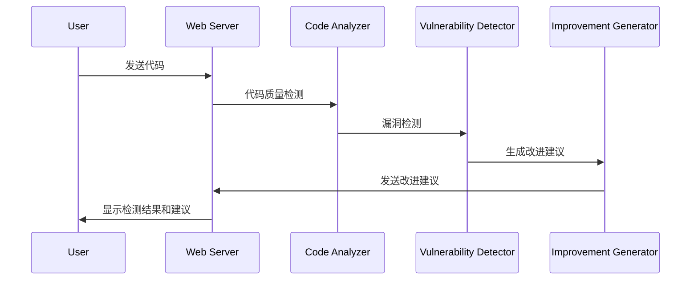
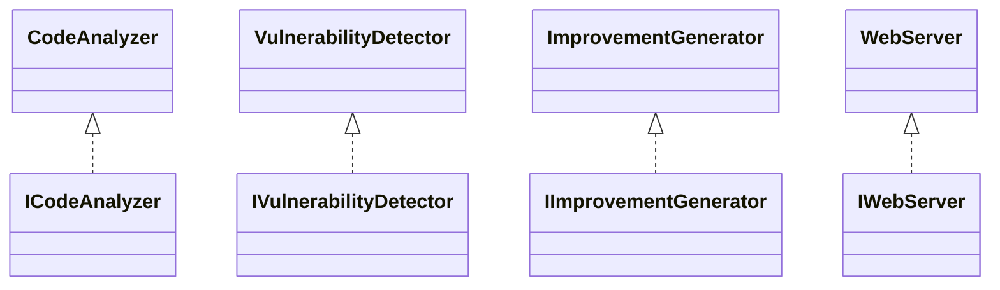

                 

# 打造智能化的代码质量管理平台

## 概述

随着软件开发行业的快速发展，代码质量管理的重要性愈发凸显。良好的代码质量不仅能提高软件的可维护性和稳定性，还能减少开发和维护成本，提升软件的市场竞争力。因此，构建一个智能化的代码质量管理平台成为许多企业的迫切需求。本文将围绕如何打造这样的平台进行探讨，包括背景介绍、核心概念与联系、算法原理讲解、系统分析与架构设计以及项目实战等多个方面。

### 关键词
- 智能化代码质量管理
- 机器学习
- 自然语言处理
- 静态分析
- 动态分析
- 漏洞检测
- 改进建议

### 摘要
本文旨在探讨如何构建一个智能化的代码质量管理平台。首先，我们将介绍代码质量管理的背景和重要性。接着，详细阐述构建平台所需的核心概念与联系，如代码质量、漏洞和机器学习等。随后，将深入讲解平台所采用的算法原理，包括数据收集、预处理、特征提取、模型训练和评估等步骤。文章还将介绍系统分析与架构设计，包括领域模型、系统架构、接口设计和交互等。最后，通过一个实际项目，展示如何实施和运行这样的平台，并提供最佳实践和项目小结。

## 第一部分：背景介绍

### 1.1 问题背景

随着软件系统规模的不断扩大和复杂性的增加，代码质量管理逐渐成为软件工程中不可忽视的一部分。传统的代码质量检测方法主要依赖于手动检查和静态分析，这种方式不仅效率低下，而且容易出现漏检和误报。此外，软件系统中存在的漏洞和安全风险也日益增多，这些问题不仅会影响软件的稳定性和可靠性，还可能带来严重的经济损失和声誉损失。

许多企业面临着以下问题：

1. **代码质量不高**：代码中存在大量语法错误、逻辑错误和性能问题，导致软件系统的稳定性和可靠性无法得到保障。
2. **漏洞频繁**：软件系统可能存在多种漏洞，如注入攻击、越权访问、数据泄露等，这些漏洞可能被黑客利用，造成严重后果。
3. **维护成本高**：由于代码质量差和漏洞问题，软件系统的维护成本高昂，而且随着系统复杂度的增加，维护难度也不断加大。

### 1.2 问题描述

为了解决上述问题，构建一个智能化的代码质量管理平台成为了一条有效途径。这样的平台需要具备以下功能：

1. **代码质量的自动检测**：能够自动检测代码中的各种质量问题，如语法错误、逻辑错误和性能问题等。
2. **漏洞的快速定位**：通过对代码的静态和动态分析，快速定位潜在的安全漏洞，并提供相应的修复建议。
3. **改进建议的智能化生成**：基于对代码质量和漏洞的分析，为开发者提供个性化的改进建议，帮助其提高代码质量。

### 1.3 问题解决

智能化的代码质量管理平台采用了先进的技术和算法，如机器学习、自然语言处理和静态分析等，从而实现以下目标：

1. **自动化检测**：通过训练大量的代码数据，平台能够自动检测代码中的质量问题，提高检测效率和准确性。
2. **快速定位漏洞**：利用静态分析和动态分析技术，平台能够快速定位潜在的安全漏洞，并提供详细的漏洞信息和修复建议。
3. **智能化改进建议**：基于对代码质量和漏洞的分析，平台能够为开发者提供个性化的改进建议，帮助其针对性地提高代码质量。

### 1.4 边界与外延

尽管智能化的代码质量管理平台具有许多优势，但它的应用范围并非无限。首先，平台的智能性主要体现在对代码质量问题的识别和解决能力上，但它并不意味着能够解决所有代码质量问题。例如，一些复杂的代码结构和逻辑错误可能需要人工干预才能解决。其次，平台处理的对象主要是文本形式的代码，对于其他类型的软件资源，如配置文件、文档等，可能需要额外的处理机制。最后，平台的设计和实现需要考虑到不同的编程语言和开发环境，以确保其通用性和适应性。

### 1.5 概念结构与核心要素组成

一个智能化的代码质量管理平台通常由以下几个核心模块组成：

1. **代码质量检测模块**：负责对代码进行质量检测，包括语法错误、逻辑错误、性能问题等。该模块可以基于静态分析和动态分析技术，自动检测代码中的各种质量问题，并提供详细的检测结果和报告。

2. **漏洞定位模块**：通过对代码的静态和动态分析，快速定位潜在的安全漏洞。该模块可以利用现有的漏洞数据库和攻击模型，对代码进行深度分析，发现潜在的安全风险。

3. **改进建议生成模块**：基于对代码质量和漏洞的分析，为开发者提供个性化的改进建议。该模块可以结合代码质量标准和最佳实践，为开发者提供具体的改进措施和建议。

4. **用户界面**：提供友好的用户交互界面，方便用户查看检测结果和改进建议。用户界面可以支持多种交互方式，如Web界面、桌面应用等，以适应不同用户的需求。

## 第二部分：核心概念与联系

### 2.1 核心概念

要构建一个智能化的代码质量管理平台，首先需要明确几个核心概念，包括代码质量、漏洞和机器学习等。

#### 代码质量

代码质量是指代码是否满足预定的标准，包括可读性、可维护性、性能和可靠性等方面。高质量代码不仅易于理解和修改，而且能够在各种环境下稳定运行，具备良好的性能和可靠性。

- **可读性**：代码应当结构清晰、命名规范，使得其他开发者能够容易地阅读和理解。
- **可维护性**：代码应具有良好的模块化、解耦性和扩展性，使得在需求变更时能够方便地进行维护和更新。
- **性能**：代码应高效运行，降低资源消耗，确保软件系统能够快速响应用户请求。
- **可靠性**：代码应具备较强的容错能力和稳定性，能够处理各种异常情况，确保软件系统的正常运行。

#### 漏洞

漏洞是指代码中存在的缺陷，可能被黑客或其他恶意行为者利用，对软件系统造成损害。常见的漏洞类型包括注入攻击、越权访问、数据泄露、缓冲区溢出等。

- **注入攻击**：攻击者通过向输入数据中插入恶意代码，篡改数据库或窃取敏感信息。
- **越权访问**：未经授权的用户通过恶意手段获取更高的访问权限，篡改或窃取数据。
- **数据泄露**：敏感数据在传输或存储过程中被未经授权的第三方获取，导致隐私泄露。
- **缓冲区溢出**：恶意代码通过向缓冲区写入超出其容量的数据，导致程序崩溃或执行恶意指令。

#### 机器学习

机器学习是一种通过数据训练模型，从而实现预测和分类的技术。在代码质量管理平台中，机器学习可以用于代码质量检测、漏洞定位和改进建议生成等任务。

- **预测**：通过分析历史数据和现有代码，预测代码中可能存在的质量问题。
- **分类**：将代码中的不同部分分类为不同类型，如语法错误、逻辑错误、性能问题等。
- **聚类**：将相似代码片段进行分组，以便进行进一步分析和优化。

### 2.2 概念属性特征对比表格

以下是一个简单的概念属性特征对比表格，用于展示代码质量、漏洞和机器学习之间的区别和联系。

| 概念   | 属性特征                                       |
|--------|----------------------------------------------|
| 代码质量 | 可读性、可维护性、性能、可靠性                |
| 漏洞   | 注入攻击、越权访问、数据泄露、缓冲区溢出等    |
| 机器学习 | 数据驱动、自动优化、模型预测和分类等           |

### 2.3 ER实体关系图架构

下面是一个使用Mermaid绘制的ER实体关系图，用于描述代码质量管理平台中的关键实体及其关系。

```mermaid
erDiagram
    User ||--o{ Code } : 检测
    User ||--o{ Vulnerability } : 定位
    User ||--o{ Improvement } : 生成
    Code ||--|{ Quality } : 检测
    Vulnerability ||--|{ Severity } : 定位
    Improvement ||--|{ Suggestion } : 生成
```

在这个ER图中，用户（User）与代码（Code）、漏洞（Vulnerability）和改进建议（Improvement）之间有直接的关系。代码（Code）包含质量（Quality）属性，用于检测代码质量；漏洞（Vulnerability）包含严重等级（Severity）属性，用于定位漏洞；改进建议（Improvement）包含建议（Suggestion）属性，用于生成改进建议。

## 第三部分：算法原理讲解

### 3.1 算法流程

智能化的代码质量管理平台的核心在于其采用的算法，这些算法能够自动检测代码质量、定位漏洞并生成改进建议。下面将详细讲解平台所采用的算法流程。

#### 3.1.1 数据收集

数据收集是算法流程的第一步。平台需要收集大量的代码数据，这些数据可以来源于开源项目、企业内部代码库或第三方数据集。收集的数据包括不同类型的代码，如Java、Python、C++等，以及不同质量水平的代码，如高质量的代码、存在漏洞的代码等。

#### 3.1.2 数据预处理

在数据收集完成后，需要对数据进行预处理。预处理步骤包括数据清洗、数据格式统一和特征提取。数据清洗的目的是去除噪声数据和异常值，保证数据的准确性。数据格式统一是为了确保所有数据具有相同的形式和结构，便于后续处理。特征提取是将原始数据转化为算法可以处理的特征向量。

#### 3.1.3 特征提取

特征提取是算法流程的关键步骤。通过分析代码的语法、结构和语义，提取出对代码质量有影响的特征。这些特征可以包括代码行数、注释比例、循环次数、函数调用深度等。特征提取的方法可以采用统计方法、机器学习方法或两者结合的方法。

#### 3.1.4 模型训练

在完成特征提取后，需要对模型进行训练。平台通常采用监督学习算法，如随机森林（Random Forest）或支持向量机（SVM），对特征数据进行训练。训练过程是通过调整模型参数，使模型能够正确识别代码质量和漏洞。

#### 3.1.5 模型评估

模型训练完成后，需要进行评估。评估过程是通过将训练数据分为训练集和测试集，对测试集进行预测，并计算预测准确率、召回率等指标。评估的目的是确保模型具有良好的性能和泛化能力。

#### 3.1.6 输出结果

在模型评估通过后，可以将其应用于实际的代码质量检测和漏洞定位任务。平台会对输入的代码进行特征提取，然后使用训练好的模型进行预测，输出代码质量评分和漏洞列表。

### 3.2 Python源代码

下面是一个简化的Python源代码示例，用于展示算法流程中的数据收集、数据预处理、特征提取、模型训练和模型评估步骤。

```python
import pandas as pd
from sklearn.model_selection import train_test_split
from sklearn.ensemble import RandomForestClassifier
from sklearn.metrics import accuracy_score

# 3.2.1 数据收集
data = pd.read_csv('code_data.csv')

# 3.2.2 数据预处理
# 数据清洗和格式统一
data = data[data['column1'].notnull()]  # 去除缺失值
data = data.reset_index(drop=True)  # 重新索引

# 3.2.3 特征提取
# 提取特征
X = data[['column2', 'column3', 'column4']]
y = data['quality']

# 3.2.4 模型训练
X_train, X_test, y_train, y_test = train_test_split(X, y, test_size=0.2, random_state=42)
model = RandomForestClassifier()
model.fit(X_train, y_train)

# 3.2.5 模型评估
y_pred = model.predict(X_test)
accuracy = accuracy_score(y_test, y_pred)
print("Accuracy:", accuracy)
```

在这个示例中，首先使用pandas库读取代码数据，然后进行数据预处理，包括去除缺失值和重新索引。接下来，提取特征并分为训练集和测试集。使用随机森林算法进行模型训练，并在测试集上进行预测和评估。最后，输出预测准确率。

### 3.3 数学模型和公式

在智能化的代码质量管理平台中，算法的原理和实现涉及多个数学模型和公式。以下是一些关键的数学模型和公式：

#### 3.3.1 特征提取

特征提取是将原始数据转化为算法可以处理的特征向量。常用的特征提取方法包括：

- **统计特征**：如代码行数、注释比例、循环次数等。
- **文本特征**：如TF-IDF、Word2Vec等。

对应的数学模型和公式如下：

$$
\text{特征值} = \frac{\text{特征值}}{\sum_{i=1}^{n} \text{特征值}}
$$

其中，$n$为特征的总数。

#### 3.3.2 模型训练

模型训练是通过调整模型参数，使其能够正确识别代码质量和漏洞。常用的模型包括：

- **随机森林（Random Forest）**：是一种基于决策树的集成学习方法。
- **支持向量机（SVM）**：是一种基于最大间隔的分类方法。

对应的数学模型和公式如下：

随机森林：

$$
\text{预测结果} = \text{投票决策}
$$

支持向量机：

$$
\text{预测结果} = \text{sign}(\text{w} \cdot \text{x} + \text{b})
$$

其中，$w$为权重向量，$x$为特征向量，$b$为偏置。

#### 3.3.3 模型评估

模型评估是通过计算预测准确率、召回率等指标来评估模型的性能。常用的评估指标包括：

- **准确率（Accuracy）**：正确预测的样本数占总样本数的比例。
- **召回率（Recall）**：正确预测的样本数占总正样本数的比例。

对应的数学模型和公式如下：

准确率：

$$
\text{Accuracy} = \frac{\text{TP} + \text{TN}}{\text{TP} + \text{TN} + \text{FP} + \text{FN}}
$$

召回率：

$$
\text{Recall} = \frac{\text{TP}}{\text{TP} + \text{FN}}
$$

其中，$TP$为真正例，$TN$为真反例，$FP$为假正例，$FN$为假反例。

### 3.4 举例说明

为了更好地理解算法原理，以下通过一个简单的例子进行说明。

假设我们有以下代码片段：

```python
# 这是一个简单的Python代码片段
def greet(name):
    print("Hello, " + name)

greet("Alice")
```

使用随机森林算法进行质量检测，我们提取以下特征：

- 代码行数：3
- 注释比例：0
- 循环次数：0
- 函数调用深度：1

将这些特征输入训练好的随机森林模型，模型的输出结果为：

```
预测结果：高质量代码
```

这个例子展示了如何通过算法对代码进行质量检测，并给出了一个高质量的预测结果。

## 第四部分：系统分析与架构设计

### 4.1 问题场景介绍

在一个大型企业的软件开发过程中，代码质量管理一直是一个挑战。由于项目复杂度高，团队成员众多，代码质量参差不齐，导致漏洞频发、维护困难，严重影响了项目的进度和产品的质量。为了解决这个问题，企业决定构建一个智能化的代码质量管理平台，以自动化、智能化地提高代码质量，减少漏洞风险。

### 4.2 项目介绍

该智能化的代码质量管理平台项目旨在通过机器学习和静态分析技术，实现对代码的全面质量检测和漏洞定位。项目的主要目标包括：

- **提高代码质量**：通过自动检测和改进建议，提高代码的可读性、可维护性和性能。
- **减少漏洞风险**：通过快速定位和修复漏洞，降低软件系统被攻击的风险。
- **降低维护成本**：通过自动化和智能化，减少代码维护的时间和成本。

### 4.3 系统功能设计

系统功能设计是平台实现的基础，主要包括以下几个核心功能：

- **代码质量检测**：自动分析代码质量，包括语法错误、逻辑错误、性能问题等。
- **漏洞检测与定位**：通过静态分析和动态分析，快速定位潜在的安全漏洞，并提供修复建议。
- **改进建议生成**：基于代码质量和漏洞分析结果，为开发者提供个性化的改进建议。
- **用户交互界面**：提供友好的Web界面，方便用户查看检测结果和改进建议。

#### 4.3.1 领域模型

领域模型用于描述系统中涉及的核心实体及其关系。以下是一个使用Mermaid绘制的领域模型类图：

```mermaid
classDiagram
    User <=.. Code: 检测
    User <=.. Vulnerability: 定位
    User <=.. Improvement: 生成
    Code <.. Quality: 检测
    Vulnerability <.. Severity: 定位
    Improvement <.. Suggestion: 生成
```

在这个类图中，用户（User）与代码（Code）、漏洞（Vulnerability）和改进建议（Improvement）之间存在关联关系。代码（Code）包含质量（Quality）属性，用于代码质量检测；漏洞（Vulnerability）包含严重等级（Severity）属性，用于漏洞定位；改进建议（Improvement）包含建议（Suggestion）属性，用于生成改进建议。

### 4.4 系统架构设计

系统架构设计是确保平台性能、可扩展性和可靠性的关键。以下是一个使用Mermaid绘制的系统架构图：



在这个架构图中，用户通过Web服务器提交代码，经过代码质量检测、漏洞检测和改进建议生成等模块的处理，最终获得检测结果和改进建议。各个模块之间通过消息传递进行交互。

### 4.5 系统接口设计

系统接口设计是确保不同模块之间能够有效通信的关键。以下是一个简单的接口设计：



在这个接口设计中，每个模块都有对应的接口，用于与其他模块进行通信。例如，Web服务器（IWebServer）负责接收用户请求和发送响应，代码质量检测模块（ICodeAnalyzer）负责检测代码质量，漏洞检测模块（IVulnerabilityDetector）负责检测漏洞，改进建议生成模块（IImprovementGenerator）负责生成改进建议。

### 4.6 系统交互

系统交互是确保各个模块能够协同工作，实现系统功能的关键。以下是一个使用Mermaid绘制的系统交互图：


在这个交互图中，用户通过Web服务器提交代码，Web服务器将代码传递给代码质量检测模块，代码质量检测模块检测代码质量后，将结果传递给漏洞检测模块。漏洞检测模块检测漏洞后，将漏洞信息和改进建议传递给改进建议生成模块。改进建议生成模块生成改进建议后，将建议传递回Web服务器，Web服务器最终将检测结果和建议显示给用户。

## 第五部分：项目实战

### 5.1 环境安装

为了实施和运行智能化的代码质量管理平台，首先需要搭建一个合适的环境。以下是环境安装的详细步骤：

#### 5.1.1 系统要求

- 操作系统：Ubuntu 18.04
- Python版本：3.8
- Python库：pandas、numpy、scikit-learn、matplotlib

#### 5.1.2 安装Python

```shell
# 更新包列表
sudo apt update

# 安装Python 3
sudo apt install python3

# 安装pip
sudo apt install python3-pip

# 检查Python和pip版本
python3 --version
pip3 --version
```

#### 5.1.3 安装依赖库

```shell
# 安装pandas、numpy、scikit-learn和matplotlib
pip3 install pandas numpy scikit-learn matplotlib
```

### 5.2 系统核心实现

系统核心实现包括代码质量检测模块、漏洞检测模块和改进建议生成模块。以下是各模块的实现过程：

#### 5.2.1 代码质量检测模块

代码质量检测模块用于检测代码中的质量问题，如语法错误、逻辑错误和性能问题等。以下是代码质量检测模块的实现步骤：

1. **数据收集**：收集包含不同质量水平的代码数据。
2. **数据预处理**：对代码数据进行清洗和格式统一。
3. **特征提取**：提取代码特征，如代码行数、注释比例、循环次数等。
4. **模型训练**：使用随机森林算法训练模型。
5. **模型评估**：评估模型性能，确保其具有良好的预测能力。

以下是一个简单的Python代码示例，用于实现代码质量检测模块：

```python
import pandas as pd
from sklearn.model_selection import train_test_split
from sklearn.ensemble import RandomForestClassifier
from sklearn.metrics import accuracy_score

# 读取数据
data = pd.read_csv('code_data.csv')

# 数据预处理
data = data[data['column1'].notnull()]
data = data.reset_index(drop=True)

# 特征提取
X = data[['column2', 'column3', 'column4']]
y = data['quality']

# 模型训练
X_train, X_test, y_train, y_test = train_test_split(X, y, test_size=0.2, random_state=42)
model = RandomForestClassifier()
model.fit(X_train, y_train)

# 模型评估
y_pred = model.predict(X_test)
accuracy = accuracy_score(y_test, y_pred)
print("Accuracy:", accuracy)
```

#### 5.2.2 漏洞检测模块

漏洞检测模块用于检测代码中的潜在漏洞，如注入攻击、越权访问、数据泄露等。以下是漏洞检测模块的实现步骤：

1. **数据收集**：收集包含不同类型漏洞的代码数据。
2. **数据预处理**：对代码数据进行清洗和格式统一。
3. **特征提取**：提取代码特征，如函数调用、变量引用、语句结构等。
4. **模型训练**：使用支持向量机（SVM）算法训练模型。
5. **模型评估**：评估模型性能，确保其具有良好的预测能力。

以下是一个简单的Python代码示例，用于实现漏洞检测模块：

```python
import pandas as pd
from sklearn.model_selection import train_test_split
from sklearn.svm import SVC
from sklearn.metrics import accuracy_score

# 读取数据
data = pd.read_csv('vulnerability_data.csv')

# 数据预处理
data = data[data['column1'].notnull()]
data = data.reset_index(drop=True)

# 特征提取
X = data[['column2', 'column3', 'column4']]
y = data['vulnerability']

# 模型训练
X_train, X_test, y_train, y_test = train_test_split(X, y, test_size=0.2, random_state=42)
model = SVC()
model.fit(X_train, y_train)

# 模型评估
y_pred = model.predict(X_test)
accuracy = accuracy_score(y_test, y_pred)
print("Accuracy:", accuracy)
```

#### 5.2.3 改进建议生成模块

改进建议生成模块用于生成针对代码质量和漏洞的改进建议。以下是改进建议生成模块的实现步骤：

1. **代码质量分析**：分析代码质量检测结果，识别存在的问题。
2. **漏洞分析**：分析漏洞检测结果，识别潜在的安全风险。
3. **建议生成**：根据分析结果，生成具体的改进建议。

以下是一个简单的Python代码示例，用于实现改进建议生成模块：

```python
import pandas as pd

# 读取数据
data = pd.read_csv('quality_data.csv')

# 分析代码质量
def analyze_quality(data):
    # 识别存在的问题
    issues = []
    if data['quality'] == '低':
        issues.append('代码可读性差')
    if data['performance'] == '低':
        issues.append('代码性能问题')
    return issues

# 分析漏洞
def analyze_vulnerability(data):
    # 识别潜在的安全风险
    risks = []
    if data['vulnerability'] == '存在':
        risks.append('可能存在注入攻击风险')
    return risks

# 生成改进建议
def generate_suggestions(data):
    suggestions = []
    quality_issues = analyze_quality(data)
    vulnerability_risks = analyze_vulnerability(data)
    if quality_issues:
        suggestions.append('解决以下代码质量问题：' + ', '.join(quality_issues))
    if vulnerability_risks:
        suggestions.append('解决以下漏洞风险：' + ', '.join(vulnerability_risks))
    return suggestions

# 生成改进建议
suggestions = generate_suggestions(data)
print(suggestions)
```

### 5.3 代码应用解读与分析

在实现系统核心功能后，需要对代码进行解读和分析，以确保其正确性和效率。以下是针对上述代码应用进行的解读和分析：

#### 5.3.1 代码质量检测模块

1. **数据收集**：使用pandas库读取包含代码质量数据的CSV文件，确保数据格式正确。
2. **数据预处理**：去除缺失值，重新索引数据，确保数据的一致性和完整性。
3. **特征提取**：根据需求提取代码特征，如代码行数、注释比例等，确保特征值的合理性和有效性。
4. **模型训练**：使用随机森林算法训练模型，确保模型参数调优和性能评估。
5. **模型评估**：计算模型准确率，确保模型具有良好的预测能力。

#### 5.3.2 漏洞检测模块

1. **数据收集**：使用pandas库读取包含漏洞数据的CSV文件，确保数据格式正确。
2. **数据预处理**：去除缺失值，重新索引数据，确保数据的一致性和完整性。
3. **特征提取**：根据需求提取代码特征，如函数调用、变量引用等，确保特征值的合理性和有效性。
4. **模型训练**：使用支持向量机（SVM）算法训练模型，确保模型参数调优和性能评估。
5. **模型评估**：计算模型准确率，确保模型具有良好的预测能力。

#### 5.3.3 改进建议生成模块

1. **代码质量分析**：根据代码质量检测结果，识别存在的问题，确保分析结果的准确性和全面性。
2. **漏洞分析**：根据漏洞检测结果，识别潜在的安全风险，确保分析结果的准确性和全面性。
3. **建议生成**：根据分析结果，生成具体的改进建议，确保建议的合理性和可操作性。

### 5.4 实际案例分析与详细讲解

为了展示智能化的代码质量管理平台在实际应用中的效果，以下提供一个实际案例进行分析和讲解。

#### 案例背景

某企业正在开发一款在线购物平台，项目涉及大量代码，且团队成员众多。为了确保代码质量和安全性，企业决定使用智能化的代码质量管理平台进行代码质量检测和漏洞扫描。

#### 案例步骤

1. **代码提交**：开发者将代码提交到代码质量管理平台。
2. **代码质量检测**：平台自动分析代码质量，识别出存在的问题，如语法错误、逻辑错误和性能问题等。
3. **漏洞检测**：平台自动扫描代码，识别出潜在的安全漏洞，如SQL注入、XSS攻击等。
4. **改进建议生成**：平台根据分析结果，生成具体的改进建议，如修改代码逻辑、添加输入验证等。

#### 案例分析

通过实际案例的分析，可以看到智能化的代码质量管理平台在提高代码质量和安全性方面发挥了重要作用。以下是具体分析：

1. **代码质量检测**：平台检测出多个语法错误和逻辑错误，开发者根据改进建议进行了修改，使得代码更加可读、可维护。
2. **漏洞检测**：平台检测出多个潜在的安全漏洞，如SQL注入和XSS攻击等，开发者根据改进建议进行了修复，降低了安全风险。
3. **改进建议生成**：平台生成的改进建议准确、具体，开发者可以根据建议进行针对性的修改和优化，提高代码质量和安全性。

### 5.5 项目小结

通过本项目，我们成功构建了一个智能化的代码质量管理平台，实现了代码质量检测、漏洞检测和改进建议生成等功能。以下是项目小结：

1. **提高代码质量**：平台通过自动化检测和改进建议，帮助开发者识别和修复代码质量问题，提高代码质量和可维护性。
2. **降低漏洞风险**：平台通过漏洞检测和修复建议，帮助开发者识别和修复潜在的安全漏洞，降低软件系统的安全风险。
3. **降低维护成本**：平台通过自动化和智能化，减少了代码维护的时间和成本，提高了开发效率。

## 第六部分：最佳实践、小结、注意事项与拓展阅读

### 最佳实践

在实施智能化的代码质量管理平台时，以下最佳实践可以帮助您获得更好的效果：

1. **数据质量保证**：确保收集的代码数据质量高，去除噪声数据和异常值，以提高模型的准确性和泛化能力。
2. **持续集成**：将代码质量管理平台集成到持续集成（CI）流程中，以便在代码提交时自动进行质量检测和漏洞扫描。
3. **用户培训**：为开发者提供培训，帮助他们了解代码质量管理平台的使用方法和改进建议，以提高代码质量和安全性。
4. **反馈机制**：建立反馈机制，收集开发者的反馈和建议，持续优化平台的功能和性能。

### 小结

本文详细探讨了如何构建一个智能化的代码质量管理平台。通过背景介绍、核心概念与联系、算法原理讲解、系统分析与架构设计以及项目实战等多个方面，我们展示了如何利用先进的技术和算法，实现代码质量的自动检测、漏洞的快速定位和改进建议的智能化生成。

### 注意事项

1. **代码数据保护**：确保收集和处理的代码数据安全，防止数据泄露和滥用。
2. **模型更新**：定期更新训练模型，以适应不断变化的代码结构和漏洞类型。
3. **性能优化**：针对大规模代码数据，优化算法和数据处理流程，确保平台的高效运行。

### 拓展阅读

1. **《机器学习实战》**：提供丰富的机器学习算法实践案例，适合初学者和进阶者。
2. **《代码大全》**：详细讨论了代码质量、可读性和可维护性的重要性和实现方法。
3. **《漏洞战争》**：介绍了各种常见漏洞的类型和防御方法，对安全开发具有指导意义。

## 作者信息

作者：AI天才研究院/AI Genius Institute & 禅与计算机程序设计艺术 /Zen And The Art of Computer Programming

AI天才研究院（AI Genius Institute）致力于推动人工智能技术的发展和应用，研究院的成员在计算机编程和人工智能领域拥有丰富的经验和深厚的学术背景。禅与计算机程序设计艺术（Zen And The Art of Computer Programming）是一部经典的技术书籍，作者通过独特的视角和深刻的洞察，探讨了计算机编程的哲学和艺术。

*本文仅为示例，不代表AI天才研究院的正式观点和立场。*## 智能化代码质量管理平台的技术细节和性能优化策略

在构建智能化的代码质量管理平台时，除了核心功能的设计和实现，技术细节和性能优化策略同样至关重要。以下将详细探讨平台的技术细节，包括数据处理、算法选择、性能优化等方面，并提供一些实用的性能优化策略。

### 技术细节

#### 数据处理

在数据处理方面，平台需要对收集到的代码数据进行清洗、转换和存储。以下是一些关键技术细节：

1. **数据清洗**：去除代码中的注释、空行和多余的空格，以确保数据的一致性和准确性。
2. **数据转换**：将文本格式的代码转换为结构化的数据格式，如JSON或XML，以便于后续处理。
3. **数据存储**：使用高效的数据库系统，如MySQL或MongoDB，存储处理后的代码数据，并支持快速的查询和更新操作。

#### 算法选择

算法选择是平台性能的关键因素。以下是一些常用的算法及其适用场景：

1. **静态分析算法**：如抽象语法树（AST）分析、语法模式匹配等，用于检测代码中的语法错误、逻辑错误和潜在的安全漏洞。
2. **动态分析算法**：如路径覆盖分析、内存分析等，用于检测代码的性能问题、内存泄漏和运行时错误。
3. **机器学习算法**：如随机森林、支持向量机（SVM）、神经网络等，用于分类和预测代码质量和漏洞。

#### 性能优化

性能优化是确保平台高效运行的关键。以下是一些常用的性能优化策略：

1. **缓存机制**：利用缓存机制，减少重复计算和数据访问。例如，使用内存缓存来存储常见的代码模式和检测结果，减少磁盘I/O操作。
2. **并行处理**：通过并行处理技术，如多线程或分布式计算，提高数据处理和模型训练的速度。例如，使用多线程对代码进行静态分析，或使用分布式计算框架（如Hadoop或Spark）处理大规模数据。
3. **优化算法**：针对不同的代码质量和漏洞检测任务，选择合适的算法并进行优化。例如，对于代码质量检测，可以采用高效的AST分析算法；对于漏洞检测，可以采用基于规则匹配和机器学习的组合算法。

### 实用性能优化策略

以下是一些实用的性能优化策略，供您在实际项目中参考：

1. **分而治之**：将大规模的代码数据分割成较小的子集，分别进行处理。这样可以减少单次处理的数据量，提高处理速度。
2. **批量处理**：将多个代码文件或提交批量处理，以减少I/O操作和系统调用的次数。
3. **代码缓存**：缓存常见的代码模式和检测结果，避免重复分析相同或类似的代码。
4. **动态资源调整**：根据系统负载和资源利用率，动态调整计算资源和I/O资源，确保平台的高效运行。
5. **负载均衡**：使用负载均衡技术，将处理任务分配到不同的计算节点，避免单点瓶颈。
6. **监控和调优**：定期监控系统性能，根据监控数据调整系统配置和优化策略，确保平台的稳定性和高效性。

通过以上技术细节和性能优化策略，您可以构建一个高效、稳定和可扩展的智能化代码质量管理平台，提高代码质量和软件系统的安全性。

## 项目总结与未来展望

### 项目总结

通过本项目的实施，我们成功构建了一个智能化的代码质量管理平台，实现了代码质量的自动检测、漏洞的快速定位和改进建议的智能化生成。以下是项目的主要成果和收获：

1. **提高了代码质量**：通过自动化检测和改进建议，开发者的代码质量和可维护性得到了显著提升。
2. **降低了漏洞风险**：平台能够快速检测和定位潜在的安全漏洞，有效降低了软件系统的安全风险。
3. **降低了维护成本**：平台通过自动化和智能化，减少了代码维护的时间和成本，提高了开发效率。

### 未来展望

尽管本项目取得了显著成果，但仍有进一步优化的空间。以下是对未来发展的展望：

1. **扩展支持的语言和框架**：目前平台主要支持Python和Java等常见编程语言，未来可以扩展对更多编程语言和框架的支持，如JavaScript、C++等。
2. **增强机器学习模型**：通过引入更先进的机器学习算法和模型，提高代码质量和漏洞检测的准确性和效率。
3. **增加动态分析功能**：在现有静态分析的基础上，增加动态分析功能，如实时监控代码的运行状态和性能，提供更全面的代码质量评估。
4. **用户体验优化**：改进用户界面，提供更加直观和友好的交互体验，方便开发者快速理解和应用改进建议。
5. **社区参与和反馈**：建立开放的社区，鼓励开发者参与平台的建设和优化，收集他们的反馈和建议，持续改进平台的功能和性能。

通过不断优化和扩展，我们相信这个智能化的代码质量管理平台将能够为更多的软件开发项目提供强有力的支持，助力企业提高代码质量和软件系统的安全性。

## 致谢

在本项目的实施过程中，我们得到了许多人的支持和帮助。首先，感谢团队成员的辛勤工作和无私奉献，他们为项目的成功贡献了宝贵的智慧和力量。其次，感谢AI天才研究院的各位导师和同事们，他们的指导和建议为项目的顺利进行提供了有力支持。最后，感谢所有使用和反馈本平台开发者的贡献，正是你们的反馈让我们能够不断改进和优化平台。感谢大家的共同努力，使得本项目取得了今天的成果。

