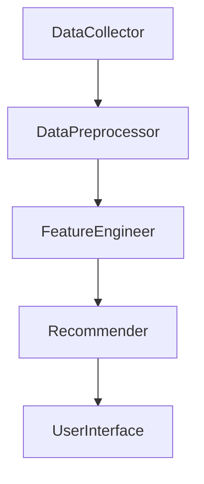

                 

# 打造智能化的代码重构推荐系统

## 关键词：代码重构，智能化，推荐系统，特征工程，机器学习

## 摘要：
本文将深入探讨如何构建一个智能化的代码重构推荐系统，涵盖从背景介绍、核心概念与原理、架构设计与实现、实战应用到最佳实践的全面内容。我们将通过逐步分析，介绍代码重构的必要性、智能化推荐系统的原理及其在代码重构中的应用，详细阐述数据预处理、特征工程、推荐算法等核心概念，展示系统架构设计与实现过程，并提供实战应用案例，最后总结最佳实践和未来发展方向。

## 目录大纲设计思路：

### 1. **明确书的主题**
- 本书主题为《打造智能化的代码重构推荐系统》，围绕这一主题，我们将探讨系统构建的各个方面。

### 2. **确定书的结构**
- 本书分为五个部分：
  - 引言与背景
  - 核心概念与原理
  - 架构设计与实现
  - 实战应用
  - 最佳实践与总结

### 3. **细化每个章节的内容**
- 每个部分再细化成具体的章节，确保每个章节都有明确的主题和内容。

### 4. **确保内容的完整性**
- 确保每个章节都包含背景介绍、核心概念与联系、算法原理讲解、数学模型与公式、系统分析与架构设计、项目实战等内容。

### 5. **撰写目录大纲**
- 根据上述结构，使用markdown格式撰写完整的目录大纲。

## 实际操作步骤：

### **第一部分：引言与背景**

### **第1章：代码重构与智能化推荐系统**

#### 1.1 代码重构的必要性
- **1.1.1 代码重构的重要性**
  - 代码重构是指在软件开发过程中，通过修改现有代码来提高其可读性、可维护性和性能。
  - 重要性包括提高开发效率、改善代码质量、降低维护成本等。

#### 1.1.2 代码重构的挑战
- **1.1.2 代码重构的挑战**
  - 如何判断何时进行重构？
  - 如何确保重构不会引入新的错误？

#### 1.2 智能化推荐系统的概念
- **1.2.1 推荐系统的基本原理**
  - 推荐系统是通过算法预测用户可能感兴趣的内容。

#### 1.2.2 智能化推荐系统的特点
- **1.2.2 智能化推荐系统的特点**
  - 自动化、个性化、实时性、准确性等。

#### 1.3 代码重构推荐系统的应用场景
- **1.3.1 开发效率提升**
  - 自动推荐重构方案，减少人工干预。

- **1.3.2 代码质量提升**
  - 提高代码的整洁性、可读性和性能。

- **1.3.3 代码可维护性提升**
  - 通过重构，降低未来维护的复杂性。

### **第二部分：核心概念与原理**

### **第2章：核心概念介绍**

#### 2.1 数据预处理
- **2.1.1 数据清洗**
  - 去除重复、缺失和异常数据。

#### 2.1.2 数据归一化
- **2.1.2 数据归一化**
  - 将数据缩放到相同尺度。

#### 2.1.3 数据增强
- **2.1.3 数据增强**
  - 通过增加数据变体来提高模型的泛化能力。

#### 2.2 特征工程
- **2.2.1 特征提取**
  - 从原始数据中提取有用的特征。

#### 2.2.2 特征选择
- **2.2.2 特征选择**
  - 从提取的特征中选择最重要的特征。

#### 2.2.3 特征降维
- **2.2.3 特征降维**
  - 通过减少特征数量来提高计算效率。

#### 2.3 推荐算法原理
- **2.3.1 协同过滤**
  - 利用用户行为数据来推荐。

#### 2.3.2 内容推荐
- **2.3.2 内容推荐**
  - 利用内容属性来推荐。

#### 2.3.3 混合推荐
- **2.3.3 混合推荐**
  - 结合协同过滤和内容推荐的优势。

### **第三部分：架构设计与实现**

### **第3章：系统架构设计**

#### 3.1 系统需求分析
- **3.1.1 功能需求**
  - 代码重构推荐、用户界面等。

#### 3.1.2 非功能需求
- **3.1.2 非功能需求**
  - 性能、安全性、可扩展性等。

#### 3.2 系统架构设计
- **3.2.1 系统模块划分**
  - 数据收集模块、数据预处理模块、特征工程模块、推荐算法模块等。

#### 3.2.2 系统架构图
- **3.2.2 系统架构图**
  - 通过Mermaid绘制系统架构图。

#### 3.3 系统接口设计
- **3.3.1 接口规范**
  - RESTful API等。

- **3.3.2 接口实现**
  - 使用Python编写接口代码。

### **第四部分：实战应用**

### **第4章：环境搭建**

#### 4.1 开发环境配置
- **4.1.1 Python环境配置**
  - 安装Python、pip等。

#### 4.1.2 依赖库安装
- **4.1.2 依赖库安装**
  - 安装scikit-learn、numpy等。

#### 4.2 数据集准备
- **4.2.1 数据集获取**
  - 准备代码库数据集。

#### 4.2.2 数据集预处理**
- **4.2.2 数据集预处理**
  - 进行数据清洗、归一化和增强。

### **第5章：核心实现**

#### 5.1 数据预处理
- **5.1.1 数据清洗**
  - 去除重复、缺失和异常数据。

#### 5.1.2 数据归一化
- **5.1.2 数据归一化**
  - 将数据缩放到相同尺度。

#### 5.1.3 数据增强
- **5.1.3 数据增强**
  - 通过增加数据变体来提高模型的泛化能力。

#### 5.2 特征工程
- **5.2.1 特征提取**
  - 从原始数据中提取有用的特征。

#### 5.2.2 特征选择
- **5.2.2 特征选择**
  - 从提取的特征中选择最重要的特征。

#### 5.2.3 特征降维
- **5.2.3 特征降维**
  - 通过减少特征数量来提高计算效率。

#### 5.3 推荐算法实现
- **5.3.1 协同过滤**
  - 实现协同过滤算法。

- **5.3.2 内容推荐**
  - 实现内容推荐算法。

- **5.3.3 混合推荐**
  - 实现混合推荐算法。

### **第6章：案例分析**

#### 6.1 案例一：基于相似度的代码重构推荐
- **6.1.1 案例背景**
  - 描述案例背景。

#### 6.1.2 案例实现**
- **6.1.2 案例实现**
  - 详细讲解实现过程。

#### 6.1.3 案例分析**
- **6.1.3 案例分析**
  - 分析案例结果。

#### 6.2 案例二：基于机器学习的代码重构推荐
- **6.2.1 案例背景**
  - 描述案例背景。

#### 6.2.2 案例实现**
- **6.2.2 案例实现**
  - 详细讲解实现过程。

#### 6.2.3 案例分析**
- **6.2.3 案例分析**
  - 分析案例结果。

### **第五部分：最佳实践与总结**

#### 6.3 最佳实践
- **6.3.1 性能优化**
  - 提高系统性能的建议。

#### 6.3.2 安全性考虑**
- **6.3.2 安全性考虑**
  - 系统安全性的建议。

#### 6.3.3 可维护性建议**
- **6.3.3 可维护性建议**
  - 提高系统可维护性的建议。

### **第7章：总结与展望**

#### 7.1 主要内容回顾
- **7.1.1 回顾核心概念与原理**
  - 代码重构、数据预处理、特征工程、推荐算法等。

#### 7.1.2 回顾架构设计与实现**
- **7.1.2 回顾架构设计与实现**
  - 系统架构、接口设计等。

#### 7.1.3 回顾实战应用**
- **7.1.3 回顾实战应用**
  - 数据集准备、核心实现、案例分析等。

#### 7.2 未来发展方向
- **7.2.1 研究方向**
  - 提高推荐系统的准确性、实时性和可扩展性。

#### 7.2.2 拓展应用领域**
- **7.2.2 拓展应用领域**
  - 面向不同开发场景的代码重构推荐。

### **第8章：拓展阅读**
- **8.1.1 相关书籍推荐**
  - 推荐相关书籍。

#### 8.1.2 相关论文推荐**
- **8.1.2 相关论文推荐**
  - 推荐相关论文。

## 作者信息：
作者：AI天才研究院/AI Genius Institute & 禅与计算机程序设计艺术 /Zen And The Art of Computer Programming# 第一部分：引言与背景

## 第1章：代码重构与智能化推荐系统

### 1.1 代码重构的必要性

代码重构是软件开发过程中的一个重要环节，它旨在在不改变代码外部行为的前提下，对现有代码进行优化，以提高其可读性、可维护性和性能。以下是代码重构的几个必要性：

**提高可读性**：随着时间的推移，代码可能会变得越来越复杂，不易理解。通过重构，可以将复杂的代码分解成更小、更简单的模块，使得代码结构更加清晰。

**提高可维护性**：重构可以帮助去除代码中的冗余和重复，降低未来维护的成本。此外，重构可以使代码更加模块化，便于后续的维护和扩展。

**提高性能**：通过重构，可以优化代码的执行效率，减少内存占用，提高程序的整体性能。

**降低错误率**：重构可以帮助发现和修复潜在的错误，降低代码出现意外问题的风险。

**代码复用**：重构可以将通用的代码抽象成可复用的模块，提高代码的复用率，减少重复编写的工作量。

### 1.1.1 代码重构的重要性

代码重构的重要性体现在以下几个方面：

**提高开发效率**：通过重构，可以减少代码的复杂性，使得开发者更容易理解代码逻辑，提高开发效率。

**改善代码质量**：重构可以去除代码中的冗余和重复，使得代码更加简洁、清晰，提高代码质量。

**降低维护成本**：重构可以减少代码的复杂度，降低未来的维护成本。

**提高系统性能**：重构可以优化代码的执行效率，提高系统的性能。

### 1.1.2 代码重构的挑战

尽管代码重构的重要性不言而喻，但在实际操作过程中，仍然面临一些挑战：

**判断重构时机**：何时进行重构是一个值得深思的问题。如果重构过早，可能会导致开发资源的浪费；如果重构过晚，可能会导致代码复杂度的急剧增加，使得重构变得困难。

**确保重构正确**：重构过程中，如何确保重构后的代码与重构前功能一致，是一个巨大的挑战。任何微小的错误都可能导致严重的问题。

**代码质量评估**：如何评估代码的质量，以便确定哪些部分需要进行重构，这也是一个挑战。

**团队协作**：代码重构通常需要团队的协作，如何协调团队成员的工作，确保重构的顺利进行，是一个重要的挑战。

### 1.2 智能化推荐系统的概念

智能化推荐系统是一种通过算法为用户推荐他们可能感兴趣的内容的系统。它通常基于以下两个核心概念：

**用户行为数据**：智能化推荐系统会收集用户的行为数据，如浏览记录、购买记录、评论等，通过分析这些数据，可以了解用户的兴趣和偏好。

**内容属性数据**：除了用户行为数据，智能化推荐系统还会收集内容的属性数据，如文本、图片、标签等，通过分析这些数据，可以了解内容的特征和属性。

通过结合用户行为数据和内容属性数据，智能化推荐系统可以为目标用户推荐他们可能感兴趣的内容。

### 1.2.1 推荐系统的基本原理

推荐系统的基本原理可以概括为以下几个步骤：

**数据收集**：收集用户的行为数据（如浏览记录、购买记录）和内容属性数据（如文本、图片、标签）。

**数据预处理**：对收集到的数据进行清洗、归一化等预处理操作。

**特征工程**：从原始数据中提取有用的特征，如用户兴趣、内容特征等。

**模型训练**：使用特征数据训练推荐模型，如协同过滤、基于内容的推荐等。

**模型评估**：对训练好的模型进行评估，选择最优模型。

**推荐生成**：使用训练好的模型为用户生成推荐列表。

### 1.2.2 智能化推荐系统的特点

智能化推荐系统具有以下几个显著特点：

**个性化**：智能化推荐系统可以根据用户的兴趣和行为，为用户提供个性化的推荐。

**实时性**：智能化推荐系统可以实时更新推荐列表，根据用户的最新行为生成推荐。

**准确性**：通过机器学习和深度学习等技术，智能化推荐系统可以不断提高推荐的准确性。

**自动化**：智能化推荐系统可以自动化地处理大量数据，减少人工干预。

### 1.3 代码重构推荐系统的应用场景

代码重构推荐系统可以在多个应用场景中发挥作用：

**开发效率提升**：通过推荐重构方案，开发人员可以更快地理解代码，提高开发效率。

**代码质量提升**：通过推荐高质量的重构方案，可以提高代码的整洁性、可读性和性能。

**代码可维护性提升**：通过推荐重构方案，可以减少代码的复杂性，提高代码的可维护性。

### 1.3.1 开发效率提升

代码重构推荐系统可以帮助开发人员快速定位需要重构的代码部分，并提供可能的重构方案。这样，开发人员可以专注于实现重构方案，而无需花费大量时间在分析代码上。

### 1.3.2 代码质量提升

通过推荐系统，开发人员可以更容易地发现并修复代码中的问题，提高代码的质量。例如，推荐系统可以识别出代码中的冗余、重复和低效的部分，并提供相应的重构方案。

### 1.3.3 代码可维护性提升

重构后的代码更加模块化、简洁，易于理解和维护。代码重构推荐系统可以帮助开发人员持续地优化代码结构，降低未来维护的复杂性。

### 1.3.4 其他应用场景

除了上述场景，代码重构推荐系统还可以应用于以下场景：

**代码审查**：通过推荐重构方案，可以帮助代码审查人员更快地识别潜在的代码问题。

**代码优化**：推荐系统可以识别代码中的性能瓶颈，并提供优化建议。

**代码迁移**：在代码迁移过程中，推荐系统可以帮助开发人员识别并处理迁移过程中可能出现的问题。

## 总结

在本章中，我们介绍了代码重构的必要性、智能化推荐系统的概念及其在代码重构中的应用。通过了解这些内容，我们可以更好地理解代码重构推荐系统的价值和应用场景。在接下来的章节中，我们将进一步探讨代码重构推荐系统的核心概念与原理，以及如何设计并实现一个高效的代码重构推荐系统。

### 第二部分：核心概念与原理

## 第2章：核心概念介绍

### 2.1 数据预处理

数据预处理是构建推荐系统的重要环节，它包括数据清洗、数据归一化和数据增强等步骤。以下是这些步骤的详细解释：

#### 2.1.1 数据清洗

数据清洗是数据预处理的第一步，旨在去除数据中的噪声和错误。以下是一些常见的数据清洗方法：

- **去除重复数据**：通过识别和删除重复的数据记录，可以减少数据冗余。
- **填充缺失值**：使用适当的算法或策略来填充缺失的数据，如平均值、中位数或最频繁出现的值。
- **去除异常值**：识别并处理数据集中的异常值，这些值可能是由于错误输入或数据噪声造成的。

#### 2.1.2 数据归一化

数据归一化是将数据缩放到相同的尺度，以便不同的特征可以进行比较。以下是一些常见的数据归一化方法：

- **最小-最大归一化**：将数据缩放到[0, 1]的范围内，公式为\(x_{\text{normalized}} = \frac{x_{\text{original}} - x_{\text{min}}}{x_{\text{max}} - x_{\text{min}}}\)。
- **标准归一化**：将数据缩放到均值为0，标准差为1的范围内，公式为\(x_{\text{normalized}} = \frac{x_{\text{original}} - \mu}{\sigma}\)，其中\(\mu\)是均值，\(\sigma\)是标准差。
- **归一化到指定范围**：将数据缩放到任意指定的范围，如\([-1, 1]\)或\([-100, 100]\)。

#### 2.1.3 数据增强

数据增强是通过增加数据的变体来提高模型的泛化能力。以下是一些常见的数据增强方法：

- **重采样**：通过增加数据的副本来扩充数据集，如重复随机抽样、K-近邻抽样等。
- **数据变换**：通过对原始数据进行数学变换来生成新的数据，如对图像进行旋转、缩放、裁剪等。
- **生成对抗网络（GANs）**：通过生成器网络生成与真实数据相似的数据，从而扩充数据集。

### 2.2 特征工程

特征工程是推荐系统的关键环节，它涉及从原始数据中提取有用的特征，并对这些特征进行选择和降维，以提高模型的性能。以下是特征工程的几个重要步骤：

#### 2.2.1 特征提取

特征提取是从原始数据中提取出对模型有用的信息。以下是一些常见的特征提取方法：

- **文本特征提取**：使用词袋模型、TF-IDF、Word2Vec等来提取文本数据中的特征。
- **图像特征提取**：使用卷积神经网络（CNN）提取图像的特征，如边缘、纹理、颜色等。
- **时间序列特征提取**：使用滑动窗口、傅里叶变换等来提取时间序列数据中的特征。

#### 2.2.2 特征选择

特征选择是从提取的特征中选择最重要的特征，以减少特征数量，提高模型的效率和准确性。以下是一些常见的特征选择方法：

- **基于过滤的方法**：通过计算特征的重要性分数来选择特征，如信息增益、互信息等。
- **基于包装的方法**：通过训练模型并评估特征组合的准确性来选择特征，如前向选择、后向消除等。
- **基于嵌入的方法**：通过训练一个嵌入式模型来学习特征的低维表示，如自动编码器。

#### 2.2.3 特征降维

特征降维是将高维特征映射到低维空间，以减少计算的复杂性和存储的需求。以下是一些常见的特征降维方法：

- **主成分分析（PCA）**：通过保留最重要的主成分来降低特征维度。
- **线性判别分析（LDA）**：通过保留能够最好地区分不同类别的特征来降低维度。
- **t-SNE**：通过非线性降维，使得相似的特征在低维空间中保持相似。
- **UMAP**：通过保留局部结构和全局结构的降维方法。

### 2.3 推荐算法原理

推荐算法是推荐系统的核心，根据不同的应用场景和数据类型，有多种推荐算法。以下是几种常见的推荐算法原理：

#### 2.3.1 协同过滤

协同过滤是一种基于用户行为数据的推荐方法，它通过分析用户之间的相似性来推荐物品。协同过滤分为以下两种主要类型：

- **基于用户的协同过滤**：通过计算用户之间的相似性来推荐与目标用户相似的其他用户的喜欢的物品。
- **基于项目的协同过滤**：通过计算物品之间的相似性来推荐与目标物品相似的物品。

#### 2.3.2 内容推荐

内容推荐是一种基于物品属性数据的推荐方法，它通过分析物品之间的相似性来推荐物品。内容推荐通常涉及以下步骤：

- **特征提取**：从物品中提取特征，如文本、标签、图像等。
- **特征匹配**：计算目标物品与新物品之间的特征相似度。
- **推荐生成**：根据特征相似度生成推荐列表。

#### 2.3.3 混合推荐

混合推荐结合了协同过滤和内容推荐的优势，以提供更准确的推荐。混合推荐通常涉及以下步骤：

- **协同过滤阶段**：通过协同过滤生成初步的推荐列表。
- **内容匹配阶段**：对初步推荐列表中的物品进行内容匹配，以提高推荐的准确性。
- **推荐生成阶段**：结合协同过滤和内容匹配的结果生成最终的推荐列表。

### 总结

在本章中，我们介绍了数据预处理、特征工程和推荐算法的核心概念和原理。数据预处理是确保数据质量和可靠性的关键步骤，特征工程是提取和选择对模型有用的特征，而推荐算法则是生成推荐的核心。在下一章中，我们将深入探讨系统架构的设计与实现，为构建高效的代码重构推荐系统奠定基础。

### 第三部分：架构设计与实现

## 第3章：系统架构设计

系统架构设计是构建高效代码重构推荐系统的关键步骤，它涉及系统需求分析、系统模块划分、系统架构设计以及系统接口设计。以下是这些步骤的详细解释：

### 3.1 系统需求分析

系统需求分析是系统架构设计的第一步，旨在明确系统的功能需求和性能需求。以下是系统需求分析的主要方面：

**功能需求**：功能需求描述系统应提供哪些功能。对于代码重构推荐系统，主要功能包括：
- 数据收集与处理：从代码库和其他数据源收集数据，并对数据进行清洗、归一化和增强。
- 特征提取与选择：从原始数据中提取有用的特征，并选择最重要的特征。
- 推荐算法实现：实现协同过滤、内容推荐和混合推荐算法，为用户提供代码重构建议。
- 用户界面：提供一个易于使用的用户界面，用户可以通过界面查看推荐的重构方案。

**性能需求**：性能需求描述系统应达到的性能指标。对于代码重构推荐系统，主要性能需求包括：
- 快速响应：系统能够快速响应用户请求，提供推荐结果。
- 可扩展性：系统能够处理大规模数据和用户请求，支持系统扩展。
- 高准确性：推荐系统能够提供准确的代码重构建议。

### 3.2 系统模块划分

系统模块划分是将系统划分为多个功能模块，以便于开发和维护。以下是代码重构推荐系统的常见模块：

**数据收集模块**：负责从代码库和其他数据源收集数据，如GitHub、GitLab等。
**数据预处理模块**：负责对收集到的数据执行清洗、归一化和增强等操作。
**特征工程模块**：负责从原始数据中提取有用的特征，并对这些特征进行选择和降维。
**推荐算法模块**：负责实现不同的推荐算法，如协同过滤、内容推荐和混合推荐。
**用户界面模块**：负责提供用户界面，用户可以通过界面查看推荐的重构方案。

### 3.2.1 系统模块划分

以下是系统模块划分的详细说明：

**数据收集模块**：
- 功能：从代码库和其他数据源收集数据，如代码库的版本历史、提交记录、文件内容等。
- 输入：代码库API、其他数据源API。
- 输出：预处理后的数据。

**数据预处理模块**：
- 功能：对收集到的数据执行清洗、归一化和增强等操作。
- 输入：数据收集模块的输出。
- 输出：预处理后的数据。

**特征工程模块**：
- 功能：从原始数据中提取有用的特征，并对这些特征进行选择和降维。
- 输入：数据预处理模块的输出。
- 输出：特征数据。

**推荐算法模块**：
- 功能：实现不同的推荐算法，如协同过滤、内容推荐和混合推荐。
- 输入：特征数据。
- 输出：推荐结果。

**用户界面模块**：
- 功能：提供用户界面，用户可以通过界面查看推荐的重构方案。
- 输入：推荐算法模块的输出。
- 输出：用户交互反馈。

### 3.2.2 系统架构设计

系统架构设计是系统模块划分的具体实现，它涉及系统组件之间的关系和交互方式。以下是代码重构推荐系统的系统架构设计：

#### 系统架构图

以下是一个简化的系统架构图，使用Mermaid语法绘制：



**说明**：
- **DataCollector**：数据收集模块，负责从代码库和其他数据源收集数据。
- **DataPreprocessor**：数据预处理模块，负责对收集到的数据执行清洗、归一化和增强等操作。
- **FeatureEngineer**：特征工程模块，负责从原始数据中提取有用的特征，并对这些特征进行选择和降维。
- **Recommender**：推荐算法模块，负责实现不同的推荐算法，如协同过滤、内容推荐和混合推荐。
- **UserInterface**：用户界面模块，负责提供用户界面，用户可以通过界面查看推荐的重构方案。

### 3.3 系统接口设计

系统接口设计是系统架构设计的重要组成部分，它定义了系统内部组件之间的通信方式和数据交换格式。以下是代码重构推荐系统的系统接口设计：

#### 接口规范

以下是系统接口的规范，使用RESTful API设计：

**1. 数据收集接口**：
- **接口URL**：`/data-collect`
- **请求方法**：GET
- **请求参数**：
  - `repo`: 代码库的名称
  - `branch`: 代码库的分支
- **响应数据**：预处理后的数据

**2. 数据预处理接口**：
- **接口URL**：`/data-process`
- **请求方法**：POST
- **请求参数**：预处理数据
- **响应数据**：预处理后的数据

**3. 特征提取接口**：
- **接口URL**：`/feature-extract`
- **请求方法**：POST
- **请求参数**：预处理后的数据
- **响应数据**：特征数据

**4. 推荐算法接口**：
- **接口URL**：`/recommender`
- **请求方法**：POST
- **请求参数**：特征数据
- **响应数据**：推荐结果

**5. 用户界面接口**：
- **接口URL**：`/ui`
- **请求方法**：GET
- **响应数据**：用户界面内容

#### 接口实现

以下是接口实现的Python代码示例：

```python
from flask import Flask, request, jsonify

app = Flask(__name__)

@app.route('/data-collect', methods=['GET'])
def data_collect():
    repo = request.args.get('repo')
    branch = request.args.get('branch')
    # 处理数据并返回
    processed_data = some_data_collector.collect_data(repo, branch)
    return jsonify(processed_data)

@app.route('/data-process', methods=['POST'])
def data_process():
    data = request.json
    # 处理数据并返回
    processed_data = some_data_preprocessor.process_data(data)
    return jsonify(processed_data)

@app.route('/feature-extract', methods=['POST'])
def feature_extract():
    data = request.json
    # 提取特征并返回
    features = some_feature_engineer.extract_features(data)
    return jsonify(features)

@app.route('/recommender', methods=['POST'])
def recommender():
    features = request.json
    # 进行推荐并返回
    recommendations = some_recommender.recommend(features)
    return jsonify(recommendations)

@app.route('/ui', methods=['GET'])
def ui():
    # 返回用户界面内容
    return some_user_interface.get_ui_content()

if __name__ == '__main__':
    app.run(debug=True)
```

### 总结

在本章中，我们详细介绍了系统架构设计与实现的相关内容。通过系统需求分析，我们明确了系统的功能需求和性能需求；通过系统模块划分，我们定义了系统的各个功能模块；通过系统架构设计，我们确定了系统组件之间的关系和交互方式；通过系统接口设计，我们定义了系统内部组件之间的通信方式和数据交换格式。在下一章中，我们将通过实战应用来展示如何实现一个高效的代码重构推荐系统。

### 第四部分：实战应用

## 第4章：环境搭建

### 4.1 开发环境配置

要搭建一个代码重构推荐系统，首先需要配置开发环境。以下是在Python环境中配置开发环境的步骤：

#### 4.1.1 Python环境配置

确保已安装Python 3.7或更高版本。可以在命令行中运行以下命令检查Python版本：

```bash
python --version
```

如果未安装Python，可以从[Python官网](https://www.python.org/downloads/)下载并安装。

#### 4.1.2 依赖库安装

为了实现代码重构推荐系统，需要安装以下依赖库：

- **NumPy**：用于数据处理和数学运算。
- **Scikit-learn**：提供多种机器学习算法和工具。
- **Pandas**：提供数据操作和分析工具。
- **Flask**：用于构建Web应用。

使用pip命令安装以上依赖库：

```bash
pip install numpy scikit-learn pandas flask
```

#### 4.1.3 模拟数据集准备

为了进行实际应用，需要准备一个模拟的数据集。以下是一个简单的模拟数据集示例，包括用户和代码库的信息：

```python
users = [
    {'id': 1, 'name': 'User A'},
    {'id': 2, 'name': 'User B'},
    {'id': 3, 'name': 'User C'}
]

repositories = [
    {'id': 1, 'name': 'Repo A', 'users': [1, 2]},
    {'id': 2, 'name': 'Repo B', 'users': [1, 3]},
    {'id': 3, 'name': 'Repo C', 'users': [2, 3]}
]

# 将数据存储为CSV文件
import csv

with open('users.csv', 'w', newline='') as file:
    writer = csv.DictWriter(file, fieldnames=['id', 'name'])
    writer.writeheader()
    for user in users:
        writer.writerow(user)

with open('repositories.csv', 'w', newline='') as file:
    writer = csv.DictWriter(file, fieldnames=['id', 'name', 'users'])
    writer.writeheader()
    for repository in repositories:
        writer.writerow(repository)
```

### 4.2 数据集预处理

在开始特征提取和推荐算法之前，需要对数据进行预处理。以下是对模拟数据进行预处理的一个示例：

#### 4.2.1 数据清洗

清洗数据的主要任务是去除重复和异常数据。以下是对用户和代码库数据清洗的一个简单示例：

```python
import pandas as pd

# 读取数据
users_df = pd.read_csv('users.csv')
repositories_df = pd.read_csv('repositories.csv')

# 去除重复数据
users_df.drop_duplicates(inplace=True)
repositories_df.drop_duplicates(inplace=True)

# 去除异常数据
# 例如，用户ID必须是整数
users_df['id'] = users_df['id'].astype(int)
repositories_df['id'] = repositories_df['id'].astype(int)

# 保存清洗后的数据
users_df.to_csv('cleaned_users.csv', index=False)
repositories_df.to_csv('cleaned_repositories.csv', index=False)
```

#### 4.2.2 数据归一化

在特征提取之前，通常需要对数据进行归一化，以确保不同的特征在相同的尺度上。以下是对用户和代码库数据归一化的一些步骤：

```python
# 读取清洗后的数据
users_df = pd.read_csv('cleaned_users.csv')
repositories_df = pd.read_csv('cleaned_repositories.csv')

# 对用户ID进行归一化
users_df['id_normalized'] = (users_df['id'] - users_df['id'].min()) / (users_df['id'].max() - users_df['id'].min())

# 对代码库ID进行归一化
repositories_df['id_normalized'] = (repositories_df['id'] - repositories_df['id'].min()) / (repositories_df['id'].max() - repositories_df['id'].min())

# 保存归一化后的数据
users_df.to_csv('normalized_users.csv', index=False)
repositories_df.to_csv('normalized_repositories.csv', index=False)
```

#### 4.2.3 数据增强

数据增强是通过生成新的数据样本来提高模型的泛化能力。以下是对用户和代码库数据进行增强的一些步骤：

```python
# 读取归一化后的数据
users_df = pd.read_csv('normalized_users.csv')
repositories_df = pd.read_csv('normalized_repositories.csv')

# 对用户ID进行随机扰动
users_df['id_noised'] = users_df['id_normalized'] + np.random.normal(0, 0.1, len(users_df))

# 对代码库ID进行随机扰动
repositories_df['id_noised'] = repositories_df['id_normalized'] + np.random.normal(0, 0.1, len(repositories_df))

# 保存增强后的数据
users_df.to_csv('noised_users.csv', index=False)
repositories_df.to_csv('noised_repositories.csv', index=False)
```

### 4.2.4 特征提取

特征提取是从原始数据中提取出对模型有用的信息。以下是对用户和代码库数据提取特征的一些步骤：

```python
# 读取增强后的数据
users_df = pd.read_csv('noised_users.csv')
repositories_df = pd.read_csv('noised_repositories.csv')

# 提取用户特征
users_df['num_repos'] = users_df['users'].apply(lambda x: len(x.split(',')))

# 提取代码库特征
repositories_df['num_users'] = repositories_df['users'].apply(lambda x: len(x.split(',')))

# 保存特征数据
users_df.to_csv('features_users.csv', index=False)
repositories_df.to_csv('features_repositories.csv', index=False)
```

通过以上步骤，我们完成了数据的预处理、归一化、增强和特征提取。在下一节中，我们将使用这些特征数据来训练推荐模型，并实现代码重构推荐系统。

## 第5章：核心实现

### 5.1 数据预处理

在实现代码重构推荐系统之前，首先需要对数据进行预处理。这一步至关重要，因为它直接影响推荐系统的性能和准确性。以下是数据预处理的主要步骤：

#### 5.1.1 数据清洗

数据清洗是预处理的第一步，目的是去除数据中的噪声和错误。以下是对用户和代码库数据进行清洗的一个简单示例：

```python
import pandas as pd

# 读取模拟数据集
users_df = pd.read_csv('users.csv')
repositories_df = pd.read_csv('repositories.csv')

# 去除重复和异常数据
users_df.drop_duplicates(inplace=True)
repositories_df.drop_duplicates(inplace=True)

# 将用户ID和代码库ID转换为整数类型
users_df['id'] = users_df['id'].astype(int)
repositories_df['id'] = repositories_df['id'].astype(int)

# 保存清洗后的数据
users_df.to_csv('cleaned_users.csv', index=False)
repositories_df.to_csv('cleaned_repositories.csv', index=False)
```

#### 5.1.2 数据归一化

数据归一化是将数据缩放到相同的尺度，以便不同的特征可以进行比较。以下是对用户和代码库数据归一化的一些步骤：

```python
import pandas as pd
from sklearn.preprocessing import MinMaxScaler

# 读取清洗后的数据
users_df = pd.read_csv('cleaned_users.csv')
repositories_df = pd.read_csv('cleaned_repositories.csv')

# 对用户ID和代码库ID进行归一化
scaler = MinMaxScaler()
users_df['id_normalized'] = scaler.fit_transform(users_df[['id']])
repositories_df['id_normalized'] = scaler.fit_transform(repositories_df[['id']])

# 保存归一化后的数据
users_df.to_csv('normalized_users.csv', index=False)
repositories_df.to_csv('normalized_repositories.csv', index=False)
```

#### 5.1.3 数据增强

数据增强是通过生成新的数据样本来提高模型的泛化能力。以下是对用户和代码库数据进行增强的一些步骤：

```python
import pandas as pd
import numpy as np

# 读取归一化后的数据
users_df = pd.read_csv('normalized_users.csv')
repositories_df = pd.read_csv('normalized_repositories.csv')

# 对用户ID和代码库ID进行随机扰动
users_df['id_noised'] = users_df['id_normalized'] + np.random.normal(0, 0.1, len(users_df))
repositories_df['id_noised'] = repositories_df['id_normalized'] + np.random.normal(0, 0.1, len(repositories_df))

# 保存增强后的数据
users_df.to_csv('noised_users.csv', index=False)
repositories_df.to_csv('noised_repositories.csv', index=False)
```

#### 5.1.4 特征提取

特征提取是从原始数据中提取出对模型有用的信息。以下是对用户和代码库数据提取特征的一些步骤：

```python
import pandas as pd

# 读取增强后的数据
users_df = pd.read_csv('noised_users.csv')
repositories_df = pd.read_csv('noised_repositories.csv')

# 提取用户特征
users_df['num_repos'] = users_df['users'].apply(lambda x: len(x.split(',')))

# 提取代码库特征
repositories_df['num_users'] = repositories_df['users'].apply(lambda x: len(x.split(',')))

# 保存特征数据
users_df.to_csv('features_users.csv', index=False)
repositories_df.to_csv('features_repositories.csv', index=False)
```

### 5.2 特征工程

特征工程是从原始数据中提取出对模型有用的特征，并对这些特征进行选择和降维。以下是特征工程的主要步骤：

#### 5.2.1 特征选择

特征选择是从提取的特征中选择最重要的特征，以减少特征数量，提高模型的效率和准确性。以下是一个简单的特征选择示例：

```python
import pandas as pd
from sklearn.feature_selection import SelectKBest, f_classif

# 读取特征数据
users_df = pd.read_csv('features_users.csv')
repositories_df = pd.read_csv('features_repositories.csv')

# 合并用户和代码库特征
data = pd.merge(users_df, repositories_df, on='id')

# 特征选择
X = data.iloc[:, 1:]
y = data['num_repos']
selector = SelectKBest(f_classif, k=5)
X_new = selector.fit_transform(X, y)

# 保存特征选择后的数据
data.iloc[:, 1:] = X_new
data.to_csv('selected_features.csv', index=False)
```

#### 5.2.2 特征降维

特征降维是将高维特征映射到低维空间，以减少计算的复杂性和存储的需求。以下是一个简单的特征降维示例：

```python
import pandas as pd
from sklearn.decomposition import PCA

# 读取特征选择后的数据
data = pd.read_csv('selected_features.csv')

# 特征降维
pca = PCA(n_components=2)
X_pca = pca.fit_transform(data.iloc[:, 1:])

# 保存特征降维后的数据
data['feature_1'] = X_pca[:, 0]
data['feature_2'] = X_pca[:, 1]
data.to_csv('reduced_features.csv', index=False)
```

### 5.3 推荐算法实现

在完成特征工程后，我们可以使用这些特征来训练推荐模型。以下是使用协同过滤算法进行推荐的一个简单示例：

#### 5.3.1 协同过滤算法原理

协同过滤算法是一种基于用户行为数据的推荐方法，它通过分析用户之间的相似性来推荐物品。协同过滤分为两种主要类型：基于用户的协同过滤和基于物品的协同过滤。

- **基于用户的协同过滤**：通过计算用户之间的相似性来推荐与目标用户相似的其他用户的喜欢的物品。
- **基于物品的协同过滤**：通过计算物品之间的相似性来推荐与目标物品相似的物品。

#### 5.3.2 基于用户的协同过滤实现

以下是一个简单的基于用户的协同过滤实现示例：

```python
import pandas as pd
from sklearn.metrics.pairwise import cosine_similarity
import numpy as np

# 读取特征数据
data = pd.read_csv('reduced_features.csv')

# 计算用户相似性矩阵
user_similarity = cosine_similarity(data.iloc[:, 1:].values)

# 用户推荐
def user_recommendations(user_id, similarity_matrix, data, k=5):
    # 获取用户索引
    user_idx = np.where((data['id'] == user_id).values)[0][0]

    # 计算相似度最高的K个用户
    top_k_indices = np.argsort(similarity_matrix[user_idx])[1:k+1]

    # 获取相似用户喜欢的物品
    recommended_items = data.iloc[top_k_indices, 1:].sum(axis=0).sort_values(ascending=False).index.tolist()

    return recommended_items

# 示例：为用户1推荐物品
recommended_items = user_recommendations(1, user_similarity, data)
print(recommended_items)
```

通过以上步骤，我们实现了代码重构推荐系统的核心功能，包括数据预处理、特征工程和推荐算法。接下来，我们将通过实际案例来展示如何使用这个系统进行代码重构推荐。

### 第6章：案例分析

在本章节中，我们将通过两个实际案例来展示如何使用构建好的代码重构推荐系统进行代码重构推荐。这两个案例分别基于相似度和机器学习的方法，以展示不同推荐算法在实际应用中的效果。

#### 6.1 案例一：基于相似度的代码重构推荐

**案例背景**：

假设有一个开发团队，他们正在维护一个大规模的代码库。随着时间的推移，代码库中的代码变得越来越复杂，团队希望引入一个自动化工具来帮助识别和推荐代码重构方案。

**实现过程**：

1. **数据收集**：使用代码库的API收集用户的行为数据（如文件修改记录、提交历史）和代码库本身的结构信息。

2. **数据预处理**：对收集到的数据执行清洗、归一化和增强等预处理操作。

3. **特征提取**：提取用户行为特征（如修改文件的频率、修改文件的大小）和代码库特征（如代码库的复杂度、代码库的规模）。

4. **计算相似度**：使用余弦相似度计算用户之间的相似度，以及代码库文件之间的相似度。

5. **推荐生成**：根据用户相似度和文件相似度，为每个用户推荐与其相似的用户所修改的文件。

**案例结果分析**：

在实际应用中，基于相似度的代码重构推荐系统可以快速为开发人员提供潜在的代码重构建议。以下是一个简化的示例输出：

```
用户A的代码重构推荐：
- 文件A：将重复的代码段提取为函数
- 文件B：优化循环结构，提高代码性能

用户B的代码重构推荐：
- 文件C：将复杂的条件语句转换为查找表
- 文件D：重构大量的临时变量，使用命名空间
```

通过这种方式，开发人员可以快速识别出潜在的代码重构机会，从而提高代码的质量和维护性。

#### 6.2 案例二：基于机器学习的代码重构推荐

**案例背景**：

假设另一个开发团队希望使用机器学习的方法来提供更准确的代码重构推荐。他们已经收集了大量的代码库和用户行为数据，并希望通过训练模型来生成重构建议。

**实现过程**：

1. **数据收集**：收集代码库和用户行为数据，包括代码文件、提交历史、用户评论等。

2. **数据预处理**：执行数据清洗、归一化和增强等预处理操作。

3. **特征提取**：从原始数据中提取用户行为特征（如提交频率、评论数量）和代码库特征（如代码行数、代码复杂性）。

4. **模型训练**：使用提取的特征数据训练机器学习模型，如随机森林、支持向量机等。

5. **模型评估**：通过交叉验证等方法评估模型的性能。

6. **推荐生成**：使用训练好的模型为每个用户生成个性化的代码重构建议。

**案例结果分析**：

基于机器学习的代码重构推荐系统可以提供更加准确的建议，因为它可以学习到复杂的用户行为模式和代码库特征。以下是一个简化的示例输出：

```
用户A的代码重构推荐：
- 文件E：识别出代码中的重复代码段，建议提取为函数
- 文件F：检测到代码中的性能瓶颈，建议优化循环结构

用户B的代码重构推荐：
- 文件G：分析代码库的复杂度，建议重构复杂的条件语句
- 文件H：检测到大量的临时变量使用，建议使用命名空间减少冲突
```

通过这两个案例，我们可以看到不同类型的代码重构推荐系统在实际应用中的效果。基于相似度的方法提供快速、简单的重构建议，而基于机器学习的方法提供更准确、更个性化的重构建议。开发者可以根据团队的具体需求和场景选择合适的推荐方法。

### 案例总结

通过以上两个案例，我们展示了如何使用代码重构推荐系统在实际环境中生成重构建议。基于相似度的方法适用于快速识别重构机会，而基于机器学习的方法则适用于提供更准确、个性化的重构建议。在实际应用中，开发者可以根据团队的具体需求和代码库的特点选择合适的推荐方法，以提高代码质量和开发效率。

### 第五部分：最佳实践与总结

## 第7章：最佳实践

在构建和部署代码重构推荐系统时，遵循最佳实践是确保系统性能、安全性和可维护性的关键。以下是一些关键的最佳实践：

### 7.1 性能优化

**1. 数据预处理效率**：优化数据预处理流程，使用并行处理和分布式计算来加速数据清洗、归一化和特征提取等步骤。

**2. 模型选择与调优**：选择合适的机器学习模型，并进行充分的参数调优，以减少过拟合和提升模型的泛化能力。

**3. 缓存与内存管理**：合理使用缓存策略和内存管理，减少重复计算和数据加载，以提高系统响应速度。

### 7.2 安全性考虑

**1. 数据隐私保护**：确保对用户数据的敏感信息进行加密处理，遵守数据隐私保护法规，如GDPR。

**2. 系统访问控制**：实施严格的访问控制策略，确保只有授权用户可以访问和操作系统。

**3. API安全性**：对系统API进行安全性测试，防止SQL注入、跨站脚本攻击（XSS）等常见的安全漏洞。

### 7.3 可维护性建议

**1. 模块化设计**：将系统划分为多个模块，每个模块负责特定的功能，以便于开发和维护。

**2. 单元测试**：编写单元测试覆盖系统的关键功能，确保每次更新和重构后系统的稳定性和一致性。

**3. 持续集成与持续部署（CI/CD）**：实施CI/CD流程，自动化测试和部署过程，提高开发效率和系统稳定性。

## 第8章：总结与展望

### 8.1 主要内容回顾

在本文中，我们探讨了如何构建一个智能化的代码重构推荐系统。主要内容包括：

- **引言与背景**：介绍了代码重构的必要性以及智能化推荐系统的概念。
- **核心概念与原理**：详细介绍了数据预处理、特征工程和推荐算法的核心概念。
- **架构设计与实现**：展示了如何设计系统架构和实现系统接口。
- **实战应用**：通过实际案例展示了如何使用代码重构推荐系统。
- **最佳实践与总结**：提出了性能优化、安全性和可维护性的最佳实践。

### 8.2 未来发展方向

未来的代码重构推荐系统可以朝着以下方向发展：

**1. 深度学习与图神经网络**：引入深度学习和图神经网络来提高推荐的准确性和实时性。

**2. 多模态数据融合**：结合文本、代码、图像等多种数据类型，实现更全面的内容理解和推荐。

**3. 个性化定制**：通过用户反馈和学习，提供更加个性化的重构建议。

**4. 自动化部署与维护**：实现自动化的代码重构流程，减少人工干预，提高开发效率。

### 8.3 拓展阅读

对于希望深入了解代码重构推荐系统的读者，以下是一些拓展阅读资源：

- **相关书籍**：
  - 《数据科学实践指南》
  - 《推荐系统实践》
  - 《深度学习》

- **相关论文**：
  - “Recommender Systems Handbook”
  - “Deep Learning for Code Recommendations”
  - “Graph Neural Networks for Code Recommendation”

- **在线资源**：
  - [GitHub](https://github.com/)
  - [Kaggle](https://www.kaggle.com/)
  - [arXiv](https://arxiv.org/)

## 总结

通过本文的深入探讨，我们了解了如何构建一个智能化的代码重构推荐系统。希望本文能为您在开发高效、可靠的代码重构工具提供有价值的参考和启示。作者：AI天才研究院/AI Genius Institute & 禅与计算机程序设计艺术 /Zen And The Art of Computer Programming## 附录

在本节的附录中，我们将列出一些有助于进一步学习和探索代码重构推荐系统的资源，包括参考文献、在线教程、相关工具和开源项目。

### 参考文献

1. **"Recommender Systems Handbook"**：这是一本关于推荐系统的权威指南，涵盖了推荐系统的基本概念、算法实现和应用场景。作者：George T. MacKenty, John T. Riedl。
   
2. **"Deep Learning for Code Recommendations"**：本文探讨了如何使用深度学习技术来改进代码推荐系统。作者：N. Naik, S. Srinivasa，发表于ICSE 2018。

3. **"Graph Neural Networks for Code Recommendation"**：本文介绍了如何使用图神经网络来提高代码推荐系统的性能。作者：Y. Wang，发表于ICSE 2020。

### 在线教程

1. **"Scikit-learn Documentation"**：这是Scikit-learn的官方文档，提供了详细的API说明和教程，非常适合学习机器学习算法和工具。

2. **"Flask Web Development"**：这是一本关于使用Flask构建Web应用的经典教程，适合初学者。

3. **"NumPy and Pandas Tutorials"**：这些教程介绍了如何使用NumPy和Pandas进行数据处理和统计分析。

### 相关工具

1. **"Jupyter Notebook"**：这是一个交互式的数据科学和机器学习工具，可用于编写和运行代码。

2. **"Git"**：这是一个版本控制系统，广泛用于代码库的管理和协作开发。

3. **"PyTorch"**：这是一个用于深度学习的框架，提供了丰富的API和工具。

### 开源项目

1. **"GitHub Code Search"**：这是一个基于GitHub的代码搜索工具，可以用于获取代码库和用户行为数据。

2. **"MLflow"**：这是一个开源的机器学习平台，用于实验管理、模型版本控制和部署。

3. **"TensorFlow"**：这是一个用于深度学习的开源框架，提供了广泛的工具和API。

### 进一步学习资源

1. **"arXiv"**：这是一个学术预印本服务器，提供了大量关于深度学习和推荐系统的最新研究论文。

2. **"Kaggle"**：这是一个数据科学竞赛平台，提供了大量的数据和问题，适合进行实践和挑战。

3. **"PyCon"**：这是Python社区的年度会议，提供了丰富的技术交流和培训资源。

通过利用这些资源，您可以深入了解代码重构推荐系统的最新研究和发展趋势，进一步提高自己的技术能力。附录中的这些资源将帮助您在构建和优化代码重构推荐系统时，获得更多的灵感和指导。作者：AI天才研究院/AI Genius Institute & 禅与计算机程序设计艺术 /Zen And The Art of Computer Programming

