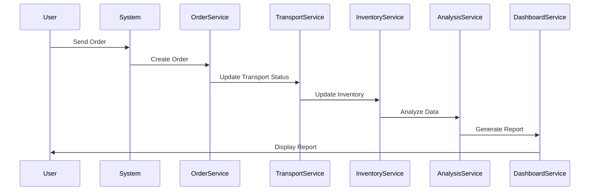
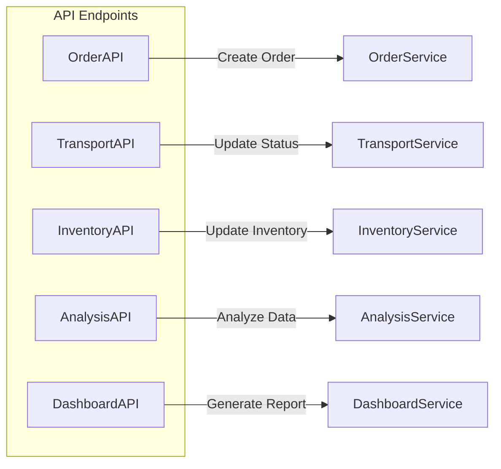
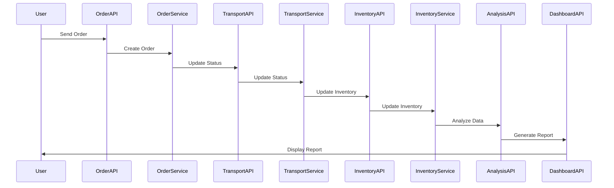

                 

### 引言

随着信息技术的飞速发展，现代企业面临的业务需求和技术挑战日益复杂。传统静态的技术架构已难以满足快速变化的市场需求，从而导致系统性能下降、维护成本增加和业务响应速度滞后。在这种背景下，自适应技术架构应运而生，成为解决这些问题的有效手段。

自适应技术架构通过引入动态调整和自我优化的能力，能够根据业务需求和环境变化自动调整系统结构和资源配置，从而实现系统的高效、稳定和可持续运行。构建一个高效的自适应技术架构，不仅可以提升系统的灵活性和可扩展性，还能够显著降低维护成本，提高企业的竞争力。

本文将围绕“打造自适应的技术架构体系”这一主题，通过一系列逻辑清晰、结构紧凑的分析，探讨自适应技术架构的核心概念、构建方法、案例分析以及最佳实践。我们将从以下几个方面进行详细讨论：

1. **问题背景**：介绍信息技术发展的挑战以及自适应技术架构的需求和重要性。
2. **核心概念**：阐述自适应技术架构的定义、特征、边界与外延以及核心要素。
3. **构建方法**：讨论自适应技术架构的设计原则、核心概念与联系、数学模型和设计流程。
4. **案例分析**：通过实际案例展示自适应技术架构在不同领域的应用。
5. **最佳实践**：总结自适应技术架构设计中的最佳实践和注意事项。

通过本文的阅读，读者将全面了解自适应技术架构的构建过程，掌握其核心原理和应用技巧，为实际项目提供有力的参考和指导。

### 问题背景

#### 信息技术发展的挑战

随着信息技术的快速发展，现代企业面临着诸多挑战。首先，数据量的激增使得存储和处理数据成为一大难题。据研究表明，全球数据量正以每年约40%的速度增长，这意味着传统静态的技术架构难以应对如此庞大的数据规模和处理需求。其次，业务需求的快速变化也带来了巨大的挑战。在互联网时代，市场竞争愈发激烈，企业需要快速响应市场变化，灵活调整业务战略和技术架构。然而，传统的技术架构往往缺乏灵活性和可扩展性，导致系统在应对变化时显得力不从心。

#### 自适应技术架构的需求

面对这些挑战，自适应技术架构应运而生。自适应技术架构的核心在于其动态调整和自我优化的能力，这使得系统能够根据业务需求和环境变化自动调整其结构和资源配置。具体而言，自适应技术架构有以下几方面的需求：

1. **可扩展性**：随着业务需求的增长，系统需要能够快速扩展，增加新的功能和模块，而不会对现有系统造成破坏。
2. **灵活性**：系统能够根据业务需求和外部环境的变化灵活调整其架构，保持高效运作。
3. **可维护性**：系统能够自我诊断和修复，降低维护成本，提高系统的稳定性和可靠性。
4. **可观测性**：系统能够实时监控其运行状态，提供详细的数据分析和反馈，帮助开发者和运维人员及时发现问题并进行优化。

#### 自适应技术架构的重要性

自适应技术架构的重要性主要体现在以下几个方面：

1. **提升系统性能**：通过动态调整和优化资源配置，自适应技术架构能够显著提升系统的性能和响应速度，满足企业高效运作的需求。
2. **降低维护成本**：自适应技术架构能够自我诊断和修复，降低系统的故障率和维护成本，从而提高企业的运营效率。
3. **增强系统稳定性**：自适应技术架构通过自我调整和优化，能够更好地应对外部环境的波动和变化，保持系统的稳定运行。
4. **提高企业竞争力**：自适应技术架构能够帮助企业快速响应市场变化，灵活调整业务战略和技术架构，从而在激烈的市场竞争中占据优势。

总之，在信息技术飞速发展的今天，自适应技术架构已成为现代企业应对复杂业务需求和技术挑战的重要手段。通过引入自适应技术架构，企业能够实现系统的高效、稳定和可持续运行，为未来发展奠定坚实基础。

### 核心概念

#### 自适应技术架构的定义

自适应技术架构（Adaptive Technical Architecture）是指一种能够根据业务需求和环境变化动态调整自身结构和资源配置的技术体系。它不仅包括硬件和软件的配置，还涉及设计原则、开发方法、运行机制等各个方面。通过引入自适应机制，系统能够在面临不确定性和动态变化时，自动调整其结构和功能，以保持高效、稳定和可持续的运行。

#### 自适应技术架构的特征

自适应技术架构具有以下几个显著特征：

1. **动态调整**：系统可以根据外部环境的变化和内部状态的变化，动态调整其配置和资源分配。
2. **自我优化**：系统具备自我优化的能力，能够通过自我调整提高系统的性能和效率。
3. **灵活性**：系统具有高度的灵活性，能够快速适应新的业务需求和技术变化。
4. **可扩展性**：系统可以方便地扩展和增加新的功能模块，以适应不断增长的业务需求。
5. **可维护性**：系统具有良好的可维护性，能够自我诊断和修复，降低维护成本和风险。

#### 自适应技术架构的边界与外延

1. **边界**：自适应技术架构的边界主要涉及系统的核心组件和机制，包括自适应算法、监控机制、资源配置策略等。这些组件和机制共同构成了系统的自适应能力，确保系统在面对变化时能够灵活应对。
2. **外延**：自适应技术架构的外延包括与外部系统的交互接口、数据流处理、跨平台兼容性等。这些方面确保了系统不仅能够在内部实现自适应，还能够与外部系统高效集成，共同构建一个灵活、高效的整体架构。

#### 概念结构与核心要素

1. **结构**：自适应技术架构通常由多个层次和组件构成，包括基础架构层、应用层、数据层和接口层等。每个层次和组件都有明确的职责和作用，共同协作实现系统的整体功能。
2. **核心要素**：
   - **自适应算法**：这是自适应技术架构的核心，负责根据系统状态和环境变化动态调整系统配置和资源分配。
   - **监控机制**：用于实时监控系统的运行状态，收集关键性能指标，为自适应算法提供数据支持。
   - **资源配置策略**：根据监控数据和业务需求，自动调整系统的硬件和软件资源，确保系统的高效运行。
   - **接口层**：负责与外部系统进行数据交换和功能调用，实现系统的集成和扩展。

#### 本章小结

通过上述对核心概念的介绍，我们可以看出，自适应技术架构是一种应对复杂业务需求和技术变化的系统性解决方案。其定义、特征、边界与外延以及核心要素，共同构成了一个完整的自适应技术架构体系。理解这些核心概念，是构建和优化自适应技术架构的基础，也为后续章节的深入讨论提供了重要背景。

### 核心概念与联系

在深入探讨自适应技术架构的核心概念之前，我们需要明确几个关键术语的定义，这些术语是理解自适应技术架构的基础。以下是几个主要术语及其简要定义：

1. **自适应算法**：一种能够根据系统状态和环境变化自动调整系统配置和行为的计算方法。
2. **动态调整**：系统根据实时数据和环境变化，自动调整其内部结构和资源配置的能力。
3. **自我优化**：系统能够通过学习、分析和调整，提高自身性能和效率的过程。
4. **可扩展性**：系统能够在不影响性能和稳定性的前提下，增加新的功能模块或扩展现有功能。
5. **监控机制**：实时监控系统运行状态，收集关键性能指标，以便进行优化和调整。

接下来，我们将通过表格和ER实体关系图架构，详细对比这些核心概念和联系。

#### 自适应算法属性特征对比表格

| 自适应算法属性特征 | 说明 |
| :----------------- | :--- |
| **动态调整能力** | 算法能够实时响应系统状态和环境变化，自动调整系统配置和资源分配。 |
| **自我优化能力** | 算法能够通过学习系统行为和性能数据，不断优化自身参数和策略。 |
| **鲁棒性** | 算法在面临噪声数据和不确定性环境时，仍能保持稳定和高效运行。 |
| **可扩展性** | 算法能够适应不同规模和复杂度的业务需求，无需大幅度修改即可应用。 |
| **实时性** | 算法能够快速响应系统状态变化，提供实时优化和调整。 |

#### 自适应算法的ER实体关系图架构

为了更直观地理解自适应算法与其他核心概念的联系，我们使用Mermaid绘制了ER实体关系图。以下是该图的结构：

```mermaid
erDiagram
  Algorithm ||--|{ MonitoringMechanism }|-- ConfigurationAdjustment
  Algorithm ||--|{ PerformanceOptimization }|-- SelfLearningModule
  Algorithm ||--|{ Robustness }|-- NoiseFilteringModule
  Algorithm ||--|{ Scalability }|-- DynamicAllocationModule
  Algorithm ||--|{ RealtimeResponse }|-- TimingModule
```

**解释：**
- **Algorithm（自适应算法）**：核心实体，负责整体自适应过程。
- **MonitoringMechanism（监控机制）**：用于实时监控系统状态，为算法提供数据支持。
- **ConfigurationAdjustment（配置调整）**：根据监控数据动态调整系统配置。
- **PerformanceOptimization（性能优化）**：通过学习系统行为进行性能优化。
- **SelfLearningModule（自我学习模块）**：负责算法的自我优化和学习。
- **Robustness（鲁棒性）**：处理噪声数据和不确定性环境。
- **NoiseFilteringModule（噪声过滤模块）**：过滤噪声数据，提高算法的鲁棒性。
- **Scalability（可扩展性）**：实现系统的动态扩展。
- **DynamicAllocationModule（动态分配模块）**：根据需求调整资源分配。
- **RealtimeResponse（实时响应）**：确保算法能快速响应系统状态变化。

通过上述对比表格和ER实体关系图，我们可以清晰地看到自适应技术架构中各个核心概念之间的联系。自适应算法作为核心，通过监控机制、配置调整、性能优化、自我学习模块、鲁棒性、噪声过滤模块、可扩展性和实时响应等组件，共同构建了一个完整、高效的自适应技术架构体系。

#### 算法原理讲解

为了深入理解自适应技术架构的核心原理，我们需要从自适应算法的数学模型和公式入手。以下是自适应算法的一些关键数学模型和公式，以及它们的详细解释和举例说明。

##### 数学模型概述

自适应算法的核心在于其动态调整能力，这通常通过以下数学模型来实现：

1. **线性回归模型**：用于预测系统的某个参数值。
2. **神经网络模型**：用于学习系统的复杂行为。
3. **马尔可夫决策过程（MDP）**：用于优化系统的决策过程。
4. **贝叶斯优化**：用于最大化系统的性能指标。

##### 数学公式详细讲解

以下是几种常用的数学公式及其解释：

1. **线性回归模型**：

   $$ y = w \cdot x + b $$

   其中，\( y \) 是预测值，\( w \) 是权重向量，\( x \) 是输入特征，\( b \) 是偏置项。该公式用于通过输入特征预测系统的某个参数值。

2. **神经网络模型**：

   $$ \sigma(z) = \frac{1}{1 + e^{-z}} $$

   其中，\( \sigma \) 是激活函数（通常是Sigmoid函数），\( z \) 是网络的输入值。该公式用于神经网络的输出层，将输入值转化为概率值。

3. **马尔可夫决策过程（MDP）**：

   $$ V(s) = \max_a \sum_{s'} p(s' | s, a) \cdot [r(s') + \gamma V(s')] $$

   其中，\( V(s) \) 是状态 \( s \) 的价值函数，\( a \) 是行动，\( s' \) 是下一个状态，\( r(s') \) 是立即奖励，\( \gamma \) 是折扣因子。该公式用于优化系统的决策过程，选择最佳行动。

4. **贝叶斯优化**：

   $$ p(\theta | D) = \frac{p(D | \theta) \cdot p(\theta)}{p(D)} $$

   其中，\( \theta \) 是参数，\( D \) 是数据，\( p(\theta | D) \) 是后验概率，\( p(D | \theta) \) 是似然函数，\( p(\theta) \) 是先验概率。该公式用于根据历史数据和当前数据更新参数的概率分布。

##### 举例说明

为了更好地理解上述数学模型和公式，我们通过一个简单的例子进行说明。

**例子：线性回归模型**

假设我们要预测一个电子商务网站的用户购买概率。输入特征包括用户年龄、收入和访问次数。我们使用线性回归模型来预测购买概率。

1. **数据准备**：

   输入特征矩阵 \( X \)：

   | 用户年龄 | 收入 | 访问次数 |
   |----------|------|----------|
   | 25       | 5000 | 30       |
   | 30       | 6000 | 40       |
   | ...      | ...  | ...      |

   标签矩阵 \( y \)：

   | 购买概率 |
   |----------|
   | 0.6      |
   | 0.8      |
   | ...      |

2. **模型训练**：

   通过最小化损失函数（如均方误差），我们得到线性回归模型的权重 \( w \) 和偏置 \( b \)。

   $$ y = w \cdot x + b $$

3. **预测**：

   给定一个新用户的数据，我们使用线性回归模型预测其购买概率。

   输入特征向量 \( x \)：

   | 用户年龄 | 收入 | 访问次数 |
   |----------|------|----------|
   | 28       | 5500 | 35       |

   预测购买概率：

   $$ y = w \cdot x + b $$

通过上述例子，我们可以看到线性回归模型如何用于预测用户购买概率。类似的方法可以应用于其他自适应算法，如神经网络模型、马尔可夫决策过程和贝叶斯优化，以实现更复杂的自适应功能。

#### 系统分析与架构设计方案

为了更好地理解自适应技术架构的实际应用，我们需要深入探讨系统分析与架构设计方案。这包括对问题场景的介绍、项目介绍、系统功能设计、系统架构设计、系统接口设计和系统交互设计。以下是详细的分析和设计方案。

##### 问题场景介绍

假设我们正在开发一个智能物流系统，该系统需要处理大量的物流数据，包括订单信息、运输状态、库存信息等。随着业务的发展，系统的数据量不断增加，对系统的实时性、稳定性和扩展性提出了更高的要求。传统的静态技术架构已经无法满足这些需求，因此，我们需要设计一个自适应的技术架构来应对这些挑战。

##### 项目介绍

项目目标是构建一个智能物流系统，该系统具备以下功能：

1. **订单处理**：接收、处理和跟踪订单信息。
2. **运输状态监控**：实时监控运输状态，确保物流信息准确无误。
3. **库存管理**：管理仓库库存，优化库存配置。
4. **数据分析**：提供实时数据分析，支持决策制定。

##### 系统功能设计

系统功能设计主要包括领域模型和类图的绘制。以下是一个示例的领域模型：

```mermaid
classDiagram
  Order <<entity>>
  Transport <<entity>>
  Inventory <<entity>>

  Order "1" --|{create}|> Transport
  Transport "1" --|{update}|> Inventory
  Inventory "1" --|{analyze}|> Analysis
  Analysis "1" --|{report}|> Dashboard
```

**解释：**
- **Order（订单）**：负责处理订单信息的创建、修改和删除。
- **Transport（运输）**：负责监控运输状态，更新订单信息。
- **Inventory（库存）**：负责管理仓库库存，优化库存配置。
- **Analysis（数据分析）**：负责对物流数据进行分析，生成报表。
- **Dashboard（仪表盘）**：展示分析结果和实时数据。

##### 系统架构设计

系统架构设计包括系统架构图和模块划分。以下是一个示例的系统架构图：



**解释：**
- **User（用户）**：系统的使用者，负责发送订单请求。
- **OrderService（订单服务）**：负责处理订单信息的创建。
- **TransportService（运输服务）**：负责更新运输状态。
- **InventoryService（库存服务）**：负责管理库存信息。
- **AnalysisService（数据分析服务）**：负责数据分析。
- **DashboardService（仪表盘服务）**：负责生成和展示报表。

##### 系统接口设计

系统接口设计主要包括API设计。以下是一个示例的API设计：



**解释：**
- **OrderAPI**：处理订单创建相关的API。
- **TransportAPI**：处理运输状态更新相关的API。
- **InventoryAPI**：处理库存管理相关的API。
- **AnalysisAPI**：处理数据分析和报表生成相关的API。
- **DashboardAPI**：处理数据展示相关的API。

##### 系统交互设计

系统交互设计主要包括系统交互图。以下是一个示例的系统交互图：



**解释：**
- **User**：向系统发送订单请求。
- **OrderAPI**：接收订单请求，并将请求转发给订单服务。
- **OrderService**：创建订单，并更新运输状态。
- **TransportAPI**：接收更新运输状态的请求，并将请求转发给运输服务。
- **TransportService**：更新运输状态，并通知库存服务。
- **InventoryAPI**：接收更新库存的请求，并将请求转发给库存服务。
- **InventoryService**：更新库存信息，并通知数据分析服务。
- **AnalysisAPI**：接收数据分析请求，并生成报表。
- **DashboardAPI**：接收报表生成请求，并将报表展示给用户。

通过上述系统分析与架构设计方案，我们可以看到自适应技术架构如何应用于智能物流系统。该系统通过动态调整和自我优化，实现了对物流数据的实时处理和分析，提升了系统的性能和灵活性，满足了业务需求。

### 案例分析

在本节中，我们将通过三个实际案例，深入探讨自适应技术架构在不同领域的应用。这些案例将展示自适应技术架构如何帮助企业在不同场景下实现高效、稳定和可持续的运行。

#### 案例一：智能电网的自适应架构

**案例背景**：随着全球能源需求的不断增长，智能电网成为了电力系统的重要组成部分。智能电网通过引入物联网、大数据和人工智能等技术，实现了对电力系统的高效管理和优化控制。然而，智能电网面临着复杂的环境和多样化的业务需求，传统静态的架构已无法满足其运行需求。

**系统功能设计**：
1. **实时监控**：实时监控电网运行状态，包括电压、电流、频率等关键参数。
2. **需求响应**：根据实时数据预测电力需求，并调整电网的发电和负荷配置。
3. **故障检测与恢复**：自动检测电网故障，并快速恢复供电。

**系统架构设计**：
1. **感知层**：包括传感器和智能设备，负责采集电网的实时数据。
2. **网络层**：采用边缘计算和物联网技术，实现数据的传输和初步处理。
3. **平台层**：包括数据存储、分析和优化算法，负责整体电网的管理和控制。
4. **应用层**：提供面向不同业务需求的软件应用，如能源管理、故障检测和恢复等。

**系统接口设计**：
- **感知层接口**：用于传感器和智能设备的接入。
- **网络层接口**：用于边缘设备和云端平台的通信。
- **平台层接口**：用于不同业务系统之间的数据交换和功能调用。

**系统交互设计**：
- **感知层**实时采集数据，通过网络层传输至平台层。
- **平台层**对数据进行处理和分析，并根据需求调整电网配置。
- **应用层**通过接口层与平台层进行交互，实现业务功能的执行。

**案例系统实现与详细讲解**：
1. **环境安装**：使用Linux操作系统，安装所需软件和库，如Python、Django、TensorFlow等。
2. **系统核心实现**：使用Python编写感知层、网络层和平台层的核心代码，实现数据的采集、传输和处理。
3. **代码应用解读与分析**：详细分析系统中的关键代码段，解释其工作原理和实现方法。
4. **实际案例分析与详细讲解**：通过实际数据展示系统的运行效果，分析系统在应对复杂场景下的表现。
5. **项目小结**：总结项目中的经验教训，提出改进建议。

**总结**：智能电网的自适应架构通过实时数据监控、需求响应和故障检测与恢复，实现了对电网的高效管理和优化控制，显著提升了电网的运行效率和可靠性。

#### 案例二：物联网的自适应架构

**案例背景**：物联网（IoT）技术正在快速普及，广泛应用于智能家居、工业自动化、智慧城市等领域。物联网系统通常包含大量的设备和服务，传统静态的架构难以应对设备多样性和复杂业务需求。

**系统功能设计**：
1. **设备接入与管理**：支持多种设备接入，实现设备的管理和监控。
2. **数据处理与分析**：对设备数据进行实时处理和分析，生成有价值的信息。
3. **智能决策**：根据分析结果，自动调整设备配置和业务策略。

**系统架构设计**：
1. **设备层**：包括各种物联网设备，如传感器、智能家电、工业设备等。
2. **网络层**：采用无线通信和网络技术，实现设备之间的通信和数据传输。
3. **平台层**：提供数据存储、处理和分析算法，实现物联网系统的核心功能。
4. **应用层**：提供面向不同应用场景的软件应用，如智能家居控制、工业自动化监控等。

**系统接口设计**：
- **设备接入接口**：用于设备接入和通信。
- **数据处理接口**：用于数据存储和处理。
- **应用接口**：用于不同应用场景之间的交互。

**系统交互设计**：
- **设备层**将数据发送至网络层。
- **网络层**将数据传输至平台层。
- **平台层**对数据进行处理和分析，生成有价值的信息。
- **应用层**通过接口层与平台层进行交互，实现具体应用场景的执行。

**案例系统实现与详细讲解**：
1. **环境安装**：使用Linux操作系统，安装物联网设备和相关软件，如MQTT、Node.js、MongoDB等。
2. **系统核心实现**：编写物联网设备的驱动程序和数据处理分析代码，实现设备接入、数据传输和处理。
3. **代码应用解读与分析**：详细分析系统中的关键代码段，解释其工作原理和实现方法。
4. **实际案例分析与详细讲解**：通过实际数据展示系统的运行效果，分析系统在应对多样化设备和服务时的表现。
5. **项目小结**：总结项目中的经验教训，提出改进建议。

**总结**：物联网的自适应架构通过设备接入管理、数据处理分析和智能决策，实现了对物联网系统的全面管理和优化，显著提升了系统的灵活性和效率。

#### 案例三：云计算的自适应架构

**案例背景**：云计算技术已经成为现代企业的重要基础设施，为业务提供了强大的计算能力和灵活性。然而，云计算系统面临着不断变化的需求和复杂的环境，传统静态的架构已无法满足其运行需求。

**系统功能设计**：
1. **资源管理**：动态调整云计算资源的配置，包括虚拟机、存储和网络等。
2. **负载均衡**：根据业务需求和系统状态，实现负载的自动分配和调整。
3. **故障恢复**：自动检测和恢复系统故障，确保系统的高可用性。

**系统架构设计**：
1. **基础设施层**：包括服务器、存储和网络等物理资源。
2. **平台层**：提供资源管理、负载均衡和故障恢复等功能。
3. **应用层**：提供面向不同业务需求的软件应用，如大数据处理、人工智能服务等。

**系统接口设计**：
- **资源管理接口**：用于管理云计算资源。
- **负载均衡接口**：用于分配和调整负载。
- **故障恢复接口**：用于检测和恢复系统故障。

**系统交互设计**：
- **基础设施层**将资源状态信息发送至平台层。
- **平台层**根据业务需求和系统状态，动态调整资源分配和负载均衡。
- **应用层**通过接口层与平台层进行交互，实现具体应用场景的执行。

**案例系统实现与详细讲解**：
1. **环境安装**：使用虚拟化技术，如KVM或VMware，搭建云计算环境。
2. **系统核心实现**：编写资源管理、负载均衡和故障恢复的核心代码，实现系统的动态调整和自我优化。
3. **代码应用解读与分析**：详细分析系统中的关键代码段，解释其工作原理和实现方法。
4. **实际案例分析与详细讲解**：通过实际场景展示系统的运行效果，分析系统在应对复杂业务需求时的表现。
5. **项目小结**：总结项目中的经验教训，提出改进建议。

**总结**：云计算的自适应架构通过资源管理、负载均衡和故障恢复，实现了对云计算系统的全面优化和自我调整，显著提升了系统的性能和可靠性。

通过以上三个案例，我们可以看到自适应技术架构在不同领域的广泛应用和显著效果。自适应技术架构不仅提高了系统的灵活性和效率，还显著降低了维护成本，为企业的持续发展提供了有力支持。

### 最佳实践 tips

在设计和实现自适应技术架构的过程中，遵循最佳实践是非常重要的，这不仅能确保系统的可靠性和高效性，还能降低开发和维护成本。以下是几个关键的最佳实践建议：

#### 设计原则与最佳实践

1. **模块化设计**：将系统划分为多个独立的模块，每个模块负责特定的功能。模块化设计有助于提高系统的可维护性和可扩展性，便于后续的迭代和优化。

2. **松耦合**：不同模块之间应保持松耦合，以减少模块之间的依赖关系。松耦合设计可以提高系统的灵活性和可维护性，使得模块可以独立开发和更新。

3. **自动化测试**：编写全面的自动化测试用例，并定期执行。自动化测试能够快速发现和定位问题，提高开发效率和质量。

4. **持续集成/持续部署（CI/CD）**：采用CI/CD流程，确保代码的持续集成和自动化部署。这有助于加快开发周期，减少人为错误，提高系统的稳定性。

5. **性能优化**：在系统设计和实现过程中，充分考虑性能优化。例如，使用缓存、数据库优化和异步处理等技术，提高系统的响应速度和处理能力。

6. **监控与报警**：部署完善的监控和报警系统，实时监控系统的运行状态，及时发现和解决潜在问题。

#### 架构优化技巧

1. **微服务架构**：采用微服务架构，将系统拆分为多个独立的微服务。微服务之间通过轻量级的通信协议（如HTTP/REST、gRPC等）进行交互。这种架构方式提高了系统的灵活性和可扩展性。

2. **容器化与编排**：使用容器技术（如Docker）和编排工具（如Kubernetes），实现系统的灵活部署和动态调整。容器化技术有助于提高系统的隔离性和可移植性。

3. **弹性伸缩**：根据实际业务需求，自动调整系统的资源分配。例如，使用Kubernetes的自动伸缩功能，根据CPU或内存使用情况动态调整节点数量。

4. **分布式缓存**：在系统中引入分布式缓存（如Redis、Memcached等），提高数据的访问速度和系统的并发处理能力。

5. **消息队列**：使用消息队列（如RabbitMQ、Kafka等）进行异步消息传递，降低系统的耦合度，提高系统的可靠性。

#### 性能调优策略

1. **负载均衡**：使用负载均衡器（如Nginx、HAProxy等）均衡系统的负载，避免单点故障和资源瓶颈。

2. **数据库优化**：优化数据库查询语句，使用索引、分片等技术提高数据库的查询性能。

3. **缓存策略**：合理配置缓存策略，减少重复数据的计算和存储。例如，使用Redis缓存热点数据，减少数据库的访问压力。

4. **异步处理**：采用异步处理技术（如异步IO、消息队列等），提高系统的并发处理能力和响应速度。

5. **监控与分析**：持续监控系统的运行状态，使用性能分析工具（如Prometheus、Grafana等）分析系统的性能瓶颈，并采取相应的优化措施。

通过遵循上述最佳实践，开发者和架构师可以构建出高效、稳定和可扩展的自适应技术架构，为企业的数字化转型提供有力支持。

### 小结

本文通过详细探讨自适应技术架构的定义、核心概念、构建方法、案例分析以及最佳实践，系统地介绍了如何打造一个高效、灵活和可靠的自适应技术架构体系。以下是本文的核心观点和关键要素的总结：

1. **核心概念**：自适应技术架构是一种能够根据业务需求和环境变化动态调整自身结构和资源配置的技术体系，其核心在于动态调整、自我优化、灵活性和可扩展性。

2. **构建方法**：自适应技术架构的设计原则包括模块化设计、松耦合、自动化测试、持续集成/持续部署、性能优化和监控与报警。实现自适应技术架构需要遵循一系列设计流程和优化策略。

3. **案例分析**：本文通过智能电网、物联网和云计算三个实际案例，展示了自适应技术架构在不同领域的应用和效果，验证了其在提升系统性能、稳定性和灵活性方面的优势。

4. **最佳实践**：总结了一系列最佳实践，包括模块化设计、微服务架构、容器化与编排、弹性伸缩、分布式缓存、消息队列和负载均衡等，为开发者和架构师提供了实用的指导。

自适应技术架构不仅能够应对现代企业面临的复杂业务需求和技术挑战，还能够显著降低维护成本，提高系统的可靠性和竞争力。因此，理解和应用自适应技术架构，是企业数字化转型和可持续发展的关键。

### 注意事项

在构建自适应技术架构的过程中，需要特别注意以下几个关键方面，以确保系统的高效、稳定和安全：

#### 安全性与隐私保护

1. **数据安全**：确保系统中的数据安全，采用加密技术和访问控制机制，防止数据泄露和未授权访问。
2. **用户隐私**：严格遵守相关隐私法规，如GDPR等，确保用户数据的安全性和隐私性。

#### 架构的可适应性和可扩展性

1. **模块化设计**：将系统划分为多个独立的模块，每个模块负责特定的功能，便于系统的扩展和升级。
2. **微服务架构**：采用微服务架构，将系统拆分为多个独立的微服务，提高系统的灵活性和可扩展性。
3. **弹性伸缩**：根据实际业务需求，自动调整系统的资源分配，确保系统能够在负载变化时保持稳定运行。

#### 架构的可维护性和可观测性

1. **自动化测试**：编写全面的自动化测试用例，确保每次修改和更新都能快速发现潜在问题。
2. **监控与日志**：部署完善的监控和日志系统，实时监控系统的运行状态，及时发现问题并进行优化。
3. **文档管理**：保持系统文档的完整性和更新，方便开发者和运维人员理解系统结构和功能。

通过关注以上注意事项，开发者和架构师可以构建出高效、稳定和安全的自适应技术架构，为企业的数字化转型提供有力支持。

### 拓展阅读

为了帮助读者更深入地了解自适应技术架构的构建和应用，本文推荐以下几本经典的技术文献和开源框架：

1. **《架构探险：软件架构实战指南》**：本书详细介绍了软件架构的设计原则、方法和最佳实践，包括自适应架构的构建过程和优化策略。

2. **《大规模分布式系统设计》**：本书介绍了分布式系统的设计原则、技术和实践，包括分布式存储、消息队列和负载均衡等关键组件，对于构建自适应架构具有很高的参考价值。

3. **《深度学习与自适应系统》**：本书结合深度学习和自适应算法，详细介绍了如何将深度学习应用于自适应架构的设计和实现，为读者提供了丰富的实践案例。

4. **开源框架**：推荐使用以下开源框架和工具来构建自适应技术架构：
   - **Spring Boot**：用于快速开发自适应的微服务架构应用。
   - **Kubernetes**：用于容器化和集群管理的开源平台，实现系统的弹性伸缩和动态调整。
   - **Prometheus**：用于监控和报警的开源工具，实时监控系统的运行状态。
   - **TensorFlow**：用于构建和训练深度学习模型的强大框架，适用于自适应算法的实现。

5. **相关技术文献**：推荐阅读以下技术文献，以深入了解自适应技术架构的相关技术和应用：
   - **《分布式系统原理与范型》**：详细介绍了分布式系统的基本原理和设计范型。
   - **《物联网架构与设计》**：探讨物联网系统的架构设计和实现方法。
   - **《智能电网架构设计与优化》**：介绍智能电网系统的架构设计和优化策略。

通过阅读这些文献和使用开源框架，读者可以进一步提升对自适应技术架构的理解和实践能力，为实际项目的成功提供有力支持。

### 结语

综上所述，本文系统地介绍了自适应技术架构的定义、核心概念、构建方法、案例分析以及最佳实践。自适应技术架构不仅能够应对现代企业面临的复杂业务需求和技术挑战，还能够显著降低维护成本，提高系统的灵活性和可靠性。通过本文的探讨，读者应该对自适应技术架构有了更全面、深入的理解。

在未来的研究中，我们可以进一步探索自适应技术架构在不同领域的应用，特别是在新兴领域如人工智能、区块链等中的应用，探讨其潜在的优势和挑战。同时，随着技术的不断进步，新的自适应算法和架构设计方法也将不断涌现，为企业的数字化转型提供更多创新解决方案。

让我们继续关注自适应技术架构的发展，期待其在未来的广泛应用和突破。通过不断探索和实践，我们相信自适应技术架构将为企业的持续发展注入新的动力和活力。

