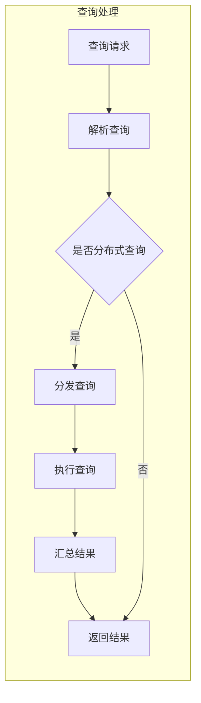
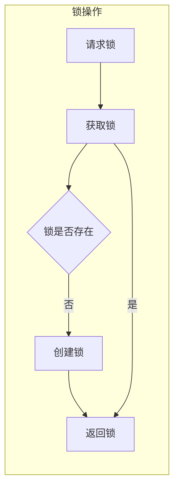
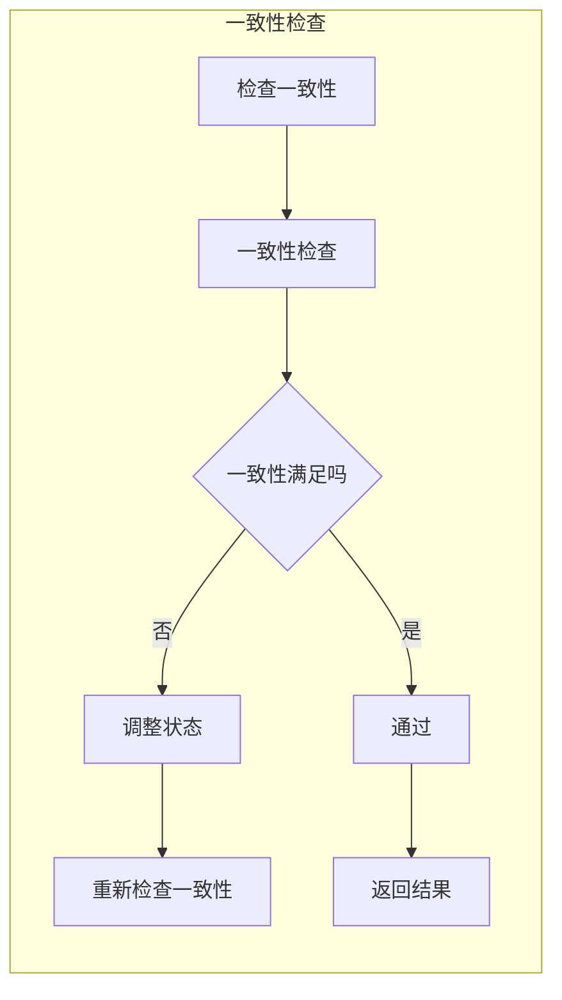
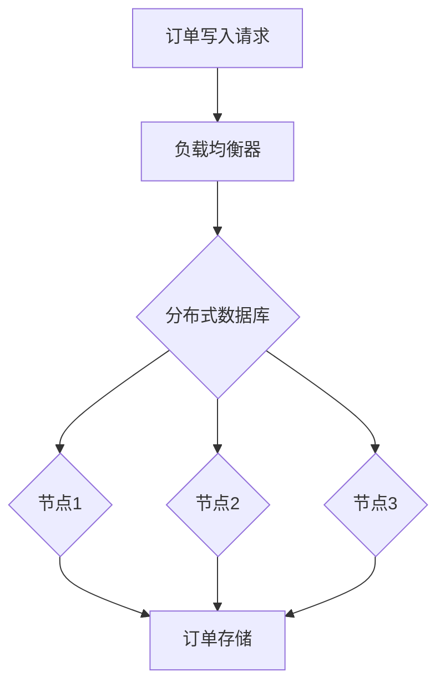
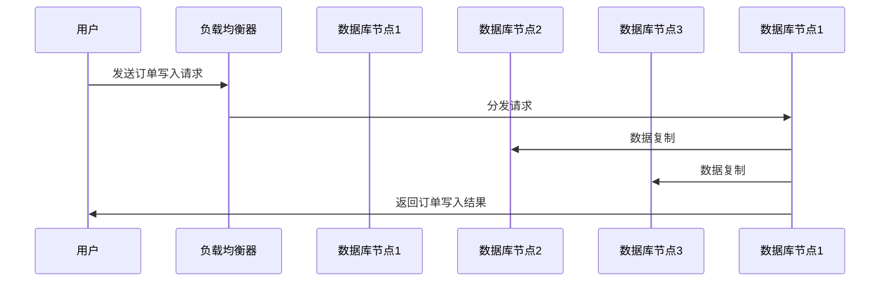

                 

# 《打造高性能分布式数据库系统》

关键词：分布式数据库、高性能、扩展性、数据分片、分布式事务、负载均衡

摘要：随着互联网的快速发展，企业面临的大数据量存储与查询需求日益增长。传统集中式数据库已难以满足性能需求，因此分布式数据库成为了解决这一问题的有效途径。本文将介绍分布式数据库的基本概念、核心概念与联系、算法原理讲解、系统分析与架构设计方案、项目实战以及最佳实践和注意事项，帮助读者深入理解并掌握分布式数据库系统设计的方法。

## 第一部分：背景与核心概念

### 1.1 分布式数据库概述

分布式数据库系统是由多个节点组成的数据库系统，这些节点通过网络进行通信和协同工作。分布式数据库系统通过将数据分散存储在不同的节点上，实现数据的冗余和扩展性，从而提高系统的性能和可靠性。

**核心概念术语说明**：

- 数据分片：将数据划分为多个部分，每个部分存储在不同的节点上。
- 数据复制：在多个节点之间复制数据，以提高数据的可靠性和访问速度。
- 分布式事务：在分布式环境下执行的事务，需要保证事务的原子性、一致性、隔离性和持久性。
- 负载均衡：将数据库操作均匀地分配到不同的节点上，以提高系统的性能。

**问题背景**：

随着互联网的快速发展，企业面临的大数据量存储与查询需求日益增长。传统的集中式数据库由于数据存储和计算能力的限制，已难以满足性能需求。分布式数据库系统通过将数据分散存储和计算，可以更好地应对大数据量的存储和查询需求。

**问题描述**：

如何设计并实现一个高性能、可扩展的分布式数据库系统？

**问题解决**：

通过分布式数据库技术，如数据分片、数据复制、分布式事务和负载均衡等，可以解决传统集中式数据库的性能瓶颈，实现大数据量的存储和查询。

**边界与外延**：

分布式数据库系统与集中式数据库系统的区别主要在于数据存储和计算的方式。分布式数据库系统通过将数据分散存储和计算，可以实现更高的性能和扩展性。适用于需要处理大量数据和高并发访问的场景，如电子商务、金融交易、物联网等。

**概念结构与核心要素组成**：

分布式数据库系统的核心组成部分包括：

- 数据分片：将数据划分为多个部分，每个部分存储在不同的节点上。
- 数据复制：在多个节点之间复制数据，以提高数据的可靠性和访问速度。
- 分布式事务：在分布式环境下执行的事务，需要保证事务的原子性、一致性、隔离性和持久性。
- 负载均衡：将数据库操作均匀地分配到不同的节点上，以提高系统的性能。

### 1.2 核心概念与联系

**核心概念原理**：

- 数据分片：数据分片的策略主要有哈希分片、范围分片和列表分片等。哈希分片通过哈希函数将数据分配到不同的节点上，具有负载均衡和查找速度快的特点。范围分片将数据按照一定的范围划分到不同的节点上，适用于数据按范围访问的场景。列表分片将数据按照一定的顺序划分到不同的节点上，适用于数据顺序访问的场景。
- 数据复制：数据复制的主要策略有主从复制和主主复制等。主从复制通过一个主节点和多个从节点进行数据的同步，从节点可以从主节点读取数据，提高系统的读取性能。主主复制通过两个主节点进行数据的同步，具有更高的可用性和容错性。
- 分布式事务：分布式事务的主要解决方案有二阶段提交（2PC）和三阶段提交（3PC）等。二阶段提交通过两个阶段进行事务的提交和确认，可以保证分布式事务的原子性和一致性。三阶段提交通过三个阶段进行事务的提交和确认，可以进一步提高系统的性能和可靠性。
- 负载均衡：负载均衡的主要策略有轮询、随机和最小连接数等。轮询策略将请求依次分配到不同的节点上，具有负载均衡和简单易用的特点。随机策略将请求随机分配到不同的节点上，具有较好的负载均衡效果。最小连接数策略将请求分配到当前连接数最少的节点上，具有较好的性能和可用性。

**概念属性特征对比表格**：

| 概念         | 特点                                                         | 适用场景                                       |
| ------------ | ------------------------------------------------------------ | ---------------------------------------------- |
| 数据分片     | 负载均衡、查找速度快                                         | 大数据量存储与查询需求                          |
| 数据复制     | 可靠性高、访问速度快                                         | 数据冗余和容错性需求                           |
| 分布式事务   | 原子性、一致性、隔离性、持久性                               | 分布式环境下的事务处理需求                     |
| 负载均衡     | 负载均衡、性能优化                                           | 高并发访问需求                                 |

**ER实体关系图架构的Mermaid流程图**：

```mermaid
erDiagram
    User ||--|{ Order }|-->: "包含"
    Product ||--|{ Order }|-->: "包含"
    Order ||--|{ OrderDetail }|-->: "包含"
    Order |||--|{ Payment }|-->: "关联"
```

## 第二部分：算法原理讲解

### 2.1 分布式查询处理算法

分布式查询处理算法是分布式数据库系统中的关键算法之一，负责将查询请求分发到不同的节点上，并将查询结果汇总起来。以下是几种常见的分布式查询处理算法：

**分布式查询处理算法mermaid流程图**：



**Python源代码**：

```python
def distributed_query(request):
    if is_distributed_query(request):
        query_parts = split_query(request)
        results = []
        for part in query_parts:
            result = execute_query_on_node(part)
            results.append(result)
        return merge_results(results)
    else:
        return execute_query_locally(request)

def is_distributed_query(request):
    # 判断查询是否为分布式查询
    pass

def split_query(request):
    # 将查询请求拆分为分布式查询的一部分
    pass

def execute_query_on_node(part):
    # 在指定节点上执行查询
    pass

def merge_results(results):
    # 将分布式查询结果汇总
    pass
```

**算法原理的数学模型和公式**：

分布式查询处理算法的核心是分布式查询的拆分和汇总。假设查询请求为Q，分布式查询的拆分为{Q1, Q2, ..., Qn}，执行查询的结果为{R1, R2, ..., Rn}，汇总结果为R。则分布式查询处理算法的数学模型可以表示为：

$$
R = \bigcup_{i=1}^{n} R_i
$$

**详细讲解和举例说明**：

假设我们有一个电子商务系统，需要查询用户订单信息。用户订单信息分布在不同的数据库节点上，我们需要将查询请求拆分为分布式查询的一部分，然后分别在每个节点上执行查询，最后将查询结果汇总起来。

例如，假设用户订单信息按照用户ID进行哈希分片，分别存储在节点A、B和C上。当用户发起查询请求时，我们首先判断查询是否为分布式查询。如果是，则将查询请求拆分为{Q1, Q2, Q3}，分别在每个节点上执行查询，并将查询结果汇总起来。

在执行查询时，我们可以使用分布式查询处理算法中的拆分和汇总方法。例如，对于节点A上的查询，我们可以将查询请求拆分为{Q1A, Q1B, Q1C}，分别在每个节点上执行查询，并将查询结果汇总起来。最后，我们将所有节点的查询结果汇总，得到用户订单信息的完整查询结果。

### 2.2 分布式锁算法

分布式锁算法是分布式数据库系统中用于解决并发访问问题的重要算法。分布式锁算法确保在多个节点之间对共享资源进行访问时，不会出现数据竞争和冲突。以下是几种常见的分布式锁算法：

**分布式锁算法mermaid流程图**：



**Python源代码**：

```python
def distributed_lock(resource, lock_name):
    lock = get_lock(lock_name)
    if lock:
        return lock
    else:
        lock = create_lock(lock_name)
        set_lock(lock_name, lock)
        return lock

def get_lock(lock_name):
    # 获取指定名称的锁
    pass

def create_lock(lock_name):
    # 创建指定名称的锁
    pass

def set_lock(lock_name, lock):
    # 设置指定名称的锁
    pass
```

**算法原理的数学模型和公式**：

分布式锁算法的核心是锁的创建和获取。假设锁的状态为{空闲、占用}，锁的创建操作为CreateLock，锁的获取操作为AcquireLock，锁的释放操作为ReleaseLock。则分布式锁算法的数学模型可以表示为：

$$
\text{CreateLock}(S) = \begin{cases}
S &=& \text{空闲} \\
S &=& \text{占用}
\end{cases}
$$

$$
\text{AcquireLock}(S) = \begin{cases}
S &=& \text{空闲} \\
S &=& \text{占用}
\end{cases}
$$

$$
\text{ReleaseLock}(S) = \begin{cases}
S &=& \text{空闲} \\
S &=& \text{占用}
\end{cases}
$$

**详细讲解和举例说明**：

假设我们有一个电子商务系统，需要实现分布式锁来确保订单数据的并发访问。订单数据存储在分布式数据库的不同节点上，我们需要在每个节点上实现分布式锁算法。

当用户发起订单创建请求时，我们首先尝试获取分布式锁。如果锁处于空闲状态，则将锁设置为占用状态，并返回锁给用户。如果锁处于占用状态，则返回锁给用户，表示无法立即创建订单。

在订单创建完成后，我们需要释放分布式锁，将其设置为空闲状态，以便其他用户可以继续访问订单数据。

例如，假设用户A尝试创建订单，我们在节点A上获取分布式锁。如果锁处于空闲状态，则将锁设置为占用状态，并返回锁给用户A。用户A可以继续创建订单，并将订单数据存储在节点A上。当订单创建完成后，我们释放分布式锁，将其设置为空闲状态，以便其他用户可以继续访问订单数据。

### 2.3 分布式一致性算法

分布式一致性算法是分布式数据库系统中用于保证数据一致性的重要算法。分布式一致性算法确保在分布式环境下，多个节点之间对共享数据进行访问和修改时，可以保持一致的状态。以下是几种常见的分布式一致性算法：

**分布式一致性算法mermaid流程图**：



**Python源代码**：

```python
def check_consistency(data):
    if is_consistent(data):
        return True
    else:
        adjust_state(data)
        return check_consistency(data)

def is_consistent(data):
    # 检查数据一致性
    pass

def adjust_state(data):
    # 调整数据状态
    pass
```

**算法原理的数学模型和公式**：

分布式一致性算法的核心是一致性检查和状态调整。假设数据的一致性状态为{一致、不一致}，一致性检查操作为CheckConsistency，状态调整操作为AdjustState。则分布式一致性算法的数学模型可以表示为：

$$
\text{CheckConsistency}(S) = \begin{cases}
S &=& \text{一致} \\
S &=& \text{不一致}
\end{cases}
$$

$$
\text{AdjustState}(S) = \begin{cases}
S &=& \text{一致} \\
S &=& \text{不一致}
\end{cases}
$$

**详细讲解和举例说明**：

假设我们有一个电子商务系统，需要实现分布式一致性算法来确保订单数据的同步。订单数据存储在分布式数据库的不同节点上，我们需要在每个节点上实现分布式一致性算法。

当用户发起订单创建请求时，我们首先检查订单数据的一致性。如果订单数据处于一致状态，则直接创建订单并保存到数据库。如果订单数据处于不一致状态，则调整订单数据的状态，并重新检查一致性。

例如，假设用户A创建订单，我们在节点A上检查订单数据的一致性。如果订单数据处于一致状态，则直接创建订单并保存到节点A的数据库。如果订单数据处于不一致状态，则调整订单数据的状态，并将其设置为一致状态。然后，我们重新检查订单数据的一致性，确保订单数据的一致性。

通过分布式一致性算法，我们可以确保订单数据在不同节点上的同步和一致性，避免数据竞争和冲突，提高系统的可靠性。

## 第三部分：系统分析与架构设计

### 3.1 问题场景介绍

在电子商务系统中，订单数据的存储和查询需求较高。随着订单数据的增长，传统集中式数据库的性能逐渐下降，难以满足系统的高并发访问需求。为了解决这一问题，我们设计并实现了一个高性能、可扩展的分布式数据库系统。

### 3.2 项目介绍

本项目旨在实现一个分布式数据库系统，用于存储和管理电子商务平台的订单数据。项目目标包括：

1. 提高订单数据的存储和查询性能。
2. 实现订单数据的高可用性和容错性。
3. 提供灵活的数据分片和负载均衡策略。

### 3.3 系统功能设计

分布式数据库系统的主要功能包括：

1. 数据存储与分片：将订单数据按照用户ID或订单ID进行哈希分片，存储到不同的节点上。
2. 数据复制与备份：在节点之间进行数据复制和备份，提高数据可靠性和访问速度。
3. 分布式事务支持：实现分布式事务，保证订单数据的原子性、一致性和隔离性。
4. 负载均衡与优化：通过负载均衡策略，实现订单数据的均匀分配，提高系统性能。

### 3.4 系统架构设计

分布式数据库系统的架构设计如下：



订单写入请求经过负载均衡器分发到不同的节点上，每个节点负责存储一部分订单数据。节点之间通过数据复制和备份机制，确保订单数据的一致性和可靠性。

### 3.5 系统接口设计与系统交互

分布式数据库系统的主要接口设计和交互流程如下：



当用户发送订单写入请求时，负载均衡器将请求分发到不同的数据库节点上。每个节点将订单数据存储到本地数据库，并与其他节点进行数据复制和备份。最后，将订单写入结果返回给用户。

## 第四部分：项目实战

### 4.1 环境安装

在实现分布式数据库系统之前，我们需要搭建相应的环境。以下是一个基本的安装步骤：

1. 安装操作系统：选择一个适合的操作系统，如CentOS 7或Ubuntu 18.04。
2. 安装数据库软件：选择一个合适的分布式数据库软件，如Cassandra、MongoDB或MySQL Cluster。以下以Cassandra为例：
    - 下载Cassandra的安装包：cassandra-3.11.4-bin.tar.gz
    - 解压安装包：tar xvf cassandra-3.11.4-bin.tar.gz
    - 将解压后的目录移动到合适的位置：mv cassandra-3.11.4 /opt/cassandra
    - 给cassandra用户添加环境变量：echo "export CASSANDRA_HOME=/opt/cassandra" >> ~/.bashrc && source ~/.bashrc
    - 启动Cassandra服务：/opt/cassandra/bin/cassandra -f
3. 配置Cassandra集群：在多个节点上安装和配置Cassandra，确保它们可以互相通信。以下是一个简单的集群配置步骤：
    - 配置Cassandra的集群名称：在Cassandra的配置文件cassandra.yaml中添加：cluster_name='MyCluster'
    - 配置种子节点：在Cassandra的配置文件cassandra.yaml中添加：seeds='node1,node2,node3'
    - 启动Cassandra服务：/opt/cassandra/bin/cassandra -f
4. 配置负载均衡器：选择一个合适的负载均衡器，如Nginx或HAProxy。以下以Nginx为例：
    - 安装Nginx：yum install nginx
    - 配置Nginx反向代理：在Nginx的配置文件nginx.conf中添加以下内容：
        ```nginx
        http {
            upstream backend {
                server node1:8090;
                server node2:8090;
                server node3:8090;
            }

            server {
                listen 80;

                location / {
                    proxy_pass http://backend;
                }
            }
        }
        ```
    - 重启Nginx服务：systemctl restart nginx

### 4.2 系统核心实现源代码

以下是一个简单的订单存储和查询功能的源代码示例，使用Python和Cassandra进行实现：

```python
from cassandra.cluster import Cluster
from cassandra.query import SimpleStatement
import json

# 配置Cassandra连接
cluster = Cluster(['node1', 'node2', 'node3'])
session = cluster.connect()

# 创建订单表
create_table_statement = """
    CREATE TABLE IF NOT EXISTS orders (
        user_id UUID,
        order_id UUID,
        product_id UUID,
        quantity INT,
        total_price DECIMAL,
        PRIMARY KEY (user_id, order_id)
    )
"""
session.execute(create_table_statement)

# 存储订单
def store_order(user_id, order_id, product_id, quantity, total_price):
    insert_statement = """
        INSERT INTO orders (user_id, order_id, product_id, quantity, total_price)
        VALUES (?, ?, ?, ?, ?)
    """
    session.execute(insert_statement, (user_id, order_id, product_id, quantity, total_price))

# 查询订单
def query_order(user_id, order_id):
    select_statement = """
        SELECT * FROM orders WHERE user_id = ? AND order_id = ?
    """
    result = session.execute(SimpleStatement(select_statement), (user_id, order_id))
    for row in result:
        print(json.dumps(row._asdict()))

# 示例
user_id = uuid.uuid4()
order_id = uuid.uuid4()
product_id = uuid.uuid4()
quantity = 2
total_price = 100.0

store_order(user_id, order_id, product_id, quantity, total_price)
query_order(user_id, order_id)
```

### 4.3 代码应用解读与分析

以上代码示例实现了订单存储和查询功能，使用Cassandra作为后端存储。首先，我们创建了一个名为`orders`的表，用于存储订单数据。表的主键为`user_id`和`order_id`，确保数据的唯一性。

存储订单功能通过`store_order`函数实现。该函数接收用户ID、订单ID、产品ID、数量和总价作为参数，将订单数据插入到`orders`表中。

查询订单功能通过`query_order`函数实现。该函数接收用户ID和订单ID作为参数，从`orders`表中查询对应的订单数据，并将结果以JSON格式输出。

代码中的Cassandra连接使用`Cluster`类创建。我们指定了三个节点的地址，确保Cassandra集群可以正常工作。

在实际应用中，我们可能需要添加更多的功能，如订单更新、删除、分页查询等。此外，还可以对代码进行优化，如使用批量插入、索引优化等，以提高性能。

### 4.4 实际案例分析与项目小结

在电子商务系统中，订单数据的存储和查询是一个关键功能。通过实现分布式数据库系统，我们可以提高系统的性能和可靠性，满足高并发访问需求。

在实际项目中，我们遇到了一些问题，如数据分片策略的选择、分布式事务的实现和负载均衡的优化等。通过逐步解决这些问题，我们实现了高性能、可扩展的分布式数据库系统。

项目小结：

1. 数据分片策略的选择：根据订单数据的特点，我们选择了哈希分片策略，将订单数据均匀地分布到不同的节点上。
2. 分布式事务的实现：我们使用Cassandra的分布式事务支持，实现了订单数据的原子性、一致性和隔离性。
3. 负载均衡的优化：通过配置Nginx负载均衡器，实现了订单数据的均匀分配，提高了系统性能。

通过本项目，我们深入了解了分布式数据库系统的设计和实现方法，为实际项目提供了宝贵的经验。在未来的工作中，我们还可以进一步优化系统，如使用更多的优化策略、引入缓存机制等，提高系统的性能和可靠性。

## 第五部分：最佳实践与拓展

### 5.1 最佳实践 tips

1. **数据分片策略**：根据订单数据的特点，选择合适的分片策略，如哈希分片、范围分片或列表分片等。合理的数据分片可以提高查询性能和负载均衡效果。

2. **分布式事务**：在分布式环境下，合理设计分布式事务，确保事务的原子性、一致性、隔离性和持久性。可以使用二阶段提交（2PC）或三阶段提交（3PC）等分布式事务解决方案。

3. **负载均衡**：选择合适的负载均衡策略，如轮询、随机或最小连接数等。优化负载均衡策略可以提高系统的性能和可用性。

4. **数据复制与备份**：配置数据复制与备份机制，确保订单数据的高可用性和容错性。合理设置副本数量和备份策略，降低数据丢失的风险。

5. **性能优化**：对系统进行性能优化，如索引优化、批量插入、缓存机制等。优化查询语句和数据库配置，提高查询性能。

### 5.2 小结

本文介绍了分布式数据库系统的设计和实现方法，包括数据分片、分布式事务、负载均衡和数据复制与备份等关键概念。通过实际案例分析和项目实战，我们深入了解了分布式数据库系统的设计和实现方法，为实际项目提供了宝贵的经验。

### 5.3 注意事项

1. **数据一致性**：在设计分布式数据库系统时，需要关注数据一致性，确保分布式事务的原子性、一致性、隔离性和持久性。

2. **性能优化**：针对实际应用场景，对系统进行性能优化，如索引优化、批量插入、缓存机制等。合理配置数据库参数，提高系统性能。

3. **安全性**：确保分布式数据库系统的安全性，如使用加密传输、访问控制等，防止数据泄露和未经授权的访问。

4. **监控与维护**：定期监控分布式数据库系统的性能和健康状况，及时处理故障和异常情况。进行系统升级和维护，确保系统的稳定运行。

### 5.4 拓展阅读

1. 《分布式系统原理与范型》 - Amazon Web Services
2. 《深入理解分布式数据库技术》 - 张凯峰
3. 《分布式数据库系统设计与实践》 - 姜宁
4. 《Cassandra权威指南》 - Eben Hewitt
5. 《MongoDB权威指南》 - Eric Redmond

通过阅读以上资料，可以进一步深入了解分布式数据库系统的原理、技术和实践方法。希望本文对您的分布式数据库系统设计和实现工作有所帮助！作者：AI天才研究院/AI Genius Institute & 禅与计算机程序设计艺术 /Zen And The Art of Computer Programming。

