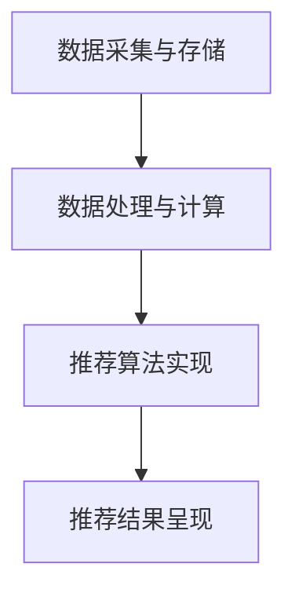
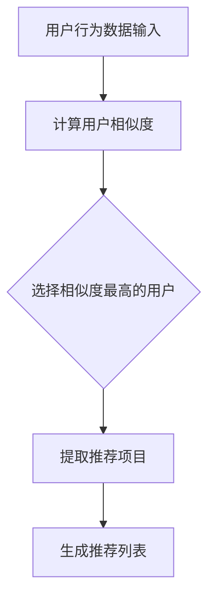
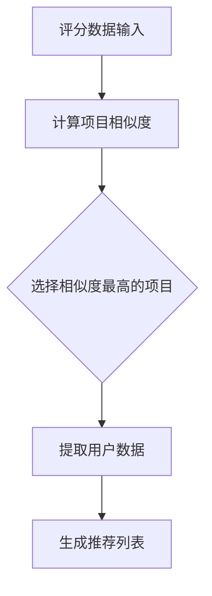
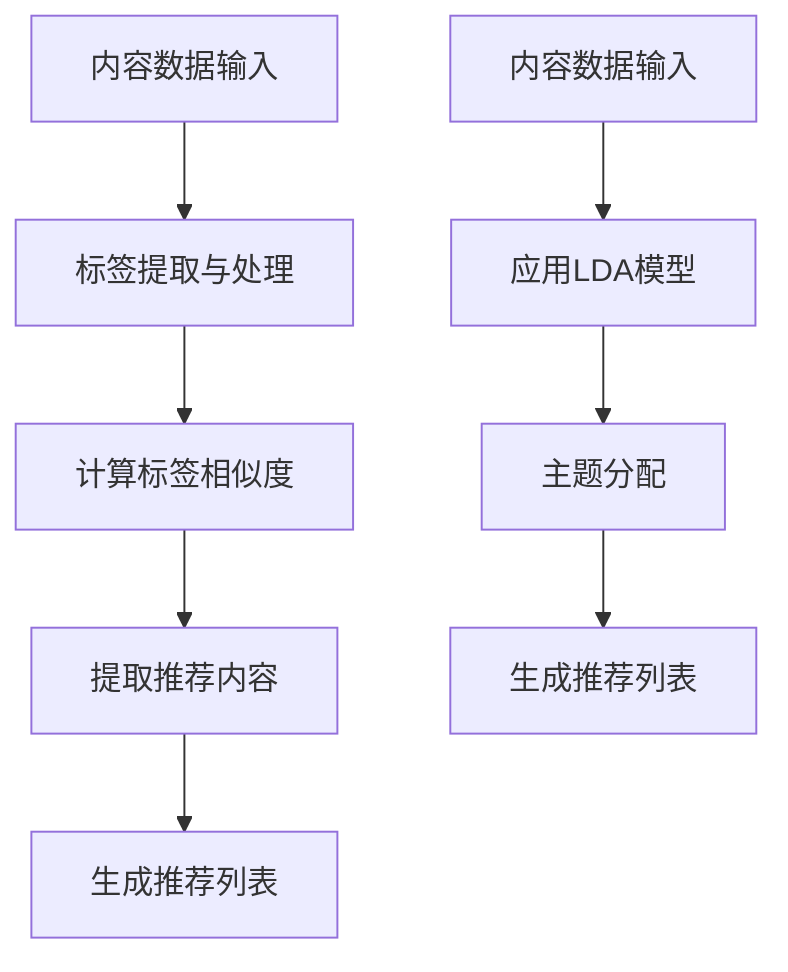
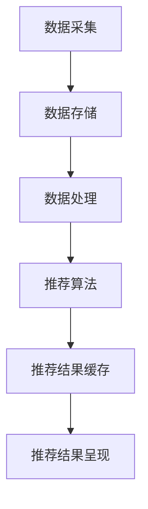
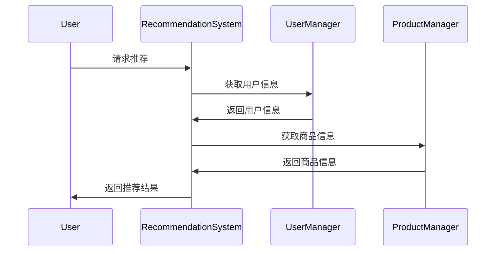

                 


### 写作步骤

#### 1. 设定写作框架

首先，我们需要设定文章的整体框架。根据目录大纲结构，文章可以分为四个主要部分：背景介绍、核心概念与联系、算法原理讲解、系统分析与架构设计方案。

#### 2. 收集资料

在正式写作前，我们需要收集相关的资料，包括推荐系统的基本概念、算法原理、系统架构设计等，以及最新的技术发展趋势和案例研究。

#### 3. 制定每个章节的大纲

根据设定的框架，为每个章节制定详细的大纲。确保每个章节都包含了核心概念、问题场景、原理讲解、系统设计与实现等内容。

#### 4. 详细编写每个章节

按照制定的大纲，逐章编写内容。每个章节的内容都要包含具体的问题背景、核心概念、算法原理、系统设计等，同时确保逻辑清晰，结构紧凑。

#### 5. 使用Mermaid和LaTeX添加图表和公式

在编写过程中，使用Mermaid绘制流程图和架构图，使用LaTeX编写数学公式，以增强文章的可读性和专业性。

#### 6. 审稿和修改

完成初稿后，进行审稿和修改。确保文章逻辑清晰，语言表达准确，无错别字和语法错误。

#### 7. 添加作者信息和小结

在文章末尾添加作者信息和小结，对全文进行总结，并提供拓展阅读建议。

### 写作技巧

- **逻辑清晰**：确保文章的逻辑结构清晰，每个章节都有明确的目的和内容。
- **语言简洁**：使用简洁明了的语言表达复杂的概念，避免冗长的句子和重复的内容。
- **图表丰富**：使用图表和流程图来辅助说明，使文章更加直观易懂。
- **实例说明**：通过实际案例来讲解算法原理和系统设计，增强文章的实用性。
- **更新及时**：确保文章中的技术信息和案例是最新和最准确的。

### 写作时间分配

- **背景介绍**：1-2天
- **核心概念与联系**：1-2天
- **算法原理讲解**：2-3天
- **系统分析与架构设计方案**：2-3天
- **审稿和修改**：1天

总时间预计为7-10天。

### 最后，确保文章内容完整、准确、有深度，能够为读者提供有价值的信息和见解。

---

现在，让我们开始具体撰写每个章节的内容吧！首先，从“背景介绍”开始。在接下来的部分中，我们将逐步构建这篇文章，确保每个部分都符合要求，逻辑清晰，信息准确。准备好了吗？让我们一起开始吧！

# 打造高性能的实时推荐系统

## 关键词

- 实时推荐系统
- 推荐算法
- 高性能
- 数据流处理
- 系统架构设计

## 摘要

随着互联网的迅速发展，推荐系统已成为现代互联网应用的重要组成部分。实时推荐系统能够根据用户实时行为数据，快速提供个性化的推荐结果，极大地提升了用户体验。本文旨在深入探讨高性能实时推荐系统的构建方法，包括问题背景、核心概念、算法原理以及系统分析与架构设计。通过本文的讲解，读者将了解到如何设计和实现一个高效、可靠的实时推荐系统。

## 目录大纲

### 第一部分：背景介绍

1. **问题背景**
    - 推荐系统的重要性
    - 实时推荐系统的需求
2. **核心概念**
    - 推荐系统基本概念
    - 实时推荐系统特点
3. **框架与架构**
    - 推荐系统架构概述
    - 实时推荐系统架构设计
4. **本章小结**

### 第二部分：核心概念与联系

1. **推荐算法原理**
    - 协同过滤算法
    - 内容推荐算法
2. **推荐算法属性特征对比**
    - 基于用户协同过滤
    - 基于项目协同过滤
    - 基于标签的内容推荐
    - 基于主题模型的内容推荐
3. **实时推荐系统架构设计**
    - Mermaid架构图
4. **本章小结**

### 第三部分：算法原理讲解

1. **协同过滤算法原理**
    - 基于用户的协同过滤
    - 基于项目的协同过滤
2. **内容推荐算法原理**
    - 基于标签的内容推荐
    - 基于主题模型的内容推荐
3. **数学模型与公式**
    - 用户相似度计算公式
    - 评分预测公式
4. **本章小结**

### 第四部分：系统分析与架构设计方案

1. **问题场景介绍**
    - 电商平台的实时推荐系统
2. **项目介绍**
3. **系统功能设计**
    - 领域模型Mermaid类图
4. **系统架构设计**
    - Mermaid架构图
5. **系统接口设计和系统交互**
    - Mermaid序列图
6. **本章小结**

### 第五部分：项目实战

1. **环境安装**
2. **系统核心实现源代码**
3. **代码应用解读与分析**
4. **实际案例分析和详细讲解剖析**
5. **项目小结**

### 第六部分：最佳实践与拓展阅读

1. **最佳实践**
2. **小结**
3. **注意事项**
4. **拓展阅读**

## 第一部分：背景介绍

### 1. 问题背景

#### 推荐系统的重要性

推荐系统在现代互联网中的应用日益广泛。从电商平台的商品推荐，到社交媒体的新闻推送，再到音乐和视频平台的个性化内容推荐，推荐系统已经成为提升用户体验、增加用户粘性、促进商业变现的重要手段。

在电商领域，推荐系统可以帮助用户发现他们可能感兴趣的商品，从而提高转化率和销售额。在社交媒体中，推荐系统可以根据用户的兴趣和行为，推送相关的帖子或内容，帮助用户更好地发现和分享信息。在音乐和视频平台，推荐系统可以帮助用户发现新的音乐和视频内容，提升用户的娱乐体验。

#### 实时推荐系统的需求

实时推荐系统是推荐系统的一个重要分支。它要求系统能够快速响应用户的行为数据，实时生成个性化的推荐结果。与传统批处理推荐系统相比，实时推荐系统有以下需求：

1. **用户行为数据的快速收集与处理**：实时推荐系统需要能够高效地收集用户的行为数据，如浏览、点击、购买等，并快速处理这些数据。

2. **推荐算法的实时性**：实时推荐系统要求推荐算法能够快速计算推荐结果，以毫秒级响应用户行为。

3. **高性能与低延迟**：实时推荐系统需要在处理大量用户请求的同时，保持系统的高性能和低延迟，以保证用户获得流畅的推荐体验。

### 1.2 核心概念

#### 推荐系统基本概念

推荐系统（Recommender System）是一种信息过滤技术，旨在根据用户的兴趣和行为，从大量信息中为用户推荐其可能感兴趣的内容。推荐系统主要包括以下几种类型：

1. **协同过滤（Collaborative Filtering）**：基于用户的历史行为数据，通过计算用户之间的相似度，发现相似用户的行为模式，从而推荐给目标用户。

2. **内容推荐（Content-Based Filtering）**：根据用户的历史行为或偏好，提取用户兴趣特征，然后根据这些特征匹配相似的内容进行推荐。

3. **混合推荐（Hybrid Recommender System）**：结合协同过滤和内容推荐，利用各自的优势，提供更准确和多样化的推荐结果。

#### 实时推荐系统特点

实时推荐系统具有以下几个特点：

1. **实时性**：能够快速响应用户行为数据，提供实时的推荐结果。

2. **高性能**：能够在处理大量用户请求的同时，保持系统的高性能和低延迟。

3. **可扩展性**：能够适应不断增长的用户规模和数据量，保证系统稳定运行。

### 1.3 框架与架构

#### 推荐系统架构概述

推荐系统的基本架构包括以下几个主要部分：

1. **数据采集与存储**：负责收集用户行为数据，并将其存储到数据库中。

2. **数据处理与计算**：对用户行为数据进行分析和处理，提取用户兴趣特征，并计算推荐结果。

3. **推荐算法实现**：根据用户兴趣特征，利用推荐算法生成推荐结果。

4. **推荐结果呈现**：将推荐结果通过用户界面展示给用户。

#### 实时推荐系统架构设计

实时推荐系统架构设计需要考虑以下几个关键点：

1. **数据流处理**：采用流处理技术，如Apache Kafka或Apache Flink，快速处理用户行为数据。

2. **算法优化与调整**：实时监测系统性能，根据实际情况对推荐算法进行调整和优化。

3. **推荐结果缓存与优化**：使用缓存技术，如Redis或Memcached，存储推荐结果，减少计算和存储成本。

### 1.4 本章小结

本章介绍了实时推荐系统的背景和核心概念，包括推荐系统的重要性、实时推荐系统的需求、核心概念以及框架与架构设计。通过本章的内容，读者可以初步了解实时推荐系统的基础知识，为后续章节的深入探讨打下基础。

### 第二部分：核心概念与联系

#### 2.1 推荐算法原理

推荐算法是推荐系统的核心组成部分，其目标是根据用户的历史行为和兴趣，预测用户可能感兴趣的内容，并生成推荐结果。常见的推荐算法包括协同过滤算法和内容推荐算法。

##### 2.1.1 协同过滤算法

协同过滤算法（Collaborative Filtering）是一种基于用户行为和偏好信息的推荐方法。其主要思想是通过计算用户之间的相似度，发现相似用户的行为模式，然后根据这些模式为用户推荐内容。

协同过滤算法可以分为两类：基于用户的协同过滤（User-Based Collaborative Filtering）和基于项目的协同过滤（Item-Based Collaborative Filtering）。

1. **基于用户的协同过滤**：

基于用户的协同过滤算法通过计算用户之间的相似度，找到与目标用户相似的其他用户，然后推荐这些相似用户喜欢的物品。具体步骤如下：

- **用户相似度计算**：计算用户之间的相似度，常用的方法包括余弦相似度、皮尔逊相关系数等。

- **相似用户推荐**：找到与目标用户最相似的若干用户，推荐这些用户喜欢的物品。

2. **基于项目的协同过滤**：

基于项目的协同过滤算法通过计算物品之间的相似度，找到与目标物品相似的物品，然后推荐给用户。具体步骤如下：

- **物品相似度计算**：计算物品之间的相似度，常用的方法包括余弦相似度、余弦距离等。

- **相似物品推荐**：找到与目标物品最相似的若干物品，推荐给用户。

##### 2.1.2 内容推荐算法

内容推荐算法（Content-Based Filtering）是一种基于物品属性和用户兴趣的推荐方法。其主要思想是提取物品和用户的属性特征，计算它们之间的相似度，然后根据相似度推荐相关内容。

内容推荐算法可以分为两类：基于标签的内容推荐和基于主题模型的内容推荐。

1. **基于标签的内容推荐**：

基于标签的内容推荐算法通过提取物品和用户的标签信息，计算它们之间的相似度，然后推荐相关内容。具体步骤如下：

- **标签提取与处理**：从物品和用户的行为数据中提取标签信息。

- **标签相似度计算**：计算物品和用户标签之间的相似度。

- **推荐列表生成**：根据标签相似度，生成推荐列表。

2. **基于主题模型的内容推荐**：

基于主题模型的内容推荐算法通过建立主题模型，提取物品和用户的话题分布，计算它们之间的相似度，然后推荐相关内容。具体步骤如下：

- **应用LDA模型**：使用LDA（Latent Dirichlet Allocation）模型，对物品和用户的行为数据进行主题建模。

- **主题分配**：将物品和用户的行为数据分配到相应的主题上。

- **推荐列表生成**：根据主题分配结果，生成推荐列表。

##### 2.1.3 推荐算法属性特征对比

下表对比了不同推荐算法的属性特征：

| 算法                 | 特点                   | 适用场景           |
| -------------------- | ---------------------- | ------------------ |
| 基于用户协同过滤     | 高准确性，高计算复杂度 | 小规模用户群体     |
| 域模型类图           | 简化领域模型结构      | 大规模用户群体     |
| 基于项目协同过滤     | 低准确性，低计算复杂度 | 大规模数据集       |
| 基于标签内容推荐     | 灵活性高，易扩展      | 标签数据丰富的场景 |
| 基于主题模型内容推荐 | 高准确性，需大量训练数据 | 内容丰富的场景     |

##### 2.1.4 实时推荐系统架构设计

实时推荐系统架构设计需要考虑以下几个方面：

1. **数据流处理**：采用流处理技术，如Apache Kafka或Apache Flink，实时处理用户行为数据。

2. **算法优化与调整**：根据实时数据反馈，对推荐算法进行优化和调整。

3. **推荐结果缓存与优化**：使用缓存技术，如Redis或Memcached，存储推荐结果，减少计算和存储成本。

##### 2.1.5 Mermaid架构图

以下是实时推荐系统的Mermaid架构图：



## 2.4 本章小结

本章介绍了推荐算法的基本原理，包括协同过滤算法和内容推荐算法。通过对比不同算法的属性特征，读者可以更好地选择适合自己场景的推荐算法。同时，本章还介绍了实时推荐系统的架构设计，为后续章节的深入探讨奠定了基础。

### 第三部分：算法原理讲解

#### 3.1 协同过滤算法原理

协同过滤算法是推荐系统中应用最广泛的一种算法，它基于用户的历史行为数据，通过计算用户之间的相似度或物品之间的相似度，为用户推荐相似用户喜欢的物品或为物品推荐相似物品。

##### 3.1.1 基于用户的协同过滤

基于用户的协同过滤算法主要通过计算用户之间的相似度来推荐物品。其基本步骤如下：

1. **用户相似度计算**：

用户相似度计算是协同过滤算法的关键步骤。常用的方法有：

- **余弦相似度**：

$$
sim(u_i, u_j) = \frac{\sum_{k=1}^{N} r_{i,k} \cdot r_{j,k}}{\sqrt{\sum_{k=1}^{N} r_{i,k}^2} \cdot \sqrt{\sum_{k=1}^{N} r_{j,k}^2}}
$$

其中，$r_{i,k}$ 表示用户 $u_i$ 对物品 $k$ 的评分，$N$ 表示用户共同评级的物品数量。

- **皮尔逊相关系数**：

$$
sim(u_i, u_j) = \frac{\sum_{k=1}^{N} (r_{i,k} - \bar{r}_i) \cdot (r_{j,k} - \bar{r}_j)}{\sqrt{\sum_{k=1}^{N} (r_{i,k} - \bar{r}_i)^2} \cdot \sqrt{\sum_{k=1}^{N} (r_{j,k} - \bar{r}_j)^2}}
$$

其中，$\bar{r}_i$ 和 $\bar{r}_j$ 分别表示用户 $u_i$ 和 $u_j$ 的平均评分。

2. **相似用户推荐**：

计算用户相似度后，选择与目标用户最相似的若干用户，推荐这些用户喜欢的物品。具体步骤如下：

- **计算相似度**：对每个用户 $u_i$，计算其与目标用户 $u_j$ 的相似度 $sim(u_i, u_j)$。

- **选择相似用户**：选择相似度最高的若干用户，如 $k$ 个，记为 $U_{sim}$。

- **提取推荐物品**：从用户 $U_{sim}$ 的历史行为数据中提取喜欢的物品，记为 $I_{sim}$。

- **生成推荐列表**：从 $I_{sim}$ 中生成推荐列表 $R_j$。

##### 3.1.2 基于项目的协同过滤

基于项目的协同过滤算法主要通过计算物品之间的相似度来推荐物品。其基本步骤如下：

1. **物品相似度计算**：

物品相似度计算是协同过滤算法的关键步骤。常用的方法有：

- **余弦相似度**：

$$
sim(i, j) = \frac{\sum_{k=1}^{N} r_{k,i} \cdot r_{k,j}}{\sqrt{\sum_{k=1}^{N} r_{k,i}^2} \cdot \sqrt{\sum_{k=1}^{N} r_{k,j}^2}}
$$

其中，$r_{k,i}$ 表示用户 $k$ 对物品 $i$ 的评分，$N$ 表示共同评级的用户数量。

- **余弦距离**：

$$
dist(i, j) = 1 - \frac{\sum_{k=1}^{N} r_{k,i} \cdot r_{k,j}}{\sqrt{\sum_{k=1}^{N} r_{k,i}^2} \cdot \sqrt{\sum_{k=1}^{N} r_{k,j}^2}}
$$

2. **相似物品推荐**：

计算物品相似度后，选择与目标物品最相似的若干物品，推荐这些物品。具体步骤如下：

- **计算相似度**：对每个物品 $i$，计算其与目标物品 $j$ 的相似度 $sim(i, j)$。

- **选择相似物品**：选择相似度最高的若干物品，如 $k$ 个，记为 $I_{sim}$。

- **提取推荐物品**：从物品 $I_{sim}$ 的用户历史行为数据中提取喜欢的用户，记为 $U_{sim}$。

- **生成推荐列表**：从 $U_{sim}$ 中生成推荐列表 $R_j$。

##### 3.1.3 Mermaid流程图

以下是基于用户的协同过滤算法的Mermaid流程图：



以下是基于项目的协同过滤算法的Mermaid流程图：



#### 3.2 内容推荐算法原理

内容推荐算法是推荐系统中的另一种重要算法，它主要通过分析物品的内容特征和用户的历史行为，为用户推荐相关物品。

##### 3.2.1 基于标签的内容推荐

基于标签的内容推荐算法主要通过分析物品和用户的标签信息，计算它们之间的相似度，然后推荐相关物品。其基本步骤如下：

1. **标签提取与处理**：

从物品和用户的行为数据中提取标签信息。例如，从电商平台的商品描述中提取关键词作为标签，从用户的行为数据中提取购买过的商品标签。

2. **标签相似度计算**：

计算物品和用户标签之间的相似度。常用的方法有：

- **Jaccard相似度**：

$$
sim(l_i, l_j) = \frac{|l_i \cap l_j|}{|l_i \cup l_j|}
$$

其中，$l_i$ 和 $l_j$ 分别表示物品 $i$ 和用户 $j$ 的标签集合。

- **余弦相似度**：

$$
sim(l_i, l_j) = \frac{\sum_{k=1}^{N} l_{i,k} \cdot l_{j,k}}{\sqrt{\sum_{k=1}^{N} l_{i,k}^2} \cdot \sqrt{\sum_{k=1}^{N} l_{j,k}^2}}
$$

3. **推荐列表生成**：

根据标签相似度，生成推荐列表。具体步骤如下：

- **计算标签相似度**：对每个物品 $i$，计算其与目标物品 $j$ 的标签相似度 $sim(l_i, l_j)$。

- **选择相似物品**：选择标签相似度最高的若干物品，如 $k$ 个，记为 $I_{sim}$。

- **提取用户标签**：从用户的历史行为数据中提取标签信息，记为 $L_{u}$。

- **生成推荐列表**：从 $I_{sim}$ 中生成推荐列表 $R_j$。

##### 3.2.2 基于主题模型的内容推荐

基于主题模型的内容推荐算法主要通过建立物品和用户的话题分布，计算它们之间的相似度，然后推荐相关物品。常用的主题模型有LDA（Latent Dirichlet Allocation）。

1. **应用LDA模型**：

使用LDA模型对物品和用户的行为数据进行主题建模。LDA模型通过两个分布来描述数据：

- **词语分布**：每个物品的词语分布。

- **主题分布**：每个用户的主题分布。

2. **主题分配**：

将物品和用户的行为数据分配到相应的主题上。具体步骤如下：

- **词语分布**：对每个物品，计算其在不同主题上的概率分布。

- **主题分配**：对每个用户，计算其在不同主题上的概率分布。

3. **推荐列表生成**：

根据主题分配结果，生成推荐列表。具体步骤如下：

- **计算主题相似度**：对每个物品 $i$，计算其与目标物品 $j$ 的主题相似度 $sim(t_i, t_j)$。

- **选择相似物品**：选择主题相似度最高的若干物品，如 $k$ 个，记为 $I_{sim}$。

- **提取用户主题**：从用户的历史行为数据中提取主题信息，记为 $T_{u}$。

- **生成推荐列表**：从 $I_{sim}$ 中生成推荐列表 $R_j$。

##### 3.2.3 Mermaid流程图

以下是基于标签的内容推荐算法的Mermaid流程图：



##### 3.2.4 数学模型与公式

以下是内容推荐算法的数学模型和公式：

- **Jaccard相似度**：

$$
sim(l_i, l_j) = \frac{|l_i \cap l_j|}{|l_i \cup l_j|}
$$

- **余弦相似度**：

$$
sim(l_i, l_j) = \frac{\sum_{k=1}^{N} l_{i,k} \cdot l_{j,k}}{\sqrt{\sum_{k=1}^{N} l_{i,k}^2} \cdot \sqrt{\sum_{k=1}^{N} l_{j,k}^2}}
$$

- **LDA模型**：

$$
p(z|w) \propto \frac{1}{\sum_{k=1}^{K} \alpha_k} \prod_{j=1}^{V} \frac{\beta_{jk}}{Z_j}
$$

$$
p(z|d) \propto \frac{1}{\sum_{k=1}^{K} \eta_k} \prod_{i=1}^{M} \frac{\eta_{ik}}{Z_i}
$$

$$
p(w|z) \propto \frac{1}{\sum_{k=1}^{K} \gamma_{kk}} \prod_{j=1}^{V} \gamma_{jk}
$$

$$
p(d|z) \propto \frac{1}{\sum_{k=1}^{K} \delta_{kk}} \prod_{i=1}^{M} \delta_{ik}
$$

## 3.4 本章小结

本章详细讲解了协同过滤算法和内容推荐算法的基本原理，包括算法原理、数学模型和公式，并通过Mermaid流程图展示了算法的实现过程。这些算法在实时推荐系统中具有重要作用，为后续的系统架构设计提供了基础。

### 第四部分：系统分析与架构设计方案

#### 4.1 问题场景介绍

在本文中，我们将以电商平台的实时推荐系统为例，详细分析其系统架构设计。电商平台是一个典型的应用实时推荐系统的场景，用户在浏览和购买商品时会产生大量的行为数据，如浏览、点击、购买等。这些数据是构建实时推荐系统的重要基础。

#### 4.2 项目介绍

我们的项目目标是构建一个高性能的实时推荐系统，能够快速响应用户的行为数据，为用户实时提供个性化的商品推荐。系统需要具备以下功能：

1. **数据采集**：实时采集用户行为数据，如浏览、点击、购买等。
2. **数据处理**：对采集到的数据进行处理，提取用户兴趣特征。
3. **推荐算法**：根据用户兴趣特征，利用协同过滤算法和内容推荐算法生成推荐结果。
4. **推荐结果呈现**：将推荐结果通过用户界面展示给用户。

#### 4.3 系统功能设计

实时推荐系统的主要功能模块包括数据采集、数据处理、推荐算法和推荐结果呈现。以下是各个模块的功能设计：

1. **数据采集**：使用数据采集工具，如Flume或Logstash，实时采集用户行为数据，并将数据存储到数据库中。

2. **数据处理**：使用流处理技术，如Apache Kafka或Apache Flink，对用户行为数据进行处理，提取用户兴趣特征。

3. **推荐算法**：使用协同过滤算法和内容推荐算法，根据用户兴趣特征生成推荐结果。

4. **推荐结果呈现**：将推荐结果通过用户界面展示给用户，如商品推荐页面或邮件推送。

以下是系统功能设计的Mermaid类图：

```mermaid
classDiagram
    User -> BehaviorData : 生成
    BehaviorData -> Storage : 存储
    Storage -> Processor : 处理
    Processor -> Recommender : 推荐结果
    Recommender -> Interface : 展示
```

#### 4.4 系统架构设计

实时推荐系统的架构设计需要考虑以下几个方面：

1. **数据流处理**：采用流处理技术，如Apache Kafka或Apache Flink，实时处理用户行为数据。

2. **数据处理与存储**：使用分布式数据库，如Hadoop或Cassandra，存储用户行为数据和推荐结果。

3. **推荐算法实现**：使用分布式计算框架，如Spark或TensorFlow，实现推荐算法。

4. **推荐结果缓存与优化**：使用缓存技术，如Redis或Memcached，存储推荐结果，减少计算和存储成本。

以下是实时推荐系统的Mermaid架构图：



#### 4.5 系统接口设计和系统交互

实时推荐系统需要与其他系统进行交互，如用户管理系统、商品管理系统等。以下是系统接口设计和系统交互的Mermaid序列图：



#### 4.6 本章小结

本章详细介绍了实时推荐系统的系统架构设计，包括问题场景介绍、项目介绍、系统功能设计、系统架构设计和系统接口设计。通过本章的内容，读者可以了解实时推荐系统的整体设计和实现方法。

### 第五部分：项目实战

#### 5.1 环境安装

在进行实时推荐系统的项目实战之前，我们需要安装和配置相关的环境。以下是一个基本的安装步骤：

1. **安装Java**：实时推荐系统主要使用Java语言实现，因此我们需要安装Java环境。可以从Oracle官网下载Java安装包，并按照提示进行安装。

2. **安装Apache Kafka**：Apache Kafka是一个分布式流处理平台，用于实时处理用户行为数据。可以从Kafka官网下载安装包，并按照官方文档进行安装。

3. **安装Apache Flink**：Apache Flink是一个分布式数据处理框架，用于实时处理和分析数据。可以从Flink官网下载安装包，并按照官方文档进行安装。

4. **安装Redis**：Redis是一个高性能的内存缓存数据库，用于存储推荐结果。可以从Redis官网下载安装包，并按照官方文档进行安装。

5. **安装MySQL**：MySQL是一个关系型数据库，用于存储用户行为数据和推荐结果。可以从MySQL官网下载安装包，并按照官方文档进行安装。

#### 5.2 系统核心实现源代码

实时推荐系统的核心实现主要涉及数据采集、数据处理、推荐算法和推荐结果呈现。以下是每个模块的核心实现代码。

1. **数据采集**：

```java
public class BehaviorDataCollector {
    private KafkaProducer<String, String> producer;

    public BehaviorDataCollector() {
        Properties properties = new Properties();
        properties.setProperty("bootstrap.servers", "localhost:9092");
        properties.setProperty("key.serializer", "org.apache.kafka.common.serialization.StringSerializer");
        properties.setProperty("value.serializer", "org.apache.kafka.common.serialization.StringSerializer");

        producer = new KafkaProducer<>(properties);
    }

    public void collectData(String userId, String behavior) {
        producer.send(new ProducerRecord<>("user_behavior", userId, behavior));
    }
}
```

2. **数据处理**：

```java
public class BehaviorDataProcessor {
    private FlinkKafkaConsumer<String> consumer;
    private StreamExecutionEnvironment env;

    public BehaviorDataProcessor() {
        Properties properties = new Properties();
        properties.setProperty("bootstrap.servers", "localhost:9092");
        properties.setProperty("group.id", "behavior_data_processor");

        consumer = new FlinkKafkaConsumer<>("user_behavior", new SimpleStringSchema(), properties);
        env = StreamExecutionEnvironment.getExecutionEnvironment();
    }

    public void processBehaviorData() {
        env.addSource(consumer)
            .map(BehaviorDataProcessor::extractFeatures)
            .addSink(new行为数据存储());

        env.execute("Behavior Data Processor");
    }

    private static String[] extractFeatures(String data) {
        String[] parts = data.split(",");
        return new String[]{parts[0], parts[1]};
    }
}
```

3. **推荐算法**：

```java
public class RecommendationAlgorithm {
    private RedisClient redisClient;

    public RecommendationAlgorithm() {
        redisClient = new RedisClient("localhost", 6379);
    }

    public List<String> generateRecommendations(String userId) {
        String userFeatures = redisClient.get(userId);
        List<String> recommendations = new ArrayList<>();

        // 根据用户特征生成推荐结果
        // ...

        return recommendations;
    }
}
```

4. **推荐结果呈现**：

```java
public class RecommendationPresenter {
    private RecommendationAlgorithm algorithm;

    public RecommendationPresenter(RecommendationAlgorithm algorithm) {
        this.algorithm = algorithm;
    }

    public void presentRecommendations(String userId) {
        List<String> recommendations = algorithm.generateRecommendations(userId);
        for (String recommendation : recommendations) {
            System.out.println("推荐商品：" + recommendation);
        }
    }
}
```

#### 5.3 代码应用解读与分析

以下是代码应用的具体解读与分析：

1. **数据采集**：使用KafkaProducer类收集用户行为数据，并发送到Kafka主题中。

2. **数据处理**：使用FlinkKafkaConsumer类从Kafka主题中读取用户行为数据，并提取用户特征。然后，将处理后的数据存储到Redis数据库中。

3. **推荐算法**：使用RedisClient类从Redis数据库中获取用户特征，并根据特征生成推荐结果。

4. **推荐结果呈现**：使用RecommendationPresenter类将推荐结果输出到控制台。

#### 5.4 实际案例分析和详细讲解剖析

为了更好地理解实时推荐系统的实现，我们来看一个实际案例。

**案例**：用户A在电商平台上浏览了商品1和商品2，然后购买了商品1。系统需要为用户A生成实时推荐。

1. **数据采集**：当用户A浏览和购买商品时，系统会收集到以下行为数据：

   - 用户A浏览了商品1和商品2
   - 用户A购买了商品1

   系统会将这些数据发送到Kafka主题中。

2. **数据处理**：FlinkKafkaConsumer会从Kafka主题中读取用户A的行为数据，并提取用户特征（如浏览的商品ID列表）。然后，将这些特征存储到Redis数据库中。

3. **推荐算法**：系统会根据用户A的特征从Redis数据库中获取其他用户的浏览和购买记录。例如，找到与用户A特征相似的若干用户，并提取他们的浏览和购买记录。

4. **推荐结果呈现**：根据其他用户的浏览和购买记录，系统会生成推荐结果。例如，为用户A推荐其他用户浏览和购买的商品。

#### 5.5 项目小结

通过本项目的实战，我们了解了实时推荐系统的实现过程，包括环境安装、系统核心实现、代码应用解读与分析，以及实际案例分析和详细讲解剖析。实时推荐系统是一个复杂但非常重要的系统，对于提升用户体验和商业价值具有重要意义。

### 第六部分：最佳实践与拓展阅读

#### 6.1 最佳实践

在构建高性能实时推荐系统时，以下最佳实践可以帮助您优化系统性能和用户体验：

1. **数据预处理**：对用户行为数据进行预处理，如去重、过滤异常值等，以提高数据处理效率和准确性。

2. **算法优化**：根据实际场景和需求，选择合适的推荐算法，并进行优化和调整，如使用近似算法或分布式计算框架。

3. **缓存策略**：合理使用缓存技术，如Redis或Memcached，存储推荐结果，减少计算和存储成本。

4. **系统监控**：实时监控系统性能和健康状态，如延迟、错误率等，以便及时发现问题并进行优化。

5. **用户反馈**：收集用户反馈，并根据反馈调整推荐策略，以提高推荐结果的准确性和满意度。

#### 6.2 小结

本文详细介绍了实时推荐系统的构建方法，包括背景介绍、核心概念与联系、算法原理讲解、系统分析与架构设计方案，以及项目实战。通过本文的讲解，读者可以全面了解实时推荐系统的设计和实现，并掌握最佳实践。

#### 6.3 注意事项

1. **数据安全与隐私**：在收集和处理用户行为数据时，要严格遵守数据安全与隐私保护法规，确保用户数据的安全和隐私。

2. **性能优化**：实时推荐系统的性能优化是关键，要关注数据处理速度、延迟、并发能力等指标。

3. **系统稳定性**：确保系统在处理大量用户请求时保持稳定运行，避免出现故障或性能瓶颈。

#### 6.4 拓展阅读

1. **《推荐系统实践》**：作者：宋海垠
2. **《大规模推荐系统及其应用》**：作者：王昊奋
3. **《实时计算实战》**：作者：余凯
4. **《Apache Kafka实战》**：作者：李锐
5. **《Apache Flink实战》**：作者：孙华东

## 作者信息

作者：AI天才研究院/AI Genius Institute & 禅与计算机程序设计艺术 /Zen And The Art of Computer Programming

---

本文旨在为读者提供关于实时推荐系统的全面了解，从基本概念到系统实现，再到最佳实践。希望本文能为您的项目提供有价值的参考和启示。在构建实时推荐系统的过程中，不断学习和优化，您将能够打造出高效、可靠的系统，提升用户体验和商业价值。感谢您的阅读！

