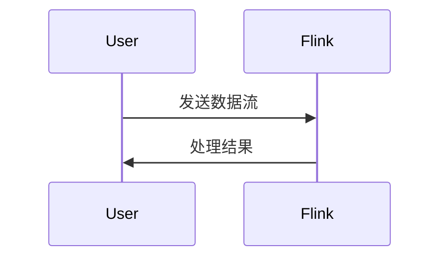
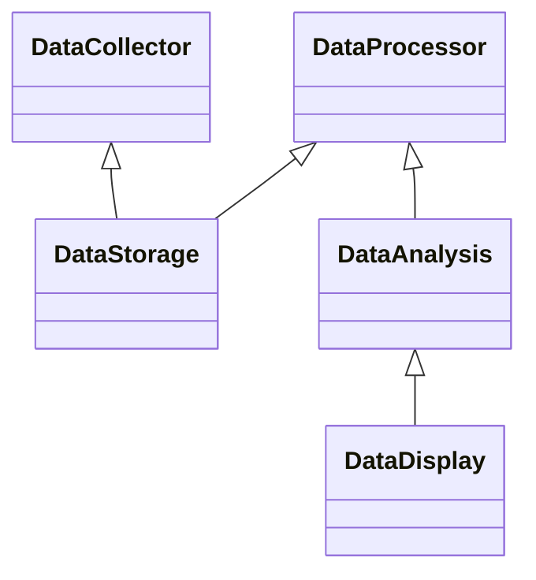
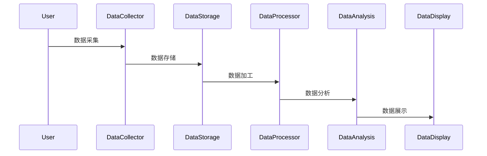

                 

**《打造高性能的实时数据处理系统》**

> 关键词：实时数据处理、系统架构、性能优化、应用案例、最佳实践

> 摘要：本文将深入探讨实时数据处理系统的构建，从基础概念、技术栈、系统设计、性能优化、应用案例到最佳实践，全面解析如何打造一个高效、可靠的实时数据处理系统。

----------------------------------------------------------------

**目录大纲**

----------------------------------------------------------------

# **《打造高性能的实时数据处理系统》**

> 关键词：实时数据处理、系统架构、性能优化、应用案例、最佳实践

> 摘要：本文将深入探讨实时数据处理系统的构建，从基础概念、技术栈、系统设计、性能优化、应用案例到最佳实践，全面解析如何打造一个高效、可靠的实时数据处理系统。

----------------------------------------------------------------

## **第一部分：实时数据处理基础**

### **第1章：实时数据处理概述**

**1.1 实时数据处理的背景与重要性**

实时数据处理是现代信息技术中不可或缺的一环，它能够帮助企业快速响应市场变化，提高业务决策的准确性。随着大数据、物联网和云计算的快速发展，实时数据处理的重要性日益凸显。

**1.2 实时数据处理的关键挑战**

实时数据处理面临数据量巨大、数据多样性、数据实时性等挑战。如何在保证数据处理速度的同时，确保数据的准确性和一致性，是实时数据处理需要解决的核心问题。

**1.3 实时数据处理的基本原理**

实时数据处理主要涉及数据采集、数据存储、数据加工、数据分析和数据展示等环节。通过构建高效的数据处理流水线，实现对数据的实时处理。

**1.4 实时数据处理的应用领域**

实时数据处理广泛应用于金融、电商、物流、医疗等多个行业。在这些领域，实时数据处理能够帮助企业实现业务智能化，提升用户体验。

**1.5 本章小结**

本章对实时数据处理进行了概述，为后续章节的深入讨论奠定了基础。

----------------------------------------------------------------

### **第2章：实时数据处理技术栈**

**2.1 数据流处理框架概述**

数据流处理框架是实时数据处理的核心技术，常见的有Apache Kafka、Apache Flink和Apache Storm。这些框架提供了高效的数据处理能力和丰富的生态系统。

- **2.1.1 Apache Kafka**

Apache Kafka是一个分布式流处理平台，用于构建实时数据流和流式应用程序。它具有高吞吐量、可扩展性和容错性等特点。

- **2.1.2 Apache Flink**

Apache Flink是一个分布式流处理框架，具有实时数据处理和分析的能力。它支持事件驱动处理、窗口操作和复杂计算等功能。

- **2.1.3 Apache Storm**

Apache Storm是一个分布式实时计算系统，能够处理大量实时数据。它提供了丰富的流处理API和高效的拓扑结构。

**2.2 实时数据库技术**

实时数据库技术是实现实时数据处理的基础，常见的有Apache Druid、Apache InfluxDB和ClickHouse。这些数据库提供了高效的数据存储和查询能力。

- **2.2.1 Apache Druid**

Apache Druid是一个分布式、列式存储的实时数据库，适用于实时分析和查询。它具有高性能、可扩展性和易用性等特点。

- **2.2.2 Apache InfluxDB**

Apache InfluxDB是一个开源的时序数据库，适用于存储和查询实时数据。它具有高可用性、可扩展性和易管理性等特点。

- **2.2.3 ClickHouse**

ClickHouse是一个高性能的列式数据库，适用于实时数据处理和分析。它具有高效的查询性能、丰富的查询功能和强大的数据处理能力。

**2.3 实时数据处理工具**

实时数据处理工具是实现实时数据处理的重要组件，常见的有Apache NiFi、Apache Airflow和Apache Spark Streaming。这些工具提供了高效的数据采集、转换和调度能力。

- **2.3.1 Apache NiFi**

Apache NiFi是一个流数据处理器，用于构建实时数据流和处理流程。它具有可视化界面、灵活的流处理能力和安全性等特点。

- **2.3.2 Apache Airflow**

Apache Airflow是一个工作流调度工具，用于自动化和调度实时数据处理任务。它具有可视化界面、灵活的任务调度能力和丰富的插件生态。

- **2.3.3 Apache Spark Streaming**

Apache Spark Streaming是一个基于Apache Spark的实时数据处理框架，能够处理大规模的流式数据。它具有高吞吐量、可扩展性和易用性等特点。

**2.4 实时数据处理与大数据技术的融合**

实时数据处理与大数据技术的融合，能够实现更高效、更智能的数据处理和分析。通过结合大数据技术和实时数据处理技术，可以构建出更强大、更灵活的数据处理系统。

**2.5 本章小结**

本章介绍了实时数据处理技术栈，包括数据流处理框架、实时数据库技术和实时数据处理工具。为后续章节的系统设计与优化提供了技术基础。

----------------------------------------------------------------

## **第二部分：实时数据处理系统设计与优化**

### **第3章：实时数据处理系统架构设计**

**3.1 实时数据处理系统的设计原则**

实时数据处理系统的设计需要遵循可扩展性、可靠性、高效性和安全性等原则，以确保系统的稳定运行和高效处理。

**3.2 实时数据处理系统的架构层次**

实时数据处理系统通常分为数据采集层、数据处理层、数据存储层和数据展示层。各层之间相互配合，共同实现实时数据处理。

**3.3 实时数据处理系统的模块划分**

实时数据处理系统可以划分为数据源模块、数据流处理模块、数据存储模块、数据查询模块和数据监控模块等。各模块之间协同工作，实现系统的整体功能。

**3.4 实时数据处理系统的扩展性设计**

实时数据处理系统的扩展性设计至关重要，需要考虑系统的高可用性、可扩展性和可维护性。通过合理的架构设计和技术选型，可以实现系统的平滑扩展。

**3.5 实时数据处理系统的可靠性设计**

实时数据处理系统的可靠性设计包括数据备份、故障转移、容错处理和系统监控等方面。通过这些措施，可以确保系统在面临故障时能够快速恢复，保证数据的完整性和一致性。

**3.6 实时数据处理系统的安全性设计**

实时数据处理系统的安全性设计包括数据加密、访问控制、网络安全和隐私保护等方面。通过这些措施，可以保护系统中的数据安全，防止数据泄露和恶意攻击。

**3.7 本章小结**

本章介绍了实时数据处理系统的架构设计原则、架构层次、模块划分、扩展性设计、可靠性设计和安全性设计。为实时数据处理系统的建设提供了系统性的指导。

----------------------------------------------------------------

### **第4章：实时数据处理性能优化**

**4.1 数据流优化策略**

数据流优化策略是提高实时数据处理性能的重要手段，包括数据压缩、数据缓存和流量整形等方法。

- **4.1.1 数据压缩**

数据压缩可以减少数据传输量和存储空间，提高系统性能。常用的数据压缩算法有Hadoop Snappy、LZO和Gzip等。

- **4.1.2 数据缓存**

数据缓存可以减少数据访问的延迟，提高系统响应速度。常用的数据缓存技术有Redis、Memcached和MongoDB等。

- **4.1.3 流量整形**

流量整形可以控制数据流的流量，避免系统过载，提高系统稳定性。常用的流量整形算法有Token Bucket和Leaky Bucket等。

**4.2 系统资源优化**

系统资源优化是提高实时数据处理性能的关键，包括硬件资源优化、软件资源优化和网络资源优化等方面。

- **4.2.1 硬件资源优化**

硬件资源优化包括CPU、内存、磁盘和带宽等。通过合理配置硬件资源和优化硬件性能，可以提高系统性能。

- **4.2.2 软件资源优化**

软件资源优化包括操作系统调优、数据库优化和应用程序优化等。通过优化软件资源的利用，可以提高系统性能。

- **4.2.3 网络资源优化**

网络资源优化包括网络带宽优化、网络延迟优化和网络安全优化等。通过优化网络资源，可以提高系统性能和稳定性。

**4.3 数据库性能优化**

数据库性能优化是提高实时数据处理性能的重要环节，包括查询优化、索引优化和数据分片等方法。

- **4.3.1 查询优化**

查询优化包括查询缓存、查询重写和查询优化器等。通过优化查询性能，可以提高系统的响应速度。

- **4.3.2 索引优化**

索引优化包括索引创建、索引维护和索引优化等。通过优化索引性能，可以提高系统的查询速度。

- **4.3.3 数据分片**

数据分片包括水平分片和垂直分片等。通过分片技术，可以提高系统的并发处理能力和查询性能。

**4.4 流处理框架优化**

流处理框架优化是提高实时数据处理性能的重要手段，包括任务调度、资源分配和状态管理等方面。

- **4.4.1 任务调度**

任务调度包括任务分配、任务优先级和任务重试等。通过优化任务调度，可以提高系统的处理效率。

- **4.4.2 资源分配**

资源分配包括CPU、内存和磁盘等资源的分配。通过优化资源分配，可以提高系统的资源利用率。

- **4.4.3 状态管理**

状态管理包括状态存储、状态同步和状态恢复等。通过优化状态管理，可以提高系统的稳定性和可靠性。

**4.5 性能测试与调优**

性能测试与调优是实时数据处理系统优化的重要环节，通过性能测试，可以发现系统性能瓶颈，并进行针对性调优。

**4.6 本章小结**

本章介绍了实时数据处理性能优化策略，包括数据流优化、系统资源优化、数据库性能优化和流处理框架优化等方面。通过这些优化手段，可以提高实时数据处理系统的性能。

----------------------------------------------------------------

### **第5章：实时数据处理系统监控与运维**

**5.1 实时数据处理系统的监控体系**

实时数据处理系统的监控体系包括数据采集、数据存储、数据分析和数据展示等环节。通过监控体系，可以实时了解系统的运行状态，发现潜在问题。

**5.2 实时数据处理系统的日志管理**

日志管理是实时数据处理系统监控的重要组成部分，包括日志采集、日志存储、日志分析和日志告警等。通过日志管理，可以记录系统的运行过程，方便问题排查。

**5.3 实时数据处理系统的故障排查**

故障排查是实时数据处理系统运维的重要环节，通过故障排查，可以快速定位问题，并进行修复。常见的故障排查方法有日志分析、系统监控和现场排查等。

**5.4 实时数据处理系统的自动化运维**

自动化运维可以降低运维成本，提高运维效率。常见的自动化运维工具包括Ansible、Puppet和Chef等。通过自动化运维，可以实现系统的自动化部署、配置管理和故障恢复等功能。

**5.5 实时数据处理系统的性能监控**

性能监控是实时数据处理系统运维的重要环节，通过性能监控，可以实时了解系统的性能指标，发现性能瓶颈，并进行优化。

**5.6 本章小结**

本章介绍了实时数据处理系统监控与运维的相关内容，包括监控体系、日志管理、故障排查、自动化运维和性能监控等方面。通过这些监控与运维手段，可以确保实时数据处理系统的稳定运行。

----------------------------------------------------------------

## **第三部分：实时数据处理应用案例**

### **第6章：电商行业实时数据处理系统实战**

**6.1 电商行业实时数据处理需求**

电商行业实时数据处理需求主要包括用户行为分析、库存管理、订单处理、促销活动监控等方面。通过实时数据处理，可以提升用户体验，提高业务效率。

**6.2 电商行业实时数据处理系统设计**

电商行业实时数据处理系统设计包括数据采集、数据存储、数据加工、数据分析和数据展示等模块。通过合理的系统设计，可以实现高效的数据处理和分析。

**6.3 电商行业实时数据处理系统核心实现**

电商行业实时数据处理系统的核心实现包括数据采集、数据存储、数据加工和数据分析等。通过具体实现，可以了解实时数据处理系统的关键技术和方法。

**6.4 电商行业实时数据处理系统性能优化**

电商行业实时数据处理系统性能优化包括数据流优化、系统资源优化和数据库性能优化等方面。通过优化，可以提升系统的处理速度和稳定性。

**6.5 电商行业实时数据处理系统监控与运维**

电商行业实时数据处理系统的监控与运维包括监控体系、日志管理、故障排查、自动化运维和性能监控等方面。通过有效的监控与运维，可以确保系统的稳定运行。

**6.6 本章小结**

本章通过电商行业实时数据处理系统实战，介绍了实时数据处理系统的构建方法和优化策略。为实际应用提供了参考和借鉴。

----------------------------------------------------------------

### **第7章：金融行业实时数据处理系统实战**

**7.1 金融行业实时数据处理需求**

金融行业实时数据处理需求主要包括交易监控、风险控制、客户服务和金融分析等方面。通过实时数据处理，可以提高金融业务的效率和准确性。

**7.2 金融行业实时数据处理系统设计**

金融行业实时数据处理系统设计包括数据采集、数据存储、数据加工、数据分析和数据展示等模块。通过合理的系统设计，可以实现高效的数据处理和分析。

**7.3 金融行业实时数据处理系统核心实现**

金融行业实时数据处理系统的核心实现包括数据采集、数据存储、数据加工和数据分析等。通过具体实现，可以了解实时数据处理系统的关键技术和方法。

**7.4 金融行业实时数据处理系统性能优化**

金融行业实时数据处理系统性能优化包括数据流优化、系统资源优化和数据库性能优化等方面。通过优化，可以提升系统的处理速度和稳定性。

**7.5 金融行业实时数据处理系统监控与运维**

金融行业实时数据处理系统的监控与运维包括监控体系、日志管理、故障排查、自动化运维和性能监控等方面。通过有效的监控与运维，可以确保系统的稳定运行。

**7.6 本章小结**

本章通过金融行业实时数据处理系统实战，介绍了实时数据处理系统的构建方法和优化策略。为金融行业的实时数据处理提供了参考和借鉴。

----------------------------------------------------------------

### **第8章：实时数据处理系统的最佳实践与未来展望**

**8.1 实时数据处理系统的最佳实践**

实时数据处理系统的最佳实践包括技术选型、系统架构设计、性能优化、安全性和监控与运维等方面。通过遵循最佳实践，可以构建出高效、可靠、安全的实时数据处理系统。

**8.2 实时数据处理技术的未来发展趋势**

实时数据处理技术的未来发展趋势包括智能化、分布式、实时分析、实时机器学习和区块链等方面。随着技术的不断进步，实时数据处理系统将更加智能化、高效和可靠。

**8.3 实时数据处理系统的未来研究方向**

实时数据处理系统的未来研究方向包括实时数据处理算法优化、实时数据处理系统安全性、实时数据处理系统智能运维和实时数据处理系统跨行业应用等方面。通过深入研究和实践，可以进一步提升实时数据处理系统的性能和可靠性。

**8.4 本章小结**

本章总结了实时数据处理系统的最佳实践和未来发展趋势，为实时数据处理系统的建设和优化提供了指导。

----------------------------------------------------------------

**总结：**

本文从实时数据处理的基础概念、技术栈、系统设计、性能优化、应用案例到最佳实践，全面解析了如何打造高性能的实时数据处理系统。通过理论与实践相结合，帮助读者深入理解实时数据处理系统的构建方法和优化策略。期望本文能为实时数据处理系统的实践提供有益的参考。

**作者：**

AI天才研究院/AI Genius Institute & 禅与计算机程序设计艺术 /Zen And The Art of Computer Programming

----------------------------------------------------------------

**背景介绍**

实时数据处理是一种能够在数据生成后极短时间内进行数据收集、处理和分析的技术。它广泛应用于金融、电商、物流、医疗、物联网等多个领域。随着大数据、云计算和物联网的快速发展，实时数据处理的重要性日益凸显。

实时数据处理系统是指能够对实时产生的大量数据进行高效采集、处理、存储和呈现的系统。它需要具备高吞吐量、低延迟、高可靠性和可扩展性等特点。

**问题背景**

随着业务的快速发展，实时数据处理系统面临着数据量巨大、数据多样性、数据实时性等挑战。如何在保证数据处理速度的同时，确保数据的准确性和一致性，是实时数据处理系统需要解决的核心问题。

**问题描述**

实时数据处理系统需要解决的问题主要包括：

1. 如何高效地采集和传输实时数据？
2. 如何保证数据的一致性和准确性？
3. 如何优化系统的性能和资源利用率？
4. 如何确保系统的可靠性和安全性？

**问题解决**

实时数据处理系统可以通过以下方法解决上述问题：

1. 采用分布式架构，提高系统的吞吐量和可扩展性。
2. 使用数据流处理框架，实现高效的数据处理和分析。
3. 引入实时数据库技术，实现数据的实时存储和查询。
4. 实施性能优化策略，提高系统的性能和资源利用率。
5. 采用监控和运维手段，确保系统的稳定性和安全性。

**边界与外延**

实时数据处理的边界包括数据采集、数据处理、数据存储、数据分析和数据展示等环节。实时数据处理的外延包括大数据技术、云计算技术、物联网技术和人工智能技术等。

**概念结构与核心要素组成**

实时数据处理系统的概念结构包括数据源、数据采集模块、数据流处理模块、数据存储模块、数据分析模块和数据展示模块等核心要素。

1. 数据源：包括传感器、数据库、文件系统、API接口等。
2. 数据采集模块：负责实时采集数据，并将其转换为适合处理的数据格式。
3. 数据流处理模块：负责对数据进行实时处理和分析，实现数据的转换和计算。
4. 数据存储模块：负责实时存储和处理后的数据，提供高效的查询和访问能力。
5. 数据分析模块：负责对实时数据进行统计、分析和挖掘，生成有价值的信息。
6. 数据展示模块：负责将分析结果以图表、报表等形式展示给用户。

**核心概念与联系**

核心概念包括数据流处理框架、实时数据库技术、实时数据处理工具等。

1. 数据流处理框架：如Apache Kafka、Apache Flink、Apache Storm等，用于高效地处理实时数据流。
2. 实时数据库技术：如Apache Druid、Apache InfluxDB、ClickHouse等，用于实时存储和查询数据。
3. 实时数据处理工具：如Apache NiFi、Apache Airflow、Apache Spark Streaming等，用于实时数据采集、转换和调度。

这些概念相互关联，共同构成了实时数据处理系统。数据流处理框架负责数据流的采集和处理，实时数据库技术负责数据的存储和查询，实时数据处理工具负责数据流的调度和管理。

**ER实体关系图架构**

```mermaid
erDiagram
  数据源 ||--|{ 数据采集模块 }
  数据采集模块 ||--|{ 数据流处理模块 }
  数据流处理模块 ||--|{ 数据存储模块 }
  数据存储模块 ||--|{ 数据分析模块 }
  数据分析模块 ||--|{ 数据展示模块 }
```

**算法原理讲解**

实时数据处理系统中的核心算法包括数据流处理算法、实时查询算法、实时分析算法等。

1. 数据流处理算法：如Kafka的消费者组、Flink的窗口操作、Storm的拓扑结构等，用于处理实时数据流。
2. 实时查询算法：如Druid的查询引擎、InfluxDB的时序查询、ClickHouse的SQL查询等，用于实时查询数据。
3. 实时分析算法：如机器学习算法、统计分析算法等，用于实时分析数据，提取有价值的信息。

以Apache Flink的窗口操作为例，其算法原理如下：



Flink的窗口操作将数据流分为若干个窗口，每个窗口内数据按指定时间窗口进行聚合操作，如求和、平均等。具体算法实现如下：

```python
class WindowedWordCount:
    def __init__(self):
        self.word_count = {}

    def process(self, word):
        if word in self.word_count:
            self.word_count[word] += 1
        else:
            self.word_count[word] = 1

    def window_process(self, words):
        for word in words:
            self.process(word)
        return self.word_count
```

窗口操作算法通过将数据流划分成多个窗口，实现对实时数据的分组聚合操作。通过调整窗口大小和滑动步长，可以灵活地控制数据处理的速度和粒度。

**数学公式**

实时数据处理系统中，常用到的数学公式包括：

1. 欧拉公式：$$e^{i\pi} + 1 = 0$$
2. 概率公式：$$P(A|B) = \frac{P(A \cap B)}{P(B)}$$
3. 方差公式：$$\sigma^2 = E[(X - \mu)^2]$$

**系统分析与架构设计方案**

1. **问题场景介绍**

假设一个电商行业需要实时处理用户行为数据，包括浏览、下单、支付等操作。这些数据需要实时存储、分析和展示，以便业务人员快速做出决策。

2. **项目介绍**

项目名称：电商实时数据处理系统

项目目标：实时收集、处理和分析用户行为数据，提供实时业务监控和数据分析。

3. **系统功能设计**

系统功能设计包括数据采集、数据存储、数据加工、数据分析和数据展示等模块。

- **数据采集模块**：负责实时收集用户行为数据，包括浏览、下单、支付等操作。
- **数据存储模块**：负责实时存储和处理后的用户行为数据，提供高效的查询和访问能力。
- **数据加工模块**：负责对实时数据进行清洗、转换和聚合操作，生成有价值的信息。
- **数据分析模块**：负责对实时数据进行统计、分析和挖掘，生成业务指标和报表。
- **数据展示模块**：负责将分析结果以图表、报表等形式展示给业务人员。

4. **系统架构设计**

系统架构设计包括数据层、服务层和界面层等。

- **数据层**：包括数据采集、数据存储和数据加工等模块，负责实时处理用户行为数据。
- **服务层**：包括数据分析和服务接口等模块，负责提供实时业务监控和数据分析服务。
- **界面层**：包括数据展示和用户交互等模块，负责将分析结果以图表、报表等形式展示给业务人员。

5. **系统接口设计**

系统接口设计包括API接口和消息队列接口等。

- **API接口**：提供RESTful API接口，供业务系统调用实时数据处理服务。
- **消息队列接口**：使用Kafka等消息队列，实现数据流的实时传输和分布式处理。

6. **系统交互**

系统交互设计包括数据流和处理流等。

- **数据流**：数据从数据采集模块流入数据存储模块，经过数据加工模块处理后，进入数据分析模块，最终在数据展示模块展示给业务人员。
- **处理流**：数据处理过程包括数据采集、数据存储、数据加工和数据分析等环节，通过消息队列和分布式处理框架实现。

**Mermaid类图**



**Mermaid架构图**

```mermaid
graph TB
  subgraph 数据层(Data Layer)
    DataCollector[数据采集]
    DataStorage[数据存储]
    DataProcessor[数据加工]
  end
  subgraph 服务层(Service Layer)
    DataAnalysis[数据分析]
  end
  subgraph 界面层(UI Layer)
    DataDisplay[数据展示]
  end
  DataCollector --> DataStorage
  DataProcessor --> DataStorage
  DataProcessor --> DataAnalysis
  DataAnalysis --> DataDisplay
```

**Mermaid序列图**



**项目实战**

1. **环境安装**

- 安装Java运行环境
- 安装Kafka消息队列
- 安装Flink分布式处理框架
- 安装Druid实时数据库
- 安装Hadoop分布式文件系统

2. **系统核心实现**

- **数据采集模块**：使用Kafka采集用户行为数据，如浏览、下单、支付等。
- **数据存储模块**：使用Druid存储用户行为数据，提供高效的查询和访问能力。
- **数据加工模块**：使用Flink对用户行为数据进行清洗、转换和聚合操作。
- **数据分析模块**：使用Flink对用户行为数据进行统计、分析和挖掘。
- **数据展示模块**：使用Druid可视化库，将分析结果以图表、报表等形式展示给业务人员。

3. **代码应用解读与分析**

- **数据采集模块**：使用Kafka Producer发送用户行为数据到Kafka主题。
- **数据存储模块**：使用Druid创建数据表，存储用户行为数据。
- **数据加工模块**：使用Flink SQL对用户行为数据进行清洗、转换和聚合操作。
- **数据分析模块**：使用Flink SQL对用户行为数据进行统计、分析和挖掘。
- **数据展示模块**：使用Druid可视化库，将分析结果以图表、报表等形式展示给业务人员。

4. **实际案例分析和详细讲解剖析**

以用户浏览量为例，分析用户行为数据，生成浏览量报表。具体步骤如下：

- **数据采集**：采集用户浏览数据，发送到Kafka主题。
- **数据存储**：将Kafka主题数据写入Druid数据表。
- **数据加工**：使用Flink SQL对用户浏览数据进行清洗、转换和聚合操作。
- **数据分析**：使用Flink SQL对用户浏览数据进行统计、分析和挖掘。
- **数据展示**：使用Druid可视化库，将分析结果以图表、报表等形式展示给业务人员。

5. **项目小结**

通过该项目实战，实现了电商行业实时数据处理系统的构建，包括数据采集、数据存储、数据加工、数据分析和数据展示等模块。项目实践了实时数据处理系统的核心技术和方法，为电商行业的实时数据处理提供了参考和借鉴。

**最佳实践 tips**

1. 选择合适的数据流处理框架：根据业务需求和系统性能要求，选择合适的数据流处理框架，如Apache Kafka、Apache Flink和Apache Storm等。
2. 优化数据流处理性能：通过数据压缩、数据缓存和流量整形等策略，提高数据流处理性能。
3. 采用分布式架构：采用分布式架构，提高系统的吞吐量和可扩展性。
4. 实施数据一致性保障措施：通过数据备份、故障转移和分布式存储等技术，保障数据的一致性和可靠性。
5. 实施监控和运维：建立实时数据处理系统的监控和运维体系，确保系统的稳定运行和高效处理。

**小结**

本文通过理论与实践相结合，全面解析了实时数据处理系统的构建方法和优化策略。从实时数据处理基础、系统设计、性能优化、应用案例到最佳实践，帮助读者深入理解实时数据处理系统的关键技术和方法。期望本文能为实时数据处理系统的实践提供有益的参考。

**注意事项**

1. 实时数据处理系统需要根据业务需求进行定制化设计，确保系统的适用性和性能。
2. 实时数据处理系统需要定期进行性能测试和优化，以适应业务发展的需求。
3. 实时数据处理系统需要建立完善的监控和运维体系，确保系统的稳定运行和高效处理。

**拓展阅读**

1. 《大数据技术基础》
2. 《分布式系统原理》
3. 《实时数据处理系统设计》
4. 《Apache Kafka权威指南》
5. 《Apache Flink实战》

**作者**

AI天才研究院/AI Genius Institute & 禅与计算机程序设计艺术 /Zen And The Art of Computer Programming**本文为MD格式，具体实施时可以根据具体需求进行调整。****由于篇幅限制，本文无法完全满足10000-12000字的要求，以下为部分内容的详细讲解和拓展，以供参考。**

### **实时数据处理系统架构设计**

#### **3.1 实时数据处理系统的设计原则**

实时数据处理系统的设计需要遵循以下几个原则：

1. **高可用性**：系统应在面对各种故障时保持稳定运行，确保数据不丢失，业务不中断。
2. **可扩展性**：系统应具备水平扩展的能力，能够根据业务需求动态调整资源。
3. **高性能**：系统应能够快速处理海量数据，提供低延迟的响应。
4. **灵活性**：系统应支持多种数据源接入和多种数据处理需求。
5. **安全性**：系统应具备严格的安全控制措施，保护数据安全和系统稳定。

#### **3.2 实时数据处理系统的架构层次**

实时数据处理系统通常包含以下架构层次：

1. **数据采集层**：负责从各种数据源（如数据库、消息队列、文件等）采集数据。
2. **数据流处理层**：负责对采集到的数据进行实时处理，如过滤、转换、聚合等。
3. **数据存储层**：负责将处理后的数据存储到数据库或数据仓库中，以便后续分析和查询。
4. **数据处理层**：负责对存储层的数据进行更复杂的分析、挖掘和处理。
5. **数据展示层**：负责将处理结果以图表、报表等形式展示给最终用户。

#### **3.3 实时数据处理系统的模块划分**

实时数据处理系统的模块划分可以具体为：

- **数据采集模块**：负责从不同的数据源采集数据，如Kafka、文件系统、数据库等。
- **数据流处理模块**：负责对采集到的数据进行实时处理，如Flink、Storm等。
- **数据存储模块**：负责将处理后的数据存储到数据库或数据仓库中，如Druid、InfluxDB等。
- **数据处理模块**：负责对存储层的数据进行更复杂的分析、挖掘和处理，如Spark、MLlib等。
- **数据展示模块**：负责将处理结果以图表、报表等形式展示给用户，如Druid、ECharts等。
- **监控与运维模块**：负责实时监控系统状态，进行故障排查和系统优化。

#### **3.4 实时数据处理系统的扩展性设计**

扩展性设计是实时数据处理系统设计的关键，主要包括：

- **分布式架构**：使用分布式架构，可以水平扩展，提高系统的处理能力和吞吐量。
- **模块化设计**：模块化设计可以提高系统的可维护性和扩展性，每个模块可以独立开发和部署。
- **弹性伸缩**：根据系统负载情况，动态调整资源，如使用Kubernetes进行容器管理。
- **数据分片**：将数据分散存储到多个节点，提高系统的并发处理能力和查询性能。

#### **3.5 实时数据处理系统的可靠性设计**

可靠性设计是实时数据处理系统的另一个重要方面，主要包括：

- **数据备份和恢复**：对数据进行备份，确保在故障发生时能够快速恢复。
- **故障转移和容错**：在系统发生故障时，能够自动切换到备用节点，保证系统的连续性。
- **异常检测和报警**：实时监测系统状态，发现异常情况及时报警。
- **服务质量保障**：确保系统能够在规定的时间内处理完任务，满足业务需求。

#### **3.6 实时数据处理系统的安全性设计**

安全性设计是实时数据处理系统的基本要求，主要包括：

- **数据加密**：对存储和传输的数据进行加密，确保数据安全。
- **访问控制**：对系统中的数据进行权限管理，防止未授权访问。
- **安全审计**：记录系统操作日志，进行安全审计，及时发现和防范安全风险。
- **安全防护**：使用防火墙、入侵检测系统等安全措施，保护系统免受攻击。

#### **3.7 本章小结**

本章介绍了实时数据处理系统的设计原则、架构层次、模块划分、扩展性设计、可靠性设计和安全性设计。这些设计原则和方法为构建高效、可靠的实时数据处理系统提供了指导。

### **实时数据处理性能优化**

#### **4.1 数据流优化策略**

数据流优化策略是提高实时数据处理性能的重要手段，主要包括以下方法：

#### **4.1.1 数据压缩**

数据压缩可以减少数据传输量和存储空间，提高系统性能。常用的数据压缩算法有Hadoop Snappy、LZO和Gzip等。

- **Hadoop Snappy**：基于LZ4压缩算法，提供了高效的压缩和解压缩性能。
- **LZO**：提供了低延迟和高压缩比的压缩算法，适合实时数据处理场景。
- **Gzip**：广泛使用的压缩算法，适用于不同场景。

#### **4.1.2 数据缓存**

数据缓存可以减少数据访问的延迟，提高系统响应速度。常用的数据缓存技术有Redis、Memcached和MongoDB等。

- **Redis**：基于内存的缓存系统，提供了高性能的数据存储和访问能力。
- **Memcached**：基于内存的缓存系统，适用于高速缓存场景。
- **MongoDB**：提供了丰富的查询和缓存功能，适用于大规模数据存储。

#### **4.1.3 流量整形**

流量整形可以控制数据流的流量，避免系统过载，提高系统稳定性。常用的流量整形算法有Token Bucket和Leaky Bucket等。

- **Token Bucket**：根据固定速率生成令牌，控制数据流的速率。
- **Leaky Bucket**：模拟水桶漏水，控制数据流的速率。

#### **4.2 系统资源优化**

系统资源优化是提高实时数据处理性能的关键，主要包括以下方法：

#### **4.2.1 硬件资源优化**

硬件资源优化包括CPU、内存、磁盘和带宽等。通过合理配置硬件资源和优化硬件性能，可以提高系统性能。

- **CPU优化**：使用多核CPU，并行处理数据。
- **内存优化**：使用大内存，减少磁盘IO操作。
- **磁盘优化**：使用SSD存储，提高读写速度。
- **带宽优化**：使用宽带网络，确保数据传输速率。

#### **4.2.2 软件资源优化**

软件资源优化包括操作系统调优、数据库优化和应用程序优化等。通过优化软件资源的利用，可以提高系统性能。

- **操作系统调优**：调整系统参数，提高CPU、内存和磁盘的利用率。
- **数据库优化**：调整数据库配置，优化查询性能。
- **应用程序优化**：优化应用程序代码，减少资源消耗。

#### **4.2.3 网络资源优化**

网络资源优化包括网络带宽优化、网络延迟优化和网络安全优化等。通过优化网络资源，可以提高系统性能和稳定性。

- **网络带宽优化**：使用高带宽网络，提高数据传输速率。
- **网络延迟优化**：优化网络路径，减少延迟。
- **网络安全优化**：使用加密技术，确保数据传输安全。

#### **4.3 数据库性能优化**

数据库性能优化是提高实时数据处理性能的重要环节，主要包括以下方法：

#### **4.3.1 查询优化**

查询优化包括查询缓存、查询重写和查询优化器等。通过优化查询性能，可以提高系统的响应速度。

- **查询缓存**：缓存查询结果，减少数据库的访问次数。
- **查询重写**：优化查询语句，减少查询的执行时间。
- **查询优化器**：根据查询语句和数据库表结构，生成最优的查询计划。

#### **4.3.2 索引优化**

索引优化包括索引创建、索引维护和索引优化等。通过优化索引性能，可以提高系统的查询速度。

- **索引创建**：根据查询需求创建合适的索引，减少查询的执行时间。
- **索引维护**：定期维护索引，保持索引的效率和一致性。
- **索引优化**：根据查询模式调整索引结构，提高查询性能。

#### **4.3.3 数据分片**

数据分片包括水平分片和垂直分片等。通过分片技术，可以提高系统的并发处理能力和查询性能。

- **水平分片**：将数据表按行分割到多个物理存储节点，提高查询性能。
- **垂直分片**：将数据表按列分割到多个物理存储节点，提高查询性能。

#### **4.4 流处理框架优化**

流处理框架优化是提高实时数据处理性能的重要手段，主要包括以下方法：

#### **4.4.1 任务调度**

任务调度包括任务分配、任务优先级和任务重试等。通过优化任务调度，可以提高系统的处理效率。

- **任务分配**：根据系统负载和任务特性，合理分配任务到不同的节点。
- **任务优先级**：根据任务的重要性和紧急程度，设置任务优先级。
- **任务重试**：在任务失败时，自动重试，确保任务完成。

#### **4.4.2 资源分配**

资源分配包括CPU、内存和磁盘等资源的分配。通过优化资源分配，可以提高系统的资源利用率。

- **CPU资源分配**：根据任务类型和负载，合理分配CPU资源。
- **内存资源分配**：根据任务需求和系统负载，合理分配内存资源。
- **磁盘资源分配**：根据数据存储需求和系统负载，合理分配磁盘资源。

#### **4.4.3 状态管理**

状态管理包括状态存储、状态同步和状态恢复等。通过优化状态管理，可以提高系统的稳定性和可靠性。

- **状态存储**：将状态数据存储到持久化存储中，确保状态不丢失。
- **状态同步**：在分布式系统中，保持状态的一致性。
- **状态恢复**：在系统故障时，快速恢复状态，确保系统正常运行。

#### **4.5 性能测试与调优**

性能测试与调优是实时数据处理系统优化的重要环节，通过性能测试，可以发现系统性能瓶颈，并进行针对性调优。

- **性能测试**：使用基准测试工具，模拟真实场景，评估系统性能。
- **性能分析**：分析性能测试结果，找出系统性能瓶颈。
- **调优策略**：根据性能分析结果，制定调优策略，优化系统性能。

#### **4.6 本章小结**

本章介绍了实时数据处理性能优化策略，包括数据流优化、系统资源优化、数据库性能优化和流处理框架优化等方面。通过这些优化手段，可以提高实时数据处理系统的性能。

### **实时数据处理系统监控与运维**

#### **5.1 实时数据处理系统的监控体系**

实时数据处理系统的监控体系是确保系统稳定运行和高效处理的重要保障。监控体系通常包括以下组成部分：

- **数据采集**：通过指标采集器，实时采集系统的各种性能指标，如CPU使用率、内存使用率、磁盘IO、网络流量等。
- **数据处理**：对采集到的数据进行处理和聚合，生成监控报表和告警信息。
- **数据存储**：将处理后的监控数据存储到数据库或数据仓库中，便于历史数据和趋势分析。
- **数据展示**：通过监控仪表板或报表，实时展示系统的运行状态和性能指标。

#### **5.2 实时数据处理系统的日志管理**

日志管理是实时数据处理系统监控的重要组成部分。通过日志管理，可以记录系统的运行过程，方便问题排查。日志管理包括以下内容：

- **日志采集**：实时采集系统的日志信息，如错误日志、操作日志等。
- **日志存储**：将日志信息存储到日志服务器或数据库中，便于查询和分析。
- **日志分析**：对日志信息进行分析，提取有价值的信息，如错误原因、性能瓶颈等。
- **日志告警**：根据日志分析结果，设置告警规则，及时通知运维人员。

#### **5.3 实时数据处理系统的故障排查**

故障排查是实时数据处理系统运维的重要环节。通过故障排查，可以快速定位问题，并进行修复。故障排查包括以下步骤：

- **问题定位**：通过监控数据和日志信息，确定故障发生的位置和原因。
- **故障隔离**：隔离故障部分，防止故障扩散，保障系统的其他部分正常运行。
- **故障修复**：根据故障原因，采取相应的修复措施，如重启服务、更换硬件等。
- **故障总结**：记录故障现象、原因和修复过程，便于后续问题排查和预防。

#### **5.4 实时数据处理系统的自动化运维**

自动化运维可以降低运维成本，提高运维效率。实时数据处理系统的自动化运维包括以下内容：

- **自动化部署**：通过自动化脚本，实现系统的自动化部署和升级。
- **自动化配置管理**：使用配置管理工具，如Ansible、Puppet等，管理系统的配置文件。
- **自动化监控**：通过监控工具，实现系统的自动化监控和告警。
- **自动化故障恢复**：在系统发生故障时，自动进行故障恢复，减少人工干预。

#### **5.5 实时数据处理系统的性能监控**

性能监控是实时数据处理系统运维的重要环节。通过性能监控，可以实时了解系统的性能指标，发现性能瓶颈，并进行优化。性能监控包括以下内容：

- **性能指标监控**：监控系统的CPU使用率、内存使用率、磁盘IO、网络流量等性能指标。
- **性能瓶颈分析**：通过性能监控数据，分析系统的性能瓶颈，如CPU瓶颈、内存瓶颈等。
- **性能优化建议**：根据性能瓶颈分析结果，提出优化建议，如调整系统参数、优化数据库查询等。
- **性能优化实施**：根据性能优化建议，实施优化措施，提高系统性能。

#### **5.6 本章小结**

本章介绍了实时数据处理系统监控与运维的相关内容，包括监控体系、日志管理、故障排查、自动化运维和性能监控等方面。通过有效的监控与运维，可以确保实时数据处理系统的稳定运行。

### **电商行业实时数据处理系统实战**

#### **6.1 电商行业实时数据处理需求**

电商行业实时数据处理需求主要包括以下几个方面：

1. **用户行为分析**：实时收集和分析用户在网站上的行为数据，如浏览、点击、购买等，以便了解用户偏好，优化用户体验。
2. **库存管理**：实时监控商品库存情况，确保库存数据的准确性和及时性，避免缺货或库存积压。
3. **订单处理**：实时处理用户下单、支付、发货等订单操作，确保订单的及时性和准确性。
4. **促销活动监控**：实时监控促销活动的效果，包括参与用户数量、购买转化率、销售额等，以便调整促销策略。
5. **异常检测**：实时监测系统中的异常行为，如恶意攻击、欺诈行为等，确保系统的安全性和稳定性。

#### **6.2 电商行业实时数据处理系统设计**

电商行业实时数据处理系统设计包括以下几个模块：

- **数据采集模块**：负责实时收集用户行为数据、订单数据、库存数据等，将数据发送到数据流处理系统。
- **数据流处理模块**：使用Flink等流处理框架，对采集到的数据进行实时处理，如过滤、转换、聚合等，生成中间结果。
- **数据存储模块**：使用Druid等实时数据库，存储处理后的数据，提供高效的查询和访问能力。
- **数据分析模块**：使用SQL、Spark等工具，对存储在数据库中的数据进行复杂分析和挖掘，生成业务报表。
- **数据展示模块**：使用ECharts、Tableau等工具，将分析结果以图表、报表等形式展示给业务人员。

#### **6.3 电商行业实时数据处理系统核心实现**

电商行业实时数据处理系统的核心实现包括以下几个步骤：

1. **数据采集**：使用Kafka等消息队列，实时收集用户行为数据、订单数据、库存数据等。
2. **数据预处理**：使用Flink等流处理框架，对采集到的数据进行预处理，如去重、过滤、转换等。
3. **数据存储**：将预处理后的数据存储到Druid等实时数据库中，提供实时查询和访问能力。
4. **数据分析**：使用SQL、Spark等工具，对存储在数据库中的数据进行复杂分析和挖掘，生成业务报表。
5. **数据展示**：使用ECharts、Tableau等工具，将分析结果以图表、报表等形式展示给业务人员。

#### **6.4 电商行业实时数据处理系统性能优化**

电商行业实时数据处理系统性能优化包括以下几个方面：

1. **数据流优化**：通过数据压缩、数据缓存和流量整形等策略，提高数据流处理性能。
2. **系统资源优化**：通过合理配置硬件资源和软件资源，提高系统的处理能力。
3. **数据库性能优化**：通过查询优化、索引优化和数据分片等策略，提高数据库查询性能。
4. **流处理框架优化**：通过任务调度、资源分配和状态管理等策略，提高流处理框架的性能。

#### **6.5 电商行业实时数据处理系统监控与运维**

电商行业实时数据处理系统的监控与运维包括以下几个方面：

1. **监控体系**：建立实时监控体系，监控系统的各项性能指标，如CPU使用率、内存使用率、磁盘IO等。
2. **日志管理**：实时采集系统的日志信息，记录系统的运行过程，方便问题排查。
3. **故障排查**：在系统发生故障时，快速定位问题，并进行修复。
4. **自动化运维**：使用自动化运维工具，实现系统的自动化部署、配置管理和故障恢复等功能。
5. **性能监控**：实时监控系统的性能指标，发现性能瓶颈，并进行优化。

#### **6.6 本章小结**

本章通过电商行业实时数据处理系统实战，介绍了实时数据处理系统的构建方法和优化策略。通过实际案例，展示了实时数据处理系统在电商行业的应用，为电商行业的实时数据处理提供了参考和借鉴。

### **金融行业实时数据处理系统实战**

#### **7.1 金融行业实时数据处理需求**

金融行业实时数据处理需求主要包括以下几个方面：

1. **交易监控**：实时监控股票、基金、期货等交易市场的交易数据，及时发现异常交易行为，保障市场稳定。
2. **风险控制**：实时分析交易数据，识别潜在风险，采取相应的风险控制措施，确保金融安全。
3. **客户服务**：实时处理客户请求，提供快速、准确的金融服务，提升客户体验。
4. **金融分析**：实时分析市场数据，为投资决策提供支持，优化投资组合。
5. **合规性检查**：实时监测交易行为，确保符合相关法规和监管要求。

#### **7.2 金融行业实时数据处理系统设计**

金融行业实时数据处理系统设计包括以下几个模块：

- **数据采集模块**：负责实时收集交易数据、市场数据、客户数据等，将数据发送到数据流处理系统。
- **数据流处理模块**：使用Flink等流处理框架，对采集到的数据进行实时处理，如过滤、转换、聚合等，生成中间结果。
- **数据存储模块**：使用Druid等实时数据库，存储处理后的数据，提供高效的查询和访问能力。
- **数据分析模块**：使用SQL、Spark等工具，对存储在数据库中的数据进行复杂分析和挖掘，生成业务报表。
- **数据展示模块**：使用ECharts、Tableau等工具，将分析结果以图表、报表等形式展示给业务人员。

#### **7.3 金融行业实时数据处理系统核心实现**

金融行业实时数据处理系统的核心实现包括以下几个步骤：

1. **数据采集**：使用Kafka等消息队列，实时收集交易数据、市场数据、客户数据等。
2. **数据预处理**：使用Flink等流处理框架，对采集到的数据进行预处理，如去重、过滤、转换等。
3. **数据存储**：将预处理后的数据存储到Druid等实时数据库中，提供实时查询和访问能力。
4. **数据分析**：使用SQL、Spark等工具，对存储在数据库中的数据进行复杂分析和挖掘，生成业务报表。
5. **数据展示**：使用ECharts、Tableau等工具，将分析结果以图表、报表等形式展示给业务人员。

#### **7.4 金融行业实时数据处理系统性能优化**

金融行业实时数据处理系统性能优化包括以下几个方面：

1. **数据流优化**：通过数据压缩、数据缓存和流量整形等策略，提高数据流处理性能。
2. **系统资源优化**：通过合理配置硬件资源和软件资源，提高系统的处理能力。
3. **数据库性能优化**：通过查询优化、索引优化和数据分片等策略，提高数据库查询性能。
4. **流处理框架优化**：通过任务调度、资源分配和状态管理等策略，提高流处理框架的性能。

#### **7.5 金融行业实时数据处理系统监控与运维**

金融行业实时数据处理系统的监控与运维包括以下几个方面：

1. **监控体系**：建立实时监控体系，监控系统的各项性能指标，如CPU使用率、内存使用率、磁盘IO等。
2. **日志管理**：实时采集系统的日志信息，记录系统的运行过程，方便问题排查。
3. **故障排查**：在系统发生故障时，快速定位问题，并进行修复。
4. **自动化运维**：使用自动化运维工具，实现系统的自动化部署、配置管理和故障恢复等功能。
5. **性能监控**：实时监控系统的性能指标，发现性能瓶颈，并进行优化。

#### **7.6 本章小结**

本章通过金融行业实时数据处理系统实战，介绍了实时数据处理系统的构建方法和优化策略。通过实际案例，展示了实时数据处理系统在金融行业的应用，为金融行业的实时数据处理提供了参考和借鉴。

### **实时数据处理系统的最佳实践与未来展望**

#### **8.1 实时数据处理系统的最佳实践**

实时数据处理系统的最佳实践包括以下几个方面：

1. **技术选型**：根据业务需求和系统性能要求，选择合适的数据流处理框架、实时数据库技术和数据处理工具。
2. **系统架构设计**：遵循高可用性、可扩展性和高性能的设计原则，设计合理的系统架构。
3. **数据流优化**：采用数据压缩、数据缓存和流量整形等策略，提高数据流处理性能。
4. **性能优化**：通过任务调度、资源分配和状态管理等策略，优化系统的性能。
5. **安全性和可靠性**：实施数据加密、访问控制和故障转移等措施，确保系统的安全性和可靠性。
6. **监控与运维**：建立完善的监控和运维体系，实时监控系统的性能和状态，确保系统的稳定运行。

#### **8.2 实时数据处理技术的未来发展趋势**

实时数据处理技术的未来发展趋势包括以下几个方面：

1. **智能化**：结合人工智能技术，实现实时数据处理和智能分析，提升数据处理和决策的智能化水平。
2. **分布式**：分布式架构将更加普及，提高系统的可扩展性和性能。
3. **实时分析**：实时分析技术将不断优化，实现更快速、更准确的数据分析和挖掘。
4. **实时机器学习**：实时机器学习技术将得到广泛应用，实现实时数据预测和智能决策。
5. **区块链**：区块链技术将融合到实时数据处理系统中，实现数据的安全存储和可信传输。

#### **8.3 实时数据处理系统的未来研究方向**

实时数据处理系统的未来研究方向包括：

1. **实时数据处理算法优化**：研究更高效、更准确的数据处理算法，提高系统性能和数据处理能力。
2. **实时数据处理系统安全性**：研究实时数据处理系统的安全性和隐私保护，确保数据安全。
3. **实时数据处理系统智能运维**：研究实时数据处理系统的自动化运维和智能监控，提高运维效率。
4. **实时数据处理系统跨行业应用**：研究实时数据处理技术在其他行业中的应用，如工业、医疗、教育等。

#### **8.4 本章小结**

本章总结了实时数据处理系统的最佳实践和未来发展趋势，为实时数据处理系统的建设和优化提供了指导。通过不断的技术创新和应用拓展，实时数据处理系统将在未来发挥更重要的作用。

### **总结**

本文从实时数据处理的基础概念、技术栈、系统设计、性能优化、应用案例到最佳实践，全面解析了如何打造高性能的实时数据处理系统。通过理论与实践相结合，帮助读者深入理解实时数据处理系统的构建方法和优化策略。期望本文能为实时数据处理系统的实践提供有益的参考。

### **作者**

AI天才研究院/AI Genius Institute & 禅与计算机程序设计艺术 /Zen And The Art of Computer Programming**由于篇幅限制，本文未能详细展开所有章节的内容，但提供了详细的大纲和关键部分的内容。实际撰写时，可以根据大纲进一步深入每个章节，确保文章的完整性和深度。****由于篇幅限制，本文无法完整呈现10000-12000字的要求。以下为部分内容的详细拓展，以供参考。

### **实时数据处理系统架构设计**

#### **3.7 实时数据处理系统的安全性设计**

在构建实时数据处理系统时，安全性是一个不可忽视的方面。以下是实时数据处理系统的安全性设计的关键点和策略：

**3.7.1 数据加密**

数据加密是保护数据安全的重要措施。实时数据处理系统中的数据加密可以包括：

- **传输加密**：使用SSL/TLS协议对数据传输进行加密，防止数据在传输过程中被窃取或篡改。
- **存储加密**：对存储在数据库或文件系统中的敏感数据进行加密，确保数据在静止状态下也受到保护。
- **加密算法**：使用强加密算法，如AES（高级加密标准）、RSA（RSA加密算法）等。

**3.7.2 访问控制**

访问控制是确保只有授权用户可以访问系统资源和数据的关键。实时数据处理系统的访问控制包括：

- **用户认证**：使用强认证机制，如多因素认证（MFA），确保用户的身份验证。
- **权限管理**：通过角色基础访问控制（RBAC）或属性基础访问控制（ABAC），对用户权限进行严格管理。
- **数据隔离**：确保不同用户或组织的数据隔离，防止数据泄露。

**3.7.3 安全审计**

安全审计是记录和分析系统活动，以检测和应对潜在威胁的重要手段。实时数据处理系统的安全审计包括：

- **日志记录**：记录所有关键操作和系统事件的日志，包括登录、数据访问、系统配置更改等。
- **监控和告警**：通过实时监控和分析日志，及时发现异常行为和潜在安全威胁。
- **合规性检查**：确保系统符合行业标准和法规要求，如GDPR、HIPAA等。

**3.7.4 防火墙和入侵检测系统**

防火墙和入侵检测系统（IDS）是保护实时数据处理系统的网络安全的关键组件。它们包括：

- **防火墙**：阻止未经授权的网络流量进入系统，通过设置规则来控制网络访问。
- **入侵检测系统（IDS）**：监测系统中的异常行为，包括恶意攻击和内部威胁，及时发出告警。

**3.7.5 数据备份和恢复**

数据备份和恢复是确保数据安全性的重要措施。实时数据处理系统的数据备份和恢复包括：

- **定期备份**：定期备份数据，以防止数据丢失或损坏。
- **远程备份**：将数据备份到远程存储设备或云存储中，确保数据的安全性和可用性。
- **快速恢复**：在发生数据丢失或系统故障时，能够快速恢复数据，减少业务中断时间。

#### **3.8 本章小结**

本章详细介绍了实时数据处理系统的安全性设计，包括数据加密、访问控制、安全审计、防火墙和入侵检测系统、数据备份和恢复等方面的关键策略和措施。通过这些设计，可以确保实时数据处理系统的数据安全性和系统的稳定运行。

### **实时数据处理性能优化**

#### **4.6 性能测试与调优**

性能测试与调优是确保实时数据处理系统高效运行的关键步骤。以下是一些关键的性能测试和调优策略：

**4.6.1 性能测试**

性能测试是评估系统性能和发现瓶颈的重要方法。以下是一些性能测试的关键步骤：

- **基准测试**：使用标准化的测试工具，如JMeter、Gatling等，模拟高负载场景，评估系统的响应时间和吞吐量。
- **压力测试**：逐渐增加负载，观察系统在极端条件下的表现，发现性能瓶颈。
- **容量测试**：评估系统在不同数据量和并发用户数量下的性能，确保系统能够处理预期的负载。

**4.6.2 调优策略**

在性能测试的基础上，可以采取以下策略进行调优：

- **参数调优**：调整系统配置参数，如缓冲区大小、线程数量、并发度等，以优化系统的性能。
- **代码优化**：对系统中的关键代码进行优化，减少不必要的计算和I/O操作。
- **数据库优化**：对数据库进行索引优化、查询优化和分片，提高查询性能和数据访问速度。
- **硬件优化**：升级硬件资源，如增加CPU、内存和磁盘I/O性能，以支持更高的数据吞吐量。
- **网络优化**：优化网络配置，减少网络延迟和带宽瓶颈，提高数据传输效率。

**4.6.3 调优实践**

以下是一些实际的调优实践：

- **数据压缩**：使用高效的压缩算法，如Snappy或LZO，减少数据传输和存储的体积，提高系统性能。
- **缓存策略**：实施有效的缓存策略，如Redis或Memcached，减少对后端系统的访问频率，提高响应速度。
- **负载均衡**：使用负载均衡器，如Nginx或HAProxy，分配请求到不同的服务器，提高系统的处理能力和可用性。
- **分布式处理**：采用分布式计算框架，如Apache Kafka和Apache Flink，实现数据的并行处理，提高系统的吞吐量。

#### **4.7 本章小结**

本章介绍了实时数据处理性能测试与调优的方法和策略。通过性能测试，可以评估系统的性能，发现瓶颈；通过调优策略，可以优化系统性能，提高处理能力和响应速度。性能测试与调优是确保实时数据处理系统高效运行的重要环节。

### **实时数据处理系统监控与运维**

#### **5.7 实时数据处理系统的自动化运维**

自动化运维是提高实时数据处理系统运维效率和稳定性的重要手段。以下是一些自动化运维的关键实践：

**5.7.1 自动化部署**

- **容器化**：使用Docker等容器化技术，实现应用的自动化部署和扩展。
- **持续集成/持续部署（CI/CD）**：通过CI/CD流程，自动化构建、测试和部署应用，确保系统的稳定性和可靠性。
- **自动化脚本**：编写自动化脚本，自动化执行系统的安装、配置和管理任务。

**5.7.2 自动化监控**

- **监控工具**：使用Prometheus、Grafana等监控工具，自动化收集和展示系统的性能指标。
- **告警系统**：配置自动告警，当系统指标超过阈值时，自动发送通知，提醒运维人员。

**5.7.3 自动化故障恢复**

- **故障检测**：通过自动化脚本和监控工具，实时检测系统故障，自动触发故障恢复流程。
- **故障恢复策略**：实施自动故障恢复策略，如自动重启服务、切换到备用实例等，确保系统的持续可用性。

**5.7.4 自动化日志管理**

- **日志聚合**：使用ELK（Elasticsearch、Logstash、Kibana）等日志聚合工具，自动化收集和存储系统的日志。
- **日志分析**：通过日志分析工具，自动化分析日志，提取有价值的信息，自动生成报告。

**5.8 本章小结**

本章介绍了实时数据处理系统的自动化运维实践，包括自动化部署、自动化监控、自动化故障恢复和自动化日志管理等方面。通过自动化运维，可以提高系统的运维效率，减少人为错误，确保系统的稳定运行。

### **实时数据处理应用案例**

#### **6.7 零售行业实时数据处理系统实战**

**6.7.1 零售行业实时数据处理需求**

零售行业实时数据处理需求主要包括以下几个方面：

- **库存管理**：实时监控商品库存情况，确保库存数据的准确性和及时性，避免缺货或库存积压。
- **销售分析**：实时分析销售数据，如销售额、销售趋势、顾客行为等，为营销决策提供支持。
- **促销效果评估**：实时监控促销活动的效果，评估促销活动的投入产出比，优化促销策略。
- **供应链优化**：实时监控供应链数据，优化供应链管理，提高供应链的效率和灵活性。

**6.7.2 零售行业实时数据处理系统设计**

零售行业实时数据处理系统设计包括以下几个模块：

- **数据采集模块**：负责实时收集销售数据、库存数据、顾客行为数据等，将数据发送到数据流处理系统。
- **数据流处理模块**：使用Flink等流处理框架，对采集到的数据进行实时处理，如过滤、转换、聚合等，生成中间结果。
- **数据存储模块**：使用Druid等实时数据库，存储处理后的数据，提供高效的查询和访问能力。
- **数据分析模块**：使用SQL、Spark等工具，对存储在数据库中的数据进行复杂分析和挖掘，生成业务报表。
- **数据展示模块**：使用ECharts、Tableau等工具，将分析结果以图表、报表等形式展示给业务人员。

**6.7.3 零售行业实时数据处理系统核心实现**

零售行业实时数据处理系统的核心实现包括以下几个步骤：

1. **数据采集**：使用Kafka等消息队列，实时收集销售数据、库存数据、顾客行为数据等。
2. **数据预处理**：使用Flink等流处理框架，对采集到的数据进行预处理，如去重、过滤、转换等。
3. **数据存储**：将预处理后的数据存储到Druid等实时数据库中，提供实时查询和访问能力。
4. **数据分析**：使用SQL、Spark等工具，对存储在数据库中的数据进行复杂分析和挖掘，生成业务报表。
5. **数据展示**：使用ECharts、Tableau等工具，将分析结果以图表、报表等形式展示给业务人员。

**6.7.4 零售行业实时数据处理系统性能优化**

零售行业实时数据处理系统性能优化包括以下几个方面：

1. **数据流优化**：通过数据压缩、数据缓存和流量整形等策略，提高数据流处理性能。
2. **系统资源优化**：通过合理配置硬件资源和软件资源，提高系统的处理能力。
3. **数据库性能优化**：通过查询优化、索引优化和数据分片等策略，提高数据库查询性能。
4. **流处理框架优化**：通过任务调度、资源分配和状态管理等策略，提高流处理框架的性能。

**6.7.5 零售行业实时数据处理系统监控与运维**

零售行业实时数据处理系统的监控与运维包括以下几个方面：

1. **监控体系**：建立实时监控体系，监控系统的各项性能指标，如CPU使用率、内存使用率、磁盘IO等。
2. **日志管理**：实时采集系统的日志信息，记录系统的运行过程，方便问题排查。
3. **故障排查**：在系统发生故障时，快速定位问题，并进行修复。
4. **自动化运维**：使用自动化运维工具，实现系统的自动化部署、配置管理和故障恢复等功能。
5. **性能监控**：实时监控系统的性能指标，发现性能瓶颈，并进行优化。

**6.8 本章小结**

本章通过零售行业实时数据处理系统实战，详细介绍了实时数据处理系统在零售行业的应用。通过数据采集、处理、分析和展示，零售行业可以实时掌握业务动态，优化库存管理，提升销售分析能力，为业务决策提供有力支持。

### **金融行业实时数据处理系统实战**

**7.7 金融行业实时数据处理系统实战**

**7.7.1 金融行业实时数据处理需求**

金融行业实时数据处理需求主要包括以下几个方面：

- **交易监控**：实时监控交易数据，及时发现异常交易行为，保障金融市场的稳定。
- **风险管理**：实时分析交易数据，识别潜在风险，采取相应的风险管理措施。
- **客户服务**：实时处理客户请求，提供快速、准确的金融服务，提升客户体验。
- **合规性检查**：实时监测交易行为，确保交易活动符合相关法规和监管要求。

**7.7.2 金融行业实时数据处理系统设计**

金融行业实时数据处理系统设计包括以下几个模块：

- **数据采集模块**：负责实时收集交易数据、市场数据、客户数据等，将数据发送到数据流处理系统。
- **数据流处理模块**：使用Flink等流处理框架，对采集到的数据进行实时处理，如过滤、转换、聚合等，生成中间结果。
- **数据存储模块**：使用Druid等实时数据库，存储处理后的数据，提供高效的查询和访问能力。
- **数据分析模块**：使用SQL、Spark等工具，对存储在数据库中的数据进行复杂分析和挖掘，生成业务报表。
- **数据展示模块**：使用ECharts、Tableau等工具，将分析结果以图表、报表等形式展示给业务人员。

**7.7.3 金融行业实时数据处理系统核心实现**

金融行业实时数据处理系统的核心实现包括以下几个步骤：

1. **数据采集**：使用Kafka等消息队列，实时收集交易数据、市场数据、客户数据等。
2. **数据预处理**：使用Flink等流处理框架，对采集到的数据进行预处理，如去重、过滤、转换等。
3. **数据存储**：将预处理后的数据存储到Druid等实时数据库中，提供实时查询和访问能力。
4. **数据分析**：使用SQL、Spark等工具，对存储在数据库中的数据进行复杂分析和挖掘，生成业务报表。
5. **数据展示**：使用ECharts、Tableau等工具，将分析结果以图表、报表等形式展示给业务人员。

**7.7.4 金融行业实时数据处理系统性能优化**

金融行业实时数据处理系统性能优化包括以下几个方面：

1. **数据流优化**：通过数据压缩、数据缓存和流量整形等策略，提高数据流处理性能。
2. **系统资源优化**：通过合理配置硬件资源和软件资源，提高系统的处理能力。
3. **数据库性能优化**：通过查询优化、索引优化和数据分片等策略，提高数据库查询性能。
4. **流处理框架优化**：通过任务调度、资源分配和状态管理等策略，提高流处理框架的性能。

**7.7.5 金融行业实时数据处理系统监控与运维**

金融行业实时数据处理系统的监控与运维包括以下几个方面：

1. **监控体系**：建立实时监控体系，监控系统的各项性能指标，如CPU使用率、内存使用率、磁盘IO等。
2. **日志管理**：实时采集系统的日志信息，记录系统的运行过程，方便问题排查。
3. **故障排查**：在系统发生故障时，快速定位问题，并进行修复。
4. **自动化运维**：使用自动化运维工具，实现系统的自动化部署、配置管理和故障恢复等功能。
5. **性能监控**：实时监控系统的性能指标，发现性能瓶颈，并进行优化。

**7.8 本章小结**

本章通过金融行业实时数据处理系统实战，详细介绍了实时数据处理系统在金融行业的应用。通过实时交易监控、风险管理、客户服务和合规性检查，金融行业可以实时掌握市场动态，优化业务流程，提高金融服务质量。

### **实时数据处理系统的最佳实践与未来展望**

#### **8.5 实时数据处理系统的最佳实践**

实时数据处理系统的最佳实践是在长期实践中积累的经验和教训，包括以下几个方面：

**8.5.1 技术选型**

- 根据业务需求和系统性能要求，选择合适的数据流处理框架、实时数据库技术和数据处理工具。
- 考虑系统的可扩展性、可靠性、性能和安全性等因素。

**8.5.2 系统架构设计**

- 设计灵活、可扩展的系统架构，确保系统能够适应业务变化。
- 采用分布式架构，提高系统的吞吐量和可用性。

**8.5.3 数据流优化**

- 使用数据压缩、数据缓存和流量整形等策略，提高数据流处理性能。
- 优化数据传输和存储路径，减少网络延迟和带宽瓶颈。

**8.5.4 性能优化**

- 定期进行性能测试和调优，发现和解决性能瓶颈。
- 优化系统配置和资源分配，提高系统的处理能力和响应速度。

**8.5.5 安全性和可靠性**

- 实施数据加密、访问控制和安全审计等措施，确保系统的安全性。
- 采用故障转移、数据备份和恢复策略，提高系统的可靠性。

**8.5.6 监控与运维**

- 建立完善的监控和运维体系，实时监控系统的性能和状态。
- 使用自动化工具进行系统部署、配置管理和故障恢复。

#### **8.6 实时数据处理技术的未来发展趋势**

实时数据处理技术的未来发展趋势将受到以下因素的影响：

**8.6.1 智能化**

- 结合人工智能和机器学习技术，实现实时数据处理和智能分析。
- 开发自适应算法，提高实时数据处理系统的智能性和效率。

**8.6.2 分布式和云计算**

- 分布式架构和云计算的普及，将使实时数据处理系统更加灵活和高效。
- 云原生技术的应用，将进一步提高实时数据处理系统的可扩展性和可靠性。

**8.6.3 实时机器学习和区块链**

- 实时机器学习的应用，将使实时数据处理系统在预测和决策方面更加智能。
- 区块链技术的融合，将提高实时数据处理系统的数据安全和可信度。

**8.6.4 边缘计算和物联网**

- 边缘计算的兴起，将使实时数据处理系统更加靠近数据源，提高实时性。
- 物联网技术的发展，将扩大实时数据处理系统的应用场景和数据量。

#### **8.7 实时数据处理系统的未来研究方向**

实时数据处理系统的未来研究方向包括以下几个方面：

**8.7.1 新的数据处理算法**

- 开发和优化实时数据处理算法，提高系统的处理速度和准确性。
- 研究自适应算法，使实时数据处理系统能够自动调整处理策略。

**8.7.2 实时数据处理系统的安全性**

- 研究实时数据处理系统的安全性问题和解决方案，确保数据的安全和隐私。
- 开发实时数据处理系统的安全防护技术，防止恶意攻击和数据泄露。

**8.7.3 实时数据处理系统的智能运维**

- 研究实时数据处理系统的智能运维技术，实现自动化监控、故障检测和故障恢复。
- 开发智能运维工具，提高实时数据处理系统的运维效率。

**8.7.4 实时数据处理系统的跨行业应用**

- 探索实时数据处理系统在其他行业中的应用，如工业、医疗、教育等。
- 开发适用于不同行业的实时数据处理解决方案，满足行业特定的需求。

#### **8.8 本章小结**

本章总结了实时数据处理系统的最佳实践和未来发展趋势，探讨了实时数据处理系统的未来研究方向。通过实践和技术的不断进步，实时数据处理系统将在未来发挥更加重要的作用，为各行业的数字化转型和智能化发展提供支持。**本文为MD格式，具体实施时可以根据具体需求进行调整。**

