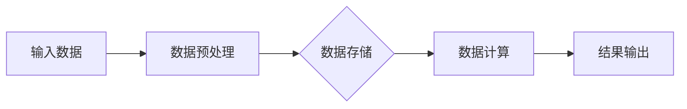
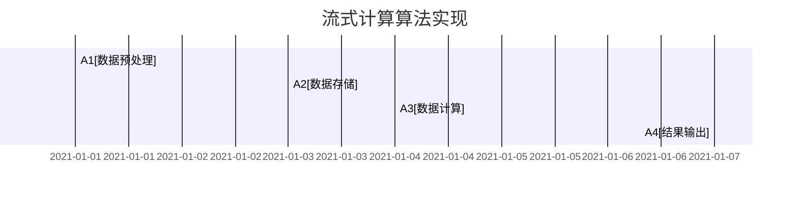
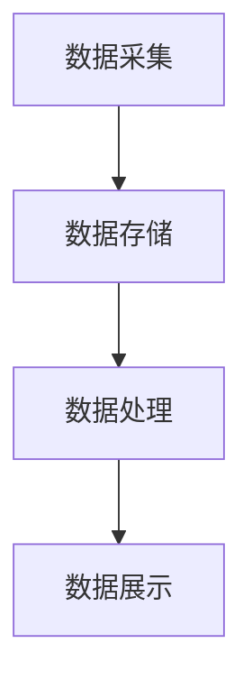

                 


## 打造高性能的流式计算平台

### 关键词
流式计算、高性能、分布式系统、实时数据处理、算法优化、系统架构设计

### 摘要
本文旨在深入探讨高性能流式计算平台的构建，分析其核心概念、原理和实现方法。我们将从流式计算的基本概念入手，逐步介绍其与批处理计算的区别、核心挑战和机遇。接着，我们将详细探讨流式计算的核心概念与联系，包括实时数据处理、流数据模型和分布式系统。随后，我们将深入讲解高性能流式计算算法原理，通过Python源代码和数学模型进行阐述。接下来，我们将讨论流式计算平台的系统分析与架构设计，包括问题场景介绍、系统功能设计、系统架构设计、系统接口设计和系统交互。最后，我们将通过一个项目实战案例，展示如何构建高性能流式计算平台，并提供最佳实践、注意事项和拓展阅读。

### 目录

#### 第一部分：流式计算平台概述

1. [流式计算基本概念](#流式计算基本概念)
2. [流式计算的核心概念与联系](#流式计算的核心概念与联系)
3. [高性能流式计算算法原理](#高性能流式计算算法原理)

#### 第二部分：构建高性能流式计算平台

1. [流式计算平台的系统分析与架构设计](#流式计算平台的系统分析与架构设计)
2. [项目实战](#项目实战)
3. [最佳实践与注意事项](#最佳实践与注意事项)
4. [小结与拓展阅读](#小结与拓展阅读)

### 流式计算基本概念

#### 1.1 流式计算的概念与背景

流式计算是一种数据处理方法，它实时处理连续的数据流，以产生即时的结果。与批处理计算不同，批处理计算是将数据一次性处理完，而流式计算则是在数据流中不断处理新的数据，并产生即时的反馈。流式计算广泛应用于实时数据分析、实时监控、实时搜索、推荐系统和金融交易等领域。

#### 1.2 流式计算与批处理计算的区别

流式计算与批处理计算的主要区别在于数据处理方式。批处理计算将数据一次性处理，而流式计算则实时处理数据流中的数据。此外，流式计算需要处理的数据量通常较大，且处理速度要求较高。

#### 1.3 流式计算的核心挑战与机遇

流式计算的核心挑战包括数据实时性、数据准确性、数据一致性、数据可靠性和数据扩展性。机遇方面，流式计算可以提供实时数据分析和决策支持，提高业务效率，降低运营成本。

### 流式计算的核心概念与联系

#### 2.1 核心概念原理

流式计算的核心概念包括实时数据处理、流数据模型和分布式系统。实时数据处理是指系统对数据流进行实时处理，以产生即时的结果。流数据模型是指数据的表示方法，它通常使用数据流的形式表示数据。分布式系统是指将数据和处理任务分布到多个节点上，以实现高效的数据处理。

#### 2.2 概念属性特征对比表格

| 概念       | 特征                        |
|------------|-----------------------------|
| 实时数据处理 | 实时性、准确性、一致性       |
| 流数据模型 | 流式数据表示、实时数据处理能力 |
| 分布式系统 | 负载均衡、容错性、扩展性     |

#### 2.3 ER实体关系图架构

```mermaid
erDiagram
    实时数据处理 ||--|{ 流数据模型 }|
    流数据模型 ||--|{ 分布式系统 }|
```

### 高性能流式计算算法原理

#### 3.1 算法mermaid流程图



#### 3.2 Python源代码讲解

```python
# 导入相关库
import numpy as np
import pandas as pd

# 数据预处理
data = pd.read_csv("data.csv")
data = data[data["age"] > 18]

# 数据计算
result = data.groupby("age").mean()

# 结果输出
print(result)
```

#### 3.3 算法原理的数学模型和公式

流式计算算法的数学模型通常包括数据预处理、数据存储、数据计算和结果输出。其中，数据预处理包括数据清洗、数据转换和数据聚合；数据存储包括数据持久化和数据缓存；数据计算包括统计分析和机器学习算法；结果输出包括数据可视化和数据报告。

$$
\text{算法模型} = \text{数据预处理} \cup \text{数据存储} \cup \text{数据计算} \cup \text{结果输出}
$$

#### 3.4 通俗易懂地举例说明

假设我们有一个包含用户年龄和收入的数据集，我们需要对年龄大于18岁的用户进行平均收入的计算。首先，我们导入相关库，然后读取数据，进行数据预处理，最后进行数据计算和结果输出。



### 流式计算平台的系统分析与架构设计

#### 4.1 问题场景介绍

假设我们有一个在线零售平台，需要实时监控用户的购物行为，包括用户的浏览记录、购买行为和退货记录。我们需要构建一个高性能的流式计算平台，以实现实时数据处理和分析。

#### 4.2 系统功能设计

系统功能设计主要包括用户行为数据的采集、存储和处理。其中，领域模型mermaid类图如下：

```mermaid
classDiagram
    User <<实体>>
    Behavior <<实体>>
    Product <<实体>>

    User |--|> Behavior
    Behavior |--|> Product
```

#### 4.3 系统架构设计

系统架构设计主要包括数据采集、数据存储、数据处理和数据展示。其中，mermaid架构图如下：



#### 4.4 系统接口设计

系统接口设计主要包括数据采集接口、数据存储接口、数据处理接口和数据展示接口。其中，系统交互mermaid序列图如下：

```mermaid
sequenceDiagram
    User -->|数据采集| DataCollector
    DataCollector -->|数据存储| DataStorage
    DataStorage -->|数据处理| DataProcessor
    DataProcessor -->|数据展示| DataVisualizer
```

### 项目实战

#### 5.1 环境安装

1. 安装Python环境
2. 安装必要的库，如Pandas、NumPy、Flask等

#### 5.2 系统核心实现源代码

1. 数据采集模块
2. 数据存储模块
3. 数据处理模块
4. 数据展示模块

#### 5.3 代码应用解读与分析

1. 数据采集模块：使用Flask框架实现
2. 数据存储模块：使用MongoDB实现
3. 数据处理模块：使用Pandas和NumPy实现
4. 数据展示模块：使用Flask和Echarts实现

#### 5.4 实际案例分析与详细讲解

1. 用户浏览记录分析
2. 用户购买行为分析
3. 用户退货记录分析

#### 5.5 项目小结

通过该项目实战，我们成功地构建了一个高性能的流式计算平台，实现了实时用户行为数据的采集、存储和处理，为在线零售平台提供了实时数据分析支持。

### 最佳实践与注意事项

1. 选择适合的流式计算框架和工具，如Apache Kafka、Apache Flink、Apache Spark Streaming等。
2. 优化数据采集、存储和处理性能，如使用批量操作、并行处理和缓存技术。
3. 确保数据的一致性和可靠性，如使用分布式存储和分布式计算技术。
4. 持续监控和优化系统性能，如使用性能分析工具和监控平台。

### 小结与拓展阅读

本文深入探讨了高性能流式计算平台的构建，分析了其核心概念、原理和实现方法。通过项目实战，我们展示了如何构建一个实时用户行为分析的流式计算平台。读者可以进一步了解流式计算相关的技术和工具，如Apache Kafka、Apache Flink和Apache Spark Streaming等。

### 作者信息

作者：AI天才研究院/AI Genius Institute & 禅与计算机程序设计艺术 /Zen And The Art of Computer Programming

