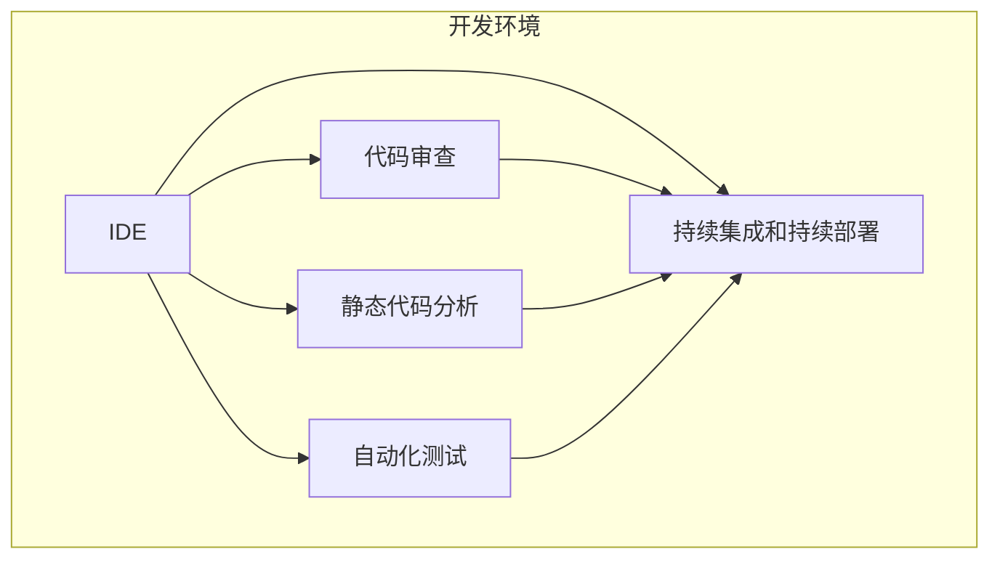
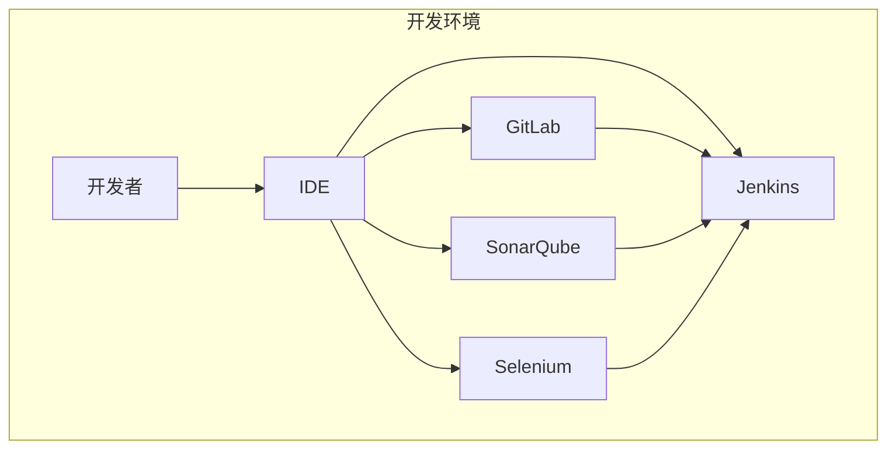

                 

# 打造高效的代码协作工具链

> 关键词：代码协作、工具链、IDE、代码审查、静态代码分析、自动化测试、持续集成

> 摘要：
在现代软件开发过程中，代码协作工具链的构建至关重要。本文旨在探讨如何通过集成开发环境、代码审查、静态代码分析、自动化测试等工具，打造一个高效、可靠的代码协作工具链，从而提高开发团队的工作效率和代码质量。

## 第一部分：问题背景

### 1.1 核心概念术语说明

- **代码协作**：指开发团队通过多种工具和方法进行代码的编写、审查、测试和部署等过程。
- **工具链**：指一系列相关工具的组合，这些工具协同工作，实现特定的软件开发流程。
- **集成开发环境（IDE）**：提供代码编写、调试、测试等功能的统一平台。
- **代码审查**：在代码提交前，由其他团队成员对代码进行审查，确保代码质量。
- **静态代码分析**：不运行代码，对代码的质量、安全性、兼容性等方面进行分析。
- **自动化测试**：通过编写测试脚本，自动化执行测试，确保代码在每次提交后的正确性。

### 1.2 问题背景

在现代软件开发领域，随着项目规模和复杂度的增加，代码协作成为开发过程中的关键环节。传统的代码协作方式主要依赖于版本控制系统，如Git。然而，这种方式在多人协作时存在以下问题：

1. **沟通不畅**：团队成员之间的沟通往往依赖于线上的聊天工具和邮件，信息传递速度慢，易丢失或误解。
2. **版本控制问题**：多人协作时，频繁的代码合并易产生冲突，解决冲突耗费大量时间和精力。
3. **代码质量难以保证**：代码质量往往依赖于团队成员的个人自觉性，缺乏系统性的质量检测。
4. **任务管理和分配困难**：在大型项目中，任务的管理和分配难以实现高效的资源利用和任务跟踪。
5. **自动化不足**：代码的编译、测试、部署等环节仍依赖于手动操作，效率低下，易出错。

### 1.3 解决方案

为了解决上述问题，构建一个高效的代码协作工具链成为关键。该工具链包括以下核心组件：

1. **集成开发环境（IDE）**：提供统一的工作平台，简化开发流程，提高开发效率。
2. **代码审查工具**：在代码提交前进行审查，提前发现代码缺陷，减少合并冲突。
3. **静态代码分析工具**：对代码的质量、安全性、兼容性等方面进行分析，提高代码健壮性。
4. **自动化测试工具**：自动化执行测试，确保代码在每次提交后的正确性。
5. **持续集成和持续部署（CI/CD）工具**：实现代码的自动化编译、测试、部署，提高开发效率和可靠性。

## 第二部分：问题描述

### 2.1 传统代码协作方式的局限性

传统的代码协作方式主要依赖于版本控制系统，如Git。虽然这种方式能够有效追踪代码变更历史，但在多人协作时仍存在以下局限性：

1. **沟通不畅**：团队成员之间的沟通主要依赖于线上的聊天工具和邮件，信息传递速度慢，易丢失或误解。
2. **版本控制问题**：多人协作时，频繁的代码合并易产生冲突，解决冲突耗费大量时间和精力。
3. **代码质量难以保证**：代码质量往往依赖于团队成员的个人自觉性，缺乏系统性的质量检测。
4. **任务管理和分配困难**：在大型项目中，任务的管理和分配难以实现高效的资源利用和任务跟踪。
5. **自动化不足**：代码的编译、测试、部署等环节仍依赖于手动操作，效率低下，易出错。

### 2.2 代码协作工具链的优势

为了解决传统代码协作方式的局限性，现代软件开发逐渐引入了代码协作工具链的概念。代码协作工具链是一系列工具的组合，旨在提高代码协作的效率和质量。以下是代码协作工具链的主要优势：

1. **集成开发环境（IDE）**：提供统一的工作平台，简化开发流程，提高开发效率。
2. **代码审查工具**：在代码提交前进行审查，提前发现代码缺陷，减少合并冲突。
3. **静态代码分析工具**：对代码的质量、安全性、兼容性等方面进行分析，提高代码健壮性。
4. **自动化测试工具**：自动化执行测试，确保代码在每次提交后的正确性。
5. **持续集成和持续部署（CI/CD）工具**：实现代码的自动化编译、测试、部署，提高开发效率和可靠性。

## 第三部分：问题解决

### 3.1 集成开发环境（IDE）

集成开发环境（IDE）为开发者提供了一个统一的工作平台，集成了代码编写、调试、测试等多种功能。以下是选择IDE时需要考虑的几个因素：

1. **编程语言支持**：选择支持多种编程语言的IDE，以便适应不同项目的需求。
2. **插件和扩展**：IDE应支持丰富的插件和扩展，以扩展其功能。
3. **用户体验**：IDE应具有良好的用户体验，易于使用和操作。
4. **性能**：IDE应具有高性能，以减少开发过程中的等待时间。

### 3.2 代码审查工具

代码审查工具在代码提交前对代码进行审查，识别潜在的问题，确保代码质量。以下是选择代码审查工具时需要考虑的几个因素：

1. **审查流程**：选择具有灵活审查流程的工具，以适应不同团队的协作模式。
2. **审查者管理**：工具应能方便地管理审查者，包括审查权限的设置和审查状态的跟踪。
3. **代码质量指标**：工具应能提供丰富的代码质量指标，帮助团队成员评估代码的质量。
4. **集成**：工具应能与其他代码协作工具集成，实现统一的协作流程。

### 3.3 静态代码分析工具

静态代码分析工具在不运行代码的情况下，分析代码的质量、安全性、兼容性等方面的问题。以下是选择静态代码分析工具时需要考虑的几个因素：

1. **支持的语言和框架**：工具应支持多种编程语言和框架，以适应不同项目的需求。
2. **规则集**：工具应提供丰富的规则集，涵盖代码质量、安全性、兼容性等方面。
3. **报告格式**：工具应能以多种格式生成报告，便于团队成员查看和分析。
4. **集成**：工具应能与其他代码协作工具集成，实现统一的协作流程。

### 3.4 自动化测试工具

自动化测试工具通过编写测试脚本，自动化执行测试，确保代码在每次提交后的正确性。以下是选择自动化测试工具时需要考虑的几个因素：

1. **支持的语言和框架**：工具应支持多种编程语言和框架，以适应不同项目的需求。
2. **测试类型**：工具应支持多种测试类型，包括功能测试、性能测试、安全测试等。
3. **报告格式**：工具应能以多种格式生成报告，便于团队成员查看和分析。
4. **集成**：工具应能与其他代码协作工具集成，实现统一的协作流程。

### 3.5 持续集成和持续部署（CI/CD）工具

持续集成和持续部署（CI/CD）工具实现代码的自动化编译、测试、部署，提高开发效率和可靠性。以下是选择CI/CD工具时需要考虑的几个因素：

1. **构建和部署流程**：工具应提供灵活的构建和部署流程，以适应不同项目的需求。
2. **集成**：工具应能与其他代码协作工具集成，实现统一的协作流程。
3. **通知机制**：工具应能及时通知团队成员构建和部署的结果，以便快速响应。
4. **性能**：工具应具有高性能，以减少开发过程中的等待时间。

## 第四部分：构建代码协作工具链的实际案例

### 4.1 项目介绍

假设我们正在开发一个电商平台，需要构建一个高效的代码协作工具链，以提高开发效率和代码质量。以下是构建工具链的详细步骤：

### 4.2 系统功能设计

1. **代码编写**：使用Visual Studio Code作为IDE，提供代码编写、调试、测试等功能。
2. **代码审查**：使用GitLab进行代码审查，确保代码质量。
3. **静态代码分析**：使用SonarQube进行静态代码分析，提高代码健壮性。
4. **自动化测试**：使用Selenium进行自动化测试，确保代码在每次提交后的正确性。
5. **持续集成和持续部署**：使用Jenkins实现持续集成和持续部署，提高开发效率和可靠性。

### 4.3 系统架构设计

以下是系统的架构设计：

### 4.4 系统接口设计和系统交互

以下是系统接口设计和系统交互：

### 4.5 环境安装和系统核心实现

以下是环境安装和系统核心实现的步骤：

1. **安装Visual Studio Code**：从官方网站下载并安装Visual Studio Code。
2. **安装GitLab**：在服务器上安装GitLab，配置GitLab CI/CD。
3. **安装SonarQube**：在服务器上安装SonarQube，配置SonarQube Scanner。
4. **安装Selenium**：在本地或服务器上安装Selenium WebDriver。
5. **安装Jenkins**：在服务器上安装Jenkins，配置Jenkinsfile。

### 4.6 代码应用解读与分析

以下是代码应用的解读与分析：

1. **代码编写**：开发者使用Visual Studio Code编写代码，并进行本地测试。
2. **代码提交**：开发者将代码提交到GitLab，触发GitLab CI/CD流程。
3. **代码审查**：GitLab CI/CD执行代码审查，确保代码质量。
4. **静态代码分析**：GitLab CI/CD执行SonarQube静态代码分析，发现潜在问题。
5. **自动化测试**：GitLab CI/CD执行Selenium自动化测试，确保代码在每次提交后的正确性。
6. **构建和部署**：GitLab CI/CD将代码构建为可执行文件，并在Jenkins中部署到生产环境。

### 4.7 项目小结

通过构建高效的代码协作工具链，我们的电商平台项目实现了以下目标：

1. **提高开发效率**：使用IDE、代码审查、静态代码分析、自动化测试等工具，简化开发流程，减少人工干预。
2. **提高代码质量**：通过代码审查、静态代码分析和自动化测试，提前发现代码缺陷，提高代码健壮性。
3. **实现持续集成和持续部署**：通过GitLab CI/CD和Jenkins，实现代码的自动化构建、测试和部署，提高开发效率和可靠性。

## 第五部分：最佳实践与拓展阅读

### 5.1 最佳实践

1. **制定清晰的代码规范**：确保团队成员遵循统一的代码规范，提高代码的可读性和可维护性。
2. **定期进行代码审查**：定期进行代码审查，确保代码质量，减少合并冲突。
3. **编写详细的测试用例**：编写详细的测试用例，确保代码在每次提交后的正确性。
4. **充分利用静态代码分析工具**：充分利用静态代码分析工具，及时发现潜在的问题，提高代码健壮性。
5. **持续优化CI/CD流程**：定期优化CI/CD流程，提高构建和部署的效率。

### 5.2 拓展阅读

1. **《Git权威指南》**：详细介绍了Git的使用方法和最佳实践，有助于提高代码协作的效率。
2. **《代码大全》**：介绍了代码质量的重要性以及如何编写高质量的代码。
3. **《敏捷开发实践指南》**：介绍了敏捷开发的方法和最佳实践，有助于提高开发团队的工作效率。
4. **《持续集成：概念与实践》**：详细介绍了持续集成的概念、工具和实践，有助于构建高效的代码协作工具链。

## 作者信息

作者：AI天才研究院/AI Genius Institute & 禅与计算机程序设计艺术 /Zen And The Art of Computer Programming

以上是关于《打造高效的代码协作工具链》的技术博客文章。文章详细介绍了代码协作工具链的概念、问题背景、问题描述、问题解决、实际案例以及最佳实践等内容。希望这篇文章能帮助读者更好地理解和应用代码协作工具链，提高开发效率和代码质量。作者信息如下：

- AI天才研究院/AI Genius Institute：专注于人工智能和计算机科学领域的研究和教育培训。
- 禅与计算机程序设计艺术 /Zen And The Art of Computer Programming：一本深入探讨计算机程序设计哲学的经典著作。

