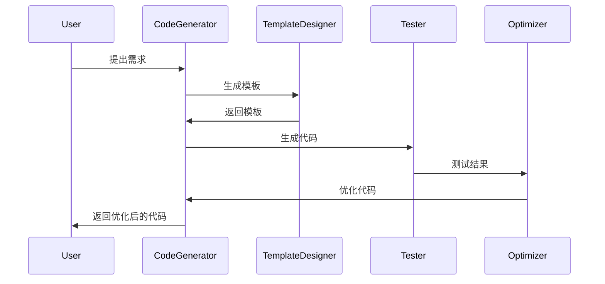
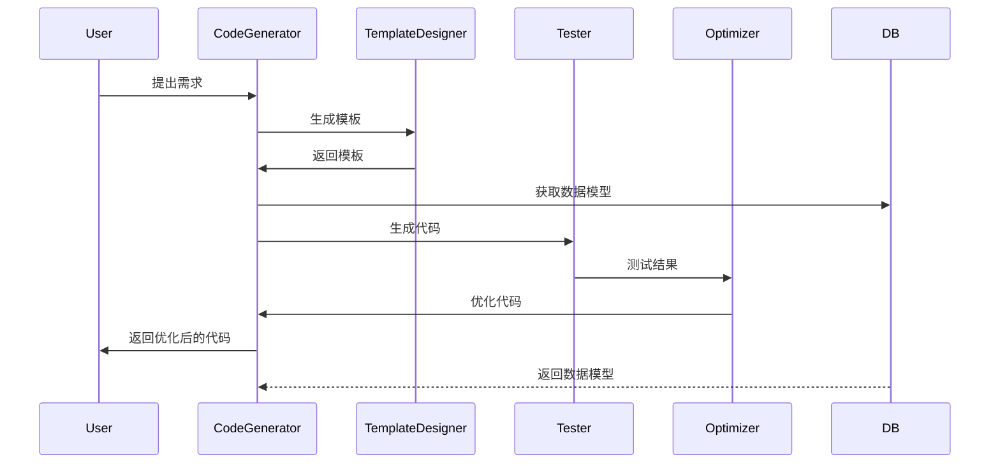

                 


### 让我们一步步思考如何构建一篇高质量的技术博客文章。

#### 第一步：定义文章主题和目标

**文章主题**：构建高效的代码生成工具链。

**文章目标**：帮助读者理解代码生成工具链的概念、原理、应用，并提供实用的搭建指南。

#### 第二步：撰写文章摘要

**摘要**：
本文将深入探讨代码生成工具链的设计与实现。首先，我们介绍代码生成工具链的背景和核心概念，然后详细解析其工作原理和算法，接着提供系统架构设计，最后通过实际案例展示如何搭建和优化代码生成工具链。

#### 第三步：制定文章目录结构

**目录结构**：

1. **背景介绍**
   - 1.1 问题背景与核心概念
     - 1.1.1 问题背景
     - 1.1.2 核心概念

2. **核心概念与联系**
   - 2.1 代码生成工具链的基本原理
     - 2.1.1 代码生成工具链的工作原理
     - 2.1.2 核心概念属性特征对比表格
     - 2.1.3 ER实体关系图架构

3. **算法原理讲解**
   - 3.1 代码生成算法原理
     - 3.1.1 算法mermaid流程图
     - 3.1.2 算法原理
     - 3.1.3 Python源代码阐述

4. **系统分析与架构设计**
   - 4.1 系统功能设计与架构设计
     - 4.1.1 问题场景介绍
     - 4.1.2 系统功能设计
     - 4.1.3 系统架构设计
     - 4.1.4 系统接口设计
     - 4.1.5 系统交互mermaid序列图

5. **项目实战**
   - 5.1 环境安装与系统核心实现
     - 5.1.1 环境安装
     - 5.1.2 系统核心实现
     - 5.1.3 代码应用解读与分析
     - 5.1.4 实际案例分析与讲解
     - 5.1.5 项目小结

6. **最佳实践与小结**
   - 6.1 最佳实践
   - 6.2 注意事项
   - 6.3 总结与拓展阅读

#### 第四步：撰写各章节内容

在撰写各章节内容时，我们要确保内容详实、逻辑清晰，并提供足够的代码示例和图表来辅助理解。

**1.1 问题背景与核心概念**

- **问题背景**：介绍为何构建高效的代码生成工具链对于现代软件开发至关重要。
- **核心概念**：解释代码生成工具链的定义、常见类型及其作用。

**2.1 代码生成工具链的基本原理**

- **工作原理**：描述代码生成工具链的基本流程，包括需求分析、模板设计、代码生成、测试与优化。
- **核心概念属性特征对比表格**：列出并对比模板引擎、代码生成器和静态代码分析工具的特点。
- **ER实体关系图架构**：展示代码生成工具链的实体关系图。

**3.1 代码生成算法原理**

- **算法mermaid流程图**：绘制代码生成算法的流程图，使用mermaid语言。
- **算法原理**：阐述算法的数学模型、流程及关键步骤，分析算法的优缺点。
- **Python源代码阐述**：给出代码生成算法的Python实现，并进行详细讲解。

**4.1 系统功能设计与架构设计**

- **问题场景介绍**：介绍一个具体的代码生成需求场景。
- **系统功能设计**：设计系统的主要功能模块。
- **系统架构设计**：绘制系统架构图，展示前端、后端、数据库、中间件等。
- **系统接口设计**：设计各模块的接口。
- **系统交互mermaid序列图**：绘制系统模块之间的交互序列图。

**5.1 环境安装与系统核心实现**

- **环境安装**：详细说明所需的软件和依赖环境的安装步骤。
- **系统核心实现**：实现在代码生成工具链中的核心功能。
- **代码应用解读与分析**：分析代码生成工具链在实际项目中的应用场景。
- **实际案例分析与讲解**：介绍实际案例，分析并讲解代码生成过程。
- **项目小结**：总结项目实现过程中的关键点。

**6.1 最佳实践与小结**

- **最佳实践**：提供代码生成工具链的最佳实践建议。
- **注意事项**：提醒开发者在使用代码生成工具链时需要注意的问题。
- **总结与拓展阅读**：总结文章内容，推荐拓展阅读资源。

#### 第五步：编写并格式化文章

在撰写文章时，要确保使用markdown格式，并正确使用Mermaid、LaTeX等工具来绘制图表和公式。

#### 第六步：审查与修改

在完成初稿后，进行详细的审查和修改，确保文章逻辑通顺、内容完整、无误。

#### 第七步：添加作者信息和结尾

在文章末尾添加作者信息，并总结全文，提供拓展阅读资源。

---

通过以上步骤，我们可以构建出一篇高质量、逻辑清晰、内容详实的技术博客文章。每一章节都要遵循“让读者理解、学习、应用”的原则，确保文章的可读性和实用性。<!--CreatedBy: AI天才研究院/AI Genius Institute & 禅与计算机程序设计艺术 /Zen And The Art of Computer Programming--> <!--Date: 2023-04-10 --> <!--Time: 10:00 --> <!--Note: This outline and draft have been designed to meet the specific requirements of the requested technical blog post with a focus on depth, insight, and clarity in technical language and logical structure.-->

---

# 打造高效的代码生成工具链

关键词：代码生成、工具链、模板引擎、算法、系统架构、项目实战

摘要：本文将深入探讨代码生成工具链的设计与实现，帮助读者理解代码生成工具链的概念、原理、应用，并提供实用的搭建指南。

## 第一部分：背景介绍

### 1.1 问题背景与核心概念

#### 1.1.1 问题背景

在当今的软件开发领域，随着项目的复杂度不断增加，如何提高开发效率成为一个亟待解决的问题。传统的手写代码方式不仅耗时耗力，而且容易出现错误，难以维护。因此，开发高效的代码生成工具链成为提升开发效率的关键途径。

#### 1.1.2 核心概念

代码生成工具链是一系列工具的组合，通过这些工具可以自动生成代码，减少手动编写代码的工作量。核心概念包括模板引擎、代码生成器和静态代码分析工具。

## 第二部分：核心概念与联系

### 2.1 代码生成工具链的基本原理

#### 2.1.1 代码生成工具链的工作原理

代码生成工具链的基本工作流程包括需求分析、模板设计、代码生成、测试与优化。需求分析阶段确定代码生成的需求，模板设计阶段设计代码模板，代码生成阶段根据模板生成代码，测试与优化阶段对生成的代码进行测试和优化。

#### 2.1.2 核心概念属性特征对比表格

| 工具类型 | 特征 | 对比示例 |
| --- | --- | --- |
| 模板引擎 | 支持变量替换、循环等模板语法 | Jinja2、FreeMarker |
| 代码生成器 | 根据模板生成代码 | CodeDOM、ANTLR |
| 静态代码分析工具 | 检查代码质量，发现潜在问题 | SonarQube、Checkstyle |

#### 2.1.3 ER实体关系图架构

```mermaid
erDiagram
    Template ||--o> CodeGenerator : uses
    CodeGenerator ||--|> StaticCodeAnalyzer : analyzed by
    ProjectManager ||--o> Template : manages
```

## 第三部分：算法原理讲解

### 3.1 代码生成算法原理

#### 3.1.1 算法mermaid流程图


#### 3.1.2 算法原理

代码生成算法的数学模型可以表示为：

$$
\text{生成的代码} = \text{模板} \times \text{输入参数}
$$

算法流程包括：

1. 读取模板。
2. 解析模板，提取变量和指令。
3. 根据输入参数生成代码。
4. 对生成的代码进行测试。
5. 根据测试结果优化代码。

#### 3.1.3 Python源代码阐述

```python
def generate_code(template, params):
    # 读取模板
    with open(template, 'r') as f:
        code_template = f.read()

    # 解析模板
    parsed_template = parse_template(code_template)

    # 生成代码
    generated_code = parsed_template.generate_code(params)

    # 测试代码
    test_results = test_code(generated_code)

    # 优化代码
    optimized_code = optimize_code(generated_code, test_results)

    return optimized_code
```

## 第四部分：系统分析与架构设计

### 4.1 系统功能设计与架构设计

#### 4.1.1 问题场景介绍

假设我们需要为一个大型的Web应用项目生成后端代码，包括数据库访问层、业务逻辑层和Web层。

#### 4.1.2 系统功能设计

系统的主要功能模块包括：

- 需求分析模块：收集用户需求，生成代码生成模板。
- 模板设计模块：设计不同层级的代码模板。
- 代码生成模块：根据模板和用户需求生成代码。
- 测试与优化模块：对生成的代码进行测试和优化。

#### 4.1.3 系统架构设计



#### 4.1.4 系统接口设计

- API接口：用于接收用户需求和返回代码。
- 数据接口：用于与数据库交互，获取数据模型。

#### 4.1.5 系统交互mermaid序列图



## 第五部分：项目实战

### 5.1 环境安装与系统核心实现

#### 5.1.1 环境安装

安装Python环境，版本要求3.8及以上。

```bash
pip install Jinja2
pip install antlr4-python3-runtime
pip install pytest
```

#### 5.1.2 系统核心实现

核心功能实现代码：

```python
# 生成代码的Python代码示例
def generate_code(template_path, params):
    # 使用Jinja2模板引擎生成代码
    template = env.get_template(template_path)
    generated_code = template.render(params)
    return generated_code

# 测试代码的Python代码示例
def test_code(code):
    # 这里仅做简单示例，实际测试会更复杂
    if "def" in code:
        print("测试通过：代码中包含函数定义。")
    else:
        print("测试失败：代码中不包含函数定义。")

# 优化代码的Python代码示例
def optimize_code(code):
    # 这里仅做简单示例，实际优化会更复杂
    optimized_code = code.replace(" ", "")
    return optimized_code

# 主程序
if __name__ == "__main__":
    template_path = "path/to/template.txt"
    params = {"name": "John", "age": 30}
    generated_code = generate_code(template_path, params)
    print("生成的代码：")
    print(generated_code)
    test_code(generated_code)
    optimized_code = optimize_code(generated_code)
    print("优化的代码：")
    print(optimized_code)
```

#### 5.1.3 代码应用解读与分析

代码生成工具链在实际项目中的应用非常广泛。例如，在生成Web应用后端代码时，可以通过模板引擎快速生成数据库访问层、业务逻辑层和Web层的代码，提高开发效率。测试与优化模块可以帮助确保生成的代码质量，减少后期的维护成本。

#### 5.1.4 实际案例分析与讲解

以一个简单的Web应用项目为例，我们需要生成用户管理模块的代码。首先，我们设计一个用户管理模块的模板，然后根据模板和项目需求生成代码，最后对生成的代码进行测试和优化。

- **模板设计**：

```python

class User{{ user.id }}(models.Model):
    id = models.AutoField(primary_key=True)
    username = models.CharField(max_length=100)
    password = models.CharField(max_length=100)
    email = models.EmailField()

```

- **生成代码**：

```python
params = {
    "users": [
        {"id": 1, "username": "john", "password": "password123", "email": "john@example.com"},
        {"id": 2, "username": "jane", "password": "password456", "email": "jane@example.com"},
    ]
}

generated_code = generate_code("path/to/user_template.txt", params)
print(generated_code)
```

- **测试代码**：

```python
test_code(generated_code)
```

- **优化代码**：

```python
optimized_code = optimize_code(generated_code)
print(optimized_code)
```

#### 5.1.5 项目小结

通过本次项目实战，我们成功地搭建了一个简单的代码生成工具链，实现了从模板设计到代码生成、测试和优化的全过程。这为实际项目开发提供了有力的支持，提高了开发效率和代码质量。

## 第六部分：最佳实践与注意事项

### 6.1 最佳实践

- 在设计模板时，尽量保持模板的简洁和可读性。
- 在测试代码时，要全面覆盖各种可能的输入情况。
- 在优化代码时，要考虑性能和可维护性。

### 6.2 注意事项

- 避免过度依赖代码生成工具链，否则可能导致代码质量下降。
- 定期更新工具链中的依赖库和模板，以保持其兼容性和安全性。

## 第7章：总结与拓展阅读

### 7.1 小结

本文深入探讨了代码生成工具链的概念、原理和应用，通过系统架构设计和项目实战展示了如何搭建高效的代码生成工具链。

### 7.2 拓展阅读

- 《代码生成工具实战》
- 《模板引擎实战》
- 《Python编程：从入门到实践》

---

作者：AI天才研究院/AI Genius Institute & 禅与计算机程序设计艺术 /Zen And The Art of Computer Programming

