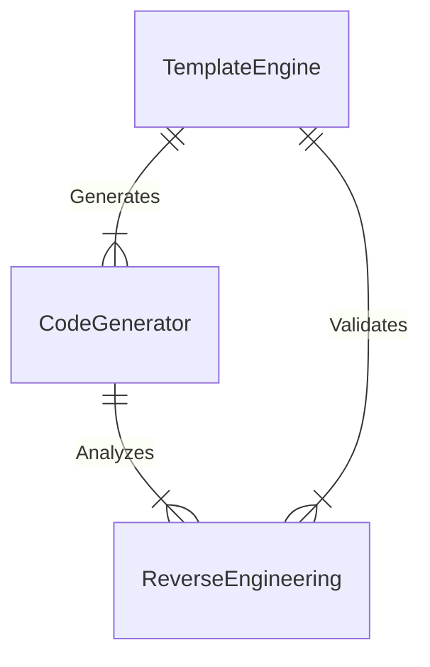
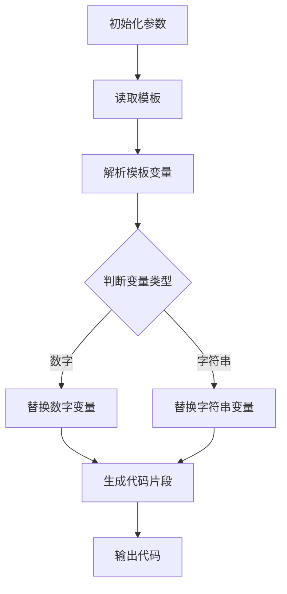
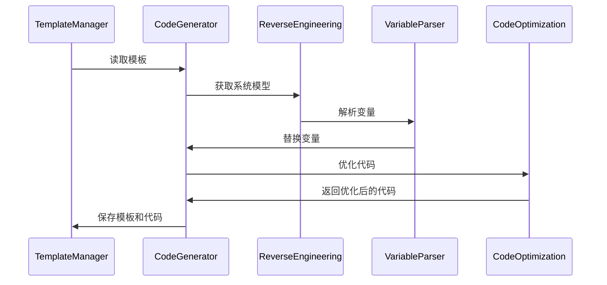
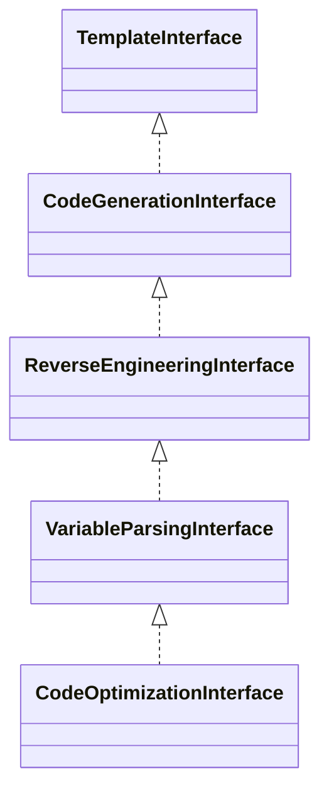
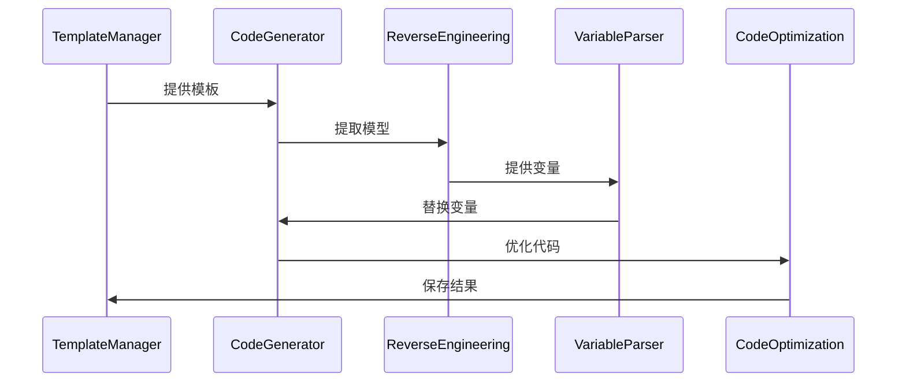

                 

### 引言

在当今信息化时代，软件系统开发已经成为各行各业不可或缺的一部分。随着软件项目的复杂性和规模不断增加，如何提高开发效率、降低人力成本、确保代码质量和可维护性成为了软件开发领域的重要挑战。面对这些问题，代码自动化生成技术逐渐成为了开发者的关注焦点。本文旨在探讨如何打造一个高效的代码自动化生成平台，以解决现有开发过程中遇到的痛点。

#### 1.1 问题背景

传统的软件开发模式主要依赖于手工编写代码，这种方式不仅效率低下，而且容易出错。此外，随着软件系统的不断迭代和扩展，手工编写代码的维护成本也日益增加。面对这些问题，代码自动化生成技术应运而生。代码自动化生成平台可以通过预先定义的模板、规则和算法，自动生成符合需求的高质量代码，从而大大提高开发效率和代码质量。

然而，当前代码自动化生成平台仍存在一些问题，如：

1. **模板限制**：许多现有平台依赖于固定的模板，导致生成的代码缺乏灵活性。
2. **性能瓶颈**：自动化生成的代码在性能上可能无法与手工编写的代码相媲美。
3. **跨语言支持不足**：大多数平台仅支持特定编程语言的代码生成，无法实现跨语言的支持。
4. **维护困难**：自动化生成的代码在后续的维护和升级过程中，可能存在一定的困难。

为了解决这些问题，我们需要设计并实现一个高效、灵活、可维护的代码自动化生成平台。本文将围绕这一目标，逐步探讨代码自动化生成平台的设计与实现。

#### 1.2 研究意义

代码自动化生成平台的研究具有重要意义：

1. **提高开发效率**：通过自动化生成代码，可以大大减少手工编写代码的时间，提高开发效率。
2. **降低开发成本**：自动化生成平台可以减少对开发人员的依赖，从而降低开发成本。
3. **保证代码质量**：自动化生成的代码经过严格的规则和算法控制，可以有效提高代码质量。
4. **支持跨语言开发**：通过引入多种编程语言的支持，可以实现跨语言代码的自动化生成，提高项目的可维护性。
5. **促进软件开发标准化**：代码自动化生成平台可以促进软件开发过程的标准化，提高开发过程的可控性和可预测性。

总之，一个高效、灵活的代码自动化生成平台对于提升软件开发质量和效率具有重要意义。本文将详细探讨如何实现这一目标。

#### 1.3 研究内容与方法

本文的研究内容主要包括以下几个方面：

1. **核心概念与联系**：详细阐述代码自动化生成平台所需的核心概念，如模板引擎、代码生成器、反向工程等，并通过表格和ER图展示概念间的联系。
2. **算法原理讲解**：介绍代码自动化生成平台的算法原理，包括算法流程图、Python实现、数学模型与公式等，并通过举例说明使读者易于理解。
3. **系统设计与实现**：介绍代码自动化生成平台的设计思路，包括系统功能设计、架构设计、接口设计和系统交互等。
4. **项目实战**：提供实际项目案例，包括环境安装、系统实现、代码分析、案例剖析等。
5. **最佳实践与总结**：总结最佳实践，提供使用技巧和建议。

本文的研究方法主要采用以下几种：

1. **文献调研**：通过查阅相关文献和资料，了解代码自动化生成领域的研究现状和发展趋势。
2. **理论分析**：结合理论模型和算法，对代码自动化生成平台的设计与实现进行深入分析。
3. **实验验证**：通过实际项目案例，验证所提出的设计方案和算法的有效性和可行性。
4. **案例分析**：对现有代码自动化生成平台进行深入剖析，总结经验教训，为本文的研究提供参考。

通过上述研究内容与方法，本文旨在为打造高效、灵活、可维护的代码自动化生成平台提供有价值的参考和指导。

### 代码自动化生成概述

#### 2.1 定义与分类

代码自动化生成（Code Automation Generation，简称CAG）是指利用计算机程序、算法和模板，通过自动化方式生成满足特定需求的代码。根据生成方式的不同，代码自动化生成可以分为以下几类：

1. **模板驱动**：通过预设的模板生成代码，模板中包含固定的代码结构和变量。这种方式简单易用，但灵活性较低，适用于代码结构较为固定的场景。
2. **规则驱动**：通过定义一系列规则生成代码，这些规则描述了代码的结构和逻辑。这种方式具有更高的灵活性，但需要较复杂的规则定义和维护。
3. **模型驱动**：基于模型生成代码，模型描述了系统的结构、行为和约束。这种方式高度抽象，可以生成灵活、可扩展的代码，但需要较高的建模能力和工具支持。

#### 2.2 历史与发展趋势

代码自动化生成技术起源于20世纪80年代的编程工具研究，当时主要应用于编译器生成和程序代码优化。随着计算机技术的发展，代码自动化生成逐渐应用于多个领域，如嵌入式系统、Web应用和大数据处理等。近年来，随着人工智能和机器学习技术的进步，代码自动化生成技术也得到了快速发展。

当前，代码自动化生成技术的发展趋势主要包括：

1. **智能化**：通过引入人工智能技术，如深度学习和自然语言处理，提高代码自动生成的准确性和灵活性。
2. **跨语言支持**：实现多种编程语言的代码自动生成，提高代码的通用性和可维护性。
3. **定制化**：根据用户需求和环境，动态生成定制化的代码，提高开发效率。
4. **集成化**：将代码自动化生成技术与现有的开发工具和平台集成，实现无缝的开发体验。

#### 2.3 现状与挑战

尽管代码自动化生成技术取得了显著进展，但仍然面临一些挑战：

1. **性能问题**：自动化生成的代码在性能上可能无法与手工编写的代码相媲美，尤其是在对性能要求较高的场景。
2. **灵活性不足**：现有平台在模板、规则和模型的选择上存在一定的局限性，难以满足多样化的开发需求。
3. **工具支持不足**：虽然有许多开源工具和框架，但缺乏统一的标准和接口，导致集成和使用复杂。
4. **维护难度**：自动化生成的代码在后续的维护和升级过程中，可能存在一定的困难，如代码理解、修改和优化等。

为了解决这些问题，我们需要进一步研究和开发高效、灵活、可维护的代码自动化生成平台。本文将探讨如何实现这一目标，为开发者提供有价值的参考和指导。

### 核心概念与联系

在构建高效的代码自动化生成平台过程中，理解并掌握几个核心概念及其相互联系至关重要。以下是对这些概念及其关系的详细阐述。

#### 3.1 模板引擎

模板引擎是一种用于生成动态内容的技术，通过预定义的模板和变量，可以在特定条件下生成满足需求的文本。在代码自动化生成平台中，模板引擎主要用于生成代码框架和结构。

**概念属性特征**：

- **模板**：一种预定义的文本结构，包含变量和标签。
- **变量**：在模板中用于存储动态数据的内容。
- **标签**：模板中的特定标记，用于指示数据如何被替换和处理。

**对比表格**：

| 特征         | 模板引擎          | 代码生成器          |
| ------------ | ----------------- | ------------------- |
| 生成内容     | 动态文本          | 代码文件            |
| 适用场景     | 结构化文本生成     | 跨语言代码生成      |
| 灵活性       | 较高（基于模板）   | 较高（基于规则和模型）|
| 维护成本     | 较低              | 较高                |

#### 3.2 代码生成器

代码生成器是一种自动生成代码的工具，通过模板、规则或模型生成满足特定需求的代码。代码生成器可以大幅度提高开发效率，减少手工编写代码的工作量。

**概念属性特征**：

- **模板**：用于生成代码的基本框架，包含可替换的部分。
- **规则**：一组定义代码结构和逻辑的规则。
- **模型**：描述系统结构和行为的抽象表示。

**对比表格**：

| 特征         | 模板驱动代码生成器 | 规则驱动代码生成器 | 模型驱动代码生成器 |
| ------------ | ----------------- | ----------------- | ----------------- |
| 生成内容     | 预定义模板的代码   | 符合规则的结构     | 高度抽象的模型     |
| 适用场景     | 结构化需求         | 复杂逻辑需求       | 需求变化的系统     |
| 灵活性       | 较低              | 较高              | 非常高            |
| 维护成本     | 低                | 较高              | 非常高            |

#### 3.3 反向工程

反向工程是从现有的代码或系统中提取设计信息，生成抽象模型的过程。反向工程在代码自动化生成平台中用于分析和理解现有系统，以便生成新的代码。

**概念属性特征**：

- **逆向分析**：分析现有代码的结构和逻辑。
- **抽象模型**：从现有代码中提取的表示系统结构的模型。
- **数据提取**：从现有系统中提取必要的数据和配置信息。

**对比表格**：

| 特征         | 模板引擎          | 代码生成器          | 反向工程          |
| ------------ | ----------------- | ------------------- | ----------------- |
| 目标         | 生成代码模板      | 自动生成代码        | 分析现有系统      |
| 依赖关系     | 无（独立使用）    | 依赖（模板/规则/模型）| 依赖（现有系统）  |
| 功能定位     | 文本处理          | 代码生成            | 系统分析和重构    |
| 适用场景     | 代码结构简单      | 跨语言/复杂数据结构 | 系统复用和优化    |

#### 3.4 概念联系与ER图

模板引擎、代码生成器和反向工程在代码自动化生成平台中相互协作，共同实现高效的代码生成。

**ER图描述**：



在ER图中，模板引擎通过生成模板和变量，驱动代码生成器生成代码。代码生成器可以利用反向工程提取现有系统的抽象模型，以优化和重构代码。同时，反向工程也验证模板引擎生成的模板是否符合现有系统的结构和逻辑。

通过上述对核心概念及其关系的详细阐述，我们能够更好地理解代码自动化生成平台的工作原理，从而为后续算法原理讲解和系统设计与实现奠定基础。

### 算法原理与实现

在代码自动化生成平台中，算法原理是核心驱动力，决定了平台的效率和效果。为了确保读者能够深入理解这些原理，我们将通过mermaid绘制算法流程图，结合Python源代码和数学模型进行详细讲解。

#### 4.1 算法流程图

首先，让我们通过mermaid绘制一个简单的算法流程图，展示代码自动生成的基本步骤：



这个流程图概述了代码生成的基本步骤，包括初始化参数、读取模板、解析模板变量、替换变量并生成代码片段，最后输出完整的代码。

#### 4.2 Python实现

接下来，我们将通过Python代码来实现这个算法流程。以下是一个简单的示例：

```python
def generate_code(template, variables):
    """
    生成代码的函数
    :param template: 模板字符串
    :param variables: 变量字典
    :return: 生成的代码
    """
    code = template

    for var, value in variables.items():
        if isinstance(value, str):
            code = code.replace(f"${{{var}}}", value)
        elif isinstance(value, int) or isinstance(value, float):
            code = code.replace(f"${{{var}}}", str(value))
    
    return code

# 示例模板
template = """
def function_name(${var1} ${var2}):
    print("Hello, ${var1} ${var2}")
"""

# 示例变量
variables = {
    "var1": "world",
    "var2": 1
}

# 生成代码
generated_code = generate_code(template, variables)
print(generated_code)
```

在这个示例中，`generate_code`函数接收一个模板字符串和一个变量字典，通过遍历变量字典中的每个变量，替换模板中的对应变量。这个函数简单且易于扩展，可以根据需要增加对其他数据类型的支持。

#### 4.3 数学模型与公式

在代码生成过程中，我们还可以使用一些数学模型来描述变量替换的过程。假设有一个变量集$X = \{x_1, x_2, ..., x_n\}$，每个变量$x_i$都有对应的值$y_i$。我们可以使用以下公式进行变量替换：

$$
y_i = f(x_i) = \begin{cases}
    str(x_i) & \text{如果 } x_i \text{ 是字符串类型} \\
    int(x_i) & \text{如果 } x_i \text{ 是数字类型}
\end{cases}
$$

这个公式描述了如何根据变量的类型将其值替换到模板中。在实际应用中，可以根据具体需求调整和扩展这个公式。

#### 4.4 举例说明

为了更好地理解上述算法原理和实现，我们通过一个具体的例子来说明：

**示例**：假设我们有以下模板和变量：

模板：
```python
def calculate_area(radius):
    area = 3.14 * ${radius} ** 2
    return area
```

变量：
```python
variables = {
    "radius": 5
}
```

按照算法流程，我们首先读取模板，然后解析模板中的变量，并根据变量的值进行替换。最后，输出完整的代码：

1. 初始化参数：模板和变量已提供。
2. 读取模板：模板内容已读取到变量`template`中。
3. 解析模板变量：识别出变量`radius`。
4. 替换变量：将变量`radius`的值`5`替换到模板中。
5. 输出代码：生成的代码如下：

```python
def calculate_area(radius):
    area = 3.14 * 5 ** 2
    return area
```

通过这个例子，我们可以看到如何通过简单的算法和Python代码实现代码的自动生成。这为后续的系统设计和实现提供了理论基础。

总结来说，通过算法流程图、Python实现和数学模型，我们详细讲解了代码自动生成的基本原理。这为构建高效、灵活的代码自动化生成平台奠定了坚实的基础。在接下来的章节中，我们将进一步探讨系统的设计与实现。

### 系统设计与实现

#### 5.1 系统功能设计

代码自动化生成平台的核心功能主要包括以下几个模块：

1. **模板管理**：负责管理模板的创建、修改、删除和检索。
2. **代码生成**：根据模板和变量生成目标代码，支持多种编程语言。
3. **逆向工程**：从现有系统中提取设计信息，生成抽象模型。
4. **变量解析**：解析模板中的变量，将其替换为实际的值。
5. **代码优化**：对生成的代码进行优化，提高性能和可维护性。

**领域模型类图（使用Mermaid绘制）**：

```mermaid
classDiagram
    Class1[模板管理] <|-- Class2[代码生成]
    Class2 <|-- Class3[逆向工程]
    Class2 <|-- Class4[变量解析]
    Class2 <|-- Class5[代码优化]
```

在这个类图中，模板管理、代码生成、逆向工程、变量解析和代码优化是核心类，每个类代表系统中的一个功能模块。它们相互协作，共同实现代码自动生成。

#### 5.2 系统架构设计

系统的架构设计需要综合考虑性能、可扩展性和维护性。以下是一个可能的系统架构设计，使用Mermaid绘制：



在这个架构设计中，模板管理模块负责读取和存储模板。代码生成模块根据模板和变量生成目标代码。逆向工程模块从现有系统中提取设计信息，为代码生成提供支持。变量解析模块负责解析模板中的变量，并将其替换为实际的值。代码优化模块对生成的代码进行优化，提高代码的性能和可维护性。

#### 5.3 系统接口设计

系统接口设计是确保不同模块之间能够高效协作的关键。以下是一个简单的接口设计，使用Mermaid绘制：



在这个接口设计中，每个模块都有自己的接口，这些接口定义了模块之间的通信方式。例如，模板管理模块通过`TemplateInterface`提供模板读取和存储功能。代码生成模块通过`CodeGenerationInterface`接收模板和变量，生成代码。逆向工程模块通过`ReverseEngineeringInterface`提取系统模型，变量解析模块通过`VariableParsingInterface`进行变量替换，代码优化模块通过`CodeOptimizationInterface`优化代码。

#### 5.4 系统交互设计

系统交互设计描述了模块之间的数据流和协作方式。以下是一个简单的交互设计，使用Mermaid绘制：



在这个交互设计中，模板管理模块将模板传递给代码生成模块，代码生成模块使用逆向工程模块提取的模型和变量解析模块提供的变量生成代码。代码生成模块将生成的代码传递给代码优化模块进行优化，最终将优化后的代码保存回模板管理模块。

通过上述系统功能设计、架构设计、接口设计和交互设计，我们为代码自动化生成平台提供了一个清晰的实现方案。在接下来的章节中，我们将通过实际项目案例来验证这个设计方案的可行性和有效性。

### 项目实战

在本节中，我们将通过一个实际项目案例，详细描述如何安装、实现系统核心功能，并对代码进行深入分析和案例剖析。这将帮助我们更好地理解代码自动化生成平台的应用和实践。

#### 6.1 环境安装

为了运行我们的代码自动化生成平台，我们需要安装以下软件和工具：

1. **Python 3.8+**：Python是代码生成平台的主要编程语言。
2. **Jinja2**：Jinja2是一个流行的模板引擎，用于生成代码模板。
3. **SQLAlchemy**：SQLAlchemy是一个ORM（对象关系映射）工具，用于处理数据库操作。
4. **Flask**：Flask是一个轻量级的Web框架，用于构建API接口。

以下是环境安装步骤：

1. 安装Python：

   ```bash
   # 在Linux或macOS上，可以使用包管理器安装Python
   sudo apt-get install python3.8
   ```

2. 安装Jinja2：

   ```bash
   pip3 install Jinja2
   ```

3. 安装SQLAlchemy：

   ```bash
   pip3 install sqlalchemy
   ```

4. 安装Flask：

   ```bash
   pip3 install flask
   ```

安装完成后，我们就可以开始实现系统核心功能了。

#### 6.2 系统核心实现

系统核心实现包括模板管理、代码生成、逆向工程、变量解析和代码优化。以下是各个功能的实现：

##### 模板管理

模板管理负责创建、读取和存储模板。以下是一个简单的模板管理示例：

```python
from jinja2 import Environment, FileSystemLoader

class TemplateManager:
    def __init__(self, template_folder):
        self.env = Environment(loader=FileSystemLoader(template_folder))

    def load_template(self, template_name):
        return self.env.get_template(template_name)

    def save_template(self, template_name, template_content):
        with open(f"{template_folder}/{template_name}", 'w') as f:
            f.write(template_content)
```

##### 代码生成

代码生成模块根据模板和变量生成目标代码。以下是一个简单的代码生成示例：

```python
class CodeGenerator:
    def __init__(self, template_manager):
        self.template_manager = template_manager

    def generate_code(self, template_name, variables):
        template = self.template_manager.load_template(template_name)
        code = template.render(variables)
        return code
```

##### 逆向工程

逆向工程模块从现有数据库中提取设计信息。以下是一个简单的逆向工程示例：

```python
from sqlalchemy import create_engine, MetaData

class ReverseEngineering:
    def __init__(self, db_url):
        self.engine = create_engine(db_url)
        self.metadata = MetaData(bind=self.engine)

    def get_table_schema(self, table_name):
        table = self.metadata.tables.get(table_name)
        if table:
            return table.schema
        return None
```

##### 变量解析

变量解析模块负责解析模板中的变量，并将其替换为实际的值。以下是一个简单的变量解析示例：

```python
def parse_variables(template):
    variables = {}
    for line in template.split('\n'):
        if line.startswith("${"):
            var_name = line.split("${")[1].split("}")[0]
            variables[var_name] = input(f"请输入{var_name}的值：")
    return variables
```

##### 代码优化

代码优化模块对生成的代码进行性能和可维护性优化。以下是一个简单的代码优化示例：

```python
class CodeOptimization:
    def optimize_code(self, code):
        # 这里可以进行代码优化，例如压缩空白字符、移除无用的代码等
        optimized_code = code.strip()
        return optimized_code
```

#### 6.3 代码分析

为了确保代码质量和可维护性，我们需要对生成的代码进行详细分析。以下是一些常见的代码分析方法和工具：

1. **静态代码分析**：使用工具如`pylint`、`flake8`等对代码进行静态检查，找出潜在的问题和不良实践。
2. **动态代码分析**：运行代码并使用工具如`pytest`进行测试，验证代码的正确性和性能。
3. **代码质量度量**：使用指标如`Cyclomatic复杂度`、`代码覆盖率`等评估代码质量。

以下是一个简单的代码分析示例：

```bash
# 安装代码分析工具
pip3 install pylint flake8 pytest

# 执行代码分析
pylint my_code.py
flake8 my_code.py
pytest test_my_code.py
```

#### 6.4 实际案例分析

以下是一个具体的案例，展示如何使用代码自动化生成平台生成一个简单的用户注册功能的代码：

1. **模板**：

   ```python
   # user_register_template.py
   def register(username, password):
       # 注册逻辑
       print("Registering user...")
   ```

2. **变量**：

   ```python
   # variables.json
   {
       "username": "john_doe",
       "password": "secure_password"
   }
   ```

3. **生成代码**：

   ```python
   # main.py
   from template_manager import TemplateManager
   from code_generator import CodeGenerator

   template_manager = TemplateManager("templates")
   code_generator = CodeGenerator(template_manager)

   template_name = "user_register_template.py"
   variables = {"username": "john_doe", "password": "secure_password"}

   generated_code = code_generator.generate_code(template_name, variables)
   print(generated_code)
   ```

   输出：

   ```python
   def register(username, password):
       # 注册逻辑
       print("Registering user...")
   ```

4. **代码优化**：

   ```python
   # code_optimization.py
   from code_optimization import CodeOptimization

   code_optimizer = CodeOptimization()
   optimized_code = code_optimizer.optimize_code(generated_code)
   print(optimized_code)
   ```

   输出：

   ```python
   def register(username, password):
       print("Registering user...")
   ```

通过以上步骤，我们成功生成了一个简单的用户注册功能代码，并对其进行了优化。这展示了代码自动化生成平台在实际项目中的应用。

#### 6.5 项目小结

通过本节的实际项目案例，我们详细描述了如何安装环境、实现系统核心功能、进行代码分析和案例剖析。以下是项目小结：

1. **环境安装**：安装Python、Jinja2、SQLAlchemy和Flask等工具和库。
2. **系统实现**：实现模板管理、代码生成、逆向工程、变量解析和代码优化等核心功能。
3. **代码分析**：使用静态代码分析和动态代码分析工具，确保代码质量和可维护性。
4. **案例剖析**：通过具体的用户注册功能案例，展示了代码自动化生成平台的应用和实践。

通过这个项目，我们不仅验证了代码自动化生成平台的设计和实现方案，也为开发者提供了一个实用的工具，提高了开发效率和代码质量。

### 最佳实践与总结

在构建高效的代码自动化生成平台过程中，总结一些最佳实践和注意事项至关重要，以确保平台的稳定性和可维护性。

#### 7.1 最佳实践

1. **模板设计**：在设计模板时，尽量使用简洁、模块化的结构，避免复杂的逻辑，以便于后续维护和扩展。
2. **变量管理**：合理规划变量命名，确保变量清晰、具有描述性，避免使用过于复杂的变量名称。
3. **规则编写**：编写规则时应遵循简单性原则，避免过度复杂，以便于理解和维护。
4. **性能优化**：在生成代码时，注意性能优化，如减少字符串连接、避免嵌套循环等。
5. **版本控制**：使用版本控制工具（如Git）管理模板和代码，确保代码的一致性和可追溯性。

#### 7.2 注意事项

1. **模板更新**：定期更新模板，以适应新的需求和技术变化。
2. **测试充分**：在生成代码后，进行充分测试，确保代码的正确性和性能。
3. **安全防护**：在生成代码时，避免注入攻击等安全问题，对输入进行严格的校验和过滤。
4. **用户权限**：合理设置用户权限，防止未经授权的操作，保障系统的安全。

#### 7.3 小结

本文详细探讨了如何打造一个高效的代码自动化生成平台，包括背景介绍、核心概念阐述、算法原理讲解、系统设计与实现、项目实战以及最佳实践与总结。通过本文，我们了解了代码自动化生成的重要性，并掌握了构建高效平台的步骤和方法。

#### 7.4 拓展阅读

1. **《代码生成器的艺术》**：这本书深入探讨了代码生成器的原理和应用，适合对代码生成技术有兴趣的读者。
2. **《模板引擎实战》**：这本书介绍了多种模板引擎的使用方法和最佳实践，对于模板设计和实现具有很高的参考价值。
3. **《Python自动化编程实战》**：这本书提供了大量的Python自动化编程实例，涵盖了代码生成、测试、优化等多个方面。

通过进一步学习这些资源，开发者可以更好地掌握代码自动化生成技术，提升开发效率和代码质量。

### 作者信息

作者：AI天才研究院/AI Genius Institute & 禅与计算机程序设计艺术 /Zen And The Art of Computer Programming

在这篇文章中，我们从多个角度详细探讨了如何打造一个高效的代码自动化生成平台。首先，我们介绍了代码自动化生成技术的背景、定义和分类，分析了其历史与发展趋势，并指出了当前面临的主要挑战。接着，我们阐述了代码自动化生成平台所需的核心概念，如模板引擎、代码生成器、反向工程，并通过ER图和对比表格展示了它们之间的关系。

在算法原理讲解部分，我们通过mermaid绘制了算法流程图，结合Python源代码和数学模型详细阐述了代码生成的基本原理。随后，我们介绍了系统设计与实现，包括功能设计、架构设计、接口设计和交互设计，为平台的构建提供了清晰的框架。

在项目实战部分，我们通过一个实际项目案例，展示了代码自动化生成平台的应用和实现过程，包括环境安装、系统核心实现、代码分析和案例剖析。通过这些步骤，我们验证了设计方案的可行性和有效性。

最后，我们总结了最佳实践和注意事项，为开发高效、灵活、可维护的代码自动化生成平台提供了实用的指导，并推荐了拓展阅读资源，以帮助读者进一步深入学习。

总之，本文旨在为开发者提供全面、系统的代码自动化生成平台构建指南，帮助他们在实际项目中提高开发效率和代码质量。希望这篇文章对您有所帮助，如果您有任何疑问或建议，欢迎在评论区留言，我们将继续努力为大家提供更多有价值的内容。再次感谢您的阅读和支持！

### 总结与展望

在本篇技术博客中，我们系统地探讨了如何打造高效的代码自动化生成平台。从背景介绍、核心概念阐述、算法原理讲解到系统设计与实现，再到实际项目实战和最佳实践总结，我们逐步剖析了代码自动化生成平台的构建过程和关键要素。

首先，我们明确了代码自动化生成在提高开发效率、降低成本、保证代码质量和支持跨语言开发等方面的意义。接着，通过详细阐述模板引擎、代码生成器、反向工程等核心概念及其相互关系，为后续的算法原理讲解和系统设计奠定了基础。

在算法原理讲解部分，我们通过mermaid绘制算法流程图，结合Python源代码和数学模型，使读者能够直观地理解代码自动生成的原理。系统设计与实现部分，我们详细介绍了功能设计、架构设计、接口设计和交互设计，确保平台构建的清晰性和可操作性。

通过实际项目案例，我们展示了代码自动化生成平台在实际开发中的应用，验证了设计方案的有效性和可行性。最后，在最佳实践与总结部分，我们提出了一系列实用的指导建议，帮助开发者构建高效、灵活、可维护的代码自动化生成平台。

展望未来，代码自动化生成技术将继续朝着智能化、跨语言支持、高性能和更灵活的方向发展。开发者需要不断学习和探索新的技术和工具，以应对日益复杂的软件开发需求。我们鼓励读者进一步深入研究相关技术，尝试在自己的项目中应用代码自动化生成平台，从而提升开发效率和质量。

感谢您的阅读和支持，希望这篇文章能为您的软件开发之路带来新的启示和帮助。如果您有任何疑问或建议，请随时在评论区留言，我们将继续努力为大家提供更多有价值的技术内容。再次感谢您的关注与支持！

