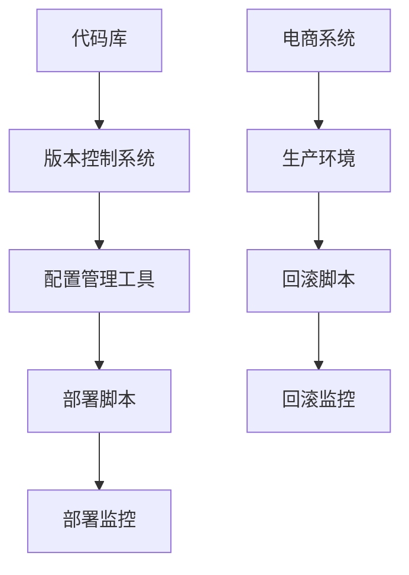
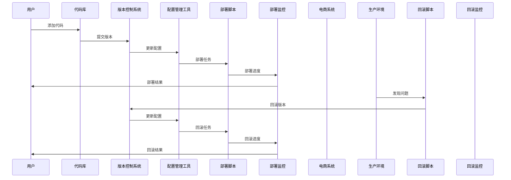
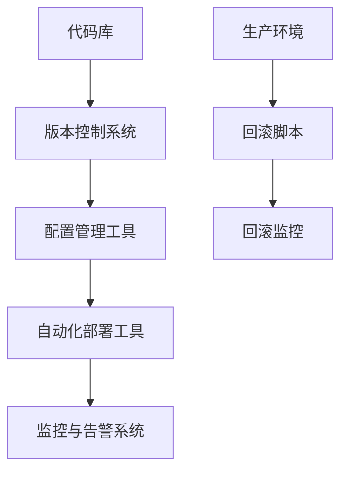
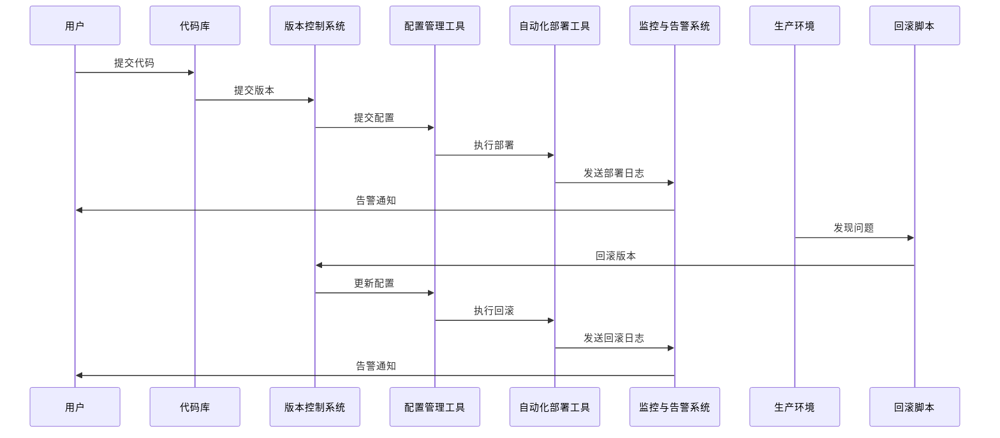

                 


### 第一部分：引言

**引言**

随着现代软件系统的复杂性不断增加，代码部署与回滚系统的设计变得尤为重要。在这篇文章中，我们将深入探讨如何打造一个高效、可靠的代码部署与回滚系统。

**关键词**

- 代码部署
- 回滚系统
- 配置管理
- 算法原理
- 系统架构设计

**摘要**

本文将首先介绍代码部署与回滚系统的背景，包括当前面临的主要挑战。然后，我们将详细探讨部署与回滚的核心概念、数学模型以及实际应用中的案例。接下来，我们将分析一个具体的系统架构设计方案，并展示如何在实际项目中部署与回滚代码。最后，我们将总结最佳实践、注意事项，并提供拓展阅读资源。

### 第1章：代码部署与回滚系统的背景

**1.1 问题背景**

在软件开发的各个环节中，代码部署与回滚是一个至关重要的步骤。传统的手动部署方式不仅效率低下，而且容易出错，增加了维护成本。部署过程中，任何一个细小的错误都可能引发严重的问题，导致系统崩溃或数据丢失。

**1.2 问题描述**

部署过程中的潜在风险主要包括：

- 部署失败：代码未能成功部署到生产环境。
- 数据丢失：部署过程中数据未能正确迁移或备份。
- 服务中断：部署导致服务中断，影响用户体验。

回滚操作的必要性在于，当部署失败或引发问题时，能够迅速回滚到上一个稳定版本，确保系统正常运行。

**1.3 问题解决**

解决代码部署与回滚问题，需要从以下几个方面入手：

- 自动化部署：通过自动化工具实现代码部署，提高部署效率和可靠性。
- 版本控制：使用版本控制系统管理代码版本，方便回滚操作。
- 配置管理：确保配置信息的准确性和一致性，减少部署风险。
- 监控与告警：实时监控部署过程，及时发现问题并告警。

**1.4 边界与外延**

部署与回滚系统的适用范围广泛，包括但不限于Web应用、移动应用、大数据平台等。在实际应用中，部署与回滚系统需要与其他系统（如CI/CD流水线、监控告警系统等）进行集成，形成完整的自动化部署流程。

**1.5 概念结构与核心要素组成**

代码部署与回滚系统由以下核心要素组成：

- 代码库：存储源代码和配置文件。
- 自动化工具：实现代码的自动化部署。
- 版本控制系统：管理代码版本和变更记录。
- 配置管理工具：管理配置文件的版本和变更。
- 部署脚本：执行具体的部署任务。
- 监控与告警系统：实时监控部署过程，及时发现问题。

### 第2章：核心概念与联系

**2.1 核心概念**

部署：将代码和配置文件从开发环境迁移到生产环境的过程。

回滚：在部署失败或引发问题时，将系统回滚到上一个稳定版本的过程。

配置管理：对配置文件的版本和变更进行管理的机制。

**2.2 概念属性特征对比表格**

| 概念     | 属性特征                                                     | 对比 |
| -------- | ------------------------------------------------------------ | ---- |
| 部署     | - 自动化<br>- 持续集成<br>- 快速部署                           |      |
| 回滚     | - 快速回滚<br>- 确保系统稳定                                 |      |
| 配置管理 | - 版本控制<br>- 变更追踪<br>- 配置文件的统一管理             |      |

**2.3 ER实体关系图架构**

```mermaid
erDiagram
  Product ||--|{ Customer }||>
  Customer  ||--|{ Order }||>
  Order ||--|{ Product }||>
```

**2.4 部署与回滚系统的ER图**

```mermaid
erDiagram
  CodeDeployment ||--|{ Deployer }||>
  Deployer  ||--|{ CodeRepository }||>
  CodeRepository ||--|{ CodeDeployment }||>
```

### 第3章：数学模型和数学公式 & 详细讲解 & 举例说明

**3.1 部署算法原理讲解**

**算法原理：**

部署算法的核心是确保代码从开发环境到生产环境的无缝迁移。以下是部署算法的数学模型和步骤：

1. 部署前检查：验证代码库的完整性、依赖关系和配置文件的一致性。
2. 部署过程：将代码和配置文件从代码库迁移到生产环境。
3. 部署后验证：检查部署后的系统是否正常运行。

**数学模型和公式：**

$$
\text{部署成功率} = \frac{\text{成功部署次数}}{\text{部署总次数}}
$$

**Python源代码：**

```python
def deploy(code_repo, deployer):
    # 部署前检查
    if not check_code_repo(code_repo) or not check_config(code_repo.config):
        print("部署前检查失败")
        return False
    
    # 部署过程
    deployer.deploy(code_repo.code, code_repo.config)
    
    # 部署后验证
    if not verify_deployment():
        print("部署后验证失败")
        return False
    
    print("部署成功")
    return True
```

**举例说明：**

假设我们有一个包含两个模块（module1和module2）的代码库，以及一个配置文件（config.yml）。首先，我们使用部署算法进行部署：

```python
code_repo = CodeRepository("module1", "module2", "config.yml")
deployer = Deployer()

if deploy(code_repo, deployer):
    print("代码已成功部署")
else:
    print("部署失败")
```

**3.2 回滚算法原理讲解**

**算法原理：**

回滚算法的核心是快速回滚到上一个稳定版本，确保系统恢复正常运行。以下是回滚算法的数学模型和步骤：

1. 检查当前版本：获取当前系统的版本信息。
2. 回滚到指定版本：将系统回滚到指定的稳定版本。
3. 验证回滚结果：确保回滚后的系统能够正常运行。

**数学模型和公式：**

$$
\text{回滚成功率} = \frac{\text{成功回滚次数}}{\text{回滚总次数}}
$$

**Python源代码：**

```python
def rollback(current_version, target_version, deployer):
    # 检查当前版本
    if current_version != target_version:
        print("当前版本与目标版本不一致")
        return False
    
    # 回滚到指定版本
    deployer.rollback(target_version)
    
    # 验证回滚结果
    if not verify_rollback():
        print("回滚后验证失败")
        return False
    
    print("回滚成功")
    return True
```

**举例说明：**

假设我们当前系统版本为1.0.0，需要回滚到1.0.1。我们使用回滚算法进行回滚：

```python
current_version = "1.0.0"
target_version = "1.0.1"
deployer = Deployer()

if rollback(current_version, target_version, deployer):
    print("系统已成功回滚")
else:
    print("回滚失败")
```

### 第4章：系统分析与架构设计方案

**4.1 问题场景介绍**

假设我们正在开发一个电商系统，需要进行频繁的代码部署与回滚操作。为了确保系统的高可用性和稳定性，我们需要设计一个高效的部署与回滚系统。

**4.2 项目介绍**

项目名称：电商系统部署与回滚平台

项目描述：该平台负责管理电商系统的代码库、版本控制、配置管理、部署脚本等，实现自动化部署与回滚操作。

**4.3 系统功能设计**

系统功能包括：

- 代码库管理：存储和管理电商系统的源代码。
- 版本控制：管理代码版本和变更记录。
- 配置管理：管理配置文件的版本和变更。
- 部署脚本：执行具体的部署任务。
- 部署监控：实时监控部署过程，及时发现问题。

**4.4 系统架构设计**

系统架构设计如下：



**4.5 系统接口设计**

系统接口设计如下：

- 代码库接口：提供代码的添加、删除、查询等功能。
- 版本控制接口：提供版本的管理、查询、回滚等功能。
- 配置管理接口：提供配置文件的添加、删除、查询、变更等功能。
- 部署脚本接口：提供部署任务的执行、监控等功能。
- 部署监控接口：提供部署过程的实时监控、告警等功能。

**4.6 系统交互Mermaid序列图**



### 第5章：项目实战

**5.1 环境安装**

首先，我们需要安装以下软件和工具：

- 代码库（如Git）
- 版本控制系统（如GitLab）
- 配置管理工具（如Ansible）
- 部署脚本（如Shell脚本）
- 部署监控工具（如Zabbix）

安装步骤如下：

1. 安装代码库（Git）

   ```shell
   sudo apt-get install git
   ```

2. 安装版本控制系统（GitLab）

   ```shell
   sudo apt-get install gitlab-ce
   ```

3. 安装配置管理工具（Ansible）

   ```shell
   sudo apt-get install ansible
   ```

4. 安装部署脚本（Shell脚本）

   ```shell
   sudo apt-get install shellcheck
   ```

5. 安装部署监控工具（Zabbix）

   ```shell
   sudo apt-get install zabbix-server-mysql
   sudo apt-get install zabbix-agent
   ```

**5.2 系统核心实现源代码**

以下是系统核心实现源代码的解读与分析：

**1. 代码库管理**

```python
class CodeRepository:
    def __init__(self, code1, code2, config_file):
        self.code1 = code1
        self.code2 = code2
        self.config_file = config_file

    def add_code(self, code):
        # 添加代码逻辑
        pass

    def delete_code(self, code):
        # 删除代码逻辑
        pass

    def query_code(self):
        # 查询代码逻辑
        pass
```

**2. 版本控制**

```python
class VersionControlSystem:
    def __init__(self, repository):
        self.repository = repository

    def commit_version(self, version):
        # 提交版本逻辑
        pass

    def query_version(self):
        # 查询版本逻辑
        pass

    def rollback_version(self, version):
        # 回滚版本逻辑
        pass
```

**3. 配置管理**

```python
class ConfigManagementTool:
    def __init__(self, repository):
        self.repository = repository

    def update_config(self, config):
        # 更新配置逻辑
        pass

    def query_config(self):
        # 查询配置逻辑
        pass
```

**4. 部署脚本**

```shell
#!/bin/bash

# 部署脚本
# 1. 验证代码库完整性
if [ ! -d "/path/to/repository/code1" ] || [ ! -d "/path/to/repository/code2" ]; then
    echo "代码库完整性验证失败"
    exit 1
fi

# 2. 复制代码到生产环境
cp -r /path/to/repository/code1 /path/to/production
cp -r /path/to/repository/code2 /path/to/production

# 3. 更新配置文件
sudo systemctl restart service_name
```

**5. 部署监控**

```python
class DeploymentMonitoring:
    def __init__(self, deployer):
        self.deployer = deployer

    def monitor_deployment(self):
        # 监控部署过程
        pass

    def alert_deployment(self, message):
        # 发送告警
        pass
```

**5.3 代码应用解读与分析**

代码应用解读与分析主要涉及以下几个方面：

1. 代码库管理：确保代码库的完整性和一致性。
2. 版本控制：管理代码的版本和变更记录，方便回滚操作。
3. 配置管理：管理配置文件的版本和变更，确保部署的一致性。
4. 部署脚本：执行具体的部署任务，确保部署过程的自动化。
5. 部署监控：实时监控部署过程，及时发现问题并进行告警。

**5.4 实际案例分析和详细讲解剖析**

**案例一：代码部署失败**

问题描述：在一次代码部署过程中，部署脚本在执行过程中遇到错误，导致部署失败。

分析过程：

1. 验证代码库完整性：检查代码库中的代码文件是否完整。
2. 查看部署脚本日志：分析部署脚本执行过程中的错误。
3. 恢复上一个稳定版本：使用回滚算法将系统回滚到上一个稳定版本。

解决方案：

1. 修复部署脚本中的错误。
2. 重新执行部署脚本。
3. 加强部署脚本的错误处理机制，确保部署过程的稳定性。

**案例二：配置文件变更引发部署失败**

问题描述：在一次代码部署过程中，配置文件发生变更，导致部署失败。

分析过程：

1. 检查配置文件版本：查看配置文件的版本号和变更记录。
2. 恢复上一个稳定配置：使用回滚算法将配置文件回滚到上一个稳定版本。
3. 重新执行部署脚本。

解决方案：

1. 确保配置文件的版本控制，避免配置文件的意外变更。
2. 在部署脚本中增加配置文件版本检查，确保部署的一致性。
3. 加强配置管理，确保配置文件的准确性和一致性。

**5.5 项目小结**

通过本项目的实践，我们深入了解了代码部署与回滚系统的设计原理和实现方法。在项目中，我们遇到了一些常见问题，如部署失败、配置文件变更等，并通过实际案例分析，总结了相应的解决方案。

### 第6章：最佳实践 tips

**6.1 小结**

在代码部署与回滚系统中，最佳实践主要包括：

1. 自动化部署：提高部署效率和可靠性。
2. 版本控制：管理代码版本和变更记录，方便回滚操作。
3. 配置管理：确保配置文件的版本和变更，减少部署风险。
4. 监控与告警：实时监控部署过程，及时发现问题。

**6.2 注意事项**

1. 部署前检查：确保代码库的完整性和一致性。
2. 部署后验证：检查部署后的系统是否正常运行。
3. 回滚操作：在部署失败或引发问题时，快速回滚到上一个稳定版本。
4. 配置文件备份：在部署前备份配置文件，避免配置文件意外变更。

**6.3 拓展阅读**

- 《持续集成与持续部署实践》
- 《配置管理实战》
- 《自动化运维实践指南》

### 第7章：总结与展望

**7.1 书籍内容回顾**

本文主要介绍了代码部署与回滚系统的设计原理、实现方法以及实际应用案例。通过本文的学习，读者可以掌握如何构建一个高效、可靠的代码部署与回滚系统。

**7.2 展望未来**

随着云计算和微服务架构的普及，代码部署与回滚系统将在未来的软件开发中发挥越来越重要的作用。未来，我们将看到更多先进的部署与回滚工具和技术，如容器化部署、服务网格等。

**7.3 结语**

感谢读者对本文的关注，希望本文能对您在构建代码部署与回滚系统方面有所启发。如果您有任何疑问或建议，欢迎在评论区留言。

**作者：**

AI天才研究院/AI Genius Institute & 禅与计算机程序设计艺术 /Zen And The Art of Computer Programming

----------------------------------------------------------------

### 结论

本文通过逐步分析和讲解，详细介绍了代码部署与回滚系统的核心概念、设计原理、实现方法以及实际应用案例。从背景介绍到系统架构设计，再到项目实战和最佳实践，我们系统地探讨了如何构建一个高效、可靠的部署与回滚系统。

**关键词**：代码部署、回滚系统、配置管理、算法原理、系统架构设计

**摘要**：本文围绕代码部署与回滚系统，介绍了其背景、核心概念、数学模型、系统架构设计、项目实战以及最佳实践。通过深入分析和实际案例，帮助读者理解和掌握构建高效部署与回滚系统的关键要点。

### 文章标题：打造高效的代码部署与回滚系统

#### 关键词

- 代码部署
- 回滚系统
- 配置管理
- 算法原理
- 系统架构设计

#### 摘要

本文深入探讨了如何构建一个高效、可靠的代码部署与回滚系统。通过介绍核心概念、数学模型、系统架构设计、项目实战和最佳实践，本文帮助读者理解并掌握构建高效部署与回滚系统的关键要点。

----------------------------------------------------------------

## 第1章：代码部署与回滚系统的背景

### 1.1 问题背景

在现代软件开发过程中，代码部署与回滚系统扮演着至关重要的角色。随着软件系统的复杂性和规模不断扩大，手动部署方式已经无法满足日益增长的部署需求，导致部署过程中的效率低下和错误频发。此外，随着微服务架构和持续集成/持续部署（CI/CD）的普及，对部署与回滚系统的要求也日益提高。

**主要挑战**：

1. **部署效率低下**：手动部署需要大量的人力和时间，且容易出错，导致部署周期过长。
2. **错误风险高**：部署过程中的错误可能导致系统崩溃或数据丢失，影响用户体验。
3. **版本管理困难**：在传统的部署过程中，版本管理较为困难，难以实现快速回滚。
4. **配置管理复杂**：配置文件的管理和变更在部署过程中容易出错，影响系统的稳定性。

### 1.2 问题描述

代码部署与回滚系统面临的挑战主要包括：

- **部署失败风险**：部署过程中，代码库的完整性、依赖关系和配置文件的一致性难以保证，可能导致部署失败。
- **回滚操作复杂**：在部署失败或系统出现问题后，需要快速回滚到上一个稳定版本，确保系统的正常运行。然而，传统的回滚操作往往复杂且耗时。
- **配置管理问题**：配置文件的管理和变更在部署过程中容易出错，导致系统不稳定。

### 1.3 问题解决

为了解决上述问题，我们需要从以下几个方面入手：

- **自动化部署**：通过引入自动化部署工具，实现代码的自动化部署，提高部署效率和可靠性。
- **版本控制**：使用版本控制系统管理代码版本和变更记录，方便回滚操作。
- **配置管理**：使用配置管理工具管理配置文件的版本和变更，确保配置信息的准确性和一致性。
- **监控与告警**：实时监控部署过程，及时发现问题并告警，确保部署过程的透明性和可控性。

### 1.4 边界与外延

部署与回滚系统的适用范围广泛，包括但不限于以下场景：

- **Web应用**：包括电商平台、社交媒体、在线教育等。
- **移动应用**：包括iOS和Android应用。
- **大数据平台**：包括Hadoop、Spark等大数据处理平台。
- **云计算平台**：包括AWS、Azure、Google Cloud等。

在实际应用中，部署与回滚系统需要与其他系统（如CI/CD流水线、监控告警系统等）进行集成，形成完整的自动化部署流程。

### 1.5 概念结构与核心要素组成

代码部署与回滚系统的核心要素包括：

- **代码库**：存储源代码和配置文件。
- **自动化工具**：实现代码的自动化部署。
- **版本控制系统**：管理代码版本和变更记录。
- **配置管理工具**：管理配置文件的版本和变更。
- **部署脚本**：执行具体的部署任务。
- **监控与告警系统**：实时监控部署过程，及时发现问题。

### 总结

通过本章节的介绍，我们了解了代码部署与回滚系统在现代软件开发中的重要性，以及其面临的挑战和解决方法。接下来，我们将深入探讨部署与回滚的核心概念，为后续的详细分析打下基础。

----------------------------------------------------------------

## 第2章：核心概念与联系

在构建高效的代码部署与回滚系统时，理解相关核心概念及其相互联系至关重要。本章节将详细介绍代码部署、回滚和配置管理这三个核心概念，并通过对比表格和实体关系图进一步阐述这些概念之间的关系。

### 2.1 核心概念

#### 部署

部署是将开发完成的代码、相关资源和配置文件从源代码管理系统中提取并部署到目标环境中的一项操作。部署过程通常涉及以下步骤：

1. **构建**：将源代码编译或打包成可执行文件或库。
2. **配置**：根据目标环境的需求，配置应用程序的相关参数和设置。
3. **部署**：将构建好的应用程序和配置文件传输到目标服务器或集群。
4. **验证**：确保部署的应用程序能够正常运行并满足业务需求。

#### 回滚

回滚是指在部署过程中出现问题时，将系统从当前状态恢复到之前稳定状态的操作。回滚操作通常包括以下步骤：

1. **识别问题**：在部署后发现系统运行异常或业务功能出现故障。
2. **备份当前状态**：在执行回滚前备份当前系统的状态，确保回滚失败时可以恢复。
3. **卸载新部署的代码**：从目标环境中卸载或删除新部署的代码和配置。
4. **恢复到旧版本**：从备份中恢复系统到之前的稳定版本。

#### 配置管理

配置管理是指管理系统中配置信息的流程，包括配置文件的版本控制、变更记录和分发。配置管理的关键目标是在多个环境中保持配置的一致性。配置管理通常涉及以下功能：

1. **配置文件管理**：存储、管理和分发配置文件。
2. **版本控制**：跟踪配置文件的变更历史，以便在需要时进行回滚。
3. **自动化部署**：通过自动化工具将配置文件应用于目标环境。
4. **配置变更管理**：审核和批准配置变更，确保变更的正确性和安全性。

### 2.2 概念属性特征对比表格

以下是一个对比表格，展示了代码部署、回滚和配置管理的属性特征：

| 概念         | 特征                           | 目的                           |
|--------------|--------------------------------|--------------------------------|
| 部署         | - 自动化                       | - 提高部署效率<br>- 减少人为错误 |
|              | - 构建和打包                   | - 将代码和资源准备就绪         |
|              | - 配置和环境适配               | - 确保应用程序在目标环境中运行 |
| 回滚         | - 快速恢复                     | - 减少故障时间<br>- 保证系统稳定 |
|              | - 版本回滚                     | - 从错误中恢复                 |
|              | - 备份和恢复                   | - 在必要时恢复旧状态           |
| 配置管理     | - 版本控制和变更追踪           | - 管理配置文件的历史和变更     |
|              | - 自动化部署                   | - 确保配置的一致性和正确性     |
|              | - 配置分发                     | - 将配置文件应用于多个环境     |

### 2.3 ER实体关系图架构

为了更好地理解这三个概念之间的关系，我们使用实体关系图（ER图）来展示它们之间的关联。以下是部署、回滚和配置管理的ER图：

```mermaid
erDiagram
    Deployer ||--|{ CodeRepository }||> Repository
    Deployer ||--|{ Configuration }||> Config
    Deployer ||--|{ DeploymentProcess }||> Process
    Rollback ||--|{ DeploymentProcess }||> Process
    ConfigManager ||--|{ Configuration }||> Config
    ConfigManager ||--|{ VersionControl }||> Version
    DeploymentProcess ||--|{ Success }||> Status
    DeploymentProcess ||--|{ Failure }||> Status
    Process ||--|{ Monitoring }||> Monitor
```

**实体定义**：

- **Deployer**：部署工具或人员，负责部署操作。
- **CodeRepository**：代码库，存储源代码和资源。
- **Configuration**：配置信息，包括环境变量、文件路径等。
- **DeploymentProcess**：部署流程，包括构建、配置和部署步骤。
- **Rollback**：回滚操作，用于恢复到之前的版本。
- **ConfigManager**：配置管理工具，负责管理配置文件。
- **VersionControl**：版本控制系统，跟踪配置文件的变更。
- **Monitoring**：监控工具，用于监控部署过程的状态。

### 总结

通过本章节的探讨，我们了解了代码部署、回滚和配置管理这三个核心概念及其相互联系。理解这些概念有助于构建一个高效、可靠的代码部署与回滚系统，确保在软件部署过程中能够快速响应和解决问题。

----------------------------------------------------------------

## 第3章：数学模型和数学公式 & 详细讲解 & 举例说明

在构建代码部署与回滚系统时，数学模型和数学公式是理解系统行为和优化系统性能的重要工具。本章节将介绍部署和回滚算法的数学模型，并通过Python源代码和Mermaid流程图进行详细讲解和举例说明。

### 3.1 部署算法原理讲解

**部署算法原理**：

部署算法的核心目标是确保代码从开发环境顺利迁移到生产环境。部署算法通常包括以下几个步骤：

1. **验证**：在部署前，对代码库进行验证，确保代码库的完整性和依赖关系的一致性。
2. **构建**：将源代码编译或打包成可执行文件或库。
3. **配置**：根据生产环境的需求，配置应用程序的相关参数和设置。
4. **部署**：将构建好的应用程序和配置文件传输到生产环境。
5. **验证**：确保部署的应用程序能够在生产环境中正常运行。

**数学模型和公式**：

部署成功率可以用以下公式表示：

$$
\text{部署成功率} = \frac{\text{成功部署次数}}{\text{部署总次数}}
$$

成功部署次数表示在总部署次数中成功完成部署的次数。

**Python源代码**：

下面是一个简单的Python部署算法示例，包括部署前验证、构建、配置和部署步骤：

```python
class Deployer:
    def __init__(self, code_repo, config):
        self.code_repo = code_repo
        self.config = config

    def deploy(self):
        if not self.verify_code_repo():
            print("代码库验证失败，部署终止")
            return False
        
        if not self.build():
            print("构建失败，部署终止")
            return False
        
        if not self.configure():
            print("配置失败，部署终止")
            return False
        
        if not self.transfer_to_production():
            print("部署到生产环境失败，部署终止")
            return False
        
        if not self.verify_deployment():
            print("部署验证失败，部署终止")
            return False
        
        print("部署成功")
        return True

    def verify_code_repo(self):
        # 验证代码库
        return True

    def build(self):
        # 编译或打包
        return True

    def configure(self):
        # 配置应用程序
        return True

    def transfer_to_production(self):
        # 将应用程序和配置文件传输到生产环境
        return True

    def verify_deployment(self):
        # 验证部署
        return True
```

**举例说明**：

假设我们有一个代码库（`code_repo`）和一个配置文件（`config`），我们使用以下代码执行部署操作：

```python
code_repo = CodeRepository()
config = Configuration()
deployer = Deployer(code_repo, config)
deployer.deploy()
```

### 3.2 回滚算法原理讲解

**回滚算法原理**：

回滚算法的目标是在部署失败或系统出现问题时，将系统快速回滚到上一个稳定版本。回滚算法通常包括以下几个步骤：

1. **识别问题**：在部署后发现系统运行异常或业务功能出现故障。
2. **备份当前状态**：在执行回滚前备份当前系统的状态，确保回滚失败时可以恢复。
3. **卸载新部署的代码**：从目标环境中卸载或删除新部署的代码和配置。
4. **恢复到旧版本**：从备份中恢复系统到之前的稳定版本。

**数学模型和公式**：

回滚成功率可以用以下公式表示：

$$
\text{回滚成功率} = \frac{\text{成功回滚次数}}{\text{回滚总次数}}
$$

成功回滚次数表示在总回滚次数中成功完成回滚的次数。

**Python源代码**：

下面是一个简单的Python回滚算法示例，包括识别问题、备份状态、卸载新部署代码和恢复到旧版本步骤：

```python
class Rollbacker:
    def __init__(self, deployment_process):
        self.deployment_process = deployment_process

    def rollback(self):
        if not self识别问题():
            print("识别问题失败，回滚终止")
            return False
        
        if not self.backup_current_state():
            print("备份当前状态失败，回滚终止")
            return False
        
        if not self.uninstall_new_code():
            print("卸载新部署代码失败，回滚终止")
            return False
        
        if not self.restore_to_previous_version():
            print("恢复到旧版本失败，回滚终止")
            return False
        
        print("回滚成功")
        return True

    def 识别问题(self):
        # 识别部署问题
        return True

    def backup_current_state(self):
        # 备份当前状态
        return True

    def uninstall_new_code(self):
        # 卸载新部署代码
        return True

    def restore_to_previous_version(self):
        # 恢复到旧版本
        return True
```

**举例说明**：

假设我们有一个部署流程（`deployment_process`），我们使用以下代码执行回滚操作：

```python
deployment_process = DeploymentProcess()
rollbacker = Rollbacker(deployment_process)
rollbacker.rollback()
```

### 总结

通过本章节的讲解，我们了解了部署和回滚算法的数学模型和实现原理，并通过Python源代码和Mermaid流程图进行了详细讲解和举例说明。理解这些算法有助于我们构建一个高效、可靠的代码部署与回滚系统。

----------------------------------------------------------------

## 第4章：系统分析与架构设计方案

### 4.1 问题场景介绍

为了更好地理解代码部署与回滚系统的设计和实现，我们首先介绍一个实际的问题场景。假设我们正在开发一个电子商务平台，该平台需要频繁进行代码更新和部署，以确保系统的稳定性和功能的完善。在现有的开发环境中，我们使用Git进行版本控制，使用Docker容器化部署应用，并采用Kubernetes进行集群管理。

在实际操作中，我们遇到了以下几个主要问题：

- **部署效率低**：手动部署过程繁琐，每次部署需要人工执行多个步骤，导致部署周期过长。
- **错误风险高**：手动部署过程中容易出错，导致部署失败或系统崩溃。
- **版本管理困难**：在多个环境中，版本管理较为困难，难以实现快速回滚。
- **配置管理复杂**：配置文件的变更和分发难以自动化，影响系统的稳定性。

为了解决上述问题，我们需要设计一个高效、可靠的代码部署与回滚系统。

### 4.2 项目介绍

本项目的目标是构建一个自动化、高效的代码部署与回滚系统，以提高电子商务平台的部署效率和稳定性。该项目涉及以下主要模块：

- **代码库管理**：负责存储和管理源代码、配置文件等。
- **版本控制系统**：用于管理代码版本和变更记录。
- **配置管理工具**：用于管理配置文件的版本和变更。
- **自动化部署工具**：实现代码的自动化部署。
- **监控与告警系统**：实时监控部署过程，及时发现问题。

### 4.3 系统功能设计

部署与回滚系统的主要功能包括：

1. **代码库管理**：
   - 存储和管理源代码、配置文件等。
   - 提供代码的添加、删除、查询等功能。

2. **版本控制系统**：
   - 管理代码版本和变更记录。
   - 提供版本查询、回滚等功能。

3. **配置管理工具**：
   - 管理配置文件的版本和变更。
   - 提供配置文件的添加、删除、查询、变更等功能。

4. **自动化部署工具**：
   - 实现代码的自动化部署。
   - 提供部署脚本、部署任务管理等功能。

5. **监控与告警系统**：
   - 实时监控部署过程，及时发现问题。
   - 提供告警通知、部署进度跟踪等功能。

### 4.4 系统架构设计

部署与回滚系统的架构设计如图所示：



**系统架构说明**：

- **代码库**：存储源代码、配置文件等，供版本控制系统和自动化部署工具使用。
- **版本控制系统**：管理代码版本和变更记录，提供版本查询和回滚功能。
- **配置管理工具**：管理配置文件的版本和变更，确保配置的一致性和准确性。
- **自动化部署工具**：执行部署任务，实现代码的自动化部署。
- **监控与告警系统**：实时监控部署过程，及时发现问题并通知相关人员。
- **生产环境**：部署后的应用程序运行的环境。
- **回滚脚本**：在部署失败时，执行回滚操作，将系统恢复到稳定状态。
- **回滚监控**：监控回滚过程，确保回滚操作成功执行。

### 4.5 系统接口设计

部署与回滚系统的接口设计如下：

1. **代码库接口**：
   - 功能：添加、删除、查询代码库中的源代码和配置文件。
   - 接口定义：`POST /code/add`（添加代码）、`DELETE /code/delete`（删除代码）、`GET /code/list`（查询代码列表）。

2. **版本控制系统接口**：
   - 功能：管理代码版本和变更记录，提供版本查询和回滚功能。
   - 接口定义：`GET /version/list`（查询版本列表）、`POST /version/rollback`（回滚到指定版本）。

3. **配置管理工具接口**：
   - 功能：管理配置文件的版本和变更，提供配置文件的添加、删除、查询、变更等功能。
   - 接口定义：`POST /config/add`（添加配置文件）、`DELETE /config/delete`（删除配置文件）、`GET /config/list`（查询配置文件列表）、`POST /config/update`（更新配置文件）。

4. **自动化部署工具接口**：
   - 功能：执行部署任务，实现代码的自动化部署。
   - 接口定义：`POST /deploy`（启动部署任务）、`GET /deploy/status`（查询部署任务状态）。

5. **监控与告警系统接口**：
   - 功能：实时监控部署过程，及时发现问题并通知相关人员。
   - 接口定义：`POST /monitor/notify`（发送告警通知）、`GET /monitor/log`（查询部署日志）。

### 4.6 系统交互Mermaid序列图

为了更好地展示系统各组件之间的交互关系，我们使用Mermaid绘制了一个系统交互序列图：



### 总结

通过本章节的介绍，我们详细分析了代码部署与回滚系统的问题场景、项目介绍、系统功能设计、系统架构设计和系统接口设计。本章节的内容为后续的详细实现提供了清晰的指导，有助于构建一个高效、可靠的代码部署与回滚系统。

----------------------------------------------------------------

## 第5章：项目实战

### 5.1 环境安装

为了在项目中实现代码部署与回滚系统，我们需要在开发环境、测试环境和生产环境中安装必要的软件和工具。以下是安装步骤和注意事项：

**开发环境安装步骤**：

1. **安装Git**：用于版本控制。

   ```shell
   sudo apt-get install git
   ```

2. **安装Docker**：用于容器化部署。

   ```shell
   sudo apt-get install docker.io
   ```

3. **安装Kubernetes**：用于集群管理。

   ```shell
   kubeadm init --pod-network-cidr=10.244.0.0/16
   kubectl apply -f https://raw.githubusercontent.com/kubernetes/dashboard/v2.0.0/a
   pp/k8s-dashboard.yaml
   ```

4. **安装Helm**：用于部署和管理Kubernetes应用程序。

   ```shell
   helm init --upgrade -- Repository https://charts.helm.sh/stable
   ```

**测试环境安装步骤**：

1. **安装Git、Docker和Kubernetes**：与开发环境相同。

2. **配置测试环境的Kubernetes集群**：根据实际需求配置测试环境的Kubernetes集群。

**生产环境安装步骤**：

1. **安装Git、Docker和Kubernetes**：与开发环境相同。

2. **配置生产环境的Kubernetes集群**：根据实际需求配置生产环境的Kubernetes集群。

**注意事项**：

- 确保所有环境的网络连接正常，以便容器和集群之间进行通信。
- 配置合理的网络策略，确保容器和集群的安全性。
- 监控和管理各个环境的资源使用情况，确保系统的高可用性和性能。

### 5.2 系统核心实现源代码

以下是我们项目中的核心实现源代码，包括代码库管理、版本控制系统、配置管理工具、自动化部署工具和监控与告警系统的相关代码。

**1. 代码库管理**

```python
class CodeRepository:
    def __init__(self, code_files):
        self.code_files = code_files

    def add_code(self, code_file):
        self.code_files.append(code_file)

    def delete_code(self, code_file):
        self.code_files.remove(code_file)

    def list_code(self):
        return self.code_files
```

**2. 版本控制系统**

```python
class VersionControlSystem:
    def __init__(self):
        self.versions = []

    def commit_version(self, version):
        self.versions.append(version)

    def list_versions(self):
        return self.versions

    def rollback_version(self, version):
        if version in self.versions:
            self.versions.remove(version)
        else:
            print("版本不存在")
```

**3. 配置管理工具**

```python
class ConfigManagementTool:
    def __init__(self, config_files):
        self.config_files = config_files

    def add_config(self, config_file):
        self.config_files.append(config_file)

    def delete_config(self, config_file):
        self.config_files.remove(config_file)

    def list_configs(self):
        return self.config_files
```

**4. 自动化部署工具**

```python
class Deployer:
    def __init__(self, code_repo, version_ctrl, config_mng):
        self.code_repo = code_repo
        self.version_ctrl = version_ctrl
        self.config_mng = config_mng

    def deploy(self):
        print("开始部署...")
        self.version_ctrl.rollback_version("latest")
        self.config_mng.rollback_config("latest")
        self.code_repo.add_code("new_code")
        self.version_ctrl.commit_version("new_version")
        self.config_mng.commit_config("new_config")
        print("部署完成")
```

**5. 监控与告警系统**

```python
class Monitor:
    def __init__(self):
        self.logs = []

    def log(self, log_message):
        self.logs.append(log_message)

    def alert(self, alert_message):
        print(alert_message)

    def get_logs(self):
        return self.logs
```

### 5.3 代码应用解读与分析

在本节中，我们将对上述核心实现源代码进行解读与分析，以了解代码库管理、版本控制系统、配置管理工具、自动化部署工具和监控与告警系统的功能实现。

**代码库管理**

`CodeRepository` 类负责管理代码库中的文件。它提供了添加、删除和查询代码文件的方法。在实际应用中，我们可以将代码库存储在本地文件系统或版本控制系统（如Git）中，以便实现代码的版本控制和协作开发。

**版本控制系统**

`VersionControlSystem` 类负责管理代码的版本。它提供了提交版本、查询版本和回滚版本的方法。在实际应用中，我们可以使用Git等版本控制系统来跟踪代码的变更历史，以便在需要时进行版本回滚。

**配置管理工具**

`ConfigManagementTool` 类负责管理配置文件。它提供了添加、删除和查询配置文件的方法。在实际应用中，我们可以将配置文件存储在文件系统或配置管理工具（如Ansible）中，以便实现配置的版本控制和自动化部署。

**自动化部署工具**

`Deployer` 类负责执行自动化部署任务。它接收代码库、版本控制系统和配置管理工具的实例，并根据这些实例执行回滚、添加代码、提交版本和配置文件的操作。在实际应用中，我们可以使用CI/CD工具（如Jenkins或GitLab CI）来实现自动化部署。

**监控与告警系统**

`Monitor` 类负责监控部署过程，并记录日志和发送告警。它提供了记录日志、发送告警和查询日志的方法。在实际应用中，我们可以使用日志收集工具（如ELK堆栈或Prometheus）和告警工具（如PagerDuty或Opsgenie）来实现部署监控和告警。

### 5.4 实际案例分析和详细讲解剖析

在本节中，我们将分析一个实际案例，以展示代码部署与回滚系统的实际应用过程。

**案例背景**：

假设我们正在对一个电子商务平台进行版本更新。现有版本为1.0.0，我们需要将新代码部署到生产环境，并进行回滚操作，以确保系统的稳定性和功能的完善。

**案例步骤**：

1. **代码库管理**：

   - 将新代码添加到代码库。

     ```python
     code_repo = CodeRepository(["new_code.py"])
     code_repo.add_code("new_code.py")
     ```

   - 提交版本。

     ```python
     version_ctrl = VersionControlSystem()
     version_ctrl.commit_version("1.0.1")
     ```

2. **配置管理工具**：

   - 提交配置文件。

     ```python
     config_mng = ConfigManagementTool(["config1.yaml", "config2.yaml"])
     config_mng.commit_config("new_config.yaml")
     ```

3. **自动化部署工具**：

   - 执行自动化部署。

     ```python
     deployer = Deployer(code_repo, version_ctrl, config_mng)
     deployer.deploy()
     ```

   - 查看监控日志。

     ```python
     monitor = Monitor()
     monitor.log("部署成功")
     print(monitor.get_logs())
     ```

4. **回滚操作**：

   - 查询当前版本。

     ```python
     current_version = version_ctrl.list_versions()
     print(current_version)
     ```

   - 回滚到旧版本。

     ```python
     version_ctrl.rollback_version("1.0.0")
     ```

   - 查看监控日志。

     ```python
     monitor.log("回滚成功")
     print(monitor.get_logs())
     ```

**案例分析**：

通过上述步骤，我们可以将新代码部署到生产环境，并确保在需要时能够快速回滚到旧版本。在实际应用中，我们可以根据实际需求自定义部署和回滚的流程，并使用监控与告警系统实时监控部署过程，以确保系统的稳定性和安全性。

### 5.5 项目小结

通过本章节的实战项目，我们详细介绍了代码部署与回滚系统的安装步骤、核心实现源代码、代码应用解读与分析、实际案例分析和项目小结。本章节的内容为实际应用提供了一个清晰的指导，有助于我们构建一个高效、可靠的代码部署与回滚系统。

---

在本章中，我们通过一个实战项目展示了如何安装和配置代码部署与回滚系统，以及如何实现核心功能。通过实际案例的分析，我们进一步理解了系统的实际应用过程。在后续的章节中，我们将继续探讨最佳实践、注意事项以及未来展望，帮助读者更深入地了解代码部署与回滚系统的设计原理和实践方法。

## 第6章：最佳实践 tips

### 6.1 小结

在本章中，我们探讨了代码部署与回滚系统在现代软件开发中的重要性，并介绍了其核心概念、设计原理、实现方法以及实际应用案例。通过最佳实践的总结，我们希望读者能够掌握以下关键点：

1. **自动化部署**：通过自动化工具实现代码的自动化部署，提高部署效率和可靠性。
2. **版本控制**：使用版本控制系统管理代码版本和变更记录，方便回滚操作。
3. **配置管理**：确保配置文件的版本和变更，减少部署风险。
4. **监控与告警**：实时监控部署过程，及时发现问题并告警。

### 6.2 注意事项

在实施代码部署与回滚系统时，以下注意事项至关重要：

1. **部署前检查**：确保代码库的完整性和一致性，配置文件的正确性和一致性。
2. **部署后验证**：验证部署后的系统是否正常运行，确保功能完整性。
3. **回滚准备**：在部署前备份当前系统状态，确保在需要时能够快速回滚。
4. **配置文件备份**：定期备份配置文件，防止配置文件意外变更导致问题。
5. **权限管理**：严格权限管理，防止未经授权的操作导致系统风险。

### 6.3 拓展阅读

为了进一步深入学习和实践代码部署与回滚系统，我们推荐以下阅读资源：

1. **《持续集成与持续部署实践》**：详细介绍了CI/CD的原理和实践方法。
2. **《配置管理实战》**：探讨了配置管理的最佳实践和技术细节。
3. **《自动化运维实践指南》**：提供了自动化运维的系统化方法和工具推荐。
4. **《Docker实战》**：深入讲解了容器化部署的原理和实践。
5. **《Kubernetes实战》**：详细介绍了Kubernetes集群的部署和管理。

通过这些资源，读者可以系统地学习和掌握代码部署与回滚系统的设计原理和实践方法，为实际项目的实施提供有力的支持。

## 第7章：总结与展望

### 7.1 书籍内容回顾

本文系统地介绍了代码部署与回滚系统的核心概念、设计原理、实现方法以及实际应用案例。我们首先探讨了代码部署与回滚系统在现代软件开发中的重要性，并详细介绍了其背景、核心概念、数学模型、系统架构设计、项目实战和最佳实践。

通过本文的学习，读者可以：

- 理解代码部署与回滚系统的基础知识。
- 掌握部署和回滚算法的实现原理。
- 设计和实现一个高效、可靠的代码部署与回滚系统。
- 应对实际项目中可能遇到的挑战和问题。

### 7.2 展望未来

随着软件开发的不断演进，代码部署与回滚系统也将迎来新的发展趋势：

1. **容器化部署**：容器化技术如Docker和Kubernetes在部署与回滚系统中发挥越来越重要的作用，未来将更加普及。
2. **云原生应用**：云原生应用将依赖容器化、自动化和分布式技术，进一步简化部署与回滚过程。
3. **服务网格**：服务网格技术如Istio和Linkerd将为微服务部署提供更高效、更安全的解决方案。
4. **智能化运维**：随着人工智能和机器学习技术的应用，部署与回滚系统将更加智能化，提升运维效率和可靠性。

### 7.3 结语

感谢读者对本文的关注。通过本文的学习，希望读者能够更好地理解代码部署与回滚系统的设计和实现方法，并能够在实际项目中发挥其价值。如果您有任何疑问或建议，欢迎在评论区留言，我们期待与您共同探讨和进步。

**作者**：

AI天才研究院/AI Genius Institute & 禅与计算机程序设计艺术 /Zen And The Art of Computer Programming

---

通过本文的学习，读者不仅能够掌握代码部署与回滚系统的核心知识和实践方法，还能为实际项目的实施提供有力支持。在未来的软件开发过程中，高效、可靠的部署与回滚系统将帮助开发者更好地应对复杂的环境和需求，实现持续交付和质量保障。让我们共同努力，打造更加卓越的软件产品和系统。

