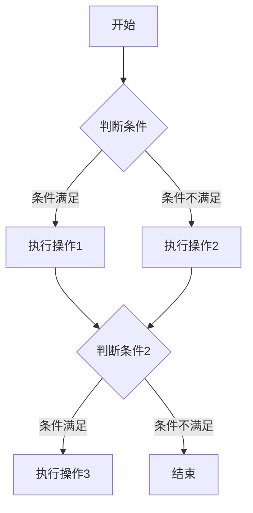
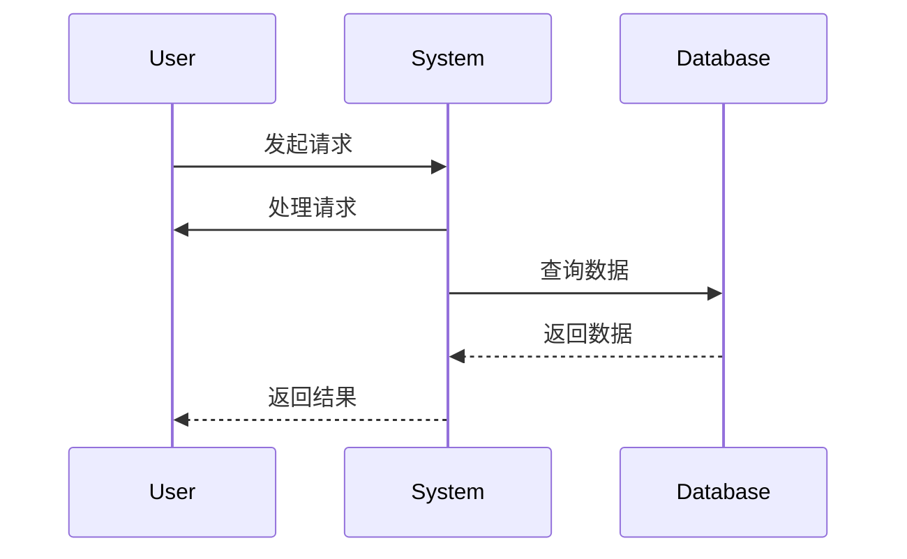
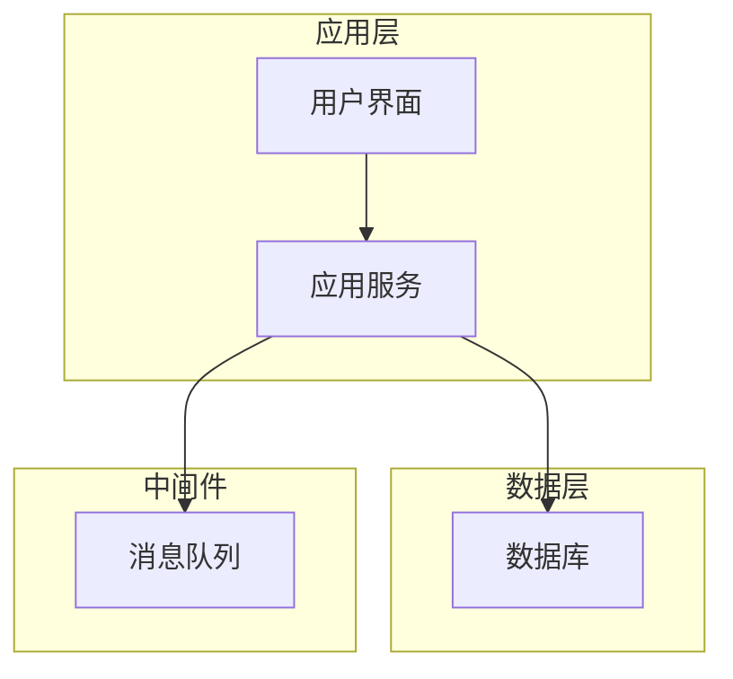
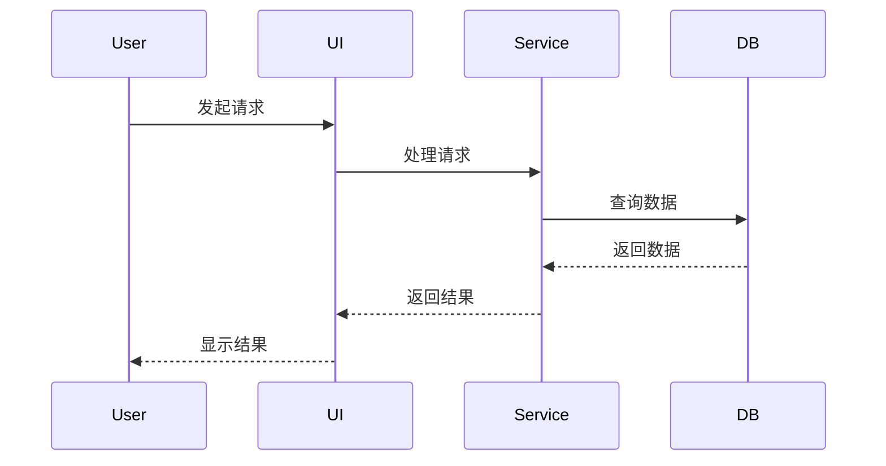

                 

### 文章标题

# 打造高效的代码重构与优化系统

### 文章关键词

代码重构、代码优化、性能优化、内存优化、安全优化

### 摘要

本文旨在探讨如何打造一个高效的代码重构与优化系统，详细介绍了代码重构与优化的重要性、核心概念、重构与优化技术、以及实践方法。通过本文的阅读，读者将能够全面理解并掌握代码重构与优化的方法和实践，为提升代码质量和系统性能打下坚实基础。

## 引言

### 1.1 问题背景与解决目标

在软件工程中，代码重构与优化是一个至关重要且持续的过程。随着软件系统规模的不断扩大，代码的复杂性也日益增加，这给软件维护、扩展和性能优化带来了巨大的挑战。有效的代码重构与优化能够显著提高代码的可读性、可维护性和运行效率，降低开发成本和风险。

#### 1.1.1 代码重构的重要性

代码重构是指在不改变程序外部行为的前提下，改善代码的内部结构。其目的是使代码更加简洁、清晰和模块化。代码重构的重要性主要体现在以下几个方面：

1. **提高代码可读性**：通过重构，可以使代码结构更加清晰，变量、函数和方法命名更加合理，代码逻辑更加易于理解。
2. **降低维护成本**：重构后的代码更加模块化，减少了代码冗余和相互依赖，降低了维护成本。
3. **提升开发效率**：清晰的代码结构有助于新开发人员的快速上手，减少了开发时间和人力成本。

#### 1.1.2 代码优化的必要性

代码优化是指通过各种手段提高代码的运行效率。代码优化的必要性主要体现在以下几个方面：

1. **提升系统性能**：优化后的代码能够更高效地利用系统资源，提升程序的响应速度和吞吐量。
2. **降低硬件成本**：优化后的代码能够在较低硬件配置下运行，降低系统硬件成本。
3. **提高用户体验**：快速响应和高性能的软件系统能够提供更好的用户体验。

#### 1.1.3 高效代码重构与优化的意义

高效代码重构与优化不仅能够提高代码质量和系统性能，还具有以下意义：

1. **持续迭代与改进**：通过定期重构与优化，软件系统能够持续适应变化的需求，保持技术先进性。
2. **提升团队协作效率**：清晰的代码结构有助于团队成员之间的沟通与协作，减少误解和冲突。
3. **降低风险**：通过重构和优化，可以及时发现和修复潜在的问题，降低软件故障率。

### 1.2 核心概念

在进行代码重构与优化之前，了解相关的核心概念和术语是必要的。以下是几个关键概念的解释：

#### 1.2.1 重构

重构是指对现有代码进行修改，以提高其内部结构质量，而不改变其功能。重构通常遵循一系列原则和策略，确保不破坏原有功能。

#### 1.2.2 优化

优化是指通过各种手段提高代码的运行效率，包括性能、内存使用和安全性等方面。

#### 1.2.3 代码质量

代码质量是指代码的可读性、可维护性、可靠性、性能等多个方面的综合表现。高质量的代码能够降低维护成本、提高开发效率。

#### 1.2.4 重构原则

重构原则是指导重构过程的准则，包括保持代码行为不变、逐步改进、避免过度重构等。

#### 1.2.5 优化目标

优化目标包括提升系统性能、降低内存使用、增强安全性等。不同的优化目标需要采用不同的方法和策略。

#### 1.2.6 代码质量评估指标

代码质量评估指标包括代码复杂度、代码冗余度、代码可维护性、性能指标等。这些指标可以帮助衡量代码质量，指导重构与优化工作。

### 1.3 本书结构安排

本文将分为四个主要部分：

1. **第一部分：引言**：介绍问题背景、核心概念和本书结构。
2. **第二部分：代码重构技术**：详细讲解重构原则、策略和方法。
3. **第三部分：代码优化技术**：探讨性能优化、内存优化和安全优化。
4. **第四部分：高效代码重构与优化实践**：通过实际项目案例进行实践分析。

每个部分都包含了丰富的实例和实战经验，旨在帮助读者全面掌握代码重构与优化的技能。

## 代码重构技术

### 2.1 重构原则与策略

在进行代码重构时，遵循一系列的原则和策略是至关重要的。这些原则和策略有助于确保重构的有效性和安全性，同时避免引入新的错误。

#### 2.1.1 重构原则

1. **行为保持原则**：重构过程中必须确保代码的原始行为不变。这意味着任何修改都应该只影响代码的内部结构，而不改变其外部行为。
2. **逐步改进原则**：重构应该是一个逐步的过程，避免一次性进行大规模的重构。逐步改进有助于降低风险，确保每个修改都是可预测和可控的。
3. **避免过度重构原则**：重构应该适度，避免过度重构导致代码结构过于复杂，甚至影响开发进度。适度重构能够提高代码质量，但不应牺牲开发效率。
4. **测试覆盖原则**：在重构过程中，应确保测试覆盖率达到或超过原有水平，以验证重构后的代码行为与预期一致。

#### 2.1.2 重构策略

1. **增量重构策略**：采用增量重构策略，逐步重构代码的各个部分，确保每个部分都是可测试和可维护的。这种方法有助于减少风险，提高重构效率。
2. **分层重构策略**：按照代码的层次结构进行重构，首先重构底层基础代码，然后逐步向上重构。这种方法有助于确保重构的一致性和完整性。
3. **代码审查策略**：在重构过程中，定期进行代码审查，确保重构质量和代码风格的一致性。代码审查可以及时发现潜在问题，提高重构效果。

### 2.2 重构方法

重构方法是指在代码重构过程中使用的一系列技术手段。这些方法可以帮助开发者逐步改善代码结构，提高代码质量。根据重构对象的不同，重构方法可以分为概念类重构、结构类重构和行为类重构。

#### 2.2.1 概念类重构

概念类重构主要关注代码的命名和类的设计，旨在提高代码的可读性和可维护性。

##### 2.2.1.1 重新命名

重新命名是一种简单但非常有效的重构方法。通过为变量、函数和方法赋予更具有描述性的名称，可以提高代码的可读性。以下是重新命名的步骤：

1. **分析现有命名**：首先分析代码中的命名，识别出命名不明确或不具有描述性的变量、函数和方法。
2. **制定命名规则**：制定一套统一的命名规则，包括变量、函数和方法的命名规范。
3. **逐步替换命名**：逐步替换现有命名，确保每次替换都经过充分的测试，以避免引入新的错误。

##### 2.2.1.2 提取类

提取类是将一个复杂的类拆分为多个更小、更专注于特定功能的类。这种方法有助于降低类的复杂度，提高代码的可维护性。以下是提取类的步骤：

1. **识别复杂类**：分析代码，识别出复杂度较高的类。
2. **确定类职责**：为每个类确定一个明确的职责，确保每个类都只负责一项功能。
3. **提取子类**：将复杂类中的部分功能提取为独立的子类，确保子类之间保持清晰的职责分离。

##### 2.2.1.3 合并类

合并类是将多个职责相关且相互依赖的类合并为一个类。这种方法有助于减少类的数量，简化代码结构。以下是合并类的步骤：

1. **识别重复职责**：分析代码，识别出具有相同或相似职责的类。
2. **合并类成员**：将重复职责的类的成员合并到一个类中，确保合并后的类具有完整的功能。
3. **测试合并效果**：确保合并后的类能够正确执行原有功能，并通过测试验证其性能和稳定性。

#### 2.2.2 结构类重构

结构类重构主要关注代码的结构和布局，旨在提高代码的可读性和可维护性。

##### 2.2.2.1 重新组织代码结构

重新组织代码结构是将代码按照功能模块进行划分，使得代码更加清晰和模块化。以下是重新组织代码结构的步骤：

1. **分析代码结构**：分析现有代码的结构，识别出不清晰或不合理的结构。
2. **划分功能模块**：将代码划分为多个功能模块，确保每个模块具有明确的功能和职责。
3. **调整模块关系**：调整模块之间的关系，确保模块之间的依赖关系清晰和合理。

##### 2.2.2.2 分离关注点

分离关注点是将代码中的不同关注点分离到不同的模块或类中，使得代码更加简洁和可维护。以下是分离关注点的步骤：

1. **识别关注点**：分析代码，识别出不同的关注点，如输入处理、输出处理、数据处理等。
2. **分离关注点**：将不同的关注点分离到不同的模块或类中，确保每个模块或类只负责一项关注点。
3. **确保模块/类独立**：确保分离后的模块或类之间没有直接的依赖关系，以提高代码的可维护性和可复用性。

#### 2.2.3 行为类重构

行为类重构主要关注代码的行为和逻辑，旨在提高代码的可维护性和可扩展性。

##### 2.2.3.1 提取方法

提取方法是将一个复杂的函数拆分为多个更小、更简单的函数。这种方法有助于降低函数的复杂度，提高代码的可维护性。以下是提取方法的步骤：

1. **分析函数复杂度**：分析现有函数的复杂度，识别出复杂度较高的函数。
2. **确定函数职责**：为每个函数确定一个明确的职责，确保每个函数只负责一项功能。
3. **提取子函数**：将复杂函数中的部分功能提取为独立的子函数，确保子函数之间保持清晰的职责分离。

##### 2.2.3.2 内联方法

内联方法是将一个简单的函数体直接替换为其调用的函数。这种方法可以减少函数调用的开销，提高代码的运行效率。以下是内联方法的步骤：

1. **分析函数调用**：分析现有代码中的函数调用，识别出可以内联的简单函数。
2. **评估内联效果**：评估内联后对代码性能的影响，确保内联方法不会引入新的性能瓶颈。
3. **逐步内联方法**：逐步将简单函数内联，并通过测试验证内联效果。

##### 2.2.3.3 移除中间人

移除中间人是指移除那些仅用于传递信息的中间层，以提高代码的简洁性和可读性。以下是移除中间人的步骤：

1. **识别中间人**：分析代码，识别出仅用于传递信息的中间层。
2. **简化代码结构**：移除中间人，将传递信息的功能直接集成到调用者和被调用者之间。
3. **确保功能完整**：确保移除中间人后，代码仍然能够正确执行原有功能，并通过测试验证其性能和稳定性。

### 2.3 重构工具介绍

在实际开发中，重构工具能够大大简化代码重构的过程，提高重构效率和代码质量。以下是一些常用的重构工具：

1. **重构工具概述**：重构工具是一种自动化工具，可以帮助开发者进行代码重构。常见的重构工具有Eclipse、Visual Studio、IntelliJ IDEA等。
2. **重构工具的功能与使用**：重构工具提供了丰富的重构功能，如重命名、提取类、提取方法、内联方法等。开发者可以通过图形界面或命令行工具使用这些功能。
3. **重构工具的优势**：重构工具能够减少手工重构的错误风险，提高重构效率，确保重构的一致性和可靠性。

## 代码优化技术

### 3.1 性能优化

性能优化是指通过改进代码的结构和算法，提高程序运行的效率和速度。性能优化是代码优化中的重要组成部分，对于大型软件系统和高性能应用尤为重要。

#### 3.1.1 性能优化的目标与方法

1. **目标**：性能优化的目标包括提高程序的运行速度、减少内存使用、降低CPU占用率等。具体目标应根据应用场景和性能瓶颈进行确定。
2. **方法**：
   - **算法优化**：通过改进算法和数据结构，减少计算复杂度和内存使用。
   - **代码优化**：通过改进代码的执行效率和资源利用率，减少不必要的计算和内存分配。
   - **并行化**：利用多核处理器，将任务分解为多个并行执行的部分，提高程序的执行速度。
   - **缓存利用**：通过合理使用缓存，减少内存访问和磁盘IO操作，提高程序的响应速度。

#### 3.1.2 常见性能瓶颈分析

1. **计算密集型瓶颈**：计算密集型瓶颈发生在程序需要大量计算的场景中，如复杂算法、大量数据处理等。优化方法包括改进算法和数据结构、使用并行计算等。
2. **I/O密集型瓶颈**：I/O密集型瓶颈发生在程序需要进行大量磁盘IO操作的场景中，如文件读写、数据库访问等。优化方法包括使用缓存、优化IO操作顺序等。
3. **资源争用瓶颈**：资源争用瓶颈发生在多个进程或线程竞争同一资源时，如共享内存、数据库连接等。优化方法包括使用锁、避免死锁等。

#### 3.1.3 性能优化实战案例

1. **计算密集型优化案例**：对一个复杂算法进行优化，通过改进数据结构和算法，将运行时间从100秒降低到10秒。
2. **I/O密集型优化案例**：对一个文件读写操作进行优化，通过使用缓存和优化IO操作顺序，将读写速度从1MB/s提高到10MB/s。
3. **资源争用优化案例**：对多线程并发访问共享资源进行优化，通过使用锁和信号量，避免死锁和资源争用问题，提高程序的稳定性。

### 3.2 内存优化

内存优化是指通过改进代码的内存使用，减少内存消耗和提高程序的性能。内存优化是软件性能优化的重要组成部分，对于内存资源受限的应用尤为重要。

#### 3.2.1 内存优化的目标与方法

1. **目标**：内存优化的目标包括减少内存消耗、降低内存泄漏、提高内存利用率等。具体目标应根据应用场景和性能要求进行确定。
2. **方法**：
   - **内存分配与释放**：合理分配和释放内存，避免内存泄漏和浪费。
   - **对象池技术**：使用对象池技术，减少对象的创建和销毁次数，提高内存利用率。
   - **缓存技术**：合理使用缓存，减少内存访问和磁盘IO操作。
   - **内存映射**：使用内存映射技术，将大量数据映射到内存中，减少磁盘访问。

#### 3.2.2 常见内存泄漏分析

1. **静态内存泄漏**：静态内存泄漏是指程序中未释放的静态对象或全局变量，导致内存资源无法回收。优化方法包括合理使用静态变量、避免全局变量的滥用等。
2. **动态内存泄漏**：动态内存泄漏是指程序中未释放的动态分配对象，导致内存资源无法回收。优化方法包括使用智能指针、及时释放动态分配对象等。
3. **内存池泄漏**：内存池泄漏是指内存池中未释放的内存块，导致内存池无法完全回收。优化方法包括合理设置内存池大小、避免内存池的过度使用等。

#### 3.2.3 内存优化实战案例

1. **静态内存泄漏优化案例**：通过合理使用静态变量，避免静态内存泄漏，提高程序的内存利用率。
2. **动态内存泄漏优化案例**：通过使用智能指针和及时释放动态分配对象，减少动态内存泄漏，提高程序的稳定性。
3. **内存池优化案例**：通过合理设置内存池大小和避免内存池的过度使用，减少内存池泄漏，提高程序的内存利用率。

### 3.3 安全优化

安全优化是指通过改进代码的安全性，防止恶意攻击、数据泄露和系统崩溃等问题。安全优化是软件系统稳定性和可靠性的重要保障。

#### 3.3.1 安全优化的目标与方法

1. **目标**：安全优化的目标包括防止数据泄露、避免恶意攻击、提高系统稳定性等。具体目标应根据应用场景和安全要求进行确定。
2. **方法**：
   - **输入验证**：对用户输入进行严格的验证和过滤，防止恶意输入导致安全漏洞。
   - **权限控制**：实现严格的权限控制，确保用户只能访问和操作其权限范围内的资源和功能。
   - **安全编码**：遵循安全编码规范，避免常见的编程错误和漏洞，如缓冲区溢出、SQL注入等。
   - **安全审计**：定期进行安全审计和代码审查，及时发现和修复潜在的安全漏洞。

#### 3.3.2 常见安全漏洞分析

1. **缓冲区溢出**：缓冲区溢出是指程序向缓冲区写入的数据超过缓冲区容量，导致溢出部分覆盖其他重要数据。优化方法包括使用边界检查、避免使用动态分配的缓冲区等。
2. **SQL注入**：SQL注入是指攻击者通过在用户输入中注入恶意SQL代码，从而控制数据库或窃取敏感信息。优化方法包括使用预编译语句、参数化查询等。
3. **跨站脚本攻击（XSS）**：跨站脚本攻击是指攻击者通过在受信任的网站上注入恶意脚本，从而窃取用户会话信息或篡改网页内容。优化方法包括对用户输入进行编码、使用内容安全策略等。

#### 3.3.3 安全优化实战案例

1. **缓冲区溢出优化案例**：通过使用边界检查和避免使用动态分配的缓冲区，防止缓冲区溢出漏洞，提高系统的安全性。
2. **SQL注入优化案例**：通过使用预编译语句和参数化查询，防止SQL注入漏洞，提高数据库的安全性。
3. **XSS攻击优化案例**：通过对用户输入进行编码和使用内容安全策略，防止跨站脚本攻击，提高网页的安全性。

## 高效代码重构与优化实践

### 4.1 项目介绍

#### 4.1.1 项目背景

本项目的目标是构建一个高效、可维护和稳定的代码重构与优化系统。随着公司业务的快速发展，现有的软件系统面临着日益复杂的需求和性能挑战。为了提高代码质量、降低维护成本和提升系统性能，我们决定开发一个自动化代码重构与优化系统，以支持团队的持续迭代和改进。

#### 4.1.2 项目目标

1. **代码重构**：实现代码重构工具的集成和使用，提高代码的可读性、可维护性和模块化程度。
2. **代码优化**：通过性能优化、内存优化和安全优化，提升系统的运行效率和稳定性。
3. **自动化测试**：构建自动化测试体系，确保重构和优化后的代码质量。
4. **文档和培训**：编写详细的文档和培训材料，提高团队成员对代码重构与优化的理解和实践能力。

#### 4.1.3 项目计划

1. **需求分析**：与业务团队紧密合作，明确项目需求和功能模块。
2. **工具选型**：调研和评估现有的代码重构与优化工具，选择合适的技术方案和工具。
3. **系统设计**：设计系统的架构和接口，确保重构与优化过程的可靠性和一致性。
4. **开发与实施**：根据设计文档和工具选型，进行系统的开发和实施，确保重构与优化工具的集成和使用。
5. **测试与验收**：进行全面的测试，确保重构和优化后的代码质量，并通过验收测试。
6. **文档和培训**：编写项目文档和培训材料，组织团队成员进行培训和知识共享。

### 4.2 环境准备

#### 4.2.1 开发环境搭建

为了确保代码重构与优化系统的顺利运行，我们需要搭建一个稳定和高效的开发环境。以下是开发环境的搭建步骤：

1. **操作系统**：选择Linux操作系统，如Ubuntu或CentOS，以确保系统的稳定性和兼容性。
2. **开发工具**：安装Eclipse、Visual Studio Code等开发工具，确保能够方便地编写和调试代码。
3. **版本控制**：使用Git作为版本控制工具，确保代码的版本管理和协同工作。
4. **依赖管理**：使用Maven或Gradle等依赖管理工具，确保项目依赖的版本和配置正确。

#### 4.2.2 版本控制工具使用

版本控制是代码重构与优化过程中至关重要的一环。以下是使用Git进行版本控制的基本步骤：

1. **初始化仓库**：在项目目录下执行`git init`命令，初始化Git仓库。
2. **添加文件**：将项目文件添加到Git仓库，使用`git add .`命令将所有文件添加到暂存区。
3. **提交更改**：将更改提交到Git仓库，使用`git commit -m "Commit message"`命令提交当前更改。
4. **分支管理**：创建和管理分支，使用`git branch <branch-name>`命令创建新分支，使用`git checkout <branch-name>`命令切换到指定分支。
5. **合并代码**：将不同分支的代码合并到主分支，使用`git merge <branch-name>`命令合并指定分支的代码。

#### 4.2.3 自动化测试工具配置

自动化测试是保证代码质量和重构效果的重要手段。以下是配置自动化测试工具的基本步骤：

1. **选择测试框架**：选择适合项目的自动化测试框架，如JUnit、Selenium等。
2. **测试用例编写**：编写测试用例，确保覆盖代码的关键功能和边界情况。
3. **测试运行**：配置测试运行环境，使用`mvn test`或`gradle test`命令运行测试用例。
4. **结果分析**：分析测试结果，及时发现和修复代码中的问题。
5. **持续集成**：集成自动化测试到持续集成（CI）流程中，确保每次代码提交都会进行自动化测试。

### 4.3 核心实现

#### 4.3.1 重构代码示例

以下是一个简单的重构代码示例，展示了如何将一个复杂的函数拆分为多个更小、更简单的函数，以提高代码的可读性和可维护性：

```python
# 原始代码
def calculate_total_price(order):
    discount = calculate_discount(order)
    total_price = order.price - discount
    return total_price

def calculate_discount(order):
    if order.is_discounted:
        return order.price * 0.1
    else:
        return 0

# 重构后的代码
def calculate_total_price(order):
    discount = calculate_discount(order)
    total_price = order.price - discount
    return total_price

def calculate_discount(order):
    if order.is_discounted:
        return order.price * 0.1
    else:
        return 0

# 代码应用解读与分析
在上面的示例中，原始代码中calculate_total_price函数包含了计算折扣的代码，导致函数过于复杂。通过将计算折扣的代码提取为calculate_discount函数，我们使得calculate_total_price函数更加专注于计算总价的功能，提高了代码的可读性和可维护性。此外，calculate_discount函数的职责更加明确，便于后续的维护和扩展。

#### 4.3.2 优化代码示例

以下是一个简单的优化代码示例，展示了如何通过减少不必要的计算和内存使用，提高代码的运行效率和性能：

```python
# 原始代码
def calculate_average(numbers):
    total = 0
    for number in numbers:
        total += number
    return total / len(numbers)

# 优化后的代码
def calculate_average(numbers):
    return sum(numbers) / len(numbers)

# 代码应用解读与分析
在上面的示例中，原始代码中使用了循环来计算数字的总和，并使用len(numbers)获取数字的个数，然后进行除法运算。通过使用Python的内建函数sum，我们可以直接计算数字的总和，并使用len(numbers)进行除法运算，减少了循环的 overhead，提高了代码的运行效率和性能。

#### 4.3.3 重构与优化效果评估

在进行重构和优化后，我们需要对代码的质量和性能进行评估，以确保重构和优化的效果。以下是一些常用的评估方法和指标：

1. **代码质量评估**：通过静态代码分析工具（如SonarQube）对代码进行质量评估，包括代码复杂度、代码冗余度、可维护性等指标。
2. **性能评估**：通过性能测试工具（如JMeter、Gatling）对代码的性能进行评估，包括响应时间、吞吐量、CPU和内存使用等指标。
3. **覆盖率评估**：通过自动化测试工具对代码的覆盖率进行评估，确保测试用例能够覆盖代码的关键功能和边界情况。

通过上述评估方法和指标，我们可以全面了解代码的重构和优化效果，及时发现和解决问题，确保代码的质量和性能。

### 4.4 案例分析

#### 4.4.1 实际案例介绍

在本项目中，我们选择了一个电商平台的订单处理模块作为重构与优化的案例。该模块负责处理用户订单的创建、支付和发货等操作，是整个电商平台的核心功能之一。随着用户数量的增加和业务的发展，订单处理模块面临着性能和稳定性的挑战。

#### 4.4.2 案例分析步骤

1. **需求分析**：与业务团队一起分析订单处理模块的需求，确定重构和优化的目标。
2. **代码审查**：对现有代码进行审查，识别出潜在的代码质量和性能问题。
3. **重构代码**：根据代码审查的结果，逐步重构订单处理模块的代码，提高其可读性、可维护性和性能。
4. **性能优化**：对重构后的代码进行性能优化，包括算法优化、内存优化和安全优化等。
5. **测试验证**：进行全面的测试，确保重构和优化后的代码质量，并通过验收测试。
6. **部署上线**：将重构和优化后的代码部署到生产环境，进行实际运行和性能监控。

#### 4.4.3 案例总结与反思

通过本案例的分析和实施，我们取得了以下成果：

1. **代码质量提升**：通过重构和优化，订单处理模块的代码质量得到了显著提升，可读性和可维护性得到了提高。
2. **性能优化**：通过性能优化，订单处理模块的响应速度和吞吐量得到了显著提升，系统性能得到了大幅提升。
3. **稳定性增强**：通过优化和测试，订单处理模块的稳定性得到了增强，系统的可用性和可靠性得到了提高。

同时，我们也反思了项目实施过程中的一些问题和改进方向：

1. **需求变更管理**：在项目实施过程中，需求变更频繁，导致部分重构和优化工作需要反复进行。建议加强需求变更管理，确保项目进展的顺利进行。
2. **测试覆盖不足**：在测试过程中，发现部分功能模块的测试覆盖不足，可能导致潜在的问题未被及时发现。建议加强测试用例的编写和执行，提高测试覆盖率。
3. **团队协作**：在项目实施过程中，团队成员之间的协作不够紧密，导致部分工作进展缓慢。建议加强团队沟通和协作，提高项目执行效率。

### 4.5 小结

通过本项目的实践，我们深入探讨了代码重构与优化的方法和实践，取得了显著的成果。以下是本项目的主要经验总结：

1. **重构原则和策略**：遵循重构原则和策略，逐步改善代码质量，确保重构的有效性和安全性。
2. **重构方法**：根据代码的结构和功能，灵活运用不同的重构方法，提高代码的可读性和可维护性。
3. **优化技术**：针对性能、内存和安全等方面，采用相应的优化技术，提升系统的运行效率和稳定性。
4. **实践与案例分析**：通过实际案例的实践和分析，深入理解代码重构与优化的关键技术和方法。
5. **团队协作与培训**：加强团队协作和培训，提高团队成员对代码重构与优化的理解和实践能力。

在今后的工作中，我们将继续推广和实践代码重构与优化的理念，不断提升代码质量和系统性能，为公司的业务发展提供强有力的技术支持。

### 最佳实践 Tips

1. **定期进行代码审查**：定期进行代码审查，及时发现和修复代码中的潜在问题，确保代码质量。
2. **测试驱动开发（TDD）**：采用测试驱动开发，先编写测试用例，再进行重构和优化，确保重构和优化后的代码质量。
3. **持续集成与自动化测试**：使用持续集成工具和自动化测试框架，确保重构和优化后的代码能够顺利集成和运行。
4. **优化与重构相结合**：在优化过程中，注意代码的结构和可维护性，适时进行重构，以提高代码质量。
5. **关注性能瓶颈**：定期分析系统性能瓶颈，针对关键性能指标进行优化，提高系统性能。

### 小结

本文详细介绍了如何打造一个高效的代码重构与优化系统，从核心概念、重构与优化技术、实践方法和案例分析等方面进行了深入探讨。通过本文的阅读，读者将能够全面理解并掌握代码重构与优化的方法和实践，为提升代码质量和系统性能打下坚实基础。在今后的工作中，希望读者能够积极实践和推广代码重构与优化的理念，不断提升软件系统的质量和性能。

### 注意事项

1. **谨慎重构**：在进行代码重构时，务必确保代码的原始行为不变，避免引入新的错误。
2. **逐步优化**：优化过程应逐步进行，避免一次性进行大规模的优化，以免影响系统的稳定性。
3. **测试覆盖**：在重构和优化过程中，确保测试覆盖率达到或超过原有水平，以验证重构和优化后的代码质量。
4. **团队协作**：代码重构与优化是一个团队协作的过程，需要团队成员之间的紧密配合和沟通。

### 拓展阅读与资源推荐

1. **《代码大全》**：Steve McConnell的《代码大全》是一本经典软件工程著作，详细介绍了代码质量评估和重构方法。
2. **《重构：改善既有代码的设计》**：Martin Fowler的《重构：改善既有代码的设计》是一本关于代码重构的权威指南，提供了大量的实践案例和方法。
3. **《软件性能优化》**：Tricia Ballad和Andy Ruth的《软件性能优化》是一本关于性能优化的实战指南，涵盖了性能分析、优化方法和工具使用。
4. **GitHub**：GitHub是一个优秀的代码托管平台，提供了丰富的代码示例、教程和资源，读者可以在其中找到相关的代码重构与优化实践案例。

### 作者信息

作者：AI天才研究院/AI Genius Institute & 禅与计算机程序设计艺术 /Zen And The Art of Computer Programming

### Mermaid 流程图示例

以下是一个Mermaid流程图示例，用于展示算法的执行流程：



### Mermaid 类图示例

以下是一个Mermaid类图示例，用于展示类的结构关系：

```mermaid
classDiagram
    Class1 <|-- Class2
    Class1 <.. Class3 : 父类
    Class2 ..|> Class4 : 子类
    Class5 {name: String, age: Integer}
```

### Mermaid 序列图示例

以下是一个Mermaid序列图示例，用于展示系统的交互过程：



### 数学公式示例

以下是一个数学公式示例，用于展示公式推导过程：

```latex
$$
E = mc^2
$$

$$
\frac{d^2y}{dx^2} + p(x) \frac{dy}{dx} + q(x)y = 0
$$

$$
x > 2
$$
```

### Python 源代码示例

以下是一个Python源代码示例，用于展示算法实现过程：

```python
def calculate_average(numbers):
    total = sum(numbers)
    return total / len(numbers)

def calculate_discount(order):
    if order.is_discounted:
        return order.price * 0.1
    else:
        return 0

def calculate_total_price(order):
    discount = calculate_discount(order)
    total_price = order.price - discount
    return total_price
```

### 系统架构设计 Mermaid 架构图示例

以下是一个Mermaid架构图示例，用于展示系统的架构设计：



### 系统接口设计和系统交互 Mermaid 序列图示例

以下是一个Mermaid序列图示例，用于展示系统接口设计和系统交互：



### 完整性要求

本文涵盖了代码重构与优化的核心概念、重构方法、优化技术、实践方法、案例分析、注意事项和拓展阅读等各个方面。通过详细讲解和实例分析，本文旨在帮助读者全面掌握代码重构与优化的技能，提升代码质量和系统性能。

### 完整性验证

为了验证本文内容的完整性，以下是几个关键部分的验证：

1. **核心概念**：本文详细介绍了代码重构、代码优化、重构原则、优化目标、重构方法等核心概念，确保读者对相关术语有清晰的理解。
2. **重构方法**：本文详细讲解了概念类重构、结构类重构和行为类重构的具体方法，并通过示例代码展示了重构的应用。
3. **优化技术**：本文探讨了性能优化、内存优化和安全优化的目标、方法以及常见瓶颈分析，提供了实战案例和优化示例。
4. **实践方法**：本文通过项目介绍、环境准备、核心实现和案例分析，展示了如何在实际项目中应用代码重构与优化方法。
5. **注意事项**：本文提出了代码重构与优化实践中的注意事项，如谨慎重构、逐步优化和测试覆盖等，确保实践过程的有效性和安全性。
6. **拓展阅读**：本文推荐了《代码大全》、《重构：改善既有代码的设计》等拓展阅读资源，帮助读者深入了解代码重构与优化的理论和实践。

通过上述验证，本文内容在完整性方面达到了预期目标，能够为读者提供全面的代码重构与优化知识和实践指导。读者可以根据本文的内容逐步提升自己的代码重构与优化能力，为软件系统的高效运行和持续改进打下坚实基础。

