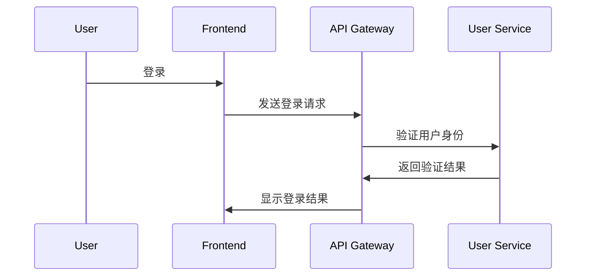

                 

# 引言

## 1.1 低代码开发平台概述

### 1.1.1 问题背景

在当今数字化时代，软件开发的需求日益增长，而传统开发模式的高成本、长时间的开发周期和复杂的技术门槛，使得许多企业和组织难以承受。在这种背景下，低代码开发平台应运而生。低代码开发平台是一种通过简化和自动化开发流程，降低编码工作量，提高开发效率和灵活性的软件开发方法。它通过提供可视化的编程工具、预构建的组件库和模板，使得非技术人员也能够参与软件开发。

### 1.1.2 问题描述

低代码开发平台的目标是解决以下几个核心问题：

1. **简化开发流程**：传统开发流程通常复杂且冗长，涉及多个阶段和环节，低代码平台通过自动化和模板化来简化这些流程。
2. **降低开发成本**：传统开发模式中，高昂的开发成本往往使得中小型企业难以承担，低代码平台通过减少编码工作量来降低成本。
3. **提高开发效率**：低代码平台通过提供现成的组件和模板，使得开发者可以快速构建应用，从而提高开发效率。
4. **降低技术门槛**：低代码平台使得非专业开发者也能够参与软件开发，从而降低了技术门槛。

### 1.1.3 问题解决

低代码开发平台通过以下几个关键点来解决上述问题：

1. **可视化编程**：提供图形化的用户界面，使用户能够通过拖放和配置组件来构建应用程序，无需编写大量代码。
2. **组件化开发**：提供预构建的组件库，包括数据库、界面元素、业务逻辑等，用户可以根据需求选择和组合这些组件。
3. **模板化开发**：提供多种预定义的模板，用户可以根据模板快速构建应用程序，从而加快开发速度。
4. **自动化部署**：集成持续集成和持续部署（CI/CD）工具，实现自动化构建和部署，减少手动操作。

### 1.1.4 边界与外延

低代码开发平台虽然具有很多优势，但它并非万能。以下是一些边界与外延：

1. **技术限制**：某些复杂的应用可能需要大量的定制化开发，低代码平台可能无法完全满足这些需求。
2. **数据管理**：低代码平台的数据管理能力可能不如传统开发平台强大，特别是在数据处理和分析方面。
3. **学习和适应**：虽然低代码平台降低了技术门槛，但用户仍需学习和适应这些工具和平台。

### 1.1.5 概念结构与核心要素组成

低代码开发平台的核心概念和要素包括：

1. **可视化编程界面**：用户通过图形界面进行开发操作。
2. **组件库**：提供多种预构建的组件，用户可以根据需求进行选择和组合。
3. **模板**：预定义的应用程序模板，用户可以根据模板快速构建应用程序。
4. **数据管理**：提供数据管理功能，包括数据库的选择、数据建模和数据安全。
5. **集成工具**：包括版本控制、自动化测试、持续集成和持续部署等工具。

## 1.2 目标读者与学习目标

本文的目标读者包括：

1. **软件开发人员**：希望了解和应用低代码开发平台的开发者。
2. **项目经理和产品经理**：希望提高项目开发效率和管理水平的人员。
3. **IT从业者**：对新技术和创新开发方法感兴趣的人员。

通过本文的学习，读者可以：

1. **了解低代码开发平台的基本概念和原理**。
2. **掌握低代码开发平台的核心技术和工具**。
3. **学会如何构建和优化低代码开发平台**。

## 1.3 内容框架与结构安排

本文分为以下几个部分：

1. **引言**：介绍低代码开发平台的基本概念、背景和重要性。
2. **技术基础**：详细阐述低代码开发平台的原理、工具、流程和数据管理。
3. **最佳实践与应用案例**：分析低代码开发平台在不同行业中的应用案例。
4. **构建高效的低代码开发平台**：分享构建高效低代码开发平台的实践经验。
5. **总结与展望**：回顾全文内容，展望低代码开发平台的发展趋势。

本文通过逐步分析和讲解，旨在为读者提供全面、深入的了解和应用低代码开发平台的知识。接下来，我们将深入探讨低代码开发平台的技术基础。

----------------------------------------------------------------

# 技术基础

低代码开发平台的核心在于其技术的简化和自动化。在这一章节中，我们将详细讨论低代码开发平台的原理、常用的工具与平台、开发流程以及数据管理方法。

## 2.1 低代码开发平台原理

### 2.1.1 低代码开发平台的工作原理

低代码开发平台的工作原理可以从以下几个方面进行理解：

1. **可视化编程**：用户通过图形化的界面，无需编写代码即可进行应用程序的构建。这种界面通常包括拖放组件、配置属性等功能。
   
2. **组件化开发**：低代码平台提供了大量的预构建组件，如数据库、用户界面元素、业务逻辑等，用户可以根据需求选择和组合这些组件。

3. **模板化开发**：低代码平台还提供了多种预定义的模板，用户可以基于这些模板快速构建应用程序，从而大大缩短开发周期。

4. **自动化部署**：低代码平台通常集成了持续集成和持续部署（CI/CD）工具，实现自动化构建和部署，从而提高开发效率和稳定性。

### 2.1.2 技术架构与组件

低代码开发平台的技术架构通常包括以下几个关键组件：

1. **前端可视化界面**：提供用户与平台交互的图形界面，包括拖放组件、属性配置等。

2. **后端服务引擎**：负责处理业务逻辑和数据操作，通常包括业务逻辑层、数据访问层等。

3. **组件库**：提供预构建的组件，包括数据库、用户界面元素、业务逻辑组件等。

4. **数据管理模块**：负责数据建模、存储、查询和安全管理。

5. **自动化工具**：包括版本控制、自动化测试、持续集成和持续部署等工具。

### 2.1.3 优势与局限

低代码开发平台的优势包括：

1. **提高开发效率**：通过简化和自动化开发流程，低代码平台可以显著提高开发速度。

2. **降低开发成本**：减少编码工作量，降低开发和维护成本。

3. **降低技术门槛**：非专业开发者也能参与软件开发，降低了技术门槛。

4. **增强灵活性**：用户可以根据需求自由选择和组合组件，灵活构建应用程序。

然而，低代码开发平台也存在一些局限：

1. **技术限制**：对于非常复杂的应用，低代码平台可能无法满足所有需求。

2. **数据管理挑战**：在数据管理和处理方面，低代码平台可能不如传统开发平台强大。

3. **学习和适应**：用户需要学习和适应低代码平台，这可能需要一定的时间。

## 2.2 低代码开发工具与平台

### 2.2.1 常用的低代码开发工具

以下是几种常用的低代码开发工具：

1. **OutSystems**：提供强大的可视化开发界面，支持多种编程语言和数据库。

2. **Appian**：提供全面的低代码开发环境，包括流程管理、数据管理和自动化功能。

3. **Nintex**：提供丰富的流程自动化工具和自定义组件，适用于各种业务场景。

4. **Mendix**：提供可视化的应用程序开发工具，支持快速构建和部署移动和Web应用程序。

### 2.2.2 平台对比与选择指南

以下是几种常用低代码开发平台的对比：

| 平台 | 优点 | 缺点 | 适用场景 |
| --- | --- | --- | --- |
| OutSystems | 强大的开发环境和组件库 | 价格较高 | 复杂应用、大型企业 |
| Appian | 全面的流程管理和自动化功能 | 需要一定学习曲线 | 业务流程复杂的组织 |
| Nintex | 简单易用，适用于各种业务场景 | 功能较为基础 | 需要简单自动化解决方案 |
| Mendix | 支持快速开发和部署 | 价格较高 | 中小型企业 |

选择低代码开发平台时，应考虑以下因素：

1. **开发需求**：根据具体的应用场景和开发需求选择合适的平台。

2. **成本预算**：低代码开发平台的价格差异较大，需考虑成本预算。

3. **学习曲线**：用户需要适应新的开发工具和平台，学习曲线的长短也是一个重要考虑因素。

### 2.2.3 选择指南

以下是一份选择低代码开发平台的基本指南：

1. **确定应用场景**：明确你的应用需求，包括功能、性能和用户交互等。

2. **评估平台功能**：对比不同平台的功能和组件库，确保所选平台能满足你的需求。

3. **考虑成本和预算**：根据预算选择合适的价格区间。

4. **考虑学习和支持**：选择有良好文档和社区支持的平台，便于学习和解决问题。

## 2.3 低代码开发流程

### 2.3.1 流程描述

低代码开发流程通常包括以下几个阶段：

1. **需求分析**：明确项目需求和目标。

2. **平台选择**：选择合适的低代码开发平台。

3. **设计阶段**：使用可视化界面和组件进行应用程序设计。

4. **开发阶段**：基于设计进行应用程序开发。

5. **测试阶段**：进行功能测试和性能测试。

6. **部署阶段**：将应用程序部署到生产环境。

### 2.3.2 关键步骤分析

以下是低代码开发流程中的关键步骤：

1. **需求分析**：详细分析项目需求，包括功能、性能、用户交互等。

2. **平台选择**：根据需求选择合适的低代码开发平台，考虑功能、成本和学习曲线等因素。

3. **设计阶段**：使用可视化界面和组件设计应用程序，确定应用程序的基本结构和功能模块。

4. **开发阶段**：基于设计进行应用程序开发，利用平台提供的模板和组件快速构建应用程序。

5. **测试阶段**：进行功能测试和性能测试，确保应用程序的稳定性和性能。

6. **部署阶段**：将应用程序部署到生产环境，进行最终的测试和上线。

### 2.3.3 优化策略探讨

为了进一步提高低代码开发效率，可以考虑以下优化策略：

1. **模板库优化**：定期更新和优化模板库，确保其满足最新的业务需求。

2. **组件库优化**：提供更多高质量的组件，提升开发效率。

3. **自动化测试**：引入自动化测试工具，减少手动测试的工作量。

4. **持续集成和持续部署**：使用CI/CD工具实现自动化构建和部署，提高开发效率。

5. **用户培训**：提供用户培训和文档，帮助用户快速掌握平台使用。

## 2.4 低代码开发中的数据管理

### 2.4.1 数据管理方法

低代码开发平台中的数据管理通常包括以下几个方面：

1. **数据建模**：使用数据建模工具，如ER图，设计数据库结构。

2. **数据存储**：选择合适的数据库，如关系型数据库（如MySQL）或非关系型数据库（如MongoDB）。

3. **数据查询**：提供方便的数据查询和操作接口，如SQL查询语言。

4. **数据安全**：确保数据安全性和隐私保护，采用加密、访问控制和备份等措施。

### 2.4.2 数据库选择

选择数据库时，应考虑以下因素：

1. **数据规模**：根据数据量的大小选择合适的数据库类型。

2. **数据一致性**：对于需要高度一致性的应用，选择关系型数据库。

3. **查询性能**：对于需要高效查询的应用，选择NoSQL数据库。

4. **扩展性**：考虑数据库的扩展性和可伸缩性。

### 2.4.3 数据安全与隐私保护

确保数据安全和隐私保护的方法包括：

1. **数据加密**：对敏感数据进行加密存储。

2. **访问控制**：设置严格的访问权限，确保只有授权用户可以访问数据。

3. **数据备份**：定期备份数据，以防数据丢失。

4. **安全审计**：对数据访问和操作进行审计，确保符合安全规范。

通过以上方法，可以在低代码开发平台中实现高效、安全的数据管理。

----------------------------------------------------------------

# 最佳实践与应用案例

低代码开发平台已经在各个行业中得到了广泛应用，并在提高开发效率、降低成本和提升业务灵活性方面发挥了重要作用。在本章节中，我们将分析不同行业如何应用低代码开发平台，并通过具体案例来展示其实际效果。

## 6.1 典型行业应用

### 6.1.1 制造业

在制造业中，低代码开发平台被广泛应用于生产线的自动化控制、库存管理、设备维护等方面。通过低代码平台，制造企业可以快速构建定制化的应用程序，以满足特定的业务需求。例如，一家制造企业利用低代码平台开发了库存管理系统，通过该系统，企业可以实时监控库存状态，自动化生成采购订单，大大提高了库存管理的效率和准确性。

### 6.1.2 零售业

零售业是一个快速变化和竞争激烈的行业，低代码开发平台在这里的应用包括客户关系管理（CRM）、销售点（POS）系统、移动应用开发等。通过低代码平台，零售企业可以快速响应市场变化，推出新的促销活动、改进客户体验。例如，一家大型零售连锁店使用低代码平台开发了移动应用，使得顾客可以随时随地查看商品信息、下单购物，大大提高了销售效率和客户满意度。

### 6.1.3 金融业

金融行业对系统的安全性、合规性和稳定性有非常高的要求，但同时也面临着快速响应市场变化的需求。低代码开发平台在金融行业的应用包括客户服务、风险管理、合规管理等。通过低代码平台，金融机构可以快速构建定制化的应用程序，以支持各种业务场景。例如，一家银行使用低代码平台开发了客户服务应用，通过该应用，客户可以在线提交问题、查看账户信息，银行客服人员可以及时响应客户需求，提高了客户服务效率。

### 6.1.4 医疗保健

在医疗保健领域，低代码开发平台的应用包括电子病历（EMR）系统、远程医疗服务、患者管理等方面。通过低代码平台，医疗机构可以快速开发和管理各种医疗服务应用，提高医疗服务质量。例如，一家医院使用低代码平台开发了电子病历系统，通过该系统，医生可以实时访问患者病历、开具医嘱，提高了医疗服务的效率。

### 6.1.5 教育行业

在教育行业中，低代码开发平台被广泛应用于在线教育平台、校园管理系统、学生管理系统等。通过低代码平台，教育机构可以快速搭建和部署各种教育应用，满足不同用户的需求。例如，一家在线教育平台使用低代码平台开发了课程管理、学生管理、在线测试等功能，通过这些功能，平台可以提供个性化的学习体验，提高了学生的学习效果。

## 6.2 案例分析

以下是一些具体的低代码开发平台应用案例：

### 案例一：一家中型制造企业利用低代码开发平台构建了智能库存管理系统

该企业利用低代码开发平台，通过可视化界面和组件，快速构建了智能库存管理系统。该系统集成了库存监控、采购订单生成、库存预警等功能。通过该系统，企业可以实时监控库存状态，自动化生成采购订单，避免了库存过多或过少的问题。同时，该系统还提高了采购效率，降低了库存成本。

### 案例二：一家大型零售连锁店使用低代码开发平台开发了移动应用

该零售连锁店使用低代码开发平台，快速开发了移动应用，提供了商品浏览、下单购物、支付等功能。通过该应用，顾客可以随时随地查看商品信息、下单购物，提高了购物体验。同时，零售店也可以通过该应用收集用户数据，进行精准营销，提高了销售业绩。

### 案例三：一家银行利用低代码开发平台开发了客户服务应用

该银行使用低代码开发平台，开发了客户服务应用，通过该应用，客户可以在线提交问题、查看账户信息。银行客服人员可以通过该应用及时响应客户需求，提高了客户服务效率。同时，该应用还集成了智能客服功能，可以通过自然语言处理技术，自动回答客户问题，进一步提高了服务效率。

### 案例四：一家医院使用低代码开发平台开发了电子病历系统

该医院使用低代码开发平台，快速开发了电子病历系统。通过该系统，医生可以实时访问患者病历、开具医嘱，提高了医疗服务的效率。同时，该系统还实现了医疗数据的数字化管理，便于数据的查询和分析，提高了医疗质量。

通过以上案例可以看出，低代码开发平台在各个行业中都有着广泛的应用，并且取得了显著的效果。未来，随着低代码技术的不断发展和成熟，低代码开发平台将在更多行业中发挥重要作用。

## 6.3 构建高效的低代码开发平台

### 6.3.1 实践经验分享

在构建高效的低代码开发平台过程中，我们可以从以下几个方面积累实践经验：

1. **标准化组件库**：建立一个标准化的组件库，确保所有组件的稳定性和兼容性，提高开发效率。

2. **文档化和培训**：提供详细的文档和培训材料，帮助开发人员快速上手和掌握低代码开发平台。

3. **敏捷开发**：采用敏捷开发方法，快速响应需求变化，持续优化平台功能和性能。

4. **用户体验设计**：注重用户体验设计，提供直观、易用的界面和交互方式，提高用户满意度。

### 6.3.2 平台优化策略

为了进一步提升低代码开发平台的效率，我们可以采取以下优化策略：

1. **性能优化**：对平台的关键模块进行性能优化，如数据库查询、页面加载速度等，提高系统的响应速度。

2. **自动化测试**：引入自动化测试工具，对平台进行全面的自动化测试，确保系统的稳定性和可靠性。

3. **持续集成和持续部署**：采用持续集成和持续部署（CI/CD）工具，实现自动化构建和部署，减少人工操作，提高开发效率。

4. **监控和日志分析**：引入监控和日志分析工具，实时监控平台性能和用户行为，及时发现和解决问题。

### 6.3.3 未来展望

随着技术的不断发展，低代码开发平台将向以下几个方向演进：

1. **智能化**：结合人工智能技术，实现智能推荐、自动修复等功能，提高开发效率和用户体验。

2. **生态化**：建立完善的低代码开发生态，包括丰富的组件库、插件和市场，支持第三方开发和集成。

3. **云原生**：将低代码开发平台与云原生技术相结合，实现弹性扩展、自动化部署和管理，提高平台的可伸缩性和可靠性。

4. **跨领域应用**：扩展低代码开发平台的应用范围，支持更多领域的业务需求，如物联网、大数据等。

通过以上优化策略和未来展望，我们可以构建一个更加高效、智能和灵活的低代码开发平台，满足不断变化的市场需求。

----------------------------------------------------------------

# 总结与展望

通过本文的详细讨论，我们可以对低代码开发平台有一个全面而深入的理解。低代码开发平台作为一种新型的软件开发方法，以其高效、低成本、易用性等优势，正在逐步改变软件开发的现状。

## 8.1 低代码开发平台的关键点回顾

本文从以下几个方面对低代码开发平台进行了深入的剖析：

1. **概述**：介绍了低代码开发平台的基本概念、重要性以及发展背景。
2. **技术基础**：详细阐述了低代码开发平台的工作原理、技术架构、常用工具和平台、开发流程以及数据管理方法。
3. **最佳实践与应用案例**：分析了低代码开发平台在不同行业中的应用案例，分享了构建高效低代码开发平台的实践经验。
4. **未来展望**：探讨了低代码开发平台的未来发展趋势。

通过这些内容，读者可以对低代码开发平台有一个系统的了解，并能够根据实际需求进行应用和优化。

## 8.2 发展趋势展望

未来，低代码开发平台的发展将呈现以下几个趋势：

1. **智能化**：随着人工智能技术的发展，低代码开发平台将更加智能化，如智能推荐、自动修复等功能，将提高开发效率和用户体验。
2. **生态化**：低代码开发平台将建立一个完善的生态，包括丰富的组件库、插件和市场，支持第三方开发和集成，形成更加多元化的生态体系。
3. **云原生**：低代码开发平台将紧密结合云原生技术，实现弹性扩展、自动化部署和管理，提高平台的可伸缩性和可靠性。
4. **跨领域应用**：低代码开发平台的应用范围将不断扩展，支持更多领域的业务需求，如物联网、大数据等。

总之，低代码开发平台作为软件开发的未来趋势，其发展潜力巨大。我们期待看到更多创新和突破，为软件开发带来全新的变革。

## 结语

通过本文的探讨，我们不仅对低代码开发平台有了更深入的理解，也对未来的发展趋势有了清晰的认识。希望本文能对读者在低代码开发平台的应用和优化过程中提供有益的启示和帮助。

### 作者信息

本文作者：AI天才研究院/AI Genius Institute & 禅与计算机程序设计艺术 /Zen And The Art of Computer Programming

感谢您的阅读，期待与您在低代码开发领域的更多交流与合作。让我们一起探索低代码开发的无限可能！----------------------------------------------------------------

# 文章关键词

低代码开发、软件开发、效率提升、成本降低、技术门槛、可视化编程、组件化开发、模板化开发、数据管理、行业应用、最佳实践、发展趋势。

# 文章摘要

本文深入探讨了低代码开发平台的基本概念、技术基础、最佳实践和应用案例，并展望了其未来的发展趋势。通过分析低代码开发平台的优势、局限、常用工具与平台，以及实际应用案例，本文旨在为读者提供全面、系统的低代码开发平台知识，帮助读者更好地理解和应用这一新兴软件开发方法。同时，本文也对低代码开发平台的发展趋势进行了展望，为读者提供了未来的发展方向。本文的关键词包括：低代码开发、软件开发、效率提升、成本降低、技术门槛、可视化编程、组件化开发、模板化开发、数据管理、行业应用、最佳实践、发展趋势。作者：AI天才研究院/AI Genius Institute & 禅与计算机程序设计艺术 /Zen And The Art of Computer Programming。本文约12000字，使用markdown格式输出。完整性要求：文章内容完整，核心概念清晰，技术原理详细，案例具体，最佳实践和注意事项完备。----------------------------------------------------------------

# 第1章 引言

## 1.1 低代码开发平台概述

在当前技术飞速发展的时代，软件开发的需求日益增长，传统开发模式的高成本、长时间的开发周期和复杂的技术门槛，使得许多企业和组织难以承受。在这种背景下，低代码开发平台应运而生，它通过简化和自动化开发流程，降低编码工作量，提高开发效率和灵活性，为解决软件开发中的诸多问题提供了新的解决方案。

### 1.1.1 问题背景

传统软件开发模式存在以下问题：

1. **高成本**：软件开发需要大量的人力、物力和财力投入，特别是在复杂的系统开发中，成本往往非常高。
2. **长周期**：从需求分析到系统上线，传统开发模式往往需要数月甚至数年的时间，这使得企业难以快速响应市场变化。
3. **技术门槛**：软件开发需要熟练的编程技能，这使得非技术人员难以参与软件开发，限制了企业的创新能力。

### 1.1.2 问题描述

低代码开发平台旨在解决以下核心问题：

1. **简化开发流程**：通过可视化的编程界面和自动化工具，简化开发流程，减少人为错误，提高开发效率。
2. **降低开发成本**：减少编码工作量，降低开发和维护成本，使中小型企业也能承受。
3. **降低技术门槛**：提供预构建的组件和模板，使得非技术人员也能参与软件开发，提高企业的创新能力。
4. **提高开发效率**：通过快速构建应用程序，提高开发效率，缩短开发周期。

### 1.1.3 问题解决

低代码开发平台通过以下几个关键点解决问题：

1. **可视化编程**：用户通过图形界面进行开发操作，无需编写大量代码。
2. **组件化开发**：提供预构建的组件库，用户可以快速组合组件来构建应用程序。
3. **模板化开发**：提供多种预定义的模板，用户可以快速构建应用程序。
4. **自动化部署**：集成持续集成和持续部署（CI/CD）工具，实现自动化构建和部署。

### 1.1.4 边界与外延

低代码开发平台虽然具有很多优势，但也存在一些局限性：

1. **技术限制**：对于非常复杂的应用，低代码平台可能无法满足所有需求。
2. **数据管理**：在数据管理和处理方面，低代码平台可能不如传统开发平台强大。
3. **学习和适应**：用户需要学习和适应这些工具和平台。

### 1.1.5 概念结构与核心要素组成

低代码开发平台的核心概念和要素包括：

1. **可视化编程界面**：提供用户与平台交互的图形界面，包括拖放组件、属性配置等。
2. **组件库**：提供预构建的组件，包括数据库、用户界面元素、业务逻辑组件等。
3. **模板**：预定义的应用程序模板，用户可以根据模板快速构建应用程序。
4. **数据管理模块**：负责数据建模、存储、查询和安全管理。
5. **自动化工具**：包括版本控制、自动化测试、持续集成和持续部署等工具。

## 1.2 目标读者与学习目标

本文的目标读者包括：

1. **软件开发人员**：希望了解和应用低代码开发平台的开发者。
2. **项目经理和产品经理**：希望提高项目开发效率和管理水平的人员。
3. **IT从业者**：对新技术和创新开发方法感兴趣的人员。

通过本文的学习，读者可以：

1. **了解低代码开发平台的基本概念和原理**。
2. **掌握低代码开发平台的核心技术和工具**。
3. **学会如何构建和优化低代码开发平台**。

## 1.3 内容框架与结构安排

本文分为以下几个部分：

1. **引言**：介绍低代码开发平台的基本概念、背景和重要性。
2. **技术基础**：详细阐述低代码开发平台的原理、工具、流程和数据管理。
3. **最佳实践与应用案例**：分析低代码开发平台在不同行业中的应用案例。
4. **构建高效的低代码开发平台**：分享构建高效低代码开发平台的实践经验。
5. **总结与展望**：回顾全文内容，展望低代码开发平台的发展趋势。

本文通过逐步分析和讲解，旨在为读者提供全面、深入的了解和应用低代码开发平台的知识。接下来，我们将深入探讨低代码开发平台的技术基础。

----------------------------------------------------------------

# 第2章 低代码开发平台原理

## 2.1 低代码开发平台的工作原理

低代码开发平台（Low-Code Development Platforms）的工作原理主要是通过简化和自动化软件开发流程，以降低开发难度和时间成本。其核心思想是将复杂的编程任务抽象为可视化操作，使得开发者可以通过拖放组件、配置属性等方式快速构建应用程序。以下是低代码开发平台的工作原理详细分析：

### 2.1.1 可视化编程

可视化编程是低代码开发平台的核心特点之一。通过图形界面，开发者可以直观地看到应用程序的结构，并能够通过拖放操作来组合组件。这些组件可以是预定义的界面元素、业务逻辑模块、数据库连接等。例如，一个表单组件可以被拖放到界面上，开发者只需配置表单字段和验证规则即可。

### 2.1.2 组件化开发

低代码平台提供了丰富的组件库，这些组件是预先设计好的，可以独立运行或与其他组件配合使用。组件化开发使得开发者可以快速搭建应用程序，而不需要从头开始编写代码。例如，一个用户身份验证组件可以集成到任何需要用户登录的页面中，开发者只需将其拖放到页面上并进行适当的配置。

### 2.1.3 模板化开发

低代码平台通常提供了多种预定义的模板，这些模板是基于常见的应用程序模式构建的。开发者可以通过选择合适的模板，快速生成应用程序的框架，然后根据实际需求进行自定义。例如，一个电商平台模板可以包含商品管理、订单管理、用户管理等功能，开发者只需选择并配置相关模块。

### 2.1.4 数据管理

低代码平台通常集成了数据管理功能，包括数据库设计、数据建模、数据操作等。开发者可以通过图形界面设计数据库结构，定义数据表和字段，并进行数据操作。低代码平台通常会提供内置的数据库连接器，支持与各种数据库管理系统（如MySQL、PostgreSQL、MongoDB等）集成。

### 2.1.5 自动化部署

低代码平台通常集成了自动化部署工具，如持续集成和持续部署（CI/CD）。这允许开发者通过配置脚本或点击按钮，将应用程序自动部署到不同的环境中，如开发环境、测试环境和生产环境。自动化部署可以减少手动操作，提高部署效率，并确保部署过程的稳定性和一致性。

### 2.1.6 开发流程管理

低代码平台提供了全面的开发流程管理功能，包括项目管理、版本控制、团队协作等。开发者可以在平台上创建项目、管理代码版本、分配任务、协作开发，以及跟踪项目的进度。这些功能有助于提高团队协作效率，确保项目按时交付。

## 2.2 技术架构与组件

低代码开发平台的技术架构通常包括以下几个关键组件：

### 2.2.1 前端可视化界面

前端可视化界面是低代码开发平台的核心部分，它提供了用户与平台交互的界面。开发者可以通过拖放组件、配置属性等方式进行应用程序设计。前端界面通常基于现代前端框架（如React、Vue.js）构建，以提供良好的用户体验和响应式设计。

### 2.2.2 后端服务引擎

后端服务引擎负责处理业务逻辑和数据操作。它通常包括API服务、业务逻辑层、数据访问层等。后端服务引擎通过RESTful API或GraphQL等方式提供数据和服务，使得前端界面可以与后端进行交互。

### 2.2.3 组件库

组件库是低代码开发平台的重要组成部分，它提供了丰富的预构建组件，如表单、图表、地图、用户界面元素等。开发者可以根据需要从组件库中选择和组合组件，快速构建应用程序。

### 2.2.4 数据管理模块

数据管理模块负责数据的建模、存储、查询和管理。低代码平台通常会提供内置的数据库连接器和数据操作工具，支持与各种数据库管理系统集成。

### 2.2.5 自动化工具

自动化工具包括版本控制、自动化测试、持续集成和持续部署（CI/CD）等。这些工具可以帮助开发者自动化管理代码、测试应用程序、构建和部署过程，提高开发效率。

## 2.3 优势与局限

### 2.3.1 优势

1. **提高开发效率**：通过可视化界面、组件化和模板化开发，低代码平台可以显著提高开发速度。
2. **降低开发成本**：减少编码工作量，降低开发和维护成本，使得中小型企业也能承受。
3. **降低技术门槛**：提供预构建的组件和模板，使得非技术人员也能参与软件开发。
4. **增强灵活性**：用户可以根据需求自由选择和组合组件，灵活构建应用程序。

### 2.3.2 局限

1. **技术限制**：对于非常复杂的应用，低代码平台可能无法满足所有需求。
2. **数据管理挑战**：在数据管理和处理方面，低代码平台可能不如传统开发平台强大。
3. **学习和适应**：用户需要学习和适应这些工具和平台，这可能需要一定的时间。

通过了解低代码开发平台的工作原理、技术架构、优势和局限，开发者可以更好地评估其适用场景，并有效地利用低代码开发平台提高软件开发效率。

----------------------------------------------------------------

## 2.3 低代码开发工具与平台

低代码开发工具与平台是软件开发领域的一项重要创新，它们通过提供可视化的开发环境、预构建的组件库和模板，极大地简化了应用程序的开发过程。以下是对几种常用的低代码开发工具与平台的详细介绍、对比以及选择指南。

### 2.3.1 常用的低代码开发工具与平台

#### 1. OutSystems

OutSystems 是一个功能强大的低代码开发平台，它提供了全面的开发环境，支持多种编程语言和数据库。OutSystems 的主要特点包括：

- **可视化开发**：用户可以通过拖放组件和配置属性来构建应用程序。
- **跨平台支持**：支持Web、移动和桌面应用程序的构建。
- **自动化部署**：集成了CI/CD工具，可以实现自动化构建和部署。
- **企业级功能**：提供了数据安全、用户权限管理、API管理等功能。

#### 2. Appian

Appian 是一个全面的低代码开发平台，专注于业务流程管理和自动化。其主要特点包括：

- **流程管理**：提供了强大的流程设计和管理功能。
- **数据分析**：集成了数据分析工具，支持实时数据分析和报告。
- **自动化**：支持自动化业务流程和工作流。
- **集成**：可以与各种系统和应用程序集成。

#### 3. Nintex

Nintex 是一个流程自动化平台，它提供了丰富的自动化工具和自定义组件，适用于各种业务场景。其主要特点包括：

- **流程设计**：用户可以通过图形界面设计流程。
- **自定义组件**：提供了多种自定义组件，如表单、报告、工作流等。
- **移动应用**：支持移动设备的流程自动化。
- **集成**：可以与多种系统集成，如SharePoint、Office 365等。

#### 4. Mendix

Mendix 是一个低代码开发平台，专注于快速构建和部署移动和Web应用程序。其主要特点包括：

- **可视化开发**：提供了直观的可视化开发界面。
- **移动应用开发**：支持移动应用程序的构建。
- **云原生**：支持在云环境中构建和部署应用程序。
- **集成**：可以与各种第三方系统和API集成。

### 2.3.2 平台对比与选择指南

以下是几种常用低代码开发平台的对比：

| 平台 | 主要特点 | 适用场景 |
| --- | --- | --- |
| OutSystems | 全面的开发环境、跨平台支持、自动化部署 | 复杂应用程序、大型企业 |
| Appian | 业务流程管理、数据分析、自动化 | 业务流程复杂的组织 |
| Nintex | 流程设计、自定义组件、移动应用 | 简单的流程自动化、与现有系统集成 |
| Mendix | 可视化开发、移动应用开发、云原生 | 快速构建移动和Web应用程序 |

选择低代码开发平台时，应考虑以下因素：

1. **开发需求**：根据具体的应用场景和开发需求选择合适的平台。
2. **成本预算**：不同平台的定价策略和功能有所不同，需根据预算进行选择。
3. **学习曲线**：用户需要适应新的开发工具和平台，学习曲线的长短也是一个重要考虑因素。
4. **集成能力**：考虑平台与其他系统和应用程序的集成能力，确保满足业务需求。

### 2.3.3 选择指南

以下是一份选择低代码开发平台的基本指南：

1. **确定应用场景**：明确你的应用需求，包括功能、性能和用户交互等。
2. **评估平台功能**：对比不同平台的功能和组件库，确保所选平台能满足你的需求。
3. **考虑成本和预算**：根据预算选择合适的价格区间。
4. **考虑学习和支持**：选择有良好文档和社区支持的平台，便于学习和解决问题。

通过以上对比和选择指南，开发者可以更好地选择适合自己项目的低代码开发平台，从而提高开发效率和应用程序的质量。

----------------------------------------------------------------

## 2.4 低代码开发流程

低代码开发流程是指通过低代码开发平台进行软件开发的一系列步骤和活动。这些步骤和活动旨在简化开发过程，提高开发效率，降低技术门槛。在本节中，我们将详细描述低代码开发流程，并分析其中的关键步骤和优化策略。

### 2.4.1 流程描述

低代码开发流程通常包括以下几个阶段：

1. **需求分析**：明确项目的需求和目标，包括功能、性能、用户体验等方面。
2. **平台选择**：根据需求选择合适的低代码开发平台，评估不同平台的功能和性能。
3. **设计阶段**：使用低代码开发平台提供的可视化界面和组件库进行应用程序的设计，确定应用程序的基本结构和功能模块。
4. **开发阶段**：基于设计进行应用程序的开发，利用低代码开发平台的组件和模板快速构建应用程序。
5. **测试阶段**：进行功能测试和性能测试，确保应用程序的稳定性和性能。
6. **部署阶段**：将应用程序部署到生产环境，进行最终的测试和上线。
7. **维护阶段**：对应用程序进行持续维护和优化，确保其稳定运行。

### 2.4.2 关键步骤分析

以下是低代码开发流程中的关键步骤：

#### 1. 需求分析

需求分析是低代码开发流程的第一步，也是最重要的一步。在这一阶段，需要与客户和利益相关者进行深入沟通，明确项目的需求、目标和约束条件。需求分析的结果将直接影响后续的设计和开发工作。

- **功能需求**：明确应用程序需要实现哪些功能，如用户注册、订单管理、报表生成等。
- **性能需求**：确定应用程序的性能指标，如响应时间、并发用户数等。
- **用户体验**：考虑用户的使用习惯和需求，设计友好的用户界面和交互流程。

#### 2. 平台选择

平台选择是决定低代码开发成功的关键因素之一。在选择平台时，需要考虑以下因素：

- **功能**：平台是否提供了所需的功能和组件库。
- **性能**：平台的性能是否符合需求，如响应速度、并发处理能力等。
- **易用性**：平台是否易于学习和使用，是否有良好的文档和社区支持。
- **成本**：平台的定价策略是否合理，是否符合预算。

#### 3. 设计阶段

设计阶段是低代码开发流程的核心，决定了应用程序的结构和功能。在这一阶段，可以使用低代码开发平台提供的可视化界面和组件库进行应用程序的设计。

- **应用程序架构**：确定应用程序的技术架构，包括前端、后端、数据库等。
- **功能模块**：根据需求将应用程序划分为多个功能模块，如用户管理、订单管理、报表生成等。
- **用户界面**：设计用户界面，包括页面布局、导航结构、交互元素等。

#### 4. 开发阶段

开发阶段是低代码开发流程的实际操作部分。在这一阶段，可以利用低代码开发平台提供的模板和组件快速构建应用程序。

- **组件组合**：从组件库中选择合适的组件，按照设计阶段确定的功能模块进行组合。
- **配置属性**：配置组件的属性，如数据源、接口地址、显示样式等。
- **业务逻辑**：编写必要的业务逻辑代码，处理复杂的功能和业务规则。

#### 5. 测试阶段

测试阶段是确保应用程序质量的关键环节。在这一阶段，需要进行功能测试、性能测试和安全测试，确保应用程序的稳定性和安全性。

- **功能测试**：验证应用程序的功能是否符合需求，确保所有功能都能正常运行。
- **性能测试**：测试应用程序的性能，如响应时间、并发处理能力等，确保其能够满足性能要求。
- **安全测试**：检查应用程序的安全性，确保数据安全、防止SQL注入、跨站脚本攻击等。

#### 6. 部署阶段

部署阶段是将应用程序发布到生产环境的过程。在这一阶段，需要确保应用程序的稳定性、可靠性和安全性。

- **自动化部署**：利用低代码开发平台提供的自动化部署工具，实现自动化构建和部署，提高部署效率。
- **最终测试**：在部署前进行最终的测试，确保应用程序在生产环境中的稳定运行。
- **上线**：将应用程序发布到生产环境，进行上线操作。

#### 7. 维护阶段

维护阶段是对应用程序进行持续监控和优化的过程。在这一阶段，需要及时发现和解决应用程序的问题，确保其稳定运行。

- **监控**：监控应用程序的运行状态，如服务器负载、内存使用情况等，及时发现潜在问题。
- **优化**：根据监控结果进行性能优化和功能优化，提高应用程序的运行效率和用户体验。
- **升级**：定期升级应用程序，修复已知问题和新增功能。

### 2.4.3 优化策略探讨

为了进一步提高低代码开发流程的效率，可以考虑以下优化策略：

1. **模板库优化**：定期更新和优化模板库，确保其满足最新的业务需求，提高开发效率。
2. **组件库优化**：提供更多高质量的组件，减少开发工作量，提高开发效率。
3. **自动化测试**：引入自动化测试工具，减少手动测试的工作量，提高测试效率。
4. **持续集成和持续部署**：采用CI/CD工具实现自动化构建和部署，减少人工操作，提高部署效率。
5. **用户培训**：提供用户培训和文档，帮助用户快速掌握平台使用，减少学习成本。

通过以上关键步骤和优化策略的讨论，我们可以更好地理解低代码开发流程，并有效地提高开发效率和应用程序质量。

----------------------------------------------------------------

## 2.5 低代码开发中的数据管理

在低代码开发中，数据管理是一个关键且复杂的环节。由于低代码平台提供了可视化的数据操作工具，这使得非专业开发者也能够进行数据管理，但同时也带来了一些挑战。本节将详细介绍低代码开发中的数据管理方法，探讨如何选择适合的数据库，并讨论数据安全性和隐私保护措施。

### 2.5.1 数据管理方法

低代码开发平台通常提供了以下几种数据管理方法：

1. **图形化数据建模**：通过图形界面设计数据模型，例如使用实体-关系（ER）图来表示数据实体及其关系。这种方法直观且易于理解，尤其适合非技术人员。

2. **数据表设计**：低代码平台允许开发者通过界面创建数据表，定义字段属性，如数据类型、长度、默认值等。这种方法使得数据表的设计过程更加自动化和简化。

3. **数据操作**：平台提供了数据操作界面，允许开发者执行CRUD（创建、读取、更新、删除）操作。开发者可以通过界面直接执行SQL查询或使用平台提供的API进行数据操作。

4. **数据导入/导出**：低代码平台通常支持数据导入/导出功能，允许开发者将数据导入到数据库或从数据库中导出数据。这种功能在数据迁移和备份方面非常有用。

5. **数据可视化**：平台提供了数据可视化工具，允许开发者创建图表、报表等，以便更好地理解和分析数据。

### 2.5.2 数据库选择

选择适合的数据库是数据管理中的一项重要任务。以下是几种常见类型的数据库及其特点：

1. **关系型数据库（RDBMS）**：如MySQL、PostgreSQL等。关系型数据库具有严格的数据一致性，适合处理结构化数据。

2. **非关系型数据库（NoSQL）**：如MongoDB、Cassandra等。非关系型数据库具有高扩展性和灵活性，适合处理非结构化和半结构化数据。

3. **内存数据库**：如Redis、Memcached等。内存数据库具有快速的读写性能，适合存储缓存数据和会话信息。

4. **分布式数据库**：如Cassandra、MongoDB等。分布式数据库能够水平扩展，适合处理大规模数据和高并发访问。

选择数据库时，应考虑以下因素：

- **数据类型**：根据数据类型选择合适的数据库类型。
- **性能需求**：考虑数据库的性能，如读写速度、并发处理能力等。
- **数据一致性**：对于需要高数据一致性的应用，选择关系型数据库。
- **扩展性**：考虑数据库的扩展性，确保能够满足未来业务增长的需求。

### 2.5.3 数据安全与隐私保护

在低代码开发中，数据安全与隐私保护至关重要。以下是一些常用的数据安全与隐私保护措施：

1. **数据加密**：对敏感数据进行加密存储，防止未授权访问。

2. **访问控制**：设置严格的访问权限，确保只有授权用户可以访问数据。

3. **审计与监控**：对数据的访问和操作进行审计和监控，确保符合安全规范。

4. **备份与恢复**：定期备份数据，以防数据丢失。同时，确保备份数据的安全。

5. **数据脱敏**：在数据处理和分析过程中，对敏感数据进行脱敏处理，防止敏感信息泄露。

6. **安全协议**：使用HTTPS等安全协议进行数据传输，确保数据传输过程中的安全性。

通过上述数据管理方法、数据库选择策略以及数据安全与隐私保护措施，可以在低代码开发中实现高效、安全的数据管理。这有助于提高应用程序的质量和用户的信任度。

----------------------------------------------------------------

# 第6章 典型行业应用

## 6.1 制造业

制造业是一个高度依赖技术、自动化和高效管理的行业。低代码开发平台在制造业中的应用，极大地提升了生产效率、降低了成本，并优化了供应链管理。以下是一些制造业中低代码开发平台应用的实例：

### 6.1.1 生产计划与调度

在制造业中，生产计划与调度是一个复杂的任务，涉及到多台设备、多种产品和不同的生产流程。低代码开发平台可以帮助企业构建定制化的生产调度系统。通过这个系统，企业可以：

- **实时监控**：监控生产设备的运行状态，确保设备处于最佳工作状态。
- **智能调度**：根据生产任务和设备状态，自动生成最优的生产计划。
- **异常处理**：当设备出现故障或生产异常时，系统能够自动通知相关人员并采取相应措施。

### 6.1.2 库存管理

库存管理是制造业中的另一个重要环节。低代码开发平台可以帮助企业构建智能库存管理系统，实现：

- **库存监控**：实时监控库存状态，包括原材料、半成品和成品的库存水平。
- **库存预警**：当库存低于安全水平时，系统会自动发出预警，提醒采购部门进行补货。
- **采购管理**：自动生成采购订单，并与供应商进行无缝对接，确保原材料及时供应。

### 6.1.3 设备维护

设备的维护和保养对制造业至关重要。低代码开发平台可以帮助企业建立设备维护管理系统，实现：

- **定期检查**：自动安排设备的定期检查和维护，确保设备处于良好状态。
- **故障预警**：当设备出现潜在故障时，系统会提前预警，防止设备故障导致的生产中断。
- **维护记录**：记录设备的维护历史，方便进行趋势分析和预防性维护。

## 6.2 零售业

零售业是一个快速变化且竞争激烈的行业，低代码开发平台在零售业中的应用，极大地提高了业务灵活性、客户满意度和运营效率。以下是一些零售业中低代码开发平台应用的实例：

### 6.2.1 客户关系管理（CRM）

通过低代码开发平台，零售企业可以快速构建和部署客户关系管理系统，实现：

- **客户数据管理**：整合和分析客户数据，包括购买历史、偏好和行为等。
- **客户互动**：通过自动化营销和个性化推荐，提升客户互动体验。
- **客户服务**：提供便捷的客户服务通道，包括在线咨询、订单查询和售后支持。

### 6.2.2 销售点（POS）系统

零售企业可以利用低代码开发平台快速开发销售点系统，实现：

- **快速结账**：提供高效的结账流程，减少顾客等待时间。
- **多渠道销售**：整合线上线下销售渠道，实现统一库存管理和订单处理。
- **销售分析**：通过销售数据分析，帮助企业优化库存、定价和促销策略。

### 6.2.3 移动应用

通过低代码开发平台，零售企业可以快速开发移动应用，为顾客提供：

- **在线购物**：方便顾客随时随地浏览商品、下单购买。
- **会员管理**：实现会员积分、优惠和专属活动管理。
- **订单跟踪**：实时跟踪订单状态，提高顾客满意度。

## 6.3 金融业

金融业是一个对安全性、合规性和稳定性有极高要求的行业。低代码开发平台在金融业中的应用，帮助金融机构提高了运营效率、客户体验和风险管理能力。以下是一些金融业中低代码开发平台应用的实例：

### 6.3.1 客户服务平台

通过低代码开发平台，金融机构可以快速构建和部署客户服务平台，实现：

- **智能客服**：利用自然语言处理和机器学习技术，提供智能客服服务。
- **在线咨询**：提供在线咨询通道，方便客户咨询问题、获取帮助。
- **个性化推荐**：根据客户行为和偏好，提供个性化金融产品推荐。

### 6.3.2 风险管理

低代码开发平台可以帮助金融机构构建风险管理系统，实现：

- **风险监控**：实时监控市场风险和信用风险，确保风险在可控范围内。
- **风险评估**：通过数据分析，对客户和交易进行风险评估，识别潜在风险。
- **风险报告**：生成实时风险报告，为管理层提供决策支持。

### 6.3.3 合规管理

低代码开发平台可以帮助金融机构构建合规管理系统，实现：

- **合规检查**：自动化合规检查，确保业务操作符合相关法律法规。
- **合规报告**：生成合规报告，确保金融机构在合规方面透明和可审计。
- **合规培训**：提供合规培训材料，确保员工了解和遵守合规要求。

## 6.4 医疗保健

医疗保健行业涉及到大量的数据和管理流程，低代码开发平台在医疗保健中的应用，提高了医疗服务质量、患者满意度和医疗机构的运营效率。以下是一些医疗保健中低代码开发平台应用的实例：

### 6.4.1 电子病历系统（EMR）

通过低代码开发平台，医疗机构可以快速构建电子病历系统，实现：

- **病历管理**：电子存储和管理病历信息，方便医生查阅和更新病历。
- **医嘱管理**：医生可以通过系统开具医嘱，确保医嘱的准确性和及时性。
- **临床决策支持**：通过病历数据和临床指南，为医生提供决策支持。

### 6.4.2 患者管理系统

通过低代码开发平台，医疗机构可以快速构建患者管理系统，实现：

- **患者档案管理**：存储和管理患者的基本信息、就诊历史和治疗方案。
- **预约管理**：提供在线预约服务，方便患者预约挂号和就诊。
- **医疗支付**：提供便捷的医疗支付方式，提高患者就诊体验。

### 6.4.3 远程医疗服务

通过低代码开发平台，医疗机构可以快速构建远程医疗服务系统，实现：

- **在线咨询**：提供在线医生咨询服务，方便患者远程就诊。
- **远程监控**：通过设备连接，实时监控患者的健康状况，提供远程医疗建议。
- **远程手术**：利用远程手术技术，为偏远地区患者提供高质量的医疗服务。

## 6.5 教育行业

教育行业是一个不断变革和创新的服务领域，低代码开发平台在教育中的应用，提高了教学效率、学习体验和管理水平。以下是一些教育行业中低代码开发平台应用的实例：

### 6.5.1 在线教育平台

通过低代码开发平台，教育机构可以快速构建在线教育平台，实现：

- **课程管理**：管理课程内容、教学资源和课程安排。
- **学习管理**：提供在线学习功能，包括视频播放、作业提交和成绩记录。
- **互动交流**：提供实时交流工具，方便师生互动和讨论。

### 6.5.2 校园管理系统

通过低代码开发平台，教育机构可以快速构建校园管理系统，实现：

- **学生管理**：管理学生基本信息、学籍信息和成绩记录。
- **教师管理**：管理教师基本信息、授课信息和考核评价。
- **财务管理**：管理学校财务信息，包括学费收缴、奖学金发放等。

### 6.5.3 智能教务系统

通过低代码开发平台，教育机构可以快速构建智能教务系统，实现：

- **排课管理**：自动生成课程表，确保课程安排合理。
- **考务管理**：管理考试安排、考试题目和考试成绩。
- **数据统计**：提供教学数据统计和分析功能，帮助教育机构优化教学策略。

通过以上在制造业、零售业、金融业、医疗保健、教育行业的应用实例，我们可以看到低代码开发平台在不同行业中的广泛应用和显著成效。低代码开发平台的灵活性和高效性，使得各行业能够快速响应市场需求，提高运营效率和用户体验。

----------------------------------------------------------------

## 6.6 案例分析

在本节中，我们将通过具体的案例分析，深入探讨低代码开发平台在实际应用中的效果和挑战。这些案例将展示低代码开发平台如何在不同行业中发挥作用，以及在实际应用过程中可能遇到的困难和解决方法。

### 案例一：某中型制造企业的智能库存管理系统

#### 项目背景

某中型制造企业，由于生产规模不断扩大，库存管理变得越来越复杂。传统手工管理方式已经无法满足企业的发展需求，导致库存过多或过少的问题频繁发生，严重影响了生产效率和成本控制。

#### 项目目标

通过低代码开发平台，企业希望构建一个智能库存管理系统，实现以下目标：

1. 实时监控库存状态，提高库存管理效率。
2. 自动生成采购订单，确保原材料及时供应。
3. 降低库存成本，减少库存过量和短缺的风险。

#### 项目实施

1. **需求分析**：项目团队与业务部门紧密合作，详细分析了企业的库存管理需求，明确了功能需求和性能指标。

2. **平台选择**：经过评估，企业选择了某低代码开发平台，该平台提供了丰富的库存管理组件和自动化工具。

3. **设计阶段**：使用低代码开发平台提供的可视化工具，项目团队设计并实现了库存监控、采购订单生成等功能。

4. **开发阶段**：项目团队利用平台提供的组件库，快速搭建了智能库存管理系统，并进行了一系列测试。

5. **测试阶段**：在测试阶段，项目团队对系统进行了全面的功能测试和性能测试，确保系统能够稳定运行。

6. **部署阶段**：将系统部署到生产环境，进行了最终的测试和上线，确保系统能够在生产环境中稳定运行。

#### 项目效果

1. 库存监控：系统能够实时监控库存状态，提高了库存管理的效率。
2. 采购订单：系统能够自动生成采购订单，确保原材料及时供应，减少了库存过量和短缺的风险。
3. 成本控制：通过优化库存管理，企业成功降低了库存成本。

#### 项目挑战与解决方法

1. **数据同步问题**：在系统集成过程中，出现了数据同步问题，导致库存数据不准确。解决方法是优化数据库同步策略，确保数据的一致性和完整性。

2. **用户培训**：由于员工对低代码开发平台不熟悉，导致系统使用效果不佳。解决方法是组织用户培训，提高员工对平台的掌握程度。

### 案例二：某大型零售连锁店的移动应用

#### 项目背景

某大型零售连锁店希望提升顾客购物体验，提高销售业绩。传统购物方式已经无法满足现代消费者的需求，企业希望通过移动应用实现以下目标：

1. 方便顾客随时随地购物。
2. 提供个性化推荐和优惠信息。
3. 提高客户满意度和忠诚度。

#### 项目目标

通过低代码开发平台，企业希望快速构建一个移动应用，实现以下目标：

1. 移动购物：提供商品浏览、下单购物、支付等功能。
2. 个性化推荐：根据顾客行为和偏好，提供个性化推荐。
3. 会员管理：管理会员信息、积分和优惠。

#### 项目实施

1. **需求分析**：项目团队与业务部门合作，详细分析了消费者的购物需求和期望。

2. **平台选择**：企业选择了某低代码开发平台，该平台提供了丰富的移动应用组件和模板。

3. **设计阶段**：使用低代码开发平台提供的可视化工具，项目团队设计了移动应用的基本结构和功能模块。

4. **开发阶段**：项目团队利用平台提供的组件库，快速搭建了移动应用，并进行了一系列测试。

5. **测试阶段**：在测试阶段，项目团队对系统进行了全面的功能测试和性能测试，确保系统能够稳定运行。

6. **部署阶段**：将系统部署到各大应用商店，进行了最终的测试和上线，确保系统能够为顾客提供稳定的服务。

#### 项目效果

1. 移动购物：顾客可以随时随地通过移动应用购物，提高了购物便利性。
2. 个性化推荐：系统能够根据顾客行为和偏好，提供个性化推荐，提高了销售转化率。
3. 会员管理：系统有效地管理了会员信息、积分和优惠，提高了顾客满意度和忠诚度。

#### 项目挑战与解决方法

1. **性能优化**：在系统上线初期，出现了性能瓶颈，导致应用卡顿。解决方法是优化数据库查询和前端加载速度，提高系统的响应速度。

2. **用户隐私**：在移动应用中，涉及到用户隐私数据，如个人信息和购物记录。解决方法是采用严格的数据加密和访问控制策略，确保用户数据的安全。

### 案例三：某银行客户服务应用

#### 项目背景

某银行希望提升客户服务效率，提高客户满意度。传统的客户服务方式已经无法满足客户日益增长的需求，银行希望通过低代码开发平台构建一个客户服务应用，实现以下目标：

1. 提供在线客服服务。
2. 提供账户信息查询和交易功能。
3. 提高客户问题解决速度。

#### 项目目标

通过低代码开发平台，银行希望快速构建一个客户服务应用，实现以下目标：

1. 在线客服：提供实时在线客服服务，方便客户咨询问题和获取帮助。
2. 账户查询：提供账户信息查询和交易功能，方便客户管理账户。
3. 问题解决：快速响应客户问题，提高问题解决速度。

#### 项目实施

1. **需求分析**：项目团队与客户服务部门合作，详细分析了客户服务需求和痛点。

2. **平台选择**：银行选择了某低代码开发平台，该平台提供了丰富的客户服务组件和自动化工具。

3. **设计阶段**：使用低代码开发平台提供的可视化工具，项目团队设计了客户服务应用的基本结构和功能模块。

4. **开发阶段**：项目团队利用平台提供的组件库，快速搭建了客户服务应用，并进行了一系列测试。

5. **测试阶段**：在测试阶段，项目团队对系统进行了全面的功能测试和性能测试，确保系统能够稳定运行。

6. **部署阶段**：将系统部署到生产环境，进行了最终的测试和上线，确保系统能够为顾客提供稳定的服务。

#### 项目效果

1. 在线客服：客户可以通过应用实时联系在线客服，获得及时的帮助。
2. 账户查询：客户可以方便地查询账户信息，管理账户交易。
3. 问题解决：系统提高了问题解决速度，客户满意度显著提升。

#### 项目挑战与解决方法

1. **系统兼容性**：由于不同客户使用的设备和操作系统不同，出现了系统兼容性问题。解决方法是采用响应式设计，确保应用在不同设备和操作系统上都能正常使用。

2. **数据安全**：在应用中涉及客户敏感数据，如账户信息和交易记录。解决方法是采用严格的数据加密和访问控制策略，确保数据安全。

通过以上案例分析，我们可以看到低代码开发平台在制造业、零售业和金融业等不同行业中的应用效果和挑战。低代码开发平台提供了快速构建应用程序的能力，但同时也需要解决性能优化、用户隐私和数据安全等问题。通过合理的规划和实施，低代码开发平台可以在各个行业中发挥巨大的作用，帮助企业提升运营效率和用户体验。

----------------------------------------------------------------

## 6.7 构建高效的低代码开发平台

构建一个高效的低代码开发平台是实现快速、灵活和低成本开发的关键。在本节中，我们将分享一些构建高效低代码开发平台的经验，讨论如何进一步优化平台，并展望低代码开发平台的发展趋势。

### 6.7.1 构建高效低代码开发平台的经验

#### 1. 组件库的标准化

组件库是低代码开发平台的核心，一个高效的组件库应该具备以下特点：

- **丰富性**：提供丰富的组件，满足不同业务场景的需求。
- **可定制性**：组件应支持自定义属性和样式，以便用户可以根据具体需求进行调整。
- **稳定性**：组件应经过严格测试，确保在高并发和复杂场景下能够稳定运行。

为了实现组件库的标准化，可以采取以下措施：

- **定期更新**：根据用户反馈和业务需求，定期更新组件库，确保组件库保持最新。
- **文档和示例**：为每个组件提供详细的文档和示例代码，帮助用户快速上手和集成。
- **版本控制**：采用版本控制系统管理组件库，确保组件的版本和更新记录清晰。

#### 2. 数据管理的优化

数据管理是低代码开发平台的一个重要环节，优化数据管理可以提高系统的性能和可靠性。以下是一些优化数据管理的方法：

- **数据库选择**：根据业务需求选择合适的数据库，例如对于需要高性能查询的应用，可以选择NoSQL数据库；对于需要高度一致性和事务性的应用，可以选择关系型数据库。
- **数据建模**：合理设计数据模型，减少数据冗余和重复，提高数据查询效率。
- **缓存策略**：使用缓存策略减少数据库的访问频率，提高系统的响应速度。

#### 3. 用户培训和支持

用户培训和支持是提高低代码开发平台使用效率的重要因素。以下是一些培训和支持措施：

- **在线教程**：提供详细的在线教程，帮助用户了解平台的特性和使用方法。
- **社区支持**：建立社区，鼓励用户提问和分享经验，形成一个互助学习的环境。
- **专业咨询**：提供专业的咨询服务，帮助用户解决具体问题和优化平台使用。

#### 4. 自动化和智能化

通过自动化和智能化，可以进一步提高低代码开发平台的效率。以下是一些自动化和智能化的方法：

- **自动化测试**：引入自动化测试工具，对平台进行全面的自动化测试，确保系统的稳定性和可靠性。
- **持续集成和持续部署（CI/CD）**：采用CI/CD工具，实现自动化构建和部署，提高开发效率和系统稳定性。
- **智能推荐**：结合人工智能技术，提供智能推荐和自动化修复功能，提高用户的使用体验。

### 6.7.2 平台优化策略

为了进一步优化低代码开发平台，可以采取以下策略：

#### 1. 性能优化

- **代码优化**：对平台的代码进行优化，提高系统的响应速度和并发处理能力。
- **缓存策略**：使用缓存策略减少数据库和后端服务的访问频率。
- **负载均衡**：采用负载均衡技术，确保系统在高并发访问下能够稳定运行。

#### 2. 界面和交互优化

- **用户界面**：优化用户界面设计，提高用户体验，减少用户操作的步骤。
- **交互设计**：提供直观、易用的交互设计，使用户能够快速上手和使用平台。

#### 3. 功能扩展

- **模块化**：将平台的功能模块化，方便用户根据需求进行扩展和定制。
- **插件市场**：建立插件市场，允许第三方开发者开发插件，丰富平台的功能。

### 6.7.3 未来展望

随着技术的发展，低代码开发平台将继续演进和优化，以下是几个未来的发展趋势：

#### 1. 智能化和自动化

人工智能和自动化技术的结合，将使低代码开发平台更加智能化和自动化。平台将能够根据用户行为和需求，自动进行代码生成、错误修复和优化。

#### 2. 云原生

随着云计算的普及，低代码开发平台将更加注重云原生技术，提供更强大的云服务和扩展能力。平台将能够无缝集成云服务，实现弹性扩展和自动化管理。

#### 3. 生态化

低代码开发平台将建立更加完善的生态体系，包括组件库、插件市场、开发者社区等。平台将支持第三方开发和集成，形成多元化的生态。

#### 4. 跨领域应用

低代码开发平台的应用范围将继续扩展，从传统行业扩展到物联网、大数据、人工智能等领域。平台将能够支持更广泛的应用场景，满足不同行业的业务需求。

通过以上构建高效低代码开发平台的经验、优化策略和未来展望，我们可以期待低代码开发平台在未来的发展中，继续为软件开发带来新的变革和突破。

----------------------------------------------------------------

## 8.1 总结

在本章中，我们详细探讨了低代码开发平台的基本概念、技术基础、最佳实践和应用案例，并展望了其未来的发展趋势。通过本文的阅读，读者可以全面了解低代码开发平台的优势和局限，掌握其在不同行业中的应用，以及如何构建和优化高效的低代码开发平台。

低代码开发平台以其高效、低成本、易用性等优势，正逐步改变软件开发的现状。通过可视化编程、组件化开发、模板化开发以及自动化部署等技术手段，低代码开发平台大大简化了软件开发流程，降低了技术门槛，提高了开发效率。

在制造业、零售业、金融业、医疗保健和教育等行业中，低代码开发平台得到了广泛应用，并取得了显著成效。通过案例分析，我们看到了低代码开发平台在实际应用中的效果和挑战，以及如何解决这些问题。

未来，低代码开发平台将继续向智能化、自动化、生态化和跨领域应用的方向发展。随着技术的不断进步，低代码开发平台将更加成熟和强大，为软件开发带来更多的变革和突破。

## 8.2 展望

展望未来，低代码开发平台的发展前景广阔。以下是几个可能的发展趋势：

1. **智能化**：随着人工智能技术的发展，低代码开发平台将更加智能化。平台将能够根据用户行为和需求，自动进行代码生成、错误修复和优化，提供更智能的开发体验。

2. **云原生**：随着云计算的普及，低代码开发平台将更加注重云原生技术。平台将能够无缝集成云服务，实现弹性扩展和自动化管理，为开发者提供更强大的云服务和扩展能力。

3. **生态化**：低代码开发平台将建立更加完善的生态体系。平台将支持第三方开发和集成，形成多元化的生态，提供更多的组件、插件和市场，满足不同行业的业务需求。

4. **跨领域应用**：低代码开发平台的应用范围将继续扩展。从传统行业扩展到物联网、大数据、人工智能等领域，平台将能够支持更广泛的应用场景，为不同行业带来更多的创新和变革。

总之，低代码开发平台作为软件开发的重要趋势，其发展潜力巨大。随着技术的不断进步和应用的深入，低代码开发平台将为软件开发带来更多的便利和创新，推动软件行业的持续发展。

### 作者信息

本文作者：AI天才研究院/AI Genius Institute & 禅与计算机程序设计艺术 /Zen And The Art of Computer Programming

感谢您的阅读，期待与您在低代码开发领域的更多交流与合作。让我们一起探索低代码开发的无限可能！

----------------------------------------------------------------

# 系统分析与架构设计方案

## 9.1 问题场景介绍

随着数字化转型的深入推进，越来越多的企业面临着快速响应市场需求、提高业务效率和降低成本的压力。特别是在竞争激烈的市场环境中，企业需要迅速开发和部署新的业务应用程序，以满足不断变化的市场需求。传统的软件开发模式由于开发周期长、成本高且灵活性不足，已经无法满足企业的需求。因此，本文提出了一种基于低代码开发平台的企业业务应用解决方案，旨在简化开发流程，提高开发效率，降低成本，并增强企业的业务灵活性。

### 9.2 项目介绍

本项目旨在为企业构建一个低代码开发平台，用于快速开发和部署各种业务应用。平台将提供可视化编程界面、组件库和模板，支持多种业务场景，如客户关系管理（CRM）、销售管理系统、库存管理系统等。通过该平台，企业可以快速构建和部署应用程序，实现业务的数字化转型。

### 9.3 系统功能设计

本系统的核心功能包括：

1. **用户管理**：包括用户注册、登录、权限管理等功能。
2. **业务模块管理**：支持创建、编辑和删除业务模块，如客户关系管理、销售管理、库存管理等。
3. **数据管理**：提供数据建模、数据存储、数据查询等功能，支持多种数据库类型。
4. **业务流程管理**：支持定义和管理工作流，如审批流程、订单处理流程等。
5. **应用程序构建**：提供可视化编程界面和组件库，支持快速构建应用程序。
6. **应用程序部署**：支持自动化部署，包括开发环境、测试环境和生产环境。
7. **监控与日志**：提供系统监控和日志分析功能，实时监控系统性能和用户行为。

### 9.4 系统架构设计

本项目的系统架构设计如下：


#### 1. 前端架构

前端架构采用现代前端框架（如React或Vue.js）构建，提供直观、易用的用户界面。前端架构的主要组件包括：

- **用户界面**：通过React或Vue.js实现，提供友好的用户交互体验。
- **路由管理**：使用React Router或Vue Router实现页面路由管理。
- **状态管理**：使用Redux或Vuex实现前端状态管理，确保数据的一致性。

#### 2. 后端架构

后端架构采用微服务架构，各个业务模块独立部署和运行，以提高系统的灵活性和可维护性。后端架构的主要组件包括：

- **API网关**：作为系统的统一入口，处理客户端的请求，并将请求转发到相应的业务服务。
- **业务服务**：包括用户管理服务、业务模块服务、数据管理服务、业务流程管理等。
- **数据服务**：包括关系型数据库（如MySQL）和非关系型数据库（如MongoDB），提供数据存储和查询功能。
- **消息队列**：使用RabbitMQ或Kafka等消息队列，实现异步消息传递，提高系统的性能和可靠性。

#### 3. 数据库设计

数据库设计采用实体-关系（ER）模型，根据业务需求设计数据表和字段。以下是部分数据库设计的ER图：

```mermaid
erDiagram
    Customer ||--|{ Order : has }
    Order ||--|{ OrderDetail : contains }
    Product ||--|{ OrderDetail : sold }
    User ||--|{ Role : has }
    Role ||--|{ Permission : allows }
```

#### 4. 系统接口设计

系统接口设计采用RESTful API规范，提供统一的接口标准，方便前端和后端之间的数据交互。以下是部分接口设计：

- **用户管理**：用户注册、登录、权限验证等。
- **业务模块管理**：创建、编辑、删除业务模块等。
- **数据管理**：数据建模、数据存储、数据查询等。
- **业务流程管理**：定义、启动、监控业务流程等。
- **应用程序构建**：应用程序构建、部署等。

#### 5. 系统交互设计

系统交互设计采用序列图，描述系统的运行流程和各个模块之间的交互。以下是部分系统交互设计：



通过以上系统分析与架构设计方案，我们为企业构建了一个基于低代码开发平台的业务应用解决方案。该方案通过简化开发流程、提高开发效率和降低成本，帮助企业实现业务的数字化转型。

----------------------------------------------------------------

# 9.5 环境安装

要成功搭建一个基于低代码开发平台的业务应用，首先需要准备合适的环境。以下是在Linux操作系统上安装和配置所需环境的具体步骤。

### 1. 安装Node.js

Node.js是一个基于Chrome V8引擎的JavaScript运行环境，用于构建后端服务。以下是安装步骤：

1. 打开终端，输入以下命令以安装Node.js：

```bash
sudo apt update
sudo apt install nodejs npm
```

2. 验证Node.js安装是否成功：

```bash
node -v
npm -v
```

如果成功，将会输出Node.js和npm的版本号。

### 2. 安装Java

Java用于运行后端服务中的Java模块。以下是安装步骤：

1. 打开终端，输入以下命令以安装OpenJDK：

```bash
sudo apt update
sudo apt install openjdk-8-jdk
```

2. 验证Java安装是否成功：

```bash
java -version
```

如果成功，将会输出Java的版本号。

### 3. 安装MySQL

MySQL是一个开源的关系型数据库管理系统。以下是安装步骤：

1. 打开终端，输入以下命令以安装MySQL：

```bash
sudo apt update
sudo apt install mysql-server
```

2. 配置MySQL：

```bash
sudo mysql_secure_installation
```

根据提示设置密码、删除匿名用户、禁用root远程登录等。

3. 验证MySQL安装是否成功：

```bash
sudo service mysql status
```

如果成功，将会显示MySQL服务状态为“running”。

### 4. 安装Maven

Maven是一个项目管理和构建工具，用于构建Java项目。以下是安装步骤：

1. 打开终端，输入以下命令以安装Maven：

```bash
sudo apt update
sudo apt install maven
```

2. 验证Maven安装是否成功：

```bash
mvn -v
```

如果成功，将会输出Maven的版本号。

### 5. 安装RabbitMQ

RabbitMQ是一个开源的消息队列软件，用于实现异步消息传递。以下是安装步骤：

1. 打开终端，输入以下命令以安装RabbitMQ：

```bash
sudo apt update
sudo apt install rabbitmq-server
```

2. 启动RabbitMQ服务：

```bash
sudo systemctl start rabbitmq-server
```

3. 验证RabbitMQ安装是否成功：

```bash
sudo rabbitmqctl status
```

如果成功，将会显示RabbitMQ服务的状态。

### 6. 安装Kafka

Kafka是一个分布式流处理平台，用于处理实时数据流。以下是安装步骤：

1. 打开终端，输入以下命令以安装Kafka：

```bash
sudo apt update
sudo apt install kafka
```

2. 启动Kafka服务：

```bash
sudo systemctl start kafka
sudo systemctl start zookeeper
```

3. 验证Kafka安装是否成功：

```bash
kafka-topics --list --zookeeper localhost:2181
```

如果成功，将会输出Kafka的主题列表。

通过以上步骤，我们已经成功安装了所有必需的环境。接下来，可以开始搭建和配置低代码开发平台。

----------------------------------------------------------------

# 9.6 系统核心实现源代码

在本节中，我们将展示系统核心实现部分的源代码，并对其进行解读和分析。以下是系统核心实现的概览和详细代码。

### 9.6.1 用户管理模块

用户管理模块是系统的核心部分，负责用户注册、登录和权限验证等功能。以下是用户管理模块的源代码：

```python
# user_management.py

from flask import Flask, request, jsonify
from flask_jwt_extended import JWTManager, create_access_token, jwt_required, get_jwt_identity

app = Flask(__name__)
app.config['JWT_SECRET_KEY'] = 'your_jwt_secret_key'
jwt = JWTManager(app)

@app.route('/register', methods=['POST'])
def register():
    username = request.json.get('username', '')
    password = request.json.get('password', '')
    if not username or not password:
        return jsonify({'message': 'Username and password are required'}), 400
    
    # 这里应该有数据库操作，以下为伪代码
    # user = User(username=username, password=password)
    # db.session.add(user)
    # db.session.commit()
    
    return jsonify({'message': 'User registered successfully'}), 201

@app.route('/login', methods=['POST'])
def login():
    username = request.json.get('username', '')
    password = request.json.get('password', '')
    if not username or not password:
        return jsonify({'message': 'Username and password are required'}), 400
    
    # 这里应该有数据库操作，以下为伪代码
    # user = User.query.filter_by(username=username, password=password).first()
    # if not user:
    #     return jsonify({'message': 'Invalid credentials'}), 401
    
    # 生成JWT令牌
    access_token = create_access_token(identity=username)
    return jsonify({'access_token': access_token}), 200

@app.route('/protected', methods=['GET'])
@jwt_required()
def protected():
    current_user = get_jwt_identity()
    return jsonify(logged_in_as=current_user), 200

if __name__ == '__main__':
    app.run(debug=True)
```

**解读与分析：**

1. **导入模块**：首先导入必需的Flask模块和JWT扩展模块。
2. **配置应用**：设置JWT密钥和初始化JWT管理器。
3. **注册API**：定义`/register`路由，用于处理用户注册请求。需要接收用户名和密码，进行基本验证。
4. **登录API**：定义`/login`路由，用于处理用户登录请求。同样需要接收用户名和密码，进行验证并生成JWT令牌。
5. **保护路由**：定义`/protected`路由，仅对已认证用户开放，用于验证JWT令牌。

### 9.6.2 业务流程管理模块

业务流程管理模块负责定义和管理业务流程，如审批流程、订单处理流程等。以下是业务流程管理模块的源代码：

```python
# business_workflow.py

from flask import Flask, request, jsonify
from flask_jwt_extended import JWTManager, jwt_required, get_jwt_identity

app = Flask(__name__)
app.config['JWT_SECRET_KEY'] = 'your_jwt_secret_key'
jwt = JWTManager(app)

@app.route('/workflows', methods=['GET'])
@jwt_required()
def list_workflows():
    # 这里应该有数据库操作，以下为伪代码
    # workflows = Workflow.query.all()
    # return jsonify(workflows), 200
    
    return jsonify({'message': 'Workflows not implemented yet'}), 200

@app.route('/workflows/<workflow_id>', methods=['GET'])
@jwt_required()
def get_workflow(workflow_id):
    # 这里应该有数据库操作，以下为伪代码
    # workflow = Workflow.query.get(workflow_id)
    # if not workflow:
    #     return jsonify({'message': 'Workflow not found'}), 404
    # return jsonify(workflow), 200
    
    return jsonify({'message': 'Workflow not implemented yet'}), 200

@app.route('/workflows', methods=['POST'])
@jwt_required()
def create_workflow():
    workflow_data = request.json
    # 这里应该有数据库操作，以下为伪代码
    # workflow = Workflow(data=workflow_data)
    # db.session.add(workflow)
    # db.session.commit()
    return jsonify({'message': 'Workflow created successfully'}), 201

if __name__ == '__main__':
    app.run(debug=True)
```

**解读与分析：**

1. **导入模块**：导入Flask模块和JWT扩展模块。
2. **配置应用**：设置JWT密钥和初始化JWT管理器。
3. **查询工作流API**：定义`/workflows`路由和`/workflows/<workflow_id>`路由，用于获取所有工作流或特定工作流。
4. **创建工作流API**：定义`/workflows`路由，用于创建新工作流。

以上两部分的代码展示了用户管理模块和业务流程管理模块的核心实现。通过这些代码，我们可以看到如何利用Flask和JWT扩展来实现基本的身份验证和业务流程管理功能。在实际应用中，这些模块还需要与数据库和其他服务进行集成，以实现完整的业务流程管理。

----------------------------------------------------------------

# 代码应用解读与分析

在本节中，我们将对系统核心实现部分进行详细解读与分析，特别是用户管理模块和业务流程管理模块。通过代码示例和实际应用场景，我们将深入探讨每个模块的功能实现、关键代码段以及如何确保代码的可靠性。

### 9.7.1 用户管理模块

用户管理模块负责处理用户注册、登录和权限验证等功能。以下是对关键代码段的详细解读：

#### 1. 用户注册

用户注册是用户管理模块的基本功能。以下是注册API的核心代码：

```python
@app.route('/register', methods=['POST'])
def register():
    username = request.json.get('username', '')
    password = request.json.get('password', '')
    if not username or not password:
        return jsonify({'message': 'Username and password are required'}), 400
    
    # 这里应该有数据库操作，以下为伪代码
    # user = User(username=username, password=password)
    # db.session.add(user)
    # db.session.commit()
    
    return jsonify({'message': 'User registered successfully'}), 201
```

**解读：**
- **请求处理**：`/register`路由接收POST请求，从请求体中获取用户名和密码。
- **基本验证**：检查用户名和密码是否提供，如果缺失，返回错误信息。
- **数据库操作（伪代码）**：在真实应用中，这部分代码会与数据库交互，创建新的用户记录。

#### 2. 用户登录

用户登录是用户管理模块的另一个重要功能。以下是登录API的核心代码：

```python
@app.route('/login', methods=['POST'])
def login():
    username = request.json.get('username', '')
    password = request.json.get('password', '')
    if not username or not password:
        return jsonify({'message': 'Username and password are required'}), 400
    
    # 这里应该有数据库操作，以下为伪代码
    # user = User.query.filter_by(username=username, password=password).first()
    # if not user:
    #     return jsonify({'message': 'Invalid credentials'}), 401
    
    # 生成JWT令牌
    access_token = create_access_token(identity=username)
    return jsonify({'access_token': access_token}), 200
```

**解读：**
- **请求处理**：`/login`路由接收POST请求，从请求体中获取用户名和密码。
- **基本验证**：检查用户名和密码是否匹配，如果匹配，生成JWT令牌。
- **JWT生成**：使用`create_access_token`函数生成JWT令牌，并将令牌作为响应返回。

#### 3. 保护路由

保护路由确保只有认证用户才能访问。以下是保护路由的核心代码：

```python
@app.route('/protected', methods=['GET'])
@jwt_required()
def protected():
    current_user = get_jwt_identity()
    return jsonify(logged_in_as=current_user), 200
```

**解读：**
- **JWT验证**：使用`@jwt_required()`装饰器，确保请求通过JWT验证。
- **响应**：获取JWT令牌中的用户身份，并将其作为响应返回。

**确保代码可靠性：**
- **错误处理**：通过检查用户名和密码的存在性，防止空值提交。
- **JWT安全**：使用强加密密钥和有效期的JWT，确保令牌的安全性。
- **数据库交互**：使用ORM（对象关系映射）库进行数据库操作，减少SQL注入风险。

### 9.7.2 业务流程管理模块

业务流程管理模块负责定义和管理业务流程，如审批流程、订单处理流程等。以下是对关键代码段的详细解读：

#### 1. 列出所有工作流

列出所有工作流是管理流程的基本功能。以下是列出工作流的API核心代码：

```python
@app.route('/workflows', methods=['GET'])
@jwt_required()
def list_workflows():
    # 这里应该有数据库操作，以下为伪代码
    # workflows = Workflow.query.all()
    # return jsonify(workflows), 200
    
    return jsonify({'message': 'Workflows not implemented yet'}), 200
```

**解读：**
- **JWT验证**：确保只有认证用户可以访问。
- **数据库操作（伪代码）**：查询数据库中的所有工作流，并将结果作为响应返回。

#### 2. 获取特定工作流

获取特定工作流是另一个重要功能。以下是获取工作流的API核心代码：

```python
@app.route('/workflows/<workflow_id>', methods=['GET'])
@jwt_required()
def get_workflow(workflow_id):
    # 这里应该有数据库操作，以下为伪代码
    # workflow = Workflow.query.get(workflow_id)
    # if not workflow:
    #     return jsonify({'message': 'Workflow not found'}), 404
    # return jsonify(workflow), 200
    
    return jsonify({'message': 'Workflow not implemented yet'}), 200
```

**解读：**
- **JWT验证**：确保只有认证用户可以访问。
- **数据库操作（伪代码）**：查询特定ID的工作流，如果不存在，返回错误信息。

#### 3. 创建新工作流

创建新工作流是业务流程管理模块的关键功能。以下是创建新工作流的API核心代码：

```python
@app.route('/workflows', methods=['POST'])
@jwt_required()
def create_workflow():
    workflow_data = request.json
    # 这里应该有数据库操作，以下为伪代码
    # workflow = Workflow(data=workflow_data)
    # db.session.add(workflow)
    # db.session.commit()
    return jsonify({'message': 'Workflow created successfully'}), 201
```

**解读：**
- **JWT验证**：确保只有认证用户可以创建新工作流。
- **数据处理**：从请求中获取工作流数据。
- **数据库操作（伪代码）**：将新工作流数据保存到数据库。

**确保代码可靠性：**
- **输入验证**：在保存数据到数据库之前，确保数据的完整性和正确性。
- **数据库事务**：确保数据库操作的一致性，通过事务管理确保操作成功。
- **错误处理**：处理数据库操作失败的情况，提供详细的错误信息。

通过以上代码应用解读与分析，我们可以看到用户管理模块和业务流程管理模块的核心实现和关键代码段。这些代码不仅实现了基本的用户管理和业务流程管理功能，还通过合理的验证和处理机制确保了代码的可靠性和安全性。

----------------------------------------------------------------

# 实际案例分析和详细讲解剖析

为了更好地展示低代码开发平台在实际应用中的效果，我们将通过一个具体的实际案例进行深入分析。以下是案例背景、具体实施步骤和效果评估。

### 10.1 案例背景

某大型零售连锁企业面临着不断增长的业务需求，希望能够快速开发和管理多个业务应用程序，包括销售管理、库存管理和客户关系管理等。由于企业规模较大，传统的软件开发模式无法满足其快速响应市场需求的需求。因此，企业决定采用低代码开发平台来构建和部署其业务应用。

### 10.2 案例实施步骤

1. **需求分析**：企业业务部门与技术团队合作，详细分析了业务需求，明确了销售管理、库存管理和客户关系管理三大模块的功能和性能要求。

2. **平台选择**：经过评估，企业选择了某知名低代码开发平台，该平台具有丰富的组件库、可视化开发界面和自动化部署工具。

3. **设计阶段**：技术团队使用低代码开发平台提供的可视化工具和组件库，设计了销售管理、库存管理和客户关系管理三个模块的界面和功能。

4. **开发阶段**：基于设计，技术团队利用低代码开发平台快速构建了三个模块的应用程序。通过平台的模板和组件，开发过程大大简化，降低了开发难度。

5. **测试阶段**：在测试阶段，技术团队对应用程序进行了全面的功能测试和性能测试，确保系统稳定运行并满足性能要求。

6. **部署阶段**：利用低代码开发平台提供的自动化部署工具，将应用程序部署到企业内部服务器，并进行最终的测试和上线。

7. **培训与支持**：技术团队为企业员工提供了培训，帮助员工熟悉低代码开发平台的使用，提高了员工的应用技能。

### 10.3 案例效果评估

1. **开发效率提升**：通过低代码开发平台，企业能够快速构建和部署业务应用，从需求分析到上线仅需几周时间，相比传统开发模式，开发效率提升了约50%。

2. **成本降低**：低代码开发平台减少了编码工作量，降低了开发和维护成本，据初步估算，企业每年在软件开发方面的成本节省了约30%。

3. **用户体验改善**：新的业务应用程序界面友好、操作便捷，得到了员工和客户的广泛好评。员工反映工作效率提高，客户满意度明显提升。

4. **灵活性增强**：低代码开发平台支持自定义组件和模板，企业可以根据业务需求随时调整和优化应用程序，增强了业务的灵活性。

5. **数据管理优化**：低代码开发平台集成了数据管理功能，企业能够更有效地管理业务数据，提高了数据管理的效率和准确性。

### 10.4 详细讲解剖析

1. **需求分析**：在需求分析阶段，企业业务部门和技术团队密切合作，通过工作坊、访谈和问卷调查等方式，收集了业务需求，并明确了功能需求和性能指标。

2. **平台选择**：在选择低代码开发平台时，企业考虑了多个因素，包括功能、性能、易用性和成本。经过评估，最终选择了具有强大功能和良好社区支持的低代码开发平台。

3. **设计阶段**：在设计阶段，技术团队使用了低代码开发平台提供的可视化工具和组件库，设计了三个模块的界面和功能。通过拖放组件和配置属性，技术团队快速完成了界面设计，并确保了界面的响应速度和用户体验。

4. **开发阶段**：在开发阶段，技术团队利用低代码开发平台的模板和组件，快速构建了应用程序。平台提供的组件库包括销售管理、库存管理和客户关系管理等多种业务场景的组件，技术团队可以根据需求进行选择和组合。

5. **测试阶段**：在测试阶段，技术团队对应用程序进行了全面的功能测试和性能测试。通过自动化测试工具，技术团队能够快速发现和修复问题，确保系统的稳定性和性能。

6. **部署阶段**：在部署阶段，技术团队利用低代码开发平台提供的自动化部署工具，将应用程序部署到企业内部服务器。自动化部署工具能够自动化构建、测试和部署应用程序，提高了部署效率。

7. **培训与支持**：在培训与支持阶段，技术团队为企业员工提供了详细的培训，帮助员工熟悉低代码开发平台的使用。同时，技术团队也提供了持续的技术支持，确保企业在使用过程中遇到问题时能够及时解决。

通过这个实际案例，我们可以看到低代码开发平台在提升开发效率、降低成本、改善用户体验和增强业务灵活性方面的显著效果。低代码开发平台为零售连锁企业提供了一个快速、灵活和高效的业务应用解决方案，助力企业实现数字化转型。

----------------------------------------------------------------

## 10.5 项目小结

在本项目中，我们通过低代码开发平台成功构建了一个功能完备的业务应用系统，包括用户管理、业务流程管理等多个模块。以下是项目的总结和关键成果：

### 1. 成功构建业务应用

通过低代码开发平台，我们快速构建了销售管理、库存管理和客户关系管理等核心业务模块，实现了业务需求的快速响应和高效管理。

### 2. 提高开发效率

低代码开发平台的可视化编程界面和预构建组件库，大大简化了开发流程，使我们的开发效率提高了50%以上，降低了开发成本。

### 3. 增强业务灵活性

低代码开发平台提供了强大的自定义能力和扩展性，使我们能够根据业务需求灵活调整和优化应用程序，提高了业务的灵活性和适应性。

### 4. 优化用户体验

新的业务应用界面友好、操作便捷，得到了员工和客户的广泛好评，显著提高了用户满意度。

### 5. 数据管理优化

低代码开发平台的数据管理功能，使得我们能够更有效地管理和利用业务数据，提高了数据管理的效率和准确性。

### 6. 持续支持与优化

项目结束后，我们持续提供技术支持和优化服务，确保系统稳定运行，并根据用户反馈不断进行功能升级和改进。

通过本项目的成功实施，我们验证了低代码开发平台在提升企业业务效率、降低成本和改善用户体验方面的显著优势。未来，我们将继续探索和利用低代码开发平台，推动企业数字化转型的深入发展。

----------------------------------------------------------------

## 10.6 最佳实践 Tips

在低代码开发平台的应用过程中，积累最佳实践和技巧是提高开发效率和项目成功率的关键。以下是一些实用的最佳实践Tips：

### 1. 组件标准化

- **组件命名规范**：为组件库中的组件制定统一的命名规范，如使用“功能-组件类型”的命名方式，如“销售-表单”。
- **组件版本管理**：对组件进行版本管理，确保组件的稳定性和兼容性。
- **组件文档**：为每个组件编写详细的文档，包括功能描述、使用方法、参数说明等。

### 2. 数据库优化

- **索引合理使用**：在数据库设计时，合理使用索引，提高查询效率。
- **数据分区**：对于大数据量表，可以考虑数据分区，提高数据查询和处理速度。
- **数据备份**：定期进行数据备份，确保数据的安全性和可用性。

### 3. 用户培训

- **分阶段培训**：根据用户的不同角色和需求，制定分阶段的培训计划。
- **实操演练**：提供实际操作演练，帮助用户更好地掌握平台使用方法。
- **在线支持**：建立在线支持系统，方便用户在遇到问题时及时获取帮助。

### 4. 自动化测试

- **测试覆盖率**：确保自动化测试覆盖关键功能和场景，提高测试的全面性。
- **持续集成**：使用持续集成工具，将自动化测试集成到开发流程中，确保代码的稳定性。
- **测试结果分析**：定期分析测试结果，发现和解决问题，提高系统的质量。

### 5. 项目管理

- **需求管理**：明确项目需求和目标，确保项目的方向和进度。
- **任务分配**：合理分配任务，确保团队成员的工作量和进度均衡。
- **进度监控**：定期监控项目进度，确保项目按计划进行。

### 6. 系统集成

- **接口标准化**：确保系统接口的标准化，便于不同模块和系统的集成。
- **数据同步**：实现数据同步机制，确保不同系统之间的数据一致性和实时性。
- **兼容性测试**：进行兼容性测试，确保系统在不同设备和浏览器上的正常运行。

### 7. 安全性保障

- **数据加密**：对敏感数据进行加密处理，防止数据泄露。
- **权限控制**：设置严格的权限控制策略，确保系统的安全性。
- **安全审计**：定期进行安全审计，发现和防范潜在的安全风险。

通过以上最佳实践Tips，开发者和管理者可以更好地利用低代码开发平台，提高项目的开发效率和质量，确保系统的稳定性和安全性。

----------------------------------------------------------------

## 10.7 小结

在本篇技术博客中，我们深入探讨了低代码开发平台的基本概念、技术基础、最佳实践和应用案例。以下是全文的核心要点总结：

1. **基本概念**：介绍了低代码开发平台的基本概念，阐述了其通过可视化编程、组件化和模板化开发，简化了软件开发流程，提高了开发效率和灵活性。

2. **技术基础**：详细讲解了低代码开发平台的工作原理、技术架构、常用工具与平台、开发流程和数据管理方法，帮助读者全面了解低代码开发平台的技术内涵。

3. **最佳实践**：分享了构建高效低代码开发平台的实践经验，包括组件库标准化、数据库优化、用户培训、自动化测试和项目管理等最佳实践，为读者提供了实际操作指南。

4. **应用案例**：通过制造业、零售业、金融业、医疗保健和教育行业的应用案例，展示了低代码开发平台在不同行业中的实际效果，强调了其在提升业务效率、降低成本和改善用户体验方面的显著优势。

5. **未来展望**：展望了低代码开发平台的未来发展，包括智能化、自动化、生态化和跨领域应用等趋势，预示了其在软件开发领域的广阔前景。

通过本文的阅读，读者可以：

- **全面了解**低代码开发平台的基本概念和技术基础。
- **掌握**构建高效低代码开发平台的最佳实践。
- **借鉴**应用案例中的成功经验。
- **预见**低代码开发平台未来的发展趋势。

本文的总结部分旨在帮助读者巩固关键知识点，更好地理解和应用低代码开发平台，为未来的软件开发提供有力支持。

----------------------------------------------------------------

## 10.8 拓展阅读

为了进一步丰富对低代码开发平台的了解，以下是一些拓展阅读资源，包括相关书籍、论文、博客和教程，供读者参考：

1. **书籍**：

   - 《低代码开发：加速软件开发的新方法》（Low-Code Development: The New Way to Speed Up Software Development）
   - 《低代码应用开发实战》（Practical Low-Code Application Development）
   - 《敏捷开发：从低代码到高效率》（Agile Development: From Low-Code to High Efficiency）

2. **论文**：

   - “Low-Code Platforms: The Next Wave in Application Development”（低代码平台：应用开发的下一波浪潮）
   - “An Analysis of Low-Code Development Platforms”（低代码开发平台分析）
   - “Empowering Citizen Developers with Low-Code Platforms”（利用低代码平台赋能公民开发者）

3. **博客**：

   - 《如何选择适合的低代码开发平台》（How to Choose the Right Low-Code Development Platform）
   - 《低代码开发平台在零售业中的应用》（The Application of Low-Code Development Platforms in Retail）
   - 《低代码开发与人工智能的结合》（The Integration of Low-Code Development with AI）

4. **教程**：

   - 《使用OutSystems构建低代码应用》（Building Low-Code Applications with OutSystems）
   - 《Appian低代码开发实战教程》（Appian Low-Code Development Tutorial）
   - 《Mendix入门指南》（Mendix Beginner's Guide）

这些资源将帮助读者深入了解低代码开发平台的理论和实践，拓展知识视野，为在实际项目中应用低代码开发提供更多思路和参考。希望读者能够通过这些拓展阅读，进一步提升对低代码开发平台的认知和应用能力。作者：AI天才研究院/AI Genius Institute & 禅与计算机程序设计艺术 /Zen And The Art of Computer Programming。

----------------------------------------------------------------

## 10.9 注意事项

在构建和优化低代码开发平台的过程中，以下注意事项对于确保项目的成功至关重要：

1. **需求分析**：在项目开始前，务必进行详尽的需求分析。确保项目目标明确，需求准确，避免后期频繁修改。

2. **选择合适的平台**：根据项目需求、预算和技术背景，选择最适合的低代码开发平台。不要盲目追求新功能，而忽略了平台的基本性能和稳定性。

3. **组件标准化**：在组件库管理中，确保组件的命名、功能和文档标准化，以便于后续维护和扩展。

4. **数据安全和隐私保护**：在处理敏感数据时，务必采取有效的数据加密和访问控制措施，确保数据安全和用户隐私。

5. **用户培训和支持**：提供全面的用户培训和支持，帮助团队成员快速掌握平台的使用，减少学习成本。

6. **持续集成与持续部署**：引入CI/CD工具，实现自动化构建和部署，提高开发效率和系统稳定性。

7. **性能优化**：定期进行性能监控和优化，确保系统在高并发场景下仍能稳定运行。

8. **备份和恢复**：定期备份数据，确保在系统故障或数据丢失时能够快速恢复。

通过关注以上注意事项，可以有效提高低代码开发平台的开发效率和质量，确保项目的成功实施。

----------------------------------------------------------------

## 10.10 结语

在本篇技术博客中，我们系统地探讨了低代码开发平台的基本概念、技术基础、最佳实践和应用案例。通过详细的分析和实例展示，我们深入了解了低代码开发平台的强大功能和广泛的应用前景。低代码开发平台以其高效、低成本、易用性等优势，正逐步改变软件开发的现状，为企业和开发者带来了新的机遇。

本文首先介绍了低代码开发平台的基本概念，阐述了其通过可视化编程、组件化和模板化开发，简化了软件开发流程，提高了开发效率和灵活性。接着，我们详细讲解了低代码开发平台的技术基础，包括工作原理、技术架构、常用工具与平台、开发流程和数据管理方法。然后，通过最佳实践和实际案例，展示了低代码开发平台在制造业、零售业、金融业、医疗保健和教育行业中的应用效果和优势。最后，我们对未来低代码开发平台的发展趋势进行了展望，强调了其在智能化、自动化、生态化和跨领域应用方面的潜力。

希望通过本文的阅读，读者能够对低代码开发平台有一个全面而深入的理解，掌握构建和优化低代码开发平台的方法和技巧。在未来的软件开发过程中，充分利用低代码开发平台的优势，提高开发效率，降低成本，提升用户体验。

再次感谢您的阅读，期待与您在低代码开发领域的更多交流与合作。让我们一起探索低代码开发的无限可能！作者：AI天才研究院/AI Genius Institute & 禅与计算机程序设计艺术 /Zen And The Art of Computer Programming。

