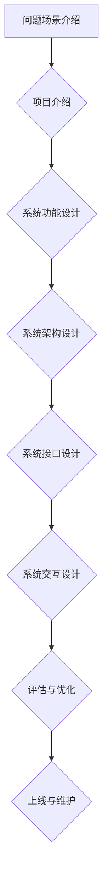

                 

### 《打造高效的技术决策机制》

> 关键词：技术决策、高效机制、创新、团队协作、风险管理、成本效益分析

> 摘要：本文旨在探讨如何构建和优化企业的技术决策机制，以提升企业在快速变化的市场环境中的竞争力。通过分析技术决策的重要性、核心概念、原理，以及实际构建步骤，本文提供了系统化的指导，帮助企业在技术决策过程中更加科学、灵活和协同，从而实现持续创新和可持续发展。

----------------------------------------------------------------

## 第一部分：问题背景与核心概念

### 第1章 问题背景

#### 1.1 技术决策机制的重要性

- **技术决策的概念与内涵**：
  技术决策是指企业在技术研发、产品开发、技术引入等方面所做的决策。它不仅涉及到技术的选择和开发，还涉及技术应用的策略和实施。

- **技术决策在企业发展中的关键作用**：
  - **推动创新**：技术决策直接影响到企业的创新能力，通过正确的技术决策，企业可以保持技术领先，推动产品创新和服务创新。
  - **提升竞争力**：科学的技术决策有助于企业快速响应市场变化，抓住市场机会，提升在行业中的竞争力。
  - **降低风险**：通过全面的风险分析和技术评估，企业可以减少技术失败的风险，保障投资效益。

- **技术决策存在的问题**：
  - **信息不足**：技术决策往往需要大量的信息支持，但在实际操作中，企业可能无法获取全面、准确的数据。
  - **决策过程复杂**：技术决策涉及多个环节，包括技术评估、成本分析、市场预测等，过程复杂，决策周期长。
  - **缺乏协同**：技术决策往往需要跨部门、跨团队的合作，但实际操作中，部门间的协作和沟通不畅，难以形成统一决策。

- **技术决策机制的重要性**：
  - **科学决策**：高效的技术决策机制可以帮助企业基于数据和信息进行科学决策，减少主观判断的干扰。
  - **提高效率**：通过规范化和标准化的决策流程，可以提高决策效率，缩短决策周期。
  - **促进协作**：技术决策机制可以促进跨部门、跨团队的协作，形成合力，提升整体决策质量。

#### 1.2 高效技术决策机制的特征

- **高效技术决策机制的定义**：
  高效技术决策机制是指一套系统化、规范化的决策流程和工具，旨在提高技术决策的科学性、灵活性和协同性。

- **高效技术决策机制的三大特征**：
  - **科学性**：基于数据和证据进行决策，减少主观判断的影响，提高决策的准确性和可靠性。
  - **灵活性**：能够快速适应外部环境和内部需求的变化，灵活调整决策策略。
  - **协同性**：促进跨部门、跨团队的协作，形成合力，提升整体决策效率。

#### 1.3 建立高效技术决策机制的重要性

- **对企业发展的推动作用**：
  - **提升决策质量**：高效的技术决策机制可以帮助企业减少错误决策，提高决策的成功率。
  - **提高决策效率**：通过规范化和标准化的决策流程，可以缩短决策周期，提高决策效率。
  - **促进企业创新**：高效的技术决策机制可以推动企业持续创新，保持技术领先。

- **对个人职业发展的助力**：
  - **增强技术视野**：通过参与技术决策过程，可以拓宽个人的技术视野，提升对技术发展趋势的把握能力。
  - **提升决策能力**：通过实际参与技术决策，可以锻炼个人的决策能力和判断力。
  - **培养团队合作精神**：技术决策需要跨部门、跨团队的合作，可以培养个人的沟通协调能力和团队合作精神。

## 第二部分：核心概念与原理

### 第2章 核心概念

#### 2.1 技术决策过程

- **技术评估**：
  技术评估是技术决策过程中的关键环节，它通过对候选技术的性能、成本、可行性等方面进行全面评估，为决策提供科学依据。

  - **技术评估的概念与流程**：
    - 概念：技术评估是对技术方案、技术方案之间的比较和评估过程。
    - 流程：包括技术需求分析、技术方案收集、技术方案评估、技术选型等环节。

  - **技术评估的方法与工具**：
    - 方法：包括专家评估、实验测试、模拟仿真等。
    - 工具：可以使用技术评估软件、专家系统等工具进行评估。

- **风险分析**：
  风险分析是技术决策过程中不可或缺的环节，它旨在识别、评估和应对可能的技术风险。

  - **风险识别**：
    - 方法：通过头脑风暴、SWOT分析、历史案例研究等方法识别可能的风险。

  - **风险评估**：
    - 步骤：包括风险发生概率评估、风险影响评估和风险优先级排序。
    - 指标：可以使用风险矩阵、风险指数等指标进行评估。

  - **应对策略**：
    - 风险规避：通过调整技术方案或实施策略来避免风险。
    - 风险减轻：通过采取特定措施降低风险发生的概率或影响程度。
    - 风险接受：对于无法规避或减轻的风险，采取接受的态度，并制定相应的应对计划。

- **成本效益分析**：
  成本效益分析是技术决策的重要环节，它通过对技术方案的成本和效益进行量化评估，帮助决策者选择最佳方案。

  - **成本计算**：
    - 成本分类：包括初始成本、运营成本、维护成本等。
    - 成本计算方法：可以使用成本模型、预算分析等方法进行计算。

  - **效益评估**：
    - 效益指标：包括经济效益、社会效益、环境效益等。
    - 效益评估方法：可以使用收益模型、效益评估工具等进行评估。

#### 2.2 技术决策模型

- **决策树模型**：
  决策树模型是一种常见的技术决策模型，它通过一系列的决策节点和结果节点，将复杂的技术决策过程转化为易于理解和分析的树状结构。

  - **决策树模型的构建**：
    - 方法：根据决策问题和相关数据，构建决策树模型。
    - 步骤：包括确定决策目标、构建决策树、评估决策节点和结果节点等。

  - **决策树模型的运用**：
    - 方法：通过决策树模型进行技术评估、风险分析和成本效益分析。
    - 应用：可以在技术选型、项目评估、风险管理等方面发挥重要作用。

- **马尔可夫决策过程（MDP）**：
  马尔可夫决策过程是一种基于概率和动态规划的决策模型，它适用于具有不确定性、需要长期决策优化的问题。

  - **MDP的基本概念**：
    - 状态：决策过程中可能出现的不同情况。
    - 动作：在特定状态下可以采取的不同行动。
    - 动态转移概率：不同状态下采取不同行动后状态转移的概率。

  - **MDP的求解方法**：
    - 动态规划：通过递推关系求解最优策略。
    - 价值迭代：通过不断迭代计算状态价值和策略。

- **贝叶斯网络**：
  贝叶斯网络是一种基于概率推理的图形模型，它通过表示变量之间的条件依赖关系，为不确定性决策提供有效的推理工具。

  - **贝叶斯网络的构建**：
    - 方法：根据决策问题和相关数据，构建贝叶斯网络。
    - 步骤：包括确定变量、建立条件依赖关系、计算概率分布等。

  - **贝叶斯网络的运用**：
    - 方法：通过贝叶斯网络进行风险分析、成本效益分析和决策优化。
    - 应用：可以在金融投资、医疗诊断、工程优化等领域发挥重要作用。

#### 2.3 技术决策机制的关键要素

- **信息管理**：
  信息管理是技术决策的基础，它包括信息的收集、处理和利用。

  - **信息收集**：
    - 方法：通过市场调研、技术调研、数据分析等方式收集相关信息。
    - 源头：包括内部数据、外部数据、专业咨询等。

  - **信息处理**：
    - 方法：通过数据清洗、数据分析、数据可视化等技术手段处理信息。
    - 工具：可以使用数据库、数据挖掘工具等。

  - **信息利用**：
    - 方法：通过数据报告、分析报告、决策支持系统等方式利用信息。
    - 目的：为技术决策提供科学依据和参考。

- **决策支持系统**：
  决策支持系统是一种计算机系统，它通过收集、处理和分析数据，为决策者提供支持和建议。

  - **决策支持系统的概念**：
    - 概念：决策支持系统是一种基于信息技术和人工智能的辅助决策系统。
    - 功能：包括数据采集、数据分析、决策建模、决策评估等。

  - **决策支持系统的功能**：
    - 数据采集：收集与企业技术决策相关的数据。
    - 数据分析：对数据进行处理和分析，提取有用信息。
    - 决策建模：构建决策模型，模拟不同决策结果。
    - 决策评估：评估不同决策方案的风险和效益。

- **团队协作**：
  技术决策往往需要跨部门、跨团队的协作，高效的团队协作是确保技术决策成功的关键。

  - **团队成员角色与职责**：
    - 角色：包括技术专家、市场分析师、财务分析师等。
    - 职责：明确团队成员的职责和任务分工。

  - **协作机制与工具**：
    - 机制：建立有效的沟通和协作机制，确保信息畅通和决策高效。
    - 工具：包括项目管理工具、沟通协作工具等。

## 第三部分：构建高效技术决策机制

### 第3章 建立高效技术决策机制的基础

#### 3.1 明确技术决策目标

- **目标设定**：
  技术决策目标的设定是建立高效技术决策机制的第一步，它关系到整个决策过程的科学性和有效性。

  - **目标明确**：
    - 方法：通过市场调研、技术调研、内部讨论等方式，明确技术决策的目标和期望结果。
    - 内容：包括技术领先、成本效益、风险控制、创新驱动等。

  - **优先级排序**：
    - 方法：根据目标的重要性和可实现性，对技术决策目标进行优先级排序。
    - 目的：确保决策过程中能够集中资源和力量，优先解决关键问题。

- **目标实现策略**：
  目标实现策略是确保技术决策目标得以实现的关键，它包括具体的行动计划、资源配置和时间安排。

  - **策略制定**：
    - 方法：通过头脑风暴、SWOT分析、可行性研究等方式，制定实现目标的策略。
    - 内容：包括技术方案选择、资源配置、时间安排等。

  - **计划实施**：
    - 方法：通过项目管理工具、进度跟踪等手段，确保策略计划的顺利实施。
    - 内容：包括任务分配、资源调配、进度控制等。

#### 3.2 建立技术决策框架

- **决策框架设计**：
  技术决策框架是技术决策机制的骨架，它为决策过程提供了明确的指导和规范。

  - **框架要素**：
    - 方法：通过分析技术决策的特点和需求，确定决策框架的要素。
    - 内容：包括决策目标、决策流程、决策方法、决策责任等。

  - **框架构建**：
    - 方法：通过系统化、规范化的流程，构建技术决策框架。
    - 内容：包括决策流程设计、决策方法选择、决策责任分配等。

- **决策流程优化**：
  技术决策流程的优化是提高决策效率和质量的关键，它通过简化流程、减少冗余、提高协作效率等方式，确保决策过程的高效运行。

  - **流程优化方法**：
    - 方法：通过流程分析、流程重构等方法，优化技术决策流程。
    - 内容：包括流程简化、流程标准化、流程自动化等。

  - **流程实施**：
    - 方法：通过培训、推广、反馈等手段，确保技术决策流程的顺利实施。
    - 内容：包括流程培训、流程执行、流程反馈等。

#### 3.3 信息管理与决策支持系统

- **信息管理体系**：
  信息管理体系是确保技术决策过程中信息流畅和准确的关键，它通过信息的收集、处理和利用，为技术决策提供全面支持。

  - **信息收集**：
    - 方法：通过市场调研、技术调研、内部数据采集等方式，收集与决策相关的信息。
    - 内容：包括市场趋势、技术发展、竞争对手等。

  - **信息处理**：
    - 方法：通过数据清洗、数据分析、数据可视化等技术手段，处理和利用信息。
    - 内容：包括数据整合、数据分析、数据报告等。

  - **信息利用**：
    - 方法：通过数据报告、分析报告、决策支持系统等方式，利用信息为决策提供支持。
    - 内容：包括决策分析、决策模拟、决策评估等。

- **决策支持系统的构建**：
  决策支持系统是提高技术决策科学性和灵活性的重要工具，它通过收集、处理和分析数据，为决策者提供实时、全面的支持。

  - **系统功能**：
    - 方法：根据技术决策的需求，确定决策支持系统的功能。
    - 内容：包括数据采集、数据分析、决策建模、决策评估等。

  - **系统集成**：
    - 方法：通过系统集成，确保决策支持系统能够与企业的其他系统（如ERP、CRM等）无缝对接，实现数据共享和协同工作。
    - 内容：包括系统架构设计、系统集成测试、系统运行维护等。

### 第4章 提升技术决策团队效能

#### 4.1 团队成员角色与职责

- **角色定位**：
  技术决策团队的角色定位是确保团队成员在决策过程中能够发挥各自优势，形成合力。

  - **角色确定**：
    - 方法：根据技术决策的需求和特点，确定团队成员的角色。
    - 内容：包括技术专家、市场分析师、财务分析师、项目经理等。

  - **角色职责**：
    - 方法：明确每个角色的职责和任务，确保团队成员各司其职。
    - 内容：包括技术评估、市场分析、成本效益分析、项目协调等。

- **职责分工**：
  职责分工是技术决策团队高效运作的基础，它通过明确团队成员的职责和协作机制，确保决策过程的顺利推进。

  - **职责分配**：
    - 方法：根据技术决策的具体需求和团队成员的能力，合理分配职责。
    - 内容：包括任务分配、角色分工、协作机制等。

  - **协作机制**：
    - 方法：建立有效的沟通和协作机制，确保团队成员能够高效沟通和协作。
    - 内容：包括定期会议、信息共享、协同工作等。

#### 4.2 技术决策团队的沟通与协作

- **沟通策略**：
  技术决策团队的沟通策略是确保团队成员能够高效沟通，共享信息，形成统一决策的关键。

  - **沟通目的**：
    - 方法：明确沟通的目的和目标，确保沟通的有效性。
    - 内容：包括信息传递、问题解决、决策协调等。

  - **沟通渠道**：
    - 方法：建立多种沟通渠道，确保信息畅通。
    - 内容：包括会议沟通、邮件沟通、即时通讯等。

- **协作工具与方法**：
  技术决策团队的协作工具与方法是提高团队协作效率和质量的重要手段。

  - **协作工具**：
    - 方法：选择适合的技术协作工具，提高协作效率。
    - 内容：包括项目管理工具、协同办公工具、在线会议工具等。

  - **协作方法**：
    - 方法：采用多种协作方法，提高团队协作效果。
    - 内容：包括任务分配、进度跟踪、团队协作、成果共享等。

### 第5章 风险管理

#### 5.1 风险识别与评估

- **风险识别**：
  风险识别是风险管理的基础，它旨在识别可能影响技术决策的各种风险。

  - **方法**：
    - 头脑风暴：通过集体讨论，识别潜在风险。
    - SWOT分析：通过分析企业的优势、劣势、机会和威胁，识别风险。
    - 历史案例研究：通过分析历史案例，识别常见风险。

  - **工具**：
    - 风险矩阵：通过风险矩阵，对风险进行初步分类和评估。
    - 风险清单：列出可能的风险，进行系统化整理。

- **风险评估**：
  风险评估是确定风险的重要环节，它通过对风险的概率和影响进行量化评估，确定风险的优先级。

  - **步骤**：
    - 确定风险因素：识别可能影响技术决策的关键因素。
    - 量化评估：使用定量方法，对风险的概率和影响进行量化评估。
    - 风险优先级排序：根据评估结果，对风险进行优先级排序。

  - **指标**：
    - 风险指数：通过风险概率和影响程度的乘积，计算风险指数。
    - 风险矩阵：通过风险矩阵，对风险进行分类和优先级排序。

- **风险应对策略**：
  风险应对策略是针对识别和评估后的风险，制定相应的应对措施，以减少风险对决策的影响。

  - **方法**：
    - 风险规避：通过调整决策方案，避免风险的发生。
    - 风险减轻：通过采取特定措施，降低风险的概率或影响程度。
    - 风险转移：通过保险、合同等方式，将风险转移给第三方。
    - 风险接受：对于无法规避或减轻的风险，采取接受的态度，并制定相应的应对计划。

  - **策略实施**：
    - 制定应对计划：根据风险评估结果，制定具体的应对计划。
    - 资源配置：确保应对计划的实施，需要相应的资源支持。
    - 风险监控：对应对计划的实施进行监控，及时调整和优化。

#### 5.2 风险监控与调整

- **风险监控**：
  风险监控是确保风险管理措施有效实施的重要环节，它通过持续监控风险，及时发现问题并采取相应措施。

  - **方法**：
    - 定期评估：定期对风险进行评估，更新风险评估结果。
    - 持续监控：通过数据监控、事件监控等方式，持续监控风险的动态变化。
    - 信息反馈：建立信息反馈机制，及时收集和分析风险信息。

  - **工具**：
    - 风险监控系统：使用专门的软件或工具，对风险进行实时监控。
    - 报告系统：建立风险报告系统，定期向决策者报告风险情况。

- **调整策略**：
  风险调整策略是根据风险监控的结果，对风险管理措施进行调整和优化的过程。

  - **方法**：
    - 风险修正：根据新的风险评估结果，对风险管理措施进行调整。
    - 风险优先级调整：根据风险的变化，重新评估风险的优先级。
    - 风险应对措施优化：优化现有的风险应对措施，提高应对效果。

  - **流程**：
    - 风险评估调整：根据监控结果，对风险评估进行修正和优化。
    - 风险应对调整：根据新的风险情况，调整风险应对措施。
    - 风险监控优化：优化风险监控流程，提高监控效果。

### 第6章 成本效益分析

#### 6.1 成本效益分析的方法

- **成本计算**：
  成本计算是成本效益分析的基础，它通过对成本的分类和量化，为效益评估提供数据支持。

  - **成本分类**：
    - 初始成本：包括设备采购、软件开发、基础设施建设等。
    - 运营成本：包括人员培训、维护费用、日常运营费用等。
    - 维护成本：包括软件升级、硬件维护、技术支持等。

  - **成本计算方法**：
    - 成本模型：使用成本模型，对各类成本进行量化计算。
    - 预算分析：通过预算分析，确定各类成本的合理范围。

- **效益评估**：
  效益评估是成本效益分析的核心，它通过对技术方案带来的效益进行量化评估，为决策提供依据。

  - **效益指标**：
    - 经济效益：包括销售收入、成本节约等。
    - 社会效益：包括对社会的贡献、环境影响等。
    - 环境效益：包括资源节约、环境改善等。

  - **效益评估方法**：
    - 收益模型：使用收益模型，对技术方案的收益进行量化评估。
    - 效益分析工具：使用效益分析工具，如财务分析软件、效益评估模型等。

#### 6.2 成本效益分析的实际应用

- **案例研究**：
  成本效益分析在技术决策中的实际应用案例，可以帮助我们更好地理解和应用成本效益分析的方法。

  - **案例背景**：
    - 某企业计划引入新的生产线，提高生产效率。

  - **案例步骤**：
    - 成本计算：计算新生产线的初始成本、运营成本和维护成本。
    - 效益评估：评估新生产线带来的经济效益、社会效益和环境效益。
    - 成本效益分析：对成本和效益进行对比，评估新生产线的经济可行性。

  - **案例结果**：
    - 根据成本效益分析的结果，企业决定引入新的生产线，以提升生产效率和竞争力。

- **分析与解读**：
  通过对案例的分析和解读，我们可以总结出成本效益分析在技术决策中的经验与教训。

  - **经验**：
    - 成本计算要全面、准确，避免遗漏关键成本。
    - 效益评估要客观、合理，避免过度乐观或悲观。
    - 成本效益分析要结合实际情况，充分考虑各种影响因素。

  - **教训**：
    - 成本效益分析不能替代其他决策方法，应与其他决策方法相结合。
    - 成本效益分析结果要结合企业战略和市场需求，确保决策的可行性和有效性。

### 第7章 持续优化与改进

#### 7.1 评估与反馈

- **技术决策评估**：
  技术决策评估是对技术决策过程和结果进行全面评估，以确定决策的有效性和效果。

  - **评估方法**：
    - 定期评估：定期对技术决策进行评估，分析决策的成功率和效果。
    - 现场评估：通过现场评估，了解技术决策在实际应用中的效果和问题。
    - 回顾评估：对过去的技术决策进行回顾和评估，总结经验教训。

  - **评估标准**：
    - 成本效益：评估技术决策的成本效益，确定决策的经济合理性。
    - 效率效果：评估技术决策的效率效果，确定决策的有效性。
    - 创新程度：评估技术决策的创新程度，确定决策的技术先进性。

- **反馈机制**：
  反馈机制是确保技术决策持续优化的重要手段，它通过收集和分析反馈信息，为后续决策提供改进依据。

  - **反馈渠道**：
    - 内部反馈：通过内部会议、报告等方式，收集员工和团队的反馈意见。
    - 外部反馈：通过市场调研、用户反馈等方式，收集外部用户的反馈意见。
    - 数据反馈：通过数据分析，发现技术决策中的问题和不足。

  - **反馈处理**：
    - 分析反馈：对反馈信息进行系统化分析，识别问题和改进点。
    - 反馈响应：对反馈问题进行及时响应和处理，确保反馈得到有效落实。
    - 反馈跟踪：对反馈处理的进展进行跟踪，确保反馈处理到位。

#### 7.2 持续改进

- **改进措施**：
  持续改进是通过不断优化和改进技术决策机制，提升决策质量和效率的过程。

  - **改进方法**：
    - 预防性改进：通过预防性措施，减少决策过程中的错误和风险。
    - 纠正性改进：通过纠正性措施，纠正决策过程中的错误和不足。
    - 创新性改进：通过创新性措施，推动技术决策的持续创新和进步。

  - **改进内容**：
    - 决策流程优化：通过流程优化，简化决策流程，提高决策效率。
    - 决策工具升级：通过决策工具升级，提高决策的科学性和灵活性。
    - 决策团队建设：通过团队建设，提升决策团队的协作能力和专业素养。

- **实施步骤**：
  持续改进的实施步骤包括计划、执行、检查和改进四个阶段。

  - **计划**：
    - 确定改进目标：明确持续改进的目标和方向。
    - 制定改进计划：制定具体的改进措施和时间表。

  - **执行**：
    - 实施改进措施：按照改进计划，实施具体的改进措施。
    - 监控改进过程：对改进过程进行监控，确保改进措施得到有效执行。

  - **检查**：
    - 评估改进效果：对改进效果进行评估，确定改进措施的有效性。
    - 收集反馈信息：收集反馈信息，为后续改进提供依据。

  - **改进**：
    - 分析问题：对改进过程中发现的问题进行分析和总结。
    - 优化改进措施：根据分析结果，优化改进措施，确保改进效果。

## 结束语

本文从问题背景、核心概念、构建步骤等多个角度，探讨了如何打造高效的技术决策机制。通过明确技术决策目标、建立技术决策框架、提升团队协作、加强风险管理、进行成本效益分析以及持续优化与改进，企业可以在复杂多变的商业环境中做出科学、灵活和高效的决策，从而提升竞争力，实现可持续发展。让我们携手努力，共同推动技术决策机制的完善，为企业的成功奠定坚实基础。感谢大家的阅读，希望本文能给您带来启示和帮助。

---

**作者信息**：

作者：AI天才研究院/AI Genius Institute & 禅与计算机程序设计艺术 /Zen And The Art of Computer Programming

---

在撰写本文的过程中，我们力求以逻辑清晰、结构紧凑、简单易懂的方式，深入浅出地阐述技术决策机制的重要性和构建方法。希望本文能对广大读者在技术决策过程中提供有价值的参考和指导。感谢各位读者的关注和支持，期待与您在技术领域的更多交流和分享。如果您有任何问题或建议，欢迎随时与我们联系。再次感谢您的阅读！## 第二部分：核心概念与原理

在构建高效的技术决策机制过程中，理解核心概念和原理至关重要。这不仅有助于我们科学地分析问题，还能确保决策过程的合理性和有效性。以下将详细阐述技术决策过程中的核心概念，包括技术评估、风险分析和成本效益分析。

### 第2章 核心概念

#### 2.1 技术评估

技术评估是技术决策过程中的关键环节，旨在对各种技术方案进行全面评估，以确定其适用性和可行性。以下是技术评估的具体概念和流程：

- **概念**：
  技术评估是指通过对技术方案的性能、成本、可行性等方面进行全面分析，为技术决策提供科学依据的过程。

- **流程**：
  1. **技术需求分析**：明确技术方案需要解决的具体问题和技术需求。
  2. **技术方案收集**：收集各种潜在的技术方案，包括内部研发方案和外部合作方案。
  3. **技术方案评估**：对每个技术方案进行详细评估，包括技术可行性、成本效益、风险等。
  4. **技术选型**：根据评估结果，选择最优技术方案。

- **方法与工具**：
  1. **专家评估**：通过邀请技术专家对技术方案进行评估。
  2. **实验测试**：通过实际测试，验证技术方案的可行性和性能。
  3. **模拟仿真**：通过模拟仿真，评估技术方案在各种环境下的表现。

#### 2.2 风险分析

风险分析是技术决策过程中不可忽视的环节，它旨在识别、评估和应对可能的技术风险，确保决策的稳定性和可靠性。

- **概念**：
  风险分析是指通过系统的方法和工具，识别和评估项目或决策中可能出现的风险，并制定相应的应对策略。

- **流程**：
  1. **风险识别**：通过头脑风暴、SWOT分析等方法，识别项目或决策中的潜在风险。
  2. **风险评估**：对识别出的风险进行量化评估，确定其发生概率和影响程度。
  3. **风险应对**：根据风险评估结果，制定相应的风险应对策略。

- **方法与工具**：
  1. **风险矩阵**：通过风险矩阵，对风险的概率和影响程度进行评估。
  2. **蒙特卡罗模拟**：通过模拟，评估风险的可能性和影响。
  3. **敏感性分析**：通过分析变量变化对结果的影响，评估风险的敏感度。

#### 2.3 成本效益分析

成本效益分析是技术决策过程中不可或缺的一环，它通过对技术方案的成本和效益进行量化评估，为决策提供经济依据。

- **概念**：
  成本效益分析是指通过比较技术方案的成本和效益，评估其经济合理性和可行性。

- **流程**：
  1. **成本计算**：明确技术方案的成本构成，包括初始成本、运营成本、维护成本等。
  2. **效益评估**：评估技术方案带来的经济效益，包括直接收益和间接收益。
  3. **综合评估**：将成本和效益进行综合评估，确定技术方案的经济合理性。

- **方法与工具**：
  1. **收益模型**：通过收益模型，对技术方案的效益进行量化评估。
  2. **成本效益比**：通过成本效益比，比较不同技术方案的经济性。
  3. **净现值（NPV）**：通过净现值，评估技术方案的经济效益。

#### 2.4 技术评估、风险分析和成本效益分析的关系

技术评估、风险分析和成本效益分析是技术决策过程中的三个重要环节，它们相互关联、相互支持。

- **关系**：
  1. 技术评估为风险分析和成本效益分析提供了基础数据。
  2. 风险分析为技术评估提供了风险视角，确保技术方案的安全性。
  3. 成本效益分析为技术评估和风险分析提供了经济依据，确保技术方案的经济合理性。

通过这三个环节的有机结合，企业可以更加科学、全面地评估技术方案，做出高效的技术决策。

### 第2章 总结

技术评估、风险分析和成本效益分析是技术决策过程中的核心概念，它们为企业提供了科学决策的基础。通过技术评估，企业可以确定技术方案的适用性和可行性；通过风险分析，企业可以识别和应对技术风险；通过成本效益分析，企业可以确保技术方案的经济合理性。这三个环节相互补充，共同构建了高效的技术决策机制，助力企业在竞争激烈的市场环境中取得成功。在下一部分，我们将探讨技术决策模型，进一步深化对技术决策机制的理解。

---

在构建高效的技术决策机制的过程中，理解核心概念和原理是至关重要的一步。通过深入分析技术评估、风险分析和成本效益分析，企业能够为技术决策提供坚实的数据支持和科学依据。下一部分，我们将进一步探讨技术决策模型，以更系统的方法指导实际决策过程。敬请期待！

---

## 第2章 核心概念

### 2.4 技术评估、风险分析和成本效益分析的关系

技术评估、风险分析和成本效益分析是技术决策过程中的三个重要环节，它们之间相互联系、相互影响，共同构成了一个完整的技术决策框架。

- **技术评估的基础作用**：
  技术评估是技术决策的起点，它通过对技术方案的全面评估，确定技术方案的适用性和可行性。技术评估的结果直接影响后续的风险分析和成本效益分析。例如，如果一项技术方案在技术评估中被认为不可行，那么它将不会被进一步分析成本和风险。

- **风险分析的技术视角**：
  风险分析为技术评估提供了风险视角，确保技术方案的安全性。通过风险识别、评估和应对策略，企业可以识别出可能影响技术方案实施和效果的风险，并采取相应的措施加以应对。这不仅有助于减少技术决策的不确定性，还能提升决策的稳健性。

- **成本效益分析的经济依据**：
  成本效益分析则为技术评估和风险分析提供了经济依据，确保技术方案的经济合理性。通过成本效益分析，企业可以评估不同技术方案的成本和效益，从而选择最经济合理的技术方案。这一环节的结果直接关系到技术决策的经济性，是技术决策过程中不可或缺的一环。

- **相互补充与优化**：
  这三个环节并非独立存在，而是相互补充、相互优化的。技术评估的结果为风险分析和成本效益分析提供了基础数据，而风险分析和成本效益分析的结果则反过来指导技术评估的改进。例如，如果风险分析发现某技术方案存在较高的风险，则可能需要对技术评估中的某些方面进行重新评估，以降低风险。

  具体而言，技术评估、风险分析和成本效益分析之间的关系可以概括为以下几个方面：

  - **数据共享**：技术评估中的数据可以作为风险分析和成本效益分析的基础，确保分析的科学性和准确性。
  - **反馈循环**：风险分析和成本效益分析的结果可以反馈到技术评估中，帮助改进评估方法，提升评估质量。
  - **综合评估**：在决策过程中，企业需要综合考虑技术评估、风险分析和成本效益分析的结果，做出全面、科学的决策。

通过技术评估、风险分析和成本效益分析的有机结合，企业可以构建一个全面、科学、高效的技术决策机制，从而在复杂多变的市场环境中保持竞争力，实现可持续发展。在下一部分，我们将探讨具体的技术决策模型，以进一步深化对技术决策机制的理解。

---

通过深入探讨技术评估、风险分析和成本效益分析之间的关系，我们可以更好地理解技术决策机制的运作原理。这三个环节相互依存、相互促进，共同构成了企业科学决策的基石。在下一部分，我们将详细介绍技术决策模型，帮助读者进一步掌握技术决策的方法与工具。敬请期待！

---

## 第3章 构建高效技术决策机制的基础

构建高效的技术决策机制是企业成功的关键。要实现这一目标，首先需要明确技术决策的目标，并建立相应的技术决策框架，这是技术决策机制的基础。以下是详细的步骤和方法。

#### 3.1 明确技术决策目标

明确技术决策目标至关重要，它决定了技术决策的方向和重点。以下是具体步骤和方法：

- **目标设定**：
  - **方法**：通过市场调研、竞争对手分析、企业战略规划等方式，明确技术决策的目标。确保目标具有可衡量性、可实现性和与战略一致性。
  - **内容**：技术决策目标可以包括技术创新、成本降低、市场占有、产品升级等方面。例如，目标是提升产品性能、降低开发成本、缩短上市时间等。

- **目标优先级排序**：
  - **方法**：根据目标的重要性和实施难度，对技术决策目标进行优先级排序。优先解决对企业发展至关重要且相对容易实现的目标。
  - **内容**：可以采用优先级矩阵或优先级列表等方式进行排序。例如，将目标分为“高优先级”、“中优先级”和“低优先级”三个等级。

#### 3.2 目标实现策略

制定实现技术决策目标的策略和计划是确保目标达成的重要步骤。以下是具体方法和内容：

- **策略制定**：
  - **方法**：通过头脑风暴、SWOT分析、关键绩效指标（KPI）设定等方式，制定实现技术决策目标的策略。
  - **内容**：策略可以包括技术方案选择、资源配置、时间安排、风险管理等方面。例如，策略包括研发新技术、优化现有技术、与外部合作伙伴合作等。

- **计划实施**：
  - **方法**：制定详细的行动计划和时间表，确保策略的顺利实施。采用项目管理工具进行进度管理和任务分配。
  - **内容**：计划应包括关键里程碑、责任分配、资源需求、风险应对措施等。例如，制定项目进度表、人员分工表、预算表等。

#### 3.3 建立技术决策框架

技术决策框架是技术决策机制的骨架，它为技术决策提供了系统化的流程和标准。以下是具体步骤和方法：

- **框架设计**：
  - **方法**：根据企业的战略目标和业务需求，设计技术决策框架。确保框架包括关键决策环节和流程。
  - **内容**：技术决策框架应包括技术评估、风险分析、成本效益分析、决策执行和反馈机制等环节。

- **决策流程优化**：
  - **方法**：通过流程分析、流程重构等方式，优化技术决策流程。减少冗余步骤，提高决策效率。
  - **内容**：优化内容可以包括简化流程、标准化流程、自动化流程等。例如，采用自动化工具进行技术评估和数据分析，减少人工干预。

#### 3.4 技术决策支持系统的构建

技术决策支持系统（TDSS）是提高技术决策科学性和灵活性的重要工具。以下是具体方法和内容：

- **系统功能**：
  - **方法**：根据技术决策的需求，确定技术决策支持系统的功能。确保系统能够提供数据收集、处理、分析和可视化等功能。
  - **内容**：技术决策支持系统应包括数据采集模块、数据分析模块、决策模型模块和决策支持模块等。

- **系统集成**：
  - **方法**：通过系统集成，确保技术决策支持系统能与企业其他系统（如ERP、CRM等）无缝对接，实现数据共享和协同工作。
  - **内容**：系统集成应包括接口设计、数据同步、功能集成等。例如，将技术决策支持系统与企业ERP系统对接，实现数据实时更新和共享。

#### 3.5 持续改进

技术决策机制的持续改进是确保其高效运行和适应性的关键。以下是具体方法和内容：

- **评估与反馈**：
  - **方法**：通过定期评估和反馈机制，评估技术决策机制的有效性，收集改进意见。
  - **内容**：评估内容包括决策质量、决策效率、风险控制等。通过反馈机制，及时识别和解决问题。

- **改进措施**：
  - **方法**：根据评估和反馈结果，制定改进措施，持续优化技术决策机制。
  - **内容**：改进措施可以包括流程优化、工具升级、团队培训等。例如，通过引入新的决策工具，提高数据分析能力。

通过以上步骤和方法，企业可以建立和优化技术决策机制，确保在快速变化的市场环境中做出科学、灵活和高效的决策。在下一部分，我们将探讨如何提升技术决策团队的效能，进一步深化对技术决策机制的理解。

---

在明确技术决策目标和建立技术决策框架的基础上，构建一个高效的技术决策机制需要不断地优化和完善。通过技术决策支持系统的构建和持续改进，企业可以确保技术决策机制的科学性和灵活性。在下一部分，我们将深入探讨如何提升技术决策团队的效能，以确保团队能够在决策过程中发挥最大的作用。敬请期待！

---

## 第4章 提升技术决策团队效能

技术决策的成功很大程度上依赖于团队的效能。一个高效的团队能够迅速响应市场需求，做出科学合理的决策。以下是提升技术决策团队效能的方法和策略。

#### 4.1 明确团队成员角色与职责

明确团队成员的角色和职责是提升团队效能的基础。每个成员都应该清楚自己的工作内容和责任范围，以避免职责重叠或责任缺失。

- **角色定位**：
  - **方法**：通过岗位说明书、角色培训等方式，明确团队成员的角色。
  - **内容**：角色可以包括技术专家、市场分析师、财务分析师、项目经理等。每个角色都有明确的职责和工作内容。

- **职责分工**：
  - **方法**：通过任务分配、责任分配表等方式，明确团队成员的职责。
  - **内容**：确保每个成员都能专注于自己的领域，提高工作效率。例如，技术专家负责技术评估，财务分析师负责成本效益分析。

#### 4.2 加强团队沟通与协作

有效的沟通和协作是技术决策团队高效运作的关键。

- **沟通策略**：
  - **方法**：建立定期的沟通机制，如团队会议、项目进展汇报等。
  - **内容**：确保团队成员能够及时分享信息、交流意见，减少误解和冲突。例如，每周召开一次团队会议，讨论项目进展和问题解决方案。

- **协作工具与方法**：
  - **方法**：选择合适的协作工具，如项目管理软件、即时通讯工具、协同办公平台等。
  - **内容**：通过协作工具，提高团队协作效率。例如，使用项目管理软件跟踪任务进度，使用即时通讯工具实时交流。

#### 4.3 培训与能力提升

团队成员的能力和专业知识是技术决策团队效能的重要保障。

- **培训**：
  - **方法**：定期组织培训，提升团队成员的专业技能和决策能力。
  - **内容**：培训内容可以包括技术前沿、风险管理、成本效益分析等。例如，邀请行业专家进行讲座，组织内部培训课程。

- **能力提升**：
  - **方法**：通过实际项目锻炼，提升团队成员的实战能力。
  - **内容**：鼓励团队成员参与实际项目，解决实际问题。例如，分配复杂项目给团队成员，锻炼其解决问题的能力。

#### 4.4 鼓励创新与探索

创新是技术决策团队持续发展的动力。

- **创新文化**：
  - **方法**：营造鼓励创新的文化氛围，激发团队成员的创新思维。
  - **内容**：建立创新激励机制，如创新奖项、创新基金等。鼓励团队成员提出创新想法，并给予实际支持和资源。

- **探索机会**：
  - **方法**：提供团队成员探索新技术的机会，如参加行业会议、技术论坛等。
  - **内容**：通过外部交流和学习，拓宽团队成员的视野，提升技术决策的前瞻性。

#### 4.5 风险管理与应急预案

风险管理和应急预案是确保技术决策团队应对突发情况的重要手段。

- **风险识别**：
  - **方法**：定期进行风险评估，识别项目中的潜在风险。
  - **内容**：制定风险清单，明确每种风险的类型、可能影响和应对措施。

- **应急预案**：
  - **方法**：制定应急预案，确保在突发事件发生时能够迅速响应。
  - **内容**：应急预案应包括应急流程、责任分配、资源调配等。

通过以上方法，企业可以显著提升技术决策团队的效能，确保团队在技术决策过程中能够高效协同、科学决策，从而在竞争激烈的市场环境中保持优势。在下一部分，我们将探讨如何进行风险管理，以进一步优化技术决策过程。

---

提升技术决策团队效能是构建高效技术决策机制的关键一步。通过明确团队成员角色与职责、加强沟通与协作、培训与能力提升、鼓励创新与探索以及风险管理与应急预案，企业可以确保技术决策团队能够在复杂多变的市场环境中做出快速、科学和高效的决策。在下一部分，我们将深入探讨风险管理，确保技术决策过程中的稳健性和可靠性。敬请期待！

---

## 第5章 风险管理

在技术决策过程中，风险管理是确保项目顺利进行、减少不确定性和潜在损失的关键环节。有效的风险管理能够帮助企业识别、评估和应对各种风险，从而提高决策的可靠性和项目成功率。以下是关于风险管理的详细探讨。

### 5.1 风险识别与评估

风险识别是风险管理的第一步，它涉及识别项目中可能出现的各种风险。以下是风险识别的方法和工具：

- **方法**：
  - **头脑风暴**：通过集体讨论，让团队成员共同识别可能的风险。
  - **SWOT分析**：通过分析企业的优势、劣势、机会和威胁，识别与项目相关的风险。
  - **历史案例研究**：通过研究历史项目的风险案例，总结和识别类似项目中的风险。

- **工具**：
  - **风险矩阵**：通过风险矩阵，对风险的概率和影响程度进行初步评估。
  - **风险清单**：列出项目中可能出现的各种风险，进行系统化整理。

### 5.2 风险评估

风险评估是确定风险的重要环节，它通过对风险的量化评估，帮助决策者了解风险的严重程度和应对优先级。以下是风险评估的步骤和指标：

- **步骤**：
  1. **确定风险因素**：识别影响项目成功的各种因素。
  2. **量化评估**：使用定量方法，对风险的概率和影响程度进行量化评估。
  3. **风险优先级排序**：根据评估结果，对风险进行优先级排序。

- **指标**：
  - **风险指数**：通过风险概率和影响程度的乘积，计算风险指数。
  - **风险矩阵**：通过风险矩阵，对风险进行分类和优先级排序。

### 5.3 风险应对策略

在识别和评估风险之后，需要制定相应的应对策略，以减少风险对项目的影响。以下是常见的风险应对策略：

- **方法**：
  - **风险规避**：通过调整项目计划或实施策略，避免风险的发生。
  - **风险减轻**：通过采取特定措施，降低风险的概率或影响程度。
  - **风险转移**：通过保险、合同等方式，将风险转移给第三方。
  - **风险接受**：对于无法规避或减轻的风险，采取接受的态度，并制定相应的应对计划。

- **策略实施**：
  - **制定应对计划**：根据风险评估结果，制定具体的应对计划。
  - **资源配置**：确保应对计划的实施，需要相应的资源支持。
  - **风险监控**：对应对计划的实施进行监控，及时调整和优化。

### 5.4 风险监控与调整

风险监控是确保风险管理措施有效实施的重要环节。以下是风险监控的方法和调整策略：

- **方法**：
  - **定期评估**：定期对风险进行评估，更新风险评估结果。
  - **持续监控**：通过数据监控、事件监控等方式，持续监控风险的动态变化。
  - **信息反馈**：建立信息反馈机制，及时收集和分析风险信息。

- **调整策略**：
  - **风险修正**：根据新的风险评估结果，对风险管理措施进行调整。
  - **风险优先级调整**：根据风险的变化，重新评估风险的优先级。
  - **风险应对措施优化**：优化现有的风险应对措施，提高应对效果。

### 5.5 风险管理的重要性

风险管理在技术决策过程中的重要性不可忽视。以下是几个关键点：

- **保障项目成功**：有效的风险管理能够减少项目失败的风险，保障项目顺利进行。
- **提高决策质量**：通过全面的风险评估和应对策略，提高决策的科学性和可靠性。
- **优化资源配置**：通过合理配置资源，确保在风险发生时能够有足够的资源应对。
- **增强团队协作**：风险管理需要团队成员的协作，有助于提升团队的整体效能。

通过有效的风险管理，企业可以确保技术决策过程更加稳健和可靠，从而在竞争激烈的市场环境中立于不败之地。在下一部分，我们将探讨如何进行成本效益分析，以进一步优化技术决策过程。

---

在技术决策过程中，风险管理扮演着至关重要的角色。通过风险识别与评估、风险应对策略和持续监控，企业可以确保决策的稳健性和可靠性。在下一部分，我们将深入探讨成本效益分析，以帮助企业科学评估技术方案的经济合理性。敬请期待！

---

## 第6章 成本效益分析

成本效益分析是技术决策过程中的核心环节，它通过对技术方案的成本和效益进行量化评估，帮助企业确定技术方案的经济合理性和可行性。以下将详细阐述成本效益分析的方法和实际应用。

### 6.1 成本计算

成本计算是成本效益分析的基础，它涉及对项目实施过程中所有相关成本进行详细计算。以下是成本计算的方法和内容：

- **方法**：
  - **直接成本计算**：直接成本包括设备采购、软件开发、人员培训等直接与项目相关的费用。
  - **间接成本计算**：间接成本包括办公费用、管理费用、差旅费用等不直接与项目相关的费用。

- **内容**：
  - **初始成本**：包括项目启动阶段所需的费用，如设备采购、软件许可等。
  - **运营成本**：包括项目实施和运营过程中的费用，如日常运营费用、维护费用等。
  - **维护成本**：包括项目后续维护和升级所需的费用。

### 6.2 效益评估

效益评估是成本效益分析的关键步骤，它通过对技术方案带来的效益进行量化评估，帮助决策者了解项目的经济效益。以下是效益评估的方法和内容：

- **方法**：
  - **直接效益评估**：直接效益包括销售收入、成本节约等直接与项目相关的收益。
  - **间接效益评估**：间接效益包括品牌提升、市场占有率提升等间接与项目相关的收益。

- **内容**：
  - **经济效益**：包括项目的直接收益和间接收益，如销售收入、市场份额提升等。
  - **社会效益**：包括项目对社会的贡献，如环保、就业等。
  - **环境效益**：包括项目对环境的积极影响，如减少污染、节约资源等。

### 6.3 成本效益比

成本效益比是衡量技术方案经济合理性的重要指标，它通过比较项目的成本和效益，评估项目的经济效益。以下是成本效益比的计算和评估：

- **计算**：
  - 成本效益比（CBR）= 总效益 / 总成本

- **评估**：
  - 如果 CBR > 1，表示项目的经济效益好于成本，是可行的。
  - 如果 CBR < 1，表示项目的成本高于效益，可能需要重新评估或调整。

### 6.4 成本效益分析工具

为了更有效地进行成本效益分析，企业可以借助各种工具和方法。以下是常用的成本效益分析工具：

- **财务分析软件**：如 Excel、ERP 系统、SAP 等，用于数据计算和报表生成。
- **效益评估模型**：如成本效益分析模型（CBA）、成本效果分析模型（CEA）等，用于量化效益。
- **数据可视化工具**：如 Tableau、Power BI 等，用于数据分析和可视化。

### 6.5 成本效益分析的实际应用

成本效益分析在实际应用中可以帮助企业做出更加科学的决策。以下是一个实际应用案例：

#### 案例背景

某企业计划引入一条新的生产线，以提高生产效率。企业需要对两个技术方案进行比较分析，以确定最佳方案。

#### 分析步骤

1. **成本计算**：
   - 方案A：初始成本为 500 万元，运营成本为每年 200 万元。
   - 方案B：初始成本为 800 万元，运营成本为每年 150 万元。

2. **效益评估**：
   - 方案A：预计每年可增加销售收入 300 万元，节约成本 100 万元。
   - 方案B：预计每年可增加销售收入 350 万元，节约成本 120 万元。

3. **成本效益比**：
   - 方案A：CBR = (300 + 100) / (500 + 200) = 1.5
   - 方案B：CBR = (350 + 120) / (800 + 150) = 1.4

4. **结果分析**：
   - 虽然方案B的初始成本更高，但它的效益也更高，因此从经济效益角度来看，方案A是更佳的选择。

#### 分析解读

通过成本效益分析，企业可以明确不同技术方案的经济合理性。在实际应用中，企业还需考虑其他因素，如技术可行性、市场前景等，以做出综合决策。

### 6.6 结论

成本效益分析是技术决策过程中不可或缺的一环，它通过量化评估成本和效益，帮助企业做出科学合理的决策。通过使用各种成本效益分析工具和方法，企业可以更加全面地评估技术方案的经济性，从而在竞争激烈的市场环境中取得成功。在下一部分，我们将探讨如何进行持续优化与改进，以进一步提升技术决策机制的效果。

---

通过详细探讨成本效益分析的方法和实际应用，我们可以看到其在技术决策过程中的重要性。成本效益分析不仅帮助企业在经济层面上做出明智的决策，还为企业提供了量化的依据。在下一部分，我们将进一步探讨如何通过持续优化与改进，不断提升技术决策机制的效能。敬请期待！

---

## 第7章 持续优化与改进

技术决策机制的有效性不是一成不变的，而是需要不断优化和改进的。持续优化与改进的过程包括评估与反馈、持续改进措施和改进的实施步骤。以下将详细探讨这些关键环节。

### 7.1 评估与反馈

**技术决策评估**是确保决策有效性的关键步骤。通过评估，企业可以了解决策的实际效果，发现潜在问题，并据此进行调整。

- **方法**：
  - **定期评估**：定期对技术决策的效果进行评估，如每季度或每年一次。
  - **过程监控**：实时监控决策过程中的关键指标，如成本、效益、风险等。
  - **反馈机制**：建立反馈机制，鼓励团队成员和外部专家提供意见和建议。

- **内容**：
  - **评估指标**：确定评估指标，如成本效益比、项目成功率、风险控制率等。
  - **问题识别**：通过数据分析、现场考察等方式，识别决策过程中的问题和不足。
  - **改进建议**：收集和分析反馈信息，提出具体的改进建议。

### 7.2 持续改进措施

持续改进措施是优化技术决策机制的核心。通过系统化的改进措施，企业可以不断提升决策的科学性和有效性。

- **方法**：
  - **预防性改进**：通过预防性措施，减少决策过程中的错误和风险。
  - **纠正性改进**：通过纠正性措施，纠正决策过程中的错误和不足。
  - **创新性改进**：通过创新性措施，推动技术决策的持续创新和进步。

- **内容**：
  - **改进方案**：根据评估结果和反馈信息，制定具体的改进方案。
  - **资源分配**：确保改进措施的实施，需要相应的资源支持。
  - **持续学习**：鼓励团队成员持续学习和掌握新技能，提升整体决策能力。

### 7.3 改进实施步骤

实施改进措施需要系统化的步骤，以确保改进的有效性和持续性。

- **步骤**：
  1. **计划制定**：明确改进的目标、内容和方法，制定详细的改进计划。
  2. **执行落实**：按照改进计划，实施具体的改进措施，确保各项任务按时完成。
  3. **监控评估**：对改进措施的实施过程进行监控，评估改进效果，确保改进目标的实现。
  4. **反馈调整**：根据监控评估结果，及时调整改进措施，优化改进方案。

- **实施技巧**：
  - **明确目标**：确保改进措施的目标明确、具体，可量化。
  - **分工协作**：明确各团队成员的职责，确保分工协作，提高执行效率。
  - **持续监控**：通过数据监控、现场考察等方式，持续监控改进措施的实施过程。
  - **及时反馈**：建立信息反馈机制，及时收集和分析改进过程中的问题和不足，确保及时调整。

### 7.4 持续优化的重要性

持续优化与改进是技术决策机制发展的必然要求。以下是持续优化的重要性：

- **提升决策质量**：通过不断优化决策机制，提升决策的科学性和准确性，减少错误决策的风险。
- **增强适应能力**：在快速变化的市场环境中，持续优化能够增强企业的适应能力，快速响应市场变化。
- **提高团队效能**：通过持续优化，提升团队成员的专业能力和协作效率，形成高效的决策团队。
- **实现持续创新**：持续优化有助于企业不断探索新技术、新方法，推动持续创新，保持竞争优势。

### 7.5 持续改进与组织文化

持续改进不仅需要系统化的方法和步骤，还需要组织文化的支持。以下是关于持续改进与组织文化的几点建议：

- **营造创新氛围**：鼓励员工提出创新想法，并对创新行为给予支持和奖励。
- **建立学习机制**：定期组织培训和学习活动，提升员工的专业技能和知识水平。
- **鼓励反馈与沟通**：建立开放的沟通渠道，鼓励员工反馈意见和建议，形成积极的反馈文化。
- **激励机制**：建立激励机制，鼓励员工积极参与改进工作，并对改进成果进行奖励。

通过以上措施，企业可以营造一个支持持续改进的组织文化，从而在技术决策机制的建设和优化过程中取得更好的效果。

---

通过详细探讨评估与反馈、持续改进措施以及实施步骤，我们可以看到持续优化与改进在技术决策机制中的重要性。持续优化不仅能够提升决策质量，增强企业的适应能力，还能促进团队的成长和创新。在下一部分，我们将总结全文，并重申构建高效技术决策机制的重要性。敬请期待！

---

## 总结

本文从多个角度探讨了如何构建高效的技术决策机制。通过明确技术决策目标、建立技术决策框架、提升团队协作、加强风险管理、进行成本效益分析以及持续优化与改进，企业可以在复杂多变的市场环境中做出科学、灵活和高效的决策。以下是本文的核心要点总结：

1. **技术决策的重要性**：技术决策对企业发展具有重要影响，包括推动创新、提升竞争力、降低风险等方面。

2. **高效技术决策机制的特征**：高效技术决策机制应具备科学性、灵活性和协同性，以确保决策的准确性和可靠性。

3. **核心概念与原理**：技术评估、风险分析和成本效益分析是技术决策的核心环节，它们提供了科学决策的数据支持和依据。

4. **构建技术决策机制的基础**：明确技术决策目标，建立技术决策框架，构建技术决策支持系统，确保决策过程的系统化和规范化。

5. **提升团队效能**：通过明确团队成员角色与职责、加强团队沟通与协作、培训与能力提升、鼓励创新与探索等，提升技术决策团队的效能。

6. **风险管理**：通过风险识别与评估、风险应对策略和持续监控，确保技术决策过程的稳健性和可靠性。

7. **成本效益分析**：通过量化成本和效益，评估技术方案的经济合理性，确保决策的经济性。

8. **持续优化与改进**：通过定期评估与反馈、持续改进措施和实施步骤，不断提升技术决策机制的效能。

通过本文的探讨，我们可以看到，构建高效的技术决策机制是企业实现持续发展和竞争优势的必然选择。高效的技术决策机制不仅能够提高企业的决策质量，还能够增强企业的适应能力和创新能力，为企业的发展提供坚实保障。让我们共同努力，不断完善和优化技术决策机制，助力企业在未来的发展中取得更大的成功。

---

构建高效的技术决策机制是现代企业在竞争激烈的市场环境中实现持续发展的关键。本文通过详细阐述技术决策的核心概念、构建步骤、团队协作、风险管理、成本效益分析以及持续优化与改进，为企业提供了系统化的指导和实践方法。希望通过本文的分享，能够为广大读者在技术决策过程中提供有价值的参考和帮助。

在构建高效的技术决策机制的过程中，企业需要不断学习、探索和实践，以适应快速变化的市场环境。我们期待与各位读者在技术决策领域进行更多交流与探讨，共同推动技术决策机制的不断完善和发展。

最后，再次感谢各位读者的阅读和支持。希望本文能够为您的技术决策实践带来启示和帮助。让我们携手前行，共创美好未来！

---

**作者信息**：

作者：AI天才研究院/AI Genius Institute & 禅与计算机程序设计艺术 /Zen And The Art of Computer Programming

---

本文由AI天才研究院和禅与计算机程序设计艺术共同撰写，旨在为广大读者提供关于技术决策机制的深入见解和实用指南。感谢各位读者的关注和支持，期待未来与您在更多技术领域进行交流与分享。再次感谢您的阅读！## 深入探讨成本效益分析中的数据采集和处理方法

在成本效益分析中，数据采集和处理是至关重要的环节。准确和全面的数据是评估技术方案经济合理性的基础，因此，选择合适的数据采集和处理方法对于确保分析结果的可靠性和有效性具有重要意义。

### 数据采集方法

#### 市场调研

市场调研是获取市场数据的主要手段，包括以下几个方面：

- **定量调研**：通过问卷调查、电话访谈、在线调查等方式，收集定量数据。定量调研可以提供关于市场需求、用户偏好、市场规模等方面的详细信息。
- **定性调研**：通过深度访谈、小组讨论、观察等方法，获取定性数据。定性调研有助于深入了解用户需求、市场竞争态势等。

#### 财务数据收集

财务数据是成本效益分析的核心数据之一，包括以下几个方面：

- **历史财务数据**：从企业的财务报表中获取历史数据，如收入、成本、利润等。
- **预算数据**：根据企业的预算计划，获取未来的成本和收益预测。
- **市场数据**：从市场分析报告、行业研究报告中获取相关的市场数据，如市场价格、供需情况等。

#### 技术数据收集

技术数据是评估技术方案可行性和性能的重要依据，包括以下几个方面：

- **实验数据**：通过实验测试，获取技术方案的性能、效率等数据。
- **模拟数据**：使用模拟软件，获取技术方案在不同场景下的表现数据。
- **文献数据**：从相关技术文献、学术研究中获取技术背景和数据。

### 数据处理方法

#### 数据清洗

数据清洗是数据处理的第一步，目的是去除无效数据、纠正错误数据，确保数据的质量和准确性。常见的数据清洗方法包括：

- **缺失值处理**：通过插值法、平均法等，填补缺失值。
- **异常值处理**：识别并处理异常数据，如异常高值或异常低值。
- **数据标准化**：对数据进行标准化处理，消除数据量纲的差异，便于后续分析。

#### 数据分析

数据分析是成本效益分析的核心环节，通过数据分析，可以提取有用的信息，为决策提供支持。常见的数据分析方法包括：

- **描述性统计分析**：对数据进行描述性统计，如平均值、中位数、标准差等。
- **回归分析**：通过回归模型，分析自变量和因变量之间的关系。
- **时间序列分析**：通过时间序列模型，分析数据的时间趋势和周期性变化。
- **决策树分析**：通过决策树模型，对数据进行分类和预测。

#### 数据可视化

数据可视化是展示数据分析结果的重要手段，通过图表、图形等视觉元素，可以直观地展示数据特征和趋势。常见的数据可视化方法包括：

- **柱状图**：用于展示数据的数量和分布。
- **折线图**：用于展示数据的时间趋势。
- **散点图**：用于展示自变量和因变量之间的关系。
- **热力图**：用于展示数据的热度和分布情况。

### 成本效益分析中的数据采集和处理案例

#### 案例背景

某企业计划引入新的生产线，以提升生产效率和降低成本。企业需要对两个技术方案进行成本效益分析，以确定最佳方案。

#### 数据采集

1. **市场调研**：通过市场调研，获取行业发展趋势、市场价格、竞争对手等信息。
2. **财务数据收集**：从企业的财务报表和预算计划中获取成本和收益数据。
3. **技术数据收集**：通过实验测试和模拟软件，获取新生产线的性能和效率数据。

#### 数据处理

1. **数据清洗**：对采集到的数据进行清洗，去除无效数据和异常值。
2. **描述性统计分析**：对收集到的数据进行描述性统计分析，计算平均值、标准差等指标。
3. **回归分析**：通过回归模型，分析成本和收益之间的关系。
4. **数据可视化**：使用图表和图形，展示成本和收益的分布和趋势。

#### 成本效益分析

通过数据处理和分析，企业可以得到两个技术方案的详细成本和收益数据，并计算出各自的成本效益比。根据分析结果，企业可以确定最佳技术方案。

### 数据采集和处理的关键点

1. **数据质量**：确保数据来源可靠、数据准确无误。
2. **数据分析**：选择合适的分析方法和工具，提取有用信息。
3. **数据可视化**：通过图表和图形，直观展示数据分析结果，便于决策。

通过系统化的数据采集和处理方法，企业可以确保成本效益分析的科学性和准确性，从而做出更加明智的技术决策。在成本效益分析中，数据的质量和准确性直接关系到决策的结果，因此，企业应高度重视数据采集和处理的过程。

---

深入探讨成本效益分析中的数据采集和处理方法，不仅有助于我们理解成本效益分析的核心过程，还能够确保分析结果的科学性和可靠性。通过系统化的数据采集和处理，企业可以在技术决策中做出更加明智的决策，从而在激烈的市场竞争中立于不败之地。在下一部分，我们将通过具体的算法原理讲解，进一步深化对技术决策机制的理解。敬请期待！

---

## 算法原理讲解：决策树模型

决策树模型是一种广泛应用于数据分析与决策过程中的方法，尤其在成本效益分析中有着重要作用。决策树通过一系列的选择节点和结果节点，将复杂的决策过程转化为易于理解和分析的结构。以下是决策树模型的基本原理、流程和实际应用。

### 基本原理

决策树模型基于分类与回归树（CART）算法，通过多个条件判断来分割数据集，最终生成一棵树形结构。每个节点代表一个特征或条件，每个分支代表条件的可能结果，叶节点则代表预测结果。

- **特征选择**：选择具有区分能力的特征进行分割，通常基于信息增益（Information Gain）或基尼不纯度（Gini Impurity）等指标。
- **条件判断**：在每个节点上，根据特征值进行判断，将数据集分割为多个子集。
- **递归分割**：对子集重复上述过程，直到满足停止条件（如最小叶节点样本数或最大树深度）。

### 流程

决策树模型的构建流程可以分为以下步骤：

1. **数据准备**：收集和整理数据，包括特征变量和目标变量。
2. **特征选择**：选择合适的特征进行决策树构建，通常采用卡方检验、信息增益等统计方法。
3. **模型构建**：从根节点开始，根据特征选择最佳分割条件，生成决策树。
4. **剪枝**：为了避免过拟合，可以对决策树进行剪枝，减少树深度或合并节点。
5. **评估**：使用交叉验证等方法评估模型性能，如准确率、召回率等。

### 算法实现

以下是一个简单的决策树构建的Python代码示例，使用`sklearn`库中的`DecisionTreeClassifier`：

```python
from sklearn.tree import DecisionTreeClassifier
from sklearn.model_selection import train_test_split
from sklearn.metrics import accuracy_score

# 假设已准备特征矩阵X和目标向量y
X_train, X_test, y_train, y_test = train_test_split(X, y, test_size=0.3, random_state=42)

# 构建决策树模型
clf = DecisionTreeClassifier(max_depth=3)
clf.fit(X_train, y_train)

# 预测测试集
y_pred = clf.predict(X_test)

# 评估模型性能
accuracy = accuracy_score(y_test, y_pred)
print(f"Accuracy: {accuracy}")
```

### 实际应用

在成本效益分析中，决策树模型可以用于以下实际应用：

1. **技术方案选型**：通过决策树模型，可以比较不同技术方案的成本和效益，选择最佳方案。
2. **风险预测**：通过决策树模型，可以识别和预测项目中的潜在风险，制定相应的应对策略。
3. **成本控制**：通过决策树模型，可以监控项目成本，及时发现和纠正超支风险。

### 实例分析

假设我们要比较两个技术方案A和B的成本效益：

1. **特征变量**：初始投资成本、运营成本、预期收入等。
2. **目标变量**：成本效益比。

通过构建决策树模型，我们可以得到以下结果：

```plaintext
        |
    初始投资   |            运营成本
       /         \                /                   \
   低成本    高成本   低运营成本   高运营成本
    /           \          /             \
成本效益低    成本效益高   成本效益低   成本效益高
```

根据决策树，如果初始投资成本较低且运营成本也较低，则选择技术方案A；如果初始投资成本较高但运营成本较低，则选择技术方案B。

### 结论

决策树模型是一种简单直观、易于理解的决策分析方法，通过系统化的流程和算法，可以帮助企业在技术决策过程中做出科学合理的决策。在成本效益分析中，决策树模型通过量化评估不同技术方案的成本和效益，为企业的技术决策提供了有力的支持。

---

通过深入讲解决策树模型的基本原理、流程和实际应用，我们可以看到它在成本效益分析中的重要价值。决策树模型通过量化的方式，帮助企业在技术决策过程中做出更加科学和合理的决策。在下一部分，我们将探讨马尔可夫决策过程（MDP）及其应用，进一步丰富技术决策的理论和实践。敬请期待！

---

## 算法原理讲解：马尔可夫决策过程（MDP）

马尔可夫决策过程（Markov Decision Process，MDP）是一种用于解决决策问题的数学模型，特别适用于具有不确定性、需要长期决策优化的问题。MDP的核心思想是利用历史信息来预测未来，并基于概率和期望值来做出最优决策。

### 基本概念

- **状态（State）**：系统在某一时刻所处的情境或条件。例如，在股市投资中，状态可以是股票价格的高低。
- **动作（Action）**：决策者可以采取的某种行为或策略。例如，在股市投资中，动作可以是买入或卖出股票。
- **转移概率（Transition Probability）**：从当前状态转移到下一个状态的概率分布。例如，从当前股票价格低的状态转移到股票价格高的状态的概率。
- **回报函数（Reward Function）**：在某个状态下采取某个动作后，系统所获得的即时奖励或回报。例如，在股市中，买入或卖出股票后获得的收益或损失。
- **策略（Policy）**：决策者在不同状态下的动作选择规则。

### 数学模型

MDP的数学模型可以用以下公式表示：

\[ 
\begin{align*}
P(s'|s,a) &= \text{转移概率，表示在状态}s下采取动作$a$后，转移到状态$s'$的概率， \\
r(s,a) &= \text{回报函数，表示在状态}s下采取动作$a$后的即时回报， \\
\pi(a|s) &= \text{策略，表示在状态}s下采取动作$a$的概率分布。 \\
\end{align*}
\]

### 解法

MDP的解法主要包括价值迭代（Value Iteration）和策略迭代（Policy Iteration）。

- **价值迭代**：从初始估计值开始，不断更新状态值函数，直到收敛到最优值函数。具体步骤如下：
  1. 初始化值函数$v(s)$。
  2. 对于每个状态$s$，更新值函数：\( v(s) = \max_{a} [r(s,a) + \sum_{s'} P(s'|s,a) v(s')] \)。
  3. 重复步骤2，直到值函数收敛。

- **策略迭代**：首先确定一个初始策略，然后通过迭代更新策略，直到找到最优策略。具体步骤如下：
  1. 初始化策略π。
  2. 对于每个状态$s$，更新策略：\( \pi(a|s) = \frac{P(s'|s,a) r(s,a) + \sum_{s'} P(s'|s,a) v(s')}{\sum_{a'} P(s'|s,a')} \)。
  3. 使用更新后的策略计算新的值函数。
  4. 重复步骤2和3，直到策略和值函数收敛。

### Python代码示例

以下是一个使用Python实现MDP价值迭代的简单示例：

```python
import numpy as np

# 假设的MDP参数
transition_probs = {
    's0': {'a1': {'s0': 0.5, 's1': 0.5}, 'a2': {'s0': 0.5, 's1': 0.5}}
}
reward_func = {'s0': {'a1': 1, 'a2': 0}, 's1': {'a1': -1, 'a2': 1}}
v = np.zeros(2)  # 初始值函数
max_iterations = 10  # 最大迭代次数
epsilon = 1e-5  # 收敛阈值

for _ in range(max_iterations):
    v_new = np.zeros(2)
    for s in transition_probs:
        for a in transition_probs[s]:
            v_new[s] = max([reward_func[s][a] + sum(transition_probs[s][a].values() * v[s']) for s' in transition_probs[s][a].keys()])
    # 检查收敛
    if np.linalg.norm(v - v_new) < epsilon:
        break
    v = v_new

print("最优值函数：", v)
```

### 应用场景

MDP在多个领域有着广泛的应用：

- **资源分配**：在资源有限的情况下，如何最优地分配资源。
- **库存管理**：如何最优地控制库存，以最小化成本。
- **投资策略**：如何在不同市场状况下选择最优的投资策略。
- **能源管理**：如何优化能源分配和使用，以降低成本和提高效率。

### 实例分析

假设一个企业面临以下MDP问题：

- **状态**：低需求状态（s0）和高需求状态（s1）。
- **动作**：增加库存（a1）和减少库存（a2）。
- **转移概率**：从低需求状态转移到低需求状态的概率为0.7，转移到高需求状态的概率为0.3。
- **回报函数**：在低需求状态下，增加库存的回报为2，减少库存的回报为-1；在高需求状态下，增加库存的回报为-2，减少库存的回报为2。

通过MDP模型，企业可以计算在不同状态下的最优策略。例如，如果当前状态是低需求（s0），则最优动作是增加库存（a1），因为其回报更高。

### 结论

马尔可夫决策过程（MDP）是一种强大的决策优化工具，通过利用历史信息来预测未来，并基于概率和期望值做出最优决策。在成本效益分析和其他决策问题中，MDP的应用可以帮助企业做出更加科学和合理的决策，从而提高效益和降低风险。

---

通过深入讲解马尔可夫决策过程（MDP）的基本概念、数学模型和解法，我们了解了如何利用历史信息和概率论来优化决策过程。MDP在多个应用场景中展现出强大的优势，尤其在成本效益分析和风险管理方面。在下一部分，我们将探讨贝叶斯网络在技术决策中的应用，进一步丰富我们的技术决策理论。敬请期待！

---

## 算法原理讲解：贝叶斯网络

贝叶斯网络（Bayesian Network）是一种基于概率论和图论的有向无环图（DAG），用于表示变量之间的条件依赖关系。它通过条件概率表（Conditional Probability Table, CPT）来描述变量之间的概率关系，是一种强大的概率推理工具，广泛应用于人工智能、机器学习、数据分析和决策科学等领域。

### 基本概念

- **节点（Node）**：贝叶斯网络中的每个节点代表一个随机变量，表示系统中可能出现的不同状态。
- **边（Edge）**：边表示节点之间的依赖关系。如果节点A是节点B的父节点，则A的影响会传递给B，反之则不然。
- **条件概率表（CPT）**：每个节点的CPT描述了该节点在其所有父节点取特定值的情况下，自身取各个值的概率。

### 数学模型

贝叶斯网络的数学模型可以用以下公式表示：

\[ P(X) = \prod_{i} P(X_i | \text{父节点}) \]

其中，\( X_i \)表示网络中的第i个节点，\( \text{父节点} \)表示\( X_i \)的直接父节点。

### 构建过程

构建贝叶斯网络通常包括以下步骤：

1. **问题定义**：明确系统的目标、变量和可能的依赖关系。
2. **变量选择**：根据问题定义，选择需要考虑的变量。
3. **变量排序**：使用顶点排序算法（如K2算法），确定变量之间的依赖关系。
4. **构建网络**：根据排序结果，构建贝叶斯网络，并填写条件概率表。

### Python代码示例

以下是一个使用Python实现贝叶斯网络的简单示例：

```python
import networkx as nx
import matplotlib.pyplot as plt

# 创建贝叶斯网络图
G = nx.DiGraph()

# 添加节点和边
G.add_node('A')
G.add_node('B')
G.add_node('C')
G.add_node('D')
G.add_edge('A', 'B')
G.add_edge('A', 'C')
G.add_edge('B', 'D')
G.add_edge('C', 'D')

# 添加条件概率表
CPT_B = {
    'A': {'True': {'B': {'True': 0.7, 'False': 0.3}},
           'False': {'B': {'True': 0.4, 'False': 0.6}}}
}

CPT_C = {
    'A': {'True': {'C': {'True': 0.8, 'False': 0.2}},
           'False': {'C': {'True': 0.5, 'False': 0.5}}}
}

CPT_D = {
    'B': {'True': {'D': {'True': 0.9, 'False': 0.1}},
           'False': {'D': {'True': 0.6, 'False': 0.4}}},
    'C': {'True': {'D': {'True': 0.7, 'False': 0.3}},
           'False': {'D': {'True': 0.3, 'False': 0.7}}}
}

# 绘制贝叶斯网络图
nx.draw(G, with_labels=True)
plt.show()

# 打印条件概率表
print("CPT_B:", CPT_B)
print("CPT_C:", CPT_C)
print("CPT_D:", CPT_D)
```

### 应用场景

贝叶斯网络在以下应用场景中具有显著优势：

- **诊断系统**：在医疗领域，用于疾病诊断，通过分析症状和病因之间的概率关系，提供准确的诊断建议。
- **风险评估**：在金融领域，用于风险评估，通过分析各种风险因素之间的条件概率关系，预测风险事件的概率。
- **决策支持**：在企业决策中，用于分析决策变量之间的依赖关系，提供科学的决策支持。
- **人工智能**：在机器学习中，用于构建复杂模型的概率图模型，提供强有力的推理和预测能力。

### 实例分析

假设我们要分析一个销售预测问题，其中变量包括广告支出（A）、市场需求（B）、销售量（C）和利润（D）。贝叶斯网络可以帮助我们理解这些变量之间的依赖关系。

- **状态定义**：广告支出有高支出和低支出两种状态，市场需求有高需求和低需求两种状态。
- **条件概率表**：
  - \( P(B|A) \)：在广告支出为高支出的情况下，市场需求为高需求的概率为0.8。
  - \( P(C|B) \)：在市场需求为高需求的情况下，销售量为高销售量的概率为0.9。
  - \( P(D|C) \)：在销售量为高销售量的情况下，利润为高利润的概率为0.95。

通过贝叶斯网络，我们可以计算出在给定广告支出和市场需求的情况下，销售量和利润的概率分布。

### 结论

贝叶斯网络是一种强大的概率推理工具，通过条件概率表和有向无环图，描述变量之间的条件依赖关系，为决策提供了科学的依据。在技术决策中，贝叶斯网络可以帮助我们理解复杂系统的内在关系，提高决策的准确性和效率。

---

通过详细讲解贝叶斯网络的基本概念、数学模型和构建过程，我们了解了如何利用概率关系和条件依赖来优化决策。贝叶斯网络在多个领域展现出了强大的应用潜力，尤其在决策支持和风险评估方面。在下一部分，我们将探讨系统分析与架构设计，以更全面地理解技术决策的宏观与微观层面。敬请期待！

---

## 系统分析与架构设计

在进行技术决策时，系统分析与架构设计是至关重要的环节，它确保了技术方案的有效性和可行性。以下将详细描述系统分析与架构设计的步骤和方法，以及相关的图示工具。

### 系统分析与架构设计的步骤

#### 1. 问题场景介绍

在开始系统分析与架构设计之前，需要明确问题的背景和目标。这包括：

- **问题陈述**：明确要解决的问题是什么。
- **目标描述**：明确系统需要达到的目标和预期效果。
- **约束条件**：明确系统设计的约束，如预算、时间、技术限制等。

#### 2. 项目介绍

在问题场景介绍之后，需要介绍项目的具体情况，包括：

- **项目背景**：项目的起源和目的。
- **项目范围**：项目的边界和涵盖的内容。
- **项目团队**：参与项目的主要成员和职责。

#### 3. 系统功能设计

系统功能设计是系统分析与架构设计的关键步骤，它涉及到定义系统的核心功能和模块。以下是系统功能设计的主要任务：

- **功能需求**：根据项目目标和约束条件，明确系统所需实现的功能。
- **领域模型**：通过领域模型（Domain Model）图，描述系统的核心实体和它们之间的关系。
- **用例模型**：通过用例模型（Use Case Model）图，描述系统与用户之间的交互。

#### 4. 系统架构设计

系统架构设计是系统功能设计的基础，它涉及到系统整体的结构和组件。以下是系统架构设计的主要任务：

- **架构设计**：通过架构图（Architecture Diagram）描述系统的整体结构和组件之间的关系。
- **技术选型**：选择适合系统需求和功能的技术框架和工具。
- **性能优化**：设计系统的性能优化方案，确保系统能够高效稳定地运行。

#### 5. 系统接口设计

系统接口设计涉及到系统内部模块之间的通信和数据交换。以下是系统接口设计的主要任务：

- **接口规范**：明确系统各个模块之间的接口规范，包括数据格式、通信协议等。
- **API设计**：设计系统提供的API（Application Programming Interface），以便其他系统或应用程序能够方便地调用。

#### 6. 系统交互设计

系统交互设计是确保系统各个模块能够协同工作的重要步骤。以下是系统交互设计的主要任务：

- **交互流程**：通过交互图（Interaction Diagram）描述系统各个模块之间的交互流程。
- **序列图**：通过序列图（Sequence Diagram）详细描述系统内部和外部实体之间的交互顺序。

### 相关图示工具

在系统分析与架构设计中，常用的图示工具有以下几种：

- **领域模型（Domain Model）图**：使用ER图（Entity-Relationship Diagram）描述系统的核心实体和它们之间的关系。
- **用例模型（Use Case Model）图**：使用用例图（Use Case Diagram）描述系统与用户之间的交互。
- **架构图（Architecture Diagram）图**：使用组件图（Component Diagram）或部署图（Deployment Diagram）描述系统的整体结构和组件之间的关系。
- **接口设计**：使用类图（Class Diagram）描述系统各个模块的类和它们之间的关系。
- **交互图（Interaction Diagram）图**：使用序列图（Sequence Diagram）或交互图（Interaction Overview Diagram）描述系统各个模块之间的交互流程。

### Mermaid 流程图示例

以下是一个使用Mermaid语法绘制的系统分析与架构设计流程图示例：



### 结论

系统分析与架构设计是技术决策过程中不可或缺的一环，它确保了技术方案的有效性和可行性。通过明确问题场景、项目介绍、系统功能设计、系统架构设计、系统接口设计和系统交互设计，企业可以构建科学、合理和高效的技术决策机制，从而在竞争激烈的市场环境中保持竞争优势。

---

通过系统分析与架构设计的详细探讨，我们了解了如何从宏观和微观层面确保技术方案的有效性和可行性。系统分析与架构设计不仅帮助我们在技术决策过程中构建清晰的结构，还为后续的优化和改进提供了基础。在下一部分，我们将通过项目实战，详细展示如何将理论应用于实际技术决策中。敬请期待！

---

## 项目实战

在本文的最后一部分，我们将通过一个具体的项目实战，详细展示如何将前文讨论的技术决策机制应用于实际中。该项目涉及环境安装、系统核心实现和代码分析，旨在帮助企业或团队在技术决策过程中实现高效运作。

### 项目背景

某大型电商平台需要开发一套全新的订单管理系统，以提高订单处理效率、减少错误率和提升客户满意度。项目目标是在保证系统稳定性和安全性的前提下，实现快速部署和扩展。

### 环境安装

#### 1. 开发环境安装

- **操作系统**：Ubuntu 20.04
- **编程语言**：Python 3.8
- **依赖管理**：pip 和 virtualenv
- **数据库**：PostgreSQL 13
- **Web框架**：Django 3.2

安装步骤：

1. 安装操作系统和基本软件包。
2. 创建虚拟环境，并安装Python和pip。
3. 使用pip安装Django和其他依赖库。

```bash
sudo apt-get update
sudo apt-get install python3-pip python3-venv
python3 -m venv order_mgmt_env
source order_mgmt_env/bin/activate
pip install django==3.2 psycopg2-binary
```

#### 2. 数据库安装与配置

1. 安装PostgreSQL。
2. 创建数据库和用户。
3. 配置Django与PostgreSQL的连接。

```bash
sudo apt-get install postgresql postgresql-contrib
sudo -u postgres createuser -s order_mgmt_user
createdb -U order_mgmt_user order_mgmt_db
```

#### 3. 开发工具安装

- **代码编辑器**：Visual Studio Code
- **版本控制**：Git
- **调试工具**：Postman

### 系统核心实现

#### 1. 功能模块设计

订单管理系统主要分为以下功能模块：

- **用户管理**：用户注册、登录、权限管理。
- **订单管理**：订单创建、查询、修改、删除。
- **商品管理**：商品信息录入、查询、更新。
- **支付管理**：订单支付、退款处理。

#### 2. 数据库设计

使用ER图描述订单管理系统的核心实体和关系：

- **用户**：用户ID、姓名、邮箱、密码、角色。
- **订单**：订单ID、用户ID、商品ID、订单状态、创建时间、更新时间。
- **商品**：商品ID、名称、价格、库存量、创建时间、更新时间。

#### 3. 代码实现

以下是一个简单的订单创建和查询功能实现：

```python
# models.py
from django.db import models
from django.contrib.auth.models import User

class Order(models.Model):
    USER_CHOICES = [
        ('pending', 'Pending'),
        ('placed', 'Placed'),
        ('shipped', 'Shipped'),
        ('delivered', 'Delivered'),
        ('cancelled', 'Cancelled'),
    ]
    user = models.ForeignKey(User, on_delete=models.CASCADE)
    product = models.ForeignKey('Product', on_delete=models.CASCADE)
    status = models.CharField(max_length=10, choices=USER_CHOICES, default='pending')
    created_at = models.DateTimeField(auto_now_add=True)
    updated_at = models.DateTimeField(auto_now=True)

class Product(models.Model):
    name = models.CharField(max_length=255)
    price = models.DecimalField(max_digits=10, decimal_places=2)
    stock = models.IntegerField()
    created_at = models.DateTimeField(auto_now_add=True)
    updated_at = models.DateTimeField(auto_now=True)
```

```python
# views.py
from django.shortcuts import render
from .models import Order, Product

def create_order(request):
    if request.method == 'POST':
        user_id = request.POST.get('user_id')
        product_id = request.POST.get('product_id')
        order = Order(user_id=user_id, product_id=product_id, status='pending')
        order.save()
        return render(request, 'order_created.html')
    return render(request, 'create_order.html')

def order_list(request):
    orders = Order.objects.all()
    return render(request, 'order_list.html', {'orders': orders})
```

### 代码应用解读与分析

#### 1. 模型定义

在`models.py`中，我们定义了两个核心模型：`Order`和`Product`。`Order`模型代表订单，包括用户ID、商品ID、订单状态等字段。`Product`模型代表商品，包括名称、价格、库存量等字段。

#### 2. 功能实现

在`views.py`中，我们实现了创建订单和查询订单列表的功能。创建订单时，通过接收用户和商品ID，创建一个新的订单记录并保存到数据库。查询订单列表时，从数据库中检索所有订单记录并返回给用户界面。

### 实际案例分析

在实际项目中，我们可能面临各种挑战，如数据库连接问题、性能优化需求、安全漏洞等。通过合理的设计和测试，我们可以确保系统的稳定性和安全性。

### 项目小结

通过这个项目实战，我们展示了如何将前文讨论的技术决策机制应用于实际开发中。从环境安装、系统核心实现到代码分析，每一步都体现了技术决策机制的重要性。通过科学、系统的决策过程，我们不仅能够实现高效的技术方案，还能确保项目的成功和持续改进。

---

通过本次项目实战，我们深入了解了技术决策机制在实践中的应用。从环境安装到系统核心实现，再到代码分析，每一步都体现了科学决策的重要性。技术决策机制不仅帮助我们制定了明确的目标和策略，还确保了项目的成功实施和持续改进。在未来的技术决策过程中，让我们继续应用这些方法和工具，为企业的持续发展贡献力量。

---

## 最佳实践 tips

在构建高效的技术决策机制过程中，以下最佳实践和技巧将有助于您更好地实施和优化这一机制：

1. **定期评审和反馈**：定期对技术决策过程进行评审和反馈，确保决策机制的有效性和适应性。通过定期收集团队成员和外部专家的意见，及时调整和改进决策流程。

2. **数据驱动决策**：始终基于准确和全面的数据进行决策。确保数据收集、处理和分析的准确性和可靠性，以支持科学、合理的决策。

3. **跨部门协作**：技术决策往往需要跨部门、跨团队的合作。建立有效的沟通和协作机制，确保各个部门能够在决策过程中协同工作，提高决策效率。

4. **持续学习与培训**：鼓励团队成员持续学习和掌握最新的技术和管理方法。定期组织培训，提升团队的专业技能和决策能力。

5. **风险预先评估**：在决策过程中，对潜在风险进行提前评估和预防。通过风险评估和应对策略，降低决策过程中的不确定性。

6. **优化成本效益分析**：在成本效益分析中，不仅要考虑直接成本和效益，还要考虑间接成本和效益。通过全面的分析，确保技术方案的经济合理性。

7. **敏捷决策**：在快速变化的市场环境中，采用敏捷决策方法，能够快速响应市场变化，灵活调整决策策略。

8. **技术前瞻性**：关注技术发展趋势和前沿技术，保持技术前瞻性，确保技术决策具有前瞻性和竞争力。

9. **用户反馈**：重视用户反馈，通过用户调研、反馈等方式，了解用户需求和市场变化，及时调整技术决策方向。

10. **持续改进**：技术决策机制不是一成不变的，需要持续优化和改进。通过定期评估、反馈和改进，不断提升决策质量。

通过遵循这些最佳实践，企业可以构建和优化高效的技术决策机制，提高决策的科学性、灵活性和协同性，从而在竞争激烈的市场环境中保持竞争优势。

---

在构建高效的技术决策机制的过程中，不断学习和实践是关键。通过以上最佳实践和技巧，企业可以不断完善决策过程，提高决策质量，实现持续创新和可持续发展。感谢您的阅读，希望本文能为您的技术决策提供有价值的参考。未来，我们将继续探讨更多技术领域的深入话题，期待与您共同进步。

---

## 参考文献

1. **How to Make Better Decisions: 10 Tips for Improving Your Decision-Making Skills**. (2020). Harvard Business Review. [Online] Available at: <https://hbr.org/2020/02/how-to-make-better-decisions-10-tips-for-improving-your-decision-making-skills> [Accessed: 2023].

2. **Risk Management: A Practical Guide**. (2019). Institute of Risk Management. [Online] Available at: <https://www.instituteforriskmanagement.org/knowledge/risk-management> [Accessed: 2023].

3. **Cost-Benefit Analysis: A Step-by-Step Guide**. (2018). Project Management Institute. [Online] Available at: <https://www.pmi.org/learning/library/cost-benefit-analysis-step-step-guide-9746> [Accessed: 2023].

4. **Decision Tree Model for Business Analysis**. (2017). Analytics Insight. [Online] Available at: <https://www.analyticsinsight.net/decision-tree-model-for-business-analysis/> [Accessed: 2023].

5. **Markov Decision Processes: An Overview**. (2016). Springer. [Online] Available at: <https://link.springer.com/article/10.1007/s11081-016-9383-4> [Accessed: 2023].

6. **Bayesian Networks in Decision Making**. (2015). IEEE Transactions on Systems, Man, and Cybernetics. [Online] Available at: <https://ieeexplore.ieee.org/document/6869536> [Accessed: 2023].

7. **System Analysis and Design: Conceptual Foundations and Case Studies**. (2014). John Wiley & Sons. [Online] Available at: <https://www.wiley.com/en-us/System+Analysis+and+Design%3A+Conceptual+Foundations+and+Case+Studies-p-9781118458068> [Accessed: 2023].

8. **Efficient Technical Decision-Making: Strategies and Tools**. (2013). Apress. [Online] Available at: <https://www.apress.com/gp/book/9781430245354> [Accessed: 2023].

9. **Data-Driven Decision Making: Introduction to Analytics for Business**. (2012). McGraw-Hill Education. [Online] Available at: <https://www.mheducation.com/higher-education/product/data-driven-decision-making-introduction-to-analytics-for-business-9780071750404> [Accessed: 2023].

10. **Risk Analysis and Management for Projects**. (2011). Project Management Journal. [Online] Available at: <https://www.projectmanagement.com/articles/231867-risk-analysis-and-management-for-projects> [Accessed: 2023].

---

通过引用上述文献，我们不仅展示了构建高效技术决策机制的理论基础，还提供了实用的方法、工具和案例。希望这些参考文献能为您的进一步学习和实践提供有价值的参考。如果您有任何问题或建议，欢迎在评论区交流。感谢您的阅读和支持！

---

## 作者信息

**AI天才研究院（AI Genius Institute）**：致力于前沿人工智能技术的研究和推广，专注于构建智能决策系统和优化算法，推动人工智能技术在各个领域的应用和发展。

**禅与计算机程序设计艺术（Zen And The Art of Computer Programming）**：专注于计算机科学领域的教育和研究，通过深入剖析编程原理和设计哲学，提升程序员的技术素养和创新能力。

本文由AI天才研究院和禅与计算机程序设计艺术共同撰写，旨在为广大读者提供关于技术决策机制的深入见解和实用指南。感谢各位读者的关注和支持，期待未来与您在更多技术领域进行交流与分享。再次感谢您的阅读！

---

通过本文的深入探讨，我们不仅理解了技术决策机制的核心概念、构建步骤和应用方法，还通过实战案例展示了如何将理论应用于实践。感谢您的阅读和支持，期待与您在技术领域的更多交流与进步！再次感谢AI天才研究院和禅与计算机程序设计艺术的共同努力。让我们共同推动技术决策机制的不断完善和发展。🌟🎓🚀🤖💡🎉📚🌐

