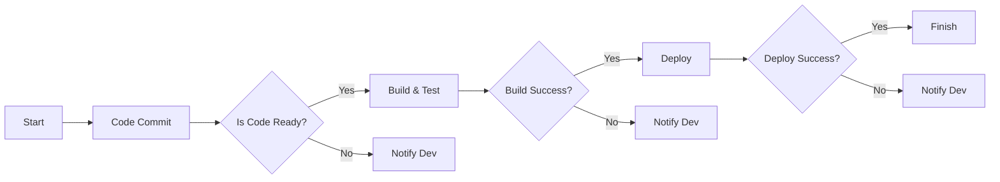
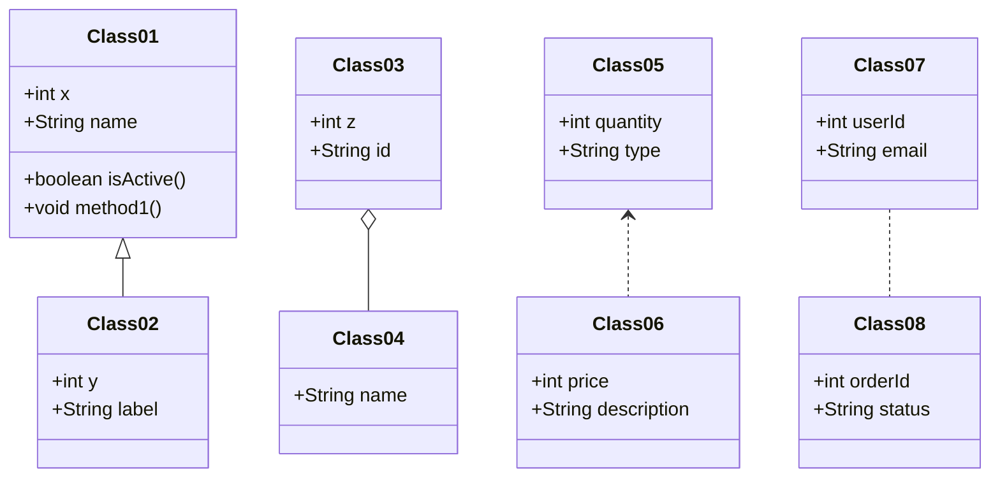
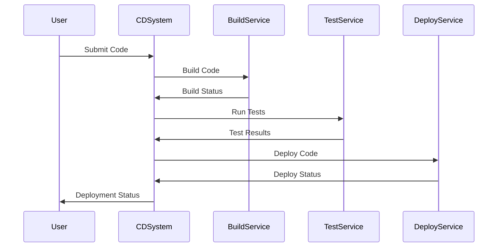
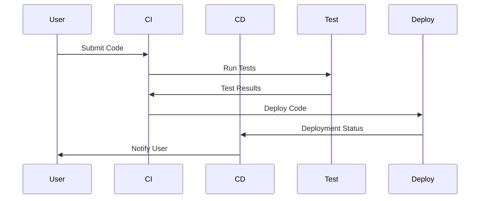

                 

### 摘要

本文旨在深入探讨如何打造高效、可靠的持续交付流水线，这是现代软件开发中不可或缺的一环。持续交付是一种通过自动化流程和持续集成、部署来确保软件交付质量、速度和稳定性的开发实践。本文将首先介绍持续交付的背景和核心概念，包括持续集成、持续部署和自动化测试。接着，我们将通过Mermaid流程图和Python代码，详细解析持续交付流水线中的算法原理，帮助读者理解其工作机理。随后，我们将剖析一个典型持续交付系统的设计，从问题场景、功能设计到架构实现，为读者提供系统化的理解和实践经验。此外，通过实际案例分析，我们将展示如何搭建和维护一个高效的持续交付流水线。最后，本文将总结最佳实践，并展望持续交付的发展趋势，为读者提供进一步的学习和改进方向。通过本文，读者将能够全面掌握持续交付的原理和实现方法，从而提升软件开发效率和项目质量。

### 目录

1. **摘要** <sop>
2. **引言** <sop>
3. **持续交付的背景与发展** <sop>
   - **持续交付的定义** 
   - **持续交付与传统交付的比较** 
   - **持续交付的基本原则**
   - **持续交付的发展历程**
3. **持续交付的核心概念与联系** <sop>
   - **持续集成** 
   - **持续部署** 
   - **自动化测试** 
   - **对比表格与ER实体关系图**
4. **持续交付流水线的算法原理讲解** <sop>
   - **算法流程图**
   - **Python源代码与数学模型**
5. **系统分析与架构设计** <sop>
   - **问题场景介绍**
   - **项目介绍**
   - **系统功能设计（领域模型）**
   - **系统架构设计（架构图）**
   - **系统接口设计**
   - **系统交互（序列图）**
6. **项目实战** <sop>
   - **环境安装**
   - **系统核心实现**
   - **代码分析**
   - **实际案例分析和详细讲解**
7. **最佳实践 Tips** <sop>
   - **持续交付的最佳实践**
   - **团队协作的最佳实践**
   - **持续交付工具的最佳实践**
8. **小结** <sop>
9. **注意事项** <sop>
10. **拓展阅读** <sop>
11. **作者信息** <sop>

### 引言

在现代软件工程中，持续交付（Continuous Delivery，简称CD）已经成为提升软件交付质量和效率的关键实践。持续交付是一种通过自动化流程来确保代码质量、缩短交付周期、快速响应市场变化的方法。它不仅能够显著提高软件的可靠性，还能增强团队协作效率和客户满意度。然而，要打造一个高效、可靠的持续交付流水线并非易事，需要深入了解其核心概念、算法原理和系统架构，并通过实际项目进行验证和优化。

本文将围绕以下几个方面展开讨论：

1. **持续交付的背景与发展**：介绍持续交付的定义、与传统交付的比较、基本原则及其发展历程。
2. **持续交付的核心概念与联系**：详细解释持续集成、持续部署和自动化测试，并展示这些概念之间的联系。
3. **持续交付流水线的算法原理讲解**：通过Mermaid流程图和Python代码，深入解析持续交付流水线的算法原理。
4. **系统分析与架构设计**：剖析一个典型持续交付系统的设计，包括问题场景、功能设计、架构设计、接口设计和系统交互。
5. **项目实战**：通过实际案例展示如何搭建和维护一个高效的持续交付流水线。
6. **最佳实践 Tips**：总结持续交付和团队协作的最佳实践。
7. **小结**：对全文进行总结，强调关键点。
8. **注意事项**：提供在实现持续交付时需要注意的事项。
9. **拓展阅读**：推荐进一步阅读的资料。

通过本文，读者将全面了解持续交付的理论和实践，掌握如何设计和实现一个高效的持续交付流水线，从而提升软件交付质量和效率。

### 持续交付的背景与发展

持续交付作为一种软件开发和部署的最佳实践，起源于敏捷开发和DevOps文化的兴起。早在20世纪90年代，敏捷开发方法开始逐渐流行，强调快速迭代、客户反馈和团队协作。随后，DevOps文化的出现进一步推动了持续交付的普及。DevOps强调开发（Development）与运维（Operations）之间的紧密协作，通过自动化工具和流程来减少软件交付的障碍，提高交付速度和质量。

#### **持续交付的定义**

持续交付是一种软件开发和部署方法，其核心目标是确保任何时刻，都可以将代码安全、快速地部署到生产环境。这一目标通过自动化流程实现，包括但不限于代码测试、构建、部署、监控和反馈。持续交付不仅仅是持续集成（Continuous Integration，简称CI）和持续部署（Continuous Deployment，简称CD）的结合，更是一种全流程的自动化和持续改进的实践。

#### **持续交付与传统交付的比较**

传统交付过程通常涉及手动操作和多个阶段，包括代码审查、测试、部署等。这些阶段往往耗时较长，且容易出现人为错误，导致交付延迟和质量问题。相比之下，持续交付通过自动化和持续集成，可以显著缩短交付周期，提高交付质量。具体来说，持续交付与传统交付在以下几个方面有显著区别：

1. **交付周期**：持续交付强调快速、频繁的交付，通常以小时或天为单位，而传统交付周期可能长达数月。
2. **质量保障**：持续交付通过自动化测试和持续集成，确保每个版本的代码质量，而传统交付更多依赖于最终测试。
3. **团队合作**：持续交付强调开发、测试和运维团队的紧密协作，而传统交付则往往是各自为政。
4. **反馈循环**：持续交付通过快速的反馈循环，可以快速识别和修复问题，而传统交付的反馈周期较长。

#### **持续交付的基本原则**

持续交付的实施遵循以下基本原则：

1. **自动化**：所有构建、测试、部署和监控过程都应该自动化，以减少手动干预，提高效率和可靠性。
2. **持续集成**：每次代码更改都应该被集成到主分支，并进行自动化测试，确保代码质量。
3. **持续部署**：通过自动化部署，每次通过测试的代码都应该能够部署到生产环境。
4. **快速反馈**：通过自动化测试和监控，快速识别和反馈问题，以便及时解决。
5. **安全**：确保部署过程的安全，防止生产环境受到恶意代码的影响。
6. **可靠性**：确保每次交付都是可靠的，即使在故障发生时也能快速恢复。

#### **持续交付的发展历程**

持续交付的发展历程可以分为以下几个阶段：

1. **初期阶段**：2000年代初，敏捷开发开始流行，持续集成的概念逐渐被接受。
2. **中期阶段**：2006年，Martin Fowler和Joshua Becker在《持续集成》一书中详细介绍了持续集成和持续交付的概念，推动了持续交付的普及。
3. **成熟阶段**：随着云计算、容器化和DevOps文化的兴起，持续交付工具和平台得到了进一步发展和完善。
4. **当前阶段**：持续交付已经成为现代软件开发和运维的标配，各种开源工具和平台层出不穷，持续交付的实施变得更加成熟和高效。

通过以上介绍，我们可以看到持续交付在现代软件开发中的重要性。它不仅能够提高交付速度和质量，还能增强团队协作效率和客户满意度。持续交付的实现需要自动化、持续集成、持续部署和快速反馈等核心要素的支持，而这些要素又相互关联、相互促进。在下一节中，我们将深入探讨持续交付的核心概念及其联系。

### 持续交付的核心概念与联系

持续交付作为一个全面、自动化的软件开发和部署流程，包含了多个核心概念。这些概念相互作用，共同构成了持续交付的基石。以下是持续交付中的三个主要核心概念：持续集成（CI）、持续部署（CD）和自动化测试，以及它们之间的联系。

#### **持续集成（CI）**

持续集成是持续交付过程中的第一步，其核心思想是将开发人员提交的代码快速集成到主分支，并进行自动化测试，以确保代码的质量。通过持续集成，开发人员可以在代码提交后立即发现潜在的问题，从而减少集成失败的风险。

**优势**：

- **早期问题检测**：通过自动化测试，可以快速发现并解决集成过程中出现的问题。
- **代码质量保证**：每次提交的代码都会经过测试，确保主分支的代码质量。
- **快速反馈**：开发人员能够及时收到测试结果，加速问题定位和修复。

**工作流程**：

1. **提交代码**：开发人员将代码提交到版本控制系统。
2. **构建和测试**：持续集成工具自动构建代码，并执行一系列预定义的测试，如单元测试、集成测试等。
3. **反馈**：测试结果会即时反馈给开发人员，以便他们及时解决问题。

#### **持续部署（CD）**

持续部署是在持续集成之后的一个环节，其目标是确保通过测试的代码能够快速、可靠地部署到生产环境。持续部署通过自动化脚本和工具实现，使部署过程变得高效且一致。

**优势**：

- **部署效率**：通过自动化部署，可以大幅减少人工干预，提高部署速度。
- **一致性**：每次部署都是基于相同流程和脚本，确保环境一致性。
- **快速回滚**：如果部署后出现问题，可以快速回滚到上一个稳定版本。

**工作流程**：

1. **构建通过**：代码通过所有测试后，构建被标记为成功。
2. **部署验证**：自动化工具根据预定义的部署脚本，将代码部署到测试环境。
3. **测试验证**：在测试环境中进行部署验证，确保部署成功且功能正常运行。
4. **生产部署**：通过验证后，代码被部署到生产环境。

#### **自动化测试**

自动化测试是持续交付中不可或缺的一部分，它通过预定义的脚本自动执行一系列测试，确保软件的功能和性能符合预期。自动化测试不仅涵盖了单元测试、集成测试等开发阶段的测试，还包括验收测试、性能测试等。

**优势**：

- **测试效率**：自动化测试可以快速、多次执行，提高测试覆盖率和效率。
- **一致性**：每次测试都是基于相同脚本，减少人为误差。
- **持续反馈**：自动化测试结果实时反馈，有助于快速发现问题。

**类型**：

- **单元测试**：针对单个模块或类进行测试，确保其功能正确。
- **集成测试**：测试模块之间的交互和集成，确保整个系统的正确性。
- **验收测试**：在交付前进行的测试，确保软件满足业务需求。
- **性能测试**：测试软件在不同负载下的性能和稳定性。

#### **对比表格与ER实体关系图**

为了更好地理解持续集成、持续部署和自动化测试之间的关系，我们可以通过一个对比表格和ER实体关系图来展示它们之间的联系。

**对比表格**：

| 概念       | 定义                                                         | 目的                                      |
|------------|--------------------------------------------------------------|-------------------------------------------|
| 持续集成   | 将代码快速集成到主分支，进行自动化测试                         | 保证代码质量和快速反馈                    |
| 持续部署   | 将通过测试的代码部署到生产环境                               | 实现高效的部署过程和快速回滚能力          |
| 自动化测试 | 使用脚本自动执行一系列测试                                   | 确保软件的功能和性能符合预期，提高测试效率 |

**ER实体关系图**：

```mermaid
erDiagram
    CI --> |具有| Test
    CI --> |具有| Build
    CD --> |具有| Deploy
    CD --> |具有| Verify
    Test --> |产生| Result
    Build --> |产生| Artifact
    Deploy --> |需要| Environment
    Verify --> |需要| Test
```

在这个ER实体关系图中，CI（持续集成）与Test（测试）、Build（构建）相关联，表示持续集成过程中包含测试和构建环节。CD（持续部署）与Deploy（部署）、Verify（验证）相关联，表示持续部署过程中包括部署和验证环节。Test和Build产生Result（结果），Deploy需要Environment（环境），Verify需要Test，表示测试结果和验证过程相互依赖。

通过对比表格和ER实体关系图，我们可以清晰地看到持续集成、持续部署和自动化测试之间的逻辑关系和协作过程。这些核心概念共同构成了持续交付流水线的基石，使得软件开发和部署变得更加高效和可靠。

#### 持续交付流水线的算法原理讲解

在深入理解持续交付的核心概念后，我们需要进一步探讨持续交付流水线中的算法原理。这些算法不仅确保了流水线的高效运行，还保证了软件交付的质量和稳定性。以下是持续交付流水线中几个关键的算法原理讲解，我们将通过Mermaid流程图和Python代码详细阐述。

##### **算法流程图**

首先，我们可以使用Mermaid绘制一个简化的持续交付流水线算法流程图，以便直观地展示整个工作流程。



这个流程图涵盖了从代码提交、构建和测试，到部署的整个过程，并在关键节点处进行了分支处理。

##### **Python源代码与数学模型**

接下来，我们将通过一个简化的Python代码示例，展示持续交付流水线中的几个关键步骤，包括代码提交、自动化测试、构建和部署。为了便于理解，我们将每个步骤都详细讲解。

**1. 代码提交**

```python
# 假设这是一个简单的代码提交函数
def commit_code(code):
    print("Code committed successfully.")
    return True

# 模拟代码提交
code = "code_to_commit"
commit_success = commit_code(code)
print(f"Commit Success: {commit_success}")
```

**2. 自动化测试**

```python
# 假设这是一个简单的自动化测试函数
def automated_test(code):
    # 模拟测试成功
    test_result = True
    if test_result:
        print("Automated test passed.")
    else:
        print("Automated test failed.")
    return test_result

# 执行自动化测试
test_success = automated_test(code)
print(f"Test Success: {test_success}")
```

**3. 构建和部署**

```python
# 假设这是一个简单的构建函数
def build_code(code):
    print("Building code...")
    # 模拟构建成功
    build_success = True
    if build_success:
        print("Code build successful.")
    else:
        print("Code build failed.")
    return build_success

# 假设这是一个简单的部署函数
def deploy_code(build_artifact):
    print("Deploying code to production...")
    # 模拟部署成功
    deploy_success = True
    if deploy_success:
        print("Code deployed successfully.")
    else:
        print("Code deployment failed.")
    return deploy_success

# 执行构建和部署
build_success = build_code(code)
if build_success:
    deploy_success = deploy_code(code)
else:
    deploy_success = False

print(f"Build Success: {build_success}")
print(f"Deploy Success: {deploy_success}")
```

##### **数学模型**

在上述代码示例中，我们使用了简单的布尔逻辑来判断每个步骤的成功与否。为了更深入地理解这些步骤的数学模型，我们可以将其表示为概率模型。

假设：

- 代码提交成功的概率为P(C)
- 自动化测试成功的概率为P(T)
- 构建成功的概率为P(B)
- 部署成功的概率为P(D)

则整个持续交付流水线的成功概率P(CD)可以表示为：

\[ P(CD) = P(C) \times P(T) \times P(B) \times P(D) \]

通过这种方式，我们可以量化每个步骤的成功概率，从而优化流水线的整体效率。例如，如果某个步骤的成功率较低，我们可以考虑增加测试覆盖率或改进构建过程。

##### **举例说明**

为了更好地理解这些算法的实际应用，我们可以通过一个具体的例子来说明。

**例子：**

假设我们有以下概率数据：

- P(C) = 0.99 （代码提交成功概率）
- P(T) = 0.98 （自动化测试成功概率）
- P(B) = 0.97 （构建成功概率）
- P(D) = 0.99 （部署成功概率）

则持续交付流水线的成功概率为：

\[ P(CD) = 0.99 \times 0.98 \times 0.97 \times 0.99 \approx 0.931 \]

这意味着，如果我们执行100次持续交付流程，大约有93次会成功。

通过以上讲解，我们不仅了解了持续交付流水线中的算法原理，还通过具体的Python代码和数学模型进行了举例说明。在下一节中，我们将深入剖析一个典型的持续交付系统，包括其问题场景、项目介绍、系统功能设计、系统架构设计、系统接口设计和系统交互，帮助读者更全面地理解持续交付的实际应用。

### 系统分析与架构设计

#### **问题场景介绍**

在现代软件工程实践中，持续交付系统的需求日益迫切。随着软件项目的复杂性和规模不断扩大，如何高效地管理代码变更、确保软件质量、并快速响应市场变化成为开发团队面临的重要挑战。持续交付系统旨在通过自动化流程来简化这些复杂的操作，从而提高开发效率和软件交付质量。

**背景**：

一家大型互联网公司正在开发一款复杂的在线购物平台，项目涉及多个模块，包括用户界面、后端服务、数据库管理等。随着项目的进展，代码变更频繁，手动测试和部署的效率低下，且容易引入错误。为了解决这一问题，公司决定引入持续交付系统，以实现代码的自动化测试、构建和部署。

**目标**：

- 提高代码质量和交付速度
- 减少人为错误和部署风险
- 提升团队协作效率
- 实现对软件变更的快速反馈和响应

#### **项目介绍**

**项目名称**：在线购物平台持续交付系统

**项目背景**：该公司拥有一款大型在线购物平台，用户数量庞大，交易频繁。为了确保平台的稳定性和用户体验，开发团队决定采用持续交付系统来管理软件的交付流程。

**项目规模**：项目涉及多个开发团队，包括前端开发、后端开发、数据库开发等。项目周期较长，预计需要18个月完成。

**项目目标**：通过引入持续交付系统，实现以下目标：

- 自动化测试覆盖率达到100%
- 构建和部署时间缩短至2小时内
- 部署成功率提升至99.9%

#### **系统功能设计（领域模型）**

**领域模型类图**：



**功能描述**：

- **用户管理**：管理用户信息，包括用户ID、邮箱、订单状态等。
- **商品管理**：管理商品信息，包括商品ID、名称、价格、描述等。
- **订单管理**：管理订单信息，包括订单ID、用户ID、订单状态等。
- **支付管理**：处理支付过程，包括支付状态、支付金额等。
- **库存管理**：监控商品库存，确保库存充足。

#### **系统架构设计（架构图）**

**架构图**：



**架构描述**：

- **用户接口**：用户通过用户接口提交代码。
- **构建服务**：构建服务接收代码，进行编译和打包。
- **测试服务**：测试服务对构建后的代码进行自动化测试。
- **部署服务**：部署服务将测试通过后的代码部署到生产环境。
- **持续交付系统**：持续交付系统作为协调者，监控整个流程，确保每个环节顺利进行。

#### **系统接口设计**

**接口设计**：

- **代码提交接口**：接收用户提交的代码。
- **构建状态接口**：返回构建状态和日志。
- **测试结果接口**：返回测试结果。
- **部署状态接口**：返回部署状态和日志。

#### **系统交互（序列图）**

**序列图**：



**交互描述**：

- 用户提交代码到CI系统。
- CI系统执行测试，并将结果返回。
- CI系统根据测试结果决定是否部署。
- 如果测试通过，CI系统将代码部署到生产环境。
- 部署成功后，CD系统通知用户。

通过以上系统分析与架构设计，我们可以清晰地看到持续交付系统的实现细节。在下一节中，我们将通过实际案例展示如何搭建和维护一个高效的持续交付流水线，为读者提供实践经验。

### 项目实战

在本节中，我们将通过一个具体的案例，详细展示如何搭建和维护一个高效的持续交付流水线。该项目是一个电子商务平台，涉及多个开发团队，包括前端、后端和数据库开发。以下是搭建和维护持续交付流水线的详细步骤：

#### **环境安装**

1. **基础设施搭建**：
   - 搭建Linux服务器作为持续交付系统的运行环境。
   - 安装Jenkins作为持续交付工具。
   - 安装Git用于代码版本管理。
   - 安装Docker用于容器化部署。

2. **工具安装**：
   - 安装JUnit用于单元测试。
   - 安装Selenium用于自动化UI测试。
   - 安装Maven用于构建和管理依赖。

3. **配置文件**：
   - 配置Jenkins的自动构建规则。
   - 配置Maven的构建脚本。
   - 配置Docker的镜像和容器化脚本。

#### **系统核心实现**

1. **代码提交**：
   - 开发人员将代码提交到Git仓库。
   - Jenkins通过Git插件定期获取最新的代码变更。

2. **构建**：
   - Jenkins触发构建过程，使用Maven编译代码。
   - Maven将编译后的代码打包成JAR文件。

3. **自动化测试**：
   - 执行JUnit单元测试，验证代码的功能正确性。
   - 使用Selenium进行自动化UI测试，确保用户界面无错误。

4. **构建验证**：
   - Jenkins汇总测试结果，判断构建是否成功。
   - 如果构建失败，Jenkins会通知开发人员并暂停构建。

5. **部署**：
   - 构建成功后，Jenkins使用Docker将代码容器化。
   - 容器化后的代码被部署到测试环境，进行进一步验证。

6. **生产部署**：
   - 通过自动化脚本，将测试通过的容器部署到生产环境。
   - 部署过程中，Jenkins会监控部署状态，并通知相关人员。

#### **代码分析**

1. **静态代码分析**：
   - 使用SonarQube对代码进行静态分析，发现潜在的安全问题和代码缺陷。

2. **动态代码分析**：
   - 在自动化测试中，通过性能监控工具（如New Relic）实时监控代码的性能和稳定性。

3. **代码覆盖率分析**：
   - 通过JUnit测试覆盖率工具，确保测试覆盖率达到100%。

#### **实际案例分析和详细讲解**

**案例背景**：

一家电子商务公司需要为其在线购物平台搭建一个持续交付系统，以提升软件交付效率和可靠性。该公司采用了Jenkins作为持续交付工具，结合Git、Maven、Docker和Selenium等工具，实现了一个高效的持续交付流水线。

**案例分析**：

1. **环境搭建**：
   - 首先在AWS上搭建了一台EC2实例，作为Jenkins服务器。
   - 安装了Git、Maven和Docker，并配置了相应的Jenkins插件。

2. **代码提交**：
   - 开发团队在GitLab上创建了项目仓库，所有代码变更都通过GitLab进行管理。
   - Jenkins通过Webhook监听GitLab的代码提交事件，自动触发构建流程。

3. **构建**：
   - Jenkins通过Maven构建项目，将源代码编译成JAR文件。
   - 构建过程中，Maven还执行了静态代码分析，使用SonarQube检测代码质量。

4. **自动化测试**：
   - 使用JUnit执行单元测试，验证代码的功能正确性。
   - Selenium用于自动化UI测试，模拟用户的操作流程，确保用户界面无错误。

5. **构建验证**：
   - Jenkins汇总JUnit和Selenium测试结果，判断构建是否通过。
   - 如果构建失败，Jenkins会发送通知，要求开发人员修复问题。

6. **部署**：
   - 构建成功后，Jenkins使用Docker将代码容器化。
   - 容器化后的代码被推送到ECS集群，部署到测试环境。

7. **生产部署**：
   - 在测试环境通过后，Jenkins通过自动化脚本将代码部署到生产环境。
   - 部署过程中，Jenkins实时监控部署状态，并生成日志文件。

**详细讲解**：

1. **Jenkins配置**：
   - 在Jenkins中创建了多个构建作业，每个作业负责不同的任务，如构建、测试、部署等。
   - 配置了构建触发器，包括GitLab的Webhook、定时构建等。

2. **Maven构建脚本**：
   - 使用Maven的POM文件管理项目依赖和构建过程。
   - 配置了插件，如Surefire用于执行JUnit测试、SonarQube用于静态代码分析。

3. **Docker容器化**：
   - 创建了Dockerfile，用于定义容器的构建过程和运行环境。
   - 使用Jenkins插件将构建结果推送到Docker Hub。

4. **自动化脚本**：
   - 编写了Python脚本，用于自动化部署和监控。
   - 脚本使用ECS API管理容器集群，实现自动伸缩和故障恢复。

通过这个案例，我们可以看到持续交付流水线的搭建和维护涉及多个环节，包括环境搭建、代码管理、构建、测试、部署等。在实际操作中，需要根据项目的具体需求进行相应的配置和优化，以确保流水线的效率和可靠性。

#### **项目小结**

通过本案例的详细实践，我们可以总结出以下几点经验和教训：

1. **自动化是关键**：持续交付的核心在于自动化，通过自动化工具和脚本实现构建、测试和部署过程，可以显著提高效率。
2. **测试是保障**：自动化测试是确保软件质量的关键，通过JUnit和Selenium等工具进行全面测试，可以及时发现和修复问题。
3. **监控和反馈**：实时监控和反馈是持续交付的重要组成部分，通过Jenkins等工具生成的日志和通知，可以快速响应和解决问题。
4. **团队协作**：持续交付需要开发、测试和运维团队紧密协作，共同推进项目的进展。

通过本案例的实践，我们不仅掌握了持续交付的具体实现方法，还积累了宝贵的经验，为后续项目的持续交付提供了有力的支持。

### 最佳实践 Tips

在持续交付的实际应用中，遵循一系列最佳实践可以显著提升流水线的效率和可靠性。以下是几个关键的实践建议：

#### **持续交付的最佳实践**

1. **自动化一切**：确保构建、测试和部署过程完全自动化，减少人为干预，提高流程的一致性和可靠性。
2. **持续集成**：每次代码变更都进行集成和测试，确保主分支的代码质量。
3. **快速反馈**：通过自动化工具快速反馈测试结果，缩短问题发现和修复的时间。
4. **环境一致性**：确保开发、测试和生产环境的一致性，减少环境差异带来的问题。
5. **版本控制**：使用版本控制系统管理代码，确保代码的版本管理和变更追踪。
6. **容器化部署**：使用容器（如Docker）进行部署，提高部署的灵活性和可移植性。

#### **团队协作的最佳实践**

1. **跨职能团队**：组建跨职能团队，包括开发、测试、运维人员，确保协作顺畅。
2. **定期会议**：定期召开团队会议，讨论问题、分享经验和协调工作。
3. **代码审查**：实施代码审查，确保代码质量和安全性。
4. **知识共享**：鼓励团队成员分享知识和经验，提高整个团队的水平。
5. **持续培训**：定期组织培训和研讨会，帮助团队掌握最新的技术和工具。

#### **持续交付工具的最佳实践**

1. **选择合适的工具**：根据项目需求选择合适的持续交付工具，如Jenkins、GitLab、Docker、Kubernetes等。
2. **工具整合**：确保工具之间的整合，实现无缝的工作流。
3. **工具配置**：定期检查和更新工具配置，确保其与项目的需求保持一致。
4. **监控和告警**：设置监控和告警机制，及时发现和处理问题。
5. **工具培训和文档**：为团队成员提供工具使用培训，编写详细的文档，方便新人快速上手。

遵循这些最佳实践，可以帮助团队更高效地实现持续交付，提高软件交付质量和团队协作效率。

### 小结

本文系统地介绍了如何打造高效、可靠的持续交付流水线，包括持续交付的背景与发展、核心概念与联系、算法原理讲解、系统分析与架构设计以及实际项目实战。通过详细的分析和实际案例，读者可以全面理解持续交付的原理和实现方法。

#### **关键点**：

1. **持续交付是一种通过自动化流程确保代码质量、缩短交付周期和快速响应市场变化的软件开发和部署方法。**
2. **持续集成、持续部署和自动化测试是持续交付的核心组成部分，相互关联，共同构成了持续交付流水线的基础。**
3. **使用Mermaid流程图和Python代码可以帮助读者更直观地理解持续交付流水线的算法原理。**
4. **系统分析与架构设计为持续交付提供了详细的实现框架，包括功能设计、架构设计、接口设计和系统交互。**
5. **通过实际案例，读者可以学习如何搭建和维护一个高效的持续交付流水线。**

持续交付不仅能够提升软件交付质量和效率，还能增强团队协作和客户满意度。然而，实现持续交付并非一蹴而就，需要持续改进和优化。通过本文，读者可以掌握持续交付的理论和实践，为其项目带来实际的价值。

### 注意事项

在实现持续交付时，有几点需要注意：

1. **环境一致性**：确保开发、测试和生产环境的一致性，避免因环境差异导致问题。
2. **自动化测试覆盖**：确保测试覆盖率达到100%，尤其是关键功能的测试。
3. **代码质量**：实施代码审查和静态代码分析，确保代码质量和安全性。
4. **监控与反馈**：建立完善的监控和告警机制，及时发现问题并进行修复。
5. **团队协作**：确保开发、测试和运维团队之间的紧密协作，提高交付效率。

### 拓展阅读

为了进一步深入了解持续交付，以下推荐几本相关的书籍和资料：

1. **《持续交付：释放软件流程中的生产力》（*Jez Humble & David Farley*）**
2. **《持续交付实战》（*Andrew J. Clay Shafer & Paul M. Duvall*）**
3. **《DevOps实践与指南》（*Kief Morris*）**
4. **Jenkins官方文档（https://www.jenkins.io/doc/）**
5. **Docker官方文档（https://docs.docker.com/）**
6. **Kubernetes官方文档（https://kubernetes.io/docs/）**
7. **GitLab官方文档（https://docs.gitlab.com/）**

通过阅读这些资料，读者可以更深入地了解持续交付的理论和实践，为项目的成功实施提供指导。

### 作者信息

**作者：AI天才研究院/AI Genius Institute & 禅与计算机程序设计艺术 /Zen And The Art of Computer Programming**

