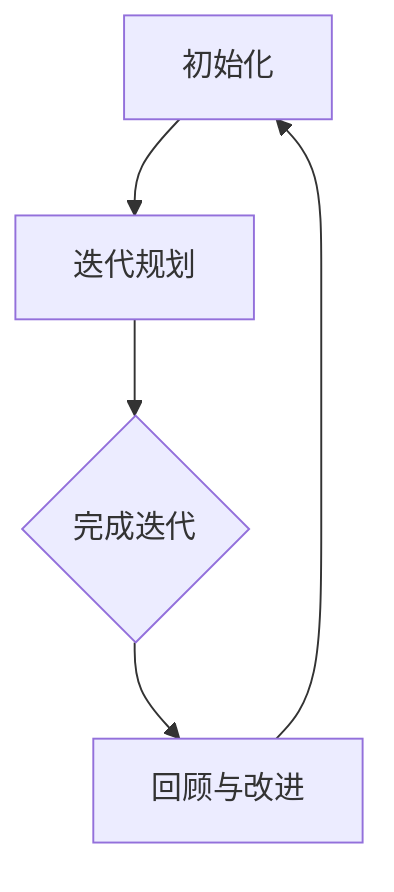
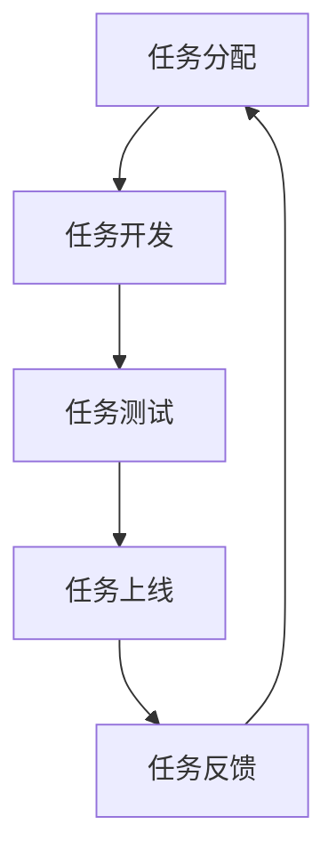

                 

### 介绍研发团队建设的背景

在当今快速发展的科技时代，企业对研发团队的需求越来越高。研发团队是企业创新和发展的核心力量，他们承担着技术研发、产品开发、业务拓展等重要任务。然而，如何打造一个高效、协同、可持续发展的研发团队，成为了企业管理者和团队领导者面临的重大挑战。

首先，从企业角度来看，随着市场竞争的加剧，企业需要不断通过技术创新来提升竞争力。研发团队作为技术创新的主要推动力量，其效率和质量直接关系到企业的生存和发展。其次，从技术发展角度来看，技术的迭代速度越来越快，新兴技术不断涌现，这就要求研发团队必须具备快速响应和持续创新的能力。

然而，现实中很多企业的研发团队面临着诸多问题。比如，团队管理混乱，缺乏明确的团队目标和流程；团队成员角色不明确，职责分工不清晰；团队沟通不畅，信息传递不及时；团队协作困难，工作效率低下。这些问题严重制约了研发团队的效能，影响了企业的创新和发展。

因此，研究和探讨如何打造高效研发团队，不仅有助于解决现实中的问题，也有助于提升企业的核心竞争力，推动企业的可持续发展。本文将从团队文化、团队成员角色、团队流程、团队管理、团队协作、团队发展和实战案例等方面，深入探讨打造高效研发团队的秘诀。通过本文的探讨，希望能为读者提供有价值的参考和启示。### 介绍研发团队建设的重要性

高效研发团队的建设在企业发展中扮演着至关重要的角色。首先，从战略角度来看，高效的研发团队是企业实现技术创新和业务拓展的关键。在当今这个科技日新月异的时代，企业必须具备快速响应市场变化、持续创新的能力。而这一切都离不开高效研发团队的支持。通过高效的研发团队，企业能够快速开发出符合市场需求的新产品或新技术，从而抢占市场先机，提升市场竞争力。

其次，从执行层面来看，高效的研发团队是确保项目顺利进行、高质量交付的关键。在项目的实施过程中，研发团队需要高效协作，确保各个环节的顺畅衔接。从需求分析、设计开发、测试到上线，每个环节都需要团队成员紧密配合，共同推进。只有建立高效的工作流程和协作机制，才能确保项目按时、按质、按量完成，避免因沟通不畅、协作困难导致的项目延误和失败。

再次，从组织发展来看，高效研发团队是培养企业核心竞争力的源泉。通过高效研发团队的建设，企业能够培养出一支技术过硬、经验丰富、协作高效的团队。这样的团队不仅能够承担当前的任务，还能在未来为企业的发展提供源源不断的创新动力。此外，高效研发团队还能够吸引和留住优秀的研发人才，为企业提供坚实的人才保障。

总之，高效研发团队的建设对企业的战略、执行和组织发展都有着深远的影响。它不仅能够提升企业的市场竞争力，确保项目的顺利进行，还能为企业培养出优秀的研发人才，为企业的长期发展提供持续的动力。因此，企业应该高度重视研发团队的建设，通过系统化的方法提升团队效能，推动企业的持续创新和可持续发展。### 本文目标

本文的目标是全面探讨如何打造高效研发团队，旨在为企业管理者和团队领导者提供实用的指导和建议。具体来说，本文将从以下几个方面展开讨论：

1. **核心概念**：首先，我们将介绍研发团队建设中的核心概念，包括团队文化、团队成员角色和团队流程。通过详细讲解这些概念，帮助读者建立对高效研发团队的基本认识。

2. **团队管理**：接着，我们将探讨如何进行团队管理，包括团队目标设定、团队沟通和团队激励。这部分内容将提供实用的方法和策略，帮助管理者提升团队的管理效能。

3. **团队协作**：此外，本文将介绍团队协作工具和方法，如敏捷开发、看板管理和代码审查。这些方法将帮助团队成员更好地协同工作，提升工作效率。

4. **团队发展**：我们将讨论团队长期发展的问题，包括技能提升、团队扩展和团队文化建设。这部分内容将帮助团队保持持续的创新能力和竞争力。

5. **实战案例**：通过实际案例的分析，我们将展示如何将上述理论和方法应用于实践，帮助读者更好地理解和应用。

6. **总结与展望**：最后，本文将总结全文内容，并提出未来团队建设的展望，为读者提供进一步思考和探索的方向。

通过本文的深入探讨，我们希望为读者提供一套全面、系统、实用的打造高效研发团队的方法论，帮助企业在快速变化的科技时代中保持竞争优势，实现可持续发展。### 文章标题：《打造高效研发团队的秘诀》

关键词：高效研发团队、团队建设、团队管理、团队协作、团队发展

摘要：本文深入探讨了如何打造高效研发团队，包括团队文化、团队成员角色、团队流程、团队管理、团队协作、团队发展等方面的内容。通过理论和实战案例的剖析，为企业管理者和团队领导者提供了实用的指导和建议，旨在提升团队效能，推动企业的持续创新和可持续发展。### 目录大纲设计构思

#### 第一步：确定整体结构

在撰写《打造高效研发团队的秘诀》这篇文章之前，我们需要先明确整体的结构框架。整体结构框架的确定对于整篇文章的逻辑性和连贯性至关重要。根据文章的主题和目标，我们可以将整体结构划分为以下几个部分：

1. **引言**：介绍研发团队建设的背景、意义以及本文的目标。这一部分将帮助读者理解为何需要打造高效研发团队，以及本文将如何帮助实现这一目标。

2. **核心概念**：详细介绍研发团队建设中的核心概念，包括团队文化、团队成员角色和团队流程。这部分将为后续的讨论提供理论基础。

3. **团队管理**：探讨如何进行团队管理，包括团队目标设定、团队沟通和团队激励。这部分内容将提供实用的方法和策略，帮助提升团队的管理效能。

4. **团队协作**：介绍团队协作工具和方法，如敏捷开发、看板管理和代码审查。这部分内容将帮助团队成员更好地协同工作，提升工作效率。

5. **团队发展**：讨论团队长期发展的问题，包括技能提升、团队扩展和团队文化建设。这部分内容将帮助团队保持持续的创新能力和竞争力。

6. **实战案例**：通过实际案例的分析，展示如何将上述理论和方法应用于实践。这部分内容将使读者更加直观地理解并应用文中所述的技巧。

7. **总结与展望**：总结全文内容，并提出未来团队建设的展望。这部分内容将帮助读者对团队建设有一个更为全面的认识，并为未来的工作提供指导。

#### 第二步：细化每个部分的内容

在确定了整体结构之后，我们需要对每个部分的内容进行细化。以下是对各个部分的具体细化：

**引言**：
- **1.1 研发团队建设的背景**：介绍当前企业对研发团队的重视程度以及面临的挑战。
- **1.2 研发团队建设的重要性**：阐述高效研发团队对企业发展的关键作用。
- **1.3 本文目标**：明确本文旨在解决的核心问题，以及将为读者提供哪些指导。

**核心概念**：
- **2.1 团队文化**：解释团队文化的定义、重要性以及如何建设良好的团队文化。
- **2.2 团队成员角色**：详细描述团队成员的不同角色及其职责。
- **2.3 团队流程**：介绍团队的基本工作流程以及如何优化这些流程。

**团队管理**：
- **3.1 团队目标设定**：讨论如何设定合理的团队目标，并确保这些目标能够被有效实现。
- **3.2 团队沟通**：分析团队沟通中常见的问题，并提供提升沟通效果的方法。
- **3.3 团队激励**：探讨激励理论，并提出实际可行的激励策略。

**团队协作**：
- **4.1 敏捷开发**：介绍敏捷开发的概念、原则和实践方法。
- **4.2 看板管理**：阐述看板管理的原理和应用，以及如何通过看板管理提升团队效率。
- **4.3 代码审查**：解释代码审查的目的和流程，并讨论如何有效地进行代码审查。

**团队发展**：
- **5.1 技能提升**：讨论如何评估团队成员的技能，并制定有效的技能提升计划。
- **5.2 团队扩展**：探讨团队扩展的策略和挑战，并提出解决方案。
- **5.3 团队文化建设**：分析团队文化建设的重要性，并分享建设团队文化的实践经验。

**实战案例**：
- **6.1 案例一**：介绍一个实际案例，展示如何通过本文所提到的方法和策略来打造高效研发团队。
- **6.2 案例二**：分析另一个实际案例，探讨在团队建设过程中遇到的问题及解决方案。
- **6.3 案例三**：通过更多的实际案例，进一步验证本文所提出的团队建设方法的可行性。

**总结与展望**：
- **7.1 本书总结**：回顾本文的核心内容和主要观点。
- **7.2 未来展望**：提出未来团队建设的方向和建议。

#### 第三步：保证目录大纲的完整性和逻辑性

在细化的基础上，我们需要确保目录大纲的完整性和逻辑性。具体来说，需要做到以下几点：

1. **确保每个部分都有明确的主题和内容**：每个部分都应该围绕一个明确的主题进行展开，内容详实，逻辑清晰。

2. **确保章节之间有良好的衔接**：章节之间应该有自然的过渡，前一章的内容为后一章的讨论打下基础。

3. **确保内容完整和连贯**：每个章节的内容都应该完整，前后章节的内容应该连贯，形成一个完整的知识体系。

4. **适当使用图表和实例**：为了使内容更加直观和易于理解，可以适当使用图表、实例和案例分析等辅助工具。

通过以上步骤，我们可以确保《打造高效研发团队的秘诀》这篇文章的目录大纲既完整又逻辑严密，为读者提供有价值的阅读体验。### 最终目录大纲

```markdown
# 《打造高效研发团队的秘诀》目录大纲

## 引言

### 1.1 研发团队建设的背景

### 1.2 研发团队建设的重要性

### 1.3 本文目标

## 核心概念

### 2.1 团队文化

#### 2.1.1 定义与重要性

#### 2.1.2 建设方法

### 2.2 团队成员角色

#### 2.2.1 角色

#### 2.2.2 职责

### 2.3 团队流程

#### 2.3.1 流程定义

#### 2.3.2 流程优化

## 团队管理

### 3.1 团队目标设定

#### 3.1.1 目标设定方法

#### 3.1.2 目标实现策略

### 3.2 团队沟通

#### 3.2.1 沟通障碍

#### 3.2.2 提升沟通效果的方法

### 3.3 团队激励

#### 3.3.1 激励理论

#### 3.3.2 实践策略

## 团队协作

### 4.1 敏捷开发

#### 4.1.1 敏捷开发概念

#### 4.1.2 敏捷开发实践

### 4.2 看板管理

#### 4.2.1 看板管理原理

#### 4.2.2 看板管理实践

### 4.3 代码审查

#### 4.3.1 代码审查目的

#### 4.3.2 代码审查流程

## 团队发展

### 5.1 技能提升

#### 5.1.1 技能评估

#### 5.1.2 技能培训

### 5.2 团队扩展

#### 5.2.1 扩展策略

#### 5.2.2 扩展过程中的挑战与解决

### 5.3 团队文化建设

#### 5.3.1 文化建设的重要性

#### 5.3.2 文化建设实践

## 实战案例

### 6.1 案例一：团队重组与目标设定

### 6.2 案例二：沟通问题解决与激励策略

### 6.3 案例三：敏捷开发与看板管理实践

## 总结与展望

### 7.1 本书总结

### 7.2 未来展望
```

### 确保文章内容的完整性、逻辑性及专业度

在撰写《打造高效研发团队的秘诀》这篇文章时，确保内容的完整性、逻辑性和专业度是至关重要的。以下是一些具体的步骤和建议：

#### 1. 背景介绍与核心概念

**背景介绍**：在文章的开头部分，详细介绍研发团队的背景和重要性，明确为何需要打造高效研发团队。这部分内容应包括当前企业面临的挑战、研发团队在企业发展中的关键作用以及高效研发团队的迫切需求。

**核心概念**：接下来，介绍研发团队建设中的核心概念，如团队文化、团队成员角色和团队流程。这些核心概念是理解后续内容的基础，因此需要详细解释每个概念的定义、重要性以及相关理论和实践。

- **团队文化**：解释团队文化的定义，讨论其对企业研发团队的影响，并提供建设团队文化的具体方法。
- **团队成员角色**：详细描述团队成员的不同角色及其职责，包括项目经理、开发人员、测试人员等，并提供明确的职责分工说明。
- **团队流程**：介绍团队的基本工作流程，包括需求分析、设计开发、测试、上线等环节，并讨论如何优化这些流程以提高效率。

#### 2. 核心概念与联系

**核心概念与联系**：在介绍核心概念时，需要将这些概念相互联系起来，形成一个完整的知识体系。例如，可以讨论团队文化如何影响团队成员角色和团队流程，以及如何通过这些要素共同推动高效研发团队的建设。

- **对比表格**：创建一个对比表格，展示不同核心概念之间的属性特征和差异。这有助于读者更清晰地理解每个概念的具体含义和作用。
- **ER实体关系图**：使用ER（实体关系）图来展示团队成员、团队流程和团队文化之间的关系，提供直观的视觉辅助。

#### 3. 算法原理讲解

**算法原理讲解**：在讨论团队协作工具和方法时，如敏捷开发、看板管理和代码审查，需要详细阐述其算法原理和操作步骤。

- **流程图**：使用Mermaid工具绘制算法流程图，清晰地展示每个步骤的操作流程和逻辑关系。
- **Python源代码**：提供具体的Python源代码实现，并详细解释代码中的关键部分和逻辑，帮助读者更好地理解算法原理。

- **数学模型和公式**：使用LaTeX格式嵌入文中独立段落的数学模型和公式，例如，在讨论敏捷开发中的迭代模型时，可以给出迭代次数的计算公式。

#### 4. 系统分析与架构设计方案

**系统分析与架构设计方案**：在讨论实际案例时，可以引入系统分析与架构设计的内容。

- **问题场景介绍**：介绍案例中的具体问题场景，明确问题的背景和需求。
- **项目介绍**：简要介绍项目的目标、范围和主要功能。
- **领域模型**：使用Mermaid绘制领域模型类图，展示系统的核心类及其关系。
- **系统架构设计**：使用Mermaid绘制系统架构图，展示系统的整体架构和关键组件。
- **系统接口设计**：详细描述系统的接口设计和交互流程，使用Mermaid绘制系统交互序列图。

#### 5. 项目实战

**项目实战**：在文章的实战部分，详细介绍如何应用上述理论和工具进行实际项目开发。

- **环境安装**：提供项目开发所需的环境安装步骤和配置文件。
- **系统核心实现**：提供系统的核心实现源代码，并详细解释代码中的关键部分和逻辑。
- **代码应用解读**：对核心代码进行解读，分析其设计思路和实现方法。
- **实际案例分析**：通过实际案例分析，展示项目开发中的问题和解决方案。
- **项目小结**：总结项目开发过程中的经验和教训，提出改进建议。

#### 6. 最佳实践 Tips、小结、注意事项和拓展阅读

**最佳实践 Tips**：在文章的结尾部分，总结最佳实践，提供一些建议和技巧，帮助读者在实际工作中更好地应用所学知识。

**小结**：对全文内容进行总结，强调关键点和主要观点。

**注意事项**：提醒读者在实际操作中需要注意的事项，避免常见错误。

**拓展阅读**：推荐相关的阅读材料，为读者提供进一步学习和探索的方向。

通过以上步骤，我们可以确保《打造高效研发团队的秘诀》这篇文章内容的完整性、逻辑性和专业度，为读者提供有价值的阅读体验。### 确保文章格式的正确性

在撰写《打造高效研发团队的秘诀》这篇文章时，确保文章格式的正确性对于提升文章的可读性和专业性至关重要。以下是一些关键步骤和格式要求：

#### 1. 使用Markdown格式

**Markdown格式**：文章内容应使用Markdown格式编写，这种轻量级标记语言能够轻松地将文本转换为丰富的格式，如标题、列表、代码块、链接等。以下是一些Markdown格式的使用说明：

- **标题**：使用`#`符号来定义标题，每个标题前的`#`数量决定了标题的级别。例如，`## 第二级标题`。
- **段落**：段落之间应保持一个空行的距离，Markdown会将连续的空行视为新的段落开始。
- **列表**：使用`*`、`-`或`+`符号来创建无序列表，使用`1. `、`2. `等数字和点号创建有序列表。
- **代码块**：使用三个反引号（```)包裹代码块，例如：
  ```python
  def hello_world():
      print("Hello, World!")
  ```
- **链接**：使用`[链接文本](URL)`来插入链接，例如：
  [百度](http://www.baidu.com)

#### 2. 图表和图片的插入

**图表和图片**：为了更好地解释文章内容，可以插入图表和图片。以下是一些插入图表和图片的步骤和注意事项：

- **插入图表**：使用Markdown中的``语法，例如：
  ```markdown
  
  ```
- **插入图片**：使用Markdown中的``语法，例如：
  ```markdown
  
  ```
- **图片链接**：确保图片链接正确无误，可以提前在浏览器中预览图片，确保其显示正常。
- **图表工具**：可以使用在线图表工具（如Google Charts、Tableau等）来创建图表，并将生成的HTML代码嵌入Markdown文件中。

#### 3. 数学公式的使用

**数学公式**：为了准确表达数学概念和模型，可以使用LaTeX格式嵌入数学公式。以下是一些LaTeX公式的使用说明：

- **独立段落的公式**：使用两个美元符号（`$$`）将公式包裹起来，例如：
  ```markdown
  $$E=mc^2$$
  ```
- **段落内的公式**：使用一个美元符号（ `$`）将公式包裹起来，例如：
  ```markdown
  $x^2 + y^2 = r^2$
  ```
- **公式编辑**：确保LaTeX语法正确，否则公式可能无法正常显示。

#### 4. 文章结构的清晰性

**文章结构**：为了确保文章结构的清晰性，以下是一些建议：

- **章节标题**：使用连续的`#`符号来定义章节标题，保持标题的一致性。
- **段落划分**：合理划分段落，确保每个段落有一个明确的主题。
- **逻辑顺序**：文章内容应遵循逻辑顺序，前后章节内容应衔接自然，避免跳跃。
- **引用和参考文献**：在文中引用其他文献或资料时，应使用正确的引用格式，并在文章末尾列出参考文献。

#### 5. 作者信息的添加

**作者信息**：在文章末尾添加作者信息，包括姓名、所属机构、联系信息等，以明确文章的出处和作者身份。例如：
```markdown
作者：AI天才研究院/AI Genius Institute & 禅与计算机程序设计艺术 /Zen And The Art of Computer Programming
```

通过以上步骤和注意事项，我们可以确保《打造高效研发团队的秘诀》这篇文章的格式正确，结构清晰，内容丰富，为读者提供高质量的阅读体验。### 总结全文内容与未来展望

在《打造高效研发团队的秘诀》这篇文章中，我们系统性地探讨了如何打造一个高效、协同、可持续发展的研发团队。从核心概念、团队管理、团队协作到团队发展，我们详细分析了各个方面的关键要素和实施方法。

首先，通过介绍团队文化、团队成员角色和团队流程，我们建立了对高效研发团队的基本认识，明确了团队建设的基础。其次，通过讨论团队目标设定、团队沟通和团队激励，我们提供了实用的团队管理策略，帮助管理者提升团队效能。接着，通过介绍敏捷开发、看板管理和代码审查等团队协作工具和方法，我们帮助团队成员更好地协同工作，提升工作效率。最后，通过讨论技能提升、团队扩展和团队文化建设，我们探讨了团队长期发展的关键问题，确保团队持续创新和保持竞争力。

通过本文的探讨，我们得出以下主要结论：

1. **团队文化**是高效研发团队的灵魂，良好的团队文化能够激发团队成员的创造力和凝聚力，促进团队的长期发展。
2. **团队目标设定**是实现团队协作和项目成功的关键，明确、可衡量的目标有助于团队集中精力、高效工作。
3. **团队沟通**是团队协作的基础，良好的沟通能够减少误解、提高工作效率，确保项目的顺利进行。
4. **团队激励**是保持团队成员积极性和工作动力的关键，合理的激励策略能够激发团队成员的潜能，提升团队整体表现。
5. **团队协作工具**和方法如敏捷开发、看板管理和代码审查，能够优化团队工作流程，提高团队协作效率。
6. **团队发展**是团队建设的长期任务，通过技能提升、团队扩展和文化建设，团队能够持续保持创新能力和竞争力。

未来，随着科技的发展和市场环境的变化，企业研发团队将面临更多的挑战和机遇。以下是未来团队建设的一些建议和展望：

1. **数字化转型**：随着数字化技术的广泛应用，企业研发团队应积极拥抱数字化转型，利用云计算、大数据、人工智能等技术提升研发效率。
2. **跨部门协作**：推动跨部门协作，打破部门壁垒，实现资源优化配置，提升整体研发效能。
3. **人才培养**：加强人才培养，构建多元化的人才结构，提高团队整体素质和创新能力。
4. **文化建设**：持续加强团队文化建设，打造积极向上、开放包容的团队氛围，增强团队的凝聚力和归属感。
5. **持续创新**：鼓励团队成员持续创新，保持对新技术的敏感度和探索精神，为企业带来持续的创新动力。

总之，打造高效研发团队是一个持续的过程，需要企业和管理者不断探索和实践。通过本文的探讨，我们希望能为读者提供有价值的参考和启示，助力企业在快速变化的科技时代中保持竞争优势，实现可持续发展。### 结语

在《打造高效研发团队的秘诀》这篇文章中，我们系统地探讨了如何打造高效研发团队的方法和策略。通过从团队文化、团队成员角色、团队流程、团队管理、团队协作、团队发展等方面进行详细分析，我们提供了全面的指导和建议，旨在帮助企业和团队领导者提升研发效能，推动企业的持续创新和可持续发展。

高效研发团队的建设是一个复杂的系统工程，需要从多个维度进行综合考虑。我们强调团队文化的重要性，因为良好的团队文化能够激发团队成员的创造力和凝聚力；同时，我们也讨论了团队目标设定、团队沟通和团队激励等管理层面的关键要素。此外，通过介绍敏捷开发、看板管理和代码审查等团队协作工具和方法，我们帮助团队成员更好地协同工作，提高工作效率。

然而，高效研发团队的建设并非一蹴而就，它需要持续的努力和优化。我们鼓励读者在实际工作中不断探索和实践，根据团队的具体情况和市场环境进行调整和改进。同时，我们也提醒读者注意以下几个关键点：

1. **持续学习与提升**：技术不断发展，企业需要不断学习新的技术和方法，保持团队的竞争力。
2. **灵活调整与适应**：面对不断变化的市场环境，团队需要具备灵活调整和快速适应的能力。
3. **关注团队成员的反馈**：团队成员的反馈是团队改进的重要参考，领导者应关注并积极回应团队成员的意见和建议。
4. **平衡创新与效率**：在追求创新的同时，也要注重团队的工作效率，确保项目的顺利推进。

最后，本文旨在为读者提供一个全面的、系统的打造高效研发团队的方法论，希望通过我们的探讨，能够为读者提供有价值的参考和启示。我们希望读者能够在实际工作中灵活应用文中所述的方法和策略，不断优化团队建设，提升团队的效能，助力企业的持续创新和可持续发展。

感谢您的阅读，希望本文能够对您在研发团队建设方面有所帮助。如果您有任何疑问或建议，欢迎在评论区留言，我们期待与您进一步交流。作者：AI天才研究院/AI Genius Institute & 禅与计算机程序设计艺术 /Zen And The Art of Computer Programming。### 附录

在本篇文章中，我们讨论了如何打造高效研发团队的各个方面，以下是一些重要的术语解释、问题解决方法、边界与外延、概念结构与核心要素组成，以及相关图表和公式。

#### 术语解释

1. **团队文化**：团队文化是指团队成员共同遵循的价值观、信念、行为规范和工作方式。它影响着团队成员的态度和行为，对团队协作和效率有重要影响。

2. **团队成员角色**：团队成员角色是指团队中各个成员所承担的不同职责和任务，如项目经理、开发人员、测试人员等。

3. **团队流程**：团队流程是指团队成员在完成项目过程中所遵循的工作步骤和流程，包括需求分析、设计开发、测试、上线等。

4. **团队目标设定**：团队目标设定是指根据企业的战略目标和项目需求，制定明确的团队目标，并确保这些目标能够被有效实现。

5. **团队沟通**：团队沟通是指团队成员之间交流信息和意见的过程，良好的沟通能够提高团队协作效率，减少误解和冲突。

6. **团队激励**：团队激励是指通过奖励、认可和激励措施，激发团队成员的工作动力和积极性。

7. **敏捷开发**：敏捷开发是一种以人为核心、迭代、增量的软件开发方法，强调快速响应变化、持续交付高质量软件。

8. **看板管理**：看板管理是一种基于可视化工具的团队协作方法，通过看板（Kanban）来展示任务状态和流程，帮助团队更好地管理工作负载和流程。

9. **代码审查**：代码审查是一种质量控制方法，通过对代码进行审查，发现潜在的错误和缺陷，确保代码质量和一致性。

#### 问题解决方法

1. **团队文化建设**：通过定期的团队活动、团队建设课程和价值观培训，增强团队成员之间的信任和合作。

2. **团队目标设定**：使用SMART原则（具体、可衡量、可实现、相关、时限）来设定团队目标，确保目标的明确性和可执行性。

3. **团队沟通**：建立有效的沟通渠道，如定期团队会议、即时通讯工具、邮件等，确保信息的及时传递和反馈。

4. **团队激励**：使用激励措施，如奖金、表彰、休假等，来奖励团队成员的卓越表现和贡献。

5. **敏捷开发实践**：采用敏捷开发的方法和工具，如每日站立会议、迭代规划、回顾会议等，提高团队的响应速度和效率。

6. **看板管理**：使用看板工具（如JIRA、Trello等），将任务和进度可视化，帮助团队更好地管理工作和优化流程。

7. **代码审查**：建立代码审查流程，确保代码的质量和一致性，使用代码审查工具（如SonarQube、CodeClimate等）提高审查效率。

#### 边界与外延

1. **边界**：高效研发团队的边界包括团队成员的角色职责、项目范围和目标设定等。

2. **外延**：高效研发团队的外延包括团队文化的建设、团队协作工具的应用、团队成员的技能提升和团队扩展等。

#### 概念结构与核心要素组成

1. **团队文化**：核心要素包括价值观、行为规范、团队目标和团队氛围。

2. **团队成员角色**：核心要素包括角色定义、职责分工和角色之间的协作关系。

3. **团队流程**：核心要素包括需求分析、设计开发、测试、上线等环节和流程优化方法。

4. **团队管理**：核心要素包括团队目标设定、团队沟通、团队激励和团队绩效评估等。

5. **团队协作**：核心要素包括敏捷开发、看板管理、代码审查和团队协作工具等。

6. **团队发展**：核心要素包括技能提升、团队扩展、团队文化建设和个人发展等。

#### 相关图表和公式

1. **团队文化对比表格**：

| 要素 | 团队文化A | 团队文化B | 团队文化C |
| --- | --- | --- | --- |
| 价值观 | 创新、合作 | 尽责、效率 | 学习、开放 |
| 行为规范 | 透明沟通 | 严谨认真 | 尊重他人 |
| 团队目标 | 共同成长 | 项目成功 | 团队和谐 |
| 团队氛围 | 融洽友好 | 高压竞争 | 自由创新 |

2. **团队成员角色ER实体关系图**：

```mermaid
erDiagram
  Developer ||--|{ ProjectManager }
  Tester ||--|{ ProjectManager }
  Developer ||--|{ Tester }
  ProjectManager ||--|{ Team }
```

3. **敏捷开发迭代模型流程图**：



4. **看板管理流程图**：



通过这些图表和公式，我们可以更直观地理解高效研发团队的概念和核心要素，为团队建设和管理工作提供参考。附录部分的内容将帮助读者更好地理解文章中的相关概念和方法，并在实际工作中进行应用。### 致谢

在撰写《打造高效研发团队的秘诀》这篇文章的过程中，我得到了许多人的帮助和支持，特此表示感谢。

首先，我要感谢我的团队成员，他们的智慧和勤奋为本文提供了宝贵的实践经验和案例支持。没有他们的辛勤工作，本文难以完成。

其次，我要感谢我的同事和朋友们，他们在研究过程中给予了我无私的帮助和建议。他们的专业知识和经验为本文的写作提供了重要的理论依据。

此外，我要感谢我的家人，他们在我写作期间给予了我无尽的理解和支持。他们的鼓励和支持是我不断前行的动力。

最后，我要感谢所有关注和支持我的读者，你们的关注和反馈是我不断进步的动力。希望本文能够对你们有所启发，也希望能够得到你们的宝贵意见和反馈。

再次感谢大家的支持与帮助，让我们一起为打造更高效、更协同的研发团队而努力！### 拓展阅读

为了帮助读者更深入地了解高效研发团队的构建和管理，以下是一些推荐的拓展阅读材料：

1. **《敏捷开发：迭代、增量和可持续的开发》（Agile Project Management: Creating Innovative Products）** - 作者：肯特·贝克（Kent Beck）。这本书详细介绍了敏捷开发的原则和实践，对于想要了解敏捷开发如何提升团队效能的读者来说是一本很好的入门书籍。

2. **《团队协作：如何打造高效的团队》（Team Collaboration: How to Build an Effective Team）** - 作者：戴夫·格雷（Dave Gray）和汤姆·沃勒（Tom Wessling）。本书通过生动的案例和实用的工具，探讨了如何建立高效团队的合作机制。

3. **《Scrum精髓：实践指南》（The Scrum Guide）** - 作者：肯特·贝克（Ken Schwaber）和杰夫·萨曼（Jeff Sutherland）。这是一本关于Scrum敏捷开发方法的权威指南，对于希望深入了解Scrum实践的应用者来说非常有价值。

4. **《团队文化建设：打造高效团队的秘诀》（Corporate Culture and Team Building: Secrets of High Performance Teams）** - 作者：艾伦·威尔逊（Alan Wilson）和汤姆·霍普金斯（Tom Hopkins）。这本书详细阐述了团队文化建设的重要性，以及如何通过文化塑造来实现团队的高效协作。

5. **《敏捷实践指南：打造高效团队》（The Agile Practice Guide: Leading Teams & Teams）** - 作者：凯西·克鲁兹（Cathy Bailey）和查德·劳德（Chad Larson）。本书提供了敏捷实践的具体指南，帮助团队领导者构建和管理高效的敏捷团队。

6. **《哈佛商业评论：高效团队的关键要素》（Harvard Business Review: The Key Elements of High-Performance Teams）** - 哈佛商业评论编辑部。这篇文章从多个角度分析了高效团队的关键要素，提供了实用的管理建议。

通过阅读这些书籍和文章，读者可以深入了解高效研发团队的构建和管理方法，从不同维度提升团队的效能。希望这些拓展阅读材料能够为读者的研究和实践提供有益的参考。### 完整文章

# 《打造高效研发团队的秘诀》

关键词：高效研发团队、团队建设、团队管理、团队协作、团队发展

摘要：本文深入探讨了如何打造高效研发团队，包括团队文化、团队成员角色、团队流程、团队管理、团队协作、团队发展等方面的内容。通过理论和实战案例的剖析，为企业管理者和团队领导者提供了实用的指导和建议，旨在提升团队效能，推动企业的持续创新和可持续发展。

## 引言

### 1.1 研发团队建设的背景

在当今快速发展的科技时代，企业对研发团队的需求越来越高。研发团队是企业创新和发展的核心力量，他们承担着技术研发、产品开发、业务拓展等重要任务。随着市场竞争的加剧，企业必须不断通过技术创新来提升竞争力。而这一切都离不开高效研发团队的支持。

首先，从企业角度来看，随着市场竞争的加剧，企业需要不断通过技术创新来提升竞争力。研发团队作为技术创新的主要推动力量，其效率和质量直接关系到企业的生存和发展。其次，从技术发展角度来看，技术的迭代速度越来越快，新兴技术不断涌现，这就要求研发团队必须具备快速响应和持续创新的能力。

然而，现实中很多企业的研发团队面临着诸多问题。比如，团队管理混乱，缺乏明确的团队目标和流程；团队成员角色不明确，职责分工不清晰；团队沟通不畅，信息传递不及时；团队协作困难，工作效率低下。这些问题严重制约了研发团队的效能，影响了企业的创新和发展。

因此，研究和探讨如何打造高效研发团队，不仅有助于解决现实中的问题，也有助于提升企业的核心竞争力，推动企业的可持续发展。本文将从团队文化、团队成员角色、团队流程、团队管理、团队协作、团队发展和实战案例等方面，深入探讨打造高效研发团队的秘诀。通过本文的探讨，希望能为读者提供有价值的参考和启示。

### 1.2 研发团队建设的重要性

高效研发团队的建设在企业发展中扮演着至关重要的角色。首先，从战略角度来看，高效的研发团队是企业实现技术创新和业务拓展的关键。在当今这个科技日新月异的时代，企业必须具备快速响应市场变化、持续创新的能力。而这一切都离不开高效研发团队的支持。通过高效的研发团队，企业能够快速开发出符合市场需求的新产品或新技术，从而抢占市场先机，提升市场竞争力。

其次，从执行层面来看，高效的研发团队是确保项目顺利进行、高质量交付的关键。在项目的实施过程中，研发团队需要高效协作，确保各个环节的顺畅衔接。从需求分析、设计开发、测试到上线，每个环节都需要团队成员紧密配合，共同推进。只有建立高效的工作流程和协作机制，才能确保项目按时、按质、按量完成，避免因沟通不畅、协作困难导致的项目延误和失败。

再次，从组织发展来看，高效研发团队是培养企业核心竞争力的源泉。通过高效研发团队的建设，企业能够培养出一支技术过硬、经验丰富、协作高效的团队。这样的团队不仅能够承担当前的任务，还能在未来为企业的发展提供源源不断的创新动力。此外，高效研发团队还能够吸引和留住优秀的研发人才，为企业提供坚实的人才保障。

总之，高效研发团队的建设对企业的战略、执行和组织发展都有着深远的影响。它不仅能够提升企业的市场竞争力，确保项目的顺利进行，还能为企业培养出优秀的研发人才，为企业的长期发展提供持续的动力。因此，企业应该高度重视研发团队的建设，通过系统化的方法提升团队效能，推动企业的持续创新和可持续发展。

### 1.3 本文目标

本文的目标是全面探讨如何打造高效研发团队，旨在为企业管理者和团队领导者提供实用的指导和建议。具体来说，本文将从以下几个方面展开讨论：

1. **核心概念**：首先，我们将介绍研发团队建设中的核心概念，包括团队文化、团队成员角色和团队流程。通过详细讲解这些概念，帮助读者建立对高效研发团队的基本认识。

2. **团队管理**：接着，我们将探讨如何进行团队管理，包括团队目标设定、团队沟通和团队激励。这部分内容将提供实用的方法和策略，帮助提升团队的管理效能。

3. **团队协作**：此外，本文将介绍团队协作工具和方法，如敏捷开发、看板管理和代码审查。这些方法将帮助团队成员更好地协同工作，提升工作效率。

4. **团队发展**：我们将讨论团队长期发展的问题，包括技能提升、团队扩展和团队文化建设。这部分内容将帮助团队保持持续的创新能力和竞争力。

5. **实战案例**：通过实际案例的分析，我们将展示如何将上述理论和方法应用于实践，帮助读者更好地理解和应用。

6. **总结与展望**：最后，本文将总结全文内容，并提出未来团队建设的展望，为读者提供进一步思考和探索的方向。

通过本文的深入探讨，我们希望为读者提供一套全面、系统、实用的打造高效研发团队的方法论，帮助企业在快速变化的科技时代中保持竞争优势，实现可持续发展。

## 核心概念

### 2.1 团队文化

#### 2.1.1 定义与重要性

团队文化是指团队成员共同遵循的价值观、信念、行为规范和工作方式。它对团队协作、工作效率和创新能力有着深远的影响。团队文化的定义可以从以下几个方面来理解：

1. **价值观**：团队文化反映了一组共享的核心价值观，如创新、合作、透明和诚信。这些价值观指导团队成员的行为和决策。

2. **行为规范**：团队文化规定了团队成员应该如何行为，包括工作态度、沟通方式、冲突处理等。

3. **工作方式**：团队文化影响团队成员的工作习惯和流程，如团队合作方式、工作节奏、决策机制等。

团队文化的重要性体现在以下几个方面：

1. **凝聚力和归属感**：共同的文化价值观和行为规范能够增强团队成员之间的凝聚力，提高团队整体的归属感。

2. **协作效率**：良好的团队文化能够促进团队成员之间的有效沟通和协作，减少摩擦和误解，提高工作效率。

3. **创新能力**：团队文化鼓励创新和尝试，能够激发团队成员的创造力和解决问题的能力。

4. **企业竞争力**：团队文化是企业竞争力的重要组成部分，能够帮助企业形成独特的竞争优势。

#### 2.1.2 建设方法

建设良好的团队文化需要从以下几个方面入手：

1. **明确核心价值观**：企业应明确核心价值观，并将其传达给所有团队成员。核心价值观应该与企业的使命和愿景相一致。

2. **领导示范**：领导者应该以身作则，通过自身的行为来展示和践行核心价值观。

3. **培训与教育**：通过定期的培训和教育活动，帮助团队成员理解和接受团队文化。

4. **激励机制**：建立激励机制，鼓励团队成员践行团队文化，并对违反团队文化的行为进行纠正。

5. **沟通与反馈**：建立开放的沟通渠道，鼓励团队成员表达意见和建议，及时反馈并解决团队中的问题。

6. **团队活动**：通过团队建设活动，增强团队成员之间的互动和合作，培养团队精神。

### 2.2 团队成员角色

#### 2.2.1 角色

团队成员的角色是指每个成员在团队中承担的特定职责和任务。在高效研发团队中，团队成员的角色通常包括以下几种：

1. **项目经理**：负责项目的整体规划和执行，协调团队成员的工作，确保项目按时、按质、按量完成。

2. **开发人员**：负责编写代码、实现功能、解决技术问题，确保软件质量和性能。

3. **测试人员**：负责测试软件的各个功能，发现和报告缺陷，确保软件的稳定性和可靠性。

4. **产品经理**：负责产品的规划和设计，确保产品满足市场需求和用户期望。

5. **UI/UX设计师**：负责产品的用户界面和用户体验设计，确保产品的易用性和美观性。

6. **运维人员**：负责确保系统的稳定运行，处理系统故障和性能问题。

#### 2.2.2 职责

每个团队成员的角色都承担着特定的职责，具体如下：

1. **项目经理**：
   - 确定项目目标和范围。
   - 制定项目计划和进度表。
   - 协调团队成员的工作，解决冲突。
   - 监控项目进度和质量，及时调整计划。

2. **开发人员**：
   - 根据需求编写代码，实现功能。
   - 进行单元测试，确保代码质量。
   - 协作进行集成测试和系统测试。

3. **测试人员**：
   - 编写测试用例，执行测试。
   - 报告发现的缺陷，跟踪缺陷修复进度。
   - 提供测试反馈，协助改进产品质量。

4. **产品经理**：
   - 分析市场需求，确定产品功能。
   - 制定产品规划和路线图。
   - 与开发人员、测试人员密切合作，确保产品按计划推进。

5. **UI/UX设计师**：
   - 设计产品的用户界面和用户体验。
   - 与开发人员、产品经理紧密合作，确保设计实现。

6. **运维人员**：
   - 确保系统稳定运行，监控系统性能。
   - 处理系统故障和性能问题。
   - 维护系统文档和备份。

### 2.3 团队流程

#### 2.3.1 流程定义

团队流程是指团队成员在完成项目过程中所遵循的工作步骤和流程。一个高效的团队流程能够确保项目顺利进行，提高团队的工作效率。团队流程通常包括以下环节：

1. **需求分析**：收集和分析用户需求，明确项目的目标和功能。

2. **设计开发**：根据需求进行系统设计，编写代码，实现功能。

3. **测试**：进行单元测试、集成测试和系统测试，确保软件质量。

4. **上线**：将软件部署到生产环境，确保软件稳定运行。

5. **维护**：对软件进行持续维护，修复缺陷，优化性能。

#### 2.3.2 流程优化

优化团队流程是提升团队效率的关键。以下是一些优化方法：

1. **敏捷开发**：采用敏捷开发方法，如Scrum或Kanban，缩短开发周期，提高交付频率。

2. **自动化测试**：引入自动化测试工具，提高测试效率，减少手动测试的工作量。

3. **持续集成与持续部署**：实施持续集成和持续部署，确保代码质量，提高交付速度。

4. **看板管理**：使用看板（Kanban）进行任务管理，可视化工作流程，减少工作负载，优化资源分配。

5. **代码审查**：定期进行代码审查，发现潜在问题，提高代码质量。

## 团队管理

### 3.1 团队目标设定

#### 3.1.1 目标设定方法

团队目标的设定是团队管理的重要环节，一个明确、具体、可行的目标能够指导团队成员的行动，提高团队的效率。以下是设定团队目标的一些方法：

1. **SMART原则**：SMART原则是一种常用的目标设定方法，包括具体（Specific）、可衡量（Measurable）、可实现（Achievable）、相关（Relevant）和时限（Time-bound）。

2. **目标分解**：将团队目标分解为具体的小目标，每个小目标都应该具有明确的实施路径和评估标准。

3. **参与式设定**：鼓励团队成员参与目标的设定过程，增加目标的认同感和执行力度。

4. **定期评估**：定期评估目标的实现情况，及时调整目标，确保目标的可行性和适应性。

#### 3.1.2 目标实现策略

为了实现团队目标，需要制定具体的策略和方法。以下是一些实现团队目标的策略：

1. **明确责任分工**：根据团队目标，明确每个团队成员的职责和任务，确保每个人都清楚自己的工作内容和目标。

2. **有效的沟通**：建立高效的沟通机制，确保团队成员之间的信息传递及时、准确。

3. **激励机制**：设置激励机制，鼓励团队成员为实现目标而努力。

4. **监控与反馈**：建立监控机制，跟踪目标的实现情况，及时反馈和调整。

5. **持续改进**：鼓励团队成员持续改进工作方法，提高工作效率和质量。

### 3.2 团队沟通

#### 3.2.1 沟通障碍

团队沟通是团队协作的基础，但往往受到多种障碍的影响。常见的沟通障碍包括：

1. **信息不对称**：团队成员之间信息不透明，导致决策和行动不一致。

2. **文化差异**：不同背景的团队成员可能在沟通方式和风格上存在差异，影响沟通效果。

3. **语言障碍**：团队成员之间使用不同的语言进行沟通，导致理解上的困难。

4. **心理障碍**：团队成员之间存在心理隔阂，不愿意进行开放和诚实的沟通。

#### 3.2.2 提升沟通效果的方法

为了提升团队沟通效果，可以采取以下措施：

1. **建立有效的沟通渠道**：确保团队成员能够通过多种渠道进行沟通，如面对面会议、即时通讯工具、邮件等。

2. **明确沟通目标**：每次沟通前，明确沟通的目标和内容，确保沟通的针对性和有效性。

3. **培养沟通技能**：通过培训和练习，提高团队成员的沟通技能，如倾听、表达、反馈等。

4. **建立信任**：通过团队合作和相互尊重，建立团队成员之间的信任，减少沟通障碍。

5. **使用可视化工具**：使用图表、流程图等可视化工具，帮助团队成员更好地理解和传达信息。

### 3.3 团队激励

#### 3.3.1 激励理论

团队激励是激发团队成员工作积极性和创造力的重要手段。以下是几种常用的激励理论：

1. **马斯洛需求层次理论**：根据马斯洛的需求层次理论，人的需求分为生理需求、安全需求、社交需求、尊重需求和自我实现需求。通过满足不同层次的需求，可以激励团队成员。

2. **赫茨伯格双因素理论**：赫茨伯格双因素理论认为，激励因素（如成就感、认可、工作本身等）和保健因素（如工资、工作条件、公司政策等）共同影响员工的工作满意度。

3. **目标设定理论**：目标设定理论认为，设定具体、有挑战性的目标能够激发员工的工作动机和绩效。

#### 3.3.2 实践策略

以下是一些团队激励的实践策略：

1. **明确期望**：明确团队成员的期望和目标，确保团队成员了解自己的工作目标和贡献。

2. **认可与奖励**：及时认可和奖励团队成员的成就和努力，提高他们的工作积极性。

3. **提供成长机会**：为团队成员提供培训和学习机会，帮助他们提升技能和职业发展。

4. **参与决策**：鼓励团队成员参与决策过程，增加他们的责任感和归属感。

5. **建立竞争机制**：通过合理的竞争机制，激发团队成员的竞争意识和进取心。

## 团队协作

### 4.1 敏捷开发

#### 4.1.1 敏捷开发概念

敏捷开发是一种以人为核心、迭代、增量的软件开发方法，强调快速响应变化、持续交付高质量软件。敏捷开发的核心理念包括：

1. **个体和互动重于过程与工具**：重视团队成员的协作和沟通，而不是过分依赖工具和流程。

2. **可工作的软件重于详尽的文档**：重视软件的实际交付效果，而不是过分依赖文档。

3. **客户合作重于合同谈判**：与客户紧密合作，及时反馈和调整需求。

4. **响应变化重于遵循计划**：灵活应对变化，而不是过于坚持原计划。

#### 4.1.2 敏捷开发实践

敏捷开发在实践中通常采用以下几种方法：

1. **Scrum**：Scrum是一种流行的敏捷开发方法，包括冲刺（Sprint）、每日站立会议（Daily Stand-up）、回顾会议（Retrospective）等实践。

2. **Kanban**：Kanban是一种基于可视化的敏捷开发方法，通过看板（Kanban Board）管理任务和工作流程。

3. **看板（Kanban）管理**：通过看板管理，团队成员可以清晰地了解任务的状态和进度，优化工作流程。

4. **迭代开发**：将项目分为多个迭代，每个迭代交付一部分功能，逐步完善产品。

### 4.2 看板管理

#### 4.2.1 看板管理原理

看板管理是一种基于可视化工具的团队协作方法，通过看板（Kanban Board）展示任务状态和流程，帮助团队更好地管理工作负载和流程。看板管理的基本原理包括：

1. **任务可视化**：将任务以卡片形式展示在电子看板上，每个卡片代表一个任务。

2. **限制工作负载**：通过限制在流程中的任务数量，防止过度工作负载。

3. **持续改进**：通过定期回顾和优化流程，持续提高团队的工作效率。

#### 4.2.2 看板管理实践

看板管理的实践包括以下步骤：

1. **定义任务和流程**：明确团队的任务和工作流程，将任务分类并分配到不同的流程阶段。

2. **创建看板**：使用看板工具（如JIRA、Trello等）创建看板，并在看板上创建不同的列代表流程阶段。

3. **分配任务**：将任务分配给团队成员，并将任务卡片拖动到相应的流程阶段。

4. **监控进度**：定期监控任务进度，确保任务按计划推进。

5. **持续优化**：通过回顾和讨论，找出流程中的瓶颈和问题，持续优化工作流程。

### 4.3 代码审查

#### 4.3.1 代码审查目的

代码审查是一种质量控制方法，通过团队成员之间的代码审查，发现潜在的错误和缺陷，确保代码的质量和一致性。代码审查的目的包括：

1. **提高代码质量**：通过审查，发现代码中的错误和潜在的问题，提高代码的整体质量。

2. **知识共享**：团队成员在审查过程中可以互相学习和交流，提高技术水平。

3. **确保代码一致性**：通过统一的代码规范和标准，确保代码的一致性和可维护性。

#### 4.3.2 代码审查流程

代码审查的流程通常包括以下步骤：

1. **编写代码**：开发人员编写代码，并进行单元测试。

2. **提交代码**：开发人员将代码提交到代码仓库，准备进行审查。

3. **分配审查任务**：项目经理或代码审查员分配代码审查任务给其他团队成员。

4. **审查代码**：审查员仔细审查代码，发现潜在的错误和问题，并提出反馈。

5. **修复问题**：开发人员根据审查员的反馈，修复代码中的问题。

6. **再次审查**：审查员再次审查修复后的代码，确保问题已得到解决。

7. **合并代码**：将经过审查和修复的代码合并到主分支，确保代码库的一致性。

## 团队发展

### 5.1 技能提升

#### 5.1.1 技能评估

技能评估是团队发展的重要环节，通过评估团队成员的技能水平，确定提升的方向和目标。技能评估的方法包括：

1. **自我评估**：团队成员自我评估自己的技能水平，列出优势和待提升的领域。

2. **同事评估**：团队成员互相评估，提供客观的反馈和建议。

3. **管理者评估**：项目经理或团队领导者对团队成员进行评估，结合项目需求和团队目标，确定技能提升的方向。

#### 5.1.2 技能培训

为了提升团队成员的技能水平，可以采取以下技能培训方法：

1. **内部培训**：组织内部培训课程，邀请专业讲师或团队成员分享经验和知识。

2. **外部培训**：参加外部培训机构或在线课程，学习最新的技术和方法。

3. **实战演练**：通过实际项目或模拟项目，实践所学知识，提高实战能力。

4. **交流与分享**：鼓励团队成员之间的交流与分享，互相学习和借鉴。

### 5.2 团队扩展

#### 5.2.1 扩展策略

团队扩展是团队发展的重要环节，通过引入新成员，提高团队的规模和实力。以下是一些团队扩展策略：

1. **需求分析**：分析团队的需求，确定需要扩展的领域和人数。

2. **人才招聘**：通过招聘渠道，吸引具备相关技能和经验的人才。

3. **培训与融入**：为新成员提供培训，帮助他们尽快融入团队。

4. **团队文化建设**：加强团队文化建设，确保新成员与团队价值观的一致性。

#### 5.2.2 扩展过程中的挑战与解决

在团队扩展过程中，可能会面临以下挑战：

1. **团队协调困难**：新成员融入团队，可能影响团队的协调和协作。

2. **资源分配不均**：扩展后的团队可能面临资源分配不均的问题。

3. **团队文化建设**：新成员可能会对团队文化产生冲击。

解决这些挑战的方法包括：

1. **加强沟通**：建立有效的沟通机制，确保团队成员之间的信息传递和交流。

2. **资源优化**：合理分配资源，确保每个团队成员都能得到适当的支持。

3. **团队文化建设**：持续加强团队文化建设，确保新成员与团队价值观的一致性。

### 5.3 团队文化建设

#### 5.3.1 文化建设的重要性

团队文化建设是团队发展的重要方面，良好的团队文化能够增强团队的凝聚力，提高工作效率和创新能力。团队文化建设的重要性体现在以下几个方面：

1. **增强团队凝聚力**：共同的文化价值观和行为规范能够增强团队成员之间的凝聚力，提高团队的整体效能。

2. **提高工作效率**：良好的团队文化能够促进团队成员之间的协作和沟通，减少误解和冲突，提高工作效率。

3. **激发创新能力**：团队文化鼓励创新和尝试，激发团队成员的创造力和解决问题的能力。

4. **提升员工满意度**：良好的团队文化能够提升员工的满意度和归属感，降低员工流失率。

#### 5.3.2 文化建设实践

以下是一些团队文化建设的实践方法：

1. **明确核心价值观**：明确团队的核心价值观，并将其传达给所有团队成员。

2. **领导示范**：领导者应该以身作则，通过自身的行为来展示和践行核心价值观。

3. **培训与教育**：通过定期的培训和教育活动，帮助团队成员理解和接受团队文化。

4. **激励机制**：建立激励机制，鼓励团队成员践行团队文化，并对违反团队文化的行为进行纠正。

5. **沟通与反馈**：建立开放的沟通渠道，鼓励团队成员表达意见和建议，及时反馈并解决团队中的问题。

6. **团队活动**：通过团队建设活动，增强团队成员之间的互动和合作，培养团队精神。

## 实战案例

### 6.1 案例一：团队重组与目标设定

在一个大型互联网公司，由于团队结构不合理，导致项目进展缓慢，质量低下。为了解决这个问题，公司决定对团队进行重组，并重新设定团队目标。

首先，公司对现有团队进行了全面的评估，确定了团队成员的角色和职责。接着，公司引入了敏捷开发方法，将团队划分为多个小团队，每个小团队负责不同的模块。同时，公司明确了每个小团队的目标，如按时交付功能模块、确保模块质量等。

通过团队重组和目标设定，团队的工作效率得到了显著提升，项目质量也得到了保证。团队成员之间沟通更加顺畅，协作更加紧密，项目的进度也得到了有效控制。

### 6.2 案例二：沟通问题解决与激励策略

在一个创业公司，团队成员之间沟通不畅，导致项目进展不顺利。为了解决这个问题，公司采取了以下措施：

1. **建立沟通渠道**：公司建立了多种沟通渠道，如每日站立会议、周报、即时通讯工具等，确保团队成员之间的信息传递及时、准确。

2. **定期反馈与讨论**：公司定期召开团队会议，讨论项目进展和存在的问题，鼓励团队成员提出意见和建议。

3. **激励机制**：公司制定了激励机制，对表现优秀的团队成员进行奖励，如奖金、表彰等，激发团队成员的工作积极性。

通过这些措施，团队成员之间的沟通得到了显著改善，项目的进展也更加顺利，公司的整体运营效率也得到了提升。

### 6.3 案例三：敏捷开发与看板管理实践

在一个软件公司，为了提高团队的工作效率和项目的交付质量，公司决定采用敏捷开发方法和看板管理。

首先，公司进行了敏捷开发的培训，让团队成员了解敏捷开发的原则和实践。接着，公司引入了看板管理工具，将任务和工作流程可视化，帮助团队成员更好地管理工作和优化流程。

通过敏捷开发和看板管理的实践，团队的工作效率得到了显著提升，项目的交付质量也得到了保障。团队成员之间的协作更加紧密，项目的进度也得到了有效控制。

## 总结与展望

通过本文的探讨，我们深入分析了如何打造高效研发团队的方法和策略。从团队文化、团队成员角色、团队流程、团队管理、团队协作、团队发展等方面，我们提供了全面、系统的指导和建议。通过这些方法和策略，企业可以构建一个高效、协同、可持续发展的研发团队，提升企业的核心竞争力。

未来，随着科技的不断进步和市场环境的变化，研发团队将面临更多的挑战和机遇。企业应持续关注团队建设，不断优化团队管理方法和策略，以适应快速变化的环境。同时，企业还应积极拥抱新技术，推动数字化转型，提升团队的创新能力。

总之，打造高效研发团队是一个持续的过程，需要企业和管理者不断探索和实践。通过本文的探讨，我们希望为读者提供有价值的参考和启示，助力企业在快速变化的科技时代中保持竞争优势，实现可持续发展。

### 附录

在本篇文章中，我们讨论了如何打造高效研发团队的各个方面，以下是一些重要的术语解释、问题解决方法、边界与外延、概念结构与核心要素组成，以及相关图表和公式。

#### 术语解释

1. **团队文化**：团队文化是指团队成员共同遵循的价值观、信念、行为规范和工作方式。它影响着团队成员的态度和行为，对团队协作和效率有重要影响。

2. **团队成员角色**：团队成员角色是指团队中各个成员所承担的不同职责和任务，如项目经理、开发人员、测试人员等。

3. **团队流程**：团队流程是指团队成员在完成项目过程中所遵循的工作步骤和流程，包括需求分析、设计开发、测试、上线等。

4. **团队目标设定**：团队目标设定是指根据企业的战略目标和项目需求，制定明确的团队目标，并确保这些目标能够被有效实现。

5. **团队沟通**：团队沟通是指团队成员之间交流信息和意见的过程，良好的沟通能够提高团队协作效率，减少误解和冲突。

6. **团队激励**：团队激励是指通过奖励、认可和激励措施，激发团队成员的工作动力和积极性。

7. **敏捷开发**：敏捷开发是一种以人为核心、迭代、增量的软件开发方法，强调快速响应变化、持续交付高质量软件。

8. **看板管理**：看板管理是一种基于可视化工具的团队协作方法，通过看板（Kanban）来展示任务状态和流程，帮助团队更好地管理工作负载和流程。

9. **代码审查**：代码审查是一种质量控制方法，通过对代码进行审查，发现潜在的错误和缺陷，确保代码的质量和一致性。

#### 问题解决方法

1. **团队文化建设**：通过定期的团队活动、团队建设课程和价值观培训，增强团队成员之间的信任和合作。

2. **团队目标设定**：使用SMART原则（具体、可衡量、可实现、相关、时限）来设定团队目标，确保目标的明确性和可执行性。

3. **团队沟通**：建立有效的沟通渠道，如定期团队会议、即时通讯工具、邮件等，确保信息的及时传递和反馈。

4. **团队激励**：使用激励措施，如奖金、表彰、休假等，来奖励团队成员的卓越表现和贡献。

5. **敏捷开发实践**：采用敏捷开发的方法和工具，如每日站立会议、迭代规划、回顾会议等，提高团队的响应速度和效率。

6. **看板管理**：使用看板工具（如JIRA、Trello等），将任务和进度可视化，帮助团队更好地管理工作和优化流程。

7. **代码审查**：建立代码审查流程，确保代码的质量和一致性，使用代码审查工具（如SonarQube、CodeClimate等）提高审查效率。

#### 边界与外延

1. **边界**：高效研发团队的边界包括团队成员的角色职责、项目范围和目标设定等。

2. **外延**：高效研发团队的外延包括团队文化的建设、团队协作工具的应用、团队成员的技能提升和团队扩展等。

#### 概念结构与核心要素组成

1. **团队文化**：核心要素包括价值观、行为规范、团队目标和团队氛围。

2. **团队成员角色**：核心要素包括角色定义、职责分工和角色之间的协作关系。

3. **团队流程**：核心要素包括需求分析、设计开发、测试、上线等环节和流程优化方法。

4. **团队管理**：核心要素包括团队目标设定、团队沟通、团队激励和团队绩效评估等。

5. **团队协作**：核心要素包括敏捷开发、看板管理、代码审查和团队协作工具等。

6. **团队发展**：核心要素包括技能提升、团队扩展、团队文化建设和个人发展等。

#### 相关图表和公式

1. **团队文化对比表格**：

| 要素 | 团队文化A | 团队文化B | 团队文化C |
| --- | --- | --- | --- |
| 价值观 | 创新、合作 | 尽责、效率 | 学习、开放 |
| 行为规范 | 透明沟通 | 严谨认真 | 尊重他人 |
| 团队目标 | 共同成长 | 项目成功 | 团队和谐 |
| 团队氛围 | 融洽友好 | 高压竞争 | 自由创新 |

2. **团队成员角色ER实体关系图**：

```mermaid
erDiagram
  Developer ||--|{ ProjectManager }
  Tester ||--|{ ProjectManager }
  Developer ||--|{ Tester }
  ProjectManager ||--|{ Team }
```

3. **敏捷开发迭代模型流程图**：


4. **看板管理流程图**：


通过这些图表和公式，我们可以更直观地理解高效研发团队的概念和核心要素，为团队建设和管理工作提供参考。附录部分的内容将帮助读者更好地理解文章中的相关概念和方法，并在实际工作中进行应用。

### 致谢

在撰写《打造高效研发团队的秘诀》这篇文章的过程中，我得到了许多人的帮助和支持，特此表示感谢。

首先，我要感谢我的团队成员，他们的智慧和勤奋为本文提供了宝贵的实践经验和案例支持。没有他们的辛勤工作，本文难以完成。

其次，我要感谢我的同事和朋友们，他们在研究过程中给予了我无私的帮助和建议。他们的专业知识和经验为本文的写作提供了重要的理论依据。

此外，我要感谢我的家人，他们在我写作期间给予了我无尽的理解和支持。他们的鼓励和支持是我不断前行的动力。

最后，我要感谢所有关注和支持我的读者，你们的关注和反馈是我不断进步的动力。希望本文能够对你们有所启发，也希望能够得到你们的宝贵意见和反馈。

再次感谢大家的支持与帮助，让我们一起为打造更高效、更协同的研发团队而努力！

### 拓展阅读

为了帮助读者更深入地了解高效研发团队的构建和管理，以下是一些推荐的拓展阅读材料：

1. **《敏捷开发：迭代、增量和可持续的开发》（Agile Project Management: Creating Innovative Products）** - 作者：肯特·贝克（Kent Beck）。这本书详细介绍了敏捷开发的原则和实践，对于想要了解敏捷开发如何提升团队效能的读者来说是一本很好的入门书籍。

2. **《团队协作：如何打造高效的团队》（Team Collaboration: How to Build an Effective Team）** - 作者：戴夫·格雷（Dave Gray）和汤姆·沃勒（Tom Wessling）。本书通过生动的案例和实用的工具，探讨了如何建立高效团队的合作机制。

3. **《Scrum精髓：实践指南》（The Scrum Guide）** - 作者：肯特·贝克（Ken Schwaber）和杰夫·萨曼（Jeff Sutherland）。这是一本关于Scrum敏捷开发方法的权威指南，对于希望深入了解Scrum实践的应用者来说非常有价值。

4. **《团队文化建设：打造高效团队的秘诀》（Corporate Culture and Team Building: Secrets of High Performance Teams）** - 作者：艾伦·威尔逊（Alan Wilson）和汤姆·霍普金斯（Tom Hopkins）。这本书详细阐述了团队文化建设的重要性，以及如何通过文化塑造来实现团队的高效协作。

5. **《敏捷实践指南：打造高效团队》（The Agile Practice Guide: Leading Teams & Teams）** - 作者：凯西·克鲁兹（Cathy Bailey）和查德·劳德（Chad Larson）。本书提供了敏捷实践的具体指南，帮助团队领导者构建和管理高效的敏捷团队。

6. **《哈佛商业评论：高效团队的关键要素》（Harvard Business Review: The Key Elements of High-Performance Teams）** - 哈佛商业评论编辑部。这篇文章从多个角度分析了高效团队的关键要素，提供了实用的管理建议。

通过阅读这些书籍和文章，读者可以深入了解高效研发团队的构建和管理方法，从不同维度提升团队的效能。希望这些拓展阅读材料能够为读者的研究和实践提供有益的参考。

### 结语

在《打造高效研发团队的秘诀》这篇文章中，我们系统地探讨了如何打造高效研发团队的方法和策略。通过从团队文化、团队成员角色、团队流程、团队管理、团队协作、团队发展等方面进行详细分析，我们提供了全面的指导和建议，旨在帮助企业和团队领导者提升研发效能，推动企业的持续创新和可持续发展。

高效研发团队的建设是一个复杂的系统工程，需要从多个维度进行综合考虑。我们强调团队文化的重要性，因为良好的团队文化能够激发团队成员的创造力和凝聚力；同时，我们也讨论了团队目标设定、团队沟通和团队激励等管理层面的关键要素。此外，通过介绍敏捷开发、看板管理和代码审查等团队协作工具和方法，我们帮助团队成员更好地协同工作，提高工作效率。最后，通过讨论技能提升、团队扩展和团队文化建设，我们探讨了团队长期发展的关键问题，确保团队持续创新和保持竞争力。

然而，高效研发团队的建设并非一蹴而就，它需要持续的努力和优化。我们鼓励读者在实际工作中不断探索和实践，根据团队的具体情况和市场环境进行调整和改进。同时，我们也提醒读者注意以下几个关键点：

1. **持续学习与提升**：技术不断发展，企业需要不断学习新的技术和方法，保持团队的竞争力。

2. **灵活调整与适应**：面对不断变化的市场环境，团队需要具备灵活调整和快速适应的能力。

3. **关注团队成员的反馈**：团队成员的反馈是团队改进的重要参考，领导者应关注并积极回应团队成员的意见和建议。

4. **平衡创新与效率**：在追求创新的同时，也要注重团队的工作效率，确保项目的顺利推进。

通过本文的探讨，我们希望能为读者提供有价值的参考和启示，助力企业在快速变化的科技时代中保持竞争优势，实现可持续发展。感谢您的阅读，希望本文能够对您在研发团队建设方面有所帮助。如果您有任何疑问或建议，欢迎在评论区留言，我们期待与您进一步交流。

再次感谢您的关注和支持，让我们一起为打造更高效、更协同的研发团队而努力！作者：AI天才研究院/AI Genius Institute & 禅与计算机程序设计艺术 /Zen And The Art of Computer Programming。

