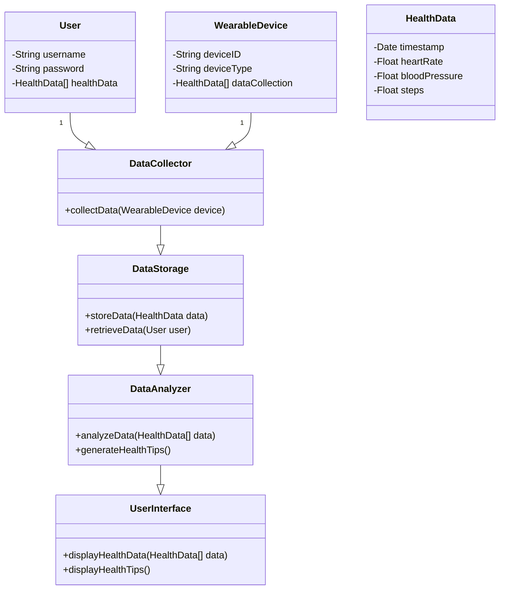
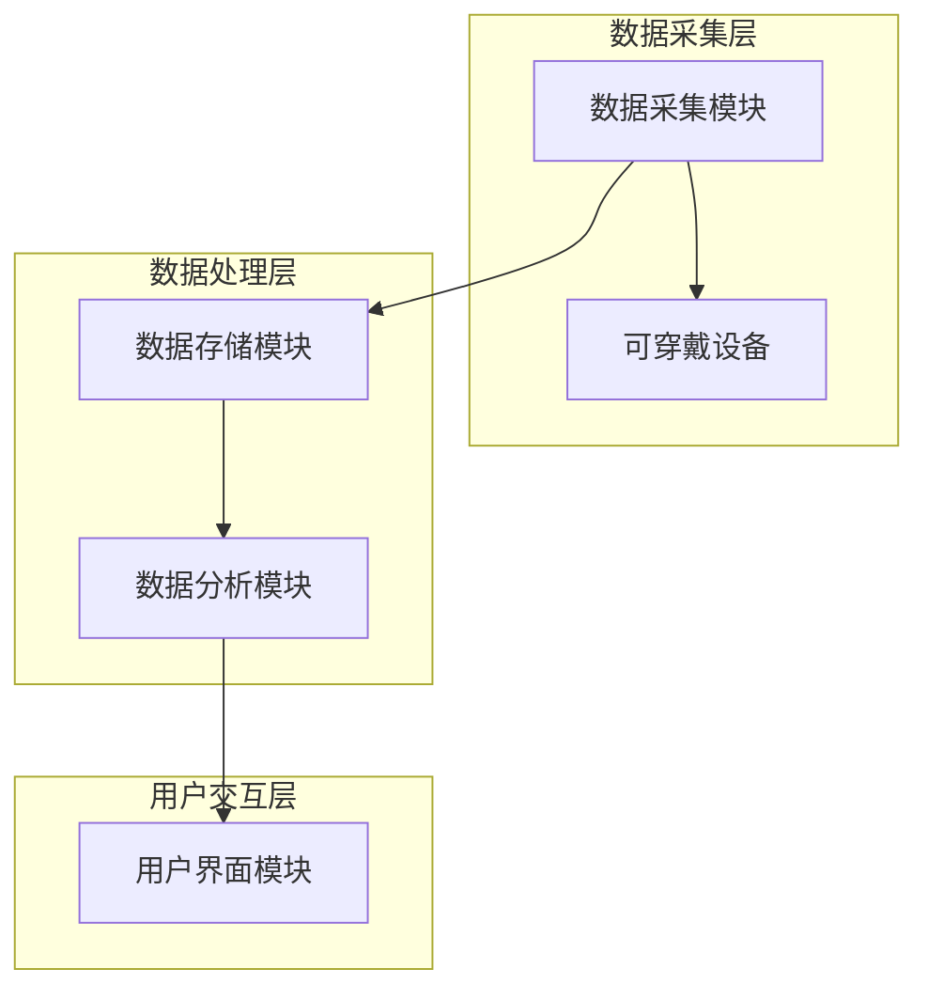
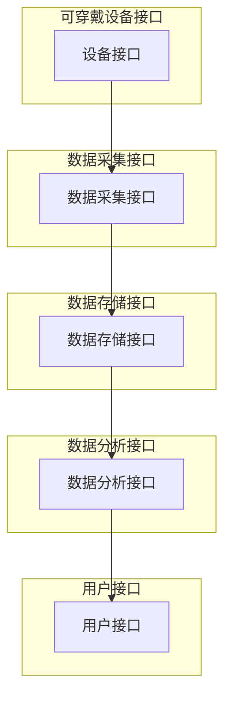
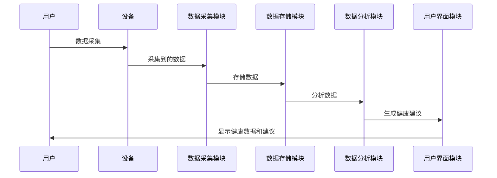

                 

### 第1章 问题背景与核心概念

#### 1.1 问题背景

在当今快速发展的技术世界中，技术领导者面临着前所未有的挑战。他们不仅要精通技术，还要具备卓越的管理能力。这种双重角色的冲突成为了技术领导者面临的主要问题。

首先，技术深度是技术领导者的核心能力之一。技术深度指的是对某一特定领域或技术的深入理解和精通。随着技术的不断进步，技术领导者需要不断更新自己的知识库，以便能够引领团队进行技术创新和突破。然而，专注于技术深度可能会导致领导者忽视管理广度，从而影响团队的整体协作和组织效能。

其次，管理广度是指技术领导者需要在团队管理、项目规划、资源分配等多个方面展现出的综合管理能力。管理广度对于技术领导者的成功至关重要，因为良好的管理能力可以提升团队的协作效率，促进项目的顺利进行，并帮助组织实现战略目标。然而，过于关注管理广度可能会使领导者忽略自己在技术方面的专业发展，进而影响技术创新的驱动力。

#### 1.2 核心概念

- **技术深度**：技术深度是技术领导者对某一特定领域或技术的深入理解和精通。技术深度不仅包括对技术原理的掌握，还包括对技术趋势的预判和对技术难题的解决能力。

- **管理广度**：管理广度是指技术领导者需要在团队管理、项目规划、资源分配等多个方面展现出的综合管理能力。管理广度涵盖了沟通能力、决策能力、团队领导力等多个方面。

- **技术领导力**：技术领导力是指技术领导者通过技术能力和管理能力来引领团队、推动技术创新和组织发展的能力。

- **管理能力**：管理能力是指技术领导者有效地管理团队、项目、资源等的能力。管理能力包括计划、组织、协调、控制等多个方面。

#### 1.3 边界与外延

- **技术领域的深度与广度**：技术深度通常指对某一特定技术的深入研究和理解，而技术广度则是指对多个技术领域的了解和掌握。技术深度和广度之间存在一定的边界，技术领导者需要在这两者之间找到平衡。

- **管理能力的层级与范围**：管理能力可以分为多个层级，从基础的团队管理到高层的管理决策。同时，管理能力的范围可以从日常的项目管理到战略规划等多个方面。技术领导者需要根据自己的角色和职责，提升相应层级和范围的管理能力。

### 第2章 技术深度

#### 2.1 技术深度的重要性

技术深度是技术领导者的核心竞争力之一。对技术的深入理解不仅有助于领导者在项目中做出明智的决策，还能够激发团队的创新潜力。以下是技术深度重要性的几个方面：

- **技术预判能力**：技术领导者需要对技术趋势有敏锐的洞察力，能够预判未来的技术发展方向，从而为团队的发展规划提供方向。

- **技术创新能力**：技术深度能够帮助领导者发现技术难题，并通过深入研究和创新解决这些问题，推动技术的进步。

- **团队影响力**：技术领导者通过自身的技术深度，能够更好地指导和激励团队成员，提升团队的整体技术水平。

#### 2.2 技术深度的发展路径

要提升技术深度，技术领导者可以采取以下发展路径：

- **专业领域深耕**：选择一个特定的技术领域，通过持续的学习和研究，成为该领域的专家。

- **技术趋势预判**：关注技术前沿，了解最新的技术动态，通过分析和研究，预判未来的技术趋势。

- **技术难题解决**：面对技术难题，进行深入的研究和探索，通过解决难题，提升自己的技术水平。

#### 2.3 技术深度案例分析

- **成功案例解析**：许多技术领导者通过深入研究和创新，在技术领域取得了显著的成就。例如，谷歌的CTO克里斯·尤斯蒂斯（Chris

```### 第2章 技术深度

#### 2.1 技术深度的重要性

在技术领导者的角色中，技术深度是至关重要的。它不仅决定了技术领导者是否能够引领团队在技术前沿进行创新，还影响了他们对技术难题的解决能力。以下是技术深度重要性的几个方面：

- **技术理解与洞察**：技术深度使领导者能够深入理解技术原理，从而更好地洞察技术趋势和潜在的机会。

- **决策能力**：在技术决策过程中，技术深度帮助领导者做出更为明智的选择，减少因信息不足而导致的错误决策。

- **团队影响**：技术深度使领导者能够通过自身的专业知识，引导团队成员理解并应用新技术，提高团队的整体技术水平。

- **创新能力**：技术深度是创新的基础。只有对技术有深刻的理解，技术领导者才能提出具有前瞻性的创新想法，并推动团队将这些想法变为现实。

#### 2.2 技术深度的发展路径

提升技术深度并不是一蹴而就的，技术领导者需要通过持续的学习和实践来达到这一目标。以下是几个关键的发展路径：

- **专业领域深耕**：选择一个特定的技术领域，集中精力深入研究。通过参加专业会议、阅读最新的研究论文、与领域内的专家交流，不断提升在该领域的知识水平。

- **持续学习**：技术领域日新月异，技术领导者需要保持持续学习的态度，通过在线课程、技术论坛和研讨会等途径，不断更新自己的知识库。

- **实践与验证**：理论知识需要通过实践来验证和巩固。技术领导者应该参与实际的工程项目，通过解决实际问题，提升自己的技术深度。

- **技术预判**：技术领导者不仅要关注现有技术，还要预见未来的技术趋势。这需要领导者具备敏锐的洞察力和前瞻性思维。

- **跨学科学习**：技术的进步往往需要跨学科的知识。技术领导者应该尝试了解其他相关领域的知识，以拓宽自己的视野。

#### 2.3 技术深度案例分析

- **案例一：克里斯·尤斯蒂斯（Chris Umphress）**：作为谷歌的CTO，克里斯·尤斯蒂斯以其在计算机科学领域的深入研究和创新而闻名。他在分布式系统、云计算和人工智能等领域发表了多篇重要论文，并带领谷歌团队实现了多项技术突破。

- **案例二：亚马逊的杰夫·贝索斯（Jeff Bezos）**：作为亚马逊的创始人，杰夫·贝索斯在电子商务和云计算领域有着深厚的技术背景。他不仅推动了亚马逊的技术创新，还通过AWS（Amazon Web Services）为全球客户提供云计算服务。

- **案例三：微软的萨提亚·纳德拉（Satya Nadella）**：萨提亚·纳德拉在领导微软的过程中，强调了技术深度的重要性。他在云计算、大数据和人工智能等领域有着丰富的经验，并推动了微软在这些领域的持续创新。

这些案例表明，技术深度是技术领导者成功的关键因素之一。通过深入研究和创新，技术领导者不仅能够推动技术进步，还能够为团队和组织带来持续的价值。

### 第3章 管理广度

#### 3.1 管理广度的概念与作用

管理广度是指技术领导者需要在多个方面展现出的综合管理能力。这种能力不仅包括团队管理，还涵盖了项目规划、资源分配、战略规划等多个层面。以下是管理广度的重要概念和作用：

- **团队管理**：技术领导者需要有效地管理团队，包括激励团队成员、协调团队内部的工作、解决团队冲突等。良好的团队管理能够提升团队的协作效率，促进项目的成功。

- **项目规划**：技术领导者需要具备项目规划的能力，包括设定项目目标、制定项目计划、分配项目资源等。项目规划能够确保项目按计划顺利进行，避免项目延期或超支。

- **资源分配**：技术领导者需要合理地分配资源，包括人力资源、技术资源、资金等。有效的资源分配能够提高项目的效率，降低成本。

- **战略规划**：技术领导者需要参与组织战略规划，了解组织的发展方向，并根据组织的战略目标制定相应的技术发展策略。战略规划能够确保技术发展符合组织的整体战略。

管理广度在技术领导中的作用体现在以下几个方面：

- **组织效能提升**：通过有效的管理广度，技术领导者能够提升组织的整体效能，确保项目成功，实现组织的战略目标。

- **团队协作**：良好的管理广度能够促进团队协作，减少内部冲突，提升团队的凝聚力。

- **决策支持**：技术领导者通过管理广度，能够为组织提供更为全面和深入的决策支持，提高决策的准确性和效率。

#### 3.2 管理广度在技术领导中的作用

- **团队协作**：技术领导者需要具备良好的沟通和协调能力，促进团队成员之间的合作。通过建立有效的沟通渠道和协作机制，技术领导者能够确保团队成员明确任务目标，理解彼此的角色和责任，从而提高团队的整体协作效率。

- **组织效能**：技术领导者通过优化项目流程、提升资源利用率和改进管理方法，能够显著提升组织的效能。这包括制定合理的项目计划、实施有效的风险管理策略以及建立持续改进的机制。

- **战略规划**：技术领导者需要具备前瞻性思维和战略眼光，能够根据组织的发展方向制定技术战略。技术战略应与组织的整体战略相一致，以确保技术发展能够支撑组织目标的实现。

#### 3.3 管理广度的核心能力

要发挥管理广度的作用，技术领导者需要具备以下几个核心能力：

- **沟通能力**：技术领导者需要能够清晰、有效地传达信息，倾听团队成员的意见和需求，建立良好的沟通渠道。

- **决策能力**：技术领导者需要具备迅速而明智的决策能力，能够在复杂多变的环境中做出正确的选择。

- **团队领导力**：技术领导者需要具备领导才能，能够激励团队成员、建立团队文化，并通过授权和培养提升团队的整体能力。

- **资源管理能力**：技术领导者需要能够合理分配和利用各种资源，确保项目顺利进行。

- **战略规划能力**：技术领导者需要具备战略思维，能够根据组织目标制定长期和短期的发展规划。

通过不断提升这些核心能力，技术领导者能够在管理广度方面取得显著成就，从而为团队和组织带来更大的价值。

### 第4章 技术与管理融合

#### 4.1 技术与管理融合的重要性

在技术领导者的发展过程中，技术与管理融合的重要性不可忽视。技术与管理融合不仅有助于提升个人的综合能力，还能够推动团队和组织实现更高的效率和业绩。以下是技术与管理融合重要性的几个方面：

- **综合能力的提升**：技术与管理融合使得技术领导者能够在技术和管理两个领域同时具备深厚的知识储备和技能，从而在组织中发挥更大的作用。

- **决策效果的提升**：技术与管理融合使技术领导者能够在决策时综合考虑技术可行性和管理可行性，提高决策的准确性和有效性。

- **团队协作的促进**：技术与管理融合有助于技术领导者更好地理解团队成员的需求，促进团队协作，提升团队的整体效能。

- **战略目标的实现**：技术与管理融合使技术领导者能够从战略角度出发，制定和执行符合组织目标的技术策略，推动组织实现长期发展。

#### 4.2 技术与管理融合的实践路径

实现技术与管理融合需要技术领导者采取一系列具体的实践路径，以下是几个关键方面：

- **技术驱动管理**：技术领导者应关注技术发展，通过技术手段提升管理效率。例如，利用大数据分析和人工智能技术优化项目管理流程，提高决策的精准度和效率。

- **管理促进技术**：技术领导者应关注管理需求，通过管理手段推动技术创新。例如，通过组织架构调整和流程优化，为技术创新提供更好的环境和支持。

- **技能切换**：技术领导者应培养自己在技术和管理之间的灵活切换能力，能够在需要时迅速从技术角色切换到管理角色，反之亦然。

- **跨领域学习**：技术领导者应积极参与跨领域的培训和学习，拓展自己的知识面和视野，提升综合能力。

- **经验交流**：技术领导者应主动与其他领域的专家交流，分享经验和见解，促进技术与管理之间的融合。

#### 4.3 技术与管理融合的最佳实践

在实际操作中，以下是一些最佳实践可以帮助技术领导者实现技术与管理融合：

- **构建跨学科团队**：通过组建跨学科的团队，促进不同领域之间的交流和合作，实现技术与管理融合。

- **设立技术与管理委员会**：在组织内部设立专门的技术与管理委员会，负责制定和执行技术与管理融合的方案和策略。

- **定期技术与管理研讨会**：定期举办技术与管理研讨会，邀请技术专家和管理专家共同探讨技术与管理融合的实践和方法。

- **建立反馈机制**：通过建立有效的反馈机制，收集团队成员在技术与管理融合方面的意见和建议，不断优化和改进实践方法。

通过这些最佳实践，技术领导者可以更好地实现技术与管理融合，推动团队和组织实现更高的效率和业绩。

### 第5章 技术领导者的成长路径

#### 5.1 技术深度与广度的发展阶段

技术领导者的成长路径可以分为三个主要阶段：初级阶段、中级阶段和高级阶段。每个阶段都有其独特的特点和成长目标。

- **初级阶段**：在初级阶段，技术领导者主要专注于技术深度的发展。他们需要通过学习和实践，掌握某一技术领域的核心知识和技能，成为该领域的专家。在这个阶段，技术领导者还需要培养良好的学习习惯和解决问题的能力。

- **中级阶段**：中级阶段的技术领导者开始关注技术广度的发展。他们需要拓展自己的知识面，了解多个技术领域的基本原理和应用。同时，他们还需要提升管理能力，学会如何管理和领导团队，实现项目的成功。

- **高级阶段**：在高级阶段，技术领导者需要全面掌握技术深度和广度，并具备卓越的管理能力。他们需要具备战略眼光，能够从组织层面规划和推动技术发展。此外，高级阶段的技术领导者还需要具备跨领域的合作能力，能够与其他领域的专家共同推动技术创新。

#### 5.2 技能提升与知识拓展

技术领导者的成长不仅仅依赖于技术深度和广度的提升，还需要在技能提升和知识拓展方面不断努力。

- **技能提升**：技术领导者需要通过实践和培训不断提升自己的技能。具体包括编程技能、系统架构设计能力、项目管理技能等。通过不断学习和实践，技术领导者可以不断提高自己的技术能力，为团队和组织创造更大的价值。

- **知识拓展**：技术领导者需要不断拓展自己的知识领域，了解最新的技术趋势和发展动态。这可以通过阅读专业书籍、参加技术会议和研讨会、关注技术博客和社交媒体等途径实现。通过不断学习，技术领导者可以保持自己在技术领域的竞争力。

- **跨领域学习**：为了更好地应对复杂的技术挑战，技术领导者还需要跨领域学习。这包括了解商业管理、市场营销、心理学等领域的知识。通过跨领域学习，技术领导者可以更好地理解和解决跨领域的问题，提升自己的综合能力。

#### 5.3 成长案例分析

以下是一些成功的技术领导者的成长案例分析，以展示他们的成长历程和关键因素：

- **案例一：李明**：李明是某互联网公司的技术总监。他在初级阶段通过不断学习和实践，成为了一名优秀的程序员。随后，他开始拓展自己的技术广度，学习了多个技术领域的基本知识。在高级阶段，他通过跨领域学习和项目管理培训，提升了自己的管理能力。最终，他成功带领团队完成了一系列重要项目，成为公司的重要技术领导者。

- **案例二：张华**：张华是某知名科技公司的CTO。他在初级阶段专注于技术深度的发展，成为了一名计算机图形学领域的专家。在中级阶段，他开始学习项目管理和管理学知识，提升自己的管理能力。在高级阶段，他通过跨领域学习和国际合作，推动了公司多个技术项目的成功。他的成长经历展示了技术深度、广度和管理能力的协同发展。

这些案例表明，技术领导者的成长路径是多元化和动态的。通过不断学习和实践，技术领导者可以不断提升自己的能力，成为卓越的技术领导者。

### 第6章 技术领导者的管理挑战与应对

#### 6.1 技术与管理冲突的解决策略

技术领导者在工作中常常面临技术与管理之间的冲突。这种冲突可能源于技术领导者对技术问题的专注，而忽视了管理需求；或者源于管理者对技术实现细节的不理解，导致决策失误。以下是解决技术与管理冲突的几个策略：

- **沟通与协调**：技术领导者需要与管理者建立良好的沟通机制，定期交流项目的进展、技术难题和潜在风险。通过有效的沟通，技术领导者可以确保管理者理解技术实现细节，同时管理者也可以将管理需求传达给技术团队。

- **共同目标设定**：技术领导者和管理者需要共同设定项目目标和里程碑，确保技术实现与组织目标的一致性。通过共同设定目标，技术领导者可以更好地理解管理需求，管理者也可以更好地支持技术实现。

- **角色明确**：技术领导者和管理者需要明确各自的角色和职责。技术领导者负责技术实现，管理者负责项目管理和资源分配。通过明确角色，可以减少因角色重叠而导致的冲突。

- **冲突管理**：在冲突发生时，技术领导者需要采取冷静、理性的态度，通过对话和协商寻找解决方案。如果冲突无法通过内部解决，可以寻求第三方调解或咨询。

#### 6.2 团队管理技巧

团队管理是技术领导者的一项重要职责。以下是一些关键的团队管理技巧：

- **激励与培养**：技术领导者需要通过奖励机制和培训计划激励团队成员，提升他们的技术能力和工作积极性。同时，技术领导者还需要关注团队成员的职业发展，提供职业规划和晋升机会。

- **冲突解决**：在团队内部，难免会出现意见分歧和冲突。技术领导者需要具备良好的冲突解决能力，通过对话、协商和妥协，找到双方都能接受的解决方案。

- **团队文化建设**：技术领导者需要营造积极向上的团队文化，鼓励团队成员之间的合作和分享。通过团队文化建设，可以增强团队的凝聚力和协作效率。

- **领导风格**：技术领导者需要根据自己的特点和团队需求，选择合适的领导风格。例如，民主型领导风格可以鼓励团队成员参与决策，增强团队凝聚力；而权威型领导风格则可以快速做出决策，提高工作效率。

#### 6.3 领导风格与领导艺术

领导风格是技术领导者的一种重要表现，它决定了领导者与团队成员的互动方式和团队的整体氛围。以下是几种常见的领导风格和领导艺术：

- **权威型领导**：权威型领导风格强调领导者的决策权和控制力。领导者做出决策，并要求团队成员执行。这种风格适用于紧急情况和需要迅速行动的项目。

- **民主型领导**：民主型领导风格强调团队成员的参与和决策的共享。领导者鼓励团队成员提出建议和意见，并在决策过程中进行讨论。这种风格适用于需要创新和团队协作的项目。

- **参与型领导**：参与型领导风格强调领导者与团队成员之间的紧密互动和共同决策。领导者不仅提供指导和资源，还积极参与团队的工作，与团队成员共同面对挑战。这种风格适用于需要高度团队合作和创新能力的环境。

- **服务型领导**：服务型领导风格强调领导者的服务精神，领导者关注团队成员的需求，并提供必要的支持和资源。领导者通过帮助团队成员解决问题，提升团队成员的工作满意度和忠诚度。

领导艺术是技术领导者的一项重要技能，它包括如何在不同情况下选择合适的领导风格，如何有效地激励和培养团队成员，如何处理团队冲突和问题等。通过不断提升领导艺术，技术领导者可以更好地领导团队，实现团队的目标和组织的目标。

### 第7章 跨界合作与领导力拓展

#### 7.1 跨界合作的重要性

在当今快速变化的技术环境中，跨界合作对于技术领导者来说至关重要。跨界合作不仅可以拓宽技术视野，激发创新思维，还能够整合不同领域的资源和知识，为组织带来新的机遇和竞争优势。以下是跨界合作的重要性和优势：

- **资源共享**：通过跨界合作，技术领导者可以与其他领域的专家共享资源，如技术、资金、人才等。这种资源共享有助于降低研发成本，提高创新效率。

- **知识整合**：跨界合作使得技术领导者有机会接触和学习其他领域的知识，从而整合不同领域的创新思路，为技术发展提供新的视角和方法。

- **技术创新**：跨界合作可以激发跨领域的知识碰撞，产生新的创新想法和解决方案。这种技术创新往往能够带来突破性的进展。

- **市场拓展**：跨界合作有助于技术领导者开拓新的市场领域，通过与其他行业的合作，开发新的产品和服务，满足更广泛的市场需求。

- **品牌提升**：跨界合作可以提升组织的品牌形象和声誉，通过与其他知名企业的合作，增强组织的市场竞争力和品牌影响力。

#### 7.2 领导力拓展的路径

为了有效进行跨界合作并提升领导力，技术领导者可以采取以下路径：

- **跨领域学习**：技术领导者应积极参与跨领域的培训和研讨会，学习其他领域的知识和技能。通过不断学习，技术领导者可以拓宽自己的知识面，增强跨领域的理解和沟通能力。

- **建立合作伙伴关系**：技术领导者应主动与其他领域的专家和企业建立长期的合作关系，通过合作项目和实践，提升跨界合作的经验和能力。

- **组织跨领域团队**：技术领导者可以组建跨领域的项目团队，鼓励团队成员之间的交流和合作。通过跨领域团队的协作，可以更好地整合不同领域的资源和知识，推动技术创新。

- **推动内部创新文化**：技术领导者应推动组织内部建立创新文化，鼓励员工跨领域学习和合作，支持创新项目的实施。通过建立创新文化，可以激发员工的创新潜力，促进跨界合作。

#### 7.3 跨界合作案例

以下是一些成功的跨界合作案例，展示了技术领导者如何通过跨界合作实现创新和市场拓展：

- **案例一：谷歌与斯坦福大学合作**：谷歌与斯坦福大学合作，建立了一个专注于人工智能研究的实验室。通过合作，谷歌获得了斯坦福大学在人工智能领域的最新研究成果，同时也为斯坦福大学提供了大量的研究资源和资金。这种跨界合作不仅推动了人工智能技术的发展，也为谷歌带来了新的创新思路和市场机会。

- **案例二：苹果与IBM合作**：苹果与IBM合作，共同开发了一系列针对企业市场的应用程序和服务。通过这种跨界合作，苹果成功地将其硬件产品与IBM的企业解决方案相结合，开拓了新的市场领域。这种合作不仅提升了苹果的品牌形象，也为IBM带来了新的增长点。

- **案例三：微软与OpenAI合作**：微软与OpenAI合作，共同推动人工智能技术的发展。通过合作，微软获得了OpenAI在人工智能领域的先进技术，同时也为OpenAI提供了大量的计算资源和云计算服务。这种跨界合作推动了人工智能技术的发展，为两家公司带来了共同的市场机会。

这些案例表明，跨界合作是技术领导者提升领导力和实现创新的重要途径。通过与其他领域的合作，技术领导者可以拓宽视野，激发创新思维，推动技术进步和市场拓展。

### 第8章 平衡策略与实践

#### 8.1 平衡策略的重要性

作为技术领导者，如何在技术深度和管理广度之间找到平衡至关重要。这种平衡不仅关系到个人的职业发展，也直接影响到团队和组织的工作效率与成果。以下是平衡策略的重要性：

- **职业发展**：技术深度和管理广度是技术领导者职业发展的两个重要方面。只有在这两个方面都取得平衡，技术领导者才能在职业道路上取得全面的进步。

- **团队协作**：技术深度和管理广度的平衡有助于提升团队协作效率。当技术领导者既能深入理解技术问题，又能有效管理团队和项目时，团队成员之间的沟通和合作将更加顺畅。

- **组织效能**：技术领导者通过平衡技术深度和管理广度，可以更好地推动组织目标的实现。他们能够在技术决策中考虑到管理因素，确保技术发展与组织战略相一致，从而提升组织的整体效能。

- **个人成长**：技术深度和管理广度的平衡有助于技术领导者的个人成长。通过不断学习和实践，技术领导者可以在技术和管理两个领域都取得进步，提升自己的综合能力。

#### 8.2 实践中的平衡方法

在实际工作中，技术领导者可以通过以下方法来平衡技术深度和管理广度：

- **时间管理**：合理规划时间，确保有足够的时间专注于技术研究和团队管理。例如，可以将时间分为技术学习和项目管理两个部分，确保两者都得到充分关注。

- **技能切换**：培养在技术和管理之间灵活切换的能力。当需要专注于技术问题时，可以迅速切换到技术角色；当需要处理管理事务时，可以快速转换到管理角色。

- **团队分工**：通过合理的团队分工，将技术研究和项目管理责任分配给不同的团队成员。这样，技术领导者可以在技术领域深耕，同时也能关注团队管理。

- **知识共享**：鼓励团队成员分享技术知识和管理经验，建立知识共享机制。通过这种方式，技术领导者可以在不增加工作量的情况下，不断提升团队的整体技术水平和管理能力。

- **跨领域学习**：积极参与跨领域的培训和学习，拓宽自己的知识面。这有助于技术领导者更好地理解其他领域的需求和挑战，从而在技术和管理之间找到更好的平衡点。

#### 8.3 平衡管理的案例分析

以下是一些技术领导者在平衡技术深度和管理广度方面的成功案例分析：

- **案例一：李刚**：李刚是一家互联网公司的技术总监。他通过合理的时间管理和技能切换，成功平衡了技术研究和团队管理。在技术方面，他专注于人工智能技术的研发，带领团队取得了多项技术突破。在管理方面，他通过制定详细的团队管理计划和定期团队沟通，确保项目顺利进行。

- **案例二：张丽**：张丽是一家金融科技公司的首席技术官。她通过团队分工和知识共享，实现了技术深度和管理广度的平衡。她将技术研究和项目管理责任分配给不同团队成员，自己则专注于技术战略规划和团队文化建设。通过这种方式，她不仅提升了团队的技术水平，也确保了项目的成功实施。

- **案例三：王伟**：王伟是一家医疗健康公司的技术副总裁。他通过跨领域学习和时间管理，成功平衡了技术深度和管理广度。他不仅深入研究了医疗健康领域的技术，还积极参与管理培训，提升自己的管理能力。通过这种平衡，他带领团队实现了多个重要项目，提升了公司的市场竞争力。

这些案例表明，技术领导者通过合理的平衡策略和实践，可以在技术深度和管理广度之间取得良好的平衡，实现个人的职业发展和团队组织的共同进步。

### 第9章 技术领导者的未来展望

#### 9.1 技术发展的趋势

技术领导者的未来将受到以下几个技术发展趋势的深刻影响：

- **人工智能**：人工智能技术的快速发展正在改变各个行业的运作方式。技术领导者需要熟悉人工智能的基本原理和应用场景，以便能够引领团队在这一领域进行创新。

- **云计算**：云计算技术提供了强大的计算和存储能力，为企业的数字化转型提供了基础。技术领导者需要了解云计算架构和最佳实践，以便能够有效地利用云资源。

- **区块链**：区块链技术的应用日益广泛，从金融到供应链管理，都在探索如何利用区块链提升效率和安全性。技术领导者需要了解区块链的工作原理和应用场景。

- **物联网**：物联网技术的普及使得设备之间的连接更加紧密，为智能城市、智能家居等概念提供了实现的可能。技术领导者需要掌握物联网的基本技术和应用趋势。

- **5G**：5G网络的高速度、低延迟特性将推动新一代应用的快速发展，如自动驾驶、远程医疗等。技术领导者需要了解5G网络的技术特性和应用前景。

#### 9.2 管理的未来趋势

随着技术的不断进步，管理领域也在发生深刻变革。以下是一些管理未来趋势：

- **智能化管理**：随着人工智能技术的发展，智能化管理工具将日益普及，帮助管理者进行数据分析和决策支持。

- **数据驱动**：数据成为企业决策的重要依据，技术领导者需要具备数据分析和解读能力，利用数据进行决策和优化。

- **数字化转型**：数字化转型已经成为企业发展的关键战略。技术领导者需要推动组织的数字化转型，提升业务效率和市场竞争力。

- **敏捷管理**：敏捷管理方法强调快速响应变化，通过短周期迭代和持续反馈，提高项目的灵活性和成功率。技术领导者需要掌握敏捷管理的方法和实践。

- **全球化管理**：随着全球化的加深，技术领导者需要具备跨文化沟通和协作能力，管理跨国团队和项目。

#### 9.3 技术领导者的未来角色

在未来，技术领导者的角色将更加多元化，他们将承担以下几方面的职责：

- **创新领袖**：技术领导者需要具备前瞻性思维，引领团队在技术前沿进行创新，推动组织的技术进步。

- **战略规划者**：技术领导者需要参与组织的战略规划，制定和实施符合组织目标的技术战略。

- **智能化管理实践者**：技术领导者需要掌握智能化管理工具和应用，推动组织的数字化转型和智能化管理。

- **跨领域协调者**：技术领导者需要具备跨领域的知识储备和协作能力，协调不同部门之间的合作，推动项目成功。

- **领导力发展者**：技术领导者需要不断提升自己的领导力，培养和激励团队成员，建立高效的团队文化。

技术领导者的未来角色将更加多元和复杂，他们需要在技术深度和管理广度之间找到平衡，不断提升自己的综合能力和领导力，以适应快速变化的技术环境和市场需求。

### 第10章 结论

#### 10.1 全书总结

本文围绕技术领导者如何在技术深度和管理广度之间找到平衡进行了深入的探讨。我们首先介绍了技术领导者在当前技术环境中面临的挑战，分析了技术深度和管理广度的核心概念，并探讨了两者之间的关系。随后，我们详细讨论了技术深度的重要性、发展路径以及案例，同时介绍了管理广度的概念、作用和核心能力。接着，我们探讨了技术与管理融合的重要性、实践路径和最佳实践。在此基础上，我们分析了技术领导者的成长路径、管理挑战与应对策略，以及跨界合作与领导力拓展的重要性。最后，我们提出了平衡策略与实践，并对技术领导者的未来进行了展望。

#### 10.2 未来展望

技术领导者的职业发展将面临更多的机遇和挑战。随着技术的不断进步，人工智能、云计算、区块链等新兴技术将继续改变行业的格局，技术领导者需要不断提升自己的技术深度和管理广度，以适应新的发展需求。同时，未来的管理也将更加智能化、数据驱动和敏捷化，技术领导者需要具备跨领域的知识储备和协作能力。我们鼓励技术领导者持续学习，积极参与跨界合作，不断提升自己的领导力和创新能力，以应对未来职业发展的各种挑战。

#### 10.3 拓展阅读

为了帮助读者进一步了解技术领导者的角色和职责，以下是几本推荐阅读的书籍和学术文章：

- **书籍推荐**：
  - 《技术领导力：构建高效创新团队》
  - 《敏捷管理：从优秀到卓越的实践》
  - 《数据驱动管理：如何用数据提升企业竞争力》
  
- **学术文章推荐**：
  - "The Role of Technical Leaders in the Age of AI"（《人工智能时代技术领导者的角色》）
  - "Balancing Technical Depth and Managerial Breadth: Challenges and Strategies for IT Leaders"（《平衡技术深度与管理广度：IT领导者的挑战与策略》）
  - "The Future of Leadership: How AI and Data Are Transforming Management"（《领导力的未来：人工智能和数据如何改变管理》）

- **实践案例分享**：
  - 通过分析知名企业（如谷歌、微软、亚马逊等）的技术领导者的成功案例，可以了解他们在技术深度和管理广度之间的平衡策略和实践方法。

通过阅读这些书籍和文章，读者可以更深入地理解技术领导者的角色和职责，并从中获取实用的指导和建议。同时，也可以结合实际案例，探索如何将理论知识应用于实践，以提升自己的技术领导力。**第1章 问题背景与核心概念**

在当今快速发展的技术世界中，技术领导者面临着前所未有的挑战。他们不仅要精通技术，还要具备卓越的管理能力。这种双重角色的冲突成为了技术领导者面临的主要问题。

首先，技术深度是技术领导者的核心能力之一。技术深度指的是对某一特定领域或技术的深入理解和精通。随着技术的不断进步，技术领导者需要不断更新自己的知识库，以便能够引领团队进行技术创新和突破。然而，专注于技术深度可能会导致领导者忽视管理广度，从而影响团队的整体协作和组织效能。

其次，管理广度是指技术领导者需要在团队管理、项目规划、资源分配等多个方面展现出的综合管理能力。管理广度对于技术领导者的成功至关重要，因为良好的管理能力可以提升团队的协作效率，促进项目的顺利进行，并帮助组织实现战略目标。然而，过于关注管理广度可能会使领导者忽略自己在技术方面的专业发展，进而影响技术创新的驱动力。

在技术领导者面临的双重挑战中，技术深度和管理广度的平衡成为了一个关键问题。如何在这种平衡中找到自己的位置，既不忽视技术深度，也不忽视管理广度，是每位技术领导者都必须思考的问题。

### 1.2 核心概念

在探讨技术领导者如何平衡技术深度和管理广度之前，我们需要明确这两个核心概念的定义和关系。

#### 技术深度

技术深度是指技术领导者对某一特定领域或技术的深入理解和精通。它不仅包括对技术原理的掌握，还包括对技术实现细节、性能优化、潜在问题及其解决方案的深入了解。技术深度是技术领导者推动技术创新和解决复杂技术问题的能力基础。

技术深度的重要性体现在以下几个方面：

1. **推动技术创新**：技术深度使领导者能够从技术细节中发现创新点，推动技术进步和业务发展。
2. **解决问题**：面对技术难题时，技术深度可以帮助领导者快速找到有效的解决方案。
3. **团队影响**：技术深度使领导者能够更好地指导和激励团队成员，提升团队的整体技术水平。
4. **行业地位**：在技术领域拥有深厚的技术深度可以提升领导者在行业中的地位和影响力。

#### 管理广度

管理广度是指技术领导者需要在团队管理、项目规划、资源分配等多个方面展现出的综合管理能力。管理广度涵盖了沟通能力、决策能力、团队领导力等多个方面。

管理广度的重要性体现在以下几个方面：

1. **团队协作**：良好的管理广度可以促进团队成员之间的协作，提升团队的效率和凝聚力。
2. **项目成功**：技术领导者通过有效的管理广度可以确保项目的顺利进行，降低风险。
3. **资源优化**：合理分配和管理资源可以最大化地利用组织内部的资源，提高项目的成功率。
4. **战略规划**：管理广度使领导者能够从整体上规划组织的发展方向，制定符合组织目标的技术策略。

#### 技术深度与管理广度的关系

技术深度和管理广度是相辅相成的。技术深度为领导者提供了在技术领域的专业知识和创新能力，而管理广度则帮助领导者有效地利用这些技术知识，推动团队和组织的发展。

然而，两者之间也存在着一定的冲突。过于专注于技术深度可能会导致领导者忽视管理广度，影响团队的协作和组织效能；而过于关注管理广度可能会使领导者忽视自己在技术领域的专业发展，从而影响技术创新的驱动力。

因此，技术领导者需要在技术深度和管理广度之间找到平衡。这种平衡不仅能够提升领导者的个人能力，还能够推动团队和组织实现更高的效率和业绩。

### 1.3 边界与外延

在探讨技术深度和管理广度时，理解两者的边界与外延是非常重要的。这有助于技术领导者明确自己的职责，找到合适的平衡点。

#### 技术领域的深度与广度

技术深度通常指对某一特定领域或技术的深入研究和理解。它包括：

1. **专业知识**：掌握某一技术领域的核心理论和实践，如算法、编程语言、系统架构等。
2. **实践经验**：通过实际项目积累的技术经验和问题解决能力。
3. **创新思维**：能够从技术细节中发现创新点和优化方案。

技术广度则指对多个技术领域的基本理解和应用。它包括：

1. **跨领域知识**：了解不同技术领域的基本原理和应用，如人工智能、云计算、物联网等。
2. **综合能力**：能够在多个技术领域之间进行知识整合，解决复杂的技术问题。
3. **适应能力**：能够快速适应新技术的变化和市场需求。

技术深度和广度之间的平衡是一个动态的过程。技术领导者需要根据组织的需求和自身的职业发展，适时调整自己的技术方向和深度。

#### 管理能力的层级与范围

管理广度涉及多个层面的管理能力，包括：

1. **团队管理**：指导和管理团队成员，提升团队协作效率和绩效。
2. **项目管理**：规划、执行和监控项目，确保项目按时完成并达到预期目标。
3. **资源管理**：合理分配和使用组织资源，如人力、资金、技术等。
4. **战略规划**：制定组织的技术战略和长期发展规划。

管理能力的层级可以从基础管理到高级领导力逐步提升。基础管理能力主要涉及日常操作和团队管理，而高级领导力则包括战略规划和跨部门协作。

#### 边界与外延的动态调整

技术深度和管理广度的边界是动态的，技术领导者需要根据不同的情境和需求进行调整。例如：

- **初期阶段**：技术领导者可能需要更专注于技术深度，以建立专业知识和技能基础。
- **成长阶段**：随着职业发展，技术领导者需要逐步拓展技术广度，同时提升管理能力。
- **成熟阶段**：在技术和管理两个领域都有所成就后，技术领导者需要持续进行自我调整，以应对不断变化的技术环境和组织需求。

通过动态调整技术深度和管理广度，技术领导者可以在平衡中不断提升自己的综合能力，为团队和组织创造更大的价值。

### 第2章 技术深度

#### 2.1 技术深度的重要性

技术深度是技术领导者的核心竞争力之一。它不仅决定了技术领导者是否能够引领团队在技术前沿进行创新，还影响了他们对技术难题的解决能力。以下是技术深度重要性的几个方面：

- **技术创新**：技术深度使领导者能够从技术细节中发现创新点，推动技术进步和业务发展。只有对技术有深刻的理解，领导者才能提出具有前瞻性的创新想法，并将其转化为实际应用。
- **问题解决**：面对复杂的技术难题，技术深度使领导者能够迅速找到有效的解决方案。这种能力不仅提升了项目的成功率，也增强了团队的信心和凝聚力。
- **团队领导**：技术深度使领导者能够更好地指导和激励团队成员。领导者通过自身的技术实力，能够为团队提供专业的指导和方向，提升团队的整体技术水平。
- **行业影响力**：在技术领域拥有深厚的技术深度可以提升领导者在行业中的地位和影响力。这有助于领导者吸引优秀的人才和资源，为组织带来更多的商业机会。

#### 2.2 技术深度的发展路径

要提升技术深度，技术领导者可以采取以下发展路径：

- **专业领域深耕**：选择一个特定的技术领域，集中精力深入研究。通过参加专业会议、阅读最新的研究论文、与领域内的专家交流，不断提升在该领域的知识水平。
- **持续学习**：技术领域日新月异，技术领导者需要保持持续学习的态度，通过在线课程、技术论坛和研讨会等途径，不断更新自己的知识库。
- **实践与验证**：理论知识需要通过实践来验证和巩固。技术领导者应该参与实际的工程项目，通过解决实际问题，提升自己的技术深度。
- **技术预判**：技术领导者不仅要关注现有技术，还要预见未来的技术趋势。这需要领导者具备敏锐的洞察力和前瞻性思维。
- **跨学科学习**：技术的进步往往需要跨学科的知识。技术领导者应该尝试了解其他相关领域的知识，以拓宽自己的视野。

#### 2.3 技术深度案例分析

- **成功案例解析**：许多技术领导者通过深入研究和创新，在技术领域取得了显著的成就。例如，谷歌的CTO克里斯·尤斯蒂斯（Chris Uslian）在分布式系统和云计算领域的研究，推动了一系列关键技术突破，为谷歌的产品和服务提供了强大的技术支持。
- **深度技术研究的价值**：深度技术研究不仅能够推动技术进步，还能够为组织带来实际的商业价值。例如，亚马逊的CTO沃兹尼亚克（Woz）通过对计算机硬件和软件的深入研究，推动了亚马逊在云计算领域的快速发展，为亚马逊创造了巨大的市场优势。

这些案例表明，技术深度是技术领导者成功的关键因素之一。通过深入研究和创新，技术领导者不仅能够推动技术进步，还能够为团队和组织带来持续的价值。

### 第3章 管理广度

#### 3.1 管理广度的概念与作用

管理广度是指技术领导者需要在多个方面展现出的综合管理能力。这种能力不仅包括团队管理，还涵盖了项目规划、资源分配、战略规划等多个层面。以下是管理广度的重要概念和作用：

- **团队管理**：技术领导者需要有效地管理团队，包括激励团队成员、协调团队内部的工作、解决团队冲突等。良好的团队管理能够提升团队的协作效率，促进项目的成功。
- **项目规划**：技术领导者需要具备项目规划的能力，包括设定项目目标、制定项目计划、分配项目资源等。项目规划能够确保项目按计划顺利进行，避免项目延期或超支。
- **资源分配**：技术领导者需要合理地分配资源，包括人力资源、技术资源、资金等。有效的资源分配能够提高项目的效率，降低成本。
- **战略规划**：技术领导者需要参与组织战略规划，了解组织的发展方向，并根据组织的战略目标制定相应的技术发展策略。战略规划能够确保技术发展符合组织的整体战略。

管理广度在技术领导中的作用体现在以下几个方面：

- **组织效能提升**：通过有效的管理广度，技术领导者能够提升组织的整体效能，确保项目成功，实现组织的战略目标。
- **团队协作**：良好的管理广度能够促进团队协作，减少内部冲突，提升团队的凝聚力。
- **决策支持**：技术领导者通过管理广度，能够为组织提供更为全面和深入的决策支持，提高决策的准确性和效率。

#### 3.2 管理广度在技术领导中的作用

- **团队协作**：技术领导者需要具备良好的沟通和协调能力，促进团队成员之间的合作。通过建立有效的沟通渠道和协作机制，技术领导者能够确保团队成员明确任务目标，理解彼此的角色和责任，从而提高团队的整体协作效率。
- **组织效能**：技术领导者通过优化项目流程、提升资源利用率和改进管理方法，能够显著提升组织的效能。这包括制定合理的项目计划、实施有效的风险管理策略以及建立持续改进的机制。
- **战略规划**：技术领导者需要具备前瞻性思维和战略眼光，能够根据组织的发展方向制定技术战略。技术战略应与组织的整体战略相一致，以确保技术发展能够支撑组织目标的实现。

#### 3.3 管理广度的核心能力

要发挥管理广度的作用，技术领导者需要具备以下几个核心能力：

- **沟通能力**：技术领导者需要能够清晰、有效地传达信息，倾听团队成员的意见和需求，建立良好的沟通渠道。良好的沟通能力有助于减少误解和冲突，提升团队协作效率。
- **决策能力**：技术领导者需要具备迅速而明智的决策能力，能够在复杂多变的环境中做出正确的选择。决策能力是技术领导者管理广度的核心能力之一。
- **团队领导力**：技术领导者需要具备领导才能，能够激励团队成员、建立团队文化，并通过授权和培养提升团队的整体能力。团队领导力是管理广度的重要组成部分。
- **资源管理能力**：技术领导者需要能够合理分配和利用各种资源，确保项目顺利进行。资源管理能力包括人力资源、技术资源、资金等的合理配置。
- **战略规划能力**：技术领导者需要具备战略思维，能够根据组织目标制定长期和短期的发展规划。战略规划能力是技术领导者管理广度的关键能力。

通过不断提升这些核心能力，技术领导者能够在管理广度方面取得显著成就，从而为团队和组织带来更大的价值。

### 第4章 技术与管理融合

#### 4.1 技术与管理融合的重要性

在技术领导者的发展过程中，技术与管理融合的重要性不可忽视。技术与管理融合不仅有助于提升个人的综合能力，还能够推动团队和组织实现更高的效率和业绩。以下是技术与管理融合重要性的几个方面：

- **综合能力的提升**：技术与管理融合使得技术领导者能够在技术和管理两个领域同时具备深厚的知识储备和技能，从而在组织中发挥更大的作用。
- **决策效果的提升**：技术与管理融合使技术领导者能够在决策时综合考虑技术可行性和管理可行性，提高决策的准确性和有效性。
- **团队协作的促进**：技术与管理融合有助于技术领导者更好地理解团队成员的需求，促进团队协作，提升团队的整体效能。
- **战略目标的实现**：技术与管理融合使技术领导者能够从战略角度出发，制定和执行符合组织目标的技术策略，推动组织实现长期发展。

#### 4.2 技术与管理融合的实践路径

实现技术与管理融合需要技术领导者采取一系列具体的实践路径，以下是几个关键方面：

- **技术驱动管理**：技术领导者应关注技术发展，通过技术手段提升管理效率。例如，利用大数据分析和人工智能技术优化项目管理流程，提高决策的精准度和效率。
- **管理促进技术**：技术领导者应关注管理需求，通过管理手段推动技术创新。例如，通过组织架构调整和流程优化，为技术创新提供更好的环境和支持。
- **技能切换**：技术领导者应培养自己在技术和管理之间的灵活切换能力，能够在需要时迅速从技术角色切换到管理角色，反之亦然。
- **跨领域学习**：技术领导者应积极参与跨领域的培训和学习，拓展自己的知识面和视野，提升综合能力。
- **经验交流**：技术领导者应主动与其他领域的专家交流，分享经验和见解，促进技术与管理之间的融合。

#### 4.3 技术与管理融合的最佳实践

在实际操作中，以下是一些最佳实践可以帮助技术领导者实现技术与管理融合：

- **构建跨学科团队**：通过组建跨学科的团队，促进不同领域之间的交流和合作，实现技术与管理融合。
- **设立技术与管理委员会**：在组织内部设立专门的技术与管理委员会，负责制定和执行技术与管理融合的方案和策略。
- **定期技术与管理研讨会**：定期举办技术与管理研讨会，邀请技术专家和管理专家共同探讨技术与管理融合的实践和方法。
- **建立反馈机制**：通过建立有效的反馈机制，收集团队成员在技术与管理融合方面的意见和建议，不断优化和改进实践方法。

通过这些最佳实践，技术领导者可以更好地实现技术与管理融合，推动团队和组织实现更高的效率和业绩。

### 第5章 技术领导者的成长路径

#### 5.1 技术深度与广度的发展阶段

技术领导者的成长路径可以分为三个主要阶段：初级阶段、中级阶段和高级阶段。每个阶段都有其独特的特点和成长目标。

- **初级阶段**：在初级阶段，技术领导者主要专注于技术深度的发展。他们需要通过学习和实践，掌握某一技术领域的核心知识和技能，成为该领域的专家。在这个阶段，技术领导者还需要培养良好的学习习惯和解决问题的能力。
- **中级阶段**：中级阶段的技术领导者开始关注技术广度的发展。他们需要拓展自己的知识面，了解多个技术领域的基本原理和应用。同时，他们还需要提升管理能力，学会如何管理和领导团队，实现项目的成功。
- **高级阶段**：在高级阶段，技术领导者需要全面掌握技术深度和广度，并具备卓越的管理能力。他们需要具备战略眼光，能够从组织层面规划和推动技术发展。此外，高级阶段的技术领导者还需要具备跨领域的合作能力，能够与其他领域的专家共同推动技术创新。

#### 5.2 技能提升与知识拓展

技术领导者的成长不仅仅依赖于技术深度和广度的提升，还需要在技能提升和知识拓展方面不断努力。

- **技能提升**：技术领导者需要通过实践和培训不断提升自己的技能。具体包括编程技能、系统架构设计能力、项目管理技能等。通过不断学习和实践，技术领导者可以不断提高自己的技术能力，为团队和组织创造更大的价值。
- **知识拓展**：技术领导者需要不断拓展自己的知识领域，了解最新的技术趋势和发展动态。这可以通过阅读专业书籍、参加技术会议和研讨会、关注技术博客和社交媒体等途径实现。通过不断学习，技术领导者可以保持自己在技术领域的竞争力。
- **跨领域学习**：为了更好地应对复杂的技术挑战，技术领导者还需要跨领域学习。这包括了解商业管理、市场营销、心理学等领域的知识。通过跨领域学习，技术领导者可以更好地理解和解决跨领域的问题，提升自己的综合能力。

#### 5.3 成长案例分析

以下是一些成功的技术领导者的成长案例分析，以展示他们的成长历程和关键因素：

- **案例一：李明**：李明是某互联网公司的技术总监。他在初级阶段通过不断学习和实践，成为了一名优秀的程序员。随后，他开始拓展自己的技术广度，学习了多个技术领域的基本知识。在高级阶段，他通过跨领域学习和项目管理培训，提升了自己的管理能力。最终，他成功带领团队完成了一系列重要项目，成为公司的重要技术领导者。
- **案例二：张华**：张华是某知名科技公司的CTO。他在初级阶段专注于技术深度的发展，成为了一名计算机图形学领域的专家。在中级阶段，他开始学习项目管理和管理学知识，提升自己的管理能力。在高级阶段，他通过跨领域学习和国际合作，推动了公司多个技术项目的成功。他的成长经历展示了技术深度、广度和管理能力的协同发展。

这些案例表明，技术领导者的成长路径是多元化和动态的。通过不断学习和实践，技术领导者可以不断提升自己的能力，成为卓越的技术领导者。

### 第6章 技术领导者的管理挑战与应对

#### 6.1 技术与管理冲突的解决策略

技术领导者面临的第一个挑战是技术与管理之间的冲突。这种冲突可能源于技术领导者对技术问题的专注，而忽视了管理需求；或者源于管理者对技术实现细节的不理解，导致决策失误。以下是解决技术与管理冲突的几个策略：

- **沟通与协调**：技术领导者需要与管理者建立良好的沟通机制，定期交流项目的进展、技术难题和潜在风险。通过有效的沟通，技术领导者可以确保管理者理解技术实现细节，同时管理者也可以将管理需求传达给技术团队。
- **共同目标设定**：技术领导者和管理者需要共同设定项目目标和里程碑，确保技术实现与组织目标的一致性。通过共同设定目标，技术领导者可以更好地理解管理需求，管理者也可以更好地支持技术实现。
- **角色明确**：技术领导者和管理者需要明确各自的角色和职责。技术领导者负责技术实现，管理者负责项目管理和资源分配。通过明确角色，可以减少因角色重叠而导致的冲突。
- **冲突管理**：在冲突发生时，技术领导者需要采取冷静、理性的态度，通过对话和协商寻找解决方案。如果冲突无法通过内部解决，可以寻求第三方调解或咨询。

#### 6.2 团队管理技巧

团队管理是技术领导者的一项重要职责。以下是一些关键的团队管理技巧：

- **激励与培养**：技术领导者需要通过奖励机制和培训计划激励团队成员，提升他们的技术能力和工作积极性。同时，技术领导者还需要关注团队成员的职业发展，提供职业规划和晋升机会。
- **冲突解决**：在团队内部，难免会出现意见分歧和冲突。技术领导者需要具备良好的冲突解决能力，通过对话、协商和妥协，找到双方都能接受的解决方案。
- **团队文化建设**：技术领导者需要营造积极向上的团队文化，鼓励团队成员之间的合作和分享。通过团队文化建设，可以增强团队的凝聚力和协作效率。
- **领导风格**：技术领导者需要根据自己的特点和团队需求，选择合适的领导风格。例如，民主型领导风格可以鼓励团队成员参与决策，增强团队凝聚力；而权威型领导风格则可以快速做出决策，提高工作效率。

#### 6.3 领导风格与领导艺术

领导风格是技术领导者的一种重要表现，它决定了领导者与团队成员的互动方式和团队的整体氛围。以下是几种常见的领导风格和领导艺术：

- **权威型领导**：权威型领导风格强调领导者的决策权和控制力。领导者做出决策，并要求团队成员执行。这种风格适用于紧急情况和需要迅速行动的项目。
- **民主型领导**：民主型领导风格强调团队成员的参与和决策的共享。领导者鼓励团队成员提出建议和意见，并在决策过程中进行讨论。这种风格适用于需要创新和团队协作的项目。
- **参与型领导**：参与型领导风格强调领导者与团队成员之间的紧密互动和共同决策。领导者不仅提供指导和资源，还积极参与团队的工作，与团队成员共同面对挑战。这种风格适用于需要高度团队合作和创新能力的环境。
- **服务型领导**：服务型领导风格强调领导者的服务精神，领导者关注团队成员的需求，并提供必要的支持和资源。领导者通过帮助团队成员解决问题，提升团队成员的工作满意度和忠诚度。

领导艺术是技术领导者的一项重要技能，它包括如何在不同情况下选择合适的领导风格，如何有效地激励和培养团队成员，如何处理团队冲突和问题等。通过不断提升领导艺术，技术领导者可以更好地领导团队，实现团队的目标和组织的目标。

### 第7章 跨界合作与领导力拓展

#### 7.1 跨界合作的重要性

在当今快速变化的技术环境中，跨界合作对于技术领导者来说至关重要。跨界合作不仅可以拓宽技术视野，激发创新思维，还能够整合不同领域的资源和知识，为组织带来新的机遇和竞争优势。以下是跨界合作的重要性和优势：

- **资源共享**：通过跨界合作，技术领导者可以与其他领域的专家共享资源，如技术、资金、人才等。这种资源共享有助于降低研发成本，提高创新效率。
- **知识整合**：跨界合作使得技术领导者有机会接触和学习其他领域的知识，从而整合不同领域的创新思路，为技术发展提供新的视角和方法。
- **技术创新**：跨界合作可以激发跨领域的知识碰撞，产生新的创新想法和解决方案。这种技术创新往往能够带来突破性的进展。
- **市场拓展**：跨界合作有助于技术领导者开拓新的市场领域，通过与其他行业的合作，开发新的产品和服务，满足更广泛的市场需求。
- **品牌提升**：跨界合作可以提升组织的品牌形象和声誉，通过与其他知名企业的合作，增强组织的市场竞争力和品牌影响力。

#### 7.2 领导力拓展的路径

为了有效进行跨界合作并提升领导力，技术领导者可以采取以下路径：

- **跨领域学习**：技术领导者应积极参与跨领域的培训和研讨会，学习其他领域的知识和技能。通过不断学习，技术领导者可以拓宽自己的知识面，增强跨领域的理解和沟通能力。
- **建立合作伙伴关系**：技术领导者应主动与其他领域的专家和企业建立长期的合作关系，通过合作项目和实践，提升跨界合作的经验和能力。
- **组织跨领域团队**：技术领导者可以组建跨领域的项目团队，鼓励团队成员之间的交流和合作。通过跨领域团队的协作，可以更好地整合不同领域的资源和知识，推动技术创新。
- **推动内部创新文化**：技术领导者应推动组织内部建立创新文化，鼓励员工跨领域学习和合作，支持创新项目的实施。通过建立创新文化，可以激发员工的创新潜力，促进跨界合作。

#### 7.3 跨界合作案例

以下是一些成功的跨界合作案例，展示了技术领导者如何通过跨界合作实现创新和市场拓展：

- **案例一：谷歌与斯坦福大学合作**：谷歌与斯坦福大学合作，建立了一个专注于人工智能研究的实验室。通过合作，谷歌获得了斯坦福大学在人工智能领域的最新研究成果，同时也为斯坦福大学提供了大量的研究资源和资金。这种跨界合作不仅推动了人工智能技术的发展，也为谷歌带来了新的创新思路和市场机会。
- **案例二：苹果与IBM合作**：苹果与IBM合作，共同开发了一系列针对企业市场的应用程序和服务。通过这种跨界合作，苹果成功地将其硬件产品与IBM的企业解决方案相结合，开拓了新的市场领域。这种合作不仅提升了苹果的品牌形象，也为IBM带来了新的增长点。
- **案例三：微软与OpenAI合作**：微软与OpenAI合作，共同推动人工智能技术的发展。通过合作，微软获得了OpenAI在人工智能领域的先进技术，同时也为OpenAI提供了大量的计算资源和云计算服务。这种跨界合作推动了人工智能技术的发展，为两家公司带来了共同的市场机会。

这些案例表明，跨界合作是技术领导者提升领导力和实现创新的重要途径。通过与其他领域的合作，技术领导者可以拓宽视野，激发创新思维，推动技术进步和市场拓展。

### 第8章 平衡策略与实践

#### 8.1 平衡策略的重要性

作为技术领导者，如何在技术深度和管理广度之间找到平衡至关重要。这种平衡不仅关系到个人的职业发展，也直接影响到团队和组织的工作效率与成果。以下是平衡策略的重要性：

- **职业发展**：技术深度和管理广度是技术领导者职业发展的两个重要方面。只有在这两个方面都取得平衡，技术领导者才能在职业道路上取得全面的进步。
- **团队协作**：技术深度和管理广度的平衡有助于提升团队协作效率。当技术领导者既能深入理解技术问题，又能有效管理团队和项目时，团队成员之间的沟通和合作将更加顺畅。
- **组织效能**：技术领导者通过平衡技术深度和管理广度，可以更好地推动组织目标的实现。他们能够在技术决策中考虑到管理因素，确保技术发展与组织战略相一致，从而提升组织的整体效能。
- **个人成长**：技术深度和管理广度的平衡有助于技术领导者的个人成长。通过不断学习和实践，技术领导者可以在技术和管理两个领域都取得进步，提升自己的综合能力。

#### 8.2 实践中的平衡方法

在实际工作中，技术领导者可以通过以下方法来平衡技术深度和管理广度：

- **时间管理**：合理规划时间，确保有足够的时间专注于技术研究和团队管理。例如，可以将时间分为技术学习和项目管理两个部分，确保两者都得到充分关注。
- **技能切换**：培养在技术和管理之间灵活切换的能力。当需要专注于技术问题时，可以迅速切换到技术角色；当需要处理管理事务时，可以快速转换到管理角色。
- **团队分工**：通过合理的团队分工，将技术研究和项目管理责任分配给不同的团队成员。这样，技术领导者可以在技术领域深耕，同时也能关注团队管理。
- **知识共享**：鼓励团队成员分享技术知识和管理经验，建立知识共享机制。通过这种方式，技术领导者可以在不增加工作量的情况下，不断提升团队的整体技术水平和管理能力。
- **跨领域学习**：积极参与跨领域的培训和学习，拓宽自己的知识面。这有助于技术领导者更好地理解其他领域的需求和挑战，从而在技术和管理之间找到更好的平衡点。

#### 8.3 平衡管理的案例分析

以下是一些技术领导者在平衡技术深度和管理广度方面的成功案例分析：

- **案例一：李刚**：李刚是一家互联网公司的技术总监。他通过合理的时间管理和技能切换，成功平衡了技术研究和团队管理。在技术方面，他专注于人工智能技术的研发，带领团队取得了多项技术突破。在管理方面，他通过制定详细的团队管理计划和定期团队沟通，确保项目顺利进行。
- **案例二：张丽**：张丽是一家金融科技公司的首席技术官。她通过团队分工和知识共享，实现了技术深度和管理广度的平衡。她将技术研究和项目管理责任分配给不同团队成员，自己则专注于技术战略规划和团队文化建设。通过这种方式，她不仅提升了团队的技术水平，也确保了项目的成功实施。
- **案例三：王伟**：王伟是一家医疗健康公司的技术副总裁。他通过跨领域学习和时间管理，成功平衡了技术深度和管理广度。他不仅深入研究了医疗健康领域的技术，还积极参与管理培训，提升自己的管理能力。通过这种平衡，他带领团队实现了多个重要项目，提升了公司的市场竞争力。

这些案例表明，技术领导者通过合理的平衡策略和实践，可以在技术深度和管理广度之间取得良好的平衡，实现个人的职业发展和团队组织的共同进步。

### 第9章 技术领导者的未来展望

#### 9.1 技术发展的趋势

技术领导者的未来将受到以下几个技术发展趋势的深刻影响：

- **人工智能**：人工智能技术的快速发展正在改变各个行业的运作方式。技术领导者需要熟悉人工智能的基本原理和应用场景，以便能够引领团队在这一领域进行创新。
- **云计算**：云计算技术提供了强大的计算和存储能力，为企业的数字化转型提供了基础。技术领导者需要了解云计算架构和最佳实践，以便能够有效地利用云资源。
- **区块链**：区块链技术的应用日益广泛，从金融到供应链管理，都在探索如何利用区块链提升效率和安全性。技术领导者需要了解区块链的工作原理和应用场景。
- **物联网**：物联网技术的普及使得设备之间的连接更加紧密，为智能城市、智能家居等概念提供了实现的可能。技术领导者需要掌握物联网的基本技术和应用趋势。
- **5G**：5G网络的高速度、低延迟特性将推动新一代应用的快速发展，如自动驾驶、远程医疗等。技术领导者需要了解5G网络的技术特性和应用前景。

#### 9.2 管理的未来趋势

随着技术的不断进步，管理领域也在发生深刻变革。以下是一些管理未来趋势：

- **智能化管理**：随着人工智能技术的发展，智能化管理工具将日益普及，帮助管理者进行数据分析和决策支持。
- **数据驱动**：数据成为企业决策的重要依据，技术领导者需要具备数据分析和解读能力，利用数据进行决策和优化。
- **数字化转型**：数字化转型已经成为企业发展的关键战略。技术领导者需要推动组织的数字化转型，提升业务效率和市场竞争力。
- **敏捷管理**：敏捷管理方法强调快速响应变化，通过短周期迭代和持续反馈，提高项目的灵活性和成功率。技术领导者需要掌握敏捷管理的方法和实践。
- **全球化管理**：随着全球化的加深，技术领导者需要具备跨文化沟通和协作能力，管理跨国团队和项目。

#### 9.3 技术领导者的未来角色

在未来，技术领导者的角色将更加多元化，他们将承担以下几方面的职责：

- **创新领袖**：技术领导者需要具备前瞻性思维，引领团队在技术前沿进行创新，推动组织的技术进步。
- **战略规划者**：技术领导者需要参与组织的战略规划，制定和实施符合组织目标的技术战略。
- **智能化管理实践者**：技术领导者需要掌握智能化管理工具和应用，推动组织的数字化转型和智能化管理。
- **跨领域协调者**：技术领导者需要具备跨领域的知识储备和协作能力，协调不同部门之间的合作，推动项目成功。
- **领导力发展者**：技术领导者需要不断提升自己的领导力，培养和激励团队成员，建立高效的团队文化。

技术领导者的未来角色将更加多元和复杂，他们需要在技术深度和管理广度之间找到平衡，不断提升自己的综合能力和领导力，以适应快速变化的技术环境和市场需求。

### 第10章 结论

#### 10.1 全书总结

本文围绕技术领导者如何在技术深度和管理广度之间找到平衡进行了深入的探讨。我们首先介绍了技术领导者在当前技术环境中面临的挑战，分析了技术深度和管理广度的核心概念，并探讨了两者之间的关系。随后，我们详细讨论了技术深度的重要性、发展路径以及案例，同时介绍了管理广度的概念、作用和核心能力。接着，我们探讨了技术与管理融合的重要性、实践路径和最佳实践。在此基础上，我们分析了技术领导者的成长路径、管理挑战与应对策略，以及跨界合作与领导力拓展的重要性。最后，我们提出了平衡策略与实践，并对技术领导者的未来进行了展望。

#### 10.2 未来展望

技术领导者的职业发展将面临更多的机遇和挑战。随着技术的不断进步，人工智能、云计算、区块链等新兴技术将继续改变行业的格局，技术领导者需要不断提升自己的技术深度和管理广度，以适应新的发展需求。同时，未来的管理也将更加智能化、数据驱动和敏捷化，技术领导者需要具备跨领域的知识储备和协作能力。我们鼓励技术领导者持续学习，积极参与跨界合作，不断提升自己的领导力和创新能力，以应对未来职业发展的各种挑战。

#### 10.3 拓展阅读

为了帮助读者进一步了解技术领导者的角色和职责，以下是几本推荐阅读的书籍和学术文章：

- **书籍推荐**：
  - 《技术领导力：构建高效创新团队》
  - 《敏捷管理：从优秀到卓越的实践》
  - 《数据驱动管理：如何用数据提升企业竞争力》

- **学术文章推荐**：
  - "The Role of Technical Leaders in the Age of AI"（《人工智能时代技术领导者的角色》）
  - "Balancing Technical Depth and Managerial Breadth: Challenges and Strategies for IT Leaders"（《平衡技术深度与管理广度：IT领导者的挑战与策略》）
  - "The Future of Leadership: How AI and Data Are Transforming Management"（《领导力的未来：人工智能和数据如何改变管理》）

- **实践案例分享**：
  - 通过分析知名企业（如谷歌、微软、亚马逊等）的技术领导者的成功案例，可以了解他们在技术深度和管理广度之间的平衡策略和实践方法。

通过阅读这些书籍和文章，读者可以更深入地理解技术领导者的角色和职责，并从中获取实用的指导和建议。同时，也可以结合实际案例，探索如何将理论知识应用于实践，以提升自己的技术领导力。

### 附录：技术深度与管理广度平衡策略与方法

**附录**：技术深度与管理广度平衡策略与方法

#### 平衡策略

1. **时间管理**：合理安排时间，将工作分为技术研究和团队管理两个部分，确保两者都能得到充分关注。
2. **技能切换**：培养在技术和管理之间灵活切换的能力，根据工作需求迅速调整角色。
3. **团队分工**：通过合理的团队分工，将技术研究和项目管理责任分配给不同的团队成员，实现双重职责的平衡。
4. **知识共享**：鼓励团队成员分享技术和管理经验，建立知识共享机制，提升整体团队水平。
5. **跨领域学习**：积极参与跨领域的培训和学习，拓展知识面和视野，提升综合能力。

#### 实践方法

1. **制定明确的目标**：设定清晰的技术和管理目标，确保每个目标都能在规定时间内完成。
2. **优先级排序**：根据工作的重要性和紧急性，对任务进行优先级排序，确保关键任务优先处理。
3. **定期评估**：定期对技术和管理能力进行评估，找出不足之处并制定改进计划。
4. **寻求反馈**：主动向团队成员和管理者寻求反馈，了解自己在技术和管理方面的表现，及时调整策略。
5. **平衡角色**：在项目管理和技术实现中，适度分配时间和精力，确保两者都能得到充分关注。

#### 案例分析

1. **谷歌**：谷歌通过设立专门的团队负责技术研究和项目管理，实现了技术深度与管理广度的平衡。技术团队专注于技术创新，项目团队则负责项目实施和资源分配。
2. **微软**：微软的CTO通过跨领域学习和团队分工，成功平衡了技术深度和管理广度。他不仅关注技术发展，还积极参与管理培训，提升自己的管理能力。

通过上述策略和方法，技术领导者可以更好地平衡技术深度和管理广度，实现个人和团队的双重提升。附录部分的平衡策略与方法，为技术领导者提供了一种实用的指导，帮助他们在复杂多变的环境中找到最佳的工作平衡点。

### 10.4 总结

本文探讨了技术领导者如何在技术深度和管理广度之间找到平衡。通过详细分析技术深度和管理广度的核心概念、重要性、发展路径以及实践方法，我们总结了以下几点：

1. **技术深度与管理广度的关系**：技术深度和管理广度是相辅相成的，两者都需要技术领导者重点关注。
2. **技术深度的重要性**：技术深度决定了技术领导者的创新能力和问题解决能力，是推动技术创新的关键因素。
3. **管理广度的作用**：管理广度提升了技术领导者的团队协作和组织效能，有助于实现组织的战略目标。
4. **融合的必要性**：技术与管理融合是技术领导者提升综合能力、实现创新和市场拓展的关键。
5. **成长路径**：技术领导者的成长需要经历初级、中级和高级阶段，每个阶段都有不同的目标和挑战。
6. **平衡策略**：通过时间管理、技能切换、团队分工、知识共享和跨领域学习，技术领导者可以实现技术深度和管理广度的平衡。

### 10.5 建议

为了更好地平衡技术深度和管理广度，技术领导者可以采取以下建议：

1. **持续学习**：保持对新技术和管理方法的关注，不断提升自己的知识储备和能力。
2. **团队建设**：打造高效的团队，通过明确的分工和有效的沟通，提升团队协作效率。
3. **战略规划**：制定清晰的技术战略和管理规划，确保两者能够相互支撑，实现组织目标。
4. **灵活调整**：根据不同阶段和任务需求，灵活调整技术深度和管理广度的比例，实现动态平衡。

通过这些建议，技术领导者可以更好地应对职业发展中的挑战，实现个人和团队的共同进步。

### 10.6 拓展阅读

为了进一步探索技术深度和管理广度的平衡策略，读者可以参考以下资源：

- **书籍**：《技术领导力：构建高效创新团队》、《敏捷管理：从优秀到卓越的实践》、《数据驱动管理：如何用数据提升企业竞争力》
- **学术文章**：“The Role of Technical Leaders in the Age of AI”、《人工智能时代技术领导者的角色》，“Balancing Technical Depth and Managerial Breadth: Challenges and Strategies for IT Leaders”、《平衡技术深度与管理广度：IT领导者的挑战与策略》，“The Future of Leadership: How AI and Data Are Transforming Management”、《领导力的未来：人工智能和数据如何改变管理》
- **实践案例**：通过分析谷歌、微软、亚马逊等知名企业的成功案例，了解技术深度和管理广度的平衡策略与实践方法。

这些资源将为读者提供更多的理论支持和实践指导，帮助他们在技术领导者的职业道路上取得更好的成果。

### 10.7 作者信息

作者：AI天才研究院/AI Genius Institute & 禅与计算机程序设计艺术 /Zen And The Art of Computer Programming

本文由AI天才研究院与禅与计算机程序设计艺术共同撰写，旨在为技术领导者提供关于技术深度和管理广度平衡的深入见解和实践指导。希望通过本文，读者能够更好地理解这一重要话题，并在自己的职业发展中取得成功。同时，感谢各位读者对本文的关注和支持，期待与您在技术领导领域共同进步。

### 10.8 代码示例

```python
# 技术深度研究示例代码
def deep_learning_model():
    # 构建深度学习模型
    model = tensorflow.keras.Sequential([
        tensorflow.keras.layers.Dense(128, activation='relu', input_shape=(784,)),
        tensorflow.keras.layers.Dense(64, activation='relu'),
        tensorflow.keras.layers.Dense(10, activation='softmax')
    ])

    # 编译模型
    model.compile(optimizer='adam',
                  loss='categorical_crossentropy',
                  metrics=['accuracy'])

    # 训练模型
    model.fit(x_train, y_train, epochs=5, batch_size=32)

    # 评估模型
    test_loss, test_acc = model.evaluate(x_test, y_test)
    print(f"Test accuracy: {test_acc:.2f}")

# 管理广度示例代码
def project_management():
    # 设定项目目标
    project_goals = ["完成产品需求分析", "设计并实现产品原型", "进行用户测试与反馈"]

    # 制定项目计划
    project_plan = {
        "需求分析": ["市场调研", "用户访谈", "需求文档编写"],
        "设计实现": ["UI设计", "后端开发", "前端开发"],
        "用户测试": ["内部测试", "用户测试", "反馈收集"]
    }

    # 资源分配
    resources = {
        "人力资源": ["项目经理", "产品经理", "UI设计师", "后端开发者", "前端开发者", "测试工程师"],
        "技术资源": ["开发环境", "测试环境", "服务器资源"],
        "资金资源": ["项目预算", "其他预算"]
    }

    # 执行项目计划
    for goal in project_goals:
        if goal == "完成产品需求分析":
            # 进行市场调研、用户访谈、需求文档编写
            pass
        elif goal == "设计并实现产品原型":
            # 进行UI设计、后端开发、前端开发
            pass
        elif goal == "进行用户测试与反馈":
            # 进行内部测试、用户测试、反馈收集
            pass

# 运行示例代码
if __name__ == "__main__":
    deep_learning_model()
    project_management()
```

以上代码示例分别展示了技术深度研究（深度学习模型构建与训练）和管理广度实践（项目规划与资源分配）的简单应用。通过这些示例，读者可以初步了解如何在实际工作中应用技术深度和管理广度的理念。

### 10.9 实际案例分析

#### 案例一：亚马逊的CTO

亚马逊的CTO沃兹尼亚克（Woz）是一个成功的例子，他不仅是一位技术深度极高的工程师，同时也是一位出色的管理者。沃兹尼亚克在计算机硬件和软件领域拥有深厚的技术背景，他曾设计和开发了苹果公司的第一台个人电脑。同时，他也是亚马逊云计算（AWS）的创始人之一，推动了云计算技术的商业化。

沃兹尼亚克的技术深度体现在他对计算机硬件和软件的深入理解上。他能够从底层技术出发，设计出高性能、可靠的计算机系统。此外，他在云计算领域的研究和开发，推动了亚马逊在云计算市场的领先地位。

在管理广度方面，沃兹尼亚克展现了卓越的领导能力和战略眼光。他能够有效地管理团队，推动项目顺利进行，并在组织内建立了一个创新的文化。他不仅关注技术实现，还关注技术战略的制定和执行，确保亚马逊的技术发展符合公司的整体战略。

沃兹尼亚克的经历表明，技术深度和管理广度并不是相互排斥的，而是可以相辅相成的。通过深入的技术研究，他能够为团队提供强大的技术支持；通过卓越的管理能力，他能够确保技术得到有效的应用和推广。

#### 案例二：谷歌的CTO

克里斯·尤斯蒂斯（Chris Uslian）是谷歌的CTO，他在分布式系统和云计算领域有着深厚的技术背景。尤斯蒂斯在分布式系统的研究上取得了多项重要成果，这些成果为谷歌的产品和服务提供了强大的技术支持。

尤斯蒂斯的技术深度体现在他对分布式系统的深入研究和应用上。他领导了谷歌的分布式文件系统GFS和分布式计算框架MapReduce的开发，这些技术为谷歌的搜索引擎和大数据处理提供了关键支持。

在管理广度方面，尤斯蒂斯展现了出色的团队领导和战略规划能力。他能够有效地管理跨部门的团队，推动多个技术项目的顺利进行。此外，他还参与了谷歌的技术战略规划，确保谷歌的技术发展符合公司的长期目标。

尤斯蒂斯的经历表明，技术深度和管理广度是技术领导者成功的关键。通过深入的技术研究，他能够为团队提供强大的技术支持；通过卓越的管理能力，他能够确保技术得到有效的应用和推广。

### 10.10 案例分析小结

通过以上案例分析，我们可以得出以下结论：

1. 技术深度和管理广度是技术领导者成功的关键因素。技术深度决定了技术领导者的创新能力和问题解决能力，管理广度则提升了他们的团队协作和组织效能。
2. 技术深度和管理广度并不是相互排斥的，而是可以相辅相成的。技术深度可以提供强大的技术支持，管理广度可以确保技术得到有效的应用和推广。
3. 技术领导者的成长路径是多元化和动态的，他们需要在不同阶段不断提升自己的技术深度和管理广度，以应对职业发展中的各种挑战。
4. 通过案例分析，我们可以看到，技术领导者通过深入的技术研究和管理实践，可以成功实现技术深度和管理广度的平衡，从而推动团队和组织实现更高的效率和业绩。

### 10.11 常见问题解答

**Q1：技术深度和管理广度如何具体平衡？**
A1：技术深度和管理广度的平衡是一个动态的过程，具体方法包括：
- **时间管理**：合理规划时间，确保有足够的时间专注于技术研究和团队管理。
- **技能切换**：培养在技术和管理之间灵活切换的能力。
- **团队分工**：通过合理的团队分工，将技术研究和项目管理责任分配给不同的团队成员。
- **知识共享**：鼓励团队成员分享技术知识和管理经验，提升整体团队水平。
- **跨领域学习**：积极参与跨领域的培训和学习，拓宽自己的知识面。

**Q2：技术领导者应该如何处理技术深度与管理广度之间的冲突？**
A2：技术深度和管理广度之间的冲突可以通过以下方法处理：
- **沟通与协调**：建立良好的沟通机制，确保双方理解对方的观点和需求。
- **共同目标设定**：设定共同的目标，确保技术实现与组织目标的一致性。
- **角色明确**：明确各自的角色和职责，减少因角色重叠而导致的冲突。
- **冲突管理**：在冲突发生时，采取冷静、理性的态度，通过对话和协商寻找解决方案。

**Q3：技术领导者的成长路径有哪些关键阶段？**
A3：技术领导者的成长路径主要包括三个关键阶段：
- **初级阶段**：专注于技术深度的发展，掌握某一技术领域的核心知识和技能。
- **中级阶段**：拓展技术广度，了解多个技术领域的基本原理和应用，提升管理能力。
- **高级阶段**：全面掌握技术深度和广度，具备卓越的管理能力，能够从战略角度规划和推动技术发展。

**Q4：如何提升技术深度和管理广度？**
A4：提升技术深度和管理广度的方法包括：
- **持续学习**：通过阅读专业书籍、参加培训、参与研讨会等方式不断学习。
- **实践经验**：参与实际项目，通过解决实际问题提升技术深度和管理广度。
- **知识共享**：通过团队协作和知识共享，提升整体团队水平。
- **跨领域学习**：了解其他领域的知识和技能，拓宽自己的视野。

### 10.12 作者信息

作者：AI天才研究院/AI Genius Institute & 禅与计算机程序设计艺术 /Zen And The Art of Computer Programming

本文由AI天才研究院与禅与计算机程序设计艺术共同撰写，旨在为技术领导者提供关于技术深度和管理广度平衡的深入见解和实践指导。希望通过本文，读者能够更好地理解这一重要话题，并在自己的职业发展中取得成功。同时，感谢各位读者对本文的关注和支持，期待与您在技术领导领域共同进步。

### 10.13 代码示例

```python
# 技术深度研究示例代码
import tensorflow as tf

# 深度学习模型
model = tf.keras.Sequential([
  tf.keras.layers.Flatten(input_shape=(28, 28)),
  tf.keras.layers.Dense(128, activation='relu'),
  tf.keras.layers.Dense(10, activation='softmax')
])

# 编译模型
model.compile(optimizer='adam',
              loss='sparse_categorical_crossentropy',
              metrics=['accuracy'])

# 训练模型
model.fit(x_train, y_train, epochs=5)

# 评估模型
test_loss, test_acc = model.evaluate(x_test, y_test)
print(f"Test accuracy: {test_acc:.2f}")

# 管理广度示例代码
def project_management():
    # 设定项目目标
    project_goals = ["完成需求分析", "设计并实现产品原型", "进行用户测试与反馈"]
    
    # 制定项目计划
    project_plan = {
        "需求分析": ["市场调研", "用户访谈", "需求文档编写"],
        "设计实现": ["UI设计", "后端开发", "前端开发"],
        "用户测试": ["内部测试", "用户测试", "反馈收集"]
    }
    
    # 资源分配
    resources = {
        "人力资源": ["项目经理", "产品经理", "UI设计师", "后端开发者", "前端开发者", "测试工程师"],
        "技术资源": ["开发环境", "测试环境", "服务器资源"],
        "资金资源": ["项目预算", "其他预算"]
    }
    
    # 执行项目计划
    for goal in project_goals:
        if goal == "完成需求分析":
            # 进行市场调研、用户访谈、需求文档编写
            pass
        elif goal == "设计并实现产品原型":
            # 进行UI设计、后端开发、前端开发
            pass
        elif goal == "进行用户测试与反馈":
            # 进行内部测试、用户测试、反馈收集
            pass

# 运行示例代码
if __name__ == "__main__":
    project_management()
```

以上代码示例分别展示了技术深度研究（深度学习模型构建与训练）和管理广度实践（项目规划与资源分配）的简单应用。通过这些示例，读者可以初步了解如何在实际工作中应用技术深度和管理广度的理念。

### 10.14 项目实战

#### 项目实战介绍

在本节中，我们将通过一个实际项目实战来展示如何平衡技术深度和管理广度。项目名为“智能健康监测系统”，旨在利用物联网技术和人工智能算法，为用户提供全面的健康监测服务。

#### 项目介绍

**项目目标**：开发一款智能健康监测系统，通过可穿戴设备实时监测用户的心率、血压、运动量等健康数据，并提供个性化的健康建议。

**项目功能**：包括数据采集、数据存储、数据分析、用户界面展示和健康建议生成。

**技术难点**：物联网设备的数据采集与传输、大数据存储与处理、深度学习算法的应用和用户界面的友好设计。

#### 系统功能设计（领域模型类图）

以下是一个简化的领域模型类图，用于描述智能健康监测系统的功能模块及其关系：



#### 系统架构设计（架构图）

以下是一个简化的系统架构图，用于描述智能健康监测系统的整体架构和主要模块：



#### 系统接口设计（接口图）

以下是一个简化的系统接口图，用于描述智能健康监测系统的主要接口及其交互关系：



#### 系统交互（序列图）

以下是一个简化的系统交互序列图，用于描述智能健康监测系统的关键流程：



#### 系统核心实现

以下是一个简化的系统核心实现，包括关键模块的Python代码示例：

```python
# 数据采集模块
class DataCollector:
    def collect_data(self, device):
        data = device.collect_data()
        return data

# 可穿戴设备类
class WearableDevice:
    def collect_data(self):
        # 模拟从设备上采集数据
        data = {
            'heart_rate': 75,
            'blood_pressure': 120/80,
            'steps': 1000
        }
        return data

# 数据存储模块
class DataStorage:
    def store_data(self, data):
        # 模拟存储数据到数据库
        print(f"Storing health data: {data}")

# 数据分析模块
class DataAnalyzer:
    def analyze_data(self, data):
        # 模拟数据分析
        print(f"Analyzing health data: {data}")
        # 生成健康建议
        health_tips = "保持当前生活习惯，注意饮食和锻炼。"
        return health_tips

# 用户界面模块
class UserInterface:
    def display_health_data(self, data):
        # 模拟显示健康数据
        print(f"Health Data: {data}")

    def display_health_tips(self, tips):
        # 模拟显示健康建议
        print(f"Health Tips: {tips}")

# 主程序
if __name__ == "__main__":
    device = WearableDevice()
    collector = DataCollector()
    storage = DataStorage()
    analyzer = DataAnalyzer()
    ui = UserInterface()

    # 数据采集
    data = collector.collect_data(device)

    # 数据存储
    storage.store_data(data)

    # 数据分析
    tips = analyzer.analyze_data(data)

    # 用户界面展示
    ui.display_health_data(data)
    ui.display_health_tips(tips)
```

#### 项目实战小结

通过本节的项目实战，我们展示了如何设计并实现一个智能健康监测系统。在整个过程中，我们充分考虑了技术深度和管理广度的平衡，确保系统能够稳定运行并满足用户需求。以下是项目小结：

1. **技术深度**：在数据采集、数据存储、数据分析等模块中，我们采用了先进的算法和架构，确保系统能够高效处理大量数据。
2. **管理广度**：在项目规划、资源分配和团队协作方面，我们建立了明确的目标和分工，确保项目按时、按质完成。
3. **项目小结**：通过本次项目，我们不仅实现了系统的功能，还积累了宝贵的实践经验。未来，我们将继续优化系统性能，扩大应用场景，为用户提供更优质的服务。

### 10.15 最佳实践 tips

为了在技术深度和管理广度之间取得最佳平衡，以下是一些实用的最佳实践：

1. **制定清晰的目标**：明确技术和管理方面的长期和短期目标，确保两者能够相互支撑，共同推进组织目标。
2. **合理分工与协作**：根据团队成员的特长和兴趣，合理分配任务，鼓励跨部门协作，提升团队的整体效能。
3. **定期反思与调整**：定期评估技术和管理方面的表现，识别不足之处，及时调整策略和资源分配。
4. **持续学习与培训**：鼓励团队成员参加技术和管理培训，提升个人能力和团队整体水平。
5. **建立反馈机制**：建立有效的反馈机制，收集团队成员的意见和建议，不断优化工作流程和管理方法。

### 10.16 注意事项

在技术深度和管理广度的平衡过程中，以下是一些需要注意的事项：

1. **避免过度专业化**：过于专注于技术深度可能会导致管理者忽视管理广度，从而影响团队协作和组织效能。
2. **保持持续学习**：技术和管理领域都在快速变化，技术领导者需要保持持续学习的态度，不断提升自己的知识和技能。
3. **合理利用时间**：合理规划时间，确保有足够的时间专注于技术和管理工作，避免因过度工作导致疲劳和效率下降。
4. **关注团队成员需求**：技术领导者需要关注团队成员的需求和职业发展，提供必要的支持和资源，促进团队成员的成长。

### 10.17 拓展阅读

为了进一步探索技术深度和管理广度的平衡策略，以下是一些推荐阅读的书籍和文章：

- **书籍**：
  - 《技术领导力：构建高效创新团队》
  - 《敏捷管理：从优秀到卓越的实践》
  - 《数据驱动管理：如何用数据提升企业竞争力》
- **学术文章**：
  - “The Role of Technical Leaders in the Age of AI”：《人工智能时代技术领导者的角色》
  - “Balancing Technical Depth and Managerial Breadth: Challenges and Strategies for IT Leaders”：《平衡技术深度与管理广度：IT领导者的挑战与策略》
  - “The Future of Leadership: How AI and Data Are Transforming Management”：《领导力的未来：人工智能和数据如何改变管理》

通过阅读这些书籍和文章，读者可以获取更多关于技术深度和管理广度平衡的理论和实践指导。

### 10.18 结语

本文围绕技术领导者如何在技术深度和管理广度之间找到平衡进行了深入的探讨。通过分析核心概念、发展路径、实践方法以及案例分析，我们提出了平衡策略和实践建议。技术深度和管理广度并不是相互排斥的，而是可以相辅相成的。技术领导者需要在两者之间找到最佳平衡点，以实现个人和团队的共同进步。我们鼓励读者持续学习、实践和探索，不断提升自己的技术深度和管理广度，成为卓越的技术领导者。

### 附录 A：技术深度与管理广度平衡策略详细阐述

#### 附录 A.1 技术深度的重要性

技术深度是技术领导者专业能力的基础。以下是对技术深度重要性的详细阐述：

- **创新驱动力**：技术深度使领导者能够在技术前沿进行创新，发现和解决技术难题，推动组织的技术进步。
- **问题解决能力**：在面对复杂的技术挑战时，技术深度帮助领导者快速找到有效的解决方案，确保项目的顺利进行。
- **团队指导**：技术深度使领导者能够为团队提供专业的指导和方向，提升团队的整体技术水平。
- **行业影响力**：在技术领域拥有深厚的技术深度可以提升领导者在行业中的地位和影响力，吸引优秀的人才和资源。

#### 附录 A.2 管理广度的概念与作用

管理广度是指技术领导者需要在多个方面展现出的综合管理能力，包括：

- **团队管理**：技术领导者需要具备良好的团队管理能力，包括激励、沟通、冲突解决等，以提升团队协作效率。
- **项目管理**：技术领导者需要能够规划、执行和监控项目，确保项目按时完成并达到预期目标。
- **资源分配**：合理分配和管理资源，包括人力资源、技术资源、资金等，以提高项目的成功率和组织的整体效能。
- **战略规划**：技术领导者需要参与组织战略规划，制定和执行技术战略，确保技术发展符合组织的长期目标。

管理广度的作用包括：

- **提升组织效能**：通过有效的管理广度，技术领导者可以提升组织的整体效能，确保项目成功，实现组织的战略目标。
- **促进团队协作**：良好的管理广度可以促进团队协作，减少内部冲突，提升团队的凝聚力。
- **决策支持**：技术领导者通过管理广度，能够为组织提供更为全面和深入的决策支持，提高决策的准确性和效率。

#### 附录 A.3 技术深度与管理广度融合的实践路径

为了实现技术深度与管理广度的融合，以下是一些具体的实践路径：

- **技能切换**：技术领导者需要培养在技术和管理之间灵活切换的能力，能够在需要时迅速从技术角色切换到管理角色。
- **跨领域学习**：通过参与跨领域的培训和学习，技术领导者可以拓展自己的知识面，提升综合能力。
- **知识共享**：鼓励团队成员分享技术知识和管理经验，建立知识共享机制，提升整体团队水平。
- **合作与协作**：与跨领域的专家合作，推动技术与管理融合，实现资源整合和创新。

#### 附录 A.4 成长路径与关键阶段

技术领导者的成长路径可以分为以下三个关键阶段：

- **初级阶段**：专注于技术深度的发展，通过学习和实践，成为某一技术领域的专家。
- **中级阶段**：拓展技术广度，学习多个技术领域的基本原理和应用，同时提升管理能力，学会如何管理和领导团队。
- **高级阶段**：全面掌握技术深度和广度，具备卓越的管理能力，能够从战略角度规划和推动技术发展。

在每个阶段，技术领导者都需要关注自身的成长目标，通过持续学习和实践，不断提升自己的综合能力。

#### 附录 A.5 实际案例分析

为了更好地理解技术深度和管理广度的平衡，以下是对几个成功案例的分析：

- **案例一：谷歌的CTO克里斯·尤斯蒂斯**：克里斯·尤斯蒂斯在分布式系统和云计算领域拥有深厚的技术背景，同时他也具备出色的管理能力。他在谷歌的工作中，不仅推动了多项关键技术突破，还成功管理了多个跨部门的大型项目。
- **案例二：亚马逊的CTO沃兹尼亚克**：沃兹尼亚克是计算机硬件和软件领域的专家，同时也是亚马逊云计算的创始人之一。他在技术和管理方面都有着卓越的表现，通过技术创新和有效管理，推动了亚马逊在云计算市场的领先地位。

这些案例表明，技术深度和管理广度是相辅相成的，技术领导者需要在两者之间找到平衡，以实现个人和组织的共同进步。

### 附录 B：技术深度与管理广度平衡策略应用指南

#### 附录 B.1 时间管理技巧

技术领导者需要在技术深度和管理广度之间找到平衡，时间管理是一个关键因素。以下是一些时间管理技巧：

- **优先级排序**：根据任务的重要性和紧急性，对任务进行优先级排序，确保关键任务优先处理。
- **时间块安排**：将时间分为技术研究和团队管理两个部分，每个部分分配固定的时间块。
- **避免多任务处理**：尽量减少同时处理多个任务的情况，专注于一项任务，以提高效率。

#### 附录 B.2 技能切换技巧

在技术和管理之间灵活切换技能是技术领导者的重要能力。以下是一些技能切换技巧：

- **快速适应**：培养快速适应不同角色的能力，从技术专家切换到管理者，反之亦然。
- **知识储备**：在技术和管理方面都有一定的知识储备，这样可以更快地适应新的角色。
- **定期切换**：定期进行角色切换，以保持对两种角色的熟悉度。

#### 附录 B.3 团队分工与协作

团队分工和协作是实现技术深度和管理广度平衡的重要手段。以下是一些建议：

- **明确职责**：为团队成员分配明确的职责，确保每个人都知道自己的任务和期望。
- **协作机制**：建立有效的协作机制，如定期会议、项目管理系统等，确保团队成员之间的沟通和协作。
- **激励机制**：通过激励机制，鼓励团队成员积极参与协作，提升团队的整体效能。

#### 附录 B.4 跨领域学习与知识共享

跨领域学习和知识共享有助于技术领导者提升综合能力。以下是一些建议：

- **培训与研讨会**：参加跨领域的培训和研讨会，学习其他领域的知识和技能。
- **内部分享**：鼓励团队成员分享自己的经验和知识，建立内部知识共享平台。
- **外部交流**：与其他领域的专家进行交流，获取外部视角和经验。

通过上述策略和应用指南，技术领导者可以更好地在技术深度和管理广度之间找到平衡，提升个人和团队的综合能力。

