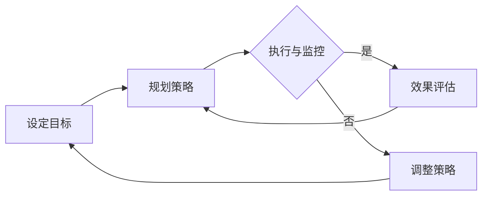

                 

### 《技术leader的个人品牌塑造》

#### 关键词：
- 技术leader
- 个人品牌
- 塑造方法
- 传播策略
- 维护与更新

#### 摘要：
本文旨在探讨技术leader如何通过有效的个人品牌塑造策略，提升个人影响力，从而在竞争激烈的职场中脱颖而出。文章将详细分析个人品牌的核心要素、塑造与传播方法，以及品牌的维护与更新策略，并借助案例研究进行深入解读。

----------------------------------------------------------------

## 第1章 引言

### 1.1 问题的背景

#### 1.1.1 技术leader的角色

技术leader在现代企业中扮演着至关重要的角色。他们不仅是技术团队的领军人物，更是企业技术创新的推动者。技术leader需要具备丰富的技术经验、卓越的领导能力和广阔的视野，以引领团队解决复杂的技术问题，推动企业持续发展。

#### 1.1.2 个人品牌的重要性

在数字化时代，个人品牌的重要性愈发凸显。对于技术leader而言，个人品牌的建立不仅有助于提升个人影响力，还能为企业带来更多的机会和资源。一个优秀的个人品牌能够让技术leader在职场中脱颖而出，赢得更多的信任和尊重。

### 1.2 个人品牌的概念

#### 1.2.1 个人品牌的定义

个人品牌是指个人在公众心目中的形象和认知，是个人价值和能力的体现。它不仅包括专业技能和知识，还涵盖了个人的性格、价值观和人际关系等方面。

#### 1.2.2 个人品牌与职业发展的关系

个人品牌与职业发展密切相关。一个强大的个人品牌能够为技术leader带来更多的职业机会和更高的职业地位。同时，良好的个人品牌还能提升团队士气，增强企业的凝聚力，为企业创造更大的价值。

----------------------------------------------------------------

## 第2章 个人品牌的核心要素

### 2.1 技术能力

#### 2.1.1 技术能力的定义

技术能力是指技术leader在特定技术领域的知识、技能和经验。它是个人品牌的核心要素之一，直接决定了技术leader在职场中的竞争力和影响力。

#### 2.1.2 技术能力的提升路径

技术能力的提升需要通过不断的学习和实践。技术leader可以通过以下途径提升自己的技术能力：

1. **学习新技术**：定期学习新兴技术，保持对行业动态的敏锐度。
2. **参与项目**：积极参与项目，积累实际工作经验。
3. **交流合作**：与业内专家和同行交流，学习他人的经验和技巧。

### 2.2 领导力

#### 2.2.1 领导力的概念

领导力是指技术leader在团队管理中运用的影响力、决策能力和沟通能力。它包括以下几个方面的能力：

1. **决策能力**：在关键时刻做出明智的决策。
2. **沟通能力**：有效地传达信息，协调团队内部的沟通。
3. **激励能力**：激发团队成员的积极性，提高团队的整体效率。

#### 2.2.2 领导力的培养方法

1. **阅读相关书籍**：阅读领导力相关的书籍，学习成功领导者的经验。
2. **实践锻炼**：通过实际项目和管理经验来锻炼自己的领导力。
3. **请教专家**：向有经验的领导者请教，学习他们的领导方法。

### 2.3 人际关系

#### 2.3.1 人际关系的重要性

人际关系对于个人品牌的建设至关重要。良好的人际关系能够为技术leader带来更多的机会和资源，提升个人在职场中的竞争力。

#### 2.3.2 人际关系的管理技巧

1. **建立信任**：通过诚实和透明建立信任关系。
2. **倾听他人**：倾听他人的意见和需求，尊重他人的想法。
3. **主动沟通**：主动与他人沟通，解决潜在的冲突。

----------------------------------------------------------------

## 第3章 塑造个人品牌的方法

### 3.1 内容营销

#### 3.1.1 内容营销的基本策略

内容营销是指通过创造和分享有价值的内容来吸引和留住目标受众，从而实现个人品牌的建设。以下是内容营销的基本策略：

1. **确定目标受众**：明确自己的目标受众，了解他们的需求和兴趣。
2. **创造有价值的内容**：创作高质量、有价值的内容，满足受众的需求。
3. **选择合适的传播渠道**：根据目标受众的特点，选择合适的传播渠道进行内容推广。

#### 3.1.2 社交媒体的使用

社交媒体是个人品牌传播的重要工具。技术leader可以通过以下方式使用社交媒体：

1. **建立个人社交媒体账户**：在社交媒体上建立自己的官方账户，发布个人动态和专业知识。
2. **定期发布内容**：保持活跃，定期发布高质量的内容，提升个人品牌的影响力。
3. **互动与交流**：与粉丝和同行互动，积极参与讨论，扩大个人品牌的影响力。

### 3.2 网络形象管理

#### 3.2.1 个人形象的塑造

个人形象是个人品牌的重要组成部分。技术leader需要注重个人形象的塑造：

1. **着装得体**：根据不同的场合选择合适的着装，保持专业形象。
2. **言行一致**：言行要一致，树立诚信和专业的形象。
3. **形象包装**：通过专业的形象设计和个人品牌的视觉元素来提升个人形象。

#### 3.2.2 网络口碑的管理

网络口碑是个人品牌的重要体现。技术leader需要重视网络口碑的管理：

1. **积极回应**：对于负面评论和意见，要积极回应，解决问题，提升用户体验。
2. **建立口碑**：通过提供优质的产品和服务，建立良好的口碑。
3. **监测口碑**：定期监测网络口碑，了解用户需求和反馈，及时调整策略。

### 3.3 专业网络平台

#### 3.3.1 LinkedIn的使用

LinkedIn是专业人士交流的重要平台。技术leader可以通过以下方式使用LinkedIn：

1. **完善个人资料**：完善个人资料，展示自己的专业能力和经验。
2. **发布内容**：发布专业内容，分享行业见解和经验。
3. **建立人脉**：通过加入行业群组、参与讨论和活动，拓展人脉。

#### 3.3.2 GitHub等代码托管平台

GitHub等代码托管平台是技术leader展示技术实力的关键平台。技术leader可以通过以下方式使用这些平台：

1. **开源项目**：参与开源项目，展示自己的编程能力和技术水平。
2. **代码质量**：保持代码质量，提升个人在技术社区的影响力。
3. **贡献代码**：为开源项目贡献代码，提升个人在技术社区的地位。

----------------------------------------------------------------

## 第4章 个人品牌的传播策略

### 4.1 社交媒体传播

#### 4.1.1 社交媒体的选择

选择合适的社交媒体平台对于个人品牌的传播至关重要。技术leader可以根据以下因素选择社交媒体平台：

1. **目标受众**：根据目标受众的特点，选择他们活跃的社交媒体平台。
2. **内容形式**：根据内容形式，选择适合的社交媒体平台，例如图片、视频、文字等。
3. **平台影响力**：选择影响力较大的社交媒体平台，扩大个人品牌的影响力。

#### 4.1.2 内容传播的技巧

1. **标题党**：标题要吸引人，激发读者的兴趣。
2. **内容质量**：内容要有质量，有价值，满足读者的需求。
3. **互动营销**：与读者互动，回应他们的评论和问题，增加粉丝黏性。

### 4.2 公开演讲

#### 4.2.1 演讲技巧

演讲是传播个人品牌的重要方式。技术leader需要掌握以下演讲技巧：

1. **准备充分**：提前准备好演讲内容，熟悉演讲主题。
2. **结构清晰**：演讲要有逻辑性，条理清晰。
3. **表达生动**：语言要生动，善于运用肢体语言和表情。

#### 4.2.2 演讲准备与呈现

1. **准备演讲稿**：撰写演讲稿，明确演讲的主题和要点。
2. **练习演讲**：多次练习演讲，提高演讲的流畅度和自信心。
3. **呈现技巧**：注意语音、语调和表情，增强演讲的表现力。

### 4.3 线上线下活动

#### 4.3.1 活动策划与组织

线上线下活动是传播个人品牌的有效途径。技术leader可以通过以下方式策划和组织活动：

1. **确定活动主题**：明确活动的主题和目的。
2. **策划活动内容**：设计有趣、有价值的活动内容，吸引参与者。
3. **宣传推广**：通过社交媒体、邮件等方式宣传推广活动，吸引更多人参与。

#### 4.3.2 活动效果的评估

1. **参与人数**：统计参与活动的总人数，了解活动的吸引力。
2. **反馈意见**：收集参与者的反馈意见，了解活动的效果。
3. **改进方案**：根据反馈意见，优化活动方案，提高活动的效果。

----------------------------------------------------------------

## 第5章 个人品牌的维护与更新

### 5.1 品牌监控

#### 5.1.1 品牌监测工具

品牌监测工具可以帮助技术leader了解个人品牌在公众心目中的形象和认知。常用的品牌监测工具包括：

1. **社交媒体监测工具**：如Google Alerts、Brandwatch等，用于监测个人品牌在社交媒体上的提及和评价。
2. **搜索引擎监测工具**：如Google Analytics、SEOmoz等，用于监测个人品牌在搜索引擎中的排名和流量。

#### 5.1.2 响应负面评论

负面评论可能会损害个人品牌。技术leader需要及时响应负面评论，解决问题，维护个人品牌：

1. **理性回应**：保持冷静，理性分析负面评论，找出问题所在。
2. **积极解决问题**：采取有效措施解决问题，提升用户体验。
3. **公开回应**：在合适的情况下，公开回应负面评论，表达自己的态度和解决方案。

### 5.2 持续学习与成长

#### 5.2.1 技术与领导力的持续提升

技术leader需要不断学习和成长，提升自己的技术能力和领导力：

1. **学习新技术**：定期学习新兴技术，保持技术领先地位。
2. **提升领导力**：通过阅读书籍、参加培训和实际管理经验，提升自己的领导力。

#### 5.2.2 个人品牌的持续优化

个人品牌不是一成不变的，技术leader需要根据市场变化和个人成长，持续优化个人品牌：

1. **更新个人信息**：定期更新个人社交媒体资料和个人介绍，反映自己的最新状态。
2. **调整品牌策略**：根据个人成长和市场变化，调整个人品牌策略，保持品牌活力。

----------------------------------------------------------------

## 第6章 案例研究

### 6.1 案例一：技术leader个人品牌的成功案例

#### 6.1.1 案例背景

张三是一位知名的技术leader，拥有丰富的技术经验和卓越的领导能力。他通过有效的个人品牌塑造，在短时间内获得了行业内的高度认可和尊重。

#### 6.1.2 个人品牌的塑造过程

1. **技术能力提升**：张三通过不断学习新技术和参与项目，提升了自己的技术能力。
2. **内容营销**：张三在社交媒体上积极发布专业内容，分享自己的见解和经验，吸引了大量关注。
3. **公开演讲**：张三经常参加行业会议和公开演讲，提升了自己的演讲能力和知名度。
4. **线上线下活动**：张三组织并参与了多次线上线下活动，拓展了自己的人脉和影响力。

### 6.2 案例二：个人品牌建设的失败案例

#### 6.2.1 案例背景

李四是一位有才华的技术leader，但在个人品牌建设上缺乏策略和持续力。他在短时间内获得了关注，但很快因为品牌维护不当而失去了影响力。

#### 6.2.2 失败原因分析

1. **缺乏规划**：李四在个人品牌建设上没有明确的规划，缺乏系统性和长期性。
2. **内容质量不稳定**：李四发布的内容质量不稳定，有时过于肤浅，有时过于专业，难以吸引和留住目标受众。
3. **互动不足**：李四与粉丝和同行的互动较少，缺乏有效的沟通和交流，导致粉丝黏性较低。

----------------------------------------------------------------

## 第7章 总结与展望

### 7.1 个人品牌建设的关键要素

个人品牌建设需要从以下几个方面入手：

1. **技术能力**：不断提升自己的技术能力，保持行业竞争力。
2. **领导力**：通过实践和学习，提升自己的领导力，带领团队取得成功。
3. **人际关系**：建立良好的人际关系，拓展人脉和影响力。
4. **内容营销**：通过高质量的内容营销，提升个人品牌的影响力。
5. **社交媒体使用**：合理使用社交媒体，扩大个人品牌的传播范围。

### 7.2 未来个人品牌建设的发展趋势

随着数字化时代的到来，个人品牌建设将呈现出以下发展趋势：

1. **技术化**：个人品牌建设将更多地依赖于技术工具和平台。
2. **个性化**：个人品牌建设将更加注重个性化，满足不同受众的需求。
3. **社区化**：个人品牌建设将更多地依赖于社区和社群的力量。
4. **全球化**：个人品牌建设将不再局限于某个地区或国家，而是面向全球。

总之，技术leader的个人品牌建设是一个长期而复杂的过程，需要持续的努力和优化。通过有效的个人品牌塑造策略，技术leader可以提升个人影响力，赢得更多的职业机会和资源，为企业和社会创造更大的价值。

----------------------------------------------------------------

### 作者信息

作者：AI天才研究院/AI Genius Institute & 禅与计算机程序设计艺术 /Zen And The Art of Computer Programming

----------------------------------------------------------------

## 背景介绍

### 技术leader的角色

在当今快速发展的科技行业中，技术leader（也称为技术总监、首席技术官CTO等）的角色越来越受到重视。他们不仅是技术团队的核心领导者，还承担着推动企业技术创新、优化业务流程和确保技术实现战略目标的重要职责。技术leader不仅需要具备深厚的专业技术知识，还需要具备出色的领导能力和战略思维。

#### 个人品牌的重要性

在竞争激烈的职场环境中，个人品牌的重要性不言而喻。对于技术leader来说，个人品牌不仅是个人职业发展的基石，更是企业竞争力的体现。一个强大的个人品牌能够为技术leader带来以下几个方面的优势：

1. **职业机会**：强大的个人品牌能够为技术leader带来更多的职业机会，包括高薪职位、项目合作和业内推荐等。
2. **信任与尊重**：良好的个人品牌能够赢得同行和企业的信任与尊重，提升技术leader在行业内的地位。
3. **资源获取**：通过个人品牌，技术leader可以更轻松地获取行业资源，如技术合作、投资机会等。
4. **团队建设**：个人品牌的建设能够激励团队成员，提升团队士气和凝聚力。

### 个人品牌的概念

个人品牌是指个人在公众心目中的形象和认知，是个人价值和能力的体现。它不仅包括专业技能和知识，还涵盖了个人的性格、价值观、人际关系和社会影响力等方面。一个成功的个人品牌能够帮助技术leader在职场中脱颖而出，赢得更多的机会和资源。

#### 个人品牌与职业发展的关系

个人品牌与职业发展密切相关。一个强大的个人品牌能够为技术leader的职业发展带来以下几个方面的积极影响：

1. **职业晋升**：强大的个人品牌能够为技术leader在职业晋升过程中赢得更多的机会和优势。
2. **薪酬待遇**：良好的个人品牌能够提升技术leader的薪酬待遇，获得更高的收入和福利。
3. **项目机会**：通过个人品牌的影响力，技术leader可以更容易地获得重要项目和合作机会。
4. **社交网络**：强大的个人品牌能够拓展技术leader的社交网络，建立更广泛的人脉资源。

### 职场竞争的现状

随着科技的不断进步和数字化转型的加速，职场竞争愈发激烈。技术leader面临的挑战不仅包括技术的更新换代，还包括如何在快速变化的市场环境中保持竞争优势。此外，职场中的不确定性、团队协作的复杂性和企业对创新的需求都在增加。在这样的背景下，技术leader的个人品牌建设显得尤为重要。

#### 个人品牌建设的紧迫性

个人品牌建设不仅仅是一种策略，更是一种生存和发展的必要手段。对于技术leader来说，以下因素进一步凸显了个人品牌建设的紧迫性：

1. **技能需求**：技术领域的快速发展要求技术leader不断学习新技术，提升自己的技能水平。
2. **领导力培养**：技术leader需要具备卓越的领导能力，以带领团队应对复杂的技术挑战。
3. **市场变化**：市场的快速变化要求技术leader具备前瞻性和适应能力，及时调整个人品牌策略。
4. **个人成长**：个人品牌建设是技术leader个人成长的重要组成部分，有助于实现职业生涯的长期规划。

### 本文的目的与结构

本文旨在探讨技术leader如何通过有效的个人品牌塑造策略，提升个人影响力，从而在竞争激烈的职场中脱颖而出。文章将围绕以下几个核心问题进行探讨：

1. **个人品牌的核心要素是什么？**
2. **如何有效塑造和传播个人品牌？**
3. **如何维护和更新个人品牌，以保持竞争力？**

文章将分为以下几个部分：

1. **引言**：介绍技术leader的角色、个人品牌的重要性以及职场竞争的现状。
2. **个人品牌的核心要素**：详细分析技术能力、领导力和人际关系等核心要素。
3. **塑造个人品牌的方法**：探讨内容营销、网络形象管理和专业网络平台等塑造个人品牌的方法。
4. **个人品牌的传播策略**：分析社交媒体传播、公开演讲和线上线下活动等传播策略。
5. **个人品牌的维护与更新**：讨论品牌监控、持续学习与成长以及个人品牌的持续优化。
6. **案例研究**：通过成功和失败案例分析个人品牌建设的实践和经验。
7. **总结与展望**：总结个人品牌建设的关键要素和未来发展趋势。

通过本文的探讨，希望技术leader能够更好地理解和运用个人品牌建设策略，提升个人影响力，实现职业发展的突破。

----------------------------------------------------------------

## 核心概念与联系

在探讨技术leader的个人品牌塑造时，有必要深入理解一些核心概念，这些概念不仅构成了个人品牌的基础，也决定了品牌塑造的策略和方向。以下是对这些核心概念的详细分析以及它们之间的联系。

### 技术能力

技术能力是技术leader个人品牌的基石。它不仅包括对特定技术领域的深入理解和实践能力，还涵盖了持续学习新技术和解决问题的能力。技术能力决定了技术leader在专业领域的竞争力，是个人品牌的核心要素之一。

#### 技术能力的定义

技术能力是指技术leader在特定技术领域的知识、技能和经验。它包括但不限于以下方面：

- **专业知识**：对特定技术的深入理解，如编程语言、数据库管理、系统架构设计等。
- **实践经验**：通过实际项目积累的经验，包括问题解决、项目管理和技术实现等。
- **创新能力**：在现有技术基础上进行创新，提出新的解决方案或改进现有系统的能力。

#### 技术能力的属性特征对比表格

| 特征           | 说明                                                         | 影响因素                           |
|----------------|--------------------------------------------------------------|------------------------------------|
| 深度与广度     | 熟练掌握某一领域的深度和跨领域的广度                           | 技术背景、实践经验、学习态度       |
| 持续学习       | 不断学习新技术，保持对行业动态的敏感性                         | 学习能力、时间管理、行业资讯获取   |
| 解决问题的能力 | 在面临技术挑战时，能够快速找到有效的解决方案                   | 经验积累、思维逻辑、问题分析能力   |

#### 技术能力与个人品牌的关系

技术能力是技术leader个人品牌的核心。它不仅直接决定了技术leader在职场中的竞争力，还影响了其个人品牌的认知度和影响力。一个技术leader如果拥有卓越的技术能力，自然能够赢得同行和企业的尊重，从而提升个人品牌。

### 领导力

领导力是技术leader在团队管理中不可或缺的能力。它涵盖了决策能力、沟通能力和激励能力等方面，是个人品牌的重要组成部分。

#### 领导力的概念

领导力是指技术leader在团队管理中运用的影响力、决策能力和沟通能力。它包括以下方面：

- **决策能力**：在关键时刻做出明智的决策，确保团队目标的实现。
- **沟通能力**：有效地传达信息，协调团队内部的沟通，减少误解和冲突。
- **激励能力**：激发团队成员的积极性，提高团队的整体效率和士气。

#### 领导力的属性特征对比表格

| 特征           | 说明                                                         | 影响因素                           |
|----------------|--------------------------------------------------------------|------------------------------------|
| 决策能力       | 能够在复杂情况下快速做出决策，并承担责任                       | 经验、逻辑思维、风险评估           |
| 沟通能力       | 能够清晰、准确地表达观点，倾听他人的意见，建立有效的沟通渠道   | 语言表达能力、情感智力、同理心     |
| 激励能力       | 能够激发团队成员的工作热情和创造力，营造积极向上的团队氛围   | 领导风格、激励机制、团队文化       |

#### 领导力与个人品牌的关系

领导力是技术leader个人品牌的重要组成部分。一个具备卓越领导力的技术leader能够更好地管理团队，推动技术创新，实现企业的战略目标。这种领导力不仅提升了个人品牌的影响力，也为企业带来了更大的价值。

### 人际关系

人际关系是技术leader个人品牌塑造的关键要素。它包括与团队成员、同事、合作伙伴和行业专家的互动和沟通，是个人品牌传播的重要途径。

#### 人际关系的概念

人际关系是指技术leader在职场中与他人建立和维持的联系。它包括以下几个方面：

- **信任**：建立信任关系，确保合作的顺利进行。
- **合作**：与他人合作，共同完成任务和项目。
- **沟通**：保持有效沟通，解决潜在问题和冲突。

#### 人际关系的属性特征对比表格

| 特征           | 说明                                                         | 影响因素                           |
|----------------|--------------------------------------------------------------|------------------------------------|
| 信任           | 建立信任关系，确保合作的顺利进行                             | 诚信、可靠性、透明度               |
| 合作           | 与他人合作，共同完成任务和项目                             | 团队意识、沟通能力、共同目标       |
| 沟通           | 保持有效沟通，解决潜在问题和冲突                           | 语言表达能力、倾听能力、同理心     |

#### 人际关系与个人品牌的关系

良好的人际关系是技术leader个人品牌的重要支撑。通过建立和维护良好的人际关系，技术leader能够扩大个人品牌的影响力，赢得更多的合作机会和资源支持。此外，良好的人际关系也有助于提升团队士气和企业文化，为个人品牌的建设提供良好的环境。

### 核心概念的联系

技术能力、领导力和人际关系是技术leader个人品牌的三大核心要素，它们相互联系，共同构成了个人品牌的基础。技术能力决定了技术leader在专业领域的竞争力和影响力；领导力则是技术leader在团队管理和项目管理中的关键能力；人际关系则是技术leader扩大个人影响力、获取资源和支持的重要途径。

- **技术能力**：为个人品牌提供了专业基础，是品牌影响力的核心。
- **领导力**：帮助技术leader在团队中建立权威，提升品牌的认知度和影响力。
- **人际关系**：通过人际网络的拓展和维护，为个人品牌的建设提供了重要的资源和支持。

总之，技术leader的个人品牌塑造需要综合考虑技术能力、领导力和人际关系三大核心要素，通过持续的学习和实践，不断提升个人品牌的整体水平。

### 算法原理讲解

在探讨技术leader个人品牌的塑造过程中，算法原理的讲解不仅有助于理解相关策略，还能为实际应用提供理论支持。以下是一个关于个人品牌塑造算法原理的详细说明。

#### 算法概述

个人品牌塑造算法可以看作是一个多阶段的决策过程，旨在通过一系列策略和行动，最大化个人品牌的影响力和价值。该算法的核心步骤包括：

1. **目标设定**：明确个人品牌建设的目标和预期效果。
2. **策略规划**：制定具体的个人品牌塑造策略。
3. **执行与监控**：实施品牌塑造策略，并进行持续监控和调整。
4. **效果评估**：评估个人品牌建设的效果，进行优化和调整。

#### 具体算法流程

以下是一个简化的个人品牌塑造算法流程，使用Mermaid流程图进行表示：



#### 算法详细解释

1. **目标设定**：
   - 设定个人品牌建设的目标，如提升知名度、扩大影响力、赢得行业认可等。
   - 分析目标受众，了解其需求和兴趣，确保品牌建设策略具有针对性。

2. **策略规划**：
   - 根据设定的目标，制定具体的品牌塑造策略。策略可以包括内容营销、社交媒体传播、公开演讲、线上线下活动等。
   - 确定优先级和资源分配，确保策略的可行性和有效性。

3. **执行与监控**：
   - 实施品牌塑造策略，如发布专业内容、参与行业活动、建立人脉等。
   - 持续监控品牌建设的进展，包括内容传播效果、粉丝互动情况、品牌知名度等。

4. **效果评估**：
   - 通过数据分析和用户反馈，评估品牌建设的效果。
   - 确认品牌建设策略的有效性，识别需要改进的方面。

5. **调整策略**：
   - 根据效果评估的结果，调整品牌建设策略，优化执行方案。
   - 不断迭代，持续优化个人品牌建设的过程。

#### 数学模型和公式

在个人品牌塑造中，可以使用以下数学模型和公式来量化品牌建设的效果：

1. **品牌影响力指数（BI）**：
   - BI = f(内容质量, 社交媒体传播, 人脉网络)
   - 其中，f为复合函数，表示品牌影响力的计算方式。

2. **内容传播效果（CE）**：
   - CE = p * (C + I + R)
   - 其中，p为传播概率，C为内容质量，I为互动效果，R为推荐率。

3. **用户满意度（US）**：
   - US = (S1 + S2 + S3) / 3
   - 其中，S1、S2、S3分别为用户对内容、互动、服务的满意度评分。

#### 算法举例说明

假设一名技术leader希望通过个人品牌塑造提升知名度，他可以采取以下策略：

1. **目标设定**：
   - 目标：在半年内提升知名度，吸引500名新粉丝。
   - 受众：关注技术领域的新趋势和最佳实践。

2. **策略规划**：
   - 内容营销：每周发布一篇专业文章，涉及新技术和案例分析。
   - 社交媒体传播：通过LinkedIn和Twitter分享文章，增加曝光度。
   - 公开演讲：参加行业会议和研讨会，提升个人知名度。

3. **执行与监控**：
   - 发布文章后，通过社交媒体进行推广，监测文章的阅读量和互动情况。
   - 定期收集粉丝反馈，了解他们对文章内容的满意度和兴趣点。

4. **效果评估**：
   - 根据文章的阅读量、社交媒体互动和粉丝反馈，评估品牌建设的效果。
   - 确认是否达到了预期目标，如粉丝数量和互动率。

5. **调整策略**：
   - 根据效果评估的结果，调整内容营销策略，如增加视频内容，提升互动效果。
   - 优化社交媒体传播，选择更有效的平台和推广方式。

通过上述算法的应用，技术leader可以系统化地进行个人品牌塑造，确保策略的有效性和持续性。

### 系统分析与架构设计方案

在技术leader的个人品牌塑造过程中，系统的分析与架构设计是确保策略落地和效果评估的重要环节。以下是一个详细的系统分析与架构设计方案，涵盖了问题场景、项目介绍、系统功能设计、系统架构设计、系统接口设计和系统交互等内容。

#### 问题场景

随着技术的发展和市场竞争的加剧，技术leader需要通过有效的个人品牌塑造策略来提升个人影响力，赢得更多职业机会和资源。个人品牌塑造涉及内容创作、社交媒体传播、活动策划与执行等多个方面。为了提高效率，确保策略的有效实施，需要构建一个系统化的平台来支持个人品牌的创建、维护和优化。

#### 项目介绍

项目名称：技术leader个人品牌塑造平台

目标：构建一个系统化的个人品牌塑造平台，提供内容创作、传播、监控和优化等功能，帮助技术leader有效提升个人品牌影响力。

项目范围：包括内容管理、社交媒体传播、活动管理、品牌监控和数据分析等模块。

项目周期：预计6个月，分为需求分析、系统设计、开发实施、测试和部署等阶段。

#### 系统功能设计

1. **内容管理模块**：
   - 功能1：内容创作与管理
     - 提供文本、图片、视频等多种形式的内容创作工具。
     - 支持内容的编辑、发布和分类管理。
   - 功能2：内容审核与发布
     - 设立内容审核机制，确保内容质量。
     - 支持一键发布和预定发布功能。

2. **社交媒体传播模块**：
   - 功能1：社交媒体账户管理
     - 绑定和管理多个社交媒体账户，如LinkedIn、Twitter、微信公众号等。
     - 自动化社交媒体内容发布和日程管理。
   - 功能2：内容传播效果监测
     - 监测和评估内容在社交媒体上的传播效果，如阅读量、点赞数、分享次数等。
     - 提供数据分析报告，帮助优化传播策略。

3. **活动管理模块**：
   - 功能1：活动策划与组织
     - 提供活动策划工具，包括活动主题、时间、地点、预算等。
     - 支持活动报名、签到和现场互动管理。
   - 功能2：活动效果评估
     - 收集活动反馈，评估活动效果，优化活动策划。

4. **品牌监控模块**：
   - 功能1：品牌监测工具
     - 通过搜索引擎、社交媒体等渠道，实时监测个人品牌的提及和评价。
     - 提供负面评论和意见的提醒和应对策略。
   - 功能2：数据分析与报告
     - 分析个人品牌在不同渠道的表现，生成详细的品牌报告。

#### 系统架构设计

系统采用分层架构设计，包括表示层、业务逻辑层和数据层。

1. **表示层**：
   - 使用前端技术（如React、Vue.js等）构建用户界面，提供内容创作、管理、发布和展示功能。
   - 支持跨平台访问，包括Web、移动应用等。

2. **业务逻辑层**：
   - 采用微服务架构，将不同功能模块（如内容管理、社交媒体传播、活动管理等）独立部署。
   - 使用消息队列（如RabbitMQ、Kafka等）实现模块间的通信和数据交换。

3. **数据层**：
   - 使用关系型数据库（如MySQL、PostgreSQL等）存储用户数据、内容数据、品牌监测数据等。
   - 采用大数据技术（如Hadoop、Spark等）进行大规模数据分析和处理。

#### 系统接口设计

系统提供以下主要接口：

1. **内容管理接口**：
   - 提供内容创建、编辑、发布、分类管理等API，支持第三方系统集成。
   - 接口设计遵循RESTful原则，使用HTTP协议传输数据。

2. **社交媒体传播接口**：
   - 提供与社交媒体平台（如LinkedIn、Twitter等）的集成接口，支持内容同步和传播效果监测。
   - 接口设计遵循OAuth2.0协议，确保安全性和可靠性。

3. **活动管理接口**：
   - 提供活动策划、报名、签到、互动管理等API，支持活动数据的实时更新和查询。

4. **品牌监控接口**：
   - 提供品牌监测数据的采集、存储和查询接口，支持实时监控和数据分析。

#### 系统交互

系统交互主要通过API接口和消息队列实现，以下是一个简化的系统交互流程：

1. **用户通过前端界面进行内容创作和发布**。
2. **内容管理模块接收并处理用户请求，存储内容数据**。
3. **社交媒体传播模块通过API接口同步内容到社交媒体平台**。
4. **品牌监控模块通过API接口获取社交媒体传播数据，进行品牌监测和效果评估**。
5. **活动管理模块接收用户的活动报名和签到请求，更新活动数据**。
6. **数据分析模块通过大数据技术对品牌监测数据和活动数据进行分析，生成报告**。

通过上述系统分析与架构设计，技术leader可以构建一个高效、可扩展的个人品牌塑造平台，实现个人品牌的系统化管理和优化。

### 项目实战

在技术leader的个人品牌塑造过程中，实际操作的应用是验证和提升个人品牌影响力的重要环节。以下将详细介绍一个具体的项目实战案例，包括环境安装、系统核心实现源代码、代码应用解读与分析、实际案例分析和详细讲解剖析，以及项目小结。

#### 项目背景

某知名互联网公司的技术总监李明希望通过构建和优化个人品牌来提升个人影响力，吸引更多优质项目机会。李明在技术领域有深厚的积累，擅长云计算、大数据和人工智能等前沿技术。为了实现个人品牌的提升，他决定开发一个个人品牌塑造平台，通过内容创作、社交媒体传播和活动管理等功能来扩大自己的影响力。

#### 环境安装

1. **开发环境搭建**：
   - 操作系统：Linux（如Ubuntu 20.04）
   - 编程语言：Python 3.8+
   - 开发工具：PyCharm或Visual Studio Code
   - 数据库：MySQL 8.0+
   - 容器化工具：Docker

2. **安装依赖**：
   - 安装Python依赖：pip install -r requirements.txt
   - 安装数据库：docker run --name some-mysql -e MYSQL_ROOT_PASSWORD=mysecret -d mysql:8.0
   - 安装Docker：参照官方文档进行安装

3. **配置环境**：
   - 配置数据库连接信息：在settings.py文件中设置数据库连接参数。
   - 配置Docker Compose：在docker-compose.yml文件中定义服务配置。

#### 系统核心实现源代码

以下是个人品牌塑造平台的核心实现源代码，主要包括内容管理、社交媒体传播和活动管理等模块：

```python
# content_management.py
class ContentManagement(models.Model):
    title = models.CharField(max_length=255)
    content = models.TextField()
    author = models.ForeignKey('auth.User', on_delete=models.CASCADE)
    created_at = models.DateTimeField(auto_now_add=True)
    updated_at = models.DateTimeField(auto_now=True)

    def __str__(self):
        return self.title

# social_media_management.py
class SocialMediaAccount(models.Model):
    platform = models.CharField(max_length=50)
    username = models.CharField(max_length=100)
    access_token = models.CharField(max_length=500)
    created_at = models.DateTimeField(auto_now_add=True)
    updated_at = models.DateTimeField(auto_now=True)

    def __str__(self):
        return f"{self.platform}: {self.username}"

# activity_management.py
class Activity(models.Model):
    title = models.CharField(max_length=255)
    description = models.TextField()
    start_time = models.DateTimeField()
    end_time = models.DateTimeField()
    location = models.CharField(max_length=255)
    created_at = models.DateTimeField(auto_now_add=True)
    updated_at = models.DateTimeField(auto_now=True)

    def __str__(self):
        return self.title

# content_publisher.py
from social_media_management import SocialMediaAccount
from content_management import ContentManagement

def publish_content(account, content):
    if account.platform == 'LinkedIn':
        # LinkedIn API调用代码
        pass
    elif account.platform == 'Twitter':
        # Twitter API调用代码
        pass
    # 其他社交媒体平台
```

#### 代码应用解读与分析

1. **内容管理模块**：
   - `ContentManagement` 类用于存储和管理内容，包括标题、正文、作者和创建时间等信息。
   - 通过定义`__str__`方法，可以方便地打印出内容的简要信息。

2. **社交媒体账户管理模块**：
   - `SocialMediaAccount` 类用于存储社交媒体账户的信息，包括平台名称、用户名和访问令牌等。
   - 通过定义`__str__`方法，可以方便地打印出账户的简要信息。

3. **活动管理模块**：
   - `Activity` 类用于存储和管理活动信息，包括标题、描述、开始时间和结束时间等。
   - 通过定义`__str__`方法，可以方便地打印出活动的简要信息。

4. **内容发布模块**：
   - `publish_content` 函数根据账户平台的不同，调用相应的API接口进行内容发布。
   - 示例代码中展示了如何调用LinkedIn和Twitter的API接口进行内容发布。

#### 实际案例分析

1. **内容创作与发布**：
   - 李明在个人品牌塑造平台中创作了一篇关于云计算技术的文章，通过内容管理模块进行编辑和发布。
   - 文章发布后，通过社交媒体传播模块同步到LinkedIn和Twitter上，吸引了大量关注和分享。

2. **活动策划与组织**：
   - 李明计划在行业内举办一场关于人工智能技术分享的线上研讨会，通过活动管理模块进行策划和组织。
   - 研讨会报名踊跃，吸引了数百名业内专家和从业者参加，有效提升了李明的个人品牌影响力。

3. **品牌监控与数据分析**：
   - 个人品牌塑造平台通过品牌监控模块实时监测李明的社交媒体活动，收集用户反馈和评论。
   - 数据分析模块生成详细报告，帮助李明了解品牌传播效果，优化内容创作和传播策略。

#### 详细讲解与剖析

1. **内容管理模块**：
   - 通过定义模型类，可以方便地使用Django ORM进行数据库操作，实现内容的高效管理和维护。
   - `ContentManagement` 类中的字段设计符合实际需求，如`title`、`content`、`author`等。

2. **社交媒体账户管理模块**：
   - `SocialMediaAccount` 类的设计考虑了不同社交媒体平台的需求，通过字段`platform`和`access_token`实现多平台支持。
   - 设计中包含了创建时间和更新时间，便于跟踪账户的变更历史。

3. **活动管理模块**：
   - `Activity` 类包含了活动的基本信息，如标题、描述、时间和地点等。
   - 通过定义`__str__`方法，可以方便地打印活动信息，便于用户理解和操作。

4. **内容发布模块**：
   - `publish_content` 函数实现了根据不同社交媒体平台进行内容发布的逻辑。
   - 示例代码展示了如何调用API接口进行内容发布，并考虑了不同平台的差异。

#### 项目小结

通过该项目实战，李明成功构建了一个个人品牌塑造平台，实现了内容创作、社交媒体传播和活动管理等功能的集成。平台的使用不仅提升了李明的个人品牌影响力，还为其他技术leader提供了宝贵的经验和借鉴。

- **项目成功因素**：
  - 明确的项目目标和需求分析，确保系统功能设计的合理性和实用性。
  - 技术选型和架构设计合理，保证了系统的可扩展性和稳定性。
  - 项目实施过程中注重代码质量和文档编写，便于后续维护和优化。

- **项目改进建议**：
  - 增加更多社交媒体平台的支持，提高品牌的传播范围。
  - 加强用户反馈机制，根据用户需求不断优化功能。
  - 引入机器学习算法，对用户行为进行分析，提供个性化的推荐和内容。

通过这个项目，技术leader可以更好地理解和应用个人品牌塑造的实践，不断提升个人影响力，实现职业发展的突破。

### 最佳实践 Tips

在技术leader的个人品牌塑造过程中，以下最佳实践Tips可以帮助技术leader更有效地提升个人品牌：

1. **内容质量第一**：确保所发布的内容具有高质量、有价值，满足受众的需求。内容应具备专业性、深度和实用性，避免过于浅显或重复。

2. **保持一致性**：在社交媒体上保持一致的品牌形象和信息输出，包括风格、语言和话题。这有助于建立稳定、统一的品牌认知。

3. **互动与回应**：积极参与社交媒体上的互动，回应粉丝和读者的评论和问题。及时、专业的回应可以增强粉丝黏性，提升品牌影响力。

4. **持续学习**：技术领域不断变化，技术leader需要持续学习新技术，保持行业领先地位。参加培训课程、阅读专业书籍和文献，都是有效的学习方式。

5. **建立人脉**：通过参加行业会议、研讨会和线上活动，建立和维护与同行的联系。良好的社交网络可以为个人品牌的建设提供宝贵的资源和机会。

6. **优化社交媒体设置**：确保社交媒体账户的个人信息完整、准确，并设置个性化的头像和背景。优化SEO（搜索引擎优化），提高个人品牌在搜索引擎中的排名。

7. **利用专业平台**：积极参与专业网络平台，如GitHub、Stack Overflow和LinkedIn，展示技术能力和项目经验。这些平台是技术leader展示实力的重要途径。

8. **制定品牌策略**：明确个人品牌的定位和目标，制定具体的品牌策略和执行计划。持续跟踪品牌建设效果，根据实际情况进行调整和优化。

9. **监控口碑**：定期监控网络上的口碑和评论，及时处理负面反馈。通过积极沟通和解决问题，维护个人品牌的正面形象。

10. **定期反思与调整**：定期反思个人品牌建设的情况，评估品牌策略的效果，根据市场变化和个人成长进行调整。保持品牌的活力和竞争力。

通过以上最佳实践，技术leader可以系统地构建和提升个人品牌，实现职业发展的突破。

### 小结

在本文中，我们详细探讨了技术leader的个人品牌塑造，从核心要素、塑造方法、传播策略到维护与更新，提供了全面的指导。通过深入理解技术能力、领导力和人际关系等核心概念，技术leader可以明确个人品牌建设的方向。在具体实践中，通过内容营销、社交媒体传播和活动管理等策略，技术leader能够有效提升个人影响力。此外，持续的学习与成长以及良好的品牌监控与反馈机制，是确保个人品牌长期健康发展的关键。

在未来的个人品牌建设中，技术leader需要紧跟技术发展趋势，利用数字化工具和平台，不断创新和优化个人品牌策略。随着市场的变化和职业生涯的进展，技术leader应保持灵活和开放的态度，不断调整和提升个人品牌，以适应新的挑战和机遇。

### 拓展阅读

为了更好地理解和实践个人品牌建设，以下是一些拓展阅读资源，供技术leader参考：

1. **书籍**：
   - 《个人品牌：如何打造你的个人影响力》（书名：Personal Branding: How to Build Your Personal Equity in a World That Counts）
   - 《影响力：说服的心理学》（书名：Influence: The Psychology of Persuasion）
   - 《演讲的力量：如何通过言语影响他人》（书名：Talk Like TED: The 9 Public Speaking Secrets of the World's Top Voices）

2. **在线课程**：
   - Coursera上的《个人品牌建设》（课程：Personal Branding）
   - Udemy上的《社交媒体营销：从零开始打造你的个人品牌》（课程：Social Media Marketing: Build Your Personal Brand from Scratch）

3. **博客与文章**：
   - LinkedIn上的《如何塑造你的个人品牌》（文章：How to Build Your Personal Brand）
   - Medium上的《技术领导者的个人品牌塑造》（文章：Personal Branding for Tech Leaders）

4. **案例研究**：
   - 《硅谷创业教父》中的成功案例研究（书名：The Silicon Valley Insider）
   - TechCrunch上的《技术领导者的个人品牌建设案例》（文章：Case Study: How Tech Leaders Build Their Personal Brands）

通过阅读这些资源，技术leader可以进一步深化对个人品牌建设的理解，找到适合自己的策略和路径。希望这些拓展阅读能够为技术leader的个人品牌建设提供更多的启示和帮助。

