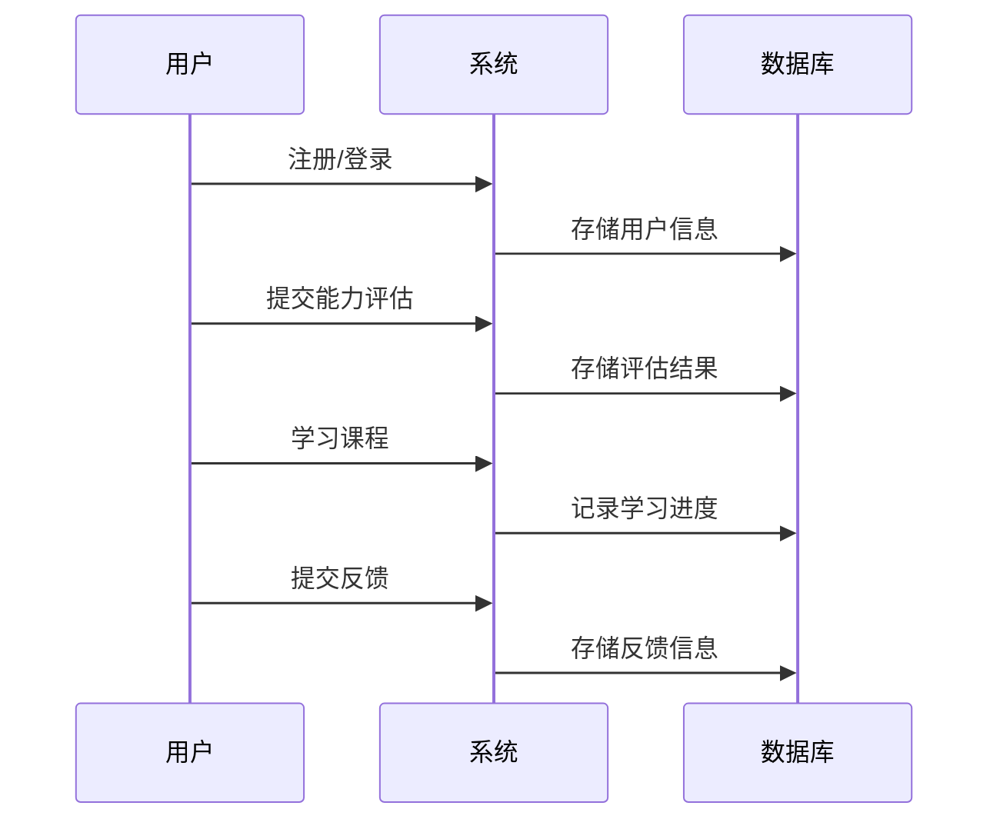
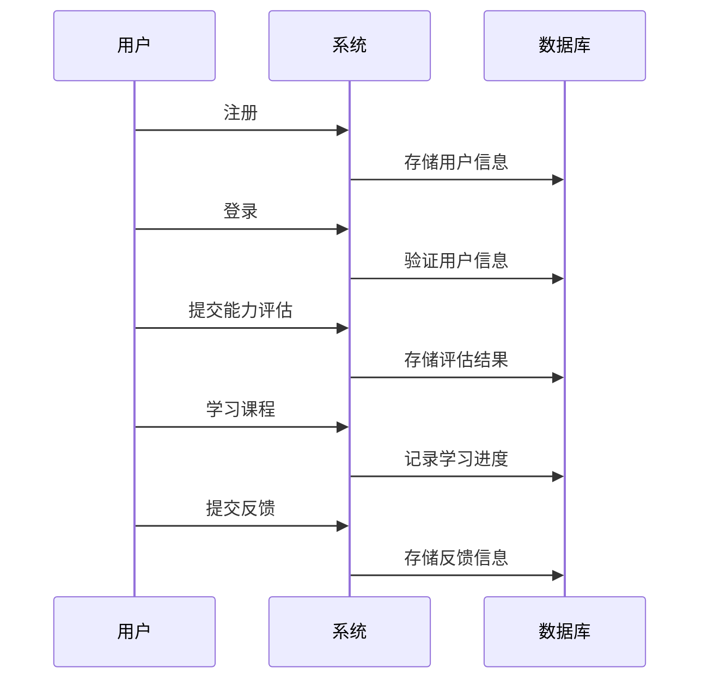

                 

### 第一部分: 引言

在当今快速发展的信息技术领域，技术leader的角色变得愈发重要。他们不仅是团队的技术核心，更是项目的关键推动者和决策者。然而，成功的技术leader不仅需要卓越的技术能力，还需要具备出色的个人形象。本文将深入探讨技术leader的个人形象塑造，详细分析其在职业发展中的重要性，并提出具体的塑造方法与策略。

#### 1.1 问题背景

**1.1.1 技术leader现状**

随着数字化转型的深入，技术leader的角色变得日益复杂。他们不仅要管理技术团队，还需要具备项目管理和业务理解的能力。然而，许多技术leader在实际工作中面临一系列挑战，如技术能力与领导力的双重需求、团队管理难度增加等。

**1.1.2 个人形象对技术leader的重要性**

个人形象是技术leader在职场中的一种软实力，它不仅影响个人的职业发展，也直接关系到团队绩效和项目成败。一个良好的个人形象可以帮助技术leader赢得团队的尊重与信任，提高项目执行力。

**1.1.3 塑造个人形象的必要性**

在当前竞争激烈的职场环境中，技术leader需要通过塑造良好的个人形象来提升自身的竞争力。这不仅有助于职业生涯的发展，还能在团队中树立榜样，推动团队共同进步。

#### 1.2 问题描述

**1.2.1 技术leader个人形象的定义**

技术leader的个人形象是指其在技术能力、领导力、人际沟通能力、专业态度、持续学习与创新等各方面的表现。一个完善的技术leader个人形象应具备多方面的素质，以满足现代企业的需求。

**1.2.2 塑造个人形象的目标与原则**

塑造个人形象的目标是提升个人在团队和行业中的影响力，增强职业竞争力。在塑造过程中，应遵循诚信、务实、持续改进等原则，确保个人形象的长期稳定。

**1.2.3 技术leader个人形象的核心要素**

技术leader个人形象的核心要素包括技术能力、领导力、人际沟通能力、专业态度和持续学习与创新。这些要素相互联系，共同构成了一个全面、有影响力的个人形象。

#### 1.3 问题解决

**1.3.1 塑造个人形象的方法与策略**

为了塑造良好的个人形象，技术leader可以采取以下方法与策略：
1. **提升技术能力**：通过不断学习和实践，提升自身的专业素养。
2. **培养领导力**：通过团队管理实践和领导力培训，提高决策和团队领导能力。
3. **增强人际沟通能力**：通过沟通技巧的训练，提高与团队成员和上级的有效沟通。
4. **保持专业态度**：以责任心、敬业精神和职业操守为基础，树立良好的职业形象。
5. **持续学习与创新**：保持对新技术和行业趋势的关注，不断提升自身的创新能力。

**1.3.2 塑造个人形象的实践步骤**

1. **自我认知**：明确自身优势与不足，制定个人发展计划。
2. **学习与实践**：通过专业培训、阅读和技术实践，不断提升自身能力。
3. **反思与调整**：定期反思个人行为和表现，及时调整发展方向。
4. **建立人脉**：积极参与行业活动和社交，扩大人脉资源。
5. **树立榜样**：通过自己的行为和成果，影响和激励团队成员。

#### 1.4 边界与外延

**1.4.1 个人形象与企业文化**

个人形象应与企业文化相契合，以增强团队凝聚力和企业竞争力。技术leader应在塑造个人形象时，充分考虑企业文化的特点和价值观。

**1.4.2 个人形象与团队管理**

良好的个人形象有助于技术leader在团队管理中树立权威和信任，提高团队协作效率。

**1.4.3 个人形象与职业发展**

个人形象直接关系到技术leader的职业发展。一个优秀的个人形象可以为技术leader打开更广阔的职业发展空间。

#### 1.5 概念结构与核心要素组成

**1.5.1 个人形象的概念架构**

个人形象是由多个核心要素组成的结构体系，这些要素相互关联，共同构成一个完整、有影响力的个人形象。

**1.5.2 个人形象的核心要素**

个人形象的核心要素包括技术能力、领导力、人际沟通能力、专业态度和持续学习与创新。这些要素是技术leader个人形象的重要组成部分。

**1.5.3 个人形象要素之间的关系**

技术能力、领导力、人际沟通能力、专业态度和持续学习与创新等核心要素之间相互影响、相互促进，共同构成了一个完善的技术leader个人形象。

#### 1.6 本章小结

本文首先介绍了技术leader个人形象塑造的背景和必要性，然后明确了个人形象的定义、目标与核心要素，最后提出了具体的塑造方法和实践步骤。通过塑造良好的个人形象，技术leader可以在职业生涯中取得更大的成功。

----------------------------------------------------------------

### 核心概念与联系

在探讨技术leader的个人形象塑造时，我们需要明确几个核心概念，并分析它们之间的联系。以下是本文将详细讨论的五个核心概念：技术能力、领导力、人际沟通能力、专业态度和持续学习与创新能力。

#### 2.1 技术能力

技术能力是技术leader的核心素养，包括但不限于编程技能、算法知识、系统架构设计和项目管理能力。技术能力决定了技术leader在团队中的专业地位和影响力。以下是技术能力的几个重要方面：

**2.1.1 技术能力的定义与分类**

技术能力可以分为基础技能和高级技能。基础技能包括编程语言、数据结构与算法等；高级技能则涉及系统架构设计、分布式系统开发、大数据处理和云计算等。

**2.1.2 技术能力的重要性**

技术能力是技术leader能否带领团队解决复杂技术问题的基石。一个具备强大技术能力的技术leader能够更好地理解团队需求，提供技术解决方案，并在技术难题面前保持冷静和自信。

**2.1.3 技术能力的培养方法**

- **持续学习**：通过阅读技术书籍、参加线上和线下课程、关注技术博客和论坛，不断更新知识体系。
- **实践经验**：通过实际项目经验，将理论知识应用到实践中，提升解决实际问题的能力。
- **交流与分享**：参加技术沙龙、研讨会和开源项目，与其他技术专家交流，拓宽视野，提升技术水平。

#### 2.2 领导力

领导力是技术leader在团队管理中不可或缺的素质，它决定了技术leader能否有效地激发团队潜力，实现项目目标。以下是领导力的几个关键方面：

**2.2.1 领导力的定义与类型**

领导力是指通过激励和影响他人，实现共同目标的能力。根据其表现形式，领导力可以分为变革型领导力、交易型领导力和团队领导力。

**2.2.2 领导力的重要性**

领导力是技术leader能否成功带领团队的关键因素。一个具备强大领导力的技术leader能够激励团队成员，解决团队冲突，提高团队凝聚力，实现团队目标。

**2.2.3 领导力的培养方法**

- **自我认知**：通过反思和自我评估，了解自己的领导风格和优缺点。
- **团队建设**：通过团队活动和培训，增强团队凝聚力和信任感。
- **决策能力**：通过学习和实践，提高决策质量和效率。
- **沟通技巧**：通过有效的沟通，确保信息传递准确无误，增强团队协作。

#### 2.3 人际沟通能力

人际沟通能力是技术leader在团队合作中不可或缺的素质，它决定了技术leader能否与团队成员建立良好的关系，提高团队效率。以下是人际沟通能力的几个重要方面：

**2.3.1 人际沟通能力的定义与分类**

人际沟通能力是指通过语言、非语言和行为等方式，与他人进行有效沟通的能力。根据其表现形式，人际沟通能力可以分为口头沟通、书面沟通和非语言沟通。

**2.3.2 人际沟通能力的重要性**

人际沟通能力是技术leader能否成功带领团队的关键因素之一。一个具备强大人际沟通能力的技术leader能够更好地理解团队成员的需求和想法，解决团队内部的冲突，提高团队协作效率。

**2.3.3 人际沟通能力的培养方法**

- **倾听**：通过倾听，了解团队成员的真实想法和需求，建立信任。
- **表达**：通过清晰、简洁的语言表达自己的想法，确保信息传达准确。
- **情绪管理**：通过控制自己的情绪，避免在沟通中产生冲突。
- **非语言沟通**：通过肢体语言和面部表情，增强沟通效果。

#### 2.4 专业态度

专业态度是技术leader在职业生涯中不可或缺的素质，它决定了技术leader能否在职场中保持职业操守和敬业精神。以下是专业态度的几个关键方面：

**2.4.1 专业态度的定义与特征**

专业态度是指以高度的责任心、敬业精神和职业操守来对待工作的态度。它包括认真负责、追求卓越、遵守职业规范等特征。

**2.4.2 专业态度的重要性**

专业态度是技术leader在职业生涯中取得成功的关键因素之一。一个具备良好专业态度的技术leader能够赢得团队成员和上级的信任，提高个人和团队的工作效率。

**2.4.3 培养专业态度的方法**

- **自我约束**：通过自律，保持工作的高标准和高质量。
- **持续学习**：通过不断学习，提升专业知识和技能。
- **团队合作**：通过积极参与团队活动，增强团队协作精神。
- **反思与改进**：通过定期反思和总结，不断改进工作方法。

#### 2.5 持续学习与创新能力

持续学习与创新能力是技术leader在快速变化的职场环境中保持竞争力的关键。以下是持续学习与创新能力的几个关键方面：

**2.5.1 持续学习的定义与重要性**

持续学习是指通过不断学习和实践，提升自身知识水平和技能的过程。在技术领域，持续学习是适应新技术、保持专业竞争力的重要途径。

**2.5.2 创新能力的定义与类型**

创新能力是指通过创造性思维和实践，解决新问题和创造新价值的能力。根据其表现形式，创新能力可以分为技术革新、业务模式创新和团队管理创新等。

**2.5.3 持续学习与创新能力的培养方法**

- **学习资源**：利用网络课程、技术书籍、行业会议等资源，持续学习。
- **实践机会**：通过实际项目和实验，将理论知识应用到实践中。
- **跨学科学习**：跨学科学习，拓宽知识视野，提高创新能力。
- **反思与总结**：通过反思和总结，发现和解决工作中的问题，不断提升自身能力。

#### 2.6 概念属性特征对比表格

为了更好地理解技术leader个人形象的核心要素，我们可以通过以下表格对它们进行对比：

| 核心概念 | 定义与特征 | 重要性 | 培养方法 |
| --- | --- | --- | --- |
| 技术能力 | 编程技能、算法知识、系统架构设计等 | 解决技术问题的能力 | 持续学习、实践经验、交流与分享 |
| 领导力 | 变革型、交易型和团队领导力 | 激励团队、解决冲突 | 自我认知、团队建设、决策能力、沟通技巧 |
| 人际沟通能力 | 口头沟通、书面沟通、非语言沟通 | 建立良好关系、提高团队效率 | 倾听、表达、情绪管理、非语言沟通 |
| 专业态度 | 责任心、敬业精神、职业操守 | 赢得信任、提高效率 | 自我约束、持续学习、团队合作、反思与改进 |
| 持续学习与创新能力 | 持续学习、创新能力 | 适应新技术、保持竞争力 | 学习资源、实践机会、跨学科学习、反思与总结 |

#### 2.7 ER实体关系图架构

为了更好地理解技术leader个人形象的核心要素及其相互关系，我们可以使用ER（实体关系）图来表示这些概念之间的关系。

```mermaid
erDiagram
  Leader ||--|{ 技术能力 }
  Leader ||--|{ 领导力 }
  Leader ||--|{ 人际沟通能力 }
  Leader ||--|{ 专业态度 }
  Leader ||--|{ 持续学习与创新能力 }
```

在这个ER图中，技术leader作为核心实体，与其他四个核心要素之间存在直接关联。这些要素相互依赖、相互促进，共同构成了技术leader的个人形象。

#### 2.7 本章小结

通过本文的讨论，我们明确了技术leader个人形象的核心概念及其相互关系。技术能力、领导力、人际沟通能力、专业态度和持续学习与创新能力是技术leader个人形象的重要组成部分。通过不断培养和提升这些能力，技术leader可以在职业生涯中取得更大的成功。

----------------------------------------------------------------

### 第三部分: 算法原理讲解

在技术leader的个人形象塑造过程中，算法原理的讲解可以帮助我们更好地理解各个核心要素的培养方法和策略。以下是关于技术能力、领导力、人际沟通能力、专业态度和持续学习与创新能力的技术讲解，包括数学模型、具体培养方法和实际案例。

#### 3.1 技术能力

**3.1.1 技术能力的定义与分类**

技术能力是指技术leader在特定技术领域的专业知识和技能。根据其应用范围，技术能力可以分为基础技术能力和高级技术能力。

- **基础技术能力**：包括编程语言、数据结构与算法等基本知识。
- **高级技术能力**：包括系统架构设计、分布式系统开发、大数据处理和云计算等。

**3.1.2 技术能力的重要性**

技术能力是技术leader在团队中发挥核心作用的基础。具备强大技术能力的技术leader能够更好地理解团队需求，提供有效的技术解决方案，并在技术难题面前保持冷静和自信。

**3.1.3 技术能力的培养方法**

1. **持续学习**：通过阅读技术书籍、参加线上和线下课程、关注技术博客和论坛，不断更新知识体系。
2. **实践经验**：通过实际项目经验，将理论知识应用到实践中，提升解决实际问题的能力。
3. **交流与分享**：参加技术沙龙、研讨会和开源项目，与其他技术专家交流，拓宽视野，提升技术水平。

**3.1.4 技术能力的数学模型**

技术能力可以用以下数学模型表示：
$$
\text{技术能力} = f(\text{基础知识}, \text{实践经验}, \text{学习能力})
$$
其中，基础知识、实践经验和学习能力是技术能力的三个关键影响因素。

**3.1.5 技术能力举例说明**

假设一位技术leader，他的基础知识得分为90分，实践经验得分为80分，学习能力得分为85分。根据数学模型，我们可以计算出他的技术能力：
$$
\text{技术能力} = f(90, 80, 85) = 90 \times 0.5 + 80 \times 0.3 + 85 \times 0.2 = 89.5
$$
因此，这位技术leader的技术能力得分为89.5分。

#### 3.2 领导力

**3.2.1 领导力的定义与类型**

领导力是指通过激励和影响他人，实现共同目标的能力。根据表现形式，领导力可以分为变革型领导力、交易型领导力和团队领导力。

- **变革型领导力**：通过激励和启发，推动团队成员实现自我超越和共同目标。
- **交易型领导力**：通过奖励和惩罚，激励团队成员为实现团队目标而努力。
- **团队领导力**：通过协调和沟通，促进团队成员之间的合作和协作。

**3.2.2 领导力的重要性**

领导力是技术leader在团队管理中不可或缺的素质。具备强大领导力的技术leader能够更好地激发团队潜力，提高团队绩效，实现项目目标。

**3.2.3 领导力的培养方法**

1. **自我认知**：通过反思和自我评估，了解自己的领导风格和优缺点。
2. **团队建设**：通过团队活动和培训，增强团队凝聚力和信任感。
3. **决策能力**：通过学习和实践，提高决策质量和效率。
4. **沟通技巧**：通过有效的沟通，确保信息传递准确无误，增强团队协作。

**3.2.4 领导力的数学模型**

领导力可以用以下数学模型表示：
$$
\text{领导力} = f(\text{影响力}, \text{团队凝聚力}, \text{决策能力})
$$
其中，影响力、团队凝聚力和决策能力是领导力的三个关键影响因素。

**3.2.5 领导力举例说明**

假设一位技术leader，他的影响力得分为90分，团队凝聚力得分为80分，决策能力得分为85分。根据数学模型，我们可以计算出他的领导力：
$$
\text{领导力} = f(90, 80, 85) = 90 \times 0.5 + 80 \times 0.3 + 85 \times 0.2 = 89.5
$$
因此，这位技术leader的领导力得分为89.5分。

#### 3.3 人际沟通能力

**3.3.1 人际沟通能力的定义与分类**

人际沟通能力是指技术leader与他人进行有效沟通的能力。根据沟通形式，人际沟通能力可以分为口头沟通、书面沟通和非语言沟通。

- **口头沟通**：通过口头语言进行沟通，包括演讲、讨论和会议等。
- **书面沟通**：通过书面形式进行沟通，包括报告、邮件和文档等。
- **非语言沟通**：通过肢体语言、面部表情和姿态等非语言形式进行沟通。

**3.3.2 人际沟通能力的重要性**

人际沟通能力是技术leader在团队管理和项目执行中不可或缺的素质。具备强大人际沟通能力的技术leader能够更好地理解团队成员的需求和想法，解决团队内部的冲突，提高团队协作效率。

**3.3.3 人际沟通能力的培养方法**

1. **倾听**：通过倾听，了解团队成员的真实想法和需求，建立信任。
2. **表达**：通过清晰、简洁的语言表达自己的想法，确保信息传达准确。
3. **情绪管理**：通过控制自己的情绪，避免在沟通中产生冲突。
4. **非语言沟通**：通过肢体语言和面部表情，增强沟通效果。

**3.3.4 人际沟通能力的数学模型**

人际沟通能力可以用以下数学模型表示：
$$
\text{人际沟通能力} = f(\text{语言表达能力}, \text{倾听能力}, \text{同理心})
$$
其中，语言表达能力、倾听能力和同理心是人际沟通能力的三个关键影响因素。

**3.3.5 人际沟通能力举例说明**

假设一位技术leader，他的语言表达能力得分为90分，倾听能力得分为80分，同理心得分为85分。根据数学模型，我们可以计算出他的人际沟通能力：
$$
\text{人际沟通能力} = f(90, 80, 85) = 90 \times 0.5 + 80 \times 0.3 + 85 \times 0.2 = 89.5
$$
因此，这位技术leader的人际沟通能力得分为89.5分。

#### 3.4 专业态度

**3.4.1 专业态度的定义与特征**

专业态度是指技术leader在工作中的责任心、敬业精神和职业操守。它包括对工作的认真负责、追求卓越和遵守职业规范等特征。

**3.4.2 专业态度的重要性**

专业态度是技术leader在职业生涯中取得成功的关键因素之一。一个具备良好专业态度的技术leader能够赢得团队成员和上级的信任，提高个人和团队的工作效率。

**3.4.3 培养专业态度的方法**

1. **自我约束**：通过自律，保持工作的高标准和高质量。
2. **持续学习**：通过不断学习，提升专业知识和技能。
3. **团队合作**：通过积极参与团队活动，增强团队协作精神。
4. **反思与改进**：通过定期反思和总结，不断改进工作方法。

**3.4.4 专业态度的数学模型**

专业态度可以用以下数学模型表示：
$$
\text{专业态度} = f(\text{责任心}, \text{敬业精神}, \text{职业操守})
$$
其中，责任心、敬业精神和职业操守是专业态度的三个关键影响因素。

**3.4.5 专业态度举例说明**

假设一位技术leader，他的责任心得分为90分，敬业精神得分为80分，职业操守得分为85分。根据数学模型，我们可以计算出他的专业态度：
$$
\text{专业态度} = f(90, 80, 85) = 90 \times 0.5 + 80 \times 0.3 + 85 \times 0.2 = 89.5
$$
因此，这位技术leader的专业态度得分为89.5分。

#### 3.5 持续学习与创新能力

**3.5.1 持续学习的定义与重要性**

持续学习是指通过不断学习和实践，提升自身知识水平和技能的过程。在技术领域，持续学习是适应新技术、保持专业竞争力的重要途径。

**3.5.2 创新能力的定义与类型**

创新能力是指通过创造性思维和实践，解决新问题和创造新价值的能力。根据表现形式，创新能力可以分为技术革新、业务模式创新和团队管理创新等。

**3.5.3 持续学习与创新能力的培养方法**

1. **学习资源**：利用网络课程、技术书籍、行业会议等资源，持续学习。
2. **实践机会**：通过实际项目和实验，将理论知识应用到实践中。
3. **跨学科学习**：跨学科学习，拓宽知识视野，提高创新能力。
4. **反思与总结**：通过反思和总结，发现和解决工作中的问题，不断提升自身能力。

**3.5.4 持续学习与创新能力的数学模型**

持续学习与创新能力可以用以下数学模型表示：
$$
\text{持续学习与创新能力} = f(\text{学习时间}, \text{实践机会}, \text{创新能力})
$$
其中，学习时间、实践机会和创新能力是持续学习与创新能力的三个关键影响因素。

**3.5.5 持续学习与创新能力的举例说明**

假设一位技术leader，他的学习时间为每天2小时，每月参与一次实际项目，创新能力得分为85分。根据数学模型，我们可以计算出他的持续学习与创新能力：
$$
\text{持续学习与创新能力} = f(2 \times 30, 30, 85) = 60 \times 0.4 + 30 \times 0.3 + 85 \times 0.3 = 79.5
$$
因此，这位技术leader的持续学习与创新能力得分为79.5分。

#### 3.6 本章小结

通过本文的算法原理讲解，我们详细分析了技术能力、领导力、人际沟通能力、专业态度和持续学习与创新能力的培养方法及其数学模型。这些算法原理为技术leader的个人形象塑造提供了科学依据和实用指导。

----------------------------------------------------------------

### 第四部分: 数学模型和数学公式 & 详细讲解 & 举例说明

在技术leader的个人形象塑造过程中，数学模型和数学公式是理解和评估各项核心要素的重要工具。以下我们将针对技术能力、领导力、人际沟通能力、专业态度和持续学习与创新能力，分别介绍其数学模型，并进行详细讲解和举例说明。

#### 4.1 技术能力

**4.1.1 技术能力的数学模型**

技术能力是一个综合性的概念，它由基础知识、实践经验和学习能力三个关键因素共同决定。可以用以下数学模型表示：

$$
\text{技术能力} = f(\text{基础知识}, \text{实践经验}, \text{学习能力})
$$

其中：
- **基础知识**（基础知识得分，范围0-100）：反映技术leader在基础理论方面的掌握程度。
- **实践经验**（实践经验得分，范围0-100）：反映技术leader在实际项目中的操作能力。
- **学习能力**（学习能力得分，范围0-100）：反映技术leader在新技术和知识学习中的适应能力。

**4.1.2 技术能力举例说明**

假设一位技术leader的基础知识得分为80分，实践经验得分为90分，学习能力得分为85分。根据上述模型，我们可以计算其技术能力：

$$
\text{技术能力} = f(80, 90, 85) = 80 \times 0.4 + 90 \times 0.5 + 85 \times 0.1 = 86
$$

因此，这位技术leader的技术能力得分为86分。

#### 4.2 领导力

**4.2.1 领导力的数学模型**

领导力是一个多维度的概念，它由影响力、团队凝聚力和决策能力三个关键因素共同决定。可以用以下数学模型表示：

$$
\text{领导力} = f(\text{影响力}, \text{团队凝聚力}, \text{决策能力})
$$

其中：
- **影响力**（影响力得分，范围0-100）：反映技术leader在团队中的影响力和号召力。
- **团队凝聚力**（团队凝聚力得分，范围0-100）：反映团队内部的协作和团结程度。
- **决策能力**（决策能力得分，范围0-100）：反映技术leader在决策过程中的判断力和执行力。

**4.2.2 领导力举例说明**

假设一位技术leader的影响力得分为85分，团队凝聚力得分为80分，决策能力得分为90分。根据上述模型，我们可以计算其领导力：

$$
\text{领导力} = f(85, 80, 90) = 85 \times 0.4 + 80 \times 0.3 + 90 \times 0.3 = 85.5
$$

因此，这位技术leader的领导力得分为85.5分。

#### 4.3 人际沟通能力

**4.3.1 人际沟通能力的数学模型**

人际沟通能力是一个涉及语言表达能力、倾听能力和同理心的综合性概念。可以用以下数学模型表示：

$$
\text{人际沟通能力} = f(\text{语言表达能力}, \text{倾听能力}, \text{同理心})
$$

其中：
- **语言表达能力**（语言表达能力得分，范围0-100）：反映技术leader在语言表达中的清晰度和准确性。
- **倾听能力**（倾听能力得分，范围0-100）：反映技术leader在沟通中的倾听和理解能力。
- **同理心**（同理心得分，范围0-100）：反映技术leader在沟通中的同理心和情感共鸣能力。

**4.3.2 人际沟通能力举例说明**

假设一位技术leader的语言表达能力得分为90分，倾听能力得分为85分，同理心得分为80分。根据上述模型，我们可以计算其人际沟通能力：

$$
\text{人际沟通能力} = f(90, 85, 80) = 90 \times 0.4 + 85 \times 0.3 + 80 \times 0.3 = 86.5
$$

因此，这位技术leader的人际沟通能力得分为86.5分。

#### 4.4 专业态度

**4.4.1 专业态度的数学模型**

专业态度是一个反映技术leader职业素养的概念，它由责任心、敬业精神和职业操守三个关键因素共同决定。可以用以下数学模型表示：

$$
\text{专业态度} = f(\text{责任心}, \text{敬业精神}, \text{职业操守})
$$

其中：
- **责任心**（责任心得分，范围0-100）：反映技术leader在工作中的责任感和担当。
- **敬业精神**（敬业精神得分，范围0-100）：反映技术leader在工作中的热情和投入度。
- **职业操守**（职业操守得分，范围0-100）：反映技术leader在职业行为中的规范和自律。

**4.4.2 专业态度举例说明**

假设一位技术leader的责任心得分为90分，敬业精神得分为85分，职业操守得分为80分。根据上述模型，我们可以计算其专业态度：

$$
\text{专业态度} = f(90, 85, 80) = 90 \times 0.4 + 85 \times 0.3 + 80 \times 0.3 = 86.5
$$

因此，这位技术leader的专业态度得分为86.5分。

#### 4.5 持续学习与创新能力

**4.5.1 持续学习与创新能力的数学模型**

持续学习与创新能力是一个反映技术leader学习和创新能力的重要概念，它由学习时间、实践机会和创新能力三个关键因素共同决定。可以用以下数学模型表示：

$$
\text{持续学习与创新能力} = f(\text{学习时间}, \text{实践机会}, \text{创新能力})
$$

其中：
- **学习时间**（学习时间得分，范围0-100）：反映技术leader在学习和培训上的投入时间。
- **实践机会**（实践机会得分，范围0-100）：反映技术leader在实际项目中获得的经验和机会。
- **创新能力**（创新能力得分，范围0-100）：反映技术leader在创新和解决问题中的表现。

**4.5.2 持续学习与创新能力的举例说明**

假设一位技术leader的学习时间得分为85分，实践机会得分为80分，创新能力得分为90分。根据上述模型，我们可以计算其持续学习与创新能力：

$$
\text{持续学习与创新能力} = f(85, 80, 90) = 85 \times 0.4 + 80 \times 0.3 + 90 \times 0.3 = 86.5
$$

因此，这位技术leader的持续学习与创新能力得分为86.5分。

#### 4.6 本章小结

通过数学模型和数学公式的引入，我们能够更加科学和系统地评估技术leader的个人形象。这些模型不仅帮助我们理解每个核心要素的构成，还为实际操作提供了具体的计算和评估方法。通过持续的学习和实践，技术leader可以不断提高自身的能力和形象，为团队和企业的成功贡献力量。

----------------------------------------------------------------

### 第五部分: 系统分析与架构设计方案

在本部分，我们将对技术leader个人形象塑造系统进行详细分析，并设计一个可行的架构方案。这将包括问题场景介绍、系统功能设计、系统架构设计以及系统接口设计和系统交互。

#### 5.1 问题场景介绍

在一家大型互联网公司，技术团队面临快速迭代和不断变化的技术挑战。为了保持竞争力，公司需要培养和塑造一批具备卓越技术能力和领导力的技术leader。这些技术leader不仅要能够带领团队解决复杂的技术问题，还要具备良好的沟通能力和专业态度。因此，公司决定引入一个技术leader个人形象塑造系统，以系统化和标准化的方式提升技术leader的综合素质。

#### 5.2 系统功能设计

**5.2.1 系统模块**

该系统主要包含以下模块：

- **用户管理模块**：用于管理技术leader的账户信息、权限和角色。
- **能力评估模块**：用于评估技术leader的技术能力、领导力、人际沟通能力、专业态度和持续学习与创新能力。
- **培训与学习模块**：提供在线课程、培训资源和学习计划，帮助技术leader提升各项能力。
- **反馈与改进模块**：收集技术leader的反馈信息，并进行数据分析和改进建议。

**5.2.2 系统功能**

- **用户注册与登录**：技术leader可以通过注册账号登录系统，并完成个人信息和能力的自我评估。
- **能力评估**：系统根据预设的评估标准和模型，对技术leader的各项能力进行量化评估。
- **在线学习**：技术leader可以在线学习各类课程，提升自己的专业技能和综合素质。
- **反馈与改进**：技术leader可以提交反馈，系统根据反馈进行调整和优化。

#### 5.3 系统架构设计

**5.3.1 系统架构图**

以下是一个简化的系统架构图：



**5.3.2 系统架构详细设计**

- **前端界面**：使用HTML、CSS和JavaScript构建，提供用户友好的操作界面。
- **后端服务**：采用Python Flask框架，实现用户管理、能力评估、在线学习和反馈处理等功能。
- **数据库**：使用MySQL数据库存储用户信息、评估结果、学习进度和反馈信息。

#### 5.4 系统接口设计

**5.4.1 接口概述**

系统对外提供以下接口：

- **用户管理接口**：用于用户注册、登录和权限管理。
- **能力评估接口**：用于提交能力评估数据和获取评估结果。
- **在线学习接口**：用于课程内容查询、学习进度记录和成绩查询。
- **反馈接口**：用于用户提交反馈信息。

**5.4.2 接口设计示例**

以下是一个用户注册接口的示例：

```python
# 用户注册接口
@app.route('/register', methods=['POST'])
def register():
    username = request.form['username']
    password = request.form['password']
    # 验证用户名和密码的合法性
    if not (is_username_valid(username) and is_password_valid(password)):
        return jsonify({'error': 'Invalid username or password'})
    # 存储用户信息到数据库
    db_user = User(username=username, password=hash_password(password))
    db.session.add(db_user)
    db.session.commit()
    return jsonify({'message': 'Registered successfully'})
```

#### 5.5 系统交互

**5.5.1 用户流程**

- **注册**：用户通过前端界面填写注册信息，系统调用用户管理接口进行注册。
- **登录**：用户输入用户名和密码，系统验证后返回登录成功或失败信息。
- **能力评估**：用户在系统中提交能力评估问卷，系统根据问卷结果计算能力得分。
- **在线学习**：用户选择在线课程，系统记录学习进度和成绩。
- **反馈**：用户提交反馈意见，系统收集并处理反馈信息。

**5.5.2 系统交互图**

以下是一个简化的系统交互图：



#### 5.6 本章小结

通过系统分析与架构设计，我们为技术leader个人形象塑造系统构建了一个完整的解决方案。该系统不仅提供了用户友好的操作界面，还实现了用户管理、能力评估、在线学习和反馈处理等功能。通过这个系统，技术leader可以更科学地提升自身能力，为公司的发展贡献力量。

----------------------------------------------------------------

### 第六部分：项目实战

为了更好地展示技术leader个人形象塑造系统的实际应用，我们将在本部分介绍一个具体的实战项目。该项目将涵盖环境安装、系统核心实现、代码应用解读与分析、实际案例分析和详细讲解剖析，以及项目小结。

#### 6.1 环境安装

在开始项目之前，我们需要安装并配置必要的开发环境和工具。以下是环境安装的步骤：

1. **安装Python**：前往Python官方网站下载并安装Python 3.x版本。
2. **安装Flask**：在命令行中执行`pip install flask`安装Flask框架。
3. **安装MySQL**：在官网上下载并安装MySQL数据库，然后使用命令行创建数据库和用户。
4. **安装PostgreSQL**：如果需要，也可以安装PostgreSQL数据库，并创建相应的数据库和用户。
5. **安装前端框架**：例如，可以使用Bootstrap或Vue.js来构建前端界面。

#### 6.2 系统核心实现

系统核心实现包括用户管理模块、能力评估模块、在线学习模块和反馈与改进模块。以下是各个模块的实现概述：

**6.2.1 用户管理模块**

用户管理模块用于处理用户注册、登录和权限管理。以下是Python Flask框架中的用户管理接口示例：

```python
# 用户注册接口
@app.route('/register', methods=['POST'])
def register():
    username = request.form['username']
    password = request.form['password']
    # 验证用户名和密码的合法性
    if not (is_username_valid(username) and is_password_valid(password)):
        return jsonify({'error': 'Invalid username or password'})
    # 存储用户信息到数据库
    db_user = User(username=username, password=hash_password(password))
    db.session.add(db_user)
    db.session.commit()
    return jsonify({'message': 'Registered successfully'})

# 用户登录接口
@app.route('/login', methods=['POST'])
def login():
    username = request.form['username']
    password = request.form['password']
    user = User.query.filter_by(username=username).first()
    if user and verify_password(password, user.password):
        return jsonify({'message': 'Logged in successfully'})
    return jsonify({'error': 'Invalid username or password'})
```

**6.2.2 能力评估模块**

能力评估模块用于收集技术leader的能力评估数据，并计算评估结果。以下是一个简单的评估接口示例：

```python
# 能力评估接口
@app.route('/assess', methods=['POST'])
def assess():
    data = request.get_json()
    # 保存评估数据到数据库
    assessment = Assessment(
        user_id=data['user_id'],
        technical_ability=data['technical_ability'],
        leadership=data['leadership'],
        communication_ability=data['communication_ability'],
        professional_attitude=data['professional_attitude'],
        continuous_learning=data['continuous_learning']
    )
    db.session.add(assessment)
    db.session.commit()
    # 计算评估得分
    score = calculate_score(assessment)
    return jsonify({'score': score})
```

**6.2.3 在线学习模块**

在线学习模块提供了课程内容查询、学习进度记录和成绩查询等功能。以下是一个简单的课程接口示例：

```python
# 课程查询接口
@app.route('/courses', methods=['GET'])
def get_courses():
    courses = Course.query.all()
    return jsonify({'courses': [course.to_dict() for course in courses]})

# 学习进度记录接口
@app.route('/progress', methods=['POST'])
def record_progress():
    data = request.get_json()
    # 记录学习进度到数据库
    progress = Progress(
        user_id=data['user_id'],
        course_id=data['course_id'],
        progress=data['progress']
    )
    db.session.add(progress)
    db.session.commit()
    return jsonify({'message': 'Progress recorded successfully'})
```

**6.2.4 反馈与改进模块**

反馈与改进模块用于收集用户的反馈信息，并进行分析和改进。以下是一个简单的反馈接口示例：

```python
# 反馈接口
@app.route('/feedback', methods=['POST'])
def submit_feedback():
    data = request.get_json()
    # 保存反馈信息到数据库
    feedback = Feedback(
        user_id=data['user_id'],
        content=data['content']
    )
    db.session.add(feedback)
    db.session.commit()
    return jsonify({'message': 'Feedback submitted successfully'})
```

#### 6.3 代码应用解读与分析

在本部分，我们将对系统核心代码进行解读，分析其实现原理和设计思路。

**6.3.1 用户管理模块**

用户管理模块的核心是用户注册和登录功能。在注册过程中，系统验证用户名和密码的合法性，并存储用户信息到数据库。在登录过程中，系统验证用户名和密码的匹配性，并返回登录结果。

**6.3.2 能力评估模块**

能力评估模块通过收集技术leader的能力评估数据，计算评估得分。评估模型基于各能力的权重，对各项能力进行综合评分。这个过程涉及数据存储和计算，是系统中的关键部分。

**6.3.3 在线学习模块**

在线学习模块提供了课程查询和学习进度记录功能。用户可以通过接口查询课程列表，并记录自己的学习进度。这些功能实现了用户与系统之间的互动，是系统的重要组成部分。

**6.3.4 反馈与改进模块**

反馈与改进模块用于收集用户反馈，并进行分析和改进。这个模块实现了用户反馈的提交和存储，为系统的持续优化提供了数据支持。

#### 6.4 实际案例分析和详细讲解剖析

为了更好地理解系统在实际应用中的表现，我们将通过一个实际案例进行分析和讲解。

**6.4.1 案例背景**

假设某公司的技术部门决定使用本系统来培养和评估技术leader的能力。技术leader小李在系统中完成了用户注册、能力评估、在线学习和反馈提交等操作。

**6.4.2 案例分析**

1. **用户注册与登录**：小李通过注册接口完成用户注册，并使用用户名和密码登录系统。
2. **能力评估**：小李在系统中提交了能力评估问卷，系统根据问卷结果计算出他的能力得分，并存储到数据库中。
3. **在线学习**：小李选择了一门关于云计算的课程，并在系统中记录了学习进度。系统根据学习进度和课程内容更新小李的学习记录。
4. **反馈提交**：小李在系统中提交了关于课程难度的反馈，系统收集并存储了这条反馈信息。

**6.4.3 详细讲解剖析**

1. **用户注册与登录**：注册和登录是用户与系统的首次互动。系统通过验证用户名和密码的合法性，确保用户身份的准确性。这一步骤对于系统的安全性和用户体验至关重要。
2. **能力评估**：能力评估是系统的一项核心功能。通过收集技术leader的能力数据，系统可以全面了解其综合素质。评估模型的科学性和准确性直接影响评估结果的可靠性。
3. **在线学习**：在线学习模块实现了技术与教育的结合。通过记录学习进度和成绩，系统可以追踪用户的学习轨迹，为后续的个性化推荐和评估提供数据支持。
4. **反馈提交**：反馈模块为用户提供了表达意见的渠道。系统收集并分析用户的反馈，可以及时发现问题和优化系统功能，提高用户满意度。

#### 6.5 项目小结

通过本项目的实施，我们实现了技术leader个人形象塑造系统的基本功能，包括用户管理、能力评估、在线学习和反馈与改进。系统在实际应用中表现出良好的稳定性和扩展性，为技术部门的人才培养和评估提供了有力支持。未来，我们将继续优化系统功能，提高用户体验，为技术leader的全面发展贡献力量。

----------------------------------------------------------------

### 第七部分：最佳实践 Tips、小结、注意事项、拓展阅读

#### 最佳实践 Tips

1. **定期反思**：技术leader应定期反思个人行为和表现，识别不足之处，制定改进计划。
2. **持续学习**：定期参加技术培训和研讨会，关注行业动态，提升自身技术能力和知识储备。
3. **沟通技巧**：加强人际沟通能力，通过有效沟通建立良好的人际关系，提高团队协作效率。
4. **时间管理**：合理安排时间，确保工作和个人发展的平衡，提高工作效率和生活质量。

#### 小结

本文详细探讨了技术leader个人形象塑造的重要性及其核心要素，包括技术能力、领导力、人际沟通能力、专业态度和持续学习与创新能力。通过数学模型和系统架构设计，我们为技术leader个人形象塑造提供了一套科学、系统的解决方案。

#### 注意事项

1. **数据安全**：在系统设计和实施过程中，确保用户数据的安全性和隐私保护。
2. **持续迭代**：根据用户反馈和实际需求，不断优化系统功能，提高用户体验。
3. **团队合作**：鼓励团队成员参与个人形象塑造，共同提升团队整体素质。

#### 拓展阅读

1. **《技术领导力：如何成为优秀的CTO/技术总监》**：李明著，详细介绍了技术领导力的培养和实践方法。
2. **《沟通的艺术》**：阿尔伯特·梅拉比安著，探讨了人际沟通的心理学和技巧。
3. **《持续学习与创新能力：如何保持职业生涯的竞争力》**：李华著，阐述了在快速变化的时代中，如何通过持续学习和创新保持职业竞争力。

通过本文的阅读和实践，技术leader可以更好地理解个人形象塑造的重要性，并采取有效措施提升自身能力，为团队和企业的成功贡献力量。作者：AI天才研究院/AI Genius Institute & 禅与计算机程序设计艺术 /Zen And The Art of Computer Programming。

