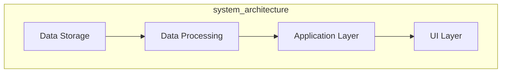
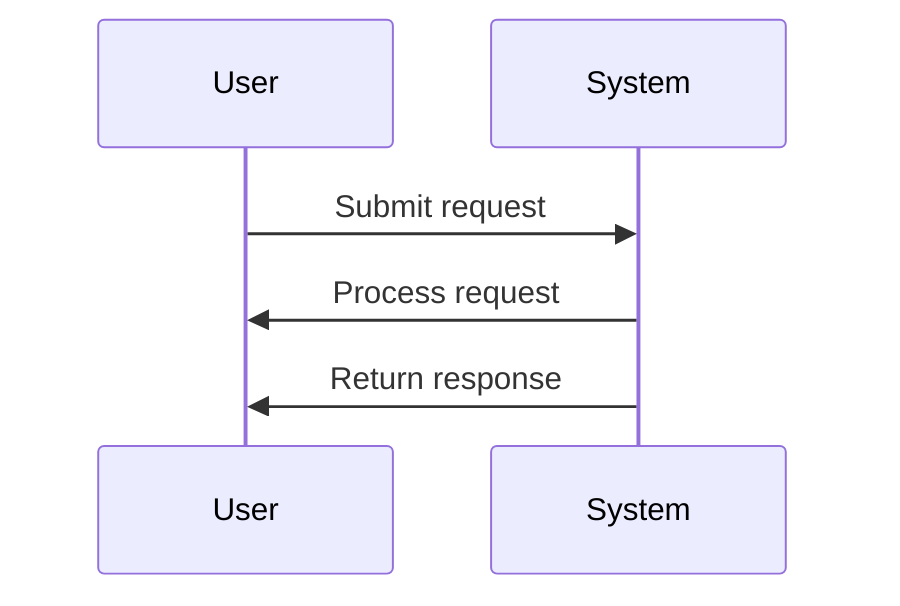
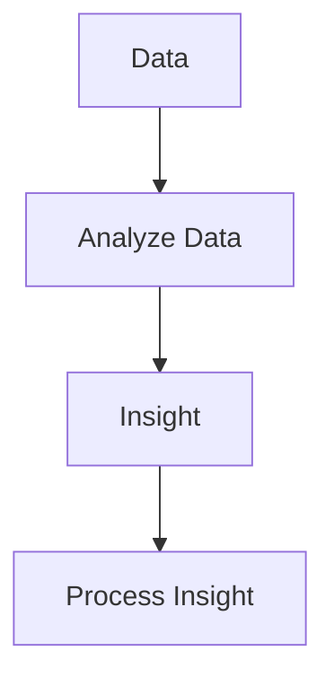

                 

### 文章标题：技术leader的决策框架

> 关键词：技术leader、决策框架、系统分析、项目实战、最佳实践

> 摘要：本文将深入探讨技术leader的决策框架，通过系统性的分析与实战案例，提供一套实用的决策方法论，帮助技术leader在面对复杂的技术问题时做出更加明智和有效的决策。

在信息技术高速发展的时代，技术leader的角色愈发重要。他们不仅需要具备卓越的技术能力，还需要在项目管理、团队领导、战略规划等方面展现出高超的决策能力。本文旨在构建一个全面、实用的决策框架，帮助技术leader在复杂多变的环境中做出更加明智和高效的决策。

### 第一部分：技术leader的角色与职责

#### 第1章：技术leader的角色与使命

##### 1.1 技术leader的角色背景

技术leader，通常是指在技术团队中担任领导角色的人员，他们负责指导团队完成技术任务，推动技术发展，并确保项目按时交付。技术leader的角色不仅仅是技术的守护者，更是团队的核心领导者，他们需要具备跨领域的综合能力。

##### 1.1.1 技术leader的角色定义

- **技术专家**：技术leader首先需要具备深厚的技术功底，能够解决复杂的技术问题。
- **团队领袖**：技术leader需要具备良好的领导能力，能够带领团队共同进步。
- **战略规划者**：技术leader需要具备前瞻性思维，为团队制定明确的发展方向。
- **沟通协调者**：技术leader需要能够有效地与团队内外各方进行沟通，确保项目顺利进行。

##### 1.1.2 技术leader的职责和挑战

技术leader的职责包括但不限于以下几点：

- **团队管理**：负责团队的组织和协调，确保团队成员充分发挥潜力。
- **项目规划**：制定项目计划，确保项目按时、按质完成。
- **技术决策**：在项目中面临技术选择和优化时，能够做出明智的决策。
- **沟通协调**：与技术团队、业务团队、管理层等进行有效沟通，确保各方利益一致。

然而，技术leader在履行职责的过程中也面临着诸多挑战：

- **技术难题**：如何选择合适的技术路线，如何在有限资源下解决复杂问题。
- **团队管理**：如何激发团队成员的积极性，如何处理团队内部的矛盾。
- **沟通协调**：如何确保项目进度，如何处理与业务团队、管理层的沟通问题。

##### 1.1.3 技术leader对团队的影响

技术leader的决策和领导风格对团队有着深远的影响。一个优秀的技术leader能够：

- **提升团队士气**：通过有效的激励和鼓励，提高团队的工作积极性。
- **推动技术进步**：通过合理的决策和技术规划，推动团队技术水平的提升。
- **增强团队凝聚力**：通过良好的团队管理，增强团队的凝聚力，提高团队的协作效率。

##### 1.2 决策框架的重要性

决策是技术leader的核心职责之一。在一个项目中，技术leader需要做出各种决策，包括技术选型、资源分配、项目进度调整等。一个良好的决策框架能够帮助技术leader更加系统、科学地做出决策。

##### 1.2.1 决策的定义与类型

决策是指根据特定目标和条件，从多个备选方案中选择一个最优方案的过程。决策可以分为以下几种类型：

- **战略决策**：涉及公司或团队长期发展方向和目标。
- **战术决策**：涉及项目或团队短期目标和策略。
- **运营决策**：涉及日常运营中的具体操作。

##### 1.2.2 决策框架的作用

决策框架是一个系统化的方法，它可以帮助技术leader：

- **明确决策目标**：确保决策方向与团队和公司的目标一致。
- **收集和分析信息**：通过系统化的方法收集和分析相关信息，为决策提供依据。
- **评估备选方案**：比较不同方案的优缺点，选择最优方案。
- **实施和监控决策**：确保决策能够有效执行，并在执行过程中进行监控和调整。

##### 1.2.3 为什么技术leader需要决策框架

技术leader需要决策框架的原因包括：

- **复杂性问题**：现代技术项目通常涉及复杂的技术问题和多变的业务需求，需要系统化的决策方法。
- **不确定性**：技术项目往往面临不确定性和风险，需要科学的决策方法来降低风险。
- **高效决策**：一个良好的决策框架可以提高决策效率，帮助技术leader更快地做出明智的决策。

### 第二部分：构建决策框架的核心概念

#### 第2章：构建决策框架的核心概念

##### 1.3 核心概念介绍

构建一个有效的决策框架需要明确以下几个核心概念：

- **问题识别与定义**：识别并明确需要解决的问题，为决策提供基础。
- **数据分析与洞察**：通过数据分析，获取关于问题的深刻洞察，为决策提供依据。
- **目标设定与优先级排序**：明确决策目标，并对其进行优先级排序，确保决策方向正确。
- **可行性评估与风险评估**：评估备选方案的可操作性和风险，确保决策的可执行性。

##### 1.3.1 问题识别与定义

问题识别与定义是决策框架的基础。技术leader需要：

- **明确问题**：准确描述问题的现状和影响。
- **确定问题范围**：明确问题的影响范围，界定问题的边界。
- **分析问题原因**：探究问题的根本原因，为解决问题提供方向。

##### 1.3.2 数据分析与洞察

数据分析是决策过程中不可或缺的一环。技术leader需要：

- **收集数据**：从各种来源收集与问题相关的数据。
- **清洗数据**：对数据进行预处理，确保数据质量。
- **分析数据**：运用统计方法和工具，对数据进行分析，提取有价值的信息。
- **形成洞察**：根据分析结果，形成对问题的深刻洞察，为决策提供依据。

##### 1.3.3 目标设定与优先级排序

目标设定是决策的重要环节。技术leader需要：

- **明确目标**：根据团队和公司的目标，明确决策的具体目标。
- **设定优先级**：对目标进行优先级排序，确保决策资源能够优先用于解决最重要的问题。

##### 1.3.4 可行性评估与风险评估

在确定决策目标后，技术leader需要对备选方案进行可行性评估和风险评估：

- **可行性评估**：评估备选方案的可行性和可操作性，确保方案能够在实际中执行。
- **风险评估**：识别备选方案可能带来的风险，并评估风险的大小，为决策提供风险管理的依据。

##### 1.4 概念关系与ER图

为了更好地理解决策框架的核心概念，我们可以使用ER图（Entity-Relationship Diagram）来展示概念之间的关系。

```mermaid
erDiagram
  Problem --> Analysis : "基于"
  Analysis --> Insight : "形成"
  Insight --> Goal : "指导"
  Goal --> Evaluation : "评价"
  Evaluation --> Decision : "决策"
```

在这个ER图中，**问题**是决策的起点，通过**数据分析**形成**洞察**，指导**目标设定**。然后，对目标进行**可行性评估**和**风险评估**，最终做出**决策**。

### 第三部分：决策框架的应用与实践

#### 第3章：应用决策框架的系统分析

##### 3.1 系统功能设计

在决策框架的指导下，系统功能设计是一个关键环节。技术leader需要：

- **需求分析**：明确系统所需实现的功能和业务需求。
- **模块划分**：根据需求划分系统功能模块，确保每个模块都有明确的职责。
- **接口设计**：设计系统内部和外部的接口，确保模块之间的数据流转和协作。

##### 3.2 系统架构设计

系统架构设计是确保系统能够高效、稳定运行的重要环节。技术leader需要：

- **架构概述**：明确系统架构的基本结构和组件关系。
- **设计原理**：运用设计原则和模式，确保架构的合理性和扩展性。
- **架构图**：使用Mermaid绘制系统架构图，清晰地展示组件关系。



在这个架构图中，数据存储、数据处理、应用层和用户界面层构成了系统的基本架构。

##### 3.3 系统接口设计

系统接口设计是确保系统模块之间能够有效协作的关键。技术leader需要：

- **接口规范**：制定接口的规范和标准，确保接口的一致性和稳定性。
- **安全性和性能优化**：确保接口的安全性，并进行性能优化，以提高系统的响应速度。

##### 3.4 系统交互设计

系统交互设计是确保用户能够顺畅使用系统的关键。技术leader需要：

- **交互流程**：设计系统的交互流程，确保用户能够轻松完成操作。
- **序列图**：使用Mermaid绘制系统的交互序列图，展示用户与系统的交互过程。



在这个序列图中，用户向系统提交请求，系统处理后返回响应，展示了系统的基本交互过程。

### 第四部分：决策框架在实际项目中的应用

#### 第4章：决策框架在实际项目中的应用

##### 4.1 项目背景介绍

在本章中，我们将通过一个实际项目案例，展示如何应用决策框架来解决问题。

- **项目概述**：介绍项目的背景和目标。
- **项目目标与挑战**：明确项目的具体目标和面临的挑战。

##### 4.2 项目核心实现源代码解读

在项目中，技术leader需要编写大量的代码来实现系统的功能。以下是一个简化的示例代码，展示了如何应用决策框架来编写代码。

```python
def analyze_data(data):
    # 数据分析
    insights = []
    for record in data:
        # 数据分析逻辑
        insights.append(process_record(record))
    return insights

def process_record(record):
    # 数据处理逻辑
    result = perform_computation(record)
    return result

def perform_computation(record):
    # 计算逻辑
    result = record['value'] * 2
    return result
```

在这个代码中，`analyze_data` 函数负责数据分析，`process_record` 函数负责数据处理，`perform_computation` 函数负责具体的计算逻辑。这些函数的应用都是基于决策框架中的核心概念。

##### 4.2.1 数据分析与洞察



在这个流程图中，数据经过分析后形成洞察，这些洞察指导后续的数据处理和计算。

##### 4.2.2 目标设定与优先级排序

在项目开发过程中，技术leader需要设定具体的开发目标，并根据优先级对目标进行排序。

- **目标1**：实现数据分析功能
- **目标2**：实现数据处理功能
- **目标3**：实现计算功能

这些目标的设定和排序确保了开发工作的有序进行。

##### 4.2.3 可行性评估与风险评估

在确定开发目标后，技术leader需要对开发方案进行可行性评估和风险评估。

- **可行性评估**：评估每个开发目标的实现难度和技术可行性。
- **风险评估**：识别可能的风险，并制定相应的风险应对策略。

##### 4.3 实际案例分析

在本章中，我们将通过两个实际案例，展示如何应用决策框架来解决具体问题。

- **案例一：产品优化决策**
- **案例二：项目资源分配决策**
- **案例三：技术路线选择决策**

在**案例一**中，技术leader需要根据用户反馈和市场趋势，对产品进行优化。通过决策框架，技术leader可以系统地分析用户需求，设定优化目标，评估优化方案的可行性，并最终做出优化决策。

在**案例二**中，技术leader需要合理分配项目资源，确保项目按时完成。通过决策框架，技术leader可以分析项目需求，设定资源分配目标，评估资源分配方案，并最终做出最优的资源分配决策。

在**案例三**中，技术leader需要选择合适的技术路线。通过决策框架，技术leader可以分析不同技术路线的优缺点，设定技术选择目标，评估技术路线的可行性，并最终做出最优的技术路线选择决策。

##### 4.4 项目小结

在项目结束后，技术leader需要对项目进行总结和反思。

- **项目成果总结**：总结项目取得的成果，包括实现的功能、解决的问题等。
- **项目反思与改进建议**：反思项目过程中遇到的问题，提出改进建议，为未来的项目提供经验。

### 第五部分：最佳实践与拓展

#### 第5章：最佳实践与拓展

在本章中，我们将为技术leader提供一些最佳实践技巧，并总结决策框架的核心要点。

##### 5.1 最佳实践技巧

- **提高决策效率的方法**：通过使用决策框架，技术leader可以更加高效地做出决策。
- **决策中的沟通与合作**：技术leader需要在决策过程中与团队成员和利益相关者进行有效沟通，确保决策得到广泛支持。
- **决策后的评估与反馈**：技术leader需要对决策结果进行评估，并根据反馈进行调整和改进。

##### 5.2 小结与注意事项

- **决策框架的核心要点**：回顾决策框架的核心概念和步骤，确保技术leader能够熟练应用。
- **注意事项与风险提示**：提醒技术leader在应用决策框架时需要注意的事项，避免潜在的风险。

##### 5.3 拓展阅读

- **相关书籍推荐**：推荐一些关于决策、项目管理、领导力的书籍，供技术leader进一步学习。
- **网络资源推荐**：推荐一些优质的网络资源和论坛，供技术leader获取最新的行业动态和技术知识。

### 总结

本文通过深入探讨技术leader的决策框架，从角色背景、核心概念、系统分析与架构设计、项目实战等方面进行了详细讲解。通过实际案例的分析，技术leader可以更加系统地应用决策框架，提高决策质量和效率。希望本文能够为技术leader提供有价值的参考和启示。

### 作者信息

**作者：AI天才研究院/AI Genius Institute & 禅与计算机程序设计艺术 /Zen And The Art of Computer Programming**

