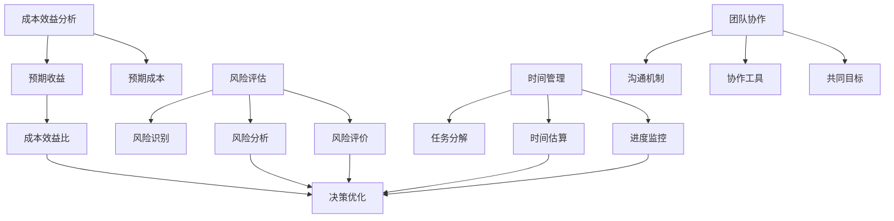

                 

### 文章标题与技术背景

# 技术leader的决策框架构建

> 关键词：技术领导者、决策框架、系统分析、实践应用

> 摘要：本文深入探讨了技术领导者在企业中扮演的角色及其面临的复杂决策场景。通过构建一个系统化的决策框架，本文旨在提供一套实用的方法论，帮助技术领导者更好地应对挑战，提升团队效能和组织竞争力。

在现代企业中，技术领导者的角色日益重要。他们不仅是技术项目的领导者，更是企业战略决策的核心成员。技术领导者需要具备强大的技术洞察力、团队管理能力和决策智慧，以便在复杂多变的市场环境中引领团队走向成功。本文将从以下几个方面展开讨论：

1. **技术领导者的角色与职责**：介绍技术领导者在企业中的地位和主要职责，包括技术方向规划、团队管理、项目推进等。

2. **决策框架的基本概念**：阐述决策框架的定义、重要性以及常见的决策类型。

3. **构建决策框架的步骤**：详细解析如何构建一个有效的决策框架，包括目标设定、信息收集、方案评估和决策执行。

4. **核心概念与框架设计**：介绍构建决策框架所需的核心概念，如成本效益分析、风险评估、时间管理等，并通过实际案例说明。

5. **应用与实战**：通过具体案例，展示决策框架在不同场景中的应用，分析其效果和改进点。

6. **最佳实践与总结**：总结技术领导者在决策过程中应遵循的最佳实践，并给出未来发展的建议。

接下来，我们将一步步深入探讨每个部分，帮助技术领导者构建一个科学、系统的决策框架，从而更好地应对日常工作和挑战。

### 第一部分：引言与背景

#### 第1章：技术领导者的角色

技术领导者（Technical Leader）在现代企业中扮演着至关重要的角色。他们不仅是技术项目的核心推动者，还是团队管理和战略决策的关键人物。技术领导者需要具备丰富的技术背景、强大的领导能力和深厚的业务理解力，以便在快速变化的技术环境中带领团队取得成功。

**1.1. 技术领导者的职责**

技术领导者的职责可以概括为以下几个方面：

- **技术方向规划**：技术领导者负责制定和调整技术发展战略，确保技术团队的工作与企业的整体战略目标保持一致。他们需要关注新兴技术趋势，评估其对企业的影响，并据此调整技术路线图。

- **团队管理**：技术领导者需要管理技术团队，包括招聘、培训和激励团队成员。他们要确保团队有足够的能力和资源去完成项目任务，同时营造一个积极、创新的工作氛围。

- **项目推进**：技术领导者负责确保项目按时、按质、按预算完成。他们需要协调各方资源，解决项目推进中的技术难题和管理问题，确保项目的顺利实施。

- **沟通协调**：技术领导者需要与项目相关方保持有效沟通，包括业务部门、管理层和合作伙伴。他们需要理解业务需求，将技术方案转化为业务价值，并确保所有相关方对项目进展和成果有清晰的认识。

**1.2. 技术领导者的挑战**

技术领导者面临诸多挑战，其中主要包括：

- **技术复杂性**：随着技术的不断发展，技术领导者需要不断学习新的技术知识和技能，以应对复杂的技术问题。

- **资源限制**：在预算有限、人力资源紧张的情况下，技术领导者需要优化资源配置，确保项目能够高效推进。

- **快速变化的市场需求**：市场需求和技术环境变化迅速，技术领导者需要具备快速适应变化的能力，及时调整技术方向和项目计划。

- **团队管理难题**：如何激发团队的潜力，提升团队的整体绩效，是技术领导者面临的重大挑战。

**1.3. 技术领导者的素质要求**

为了有效应对上述挑战，技术领导者需要具备以下几方面的素质：

- **技术能力**：技术领导者需要具备扎实的技术背景和深厚的技术功底，能够解决复杂的技术问题。

- **领导力**：技术领导者需要具备出色的领导力，包括团队管理、沟通协调和决策能力。

- **业务理解力**：技术领导者需要深入了解业务流程和业务需求，能够将技术方案与业务目标有机结合。

- **创新能力**：技术领导者需要具备创新能力，能够带领团队探索新技术、新模式，推动企业持续发展。

- **适应能力**：技术领导者需要具备较强的适应能力，能够快速适应市场变化和新技术趋势。

**1.4. 技术领导者的成长路径**

技术领导者的成长路径可以分为以下几个阶段：

- **初级阶段**：技术领导者在这个阶段主要关注技术能力的提升，积累项目经验，逐步承担更多的技术职责。

- **中级阶段**：技术领导者开始参与团队管理，逐步承担项目管理职责，提升领导力和沟通协调能力。

- **高级阶段**：技术领导者在这个阶段需要具备全局视野，能够制定和调整技术发展战略，成为企业技术决策的核心成员。

通过以上阶段的成长，技术领导者能够不断提升自身的能力和素质，为企业创造更大的价值。

#### 第2章：决策框架基础

**2.1. 决策框架的定义**

决策框架是一种系统化的决策方法，它通过明确的步骤和结构，帮助决策者在复杂情况下做出最优选择。决策框架不仅包含决策过程的各个环节，还提供了分析问题的工具和方法，以便更好地理解问题本质，评估不同方案的优缺点。

**2.2. 决策框架的重要性**

决策框架在企业中的重要性体现在以下几个方面：

- **提高决策效率**：决策框架提供了一个标准化的决策流程，使决策者能够快速识别问题、分析解决方案，从而提高决策效率。

- **减少决策风险**：通过系统化的分析和评估，决策框架可以帮助决策者识别潜在的风险和挑战，从而减少决策错误和风险。

- **促进团队协作**：决策框架为团队成员提供了一个共同的工作基础，使团队成员能够更有效地协作，共同解决问题。

- **提升决策质量**：决策框架通过结构化和系统化的方法，确保决策者在做出决策时考虑到所有相关因素，从而提升决策质量。

**2.3. 常见的决策类型**

在企业管理中，常见的决策类型主要包括：

- **战略决策**：战略决策涉及企业长期发展方向和目标，如市场进入策略、产品研发方向、组织架构调整等。

- **运营决策**：运营决策涉及企业日常运营和业务流程，如生产计划、库存管理、人力资源配置等。

- **战术决策**：战术决策涉及短期内如何执行战略决策，如项目进度安排、资源调配、市场推广策略等。

- **业务决策**：业务决策涉及具体业务领域，如产品定价策略、销售渠道选择、客户服务管理等。

**2.4. 决策框架的基本要素**

一个完整的决策框架通常包含以下几个基本要素：

- **目标设定**：明确决策的目标和期望结果，为后续分析和评估提供依据。

- **信息收集**：收集与决策相关的各种信息，包括市场数据、技术分析、财务报表等，以便全面了解问题背景。

- **方案评估**：分析不同解决方案的优缺点，评估其对目标的达成程度。

- **风险识别**：识别决策过程中可能面临的风险和挑战，制定相应的应对策略。

- **决策执行**：根据评估结果和风险识别，选择最优方案并实施决策。

- **反馈与调整**：对决策结果进行跟踪和评估，根据反馈进行调整和优化。

通过以上基本要素的有机结合，决策框架能够帮助决策者系统地分析和解决问题，提高决策质量和效果。

#### 第3章：决策框架在技术领域的应用

**3.1. 技术决策的特点**

技术领域的决策具有以下几个特点：

- **复杂性**：技术决策通常涉及多学科知识和技术方案，决策过程复杂，影响因素众多。

- **不确定性**：技术领域的发展迅速，新技术和新方法层出不穷，技术决策面临很大的不确定性。

- **跨部门协作**：技术决策往往需要多个部门的协同合作，如研发、市场、销售、生产等，决策过程需要有效沟通和协调。

- **长期影响**：技术决策的影响通常具有长期性，决策结果可能对企业未来的发展方向和竞争力产生深远影响。

**3.2. 技术决策的常见场景**

在技术领域，常见的决策场景包括：

- **技术选型**：选择合适的技术方案以满足项目需求，如选择编程语言、框架、数据库等。

- **产品研发**：制定产品研发计划，包括技术路线、开发进度、资源分配等。

- **技术创新**：评估和选择创新技术，推动企业技术进步和竞争力提升。

- **技术并购**：评估和选择合适的并购对象，整合技术和资源，实现企业战略目标。

- **技术投资**：评估和选择技术投资方向，实现资金的有效利用和增值。

**3.3. 技术决策的挑战**

技术决策面临的挑战主要包括：

- **技术不确定性**：技术领域的发展迅速，新技术和新方法层出不穷，技术决策需要面对很大的不确定性。

- **技术选型复杂**：技术选型过程复杂，需要考虑技术性能、兼容性、维护成本等多方面因素。

- **跨部门协调**：技术决策通常需要跨部门协作，协调难度大，容易出现沟通不畅和资源冲突。

- **长期影响评估**：技术决策的影响具有长期性，评估和预测难度较大，需要决策者具备前瞻性视野。

**3.4. 技术决策的应对策略**

为了有效应对技术决策的挑战，可以采取以下策略：

- **建立技术选型标准**：制定明确的技术选型标准，确保技术决策的科学性和可操作性。

- **加强跨部门沟通**：建立有效的沟通机制，确保各部门在技术决策过程中充分表达意见和需求。

- **风险评估与控制**：对技术决策进行风险评估，制定相应的控制措施，降低技术风险。

- **前瞻性研究和市场分析**：关注技术发展趋势和市场动态，为技术决策提供有力支持。

- **持续学习和培训**：提升技术团队的专业能力，培养技术领导者的决策智慧和管理能力。

通过以上策略，技术领导者可以更好地应对技术决策的挑战，提高决策质量和效果。

### 第二部分：核心概念与框架

#### 第4章：关键概念与关系

在构建决策框架的过程中，理解并掌握一些关键概念是至关重要的。这些概念不仅为决策提供了理论基础，还帮助我们更清晰地分析问题，评估不同方案，最终做出明智的决策。以下是构建决策框架所需的一些关键概念及其相互关系。

**4.1. 成本效益分析**

成本效益分析是一种评估决策方案成本与收益的方法。它通过计算各方案的预期成本和预期收益，比较其性价比，从而确定最优方案。成本效益分析的基本公式为：

\[ \text{成本效益比} = \frac{\text{预期收益}}{\text{预期成本}} \]

**4.2. 风险评估**

风险评估是识别、分析和评估决策过程中潜在风险的方法。风险评估包括以下步骤：

1. **风险识别**：识别决策过程中可能面临的各种风险。
2. **风险分析**：分析各种风险的性质、影响程度和发生概率。
3. **风险评价**：根据风险分析的结果，对风险进行优先级排序，评估其对决策目标的影响。

**4.3. 时间管理**

时间管理是确保决策过程和项目按时完成的方法。时间管理包括以下步骤：

1. **任务分解**：将大任务分解为小任务，明确每个任务的完成时间和负责人。
2. **时间估算**：为每个任务估算所需时间，并制定项目进度计划。
3. **进度监控**：监控项目进度，及时发现并解决延误问题。

**4.4. 团队协作**

团队协作是确保决策过程中团队成员有效沟通和协作的方法。团队协作的关键在于：

1. **沟通机制**：建立有效的沟通机制，确保团队成员之间能够及时交流信息。
2. **协作工具**：使用合适的协作工具，如项目管理软件、即时通讯工具等，提高协作效率。
3. **共同目标**：确保团队成员明确共同目标，并为此共同努力。

**4.5. 概念关系图**

为了更好地理解这些关键概念之间的关系，我们可以使用Mermaid工具绘制概念关系图。以下是一个示例：

通过这个概念关系图，我们可以清晰地看到成本效益分析、风险评估、时间管理和团队协作之间的相互关系，以及它们如何共同影响决策优化。

**4.6. 决策框架与关键概念的结合**

在实际应用中，决策框架将以上关键概念有机结合，形成一个完整的决策过程。以下是决策框架的基本步骤：

1. **目标设定**：明确决策的目标和预期结果。
2. **信息收集**：收集与决策相关的各种信息，包括成本、收益、风险、时间等。
3. **方案评估**：根据成本效益分析、风险评估和时间管理，评估不同方案的优缺点。
4. **决策执行**：选择最优方案并执行决策。
5. **反馈与调整**：对决策结果进行跟踪和评估，根据反馈进行调整和优化。

通过以上步骤，决策框架帮助决策者系统地分析问题，评估方案，最终做出最优决策。在这个过程中，关键概念相互补充，共同支持决策的制定和执行。

#### 第5章：决策框架组件及其相互作用

**5.1. 成本效益分析**

成本效益分析是决策框架中的核心组件之一，它通过比较不同方案的预期成本与预期收益，帮助决策者确定最优方案。成本效益分析的基本步骤如下：

1. **确定目标**：明确决策的目标和期望结果。
2. **收集数据**：收集与决策相关的成本和收益数据，包括直接成本（如人力、材料等）和间接成本（如时间、风险等）。
3. **计算成本效益比**：使用公式 \[ \text{成本效益比} = \frac{\text{预期收益}}{\text{预期成本}} \] 计算每个方案的性价比。
4. **评估结果**：根据成本效益比，评估每个方案的优劣，选择最优方案。

**5.2. 风险评估**

风险评估是决策过程中不可或缺的一环，它通过识别、分析和评价潜在风险，帮助决策者制定应对策略。风险评估的基本步骤如下：

1. **风险识别**：识别决策过程中可能面临的各种风险，包括技术风险、市场风险、资源风险等。
2. **风险分析**：分析每个风险的性质、发生概率和影响程度。
3. **风险评价**：根据风险分析的结果，对风险进行优先级排序，评估其对决策目标的影响。
4. **制定应对策略**：针对高优先级风险，制定相应的应对策略，如风险规避、风险转移、风险减轻等。

**5.3. 时间管理**

时间管理是确保决策过程和项目按时完成的关键组件，它通过有效的任务分解和时间估算，帮助决策者合理分配资源，控制项目进度。时间管理的基本步骤如下：

1. **任务分解**：将大任务分解为小任务，明确每个任务的完成时间和负责人。
2. **时间估算**：为每个任务估算所需时间，并制定项目进度计划。
3. **进度监控**：监控项目进度，及时发现并解决延误问题。
4. **调整计划**：根据实际情况调整项目进度计划，确保项目按时完成。

**5.4. 团队协作**

团队协作是决策框架中一个重要组成部分，它通过有效的沟通和协作，确保团队成员在决策过程中能够充分交流信息和意见。团队协作的基本步骤如下：

1. **建立沟通机制**：建立有效的沟通机制，如定期会议、即时通讯等，确保团队成员之间能够及时交流信息。
2. **使用协作工具**：使用合适的协作工具，如项目管理软件、即时通讯工具等，提高协作效率。
3. **明确共同目标**：确保团队成员明确共同目标，并为此共同努力。
4. **协调资源**：合理分配和协调资源，确保团队成员能够高效协作。

**5.5. 决策框架组件的相互作用**

在决策框架中，各组件相互作用，共同支持决策的制定和执行。以下是各组件之间的相互作用关系：

- **成本效益分析与风险评估**：成本效益分析提供了评估方案优劣的依据，而风险评估则帮助识别和评估决策过程中的潜在风险。两者结合，可以确保决策者选择的方案不仅成本效益高，而且风险可控。
- **时间管理与团队协作**：时间管理确保项目按时完成，而团队协作则保证了决策过程中的高效沟通和协作。两者结合，可以确保项目在既定时间内高质量完成。
- **成本效益分析、风险评估与时间管理**：这三者共同构成了决策的基础，确保决策者在做出决策时考虑到成本、风险和时间等多方面因素，从而做出更加全面和科学的决策。

通过以上相互作用，决策框架帮助决策者系统地分析问题，评估方案，最终做出最优决策。

#### 第6章：整合框架与实际应用

**6.1. 决策框架整合概述**

整合决策框架的目标是将各个核心组件有机结合，形成一个系统化的决策过程，使技术领导者能够更全面、更高效地做出决策。整合决策框架的基本步骤如下：

1. **明确决策目标**：首先，明确决策的目标和预期结果，确保所有后续分析和工作都围绕这一目标进行。
2. **信息收集**：收集与决策相关的各种信息，包括成本、收益、风险、时间等，为方案评估提供数据支持。
3. **方案评估**：使用成本效益分析、风险评估和时间管理等方法，评估不同方案的优缺点，选择最优方案。
4. **决策执行**：根据评估结果，选择最优方案并执行决策，确保决策能够实际落地。
5. **反馈与调整**：对决策结果进行跟踪和评估，根据反馈进行调整和优化，确保决策持续改进。

**6.2. 实际应用案例**

为了更好地理解决策框架的实际应用，我们通过一个实际案例来具体说明。

**案例背景**：

某科技公司（TechCo）正在开发一款新产品，预计在明年年初上市。作为技术领导者，John需要做出多个关键决策，包括技术选型、项目进度安排和资源分配等。他决定使用整合的决策框架来帮助他做出这些决策。

**1. 明确决策目标**

John明确了以下决策目标：

- 技术选型：选择合适的编程语言、框架和数据库，确保产品技术性能和可维护性。
- 项目进度安排：确保项目在预算内按时完成，同时保证产品质量。
- 资源分配：合理分配人力和物力资源，确保项目高效推进。

**2. 信息收集**

John收集了以下信息：

- 市场需求：分析目标市场对产品的需求，确定产品功能和技术要求。
- 技术方案：评估几种常见技术方案（如Java、Python、JavaScript等）的优缺点。
- 项目预算：确定项目预算，包括人力成本、设备成本等。
- 时间限制：确定项目进度计划，包括关键里程碑和时间节点。

**3. 方案评估**

John使用成本效益分析、风险评估和时间管理等方法对以下方案进行评估：

- **技术选型**：通过成本效益分析，评估不同技术方案的预期成本和收益，选择性能稳定、维护成本低的方案。通过风险评估，识别和评估技术选型过程中可能面临的风险，如技术支持、人才储备等。通过时间管理，确保项目进度计划能够按时完成。

- **项目进度安排**：通过时间管理，制定详细的项目进度计划，明确每个阶段的时间节点和任务，确保项目按时完成。

- **资源分配**：通过成本效益分析，评估不同资源分配方案的预期成本和收益，选择资源利用效率最高的方案。同时，通过风险评估，识别和评估资源分配过程中可能面临的风险，如人员流失、设备故障等。

**4. 决策执行**

基于以上评估结果，John做出以下决策：

- 技术选型：选择Java作为主要编程语言，Spring框架作为后端开发框架，MySQL作为数据库。
- 项目进度安排：根据时间管理计划，制定详细的项目进度表，确保每个阶段按时完成。
- 资源分配：根据成本效益分析结果，合理分配人力资源和设备资源，确保项目高效推进。

**5. 反馈与调整**

在项目执行过程中，John不断收集反馈信息，并根据反馈进行调整和优化。例如，如果某个阶段出现延误，他会重新评估资源分配和进度计划，确保项目能够按时完成。同时，他会定期与团队成员沟通，了解项目进展和问题，及时解决技术难题和管理问题。

**6.3. 整合框架的实际效果**

通过整合决策框架，John能够更系统、更科学地做出决策，提高决策质量和效率。具体效果如下：

- **决策质量提高**：通过系统化的信息收集和方案评估，John能够全面了解问题背景和潜在风险，从而做出更加明智的决策。
- **决策效率提高**：整合决策框架提供了一个标准化的决策流程，使John能够快速识别问题、分析解决方案，从而提高决策效率。
- **团队协作增强**：通过明确的决策目标和沟通机制，团队成员能够更有效地协作，共同解决问题。
- **风险可控**：通过风险评估，John能够提前识别和评估决策过程中的潜在风险，制定相应的应对策略，确保项目顺利推进。

通过这个实际案例，我们可以看到整合决策框架在技术领导者的日常工作中具有重要的应用价值。它不仅帮助John更好地应对复杂的技术和管理问题，还提高了团队的协作效率和决策质量。

### 第三部分：案例研究与应用

#### 第7章：实际决策场景分析

在实际工作中，技术领导者经常面临各种复杂的决策场景。这些场景不仅涉及技术问题，还涉及团队管理、资源分配和业务目标等多方面因素。以下是一些常见的决策场景及其分析过程。

**7.1. 技术选型**

**场景描述**：

某科技公司计划开发一款新产品，需要选择合适的编程语言、框架和数据库。技术团队提出了Java、Python和JavaScript等三种技术方案，每种方案都有其优缺点。

**分析过程**：

- **信息收集**：收集市场需求、技术性能、维护成本和人才储备等方面的信息。
- **成本效益分析**：计算每种方案的预期成本和预期收益，比较其成本效益比。
  - Java：技术性能高，但维护成本较高，人才储备较少。
  - Python：维护成本低，人才储备丰富，但技术性能稍逊。
  - JavaScript：技术性能和人才储备都适中，但维护成本较高。
- **风险评估**：评估每种技术方案可能面临的风险，如技术支持、人才流失等。
- **决策**：选择成本效益高、风险可控的方案，如Java。

**7.2. 项目进度安排**

**场景描述**：

某科技公司正在开发一款新产品，项目预计在6个月内完成。由于项目复杂，技术团队预计实际完成时间可能会超出预期。项目经理需要制定详细的项目进度计划，确保项目按时完成。

**分析过程**：

- **信息收集**：收集项目任务、资源需求、时间估算和风险因素等方面的信息。
- **任务分解**：将大任务分解为小任务，明确每个任务的完成时间和负责人。
- **时间估算**：为每个任务估算所需时间，并制定项目进度计划。
- **进度监控**：监控项目进度，及时发现并解决延误问题。
- **调整计划**：根据实际情况调整项目进度计划，确保项目按时完成。

**7.3. 资源分配**

**场景描述**：

某科技公司正在开发多个项目，资源紧张。项目经理需要合理分配人力资源和设备资源，确保每个项目都能按时完成。

**分析过程**：

- **信息收集**：收集项目任务、资源需求、优先级和风险评估等方面的信息。
- **成本效益分析**：计算每种资源分配方案的预期成本和预期收益，比较其成本效益比。
- **风险评估**：评估每种资源分配方案可能面临的风险，如人员流失、设备故障等。
- **决策**：选择资源利用效率最高、风险可控的方案，确保项目高效推进。

**7.4. 团队管理**

**场景描述**：

某科技公司的技术团队由多个成员组成，团队成员之间存在不同的技能水平和沟通问题。技术领导者需要制定有效的团队管理策略，提升团队整体绩效。

**分析过程**：

- **信息收集**：收集团队成员技能水平、沟通方式和团队氛围等方面的信息。
- **团队协作分析**：分析团队成员之间的协作状况，识别协作中的问题和瓶颈。
- **团队建设**：制定团队建设计划，包括技能培训、沟通机制建设和团队活动等。
- **决策**：根据团队建设计划，实施团队管理策略，提升团队整体绩效。

通过以上实际决策场景的分析，我们可以看到技术领导者在决策过程中需要考虑多方面因素，采用系统化的方法进行信息收集、方案评估和决策执行，以确保决策的科学性和有效性。

#### 第8章：案例分析与经验总结

在技术领导者的职业生涯中，通过实际案例的积累和反思，可以不断提升决策能力和管理效能。以下是对几个具体案例的深入分析及其经验总结，旨在为技术领导者提供宝贵的实践指导。

**8.1. 案例一：成功的技术选型**

**背景**：
一家初创科技公司需要开发一款智能助手应用。技术团队提出了三种技术方案：Java、Python和JavaScript。最终，公司选择了Java作为主要编程语言。

**分析**：
在选择技术方案时，技术领导者首先进行了市场调研，分析了不同技术方案的优势和劣势。Java因其高性能、稳定性和丰富的生态系统被选为首选。然而，在决策过程中也面临了一些挑战，如人才储备不足和开发周期较长。

**经验总结**：
- **充分调研**：在决策前，全面了解各种技术方案的市场前景、人才需求和技术生态系统。
- **风险评估**：评估技术选型过程中可能面临的风险，如人才短缺、开发周期延长等。
- **动态调整**：根据实际情况，灵活调整技术方案，确保项目顺利推进。

**8.2. 案例二：项目进度的有效管理**

**背景**：
某科技公司负责开发一款大型企业级软件，项目预计在12个月内完成。然而，在项目初期，由于需求变更和资源分配不当，项目进度严重滞后。

**分析**：
技术领导者采取了以下措施来恢复项目进度：
1. **重新评估需求**：与业务团队沟通，明确项目的核心需求，并制定详细的需求文档。
2. **任务分解**：将大任务分解为小任务，明确每个任务的完成时间和负责人。
3. **进度监控**：采用项目管理工具，实时监控项目进度，及时发现和解决延误问题。
4. **资源调配**：合理调配资源，确保关键任务得到优先保障。

**经验总结**：
- **需求明确**：确保项目需求明确，减少需求变更带来的影响。
- **任务分解**：将大任务分解为小任务，明确责任人和完成时间，提高任务执行效率。
- **进度监控**：实时监控项目进度，及时调整计划，确保项目按时完成。

**8.3. 案例三：有效的团队管理**

**背景**：
某科技公司的技术团队由不同背景和技能水平的成员组成，导致沟通不畅和工作效率低下。

**分析**：
技术领导者采取了以下措施来改善团队管理：
1. **沟通机制**：建立定期的团队会议，鼓励成员分享想法和问题，提高团队协作效率。
2. **技能培训**：组织技能培训，提升团队成员的专业能力，减少沟通障碍。
3. **团队建设**：组织团队活动，增强团队成员之间的信任和凝聚力。
4. **绩效评估**：建立公平的绩效评估机制，激励团队成员提高工作效率。

**经验总结**：
- **沟通机制**：建立有效的沟通机制，确保团队成员之间能够及时、畅通地交流。
- **技能培训**：定期组织培训，提升团队成员的专业能力，促进团队整体进步。
- **团队建设**：通过团队活动增强团队凝聚力，提高工作效率。
- **绩效评估**：建立公平的绩效评估机制，激励团队成员，提升团队绩效。

**8.4. 案例四：成功的创新项目**

**背景**：
某科技公司决定投入资源开发一项具有前瞻性的技术，以提升公司的技术竞争力和市场地位。

**分析**：
技术领导者通过以下步骤确保创新项目的成功：
1. **市场调研**：深入了解市场需求和技术发展趋势，确定创新项目的方向。
2. **团队组建**：组建一支由跨部门专家组成的团队，确保项目得到全公司的支持。
3. **资源保障**：确保项目得到足够的资源支持，包括资金、设备和人力资源。
4. **风险控制**：制定详细的风险评估和应对策略，降低项目风险。

**经验总结**：
- **市场调研**：深入了解市场需求和技术发展趋势，确保项目的市场前景。
- **团队组建**：组建跨部门团队，确保项目得到全公司的支持。
- **资源保障**：确保项目得到充足的资源支持，提高项目成功率。
- **风险控制**：制定详细的风险评估和应对策略，确保项目顺利进行。

通过以上案例分析，我们可以看到技术领导者在不同决策场景中需要采取不同的策略和措施，以应对复杂多变的环境。经验总结为技术领导者提供了宝贵的实践指导，帮助他们不断提升决策能力和管理水平。

### 第四部分：工具与技术

#### 第9章：决策分析工具

在技术领导者的决策过程中，工具的使用至关重要。这些工具可以帮助领导者更高效地进行数据分析、方案评估和决策制定。以下是几种常见的决策分析工具及其应用场景。

**9.1. SWOT分析**

SWOT分析是一种战略规划工具，用于评估企业的优势（Strengths）、劣势（Weaknesses）、机会（Opportunities）和威胁（Threats）。通过SWOT分析，技术领导者可以全面了解企业所处的市场环境，从而制定更有针对性的决策。

- **优势**：识别企业在技术、管理、资源等方面的优势，为决策提供支持。
- **劣势**：识别企业在技术、管理、资源等方面的劣势，帮助领导者找到改进方向。
- **机会**：分析市场环境中的机会，为企业的技术选型、产品开发等提供依据。
- **威胁**：分析市场环境中的威胁，帮助领导者制定应对策略，降低风险。

**9.2. PEST分析**

PEST分析是一种宏观环境分析工具，用于评估企业所处的政治（Political）、经济（Economic）、社会（Social）和技术（Technological）环境。通过PEST分析，技术领导者可以了解外部环境对企业决策的影响。

- **政治环境**：分析政府政策、法律法规等对企业的影响，确保企业的决策符合政策导向。
- **经济环境**：分析宏观经济形势、市场需求等对企业的影响，为决策提供经济依据。
- **社会环境**：分析社会文化、消费者行为等对企业的影响，为产品定位和市场策略提供支持。
- **技术环境**：分析新技术趋势、技术发展水平等对企业的影响，为技术选型和创新提供支持。

**9.3. 成本效益分析**

成本效益分析是一种评估决策方案成本与收益的工具。通过计算不同方案的预期成本和预期收益，比较其性价比，技术领导者可以确定最优方案。

- **预期成本**：包括直接成本（如人力、材料等）和间接成本（如时间、风险等）。
- **预期收益**：包括直接收益（如销售收入、市场份额等）和间接收益（如品牌价值、员工满意度等）。
- **成本效益比**：通过公式\[ \text{成本效益比} = \frac{\text{预期收益}}{\text{预期成本}} \] 计算每个方案的性价比，选择成本效益最高的方案。

**9.4. 风险评估**

风险评估是一种识别、分析和评价决策过程中潜在风险的工具。通过风险评估，技术领导者可以提前识别和评估风险，制定相应的应对策略。

- **风险识别**：识别决策过程中可能面临的各种风险，如技术风险、市场风险、资源风险等。
- **风险分析**：分析每个风险的性质、发生概率和影响程度。
- **风险评价**：根据风险分析的结果，对风险进行优先级排序，评估其对决策目标的影响。
- **应对策略**：制定相应的应对策略，如风险规避、风险转移、风险减轻等。

**9.5. 时间管理工具**

时间管理工具可以帮助技术领导者制定项目进度计划、监控项目进度和调整计划。以下是一些常用的时间管理工具：

- **甘特图**：用于制定和展示项目进度计划，明确任务完成时间和负责人。
- **里程碑图**：用于标识项目中的重要时间节点和任务，帮助领导者监控项目进度。
- **看板**：用于可视化任务状态和流程，提高团队协作效率。
- **项目管理软件**：如Trello、Asana、JIRA等，提供任务管理、进度监控和协作功能。

通过以上决策分析工具，技术领导者可以更科学、更系统地做出决策，提高决策质量和效率。

#### 第10章：高级决策技巧

在技术领导者的工作中，面对复杂多变的决策环境，仅仅依靠基本决策框架和工具是不够的。高级决策技巧的运用可以帮助领导者更全面、更深入地分析问题，从而做出更明智的决策。以下是几种高级决策技巧及其应用方法。

**10.1. 多因素决策分析**

多因素决策分析是一种综合考虑多个因素进行决策的方法。在技术领导者的决策过程中，往往需要考虑多个因素的共同影响，如技术性能、成本、时间、市场适应性等。多因素决策分析的基本步骤如下：

1. **确定决策因素**：列出所有影响决策的因素，并进行分类。
2. **设定权重**：为每个决策因素设定权重，反映其在决策中的重要程度。
3. **评估因素**：对每个因素进行评估，根据实际情况给出评分或得分。
4. **计算总分**：将各因素的得分与权重相乘，得到总分。
5. **决策**：根据总分，选择最优方案。

**10.2. 决策树分析**

决策树分析是一种基于逻辑推理和概率分析的方法，用于评估不同决策路径的可能结果和风险。决策树的基本结构包括决策节点、机会节点和结果节点。技术领导者可以通过以下步骤进行决策树分析：

1. **确定决策节点**：识别决策过程中的关键节点，如技术选型、项目进度安排等。
2. **设定概率**：为每个决策节点设定可能的结果及其概率。
3. **计算结果**：根据概率分布，计算每个决策路径的结果和预期收益。
4. **评估风险**：分析每个决策路径的风险和不确定性。
5. **决策**：根据决策树分析的结果，选择最优决策路径。

**10.3. 贝叶斯分析**

贝叶斯分析是一种基于概率和统计的方法，用于评估不确定事件的可能性。在技术领导者的决策过程中，可以运用贝叶斯分析来评估技术方案的风险和成功率。贝叶斯分析的基本步骤如下：

1. **设定先验概率**：根据以往经验和现有信息，设定每个技术方案的成功率和风险概率。
2. **收集证据**：收集新的证据，如实验数据、市场反馈等。
3. **计算后验概率**：使用贝叶斯公式更新每个技术方案的概率分布。
4. **决策**：根据后验概率，选择最优技术方案。

**10.4. 模拟分析**

模拟分析是一种通过模拟实验来评估决策结果和风险的方法。技术领导者可以使用模拟分析来评估不同决策方案在实际操作中的表现，从而做出更科学的决策。模拟分析的基本步骤如下：

1. **建立模型**：根据决策目标和影响因素，建立决策模型。
2. **设定参数**：为模型设定各种参数，如成本、时间、概率等。
3. **进行模拟**：运行模拟实验，分析不同决策方案的结果和风险。
4. **分析结果**：根据模拟结果，评估不同决策方案的优劣。
5. **决策**：选择最优决策方案。

**10.5. 决策会议**

决策会议是一种通过集体讨论和讨论来制定决策的方法。技术领导者可以组织决策会议，邀请相关专家和利益相关者共同参与决策过程。决策会议的基本步骤如下：

1. **确定议题**：明确决策会议的议题和目标。
2. **准备材料**：准备与决策相关的数据、分析和报告。
3. **召开会议**：组织决策会议，邀请相关人员参与。
4. **讨论与辩论**：在会议中，讨论不同观点，进行辩论，分析各种决策方案的优缺点。
5. **达成共识**：通过讨论和辩论，达成共识，选择最优决策方案。

通过以上高级决策技巧，技术领导者可以更全面、更深入地分析问题，提高决策的科学性和有效性。在实际应用中，可以根据具体场景和需求，灵活选择和组合这些技巧，以应对复杂多变的决策环境。

### 第五部分：实践技巧与最佳实践

#### 第11章：常见挑战与解决方案

在技术领导者的职业生涯中，面对各种复杂的技术和管理问题，他们常常会遇到以下几种挑战。通过深入分析这些挑战并探讨相应的解决方案，技术领导者可以更好地应对日常工作中的困境。

**11.1. 技术复杂性**

**挑战描述**：

随着技术的快速发展，新技术、新工具和新方法层出不穷。技术领导者常常需要在短时间内掌握这些新技术，并将其应用到实际项目中。

**解决方案**：

- **持续学习**：技术领导者应保持持续学习的态度，关注技术趋势和发展动态。通过参加技术会议、在线课程和阅读专业书籍，不断提升自身技术能力。
- **技术预研**：在引入新技术前，进行充分的技术预研，评估其可行性、稳定性和成本效益。通过小规模试点项目，验证技术方案的适用性。
- **团队培训**：组织团队进行技术培训，提升团队的整体技术水平，确保团队成员能够快速适应新技术。

**11.2. 资源限制**

**挑战描述**：

在预算有限、人力资源紧张的情况下，技术领导者需要合理分配资源，确保项目能够高效推进。

**解决方案**：

- **优先级排序**：明确项目目标和关键任务，对任务进行优先级排序，确保资源优先分配给最重要和最紧急的任务。
- **优化资源利用**：通过任务分解和协同工作，提高资源的利用效率。例如，采用敏捷开发方法，减少资源浪费。
- **外部合作**：与外部合作伙伴建立合作关系，共享资源，降低项目成本。例如，通过外包部分非核心任务，减轻内部资源压力。

**11.3. 团队管理难题**

**挑战描述**：

技术领导者需要管理一个多元化的团队，团队成员之间可能存在技能差异、沟通障碍和合作问题。

**解决方案**：

- **建立有效的沟通机制**：建立定期的团队会议和沟通渠道，确保团队成员之间的信息流通。采用项目管理工具，提高团队协作效率。
- **培养团队凝聚力**：通过团队建设活动和培训，增强团队成员之间的信任和凝聚力。鼓励团队成员积极参与团队决策，提高团队士气。
- **合理分配任务**：根据团队成员的技能和兴趣，合理分配任务，确保每个人能够发挥所长。通过明确的任务描述和目标设定，提高任务完成的准确性和效率。

**11.4. 风险管理**

**挑战描述**：

技术决策过程中存在多种风险，如技术风险、市场风险和资源风险等。技术领导者需要有效识别和应对这些风险。

**解决方案**：

- **风险评估**：建立风险评估机制，对项目中的潜在风险进行识别、分析和评估。根据风险的性质和影响程度，制定相应的应对策略。
- **风险转移**：通过购买保险、签订合同等方式，将部分风险转移给外部合作伙伴。例如，在项目合作中，明确各方的责任和风险承担。
- **应急预案**：制定应急预案，确保在风险发生时能够迅速响应和采取有效措施，降低风险对项目的影响。

**11.5. 时间管理**

**挑战描述**：

在项目推进过程中，技术领导者需要确保项目按时完成，但往往面临时间紧迫、任务繁多的挑战。

**解决方案**：

- **任务分解**：将大任务分解为小任务，明确每个任务的完成时间和负责人，提高任务执行的透明度和可控性。
- **进度监控**：采用项目管理工具，实时监控项目进度，及时发现和解决延误问题。通过定期回顾和调整计划，确保项目按时完成。
- **时间管理培训**：组织时间管理培训，提升团队成员的时间管理能力，提高整体工作效率。

通过以上解决方案，技术领导者可以更好地应对日常工作中遇到的挑战，提高决策质量和团队效能。

#### 第12章：实施与扩展决策框架

在构建并掌握决策框架后，如何将其有效地应用到实际工作中，并不断扩展和完善，是技术领导者需要关注的重要问题。以下是具体实施步骤和扩展建议，帮助技术领导者更好地应用和优化决策框架。

**12.1. 实施步骤**

**1. 确立决策框架的核心原则**

在实施决策框架之前，明确决策框架的核心原则至关重要。这些原则应体现企业的价值观、目标和战略方向。例如，可以包括透明度、公平性、科学性、灵活性和可追溯性等。

**2. 培训团队成员**

确保团队成员了解决策框架的原理和步骤，通过培训帮助他们掌握关键技能。培训内容可以包括决策分析方法、风险评估技巧、时间管理工具等。通过内部培训、在线课程或外部专家指导，提升团队成员的决策能力。

**3. 制定详细的实施计划**

制定详细的实施计划，明确决策框架在不同部门和项目中的应用场景。根据项目特点和需求，调整和优化决策框架的各个环节，确保其能够适应实际工作环境。

**4. 建立决策支持系统**

建立决策支持系统，包括项目管理工具、数据分析平台和协作工具等，帮助技术领导者高效地进行信息收集、方案评估和决策执行。例如，可以采用项目管理软件（如JIRA、Trello等）和数据分析工具（如Tableau、Excel等）。

**5. 定期回顾与评估**

定期对决策框架的实施效果进行回顾和评估，收集团队成员的反馈和建议。通过持续改进，优化决策框架，提高决策质量和效率。

**12.2. 扩展建议**

**1. 模块化设计**

将决策框架设计为模块化结构，方便根据不同项目和部门的需求进行扩展和定制。例如，可以将成本效益分析、风险评估、时间管理和团队协作等模块单独分离，以便在不同场景下灵活应用。

**2. 引入AI和大数据分析**

利用人工智能和大数据分析技术，提升决策框架的智能化水平。通过数据挖掘和机器学习算法，自动识别潜在风险和优化方案，提高决策的准确性和效率。

**3. 跨部门协作**

鼓励跨部门协作，建立跨职能团队，共同参与决策过程。通过跨部门合作，整合不同领域的专业知识和资源，提高决策的综合性和全面性。

**4. 定期更新与升级**

随着技术和市场环境的变化，定期更新和升级决策框架，确保其始终保持前沿性和适用性。通过持续学习和创新，不断提升决策框架的效能和实用性。

**5. 培养决策文化**

在组织内部培养决策文化，鼓励团队成员积极参与决策过程，提高决策意识和能力。通过营造开放、透明和协作的决策氛围，推动决策框架的广泛应用和持续改进。

通过以上实施步骤和扩展建议，技术领导者可以更好地将决策框架应用于实际工作，提高决策质量和团队效能，为企业的持续发展提供有力支持。

### 第六部分：总结与展望

#### 第13章：总结

本文通过详细探讨技术领导者的角色、决策框架的基础理论、构建步骤、核心概念及其在技术领域的应用，结合实际案例和高级决策技巧，提供了一套全面、系统的决策方法论。以下是对本文内容的总结：

- **技术领导者的角色**：技术领导者不仅是技术项目的核心推动者，还负责团队管理、项目推进和战略决策。
- **决策框架基础**：决策框架是一种系统化的决策方法，包括目标设定、信息收集、方案评估、决策执行和反馈调整等步骤。
- **构建决策框架**：技术领导者需要明确决策目标，收集信息，评估方案，并制定实施和反馈机制。
- **核心概念与框架设计**：成本效益分析、风险评估、时间管理和团队协作是决策框架的核心组件，相互补充，共同支持决策过程。
- **实际应用与案例分析**：通过具体案例展示了决策框架在技术选型、项目进度安排和团队管理等方面的应用，强调了其有效性和实用性。
- **高级决策技巧**：多因素决策分析、决策树分析、贝叶斯分析和模拟分析等高级技巧，有助于技术领导者更全面、更深入地分析问题，做出更明智的决策。
- **实践技巧与最佳实践**：提供了常见挑战的解决方案和决策框架的实施与扩展建议，帮助技术领导者更好地应用和优化决策框架。

#### 第14章：未来展望

展望未来，技术领导者的角色将继续演变，面对更多挑战和机遇。以下是技术领导者未来发展的几个趋势和方向：

- **技术深度融合**：随着物联网、人工智能、大数据等技术的快速发展，技术领导者需要深入了解这些前沿技术，并将其有效应用于业务中，推动企业数字化转型。
- **数据驱动决策**：数据将成为企业决策的重要依据，技术领导者需要具备数据分析和解读能力，利用大数据和人工智能技术，实现数据驱动的决策。
- **敏捷管理**：敏捷开发方法在全球范围内得到广泛应用，技术领导者需要掌握敏捷管理技巧，提高团队响应速度和项目交付质量。
- **领导力提升**：技术领导者不仅需要技术能力，还需要不断提升领导力，包括沟通能力、团队管理能力和创新精神，以应对复杂多变的环境。
- **全球视野**：随着全球化进程的加快，技术领导者需要具备全球视野，关注国际市场和技术动态，提升企业的国际竞争力。
- **持续学习**：技术发展日新月异，技术领导者需要持续学习，保持对新技术和新方法的高度敏感，不断提升自身素质和技能。

通过以上展望，技术领导者可以更好地准备和应对未来的挑战，不断提升自身能力和组织效能，为企业的发展创造更大价值。

### 作者信息

**作者：** AI天才研究院/AI Genius Institute & 禅与计算机程序设计艺术 /Zen And The Art of Computer Programming

AI天才研究院致力于推动人工智能技术的创新和发展，培养下一代人工智能领域的顶尖人才。我们通过深入研究、技术创新和跨学科合作，不断探索人工智能的边界，致力于将人工智能技术应用于各行各业，推动社会的进步和发展。

《禅与计算机程序设计艺术》是AI天才研究院的标志性著作，它以独特的视角和深入的分析，探讨了计算机程序设计的哲学和艺术，为程序员提供了宝贵的思维方式和实践指导。通过这本书，我们希望激发读者的创造力和灵感，帮助他们在技术领域中取得更大的成就。

作为人工智能领域的专家和作家，我将继续致力于推动人工智能技术的发展，为读者带来更多有价值的内容和洞见。希望我的研究和思考能够对您有所启发，帮助您在技术领域中不断进步，实现自己的梦想。谢谢大家的阅读和支持！

