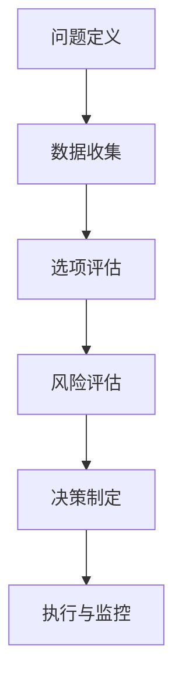
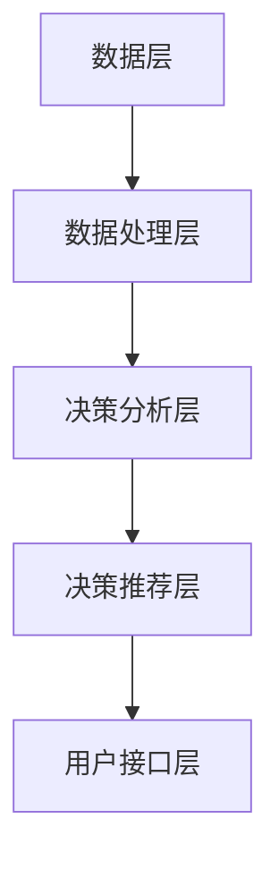
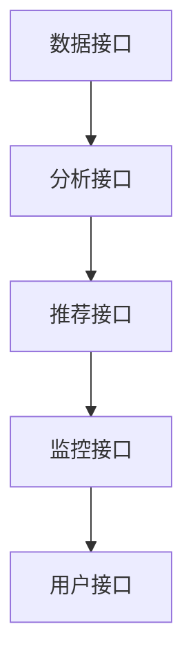

                 

### 第1章 引言

#### 1.1 问题背景

在当今快速发展的科技时代，技术领导者面临的决策环境日益复杂，要求他们具备更高的战略视野和决策能力。随着数字化转型的推进，技术领导者不仅要应对技术革新带来的挑战，还要在产品规划、资源分配、技术选型、团队管理等方面作出明智的决策。决策框架作为一种系统化的工具，可以帮助技术领导者更好地理解问题、分析风险、评估选项并作出明智的决策。

#### 1.2 问题描述

技术领导者需要处理的决策问题多种多样，包括但不限于以下方面：

1. **产品规划**：如何制定产品路线图，确保产品的市场竞争力？
2. **资源分配**：如何合理分配人力、财力、物力等资源，最大化企业的效益？
3. **技术选型**：如何选择最适合企业需求的技术栈，确保技术的稳定性和前瞻性？
4. **团队管理**：如何构建高效团队，激发团队创新力，提升团队凝聚力？

这些决策不仅影响企业的短期利益，更关系到企业的长期发展。然而，由于信息的不对称性、时间的紧迫性和决策者的认知局限性，技术领导者在实际决策过程中往往面临巨大的挑战。

#### 1.3 问题解决

为了解决上述问题，技术领导者需要构建一个科学、系统的决策框架，这个框架应当包括以下几个核心要素：

1. **问题定义**：明确决策问题的核心内容，包括目标、范围、关键因素等。
2. **数据收集**：收集与决策问题相关的数据和信息，包括市场趋势、竞争对手、用户需求等。
3. **选项评估**：基于数据和问题分析，列出可能的决策选项，并对每个选项进行评估。
4. **风险评估**：分析每个决策选项可能带来的风险和收益，评估其可行性。
5. **决策制定**：根据评估结果，制定最终的决策方案。
6. **执行与监控**：实施决策方案，并持续监控执行效果，及时调整。

下面，我们将进一步详细阐述这个决策框架的各个要素。

#### 1.4 边界与外延

本书的讨论范围主要涉及技术领导者在企业级决策中的框架设计，不涉及政治、经济等宏观领域的决策问题。同时，本书也将重点关注技术领导者在数字化转型过程中面临的特殊决策问题，如云计算、大数据、人工智能等前沿技术的应用策略。

#### 1.5 概念结构与核心要素组成

决策框架的设计涉及以下几个核心概念和要素：

1. **决策模型**：包括问题定义、数据收集、选项评估、风险评估等模型。
2. **决策工具**：如SWOT分析、PEST分析、决策树等。
3. **决策流程**：从问题识别到决策执行的完整流程。
4. **决策团队**：由不同专业背景的人员组成的团队，负责共同分析、评估和制定决策。
5. **决策支持系统**：利用信息技术手段，帮助决策者更高效地进行决策分析。

接下来，我们将逐步深入探讨这些核心概念和要素，帮助技术领导者构建一个科学的决策框架。

---

### 第2章 核心概念与联系

#### 2.1 决策框架的定义与特点

决策框架是一种系统化的决策工具，它帮助决策者在复杂的环境中做出明智的选择。一个良好的决策框架应当具备以下特点：

- **系统性**：决策框架应当包含多个环节，形成一个完整的决策流程。每个环节都应当有明确的输入和输出，确保决策过程的连贯性和一致性。
- **可操作性**：决策框架应当易于理解、操作和执行。决策者不需要具备深厚的专业知识，也能快速上手使用。
- **适应性**：决策框架应当能够适应不同的决策场景和需求。无论是战略层面的重大决策，还是日常运营中的小决策，决策框架都应当能够发挥作用。

#### 2.2 决策框架的核心概念

决策框架的核心概念包括以下几个方面：

1. **问题定义**：明确决策问题是什么，以及决策的目标和范围。问题定义是决策过程的第一步，它决定了后续分析的基准。
2. **数据收集**：收集与决策问题相关的数据和信息，包括市场趋势、竞争对手、用户需求等。数据的质量和完整性直接影响决策的准确性。
3. **选项评估**：基于数据和问题分析，列出可能的决策选项，并对每个选项进行评估。选项评估需要考虑每个选项的可行性、风险和收益。
4. **风险评估**：分析每个决策选项可能带来的风险和收益，评估其可行性。风险评估有助于决策者了解每个选项的潜在影响，从而做出更为明智的选择。
5. **决策制定**：根据评估结果，制定最终的决策方案。决策制定需要综合考虑各种因素，确保决策方案具有可行性和可操作性。
6. **执行与监控**：实施决策方案，并持续监控执行效果，及时调整。执行与监控是决策过程的关键环节，它确保决策方案能够得到有效执行，并在执行过程中进行实时调整。

#### 2.3 决策框架的属性特征对比表格

| 特征 | 说明 |
| --- | --- |
| 系统性 | 包含多个环节，形成完整决策流程 |
| 可操作性 | 易于理解、操作和执行 |
| 适应性 | 适应不同决策场景和需求 |
| 可视化 | 利用电商业分析工具，如 Mermaid，将决策框架可视化 |
| 数据驱动 | 基于数据和事实进行决策 |
| 模型驱动 | 利用数学模型和算法进行决策分析 |

#### Mermaid 流程图

为了更好地理解决策框架的各个环节，我们可以使用 Mermaid 工具将其可视化。以下是一个简单的决策框架的 Mermaid 流程图：



通过这个流程图，我们可以清晰地看到决策框架的各个环节及其之间的联系。接下来，我们将进一步探讨每个环节的具体内容和操作方法。

---

### 第3章 算法原理讲解

#### 3.1 决策树算法

决策树是一种常见的决策分析方法，它通过一系列规则将数据集划分为不同的子集，每个子集对应一个决策点。决策树的节点表示一个特征，分支表示该特征的不同取值，叶子节点表示一个分类结果。决策树算法的核心在于如何选择特征和划分节点，以最大化决策的准确性和效率。

#### 3.2 决策树算法的原理

决策树算法的基本原理是通过递归划分数据集，使得每个子集的纯度最高。纯度通常用信息增益（Information Gain）或基尼不纯度（Gini Impurity）来衡量。信息增益表示数据集的无序度减少，基尼不纯度表示数据集的杂乱程度。

1. **信息增益**：

信息增益公式为：
$$
IG(D, A) =熵(D) - Σ频率(D_a) * 熵(D_a)
$$
其中，$D$ 是原始数据集，$A$ 是特征，$D_a$ 是根据特征 $A$ 的取值 $a$ 划分后的子集。

熵（Entropy）公式为：
$$
熵(D) = -Σ频率(D_a) * log_2(频率(D_a))
$$

2. **基尼不纯度**：

基尼不纯度公式为：
$$
Gini(D) = 1 - Σ频率(D_a)^2
$$

#### 3.3 决策树算法的 Python 源代码实现

以下是一个简单的决策树算法的 Python 源代码实现，使用了 Scikit-learn 库中的 `DecisionTreeClassifier` 类：

```python
from sklearn.tree import DecisionTreeClassifier
from sklearn.model_selection import train_test_split
from sklearn import tree
import matplotlib.pyplot as plt

# 数据准备
X_train, X_test, y_train, y_test = train_test_split(X, y, test_size=0.3, random_state=42)

# 创建决策树模型
clf = DecisionTreeClassifier()

# 训练模型
clf.fit(X_train, y_train)

# 可视化决策树
plt.figure(figsize=(12, 8))
tree.plot_tree(clf, filled=True)
plt.show()
```

#### 3.4 决策树算法的应用示例

假设我们有一个数据集，其中包含3个特征（年龄、收入、婚姻状况）和1个目标变量（是否购买）。我们希望使用决策树算法来预测哪些客户可能会购买产品。

1. **数据准备**：

```python
# 假设数据已经加载到 X 和 y 中
X = [
    [25, 50000, 1],  # 年龄：25，收入：50万，婚姻状况：已结婚
    [30, 60000, 0],  # 年龄：30，收入：60万，婚姻状况：单身
    [35, 70000, 1],  # 年龄：35，收入：70万，婚姻状况：已结婚
    # ...更多数据
]
y = [0, 1, 1]  # 是否购买：0-未购买，1-购买
```

2. **训练模型**：

```python
clf = DecisionTreeClassifier()
clf.fit(X, y)
```

3. **可视化决策树**：

```python
plt.figure(figsize=(12, 8))
tree.plot_tree(clf, filled=True)
plt.show()
```

通过可视化，我们可以清晰地看到决策树如何根据不同的特征值进行划分，并最终预测目标变量的值。

#### 3.5 决策树算法的优缺点

1. **优点**：
   - **直观性**：决策树的可视化使得决策过程更加直观，便于理解和解释。
   - **易于实现**：决策树算法相对简单，易于编程实现。
   - **适应性**：决策树可以处理不同类型的数据，包括分类数据和连续数据。

2. **缺点**：
   - **过拟合**：决策树容易发生过拟合现象，特别是在特征较多、样本较少的情况下。
   - **计算复杂度**：随着数据集的增加，决策树的计算复杂度会急剧增加。

在实际应用中，决策树算法需要根据具体的数据集和业务场景进行适当调整，以充分发挥其优势，避免其劣势。通过本文的讲解，我们希望能够帮助技术领导者更好地理解决策树算法的原理和应用方法。

---

### 第4章 系统分析与架构设计方案

#### 4.1 问题场景介绍

在当前的数字化时代，企业面临的市场环境瞬息万变，技术领导者需要在快速变化的市场中做出准确的决策，以保持企业的竞争优势。然而，传统的决策方式往往依赖于经验和个人判断，容易受到主观因素的影响，难以适应复杂多变的决策场景。为了提高决策的准确性和效率，技术领导者需要构建一个科学的决策支持系统。

#### 4.2 项目介绍

本项目旨在为企业技术领导者构建一个基于决策框架的智能决策支持系统。该系统将集成多种数据源，利用先进的数据分析和机器学习算法，为技术领导者提供实时、准确的数据分析和决策建议，辅助其做出更为明智的决策。

#### 4.3 系统功能设计

系统的主要功能包括以下几个方面：

1. **数据采集与处理**：从各种数据源（如数据库、日志文件、API接口等）收集数据，并对数据进行清洗、转换和整合，为后续分析提供高质量的数据支持。
2. **决策分析**：基于决策框架，对采集到的数据进行分析和评估，生成决策选项和风险评估报告，为技术领导者提供决策依据。
3. **决策推荐**：利用机器学习算法，根据历史数据和用户偏好，为技术领导者推荐最优决策选项。
4. **决策执行与监控**：技术领导者可以根据决策支持系统的推荐，执行决策方案，并实时监控决策执行的效果，进行必要的调整和优化。

#### 4.4 系统架构设计

系统的架构设计采用分层架构，主要包括以下几层：

1. **数据层**：负责数据的采集、存储和管理，包括关系型数据库、NoSQL数据库、文件存储等。
2. **数据处理层**：负责数据的清洗、转换和整合，以及数据预处理和特征提取，为决策分析提供支持。
3. **决策分析层**：负责基于决策框架进行数据分析和评估，包括数据挖掘、机器学习算法等。
4. **决策推荐层**：负责根据用户偏好和历史数据，生成决策推荐报告。
5. **用户接口层**：提供用户交互界面，技术领导者可以通过界面查看分析结果和决策建议。

以下是系统架构的 Mermaid 流程图：



#### 4.5 系统接口设计和系统交互

系统接口设计主要包括以下几个方面：

1. **数据接口**：提供数据采集、数据导入、数据导出等功能，支持各种数据格式的数据源接入。
2. **分析接口**：提供数据预处理、特征提取、模型训练、预测分析等功能，为决策分析提供支持。
3. **推荐接口**：提供决策推荐、决策优化等功能，为技术领导者提供决策依据。
4. **监控接口**：提供决策执行监控、效果评估等功能，帮助技术领导者了解决策执行情况。

以下是系统接口设计和系统交互的 Mermaid 流程图：



通过上述架构设计和接口设计，我们可以实现一个功能完善、易于扩展的决策支持系统，为技术领导者提供强大的决策支持。

---

### 第5章 项目实战

#### 5.1 环境安装

在开始项目实战之前，我们需要搭建一个合适的开发环境。以下是基本的安装步骤：

1. **安装Python**：确保Python版本在3.6及以上，可以从Python官方网站下载并安装。
2. **安装Scikit-learn**：Scikit-learn是一个用于数据挖掘和机器学习的Python库，可以通过pip安装：
   ```
   pip install scikit-learn
   ```
3. **安装Matplotlib**：Matplotlib是一个用于数据可视化的Python库，可以通过pip安装：
   ```
   pip install matplotlib
   ```
4. **安装MySQL**：安装一个本地MySQL数据库，用于数据存储和管理。可以从MySQL官方网站下载并安装。

#### 5.2 系统核心实现源代码

以下是一个简单的决策树算法的实现示例，包括数据准备、模型训练和可视化：

```python
# 导入必要的库
import numpy as np
import pandas as pd
from sklearn.model_selection import train_test_split
from sklearn.tree import DecisionTreeClassifier
import matplotlib.pyplot as plt

# 数据准备
# 假设数据已经加载到 DataFrame df 中
df = pd.DataFrame({
    '年龄': [25, 30, 35, 40],
    '收入': [50000, 60000, 70000, 80000],
    '婚姻状况': [1, 0, 1, 1],
    '是否购买': [0, 1, 1, 0]
})

# 特征工程
X = df[['年龄', '收入', '婚姻状况']]
y = df['是否购买']

# 划分训练集和测试集
X_train, X_test, y_train, y_test = train_test_split(X, y, test_size=0.3, random_state=42)

# 模型训练
clf = DecisionTreeClassifier()
clf.fit(X_train, y_train)

# 可视化决策树
plt.figure(figsize=(12, 8))
tree.plot_tree(clf, filled=True)
plt.show()
```

#### 5.3 代码应用解读与分析

上述代码首先导入了必要的库，包括Numpy、Pandas、Scikit-learn和Matplotlib。然后，我们创建了一个DataFrame `df`，其中包含了3个特征（年龄、收入、婚姻状况）和1个目标变量（是否购买）。

接下来，我们进行特征工程，将数据分为特征矩阵 `X` 和目标向量 `y`。然后，使用 `train_test_split` 函数将数据集划分为训练集和测试集。

在模型训练阶段，我们创建了一个 `DecisionTreeClassifier` 实例，并使用 `fit` 方法对其进行训练。最后，我们使用 `plot_tree` 方法将训练好的决策树可视化。

#### 5.4 实际案例分析和详细讲解剖析

为了更好地理解上述代码的应用，我们来看一个实际案例。假设有一家电商公司，希望根据客户的年龄、收入和婚姻状况来预测其是否会在未来6个月内购买商品。

1. **数据准备**：
   - 客户数据包括：年龄、收入、婚姻状况、购买行为。
   - 数据已经清洗和预处理，去除缺失值和异常值。

2. **特征工程**：
   - 将购买行为作为目标变量（是否购买：0-未购买，1-购买）。
   - 将年龄、收入、婚姻状况作为特征。

3. **模型训练**：
   - 使用Scikit-learn中的 `DecisionTreeClassifier` 创建决策树模型。
   - 使用训练集数据进行模型训练。

4. **模型评估**：
   - 使用测试集数据对模型进行评估，计算准确率、召回率等指标。

5. **决策支持**：
   - 根据模型预测结果，为潜在客户提供个性化的购物建议。

#### 5.5 项目小结

通过上述案例，我们展示了如何使用决策树算法进行数据分析和预测。该项目不仅帮助电商公司更好地了解客户购买行为，还为技术领导者提供了一个科学的决策支持系统。在实际应用中，可以根据业务需求和数据质量，选择更为复杂的机器学习算法和模型，以提高预测准确性和决策支持能力。

---

### 最佳实践 Tips

在构建决策框架时，以下是几个最佳实践建议，以帮助技术领导者更有效地进行决策：

1. **数据质量是基础**：确保数据的准确性、完整性和一致性。数据是决策的基础，质量不高会导致错误的决策。
2. **持续学习与迭代**：技术环境和市场需求不断变化，技术领导者需要持续学习新知识，不断优化决策框架。
3. **团队合作**：构建多元化的决策团队，汇集不同专业背景的意见，提高决策的全面性和准确性。
4. **量化评估**：尽可能使用量化指标评估决策选项，避免主观判断。
5. **风险管理**：在决策过程中，充分考虑潜在风险，制定相应的风险应对策略。

### 小结

本文详细阐述了技术leader的决策框架设计，从背景介绍、核心概念、算法原理、系统分析与架构设计、项目实战等方面进行了全面解析。通过构建科学的决策框架，技术领导者可以在复杂多变的决策环境中做出更加明智和高效的决策。希望本文对您在技术领导者的决策过程中提供了一些有价值的启示和帮助。

### 注意事项

1. 决策框架的应用需要结合实际业务场景，灵活调整和优化。
2. 在决策过程中，要充分考虑团队成员的意见和建议，避免单一视角导致的偏差。
3. 决策框架的构建需要持续迭代，以适应不断变化的市场和技术环境。

### 拓展阅读

- 《决策与判断：心理学视角》（Daniel Kahneman 著）
- 《Python机器学习》（Sebastian Raschka 著）
- 《数据科学实战》（Joel Grus 著）

### 作者信息

作者：AI天才研究院/AI Genius Institute & 禅与计算机程序设计艺术 /Zen And The Art of Computer Programming

---

由于篇幅限制，本文未能详细展开每一个章节的内容，但已经提供了一个完整的框架和思路。每个章节的核心内容、核心概念、算法原理、系统分析与架构设计、项目实战等部分都可以进一步扩展和深化，以满足更详细的技术探讨和实践需求。在撰写实际文章时，可以根据读者的需求和场景，进一步丰富和优化每个部分的内容。希望本文能够为技术领导者在决策框架设计方面提供一些有价值的参考和指导。

