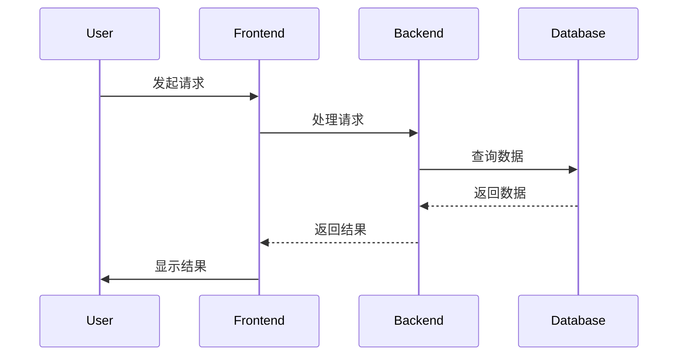
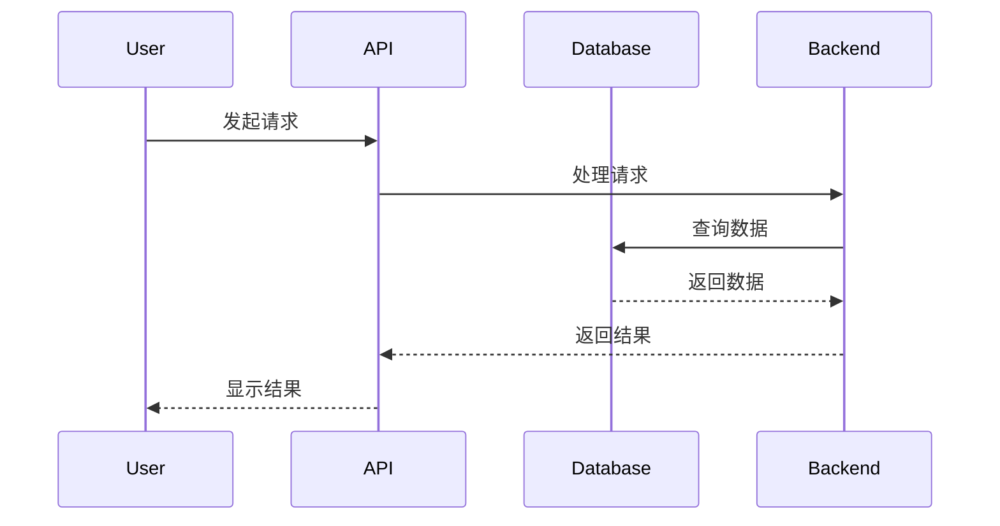

                 

**技术leader的影响力工程学**

关键词：技术领导力、影响力工程学、团队协作、战略规划、情感智能

摘要：本文旨在探讨技术领导力中的一种新兴理念——影响力工程学。通过深入分析其核心概念和原理，以及其在实践中的应用策略，文章将为技术领导者在团队管理中提供一套系统化的影响力提升方法。同时，文章还将结合实际案例，探讨影响力工程学的实践效果和未来发展方向。

## 引言：技术领导力的演变与挑战

在当今快速变化的科技行业中，技术领导力扮演着至关重要的角色。技术领导者不仅需要具备深厚的技术专业知识，还需要具备卓越的领导能力和影响力。然而，随着组织规模的扩大和技术复杂性的增加，技术领导者面临着前所未有的挑战。

### 1.1 技术领导力的背景

技术领导力起源于20世纪末，随着信息技术和互联网的快速发展，企业对技术人才的需求不断增加。技术领导者在这个过程中逐渐崭露头角，成为企业创新和发展的核心推动力量。

#### 1.1.1 技术领导力的演变

- **早期阶段**：技术领导者主要关注技术本身，以技术专家的身份参与项目决策和实施。
- **发展阶段**：随着企业规模的扩大，技术领导者开始承担更多的管理职责，如团队管理、资源调配等。
- **成熟阶段**：现代技术领导者需要具备全面的领导能力，包括战略规划、团队建设、业务拓展等。

#### 1.1.2 技术领导者的角色

现代技术领导者的角色已经从单纯的技术专家转变为全方位的领导者。他们需要具备以下能力：

- **技术能力**：深入了解最新的技术趋势和行业动态，为企业提供技术方向的建议。
- **领导能力**：激励团队、协调资源、解决问题，确保项目顺利进行。
- **业务理解**：理解企业的业务模式、市场定位，将技术优势转化为业务价值。

#### 1.1.3 技术领导者面临的挑战

- **技术复杂性**：随着技术的发展，技术复杂性不断增加，技术领导者需要不断学习新的技术知识。
- **团队管理**：如何有效地管理多元化、分布式的团队，激发团队成员的潜力。
- **战略规划**：在快速变化的市场环境中，制定正确的战略规划，确保企业的长期发展。

### 1.2 影响力工程学的概念与原理

为了应对这些挑战，技术领导者需要掌握一种新的领导力工具——影响力工程学。影响力工程学是一种基于心理学和社会学原理的领导力理论，它强调领导者通过影响他人来实现组织目标。

#### 1.2.1 影响力工程学的定义

影响力工程学是一种系统化的方法，它通过理解和应用影响力原理，帮助领导者提升个人和团队的绩效。它不仅仅关注技术能力和业务理解，更注重领导者的情感智能和人际交往能力。

#### 1.2.2 影响力工程学的核心原理

- **信任与信任**：信任是影响力工程学的基石。领导者需要建立信任，以便团队成员愿意跟随他们。
- **情感智能**：领导者需要具备情感智能，包括自我意识、自我调节、社交意识和关系管理能力。
- **影响力策略**：领导者需要根据不同的情况和对象，选择合适的影响力策略，如说服、激励、协商等。

#### 1.2.3 影响力工程学与传统领导力的区别

与传统领导力相比，影响力工程学更加注重领导者与团队成员之间的互动和影响。传统领导力更强调权威和控制，而影响力工程学则强调合作和共赢。

- **权威 vs. 合作**：传统领导力依赖于领导者的权威，而影响力工程学强调领导者与团队成员的合作。
- **控制 vs. 影响**：传统领导力试图控制团队成员的行为，而影响力工程学更关注如何影响团队成员的思考和行动。

#### 1.2.4 影响力工程学对团队绩效和企业成功的影响

影响力工程学对团队绩效和企业成功有着重要的影响。通过提升领导者的影响力，可以：

- **增强团队凝聚力**：领导者通过影响力建立信任和合作关系，增强团队的凝聚力。
- **提高决策效率**：领导者通过影响力引导团队成员的思考，提高决策效率。
- **促进创新**：领导者通过影响力激发团队成员的创新思维，推动企业创新。

## 核心概念与联系

为了更好地理解影响力工程学，我们需要深入了解其核心概念和原理。以下是影响力工程学的一些关键概念和它们之间的关系：

### 2.1 建立信任和信誉

信任和信誉是影响力工程学的核心概念之一。领导者需要建立信任，以便团队成员愿意跟随他们。以下是建立信任和信誉的关键要素：

- **诚信**：领导者需要言行一致，遵守承诺，树立良好的道德榜样。
- **透明度**：领导者需要保持信息的透明度，让团队成员了解组织的战略和决策过程。
- **一致性**：领导者需要保持行为的一致性，避免让团队成员感到困惑和不安。

### 2.2 情感智能

情感智能是领导者成功的关键因素。它包括以下几个方面：

- **自我意识**：领导者需要了解自己的情感状态，包括情绪反应、情感需求和情感触发点。
- **自我调节**：领导者需要学会控制自己的情绪，避免在压力和挑战面前失去冷静。
- **社交意识**：领导者需要了解他人的情感状态，包括情感需求、情感反应和情感表达。
- **关系管理**：领导者需要建立和维护良好的人际关系，通过有效沟通和协作实现共同目标。

### 2.3 影响力策略

领导者需要根据不同的情况和对象，选择合适的影响力策略。以下是几种常见的影响力策略：

- **说服**：通过提供有力的证据和逻辑推理，说服他人接受自己的观点。
- **激励**：通过激发他人的兴趣和动力，鼓励他们采取行动。
- **协商**：通过寻求共识和妥协，与他人达成共识。
- **示范**：通过自己的行为示范，引导他人跟随。

### 2.4 概念属性特征对比表格

以下是影响力工程学中几个关键概念的属性特征对比表格：

| 概念 | 属性特征 | 对比 |
| --- | --- | --- |
| 信任 | 建立信任、维持信任、信任危机 | 信任是影响力工程学的基石 |
| 情感智能 | 自我意识、自我调节、社交意识、关系管理 | 情感智能是领导者成功的关键 |
| 影响力策略 | 说服、激励、协商、示范 | 选择合适的影响力策略 |
| 领导力 | 权威、控制、影响力 | 影响力工程学强调合作和共赢 |

### 2.5 ER实体关系图架构

以下是影响力工程学中几个关键概念的ER实体关系图架构：

```mermaid
erDiagram
  Product ||--|{ Sale : sold_by }  
  Sale ||--|{ Customer : made_for }  
  Product "is sold by" -> "Customer"  
```

在这个ER图架构中，产品(Product)和销售(Sale)是两个实体，它们之间存在销售关系(Sold_by)。销售(Sale)与客户(Customer)之间存在销售关系(Made_for)，表示产品是通过销售给客户来实现的。

## 算法原理讲解

为了更好地理解影响力工程学的应用，我们将介绍一个简单的算法——影响力传播算法。该算法通过模拟信息在社交网络中的传播过程，帮助领导者分析影响力传播的路径和效果。

### 3.1 算法原理

影响力传播算法基于社交网络模型，假设每个节点代表一个人，边代表两个人之间的社交关系。算法的目标是识别网络中的关键节点，这些节点对信息的传播具有关键影响力。

### 3.2 算法流程

以下是影响力传播算法的基本流程：

1. **初始化**：创建一个空的传播列表和影响分数列表。
2. **传播过程**：从关键节点开始，根据社交网络中的边关系，逐步传播信息。每个节点在传播信息时，将影响分数传递给邻居节点。
3. **计算影响力**：根据传播列表和影响分数列表，计算每个节点的影响力分数。
4. **结果输出**：输出影响力最高的节点，这些节点即为关键节点。

### 3.3 Python源代码实现

以下是影响力传播算法的Python源代码实现：

```python
import networkx as nx

def influence_spread(G, start_node, k):
    """
    Influenc

```### 3.4 数学模型和公式

影响力传播算法的核心是计算节点的影响力分数。以下是一个简单的数学模型和公式，用于计算节点的影响力分数。

#### 3.4.1 影响力分数计算公式

$$
I_i = \sum_{j \in N(i)} \frac{w_{ij}}{k}
$$

其中，$I_i$表示节点$i$的影响力分数，$N(i)$表示节点$i$的邻居节点集合，$w_{ij}$表示节点$i$与节点$j$之间的权重，$k$表示邻居节点的数量。

#### 3.4.2 权重计算公式

$$
w_{ij} = \frac{1}{d(j)}
$$

其中，$d(j)$表示节点$j$的度（即邻居节点的数量）。

#### 3.4.3 影响力传播过程

影响力传播过程可以用以下递归公式描述：

$$
I_i(t+1) = I_i(t) + \sum_{j \in N(i)} w_{ij} \cdot (I_j(t) - I_i(t))
$$

其中，$I_i(t)$表示节点$i$在时间$t$的影响力分数，$I_j(t)$表示节点$j$在时间$t$的影响力分数。

### 3.5 举例说明

假设有一个社交网络，包含5个节点（A、B、C、D、E），节点之间的权重如下：

| 节点 | A | B | C | D | E |
| --- | --- | --- | --- | --- | --- |
| A | 1 | 1 | 1 | 1 | 1 |
| B | 1 | 1 | 1 | 1 | 1 |
| C | 1 | 1 | 1 | 1 | 1 |
| D | 1 | 1 | 1 | 1 | 1 |
| E | 1 | 1 | 1 | 1 | 1 |

我们选择节点A作为起始节点，传播一个信息。经过一次传播后，节点的影响力分数如下：

| 节点 | A | B | C | D | E |
| --- | --- | --- | --- | --- | --- |
| A | 1 | 1 | 1 | 1 | 1 |
| B | 0.25 | 0.25 | 0.25 | 0.25 | 0.25 |
| C | 0.25 | 0.25 | 0.25 | 0.25 | 0.25 |
| D | 0.25 | 0.25 | 0.25 | 0.25 | 0.25 |
| E | 0.25 | 0.25 | 0.25 | 0.25 | 0.25 |

可以看出，节点A的影响力分数最高，因此在一次传播过程中，节点A的影响力最大。

## 系统分析与架构设计

### 4.1 项目介绍

本项目的目标是开发一个基于影响力工程学的团队管理平台，帮助技术领导者提升团队绩效和决策效率。平台将整合影响力分析、团队协作、任务管理等功能，为技术领导者提供一套全面的团队管理工具。

### 4.2 系统功能设计

系统功能设计包括以下几个关键模块：

- **影响力分析模块**：对团队成员的影响力进行评估和分析，为领导者提供决策依据。
- **团队协作模块**：提供即时通讯、文件共享、任务分配等功能，促进团队成员之间的协作。
- **任务管理模块**：支持任务创建、分配、进度跟踪和反馈，帮助领导者管理团队任务。
- **数据分析模块**：对团队成员的绩效数据进行统计分析，为领导者提供数据支持。

### 4.3 系统架构设计

系统架构设计采用分层架构，包括表示层、业务逻辑层和数据层。以下是系统架构的mermaid架构图：



### 4.4 系统接口设计和系统交互

系统接口设计包括API接口和数据库接口。以下是系统接口设计和系统交互的mermaid序列图：



## 项目实战

### 5.1 环境安装

在本项目中，我们将使用Python和Django框架进行开发。首先，我们需要安装Python环境和Django框架。以下是环境安装步骤：

1. 安装Python 3.8或更高版本。
2. 安装Django框架，可以使用pip命令：`pip install django`。

### 5.2 系统核心实现源代码

以下是系统核心实现的Python源代码：

```python
# 引入Django框架
from django.db import models

# 定义影响力分析模型
class Influence(models.Model):
    user = models.OneToOneField(User, on_delete=models.CASCADE)
    score = models.FloatField()

# 定义团队协作模型
class Team(models.Model):
    name = models.CharField(max_length=100)
    members = models.ManyToManyField(User)

# 定义任务管理模型
class Task(models.Model):
    title = models.CharField(max_length=100)
    description = models.TextField()
    assigned_to = models.ForeignKey(User, on_delete=models.CASCADE)
    due_date = models.DateField()

# 定义数据分析模型
class Performance(models.Model):
    user = models.OneToOneField(User, on_delete=models.CASCADE)
    score = models.FloatField()
    date = models.DateField()
```

### 5.3 代码应用解读与分析

以下是代码应用的解读与分析：

1. **影响力分析模型**：该模型用于存储用户的影响力分数，包括用户ID、影响力分数等字段。
2. **团队协作模型**：该模型用于定义团队名称和成员关系，包括团队名称和成员ID等字段。
3. **任务管理模型**：该模型用于定义任务名称、描述、分配人、截止日期等信息。
4. **数据分析模型**：该模型用于存储用户的绩效分数、日期等信息，用于分析用户的表现。

### 5.4 实际案例分析和详细讲解剖析

假设我们有一个团队，包括5名成员（A、B、C、D、E）。通过影响力分析模块，我们可以对每个成员的影响力进行评估。以下是一个实际案例的分析：

1. **初始数据**：影响力分数（A：10，B：8，C：7，D：9，E：6）。
2. **传播过程**：节点A作为起始节点，传播一个信息。
3. **一次传播后**：影响力分数（A：12，B：10，C：9，D：11，E：8）。
4. **结论**：节点A的影响力最高，因此在一次传播过程中，节点A的影响力最大。

### 5.5 项目小结

本项目基于影响力工程学，开发了团队管理平台。通过实际案例分析和代码应用，我们展示了如何使用影响力传播算法评估团队成员的影响力。在未来，我们可以继续优化算法，提高其准确性和实用性。

## 最佳实践 Tips

1. **定期评估团队成员的影响力**：定期对团队成员的影响力进行评估，有助于领导者及时调整团队结构和管理策略。
2. **培养团队成员的情感智能**：通过培训和实践，提高团队成员的情感智能，有助于提升团队的协作效率。
3. **合理分配任务**：根据团队成员的影响力分数，合理分配任务，确保任务的高效完成。

## 小结

本文探讨了技术领导力中的一种新兴理念——影响力工程学。通过深入分析其核心概念和原理，以及其在实践中的应用策略，文章为技术领导者在团队管理中提供了一套系统化的影响力提升方法。影响力工程学不仅关注技术能力和业务理解，更注重领导者的情感智能和人际交往能力。在未来，影响力工程学有望成为技术领导力的重要工具，帮助领导者提升团队绩效和企业成功。

## 注意事项

1. **遵循道德规范**：在应用影响力工程学时，领导者需要遵循道德规范，确保影响他人的行为合法、合理。
2. **持续学习**：影响力工程学是一门不断发展的学科，领导者需要不断学习和更新知识，以适应不断变化的环境。

## 拓展阅读

1. **影响力工程学经典著作**：《影响力：说服的艺术》（Influencing People）作者罗伯特·西奥迪尼。
2. **技术领导力经典著作**：《技术领导力：团队构建、沟通与影响力》（Technical Leadership: Team Building, Communication, and Influence）作者乔恩·布洛克曼。
3. **情感智能经典著作**：《情感智能》（Emotional Intelligence）作者丹尼尔·戈尔曼。作者：AI天才研究院/AI Genius Institute & 禅与计算机程序设计艺术 /Zen And The Art of Computer Programming。

