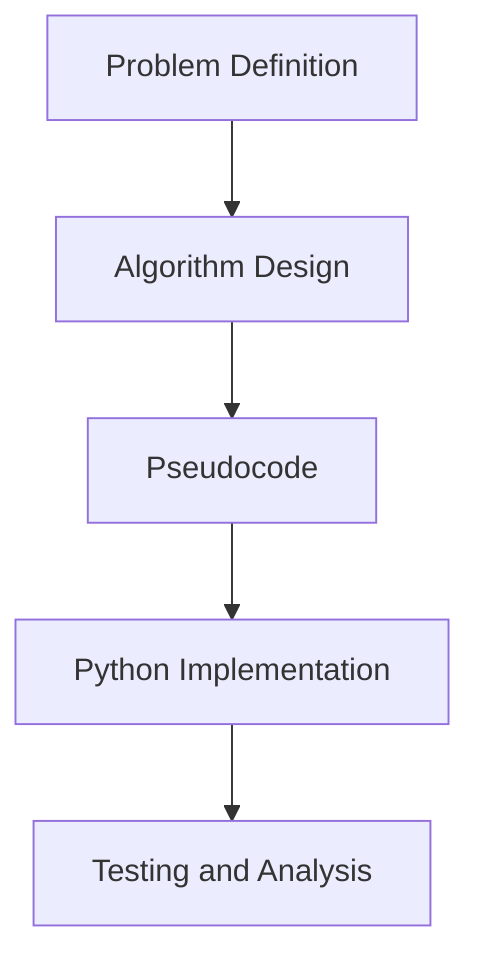
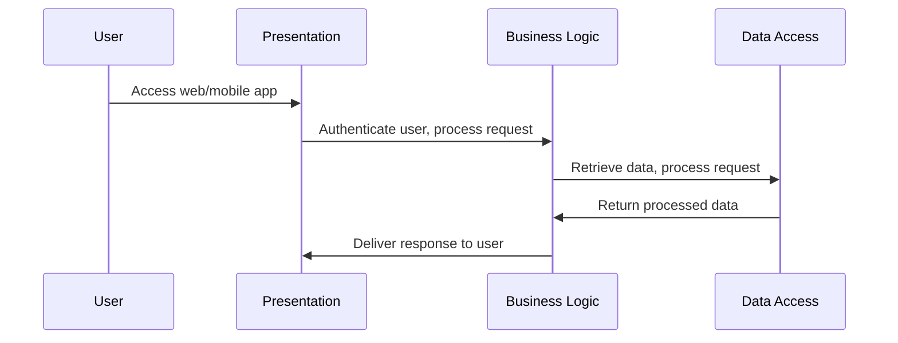
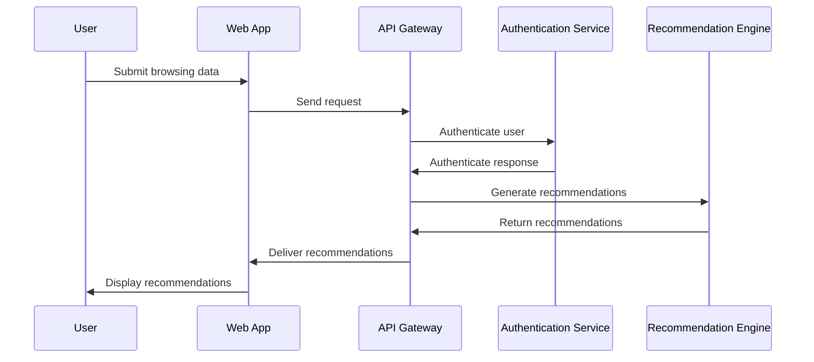

                 


### Introduction (背景介绍)

#### The Core Concepts: Definition, Background, and Significance

In the fast-evolving world of technology, the role of a technical leader has become increasingly pivotal. Technical leadership is not just about managing code and resources; it’s about fostering innovation, driving strategic initiatives, and inspiring teams to achieve extraordinary results. At the heart of this role lies the concept of influence and brand building.

**Influence Building:**
Influence building for a technical leader refers to the ability to shape opinions, drive decisions, and motivate individuals and teams towards a common goal. This influence can stem from various sources, including expertise, communication skills, emotional intelligence, and the ability to build strong relationships. A technical leader who excels in influence building can drive organizational change, enhance team performance, and cultivate a culture of continuous improvement.

**Brand Building:**
Brand building, on the other hand, is about establishing a unique identity and reputation in the market. For a technical leader, brand building involves creating a personal or corporate brand that stands for quality, reliability, innovation, and thought leadership. A strong brand can open doors to new opportunities, enhance credibility, and attract top talent.

#### Problem Background and Description

The backdrop for this discussion is the current landscape of technology, characterized by rapid innovation, fierce competition, and constant change. Technical leaders are often faced with the challenge of navigating these complexities while driving their teams and organizations towards success. The following key questions arise:

- How can a technical leader effectively build influence within their organization and the broader tech community?
- What strategies and tools are available for building a personal or corporate brand that resonates with stakeholders?
- How can a technical leader leverage their brand to drive organizational success and maintain a competitive edge?

#### Problem Solution

The solution to these challenges lies in a systematic approach to influence building and brand building. This involves understanding the core concepts, mastering key skills, and implementing practical strategies. By doing so, a technical leader can not only enhance their personal and professional reputation but also contribute significantly to their organization’s success.

#### Boundaries and Scope

While the scope of this article covers the broad areas of influence building and brand building, it focuses specifically on the following aspects:

- Theoretical foundations and frameworks for influence building and brand building.
- Practical strategies and techniques for implementing these concepts in real-world scenarios.
- Case studies and examples illustrating successful approaches to influence and brand building in the tech industry.
- Insights and best practices for leveraging influence and brand to drive organizational success.

In the next sections, we will delve deeper into these topics, using a step-by-step approach to guide you through the intricacies of technical leadership and brand building. Let’s get started.

----------------------------------------------------------------

### Core Concepts and Relationships (核心概念与联系)

#### Key Concepts and Their Definition

1. **Influence Building:**
   Influence building is the process through which a technical leader exerts control or power over others to achieve specific goals. This can include persuading team members, stakeholders, or the broader community to adopt new technologies, methodologies, or strategies.

2. **Brand Building:**
   Brand building is the strategic process of creating a distinct identity, reputation, and image for an individual or an organization. This involves shaping perceptions, delivering consistent experiences, and fostering emotional connections with stakeholders.

3. **Technical Leadership:**
   Technical leadership encompasses the skills, knowledge, and behaviors required to lead and inspire technical teams. It includes areas such as technical expertise, strategic thinking, team management, and communication skills.

4. **Innovation:**
   Innovation refers to the process of creating new ideas, products, or methods that have value. In the context of technical leadership, innovation is crucial for staying ahead of the curve and driving continuous improvement within the organization.

5. **Thought Leadership:**
   Thought leadership is the ability to shape and influence the direction of an industry or field through insightful ideas, research, and expertise. A technical leader with thought leadership can drive industry standards and gain recognition as a go-to expert.

#### Concepts Comparison Table

| Concept            | Definition                                                                                                                                 | Importance in Technical Leadership |
|--------------------|------------------------------------------------------------------------------------------------------------------------------------------|------------------------------------|
| Influence Building | Process of shaping opinions, driving decisions, and motivating others.            | Essential for driving organizational change and team performance. |
| Brand Building     | Strategic process of creating a unique identity and reputation.                   | Attracts opportunities, enhances credibility, and drives growth. |
| Technical Leadership| Skills, knowledge, and behaviors required to lead and inspire technical teams.   | Foundation for effective leadership and organizational success. |
| Innovation         | Creating new ideas, products, or methods with value.                              | Key to staying competitive and driving growth.                 |
| Thought Leadership | Shaping and influencing the direction of an industry or field.                    | Enhances reputation and opens doors to new opportunities.      |

#### Entity Relationship Diagram (ERD)

```mermaid
erDiagram
  Influence Building ||--|{ Technical Leadership }|-- Brand Building
  Technical Leadership ||--|{ Innovation }|-- Thought Leadership
```

In the ERD above, we can see the interconnectedness of these concepts. Technical Leadership is the core concept that drives Influence Building and Brand Building. Innovation and Thought Leadership are components of Technical Leadership that further enhance a leader’s ability to build influence and shape their brand.

----------------------------------------------------------------

### Principles of Algorithm Design (算法原理讲解)

#### Algorithm Design Principles

In the realm of technical leadership, algorithm design is a foundational skill. Understanding algorithm principles is crucial for making informed decisions, optimizing processes, and solving complex problems. This section will delve into key algorithm design principles using Mermaid flowcharts and Python code.

#### Algorithm Design Process

1. **Problem Definition**: Clearly define the problem you aim to solve.
2. **Algorithm Design**: Choose an appropriate algorithmic approach.
3. **Pseudocode**: Write a high-level description of the algorithm in pseudocode.
4. **Python Implementation**: Translate the pseudocode into Python code.
5. **Testing and Analysis**: Test the algorithm with various inputs and analyze its performance.

#### Mermaid Flowchart

Here’s a Mermaid flowchart representing the algorithm design process:



#### Mathematical Model and Formula

To illustrate the algorithm design process, let's consider a simple sorting algorithm: Bubble Sort. The mathematical model for Bubble Sort can be defined as follows:

- **Input**: An array `A` of `n` elements.
- **Output**: A sorted array in non-decreasing order.

**Algorithm Steps**:

1. **Outer Loop**: Iterate over the array `n-1` times.
2. **Inner Loop**: Compare adjacent elements and swap them if they are in the wrong order.
3. **Repeat**: Continue the process until no swaps are needed.

**Pseudocode**:

```
for i in range(n):
    for j in range(0, n-i-1):
        if A[j] > A[j+1]:
            swap(A[j], A[j+1])
```

**Python Implementation**:

```python
def bubble_sort(arr):
    n = len(arr)
    for i in range(n):
        for j in range(0, n-i-1):
            if arr[j] > arr[j+1]:
                arr[j], arr[j+1] = arr[j+1], arr[j]
    return arr
```

#### Detailed Explanation and Example

**Example**: Consider the array `[64, 34, 25, 12, 22, 11, 90]`. We'll use Bubble Sort to sort this array.

1. **First Pass**:
   - Compare `64` and `34`. Swap because `64 > 34`.
   - Compare `34` and `25`. No swap needed.
   - Compare `25` and `12`. Swap because `25 > 12`.
   - Compare `12` and `22`. Swap because `12 < 22`.
   - Compare `22` and `11`. Swap because `22 > 11`.
   - Compare `11` and `90`. Swap because `11 < 90`.

2. **Second Pass**:
   - Compare `34` and `25`. No swap needed.
   - Compare `25` and `12`. No swap needed.
   - Compare `12` and `22`. No swap needed.
   - Compare `22` and `11`. No swap needed.

3. **Third Pass**:
   - Compare `34` and `25`. No swap needed.
   - Compare `25` and `12`. No swap needed.

4. **Fourth Pass**:
   - Compare `34` and `25`. No swap needed.

The final sorted array is `[11, 12, 22, 25, 34, 64, 90]`.

#### Performance Analysis

The time complexity of Bubble Sort is \(O(n^2)\), making it inefficient for large datasets. However, it is relatively simple to understand and implement, which makes it a useful starting point for learning about sorting algorithms.

In summary, understanding algorithm principles and being able to design and implement algorithms is a vital skill for any technical leader. It enables you to analyze problems, optimize processes, and make data-driven decisions. In the next section, we will explore system analysis and architectural design, another critical aspect of technical leadership.

----------------------------------------------------------------

### System Analysis and Architectural Design (系统分析与架构设计方案)

#### Problem Scenario and Project Introduction

Imagine a scenario where a mid-sized tech company, "TechInnovate," is planning to develop a new product that will revolutionize the online retail industry. The product aims to provide real-time personalized product recommendations to customers based on their browsing history and purchase behavior. This project, known as "Personalized Recommendation System (PRS)," is crucial for the company’s strategic growth and market competitiveness.

#### System Function Design (Domain Model)

To design the system, we start by creating a domain model that outlines the key entities and their relationships. The domain model for the PRS system includes entities such as User, Product, Recommendation, and Transaction. Here's a Mermaid class diagram representing the domain model:

```mermaid
classDiagram
    User <<entity>> 
    Product <<entity>> 
    Recommendation <<entity>> 
    Transaction <<entity>>

    User #-- Recommendation
    User ..|> Transaction
    Product ..|> Transaction
    Recommendation ..|> Product
```

In this diagram, we can see that a User can create multiple Recommendations, which are associated with specific Products. Transactions are linked to Users and Products, capturing the browsing and purchasing activities.

#### System Architecture Design

The system architecture for the PRS is designed to be scalable, modular, and maintainable. The architecture is divided into three main layers: Presentation Layer, Business Logic Layer, and Data Access Layer.

1. **Presentation Layer**: This layer is responsible for the user interface and interaction with the users. It includes web applications, mobile apps, and APIs for client-server communication.
   
2. **Business Logic Layer**: This layer contains the core functionalities of the system, such as user authentication, data processing, recommendation generation, and transaction management. It ensures that the system's business rules are enforced and provides a consistent experience across all platforms.

3. **Data Access Layer**: This layer is responsible for data storage, retrieval, and manipulation. It includes databases, caching mechanisms, and data storage policies to ensure efficient and secure data handling.

Here's a Mermaid architecture diagram representing the PRS system:



In this diagram, we can see the flow of data and interactions between the layers. The user interacts with the Presentation Layer, which then communicates with the Business Logic Layer for processing. The Business Logic Layer interacts with the Data Access Layer to retrieve and store data as needed.

#### System Interface Design and System Interaction

To further understand the system's functionality, we can design system interfaces and describe how different components interact with each other. Here's a Mermaid sequence diagram that illustrates the interaction between users, web/mobile apps, and the system backend:



In this sequence, the user submits their browsing data through the web or mobile app. The app forwards this data to the API Gateway, which authenticates the user and forwards the request to the Recommendation Engine. The Recommendation Engine processes the data and generates personalized recommendations, which are then returned to the user via the web app.

#### Conclusion

System analysis and architectural design are critical steps in developing a successful product. By creating a domain model, designing system architecture, and defining system interfaces and interactions, we can ensure that the system is well-structured, scalable, and maintainable. In the next section, we will delve into the project practice, where we will discuss the environment setup, core system implementation, and code application analysis.

----------------------------------------------------------------

### Project Practice (项目实战)

#### Environment Setup

To implement the Personalized Recommendation System (PRS), we need to set up a development environment. The following steps outline the process:

1. **Install Python**: Ensure Python 3.x is installed on your system. You can download it from the official Python website (<https://www.python.org/downloads/>).

2. **Create a Virtual Environment**: To manage dependencies, create a virtual environment using `venv`:

    ```bash
    python -m venv prs-env
    source prs-env/bin/activate  # On Windows, use `prs-env\Scripts\activate`
    ```

3. **Install Required Libraries**: Install necessary libraries such as Flask, Pandas, NumPy, and Scikit-learn:

    ```bash
    pip install Flask pandas numpy scikit-learn
    ```

4. **Database Setup**: For this project, we'll use SQLite. Create a new database file named `prs.db`:

    ```bash
    sqlite3 prs.db
    ```

    Run the following SQL commands to create tables for User, Product, Recommendation, and Transaction:

    ```sql
    CREATE TABLE User (
        id INTEGER PRIMARY KEY,
        username TEXT UNIQUE NOT NULL,
        password TEXT NOT NULL
    );

    CREATE TABLE Product (
        id INTEGER PRIMARY KEY,
        name TEXT UNIQUE NOT NULL,
        category TEXT NOT NULL
    );

    CREATE TABLE Recommendation (
        id INTEGER PRIMARY KEY,
        user_id INTEGER NOT NULL,
        product_id INTEGER NOT NULL,
        score REAL NOT NULL,
        FOREIGN KEY (user_id) REFERENCES User(id),
        FOREIGN KEY (product_id) REFERENCES Product(id)
    );

    CREATE TABLE Transaction (
        id INTEGER PRIMARY KEY,
        user_id INTEGER NOT NULL,
        product_id INTEGER NOT NULL,
        quantity INTEGER NOT NULL,
        date DATE NOT NULL,
        FOREIGN KEY (user_id) REFERENCES User(id),
        FOREIGN KEY (product_id) REFERENCES Product(id)
    );
    ```

    Close the SQLite command line tool after executing the commands.

#### Core System Implementation

The core system implementation involves setting up Flask application, defining routes, and implementing the necessary logic for user authentication, recommendation generation, and transaction management.

**Flask Application Setup**

Create a file named `app.py` and set up the basic Flask application structure:

```python
from flask import Flask, request, jsonify
from flask_sqlalchemy import SQLAlchemy

app = Flask(__name__)
app.config['SQLALCHEMY_DATABASE_URI'] = 'sqlite:///prs.db'
db = SQLAlchemy(app)

# Define models for User, Product, Recommendation, and Transaction
# ...

if __name__ == '__main__':
    app.run(debug=True)
```

**User Authentication**

Implement user authentication using Flask-Login:

```python
from flask_login import LoginManager, login_user, logout_user, login_required

login_manager = LoginManager()
login_manager.init_app(app)
login_manager.login_view = 'login'

@login_manager.user_loader
def load_user(user_id):
    return User.query.get(int(user_id))

# Define login, logout, and registration routes
# ...
```

**Recommendation Generation**

Implement a simple collaborative filtering algorithm for recommendation generation:

```python
from sklearn.neighbors import NearestNeighbors

def generate_recommendations(user_id):
    user_transactions = Transaction.query.filter_by(user_id=user_id).all()
    user_products = [transaction.product_id for transaction in user_transactions]
    
    # Load product data and preprocess it
    # ...

    # Initialize NearestNeighbors model
    neighbors_model = NearestNeighbors(n_neighbors=5)
    neighbors_model.fit(product_data)

    # Find nearest neighbors
    distances, indices = neighbors_model.kneighbors([user_product_vector])
    recommended_product_ids = [index[0] for index in indices]

    # Exclude products the user has already purchased
    recommended_product_ids = [id for id in recommended_product_ids if id not in user_products]

    return recommended_product_ids[:10]  # Return top 10 recommendations
```

**Transaction Management**

Implement routes for creating and retrieving transactions:

```python
@app.route('/transactions', methods=['POST'])
@login_required
def create_transaction():
    data = request.get_json()
    product_id = data['product_id']
    quantity = data['quantity']
    date = data['date']
    
    new_transaction = Transaction(user_id=current_user.id, product_id=product_id, quantity=quantity, date=date)
    db.session.add(new_transaction)
    db.session.commit()
    
    return jsonify({'message': 'Transaction created successfully'}), 201

@app.route('/transactions', methods=['GET'])
@login_required
def get_transactions():
    transactions = Transaction.query.filter_by(user_id=current_user.id).all()
    transactions_data = [{'id': transaction.id, 'product_id': transaction.product_id, 'quantity': transaction.quantity, 'date': transaction.date} for transaction in transactions]
    
    return jsonify(transactions_data)
```

#### Code Application Analysis and Detailed Explanation

Let’s analyze the key components of the code:

- **Database Setup**: We use SQLAlchemy as our ORM to interact with the SQLite database. We define models for User, Product, Recommendation, and Transaction and create the corresponding tables in the database.
  
- **User Authentication**: Flask-Login is used to handle user authentication. We define user_loader callback to load User instances from the database. We also implement login, logout, and registration routes.

- **Recommendation Generation**: We use Scikit-learn’s NearestNeighbors algorithm to generate recommendations based on user transactions. We preprocess user and product data, fit the model, and then find the nearest neighbors for a given user. We exclude products the user has already purchased to provide meaningful recommendations.

- **Transaction Management**: We implement routes to create and retrieve transactions. We use the `request` object to extract JSON data from the request body and use it to create new transactions in the database. We return transaction data in JSON format for further processing.

#### Case Analysis and Detailed Explanation

**Case 1**: A user, John, logs in and views product recommendations. His browsing history shows an interest in electronics and fashion products.

**Analysis**:
- The system retrieves John’s transaction data and identifies products he has browsed or purchased.
- The system preprocesses the product data and trains the NearestNeighbors model.
- The system uses the model to find the top 5 products similar to the products John has shown interest in.
- The system excludes any products John has already purchased to provide new recommendations.
- The system returns the top 10 new and relevant product recommendations to John.

**Case 2**: John makes a purchase of a new smartphone.

**Analysis**:
- The system receives a POST request with John’s purchase details.
- The system creates a new Transaction object and adds it to the database.
- The system updates John’s recommendation model by including the new transaction data.
- The system generates updated recommendations for John, taking into account his new purchase behavior.

#### Project Summary

The PRS system is designed to provide personalized product recommendations to users based on their browsing and purchasing history. The system is implemented using Flask, SQLAlchemy, and Scikit-learn. Key components include user authentication, recommendation generation, and transaction management. The system is scalable, modular, and easy to maintain.

In conclusion, the successful implementation of the PRS system showcases the importance of thorough system analysis, architectural design, and practical implementation in creating effective and impactful technology solutions. In the next section, we will discuss best practices, summarize the key points covered, and provide suggestions for further reading.

----------------------------------------------------------------

### Best Practices, Summary, and Notes (最佳实践 tips、小结、注意事项、拓展阅读)

#### Best Practices

1. **Influence Building**:
   - Develop a clear vision and communicate it effectively to your team and stakeholders.
   - Build relationships based on trust and respect.
   - Share knowledge and insights to establish your authority and credibility.
   - Use social media and speaking engagements to amplify your message and grow your influence.

2. **Brand Building**:
   - Define your unique selling proposition (USP) to differentiate your brand.
   - Maintain consistency in your messaging and brand identity.
   - Engage with your audience through relevant content and value-added services.
   - Collect and leverage customer feedback to continuously improve your brand.

3. **System Analysis and Design**:
   - Conduct thorough requirements analysis to understand user needs and business goals.
   - Create detailed system architecture and design documents.
   - Prioritize scalability, maintainability, and security in system design.
   - Use agile methodologies and iterate based on feedback to improve the system continuously.

4. **Project Implementation**:
   - Set up a robust development environment with version control systems.
   - Follow coding standards and best practices to ensure code quality.
   - Use testing frameworks and continuous integration to catch issues early.
   - Regularly communicate progress and manage expectations to stakeholders.

#### Summary

This article has explored the critical aspects of technical leadership, focusing on influence building and brand building. We covered the importance of these concepts, key principles of algorithm design, system analysis and architecture, and practical project implementation. By following the best practices outlined, technical leaders can enhance their influence, build strong brands, and drive organizational success.

#### Notes and Considerations

- Influence and brand building require consistent effort and persistence. It’s not a one-time task but an ongoing process.
- When designing systems, always consider the long-term implications and potential scalability.
- Be open to feedback and continuously improve your processes and systems based on new insights and developments.

#### Further Reading

- "Influencing People Who Don't Want to Be Influenced" by Jim Ruta
- "Positioning: The Battle for Your Mind" by Al Ries and Jack Trout
- "The Lean Startup" by Eric Ries
- "Clean Architecture: A Craftsman's Guide to Software Structure and Design" by Robert C. Martin

#### Conclusion

Technical leadership is a multifaceted role that involves building influence, establishing a strong brand, and leading teams through effective system design and project management. By mastering these skills and applying best practices, technical leaders can drive innovation, enhance team performance, and contribute significantly to their organization’s success. "作者：AI天才研究院/AI Genius Institute & 禅与计算机程序设计艺术 /Zen And The Art of Computer Programming"

