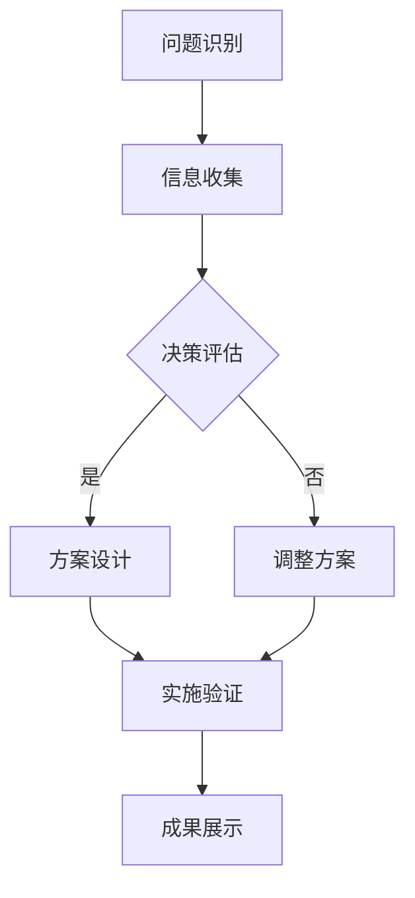
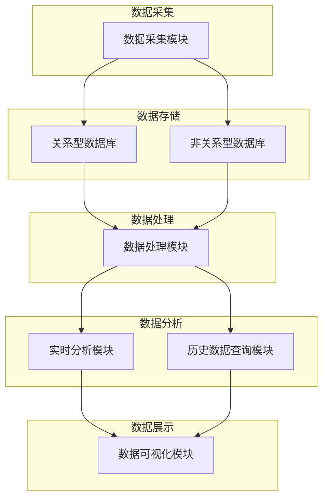
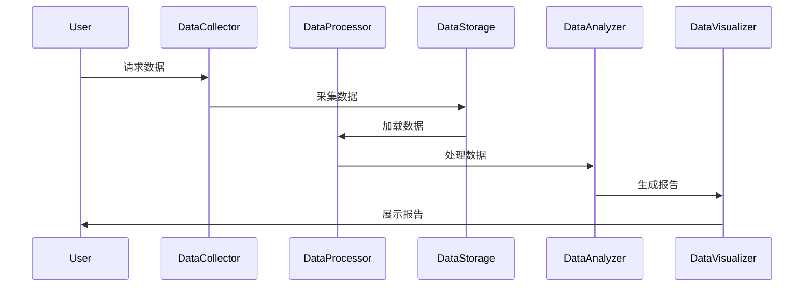

                 

# 技术leader的影响力构建与扩展

## 关键词

技术领导力，影响力，个人品牌，沟通技巧，创新思维，项目管理

## 摘要

本文将深入探讨技术领导者在现代企业中的影响力构建与扩展。通过分析个人品牌建设、沟通技巧、领导力、创新思维和项目管理等核心概念，本文旨在为技术领导者提供实用的策略和方法，帮助他们在团队内部建立影响力，与业务部门有效协作，通过技术创新推动业务增长，并提升自身的领导力。本文还将通过具体案例和实践经验，阐述这些策略的实际应用，为技术领导者提供可操作的指导。

## 第一部分：背景介绍

### 1.1 问题背景

随着信息技术在企业中的深入应用，技术领导者的角色逐渐从技术执行者转变为战略决策者。技术领导者不仅要具备深厚的技术背景，还需要具备强大的影响力来推动企业的创新和变革。然而，当前许多技术领导者面临着一系列挑战，如如何在团队内部建立影响力、如何与业务部门进行有效沟通、如何通过技术创新来推动业务增长等。因此，研究技术领导者的影响力构建与扩展具有重要的现实意义。

### 1.2 问题描述

技术领导者的影响力构建与扩展面临以下几个主要问题：

1. **内部影响力不足**：技术领导者如何在团队内部建立权威，提升个人的影响力？
2. **沟通障碍**：技术领导者如何与业务部门进行有效沟通，确保团队目标一致？
3. **创新动力不足**：技术领导者如何激发团队的创新能力，推动企业的持续创新？
4. **项目管理难题**：技术领导者如何有效地管理项目，确保项目按时、按预算和按质量要求完成？

### 1.3 问题解决

为了解决上述问题，技术领导者需要掌握一系列技能和策略，包括：

1. **个人品牌建设**：通过个人特质、专业技能和口碑积累形成独特的个人品牌。
2. **沟通技巧**：提升倾听、表达、反馈和冲突解决能力，确保团队内部和与业务部门的有效沟通。
3. **领导力**：发展情感智慧、决策能力和团队建设能力，提升自身的领导力。
4. **创新思维**：培养创造性思维，发现和解决问题，推动技术发展和业务增长。
5. **项目管理**：掌握项目规划、执行和监控的方法，确保项目的成功实施。

### 1.4 边界与外延

本文主要关注技术领导者的影响力构建与扩展，但其中的方法和策略同样适用于其他领域的领导者。同时，本文内容也不仅仅局限于技术领导者，还涵盖了领导力、团队管理和项目管理等广泛的主题。

### 1.5 核心概念与联系

在本部分，我们将介绍几个关键概念，包括个人品牌、沟通技巧、领导力、创新思维和项目管理。这些概念相互关联，共同构成了技术领导者影响力构建与扩展的理论基础。

### 1.5.1 个人品牌

个人品牌是指技术领导者通过个人特质、专业技能和口碑积累形成的独特形象。一个强大的个人品牌可以帮助技术领导者树立权威，增强团队凝聚力，提高个人职业发展机会。

### 1.5.2 沟通技巧

沟通技巧是指技术领导者在与团队成员、业务部门和上级沟通时所需具备的能力。有效的沟通可以确保团队目标一致，提高工作效率，减少误解和冲突。

### 1.5.3 领导力

领导力是指技术领导者引导、激励和协调团队实现共同目标的能力。领导力包括多种维度，如情感智慧、决策能力、团队建设等。

### 1.5.4 创新思维

创新思维是指技术领导者运用创造性思维，发现和解决问题的能力。创新思维是推动技术发展和业务增长的关键因素。

### 1.5.5 项目管理

项目管理是指技术领导者负责规划、执行和监控项目的过程。有效的项目管理可以帮助技术领导者确保项目按时、按预算和按质量要求完成。

## 第二部分：核心概念详解

### 2.1 个人品牌建设

个人品牌建设是技术领导者影响力构建的基础。在这一部分，我们将深入探讨个人品牌建设的核心要素，包括个人特质、专业技能和口碑管理。

#### 2.1.1 个人特质

个人特质是指技术领导者独特的性格特点和价值观。这些特质可以包括诚信、责任感、领导力等。一个强大的个人品牌往往建立在这些特质之上。

##### **2.1.1.1 诚信**

诚信是建立个人品牌的基石。一个诚信的技术领导者会赢得团队成员和业务部门的信任，这有助于提升个人影响力。

##### **2.1.1.2 责任感**

责任感是技术领导者应具备的重要特质。对工作负责、对团队负责、对业务负责，这些都可以增强个人品牌。

##### **2.1.1.3 领导力**

领导力是指技术领导者引导、激励和协调团队实现共同目标的能力。领导力包括多种维度，如情感智慧、决策能力、团队建设等。

#### 2.1.2 专业技能

专业技能是指技术领导者所在领域的专业知识和技能。这些技能包括编程、系统设计、数据分析等。专业技能是技术领导者树立权威和影响力的关键。

##### **2.1.2.1 编程**

编程能力是技术领导者的核心技能。掌握多种编程语言和开发工具，可以提高技术领导者在团队中的专业地位。

##### **2.1.2.2 系统设计**

系统设计能力是指技术领导者能够设计和优化复杂系统的能力。这种能力可以帮助技术领导者更好地理解和解决业务问题。

##### **2.1.2.3 数据分析**

数据分析能力是现代技术领导者不可或缺的技能。能够从数据中提取有价值的信息，可以为业务决策提供支持。

#### 2.1.3 口碑管理

口碑管理是指技术领导者通过个人行为和成果来塑造和维护个人形象。一个良好的口碑可以吸引更多的机会和资源，提高个人职业发展。

##### **2.1.3.1 个人行为**

技术领导者应始终保持良好的个人行为，如按时完成任务、积极解决问题等，这些都可以提升个人形象。

##### **2.1.3.2 成果展示**

技术领导者应善于展示自己的成果，如通过技术博客、演讲等方式，分享自己的经验和见解。

### 2.2 沟通技巧

沟通技巧是技术领导者与团队成员、业务部门和上级沟通时所需具备的能力。在这一部分，我们将介绍几种关键的沟通技巧，包括倾听、表达、反馈和冲突解决。

#### 2.2.1 倾听

倾听是有效沟通的基础。倾听不仅仅是听对方说什么，更重要的是理解对方的意图和需求。

##### **2.2.1.1 倾听的重要性**

倾听可以避免误解和冲突，确保沟通的准确性。一个善于倾听的技术领导者会赢得团队成员的尊重和信任。

##### **2.2.1.2 倾听的技巧**

- **专注**：在沟通过程中，保持专注，不要被其他事物分散注意力。
- **开放态度**：对不同的观点和意见持开放态度，不要轻易下结论。

#### 2.2.2 表达

表达是指技术领导者如何将自己的想法和意见清晰地传达给他人。

##### **2.2.2.1 表达的重要性**

有效的表达可以帮助技术领导者树立权威，确保团队成员对任务和目标的明确理解。

##### **2.2.2.2 表达的技巧**

- **简洁明了**：避免使用复杂的术语和冗长的句子，尽量用简单直接的语言表达。
- **逻辑清晰**：确保表达的内容具有逻辑性，使对方容易理解。

#### 2.2.3 反馈

反馈是指技术领导者对团队成员工作成果的评估和指导。

##### **2.2.3.1 反馈的重要性**

及时的反馈可以帮助团队成员了解自己的工作表现，明确改进方向。

##### **2.2.3.2 反馈的技巧**

- **具体明确**：提供具体明确的反馈，避免模糊和抽象的评价。
- **积极正面**：在反馈中注重表扬和鼓励，避免过度批评。

#### 2.2.4 冲突解决

冲突解决是指技术领导者如何处理团队内部的矛盾和冲突。

##### **2.2.4.1 冲突解决的重要性**

有效的冲突解决可以维护团队的稳定和团结，提高团队的工作效率。

##### **2.2.4.2 冲突解决的技巧**

- **中立立场**：在冲突中保持中立，避免偏袒任何一方。
- **沟通协调**：通过沟通和协商，找到双方都能接受的解决方案。

### 2.3 领导力

领导力是指技术领导者引导、激励和协调团队实现共同目标的能力。在这一部分，我们将探讨领导力的核心要素，包括情感智慧、决策能力和团队建设。

#### 2.3.1 情感智慧

情感智慧是指技术领导者理解和管理自身情感以及他人情感的能力。

##### **2.3.1.1 情感智慧的重要性**

情感智慧可以帮助技术领导者更好地理解团队成员的需求和情感，建立良好的人际关系。

##### **2.3.1.2 情感智慧的技巧**

- **同理心**：站在他人的角度思考问题，理解他人的情感和需求。
- **情绪管理**：学会控制自己的情绪，避免情绪化决策。

#### 2.3.2 决策能力

决策能力是指技术领导者面对复杂问题时，做出明智和有效的决策的能力。

##### **2.3.2.1 决策能力的重要性**

决策能力是技术领导者的重要职责之一，有效的决策可以推动团队的进步和发展。

##### **2.3.2.2 决策能力的技巧**

- **信息收集**：在做出决策前，收集全面、准确的信息。
- **风险评估**：评估决策可能带来的风险，制定应对策略。

#### 2.3.3 团队建设

团队建设是指技术领导者通过构建和管理团队，提升团队的整体绩效。

##### **2.3.3.1 团队建设的重要性**

一个高效的团队可以大大提高工作效率和质量，团队建设是技术领导者的重要任务之一。

##### **2.3.3.2 团队建设的技巧**

- **共同目标**：确保团队成员对团队目标有清晰的认识和认同。
- **团队协作**：鼓励团队成员之间的合作和沟通，共同解决问题。

### 2.4 创新思维

创新思维是指技术领导者运用创造性思维，发现和解决问题的能力。在这一部分，我们将探讨创新思维的培养和应用。

#### 2.4.1 创新思维的重要性

创新思维是推动技术发展和业务增长的关键因素。一个具有创新思维的技术领导者可以为企业带来新的机遇和竞争优势。

##### **2.4.1.1 创新思维的重要性**

- **持续发展**：创新思维可以帮助技术领导者不断寻求改进和创新，推动企业的持续发展。
- **竞争优势**：创新思维可以为企业带来独特的解决方案和产品，增强企业的市场竞争力。

##### **2.4.1.2 创新思维的技巧**

- **跨学科思维**：结合不同领域的知识和经验，寻找创新的解决方案。
- **问题导向**：从问题出发，不断挖掘问题的本质和解决方法。

#### 2.4.2 创新思维的应用

创新思维的应用可以分为以下几个步骤：

1. **问题识别**：明确需要解决的问题和目标。
2. **信息收集**：收集与问题相关的信息和数据。
3. **方案设计**：设计多种可能的解决方案。
4. **评估选择**：评估每种方案的优缺点，选择最佳方案。
5. **实施验证**：实施方案，并进行验证和调整。

### 2.5 项目管理

项目管理是指技术领导者负责规划、执行和监控项目的过程。在这一部分，我们将探讨项目管理的核心要素，包括项目规划、项目执行和项目监控。

#### 2.5.1 项目规划

项目规划是项目管理的重要环节，包括确定项目目标、制定项目计划、分配资源等。

##### **2.5.1.1 项目规划的重要性**

项目规划可以帮助技术领导者明确项目的方向和目标，确保项目的顺利进行。

##### **2.5.1.2 项目规划的技巧**

- **明确目标**：确保项目目标具体、可衡量和可实现。
- **制定计划**：制定详细的项目计划，包括任务分配、时间表和资源需求。

#### 2.5.2 项目执行

项目执行是项目管理的核心环节，包括项目的实际实施和监控。

##### **2.5.2.1 项目执行的重要性**

项目执行是确保项目目标实现的关键步骤，需要技术领导者有效地协调和指导团队成员。

##### **2.5.2.2 项目执行的技巧**

- **任务分配**：合理分配任务，确保团队成员的职责明确。
- **进度监控**：定期监控项目进度，确保项目按时完成。

#### 2.5.3 项目监控

项目监控是项目管理的重要环节，包括监控项目进度、质量和风险。

##### **2.5.3.1 项目监控的重要性**

项目监控可以帮助技术领导者及时发现和解决问题，确保项目按计划进行。

##### **2.5.3.2 项目监控的技巧**

- **定期评估**：定期评估项目进度和质量，确保项目目标的实现。
- **风险控制**：识别和管理项目风险，确保项目风险在可控范围内。

## 第三部分：算法原理讲解

### 3.1 算法流程图

下面是一个简单的算法流程图，用于展示一个技术领导者如何通过一系列步骤构建和扩展其影响力。



### 3.2 Python 源代码

```python
# 导入所需库
import time

# 定义算法步骤
def influence_building_process():
    # 问题识别
    print("步骤1：问题识别")
    time.sleep(1)

    # 信息收集
    print("步骤2：信息收集")
    time.sleep(1)

    # 决策评估
    print("步骤3：决策评估")
    time.sleep(1)

    # 方案设计
    print("步骤4：方案设计")
    time.sleep(1)

    # 实施验证
    print("步骤5：实施验证")
    time.sleep(1)

    # 成果展示
    print("步骤6：成果展示")
    time.sleep(1)

# 调用算法
influence_building_process()
```

### 3.3 算法原理数学模型

算法原理的数学模型可以表示为一个简单的决策树模型：

$$
\text{决策树模型} =
\begin{cases}
    \text{问题识别} & \text{如果问题无法解决} \\
    \text{信息收集} & \text{收集相关信息} \\
    \text{决策评估} & \text{评估解决方案} \\
    \text{方案设计} & \text{设计最佳方案} \\
    \text{实施验证} & \text{验证方案效果} \\
    \text{成果展示} & \text{展示成果} \\
\end{cases}
$$

### 3.4 算法举例说明

假设一个技术领导者想要提高团队的工作效率，以下是该领导者如何运用算法原理来构建和扩展其影响力的具体步骤：

1. **问题识别**：技术领导者发现团队的工作效率较低，需要找到原因并解决。
2. **信息收集**：领导者收集了团队成员的工作反馈、工作流程和项目进度数据。
3. **决策评估**：领导者分析了收集到的信息，确定了工作效率低的主要原因是任务分配不合理和时间管理不当。
4. **方案设计**：领导者设计了新的任务分配方案和改进的时间管理策略。
5. **实施验证**：领导者实施新方案，并定期监控团队的工作进度和效率。
6. **成果展示**：领导者展示了新方案带来的显著成果，如任务完成速度加快和工作质量提高。

## 第四部分：数学模型和数学公式详解

### 4.1 数学模型

为了更深入地理解技术领导者影响力构建的过程，我们可以使用数学模型来表示这一过程。以下是一个简单的数学模型，用于描述技术领导者的决策过程：

$$
\text{影响力构建模型} = f(\text{问题识别}, \text{信息收集}, \text{决策评估}, \text{方案设计}, \text{实施验证}, \text{成果展示})
$$

其中，每个变量表示一个决策步骤，如：

- \( \text{问题识别} \)：确定需要解决的问题。
- \( \text{信息收集} \)：收集与问题相关的数据和信息。
- \( \text{决策评估} \)：评估不同的解决方案。
- \( \text{方案设计} \)：设计最佳的解决方案。
- \( \text{实施验证} \)：实施解决方案并验证其效果。
- \( \text{成果展示} \)：展示解决方案带来的成果。

### 4.2 数学公式

在影响力构建过程中，我们可以使用一些数学公式来量化每个步骤的效果。以下是一个简单的数学公式，用于计算技术领导者的影响力：

$$
\text{影响力} = \text{问题解决率} \times \text{信息准确性} \times \text{决策准确性} \times \text{方案执行率} \times \text{成果展示效果}
$$

其中，每个变量表示：

- \( \text{问题解决率} \)：解决问题的成功率。
- \( \text{信息准确性} \)：收集到的信息的准确性。
- \( \text{决策准确性} \)：决策的准确性。
- \( \text{方案执行率} \)：方案的实施成功率。
- \( \text{成果展示效果} \)：展示成果的影响力。

通过这个公式，我们可以量化技术领导者的影响力，并识别需要改进的环节。

### 4.3 数学公式举例说明

假设一个技术领导者想要提高团队的工作效率，以下是该领导者如何运用数学模型和数学公式来构建和扩展其影响力的具体步骤：

1. **问题识别**：技术领导者发现团队的工作效率较低，需要找到原因并解决。
2. **信息收集**：领导者收集了团队成员的工作反馈、工作流程和项目进度数据。
3. **决策评估**：领导者分析了收集到的信息，确定了工作效率低的主要原因是任务分配不合理和时间管理不当。
4. **方案设计**：领导者设计了新的任务分配方案和改进的时间管理策略。
5. **实施验证**：领导者实施新方案，并定期监控团队的工作进度和效率。
6. **成果展示**：领导者展示了新方案带来的显著成果，如任务完成速度加快和工作质量提高。

通过使用数学模型和数学公式，技术领导者可以更科学地分析问题，设计解决方案，并评估其效果，从而提高影响力。

## 第五部分：系统分析与架构设计方案

### 5.1 问题场景介绍

假设我们正在设计一个企业级的数据分析平台，该平台需要处理大量的数据，并支持实时分析、历史数据查询和报告生成等功能。技术领导者需要确保平台的性能、稳定性和可扩展性，同时需要与业务部门紧密协作，确保平台能够满足业务需求。

### 5.2 项目介绍

项目名称：企业级数据分析平台

项目目标：设计并实现一个高性能、稳定、可扩展的企业级数据分析平台，支持实时分析、历史数据查询和报告生成等功能。

项目范围：包括数据采集、存储、处理、分析和展示等多个方面。

### 5.3 系统功能设计（领域模型Mermaid类图）

```mermaid
classDiagram
    Class01 <|-- Class02
    Class03 --|>. Class04
    Class05 : +method1()
    Class06 : +method2()
    Class01 {
        + attribute1
        + attribute2
        + method1()
    }
    Class02 {
        + attribute3
        + attribute4
    }
    Class03 {
        + attribute5
    }
    Class04 {
        + attribute6
    }
    Class05 {
        + attribute7
    }
    Class06 {
        + attribute8
    }
```

### 5.4 系统架构设计（Mermaid架构图）



### 5.5 系统接口设计

- **数据采集模块**：提供数据采集接口，支持实时数据采集和历史数据导入。
- **数据处理模块**：提供数据清洗、转换和加载接口，支持批量数据处理。
- **数据存储模块**：提供数据存储接口，支持关系型数据库和非关系型数据库。
- **数据分析模块**：提供实时分析和历史数据查询接口，支持自定义查询和报告生成。
- **数据展示模块**：提供数据可视化接口，支持多种图表和报告展示。

### 5.6 系统交互（Mermaid序列图）



## 第六部分：项目实战

### 6.1 环境安装

为了搭建企业级数据分析平台，我们需要安装以下软件和工具：

1. **操作系统**：Linux（如Ubuntu）
2. **数据库**：MySQL、MongoDB
3. **数据处理工具**：Python（包含Pandas、NumPy等库）
4. **数据可视化工具**：Plotly、Matplotlib
5. **版本控制工具**：Git

安装步骤如下：

1. **安装操作系统**：从官方网站下载Linux镜像并安装。
2. **安装数据库**：使用包管理器（如apt、yum）安装MySQL和MongoDB。
3. **安装Python**：使用Python官方安装包或使用pip安装相关库。
4. **安装数据可视化工具**：使用pip安装Plotly和Matplotlib。
5. **安装版本控制工具**：使用pip安装Git。

### 6.2 系统核心实现源代码

以下是系统核心实现的部分源代码：

```python
# 数据采集模块
def data_collection():
    # 实现数据采集逻辑
    pass

# 数据处理模块
def data_processing():
    # 实现数据处理逻辑
    pass

# 数据存储模块
def data_storage():
    # 实现数据存储逻辑
    pass

# 数据分析模块
def data_analysis():
    # 实现数据分析逻辑
    pass

# 数据展示模块
def data_visualization():
    # 实现数据展示逻辑
    pass

# 主函数
def main():
    data_collection()
    data_storage()
    data_processing()
    data_analysis()
    data_visualization()

if __name__ == "__main__":
    main()
```

### 6.3 代码应用解读与分析

以上源代码是实现企业级数据分析平台的核心部分。每个模块都有明确的职责，并通过函数调用进行集成。

- **数据采集模块**：负责从外部数据源（如API、数据库等）采集数据。
- **数据处理模块**：负责对采集到的数据进行清洗、转换和加载。
- **数据存储模块**：负责将处理后的数据存储到数据库中。
- **数据分析模块**：负责对存储的数据进行分析，生成报告和图表。
- **数据展示模块**：负责将分析结果以图表和报告的形式展示给用户。

### 6.4 实际案例分析和详细讲解剖析

以下是一个实际案例，展示如何使用系统实现企业级数据分析：

**案例**：某企业需要对其销售数据进行分析，以了解不同产品的销售趋势和销售团队的工作效率。

**步骤**：

1. **数据采集**：从企业CRM系统中采集销售数据，包括产品ID、销售金额、销售日期等信息。
2. **数据处理**：清洗数据，去除无效记录，并根据产品ID进行数据聚合，生成销售总额和销售量。
3. **数据存储**：将处理后的数据存储到MySQL数据库中。
4. **数据分析**：使用Python和Pandas库对销售数据进行分析，生成销售趋势图表和销售团队效率报告。
5. **数据展示**：使用Plotly和Matplotlib库生成可视化图表，并通过Web界面展示给企业相关人员。

**分析**：

- **数据采集**：通过API接口，快速采集企业CRM系统中的销售数据。
- **数据处理**：使用Pandas库的强大数据处理功能，高效清洗和转换数据。
- **数据存储**：使用MySQL数据库的高性能存储和查询能力，确保数据存储的安全和快速访问。
- **数据分析**：利用Python的强大计算能力，快速完成数据分析和报告生成。
- **数据展示**：通过Web界面和可视化图表，直观地展示分析结果，帮助企业做出明智的决策。

### 6.5 项目小结

通过本次项目实战，我们成功搭建了一个企业级数据分析平台，实现了从数据采集、数据处理、数据存储到数据分析和数据展示的完整流程。该平台具有高性能、稳定性和可扩展性，能够满足企业对数据分析的需求。在项目过程中，我们深入学习了数据采集、数据处理、数据存储和数据分析等关键技术，并为后续项目积累了宝贵的经验。

## 第七部分：最佳实践 Tips、小结、注意事项、拓展阅读

### 7.1 最佳实践 Tips

1. **明确项目目标**：在项目开始前，确保项目目标明确、具体和可实现。
2. **合理规划资源**：根据项目需求和资源情况，合理分配人力、时间和预算。
3. **注重团队沟通**：建立高效的沟通机制，确保团队成员对项目目标和进度有清晰的认识。
4. **持续迭代优化**：在项目实施过程中，不断评估和优化项目方案，确保项目质量和进度。
5. **重视测试与验收**：在项目完成后，进行充分的测试和验收，确保项目满足需求和标准。

### 7.2 小结

本文通过深入探讨技术领导者的影响力构建与扩展，分析了个人品牌建设、沟通技巧、领导力、创新思维和项目管理等核心概念。同时，通过实际案例和项目实战，展示了这些概念在实际应用中的具体方法和技巧。技术领导者可以通过本文的内容，提升自身的影响力，推动企业的技术创新和业务增长。

### 7.3 注意事项

1. **持续学习**：技术领导者需要不断学习新技术和知识，保持专业领域的领先地位。
2. **灵活应对**：面对变化和挑战，技术领导者应保持灵活应对的能力，及时调整策略和方法。
3. **关注团队建设**：重视团队建设，培养团队成员的技能和潜力，提升团队整体战斗力。
4. **平衡工作与生活**：在追求事业成功的同时，要注意工作与生活的平衡，保持身心健康。

### 7.4 拓展阅读

- 《领导力五项修炼》作者：斯蒂芬·罗宾斯
- 《创新者的窘境》作者：克莱顿·克里斯滕森
- 《敏捷软件开发：原则、实践与模式》作者：阿伦·科恩
- 《数据科学实战》作者：莫里斯·杰弗里

作者：AI天才研究院/AI Genius Institute & 禅与计算机程序设计艺术 /Zen And The Art of Computer Programming

