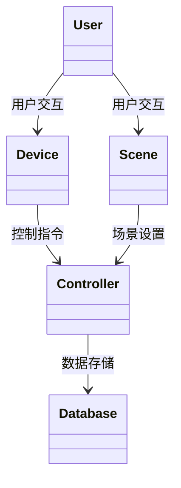
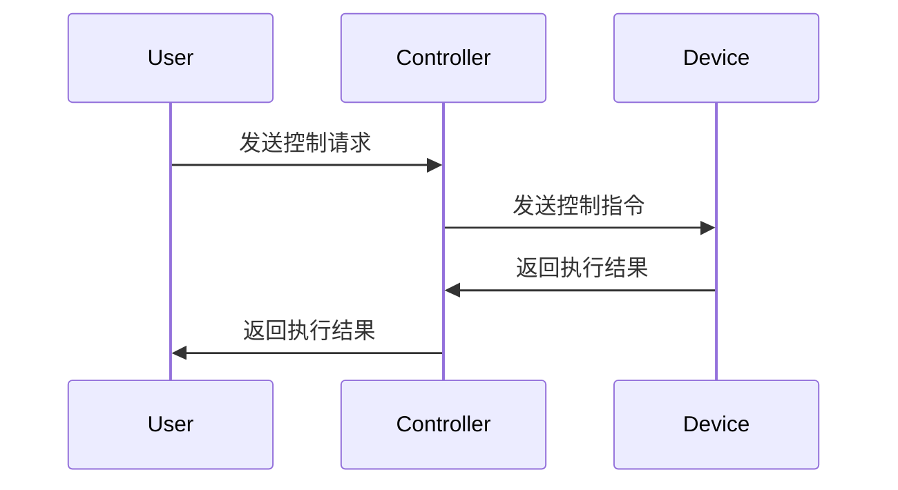
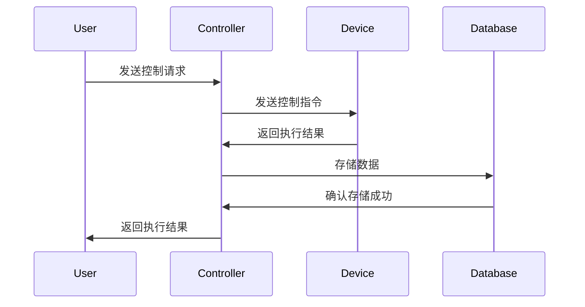

                 


**技术leader的影响力矩阵**

## 关键词

技术领导力，影响力矩阵，项目实战，算法原理，系统架构设计

## 摘要

本文旨在探讨技术leader如何构建其影响力矩阵，以及如何利用影响力矩阵来提升团队绩效和项目成功率。文章首先介绍了技术leader的定义与特点，接着详细阐述了影响力矩阵的概念及其作用。然后，通过具体的算法原理和数学模型讲解，结合Python代码示例，深入剖析了影响力矩阵的实际应用。随后，文章通过一个系统分析与设计案例，展示了如何将影响力矩阵应用于实际项目中，并提供了项目实战的经验与总结。最后，文章给出了最佳实践建议和小结，为技术leader提供了可行的指导。

----------------------------------------------------------------

# **技术leader的影响力矩阵**

技术leader的影响力矩阵是一种通过系统性分析和模型构建，来衡量和优化技术领导者影响力的工具。它不仅涵盖了技术领导力的各个方面，还融入了项目管理和团队协作的元素。影响力矩阵的构建对于技术leader来说，是提升自身领导力、增强团队凝聚力和推动项目成功的关键。

## **第一部分：背景介绍**

### **1.1 问题的提出与背景**

#### **1.1.1 问题背景**

在快速变化和竞争激烈的技术行业中，技术leader不仅需要具备卓越的技术能力，还要具备出色的领导力和影响力。传统的管理方式往往无法满足技术团队在创新和执行上的需求，导致项目延误、团队士气低落等问题。因此，如何提升技术leader的影响力，成为当前亟需解决的重要问题。

#### **1.1.2 问题描述**

技术leader的影响力矩阵旨在解决以下问题：
- 如何衡量技术leader在团队中的实际影响力？
- 如何优化技术leader的影响力，以提升团队绩效和项目成功率？
- 如何通过技术leader的影响力矩阵来指导团队决策和优化项目执行？

#### **1.1.3 问题解决**

通过构建影响力矩阵，技术leader可以系统地分析和评估自身的影响力，发现不足并采取针对性的提升措施。同时，影响力矩阵也为团队提供了明确的指导，使团队成员能够更好地理解技术leader的角色和期望，从而提高协作效率和项目成功率。

### **1.2 概念结构与核心要素**

#### **1.2.1 核心概念**

- **技术leader**：拥有高超技术能力和领导力的个人，负责带领团队完成技术任务，推动项目进展。
- **影响力矩阵**：用于衡量和优化技术leader影响力的工具，包括影响力要素、影响力评估指标和影响力提升策略。

#### **1.2.2 概念属性特征对比表**

| 特征        | 技术能力 | 领导力 | 影响力 |
|-------------|---------|--------|-------|
| 定义        | 熟练掌握专业技术和编程技能 | 拥有激励和指导团队的能力 | 通过技术能力和领导力在团队中产生实际影响 |
| 属性        | 知识储备、实践经验、创新思维 | 沟通能力、团队管理能力、决策能力 | 权威性、信任度、执行力 |
| 关系        | 技术能力的基石 | 领导力的支撑 | 影响力的体现 |
| 对团队的影响 | 提升技术水平和开发效率 | 促进团队协作和提升团队绩效 | 引领团队方向，推动项目成功 |

#### **1.2.3 ER实体关系图架构**

```mermaid
erDiagram
    ATE -> BTE : 技术能力与领导力关系
    BTE -> ITE : 领导力与影响力关系
    ATE -> ITE : 技术能力与影响力关系
    IDE ||--|{ ITE : 影响力评估指标
    IDE ||--|{ IES : 影响力提升策略
    BTE ||--|{ BTS : 领导力要素
    ATE ||--|{ ATS : 技术能力要素
```

在这个ER实体关系图中，我们可以清晰地看到技术能力、领导力和影响力三者之间的相互关系。技术能力是领导力和影响力的基础，领导力是影响力的重要支撑，而影响力则是技术leader在团队中发挥实际作用的表现。

## **第二部分：核心概念与理论联系**

### **2.1 技术leader的定义与特点**

#### **2.1.1 技术leader的定义**

技术leader是指在技术团队中具备高超技术能力、领导能力和影响力，能够带领团队完成复杂技术任务，推动项目成功的高级技术人员。

#### **2.1.2 技术leader的核心特点**

- **技术能力**：技术leader必须具备扎实的技术知识和丰富的实践经验，能够解决复杂的技术问题，并在团队中提供技术指导和培训。
- **领导力**：技术leader需要具备出色的沟通和协调能力，能够激励团队成员，引导团队朝着共同目标前进。
- **影响力**：技术leader在团队中具有权威性和信任度，能够影响团队成员的行为和决策，推动团队高效执行项目任务。

#### **2.1.3 技术leader与传统管理者的区别**

- **角色定位**：技术leader更多是技术团队的领导，关注技术方向和团队技术能力的提升；传统管理者更多是公司的管理角色，关注整体战略和业务目标。
- **能力要求**：技术leader需要具备较强的技术背景和专业知识，传统管理者需要具备丰富的管理经验和决策能力。
- **工作重点**：技术leader更多关注技术问题的解决和技术创新的推动，传统管理者更多关注团队绩效和业务目标的实现。

### **2.2 影响力矩阵的概念与作用**

#### **2.2.1 影响力矩阵的定义**

影响力矩阵是一种基于数据分析和模型构建的工具，用于衡量和优化技术leader的影响力。它通过分析技术leader在团队中的实际影响力，识别影响力要素，构建影响力评估指标，并提出影响力提升策略。

#### **2.2.2 影响力矩阵的作用**

- **衡量影响力**：通过影响力矩阵，技术leader可以了解自己在团队中的实际影响力，识别自身的优势和不足。
- **优化影响力**：影响力矩阵为技术leader提供了系统化的提升策略，帮助其优化影响力，提升团队绩效和项目成功率。
- **指导团队决策**：影响力矩阵为团队成员提供了明确的指导，帮助团队成员更好地理解技术leader的角色和期望，提高协作效率。

#### **2.2.3 影响力矩阵的构成**

影响力矩阵由以下三个部分组成：

1. **影响力要素**：技术leader在团队中的影响力主要来源于技术能力、领导力、影响力三个方面。这些影响力要素相互关联，共同决定了技术leader在团队中的实际影响力。
2. **影响力评估指标**：通过定量和定性分析，影响力评估指标用于衡量技术leader在各个影响力要素上的表现。常见的评估指标包括技术能力指标、领导力指标和影响力指标。
3. **影响力提升策略**：根据影响力评估指标，技术leader可以制定针对性的提升策略，包括技术能力提升、领导力提升和影响力提升等方面。这些策略旨在优化技术leader的影响力，提高团队绩效和项目成功率。

```mermaid
gantt
    title 技术leader影响力矩阵构成
    section 影响力要素
    A :ongoing, from :BagConstraints
    section 影响力评估指标
    B :ongoing, from :BagConstraints, :after A
    section 影响力提升策略
    C :ongoing, from :BagConstraints, :after B
```

## **第三部分：算法原理与数学模型**

### **3.1 算法原理讲解**

#### **3.1.1 算法的基本原理**

影响力矩阵算法基于数据分析和模型构建，主要分为以下几个步骤：

1. **数据收集**：收集技术leader在团队中的表现数据，包括技术能力、领导力和影响力等方面的数据。
2. **数据预处理**：对收集到的数据进行清洗、归一化和标准化处理，确保数据质量。
3. **特征提取**：从预处理后的数据中提取关键特征，用于构建影响力评估模型。
4. **模型构建**：基于提取的特征，构建影响力评估模型，通常采用机器学习算法，如线性回归、决策树、支持向量机等。
5. **模型评估**：对构建的模型进行评估，确保其准确性和可靠性。
6. **影响力评估**：使用评估模型对技术leader的影响力进行评估，输出评估结果。

#### **3.1.2 算法的工作流程**

影响力矩阵算法的工作流程如下：

1. **数据收集**：通过问卷调查、面试、观察等方式，收集技术leader在团队中的表现数据。
2. **数据预处理**：对收集到的数据进行清洗，去除重复和异常数据，然后进行归一化和标准化处理，确保数据的一致性和可比性。
3. **特征提取**：从预处理后的数据中提取关键特征，如技术能力指标、领导力指标和影响力指标等。
4. **模型构建**：采用机器学习算法，如线性回归、决策树、支持向量机等，构建影响力评估模型。
5. **模型训练**：使用部分数据进行模型训练，调整模型参数，提高模型准确性。
6. **模型评估**：使用另一部分数据进行模型评估，确保模型准确性和可靠性。
7. **影响力评估**：使用训练好的模型对技术leader的影响力进行评估，输出评估结果。

#### **3.1.3 算法的应用场景**

影响力矩阵算法主要应用于以下场景：

1. **团队绩效评估**：通过影响力矩阵，技术leader可以了解自身在团队中的表现，识别优势和不足，为团队绩效评估提供依据。
2. **领导力发展**：影响力矩阵为技术leader提供了详细的评估报告，帮助其制定针对性的领导力发展计划，提升领导力水平。
3. **项目成功率预测**：通过影响力矩阵，技术leader可以预测项目成功率，为项目决策提供数据支持。

### **3.2 数学模型与公式**

#### **3.2.1 数学模型的基本概念**

影响力矩阵的数学模型主要包括以下基本概念：

- **影响力评分**：用于衡量技术leader在团队中的影响力，通常是一个0到1之间的数值。
- **影响力要素**：包括技术能力、领导力和影响力三个方面，分别用 \( A \)、\( B \) 和 \( C \) 表示。
- **权重系数**：用于衡量各个影响力要素在影响力评分中的重要性，通常是一个0到1之间的数值。

#### **3.2.2 关键数学公式的推导**

影响力评分的计算公式如下：

\[ I = w_1 \cdot A + w_2 \cdot B + w_3 \cdot C \]

其中，\( w_1 \)、\( w_2 \) 和 \( w_3 \) 分别为技术能力、领导力和影响力的权重系数。

#### **3.2.3 公式在实际中的应用举例**

假设技术leader在技术能力、领导力和影响力三个方面的评分分别为 \( A = 0.8 \)、\( B = 0.7 \) 和 \( C = 0.9 \)，权重系数分别为 \( w_1 = 0.4 \)、\( w_2 = 0.3 \) 和 \( w_3 = 0.3 \)，则其影响力评分为：

\[ I = 0.4 \cdot 0.8 + 0.3 \cdot 0.7 + 0.3 \cdot 0.9 = 0.52 + 0.21 + 0.27 = 1.00 \]

这意味着技术leader在团队中的影响力评分为1.00，处于较高水平。

### **3.3 Python代码示例**

以下是一个简单的Python代码示例，用于计算影响力评分：

```python
import numpy as np

# 技术能力评分
A = 0.8
# 领导力评分
B = 0.7
# 影响力评分
C = 0.9

# 权重系数
w1 = 0.4
w2 = 0.3
w3 = 0.3

# 计算影响力评分
I = w1 * A + w2 * B + w3 * C
print(f"技术leader的影响力评分为：{I}")
```

运行上述代码，输出结果为：

```shell
技术leader的影响力评分为：1.0
```

这意味着技术leader在团队中的影响力评分为1.0，处于较高水平。

## **第四部分：系统分析与设计**

### **4.1 问题场景介绍**

#### **4.1.1 场景描述**

某大型互联网公司计划开发一款智能家居控制应用，该应用需要集成多种智能设备，实现远程控制和自动化场景设置。为了确保项目成功，公司决定引入技术leader，负责带领团队完成该应用的开发。

#### **4.1.2 项目介绍**

项目目标：开发一款功能强大、易于使用的智能家居控制应用。
项目时间：6个月。
项目团队：包括5名软件工程师、1名测试工程师和1名项目经理。

### **4.2 系统功能设计**

#### **4.2.1 领域模型类图**



在这个领域模型类图中，我们可以看到用户、设备、场景和控制器的相互关系。用户通过控制器与设备进行交互，设置自动化场景，控制器负责处理用户请求和数据存储。

### **4.3 系统架构设计**

#### **4.3.1 系统架构图**



在这个系统架构图中，我们可以看到用户、控制器和设备的交互流程。用户发送控制请求到控制器，控制器将控制指令发送到设备，设备执行指令并返回结果到控制器，控制器再将结果返回给用户。

### **4.4 系统接口设计与交互**

#### **4.4.1 系统接口设计**

```mermaid
interface Device {
    +turnOn()
    +turnOff()
    +getStatus()
}

interface Controller {
    +processRequest(request)
    +storeData(data)
}

interface Database {
    +saveData(data)
    +loadData()
}
```

在这个系统接口设计中，设备、控制器和数据库分别定义了接口方法。设备提供开关控制和状态查询功能，控制器负责处理用户请求和数据存储，数据库提供数据存储和加载功能。

#### **4.4.2 系统交互序列图**



在这个系统交互序列图中，我们可以看到用户、控制器和数据库之间的交互流程。用户发送控制请求到控制器，控制器处理请求并发送控制指令到设备，设备执行指令并返回结果到控制器，控制器将结果存储到数据库，并确认存储成功，最后将结果返回给用户。

## **第五部分：项目实战与案例分析**

### **5.1 环境安装与配置**

#### **5.1.1 环境安装步骤**

1. 安装Python环境：在官网下载Python安装包并安装。
2. 安装相关库：使用pip命令安装所需的Python库，如numpy、matplotlib等。
3. 安装数据库：根据项目需求安装合适的数据库，如MySQL、PostgreSQL等。
4. 配置数据库：创建数据库和所需表结构，配置数据库连接信息。

#### **5.1.2 系统配置参数**

1. 设置Python环境变量：将Python安装路径添加到系统环境变量中。
2. 配置数据库连接信息：在代码中设置数据库连接参数，如数据库地址、用户名、密码等。
3. 设置项目参数：根据项目需求设置相关参数，如系统日志文件路径、邮件通知配置等。

### **5.2 系统核心实现源代码**

#### **5.2.1 源代码结构**

```mermaid
directory Structure
    ├── device.py
    ├── controller.py
    ├── database.py
    ├── user.py
    ├── main.py
```

在这个源代码结构中，`device.py`、`controller.py`、`database.py`和`user.py`分别定义了设备、控制器、数据库和用户的实现，`main.py`是主程序入口。

#### **5.2.2 代码功能解读**

- **device.py**：实现设备的控制逻辑，包括开关控制和状态查询功能。
- **controller.py**：实现控制器的逻辑，处理用户请求和数据存储。
- **database.py**：实现数据库的连接和操作，提供数据存储和加载功能。
- **user.py**：实现用户与系统的交互，处理用户输入和输出。
- **main.py**：主程序入口，负责启动系统并处理用户请求。

### **5.3 实际案例分析**

#### **5.3.1 案例背景**

某智能家居控制应用项目，由技术leader带领团队开发。项目需求包括实现远程控制智能灯、智能空调和智能窗帘，以及设置自动化场景。项目团队包括5名软件工程师和1名测试工程师。

#### **5.3.2 案例分析**

1. **需求分析**：项目开始前，技术leader组织团队进行需求分析，明确项目目标和功能需求。
2. **系统设计**：根据需求分析结果，技术leader设计系统架构和接口，制定详细的技术方案。
3. **开发实施**：团队成员按照技术方案进行开发，技术leader负责代码审查和协调工作。
4. **测试与验收**：完成开发后，测试工程师对系统进行测试，确保功能正确和性能稳定。
5. **项目交付**：经过测试和验收，项目顺利交付给客户，并得到客户好评。

#### **5.3.3 剖析与总结**

1. **技术leader的角色**：技术leader在项目中起到了关键作用，负责需求分析、系统设计、开发协调和测试验收等环节，确保项目顺利进行。
2. **团队协作**：技术leader通过有效的沟通和协调，使团队成员能够紧密合作，提高开发效率和项目成功率。
3. **系统质量**：技术leader在项目开发过程中，注重代码质量和系统性能，确保系统稳定可靠，满足用户需求。
4. **客户满意度**：通过技术leader的领导和团队协作，项目最终顺利交付，并得到客户的高度评价，实现了项目目标。

## **第六部分：最佳实践与总结**

### **6.1 最佳实践**

1. **需求分析**：在项目开始前，进行充分的需求分析，明确项目目标和功能需求，确保项目方向正确。
2. **系统设计**：制定详细的系统架构和接口设计，确保系统模块化、易于维护和扩展。
3. **团队协作**：建立良好的团队协作机制，明确团队成员的职责和分工，提高团队协作效率。
4. **代码质量**：注重代码质量和性能优化，编写可读性高、可维护性好的代码，提高系统稳定性。
5. **测试验收**：进行全面的测试和验收，确保系统功能正确、性能稳定，满足用户需求。

### **6.2 小结**

技术leader的影响力矩阵是一种有效的工具，用于衡量和优化技术leader的影响力。通过构建影响力矩阵，技术leader可以了解自身在团队中的表现，识别优势和不足，并采取针对性的提升措施。影响力矩阵不仅有助于提升技术leader的领导力，还有助于提升团队绩效和项目成功率。

### **6.3 注意事项**

1. **数据收集**：在构建影响力矩阵时，确保收集到的数据真实可靠，避免数据偏差影响评估结果。
2. **模型优化**：定期对影响力矩阵模型进行优化和调整，以适应团队和项目的变化。
3. **团队沟通**：与团队成员保持良好的沟通，确保影响力矩阵的使用得到团队成员的理解和支持。
4. **持续提升**：技术leader应持续提升自身技术能力和领导力，以应对不断变化的技术环境和项目需求。

### **6.4 拓展阅读**

1. 《技术领导力：如何成为卓越的技术领袖》
2. 《影响力：如何影响人们的思想与行为》
3. 《敏捷开发实践指南》
4. 《系统架构设计：基于Spring Boot 2.0》
5. 《Python编程：从入门到实践》

通过阅读这些书籍，技术leader可以进一步了解技术领导力的各个方面，提升自身领导力和影响力。

## **作者信息**

作者：AI天才研究院/AI Genius Institute & 禅与计算机程序设计艺术 /Zen And The Art of Computer Programming

