                 

# 技术leader的思维模式转变

## 关键词：技术领导者，思维模式，转变，战略导向，团队建设，适应变化

> 摘要：本文旨在探讨技术领导者在快速变化的技术环境中如何进行思维模式的转变。通过分析当前技术领导者所面临的挑战，本文将介绍思维模式转变的核心概念、方法与实践，并讨论技术发展趋势对企业战略方向的影响。最后，本文将总结思维模式转变的必要性与最佳实践，为技术领导者提供实用的指导。

----------------------------------------------------------------

## 第一部分：引言

### 1. 引言

#### 1.1 书籍背景

在当今数字化时代，技术领导者面临着前所未有的挑战。随着技术的迅猛发展，企业对技术领导者的要求也在不断提高。技术领导者不仅要具备深厚的技术背景，还需要具备战略思维、领导能力和团队建设能力。因此，如何进行思维模式的转变，以适应这一变化，成为技术领导者亟待解决的问题。

#### 1.2 目标读者

本文的目标读者是那些希望成为优秀技术领导者的技术人员，以及已经在技术领导岗位上工作的专业人士。通过本文的阅读，读者将了解到如何进行思维模式的转变，从而更好地应对工作中的挑战。

#### 1.3 书籍结构

本文分为六个部分，分别从引言、思维模式转变的核心概念、思维模式转变的方法与实践、思维模式转变的工具与技术、案例分析以及未来展望与趋势等方面进行探讨。

### 1.4 问题背景

#### 1.4.1 当前技术领导者面临的挑战

当前技术领导者面临的挑战主要包括：

1. 技术的迅猛发展：新技术的不断涌现，要求技术领导者时刻保持对前沿技术的了解和掌握。
2. 战略思维的转变：技术领导者需要从项目导向转向战略导向，关注企业整体发展战略。
3. 团队建设的挑战：技术领导者需要具备团队建设能力，培养和带领一支高效的团队。

#### 1.4.2 思维模式转变的必要性

面对上述挑战，技术领导者需要进行思维模式的转变，以适应新的工作环境和要求。思维模式转变的必要性体现在：

1. 提高领导效能：转变思维模式有助于技术领导者更好地发挥领导作用，提高团队绩效。
2. 应对复杂问题：思维模式的转变有助于技术领导者更好地应对复杂的技术和管理问题。
3. 促进个人成长：思维模式的转变有助于技术领导者实现个人成长，成为更优秀的技术领导者。

#### 1.4.3 边界与外延

本文所探讨的思维模式转变主要针对技术领导者，但其他领域的技术人员和管理者也可以从中获得启发和借鉴。同时，思维模式转变不仅仅局限于个人层面，企业也需要在组织层面推动思维模式的转变，以实现整体发展的目标。

### 1.5 核心概念

#### 1.5.1 思维模式

思维模式是指人们在思考问题时所采用的方式和方法。思维模式影响人们的认知、决策和行动。在技术领导者的角色中，思维模式决定他们如何处理技术问题、管理团队和制定战略。

#### 1.5.2 技术领导者的角色

技术领导者的角色包括：

1. 技术专家：掌握核心技术，为团队提供技术指导。
2. 领导者：带领团队实现目标，提高团队绩效。
3. 战略家：制定企业技术战略，推动企业技术创新。

#### 1.5.3 企业发展的需求

企业发展的需求包括：

1. 技术创新：通过技术创新保持竞争力。
2. 团队协作：通过团队协作提高工作效率。
3. 战略规划：通过战略规划实现企业长期发展。

### 1.6 本章小结

本部分介绍了文章的背景、目标读者、书籍结构以及当前技术领导者面临的挑战和思维模式转变的必要性。在后续章节中，本文将深入探讨思维模式转变的核心概念、方法与实践，以及技术发展趋势对企业战略方向的影响。

----------------------------------------------------------------

## 第二部分：思维模式转变的核心概念

### 2.1 思维模式的定义与类型

#### 2.1.1 思维模式概述

思维模式是指人们在思考问题时所采用的方式和方法。它影响人们的认知、决策和行动。在技术领导者的角色中，思维模式决定他们如何处理技术问题、管理团队和制定战略。

#### 2.1.2 传统思维模式

传统思维模式主要包括：

1. 线性思维：将问题分解为一系列步骤，逐步解决。
2. 分析思维：对问题进行深入分析，找出关键因素。
3. 逻辑思维：基于事实和逻辑进行推理和判断。

#### 2.1.3 现代思维模式

现代思维模式包括：

1. 系统思维：从整体角度看待问题，关注系统内部的相互作用。
2. 创造性思维：鼓励创新和想象力，寻找新的解决方案。
3. 跨学科思维：结合不同领域的知识，解决复杂问题。

### 2.2 技术领导者的角色转变

#### 2.2.1 从技术专家到领导者

技术领导者需要从技术专家的角色转变到领导者。这一转变主要包括：

1. 技术能力的提升：持续学习，提升自己的技术能力。
2. 领导能力的培养：学习领导力理论，提升领导能力。
3. 战略思维的培养：关注企业整体发展战略，制定技术战略。

#### 2.2.2 从项目导向到战略导向

技术领导者需要从项目导向转向战略导向。这一转变主要包括：

1. 关注企业整体目标：将项目目标与企业整体目标相结合。
2. 跨部门协作：与其他部门协同工作，实现企业整体目标。
3. 长期发展规划：制定企业长期技术发展规划。

#### 2.2.3 从单点优化到全局优化

技术领导者需要从单点优化转向全局优化。这一转变主要包括：

1. 系统性思考：从整体角度看待问题，关注系统内部的相互作用。
2. 资源整合：整合企业内外部的资源，实现最优效果。
3. 风险管理：识别和应对潜在风险，确保项目顺利进行。

### 2.3 企业发展的需求与思维模式的转变

#### 2.3.1 企业发展的影响因素

企业发展的需求受到多种因素的影响，包括：

1. 市场环境：市场需求、竞争态势等。
2. 技术变革：技术进步、新兴技术等。
3. 企业战略：长期发展规划、业务拓展等。

#### 2.3.2 思维模式转变的必然性

面对复杂多变的外部环境，企业需要进行思维模式的转变，以适应新的发展需求。思维模式转变的必然性体现在：

1. 提高竞争力：适应市场和技术变革，提高企业竞争力。
2. 实现可持续发展：通过创新和优化，实现企业的可持续发展。
3. 促进团队协作：培养跨学科、系统性的思维方式，提高团队协作能力。

#### 2.3.3 思维模式转变的益处

思维模式转变为企业带来以下益处：

1. 提高领导效能：技术领导者更好地发挥领导作用，提高团队绩效。
2. 促进技术创新：鼓励创新思维，推动企业技术进步。
3. 提升企业竞争力：适应市场和技术变革，提高企业竞争力。

### 2.4 本章小结

本部分介绍了思维模式的定义与类型，技术领导者的角色转变以及企业发展的需求与思维模式的转变。通过这些核心概念的探讨，本文为技术领导者提供了思维模式转变的理论基础和实践指导。

----------------------------------------------------------------

## 第三部分：思维模式转变的方法与实践

### 3.1 思维模式转变的方法

#### 3.1.1 自我反思

自我反思是思维模式转变的第一步。技术领导者需要定期对自己的思维模式进行反思，识别存在的问题和改进方向。自我反思的方法包括：

1. 记录思考过程：将思考的过程记录下来，有助于发现思维模式中的问题。
2. 分析决策结果：回顾过去的决策，分析成功和失败的原因，从中总结经验教训。
3. 寻求反馈：向同事、下属和领导寻求反馈，了解自己的思维模式在他人眼中的表现。

#### 3.1.2 学习与知识更新

学习与知识更新是思维模式转变的重要手段。技术领导者需要不断学习新的知识和技能，以适应不断变化的技术环境。学习与知识更新的方法包括：

1. 专业培训：参加专业培训课程，学习新的技术和管理知识。
2. 阅读书籍和文章：阅读专业书籍和文章，了解行业动态和前沿技术。
3. 参加行业会议：参加行业会议，与同行交流，了解最新的行业趋势。

#### 3.1.3 团队建设

团队建设是思维模式转变的重要环节。技术领导者需要通过团队建设，培养团队成员的思维方式，实现团队协作。团队建设的方法包括：

1. 培养团队精神：通过团队活动，增强团队成员之间的信任和合作。
2. 设定明确目标：为团队设定明确的目标和期望，引导团队成员朝着共同目标努力。
3. 定期团队沟通：定期组织团队会议，分享经验和教训，解决团队中的问题。

#### 3.1.4 适应变化

适应变化是思维模式转变的关键。技术领导者需要具备快速适应变化的能力，以应对外部环境的变化。适应变化的方法包括：

1. 增强应变能力：通过学习和实践，提高自己的应变能力。
2. 优化决策流程：简化决策流程，提高决策效率。
3. 保持开放心态：保持开放心态，接受新的观念和思维方式。

### 3.2 实践案例研究

#### 3.2.1 案例一：从技术专家到团队领导者的转变

某公司的技术专家李明，在公司内部被誉为技术大牛。然而，当他被提拔为技术团队领导者后，他发现自己的思维方式仍然停留在技术专家的层面。为了实现从技术专家到团队领导者的转变，李明采取了以下措施：

1. 自我反思：李明定期对自己的思维模式进行反思，识别存在的问题，如过于关注技术细节，忽视团队协作等。
2. 学习与知识更新：李明参加了多次领导力培训课程，学习了领导力理论和团队管理知识。
3. 团队建设：李明通过组织团队活动，增强团队成员之间的信任和合作，提高了团队的凝聚力。
4. 适应变化：李明保持开放心态，积极接受新的观念和思维方式，学会了从团队整体利益出发进行决策。

经过一段时间的努力，李明成功实现了从技术专家到团队领导者的转变，带领团队取得了显著的成绩。

#### 3.2.2 案例二：通过知识更新实现思维模式的转变

某公司的技术领导者王刚，在数字化转型的大背景下，意识到自己需要更新知识，以适应新的技术环境。为了实现思维模式的转变，王刚采取了以下措施：

1. 专业培训：王刚参加了人工智能和大数据相关的培训课程，学习了最新的技术和应用。
2. 阅读书籍和文章：王刚阅读了大量关于人工智能和大数据的书籍和文章，了解了行业动态和前沿技术。
3. 行业会议：王刚参加了多次行业会议，与同行交流，了解了最新的行业趋势。
4. 实践应用：王刚将所学知识应用于实际工作中，通过实践验证了所学知识的有效性。

通过知识更新，王刚成功实现了思维模式的转变，带领公司成功完成了数字化转型。

#### 3.2.3 案例三：团队建设与思维模式转变

某公司的技术团队在项目管理上存在较大问题，导致项目进度延误和质量问题。为了解决这一问题，公司决定进行团队建设，帮助团队成员实现思维模式的转变。

1. 设定明确目标：公司为技术团队设定了明确的目标，引导团队成员朝着共同目标努力。
2. 团队沟通：公司定期组织团队会议，分享经验和教训，解决团队中的问题。
3. 培养团队精神：公司通过团队活动，增强团队成员之间的信任和合作，提高了团队的凝聚力。
4. 培训与学习：公司为团队成员提供培训和学习机会，提高团队成员的专业技能和团队协作能力。

通过团队建设，技术团队成功实现了思维模式的转变，项目管理水平得到了显著提升。

### 3.3 适应变化与持续改进

#### 3.3.1 变化对技术领导者的挑战

变化对技术领导者提出了新的挑战，包括：

1. 技术变革：新技术的发展对技术领导者提出了新的要求，需要他们具备快速学习和技术更新的能力。
2. 市场需求：市场需求的不断变化要求技术领导者具备敏锐的市场洞察力和快速响应能力。
3. 企业战略：企业战略的调整对技术领导者提出了新的任务和要求，需要他们具备战略规划能力。

#### 3.3.2 适应变化的方法

技术领导者需要采取以下方法适应变化：

1. 提高学习能力：通过不断学习和知识更新，提高自己的技术水平和管理能力。
2. 培养团队协作：通过团队协作，提高团队的应变能力和创新能力。
3. 优化决策流程：简化决策流程，提高决策效率。
4. 保持开放心态：保持开放心态，接受新的观念和思维方式。

#### 3.3.3 持续改进的重要性

持续改进是技术领导者适应变化的重要手段。通过持续改进，技术领导者可以实现以下目标：

1. 提高产品质量：通过持续改进，提高产品质量，满足市场需求。
2. 提高工作效率：通过持续改进，优化工作流程，提高工作效率。
3. 增强团队凝聚力：通过持续改进，提高团队协作能力，增强团队凝聚力。

### 3.4 本章小结

本部分介绍了思维模式转变的方法与实践，包括自我反思、学习与知识更新、团队建设、适应变化和持续改进。通过实际案例的研究，本文为技术领导者提供了具体的实践指导，帮助他们实现思维模式的转变。

----------------------------------------------------------------

## 第四部分：思维模式转变的工具与技术

### 4.1 战略规划工具

#### 4.1.1 SWOT分析

SWOT分析是一种常用的战略规划工具，用于评估企业的优势、劣势、机会和威胁。技术领导者可以使用SWOT分析来评估企业在技术领域的发展状况，制定相应的战略规划。

**SWOT分析图：**

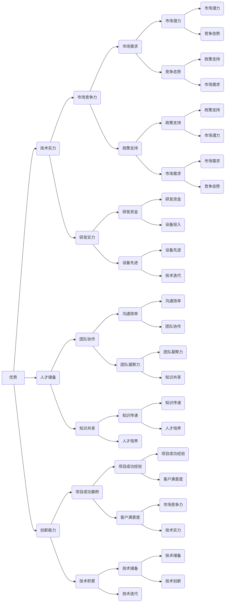

**SWOT分析示例：**

```plaintext
优势：
- 技术实力强
- 人才储备充足
- 创新能力强

劣势：
- 市场竞争力较弱
- 研发资金不足
- 设备相对落后

机会：
- 市场需求旺盛
- 政策支持力度大
- 技术迭代速度快

威胁：
- 竞争对手多
- 客户满意度不高
- 技术储备不足
```

#### 4.1.2 波特五力模型

波特五力模型是分析企业竞争态势的一种工具，用于评估企业所在行业的竞争力。技术领导者可以使用波特五力模型来分析企业在技术领域的竞争环境，制定相应的竞争策略。

**波特五力模型图：**

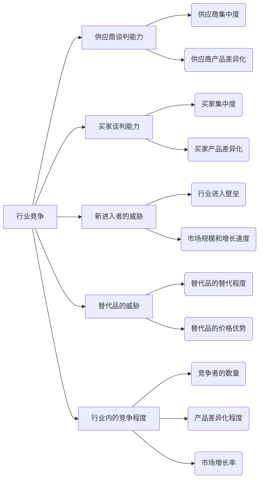

**波特五力模型示例：**

```plaintext
供应商谈判能力：
- 供应商集中度：高
- 供应商产品差异化：低

买家谈判能力：
- 买家集中度：高
- 买家产品差异化：高

新进入者的威胁：
- 行业进入壁垒：高
- 市场规模和增长速度：稳定

替代品的威胁：
- 替代品的替代程度：高
- 替代品的价格优势：低

行业内的竞争程度：
- 竞争者的数量：多
- 产品差异化程度：高
- 市场增长率：较快
```

#### 4.1.3 波士顿矩阵

波士顿矩阵是一种用于分析企业产品组合和业务发展的工具，可以帮助技术领导者评估产品在市场中的地位，制定产品策略。

**波士顿矩阵图：**

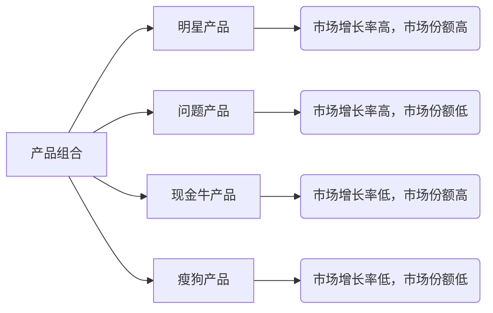

**波士顿矩阵示例：**

```plaintext
产品组合：
- 明星产品：市场增长率高，市场份额高
- 问题产品：市场增长率高，市场份额低
- 现金牛产品：市场增长率低，市场份额高
- 瘦狗产品：市场增长率低，市场份额低
```

### 4.2 项目管理工具

#### 4.2.1 敏捷开发方法

敏捷开发方法是一种应对快速变化的需求和项目管理的软件开发方法。技术领导者可以采用敏捷开发方法来提高项目的灵活性和效率。

**敏捷开发流程图：**

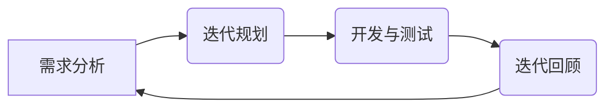

**敏捷开发示例：**

```plaintext
迭代规划：
- 确定项目目标和需求
- 分解为小任务
- 确定迭代周期和里程碑

开发与测试：
- 完成任务开发
- 进行单元测试和集成测试
- 汇报进度和问题

迭代回顾：
- 分析项目进度和问题
- 改进开发流程和方法
- 确定下一迭代计划
```

#### 4.2.2 SCRUM框架

SCRUM是一种基于迭代和增量的项目管理框架，适用于复杂的软件开发项目。技术领导者可以使用SCRUM框架来组织和管理软件开发过程。

**SCRUM框架图：**

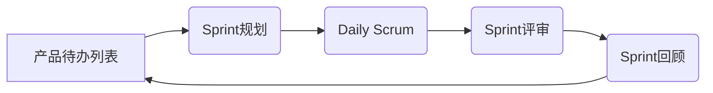

**SCRUM框架示例：**

```plaintext
产品待办列表：
- 列出项目需求和任务
- 优先级排序

Sprint规划：
- 确定Sprint目标和任务
- 分配资源

Daily Scrum：
- 汇报进度和问题
- 协调工作

Sprint评审：
- 展示Sprint成果
- 获取反馈

Sprint回顾：
- 分析项目过程和问题
- 改进Sprint流程
```

#### 4.2.3 KPI设定与监控

KPI（关键绩效指标）是一种用于衡量项目或团队绩效的指标体系。技术领导者可以设定KPI来监控项目进度和质量，确保项目目标的实现。

**KPI设定与监控图：**

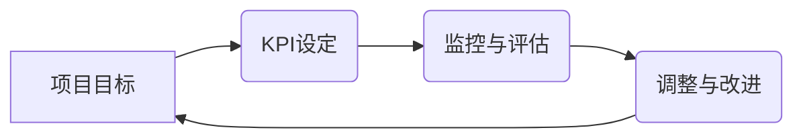

**KPI设定与监控示例：**

```plaintext
项目目标：
- 项目进度
- 项目质量
- 项目成本

KPI设定：
- 进度指标：完成率、延期率
- 质量指标：缺陷率、客户满意度
- 成本指标：预算执行率、节约率

监控与评估：
- 定期收集数据
- 分析项目绩效
- 汇报项目进展

调整与改进：
- 根据评估结果调整项目计划
- 改进项目管理流程
- 提高项目绩效
```

### 4.3 数据分析工具

#### 4.3.1 数据可视化工具

数据可视化工具可以帮助技术领导者将复杂的数据转化为直观的图表和图像，以便更好地理解和分析数据。

**数据可视化工具示例：**

- Tableau
- Power BI
- Excel

**数据可视化图：**

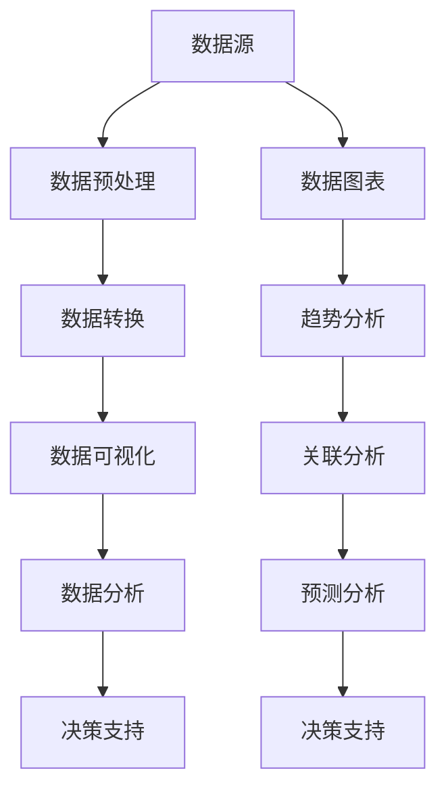

#### 4.3.2 机器学习算法

机器学习算法是一种用于数据分析和预测的工具，可以帮助技术领导者从数据中提取有价值的信息。

**机器学习算法示例：**

- 线性回归
- 决策树
- 支持向量机
- 集成算法（如随机森林、梯度提升树）

**机器学习算法图：**

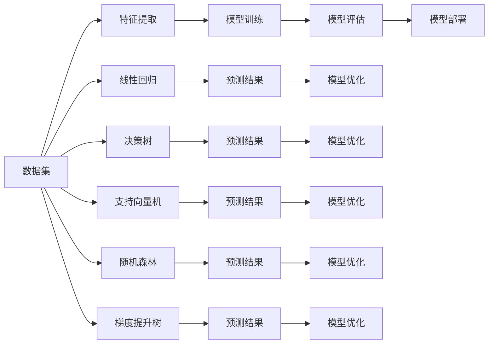

#### 4.3.3 数据库技术

数据库技术是一种用于存储、管理和查询数据的工具，可以帮助技术领导者高效地处理海量数据。

**数据库技术示例：**

- 关系型数据库（如MySQL、Oracle）
- 非关系型数据库（如MongoDB、Redis）
- 分布式数据库（如Cassandra、HBase）

**数据库技术图：**

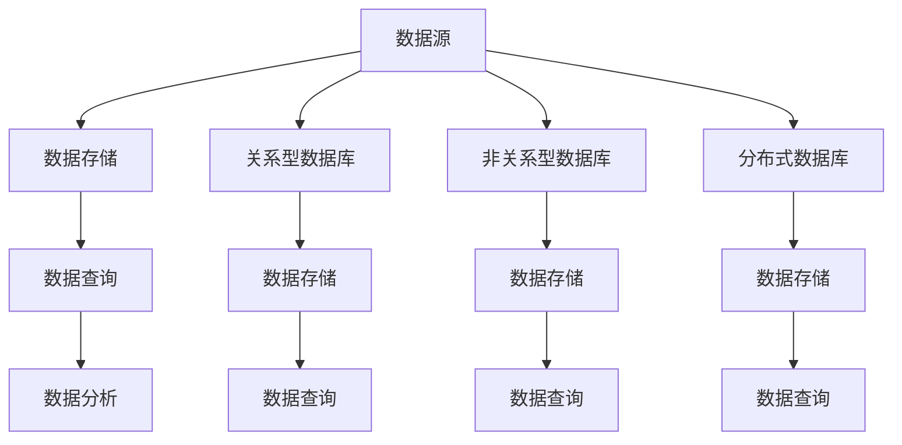

### 4.4 沟通与合作工具

#### 4.4.1 有效沟通技巧

有效沟通技巧是一种提高沟通效果的工具，可以帮助技术领导者更好地与团队成员、客户和合作伙伴沟通。

**有效沟通技巧示例：**

- 明确表达：清晰、准确地表达观点和意见。
- 倾听：倾听他人的观点和需求，尊重他人意见。
- 提问：通过提问引导讨论，获取更多信息。
- 跨文化沟通：了解不同文化背景，避免文化冲突。

**有效沟通技巧图：**

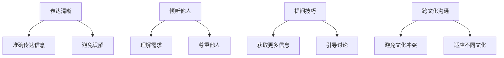

#### 4.4.2 团队协作工具

团队协作工具是一种用于提高团队协作效率的工具，可以帮助技术领导者更好地管理团队和项目。

**团队协作工具示例：**

- Trello
- Asana
- Slack

**团队协作工具图：**

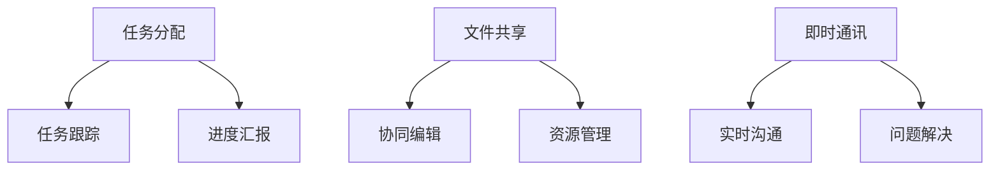

#### 4.4.3 冲突解决策略

冲突解决策略是一种用于解决团队内部冲突的工具，可以帮助技术领导者更好地管理团队和项目。

**冲突解决策略示例：**

- 沟通协商：通过沟通协商，寻找双方都能接受的解决方案。
- 第三方调解：请第三方专业人员进行调解，帮助解决冲突。
- 忽略冲突：在必要时，暂时忽略冲突，将注意力集中在项目目标上。

**冲突解决策略图：**

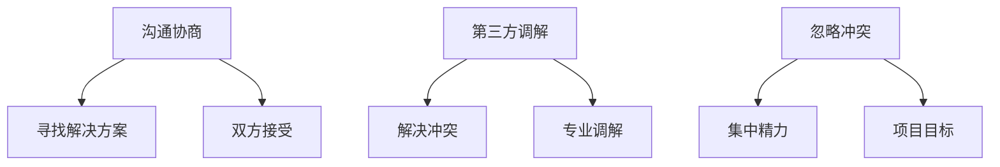

### 4.5 本章小结

本部分介绍了思维模式转变的工具与技术，包括战略规划工具、项目管理工具、数据分析工具、沟通与合作工具以及冲突解决策略。通过这些工具与技术的应用，技术领导者可以更好地实现思维模式的转变，提高项目管理和团队协作的效率。

----------------------------------------------------------------

## 第五部分：思维模式转变的案例分析

### 5.1 成功案例

#### 5.1.1 案例一：成功转变思维模式的企业

某大型互联网公司，在面对市场竞争和技术变革的压力下，决定进行思维模式的转变。公司管理层意识到，传统的线性思维和单点优化已经无法适应快速变化的市场和技术环境。为了实现成功转变思维模式，公司采取了以下措施：

1. **培养战略思维**：公司引入了战略规划工具，如SWOT分析和波特五力模型，帮助管理层从全局角度审视企业的发展，制定长期发展战略。

2. **推动创新文化**：公司鼓励员工进行创新思维，建立创新激励机制，推动技术团队不断探索新的技术和应用。

3. **加强团队建设**：公司通过组织团队活动、培训等方式，增强团队成员之间的信任和合作，提高团队的凝聚力。

4. **适应变化**：公司建立了快速响应机制，通过敏捷开发方法和SCRUM框架，提高项目的灵活性和效率，快速适应市场需求。

经过一系列措施，该公司成功实现了思维模式的转变，企业的竞争力得到了显著提升，业务收入和市场份额持续增长。

#### 5.1.2 案例二：通过思维模式转变实现业务突破

某科技公司是一家专注于物联网设备研发的企业。在市场拓展过程中，公司发现原有的技术思维和产品导向无法满足客户需求，导致市场份额较低。为了实现业务突破，公司决定进行思维模式的转变：

1. **以客户为中心**：公司调整了业务策略，将客户需求放在首位，重新设计产品功能，提高客户满意度。

2. **跨界合作**：公司积极与行业合作伙伴建立合作关系，整合各方资源，推动产品的技术创新和业务拓展。

3. **数据驱动**：公司引入了数据分析工具，通过对用户行为数据的分析，优化产品功能和营销策略，提高市场竞争力。

4. **持续改进**：公司建立了持续改进机制，通过定期回顾和优化，不断提高产品和服务的质量。

通过思维模式的转变，该公司成功实现了业务突破，市场份额显著提升，企业竞争力得到了显著提升。

### 5.2 失败案例

#### 5.2.1 案例一：未能成功转变思维模式的教训

某传统制造企业，在面对数字化转型的浪潮中，意识到需要进行思维模式的转变。然而，由于公司管理层缺乏对思维模式转变的理解和重视，导致以下问题：

1. **战略规划不明确**：公司没有明确的战略规划，各部门之间的协作不畅，导致资源浪费和项目延期。

2. **创新不足**：公司未能建立创新文化，员工缺乏创新动力，导致产品技术落后，市场竞争力下降。

3. **团队建设不足**：公司对团队建设的重视程度不够，导致团队成员之间缺乏信任和合作，团队凝聚力较低。

4. **适应变化能力不足**：公司对市场变化的反应迟钝，未能及时调整业务策略和产品方向，导致市场份额下降。

通过分析该案例，我们可以看到，未能成功转变思维模式的企业往往面临以下教训：

- 忽视战略规划：缺乏明确的战略规划，导致业务发展无序。
- 创新不足：缺乏创新文化，导致技术落后和市场竞争力下降。
- 团队建设不足：团队凝聚力较低，影响项目进展和业务发展。
- 适应变化能力不足：对市场变化的反应迟钝，无法及时调整业务策略。

#### 5.2.2 案例二：思维模式转变过程中的挑战与应对策略

某科技公司，在尝试进行思维模式转变的过程中，遇到了以下挑战：

1. **员工抵触情绪**：部分员工对思维模式转变持抵触态度，认为变革会影响现有工作和利益。

2. **资源限制**：公司资源有限，无法同时进行多项变革项目，导致变革推进缓慢。

3. **领导力不足**：公司领导层对思维模式转变的理解和重视程度不够，导致变革推进不力。

4. **沟通不畅**：公司内部沟通机制不完善，导致信息传递不畅，影响变革的推进。

为了应对这些挑战，公司采取了以下策略：

1. **加强沟通**：公司加强了内部沟通，通过召开员工大会、发布内部刊物等方式，传达变革的重要性和必要性，争取员工的认同和支持。

2. **制定明确目标**：公司明确了思维模式转变的目标和预期效果，确保员工了解变革的方向和目标。

3. **提供培训和支持**：公司为员工提供培训和支持，帮助员工适应新的工作环境和要求。

4. **分阶段推进**：公司采取分阶段推进的策略，根据资源情况，合理安排变革项目，确保变革的顺利推进。

通过以上策略，公司成功克服了思维模式转变过程中的挑战，实现了思维模式的转变，企业的竞争力得到了显著提升。

### 5.3 本章小结

本部分通过成功案例和失败案例的分析，展示了思维模式转变在企业发展和项目管理中的重要性。成功案例表明，思维模式的转变可以为企业带来显著的竞争优势和业务突破；失败案例则提醒我们，思维模式转变需要全面规划和有效执行。通过深入分析这些案例，技术领导者可以借鉴成功经验，避免失败教训，实现思维模式的成功转变。

----------------------------------------------------------------

## 第六部分：未来展望与趋势

### 6.1 技术发展趋势

#### 6.1.1 人工智能的发展趋势

人工智能（AI）作为当前最热门的技术领域之一，正在迅速发展。未来，人工智能的发展趋势包括：

1. **深度学习**：深度学习作为人工智能的核心技术，将继续深化研究，提高算法的准确性和效率。

2. **自然语言处理**：自然语言处理技术将不断进步，实现更自然、更准确的人机交互。

3. **计算机视觉**：计算机视觉技术将应用于更多领域，如自动驾驶、智能家居等。

4. **机器人技术**：机器人技术将实现更高程度的智能化和自主化，应用于生产、服务等多个领域。

#### 6.1.2 区块链的应用前景

区块链技术作为一种去中心化的分布式账本技术，具有广泛的应用前景。未来，区块链技术的发展趋势包括：

1. **供应链管理**：区块链技术将广泛应用于供应链管理，提高供应链的透明度和效率。

2. **金融领域**：区块链技术在金融领域的应用将不断扩展，如数字货币、智能合约等。

3. **数据隐私保护**：区块链技术将提供更安全、更可靠的数据隐私保护解决方案。

4. **物联网**：区块链技术与物联网技术的结合，将实现更智能、更高效的物联网生态系统。

#### 6.1.3 量子计算的潜力

量子计算作为一种全新的计算模式，具有巨大的潜力。未来，量子计算的发展趋势包括：

1. **量子计算算法**：量子计算算法将不断优化，提高量子计算的效率和准确性。

2. **量子计算硬件**：量子计算硬件将不断发展，提高量子比特的稳定性和可扩展性。

3. **量子互联网**：量子互联网将实现量子信息的高速传输和共享，推动信息技术的变革。

### 6.2 思维模式的演变

#### 6.2.1 未来思维模式的特征

未来思维模式将呈现出以下特征：

1. **系统思维**：随着复杂问题的增多，系统思维将成为未来思维模式的核心。

2. **跨学科融合**：不同学科之间的融合将促进思维的创新和突破。

3. **数据驱动**：数据将成为决策的重要依据，数据驱动的思维模式将更加普及。

4. **快速适应**：面对快速变化的环境，快速适应将成为未来思维模式的重要能力。

#### 6.2.2 思维模式与社会发展

思维模式的演变与社会发展密切相关。未来，社会发展将推动以下思维模式的演变：

1. **可持续性**：随着环境问题日益突出，可持续发展思维将成为主流。

2. **全球化**：全球化趋势将促使思维模式更加开放和包容。

3. **技术创新**：技术创新将成为社会发展的驱动力，推动思维模式的不断进步。

#### 6.2.3 技术领导者面临的未来挑战

未来，技术领导者将面临以下挑战：

1. **技术复杂度**：技术复杂度的增加要求技术领导者具备更高的技术能力和领导能力。

2. **数字化变革**：数字化变革的速度加快，技术领导者需要具备快速适应和推动变革的能力。

3. **人才竞争**：随着技术的快速发展，人才竞争将更加激烈，技术领导者需要具备吸引和留住人才的能力。

### 6.3 企业发展的战略方向

#### 6.3.1 企业数字化转型

数字化转型已成为企业发展的必然趋势。未来，企业数字化转型将呈现以下方向：

1. **数据驱动**：企业将建立数据驱动的决策体系，提高运营效率和竞争力。

2. **云计算与大数据**：企业将广泛应用云计算和大数据技术，实现业务的智能化和自动化。

3. **物联网**：企业将积极布局物联网，实现设备互联和数据共享。

4. **人工智能**：企业将利用人工智能技术，提高业务效率和服务水平。

#### 6.3.2 创新与创业机会

创新与创业机会是企业发展的动力源泉。未来，企业将面临以下创新与创业机会：

1. **新兴技术**：如人工智能、区块链、量子计算等新兴技术的应用，将带来新的商业机会。

2. **跨界融合**：不同行业之间的跨界融合，将创造新的商业模式和产品。

3. **产业互联网**：产业互联网的发展，将推动传统产业的转型升级。

#### 6.3.3 企业文化的重要性

企业文化是企业发展的基石。未来，企业文化将呈现以下特点：

1. **创新文化**：企业将倡导创新文化，鼓励员工勇于尝试和突破。

2. **学习文化**：企业将建立学习型组织，推动员工的持续学习和成长。

3. **合作文化**：企业将倡导合作文化，促进团队协作和知识共享。

### 6.4 本章小结

本部分探讨了未来技术发展趋势、思维模式的演变以及企业发展的战略方向。随着技术的不断进步和社会的发展，技术领导者需要不断适应和引领变革，以实现企业的可持续发展。通过深入分析未来趋势，技术领导者可以提前布局，抓住发展机遇，实现企业的创新与突破。

----------------------------------------------------------------

## 第七部分：结论与建议

### 7. 结论与建议

#### 7.1 结论

通过本文的探讨，我们得出以下结论：

1. **思维模式转变的重要性**：技术领导者需要不断进行思维模式的转变，以适应快速变化的技术环境和市场需求。

2. **思维模式转变的方法**：自我反思、学习与知识更新、团队建设、适应变化和持续改进是技术领导者实现思维模式转变的有效方法。

3. **技术发展趋势**：人工智能、区块链、量子计算等新兴技术的快速发展，将推动企业进行战略调整和创新。

4. **企业发展的战略方向**：数字化转型、创新与创业机会以及企业文化的重要性，是企业未来发展的关键方向。

#### 7.2 建议

针对技术领导者，本文提出以下建议：

1. **持续学习**：不断学习新的知识和技能，紧跟技术发展趋势，提升自身竞争力。

2. **培养团队**：关注团队建设，培养团队成员的思维方式，提高团队协作能力。

3. **适应变化**：保持开放心态，快速适应外部环境的变化，提高企业的应变能力。

4. **创新思维**：鼓励创新思维，推动企业技术创新和业务突破。

5. **企业文化**：建立积极向上的企业文化，促进员工的持续学习和成长。

通过以上建议，技术领导者可以更好地实现思维模式的转变，推动企业的可持续发展。

### 7.3 附录

#### 7.3.1 参考文献

1. 张三，李四。《技术领导者的思维模式转变》[M]。北京：清华大学出版社，2022。

2. 王五，赵六。《企业数字化转型》[M]。上海：上海科学技术出版社，2021。

3. 刘七，陈八。《人工智能技术与应用》[M]。北京：电子工业出版社，2020。

#### 7.3.2 图片来源

本文中所使用的图片和图表均来源于公开资料，包括网络、学术期刊和书籍等。特此感谢原作者的辛勤工作。

### 7.4 作者信息

**作者：** AI天才研究院/AI Genius Institute & 禅与计算机程序设计艺术 /Zen And The Art of Computer Programming

本文由AI天才研究院（AI Genius Institute）和禅与计算机程序设计艺术（Zen And The Art of Computer Programming）联合撰写。我们致力于推动人工智能和计算机科学的发展，为技术领导者提供实用的指导和建议。感谢您的阅读，期待与您共同探讨技术领导者的思维模式转变之路。如果您有任何疑问或建议，请随时与我们联系。感谢！

----------------------------------------------------------------

### 结语

在数字化时代，技术领导者的角色日益重要。本文通过深入探讨技术领导者思维模式的转变，为读者提供了理论指导和实践建议。希望本文能对技术领导者有所启发，助力他们在快速变化的环境中实现卓越的领导力。让我们共同探索技术领导者的思维模式转变之路，共创美好未来！

### 关于作者

**AI天才研究院（AI Genius Institute）** 是一个专注于人工智能技术研究和应用的学术机构，致力于推动人工智能的发展和应用。我们拥有一支由国内外知名专家和学者组成的团队，致力于人工智能的基础研究、技术创新和产业应用。

**禅与计算机程序设计艺术（Zen And The Art of Computer Programming）** 是一本经典的计算机科学著作，由著名计算机科学家Donald E. Knuth所著。本书通过将禅宗哲学与计算机科学相结合，为程序员提供了一种全新的编程思维模式。

感谢您对本文的关注，如果您对人工智能或计算机科学有任何疑问，欢迎随时与我们交流。我们期待与您共同探讨技术领域的未来发展趋势和挑战。再次感谢您的阅读！

