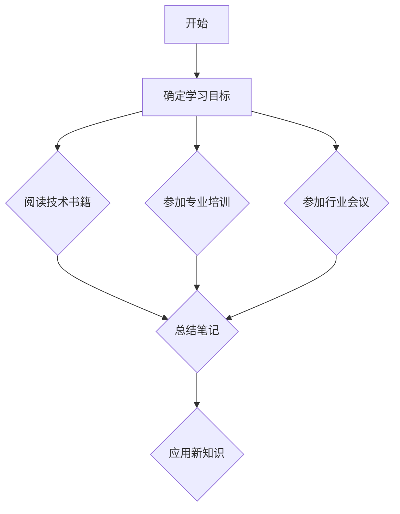
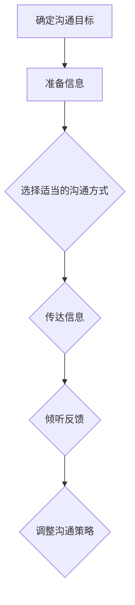
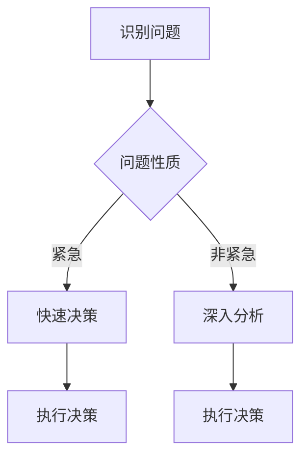
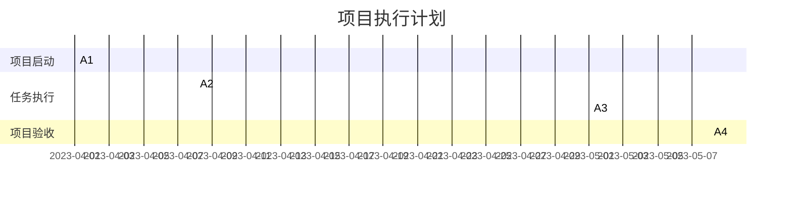

                 

# 技术leader的自我认知

> 关键词：技术领导力、自我认知、个人发展、团队管理、领导技能

> 摘要：技术leader的自我认知是一个复杂而多维的过程，它涉及个人情感、专业能力、技术理解、沟通技巧等多个方面。本文将逐步分析技术leader在自我认知中的关键要素，探讨如何通过自我反思和持续学习提升领导力，从而更好地管理团队、应对挑战并实现组织目标。

## 引言

技术leader的角色在当今数字化时代中愈发重要。他们不仅要具备扎实的技术背景，还需要拥有出色的领导能力和自我认知。自我认知是指个体对自身情感、思维、行为以及价值观的深入了解和反思。对于技术leader来说，自我认知不仅关乎个人成长，更直接影响团队的表现和组织的成功。本文将围绕以下几个方面展开讨论：

1. **个人技能发展**：探讨情感智能、自信和韧性、工作与生活平衡等个人技能对技术领导力的影响。
2. **技术知识和技能**：分析技术更新、持续学习和技术专长的必要性。
3. **沟通和协作**：讨论有效沟通、团队合作和冲突解决在领导中的重要性。
4. **决策和执行**：分析决策过程中的自我认知角色，以及如何通过理性分析和情感智慧做出明智的选择。
5. **团队管理和领导风格**：探讨不同领导风格对团队绩效的影响，以及如何根据团队特点调整领导策略。

通过这些方面的深入分析，本文旨在帮助技术leader更好地认识自我，提升领导能力，实现个人和团队的共同成长。

### 个人技能发展

作为一名技术leader，个人技能的发展是提升领导力的基础。以下是几个关键技能及其对领导力的影响：

#### 情感智能

情感智能（Emotional Intelligence，简称EQ）是技术leader不可或缺的能力。EQ包括自我意识、自我管理、社交意识和关系管理四个方面。自我意识使技术leader能够认识到自己的情感，并理解这些情感如何影响他们的决策和行为。自我管理则涉及情绪调节，帮助技术leader在面对压力和挑战时保持冷静和理性。社交意识和关系管理则使技术leader能够理解和影响他人的情感，促进团队合作和沟通。

**案例研究**：

以一家初创公司CTO的案例为例。该公司正在开发一款新的AI产品，但在项目进展过程中遇到了技术难题。由于项目进度紧张，团队成员情绪波动较大。作为CTO，他通过自我意识认识到自己的焦虑情绪，并通过自我管理技巧缓解了压力。同时，他利用社交意识和关系管理能力，积极与团队成员沟通，鼓励他们分享自己的担忧和困惑。最终，通过团队的共同努力，难题得以解决，项目得以顺利推进。

#### 自信和韧性

自信和韧性是技术leader在面临挑战时的重要品质。自信使技术leader能够相信自己的能力和决策，从而在团队中树立榜样。韧性则是指面对困难和失败时，能够迅速恢复并继续前进的能力。

**对比表格**：

| 特质     | 自信                         | 韧性                         |
|----------|------------------------------|------------------------------|
| 定义     | 对自身能力和价值的信任       | 面对挫折时迅速恢复的能力     |
| 对领导力的影响 | 增强团队凝聚力               | 提高团队应对风险的能力       |
| 应用场景   | 技术演讲、项目决策           | 项目失败后的团队重建         |

**实例**：

某大型科技公司的一名技术leader在项目中面临了重大挑战，导致项目一度停滞。尽管压力巨大，他通过自信和韧性，迅速调整了策略，重新激励团队，最终带领团队克服了困难，完成了项目。这一过程不仅提升了他的领导力，也增强了团队的信任和凝聚力。

#### 工作与生活平衡

工作与生活平衡对技术leader的健康和效能至关重要。长期的工作压力可能导致身心疲惫，影响决策质量和团队士气。因此，技术leader需要学会合理安排时间，保持健康的生活习惯。

**对比表格**：

| 状态       | 不平衡                         | 平衡                         |
|------------|--------------------------------|------------------------------|
| 影响因素   | 高强度工作、加班文化           | 家庭责任、休闲时间           |
| 结果       | 健康问题、决策失误、团队不满   | 高效工作、良好家庭关系       |
| 应用场景   | 每日工作时间安排               | 周末规划、假期安排           |

**实例**：

一名技术leader通过制定详细的每日计划和周末休息计划，成功地平衡了工作和生活。这不仅提高了他的工作效率，也增强了家庭成员之间的互动，提高了整体幸福感。

### 技术知识和技能

技术知识和技能是技术leader的核心竞争力。在快速变化的科技领域，技术leader需要不断更新知识，掌握新技能，以保持竞争力并推动团队前进。

#### 技术更新

技术更新是技术leader的必修课。随着新技术的不断涌现，技术leader需要时刻关注行业动态，了解新兴技术的基本原理和应用场景。这包括但不限于人工智能、大数据、区块链等领域。

**ER实体关系图**：

```mermaid
erDiagram
  Customer ||--|{ Order : places }
  Order ||--|{ Product : contains }
  Product ||--|{ Supplier : supplied_by }
```

- **客户**：订购商品
- **订单**：包含商品
- **产品**：由供应商提供

#### 持续学习

持续学习是技术leader保持技术领先地位的关键。通过参加专业培训、阅读技术书籍和论文、参加行业会议等方式，技术leader可以不断充实自己的知识体系。

**Mermaid流程图**：



#### 技术专长

技术专长是技术leader在团队中的权威标志。通过深入研究某一技术领域，技术leader不仅可以提供技术指导，还能在关键时刻为团队提供解决方案。

**对比表格**：

| 技术层次 | 普通开发人员 | 技术专家     | 技术大牛       |
|----------|--------------|-------------|----------------|
| 知识广度 | 广泛但不深入 | 深入一个领域 | 深入多个领域   |
| 解决问题 | 解决日常问题 | 复杂问题     | 极端复杂问题   |
| 领导力   | 不具备       | 具备         | 出色           |

**实例**：

某技术leader专注于云计算领域，通过多年的研究和实践，成为该领域的专家。在他的带领下，团队成功地完成了多个大型云计算项目，得到了客户和公司的高度评价。

### 沟通和协作

沟通和协作是技术leader的重要职责。有效的沟通可以确保团队明确目标，理解任务，而协作则能够促进知识共享和资源整合，提高团队整体效能。

#### 有效沟通

有效沟通是技术leader必须掌握的技能。技术leader需要能够清晰、准确地传达信息，同时也要善于倾听和理解团队成员的反馈和需求。

**Mermaid流程图**：



**实例**：

在一次重要项目的启动会议上，技术leader通过详细的PPT演示和互动讨论，清晰地传达了项目的目标和期望。同时，他也鼓励团队成员提出问题和建议，确保信息传递的准确性和有效性。

#### 团队合作

团队合作是实现项目目标的关键。技术leader需要建立一个协作氛围，鼓励团队成员积极参与，发挥各自的优势，共同解决问题。

**Mermaid类图**：

```mermaid
classDiagram
  Class1 <|-- Class2
  Class3 --|{ has } Class4
  Class1 : +int x
  Class2 : +int y
  Class3 : +String name
  Class4 : +Date created
```

- **Class1**：项目领导者
- **Class2**：团队成员
- **Class3**：团队任务
- **Class4**：项目进度

**实例**：

在一个跨部门合作项目中，技术leader通过组织定期的团队会议，确保各部门之间的沟通畅通，协调资源，解决冲突。最终，项目提前完成了目标，得到了上级的认可和表扬。

#### 冲突解决

冲突在团队中是不可避免的。技术leader需要具备解决冲突的能力，通过中立的态度和有效的沟通策略，帮助团队化解冲突，维护团队和谐。

**Mermaid架构图**：

```mermaid
sequenceDiagram
    participant A --|> B: 发出冲突
    B ->> C: 进行中立评估
    C ->> D: 寻求解决方案
    D ->> E: 实施解决方案
    E ->> F: 监测效果
```

**实例**：

在一次项目评审会议上，团队成员就技术方案产生了分歧。技术leader通过中立评估，了解到双方的观点和立场，然后组织了一场讨论会，让双方充分表达意见，最终达成了一个共识的方案。

### 决策和执行

决策和执行是技术leader的重要职责。在快速变化的市场环境中，技术leader需要具备快速决策和有效执行的能力，以确保团队和组织的成功。

#### 快速决策

快速决策是技术leader应对紧急情况和市场变化的关键能力。技术leader需要能够快速分析问题，评估风险，并做出合理的决策。

**Mermaid决策树**：



**实例**：

在一次突发事件中，技术leader迅速识别问题的紧急性，并做出快速决策，调整了项目计划，确保了项目的顺利进行。

#### 有效执行

有效执行是将决策转化为实际行动的关键。技术leader需要确保团队成员理解决策，明确任务，并协调资源，确保执行的有效性。

**Mermaid甘特图**：



**实例**：

在项目执行过程中，技术leader通过详细的任务分配和时间规划，确保了项目的按时完成，并达到了预期的效果。

### 团队管理和领导风格

技术leader的领导风格对团队的表现和士气有重要影响。有效的团队管理需要技术leader根据团队的特点和项目的需求，灵活调整领导策略。

#### 不同领导风格

不同的领导风格适用于不同的情境和团队。以下是几种常见的领导风格及其特点：

**对比表格**：

| 领导风格 | 特点                           | 适用场景               |
|----------|--------------------------------|------------------------|
| �老虎型   | 严谨、强势、注重结果           | 高风险、高压力的项目   |
| 黄金圈型 | 共同愿景、激励、培养人才       | 创新型、成长型团队     |
| 蜂窝型   | 分权、协作、鼓励自主性         | 复杂项目、多部门合作   |
| 猎犬型   | 创新思维、探索、适应变化       | 科技研发、创新部门     |
| 仙人掌型 | 放手、信任、鼓励独立思考       | 成熟团队、自我管理型员工 |

**实例**：

在一个创新型团队中，技术leader采用了黄金圈型领导风格，通过建立共同愿景和培养人才，激发了团队的创造力和创新能力，推动了项目的成功。

#### 调整领导策略

根据团队特点和项目需求，技术leader需要灵活调整领导策略。以下是一些调整建议：

1. **了解团队成员**：了解团队成员的个性、能力和需求，有针对性地进行指导和激励。
2. **明确目标**：确保团队成员明确项目目标和任务，并了解各自的角色和职责。
3. **提供支持**：在团队成员遇到困难时，提供必要的帮助和支持，帮助他们克服挑战。
4. **鼓励反馈**：建立开放的沟通环境，鼓励团队成员提出意见和建议，共同改进工作。
5. **灵活调整**：根据项目的进展和团队成员的表现，灵活调整领导策略，以适应变化。

**实例**：

在一个复杂的项目中，技术leader根据项目进展的不同阶段，灵活调整了领导策略。在项目初期，他采用了蜂窝型领导风格，鼓励团队成员自主决策和协作；在项目中期，面对技术挑战，他采用了猎犬型领导风格，激发了团队的创新能力；在项目后期，为了保证项目按时交付，他采用了老虎型领导风格，确保了团队的高效执行。

### 总结

技术leader的自我认知是一个持续的过程，它涉及个人技能、技术知识、沟通能力、决策和团队管理等多个方面。通过自我反思和持续学习，技术leader可以不断提升自己的领导能力，更好地管理团队，实现组织目标。本文探讨了技术leader在自我认知中的关键要素，并提出了相应的实践建议。希望这些观点能够对技术leader的领导实践提供一些启示和帮助。

### 作者信息

作者：AI天才研究院/AI Genius Institute & 禅与计算机程序设计艺术 /Zen And The Art of Computer Programming

AI天才研究院致力于推动人工智能技术的发展和应用，为技术领域提供创新的解决方案和深入的学术研究。而《禅与计算机程序设计艺术》则是一本经典的计算机编程哲学著作，强调程序设计的智慧和艺术性，为开发者提供了宝贵的思考和实践指导。

在自我认知的道路上，技术leader需要不断学习和成长。通过理解自我、提升技能、改进沟通、做出明智的决策，技术leader可以更好地发挥自己的领导作用，带领团队迎接未来的挑战，实现个人和组织的共同发展。希望本文能够为技术leader提供一些有益的思考和实践指导。让我们继续探索自我认知的深度，提升领导力，共同创造更美好的未来。

