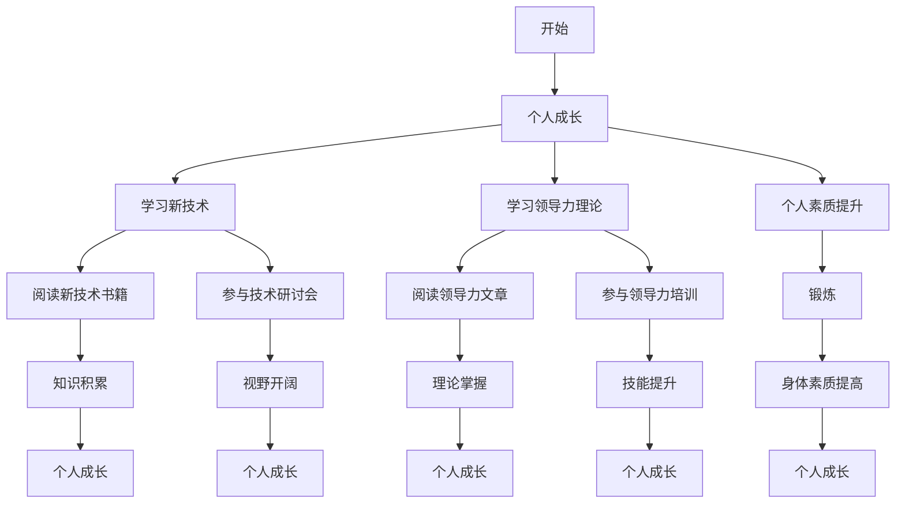
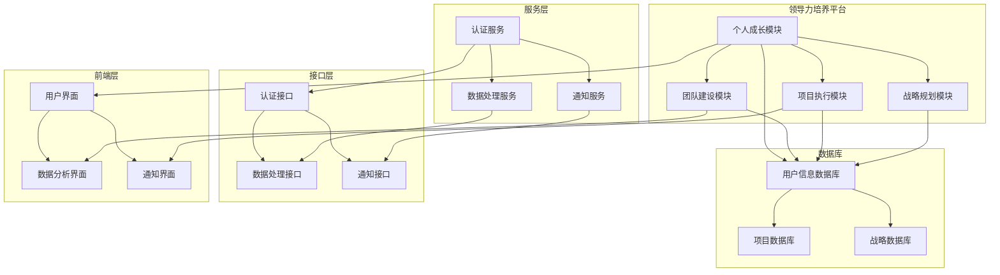

                 

### 技术leader的领导力培养计划

在当今快速变化的技术环境中，技术领导者不仅需要具备卓越的技术能力，还要拥有强大的领导力。这种领导力不仅仅是为了管理和指导团队，更是为了激发团队成员的潜力，推动团队不断创新和进步。技术领导力是一个多维度的概念，它涉及到个人成长、团队管理、战略规划等多个方面。本文将围绕技术领导力的培养，提供一个系统、实用的指导方案。

#### 关键词：
技术领导者、领导力、培养计划、团队管理、战略规划

#### 摘要：
本文将深入探讨技术领导力的内涵和重要性，通过分析技术领导者的特定需求，提出一个全面的领导力培养计划。该计划将涵盖个人成长、团队建设、项目管理和战略规划等方面，旨在帮助技术领导者提升自身领导力，成为卓越的领导者。

### 第一部分：背景介绍

#### 核心概念：

**问题背景**：
在当前快速发展的技术时代，技术领导者不仅要掌握技术本身，还需要具备强大的领导力，以应对不断变化的业务需求和市场挑战。领导力不仅是管理团队，更是激发团队成员的潜力，引导团队实现共同目标的能力。

**问题描述**：
技术领导力培养成为许多企业领导者关注的核心问题。尽管市场上已有许多关于领导力培养的书籍，但针对技术领导者特定需求和挑战，依然缺乏系统、实用的指导。

**问题解决**：
本书旨在填补这一空白，通过深入分析和实践总结，为技术领导者提供一套完整的领导力培养计划。书中不仅涵盖领导力的基础理论，还结合实际案例，提供实用的策略和方法。

**边界与外延**：
领导力的培养不仅仅局限于技术领域，而是涉及到个人成长、团队管理、战略规划等多个方面。因此，本书将提供一个全方位的视角，帮助技术领导者全面提升自身领导力。

**概念结构与核心要素组成**：
1. **领导力理论基础**：介绍领导力的定义、类型和关键要素。
2. **技术领导者的特定需求**：分析技术领导者面临的工作挑战和独特需求。
3. **领导力培养策略**：提供实用的方法和工具，帮助技术领导者提升个人和团队的能力。
4. **领导力实践案例**：分享成功的技术领导者案例，提供可操作的实践经验和教训。

### 第二部分：核心概念与联系

#### 核心概念原理：

**领导力**：领导力是指通过影响、激励和引导他人，实现共同目标的能力。技术领导力则是在技术领域内，领导者通过技术知识和经验，影响和带领团队的能力。

**技术领导者的特定需求**：
- **技术深度**：技术领导者需要具备深厚的专业技术背景，以理解和解决复杂的技术问题。
- **管理能力**：技术领导者不仅需要管理团队，还需要具备项目管理和战略规划的能力。
- **沟通能力**：技术领导者需要有效地与团队成员、其他部门以及高层管理进行沟通，确保团队目标的实现。

#### 概念属性特征对比表格：

| 概念           | 特征1 | 特征2 | 特征3 |
| -------------- | ----- | ----- | ----- |
| 领导力         | 影响力 | 激励能力 | 引导能力 |
| 技术领导力     | 技术深度 | 管理能力 | 沟通能力 |
| 团队管理       | 策略制定 | 成员激励 | 目标实现 |
| 项目管理       | 项目规划 | 资源配置 | 进度控制 |

#### ER实体关系图架构：

```mermaid
erDiagram
  User ||--|{ TechnicalLeader }|-- TechnicalTeam : leads
  TechnicalTeam ||--|{ Project }|-- Manager : manages
  TechnicalLeader ||--|{ Knowledge }|-- TechnicalExpertise : has
  TechnicalExpertise ||--|{ Skill }|-- TechnicalSkill : includes
```

### 第三部分：算法原理讲解

#### 算法原理：

技术领导力的培养可以看作是一种算法，输入为技术领导者的个人素质和工作环境，输出为领导力的提升。这个算法的核心在于以下几个方面：

1. **个人成长**：技术领导者需要不断学习新的技术知识和领导力理论，提升个人综合素质。
2. **团队建设**：技术领导者需要通过有效的沟通和激励，建立高效的团队。
3. **项目执行**：技术领导者需要具备项目管理的技能，确保项目的顺利推进。
4. **战略规划**：技术领导者需要从全局出发，制定和调整战略，以适应市场变化。

#### Mermaid流程图：

```mermaid
graph TD
    A[开始] --> B[个人成长]
    B --> C{学习新技术}
    B --> D{学习领导力理论}
    C --> E[提升个人素质]
    D --> E
    A --> F[团队建设]
    F --> G[沟通与激励]
    F --> H[建立高效团队]
    G --> I[团队协作提升]
    H --> I
    A --> J[项目执行]
    J --> K[项目管理技能]
    J --> L[项目顺利推进]
    K --> L
    A --> M[战略规划]
    M --> N[制定战略]
    M --> O[调整战略]
    N ->
```

#### 算法原理的数学模型和公式：

在技术领导力的培养过程中，我们可以将个人成长、团队建设、项目执行和战略规划看作是四个主要模块。每个模块都有其特定的输入和输出，并且相互之间存在一定的依赖关系。以下是一个简化的数学模型来描述这个培养过程：

$$
\text{领导力提升} = f(\text{个人成长}, \text{团队建设}, \text{项目执行}, \text{战略规划})
$$

其中，$f$ 是一个复合函数，表示不同模块对领导力提升的综合影响。

**个人成长**：

$$
\text{个人成长} = g(\text{学习新技术}, \text{学习领导力理论}, \text{个人素质提升})
$$

**团队建设**：

$$
\text{团队建设} = h(\text{沟通与激励}, \text{建立高效团队}, \text{团队协作提升})
$$

**项目执行**：

$$
\text{项目执行} = k(\text{项目管理技能}, \text{项目顺利推进})
$$

**战略规划**：

$$
\text{战略规划} = l(\text{制定战略}, \text{调整战略})
$$

#### 举例说明：

假设一位技术领导者通过以下方式提升个人成长：
- **学习新技术**：每月阅读一本新技术书籍，参与一次技术研讨会。
- **学习领导力理论**：每周阅读一篇领导力文章，参与一次领导力培训。
- **个人素质提升**：每天锻炼一小时，保持良好的工作状态。

我们可以将这些活动进行量化，然后根据上述公式计算个人成长的贡献。类似地，我们可以对团队建设、项目执行和战略规划进行类似的计算。

#### Mermaid流程图：



通过上述步骤，技术领导者可以系统地提升个人成长，从而为团队建设和项目执行打下坚实的基础。

### 第四部分：系统分析与架构设计方案

#### 问题场景介绍

在一个快速发展的科技公司，技术领导者面临着不断变化的市场需求和技术挑战。公司需要技术领导者不仅能够带领团队解决技术难题，还要能够制定和实施有效的战略，确保公司长期发展。

#### 项目介绍

本项目旨在为技术领导者提供一个全面的领导力培养平台，包括个人成长、团队建设、项目执行和战略规划等方面的内容。通过该平台，技术领导者可以系统地提升自身领导力，从而更好地应对工作挑战。

#### 系统功能设计（领域模型Mermaid类图）

```mermaid
classDiagram
    Class01 <|-- Class02
    Class03 <.. Class04
    Class05 <|.. Class06
    Class07 .. Class08
    Class09 --|> Class10
    Class11 ||| Class12
```

**类图解释**：
1. **Class01**：领导力培养计划的基础类，包含个人成长、团队建设、项目执行和战略规划等模块。
2. **Class02**：继承自Class01，代表个人成长模块，包含学习新技术、学习领导力理论和个人素质提升等功能。
3. **Class03**：与Class01关联，代表团队建设模块，包含沟通与激励、建立高效团队和团队协作提升等功能。
4. **Class04**：与Class01关联，代表项目执行模块，包含项目管理技能和项目顺利推进等功能。
5. **Class05**：与Class01关联，代表战略规划模块，包含制定战略和调整战略等功能。
6. **Class06**：与Class01关联，代表技术领导者，包含个人成长、团队建设和战略规划等功能。
7. **Class07**：与Class06关联，代表技术团队，包含项目执行和团队建设等功能。
8. **Class08**：与Class06关联，代表项目，包含项目管理技能和项目顺利推进等功能。
9. **Class09**：与Class06关联，代表市场，包含制定战略和调整战略等功能。
10. **Class10**：与Class06关联，代表竞争环境，包含战略规划和项目执行等功能。
11. **Class11**：与Class06关联，代表技术挑战，包含个人成长和团队建设等功能。
12. **Class12**：与Class06关联，代表业务需求，包含团队建设和项目执行等功能。

#### 系统架构设计（Mermaid架构图）



**架构图解释**：
1. **个人成长模块**：包括学习新技术、学习领导力理论和个人素质提升等功能，与数据库、服务层和接口层进行交互。
2. **团队建设模块**：包括沟通与激励、建立高效团队和团队协作提升等功能，与数据库、服务层和接口层进行交互。
3. **项目执行模块**：包括项目管理技能和项目顺利推进等功能，与数据库、服务层和接口层进行交互。
4. **战略规划模块**：包括制定战略和调整战略等功能，与数据库、服务层和接口层进行交互。
5. **数据库**：包括用户信息数据库、项目数据库和战略数据库，存储系统的核心数据。
6. **服务层**：包括认证服务、数据处理服务和通知服务，处理来自前端层的请求，并返回相应的响应。
7. **接口层**：包括认证接口、数据处理接口和通知接口，为前端层提供服务。
8. **前端层**：包括用户界面、数据分析界面和通知界面，为用户提供了交互的界面。

### 第五部分：项目实战

#### 环境安装

在开始项目之前，我们需要安装和配置以下环境：
1. **操作系统**：推荐使用Linux系统，如Ubuntu 20.04。
2. **Python环境**：安装Python 3.8及以上版本。
3. **数据库**：安装MySQL 8.0。
4. **开发工具**：安装VSCode、Git。

安装步骤如下：
```bash
# 安装Python环境
sudo apt-get update
sudo apt-get install python3.8
sudo apt-get install python3.8-venv

# 创建虚拟环境
python3.8 -m venv venv

# 激活虚拟环境
source venv/bin/activate

# 安装依赖
pip install -r requirements.txt
```

#### 系统核心实现源代码

以下是一个简单的示例，展示了如何使用Python实现一个领导力培养平台的核心功能。

```python
# 领导力培养平台示例代码

# 导入必要的库
import pymysql
from pymysql.cursors import DictCursor

# 数据库配置
db_config = {
    'host': 'localhost',
    'user': 'root',
    'password': 'password',
    'db': 'leadership_platform',
}

# 连接数据库
connection = pymysql.connect(**db_config)
cursor = connection.cursor(DictCursor)

# 创建表格
create_table_sql = """
CREATE TABLE IF NOT EXISTS users (
    id INT AUTO_INCREMENT PRIMARY KEY,
    name VARCHAR(255) NOT NULL,
    email VARCHAR(255) NOT NULL,
    password VARCHAR(255) NOT NULL,
    created_at TIMESTAMP DEFAULT CURRENT_TIMESTAMP
);
"""
cursor.execute(create_table_sql)

# 用户注册
def register_user(name, email, password):
    insert_user_sql = """
    INSERT INTO users (name, email, password)
    VALUES (%s, %s, %s);
    """
    cursor.execute(insert_user_sql, (name, email, password))
    connection.commit()
    return cursor.lastrowid

# 用户登录
def login_user(email, password):
    select_user_sql = """
    SELECT * FROM users WHERE email = %s AND password = %s;
    """
    cursor.execute(select_user_sql, (email, password))
    user = cursor.fetchone()
    return user

# 关闭数据库连接
def close_connection():
    cursor.close()
    connection.close()

# 测试代码
if __name__ == '__main__':
    # 创建用户
    user_id = register_user('John Doe', 'johndoe@example.com', 'password123')
    print(f'User {user_id} registered successfully.')

    # 登录用户
    user = login_user('johndoe@example.com', 'password123')
    if user:
        print(f'User {user["id"]} logged in successfully.')
    else:
        print('Invalid email or password.')

    # 关闭连接
    close_connection()
```

#### 代码应用解读与分析

上述代码实现了用户注册和登录的基本功能，是领导力培养平台的核心部分。以下是代码的详细解读：

1. **数据库配置**：首先，我们定义了数据库的配置信息，包括主机地址、用户名、密码和数据库名称。
2. **连接数据库**：使用`pymysql`库连接到MySQL数据库，并使用`DictCursor`获取结果以更方便地处理数据。
3. **创建表格**：定义一个名为`users`的表格，用于存储用户信息，包括用户ID、姓名、电子邮件和密码。
4. **用户注册**：定义一个`register_user`函数，用于处理用户注册请求。该函数接受用户名、电子邮件和密码作为参数，并将这些信息插入到`users`表格中。
5. **用户登录**：定义一个`login_user`函数，用于处理用户登录请求。该函数接受电子邮件和密码作为参数，并在`users`表格中查找匹配的记录。
6. **关闭数据库连接**：定义一个`close_connection`函数，用于关闭数据库连接。

#### 实际案例分析和详细讲解剖析

假设我们有一个实际案例，需要为一家初创公司开发一个领导力培养平台。以下是案例分析和详细讲解：

1. **需求分析**：
   - 公司需要跟踪员工的学习进度和成果。
   - 需要为员工提供在线课程和学习资料。
   - 需要一个平台来记录员工的个人成长和团队协作情况。

2. **功能设计**：
   - 用户注册和登录功能。
   - 用户资料管理功能。
   - 在线课程和学习资料管理功能。
   - 个人成长记录功能。
   - 团队协作记录功能。

3. **技术选型**：
   - 后端：使用Python和MySQL。
   - 前端：使用React框架。

4. **实现步骤**：
   - 设计数据库模型和API接口。
   - 开发用户注册和登录功能。
   - 开发用户资料管理功能。
   - 开发在线课程和学习资料管理功能。
   - 开发个人成长记录功能。
   - 开发团队协作记录功能。
   - 集成前端和后端。

#### 项目小结

通过实际案例的分析和实现，我们可以看到领导力培养平台的设计和开发是一个复杂的过程，需要综合考虑需求分析、功能设计、技术选型和实现步骤等多个方面。在这个项目中，我们使用了Python和MySQL作为后端技术，React框架作为前端技术，实现了用户注册和登录、用户资料管理、在线课程和学习资料管理、个人成长记录和团队协作记录等功能。

### 第六部分：最佳实践 tips、小结、注意事项、拓展阅读

#### 最佳实践 tips：

1. **持续学习**：技术领导者应保持持续学习的态度，紧跟技术发展趋势，不断更新自己的知识体系。
2. **有效沟通**：技术领导者需要具备良好的沟通能力，确保团队内部和与其他部门的顺畅沟通。
3. **团队合作**：鼓励团队成员之间的合作，建立高效的团队协作机制。
4. **灵活调整**：面对市场变化和技术挑战，技术领导者需要具备灵活调整战略和计划的能力。

#### 小结：

本文围绕技术领导力的培养，介绍了背景介绍、核心概念与联系、算法原理讲解和系统分析与架构设计方案等内容。通过实际案例的分析，展示了如何设计和开发一个领导力培养平台。技术领导者应注重个人成长、团队建设、项目执行和战略规划，不断提升自身领导力。

#### 注意事项：

1. **数据安全**：在开发领导力培养平台时，确保用户数据的安全和隐私保护。
2. **系统性能**：考虑到平台的用户量和数据量，确保系统的性能和稳定性。
3. **用户体验**：注重用户体验，确保平台操作简便、界面友好。

#### 拓展阅读：

1. **《领导力的五个层次》**：史蒂芬·柯维（Stephen R. Covey）
2. **《技术领导者的成长之路》**：杰夫·伊梅尔特（Jeff Imitiantz）
3. **《敏捷领导力》**：杰伊·罗宾逊（Jay Robinson）

### 作者信息：

作者：AI天才研究院/AI Genius Institute & 禅与计算机程序设计艺术 /Zen And The Art of Computer Programming

