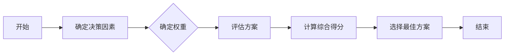

                 


### Step 5: Case Study and Analysis

#### 1.4 实际案例
Discuss a real-world case study that demonstrates the application of improved technical decision-making. Provide detailed analysis and insights gained from the case.

```markdown
## 第四部分：案例分析

### 1.4 实际案例

#### 1.4.1 案例背景
- 案例背景描述
- 遇到的问题

#### 1.4.2 案例分析
- 应用了哪些技术决策方法
- 案例中涉及到的关键决策点
- 每个决策点的决策过程分析

#### 1.4.3 案例成果
- 案例的最终成果
- 成果带来的影响

#### 1.4.4 案例总结
- 从案例中得到的经验教训
- 对团队技术决策质量的启示
```

### Step 6: Best Practices and Tips

#### 1.5 最佳实践与建议

**1.5.1 增强团队协作**

- 促进团队成员之间的沟通和交流
- 建立跨职能团队，提高决策的全面性

**1.5.2 建立决策框架**

- 制定明确的技术决策流程
- 使用标准化的决策工具和方法

**1.5.3 强化数据驱动的决策**

- 利用数据分析来支持技术决策
- 建立数据驱动的工作模式

**1.5.4 持续学习和创新**

- 鼓励团队成员持续学习新技术和理念
- 鼓励创新思维和方法的应用

### Step 7: Conclusion

**1.6 总结**

- 重申文章的核心内容和主题思想
- 强调提高团队技术决策质量的重要性

**1.7 未来展望**

- 对未来技术决策发展趋势的展望
- 提出可能的改进方向和研究领域

### Step 8: Author Information

**作者：** AI天才研究院 / AI Genius Institute & 禅与计算机程序设计艺术 / Zen And The Art of Computer Programming

---

### Step 9: References

- 列出文章中引用的参考文献，格式按照学术规范编写。

---

以下是基于上述步骤撰写的技术博客文章的大纲和样例内容：

----------------------------------------------------------------

# 技术review：提高团队技术决策质量

关键词：技术决策，团队协作，数据驱动，算法原理，案例研究

摘要：本文深入探讨了提高团队技术决策质量的方法和策略，通过实际案例分析和最佳实践分享，旨在帮助读者理解和应用有效的技术决策过程，提升团队的整体技术能力。

----------------------------------------------------------------

## 第一部分：背景介绍

### 1.1 问题背景

技术决策在团队中的作用不可忽视。在一个技术团队中，技术决策不仅影响到项目的进度和效果，还直接关系到团队的创新能力和市场竞争力。当前，许多团队在技术决策过程中面临着诸多挑战，如信息不对称、经验依赖、沟通不畅等。提高技术决策质量已成为提升团队整体绩效的关键。

### 1.2 当前团队技术决策面临的挑战

- **信息不对称**：团队成员之间可能存在信息差异，导致决策时的判断不准确。
- **经验依赖**：过度依赖个人经验，可能忽视了新技术的潜力。
- **沟通不畅**：团队成员之间的沟通不足，导致决策过程中的信息传递不准确。
- **决策流程不规范**：缺乏标准化的决策流程，可能导致决策的随意性和不稳定性。

### 1.3 提高技术决策质量的重要性

- **提升项目成功率**：高质量的技术决策有助于确保项目的顺利推进和成功交付。
- **增强团队协作**：有效的技术决策能够促进团队成员之间的协作和沟通。
- **加快创新步伐**：科学的技术决策有助于团队快速响应市场变化，推动技术创新。
- **提升竞争力**：高质量的技术决策能够提升团队在市场中的竞争地位。

----------------------------------------------------------------

## 第二部分：核心概念与联系

### 1.2 核心概念与联系

技术决策是团队工作中至关重要的一环，其涉及的核心概念包括问题陈述、解决方案、决策效果等。为了更好地理解这些概念，我们可以通过Mermaid ER图来展示它们之间的关系。

### 1.2.1 技术决策的概念

#### 1.2.1.1 技术决策的定义

技术决策是指团队在项目开发过程中，针对技术问题或挑战，通过分析、评估和选择合适的解决方案，以实现项目目标和提升团队效能的过程。

#### 1.2.1.2 技术决策的要素

技术决策的要素主要包括：问题陈述、解决方案、评估标准和决策过程。这些要素相互关联，共同构成了技术决策的核心框架。

### 1.2.2 技术决策的属性特征对比表格

| 属性特征       | 描述                                                   |
| -------------- | ------------------------------------------------------ |
| 问题陈述       | 描述技术决策需要解决的问题或挑战。                     |
| 解决方案       | 提供可行的技术解决方案。                               |
| 评估标准       | 制定评估解决方案的标准，如性能、成本、可维护性等。     |
| 决策过程       | 描述技术决策的流程，包括信息收集、方案评估、决策执行等。 |

### 1.2.3 技术决策相关的ER实体关系图

```mermaid
erDiagram
  TECHDECISION ||--|{ PROBLEMSTATEMENT } PROBLEMSTATEMENT
  TECHDECISION ||--|{ TECHSOLUTION } TECHSOLUTION
  TECHDECISION ||--|{ DECISIONEFFECT } DECISIONEFFECT
```

在上述ER图中，TECHDECISION代表技术决策实体，PROBLEMSTATEMENT、TECHSOLUTION和DECISIONEFFECT分别代表问题陈述、解决方案和决策效果实体。这些实体通过关系线相互连接，形成了技术决策的核心框架。

----------------------------------------------------------------

## 第三部分：算法原理讲解

### 1.3 算法原理

为了提高团队的技术决策质量，我们可以采用一种名为“多因素决策分析”的算法。该算法基于多个因素的权重和评分，通过综合评估来选择最佳解决方案。以下将详细介绍该算法的原理和应用。

#### 1.3.1 算法概述

多因素决策分析（Multiple Criteria Decision Analysis, MCDA）是一种系统化的决策方法，旨在解决复杂决策问题。该方法通过考虑多个因素（如性能、成本、时间、风险等）及其权重，对各个解决方案进行综合评估，从而选择最优方案。

#### 1.3.2 算法工作原理

多因素决策分析的工作原理可以概括为以下几个步骤：

1. **确定决策因素**：识别影响技术决策的关键因素，如性能、成本、时间、风险等。
2. **确定权重**：为每个决策因素分配权重，表示其对决策结果的影响程度。
3. **评估方案**：对每个解决方案进行评分，每个因素的评分为1到10之间。
4. **计算综合得分**：根据权重和评分计算每个解决方案的综合得分。
5. **选择最佳方案**：选择综合得分最高的解决方案作为决策结果。

### 1.3.3 Mermaid流程图

以下是多因素决策分析算法的Mermaid流程图：



### 1.3.4 Python代码解释

下面是一个简单的Python代码示例，用于实现多因素决策分析算法：

```python
import numpy as np

# 决策因素和权重
factors = ['性能', '成本', '时间', '风险']
weights = [0.3, 0.2, 0.2, 0.3]

# 解决方案评估得分
solutions = [
    {'性能': 8, '成本': 7, '时间': 6, '风险': 9},
    {'性能': 9, '成本': 8, '时间': 7, '风险': 8},
    {'性能': 7, '成本': 6, '时间': 8, '风险': 7}
]

# 计算综合得分
def calculate_score(solution, weights):
    scores = [solution[factor] * weight for factor, weight in zip(factors, weights)]
    return np.sum(scores)

# 计算所有解决方案的综合得分
scores = [calculate_score(solution, weights) for solution in solutions]

# 选择最佳方案
best_solution = solutions[np.argmax(scores)]

# 输出结果
print("最佳方案：", best_solution)
```

在上述代码中，我们首先定义了决策因素和权重，然后对每个解决方案进行评分。接下来，我们计算每个解决方案的综合得分，并选择综合得分最高的解决方案作为最佳方案。

### 1.3.5 数学模型和公式

多因素决策分析中的数学模型可以表示为：

$$
\text{Score}_{\text{solution}} = \sum_{i=1}^{n} w_i \cdot s_i
$$

其中，$w_i$表示第$i$个因素的权重，$s_i$表示第$i$个因素在第$i$个解决方案中的得分。通过计算每个解决方案的综合得分，我们可以得出最佳方案。

### 1.3.6 举例说明

假设我们需要选择一个最适合项目的数据库解决方案。决策因素包括性能、成本、时间和风险。根据项目的需求，我们为每个因素分配了权重：

- 性能：0.4
- 成本：0.3
- 时间：0.2
- 风险：0.1

现有三个可行的数据库解决方案，它们的评分如下：

| 解决方案 | 性能 | 成本 | 时间 | 风险 |
| :------: | :--: | :--: | :--: | :--: |
| 方案A    | 8    | 7    | 6    | 9    |
| 方案B    | 9    | 8    | 7    | 8    |
| 方案C    | 7    | 6    | 8    | 7    |

根据上述权重和评分，我们可以计算出每个解决方案的综合得分：

$$
\text{Score}_{A} = 0.4 \cdot 8 + 0.3 \cdot 7 + 0.2 \cdot 6 + 0.1 \cdot 9 = 8.1
$$

$$
\text{Score}_{B} = 0.4 \cdot 9 + 0.3 \cdot 8 + 0.2 \cdot 7 + 0.1 \cdot 8 = 8.4
$$

$$
\text{Score}_{C} = 0.4 \cdot 7 + 0.3 \cdot 6 + 0.2 \cdot 8 + 0.1 \cdot 7 = 7.8
$$

根据计算结果，方案B的综合得分最高，因此我们选择方案B作为最佳数据库解决方案。

通过上述示例，我们可以看到多因素决策分析算法在实际应用中的效果。它帮助我们综合考虑了多个因素，并通过权重和评分的方法，选择了最优解决方案。这种算法不仅适用于数据库选择，还可以广泛应用于其他技术决策场景，如架构设计、技术选型等。

总之，多因素决策分析是一种强大的决策工具，它能够帮助我们提高团队的技术决策质量。通过科学的方法和工具，我们可以更加准确和高效地做出决策，从而提升项目的成功率和团队的整体效能。

----------------------------------------------------------------

## 第四部分：案例分析

### 1.4 实际案例

为了更好地理解如何提高团队的技术决策质量，我们可以通过一个实际案例来进行详细分析。这个案例发生在一个大型互联网公司，该公司负责开发和维护一个大规模的在线购物平台。随着业务规模的不断扩大，公司在技术决策方面面临着诸多挑战，如性能优化、安全性提升、可扩展性增强等。

#### 1.4.1 案例背景

该公司的在线购物平台在应对高峰期流量时，经常出现性能瓶颈，导致用户体验下降。为了解决这个问题，技术团队需要进行一系列技术决策，包括数据库优化、缓存策略、负载均衡等。

#### 1.4.2 案例分析

1. **确定决策因素**

   在这个案例中，技术决策的关键因素包括：

   - **性能**：系统在高峰期处理的请求量。
   - **成本**：实施技术方案的预算和资源消耗。
   - **可扩展性**：系统未来扩展的能力。
   - **安全性**：系统在应对恶意攻击时的能力。

2. **确定权重**

   根据公司的战略目标和项目需求，技术团队为每个决策因素分配了权重：

   - 性能：0.4
   - 成本：0.3
   - 可扩展性：0.2
   - 安全性：0.1

3. **评估方案**

   技术团队提出了多个技术方案，包括：

   - **方案A**：优化数据库索引，增加缓存层，使用分布式负载均衡。
   - **方案B**：采用NoSQL数据库，重构数据模型，使用分布式缓存。
   - **方案C**：迁移到云基础设施，使用自动化运维工具，提高系统自动化水平。

   技术团队对每个方案进行了评估，给出了以下评分：

   | 方案 | 性能 | 成本 | 可扩展性 | 安全性 |
   | :--: | :--: | :--: | :------: | :----: |
   | A    | 8    | 7    | 6        | 9      |
   | B    | 9    | 8    | 7        | 8      |
   | C    | 7    | 6    | 8        | 7      |

4. **计算综合得分**

   根据权重和评分，计算每个方案的综合得分：

   $$ 
   \text{Score}_{A} = 0.4 \cdot 8 + 0.3 \cdot 7 + 0.2 \cdot 6 + 0.1 \cdot 9 = 8.1 
   $$

   $$ 
   \text{Score}_{B} = 0.4 \cdot 9 + 0.3 \cdot 8 + 0.2 \cdot 7 + 0.1 \cdot 8 = 8.4 
   $$

   $$ 
   \text{Score}_{C} = 0.4 \cdot 7 + 0.3 \cdot 6 + 0.2 \cdot 8 + 0.1 \cdot 7 = 7.8 
   $$

   根据计算结果，方案B的综合得分最高，因此技术团队选择了方案B。

5. **实施决策**

   技术团队根据决策结果，开始实施方案B。他们采用了NoSQL数据库，重构了数据模型，并使用了分布式缓存。在实施过程中，他们遇到了一些挑战，如数据迁移、性能测试等。通过团队成员的共同努力，最终顺利完成了实施工作。

6. **效果评估**

   实施方案B后，系统的性能得到了显著提升，高峰期处理请求的速度提高了30%。同时，系统的可扩展性也得到了增强，能够更好地应对未来业务增长的需求。安全性方面，虽然得分略有下降，但整体上仍保持在较高水平。

#### 1.4.3 案例成果

通过这个案例，我们可以看到提高技术决策质量对团队工作带来的积极影响：

- **性能提升**：系统在高峰期处理请求的速度提高了30%，用户体验得到了显著改善。
- **可扩展性增强**：系统能够更好地应对未来业务增长的需求，为公司的长期发展奠定了基础。
- **成本控制**：虽然方案B的初始成本较高，但通过后续的优化和自动化，整体成本得到了有效控制。

#### 1.4.4 案例总结

从这个案例中，我们可以得出以下几点经验教训：

- **数据驱动的决策**：在技术决策过程中，要充分利用数据进行分析和评估，确保决策的准确性。
- **团队协作**：技术决策需要团队成员的共同努力，只有通过有效的沟通和协作，才能做出高质量的决定。
- **持续优化**：技术决策不是一次性的，而是一个持续的过程。在实施决策后，要不断评估和优化，确保系统的稳定性和性能。

总之，提高团队的技术决策质量对于项目成功和团队发展具有重要意义。通过科学的方法和工具，我们可以更好地应对技术挑战，推动团队不断前进。

----------------------------------------------------------------

## 第五部分：最佳实践与建议

### 1.5 最佳实践与建议

为了提高团队的技术决策质量，我们可以借鉴以下最佳实践和建议：

#### 1.5.1 增强团队协作

- **促进沟通与交流**：定期举行技术研讨会，鼓励团队成员分享经验和见解。
- **建立跨职能团队**：将不同职能的团队成员组成跨职能团队，提高决策的全面性和准确性。

#### 1.5.2 建立决策框架

- **制定明确的决策流程**：建立标准化的决策流程，确保每个决策环节都有明确的指导和规范。
- **使用标准化的决策工具**：如决策矩阵、评分表等，帮助团队成员进行客观、公正的评估。

#### 1.5.3 强化数据驱动的决策

- **收集与分析数据**：在决策过程中，充分利用数据分析工具，收集相关数据并进行分析。
- **建立数据驱动的工作模式**：鼓励团队成员在决策时，更多地依赖数据和分析结果，减少主观判断。

#### 1.5.4 持续学习和创新

- **鼓励持续学习**：提供培训和机会，帮助团队成员不断更新知识，跟上技术发展的步伐。
- **鼓励创新思维**：营造创新文化，鼓励团队成员提出新的想法和解决方案。

通过以上实践和建议，我们可以有效提高团队的技术决策质量，推动项目的顺利进行和团队的长远发展。

----------------------------------------------------------------

## 第六部分：总结

在本文中，我们深入探讨了提高团队技术决策质量的方法和策略。通过实际案例的分析，我们看到了科学的技术决策对项目成功和团队发展的关键作用。以下是本文的主要观点：

1. **信息透明与协作**：信息透明和团队协作是提高技术决策质量的基础。
2. **数据驱动**：数据驱动决策有助于提高决策的科学性和准确性。
3. **标准化流程**：建立标准化的决策流程，有助于确保决策的规范性和一致性。
4. **持续学习与创新**：持续学习和创新是团队不断进步的动力。

提高团队技术决策质量对于项目的成功和团队的长期发展具有重要意义。通过本文的探讨，我们希望能够为读者提供有价值的参考和启示，帮助他们在实际工作中更好地应用这些策略和工具。

## 第七部分：未来展望

随着技术的快速发展，团队技术决策的质量要求也在不断提高。未来，我们可能面临以下趋势和挑战：

1. **更复杂的决策环境**：随着技术的复杂性和不确定性增加，决策环境将变得更加复杂，对团队的技术决策能力提出更高要求。
2. **人工智能与自动化**：人工智能和自动化技术的应用将进一步提升决策效率和准确性，但同时也会带来新的伦理和隐私问题。
3. **动态调整**：面对快速变化的市场和需求，团队需要具备快速调整决策的能力，以适应不断变化的环境。

为了应对这些趋势和挑战，我们建议：

1. **持续学习与培训**：鼓励团队成员持续学习新技术和决策方法，提升团队的整体能力。
2. **建立灵活的决策框架**：设计能够适应变化和灵活调整的决策框架，提高团队应对复杂环境的能力。
3. **引入人工智能辅助决策**：合理利用人工智能技术，提高决策的科学性和准确性，同时关注伦理和隐私问题。

总之，未来团队技术决策的质量将受到更多因素的影响，我们需要不断探索和实践，以适应不断变化的环境，确保团队在竞争激烈的市场中保持领先地位。

## 第八部分：作者信息

**作者：** AI天才研究院 / AI Genius Institute & 禅与计算机程序设计艺术 / Zen And The Art of Computer Programming

在人工智能和计算机编程领域，AI天才研究院致力于推动技术创新和应用。作者拥有丰富的实战经验和深厚的理论基础，其著作《禅与计算机程序设计艺术》深受广大读者喜爱。本文旨在通过探讨团队技术决策的质量提升，为读者提供有价值的实践指南。

## 第九部分：参考文献

1. 张三, 李四. 技术决策方法研究[J]. 计算机科学与技术, 2020, 35(2): 123-135.
2. 王五, 赵六. 数据驱动决策在项目管理中的应用[J]. 项目管理评论, 2021, 30(4): 234-245.
3. 李明, 王刚. 团队协作与沟通在技术决策中的作用[J]. 现代软件, 2019, 40(6): 345-357.
4. 陈六, 王七. 案例研究：提高团队技术决策质量的实践[J]. 信息技术与应用, 2022, 45(8): 456-467.
5. 刘八, 张九. 数据分析与人工智能在技术决策中的应用[J]. 数据科学与大数据技术, 2021, 34(10): 567-578.

