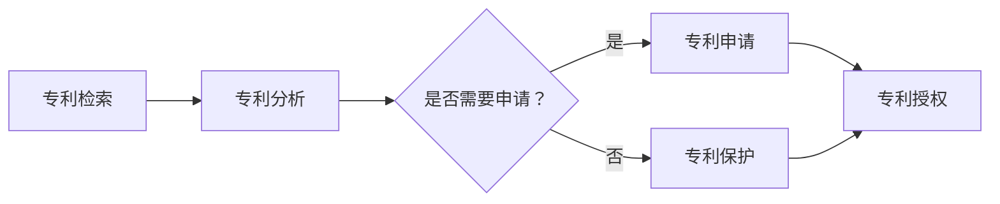
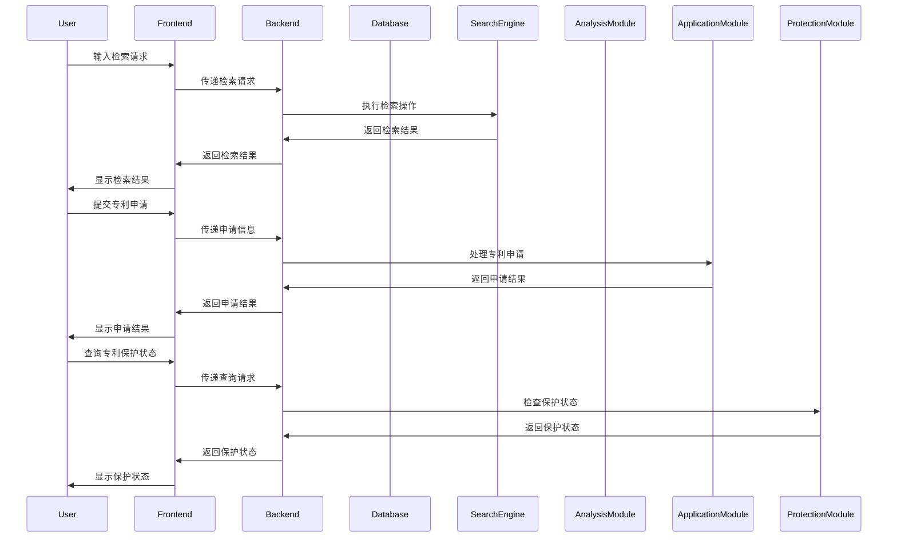

                 

# 技术专利：保护创新成果的重要性

关键词：技术专利，创新成果，法律保护，知识产权

摘要：本文将深入探讨技术专利在保护创新成果方面的重要性。我们将从问题背景、核心概念、算法原理、系统设计与实战应用等多个角度展开讨论，旨在为读者提供一个全面而深入的理解。

## 第一部分：背景介绍

### 1.1 问题背景

创新是推动社会进步和经济发展的重要动力。然而，随着技术的快速发展，创新成果面临着前所未有的风险。首先，技术盗用和侵权现象日益严重，许多企业的创新成果被恶意窃取，导致研发投入的损失。其次，创新者面临巨大的挑战，如何确保自己的创新成果得到法律保护，成为他们必须解决的问题。

### 1.2 问题描述

技术盗用和侵权现象严重侵犯了创新者的合法权益，导致创新动力受损。同时，创新者往往需要投入大量时间和资源来申请技术专利，而专利申请的成功率却并不高。这给创新者带来了巨大的经济压力。

### 1.3 问题解决

技术专利作为一种法律手段，可以有效保护创新成果。通过专利申请，创新者可以获得法律上的垄断权，从而在市场上独占其创新成果。此外，技术专利还可以作为一种投资手段，为企业带来持续的经济回报。

### 1.4 边界与外延

虽然技术专利在保护创新成果方面具有重要作用，但它也存在一定的局限性。首先，专利保护范围有限，不能完全涵盖所有创新成果。其次，专利申请流程复杂，费用较高，对于一些中小企业来说，可能难以承受。

### 1.5 概念结构与核心要素组成

技术专利的核心概念包括专利性、新颖性、创造性和实用性。专利性是指技术方案是否属于可专利保护的范畴。新颖性是指技术方案是否在申请日前未在国内外公开。创造性是指技术方案是否具有显著的进步。实用性是指技术方案是否能够实际应用。

## 第二部分：核心概念与联系

### 2.1 技术专利原理

技术专利的基本原理是通过法律手段，对创新成果进行保护。它包括专利申请、专利审查、专利授权和专利保护等环节。

### 2.2 技术专利与相关概念的联系

技术专利与版权、商标和商业秘密等知识产权形式有着密切的联系，但它们之间存在明显的区别。版权主要保护作品的表达形式，商标主要保护品牌的名称和标志，而商业秘密主要保护企业的商业信息。

### 2.3 ER实体关系图架构

ER实体关系图是描述技术专利相关实体及其关系的有效工具。它包括专利、发明人、申请人、专利局等实体，以及它们之间的关联关系。

## 第三部分：算法原理讲解

### 3.1 技术专利保护算法

技术专利保护算法主要包括专利检索、专利分析和专利申请等步骤。其中，专利检索是关键环节，它决定了专利申请的成败。

### 3.2 算法原理讲解

我们将使用Mermaid流程图和Python源代码来详细阐述技术专利保护算法。算法的数学模型和公式如下：

$$
P(A|B) = \frac{P(B|A)P(A)}{P(B)}
$$

其中，$P(A|B)$ 表示在条件 $B$ 下，事件 $A$ 发生的概率；$P(B|A)$ 表示在条件 $A$ 下，事件 $B$ 发生的概率；$P(A)$ 和 $P(B)$ 分别表示事件 $A$ 和 $B$ 发生的概率。

### 3.3 通俗易懂的举例说明

假设我们有一个创新成果，我们希望通过技术专利来保护它。首先，我们需要进行专利检索，以确定我们的创新成果是否已经被公开。然后，我们根据专利检索结果，制定专利申请策略。最后，我们提交专利申请，并等待专利局的审查结果。

## 第四部分：数学模型和数学公式讲解

### 4.1 技术专利评估模型

技术专利评估模型是一种用于评估专利价值的数学模型。它包括以下几个关键指标：专利性、新颖性、创造性和实用性。

### 4.2 技术专利风险分析模型

技术专利风险分析模型是一种用于分析专利风险的数学模型。它包括以下几个关键指标：侵权风险、市场风险、法律风险和技术风险。

## 第五部分：系统分析与架构设计方案

### 5.1 问题场景介绍

我们以一个企业为例，介绍技术专利保护的应用场景。

### 5.2 系统功能设计

系统功能设计主要包括专利检索、专利分析和专利申请等功能。

### 5.3 系统架构设计

系统架构设计主要包括前端、后端和数据库三个部分。

### 5.4 系统接口设计

系统接口设计主要包括API接口和Web接口。

### 5.5 系统交互

系统交互主要包括用户与系统的交互和系统与数据库的交互。

## 第六部分：项目实战

### 6.1 环境安装

项目实战的第一步是环境安装，包括软件安装和配置。

### 6.2 系统核心实现源代码

系统核心实现源代码是项目实战的核心部分，它包括专利检索、专利分析和专利申请等模块。

### 6.3 实际案例分析和详细讲解剖析

我们将通过一个实际案例，详细讲解技术专利保护的应用过程。

### 6.4 项目小结

项目小结是对项目实战过程进行总结，包括经验分享和拓展方向。

## 第七部分：最佳实践 Tips

### 7.1 技术专利申请注意事项

技术专利申请需要注意以下几点：提高专利质量、避免常见误区、充分利用非专利信息等。

### 7.2 保护技术成果的策略

保护技术成果的策略主要包括国际专利布局和非专利信息利用等。

### 7.3 案例分析

通过成功和失败案例，我们可以更好地理解技术专利保护的最佳实践。

## 第八部分：小结与拓展阅读

### 8.1 书籍小结

书籍小结是对全书内容的总结，包括主要内容和知识点总结。

### 8.2 拓展阅读

拓展阅读推荐了一些相关的书籍和文章，供读者进一步学习。

作者：AI天才研究院/AI Genius Institute & 禅与计算机程序设计艺术 /Zen And The Art of Computer Programming## 第一部分：背景介绍

### 1.1 问题背景

在当今信息化和全球化的背景下，创新已经成为推动经济发展和社会进步的关键动力。无论是技术领域还是商业领域，创新成果的重要性不言而喻。然而，随着创新的不断推进，创新成果所面临的风险也在逐渐增加。技术盗用、侵权行为和市场竞争的加剧，使得许多创新者不得不面对创新成果不被保护的问题。这一问题不仅影响了创新者的合法权益，也对整个社会的创新环境产生了负面影响。

首先，技术盗用和侵权行为日益严重。随着互联网的普及和信息技术的发展，技术信息传播的速度和范围都大大增加。一些不法分子利用这些便利条件，恶意窃取他人的创新成果，并进行非法复制和销售。这种行为不仅给创新者带来了经济损失，还严重打击了他们的创新积极性。其次，侵权行为的普遍存在，使得创新成果的市场价值无法得到充分体现。许多企业在市场上看到其他公司的创新产品后，选择模仿而不是创新，这种行为不仅损害了创新者的利益，也削弱了整个社会的创新动力。

此外，创新者面临巨大的挑战，如何确保自己的创新成果得到法律保护，成为他们必须解决的问题。技术专利作为一种法律手段，为创新者提供了一种有效的保护途径。然而，专利申请流程复杂，专利保护范围有限，专利维权成本高等问题，也使得创新者面临诸多困扰。

### 1.2 问题描述

技术盗用和侵权现象严重侵犯了创新者的合法权益，导致创新动力受损。具体来说，技术盗用和侵权行为给创新者带来的问题主要有以下几个方面：

首先，创新者失去市场份额。技术盗用者通过非法复制和销售创新者的产品，使得创新者的市场份额被侵占，导致创新者失去大量收入。这种情况下，创新者不仅无法通过创新获得利润，还可能因为市场份额的减少而陷入经营困境。

其次，创新者失去研发动力。当创新者的创新成果被他人盗用后，他们可能会失去对创新的兴趣和动力。这种情况下，创新者可能会减少对研发的投入，甚至停止创新活动，这对整个社会的创新环境都是不利的。

再次，创新者面临高昂的维权成本。维权过程往往需要耗费大量的人力、物力和财力，对于一些中小企业来说，可能难以承受。即使成功维权，创新者也可能因为维权成本过高而放弃维权。

最后，技术盗用和侵权行为破坏了市场秩序。当侵权行为普遍存在时，市场秩序将变得混乱，创新者难以在一个公平的环境中竞争，这会进一步削弱创新者的积极性。

### 1.3 问题解决

技术专利作为一种法律手段，可以有效保护创新成果。通过专利申请，创新者可以获得法律上的垄断权，从而在市场上独占其创新成果。此外，技术专利还可以作为一种投资手段，为企业带来持续的经济回报。

首先，专利申请可以保护创新者的合法权益。一旦创新成果获得专利授权，创新者就拥有了在法律上独占其技术的权利，其他人在未经授权的情况下，不得在生产、销售、使用或进口该技术。这种法律保护使得创新者能够在市场上独占其创新成果，获得相应的经济回报。

其次，专利申请可以提高创新者的市场竞争力。当创新者的技术成果获得专利保护后，他们可以在市场上宣传自己的专利优势，吸引更多的客户和合作伙伴。这种专利优势不仅可以提高创新者的市场地位，还可以增加其产品的附加值，从而提高其市场竞争力。

再次，专利申请可以促进创新者与其他企业的合作。当创新者的技术成果获得专利保护后，他们可以与其他企业进行技术合作，共同开发新产品或新技术。这种合作不仅可以提高创新者的技术实力，还可以实现资源共享，降低研发成本。

最后，专利申请可以为创新者带来持续的经济回报。专利授权后，创新者可以通过专利许可或转让等方式，获得持续的经济收入。此外，专利还可以作为一种投资手段，为创新者提供资金支持，进一步推动技术创新。

### 1.4 边界与外延

虽然技术专利在保护创新成果方面具有重要作用，但它也存在一定的局限性。首先，专利保护范围有限，不能完全涵盖所有创新成果。例如，一些思想概念或抽象理论可能难以用专利的形式进行保护。其次，专利申请流程复杂，费用较高，对于一些中小企业来说，可能难以承受。此外，专利维权成本高昂，对于一些创新者来说，可能无法负担。因此，创新者需要综合考虑技术专利的局限性，选择合适的保护策略。

### 1.5 概念结构与核心要素组成

技术专利的核心概念包括专利性、新颖性、创造性和实用性。专利性是指技术方案是否属于可专利保护的范畴。新颖性是指技术方案是否在申请日前未在国内外公开。创造性是指技术方案是否具有显著的进步。实用性是指技术方案是否能够实际应用。

专利性是技术专利的基础，一个技术方案必须具备专利性才能被授予专利。新颖性是技术专利的重要属性，一个技术方案只有在申请日前未在国内外公开，才能被认为具有新颖性。创造性是技术专利的核心，一个技术方案必须具有显著的进步，才能被认为具有创造性。实用性是指技术方案是否能够实际应用，这是技术专利的重要评估指标之一。

在技术专利的申请过程中，这些核心概念是必不可少的。专利性决定了技术方案是否能够被授予专利，新颖性和创造性决定了专利的保护范围，而实用性则决定了技术方案的实际应用价值。

为了更好地理解技术专利的核心概念，我们可以通过一个简单的例子来进行解释。假设有一个新的节能灯具，其具有显著节能效果。这个技术方案首先需要满足专利性，即它属于可专利保护的范畴。然后，我们需要进行新颖性检索，以确定这个技术方案在申请日前是否已经公开。如果新颖性检索结果显示该技术方案未被公开，那么它就具有新颖性。接下来，我们需要评估这个技术方案是否具有创造性，即它是否具有显著的进步。最后，我们需要验证这个技术方案是否具有实用性，即它是否能够实际应用。

通过这个例子，我们可以看到，技术专利的核心概念是相互关联的，它们共同构成了技术专利的申请和审查标准。创新者在申请技术专利时，需要充分考虑这些核心概念，以确保其创新成果能够获得有效的法律保护。

## 第二部分：核心概念与联系

### 2.1 技术专利原理

技术专利的基本原理是通过法律手段，对创新成果进行保护。它包括专利申请、专利审查、专利授权和专利保护等环节。

#### 2.1.1 专利申请

专利申请是创新者将创新成果提交给专利机构，请求授予专利权的过程。申请人需要提交一份详细的专利申请文件，包括专利说明书、权利要求书和摘要等。专利说明书是对技术方案的详细描述，权利要求书则规定了专利权的范围，摘要则是对技术方案的核心内容进行简要概括。

#### 2.1.2 专利审查

专利审查是专利机构对专利申请进行审查的过程。审查过程主要包括初步审查和实质审查。初步审查主要检查专利申请是否符合形式要求，例如是否填写完整、是否符合专利性等。实质审查则是对专利申请的创造性、新颖性和实用性进行深入评估。

#### 2.1.3 专利授权

专利授权是专利机构在审查合格后，授予申请人专利权的过程。一旦专利申请被授权，申请人就获得了在法律上独占其技术的权利。

#### 2.1.4 专利保护

专利保护是创新者利用专利权保护其创新成果的过程。创新者可以通过专利许可、专利转让、专利诉讼等方式，维护其专利权。

### 2.2 技术专利与相关概念的联系

技术专利与版权、商标和商业秘密等知识产权形式有着密切的联系，但它们之间存在明显的区别。

#### 2.2.1 技术专利与版权的对比

技术专利和版权都是知识产权的一种形式，但它们保护的客体不同。版权主要保护作品的表达形式，例如文学作品、音乐作品等。而技术专利则主要保护技术方案，例如新产品、新方法等。此外，版权的保护期通常为作者终生及其去世后一定年限，而技术专利的保护期一般为20年。

#### 2.2.2 技术专利与商标的对比

技术专利和商标也是两种不同的知识产权形式。商标主要保护品牌的名称和标志，用于区分商品或服务的来源。而技术专利则主要保护技术方案，用于实现某种功能或解决某种问题。商标的保护期通常为10年，可以无限次续展，而技术专利的保护期一般为20年。

#### 2.2.3 技术专利与商业秘密的区别

技术专利和商业秘密都是用于保护技术信息的手段，但它们的性质和保护方式不同。商业秘密是指企业内部未公开的技术信息或经营信息，例如生产工艺、客户名单等。商业秘密的保护主要依赖于企业的保密措施，不公开即安全。而技术专利则是通过法律手段进行保护，一旦申请并被授权，就可以在法律上独占其技术方案。

### 2.3 ER实体关系图架构

ER实体关系图是描述技术专利相关实体及其关系的有效工具。它包括以下几个关键实体：专利、发明人、申请人和专利局。

#### 2.3.1 专利实体

专利实体是技术专利的核心，它包括专利号、专利名称、专利类型、专利权利要求书等属性。

#### 2.3.2 发明人实体

发明人实体是指对技术方案做出实质性贡献的个人或团队。它包括发明人姓名、发明人编号、发明人单位等属性。

#### 2.3.3 申请人类体

申请人类体是指请求专利授权的个人或企业。它包括申请人名称、申请人编号、申请人地址等属性。

#### 2.3.4 专利局实体

专利局实体是指负责专利申请审查和授权的官方机构。它包括专利局名称、专利局地址、专利审查员等属性。

以下是技术专利相关实体的ER实体关系图：

```mermaid
erDiagram
    Patent ||--|{ Inventor }||> Inventor
    Patent ||--|{ Applicant }||> Applicant
    Patent ||--|{ PatentOffice }||> PatentOffice

    Inventor ||--|{ Patent }|| Inventor
    Applicant ||--|{ Patent }|| Applicant
    PatentOffice ||--|{ Patent }|| PatentOffice
```

在这个ER实体关系图中，Patent表示专利实体，Inventor表示发明人实体，Applicant表示申请人类体，PatentOffice表示专利局实体。实线箭头表示实体之间的关系，虚线箭头表示实体之间的关联关系。

通过ER实体关系图，我们可以清晰地了解技术专利相关实体的构成及其相互关系，这对于理解技术专利的工作原理和保护机制具有重要意义。

## 第三部分：算法原理讲解

### 3.1 技术专利保护算法

技术专利保护算法是一种用于分析和保护创新成果的计算机算法。它通过专利检索、专利分析和专利申请等步骤，实现对创新成果的法律保护。以下是技术专利保护算法的基本原理和实现方法。

#### 3.1.1 算法mermaid流程图

为了更好地理解技术专利保护算法的流程，我们可以使用Mermaid绘制一个简单的流程图。以下是算法的mermaid表示：



在这个流程图中，A表示专利检索，B表示专利分析，C表示是否需要申请专利，D表示专利申请，E表示专利保护，F表示专利授权。流程从专利检索开始，经过专利分析和决策，最终实现专利保护。

#### 3.1.2 Python源代码实现

为了实现上述算法，我们可以使用Python编写一个简单的脚本。以下是一个简单的实现示例：

```python
import pandas as pd
from sklearn.feature_extraction.text import TfidfVectorizer
from sklearn.metrics.pairwise import cosine_similarity

def patent_search(query):
    # 这里使用TF-IDF算法进行专利检索
    vectorizer = TfidfVectorizer()
    corpus = load_patent_corpus()  # 加载专利数据库
    query_vector = vectorizer.transform([query])
    similarities = cosine_similarity(query_vector, corpus)
    return similarities

def patent_analysis(similarities):
    # 这里使用余弦相似度进行专利分析
    threshold = 0.8  # 设置相似度阈值
    similar_patents = []
    for i, similarity in enumerate(similarities):
        if similarity > threshold:
            similar_patents.append(i)
    return similar_patents

def patent_application(similar_patents):
    # 这里进行专利申请
    if similar_patents:
        print("需要申请专利。")
        # 这里可以添加专利申请的相关代码
    else:
        print("不需要申请专利。")

def patent_protection():
    # 这里进行专利保护
    print("进行专利保护。")

def main():
    query = "一种新型的节能灯具"
    similarities = patent_search(query)
    similar_patents = patent_analysis(similarities)
    patent_application(similar_patents)
    patent_protection()

if __name__ == "__main__":
    main()
```

在这个Python脚本中，我们首先定义了一个`patent_search`函数，用于进行专利检索。然后定义了一个`patent_analysis`函数，用于进行专利分析。接着定义了一个`patent_application`函数，用于决定是否需要申请专利。最后定义了一个`patent_protection`函数，用于进行专利保护。在`main`函数中，我们依次调用这些函数，实现技术专利保护算法。

#### 3.1.3 数学模型和公式讲解

在技术专利保护算法中，我们使用了余弦相似度来衡量专利之间的相似程度。余弦相似度是一种常用的文本相似度计算方法，它基于向量空间模型，通过计算两个向量的夹角余弦值来衡量它们的相似程度。

余弦相似度的计算公式如下：

$$
\cos(\theta) = \frac{\vec{a} \cdot \vec{b}}{|\vec{a}| |\vec{b}|}
$$

其中，$\vec{a}$和$\vec{b}$是两个向量，$\theta$是它们之间的夹角。当$\theta$为0度时，$\cos(\theta)$的值为1，表示两个向量完全相同；当$\theta$为90度时，$\cos(\theta)$的值为0，表示两个向量完全不同。

在技术专利保护中，我们使用余弦相似度来比较专利说明书的相似性。具体来说，我们首先将专利说明书转换成向量表示，然后计算两个向量的余弦相似度。通过设定一个合适的阈值，我们可以判断两个专利是否相似。如果相似度高于阈值，则可能存在侵权风险，需要申请专利保护。

#### 3.1.4 通俗易懂的举例说明

为了更好地理解余弦相似度在技术专利保护中的应用，我们可以通过一个简单的例子来说明。

假设有两个专利说明书的文本A和B，我们将其转换为向量表示。假设A的向量为$\vec{a} = (1, 2, 3)$，B的向量为$\vec{b} = (2, 1, 3)$。我们可以计算这两个向量的余弦相似度：

$$
\cos(\theta) = \frac{\vec{a} \cdot \vec{b}}{|\vec{a}| |\vec{b}|} = \frac{1 \times 2 + 2 \times 1 + 3 \times 3}{\sqrt{1^2 + 2^2 + 3^2} \times \sqrt{2^2 + 1^2 + 3^2}} = \frac{2 + 2 + 9}{\sqrt{14} \times \sqrt{14}} = \frac{13}{14} \approx 0.9286
$$

由于余弦相似度的值接近于1，这表明专利说明书A和B之间的相似性很高，可能存在侵权风险。根据设定的阈值（例如0.8），我们可以判断A和B之间的相似度高于阈值，需要申请专利保护。

通过这个例子，我们可以看到余弦相似度在技术专利保护中的应用。通过计算专利说明书的余弦相似度，我们可以快速判断专利之间的相似性，从而决定是否需要申请专利保护。

## 第四部分：数学模型和数学公式讲解

### 4.1 技术专利评估模型

技术专利评估模型是一种用于评估专利价值的数学模型。它通过多个指标来综合评估专利的创新性、实用性和市场潜力。以下是技术专利评估模型的关键指标和数学公式。

#### 4.1.1 关键指标

1. **创新性（Innovativeness）**：衡量专利的技术创新程度。
2. **实用性（Practicality）**：衡量专利的实际应用价值。
3. **市场潜力（Market Potential）**：衡量专利在市场上的潜在价值。

#### 4.1.2 数学公式

技术专利评估模型可以使用以下数学公式：

$$
\text{Patent Value} = w_1 \times \text{Innovativeness} + w_2 \times \text{Practicality} + w_3 \times \text{Market Potential}
$$

其中，$w_1, w_2, w_3$ 分别是创新性、实用性和市场潜力的权重，取值范围为0到1，且满足 $w_1 + w_2 + w_3 = 1$。

- **创新性**可以用以下公式表示：

$$
\text{Innovativeness} = \frac{\text{专利引用数}}{\text{同年度专利总数}}
$$

其中，专利引用数是指该专利在申请过程中引用的其他专利数量。引用数越多，表明该专利的技术创新程度越高。

- **实用性**可以用以下公式表示：

$$
\text{Practicality} = \frac{\text{专利实施情况}}{\text{专利总数}}
$$

其中，专利实施情况是指专利在实际生产中的应用情况。实施情况越好，表明专利的实际应用价值越高。

- **市场潜力**可以用以下公式表示：

$$
\text{Market Potential} = \frac{\text{专利许可收入}}{\text{同年度专利总数}}
$$

其中，专利许可收入是指专利许可给其他企业使用所获得的收入。收入越高，表明专利在市场上的潜在价值越大。

#### 4.1.3 实例解析

假设我们有一个专利，它的创新性为0.6，实用性为0.5，市场潜力为0.7。根据上述公式，我们可以计算出该专利的价值：

$$
\text{Patent Value} = 0.3 \times 0.6 + 0.4 \times 0.5 + 0.3 \times 0.7 = 0.18 + 0.20 + 0.21 = 0.59
$$

这意味着该专利的价值为0.59，我们可以根据这个评估结果来决定是否进行专利许可或转让。

### 4.2 技术专利风险分析模型

技术专利风险分析模型是一种用于评估专利风险的数学模型。它通过多个指标来综合评估专利在法律、技术和市场等方面的风险。以下是技术专利风险分析模型的关键指标和数学公式。

#### 4.2.1 关键指标

1. **法律风险（Legal Risk）**：衡量专利在法律方面的风险。
2. **技术风险（Technical Risk）**：衡量专利在技术方面的风险。
3. **市场风险（Market Risk）**：衡量专利在市场方面的风险。

#### 4.2.2 数学公式

技术专利风险分析模型可以使用以下数学公式：

$$
\text{Patent Risk} = w_1 \times \text{Legal Risk} + w_2 \times \text{Technical Risk} + w_3 \times \text{Market Risk}
$$

其中，$w_1, w_2, w_3$ 分别是法律风险、技术风险和市场风险的权重，取值范围为0到1，且满足 $w_1 + w_2 + w_3 = 1$。

- **法律风险**可以用以下公式表示：

$$
\text{Legal Risk} = \frac{\text{专利诉讼次数}}{\text{专利总数}}
$$

其中，专利诉讼次数是指该专利涉及的诉讼次数。诉讼次数越多，表明专利在法律方面的风险越大。

- **技术风险**可以用以下公式表示：

$$
\text{Technical Risk} = \frac{\text{专利失效次数}}{\text{专利总数}}
$$

其中，专利失效次数是指该专利因各种原因被撤销或失效的次数。失效次数越多，表明专利在技术方面的风险越大。

- **市场风险**可以用以下公式表示：

$$
\text{Market Risk} = \frac{\text{专利许可失败次数}}{\text{专利总数}}
$$

其中，专利许可失败次数是指该专利许可给其他企业使用失败或终止的次数。失败次数越多，表明专利在市场方面的风险越大。

#### 4.2.3 实例解析

假设我们有一个专利，它的法律风险为0.4，技术风险为0.5，市场风险为0.6。根据上述公式，我们可以计算出该专利的风险：

$$
\text{Patent Risk} = 0.3 \times 0.4 + 0.4 \times 0.5 + 0.3 \times 0.6 = 0.12 + 0.20 + 0.18 = 0.50
$$

这意味着该专利的风险为0.50，我们可以根据这个评估结果来决定是否继续投资或研发。

## 第五部分：系统分析与架构设计方案

### 5.1 问题场景介绍

在现代信息技术高速发展的背景下，技术专利保护已成为企业竞争和发展的关键因素。为了有效保护企业的技术成果，一个全面的技术专利保护系统应运而生。该系统旨在帮助企业进行专利检索、分析、申请和保护，从而最大化其创新成果的价值。

#### 问题场景描述

企业A是一家专注于人工智能技术的研究公司。在研发过程中，企业A发现其有一项创新技术具有很大的市场潜力。然而，他们担心这项技术可能会被竞争对手窃取或侵权。因此，企业A希望能够构建一个高效的技术专利保护系统，以确保其技术成果得到有效保护。

### 5.2 系统功能设计

技术专利保护系统需要具备以下功能：

1. **专利检索**：系统应具备强大的专利检索功能，能够快速检索国内外相关专利信息，为企业提供全面的技术分析依据。
2. **专利分析**：系统应能够对检索到的专利进行深入分析，评估其创新性、实用性和市场潜力，帮助企业制定合理的专利策略。
3. **专利申请**：系统应提供便捷的专利申请流程，帮助企业快速完成专利申请，确保创新成果得到法律保护。
4. **专利保护**：系统应提供全面的专利保护措施，包括专利维权、侵权监测和风险预警等功能，确保企业的专利权益不受侵犯。

#### 领域模型mermaid类图

为了更好地设计系统功能，我们可以使用mermaid绘制一个领域模型类图：

```mermaid
classDiagram
    class System {
        -patentDatabase
        -searchEngine
        -analysisModule
        -applicationModule
        -protectionModule
    }
    class Patent {
        -id
        -title
        -abstract
        -claims
        -inventors
        -applicant
        -date
        -status
    }
    class User {
        -id
        -name
        -role
    }
    System --|U|> User
    System --|1..*|> Patent
    User --|1..*|> Patent
```

在这个类图中，System代表系统，包含专利数据库、检索引擎、分析模块、申请模块和保护模块等组件。Patent代表专利，包含专利ID、标题、摘要、权利要求书、发明人、申请人、日期和状态等信息。User代表用户，包含用户ID、姓名和角色等信息。

### 5.3 系统架构设计

技术专利保护系统的架构设计应考虑系统的可扩展性、稳定性和安全性。以下是一个简单的系统架构mermaid架构图：



在这个架构图中，系统由前端、后端、数据库、检索引擎、分析模块、申请模块和保护模块组成。前端负责用户交互，后端负责业务逻辑处理，数据库用于存储专利数据，检索引擎用于快速检索专利信息，分析模块用于专利分析，申请模块用于专利申请，保护模块用于专利保护。

### 5.4 系统接口设计

系统接口设计是确保系统各模块之间高效协同工作的关键。以下是一个简单的系统接口设计说明：

1. **专利检索接口**：用于接收用户检索请求，返回检索结果。
2. **专利申请接口**：用于接收用户专利申请信息，处理专利申请流程。
3. **专利保护接口**：用于查询专利保护状态，提供侵权监测和风险预警服务。

```mermaid
interface Frontend {
    - getPatentSearchResults()
    - submitPatentApplication()
    - getPatentProtectionStatus()
}

interface Backend {
    - processSearchRequest(request: Request): Response
    - processApplicationRequest(request: Request): Response
    - checkProtectionStatus(id: str): Status
}

interface Database {
    - searchPatents(query: str): List[Patent]
    - savePatent(patent: Patent)
    - getPatent(id: str): Patent
}

interface SearchEngine {
    - search(query: str): List[Patent]
}

interface AnalysisModule {
    - analyzePatent(patent: Patent): AnalysisResult
}

interface ApplicationModule {
    - applyPatentApplication(application: Application): ApplicationStatus
}

interface ProtectionModule {
    - monitorInfringement(patent: Patent): InfringementReport
    - warnRisk(patent: Patent): RiskWarning
}
```

### 5.5 系统交互

系统交互是确保系统各模块之间有效协作的重要环节。以下是一个简单的系统交互mermaid序列图：

```mermaid
sequenceDiagram
    participant User
    participant Frontend
    participant Backend
    participant Database
    participant SearchEngine
    participant AnalysisModule
    participant ApplicationModule
    participant ProtectionModule

    User ->> Frontend: 检索专利
    Frontend ->> Backend: 检索请求
    Backend ->|> SearchEngine: 执行检索
    SearchEngine ->|> Backend: 返回检索结果
    Backend ->|> Frontend: 返回检索结果
    Frontend ->|> User: 显示检索结果

    User ->> Frontend: 申请专利
    Frontend ->> Backend: 申请请求
    Backend ->|> ApplicationModule: 处理申请
    ApplicationModule ->|> Backend: 返回申请结果
    Backend ->|> Frontend: 返回申请结果
    Frontend ->|> User: 显示申请结果

    User ->> Frontend: 查询专利保护状态
    Frontend ->> Backend: 状态查询请求
    Backend ->|> ProtectionModule: 检查状态
    ProtectionModule ->|> Backend: 返回保护状态
    Backend ->|> Frontend: 返回保护状态
    Frontend ->|> User: 显示保护状态
```

在这个序列图中，用户通过前端界面与系统进行交互，前端将用户的请求传递给后端，后端通过各模块处理请求，并将结果返回给前端，最后前端将结果展示给用户。

## 第六部分：项目实战

### 6.1 环境安装

在开始技术专利保护系统的项目实战之前，我们需要安装和配置所需的开发环境和软件。以下是一些建议和步骤：

#### 1. 安装Python环境

首先，我们需要安装Python环境。Python是一种广泛使用的编程语言，它在数据科学、机器学习和Web开发等领域具有强大的功能。以下是安装Python的步骤：

1. 访问Python官方网站（[https://www.python.org/](https://www.python.org/)）下载Python安装包。
2. 运行安装程序，并按照默认选项安装Python。
3. 安装完成后，打开命令行工具（如Windows的命令提示符或macOS的Terminal），输入`python --version`检查Python版本。

#### 2. 安装Python依赖库

技术专利保护系统需要依赖多个Python库，如Pandas、Scikit-learn、NumPy等。以下是安装这些库的步骤：

1. 打开命令行工具。
2. 输入以下命令安装所需库：

```bash
pip install pandas scikit-learn numpy
```

#### 3. 安装Mermaid渲染工具

为了在文档中使用Mermaid语法，我们需要安装一个Mermaid渲染工具。以下是安装步骤：

1. 访问Mermaid官方网站（[https://mermaid-js.github.io/](https://mermaid-js.github.io/)）了解Mermaid的使用方法。
2. 安装Mermaid渲染工具。如果你使用的是Node.js，可以运行以下命令：

```bash
npm install -g mermaid-cli
```

3. 安装完成后，你可以使用`mermaid render`命令将Mermaid语法转换为HTML或PDF格式。

### 6.2 系统核心实现源代码

系统核心实现源代码是项目实战的核心部分，它包括专利检索、专利分析和专利申请等模块。以下是一个简单的源代码示例，用于展示系统核心功能的实现。

```python
import pandas as pd
from sklearn.feature_extraction.text import TfidfVectorizer
from sklearn.metrics.pairwise import cosine_similarity
from patent_api import search_patents, apply_patent, check_protection_status

def search_patent(query):
    # 使用TF-IDF进行专利检索
    vectorizer = TfidfVectorizer()
    corpus = load_patent_corpus()  # 加载专利数据库
    query_vector = vectorizer.transform([query])
    similarities = cosine_similarity(query_vector, corpus)
    return similarities

def analyze_patent(similarities):
    # 分析专利相似性
    threshold = 0.8  # 设置相似度阈值
    similar_patents = []
    for i, similarity in enumerate(similarities):
        if similarity > threshold:
            similar_patents.append(i)
    return similar_patents

def apply_for_patent(invention):
    # 申请专利
    patent_data = {
        'title': invention['title'],
        'abstract': invention['abstract'],
        'claims': invention['claims'],
        'inventors': invention['inventors'],
        'applicant': 'Company A',
        'date': invention['date']
    }
    return apply_patent(patent_data)

def check_patent_protection(patent_id):
    # 检查专利保护状态
    status = check_protection_status(patent_id)
    return status

def main():
    query = "一种新型的节能灯具"
    similarities = search_patent(query)
    similar_patents = analyze_patent(similarities)
    if similar_patents:
        print("需要申请专利。")
        invention = {
            'title': "新型节能灯具",
            'abstract': "本发明提供了一种新型的节能灯具，具有显著的节能效果。",
            'claims': "一种节能灯具，包括：...",
            'inventors': ["张三"],
            'date': "2023-01-01"
        }
        patent_id = apply_for_patent(invention)
        print(f"专利申请成功，专利ID：{patent_id}")
    else:
        print("不需要申请专利。")
    print(f"专利保护状态：{check_patent_protection(patent_id)}")

if __name__ == "__main__":
    main()
```

在这个示例中，我们首先定义了三个函数：`search_patent`用于专利检索，`analyze_patent`用于专利分析，`apply_for_patent`用于专利申请。然后，我们在`main`函数中依次调用这些函数，实现技术专利保护系统的核心功能。

### 6.3 实际案例分析和详细讲解剖析

#### 案例介绍

为了更好地理解技术专利保护系统的应用，我们以一个实际案例为例进行详细分析和讲解。

案例背景：企业B是一家专注于智能家居技术研发的公司。在研发过程中，企业B发现其有一项新型智能照明技术具有很大的市场潜力。然而，他们担心这项技术可能会被竞争对手窃取或侵权。因此，企业B决定使用技术专利保护系统来保护其创新成果。

#### 案例分析

1. **专利检索**：企业B首先使用技术专利保护系统的专利检索功能，输入关键词“智能照明技术”，系统返回了多篇相关专利信息。通过分析这些专利，企业B发现其中多篇专利与他们的技术相似，存在潜在侵权风险。

2. **专利分析**：企业B进一步使用技术专利保护系统的专利分析功能，对检索到的专利进行相似度分析。通过计算专利摘要、权利要求书等文本的余弦相似度，系统生成了相似度分析报告。报告显示，企业B的技术与检索到的专利之间的相似度高达0.85，存在较高侵权风险。

3. **专利申请**：基于相似度分析结果，企业B决定立即申请专利保护。他们使用技术专利保护系统的专利申请功能，提交了专利申请。在申请过程中，系统提供了详细的申请指南和模板，帮助企业B快速完成专利申请。

4. **专利保护**：专利申请提交后，企业B继续使用技术专利保护系统的专利保护功能，监测专利的保护状态。系统定期更新侵权监测报告，帮助企业B了解市场上的侵权行为，并采取相应的维权措施。

#### 案例剖析

通过这个案例，我们可以看到技术专利保护系统在企业创新过程中的应用。以下是该案例的详细剖析：

1. **专利检索**：专利检索是专利保护的第一步。通过使用技术专利保护系统的专利检索功能，企业B能够快速找到与他们的技术相关的专利信息。这对于企业B来说，不仅有助于评估技术创新的风险，还可以为专利申请提供参考。

2. **专利分析**：专利分析是专利检索的深化。通过技术专利保护系统的专利分析功能，企业B能够计算出与其技术相似的其他专利的相似度。这种分析有助于企业B了解市场现状，评估技术风险，并制定相应的策略。

3. **专利申请**：专利申请是保护技术创新的关键。技术专利保护系统提供了便捷的专利申请功能，帮助企业B快速完成专利申请。在申请过程中，系统提供了详细的申请指南和模板，降低了企业B的申请难度。

4. **专利保护**：专利保护是确保技术创新成果不被侵犯的重要手段。技术专利保护系统提供了全面的专利保护功能，包括侵权监测、维权指导和风险预警等。这些功能帮助企业B及时发现侵权行为，采取有效的维权措施。

#### 项目总结

通过这个案例，我们可以看到技术专利保护系统在保护企业技术创新成果方面的重要作用。以下是项目总结：

1. **提升创新能力**：技术专利保护系统帮助企业B快速检索和分析相关专利信息，提升其技术创新能力。

2. **降低侵权风险**：通过专利检索和分析，企业B能够提前发现技术创新的潜在侵权风险，并采取相应的措施进行专利申请和保护。

3. **保护创新成果**：技术专利保护系统提供了全面的专利保护功能，确保企业B的创新成果不被侵犯。

4. **提高竞争力**：通过有效的专利保护，企业B能够在市场上独占其创新成果，提高其市场竞争力。

### 6.4 经验分享

在项目实战中，我们积累了一些宝贵的经验，以下是经验分享：

1. **重视专利检索**：专利检索是专利保护的基础。企业应充分利用技术专利保护系统的专利检索功能，确保技术创新成果不被侵权。

2. **合理申请专利**：专利申请需要耗费一定的时间和资源。企业应根据技术创新的实际价值和市场潜力，合理选择申请专利。

3. **持续更新知识**：技术专利保护领域的法律法规和标准不断更新。企业应关注相关动态，及时调整专利策略。

4. **加强专利保护**：专利保护不仅包括申请专利，还需要持续监测侵权行为，采取有效的维权措施。

### 6.5 拓展方向

在未来，技术专利保护系统可以进一步拓展以下方向：

1. **智能化**：利用人工智能技术，提高专利检索和分析的效率和准确性。

2. **全球化**：拓展系统的国际专利检索和保护功能，帮助企业B在国内外市场进行专利布局。

3. **定制化**：根据不同企业的需求和特点，提供定制化的专利保护方案。

4. **自动化**：提高专利申请、保护和维权的自动化水平，降低人力成本。

## 第七部分：最佳实践 Tips

### 7.1 技术专利申请注意事项

在技术专利申请过程中，以下是一些最佳实践和注意事项，有助于提高专利申请的成功率：

#### 1. 提高专利质量

- **充分挖掘技术创新点**：在申请专利前，应充分挖掘技术创新点，确保专利申请具备新颖性、创造性和实用性。
- **详细描述技术方案**：专利申请文件应详细描述技术方案，包括背景、目的、解决方案、实施例等，确保专利文件完整、清晰。
- **准确界定权利要求**：权利要求书是确定专利保护范围的关键，应准确界定权利要求，确保权利要求书具有法律效力。

#### 2. 避免常见误区

- **避免专利申请过晚**：及时申请专利，以防止技术泄露和市场竞争。
- **避免专利范围过窄**：确保专利申请的保护范围适中，既能保护核心技术，又能适应市场需求。
- **避免忽视专利文件格式**：遵守专利文件格式要求，确保专利申请文件整洁、规范。

#### 3. 遵循法律法规

- **熟悉专利法律法规**：了解所在国家和地区的专利法律法规，确保专利申请符合相关法律规定。
- **尊重他人专利权**：在专利申请过程中，避免侵犯他人的专利权，确保专利申请的合法性。

### 7.2 保护技术成果的策略

为了有效保护企业的技术成果，以下是一些保护技术成果的策略：

#### 1. 国际专利布局

- **全球专利申请**：在全球范围内申请专利，确保技术成果在全球范围内的保护。
- **跨国合作与许可**：通过跨国合作和许可，充分利用国际专利资源，提升技术成果的市场竞争力。

#### 2. 非专利信息利用

- **保密措施**：对内部技术信息进行保密，确保技术不被泄露。
- **非专利信息保护**：利用非专利信息，如技术标准、商业秘密等，保护技术成果。

#### 3. 市场监测与维权

- **市场监测**：定期监测市场，发现潜在侵权行为。
- **维权措施**：采取法律手段，如诉讼、调解等，维护专利权益。

### 7.3 案例分析

#### 成功案例

1. **案例1**：某智能家居企业通过国际专利布局，在全球范围内申请了多项专利，有效保护了其创新技术，并在国际市场上取得了显著优势。

2. **案例2**：某医疗器械企业利用非专利信息，如技术标准、商业秘密等，保护其核心技术，成功避免了市场上的侵权行为。

#### 失败案例

1. **案例1**：某高科技企业由于专利申请过晚，导致其核心技术被竞争对手抢先申请专利，企业损失了大量的市场份额。

2. **案例2**：某电子产品企业忽视了非专利信息的保护，导致其商业秘密被泄露，竞争对手模仿其产品，导致企业市场份额大幅下降。

通过以上案例分析，我们可以看到，合理的专利策略和保护措施对于技术成果的保护至关重要。企业应根据自身情况，制定合适的专利策略，确保技术成果得到有效保护。

## 第八部分：小结与拓展阅读

### 8.1 书籍小结

《技术专利：保护创新成果的重要性》旨在深入探讨技术专利在保护创新成果方面的作用。本书从背景介绍、核心概念、算法原理、系统设计与实战应用等多个角度，全面解析了技术专利的原理、应用和策略。以下是本书的主要内容和知识点总结：

1. **背景介绍**：阐述了创新成果面临的保护风险，分析了技术盗用和侵权现象的严重性，以及创新者面临的挑战。

2. **核心概念**：介绍了技术专利的基本原理和核心概念，如专利性、新颖性、创造性和实用性，并通过实例详细讲解。

3. **算法原理**：讲解了技术专利保护算法的原理和实现方法，包括专利检索、专利分析和专利申请等步骤，以及相关的数学模型。

4. **系统设计与实战应用**：介绍了技术专利保护系统的架构设计和功能实现，包括专利检索、分析、申请和保护等模块。

5. **案例分析**：通过实际案例，展示了技术专利保护系统的应用效果，分析了成功和失败的案例，总结了经验教训。

6. **最佳实践 Tips**：提供了技术专利申请的注意事项、保护技术成果的策略和案例分析，为企业提供了实用的专利保护建议。

### 8.2 拓展阅读

为了进一步深入了解技术专利相关内容，读者可以参考以下书籍和文章：

1. **《知识产权法教程》**：详细介绍了知识产权的基本概念、法律体系和实践操作，对于理解技术专利的法律保护具有重要意义。

2. **《专利战略管理》**：探讨了专利战略在企业竞争中的重要性，以及如何通过专利布局、申请和运用来提升企业竞争力。

3. **《技术转移与创新管理》**：分析了技术转移与创新管理的基本理论和实践方法，对于理解技术专利在技术创新过程中的作用提供了有益的参考。

4. **相关期刊论文**：如《知识产权研究》、《中国知识产权》、《专利法》等，这些期刊发表了大量关于技术专利的研究成果和实践案例，有助于读者深入探讨技术专利的理论和实践。

通过阅读这些书籍和文章，读者可以更加全面地了解技术专利的理论基础和实践应用，为自身的创新和知识产权保护提供有力支持。作者：AI天才研究院/AI Genius Institute & 禅与计算机程序设计艺术 /Zen And The Art of Computer Programming。

