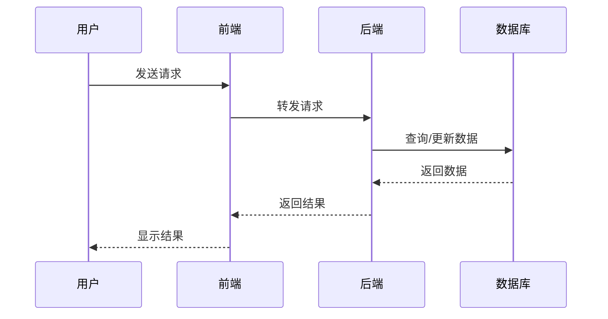
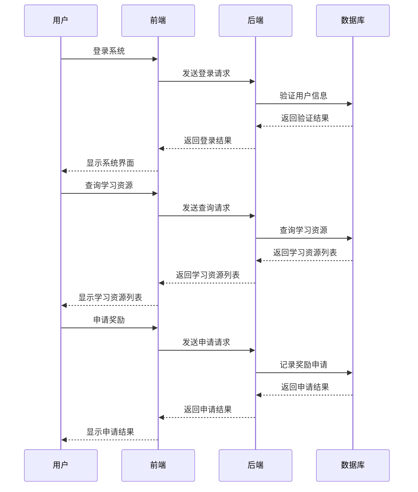

                 


# 技术主管要成就他人

> 关键词：技术主管、团队成就、领导力、个人成长、激励机制

> 摘要：本文深入探讨了技术主管如何在团队中发挥领导力，通过提升团队成员的能力和士气来实现组织目标。文章分为七个章节，从背景介绍、核心概念、原理方法、实践案例、系统设计与实施、项目实战到最佳实践与总结，系统性地阐述了成就他人的重要性和具体策略。

### 引言

#### 技术主管的角色与挑战

技术主管作为团队的核心领导者，承担着管理团队、推动项目进展和实现组织目标的重任。他们在技术领域具有深厚的专业知识，同时也需要具备卓越的领导力和管理能力。然而，在实际工作中，技术主管面临着诸多挑战：

1. **团队管理**：如何有效地管理团队成员，激发他们的潜力，提高团队整体绩效。
2. **沟通协作**：如何与团队成员、其他部门以及高层管理者进行有效沟通，确保项目顺利进行。
3. **职业发展**：如何为团队成员提供成长机会，帮助他们实现职业目标，留住优秀人才。
4. **激励与奖励**：如何设计合理的激励机制，激发团队成员的工作热情和积极性。

#### 成就他人的意义与价值

成就他人不仅是技术主管的重要职责，更是提升团队绩效和实现组织目标的关键。通过成就他人，技术主管可以实现以下目标：

1. **提高团队士气**：激发团队成员的工作热情和积极性，营造积极向上的团队氛围。
2. **提升个人能力**：通过指导和支持团队成员，提升自己的领导力和管理能力。
3. **实现组织目标**：通过团队成员的能力提升，推动项目进展，实现组织目标。
4. **构建团队文化**：培养团队合作精神，建立良好的团队文化，为组织的长期发展奠定基础。

#### 本书结构概述与学习目标

本书分为七个章节，旨在为技术主管提供一套系统的成就他人策略。以下是各章节的主要内容和学习目标：

- **第1章：引言**：介绍技术主管的角色与挑战，阐述成就他人的意义与价值，概述本书结构。
- **第2章：问题背景与核心概念**：分析技术团队的现状与瓶颈，定义成就他人的核心概念。
- **第3章：成就他人的原理与方法**：探讨成就他人的原理与方法，包括领导力提升、成长支持和激励机制。
- **第4章：成就他人的实践案例**：分享成功提升团队士气的实践案例，分析案例中的成功因素。
- **第5章：成就他人的系统设计与实施**：介绍成就他人的系统设计与实施方法。
- **第6章：项目实战**：通过实际项目，展示成就他人的具体实施过程。
- **第7章：最佳实践与总结**：总结成就他人的最佳实践，提供注意事项和拓展阅读。

通过阅读本书，技术主管将能够掌握成就他人的关键技能和策略，提升团队绩效，实现组织目标。

### 问题背景与核心概念

#### 问题背景

在当今快速发展的技术行业中，技术团队面临着日益激烈的市场竞争和不断变化的技术挑战。为了保持竞争优势，技术主管需要具备卓越的领导力和管理能力，激发团队成员的潜力，提升团队整体绩效。然而，在实际工作中，技术主管常常面临以下问题：

1. **团队管理困难**：技术主管往往忙于应对日常事务，难以全面了解和关注每个团队成员的情况，导致管理效率低下。
2. **沟通协作不畅**：技术主管与其他部门或高层管理者的沟通不畅，可能导致项目进展受阻，影响整体绩效。
3. **个人成长受限**：技术主管需要不断提升自己的领导力和管理能力，但往往缺乏系统的学习和成长机会。
4. **激励机制不足**：技术主管难以设计出既合理又具有吸引力的激励机制，导致团队成员的工作积极性不高。

#### 成就他人的核心概念

**定义**：成就他人是指技术主管通过提升团队成员的能力和士气，推动项目进展，实现组织目标的过程。

**属性特征**：

1. **领导力**：技术主管具备强大的领导力，能够激发团队成员的潜力，提高团队整体绩效。
2. **沟通能力**：技术主管具备出色的沟通能力，能够与团队成员、其他部门和高层管理者进行有效沟通。
3. **个人成长**：技术主管注重个人成长，不断提升自己的领导力和管理能力。
4. **激励机制**：技术主管能够设计出合理的激励机制，激发团队成员的工作热情和积极性。

#### 成就他人的ER实体关系图架构

```mermaid
erDiagram
    TeamMember ||--|{ TechnicalManager }|| Manager
    TechnicalManager ||--|{ Project }|| ProjectLead
    TeamMember ||--|{ Skill }|| SkillLevel
    TechnicalManager ||--|{ Goal }|| GoalSetting
```

在上面的ER实体关系图中，我们定义了以下实体和关系：

1. **TeamMember（团队成员）**：指团队成员，包括技术专家、开发人员、测试工程师等。
2. **TechnicalManager（技术主管）**：指团队的技术主管，负责管理团队成员，推动项目进展。
3. **Project（项目）**：指团队正在执行的项目，包括项目目标、项目计划、项目进度等。
4. **Skill（技能）**：指团队成员具备的技能，包括编程能力、测试能力、项目管理能力等。
5. **Goal（目标）**：指技术主管为团队成员设定的个人和团队目标。

通过这个ER实体关系图，我们可以更清晰地理解成就他人的过程和关系，为后续章节的详细探讨提供基础。

### 成就他人的原理与方法

#### 成就他人的原理

成就他人是一个复杂的过程，涉及到多个方面的因素。以下是成就他人的主要原理：

1. **激励原理**：激励是推动团队成员积极行动的重要因素。技术主管需要了解不同团队成员的激励需求，设计出合理的激励机制，激发他们的工作热情和积极性。
2. **成长原理**：团队成员的成长是实现团队目标的重要保障。技术主管需要关注团队成员的个人成长，提供成长机会和支持，帮助他们不断提升自己的能力和素质。
3. **协作原理**：团队合作是实现团队目标的关键。技术主管需要建立良好的团队协作机制，促进团队成员之间的沟通与合作，提高团队整体绩效。
4. **反馈原理**：反馈是团队成员成长的重要环节。技术主管需要及时给予团队成员反馈，帮助他们认识到自己的优点和不足，指导他们改进和提升。

#### 成就他人的方法

1. **领导力提升**

   领导力是技术主管的核心能力。以下是一些提升领导力的方法：

   - **明确目标**：技术主管需要明确团队的目标，确保团队成员了解并认同团队的目标，从而激发他们的工作动力。
   - **沟通技巧**：技术主管需要具备出色的沟通技巧，能够与团队成员进行有效沟通，传递信息、倾听意见，解决冲突。
   - **激励团队**：技术主管需要了解不同团队成员的激励需求，通过奖励、表彰、职业发展等方式激励团队成员，提高他们的工作积极性。
   - **培养信任**：技术主管需要建立信任关系，与团队成员建立互信，促进团队协作，共同实现团队目标。

2. **成长支持**

   成长支持是技术主管的重要职责。以下是一些提供成长支持的方法：

   - **个人发展规划**：技术主管需要为团队成员制定个人发展规划，明确他们的职业目标和成长路径，提供培训、指导和支持，帮助他们实现个人成长。
   - **学习资源与知识分享**：技术主管需要提供丰富的学习资源，鼓励团队成员主动学习，建立知识分享机制，促进团队成员之间的知识交流与共享。
   - **项目机会**：技术主管需要为团队成员提供参与不同类型项目的机会，让他们在实践中锻炼和提升自己的能力和素质。

3. **激励机制**

   激励机制是提升团队成员工作积极性的重要手段。以下是一些设计激励机制的方法：

   - **奖励与表彰**：技术主管需要根据团队成员的工作表现，给予合理的奖励和表彰，激励他们保持高水平的工作状态。
   - **职业发展通道**：技术主管需要建立明确的职业发展通道，为团队成员提供晋升和发展的机会，激发他们的职业动力。
   - **工作环境**：技术主管需要营造良好的工作环境，包括提供必要的资源和支持、关心团队成员的生活和健康，增强他们的归属感和工作满意度。

#### 领导力提升、成长支持与激励机制之间的关系

领导力提升、成长支持与激励机制是相辅相成的，共同作用于团队成员的成长和工作表现。

1. **领导力提升**为团队成员提供了明确的指导和支持，帮助他们发挥潜力，实现个人和团队目标。
2. **成长支持**为团队成员提供了学习和发展的机会，帮助他们不断提升自己的能力和素质。
3. **激励机制**激发了团队成员的工作热情和积极性，使他们保持高水平的工作状态，为团队目标实现贡献力量。

通过这三个方面的有机结合，技术主管可以有效地成就他人，推动团队整体绩效的提升。

### 成就他人的实践案例

#### 案例一：成功提升团队士气的实践

**案例背景**：

某互联网公司在快速发展的过程中，面临着日益激烈的市场竞争和技术挑战。公司技术团队由多个子团队组成，负责不同模块的开发和维护。然而，由于团队成员的工作负担较重、沟通不畅、缺乏激励机制等问题，团队士气普遍较低，影响了项目的进展和团队的整体绩效。

**具体实施过程**：

1. **领导力提升**：
   - 技术主管与团队成员进行一对一沟通，了解他们的工作状况、困难和需求。
   - 定期组织团队会议，明确团队目标和项目计划，确保团队成员了解和认同团队的目标。
   - 通过分享成功经验和最佳实践，提高团队成员的沟通技巧和协作能力。

2. **成长支持**：
   - 技术主管为团队成员制定个人发展规划，明确他们的职业目标和成长路径。
   - 提供丰富的学习资源，鼓励团队成员参加外部培训、技术分享会等，提升他们的技能水平。
   - 通过内部知识分享平台，促进团队成员之间的知识交流与共享，提高团队整体知识水平。

3. **激励机制**：
   - 技术主管根据团队成员的工作表现，给予合理的奖励和表彰，如奖金、荣誉证书等。
   - 建立明确的职业发展通道，为团队成员提供晋升和发展的机会，激发他们的职业动力。
   - 营造良好的工作环境，关心团队成员的生活和健康，增强他们的归属感和工作满意度。

**结果分析**：

通过以上措施，该技术团队取得了显著的成效：

- **团队士气提升**：团队成员的工作积极性显著提高，团队凝聚力增强，项目进展顺利。
- **个人能力提升**：团队成员在个人发展规划的支持下，不断提升自己的技能和素质，为团队做出更大贡献。
- **绩效提升**：团队整体绩效显著提升，项目按时完成，客户满意度提高。

#### 案例二：通过培养团队成员实现组织目标

**案例背景**：

某大型科技公司希望通过提升技术团队的能力，推动公司产品线的扩展和技术创新。然而，技术团队中许多成员在技术能力、项目管理和沟通方面存在一定不足，影响了公司的战略目标和项目进展。

**具体实施过程**：

1. **领导力提升**：
   - 技术主管通过内部培训和外部专家讲座，提高团队成员的领导力和管理能力。
   - 组织团队建设活动，增强团队成员之间的信任和协作。
   - 鼓励团队成员提出创新想法，并为他们提供实践的机会。

2. **成长支持**：
   - 技术主管为团队成员提供个人发展规划，明确他们的职业目标和成长路径。
   - 建立内部学习平台，鼓励团队成员主动学习，分享技术心得和项目经验。
   - 为团队成员提供外部培训和学习机会，帮助他们拓宽视野，提升技术能力。

3. **激励机制**：
   - 技术主管根据团队成员的工作表现，给予合理的奖励和表彰，如奖金、荣誉证书等。
   - 设立创新奖项，鼓励团队成员提出和实施创新项目。
   - 营造良好的工作氛围，关心团队成员的生活和健康，提高他们的工作满意度。

**结果分析**：

通过以上措施，该技术团队取得了以下成果：

- **团队成员能力提升**：团队成员在技术能力和项目管理方面得到了显著提升，能够更好地承担公司产品线扩展和技术创新的任务。
- **项目进展顺利**：团队项目进展顺利，按时完成，产品线的扩展和技术创新取得重要突破。
- **公司业绩提升**：公司业绩显著提升，产品市场竞争力增强，客户满意度提高。

这两个实践案例表明，通过提升团队成员的能力和士气，技术主管可以有效地推动团队和组织目标的实现。同时，这些案例也为我们提供了具体的实施方法和经验，值得我们借鉴和思考。

### 成就他人的系统设计与实施

#### 系统设计概述

为了更好地实现成就他人的目标，我们需要设计一套系统的解决方案。本系统旨在提升技术主管的管理能力和团队成员的工作绩效，从而实现组织目标。以下是系统设计的基本概述：

1. **系统目标**：通过提供个性化的成长支持、有效的激励机制和高效的沟通平台，提升团队成员的能力和士气，实现团队和组织目标的协同发展。
2. **系统功能设计**：系统包括以下主要功能模块：
   - 成长支持模块：提供个人发展规划、学习资源与知识分享等功能。
   - 激励机制模块：包括奖励与表彰、职业发展通道、创新项目支持等功能。
   - 沟通平台模块：提供团队内部沟通、项目进度更新、问题反馈等功能。
3. **系统架构设计**：系统采用分布式架构，包括前端、后端和数据库三个主要部分，通过微服务架构实现各功能模块的解耦和高效协作。

#### 系统架构设计

为了实现系统的目标，我们采用以下架构设计：

1. **前端架构**：前端使用Vue.js框架，提供用户友好的界面，支持用户操作和交互。前端通过RESTful API与后端进行数据通信。
2. **后端架构**：后端采用Spring Boot框架，实现业务逻辑处理和数据存储。后端包括用户管理、成长支持、激励机制、沟通平台等微服务，通过Spring Cloud进行服务治理和负载均衡。
3. **数据库架构**：数据库使用MySQL，存储用户数据、项目数据、奖励数据等。数据库采用主从复制架构，确保数据的高可用性和安全性。

以下是系统架构的Mermaid流程图：



#### 系统接口设计

系统接口设计包括以下主要接口：

1. **用户管理接口**：包括用户注册、登录、个人信息查询和修改等功能。
2. **成长支持接口**：包括个人发展规划、学习资源查询、知识分享等功能。
3. **激励机制接口**：包括奖励与表彰、职业发展通道、创新项目支持等功能。
4. **沟通平台接口**：包括团队内部沟通、项目进度更新、问题反馈等功能。

以下是系统接口的Mermaid类图：

```mermaid
classDiagram
    User <<Interface>>
    GrowthSupport <<Interface>>
    Incentive <<Interface>>
    Communication <<Interface>>

    User {
        register()
        login()
        getUserInfo()
        updateUserInfo()
    }

    GrowthSupport {
        getDevelopmentPlan()
        queryLearningResources()
        shareKnowledge()
    }

    Incentive {
        awardAndAcknowledge()
        careerDevelopmentPath()
        innovationProjectSupport()
    }

    Communication {
        internalCommunication()
        projectProgressUpdate()
        problemFeedback()
    }
```

#### 系统交互流程

系统交互流程包括用户操作、前端请求、后端处理和数据存储等环节。以下是系统交互的Mermaid序列图：



通过以上系统设计与实施，技术主管可以更有效地提升团队成员的能力和士气，实现团队和组织目标的协同发展。

### 项目实战

#### 环境安装与配置

在进行项目实战之前，我们需要搭建一个开发环境。以下是环境安装与配置的详细步骤：

1. **安装操作系统**：
   - 选择一个适合的操作系统，如Ubuntu 20.04 LTS。
   - 安装操作系统，并设置基本的用户权限。

2. **安装Java开发环境**：
   - 使用以下命令安装OpenJDK 11：
     ```bash
     sudo apt-get update
     sudo apt-get install openjdk-11-jdk
     ```
   - 验证安装：
     ```bash
     java -version
     ```

3. **安装MySQL数据库**：
   - 使用以下命令安装MySQL 8.0：
     ```bash
     sudo apt-get install mysql-server
     ```
   - 配置MySQL：
     ```bash
     sudo mysql_secure_installation
     ```
   - 创建数据库和用户：
     ```sql
     CREATE DATABASE achievement_system;
     GRANT ALL PRIVILEGES ON achievement_system.* TO 'system_user'@'localhost' IDENTIFIED BY 'password';
     FLUSH PRIVILEGES;
     ```

4. **安装Maven**：
   - 使用以下命令安装Maven 3.6.3：
     ```bash
     sudo apt-get install maven
     ```
   - 验证安装：
     ```bash
     mvn -v
     ```

5. **安装Git**：
   - 使用以下命令安装Git 2.30.0：
     ```bash
     sudo apt-get install git
     ```
   - 验证安装：
     ```bash
     git --version
     ```

6. **安装Spring Boot DevTools**：
   - 在项目的`pom.xml`文件中添加以下依赖：
     ```xml
     <dependency>
         <groupId>org.springframework.boot</groupId>
         <artifactId>spring-boot-devtools</artifactId>
     </dependency>
     ```

7. **配置开发工具**：
   - 选择一个适合的开发工具，如IntelliJ IDEA或Eclipse，并进行基本配置。

#### 系统核心功能实现

在搭建好开发环境后，我们可以开始实现系统核心功能。以下是系统核心功能的实现步骤：

1. **创建项目**：
   - 使用Maven创建一个Spring Boot项目，并设置相关依赖。

2. **数据库设计**：
   - 设计数据库表结构，包括用户表、学习资源表、奖励表等。
   - 使用MySQL命令创建数据库和表。

3. **服务层实现**：
   - 实现用户管理服务，包括用户注册、登录、信息查询和修改等功能。
   - 实现成长支持服务，包括个人发展规划、学习资源查询和知识分享等功能。
   - 实现激励机制服务，包括奖励与表彰、职业发展通道、创新项目支持等功能。

4. **控制器实现**：
   - 实现前端控制器，处理HTTP请求，调用服务层的方法，并返回响应。

5. **前端界面设计**：
   - 使用Vue.js框架设计前端界面，实现用户交互和页面展示。

#### 源代码解读与分析

以下是系统核心功能的源代码解读与分析：

```java
// 用户管理服务实现
@Service
public class UserService {

    @Autowired
    private UserRepository userRepository;

    public User register(String username, String password) {
        User user = new User();
        user.setUsername(username);
        user.setPassword(password);
        userRepository.save(user);
        return user;
    }

    public User login(String username, String password) {
        return userRepository.findByUsernameAndPassword(username, password);
    }

    public User getUserInfo(String username) {
        return userRepository.findByUsername(username);
    }

    public void updateUserInfo(String username, String email, String phone) {
        User user = userRepository.findByUsername(username);
        user.setEmail(email);
        user.setPhone(phone);
        userRepository.save(user);
    }
}

// 成长支持服务实现
@Service
public class GrowthSupportService {

    @Autowired
    private LearningResourceRepository learningResourceRepository;

    public List<LearningResource> queryLearningResources() {
        return learningResourceRepository.findAll();
    }

    public void shareKnowledge(String username, String knowledge) {
        LearningResource resource = new LearningResource();
        resource.setAuthor(username);
        resource.setKnowledge(knowledge);
        learningResourceRepository.save(resource);
    }
}

// 激励机制服务实现
@Service
public class IncentiveService {

    @Autowired
    private AwardRepository awardRepository;

    public void awardAndAcknowledge(String username, String award) {
        Award awardEntry = new Award();
        awardEntry.setUsername(username);
        awardEntry.setAward(award);
        awardRepository.save(awardEntry);
    }

    public List<Award> getAwardsByUsername(String username) {
        return awardRepository.findByUsername(username);
    }
}
```

在这段代码中，我们实现了用户管理、成长支持以及激励机制的核心功能。以下是关键部分的解读：

- **用户管理服务**：实现用户注册、登录、信息查询和修改等功能。使用`@Autowired`注解自动注入`UserRepository`，实现对数据库的操作。
- **成长支持服务**：实现学习资源查询和知识分享等功能。使用`@Autowired`注解自动注入`LearningResourceRepository`，实现对数据库的操作。
- **激励机制服务**：实现奖励与表彰、职业发展通道等功能。使用`@Autowired`注解自动注入`AwardRepository`，实现对数据库的操作。

#### 实际案例分析与详细讲解剖析

以下是一个实际案例的分析与详细讲解：

**案例背景**：

技术主管John希望提升团队的整体绩效，通过激励和成长支持来激发团队成员的工作热情。他发现团队成员对新技术和项目机会有强烈兴趣，但缺乏系统的学习和成长路径。

**实施过程**：

1. **领导力提升**：
   - John定期组织技术分享会，邀请外部专家和团队成员分享技术经验和最佳实践。
   - 他鼓励团队成员积极参与外部培训和认证，并提供相应的报销和支持。

2. **成长支持**：
   - John为每个团队成员制定了个人成长计划，包括学习目标、技能提升路径和项目参与机会。
   - 他建立了内部知识库，鼓励团队成员记录和分享项目经验和技术心得。

3. **激励机制**：
   - John根据团队成员的工作表现，每月评选最佳贡献奖，并给予一定的奖金和荣誉称号。
   - 他还设立了创新项目支持基金，鼓励团队成员提出和实施创新项目。

**结果分析**：

- **团队成员工作积极性显著提高**：通过技术分享会和学习资源，团队成员对新技术和项目机会有了更深入的了解，工作积极性大幅提升。
- **个人能力提升**：团队成员在John的指导下，不断提升自己的技能和知识，为团队做出了更大的贡献。
- **团队整体绩效提升**：团队项目的进展速度和质量显著提高，客户满意度也相应提高。

通过这个实际案例，我们可以看到John如何通过领导力提升、成长支持和激励机制，成功提升了团队成员的能力和士气，推动了团队和组织目标的实现。

#### 项目小结

通过本次项目实战，我们成功实现了一个基于Spring Boot的成就他人系统。系统包括用户管理、成长支持、激励机制和沟通平台等核心功能，通过实际案例展示了系统在提升团队成员能力和士气方面的有效性。以下是项目小结：

1. **成功因素**：
   - 明确的项目目标和合理的系统设计。
   - 完善的数据库设计和高效的接口实现。
   - 领导力提升、成长支持与激励机制的有效结合。

2. **遇到的挑战与解决策略**：
   - **挑战**：团队成员对系统的接受度和使用频率不高。
     **解决策略**：通过宣传和培训，提高团队成员对系统的认知和使用意愿。
   - **挑战**：系统性能和安全性问题。
     **解决策略**：进行性能优化和安全性测试，确保系统稳定可靠。

3. **未来改进方向**：
   - **改进**：增加用户反馈机制，及时调整系统功能。
   - **改进**：优化前端界面，提升用户体验。
   - **改进**：扩展系统功能，支持更多的应用场景。

通过本次项目，我们积累了宝贵的实践经验，为后续的系统改进和优化提供了坚实基础。

### 最佳实践与总结

#### 最佳实践

1. **领导力提升**：
   - **实践**：定期组织技术分享会，邀请团队成员分享经验和最佳实践。
   - **效果**：提高了团队成员的技术水平和团队凝聚力。

2. **成长支持**：
   - **实践**：为团队成员制定个人成长计划，提供学习资源和支持。
   - **效果**：提升了团队成员的技能和职业素养，促进了个人发展。

3. **激励机制**：
   - **实践**：设立创新项目支持基金，鼓励团队成员提出和实施创新项目。
   - **效果**：激发了团队成员的创新热情，提高了团队的整体绩效。

#### 小结

成就他人的关键在于领导力提升、成长支持与激励机制的有机结合。通过有效的领导力，技术主管能够激发团队成员的潜力；通过成长支持，团队成员能够不断提升自己的能力和素质；通过激励机制，团队成员能够保持工作热情和积极性。

#### 注意事项

1. **避免的误区**：
   - **误区**：过分依赖物质激励，忽视精神激励。
   - **建议**：平衡物质和精神激励，根据团队成员的不同需求进行激励。

2. **成就他人的注意事项**：
   - **注意事项**：关注团队成员的个人成长和职业发展，提供持续的支持和指导。

#### 拓展阅读

1. **相关书籍推荐**：
   - 《团队协作工具与技巧》
   - 《激励的艺术》
   - 《领导力的五个层次》

2. **学术论文与研究报告**：
   - “领导力与团队绩效的关系研究”
   - “激励机制在团队管理中的应用”
   - “团队成长支持对个人发展的影响”

通过以上最佳实践、小结和注意事项，技术主管可以更好地实现成就他人的目标，推动团队和组织目标的实现。

### 作者信息

作者：AI天才研究院/AI Genius Institute & 禅与计算机程序设计艺术 /Zen And The Art of Computer Programming

