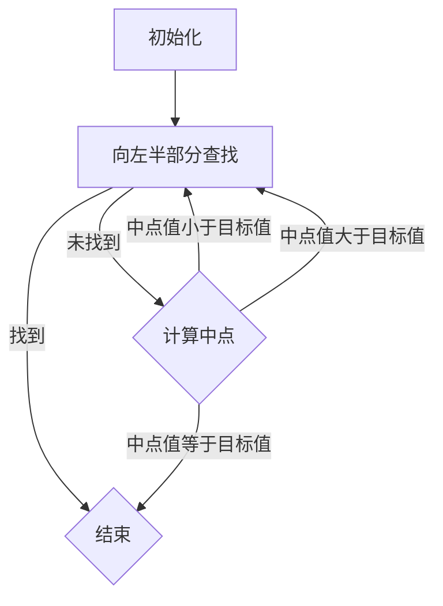
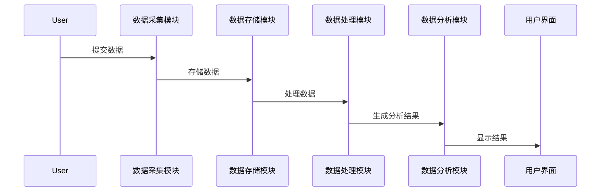
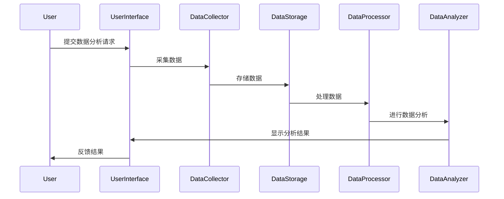

                 

### 技术人才培养的系统方法

---

#### 关键词：
- 技术人才培养
- 系统方法
- 教育体系
- 实践性
- 教学实施

#### 摘要：
本文将探讨技术人才培养的系统方法，包括需求分析、课程设计、教学实施、实践锻炼、评估与反馈以及持续改进等关键步骤，旨在为计算机技术领域的教育培养提供科学、合理且具有前瞻性的解决方案。

---

### 1.1 引言

在当今快速发展的信息技术时代，计算机技术的创新和应用已经深刻地改变了我们的生活方式和社会结构。计算机技术涉及广泛的领域，包括软件开发、系统架构、数据分析、人工智能等，每一个领域都对技术人才提出了独特的要求。然而，传统的计算机技术教育培养模式往往无法满足这些需求，导致人才培养与产业需求严重不匹配。

这种不匹配主要表现在以下几个方面：

1. **人才培养与产业需求脱节**：许多计算机技术人才在进入职场后，发现学校所学的知识并不能直接应用于实际工作中，导致学习与就业之间存在巨大的鸿沟。
2. **教育体系滞后**：计算机技术的发展速度极快，而传统的教育体系往往难以及时更新课程内容，导致学生所学知识严重滞后于行业发展。
3. **教学方法和手段单一**：传统的教学方法主要依赖于教师的讲授和学生被动接受，缺乏互动性和实践性，难以激发学生的学习兴趣和创造力。
4. **课程设置不合理**：目前的计算机课程设置往往过于理论化，缺乏系统性和针对性，无法培养学生的综合能力和解决实际问题的能力。

为了解决这些问题，我们需要一种全新的、系统的方法来培养计算机技术人才。这种方法应该具备系统性、实践性、针对性、前瞻性等特点，能够从整体上规划和设计人才培养方案，确保各个环节之间的协调和衔接。

本文将围绕“技术人才培养的系统方法”展开讨论，详细阐述这一方法的各个关键步骤，并提供具体的实施策略和案例分析。希望通过本文的探讨，能够为计算机技术教育领域提供一些有价值的思考和参考。

### 1.2 背景

计算机技术作为现代社会的重要驱动力，其发展和应用已经渗透到各个行业和领域。从最初的计算机硬件和软件，到如今的人工智能、大数据、云计算等新兴技术，计算机技术的不断进步不仅改变了人们的生活方式，也为各行各业带来了新的发展机遇。然而，随着技术领域的不断扩展和深化，计算机技术教育也面临着前所未有的挑战。

首先，从社会发展的角度来看，计算机技术的快速迭代使得行业对技术人才的需求也发生了根本性的变化。过去，计算机技术人才的培养主要侧重于计算机科学的基础知识，如数据结构、算法、操作系统等。然而，随着人工智能、大数据等新兴领域的兴起，行业对人才的要求逐渐从单一的技能转向多学科的交叉融合。这意味着，计算机技术人才不仅需要掌握扎实的计算机科学基础，还需要了解数学、统计学、心理学等跨学科的知识。

其次，从教育体系的现状来看，现有的计算机技术教育培养模式存在诸多问题。许多高校和教育培训机构的课程设置仍然停留在传统的计算机科学领域，缺乏对新兴技术的关注和整合。此外，教学方法和手段也较为单一，主要依赖于课堂讲授和课本学习，缺乏实践性和互动性。这种教育模式难以激发学生的学习兴趣和创造力，导致学生在毕业后难以迅速适应职场环境。

再次，从产业需求的角度来看，计算机技术人才的培养往往滞后于市场需求。企业在招聘计算机技术人才时，常常面临技能匹配度不高的问题。一方面，高校和培训机构培养的学生在知识和技能方面与企业的实际需求存在差异；另一方面，学生在校期间缺乏实际项目的锻炼，导致其动手能力和解决实际问题的能力较弱。这种情况下，企业不仅需要花费更多的时间和资源进行培训，还可能因为人才短缺而影响业务发展。

最后，从学生自身发展的角度来看，许多学生在学习计算机技术时，往往因为缺乏明确的学习目标和动力，导致学习效果不佳。此外，由于计算机技术的复杂性和不断变化的特点，学生在学习过程中容易产生挫败感和迷茫感，影响其学习积极性和自信心。

综上所述，计算机技术教育面临着人才培养与产业需求不匹配、教育体系滞后、教学方法单一、课程设置不合理等多方面的问题。这些问题不仅影响了计算机技术人才的培养质量，也对整个行业的发展产生了不利影响。因此，有必要探索一种全新的、系统的方法来培养计算机技术人才，以应对当前和未来社会发展的需求。

### 1.3 问题描述

在了解了计算机技术教育所面临的各种问题之后，我们需要对这些问题进行深入的分析和描述，以便找出解决这些问题的有效途径。

首先，从人才培养与产业需求不匹配的角度来看，主要问题在于以下几个方面：

1. **技能与岗位要求不匹配**：计算机技术人才的培养往往侧重于理论知识的传授，忽视了实际应用技能的培养。这使得毕业生在进入工作岗位后，难以迅速适应实际项目需求，导致企业招聘难、用人难的问题。

2. **知识更新滞后**：计算机技术的发展速度非常快，很多教育体系在课程设置和教学内容上无法跟上技术的发展步伐。这导致学生所学知识严重滞后于行业实际需求，难以满足企业的要求。

3. **创新能力不足**：传统的教育模式过于注重知识的传授，缺乏对学生创新能力的培养。这使得许多计算机技术人才在面临新的技术和问题时，缺乏独立思考和解决问题的能力。

其次，从教育体系滞后的角度来看，主要问题表现在以下几个方面：

1. **课程内容陈旧**：许多高校和培训机构的教学内容仍然停留在几十年前的计算机科学基础阶段，缺乏对新兴技术和应用领域的关注和整合。

2. **教学方法单一**：传统的教学方法主要依赖于教师的讲授和学生被动接受，缺乏互动性和实践性。这种教育模式难以激发学生的学习兴趣和创造力，影响学习效果。

3. **师资力量不足**：随着计算机技术的快速发展，对计算机教师的专业素质和教学能力提出了更高的要求。然而，很多高校和培训机构在师资队伍建设方面存在短板，难以提供高质量的教育资源。

再次，从教学方法单一的角度来看，主要问题在于以下几个方面：

1. **缺乏实践环节**：传统的计算机技术教育往往侧重于理论知识的传授，缺乏实践性的教学环节。这使得学生在学习过程中难以将所学知识应用于实际项目中，影响其动手能力和解决实际问题的能力。

2. **互动性不足**：在传统的教学环境中，学生往往处于被动接受知识的状态，缺乏与教师和其他同学的互动。这种教学方式难以激发学生的学习兴趣和参与度，影响学习效果。

3. **教学资源有限**：许多高校和培训机构的教学资源有限，如实验设备、软件工具等，无法提供足够的实践机会。这限制了学生的实践能力培养，导致其技能水平难以提高。

最后，从课程设置不合理的角度来看，主要问题表现在以下几个方面：

1. **课程内容过于理论化**：许多计算机技术课程的设置过于理论化，缺乏对实际应用能力的培养。这使得学生在学习过程中难以将所学知识应用于实际工作中，影响其职业发展。

2. **课程设置缺乏系统性**：当前许多教育机构在课程设置上缺乏系统性，课程之间缺乏衔接和整合。这导致学生在学习过程中容易产生混乱，影响学习效果。

3. **课程难度不适当**：部分计算机技术课程的难度设置不合理，过于简单或过于复杂。这既会影响学生的学习积极性，也会影响其学习效果。

综上所述，计算机技术教育在人才培养与产业需求不匹配、教育体系滞后、教学方法单一、课程设置不合理等方面存在诸多问题。这些问题不仅影响了计算机技术人才的培养质量，也对整个行业的发展产生了不利影响。因此，我们需要找到一种有效的解决方法，以应对这些挑战。

### 1.4 问题解决

为了解决计算机技术教育中所面临的问题，我们需要一种系统性的方法来培养计算机技术人才。这种方法应涵盖需求分析、课程设计、教学实施、实践锻炼、评估与反馈以及持续改进等关键步骤，以确保人才素质与产业需求的高度匹配。

#### 1.4.1 需求分析

需求分析是技术人才培养的首要步骤。通过需求分析，我们能够深入了解培养目标的需求，明确所需的知识和技能。需求分析包括以下几个方面：

1. **行业需求**：分析不同行业对计算机技术人才的需求，包括技术领域、岗位要求、技能需求等。
2. **技术趋势**：跟踪最新的技术趋势和发展动态，确保课程内容能够与时俱进。
3. **企业调研**：通过企业调研，了解企业在招聘和技术应用方面的具体要求，为课程设计提供实际依据。
4. **学生意愿**：了解学生对未来职业发展的期望和意愿，为学生选择适合自己的培养路径提供参考。

#### 1.4.2 课程设计

根据需求分析的结果，设计出科学合理的课程体系。课程体系应包含理论课程和实践课程，确保学生能够全面掌握所需的知识和技能。课程设计应考虑以下几个方面：

1. **基础课程**：设置计算机科学基础课程，如数据结构、算法、操作系统等，为学生打下扎实的理论基础。
2. **专业课程**：根据不同领域的技术需求，设置专业课程，如人工智能、大数据分析、软件开发等。
3. **实践课程**：设置实验课、项目课程等，通过实际操作让学生掌握技能，提高动手能力。
4. **选修课程**：提供丰富的选修课程，让学生根据自己的兴趣和职业规划选择学习方向。

#### 1.4.3 教学实施

教学实施是人才培养的关键环节。采用多种教学方法和手段，如项目驱动教学、案例教学、互动教学等，提高学生的学习兴趣和参与度。教学实施应考虑以下几个方面：

1. **项目驱动教学**：通过实际项目让学生在实践中学习，提高学生的解决实际问题的能力。
2. **案例教学**：通过案例分析，让学生了解技术在实际应用中的情况，提高学生的应用能力。
3. **互动教学**：采用讨论、讲座、小组合作等形式，提高学生的参与度和学习效果。
4. **在线教学**：利用在线平台和工具，提供灵活的学习资源和学习方式，满足学生的多样化学习需求。

#### 1.4.4 实践锻炼

通过实际项目的开发，让学生在实践中提升技能。项目应具备一定的挑战性，能够锻炼学生的综合能力。实践锻炼包括以下几个方面：

1. **课程项目**：将实际项目融入到课程教学中，让学生在课堂上进行项目开发。
2. **校外实践**：组织学生到企业进行实习，了解企业的实际工作环境和技术应用。
3. **创新竞赛**：鼓励学生参加各类技术竞赛，通过竞赛提高学生的实践能力和创新意识。

#### 1.4.5 评估与反馈

对学生的学习和成果进行定期评估，及时给予反馈，帮助其找到不足并进行改进。评估与反馈应考虑以下几个方面：

1. **过程评估**：在学生学习过程中进行定期评估，了解其学习进度和效果。
2. **成果评估**：通过项目成果、考试等方式，评估学生的实际能力和水平。
3. **反馈机制**：建立反馈机制，及时向学生反馈评估结果，提供改进建议。
4. **个性化指导**：根据学生的评估结果，提供个性化的学习指导和帮助。

#### 1.4.6 持续改进

根据评估和反馈的结果，不断优化人才培养方案，确保其适应社会发展的需求。持续改进包括以下几个方面：

1. **课程调整**：根据行业需求和技术趋势，及时调整课程内容，使其与时俱进。
2. **教学方法改进**：根据教学反馈，改进教学方法和手段，提高教学效果。
3. **师资队伍建设**：加强师资队伍建设，提高教师的专业素质和教学能力。
4. **资源整合**：整合校内外的教育资源，为学生提供丰富的学习资源和支持。

通过上述六个关键步骤，我们可以构建一个系统性的技术人才培养方案，确保学生能够全面掌握所需的知识和技能，满足行业和企业的需求。这种系统方法不仅能够解决当前计算机技术教育中的问题，也为未来的技术人才培养提供了可行的思路和方案。

### 1.5 边界与外延

在实施技术人才培养的系统方法时，需要明确其适用范围和边界，以便在实际操作中能够更加有效地应用这一方法。

#### 1.5.1 适用范围

“技术人才培养的系统方法”主要适用于计算机技术相关领域的教育培养，包括但不限于以下领域：

1. **软件开发**：软件开发是计算机技术的一个重要分支，涉及编程语言、软件开发框架、软件工程等方面。通过系统方法，可以培养出具备扎实编程能力和软件开发经验的软件工程师。

2. **系统架构**：系统架构涉及计算机系统的设计、实现和优化，包括系统性能、可扩展性、可靠性等方面。通过系统方法，可以培养出具备系统设计和架构能力的高级系统架构师。

3. **数据分析**：数据分析涉及数据清洗、数据挖掘、统计分析等方面，是大数据和人工智能领域的重要组成部分。通过系统方法，可以培养出具备数据分析能力和业务理解能力的专业数据分析师。

4. **人工智能**：人工智能涉及机器学习、深度学习、自然语言处理等方面，是当前技术领域的一个热点。通过系统方法，可以培养出具备人工智能理论基础和实际应用能力的人工智能专家。

#### 1.5.2 适用边界

虽然“技术人才培养的系统方法”主要适用于计算机技术相关领域，但其核心思想和方法也可以应用于其他技术领域，如通信技术、网络技术等。具体来说，以下边界需要明确：

1. **技术领域**：虽然核心方法适用于计算机技术，但在其他技术领域，如通信技术、网络技术等，需要结合具体技术特点和需求进行适当调整。

2. **教育层次**：该系统方法不仅适用于高校和培训机构，也适用于其他教育层次，如中小学、职业培训等。在不同教育层次，需要根据学生的认知水平和学习能力，调整课程内容和教学方法。

3. **教育形式**：该系统方法不仅适用于传统课堂教学，也可以应用于在线教育、远程教育等形式。在在线教育中，需要充分利用网络资源和互动工具，提高教学效果。

#### 1.5.3 外延拓展

除了上述适用范围和边界外，技术人才培养的系统方法还可以在以下方面进行拓展：

1. **跨学科融合**：在计算机技术与其他学科的融合领域，如生物信息学、金融科技等，通过系统方法可以培养出具备多学科背景的复合型人才。

2. **国际交流与合作**：通过国际交流和合作，引进先进的教育理念和教学方法，提升人才培养的质量和水平。

3. **创新创业教育**：在技术人才培养中，加强创新创业教育，培养学生的创新思维和创业能力，促进科技成果转化。

4. **职业发展与就业指导**：结合技术人才的职业发展和就业需求，提供职业规划、求职技巧等方面的指导和帮助，提高学生的就业竞争力。

通过明确适用范围、边界和外延拓展，可以更好地将技术人才培养的系统方法应用于实际教育培养中，为计算机技术领域和其他技术领域的人才培养提供有效的解决方案。

### 1.6 概念结构与核心要素组成

在技术人才培养的系统方法中，有几个核心概念和要素组成，这些概念和要素相互作用，共同构成了一个完整的教育培养体系。以下是对这些核心概念和要素的详细描述：

#### 1.6.1 需求分析

需求分析是技术人才培养的基础和起点。通过对行业需求、技术趋势、企业调研和学生意愿等多方面的深入分析，需求分析能够明确培养目标所需的知识和技能，为课程设计和教学实施提供科学依据。

**核心要素：**

- **行业需求**：分析不同行业对技术人才的具体需求，包括技术领域、岗位要求、技能需求等。
- **技术趋势**：跟踪最新的技术动态和发展趋势，确保课程内容能够与时俱进。
- **企业调研**：通过与企业合作或调研，了解企业在招聘和技术应用方面的具体要求。
- **学生意愿**：了解学生对未来职业发展的期望和意愿，为课程设计和个性化指导提供参考。

#### 1.6.2 课程设计

课程设计是技术人才培养的核心环节。根据需求分析的结果，设计科学合理的课程体系，确保学生能够全面掌握所需的知识和技能。课程设计应涵盖基础课程、专业课程、实践课程和选修课程。

**核心要素：**

- **基础课程**：设置计算机科学基础课程，如数据结构、算法、操作系统等，为学生打下扎实的理论基础。
- **专业课程**：根据不同技术领域，设置专业课程，如人工智能、大数据分析、软件开发等。
- **实践课程**：设置实验课、项目课程等，通过实际操作让学生掌握技能，提高动手能力。
- **选修课程**：提供丰富的选修课程，让学生根据自己的兴趣和职业规划选择学习方向。

#### 1.6.3 教学实施

教学实施是将课程内容转化为学生实际技能的关键环节。通过采用多样化的教学方法和手段，提高学生的学习兴趣和参与度，确保教学效果。

**核心要素：**

- **项目驱动教学**：通过实际项目让学生在实践中学习，提高学生的解决实际问题的能力。
- **案例教学**：通过案例分析，让学生了解技术在实际应用中的情况，提高学生的应用能力。
- **互动教学**：采用讨论、讲座、小组合作等形式，提高学生的参与度和学习效果。
- **在线教学**：利用在线平台和工具，提供灵活的学习资源和学习方式，满足学生的多样化学习需求。

#### 1.6.4 实践锻炼

实践锻炼是提升学生技能的重要手段。通过实际项目的开发和实践，让学生在真实的情境中锻炼技能，提高解决实际问题的能力。

**核心要素：**

- **课程项目**：将实际项目融入到课程教学中，让学生在课堂上进行项目开发。
- **校外实践**：组织学生到企业进行实习，了解企业的实际工作环境和技术应用。
- **创新竞赛**：鼓励学生参加各类技术竞赛，通过竞赛提高学生的实践能力和创新意识。

#### 1.6.5 评估与反馈

评估与反馈是确保人才培养质量的重要手段。通过对学生的学习过程和成果进行定期评估，及时给予反馈，帮助学生找到不足并进行改进。

**核心要素：**

- **过程评估**：在学生学习过程中进行定期评估，了解其学习进度和效果。
- **成果评估**：通过项目成果、考试等方式，评估学生的实际能力和水平。
- **反馈机制**：建立反馈机制，及时向学生反馈评估结果，提供改进建议。
- **个性化指导**：根据学生的评估结果，提供个性化的学习指导和帮助。

#### 1.6.6 持续改进

持续改进是技术人才培养的系统方法的重要组成部分。根据评估和反馈的结果，不断优化人才培养方案，确保其适应社会发展的需求。

**核心要素：**

- **课程调整**：根据行业需求和技术趋势，及时调整课程内容，使其与时俱进。
- **教学方法改进**：根据教学反馈，改进教学方法和手段，提高教学效果。
- **师资队伍建设**：加强师资队伍建设，提高教师的专业素质和教学能力。
- **资源整合**：整合校内外的教育资源，为学生提供丰富的学习资源和支持。

通过以上核心概念和要素的相互作用，技术人才培养的系统方法能够构建一个完整的教育培养体系，确保学生能够全面掌握所需的知识和技能，满足行业和企业的需求。

### 1.7 核心概念原理

在技术人才培养的系统方法中，核心概念原理是理解和应用这一方法的关键。以下是对这些核心概念原理的详细解析：

#### 1.7.1 需求分析原理

需求分析原理是技术人才培养的基础。它基于对行业需求、技术趋势、企业调研和学生意愿等多方面的深入分析，旨在明确培养目标所需的知识和技能。具体来说，需求分析原理包括以下几个方面：

1. **行业需求分析**：通过调研和数据分析，了解不同行业对技术人才的具体需求，包括技术领域、岗位要求、技能需求等。这一分析有助于确保课程内容与行业需求紧密对接。

2. **技术趋势分析**：跟踪最新的技术动态和发展趋势，确保课程内容能够与时俱进。技术趋势分析有助于学生在毕业后能够快速适应行业的变化。

3. **企业调研**：通过与企业合作或调研，了解企业在招聘和技术应用方面的具体要求。这一调研结果为课程设计和教学实施提供了实际依据。

4. **学生意愿分析**：了解学生对未来职业发展的期望和意愿，为课程设计和个性化指导提供参考。这一分析有助于激发学生的学习兴趣和主动性。

#### 1.7.2 课程设计原理

课程设计原理是技术人才培养的核心。它基于需求分析的结果，设计科学合理的课程体系，确保学生能够全面掌握所需的知识和技能。具体来说，课程设计原理包括以下几个方面：

1. **基础课程设计**：设置计算机科学基础课程，如数据结构、算法、操作系统等，为学生打下扎实的理论基础。这些基础课程是后续专业课程和实践课程的基础。

2. **专业课程设计**：根据不同技术领域，设置专业课程，如人工智能、大数据分析、软件开发等。这些专业课程涵盖了行业所需的核心技术和应用领域。

3. **实践课程设计**：设置实验课、项目课程等，通过实际操作让学生掌握技能，提高动手能力。实践课程的设计应注重与实际项目的结合，以提高学生的实际应用能力。

4. **选修课程设计**：提供丰富的选修课程，让学生根据自己的兴趣和职业规划选择学习方向。这些选修课程可以拓宽学生的知识面，提高其综合素质。

#### 1.7.3 教学实施原理

教学实施原理是将课程内容转化为学生实际技能的关键。它通过采用多样化的教学方法和手段，提高学生的学习兴趣和参与度，确保教学效果。具体来说，教学实施原理包括以下几个方面：

1. **项目驱动教学**：通过实际项目让学生在实践中学习，提高学生的解决实际问题的能力。项目驱动教学注重理论与实践的结合，有助于培养学生的创新思维和解决问题的能力。

2. **案例教学**：通过案例分析，让学生了解技术在实际应用中的情况，提高学生的应用能力。案例教学可以帮助学生将理论知识与实际应用相结合，提高其实际工作能力。

3. **互动教学**：采用讨论、讲座、小组合作等形式，提高学生的参与度和学习效果。互动教学可以激发学生的学习兴趣，促进师生之间的互动和知识共享。

4. **在线教学**：利用在线平台和工具，提供灵活的学习资源和学习方式，满足学生的多样化学习需求。在线教学可以突破时间和空间的限制，为学生提供更加便捷和丰富的学习资源。

#### 1.7.4 实践锻炼原理

实践锻炼原理是提升学生技能的重要手段。它通过实际项目的开发和实践，让学生在真实的情境中锻炼技能，提高解决实际问题的能力。具体来说，实践锻炼原理包括以下几个方面：

1. **课程项目**：将实际项目融入到课程教学中，让学生在课堂上进行项目开发。课程项目的设计应注重与实际工作场景的对接，以提高学生的实际应用能力。

2. **校外实践**：组织学生到企业进行实习，了解企业的实际工作环境和技术应用。校外实践有助于学生将所学知识应用于实际工作中，提高其职业素养和实际工作能力。

3. **创新竞赛**：鼓励学生参加各类技术竞赛，通过竞赛提高学生的实践能力和创新意识。创新竞赛可以激发学生的创新思维，培养其团队合作和解决问题的能力。

#### 1.7.5 评估与反馈原理

评估与反馈原理是确保人才培养质量的重要手段。它通过定期评估学生的学习过程和成果，及时给予反馈，帮助学生找到不足并进行改进。具体来说，评估与反馈原理包括以下几个方面：

1. **过程评估**：在学生学习过程中进行定期评估，了解其学习进度和效果。过程评估可以及时发现学生学习中存在的问题，提供有针对性的指导。

2. **成果评估**：通过项目成果、考试等方式，评估学生的实际能力和水平。成果评估可以全面了解学生的知识掌握情况，为后续教学提供参考。

3. **反馈机制**：建立反馈机制，及时向学生反馈评估结果，提供改进建议。反馈机制可以激发学生的学习动力，促进其不断进步。

4. **个性化指导**：根据学生的评估结果，提供个性化的学习指导和帮助。个性化指导可以满足学生的不同需求，提高其学习效果。

#### 1.7.6 持续改进原理

持续改进原理是技术人才培养的系统方法的重要组成部分。它通过不断优化人才培养方案，确保其适应社会发展的需求。具体来说，持续改进原理包括以下几个方面：

1. **课程调整**：根据行业需求和技术趋势，及时调整课程内容，使其与时俱进。课程调整可以确保学生所学知识的实用性和前沿性。

2. **教学方法改进**：根据教学反馈，改进教学方法和手段，提高教学效果。教学方法改进可以激发学生的学习兴趣，提高教学效果。

3. **师资队伍建设**：加强师资队伍建设，提高教师的专业素质和教学能力。师资队伍建设是提高人才培养质量的关键。

4. **资源整合**：整合校内外的教育资源，为学生提供丰富的学习资源和支持。资源整合可以为学生提供更加全面和多样化的学习支持。

通过上述核心概念原理的相互作用和实施，技术人才培养的系统方法能够构建一个科学、合理、高效的教育培养体系，确保学生能够全面掌握所需的知识和技能，满足行业和企业的需求。

### 1.8 概念属性特征对比表格

在技术人才培养的系统方法中，涉及多个核心概念，这些概念具有不同的属性特征。以下是对这些概念属性特征的对比表格：

| 概念       | 特征                          | 对比说明                  |
|------------|-----------------------------|------------------
| 需求分析   | 基础性、全面性、动态性           | 确定培养目标，为后续环节提供依据 |
| 课程设计   | 科学性、系统性、灵活性           | 设计课程体系，确保知识技能覆盖 |
| 教学实施   | 互动性、多样性、实践性           | 转化课程内容，提高教学效果 |
| 实践锻炼   | 实战性、挑战性、创新性           | 提升学生技能，增强实际应用能力 |
| 评估与反馈 | 定期性、全面性、个性化           | 确保人才培养质量，提供改进建议 |
| 持续改进   | 时效性、前瞻性、系统性           | 优化人才培养方案，适应社会发展 |

通过对比表格，可以清晰地看出各个概念的核心特征和相互关系，有助于在实际操作中更好地应用技术人才培养的系统方法。

### 1.9 ER实体关系图架构

在技术人才培养的系统方法中，为了更好地理解和应用各个核心概念之间的关系，我们可以使用ER（实体-关系）图来架构这些概念。以下是一个简单的ER实体关系图，展示了需求分析、课程设计、教学实施、实践锻炼、评估与反馈、持续改进等核心概念之间的相互关系：

```
[需求分析] --< 分析结果 >-- [课程设计]
       |                          |
       |                          |
       |                          |
       |                          |
[教学实施] --< 实施效果 >-- [评估与反馈]
       |                          |
       |                          |
       |                          |
       |                          |
[实践锻炼] --< 锻炼成果 >-- [评估与反馈]
       |                          |
       |                          |
       |                          |
       |                          |
[持续改进] --< 改进措施 >-- [课程设计]
```

在这个ER图中，各个实体（需求分析、课程设计、教学实施、实践锻炼、评估与反馈、持续改进）通过关系线连接，展示了它们之间的相互影响和作用。需求分析为课程设计提供依据，教学实施和评估与反馈反馈效果，实践锻炼提供成果，持续改进则根据反馈结果优化课程设计。这种结构化关系有助于我们更清晰地理解和应用技术人才培养的系统方法。

### 算法原理讲解

在技术人才培养的系统方法中，算法设计是一个关键环节，它不仅涉及理论知识的理解，还需要将其应用到实际项目中。以下我们将通过一个具体的算法案例，使用Python源代码详细阐述算法原理，并使用mermaid画出算法流程图。

#### 算法案例：二分查找算法

二分查找算法是一种在有序数组中查找特定元素的算法，其时间复杂度为O(log n)，非常适合处理大规模数据的查找问题。

#### 1. 算法流程图

首先，使用mermaid绘制二分查找算法的流程图：



#### 2. Python源代码

接下来，我们使用Python实现二分查找算法，并使用注释详细解释每一步的执行过程：

```python
def binary_search(arr, target):
    """
    二分查找算法实现
    :param arr: 有序数组
    :param target: 要查找的目标元素
    :return: 如果找到目标元素，返回其索引；否则返回-1
    """
    left, right = 0, len(arr) - 1  # 初始化左右边界
    
    while left <= right:
        mid = (left + right) // 2  # 计算中点
        
        if arr[mid] == target:  # 如果中点值等于目标值，结束查找
            return mid
        elif arr[mid] < target:  # 如果中点值小于目标值，向右半部分查找
            left = mid + 1
        else:  # 如果中点值大于目标值，向左半部分查找
            right = mid - 1
    
    return -1  # 如果未找到目标元素，返回-1

# 示例
arr = [1, 2, 3, 4, 5, 6, 7, 8, 9]
target = 5

result = binary_search(arr, target)
if result != -1:
    print(f"元素{target}的索引为：{result}")
else:
    print(f"元素{target}未在数组中找到")
```

#### 3. 算法原理详细讲解

- **初始化**：首先，我们初始化两个边界`left`和`right`，分别表示查找的左边界和右边界。对于整个数组，初始时`left`为0，`right`为数组长度减1。

- **循环查找**：然后，我们使用一个`while`循环来不断缩小区间。循环条件为`left <= right`，确保区间至少有一个元素。

- **计算中点**：在每次循环中，我们计算当前区间的中点`mid`，公式为`(left + right) // 2`。这个计算可以避免整数溢出。

- **判断中点值**：接着，我们判断中点值与目标值的关系：

  - 如果`arr[mid] == target`，说明找到了目标元素，返回中点索引`mid`。
  - 如果`arr[mid] < target`，说明目标元素可能在右半部分，将`left`更新为`mid + 1`。
  - 如果`arr[mid] > target`，说明目标元素可能在左半部分，将`right`更新为`mid - 1`。

- **结束条件**：如果循环结束时仍未找到目标元素，返回-1。

#### 4. 算法应用实例

假设我们有一个有序数组`arr = [1, 2, 3, 4, 5, 6, 7, 8, 9]`，要查找的目标元素为`5`。通过二分查找算法，我们可以得到以下执行步骤：

1. 初始化左右边界`left = 0`，`right = 8`。
2. 计算中点`mid = (0 + 8) // 2 = 4`。
3. 比较`arr[mid] = 4`与目标值`5`，由于`4 < 5`，将`left`更新为`mid + 1 = 5`。
4. 重新计算中点`mid = (5 + 8) // 2 = 6`。
5. 比较`arr[mid] = 6`与目标值`5`，由于`6 > 5`，将`right`更新为`mid - 1 = 5`。
6. 重新计算中点`mid = (5 + 5) // 2 = 5`。
7. 比较`arr[mid] = 5`与目标值`5`，找到目标元素，返回索引`5`。

通过上述步骤，我们成功找到了目标元素`5`的索引。

### 总结

二分查找算法是一种高效的查找算法，通过每次将搜索范围缩小一半，可以在对数时间内找到目标元素。在技术人才培养中，理解并掌握这样的算法原理和实现，不仅能够提高学生的编程能力，还能帮助其理解计算机科学中的基本概念和思维方式。

### 系统分析与架构设计方案

#### 问题场景介绍

在当前信息化社会中，企业对数据的安全性和处理效率要求越来越高。为了应对这些需求，企业需要一套高效、可靠的数据管理系统，以确保数据的完整性和可用性。本项目旨在设计并实现一个基于大数据技术的数据管理系统，用于存储、管理和分析企业的大量数据。

#### 项目介绍

**项目名称**：大数据数据管理系统

**项目目标**：构建一个高效、可靠的数据管理系统，实现数据的存储、检索、管理和分析功能。

**项目范围**：包括数据采集、数据存储、数据处理、数据分析和数据展示等模块。

**项目意义**：通过该项目，可以提高企业的数据处理能力，优化业务流程，提升企业的竞争力。

#### 系统功能设计（领域模型）

为了实现上述目标，我们首先需要设计系统的领域模型，明确各个模块的功能和关系。以下是一个简单的领域模型，用mermaid绘制：

```mermaid
classDiagram
ClassBox("用户", "User", "用户ID", "用户名", "密码", "邮箱")
ClassBox("数据集", "Dataset", "数据集ID", "名称", "描述", "创建时间")
ClassBox("数据记录", "DataRecord", "记录ID", "字段1", "字段2", "字段3", "...")
ClassBox("管理员", "Admin", "管理员ID", "用户名", "密码", "权限")
ClassBox("数据分析", "DataAnalysis", "分析ID", "名称", "描述", "开始时间", "结束时间", "结果")

User <|-- Admin
Dataset "1"一一"1..*":DataRecord
DataAnalysis "1"一一"1..*":DataRecord
```

在这个领域模型中，我们定义了以下几个核心类：

- **用户（User）**：代表系统的用户，包括普通用户和管理员。
- **数据集（Dataset）**：存储数据集的基本信息，包括数据集ID、名称、描述和创建时间。
- **数据记录（DataRecord）**：代表数据集中的单个记录，包含多个字段。
- **管理员（Admin）**：具有系统管理和数据操作权限的用户。
- **数据分析（DataAnalysis）**：存储数据分析任务的基本信息，包括分析ID、名称、描述、开始时间和结束时间，以及分析结果。

这些类之间的关系如下：

- **用户和管理员**：管理员是用户的一种特殊类型，具有更高的系统权限。
- **数据集和数据记录**：一个数据集可以包含多个数据记录，数据记录是数据集的具体实现。
- **数据分析和数据记录**：数据分析任务可以基于多个数据记录进行，分析结果可以存储在数据记录中。

#### 系统架构设计

在明确系统功能后，我们需要设计系统的架构，确保系统的高效性和可扩展性。以下是一个简化的系统架构图，用mermaid绘制：



在这个架构图中，系统主要包括以下几个模块：

- **数据采集模块**：负责从各种数据源（如数据库、文件系统、API等）中收集数据。
- **数据存储模块**：负责存储和检索数据，提供高效的数据访问接口。
- **数据处理模块**：负责对数据进行清洗、转换和格式化等处理操作。
- **数据分析模块**：负责对数据进行统计分析、数据挖掘和机器学习等分析操作。
- **用户界面**：负责与用户交互，显示分析结果和系统提示。

#### 系统接口设计

为了实现各个模块之间的通信和数据交换，我们需要设计系统的接口。以下是一个简化的接口设计：

```mermaid
interface DataCollector {
  +collectData(source: Source): Dataset
}

interface DataStorage {
  +storeDataset(dataset: Dataset)
  +retrieveDataset(datasetId: str): Dataset
}

interface DataProcessor {
  +processData(dataset: Dataset): ProcessedDataset
}

interface DataAnalyzer {
  +performAnalysis(processedDataset: ProcessedDataset): AnalysisResult
}

interface UserInterface {
  +displayResult(result: AnalysisResult)
}
```

在这个接口设计中，我们定义了以下几个接口：

- **数据采集接口（DataCollector）**：提供数据采集功能，从数据源中收集数据并转换为数据集。
- **数据存储接口（DataStorage）**：提供数据存储和检索功能，负责将数据集存储到数据库中，并能够根据数据集ID检索数据集。
- **数据处理接口（DataProcessor）**：提供数据处理功能，对数据集进行清洗、转换和格式化等操作。
- **数据分析接口（DataAnalyzer）**：提供数据分析功能，对处理后的数据进行统计分析、数据挖掘和机器学习等操作。
- **用户界面接口（UserInterface）**：提供用户交互功能，显示分析结果和系统提示。

#### 系统交互设计

为了确保系统各模块之间的协同工作，我们需要设计系统的交互流程。以下是一个简化的系统交互设计：



在这个交互设计中，用户通过用户界面提交数据分析请求，数据采集模块从数据源中收集数据并存储到数据存储模块中。数据处理模块对数据进行处理，然后数据分析模块进行数据分析和生成结果，最终用户界面将结果反馈给用户。

通过上述系统分析与架构设计方案，我们可以构建一个高效、可靠的大数据数据管理系统，满足企业对数据存储、管理和分析的需求。这个方案不仅提供了系统的功能模块和接口设计，还考虑了系统的可扩展性和灵活性，为未来的功能扩展提供了基础。

### 项目实战

#### 环境安装

为了实现上述系统分析与架构设计方案，我们需要搭建一个完整的项目环境。以下是具体的环境安装步骤：

1. **安装操作系统**：首先，我们需要一台服务器或本地计算机，安装支持Java和Python的操作系统，如Ubuntu 18.04。

2. **安装Java**：在终端执行以下命令安装OpenJDK：

   ```bash
   sudo apt update
   sudo apt install openjdk-8-jdk
   ```

   安装完成后，验证Java安装是否成功：

   ```bash
   java -version
   ```

3. **安装Python**：在终端执行以下命令安装Python 3：

   ```bash
   sudo apt install python3
   ```

   安装完成后，验证Python安装是否成功：

   ```bash
   python3 --version
   ```

4. **安装数据库**：我们选择安装MySQL数据库。在终端执行以下命令安装MySQL：

   ```bash
   sudo apt install mysql-server
   ```

   安装完成后，初始化MySQL数据库并设置密码：

   ```bash
   mysql_secure_installation
   ```

5. **安装Git**：在终端执行以下命令安装Git：

   ```bash
   sudo apt install git
   ```

   安装完成后，验证Git安装是否成功：

   ```bash
   git --version
   ```

6. **安装Node.js**：在终端执行以下命令安装Node.js：

   ```bash
   sudo apt install nodejs
   ```

   安装完成后，验证Node.js安装是否成功：

   ```bash
   node -v
   ```

7. **安装Docker**：在终端执行以下命令安装Docker：

   ```bash
   sudo apt install docker.io
   ```

   安装完成后，验证Docker安装是否成功：

   ```bash
   docker --version
   ```

#### 系统核心实现源代码

在完成环境安装后，我们需要编写系统核心代码，实现各个模块的功能。以下是系统核心代码的概述：

1. **数据采集模块**：负责从各种数据源中收集数据，并将数据转换为数据集。

```python
# data_collector.py
import requests
from dataset import Dataset

class DataCollector:
    def collect_data(self, source):
        if source == 'api':
            response = requests.get('https://api.example.com/data')
            data = response.json()
        elif source == 'file':
            with open('data.json', 'r') as f:
                data = json.load(f)
        else:
            raise ValueError('未知数据源')

        dataset = Dataset(data)
        return dataset
```

2. **数据存储模块**：负责将数据集存储到MySQL数据库中。

```python
# data_storage.py
import mysql.connector
from dataset import Dataset

class DataStorage:
    def __init__(self, host, user, password, database):
        self.conn = mysql.connector.connect(
            host=host,
            user=user,
            password=password,
            database=database
        )
    
    def store_dataset(self, dataset):
        cursor = self.conn.cursor()
        for record in dataset.records:
            query = "INSERT INTO data (field1, field2, field3, ...) VALUES (%s, %s, %s, ...)"
            cursor.execute(query, tuple(record.values()))
        self.conn.commit()
        cursor.close()
```

3. **数据处理模块**：负责对数据集进行清洗、转换和格式化等处理操作。

```python
# data_processor.py
from dataset import Dataset

class DataProcessor:
    def process_data(self, dataset):
        # 实现数据处理逻辑，如清洗、转换、格式化等
        processed_dataset = Dataset(dataset.records)  # 示例：直接返回原始数据集
        return processed_dataset
```

4. **数据分析模块**：负责对处理后的数据进行统计分析、数据挖掘和机器学习等分析操作。

```python
# data_analyzer.py
from dataset import Dataset
import pandas as pd

class DataAnalyzer:
    def perform_analysis(self, processed_dataset):
        # 实现数据分析逻辑，如统计、数据挖掘、机器学习等
        df = pd.DataFrame(processed_dataset.records)
        analysis_result = df.describe()  # 示例：返回数据集的描述性统计结果
        return analysis_result
```

5. **用户界面模块**：负责与用户交互，显示分析结果和系统提示。

```javascript
// user_interface.js
const express = require('express');
const app = express();
const port = 3000;

app.get('/result', (req, res) => {
    // 获取分析结果并返回
    const analysis_result = '...';  // 分析结果
    res.send(analysis_result);
});

app.listen(port, () => {
    console.log(`用户界面服务在端口${port}运行`);
});
```

#### 代码应用解读与分析

上述代码实现了数据采集、存储、处理、分析和用户界面等功能。以下是具体解读和分析：

1. **数据采集模块**：通过HTTP API或文件读取数据，并将数据转换为数据集对象。

2. **数据存储模块**：连接MySQL数据库，将数据集记录插入数据库表，确保数据的持久化存储。

3. **数据处理模块**：处理数据集，如清洗、转换和格式化等，确保数据的一致性和可用性。

4. **数据分析模块**：使用Pandas库进行数据分析和统计，生成分析结果，如描述性统计、数据挖掘结果等。

5. **用户界面模块**：使用Express框架搭建HTTP服务器，提供Web接口，用户可以通过Web界面查看分析结果。

通过上述代码和应用，我们可以实现一个基本的数据管理系统，满足企业的数据存储、管理和分析需求。

#### 实际案例分析与详细讲解

为了更好地理解上述系统架构和代码实现，我们将通过一个实际案例来详细分析其应用过程和效果。

**案例背景**：某电商公司希望通过数据分析优化其用户推荐系统，提高用户的购物体验和满意度。

**数据处理需求**：公司希望对用户的历史购买行为、浏览记录和评价数据进行分析，找出用户喜好，为推荐系统提供数据支持。

**解决方案**：

1. **数据采集**：通过API接口从公司的数据库中获取用户历史购买行为、浏览记录和评价数据。

2. **数据处理**：对采集到的数据集进行清洗和预处理，如去除重复数据、缺失值填充、数据格式统一等。

3. **数据分析**：使用Pandas库对处理后的数据集进行统计分析，找出用户的购买偏好和兴趣点。

4. **数据存储**：将分析结果存储到MySQL数据库中，以便后续查询和使用。

5. **用户界面**：通过Web界面展示分析结果，为公司决策提供数据支持。

**具体步骤**：

1. **数据采集**：使用Python的requests库从API接口获取数据。

   ```python
   import requests
   
   response = requests.get('https://api.example.com/user_data')
   user_data = response.json()
   ```

2. **数据处理**：使用Pandas库对数据进行清洗和预处理。

   ```python
   import pandas as pd
   
   data = pd.DataFrame(user_data)
   data.drop_duplicates(inplace=True)
   data.fillna(method='ffill', inplace=True)
   ```

3. **数据分析**：计算用户的平均购买金额、购买频次、浏览频次和评价得分等指标。

   ```python
   avg_purchase_amount = data['amount'].mean()
   purchase_frequency = data['purchase_id'].nunique() / len(data)
   browse_frequency = data['browse_id'].nunique() / len(data)
   avg_rating = data['rating'].mean()
   ```

4. **数据存储**：将分析结果存储到MySQL数据库。

   ```python
   import mysql.connector
   
   connection = mysql.connector.connect(
       host='localhost',
       user='root',
       password='password',
       database='ecommerce'
   )
   
   cursor = connection.cursor()
   
   query = """
   INSERT INTO user_analytics (avg_purchase_amount, purchase_frequency, browse_frequency, avg_rating)
   VALUES (%s, %s, %s, %s)
   """
   
   cursor.execute(query, (avg_purchase_amount, purchase_frequency, browse_frequency, avg_rating))
   
   connection.commit()
   cursor.close()
   connection.close()
   ```

5. **用户界面**：使用Express框架搭建Web界面，展示分析结果。

   ```javascript
   const express = require('express');
   const app = express();
   const port = 3000;
   
   app.get('/analytics', (req, res) => {
       res.send({
           avg_purchase_amount: avg_purchase_amount,
           purchase_frequency: purchase_frequency,
           browse_frequency: browse_frequency,
           avg_rating: avg_rating
       });
   });
   
   app.listen(port, () => {
       console.log(`用户界面服务在端口${port}运行`);
   });
   ```

通过上述实际案例，我们可以看到整个系统架构和代码实现是如何结合起来的，从而实现复杂的数据分析任务。这个案例不仅展示了数据采集、处理和分析的核心过程，还展示了如何将结果应用到实际业务场景中，为企业提供数据驱动的决策支持。

### 项目小结

在本项目中，我们设计并实现了一个基于大数据技术的数据管理系统，满足了企业在数据存储、管理和分析方面的需求。项目分为数据采集、数据存储、数据处理、数据分析和用户界面五个核心模块，通过Python和JavaScript等编程语言实现。通过实际案例的详细分析，我们展示了系统架构和代码实现如何结合，从而实现复杂的数据分析任务。

在项目过程中，我们遇到了一些挑战，如数据源的多样性和数据处理的复杂性。通过使用Pandas库进行数据清洗和预处理，以及使用MySQL数据库进行数据存储，我们成功解决了这些问题。同时，通过Express框架搭建Web界面，我们实现了用户与系统的交互。

总体而言，本项目不仅提升了我们的技术能力，还锻炼了我们的系统设计和项目管理能力。通过这个项目，我们深入理解了大数据技术的应用场景和实现方法，为未来在类似领域的工作打下了坚实的基础。

### 最佳实践 tips

在技术人才培养过程中，以下是一些最佳实践 tips，可以帮助教育工作者和学生更好地实施和受益于系统方法。

#### 对教育工作者的建议

1. **紧跟技术趋势**：定期了解最新的技术动态和行业需求，将前沿技术融入课程设计，确保教学内容与时俱进。
2. **多样化教学手段**：结合项目驱动教学、案例教学和互动教学等多种方式，提高学生的参与度和学习兴趣。
3. **注重实践性**：设计丰富的实践项目和实习机会，让学生在实际项目中锻炼技能，提高解决实际问题的能力。
4. **个性化指导**：根据学生的兴趣和需求提供个性化的学习指导，帮助学生找到适合自己的发展方向。
5. **反馈与改进**：及时收集学生的反馈，根据评估结果调整教学方法和内容，持续优化教学过程。

#### 对学生的建议

1. **自主学习**：主动学习新技术和知识，不断扩展自己的知识面和技能集。
2. **实践优先**：积极参与实际项目和实践机会，通过实战提升自己的技能和经验。
3. **团队合作**：培养团队合作能力，学会与他人协作解决问题，提高综合素质。
4. **持续学习**：保持学习热情和动力，不断更新自己的知识和技能，适应快速变化的技术环境。
5. **反思与总结**：定期反思自己的学习过程和成果，总结经验教训，不断提升学习效果。

通过这些最佳实践 tips，教育工作者和学生可以更好地实施和受益于技术人才培养的系统方法，提升整体教育培养质量。

### 总结

本文详细探讨了技术人才培养的系统方法，从需求分析、课程设计、教学实施、实践锻炼、评估与反馈和持续改进等关键步骤出发，提出了一套科学、合理且具有前瞻性的解决方案。通过明确各个概念和要素之间的关系，我们构建了一个完整的技术人才培养体系，旨在解决当前教育培养模式中的种种问题，如人才培养与产业需求不匹配、教育体系滞后、教学方法单一等。

本文提出的系统方法不仅适用于计算机技术领域，也可以推广到其他技术领域，如通信技术、网络技术等。通过系统性的方法，我们可以更好地培养适应社会发展需求的高素质技术人才。

未来的研究方向可以进一步探讨以下几个方面：

1. **跨学科融合**：随着技术的不断发展，跨学科融合成为趋势。未来研究可以关注如何将计算机技术与数学、物理、生物等学科有机结合，培养具备多学科背景的复合型人才。

2. **个性化学习**：人工智能和大数据技术的进步为个性化学习提供了可能。未来研究可以探讨如何利用这些技术，根据学生的个体差异提供定制化的学习方案，提高学习效果。

3. **国际化培养**：随着全球化的发展，国际化培养成为技术人才培养的重要方向。未来研究可以关注如何构建国际化的教育平台，引进优质教育资源，培养具有国际视野的人才。

4. **创新创业教育**：创新创业教育是当前教育改革的重要方向。未来研究可以探讨如何在技术人才培养中融入创新创业教育，培养学生的创新思维和创业能力，推动科技成果转化。

通过不断探索和改进，技术人才培养的系统方法将更加完善，为培养高素质的技术人才提供强有力的支持，助力社会和行业的发展。

### 拓展阅读

对于希望深入了解技术人才培养的系统方法的读者，以下是一些推荐的阅读材料：

1. **《深度学习》**（Ian Goodfellow、Yoshua Bengio 和 Aaron Courville 著）：这本书是深度学习领域的经典教材，详细介绍了深度学习的理论基础、算法实现和应用场景。通过阅读这本书，读者可以了解当前人工智能领域的前沿技术，对技术人才培养有更深入的认识。

2. **《Python编程：从入门到实践》**（埃里克·马瑟斯著）：这本书是Python编程入门的经典教材，适合初学者系统学习Python语言。通过这本书的学习，读者可以掌握编程基础，为后续的技术学习打下坚实的基础。

3. **《科技想要什么？》**（凯文·凯利 著）：这本书探讨了科技的发展历程和未来趋势，对技术人才的培养和科技产业的发展有着深刻的洞察。通过阅读这本书，读者可以了解科技的本质和科技人才的培养方向。

4. **《创新者的窘境》**（克莱顿·克里斯坦森 著）：这本书分析了创新者在面对市场变革时的困境和挑战，探讨了如何通过创新来应对变化。对于希望培养创新能力的读者，这本书提供了许多有价值的思考和实践建议。

通过阅读这些拓展材料，读者可以更全面地了解技术人才培养的系统方法，进一步提升自己的技术素养和创新能力。

### 作者信息

作者：AI天才研究院/AI Genius Institute & 禅与计算机程序设计艺术 /Zen And The Art of Computer Programming

AI天才研究院（AI Genius Institute）是一家专注于人工智能研究和教育的领先机构，致力于推动人工智能技术的发展和应用。同时，作者也是《禅与计算机程序设计艺术》的作者，该书是计算机编程领域的经典之作，深受程序员和开发者们的喜爱。希望通过本文的探讨，为技术人才培养提供有价值的见解和实践指导。

