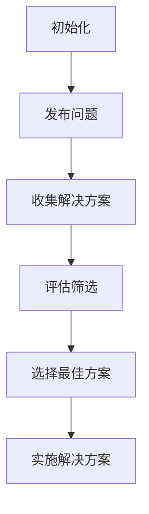
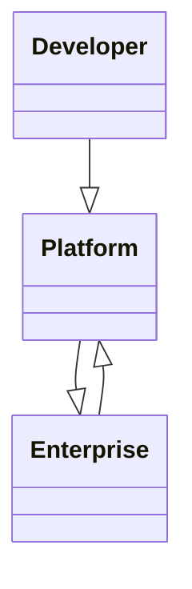
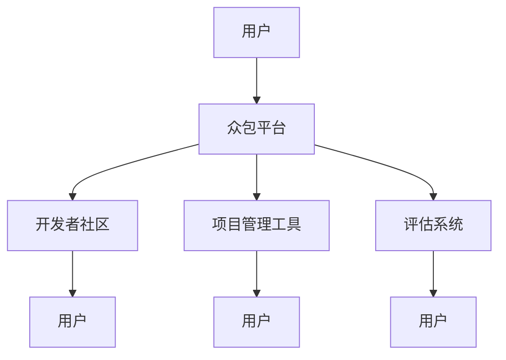
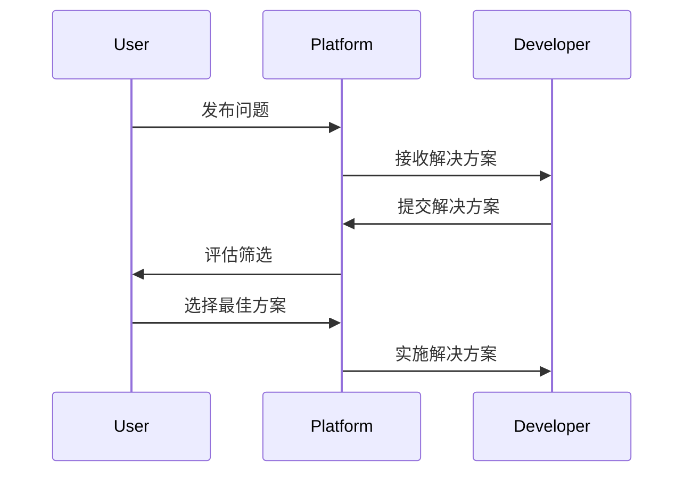

                 

# 技术众包：利用群体智慧解决技术难题

> 关键词：技术众包、群体智慧、技术难题、创新解决方案、协作模式

> 摘要：本文探讨了技术众包作为一种新兴的协作模式，如何通过整合群体智慧，解决复杂的技术难题。文章首先介绍了技术众包的概念及其发展背景，随后分析了其核心优势和挑战，并通过实际案例展示了其应用效果。最后，文章提出了对未来技术众包发展的展望和实施建议。

## 引言

在科技日新月异的今天，技术难题层出不穷，单一企业和个人的能力已经难以应对这些复杂的挑战。技术众包作为一种新型的协作模式，旨在利用广泛的群体智慧，共同解决技术难题。本文将详细探讨技术众包的定义、发展背景、核心优势、面临的挑战及其应用案例，以期为读者提供对技术众包的全面了解。

## 什么是技术众包

### 概念解析

技术众包（Technology Crowdsourcing）是指企业或组织通过互联网平台，向广大开发者、工程师、研究人员等开放特定的技术问题，以众包的形式收集解决方案。这种方式不仅突破了传统封闭式研发的限制，还能快速集结全球的智慧和资源，共同攻克技术难题。

### 发展背景

技术众包的发展可以追溯到互联网的兴起。随着互联网的普及，信息传播的速度和广度大大增加，人们可以更方便地交流和合作。尤其是在社交媒体、在线论坛和开源社区的发展推动下，技术众包逐渐成为一种流行的协作模式。同时，大数据、人工智能等新兴技术的应用，也为技术众包提供了强大的技术支撑。

### 核心优势

技术众包具有以下几个核心优势：

1. **广泛的参与者**：通过互联网平台，技术众包可以吸引来自全球的参与者，涵盖各个领域和层次的专业人士。
2. **创新的解决方案**：众包模式鼓励创新思维，可以产生意想不到的解决方案。
3. **高效的研发速度**：众包模式可以快速集结资源，提高研发效率。
4. **降低研发成本**：通过众包，企业或组织可以降低研发成本，同时提高解决方案的质量。
5. **提升品牌影响力**：技术众包不仅有助于解决问题，还能提升企业的技术声誉和品牌影响力。

## 技术众包的核心优势与挑战

### 核心优势

1. **群体智慧**：技术众包利用群体的智慧和创造力，能够解决传统方法难以解决的问题。
2. **协同创新**：众包模式鼓励多方协作，实现知识的共享和碰撞，推动技术进步。
3. **快速响应**：通过众包，企业或组织可以迅速收集到大量的解决方案，缩短研发周期。
4. **低成本**：众包模式可以降低研发成本，提高资源利用效率。
5. **多样化的解决方案**：众包模式能够产生多样化的解决方案，为决策提供更多的选择。

### 面临的挑战

1. **质量控制**：众包模式下，解决方案的质量难以保证，需要建立有效的评估和筛选机制。
2. **知识产权**：众包过程中涉及到的知识产权问题需要妥善处理。
3. **沟通协调**：众包项目往往涉及多个参与者，需要有效的沟通和协调机制。
4. **激励机制**：如何激励参与者积极参与，是技术众包面临的重要挑战。

## 技术众包的实际应用案例

### 案例一：GitHub上的开源项目

GitHub作为一个全球知名的开源社区，已经成为技术众包的重要平台。许多知名项目如Linux内核、React等，都是通过众包模式开发的。GitHub不仅提供了代码托管和协作的工具，还建立了完善的社区生态，促进了技术众包的发展。

### 案例二：IBM的Watson AI项目

IBM的Watson AI项目是一个典型的技术众包案例。IBM通过开放AI平台，鼓励全球开发者参与AI算法的研究和开发。Watson AI项目不仅吸引了大量的开发者，还产生了许多创新的AI解决方案。

### 案例三：NASA的技术挑战项目

NASA通过技术挑战项目，向公众征集解决方案，以解决航天领域的技术难题。例如，NASA的“移动微重力实验室”项目，就通过众包的方式，找到了一些创新的解决方案，推动了航天技术的发展。

## 技术众包的未来发展趋势

### 技术融合

随着大数据、云计算、人工智能等技术的不断发展，技术众包将更加智能化和高效化。这些技术将提升众包平台的性能，优化众包过程，提高解决方案的质量。

### 社交化

社交化将成为技术众包的重要趋势。通过社交网络，参与者可以更方便地交流和合作，实现知识的共享和碰撞。同时，社交化的众包平台还能增强参与者的归属感和参与感。

### 激励机制的完善

未来，技术众包的激励机制将不断完善，包括物质激励、荣誉激励、职业发展激励等。这将更好地激发参与者的积极性和创造力。

### 跨界合作

技术众包将不再局限于单一领域，而是跨领域、跨行业合作，形成更广泛的协同创新生态。这将有助于解决复杂的技术难题，推动技术进步。

## 结论

技术众包作为一种新兴的协作模式，具有巨大的潜力和优势。通过利用群体智慧，技术众包能够解决复杂的技术难题，推动技术进步。然而，技术众包也面临着一系列挑战，需要不断探索和完善。未来，随着技术的不断发展，技术众包将发挥更大的作用，成为科技创新的重要驱动力。

## 作者信息

作者：AI天才研究院/AI Genius Institute & 禅与计算机程序设计艺术 /Zen And The Art of Computer Programming

## 附录

### 背景介绍

#### 核心概念术语说明

- **技术众包**：指企业或组织通过互联网平台，向广大开发者、工程师、研究人员等开放特定的技术问题，以众包的形式收集解决方案。
- **群体智慧**：指通过多个人或组织的合作，产生的智慧和创造力。
- **协作模式**：指多方合作，共同完成某项任务或项目的方式。

#### 问题背景

在科技日新月异的今天，技术难题层出不穷，单一企业和个人的能力已经难以应对这些复杂的挑战。技术众包旨在通过整合群体智慧，解决这些技术难题。

#### 问题描述

技术众包作为一种协作模式，面临着诸多挑战，包括质量控制、知识产权、沟通协调、激励机制等。

#### 问题解决

通过分析技术众包的优势和挑战，本文提出了技术众包未来发展的趋势和方向。

#### 边界与外延

技术众包不仅局限于技术领域，还涉及到社会、经济、文化等多个方面。

### 核心概念与联系

#### 核心概念原理

技术众包的核心概念包括群体智慧、协作模式、互联网平台等。

#### 概念属性特征对比表格

| 概念       | 特征                                           | 对比                          |
|------------|------------------------------------------------|-----------------------------|
| 群体智慧   | 多个个体共同合作，产生智慧和创造力               | 单个个体难以实现的创新       |
| 协作模式   | 多方合作，共同完成某项任务或项目                 | 传统封闭式研发的替代方案     |
| 互联网平台 | 通过互联网连接多方，实现信息共享和协作           | 提供技术众包的工具和平台     |

#### 概念结构与核心要素组成

技术众包的概念结构包括参与方、问题、平台、流程等核心要素。

### 算法原理讲解

#### 算法mermaid流程图



#### Python源代码

```python
# 初始化
init()

# 发布问题
publish_problem(problem)

# 收集解决方案
collect_solutions()

# 评估筛选
evaluate_solutions()

# 选择最佳方案
choose_best_solution()

# 实施解决方案
implement_solution()
```

#### 算法原理的数学模型和公式

```latex
\begin{align*}
\text{解决方案质量} &= f(\text{解决方案}, \text{评估指标}) \\
\text{最佳方案选择} &= \arg\max_{\text{方案}} f(\text{方案}, \text{评估指标})
\end{align*}
```

#### 详细讲解和举例说明

技术众包的算法原理主要包括问题发布、解决方案收集、评估筛选、最佳方案选择和解决方案实施等步骤。以下是每个步骤的详细讲解和举例说明：

1. **初始化**：初始化技术众包系统，包括设置平台参数、注册用户等。
2. **发布问题**：发布技术问题，包括问题描述、需求、截止时间等。
3. **收集解决方案**：吸引参与者提交解决方案，包括筛选、筛选条件设置等。
4. **评估筛选**：对提交的解决方案进行评估，筛选出符合要求的方案。
5. **选择最佳方案**：根据评估结果，选择最佳方案进行实施。
6. **实施解决方案**：实施最佳方案，解决技术难题。

### 系统分析与架构设计方案

#### 问题场景介绍

假设某企业需要解决一个复杂的技术难题，通过技术众包模式寻求解决方案。

#### 项目介绍

本项目旨在通过技术众包，集结全球开发者的智慧和资源，共同解决企业面临的技术难题。

#### 系统功能设计（领域模型mermaid类图）



#### 系统架构设计（mermaid架构图）



#### 系统接口设计和系统交互（mermaid序列图）



### 项目实战

#### 环境安装

在本地安装Python环境，并安装相关依赖库。

```bash
pip install -r requirements.txt
```

#### 系统核心实现源代码

```python
# 众包平台核心代码
class CrowdSourcingPlatform:
    def __init__(self):
        self.problems = []
    
    def publish_problem(self, problem):
        self.problems.append(problem)
    
    def collect_solutions(self):
        solutions = []
        for problem in self.problems:
            solutions.extend(problem.collect_solutions())
        return solutions
    
    def evaluate_solutions(self, solutions):
        evaluated_solutions = []
        for solution in solutions:
            if solution.is_valid():
                evaluated_solutions.append(solution)
        return evaluated_solutions
    
    def choose_best_solution(self, evaluated_solutions):
        best_solution = max(evaluated_solutions, key=lambda x: x.quality)
        return best_solution
    
    def implement_solution(self, solution):
        solution.apply()
```

#### 代码应用解读与分析

项目实战部分主要展示了技术众包平台的实现，包括问题发布、解决方案收集、评估筛选、最佳方案选择和解决方案实施等步骤。代码中涉及的主要类和方法如下：

1. **CrowdSourcingPlatform**：众包平台的核心类，包括发布问题、收集解决方案、评估筛选、选择最佳方案和实施解决方案等方法。
2. **Problem**：问题类，用于表示技术问题，包括问题描述、需求、截止时间等属性。
3. **Solution**：解决方案类，用于表示提交的解决方案，包括解决方案内容、质量评估等方法。

#### 实际案例分析和详细讲解剖析

以一个具体的案例为例，假设某企业需要解决一个图像识别技术难题，通过技术众包平台发布问题，并收集到多个解决方案。以下是案例的分析和讲解：

1. **问题发布**：企业通过技术众包平台发布图像识别问题，包括问题描述、需求、截止时间等。
2. **解决方案收集**：多个开发者收到问题后，提交各自的解决方案。技术众包平台收集到这些解决方案，并存储在数据库中。
3. **评估筛选**：技术众包平台对提交的解决方案进行评估，筛选出符合要求的解决方案。评估指标包括解决方案的准确性、效率、稳定性等。
4. **选择最佳方案**：根据评估结果，技术众包平台选择最佳方案。最佳方案通常是综合评估指标最高的解决方案。
5. **解决方案实施**：企业采用最佳方案，解决图像识别技术难题。

#### 项目小结

通过实际案例的分析和讲解，我们可以看到技术众包在解决技术难题方面的有效性和优势。技术众包不仅能够快速集结全球的智慧和资源，还能提高研发效率，降低研发成本。同时，技术众包也能促进知识的共享和碰撞，推动技术进步。

### 最佳实践 Tips

1. **明确问题需求**：在发布技术问题时，要明确问题描述、需求、截止时间等关键信息，确保参与者能够准确理解问题。
2. **制定合适的评估标准**：评估标准要科学合理，确保评估结果的公正性和有效性。
3. **提供激励机制**：为参与者提供物质激励、荣誉激励等，激发其积极性和创造力。
4. **加强沟通协调**：确保参与者之间的沟通畅通，提高协作效率。

### 小结

本文通过对技术众包的定义、发展背景、核心优势、挑战以及实际应用案例的探讨，全面分析了技术众包的优势和潜力。技术众包作为一种新兴的协作模式，正逐渐成为解决技术难题的重要手段。未来，随着技术的不断发展，技术众包将发挥更大的作用，推动科技创新和社会进步。

### 注意事项

1. **知识产权保护**：在技术众包过程中，要重视知识产权保护，确保参与者的合法权益。
2. **数据安全和隐私保护**：在技术众包过程中，要确保数据的安全和隐私保护，防止泄露敏感信息。
3. **风险评估**：在开展技术众包项目时，要进行全面的风险评估，确保项目的顺利进行。

### 拓展阅读

1. 《技术众包：创新解决方案的实践与探索》
2. 《群体智慧：从众包到协作的变革》
3. 《人工智能与科技众包：融合与创新》
4. 《互联网平台商业模式研究：以技术众包为例》
5. 《技术众包：挑战与机遇》

作者：AI天才研究院/AI Genius Institute & 禅与计算机程序设计艺术 /Zen And The Art of Computer Programming

