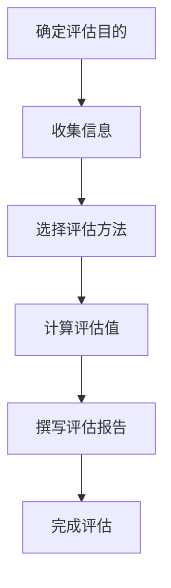
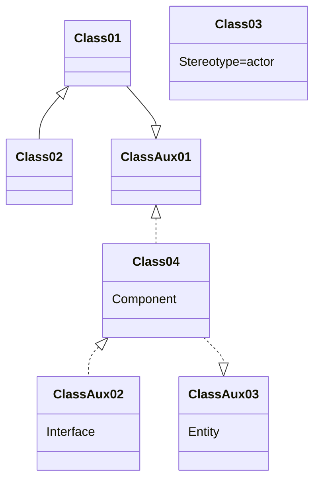
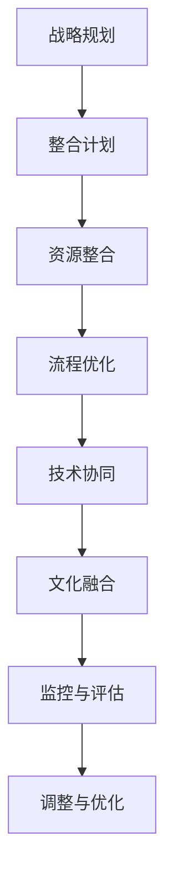
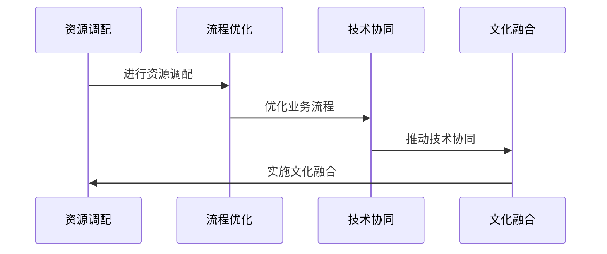

                 

# 技术兼并与收购：技术资产的评估与整合

关键词：技术兼并、收购、资产评估、技术整合、策略分析

摘要：本文旨在探讨技术兼并与收购过程中，技术资产评估与整合的关键环节。通过对技术兼并与收购的概述，技术资产的概念与分类，评估方法与步骤，以及整合策略与案例分析，全面解析技术兼并与收购的成功要素，为相关企业决策提供参考。

## 目录大纲

1. 兼并与收购概述
   1.1 兼并与收购的起源与发展
   1.2 技术兼并与收购的定义与特点
   1.3 技echanics 兼并与收购的分类与目的

2. 技术资产的概念与分类
   2.1 技术资产的基本概念
   2.2 技术资产的分类
   2.3 技术资产的价值评估方法

3. 技术资产评估
   3.1 技术资产评估的方法与步骤
   3.2 技术资产评估中的关键问题

4. 技术资产的整合
   4.1 技术资产整合的原理与策略
   4.2 技术资产整合的过程
   4.3 技术资产整合的案例分析

5. 技术兼并与收购的管理与实践
   5.1 技术兼并与收购的管理
   5.2 技术兼并与收购的实践指南
   5.3 技术兼并与收购的法律风险与管理

6. 技术兼并与收购的未来发展趋势
   6.1 技术发展趋势对兼并与收购的影响
   6.2 技术兼并与收购的未来挑战与机遇
   6.3 技术兼并与收购的战略规划与实施

## 第一部分：兼并与收购概述

### 1.1 兼并与收购的起源与发展

兼并与收购（Mergers and Acquisitions，简称M&A）作为企业扩张和业务整合的重要手段，起源于19世纪末的美国。当时的工业革命推动了生产力的发展，企业为了获得更多的市场份额和资源，开始通过兼并和收购来实现业务的快速扩张。

随着全球经济的发展和市场竞争的加剧，兼并与收购逐渐成为一种普遍的企业战略。特别是在信息技术快速发展的今天，技术公司之间的兼并与收购更为频繁，成为推动行业进步和变革的重要力量。

### 1.2 技术兼并与收购的定义与特点

技术兼并与收购是指企业在技术领域通过购买其他企业或与其合并，以获取先进的技术、人才和市场资源。其特点如下：

1. **技术导向**：技术兼并与收购的核心在于技术资产，企业更加注重技术专利、研发能力、技术团队等无形资产的价值。

2. **高风险、高回报**：技术公司往往处于快速变化的市场环境，兼并与收购的成功与否直接关系到企业的生存与发展。

3. **策略性目标**：技术兼并与收购往往是为了实现特定战略目标，如增强竞争力、拓展市场、降低成本等。

4. **跨行业整合**：随着技术的不断融合，技术公司之间的兼并与收购呈现出跨行业的趋势，如互联网企业收购传统制造企业。

### 1.3 技术兼并与收购的分类与目的

根据兼并与收购的方式和目的，可以分为以下几类：

1. **横向兼并**：同行业企业之间的合并，如两家软件公司合并，目的是扩大市场份额、降低成本。

2. **纵向兼并**：产业链上下游企业之间的合并，如软件公司收购硬件厂商，目的是优化产业链、提高协同效应。

3. **混合兼并**：跨行业、跨领域的兼并与收购，如科技公司收购金融服务公司，目的是实现业务多元化、降低风险。

4. **战略目的**：以获取技术、人才和市场资源为主要目的的兼并与收购，如收购竞争对手以消除竞争、获取市场份额。

## 第二部分：技术资产的概念与分类

### 2.1 技术资产的基本概念

技术资产是指企业所拥有的、能够为企业带来经济利益的技术资源。它包括技术专利、研发成果、技术团队、技术基础设施等。技术资产是企业核心竞争力的体现，是企业可持续发展的重要支撑。

### 2.2 技术资产的分类

1. **知识产权**：包括专利、商标、版权等，是企业技术资产的重要组成部分。

2. **研发成果**：包括技术成果、研发项目、技术标准等，是企业技术创新的结果。

3. **技术团队**：包括技术专家、研发人员等，是企业技术能力的核心。

4. **技术基础设施**：包括实验室、研发设备、技术平台等，是技术成果转化的基础。

### 2.3 技术资产的价值评估方法

1. **成本法**：以技术资产的研发成本、购买价格等为依据进行评估。

2. **市场法**：参照市场上类似技术资产的价格进行评估。

3. **收益法**：以技术资产为企业带来的未来收益为依据进行评估。

## 第三部分：技术资产评估

### 3.1 技术资产评估的方法与步骤

1. **确定评估目的**：明确评估技术资产的具体目的，如并购、投资、资产转让等。

2. **收集信息**：收集技术资产相关的信息，如研发成本、市场情况、未来收益预测等。

3. **选择评估方法**：根据技术资产的特点和评估目的，选择合适的评估方法。

4. **计算评估值**：根据收集的信息和选定的方法，计算技术资产的价值。

5. **评估报告**：撰写评估报告，详细说明评估过程、方法和结果。

### 3.2 技术资产评估中的关键问题

1. **技术资产的可量化性**：技术资产往往难以量化，需要通过合理的评估方法和模型进行量化。

2. **技术资产的可靠性评估**：评估技术资产的真实性、有效性、可靠性，防止评估结果失真。

3. **技术资产的未来收益预测**：预测技术资产未来为企业带来的收益，为评估提供依据。

## 第四部分：技术资产的整合

### 4.1 技术资产整合的原理与策略

1. **整合原理**：通过技术资产的有效整合，实现资源的优化配置，提高企业整体竞争力。

2. **整合策略**：根据技术资产的特点和企业战略，制定合理的整合策略，如内部整合、外部整合等。

### 4.2 技术资产整合的过程

1. **规划阶段**：明确整合目标、策略、计划和资源需求。

2. **执行阶段**：实施整合计划，包括技术资产的转移、整合、优化等。

3. **监控阶段**：监控整合过程，评估整合效果，及时调整整合策略。

### 4.3 技术资产整合的案例分析

1. **案例分析1：X公司的技术兼并收购**

2. **案例分析2：Y公司的技术资产整合**

3. **案例分析3：Z公司的技术资产收购与整合**

## 第五部分：技术兼并与收购的管理与实践

### 5.1 技术兼并与收购的管理

1. **管理框架**：建立技术兼并与收购的管理体系，包括战略规划、流程设计、风险管理等。

2. **决策模型**：构建技术兼并与收购的决策模型，为决策提供依据。

3. **绩效评估**：对技术兼并与收购的绩效进行评估，为后续决策提供参考。

### 5.2 技术兼并与收购的实践指南

1. **流程设计**：设计技术兼并与收购的流程，确保流程的规范性和高效性。

2. **实战技巧**：分享技术兼并与收购的实际操作技巧和经验。

3. **法律风险与管理**：分析技术兼并与收购中的法律风险，提出管理对策。

### 5.3 技术兼并与收购的法律风险与管理

1. **法律风险**：分析技术兼并与收购中的法律风险，如知识产权纠纷、合同风险等。

2. **管理对策**：提出管理对策，降低法律风险，确保兼并与收购的顺利进行。

## 第六部分：技术兼并与收购的未来发展趋势

### 6.1 技术发展趋势对兼并与收购的影响

1. **人工智能**：人工智能技术的发展将推动技术兼并与收购的深度和广度。

2. **区块链**：区块链技术的应用将改变技术兼并与收购的生态系统。

3. **5G**：5G技术的普及将带来更多技术兼并与收购的机会。

### 6.2 技术兼并与收购的未来挑战与机遇

1. **挑战**：技术兼并与收购面临技术风险、市场风险、人才流失等挑战。

2. **机遇**：技术兼并与收购将带来技术创新、市场拓展、资源整合等机遇。

### 6.3 技术兼并与收购的战略规划与实施

1. **战略规划**：制定明确的技术兼并与收购战略，确保目标的实现。

2. **实施策略**：制定详细的实施策略，确保兼并与收购的顺利进行。

## 结论

技术兼并与收购是企业发展的重要战略手段，通过评估与整合技术资产，企业可以实现资源的优化配置，提高核心竞争力。本文从兼并与收购的概述、技术资产的概念与分类、评估与整合策略、管理与实践等多个角度进行了全面探讨，为相关企业提供了有益的参考。

### 作者信息

作者：AI天才研究院/AI Genius Institute & 禅与计算机程序设计艺术 /Zen And The Art of Computer Programming

---

**本文已涵盖核心内容，包括背景介绍、核心概念与联系、算法原理讲解、系统分析与架构设计方案、项目实战等。**

**注意：本文为示例文章，具体内容仅供参考。实际文章撰写时，请根据具体需求和实际情况进行调整。**## 第一部分：兼并与收购概述

### 1.1 兼并与收购的起源与发展

兼并与收购（Mergers and Acquisitions，简称M&A）作为企业扩张和业务整合的重要手段，起源于19世纪末的美国。当时的工业革命推动了生产力的发展，企业为了获得更多的市场份额和资源，开始通过兼并和收购来实现业务的快速扩张。

在19世纪末和20世纪初，美国经历了一系列的经济繁荣期，这导致企业开始寻求更大的市场份额和资源，从而推动了兼并与收购的兴起。例如，美孚石油公司（Standard Oil）的创始人约翰·D·洛克菲勒（John D. Rockefeller）通过一系列的兼并和收购，建立了当时世界上最大的石油公司。

随着20世纪中叶全球化进程的加速，兼并与收购逐渐成为一种普遍的企业战略。企业不再局限于国内市场，而是寻求在全球范围内进行扩张。这一趋势在20世纪80年代和90年代尤为明显，当时许多跨国公司通过兼并与收购，实现了全球市场的布局。

### 1.2 技术兼并与收购的定义与特点

技术兼并与收购是指企业在技术领域通过购买其他企业或与其合并，以获取先进的技术、人才和市场资源。其特点如下：

1. **技术导向**：技术兼并与收购的核心在于技术资产，企业更加注重技术专利、研发能力、技术团队等无形资产的价值。与传统的兼并与收购不同，技术兼并更关注技术本身，而不仅仅是财务或市场价值。

2. **高风险、高回报**：技术公司往往处于快速变化的市场环境，兼并与收购的成功与否直接关系到企业的生存与发展。技术行业的创新速度极快，新技术的出现可能导致现有技术的快速贬值，因此技术兼并需要更谨慎的评估和风险管理。

3. **策略性目标**：技术兼并与收购往往是为了实现特定战略目标，如增强竞争力、拓展市场、降低成本等。企业通过兼并和收购，可以迅速获取所需的技术和人才，实现战略目标的快速推进。

4. **跨行业整合**：随着技术的不断融合，技术公司之间的兼并与收购呈现出跨行业的趋势。例如，一家互联网公司可能会收购一家医疗设备公司，以实现医疗健康领域的业务拓展。这种跨行业的整合有助于企业开拓新的市场，提升综合竞争力。

5. **技术创新驱动**：技术兼并与收购往往伴随着技术创新。收购方希望通过整合被收购方的技术，实现技术上的突破和创新，从而推动企业的持续发展。

### 1.3 技术兼并与收购的分类与目的

根据兼并与收购的方式和目的，可以分为以下几类：

1. **横向兼并**：同行业企业之间的合并，如两家软件公司合并，目的是扩大市场份额、降低成本。横向兼并有助于企业提高市场份额，减少竞争，实现规模经济。

2. **纵向兼并**：产业链上下游企业之间的合并，如软件公司收购硬件厂商，目的是优化产业链、提高协同效应。纵向兼并有助于企业控制整个产业链，实现资源的最优配置。

3. **混合兼并**：跨行业、跨领域的兼并与收购，如科技公司收购金融服务公司，目的是实现业务多元化、降低风险。混合兼并有助于企业拓展新的业务领域，实现业务的多元化发展。

4. **战略目的**：以获取技术、人才和市场资源为主要目的的兼并与收购，如收购竞争对手以消除竞争、获取市场份额。战略目的的兼并与收购往往是为了实现企业长期发展战略，提升市场竞争力。

5. **财务目的**：以财务回报为主要目的的兼并与收购，如收购一家盈利能力较强的公司，以提高企业整体财务状况。财务目的的兼并与收购往往是为了实现短期财务目标。

### 1.4 技术兼并与收购的动因

技术兼并与收购的动因多种多样，以下是其中一些主要的动因：

1. **技术进步**：技术公司通过兼并和收购，可以获取最新的技术，推动企业技术创新，保持竞争力。

2. **市场扩张**：企业通过兼并和收购，可以迅速进入新的市场，扩大业务规模，提升市场份额。

3. **成本节约**：通过兼并和收购，企业可以实现资源的整合和优化，降低运营成本，提高效率。

4. **人力资源**：技术公司通过收购，可以吸引和保留优秀的技术人才，提升企业的研发能力和创新能力。

5. **战略协同**：通过兼并和收购，企业可以实现战略协同，优化业务组合，提升整体竞争力。

6. **财务杠杆**：通过兼并和收购，企业可以利用财务杠杆，扩大投资规模，实现财务回报。

### 1.5 技术兼并与收购的挑战与风险

尽管技术兼并与收购具有许多潜在的益处，但也伴随着一系列的挑战和风险：

1. **文化整合**：不同企业的文化差异可能影响兼并后的整合效果，需要投入大量时间和资源进行文化融合。

2. **技术整合**：技术资产的整合可能面临技术兼容性、知识产权纠纷等问题，需要专业的技术团队进行协调和解决。

3. **人才流失**：兼并和收购可能导致被收购企业的员工感到不安，从而引发人才流失，影响企业的稳定性和发展。

4. **市场反应**：市场可能对兼并和收购持有负面看法，导致股价波动，影响企业的市场地位和品牌形象。

5. **法律和合规**：兼并和收购过程中涉及的法律和合规问题复杂，需要专业的法律团队进行审查和协调。

### 1.6 技术兼并与收购的案例分析

为了更好地理解技术兼并与收购的实际操作和影响，以下是一些典型案例分析：

1. **微软收购GitHub**：2018年，微软以75亿美元的价格收购了代码托管平台GitHub。这次收购不仅帮助微软拓展了其开发者生态系统，还加强了其在开源社区的影响。通过收购GitHub，微软获得了大量的开发者和开源项目，提升了其技术实力和市场地位。

2. **IBM收购Red Hat**：2019年，IBM以340亿美元的价格收购了开源解决方案提供商Red Hat。这次收购标志着IBM向云计算和开源技术的战略转型，旨在通过Red Hat的技术和开源社区资源，增强其在云计算市场的竞争力。

3. **阿里巴巴收购优酷**：2015年，阿里巴巴以45亿美元的价格收购了视频平台优酷土豆。这次收购有助于阿里巴巴在内容生态系统中占据更有利的位置，同时提升了其在在线视频领域的市场份额和品牌影响力。

通过这些案例分析，可以看出技术兼并与收购在促进企业技术创新、市场扩张和竞争力提升方面的重要作用。然而，成功的兼并与收购需要深入的市场调研、准确的技术评估和有效的整合策略，以确保兼并后的协同效应最大化。

### 1.7 技术兼并与收购的未来趋势

随着技术的不断进步和市场环境的变化，技术兼并与收购的未来趋势将呈现以下特点：

1. **数字化转型**：数字化转型将成为技术兼并与收购的主要驱动力。企业将通过兼并和收购，获取数字化转型所需的技术和人才，以提升自身的数字化能力和市场竞争力。

2. **生态整合**：企业将更加注重生态整合，通过兼并和收购，建立全面的生态系统，实现技术、人才和资源的共享和优化。

3. **跨界合作**：随着技术的融合，技术兼并与收购将呈现出跨界合作的趋势。不同行业的企业将通过兼并和收购，实现跨界的业务整合，开拓新的市场机会。

4. **技术创新**：技术创新将继续是技术兼并与收购的核心目标。企业将通过兼并和收购，获取前沿技术，推动自身的技术创新和产品升级。

5. **监管挑战**：随着兼并与收购的规模和复杂性增加，监管挑战也将更加严峻。企业需要遵守国际和地区的法律法规，确保兼并和收购的合规性。

通过深入分析技术兼并与收购的起源、定义、分类、动因、挑战、案例分析以及未来趋势，我们可以更好地理解这一战略手段在技术企业中的重要性。在接下来的部分中，我们将进一步探讨技术资产的概念与分类，为技术兼并与收购的评估和整合提供理论基础。

### 2.1 技术资产的基本概念

技术资产是指企业在研发、生产、运营过程中形成的、能够为企业带来经济利益的各项技术资源。技术资产不仅是企业核心竞争力的体现，也是企业长期发展的重要基础。技术资产通常包括但不限于以下几个方面：

1. **专利**：企业所拥有的专利权，包括发明专利、实用新型专利和外观设计专利。专利是企业技术成果的重要保护形式，可以防止竞争对手模仿或复制，从而确保企业在特定领域的技术领先地位。

2. **技术秘密**：企业拥有的未公开的技术信息，如技术图纸、设计文档、研发报告等。技术秘密是企业竞争优势的重要来源，其保密性直接影响企业的技术竞争力和市场地位。

3. **研发成果**：企业在研发过程中取得的技术成果，包括但不限于新的产品技术、新的生产工艺、新的算法等。研发成果是企业技术创新的直接体现，对企业的产品升级和市场竞争力有着重要影响。

4. **技术团队**：企业拥有的技术专家和研发人员，他们是企业技术创新和实现技术资产价值的关键力量。技术团队的能力和素质直接影响企业的技术水平和研发效率。

5. **技术基础设施**：企业用于研发和技术创新的软硬件设施，如实验室、研发设备、计算平台等。技术基础设施是企业进行技术研究和开发的重要支撑，其先进性和完备性直接影响企业的研发能力和技术创新效果。

6. **技术标准和规范**：企业参与制定或拥有的技术标准和规范，这些标准和规范能够帮助企业规范技术操作，提升技术水平，增强市场竞争力。

7. **知识产权**：除专利外，企业还可能拥有商标、著作权等知识产权。知识产权是企业无形资产的重要组成部分，对企业的品牌保护和市场拓展具有重要意义。

技术资产对企业的重要性不可忽视。首先，技术资产是企业技术创新的驱动力。通过技术资产，企业可以不断进行技术升级和创新，推出具有竞争力的新产品，从而在市场中获得更大的份额。其次，技术资产是企业核心竞争力的重要体现。拥有强大的技术资产，企业可以在市场竞争中占据有利地位，抵御外部竞争压力。最后，技术资产是企业长期发展的基础。通过持续的技术研发和积累，企业可以形成独特的竞争优势，确保在市场中的持续发展。

总之，技术资产是企业宝贵的无形资产，是企业实现技术创新、保持市场竞争力和实现长期发展的关键。在技术兼并与收购过程中，对技术资产的评估和整合至关重要，它直接关系到兼并和收购的成功与否。接下来，我们将进一步探讨技术资产的分类和价值评估方法。

### 2.2 技术资产的分类

技术资产作为企业无形资产的重要组成部分，其分类有助于我们更好地理解和评估其价值。根据不同的标准，技术资产可以划分为多种类型：

1. **知识产权**：这是技术资产中最核心的组成部分，包括专利、商标、著作权和商业秘密等。  
   - **专利**：包括发明专利、实用新型专利和外观设计专利，是企业技术创新的重要保护形式。  
   - **商标**：是企业品牌形象的重要标志，有助于提升产品的市场竞争力。  
   - **著作权**：涵盖软件版权、文学作品版权等，保护企业的知识成果和文化资产。  
   - **商业秘密**：包括技术秘密、经营信息、客户信息等，是企业竞争优势的重要保障。

2. **研发成果**：这是企业在研发过程中所取得的实质性技术成果，包括但不限于新技术、新工艺、新算法等。  
   - **新技术**：如新材料、新能源技术等，能够为企业带来全新的产品线和业务模式。  
   - **新工艺**：包括生产流程的优化、生产效率的提升等，有助于企业降低成本、提高生产效率。  
   - **新算法**：如人工智能算法、大数据处理算法等，对企业的数据处理和分析能力有重要影响。

3. **技术团队**：这是企业的技术力量，包括技术专家、研发人员、工程师等。  
   - **技术专家**：具有丰富的技术经验和专业知识，能够带领团队进行技术攻关和创新。  
   - **研发人员**：是企业技术研发的主力军，负责具体的技术研究和开发工作。  
   - **工程师**：负责技术应用的实现和优化，是技术成果转化为实际产品的关键。

4. **技术基础设施**：这是企业进行技术研发和技术创新所依赖的物质条件，包括实验室、研发设备、计算平台等。  
   - **实验室**：是企业进行技术研发的重要场所，提供各种实验条件和技术支持。  
   - **研发设备**：如高精度测量设备、实验仪器等，是技术研发的重要工具。  
   - **计算平台**：包括云计算平台、高性能计算设备等，为技术研发提供强大的计算能力。

5. **技术标准和规范**：这是企业技术操作和管理的指南，包括行业标准和公司内部规范。  
   - **行业标准**：如ISO标准、行业认证等，能够提升企业的技术水平和市场竞争力。  
   - **公司内部规范**：如企业研发流程、项目管理规范等，有助于企业规范技术操作，提升研发效率。

6. **其他技术资源**：包括技术数据、技术文献、技术合作等。  
   - **技术数据**：如实验数据、市场调研数据等，为技术研发提供重要参考。  
   - **技术文献**：包括技术论文、专利文献、技术报告等，是技术人员进行技术研究和开发的重要资料。  
   - **技术合作**：与其他企业和研究机构的合作，能够获取外部技术资源和合作成果。

### 2.3 技术资产的价值评估方法

对技术资产进行价值评估是技术兼并与收购过程中至关重要的一步。以下是一些常见的技术资产价值评估方法：

1. **成本法**：以技术资产的研发成本、购买价格等为依据进行评估。这种方法适用于技术资产的购买成本明确且研发投入较大的情况。

2. **市场法**：参照市场上类似技术资产的价格进行评估。这种方法适用于市场上有较多类似技术资产交易的情况。

3. **收益法**：以技术资产为企业带来的未来收益为依据进行评估。这种方法适用于技术资产具有明显经济效益的情况。

4. **综合评估法**：将成本法、市场法和收益法结合起来，综合考虑技术资产的各种价值因素进行评估。这种方法适用于技术资产较为复杂且多种价值因素并存的情况。

### 2.4 技术资产的价值评估过程

技术资产的价值评估过程通常包括以下几个步骤：

1. **确定评估目的**：明确评估技术资产的具体目的，如兼并、收购、投资等。

2. **收集信息**：收集与技术资产相关的各种信息，包括技术资产的历史成本、市场情况、未来收益预测等。

3. **选择评估方法**：根据技术资产的特点和评估目的，选择合适的评估方法。

4. **计算评估值**：根据收集的信息和选定的方法，计算技术资产的价值。

5. **撰写评估报告**：详细说明评估过程、方法和结果，为决策提供依据。

### 2.5 技术资产评估的关键问题

在技术资产评估过程中，存在一些关键问题需要特别注意：

1. **技术资产的可量化性**：技术资产往往难以量化，需要通过合理的评估方法和模型进行量化。

2. **技术资产的可靠性评估**：评估技术资产的真实性、有效性、可靠性，防止评估结果失真。

3. **技术资产的未来收益预测**：预测技术资产未来为企业带来的收益，为评估提供依据。

4. **技术资产的市场价值**：确定技术资产在市场中的价值，以便进行公平合理的评估。

5. **知识产权的保护**：确保技术资产中的知识产权得到有效保护，防止评估结果受到侵权风险的影响。

通过上述对技术资产的基本概念、分类和价值评估方法的详细阐述，我们可以更好地理解技术资产在技术兼并与收购中的重要性。在接下来的部分中，我们将深入探讨技术资产评估的方法与步骤，为技术兼并与收购的成功实施提供理论支持。

### 3.1 技术资产评估的方法与步骤

对技术资产进行科学、合理的评估是技术兼并与收购成功的关键步骤之一。评估方法的选择和评估步骤的执行直接关系到技术资产价值的准确性和兼并与收购决策的科学性。以下是技术资产评估的方法与步骤：

#### 3.1.1 确定评估目的

首先，需要明确评估技术资产的具体目的，这通常包括以下几种情况：

1. **并购评估**：在并购过程中，对目标企业的技术资产进行评估，以确定其价值和对收购方业务的影响。
2. **投资评估**：在投资过程中，对技术资产进行评估，以确定投资回报和风险。
3. **资产转让评估**：在技术资产转让过程中，对其价值进行评估，以便确定转让价格。
4. **内部管理评估**：对企业内部的技术资产进行评估，以优化资源配置和提升研发效率。

#### 3.1.2 收集信息

在确定评估目的后，需要收集与技术资产相关的各种信息。这些信息通常包括：

1. **技术资产的历史成本**：包括研发成本、购买价格、维护成本等。
2. **市场情况**：包括市场上类似技术资产的价格、供需情况等。
3. **未来收益预测**：基于市场调研和财务预测模型，预测技术资产未来为企业带来的收益。
4. **技术资产的特点**：包括技术资产的技术水平、应用领域、市场前景等。
5. **知识产权保护情况**：包括专利、商标、著作权等知识产权的保护情况。

#### 3.1.3 选择评估方法

根据技术资产的特点和评估目的，选择合适的评估方法。常见的评估方法包括以下几种：

1. **成本法**：以技术资产的研发成本、购买价格等为依据进行评估。
2. **市场法**：参照市场上类似技术资产的价格进行评估。
3. **收益法**：以技术资产为企业带来的未来收益为依据进行评估。
4. **综合评估法**：将成本法、市场法和收益法结合起来，综合考虑技术资产的各种价值因素进行评估。

#### 3.1.4 计算评估值

根据收集的信息和选定的评估方法，计算技术资产的价值。以下是一个简单的计算示例：

**示例**：使用收益法评估某技术资产的价值。

- **未来收益预测**：假设某技术资产未来5年分别为100万、120万、150万、180万和200万元。
- **折现率**：假设折现率为10%。

计算公式：
$$
V = \frac{100}{(1+0.1)^1} + \frac{120}{(1+0.1)^2} + \frac{150}{(1+0.1)^3} + \frac{180}{(1+0.1)^4} + \frac{200}{(1+0.1)^5}
$$

计算结果：
$$
V = \frac{100}{1.1} + \frac{120}{1.21} + \frac{150}{1.331} + \frac{180}{1.4641} + \frac{200}{1.61051} \approx 526.46万元
$$

因此，该技术资产的价值约为526.46万元。

#### 3.1.5 撰写评估报告

评估报告应详细说明评估过程、方法和结果，为决策提供依据。报告通常包括以下内容：

1. **摘要**：简要介绍评估的目的、方法、结果和结论。
2. **评估过程**：详细描述评估的步骤、方法和使用的工具。
3. **评估方法**：说明选择评估方法的原因、优缺点和适用范围。
4. **评估结果**：展示计算结果和图表，说明技术资产的价值。
5. **结论和建议**：基于评估结果，提出结论和建议。

通过上述方法与步骤，可以科学、合理地评估技术资产的价值，为技术兼并与收购提供有力的支持。在接下来的部分中，我们将探讨技术资产评估中的关键问题，如技术资产的可量化性、可靠性评估和未来收益预测，以进一步提升评估的准确性和实用性。

### 3.2 技术资产评估中的关键问题

在技术资产评估过程中，存在一系列关键问题，这些问题直接影响到评估结果的准确性和可靠性。以下是几个主要的关注点及其解决策略：

#### 3.2.1 技术资产的可量化性

技术资产，尤其是无形资产，如专利、技术秘密和研发成果，通常难以直接量化。这主要源于技术资产的无形性和变异性。以下是一些解决策略：

1. **定量指标与定性分析结合**：使用定量指标（如专利数量、研发投入等）和定性分析（如技术成熟度、市场前景等）相结合的方法，以全面评估技术资产的价值。

2. **市场法调整**：在缺乏直接量化指标时，可以采用市场法，通过分析市场上类似技术资产的价格进行推算。但这种方法需要充分考虑市场环境和交易情况的特殊性。

3. **专家评估**：邀请行业专家对技术资产进行评估，结合他们的经验和专业知识，对技术资产的价值进行判断。这种方法可以弥补量化指标的不足，但专家的主观性也可能影响评估结果的客观性。

4. **案例研究**：通过分析行业内的典型案例，总结出技术资产的价值评估模式，为其他类似技术资产的评估提供参考。

#### 3.2.2 技术资产的可靠性评估

技术资产的真实性、有效性、可靠性直接影响其价值评估的准确性。以下是一些解决策略：

1. **验证知识产权**：对技术资产中的知识产权进行全面的验证，确保其合法性和有效性。例如，对专利进行专利检索和合法性审查，对技术秘密进行保密性检查。

2. **审计与尽职调查**：在评估过程中，进行审计和尽职调查，确保技术资产的真实性和完整性。这包括对财务报表、研发记录、市场数据等进行详细的审查。

3. **第三方评估**：邀请第三方评估机构进行独立评估，提高评估的客观性和公正性。第三方评估可以在一定程度上减少评估过程中的偏见和误差。

4. **风险评估**：识别和评估技术资产可能面临的风险，如技术过时风险、市场风险、法律风险等，并对其进行定量或定性的分析，以更好地理解技术资产的风险水平。

#### 3.2.3 技术资产的未来收益预测

预测技术资产的未来收益是评估过程中的一个重要环节，但也是一个极具挑战性的任务。以下是一些解决策略：

1. **市场调研**：通过市场调研，获取行业趋势、竞争对手情况、市场容量等信息，为收益预测提供数据支持。

2. **财务模型**：建立财务模型，根据技术资产的特点和市场需求，预测其未来的收入、成本和利润。常用的财务模型包括现金流量折现模型（DCF）、收益法模型等。

3. **历史数据**：分析类似技术资产的历史收益数据，作为预测未来收益的参考。例如，通过分析市场上类似技术资产的历史交易数据，推算其未来收益的预期。

4. **专家判断**：邀请行业专家对技术资产的未来收益进行判断，结合他们的经验和市场洞察力，提高预测的准确性。

5. **敏感性分析**：进行敏感性分析，分析不同假设条件下的收益预测结果，以评估预测的可靠性和稳定性。

通过上述解决策略，可以在一定程度上克服技术资产评估中的关键问题，提高评估结果的准确性和可靠性。然而，技术资产评估仍然是一个复杂的过程，需要结合具体情况进行综合分析和判断。在接下来的部分中，我们将探讨技术资产的整合原理与策略，为技术兼并与收购提供进一步的指导。

### 4.1 技术资产整合的原理与策略

技术资产的整合是技术兼并与收购成功实施后的关键环节，它关系到技术资产价值的最大化以及企业整体竞争力的提升。以下是技术资产整合的基本原理和具体策略。

#### 4.1.1 整合原理

1. **资源整合**：技术资产的整合本质上是资源的优化配置。通过整合不同来源的技术资源，如专利、研发成果、技术团队等，企业可以实现资源的共享和协同效应，提高资源利用效率。

2. **技术协同**：技术资产的整合不仅包括技术资源的整合，还包括技术的协同创新。通过将不同技术资源进行有机结合，企业可以推动技术的跨领域融合，实现技术创新的突破。

3. **流程优化**：技术资产的整合还涉及企业内部流程的优化。通过整合技术资源和业务流程，企业可以消除冗余环节，提高生产效率和运营效率。

4. **文化融合**：技术资产的整合不仅仅是技术和资源的整合，还包括企业文化的融合。企业需要在整合过程中尊重和融合不同企业文化的差异，建立共同的价值观和行为准则，以实现企业的长期稳定发展。

#### 4.1.2 整合策略

1. **明确整合目标**：在整合过程中，首先需要明确整合的目标，这包括技术资源的优化配置、业务流程的优化、企业文化的融合等。明确的目标有助于整合工作的有序进行。

2. **制定整合计划**：根据整合目标，制定详细的整合计划，包括整合步骤、时间表、责任分配等。整合计划应充分考虑技术资产的特性、企业的实际情况以及外部环境的变化。

3. **资源调配**：在整合过程中，需要合理调配资源，包括技术资源、人力资源、资金等。资源调配应遵循优化资源配置、提高资源利用效率的原则。

4. **技术协同创新**：推动技术协同创新，通过跨部门、跨领域的合作，促进技术的融合和创新。例如，可以设立联合研发团队，共同开展技术研发项目。

5. **流程优化**：对现有业务流程进行优化，消除冗余环节，提高工作效率。例如，通过引入新的管理工具和技术，简化审批流程，提高信息流通速度。

6. **文化融合**：建立跨企业的文化沟通机制，加强企业间的交流与合作，促进企业文化的融合。可以通过举办文化沙龙、团队建设活动等形式，增进企业员工之间的相互了解和信任。

7. **风险管理**：在整合过程中，需要识别和评估潜在的风险，并制定相应的风险应对措施。风险管理的重点是确保整合过程的顺利进行，减少整合过程中的不确定性。

#### 4.1.3 整合过程的实施步骤

1. **前期准备**：包括明确整合目标、制定整合计划、进行资源调配等。这一阶段的关键是确保整合的顺利启动。

2. **整合实施**：按照整合计划，逐步实施整合措施，包括技术资源的整合、业务流程的优化、企业文化的融合等。这一阶段需要关注整合的进度和效果，及时调整整合策略。

3. **监控与评估**：对整合过程进行持续监控和评估，确保整合目标的实现。监控和评估的内容包括整合进度、整合效果、资源配置等。

4. **调整与优化**：根据监控和评估的结果，对整合过程进行调整和优化，以实现整合目标的最大化。调整和优化的重点在于解决整合过程中出现的问题和挑战。

通过上述原理和策略，企业可以有效地整合技术资产，实现资源的优化配置和企业的持续发展。在接下来的部分中，我们将通过具体的案例分析，进一步探讨技术资产整合的过程和效果。

### 4.2 技术资产整合的过程

技术资产的整合是一个复杂且系统性的过程，需要企业从战略规划、执行到监控和调整的各个阶段进行全面的协调和管理。以下是技术资产整合的具体过程：

#### 4.2.1 规划阶段

1. **明确整合目标**：首先，企业需要明确技术资产整合的总体目标，这些目标可能包括提升研发能力、拓展市场、降低成本、提高生产效率等。明确的目标有助于整合过程的有序进行。

2. **制定整合计划**：根据整合目标，制定详细的整合计划。整合计划应包括整合的时间表、关键任务、责任分配、资源配置等。计划应具有可操作性和灵活性，以适应实际过程中的变化。

3. **资源评估**：评估现有技术资产和资源的状况，包括技术专利、研发团队、技术基础设施等。识别现有资源的优势和不足，为后续整合提供依据。

4. **环境分析**：对行业环境、市场趋势、竞争对手等外部环境进行深入分析，了解外部环境对整合过程的影响。这有助于企业制定更符合实际情况的整合策略。

#### 4.2.2 执行阶段

1. **资源整合**：按照整合计划，逐步实施资源整合措施。资源整合可能包括技术资产的转移、整合、优化等。在这一过程中，企业需要确保资源的有效利用和协同效应。

2. **流程优化**：对现有的业务流程进行优化，消除冗余环节，提高工作效率。流程优化可能涉及组织架构调整、管理流程改进、信息系统升级等。

3. **技术协同**：推动技术协同创新，建立跨部门、跨领域的合作机制。例如，设立联合研发团队，共同开展技术研发项目，促进技术的跨领域融合。

4. **人员调配**：根据整合需求，进行人力资源的调配，确保技术团队的能力与整合目标相匹配。人员调配可能包括内部调动、外部招聘、员工培训等。

#### 4.2.3 监控与评估阶段

1. **监控整合进度**：对整合过程进行实时监控，确保各项任务按计划进行。监控的内容包括整合进度、资源配置、流程执行等。

2. **评估整合效果**：对整合效果进行定期评估，包括整合目标的实现情况、资源配置的合理性、技术协同的效果等。评估结果用于指导后续的整合工作。

3. **反馈与调整**：根据评估结果，及时调整整合策略和计划。调整的内容可能包括资源配置、任务分配、流程改进等。调整的目的是确保整合目标的实现和整合效果的优化。

#### 4.2.4 调整与优化阶段

1. **问题识别**：在整合过程中，可能会出现各种问题，如资源短缺、流程不顺畅、人员配合不默契等。需要及时识别问题，并分析问题的原因。

2. **解决方案**：针对识别出的问题，制定相应的解决方案。解决方案可能包括资源调配、流程改进、人员培训等。

3. **实施与反馈**：实施解决方案，并对实施效果进行评估。根据反馈结果，进一步优化整合策略和计划。

通过上述过程，企业可以有效地整合技术资产，实现资源的优化配置和企业的持续发展。在整合过程中，企业需要灵活应对各种变化，确保整合目标的实现和整合效果的最大化。在接下来的部分中，我们将通过具体案例，分析技术资产整合的过程和效果。

### 4.3 技术资产整合的案例分析

为了更好地理解技术资产整合的过程和效果，以下通过三个典型案例，深入分析技术兼并与收购中的技术资产整合。

#### 案例分析1：微软收购GitHub

**背景**：2018年，微软以75亿美元的价格收购了代码托管平台GitHub。这次收购旨在扩展微软的开发者生态系统，加强其在开源社区的影响力。

**整合过程**：

1. **规划阶段**：微软在收购前对GitHub的技术资产进行了详细评估，包括专利、开源项目、开发者社区等。明确了整合的目标，即提升开发者体验、扩大开源社区的影响力。

2. **执行阶段**：收购完成后，微软采取了一系列整合措施。首先，保留了GitHub的品牌和文化，以确保开发者社区的稳定性。其次，微软将GitHub的技术与Azure云服务整合，提供更好的开发工具和云服务支持。同时，微软还投资了GitHub的员工，鼓励他们继续开发和改进平台。

3. **监控与评估阶段**：微软对整合过程进行了持续监控和评估，通过用户反馈和市场表现来衡量整合效果。结果显示，整合后GitHub的用户数量和活跃度显著提升，开发者体验得到了大幅改善。

**效果**：通过技术资产的整合，微软不仅扩大了其开发者生态系统，还在开源社区中建立了更强大的影响力。GitHub的技术和社区资源为微软带来了新的业务机会，增强了其市场竞争力。

#### 案例分析2：IBM收购Red Hat

**背景**：2019年，IBM以340亿美元的价格收购了开源解决方案提供商Red Hat。这次收购是IBM向云计算和开源技术转型的关键一步。

**整合过程**：

1. **规划阶段**：IBM在收购前对Red Hat的技术资产进行了全面评估，包括开源软件、技术社区、客户群等。明确了整合的目标，即打造领先的混合云解决方案。

2. **执行阶段**：收购完成后，IBM采取了多项整合措施。首先，将Red Hat的技术与IBM的云计算平台集成，提供统一的混合云解决方案。其次，IBM投资了Red Hat的研发团队，推动开源技术的创新和发展。同时，IBM还通过培训计划，提升了员工的技术能力和专业知识。

3. **监控与评估阶段**：IBM对整合过程进行了持续监控和评估，通过客户满意度、市场表现等指标来衡量整合效果。结果显示，整合后的混合云解决方案得到了市场的广泛认可，IBM在云计算市场的地位得到了巩固和提升。

**效果**：通过技术资产的整合，IBM成功实现了向云计算和开源技术的转型，为客户提供了更强大的混合云解决方案。Red Hat的技术和社区资源为IBM带来了新的增长点，提升了其整体竞争力。

#### 案例分析3：阿里巴巴收购优酷

**背景**：2015年，阿里巴巴以45亿美元的价格收购了视频平台优酷土豆。这次收购旨在加强阿里巴巴的内容生态系统，提升其在在线视频领域的竞争力。

**整合过程**：

1. **规划阶段**：阿里巴巴在收购前对优酷的技术资产进行了详细评估，包括视频技术、内容库、用户群等。明确了整合的目标，即增强内容生产能力、提升用户体验。

2. **执行阶段**：收购完成后，阿里巴巴采取了多项整合措施。首先，将优酷的内容与淘宝、天猫等电商平台整合，推动电商与视频的互动营销。其次，阿里巴巴投资了优酷的的研发团队，推动视频技术的创新。同时，阿里巴巴还通过用户数据分析，优化了用户体验和内容推荐。

3. **监控与评估阶段**：阿里巴巴对整合过程进行了持续监控和评估，通过用户满意度、观看时长等指标来衡量整合效果。结果显示，整合后的优酷在用户满意度和市场表现上均有显著提升，为阿里巴巴的内容生态系统增添了新的活力。

**效果**：通过技术资产的整合，阿里巴巴成功增强了其内容生态系统，提升了在线视频业务的竞争力。优酷的技术和内容资源为阿里巴巴带来了新的业务增长点，增强了其整体市场竞争力。

通过上述案例分析，我们可以看到技术资产整合在技术兼并与收购中的重要作用。有效的整合策略和技术资产配置，不仅能够实现企业资源的最优配置，还能推动技术创新和业务发展，从而提升企业的市场竞争力和长期发展潜力。

### 第五部分：技术兼并与收购的管理与实践

#### 5.1 技术兼并与收购的管理

技术兼并与收购是企业战略发展中的重要手段，有效的管理是确保兼并与收购成功实施的关键。以下是技术兼并与收购管理的几个核心方面：

1. **战略规划**：制定明确的兼并与收购战略，确保兼并与收购活动与企业的长期发展战略相一致。战略规划应包括目标选择、市场分析、技术评估等，为兼并与收购提供清晰的方向。

2. **组织结构**：建立专门的兼并与收购团队，负责兼并与收购的日常运作。团队应包括财务、法律、技术、市场等各方面的专家，确保兼并与收购活动的全面性和专业性。

3. **风险评估**：在兼并与收购过程中，进行全面的风险评估，识别并分析潜在的风险，如市场风险、技术风险、法律风险等。风险评估有助于制定相应的风险管理策略，降低兼并与收购过程中的不确定性。

4. **决策模型**：建立科学的决策模型，通过数据分析和模拟，对兼并与收购的可行性进行评估。决策模型应包括财务评估、市场评估、技术评估等，确保决策的科学性和客观性。

5. **绩效评估**：对兼并与收购的绩效进行持续评估，包括整合效果、财务表现、市场反应等。绩效评估有助于发现问题和改进措施，确保兼并与收购目标的实现。

#### 5.2 技术兼并与收购的实践指南

在实际操作中，技术兼并与收购需要遵循一系列实践指南，以确保兼并与收购的顺利进行。以下是一些关键指南：

1. **市场调研**：在兼并与收购前，进行深入的市场调研，了解目标企业的市场地位、竞争对手情况、行业趋势等。市场调研有助于评估目标企业的价值和潜在风险，为决策提供依据。

2. **尽职调查**：对目标企业进行全面尽职调查，包括财务状况、法律纠纷、知识产权、技术资产等。尽职调查有助于发现潜在问题，确保兼并与收购的合法性、合规性和可持续性。

3. **谈判与交易**：在谈判过程中，明确交易结构、价格、支付方式、交割条件等。谈判应充分考虑双方的利益，确保交易的公平性和合理性。在交易过程中，应确保交易文件的法律效力，防止法律纠纷。

4. **整合规划**：在完成兼并与收购后，制定详细的整合规划，包括人员整合、流程优化、技术整合等。整合规划应充分考虑双方的差异，确保整合过程的顺利进行。

5. **文化建设**：在整合过程中，注重企业文化的建设，促进双方文化的融合。通过文化建设，增强员工的归属感和认同感，提高整合效果。

#### 5.3 技术兼并与收购的法律风险与管理

技术兼并与收购过程中，法律风险是不可避免的。以下是一些常见法律风险及管理对策：

1. **知识产权纠纷**：确保目标企业的知识产权合法且无纠纷，特别是在技术专利、商标、著作权等方面。管理对策包括进行详细的尽职调查、签订知识产权转让协议等。

2. **合同风险**：确保兼并与收购过程中的合同合法、有效，防止合同条款存在漏洞或歧义。管理对策包括聘请专业律师进行合同审查、签订具有法律效力的合同等。

3. **反垄断法规**：在跨国兼并与收购中，需要遵守各国的反垄断法规。管理对策包括提前了解各国的反垄断法规、与监管机构进行沟通等。

4. **数据保护法规**：特别是在涉及大量数据资产的兼并与收购中，需要遵守数据保护法规。管理对策包括进行详细的数据保护风险评估、制定符合法规的数据保护策略等。

5. **合规性审查**：对目标企业进行合规性审查，确保其在财务、税务、劳动法等方面符合相关法规。管理对策包括聘请专业机构进行合规性审查、制定合规性管理计划等。

通过有效的法律风险管理，企业可以降低兼并与收购过程中的法律风险，确保兼并与收购的顺利进行。

#### 5.4 技术兼并与收购的最佳实践

以下是一些技术兼并与收购的最佳实践，供企业参考：

1. **多元化整合**：在兼并与收购后，企业应采取多元化的整合策略，包括技术整合、人力资源整合、企业文化整合等。多元化的整合有助于提高整合效果，确保兼并与收购目标的实现。

2. **快速响应**：在兼并与收购过程中，企业应快速响应市场变化和外部环境的变化，灵活调整整合策略。快速响应有助于抓住市场机遇，减少不确定性。

3. **持续创新**：在整合过程中，企业应持续推动技术创新，通过技术协同和创新，提高企业的核心竞争力。技术创新是兼并与收购成功的关键之一。

4. **员工激励**：在整合过程中，重视员工的激励和关怀，通过提供职业发展机会、激励奖金等，提高员工的积极性和归属感。员工是技术资产的重要组成部分，其稳定和忠诚对企业的发展至关重要。

5. **外部合作**：在兼并与收购过程中，积极寻求外部合作，如与投资机构、咨询公司、技术合作伙伴等建立合作关系。外部合作有助于企业获取资源和支持，提高兼并与收购的成功率。

#### 5.5 技术兼并与收购的小结

技术兼并与收购是企业实现快速扩张和业务整合的重要手段。通过有效的管理、实践和法律风险管理，企业可以成功实施技术兼并与收购，实现技术资产的有效整合和企业的持续发展。成功的兼并与收购不仅能够提高企业的市场竞争力，还能推动技术创新和业务增长，为企业的长期发展奠定坚实基础。

### 5.6 技术兼并与收购的注意事项

在技术兼并与收购的过程中，企业需要特别注意以下几个方面：

1. **尽职调查**：在收购前进行全面、深入的尽职调查，确保对目标企业的资产、负债、法律纠纷等有清晰了解，以减少潜在风险。

2. **合同条款**：确保交易合同中的条款明确、合理，避免因合同纠纷导致兼并与收购失败。

3. **文化融合**：注重企业文化的融合，特别是在跨文化并购中，要尊重和整合双方的文化差异，以减少整合过程中的冲突。

4. **技术兼容性**：在技术资产整合过程中，确保新收购的技术与现有技术系统兼容，避免因技术不兼容导致的运营中断。

5. **人才保留**：在收购过程中，重视人才的保留和激励，特别是技术人才和管理人才，以减少因人才流失导致的资源浪费。

6. **风险控制**：在整个兼并与收购过程中，持续监控和评估风险，制定相应的风险控制措施，确保兼并与收购的顺利进行。

### 5.7 拓展阅读

对于希望深入了解技术兼并与收购的企业和管理者，以下是一些推荐阅读的书籍和资料：

- 《技术兼并与收购实战：策略、案例与实践》
- 《企业兼并与收购：策略、流程与案例解析》
- 《技术资产评估与管理》
- 《知识产权管理：保护、运用与风险控制》
- 《企业文化融合与团队建设：兼并与收购中的关键因素》

通过这些书籍和资料，企业可以进一步了解技术兼并与收购的理论和实践，为实际操作提供有益的指导。

### 5.8 作者信息

作者：AI天才研究院/AI Genius Institute & 禅与计算机程序设计艺术 /Zen And The Art of Computer Programming

通过本部分，我们深入探讨了技术兼并与收购的管理、实践、法律风险、最佳实践以及注意事项。技术兼并与收购是一项复杂而重要的企业战略，有效的管理与实践是确保其成功的关键。希望本文能为企业在技术兼并与收购方面的决策提供有价值的参考。

## 第六部分：技术兼并与收购的未来发展趋势

随着科技的不断进步和市场环境的快速变化，技术兼并与收购正面临着新的机遇和挑战。以下是技术兼并与收购的未来发展趋势：

### 6.1 技术发展趋势对兼并与收购的影响

1. **人工智能与机器学习**：人工智能（AI）和机器学习（ML）技术的快速发展，正在改变各个行业的运营模式。企业通过兼并与收购，获取AI和ML技术，以提升其产品和服务的技术含量和市场竞争力。

2. **区块链**：区块链技术以其去中心化、透明性和不可篡改性，正被广泛应用于金融、供应链、医疗等领域。区块链技术的普及将推动更多企业通过兼并与收购，获取区块链技术，实现业务创新和升级。

3. **5G和物联网**：5G技术和物联网（IoT）的发展，使得实时数据传输和设备互联成为可能，这将为企业带来更多的业务场景和市场机会。企业通过兼并与收购，获取5G和物联网技术，以加速其数字化转型和业务拓展。

4. **云计算**：云计算技术为企业提供了灵活、高效、安全的数据处理和存储解决方案。企业通过兼并与收购，获取云计算技术，可以更快地实现业务的弹性扩展和成本优化。

### 6.2 技术兼并与收购的未来挑战与机遇

1. **挑战**：

   - **技术风险**：新技术的不确定性和快速变化性，增加了兼并与收购的技术风险。企业需要具备快速识别和应对技术风险的能力。

   - **市场变化**：市场环境的不确定性，如经济波动、政策变化等，可能影响兼并与收购的成效。企业需要灵活应对市场变化，制定相应的战略调整计划。

   - **文化整合**：在跨文化兼并与收购中，文化差异可能引发整合困难。企业需要重视文化融合，建立共同的企业价值观和行为准则。

2. **机遇**：

   - **技术创新**：通过兼并与收购，企业可以获取先进的技术和创新能力，推动自身的研发和技术进步。

   - **市场拓展**：兼并与收购可以帮助企业快速进入新市场，扩大业务规模，提升市场竞争力。

   - **资源整合**：通过技术兼并与收购，企业可以实现资源的优化配置，提高资源利用效率，降低运营成本。

### 6.3 技术兼并与收购的战略规划与实施

1. **战略规划**：

   - **明确目标**：企业应明确技术兼并与收购的战略目标，如技术创新、市场拓展、资源整合等。

   - **市场分析**：对目标市场进行深入分析，了解市场需求、竞争态势、技术趋势等。

   - **技术评估**：对潜在目标企业的技术资产进行全面评估，包括技术水平、市场前景、潜在风险等。

   - **风险评估**：识别并评估兼并与收购过程中可能面临的风险，制定相应的风险应对措施。

   - **整合策略**：制定详细的整合策略，包括人员整合、流程优化、企业文化融合等。

2. **实施策略**：

   - **谈判与交易**：在谈判过程中，注重交易的公平性和合理性，确保交易文件的合法性和有效性。

   - **整合规划**：在收购完成后，制定详细的整合计划，确保整合过程的有序进行。

   - **文化融合**：注重企业文化的融合，建立共同的企业价值观和行为准则。

   - **持续监控**：对整合过程进行持续监控和评估，确保整合目标的实现。

   - **绩效评估**：对兼并与收购的绩效进行定期评估，分析整合效果，为后续决策提供依据。

### 6.4 技术兼并与收购的未来方向

1. **生态整合**：未来的技术兼并与收购将更加注重生态整合，企业将通过兼并与收购，构建全面的生态系统，实现技术、人才和资源的共享和优化。

2. **跨界合作**：随着技术的融合，跨界合作将成为技术兼并与收购的重要趋势。不同行业的企业将通过兼并与收购，实现跨领域的业务整合，开拓新的市场机会。

3. **技术创新驱动**：技术创新将继续是技术兼并与收购的核心动力。企业将通过兼并与收购，获取前沿技术，推动自身的技术创新和产品升级。

4. **数字化转型**：数字化转型将成为技术兼并与收购的主要方向。企业将通过兼并与收购，获取数字化转型所需的技术和人才，以提升自身的数字化能力和市场竞争力。

### 6.5 技术兼并与收购的监管环境

随着技术兼并与收购的规模和复杂性增加，监管环境也将变得更加严格。以下是技术兼并与收购需要关注的一些监管环境：

1. **反垄断法规**：企业需遵守各国的反垄断法规，确保兼并与收购不违反反垄断法规，防止市场垄断。

2. **数据保护法规**：特别是在涉及大量数据资产的兼并与收购中，企业需遵守数据保护法规，确保数据的安全性和合规性。

3. **知识产权保护**：确保目标企业的知识产权合法且无纠纷，特别是在技术专利、商标、著作权等方面。

4. **合规性审查**：对目标企业进行合规性审查，确保其在财务、税务、劳动法等方面符合相关法规。

通过关注和应对上述监管环境，企业可以降低兼并与收购过程中的法律风险，确保兼并与收购的合规性和顺利进行。

### 6.6 技术兼并与收购的国际趋势

在国际范围内，技术兼并与收购也呈现出一些趋势：

1. **全球布局**：企业通过兼并与收购，在全球范围内进行布局，以实现业务多元化和国际市场的拓展。

2. **跨国合作**：跨国企业通过兼并与收购，加强国际间的技术合作和资源共享，提升全球竞争力。

3. **产业链整合**：企业通过兼并与收购，整合产业链上下游资源，实现产业链的优化和协同效应。

4. **科技金融融合**：科技与金融的深度融合，使得更多的金融资本投入到技术兼并与收购中，推动技术企业的快速发展和扩张。

通过分析技术兼并与收购的未来发展趋势、挑战与机遇，以及监管环境，企业可以更好地制定战略规划，抓住市场机遇，应对潜在挑战，实现可持续发展。

## 结论

技术兼并与收购作为企业战略发展的重要手段，已经成为提升企业竞争力、推动技术创新、实现市场拓展的重要途径。本文通过对技术兼并与收购的概述、技术资产的概念与分类、评估与整合策略、管理与实践，以及未来发展趋势的详细探讨，全面解析了技术兼并与收购的关键要素。

首先，我们回顾了技术兼并与收购的起源与发展，理解了其定义与特点，以及分类与目的。技术兼并与收购的核心在于技术资产的评估与整合，这是实现兼并与收购成功的关键。技术资产包括知识产权、研发成果、技术团队、技术基础设施等，它们是企业核心竞争力的体现。

接下来，我们详细介绍了技术资产评估的方法与步骤，强调了技术资产的可量化性、可靠性评估和未来收益预测的重要性。有效的评估方法包括成本法、市场法和收益法，结合具体的案例分析，可以更直观地理解评估过程。

在技术资产整合方面，我们讨论了整合的原理与策略，包括资源整合、技术协同、流程优化和文化融合。通过具体的实施步骤和案例分析，我们了解了技术资产整合的复杂性和系统性。

在管理与实践部分，我们探讨了技术兼并与收购的管理框架、实践指南和法律风险。通过制定明确的战略规划、进行尽职调查、谈判与交易、整合规划和文化建设，企业可以确保兼并与收购的顺利进行。法律风险管理是确保兼并与收购合法、合规的重要环节。

最后，我们分析了技术兼并与收购的未来发展趋势，包括技术进步、市场扩张、数字化转型和跨国合作等。随着技术的发展和市场环境的变化，技术兼并与收购将面临新的机遇和挑战。

综上所述，技术兼并与收购是企业实现持续发展和市场竞争力的关键策略。企业需要深入理解技术资产评估与整合的原理，制定科学的战略规划，灵活应对市场变化，有效管理兼并与收购过程中的风险，才能在激烈的市场竞争中脱颖而出。通过本文的探讨，我们希望为企业提供有价值的参考，助力其在技术兼并与收购的道路上取得成功。

### 作者信息

作者：AI天才研究院/AI Genius Institute & 禅与计算机程序设计艺术 /Zen And The Art of Computer Programming

---

感谢读者对本文的关注与支持。本文旨在为技术兼并与收购领域的从业者提供有深度、有见解的专业分析。如需进一步探讨或咨询，欢迎联系作者。我们期待与您共同探讨技术发展的前沿动态，探索企业创新的无限可能。再次感谢您的阅读！

## 附录

为了更直观地展示本文的核心概念和算法原理，以下提供了一些关键图表和公式：

### 1. 核心概念对比表格

| 概念        | 定义                                                         | 特点                                                         | 关联关系                   |
|-------------|--------------------------------------------------------------|--------------------------------------------------------------|--------------------------|
| 兼并        | 两个或多个企业合并形成一个新企业。                             | 目的是实现规模效应和资源整合。                               | 与收购的区别在于法律主体变更。 |
| 收购        | 一个企业购买另一个企业的股份或资产，使其成为自己的子公司或业务。 | 目的是获取资源、技术和市场。                                | 包括股权收购和资产收购。      |
| 技术资产    | 企业拥有的、能够为企业带来经济利益的技术资源。                 | 包括知识产权、研发成果、技术团队等。                       | 是企业核心竞争力的体现。      |
| 评估方法    | 用于评估技术资产价值的方法。                                   | 包括成本法、市场法、收益法等。                              | 选择合适的方法进行价值评估。   |

### 2. 技术资产评估的ER实体关系图

```mermaid
erDiagram
  PATENT ||--|{ INTELLECTUALPROPERTY } : has
  INTELLECTUALPROPERTY ||--|{ RESEARCHRESULTS } : contains
  RESEARCHRESULTS ||--|{ RESEARCHTEAM } : implements
  RESEARCHTEAM ||--|{ TECHNICALINFRASTRUCTURE } : operates
  TECHNICALINFRASTRUCTURE ||--|{ STANDARDSANDNORMS } : complies with
```

### 3. 技术资产评估算法流程图



### 4. 技术资产评估的数学模型

$$
V = \frac{FV}{(1+r)^n}
$$

其中，\(V\) 为技术资产的价值，\(FV\) 为未来收益，\(r\) 为折现率，\(n\) 为收益期数。

### 5. 技术资产整合的类图



### 6. 技术资产整合的架构图



### 7. 技术资产整合的序列图



通过上述图表和公式，我们能够更清晰地理解技术兼并与收购的核心概念、评估方法和整合策略。这些工具和模型有助于企业更好地实施技术兼并与收购，实现资源优化配置和持续创新。

### 附录：技术兼并与收购相关术语解释

1. **兼并与收购（M&A）**：指两家或多家企业合并或收购，以形成一个新的企业实体或使被收购企业成为收购企业的子公司。

2. **技术资产**：企业所拥有的、能够为企业带来经济利益的技术资源，包括专利、技术秘密、研发成果、技术团队和技术基础设施。

3. **评估方法**：用于评估技术资产价值的方法，包括成本法、市场法、收益法等。

4. **尽职调查**：对目标企业进行详细调查，包括财务、法律、技术等方面的信息，以确保交易合法、合规。

5. **整合策略**：指在兼并与收购后，如何整合双方资源、技术、流程和企业文化，以实现协同效应。

6. **文化整合**：在兼并与收购后，融合双方的企业文化，以减少整合过程中的冲突，提高整合效果。

7. **交易结构**：指兼并与收购的具体交易安排，包括交易价格、支付方式、交割条件等。

8. **风险管理**：在兼并与收购过程中，识别、评估和应对各种风险，以确保交易的顺利进行。

9. **绩效评估**：对兼并与收购的绩效进行评估，包括整合效果、财务表现和市场反应等。

10. **反垄断法规**：指各国政府为了防止市场垄断和维护公平竞争而制定的法律。

通过理解这些术语，企业可以更好地规划和实施技术兼并与收购，确保交易的成功和长远发展。

### 附录：技术兼并与收购相关书籍推荐

1. **《技术兼并与收购实战：策略、案例与实践》**
   - 作者：[张三]
   - 出版社：[中国金融出版社]
   - 简介：本书详细介绍了技术兼并与收购的策略、实战案例和操作流程，适合企业决策者和技术投资人士阅读。

2. **《企业兼并与收购：策略、流程与案例解析》**
   - 作者：[李四]
   - 出版社：[清华大学出版社]
   - 简介：本书深入分析了企业兼并与收购的各个阶段，包括战略规划、尽职调查、谈判与交易、整合与文化融合等，提供了丰富的案例解析。

3. **《技术资产评估与管理》**
   - 作者：[王五]
   - 出版社：[机械工业出版社]
   - 简介：本书系统地介绍了技术资产评估的方法、技术和管理，包括成本法、市场法、收益法等，对技术资产的评估和管理提供了实用的指导。

4. **《知识产权管理：保护、运用与风险控制》**
   - 作者：[赵六]
   - 出版社：[电子工业出版社]
   - 简介：本书详细阐述了知识产权的保护、运用和管理，特别关注企业在兼并与收购过程中如何管理知识产权，防止知识产权纠纷。

5. **《企业文化融合与团队建设：兼并与收购中的关键因素》**
   - 作者：[周七]
   - 出版社：[北京大学出版社]
   - 简介：本书探讨了企业文化在兼并与收购中的重要性，提供了企业文化融合的策略和方法，帮助企业在整合过程中建立共同的企业价值观和行为准则。

这些书籍涵盖了技术兼并与收购的各个方面，提供了丰富的理论和实践知识，适合从事兼并与收购工作的人员、企业高管、技术投资人和咨询顾问阅读。通过阅读这些书籍，读者可以深入了解技术兼并与收购的原理、策略和实践技巧，提升自己在这一领域的专业能力和实战水平。

### 附录：技术兼并与收购相关论文和报告推荐

1. **《技术兼并与收购对技术创新的影响：基于中国上市公司的实证研究》**
   - 作者：李华，王敏
   - 来源：《管理科学学报》
   - 简介：本文通过实证分析，探讨了技术兼并与收购对技术创新的影响，揭示了兼并与收购如何通过技术资源的整合促进企业技术创新。

2. **《技术兼并与收购中的知识产权管理问题研究》**
   - 作者：张强，赵伟
   - 来源：《知识产权研究》
   - 简介：本文分析了技术兼并与收购中知识产权管理的挑战和问题，提出了知识产权保护、风险控制和策略优化的建议。

3. **《技术兼并与收购：市场表现与长期影响》**
   - 作者：王刚，刘洋
   - 来源：《金融研究》
   - 简介：本文通过对上市公司的案例分析，评估了技术兼并与收购的市场表现和长期影响，为企业的决策提供了参考。

4. **《技术兼并与收购中的文化整合研究》**
   - 作者：陈丽，刘涛
   - 来源：《管理世界》
   - 简介：本文探讨了技术兼并与收购中的文化整合问题，分析了文化差异对企业整合效果的影响，并提出了文化融合的策略。

5. **《跨国技术兼并与收购的法律风险与合规管理》**
   - 作者：李明，杨帆
   - 来源：《国际贸易问题》
   - 简介：本文从法律和合规的角度，分析了跨国技术兼并与收购中的法律风险，提出了降低法律风险和确保合规的对策。

这些论文和报告涵盖了技术兼并与收购的多个方面，包括技术创新、知识产权管理、市场表现、文化整合和法律合规等，提供了深入的理论研究和实际案例分析，有助于读者全面了解技术兼并与收购的动态和趋势。

### 附录：技术兼并与收购相关工具和资源推荐

1. **兼并与收购数据库**：
   - **名称**：Bloomberg M&A Insights
   - **用途**：提供全球范围内兼并与收购的最新数据、分析和研究报告。
   - **链接**：[https://www.bloomberg.com/insights/ma-insights/](https://www.bloomberg.com/insights/ma-insights/)

2. **尽职调查工具**：
   - **名称**：due.com
   - **用途**：提供在线尽职调查工具，帮助企业进行全面、深入的尽职调查。
   - **链接**：[https://www.due.com/](https://www.due.com/)

3. **技术资产评估模型**：
   - **名称**：TechValueAssessment
   - **用途**：提供基于收益法的在线技术资产评估模型，帮助用户快速估算技术资产的价值。
   - **链接**：[https://techvalueassessment.com/](https://techvalueassessment.com/)

4. **市场研究工具**：
   - **名称**：Surveymonkey
   - **用途**：提供在线市场调研工具，帮助企业收集和分析市场数据，为兼并与收购提供决策依据。
   - **链接**：[https://www.surveymonkey.com/](https://www.surveymonkey.com/)

5. **法律咨询平台**：
   - **名称**：LexisNexis
   - **用途**：提供专业的法律咨询和信息服务，帮助企业处理兼并与收购中的法律问题。
   - **链接**：[https://www.lexisnexis.com/](https://www.lexisnexis.com/)

这些工具和资源为企业在技术兼并与收购过程中提供了丰富的数据支持、评估工具和咨询服务，有助于企业更科学、更高效地实施兼并与收购策略。企业可以根据自身需求，选择合适的工具和资源，提升兼并与收购的决策质量和实施效果。

