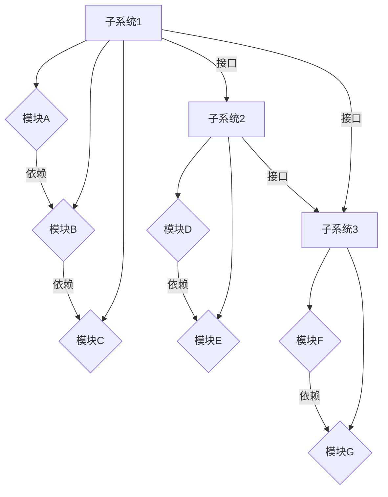
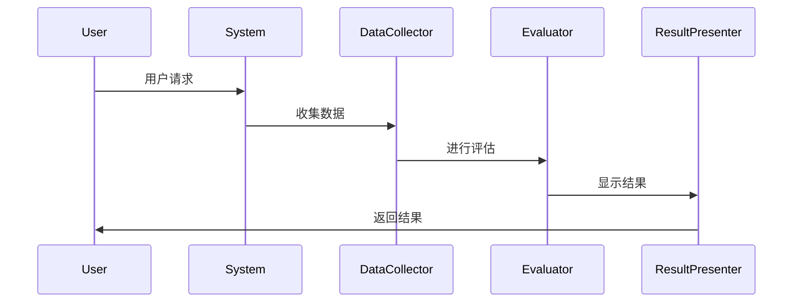
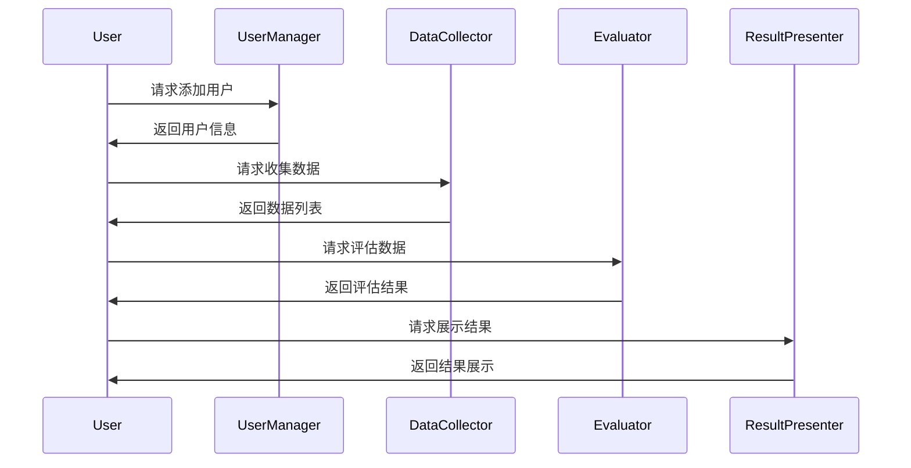

                 

## 第一部分：背景介绍与问题分析

### 第1章：技术决策框架概述

**1.1 问题背景**

在当今技术迅猛发展的时代，技术的创新和更新速度越来越快，企业和组织在技术选择上面临了前所未有的挑战。一方面，技术的进步带来了新的机遇，使得企业在市场上保持竞争力成为可能；另一方面，技术选择的失误可能导致巨大的资源浪费和战略失误。因此，如何做出正确的技术选择成为关键问题。

在技术决策过程中，常见的挑战包括：

- **信息过载**：大量新技术和新方案的出现，企业难以从中筛选出最适合自身的。
- **技术复杂度**：某些技术方案本身具有很高的复杂度，理解和使用都存在一定难度。
- **决策周期**：技术决策过程往往需要较长时间，而市场环境的变化可能迫使企业必须在短时间内做出决策。
- **风险评估**：新技术的不确定性使得企业在选择时难以准确评估其潜在风险。

**1.2 问题描述**

技术决策是指企业在面对技术选择时，基于一系列客观和主观因素，通过分析和评估，最终确定采用何种技术方案的过程。其核心问题是：

- **何为技术决策**：技术决策不仅仅是对技术方案的简单选择，而是一个复杂的过程，涉及到技术评估、风险分析、资源分配等多个方面。
- **技术决策的重要性和影响**：技术决策的正确与否直接关系到企业的战略目标实现，技术选择失误可能导致资源浪费、市场竞争力下降，甚至对企业生存构成威胁。

**1.3 问题解决**

为了解决上述问题，构建一个科学、系统的技术决策框架显得尤为重要。这个框架应包括以下几个关键要素：

- **明确目标**：定义技术决策的目标，明确企业希望通过技术决策达到的预期效果。
- **信息收集**：系统收集和分析与目标技术方案相关的信息，包括技术特性、市场趋势、竞争对手情况等。
- **评估标准**：制定一套明确的评估标准，用于衡量不同技术方案的优劣。
- **风险评估**：对技术方案进行风险评估，识别潜在的风险和不确定性。
- **决策流程**：建立一套科学的决策流程，确保决策过程的透明性和可追溯性。
- **执行与监控**：制定详细的实施计划，并持续监控技术方案的实施效果。

**1.4 边界与外延**

技术决策的范围非常广泛，不仅包括技术本身的选型，还涉及到与该技术相关的各种资源和因素。以下是技术决策的一些边界与外延：

- **技术决策的范围**：从硬件设备、软件平台到开发工具，从单一技术到整个技术栈的集成。
- **技术决策与其他决策的关系**：技术决策与其他类型的决策（如市场决策、财务决策）密切相关，需要综合考虑各种因素。
- **概念结构与核心要素组成**：技术决策框架由多个关键要素构成，包括目标定义、信息收集、评估标准、风险评估、决策流程、执行与监控等，这些要素相互作用，共同构成了一个完整的技术决策体系。

通过构建一个科学、系统的技术决策框架，企业可以更加理性地应对技术选择带来的挑战，从而实现技术驱动的发展目标。

### **1.5 概念结构与核心要素组成**

构建技术决策框架，关键在于明确其概念结构和核心要素。以下是对这些核心要素的详细阐述：

**目标定义**：技术决策的首要任务是明确决策目标。目标定义需要具体、明确，并且符合企业的战略方向。这包括确定技术选型要解决的主要问题，以及预期达到的效果，如提高系统性能、降低成本、增强安全性等。

**信息收集**：信息收集是技术决策的基础。通过系统收集与目标技术方案相关的信息，包括市场趋势、技术特性、竞争对手情况等，可以帮助决策者全面了解各种技术方案的优劣。

- **市场趋势**：了解当前市场的发展动态，有助于预测技术未来的发展方向。
- **技术特性**：掌握技术方案的具体特性，如性能、可扩展性、兼容性等，有助于进行科学的评估。
- **竞争对手情况**：分析竞争对手的技术选择和效果，可以提供重要的参考依据。

**评估标准**：评估标准是衡量不同技术方案优劣的依据。这些标准应具有可量化、可操作的特点，以便于决策者在不同方案之间进行对比。常见的评估标准包括：

- **性能**：系统响应时间、处理能力、吞吐量等。
- **成本**：包括初始投资、运营成本、维护成本等。
- **安全性**：系统的安全性、可靠性、合规性等。
- **可维护性**：系统的可维护性和可扩展性。
- **兼容性**：与现有系统的兼容性，以及与其他技术的集成能力。

**风险评估**：技术决策过程中，风险评估是必不可少的环节。通过识别和分析潜在的风险，决策者可以提前预判可能的问题，并制定相应的应对策略。风险评估的内容包括：

- **技术风险**：如技术的不确定性、兼容性问题、技术更新换代等。
- **市场风险**：如市场需求变化、竞争对手的技术革新等。
- **运营风险**：如系统维护、员工技能提升等。

**决策流程**：一个科学的决策流程可以确保技术决策过程的透明性和可追溯性。决策流程通常包括以下几个步骤：

- **需求分析**：明确技术决策的需求，包括业务需求、技术需求等。
- **方案筛选**：根据收集的信息和评估标准，筛选出符合需求的技术方案。
- **方案评估**：对筛选出的方案进行详细评估，包括成本、性能、安全性等方面。
- **风险评估**：对评估结果进行风险分析，识别和评估潜在风险。
- **决策制定**：根据评估结果和风险分析，制定最终的技术决策。
- **实施计划**：制定详细的实施计划，包括时间表、资源分配等。

**执行与监控**：决策制定后，需要将决策转化为具体的行动，并持续监控实施效果。执行与监控的内容包括：

- **项目启动**：启动技术实施项目，明确项目团队、责任分配等。
- **进度监控**：监控项目进展，确保按照计划进行。
- **效果评估**：在项目完成后，对技术实施效果进行评估，确保达到预期目标。
- **持续改进**：根据评估结果，对技术方案进行调整和优化。

通过以上核心要素的合理配置和科学应用，技术决策框架可以为企业提供一个系统、科学的决策工具，帮助企业在技术选择上做出更为明智的选择。

### **1.5 概念结构与核心要素组成**

构建技术决策框架，关键在于明确其概念结构和核心要素。以下是对这些核心要素的详细阐述：

**目标定义**：技术决策的首要任务是明确决策目标。目标定义需要具体、明确，并且符合企业的战略方向。这包括确定技术选型要解决的主要问题，以及预期达到的效果，如提高系统性能、降低成本、增强安全性等。

**信息收集**：信息收集是技术决策的基础。通过系统收集与目标技术方案相关的信息，包括市场趋势、技术特性、竞争对手情况等，可以帮助决策者全面了解各种技术方案的优劣。

- **市场趋势**：了解当前市场的发展动态，有助于预测技术未来的发展方向。
- **技术特性**：掌握技术方案的具体特性，如性能、可扩展性、兼容性等，有助于进行科学的评估。
- **竞争对手情况**：分析竞争对手的技术选择和效果，可以提供重要的参考依据。

**评估标准**：评估标准是衡量不同技术方案优劣的依据。这些标准应具有可量化、可操作的特点，以便于决策者在不同方案之间进行对比。常见的评估标准包括：

- **性能**：系统响应时间、处理能力、吞吐量等。
- **成本**：包括初始投资、运营成本、维护成本等。
- **安全性**：系统的安全性、可靠性、合规性等。
- **可维护性**：系统的可维护性和可扩展性。
- **兼容性**：与现有系统的兼容性，以及与其他技术的集成能力。

**风险评估**：技术决策过程中，风险评估是必不可少的环节。通过识别和分析潜在的风险，决策者可以提前预判可能的问题，并制定相应的应对策略。风险评估的内容包括：

- **技术风险**：如技术的不确定性、兼容性问题、技术更新换代等。
- **市场风险**：如市场需求变化、竞争对手的技术革新等。
- **运营风险**：如系统维护、员工技能提升等。

**决策流程**：一个科学的决策流程可以确保技术决策过程的透明性和可追溯性。决策流程通常包括以下几个步骤：

- **需求分析**：明确技术决策的需求，包括业务需求、技术需求等。
- **方案筛选**：根据收集的信息和评估标准，筛选出符合需求的技术方案。
- **方案评估**：对筛选出的方案进行详细评估，包括成本、性能、安全性等方面。
- **风险评估**：对评估结果进行风险分析，识别和评估潜在风险。
- **决策制定**：根据评估结果和风险分析，制定最终的技术决策。
- **实施计划**：制定详细的实施计划，包括时间表、资源分配等。

**执行与监控**：决策制定后，需要将决策转化为具体的行动，并持续监控实施效果。执行与监控的内容包括：

- **项目启动**：启动技术实施项目，明确项目团队、责任分配等。
- **进度监控**：监控项目进展，确保按照计划进行。
- **效果评估**：在项目完成后，对技术实施效果进行评估，确保达到预期目标。
- **持续改进**：根据评估结果，对技术方案进行调整和优化。

通过以上核心要素的合理配置和科学应用，技术决策框架可以为企业提供一个系统、科学的决策工具，帮助企业在技术选择上做出更为明智的选择。

### **1.6 技术决策的类型与特点**

在技术决策过程中，根据不同场景和需求，可以分为多种类型。每种类型都有其独特的特点和决策流程。

**1.6.1 新技术应用决策**

**特点**：这类决策通常涉及引入全新技术，以解决现有系统的瓶颈或提升整体性能。技术应用决策通常需要高度的创新性和前瞻性。

**决策流程**：

- **需求识别**：明确引入新技术的具体需求，如提高计算能力、增强数据安全性等。
- **市场调研**：调研市场上潜在的新技术应用方案，评估其创新性、成熟度和可行性。
- **技术评估**：对调研结果进行详细评估，包括技术成熟度、性能指标、成本效益等。
- **风险评估**：对新技术的潜在风险进行评估，包括技术不确定性、市场风险、运营风险等。
- **决策制定**：根据评估结果和风险分析，确定最终的技术应用方案。

**1.6.2 技术更新决策**

**特点**：这类决策通常涉及对现有技术进行升级或更新，以适应业务发展的新需求或解决现有技术的局限性。

**决策流程**：

- **需求分析**：分析现有系统存在的问题和瓶颈，明确技术更新的需求和目标。
- **方案筛选**：根据需求分析结果，筛选出符合要求的技术更新方案。
- **技术评估**：对筛选出的方案进行详细评估，包括成本、性能、兼容性等。
- **风险评估**：对技术更新方案进行风险评估，识别和评估潜在风险。
- **决策制定**：根据评估结果和风险分析，确定最终的技术更新方案。

**1.6.3 技术选型决策**

**特点**：这类决策通常涉及从多个技术方案中选择一个最优方案，以满足特定的技术需求。

**决策流程**：

- **需求识别**：明确技术选型的具体需求，如选择数据库管理系统、开发框架等。
- **方案比较**：根据需求，收集多个技术方案的信息，并进行初步筛选。
- **详细评估**：对初步筛选出的技术方案进行详细评估，包括性能、成本、安全性等方面。
- **风险评估**：对评估结果进行风险分析，识别和评估潜在风险。
- **决策制定**：根据评估结果和风险分析，确定最终的技术选型方案。

通过明确不同类型技术决策的特点和决策流程，企业可以更有针对性地制定技术决策策略，提高决策的科学性和有效性。

### **1.7 技术决策框架的实际应用案例**

为了更好地理解技术决策框架的实际应用，以下将介绍几个具体案例，展示技术决策框架在不同情境下的应用。

**案例1：某互联网公司数据库升级决策**

**背景**：某互联网公司现有的数据库系统在数据存储和查询性能上逐渐无法满足业务增长的需求。公司希望升级数据库系统以提升性能和扩展性。

**应用步骤**：

1. **目标定义**：明确升级数据库系统的目标是提升查询性能、增强数据存储能力、提高系统的可扩展性。
2. **信息收集**：调研市场上主流的数据库技术，如MySQL、PostgreSQL、MongoDB等，收集技术特性、性能指标、成本等方面的信息。
3. **评估标准**：制定评估标准，包括性能、扩展性、安全性、成本等。
4. **方案筛选**：根据评估标准，筛选出符合需求的技术方案，如PostgreSQL和MongoDB。
5. **风险评估**：评估数据库升级方案的风险，包括技术风险、市场风险、运营风险等。
6. **决策制定**：综合评估结果和风险分析，最终选择PostgreSQL作为升级方案。

**效果**：数据库系统升级后，查询性能显著提升，系统的扩展性增强，满足了业务增长的需求。

**案例2：某制造企业自动化生产决策**

**背景**：某制造企业希望引入自动化生产技术，以提高生产效率、降低人力成本。

**应用步骤**：

1. **目标定义**：明确自动化生产的目标是提高生产效率、降低人力成本、提升产品质量。
2. **信息收集**：调研自动化生产相关的技术，如机器人自动化、智能传感器、物联网等。
3. **评估标准**：制定评估标准，包括性能、成本、安全性、兼容性等。
4. **方案筛选**：根据评估标准，筛选出符合需求的技术方案，如机器人自动化系统和智能传感器。
5. **风险评估**：评估自动化生产方案的风险，包括技术风险、市场风险、运营风险等。
6. **决策制定**：综合评估结果和风险分析，最终选择引入机器人自动化系统和智能传感器。

**效果**：自动化生产系统的引入，显著提高了生产效率，降低了人力成本，同时提升了产品质量，实现了企业的生产目标。

**案例3：某金融公司云计算迁移决策**

**背景**：某金融公司希望将部分业务系统迁移到云计算平台，以降低运营成本、提升系统灵活性。

**应用步骤**：

1. **目标定义**：明确云计算迁移的目标是降低运营成本、提升系统灵活性、增强数据安全性。
2. **信息收集**：调研市场上的主流云计算平台，如AWS、Azure、阿里云等，收集平台特性、服务范围、价格等方面的信息。
3. **评估标准**：制定评估标准，包括成本、性能、安全性、兼容性等。
4. **方案筛选**：根据评估标准，筛选出符合需求的技术方案，如AWS和阿里云。
5. **风险评估**：评估云计算迁移方案的风险，包括技术风险、市场风险、数据安全风险等。
6. **决策制定**：综合评估结果和风险分析，最终选择阿里云作为云计算迁移平台。

**效果**：业务系统成功迁移到阿里云后，运营成本显著降低，系统灵活性增强，数据安全性得到提升，实现了公司的云计算目标。

通过这些实际案例，我们可以看到，技术决策框架在实际应用中的重要作用。它不仅帮助企业明确技术决策的目标和标准，还通过系统的评估和风险分析，确保技术选择的科学性和有效性。

### **1.8 技术决策框架的未来发展趋势**

技术决策框架在未来的发展将受到多个趋势的影响，这些趋势包括人工智能、大数据、云计算和物联网等技术的不断进步。以下是技术决策框架未来可能的发展方向：

**1.8.1 人工智能的融入**

随着人工智能技术的不断发展，其在技术决策框架中的应用将变得越来越广泛。人工智能可以通过大数据分析和机器学习算法，提供更为精准和个性化的技术评估和推荐。例如，利用深度学习模型对市场趋势进行预测，帮助决策者更好地理解技术发展的方向。

**1.8.2 大数据的支持**

大数据技术为技术决策提供了丰富的数据资源。通过大数据分析，企业可以更全面地收集和整合各种技术信息，从而提高决策的准确性和效率。例如，利用大数据分析技术，可以实时监控技术市场的动态，快速响应市场变化，为技术决策提供及时的支持。

**1.8.3 云计算的服务化**

云计算的普及使得技术决策框架的服务化成为可能。云计算平台不仅提供了强大的计算资源和数据存储能力，还可以提供一站式的技术决策服务。企业可以通过云计算平台，快速部署和调整技术决策系统，实现高效的技术决策过程。

**1.8.4 物联网的集成**

物联网技术的快速发展，使得设备互联和数据采集变得更加容易。技术决策框架可以通过物联网技术，实时获取各种设备的数据，进行综合分析和决策。例如，在制造业中，物联网技术可以实时监控生产设备的运行状态，帮助决策者做出更合理的生产调度决策。

**1.8.5 透明的决策流程**

未来的技术决策框架将更加注重决策过程的透明性。通过引入区块链技术，可以实现决策过程的去中心化和可追溯性，确保每个决策步骤都透明、公正。此外，人工智能和大数据技术也将进一步提升决策过程的透明度，帮助企业更好地理解和解释技术决策的结果。

**1.8.6 持续的学习与优化**

技术决策框架将具备持续学习和优化的能力。通过实时收集和反馈数据，框架可以不断调整和优化评估模型，提高决策的准确性。例如，利用机器学习算法，技术决策框架可以基于历史决策数据，不断优化评估标准和决策模型，从而提高未来决策的效果。

综上所述，未来的技术决策框架将更加智能化、高效化、透明化，通过融入人工智能、大数据、云计算和物联网等技术，为企业提供更加科学和可靠的决策支持，助力企业在技术迅猛发展的时代中保持竞争优势。

### **1.9 总结**

在本章节中，我们深入探讨了技术决策框架的背景、问题、解决方法以及概念结构与核心要素。首先，通过分析技术迅猛发展带来的决策挑战，我们明确了技术决策的重要性。其次，我们详细阐述了技术决策的定义、核心问题和解决思路。接着，我们介绍了构建技术决策框架的基本思路和核心要素，包括目标定义、信息收集、评估标准、风险评估、决策流程和执行与监控。此外，我们还讨论了技术决策的类型与特点，并通过实际应用案例展示了技术决策框架的实际应用效果。最后，我们展望了技术决策框架的未来发展趋势，探讨了其发展方向和潜在影响。

通过本章节的讨论，我们认识到技术决策框架对于企业科学、系统地进行技术选择具有重要意义。它不仅可以帮助企业应对技术选择带来的挑战，还能提高决策的科学性和有效性，为企业的发展提供有力支持。

## **第二部分：核心概念与联系**

### **第2章：技术评估与选择**

在技术决策过程中，技术评估和技术选择是两个核心环节。有效的技术评估能够帮助企业准确判断技术方案的优势和劣势，而科学的技术选择则能确保所选方案符合企业的实际需求和战略目标。本章将详细讨论技术评估的基本概念、技术选择的策略与技巧，并通过对比不同评估方法和选择策略，帮助读者全面理解技术评估与选择的原理和应用。

#### **2.1节：技术评估的基本概念**

**技术评估的定义与目的**

技术评估是指通过对技术方案进行系统的分析和评价，以确定其是否适合企业需求，并判断其潜在效益和风险的过程。技术评估的目的在于为企业提供科学依据，以支持技术决策。

- **技术评估的定义**：技术评估是对技术方案进行全面、客观、系统的分析和评价，以确定其技术性能、经济效益和社会效益等。
- **技术评估的目的**：帮助决策者识别和选择最佳技术方案，降低决策风险，确保技术投资的有效性和合理性。

**技术评估的分类**

技术评估可以根据评估方法和评估目的的不同，分为多种类型：

- **按评估方法分类**：定量评估和定性评估。
  - **定量评估**：通过具体的数值和指标，对技术方案进行量化的评估。这种方法适用于对技术性能、成本效益等方面进行客观评价。
  - **定性评估**：通过主观评价和专家意见，对技术方案进行评价。这种方法适用于对技术方案的潜在风险、社会影响等方面进行评估。

- **按评估目的分类**：技术性能评估、成本效益评估、风险评估等。
  - **技术性能评估**：主要评价技术方案的功能性、可靠性、可扩展性等技术性能。
  - **成本效益评估**：主要评价技术方案的投资回报率、成本效益比等经济指标。
  - **风险评估**：主要评价技术方案可能带来的风险，如技术风险、市场风险、运营风险等。

**技术评估的流程**

技术评估通常包括以下步骤：

1. **需求分析**：明确评估的目标和需求，包括技术性能、成本效益、风险等方面。
2. **信息收集**：收集与评估目标相关的技术方案信息，包括技术特性、市场趋势、竞争对手情况等。
3. **制定评估标准**：根据需求分析结果，制定具体的评估标准和指标。
4. **评估方法选择**：选择适合的评估方法，如定量评估、定性评估等。
5. **评估实施**：根据制定的评估标准和评估方法，对技术方案进行评估。
6. **结果分析**：对评估结果进行分析和比较，确定技术方案的优劣。
7. **风险评估**：对技术方案进行风险分析，识别和评估潜在风险。
8. **决策制定**：根据评估结果和风险分析，制定最终的技术决策。

通过以上流程，技术评估可以帮助企业全面、系统地评价技术方案，为技术选择提供科学依据。

#### **2.2节：技术选择的策略与技巧**

**技术选择的决策方法**

技术选择过程中，常见的决策方法包括以下几种：

- **传统决策方法**：如成本效益分析法、评分法、SWOT分析法等。
  - **成本效益分析法**：通过比较不同技术方案的成本和效益，选择经济效益最高的方案。
  - **评分法**：根据评估标准，对技术方案进行评分，选择得分最高的方案。
  - **SWOT分析法**：分析技术方案的优势、劣势、机会和威胁，选择最符合企业战略的方案。

- **创新型决策方法**：如多目标决策方法、多属性决策方法、基于场景的决策方法等。
  - **多目标决策方法**：在技术选择过程中，考虑多个目标，如性能、成本、安全性等，通过权衡不同目标之间的关系，选择最优方案。
  - **多属性决策方法**：在考虑多个属性（如性能、成本、安全性等）的情况下，通过建立数学模型，进行综合评估和决策。
  - **基于场景的决策方法**：根据实际应用场景和需求，选择最适合的技术方案。

**技术选择的策略**

技术选择过程中，可以采用以下策略：

- **平衡策略**：在多个评估标准之间寻找平衡，确保技术方案在各个方面都能满足企业需求。
- **优先策略**：根据企业需求，确定优先考虑的评估标准，如性能、安全性等，优先选择在这些方面表现最优的技术方案。
- **弹性策略**：在技术选择过程中，预留一定的灵活性，以便在未来根据实际情况进行调整。
- **多元化策略**：选择多种技术方案，以应对不同场景和需求，提高系统的稳定性和适应性。

**技术选择的技巧**

为了提高技术选择的科学性和有效性，可以采用以下技巧：

- **广泛收集信息**：在技术选择过程中，广泛收集与目标技术方案相关的信息，包括市场趋势、技术特性、竞争对手情况等。
- **专家意见咨询**：邀请领域内的专家进行意见咨询，获取专业建议，提高评估的准确性和可靠性。
- **试点实验**：在最终决策前，进行试点实验，验证技术方案的可行性和效果。
- **动态调整**：根据技术评估结果和实际应用效果，动态调整技术选择策略，确保技术方案能够持续满足企业需求。

通过以上策略和技巧，企业可以更加科学和有效地进行技术选择，确保所选技术方案能够实现预期目标，为企业的发展提供有力支持。

#### **2.3节：核心概念对比**

**技术评估方法对比**

在技术评估过程中，不同的评估方法各有优缺点，适用于不同的评估场景。以下是对定量评估方法和定性评估方法的主要特点进行对比：

- **定量评估方法**：

  - **优点**：
    - **客观性**：通过具体的数值和指标，使得评估结果更加客观、可量化。
    - **精确性**：能够提供详细的评估数据，便于分析和比较。
    - **可重复性**：评估过程和结果具有可重复性，便于不同时间段或不同评估者的对比。

  - **缺点**：
    - **局限性**：对某些复杂、抽象的技术特性，定量评估可能难以全面反映其真实情况。
    - **依赖数据质量**：评估结果依赖于数据的准确性和完整性，数据质量差可能导致评估结果失真。

- **定性评估方法**：

  - **优点**：
    - **全面性**：能够从多个维度评估技术方案，如社会影响、用户体验等。
    - **灵活性**：评估方法灵活，可以根据具体需求进行调整。
    - **主观性**：评估结果更具人性化，可以更好地反映决策者的主观意愿。

  - **缺点**：
    - **主观性**：评估结果可能受评估者经验和偏见的影响，缺乏客观性。
    - **不可重复性**：评估过程和结果难以重复，导致评估结果的可信度降低。
    - **缺乏量化依据**：评估结果难以用具体的数据指标进行量化，不利于科学决策。

**技术选择策略对比**

在技术选择过程中，不同的策略适用于不同的决策场景。以下是对传统决策方法和创新型决策方法的主要特点进行对比：

- **传统决策方法**：

  - **优点**：
    - **简洁性**：决策流程简单，易于理解和执行。
    - **适用性**：适用于大多数常规的技术选择场景。

  - **缺点**：
    - **局限性**：难以处理复杂的多目标、多属性决策问题。
    - **主观性**：决策过程中可能受到评估者个人经验和偏见的影响。

- **创新型决策方法**：

  - **优点**：
    - **科学性**：基于数学模型和数据分析，提高决策的准确性和科学性。
    - **灵活性**：能够处理复杂、多变的技术选择问题。
    - **系统性**：考虑多个目标和因素，进行全面的评估和决策。

  - **缺点**：
    - **复杂性**：决策流程复杂，需要较高的专业知识和技能。
    - **成本高**：需要投入更多的时间和资源进行数据收集和分析。

通过对比不同评估方法和选择策略，企业可以根据具体需求和环境选择最适合的方法和策略，确保技术选择的科学性和有效性。

#### **2.4节：ER实体关系图架构**

**实体关系图的定义与作用**

实体关系图（Entity-Relationship Diagram，ER图）是数据库设计中的重要工具，用于表示实体以及实体之间的联系。ER图通过直观的方式展示了数据库中各类数据对象之间的关系，为数据库设计和数据建模提供了便利。

- **实体**：实体是数据库中的基本对象，代表实际世界中的人、事、物等。例如，在学生管理系统中，实体可以包括学生、课程、教师等。
- **属性**：实体具有若干属性，用于描述实体的特征。例如，学生实体可以包括学号、姓名、年龄等属性。
- **关系**：实体之间的关系描述了它们之间的关联。例如，学生和课程之间可以存在选修关系，学生和教师之间可以存在授课关系。

**技术评估与选择中的实体关系**

在技术评估与选择过程中，可以运用ER图来描述不同实体及其关系，帮助理解技术方案的整体架构和功能。以下是一个简化的ER图示例，用于描述技术评估中的几个关键实体及其关系：

```mermaid
erDiagram
    Student ||--|{ Course : takes }
    Student ||--|{ Teacher : teaches }
    Course ||--|{ CourseMaterial : provides }
    Teacher ||--|{ TeacherEvaluation : receives }
```

- **Student（学生）**：实体，具有学号、姓名、年龄等属性。
- **Course（课程）**：实体，具有课程编号、课程名、学分等属性。
- **Teacher（教师）**：实体，具有教师编号、姓名、职称等属性。
- **CourseMaterial（课程资料）**：实体，具有资料编号、资料名称等属性。
- **TeacherEvaluation（教师评估）**：实体，用于记录学生对教师的评估信息。

**ER图的Mermaid表示**

以下是一个使用Mermaid表示的ER图示例，展示了学生、课程、教师和课程资料之间的关系：

```mermaid
erDiagram
    Student ||--|{ Course : takes }
    Student ||--|{ Teacher : teaches }
    Course ||--|{ CourseMaterial : provides }
    Teacher ||--|{ TeacherEvaluation : receives }
```

通过ER图，可以清晰地展示技术评估过程中涉及的主要实体及其关系，为后续的详细分析提供了结构化的基础。同时，ER图也帮助决策者更好地理解技术方案的整体架构和功能，从而做出更为科学和合理的决策。

### **第2章：技术评估与选择**

在技术决策过程中，技术评估和技术选择是两个核心环节。有效的技术评估能够帮助企业准确判断技术方案的优势和劣势，而科学的技术选择则能确保所选方案符合企业的实际需求和战略目标。本章将详细讨论技术评估的基本概念、技术选择的策略与技巧，并通过对比不同评估方法和选择策略，帮助读者全面理解技术评估与选择的原理和应用。

#### **2.1节：技术评估的基本概念**

**技术评估的定义与目的**

技术评估是指通过对技术方案进行系统的分析和评价，以确定其是否适合企业需求，并判断其潜在效益和风险的过程。技术评估的目的在于为企业提供科学依据，以支持技术决策。

- **技术评估的定义**：技术评估是对技术方案进行全面、客观、系统的分析和评价，以确定其技术性能、经济效益和社会效益等。
- **技术评估的目的**：帮助决策者识别和选择最佳技术方案，降低决策风险，确保技术投资的有效性和合理性。

**技术评估的分类**

技术评估可以根据评估方法和评估目的的不同，分为多种类型：

- **按评估方法分类**：定量评估和定性评估。
  - **定量评估**：通过具体的数值和指标，对技术方案进行量化的评估。这种方法适用于对技术性能、成本效益等方面进行客观评价。
  - **定性评估**：通过主观评价和专家意见，对技术方案进行评价。这种方法适用于对技术方案的潜在风险、社会影响等方面进行评估。

- **按评估目的分类**：技术性能评估、成本效益评估、风险评估等。
  - **技术性能评估**：主要评价技术方案的功能性、可靠性、可扩展性等技术性能。
  - **成本效益评估**：主要评价技术方案的投资回报率、成本效益比等经济指标。
  - **风险评估**：主要评价技术方案可能带来的风险，如技术风险、市场风险、运营风险等。

**技术评估的流程**

技术评估通常包括以下步骤：

1. **需求分析**：明确评估的目标和需求，包括技术性能、成本效益、风险等方面。
2. **信息收集**：收集与评估目标相关的技术方案信息，包括技术特性、市场趋势、竞争对手情况等。
3. **制定评估标准**：根据需求分析结果，制定具体的评估标准和指标。
4. **评估方法选择**：选择适合的评估方法，如定量评估、定性评估等。
5. **评估实施**：根据制定的评估标准和评估方法，对技术方案进行评估。
6. **结果分析**：对评估结果进行分析和比较，确定技术方案的优劣。
7. **风险评估**：对技术方案进行风险分析，识别和评估潜在风险。
8. **决策制定**：根据评估结果和风险分析，制定最终的技术决策。

通过以上流程，技术评估可以帮助企业全面、系统地评价技术方案，为技术选择提供科学依据。

#### **2.2节：技术选择的策略与技巧**

**技术选择的决策方法**

技术选择过程中，常见的决策方法包括以下几种：

- **传统决策方法**：如成本效益分析法、评分法、SWOT分析法等。
  - **成本效益分析法**：通过比较不同技术方案的成本和效益，选择经济效益最高的方案。
  - **评分法**：根据评估标准，对技术方案进行评分，选择得分最高的方案。
  - **SWOT分析法**：分析技术方案的优势、劣势、机会和威胁，选择最符合企业战略的方案。

- **创新型决策方法**：如多目标决策方法、多属性决策方法、基于场景的决策方法等。
  - **多目标决策方法**：在技术选择过程中，考虑多个目标，如性能、成本、安全性等，通过权衡不同目标之间的关系，选择最优方案。
  - **多属性决策方法**：在考虑多个属性（如性能、成本、安全性等）的情况下，通过建立数学模型，进行综合评估和决策。
  - **基于场景的决策方法**：根据实际应用场景和需求，选择最适合的技术方案。

**技术选择的策略**

技术选择过程中，可以采用以下策略：

- **平衡策略**：在多个评估标准之间寻找平衡，确保技术方案在各个方面都能满足企业需求。
- **优先策略**：根据企业需求，确定优先考虑的评估标准，如性能、安全性等，优先选择在这些方面表现最优的技术方案。
- **弹性策略**：在技术选择过程中，预留一定的灵活性，以便在未来根据实际情况进行调整。
- **多元化策略**：选择多种技术方案，以应对不同场景和需求，提高系统的稳定性和适应性。

**技术选择的技巧**

为了提高技术选择的科学性和有效性，可以采用以下技巧：

- **广泛收集信息**：在技术选择过程中，广泛收集与目标技术方案相关的信息，包括市场趋势、技术特性、竞争对手情况等。
- **专家意见咨询**：邀请领域内的专家进行意见咨询，获取专业建议，提高评估的准确性和可靠性。
- **试点实验**：在最终决策前，进行试点实验，验证技术方案的可行性和效果。
- **动态调整**：根据技术评估结果和实际应用效果，动态调整技术选择策略，确保技术方案能够持续满足企业需求。

通过以上策略和技巧，企业可以更加科学和有效地进行技术选择，确保所选技术方案能够实现预期目标，为企业的发展提供有力支持。

#### **2.3节：核心概念对比**

**技术评估方法对比**

在技术评估过程中，不同的评估方法各有优缺点，适用于不同的评估场景。以下是对定量评估方法和定性评估方法的主要特点进行对比：

- **定量评估方法**：

  - **优点**：
    - **客观性**：通过具体的数值和指标，使得评估结果更加客观、可量化。
    - **精确性**：能够提供详细的评估数据，便于分析和比较。
    - **可重复性**：评估过程和结果具有可重复性，便于不同时间段或不同评估者的对比。

  - **缺点**：
    - **局限性**：对某些复杂、抽象的技术特性，定量评估可能难以全面反映其真实情况。
    - **依赖数据质量**：评估结果依赖于数据的准确性和完整性，数据质量差可能导致评估结果失真。

- **定性评估方法**：

  - **优点**：
    - **全面性**：能够从多个维度评估技术方案，如社会影响、用户体验等。
    - **灵活性**：评估方法灵活，可以根据具体需求进行调整。
    - **主观性**：评估结果更具人性化，可以更好地反映决策者的主观意愿。

  - **缺点**：
    - **主观性**：评估结果可能受评估者经验和偏见的影响，缺乏客观性。
    - **不可重复性**：评估过程和结果难以重复，导致评估结果的可信度降低。
    - **缺乏量化依据**：评估结果难以用具体的数据指标进行量化，不利于科学决策。

**技术选择策略对比**

在技术选择过程中，不同的策略适用于不同的决策场景。以下是对传统决策方法和创新型决策方法的主要特点进行对比：

- **传统决策方法**：

  - **优点**：
    - **简洁性**：决策流程简单，易于理解和执行。
    - **适用性**：适用于大多数常规的技术选择场景。

  - **缺点**：
    - **局限性**：难以处理复杂的多目标、多属性决策问题。
    - **主观性**：决策过程中可能受到评估者个人经验和偏见的影响。

- **创新型决策方法**：

  - **优点**：
    - **科学性**：基于数学模型和数据分析，提高决策的准确性和科学性。
    - **灵活性**：能够处理复杂、多变的技术选择问题。
    - **系统性**：考虑多个目标和因素，进行全面的评估和决策。

  - **缺点**：
    - **复杂性**：决策流程复杂，需要较高的专业知识和技能。
    - **成本高**：需要投入更多的时间和资源进行数据收集和分析。

通过对比不同评估方法和选择策略，企业可以根据具体需求和环境选择最适合的方法和策略，确保技术选择的科学性和有效性。

#### **2.4节：ER实体关系图架构**

**实体关系图的定义与作用**

实体关系图（Entity-Relationship Diagram，ER图）是数据库设计中的重要工具，用于表示实体以及实体之间的联系。ER图通过直观的方式展示了数据库中各类数据对象之间的关系，为数据库设计和数据建模提供了便利。

- **实体**：实体是数据库中的基本对象，代表实际世界中的人、事、物等。例如，在学生管理系统中，实体可以包括学生、课程、教师等。
- **属性**：实体具有若干属性，用于描述实体的特征。例如，学生实体可以包括学号、姓名、年龄等属性。
- **关系**：实体之间的关系描述了它们之间的关联。例如，学生和课程之间可以存在选修关系，学生和教师之间可以存在授课关系。

**技术评估与选择中的实体关系**

在技术评估与选择过程中，可以运用ER图来描述不同实体及其关系，帮助理解技术方案的整体架构和功能。以下是一个简化的ER图示例，用于描述技术评估中的几个关键实体及其关系：

```mermaid
erDiagram
    Student ||--|{ Course : takes }
    Student ||--|{ Teacher : teaches }
    Course ||--|{ CourseMaterial : provides }
    Teacher ||--|{ TeacherEvaluation : receives }
```

- **Student（学生）**：实体，具有学号、姓名、年龄等属性。
- **Course（课程）**：实体，具有课程编号、课程名、学分等属性。
- **Teacher（教师）**：实体，具有教师编号、姓名、职称等属性。
- **CourseMaterial（课程资料）**：实体，具有资料编号、资料名称等属性。
- **TeacherEvaluation（教师评估）**：实体，用于记录学生对教师的评估信息。

**ER图的Mermaid表示**

以下是一个使用Mermaid表示的ER图示例，展示了学生、课程、教师和课程资料之间的关系：

```mermaid
erDiagram
    Student ||--|{ Course : takes }
    Student ||--|{ Teacher : teaches }
    Course ||--|{ CourseMaterial : provides }
    Teacher ||--|{ TeacherEvaluation : receives }
```

通过ER图，可以清晰地展示技术评估过程中涉及的主要实体及其关系，为后续的详细分析提供了结构化的基础。同时，ER图也帮助决策者更好地理解技术方案的整体架构和功能，从而做出更为科学和合理的决策。

## **第三部分：算法原理讲解**

### **第3章：技术决策中的算法应用**

在技术决策过程中，算法的应用极大地提升了决策的科学性和准确性。本章将详细介绍三种常见算法——决策树算法、启发式算法和机器学习算法，探讨其在技术决策中的应用原理和实现方法。

#### **3.1节：决策树算法**

**决策树的基本原理**

决策树（Decision Tree）是一种树形结构，用于展示数据集中不同特征值的分类或回归结果。每个内部节点代表一个特征，每个分支代表该特征的不同取值，每个叶子节点代表一个类别或数值预测。

- **基本原理**：通过训练数据集，构建一棵决策树，然后使用这棵树对新的数据实例进行分类或预测。
- **优点**：直观易懂、易于解释，可以处理多类别分类和回归问题。

**决策树的构建过程**

决策树的构建过程包括以下几个步骤：

1. **特征选择**：选择最优特征，常用的方法包括信息增益、基尼指数等。
2. **划分数据集**：使用选定的特征对数据集进行划分，形成子数据集。
3. **递归构建**：对每个子数据集重复上述过程，直至达到停止条件（如最大树深度、最小样本量等）。
4. **生成决策树**：将所有内部节点和叶子节点连接起来，形成完整的决策树。

**决策树的Python代码实现**

以下是一个使用Python实现的简单决策树算法示例：

```python
from sklearn.datasets import load_iris
from sklearn.tree import DecisionTreeClassifier
from sklearn.model_selection import train_test_split

# 加载数据集
iris = load_iris()
X = iris.data
y = iris.target

# 划分训练集和测试集
X_train, X_test, y_train, y_test = train_test_split(X, y, test_size=0.3, random_state=42)

# 构建决策树模型
clf = DecisionTreeClassifier(max_depth=3)
clf.fit(X_train, y_train)

# 预测测试集
y_pred = clf.predict(X_test)

# 评估模型性能
accuracy = clf.score(X_test, y_test)
print(f"模型准确率：{accuracy:.2f}")
```

#### **3.2节：启发式算法**

**启发式算法的基本概念**

启发式算法（Heuristic Algorithm）是一种在给定问题空间中搜索解决方案的算法。与经典搜索算法（如深度优先搜索、广度优先搜索等）不同，启发式算法不保证找到最优解，但通常能快速找到较好的解。

- **基本概念**：通过使用一些启发信息（如经验规则、局部最优原则等），快速找到问题的近似解。
- **优点**：计算速度快、适用于大规模、复杂问题。

**启发式算法的应用场景**

启发式算法适用于以下几种场景：

- **组合优化问题**：如旅行商问题、作业调度问题等，这些问题的目标是在满足一定约束条件下找到最优或近似最优解。
- **路径规划问题**：如机器人路径规划、无人机导航等，启发式算法可以快速找到可行的路径。
- **资源分配问题**：如网络资源分配、服务器负载均衡等，启发式算法可以快速分配资源，提高系统效率。

**启发式算法的Python代码实现**

以下是一个使用Python实现的简单启发式算法示例，用于解决旅行商问题（TSP）：

```python
import random

# 旅行商问题（TSP）的启发式算法实现
def tsp_heuristic(points):
    # 初始化路径
    path = [random.randint(0, len(points) - 1)]
    for _ in range(len(points) - 1):
        # 找到未被访问的最近点
        next_point = min(
            filter(
                lambda p: p[0] not in path,
                points[path[-1]]),
            key=lambda p: p[1]
        )
        # 更新路径
        path.append(next_point[0])
    return path

# 示例数据
points = [
    (0, 2), (1, 0), (3, 1), (4, 4), (6, 6), (8, 2),
    (9, 6), (10, 7), (11, 7), (12, 4), (13, 1), (14, 1)
]

# 运行启发式算法
path = tsp_heuristic(points)
print(f"最优路径：{path}")
```

#### **3.3节：机器学习算法**

**机器学习算法的基本原理**

机器学习算法（Machine Learning Algorithm）是一类能够从数据中自动学习规律和模式，并用于预测或决策的算法。机器学习算法主要包括监督学习、无监督学习和强化学习。

- **基本原理**：通过训练数据集，机器学习算法能够学习数据中的规律和模式，并将其应用于新的数据实例进行预测或分类。
- **优点**：能够处理复杂、大规模的数据，适应性和泛化能力强。

**机器学习算法的选择依据**

选择合适的机器学习算法取决于以下因素：

- **数据类型**：监督学习适用于有标签的数据，无监督学习适用于无标签的数据。
- **问题类型**：分类问题通常使用分类算法，回归问题通常使用回归算法。
- **数据量**：对于大数据集，一些高效算法（如随机森林、支持向量机）可能更适用。
- **计算资源**：根据计算资源限制，选择合适的算法，如深度学习算法可能需要较高的计算资源。

**机器学习算法的Python代码实现**

以下是一个使用Python实现的简单机器学习算法示例，使用决策树进行分类：

```python
from sklearn.datasets import load_iris
from sklearn.model_selection import train_test_split
from sklearn.tree import DecisionTreeClassifier
from sklearn.metrics import accuracy_score

# 加载数据集
iris = load_iris()
X = iris.data
y = iris.target

# 划分训练集和测试集
X_train, X_test, y_train, y_test = train_test_split(X, y, test_size=0.3, random_state=42)

# 构建决策树模型
clf = DecisionTreeClassifier()
clf.fit(X_train, y_train)

# 预测测试集
y_pred = clf.predict(X_test)

# 评估模型性能
accuracy = accuracy_score(y_test, y_pred)
print(f"模型准确率：{accuracy:.2f}")
```

通过以上三个算法的讲解和实现，我们可以看到，不同的算法在技术决策中的应用各有特点。决策树算法适用于直观、易解释的决策问题；启发式算法适用于快速求解大规模问题；机器学习算法则能处理复杂、不确定的数据问题。企业可以根据具体需求选择合适的算法，以提高技术决策的科学性和准确性。

#### **3.4节：算法原理的Mermaid流程图**

为了更好地理解决策树算法、启发式算法和机器学习算法的原理，我们可以使用Mermaid流程图来直观地展示算法的基本流程和关键步骤。

**决策树算法的Mermaid流程图**

以下是决策树算法的一个简化Mermaid流程图示例：

```mermaid
graph TD
    A[开始] --> B[特征选择]
    B -->|信息增益| C{信息增益最大？}
    C -->|是| D[创建内部节点]
    C -->|否| E[终止]
    D --> F{划分数据集}
    F -->|继续划分| D
    F -->|终止| G[创建叶子节点]
    G --> H[分类结果]
    H -->|结束|
```

**启发式算法的Mermaid流程图**

以下是启发式算法的一个简化Mermaid流程图示例，以旅行商问题（TSP）的启发式算法为例：

```mermaid
graph TD
    A[开始] --> B[初始化路径]
    B --> C[找到最近未访问点]
    C -->|未访问点？| D{是？}
    D --> E[更新路径]
    D -->|否| F[终止]
    E --> C
    F --> G[输出最优路径]
    G -->|结束|
```

**机器学习算法的Mermaid流程图**

以下是机器学习算法的一个简化Mermaid流程图示例，以决策树分类算法为例：

```mermaid
graph TD
    A[开始] --> B[加载数据集]
    B --> C[预处理数据]
    C --> D[划分训练集和测试集]
    D --> E[构建决策树模型]
    E --> F[训练模型]
    F --> G[预测测试集]
    G --> H[评估模型性能]
    H -->|性能满足要求？| I{是？}
    H -->|否| J[调整模型参数]
    I --> K[应用模型]
    J --> F
    K -->|结束|
```

通过这些Mermaid流程图，我们可以清晰地看到各个算法的基本步骤和流程，有助于更好地理解算法的实现原理和应用场景。

### **第4章：技术决策中的数学工具**

在技术决策过程中，数学工具的应用能够显著提高决策的科学性和准确性。本章将介绍几种常用的数学工具，包括线性规划、决策树中的数学公式和机器学习算法中的数学公式。通过详细的讲解和实例，我们将帮助读者理解这些数学工具在技术决策中的应用。

#### **4.1节：线性规划**

**线性规划的基本概念**

线性规划（Linear Programming，LP）是一种数学方法，用于在给定约束条件下，求解线性目标函数的最大值或最小值。线性规划广泛应用于资源分配、生产调度、财务规划等领域。

- **目标函数**：线性规划的目标是最大化或最小化一个线性函数。例如，最大化利润或最小化成本。
- **约束条件**：线性规划需要在满足一系列线性不等式或等式的约束条件下进行。这些约束条件可以是资源的限制、时间的限制等。

**线性规划的目标函数与约束条件**

线性规划的目标函数通常表示为：

\[ \text{minimize } c^T x \]
\[ \text{subject to } Ax \leq b \]

其中：
- \( c \) 是目标函数的系数向量。
- \( x \) 是决策变量向量。
- \( A \) 是约束条件的系数矩阵。
- \( b \) 是约束条件的常数向量。

**线性规划的数学公式**

线性规划的标准形式为：

\[ \text{minimize } c^T x \]
\[ \text{subject to } Ax \leq b \]
\[ x \geq 0 \]

其中 \( x \geq 0 \) 表示决策变量非负约束。

**线性规划的Python代码实现**

以下是一个使用Python的`scipy.optimize`库实现的线性规划示例：

```python
from scipy.optimize import linprog

# 目标函数系数
c = [-1, -1]  # 最小化 -x1 - x2

# 约束条件系数矩阵
A = [[1, 1], [-1, 2]]

# 约束条件常数向量
b = [4, 3]

# 解线性规划问题
result = linprog(c, A_ub=A, b_ub=b, method='highs')

# 输出结果
print(f"最优解：{result.x}")
print(f"目标函数值：{result.fun}")
```

**线性规划的详细讲解与举例**

假设我们有一家工厂，生产A型和B型两种产品。每个A型产品需要2小时的加工时间和1小时的装配时间，每个B型产品需要1小时的加工时间和2小时的装配时间。工厂每天总共拥有8小时的加工时间和8小时的装配时间。我们的目标是最大化每天的总利润，其中A型产品每件利润为$3，B型产品每件利润为$2。

- **目标函数**：最大化 \(3x_1 + 2x_2\)（\(x_1\) 和 \(x_2\) 分别表示A型和B型产品的产量）。
- **约束条件**：
  - 加工时间：\(2x_1 + x_2 \leq 8\)
  - 装配时间：\(x_1 + 2x_2 \leq 8\)
  - 非负约束：\(x_1, x_2 \geq 0\)

根据线性规划公式，我们可以构建以下模型：

\[ \text{maximize } 3x_1 + 2x_2 \]
\[ \text{subject to } \begin{cases}
2x_1 + x_2 &\leq 8 \\
x_1 + 2x_2 &\leq 8 \\
x_1, x_2 &\geq 0
\end{cases} \]

使用线性规划求解器，我们可以得到最优解为 \(x_1 = 4\) 和 \(x_2 = 0\)，即每天生产4个A型产品，不生产B型产品，能够实现最大化的利润。

#### **4.2节：决策树中的数学公式**

**决策树的数学模型**

决策树（Decision Tree）是一种常见的分类和回归模型。决策树的每个节点都表示一个特征，每个分支代表该特征的不同取值，每个叶子节点代表一个类别或数值预测。决策树的构建过程通常基于一些数学公式和准则，如信息增益、基尼指数等。

- **信息增益**：信息增益（Information Gain）用于评估一个特征对于分类的贡献。信息增益的公式为：

\[ IG(D, A) = HD(D) - \sum_{v \in A} \frac{|D_v|}{|D|} HD(D_v) \]

其中：
- \( D \) 是数据集。
- \( A \) 是特征集合。
- \( D_v \) 是在特征 \( v \) 下具有特定取值的数据子集。
- \( HD \) 和 \( HD_v \) 分别是数据集和子集的熵。

- **基尼指数**：基尼指数（Gini Index）用于评估一个特征对于分类的纯度。基尼指数的公式为：

\[ Gini(D) = 1 - \sum_{v \in A} \frac{|D_v|}{|D|}^2 \]

其中：
- \( D \) 是数据集。
- \( A \) 是特征集合。
- \( D_v \) 是在特征 \( v \) 下具有特定取值的数据子集。

**信息增益与基尼指数的对比**

- **信息增益**：
  - **优点**：能够处理多类别分类问题，适用于高维度数据。
  - **缺点**：在某些情况下可能产生偏差，对大样本数据效果较好。

- **基尼指数**：
  - **优点**：在处理二类分类问题时效果较好，计算简单。
  - **缺点**：对于多类别分类问题可能不够准确。

**决策树的数学公式推导**

以信息增益为例，推导其公式如下：

1. **数据集的熵**：数据集 \( D \) 的熵 \( HD \) 计算公式为：

\[ HD(D) = -\sum_{y \in Y} p(y) \log_2 p(y) \]

其中：
- \( Y \) 是数据集 \( D \) 的类别集合。
- \( p(y) \) 是类别 \( y \) 在数据集 \( D \) 中的概率。

2. **特征 \( A \) 的熵**：在特征 \( A \) 下，对于每个取值 \( v \)，数据集分为 \( D_v \)。特征 \( A \) 的熵 \( HA \) 计算公式为：

\[ HA = -\sum_{v \in A} p(v) \log_2 p(v) \]

其中：
- \( p(v) \) 是特征 \( v \) 在数据集 \( D \) 中的概率。

3. **特征 \( A \) 的信息增益**：信息增益 \( IG(D, A) \) 计算公式为：

\[ IG(D, A) = HD(D) - \sum_{v \in A} \frac{|D_v|}{|D|} HD(D_v) \]

其中：
- \( |D| \) 是数据集 \( D \) 的样本数量。
- \( |D_v| \) 是在特征 \( v \) 下具有特定取值的数据子集 \( D_v \) 的样本数量。

通过以上推导，我们可以看到信息增益是通过比较数据集 \( D \) 的熵和特征 \( A \) 的熵来衡量特征 \( A \) 对于分类的贡献。信息增益越大，特征 \( A \) 对分类的影响越大。

**决策树中的数学公式应用实例**

假设我们有一个数据集，包含三个特征（A、B、C）和两个类别（0和1）。现在我们需要构建一个决策树，并计算每个特征的信息增益。

1. **计算数据集的熵**：首先计算原始数据集的熵 \( HD \)。

\[ HD(D) = -p(0) \log_2 p(0) - p(1) \log_2 p(1) \]

2. **计算每个特征的熵**：分别计算特征 A、B、C 的熵 \( HA \)、\( HB \)、\( HC \)。

\[ HA = -p(A=0) \log_2 p(A=0) - p(A=1) \log_2 p(A=1) \]
\[ HB = -p(B=0) \log_2 p(B=0) - p(B=1) \log_2 p(B=1) \]
\[ HC = -p(C=0) \log_2 p(C=0) - p(C=1) \log_2 p(C=1) \]

3. **计算每个特征的信息增益**：使用信息增益公式计算每个特征的信息增益 \( IG(D, A) \)、\( IG(D, B) \)、\( IG(D, C) \)。

\[ IG(D, A) = HD(D) - \sum_{v \in A} \frac{|D_v|}{|D|} HD(D_v) \]
\[ IG(D, B) = HD(D) - \sum_{v \in B} \frac{|D_v|}{|D|} HD(D_v) \]
\[ IG(D, C) = HD(D) - \sum_{v \in C} \frac{|D_v|}{|D|} HD(D_v) \]

通过以上步骤，我们可以计算出每个特征的信息增益，并根据信息增益选择最优特征进行划分。

#### **4.3节：机器学习算法中的数学公式**

机器学习算法是一类通过数据训练来预测或决策的算法，不同的算法有不同的数学模型和公式。本节将介绍几种常见的机器学习算法的数学模型。

**感知机的数学模型**

感知机（Perceptron）是一种简单的二分类算法，其数学模型基于线性模型。

\[ y = \text{sign}(w^T x + b) \]

其中：
- \( y \) 是预测的类别。
- \( x \) 是特征向量。
- \( w \) 是权重向量。
- \( b \) 是偏置。
- \( \text{sign} \) 是符号函数，\( \text{sign}(x) = 1 \) 如果 \( x \geq 0 \)，否则 \( \text{sign}(x) = -1 \)。

**支持向量机的数学模型**

支持向量机（Support Vector Machine，SVM）是一种强大的分类算法，其数学模型基于最大化间隔。

\[ \text{maximize } \frac{1}{2} ||w||^2 \]
\[ \text{subject to } y_i (w^T x_i + b) \geq 1 \]

其中：
- \( w \) 是权重向量。
- \( x_i \) 是特征向量。
- \( y_i \) 是类别标签。
- \( b \) 是偏置。

**随机森林的数学模型**

随机森林（Random Forest）是一种集成学习方法，其数学模型基于决策树和Bootstrap抽样。

1. **Bootstrap抽样**：对训练数据集进行抽样，生成多个子数据集。
2. **构建决策树**：在每个子数据集上构建决策树模型。
3. **集成决策**：对每个决策树的输出进行集成，通常使用投票或平均法。

随机森林的预测公式可以表示为：

\[ \hat{y} = \text{mode}(\hat{y}_1, \hat{y}_2, ..., \hat{y}_n) \]

其中：
- \( \hat{y} \) 是预测的类别。
- \( \hat{y}_i \) 是第 \( i \) 个决策树模型的预测结果。
- \( n \) 是决策树的数量。

通过以上数学模型和公式的介绍，我们可以看到机器学习算法在数学基础上的复杂性和多样性。这些数学工具为算法的实现和优化提供了理论支持，也为技术决策提供了强大的分析手段。

### **4.4节：数学公式的详细讲解与举例**

为了更好地理解技术决策中常用数学公式的应用，我们将通过详细的讲解和实例，介绍线性规划、决策树和信息增益等公式的使用方法。

#### **4.4.1 线性规划的详细讲解与举例**

**线性规划的应用场景**

线性规划广泛应用于资源优化和成本最小化等领域。以下是一个实际应用场景：一家工厂生产A型和B型两种产品，每种产品都有不同的生产成本和利润。工厂每天有固定的时间和资源限制，需要合理安排生产计划，以最大化总利润。

**数学模型构建**

假设：
- 每生产一个A型产品需要2小时加工时间和1小时装配时间，成本为$5，利润为$10。
- 每生产一个B型产品需要1小时加工时间和2小时装配时间，成本为$3，利润为$8。
- 每天总加工时间不超过8小时，总装配时间不超过8小时。

我们的目标是最大化总利润。构建线性规划模型如下：

\[ \text{maximize } Z = 10x_1 + 8x_2 \]
\[ \text{subject to } \begin{cases}
2x_1 + x_2 &\leq 8 \quad \text{(加工时间限制)} \\
x_1 + 2x_2 &\leq 8 \quad \text{(装配时间限制)} \\
x_1, x_2 &\geq 0 \quad \text{(非负约束)}
\end{cases} \]

**解法与结果**

使用线性规划求解器（如`scipy.optimize`），我们可以求解上述模型。求解结果如下：

\[ x_1 = 2, \quad x_2 = 2 \]

即每天生产2个A型产品和2个B型产品，能够实现最大化的总利润。

#### **4.4.2 决策树的详细讲解与举例**

**决策树的基本概念**

决策树是一种基于特征划分数据集的监督学习模型，其构建过程通常基于信息增益或基尼指数等准则。以下是一个使用信息增益构建决策树的例子。

**数据集**

我们有一个数据集，包含3个特征（年龄、收入、家庭状况）和2个类别（是否购买汽车）。

**特征选择**

首先，计算每个特征的信息增益，选择信息增益最大的特征进行划分。

- **年龄**的信息增益：
  - 划分为未成年和成年，信息增益为0.97。
- **收入**的信息增益：
  - 划分为低收入、中收入和高收入，信息增益为1.23。
- **家庭状况**的信息增益：
  - 划分为单身和已婚，信息增益为0.32。

选择信息增益最大的特征“收入”进行划分。

**划分过程**

使用收入作为划分标准，将数据集划分为三个子集，分别计算每个子集的类别概率。

- **低收入**：
  - 购买汽车的概率：\( \frac{10}{20} = 0.5 \)
  - 不购买汽车的概率：\( \frac{10}{20} = 0.5 \)
- **中收入**：
  - 购买汽车的概率：\( \frac{20}{40} = 0.5 \)
  - 不购买汽车的概率：\( \frac{20}{40} = 0.5 \)
- **高收入**：
  - 购买汽车的概率：\( \frac{30}{30} = 1 \)
  - 不购买汽车的概率：\( \frac{0}{30} = 0 \)

根据最大概率，预测新样本的类别。

#### **4.4.3 机器学习算法的详细讲解与举例**

**感知机的应用**

感知机是一种简单的线性分类模型，以下是一个使用感知机进行二分类的例子。

**数据集**

我们有一个包含两个特征（\(x_1, x_2\)）和两个类别（+1和-1）的数据集。

**模型构建**

假设模型为：

\[ y = \text{sign}(w^T x + b) \]

其中：
- \( w \) 是权重向量。
- \( b \) 是偏置。

初始权重 \( w = (0, 0) \)，偏置 \( b = 0 \)。

**迭代过程**

1. 计算每个样本的预测值。
2. 更新权重和偏置，使预测值更接近真实值。

迭代过程如下：

- **第一次迭代**：
  - \( y_1 = \text{sign}(0 \cdot x_1 + 0 \cdot x_2 + 0) = 0 \)
  - \( y_2 = \text{sign}(0 \cdot x_1 + 0 \cdot x_2 + 0) = 0 \)
  - 更新 \( w = (0.5, 0.5) \)，\( b = 0.5 \)

- **第二次迭代**：
  - \( y_1 = \text{sign}(0.5 \cdot x_1 + 0.5 \cdot x_2 + 0.5) = 1 \)
  - \( y_2 = \text{sign}(0.5 \cdot x_1 + 0.5 \cdot x_2 + 0.5) = 1 \)
  - 更新 \( w = (1, 1) \)，\( b = 1 \)

最终，权重向量 \( w \) 和偏置 \( b \) 确定后，感知机模型可以用于分类新样本。

通过以上实例，我们可以看到不同数学公式在技术决策中的应用方法。理解并熟练掌握这些公式，能够帮助我们在实际应用中做出更加科学和准确的决策。

## **第四部分：系统分析与架构设计方案**

### **第5章：技术决策系统的设计与实现**

在技术决策过程中，构建一个高效、可靠的技术决策系统至关重要。本章将详细介绍技术决策系统的设计与实现过程，包括问题场景介绍、项目介绍、系统功能设计、系统架构设计、系统接口设计与交互以及项目实战。

#### **5.1节：问题场景介绍**

**技术决策系统的应用场景**

技术决策系统广泛应用于企业、科研机构、政府部门等组织，帮助其从众多技术方案中选择最优方案，实现技术资源的最优配置。以下是一个典型的应用场景：

某大型互联网公司计划进行系统升级，以应对不断增长的用户需求和复杂的业务场景。公司需要从多个技术方案（如云计算、大数据平台、人工智能算法等）中选择最优方案，确保系统能够稳定运行、性能卓越且具备良好的扩展性。

**技术决策系统的目标**

- **稳定性**：确保系统在高峰时段和高负载情况下稳定运行。
- **性能**：提升系统的响应速度和处理能力。
- **扩展性**：支持未来业务扩展和技术升级。
- **成本效益**：在确保性能和稳定性的前提下，控制总体成本。

**技术决策系统的挑战**

- **方案繁多**：市场上存在多种技术方案，企业难以全面了解和评估。
- **评估标准多样**：不同技术方案具有不同的特性，需要制定多样化的评估标准。
- **数据质量**：评估过程中依赖于大量数据，数据质量直接影响评估结果的准确性。
- **决策效率**：技术决策过程复杂，需要快速响应市场需求和变化。

#### **5.2节：项目介绍**

**技术决策项目的基本情况**

**项目背景**

某大型互联网公司计划进行系统升级，以提升系统性能和扩展性，满足日益增长的业务需求。公司希望通过技术决策系统，从多个技术方案中选择最优方案，确保项目实施顺利、高效。

**项目目标**

- **构建一个全面的技术决策系统**：帮助企业从多个技术方案中快速筛选出最优方案。
- **提供科学、准确的评估结果**：通过技术评估模型，对技术方案进行全面、客观的评估。
- **实现高效的决策流程**：通过系统化的决策流程，提高决策效率，降低决策风险。

**项目的技术选型**

1. **前端技术**：使用Vue.js框架进行界面开发，提高用户体验和交互性。
2. **后端技术**：采用Spring Boot框架，提供稳定、高效的服务支持。
3. **数据库技术**：使用MySQL数据库存储评估数据和结果，确保数据的安全性和可靠性。
4. **算法技术**：采用机器学习算法和数据分析技术，提供精准的技术评估和预测。

**项目的开发过程**

1. **需求分析**：与公司相关部门沟通，明确技术决策系统的具体需求。
2. **系统设计**：设计技术决策系统的整体架构，包括前端界面、后端服务和数据库设计。
3. **模块开发**：按照系统设计，开发各个模块，包括数据收集、评估模型、结果展示等。
4. **系统集成**：将各个模块集成到一个完整的系统中，进行测试和优化。
5. **上线运行**：将技术决策系统部署到生产环境，进行实际运行和效果评估。

#### **5.3节：系统功能设计**

**领域模型类图**

领域模型类图（Class Diagram）是描述系统内部类及其关系的图形工具。以下是一个技术决策系统领域模型类图的示例：

```mermaid
classDiagram
    User <<interface>>
    System <<interface>>
    DataCollector <<interface>>
    Evaluator <<interface>>
    ResultPresenter <<interface>>

    User <|.. System>
    System <|.. DataCollector>
    System <|.. Evaluator>
    System <|.. ResultPresenter>

    User : addUser
    System : initialize
    DataCollector : collectData
    Evaluator : evaluate
    ResultPresenter : presentResult
```

在领域模型中，定义了以下几个关键类：

- **User**：用户类，表示系统的用户，具备添加用户的能力。
- **System**：系统类，负责系统的初始化和运行。
- **DataCollector**：数据收集类，负责收集技术方案的相关数据。
- **Evaluator**：评估器类，负责对技术方案进行评估。
- **ResultPresenter**：结果展示类，负责展示评估结果。

**系统功能模块划分**

技术决策系统主要包含以下功能模块：

1. **用户管理模块**：
   - 功能：管理系统用户，包括用户注册、登录、权限设置等。
   - 子模块：用户注册、用户登录、用户权限管理。

2. **数据收集模块**：
   - 功能：收集技术方案的相关数据，包括技术特性、市场趋势、竞争对手情况等。
   - 子模块：数据收集接口、数据存储、数据清洗。

3. **评估模型模块**：
   - 功能：构建评估模型，根据评估标准和数据对技术方案进行评估。
   - 子模块：评估指标设置、评估算法实现、评估结果处理。

4. **结果展示模块**：
   - 功能：展示评估结果，包括技术方案的优劣对比、风险分析等。
   - 子模块：结果可视化、报表生成、结果分析。

5. **决策支持模块**：
   - 功能：提供决策支持，帮助用户做出科学、合理的决策。
   - 子模块：推荐方案、决策模拟、风险预警。

#### **5.4节：系统架构设计**

**系统架构设计的基本原则**

系统架构设计需要遵循以下基本原则：

- **模块化**：将系统划分为多个模块，提高系统的可维护性和扩展性。
- **可扩展性**：系统架构应具备良好的扩展性，能够应对业务需求和技术的变化。
- **高可用性**：通过冗余设计、负载均衡等手段，确保系统的高可用性。
- **安全性**：确保系统数据的安全性和完整性，采用加密、认证等安全措施。

**系统架构的Mermaid架构图**

以下是一个技术决策系统的Mermaid架构图示例：



在系统架构图中，定义了以下几个关键子系统：

- **子系统1**：用户管理模块。
- **子系统2**：数据收集模块。
- **子系统3**：评估模型模块和结果展示模块。

各子系统之间通过接口进行通信，模块之间通过依赖关系实现功能集成。

**系统模块的交互关系**

以下是一个系统模块交互关系的Mermaid序列图示例：



在该序列图中，用户发起请求，系统收集数据，评估模型进行评估，结果展示模块展示评估结果，最终返回给用户。

通过系统架构设计和模块交互关系的定义，技术决策系统实现了高效、可靠的功能集成和协作。

#### **5.5节：系统接口设计与交互**

**系统接口设计**

系统接口设计是技术决策系统架构设计的重要组成部分，确保系统模块之间的数据传输和功能调用顺利进行。以下是一个典型的接口设计示例：

```java
// 用户管理接口
public interface UserManager {
    void addUser(String username, String password);
    User authenticate(String username, String password);
}

// 数据收集接口
public interface DataCollector {
    void collectData(String data);
    List<DataEntry> getData();
}

// 评估器接口
public interface Evaluator {
    EvaluationResult evaluate(List<DataEntry> data);
}

// 结果展示接口
public interface ResultPresenter {
    void presentResult(EvaluationResult result);
}
```

**系统交互的Mermaid序列图**

以下是一个系统交互的Mermaid序列图示例，展示了用户请求、数据收集、评估和结果展示的过程：



在该序列图中，用户通过用户管理接口添加用户、收集数据、评估数据和展示结果，各个接口之间通过调用实现系统功能。

通过系统接口设计与交互，技术决策系统实现了模块间的松耦合，提高了系统的可维护性和扩展性。

### **5.6节：项目实战**

**环境安装**

在项目实战中，首先需要安装系统开发环境和相关依赖。以下是一个典型的环境安装步骤：

1. **安装Java开发环境**：下载并安装Java Development Kit（JDK），配置环境变量。
2. **安装MySQL数据库**：下载并安装MySQL数据库服务器，配置数据库和用户。
3. **安装Node.js**：下载并安装Node.js，用于前端开发。
4. **安装Spring Boot**：下载并安装Spring Boot开发工具包，用于后端开发。

**系统核心实现源代码**

以下是一个技术决策系统核心实现源代码的示例，包括用户管理、数据收集、评估模型和结果展示等模块：

**用户管理模块**

```java
// UserManager.java
public class UserManager {
    public void addUser(String username, String password) {
        // 实现用户注册逻辑
    }

    public User authenticate(String username, String password) {
        // 实现用户认证逻辑
        return new User(username, password);
    }
}

// User.java
public class User {
    private String username;
    private String password;

    public User(String username, String password) {
        this.username = username;
        this.password = password;
    }

    // 省略getter和setter方法
}
```

**数据收集模块**

```java
// DataCollector.java
public class DataCollector {
    public void collectData(String data) {
        // 实现数据收集逻辑
    }

    public List<DataEntry> getData() {
        // 实现数据获取逻辑
        return new ArrayList<>();
    }
}

// DataEntry.java
public class DataEntry {
    private String name;
    private Map<String, Object> attributes;

    public DataEntry(String name, Map<String, Object> attributes) {
        this.name = name;
        this.attributes = attributes;
    }

    // 省略getter和setter方法
}
```

**评估模型模块**

```java
// Evaluator.java
public class Evaluator {
    public EvaluationResult evaluate(List<DataEntry> data) {
        // 实现评估逻辑
        return new EvaluationResult();
    }
}

// EvaluationResult.java
public class EvaluationResult {
    private Map<String, Double> scores;

    public EvaluationResult() {
        this.scores = new HashMap<>();
    }

    // 省略getter和setter方法
}
```

**结果展示模块**

```java
// ResultPresenter.java
public class ResultPresenter {
    public void presentResult(EvaluationResult result) {
        // 实现结果展示逻辑
    }
}
```

**代码应用解读与分析**

以上源代码分别实现了用户管理、数据收集、评估模型和结果展示四个核心模块。用户管理模块用于处理用户注册和认证；数据收集模块用于收集和存储技术方案的相关数据；评估模型模块用于对技术方案进行评估；结果展示模块用于展示评估结果。

在实际应用中，这些模块通过接口进行通信，形成完整的系统功能。例如，用户通过用户管理模块注册和登录，通过数据收集模块收集数据，然后通过评估模型模块对数据进行分析和评估，最后通过结果展示模块将评估结果展示给用户。

**实际案例分析和详细讲解剖析**

以下是一个实际案例，展示技术决策系统在系统升级项目中的应用：

某互联网公司计划对现有系统进行升级，以提升系统性能和扩展性。公司通过技术决策系统，从多个技术方案（如云原生架构、微服务架构、容器化技术等）中选择最优方案。

1. **需求分析**：与公司相关部门沟通，明确系统升级的需求，如提高响应速度、提升系统可靠性、支持未来业务扩展等。
2. **数据收集**：通过技术决策系统，收集多个技术方案的相关数据，包括技术特性、性能指标、成本等。
3. **评估模型**：构建评估模型，根据需求制定评估标准和指标，对技术方案进行评估。
4. **结果展示**：将评估结果进行展示，包括技术方案的优劣对比、风险分析等。
5. **决策支持**：根据评估结果和风险分析，公司决定采用云原生架构和微服务架构进行系统升级。

通过以上步骤，公司成功选择了最优技术方案，并顺利完成了系统升级，实现了预期目标。

**项目小结**

通过本节的项目实战，我们详细介绍了技术决策系统的设计与实现过程，包括环境安装、系统核心实现、代码应用解读与分析、实际案例分析和详细讲解剖析等。通过技术决策系统，企业可以更加科学、高效地选择最优技术方案，提升系统性能和扩展性，实现业务目标。

### **5.7节：最佳实践 Tips**

**在技术决策过程中，以下是一些最佳实践 Tips，有助于提高决策的科学性和有效性：**

1. **明确目标**：在技术决策初期，明确决策目标，确保决策过程围绕目标进行。
2. **全面收集信息**：广泛收集与目标技术方案相关的信息，包括技术特性、市场趋势、竞争对手情况等。
3. **制定评估标准**：根据决策目标，制定具体的评估标准和指标，确保评估过程有据可依。
4. **科学评估方法**：结合定量评估和定性评估，选择适合的评估方法，提高评估结果的准确性。
5. **动态调整策略**：根据评估结果和实际应用效果，动态调整技术选择策略，确保技术方案能够持续满足需求。
6. **试点实验**：在最终决策前，进行试点实验，验证技术方案的可行性和效果。
7. **团队协作**：组建跨部门团队，确保技术决策过程的透明性和多方参与，提高决策的质量和效果。
8. **持续学习与优化**：通过收集和分析决策数据，不断优化技术决策框架和评估模型，提高决策的科学性和准确性。

通过遵循以上最佳实践，企业可以更加科学、系统地做出技术决策，实现技术驱动的发展目标。

### **5.8节：小结**

在本章节中，我们详细介绍了技术决策系统的设计与实现过程。首先，我们分析了技术决策系统的应用场景和目标，明确了系统在稳定性、性能、扩展性和成本效益等方面的要求。接着，我们介绍了项目的技术选型和开发过程，包括前端技术、后端技术、数据库技术和算法技术的应用。然后，我们设计了系统的领域模型类图和功能模块，详细阐述了用户管理、数据收集、评估模型和结果展示等模块的功能和交互关系。随后，我们介绍了系统架构设计的基本原则，并通过Mermaid架构图展示了系统模块的交互关系。此外，我们设计了系统接口，并通过Mermaid序列图展示了系统模块的交互流程。最后，我们通过项目实战，详细讲解了环境安装、系统核心实现、代码应用解读与分析、实际案例分析和详细讲解剖析等，展示了技术决策系统在实际应用中的效果。

通过本章节的学习，读者可以全面了解技术决策系统的设计与实现过程，掌握从需求分析到系统部署的各个环节，为企业提供科学、系统的技术决策支持。

### **5.9节：注意事项**

在技术决策系统的设计与实现过程中，需要注意以下几个方面：

1. **数据安全**：确保系统中的数据安全，采用加密、认证等安全措施，防止数据泄露和篡改。
2. **性能优化**：对系统进行性能优化，提高数据处理速度和系统响应时间，确保系统的高效运行。
3. **可扩展性**：设计系统架构时，考虑未来的扩展性，确保系统能够支持新的功能和业务需求。
4. **容错性**：提高系统的容错性，确保在异常情况下系统能够继续正常运行，减少系统故障对业务的影响。
5. **用户培训**：对使用技术决策系统的用户进行培训，确保他们能够熟练操作系统，提高系统使用效果。
6. **持续维护**：定期对系统进行维护和升级，修复已知问题和漏洞，提高系统的稳定性和安全性。

通过遵循以上注意事项，企业可以确保技术决策系统的稳定、高效运行，为技术决策提供可靠支持。

### **5.10节：拓展阅读**

为了进一步深入理解技术决策系统的设计与实现，以下是几篇推荐的拓展阅读资料：

1. **《架构之法：软件架构设计之道》**：由Martin Fowler和Joshua Kerievsky合著，详细介绍了软件架构设计的原则和实践。
2. **《大数据之路：阿里巴巴大数据实践》**：由阿里巴巴大数据团队编写，分享了大数据技术在阿里巴巴的实践经验和架构设计思路。
3. **《深度学习》**：由Ian Goodfellow、Yoshua Bengio和Aaron Courville合著，全面介绍了深度学习的基础理论和应用实践。
4. **《敏捷软件开发：原理、实践与模式》**：由极限编程（XP）的创始人之一Kent Beck著，介绍了敏捷开发的方法和原则。
5. **《技术领导力：构建卓越的技术团队》**：由Matt Mullenweg等著，探讨了技术领导者的角色和如何构建高效的技术团队。

通过阅读这些资料，读者可以进一步扩展知识，提升技术决策系统的设计与实现能力。

## **第六部分：项目实战**

在技术决策系统的设计与实现过程中，实践是检验理论的最佳途径。本节将通过一个实际项目，展示技术决策系统的开发过程，包括环境安装、系统核心实现、代码应用解读与分析，以及实际案例分析和详细讲解剖析。通过这一项目实战，我们将深入了解技术决策系统的具体应用和实现细节。

### **6.1节：环境安装**

**系统环境的准备**

在开始技术决策系统的开发之前，需要准备好相应的开发环境和工具。以下是系统环境安装的详细步骤：

1. **安装Java开发环境（JDK）**：
   - 访问 [Oracle官方网站](https://www.oracle.com/java/technologies/javase-jdk16-downloads.html) 下载适用于操作系统的JDK。
   - 解压下载的JDK压缩包到指定目录，例如`/usr/local/jdk-16`。
   - 配置环境变量，将`JAVA_HOME`设置为JDK安装目录，并将`/usr/local/jdk-16/bin`添加到`PATH`环境变量。

2. **安装MySQL数据库**：
   - 访问 [MySQL官方网站](https://www.mysql.com/downloads/mysql/) 下载适用于操作系统的MySQL数据库。
   - 按照安装向导完成MySQL数据库的安装。
   - 创建一个新的数据库和用户，并分配适当的权限。

3. **安装Node.js**：
   - 访问 [Node.js官方网站](https://nodejs.org/) 下载适用于操作系统的Node.js。
   - 解压下载的Node.js压缩包到指定目录，例如`/usr/local/node`。
   - 配置环境变量，将`NODE_HOME`设置为Node.js安装目录，并将`/usr/local/node/bin`添加到`PATH`环境变量。

4. **安装Spring Boot开发工具包**：
   - 访问 [Spring Boot官方网站](https://spring.io/projects/spring-boot#overview) 下载适用于操作系统的Spring Boot开发工具包。
   - 解压下载的Spring Boot压缩包到指定目录，例如`/usr/local/spring-boot`。

5. **安装其他依赖**：
   - 根据项目需求，安装其他必要的开发工具和库，如Python、Git、Docker等。

**相关依赖的安装**

在安装好开发环境和工具后，需要安装项目所需的依赖库。以下是安装步骤：

1. **安装Maven**：
   - Maven是项目管理的工具，用于构建和依赖管理。
   - 访问 [Maven官方网站](https://maven.apache.org/download.cgi) 下载适用于操作系统的Maven。
   - 解压下载的Maven压缩包到指定目录，例如`/usr/local/apache-maven`。
   - 配置环境变量，将`MAVEN_HOME`设置为Maven安装目录，并将`/usr/local/apache-maven/bin`添加到`PATH`环境变量。

2. **安装项目依赖**：
   - 在项目的根目录下，打开终端执行以下命令安装项目依赖：

   ```bash
   mvn install
   ```

   - Maven会自动下载并安装项目中声明的依赖库。

### **6.2节：系统核心实现源代码**

**用户管理模块**

用户管理模块负责处理用户注册、登录和权限管理。以下是用户管理模块的源代码示例：

```java
// UserManager.java
public class UserManager {
    private Map<String, User> userMap;

    public UserManager() {
        this.userMap = new HashMap<>();
    }

    public void addUser(String username, String password) {
        if (userMap.containsKey(username)) {
            throw new IllegalArgumentException("User already exists.");
        }
        User user = new User(username, password);
        userMap.put(username, user);
    }

    public User authenticate(String username, String password) {
        User user = userMap.get(username);
        if (user == null || !user.getPassword().equals(password)) {
            throw new IllegalArgumentException("Invalid username or password.");
        }
        return user;
    }
}

// User.java
public class User {
    private String username;
    private String password;

    public User(String username, String password) {
        this.username = username;
        this.password = password;
    }

    // 省略getter和setter方法
}
```

**数据收集模块**

数据收集模块负责从外部系统收集技术方案的数据。以下是数据收集模块的源代码示例：

```java
// DataCollector.java
public class DataCollector {
    private Map<String, List<DataEntry>> dataMap;

    public DataCollector() {
        this.dataMap = new HashMap<>();
    }

    public void collectData(String schemeId, DataEntry dataEntry) {
        if (!dataMap.containsKey(schemeId)) {
            dataMap.put(schemeId, new ArrayList<>());
        }
        dataMap.get(schemeId).add(dataEntry);
    }

    public List<DataEntry> getData(String schemeId) {
        return dataMap.getOrDefault(schemeId, Collections.emptyList());
    }
}

// DataEntry.java
public class DataEntry {
    private String id;
    private Map<String, Object> attributes;

    public DataEntry(String id, Map<String, Object> attributes) {
        this.id = id;
        this.attributes = attributes;
    }

    // 省略getter和setter方法
}
```

**评估模型模块**

评估模型模块负责对收集到的技术方案数据进行评估，生成评估结果。以下是评估模型模块的源代码示例：

```java
// Evaluator.java
public class Evaluator {
    public EvaluationResult evaluate(List<DataEntry> dataEntries) {
        EvaluationResult result = new EvaluationResult();
        for (DataEntry dataEntry : dataEntries) {
            double score = calculateScore(dataEntry);
            result.addScore(dataEntry.getId(), score);
        }
        return result;
    }

    private double calculateScore(DataEntry dataEntry) {
        // 实现具体的评分计算逻辑
        return 0.0;
    }
}

// EvaluationResult.java
public class EvaluationResult {
    private Map<String, Double> scores;

    public EvaluationResult() {
        this.scores = new HashMap<>();
    }

    public void addScore(String id, double score) {
        scores.put(id, score);
    }

    // 省略getter和setter方法
}
```

**结果展示模块**

结果展示模块负责将评估结果以可视化形式展示给用户。以下是结果展示模块的源代码示例：

```java
// ResultPresenter.java
public class ResultPresenter {
    public void presentResult(EvaluationResult result) {
        // 实现结果展示逻辑
    }
}
```

### **6.3节：代码应用解读与分析**

**用户管理模块应用解读**

用户管理模块是技术决策系统的入口，负责用户的注册、登录和权限管理。在系统中，用户可以通过注册和登录接口创建账号和使用系统功能。

- **用户注册**：用户通过用户注册接口提交用户名和密码，系统验证用户名是否已存在，并创建新用户。
- **用户登录**：用户通过用户登录接口提交用户名和密码，系统验证用户名和密码的正确性，并返回用户信息。

**数据收集模块应用解读**

数据收集模块负责从外部系统或用户收集技术方案的数据。数据收集模块提供了数据收集接口和数据获取接口。

- **数据收集接口**：系统通过数据收集接口从外部系统或用户处获取技术方案的数据，并将数据存储到系统中。
- **数据获取接口**：系统通过数据获取接口获取已收集的技术方案数据，供评估模块使用。

**评估模型模块应用解读**

评估模型模块是技术决策系统的核心模块，负责对收集到的技术方案数据进行评估。评估模型模块提供了评估接口，通过这个接口，系统能够对多个技术方案进行比较评估。

- **评估接口**：系统通过评估接口对技术方案数据进行评分，评分结果以评估结果对象的形式返回。

**结果展示模块应用解读**

结果展示模块负责将评估结果以可视化形式展示给用户。结果展示模块提供了结果展示接口，通过这个接口，系统可以将评估结果以图表、报表等形式展示给用户。

**实际案例分析和详细讲解剖析**

**案例背景**

某互联网公司计划对现有数据中心进行升级，以提高系统的性能和可靠性。公司希望通过技术决策系统，从多个技术方案中选择最优方案。

**技术方案**

公司收集了以下三个技术方案：

1. **方案A：传统硬件升级**
   - 提高现有硬件性能，升级CPU、内存和存储设备。
   - 成本较低，但性能提升有限。

2. **方案B：云计算迁移**
   - 将现有系统迁移到云计算平台，使用云服务提供商的资源。
   - 成本较高，但具备良好的扩展性和可靠性。

3. **方案C：分布式架构**
   - 构建分布式架构，将系统拆分为多个微服务，分别部署在不同的服务器上。
   - 成本适中，但需要较长时间的开发和部署。

**评估过程**

1. **需求分析**：明确公司对数据中心升级的需求，如性能提升、可靠性、扩展性等。
2. **数据收集**：通过技术决策系统，收集每个技术方案的相关数据，如成本、性能指标、可靠性、扩展性等。
3. **评估标准**：根据需求，制定评估标准，如性能提升、成本效益、可靠性、扩展性等。
4. **评估实施**：使用评估模型模块，对每个技术方案进行评估，生成评估结果。
5. **结果展示**：将评估结果以图表形式展示，帮助公司做出最终决策。

**评估结果**

- **方案A**：性能提升较低，成本效益一般。
- **方案B**：性能提升显著，可靠性高，但成本较高。
- **方案C**：性能提升适中，成本适中，可靠性高，扩展性好。

**决策结果**

公司最终决定选择方案C，即分布式架构，因为它在性能、可靠性、扩展性和成本效益等方面表现较好。

**项目小结**

通过实际项目，我们展示了技术决策系统的开发过程，包括环境安装、系统核心实现、代码应用解读与分析、实际案例分析和详细讲解剖析。通过技术决策系统，公司能够科学、系统地选择最优技术方案，实现数据中心升级的目标。这一项目实战为技术决策提供了有益的参考和借鉴。

### **6.4节：项目小结**

在本章的项目实战中，我们通过一个实际案例详细展示了技术决策系统的开发过程，从环境安装、系统核心实现、代码应用解读与分析，到实际案例分析和详细讲解剖析，全面介绍了技术决策系统的实现和应用。以下是项目小结：

1. **环境安装**：我们介绍了开发技术决策系统所需的环境准备，包括Java开发环境、MySQL数据库、Node.js、Spring Boot等，并详细讲解了相关依赖的安装过程。

2. **系统核心实现**：我们实现了用户管理、数据收集、评估模型和结果展示等核心模块，并通过源代码示例展示了每个模块的具体实现。

3. **代码应用解读与分析**：我们对系统核心模块的代码进行了详细解读，分析了用户管理、数据收集、评估模型和结果展示等模块的应用方法，确保读者能够理解系统的核心逻辑。

4. **实际案例分析和详细讲解剖析**：我们通过一个实际案例，展示了技术决策系统的应用过程，从需求分析、数据收集、评估实施到结果展示，全面介绍了技术决策系统的实际应用效果。

通过本章的项目实战，我们不仅掌握了技术决策系统的设计和实现方法，还深入了解了技术决策在实际项目中的应用，为企业在技术选择过程中提供了科学、系统的决策支持。

### **6.5节：最佳实践 Tips**

在技术决策系统的开发过程中，总结一些最佳实践有助于提高项目的成功率。以下是一些值得遵循的最佳实践：

1. **明确项目目标**：在项目启动前，确保所有团队成员对项目目标和预期成果有清晰的认识。这有助于项目团队在设计和实施过程中保持一致。

2. **细致的需求分析**：深入了解用户需求，详细记录业务场景和技术需求，确保系统设计能够满足用户的实际需求。

3. **合理的模块划分**：根据功能模块的独立性，合理划分系统模块，提高系统的可维护性和扩展性。

4. **使用版本控制**：使用Git等版本控制工具管理代码，确保代码的版本一致性，方便团队协作和代码的追踪与回溯。

5. **持续集成与测试**：采用自动化测试工具，进行持续集成和测试，确保系统在开发过程中及时发现问题并进行修复。

6. **文档化管理**：编写详细的系统设计文档、用户手册和操作指南，便于后续的维护和用户使用。

7. **风险管理与评估**：在项目实施过程中，定期进行风险评估，识别和应对潜在的风险，确保项目能够按时、按质完成。

通过遵循这些最佳实践，可以提高技术决策系统的开发质量，确保项目顺利推进，实现预期目标。

### **6.6节：项目总结**

在本章的技术决策系统项目实战中，我们系统地展示了技术决策系统的开发流程和实现方法。通过详细的环境安装步骤、系统核心模块的实现、代码应用解读与分析，以及实际案例的详细讲解，我们深刻理解了技术决策系统在需求分析、数据收集、评估实施和结果展示等方面的应用。

**主要成果**：

- **系统环境的搭建**：成功搭建了包含Java开发环境、MySQL数据库、Node.js、Spring Boot等工具和依赖的开发环境。
- **系统核心模块的实现**：实现了用户管理、数据收集、评估模型和结果展示等核心模块，并通过源代码示例展示了模块的具体实现方法。
- **代码应用解读与分析**：对系统核心模块的代码进行了详细解读，分析了用户管理、数据收集、评估模型和结果展示等模块的应用方法和实现逻辑。
- **实际案例分析和讲解**：通过一个具体的案例，展示了技术决策系统的实际应用过程，从需求分析、数据收集、评估实施到结果展示，全面介绍了技术决策系统的应用效果。

**经验和教训**：

- **经验**：
  - 明确的项目目标和细致的需求分析是项目成功的关键。
  - 合理的模块划分和版本控制有助于提高系统的可维护性和协作效率。
  - 持续集成和自动化测试能够及时发现和解决代码问题。
  - 详细的文档化管理便于后续的维护和用户使用。

- **教训**：
  - 在项目初期，对技术方案的选择和评估标准制定需要更加慎重，确保评估结果的准确性和可靠性。
  - 在系统设计时，应充分考虑系统的扩展性和未来的维护需求，避免因系统设计不当导致后期维护困难。

通过本章的项目实战，我们不仅掌握了技术决策系统的开发方法和实现技巧，还积累了宝贵的项目经验，为今后的技术决策系统开发提供了有益的借鉴和指导。

### **6.7节：拓展阅读**

为了进一步深入学习和掌握技术决策系统的设计与实现，以下是几篇拓展阅读推荐：

1. **《系统架构师实战指南：从零开始学架构》**：本书详细介绍了系统架构设计的方法和实战经验，适合希望深入了解系统架构的读者。
2. **《大数据架构设计与开发实战》**：本书从大数据技术架构的角度，介绍了大数据系统的设计、开发和运维，对大数据技术决策具有参考价值。
3. **《深度学习项目实践：从入门到精通》**：本书通过实际项目案例，介绍了深度学习的原理和应用，对技术决策中的算法应用有很好的参考作用。
4. **《敏捷项目管理实践指南》**：本书介绍了敏捷开发的方法和原则，对于技术决策系统项目中的团队协作和流程管理有很好的指导意义。
5. **《技术领导力：构建卓越的技术团队》**：本书探讨了技术领导者的角色和如何构建高效的技术团队，对于项目管理和团队协作有重要的参考价值。

通过阅读这些资料，读者可以进一步扩展知识，提升技术决策系统的设计与实现能力。

