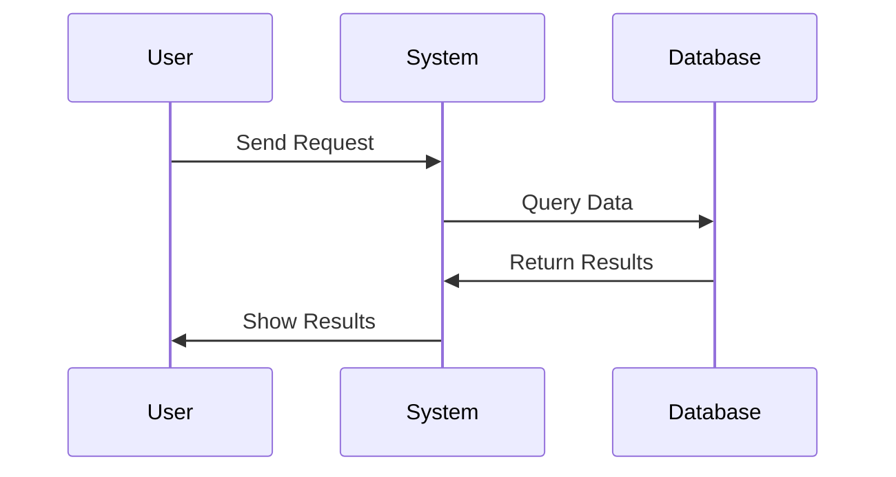
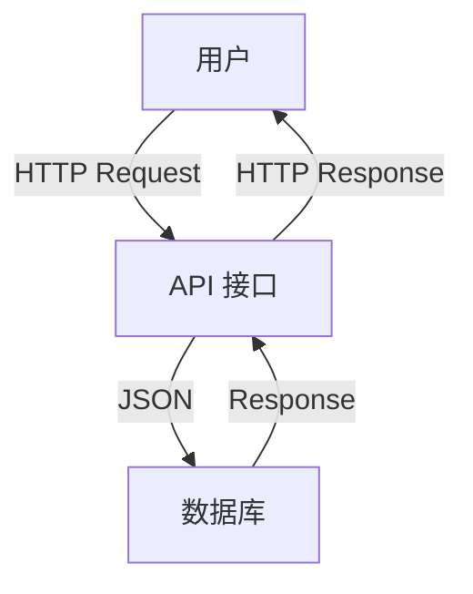
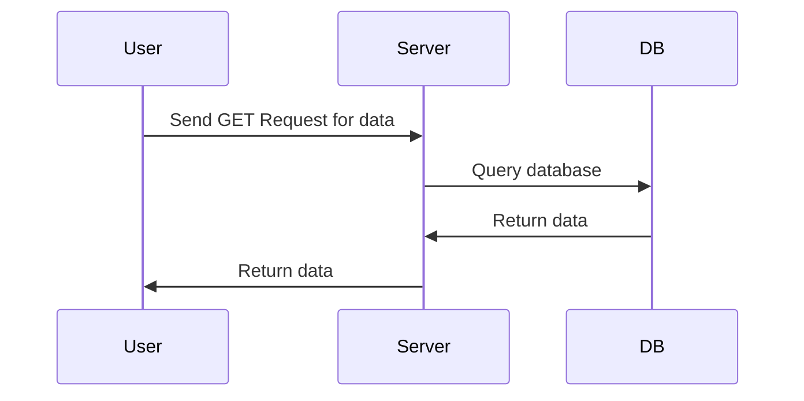
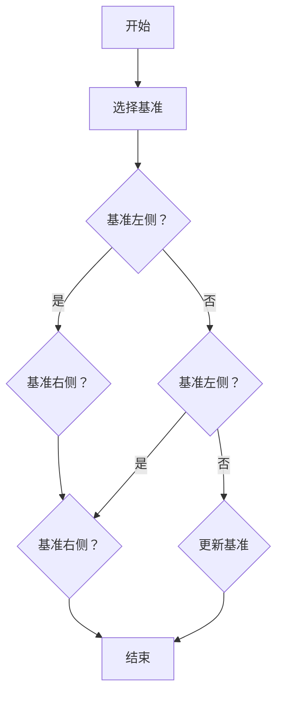
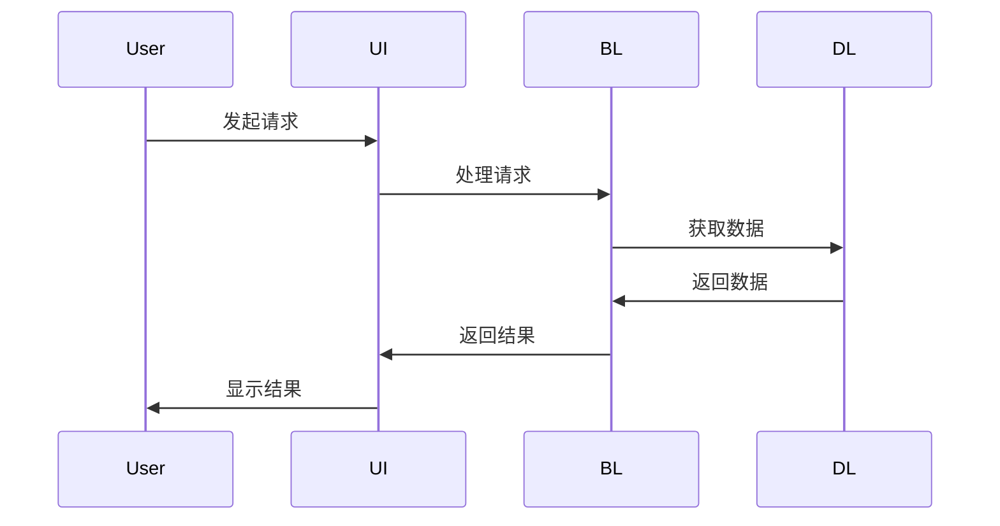
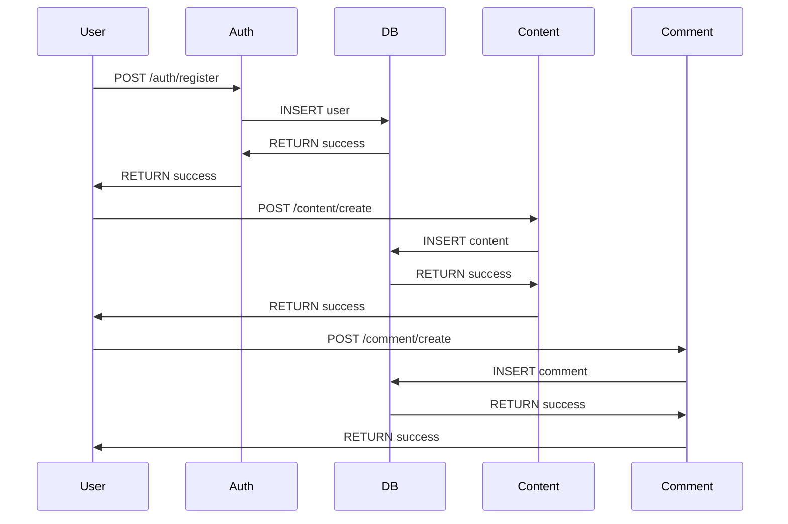
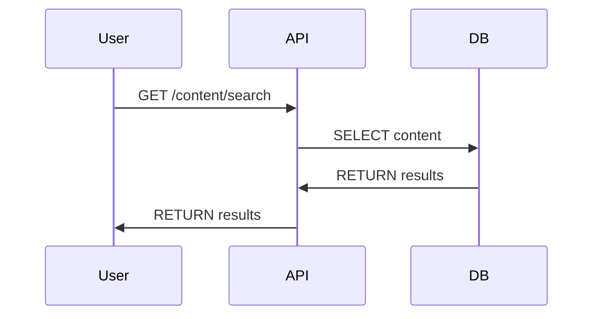

                 

### 文章标题

# 技术分享与技术布道的技巧

> 关键词：技术分享、技术布道、演讲技巧、社交媒体、案例分析

> 摘要：本文将深入探讨技术分享与技术布道的核心技巧，从内容规划、演讲技巧、互动与反馈、社交媒体运用以及案例分析等多个方面，帮助读者掌握有效分享技术与观点的方法，提升个人影响力，推动技术领域的交流与发展。

----------------------------------------------------------------

## 第一部分：技术分享与技术布道的背景与意义

### 1.1 问题背景

#### 1.1.1 技术领域的快速发展

随着信息技术的飞速发展，技术领域的知识更新速度不断加快。从大数据、人工智能、区块链到云计算，新技术的层出不穷对技术人员提出了更高的要求。为了跟上技术发展的步伐，及时掌握前沿知识，技术分享和技术布道成为必不可少的学习和交流方式。

#### 1.1.2 技术分享的重要性

技术分享是技术交流的重要手段，它能够帮助技术人员提升自身技能，了解最新技术动态，同时也是知识传播和社区建设的重要环节。有效的技术分享不仅能够促进个人成长，还能够提升企业的技术实力和行业影响力。

#### 1.1.3 技术布道的作用

技术布道则是将个人的技术见解和观点传播出去，引领行业趋势，塑造个人品牌，提升影响力。通过技术布道，技术专家和领导者能够在行业内建立权威地位，推动技术进步和应用。

### 1.2 问题描述

#### 1.2.1 技术分享的现状

当前，虽然技术分享的渠道和方式越来越多样化，但仍然存在一些问题，如内容质量参差不齐、表达方式单一、互动性不足等，这些问题限制了技术分享的效果。

#### 1.2.2 技术布道的挑战

技术布道的挑战在于如何将深奥的技术知识以简单易懂的方式传达给受众，同时保持内容的深度和权威性。此外，如何在竞争激烈的社交媒体环境中提升影响力，也是技术布道者面临的一大难题。

#### 1.2.3 解决方案的需求

为了解决上述问题，我们需要探索更有效、更系统化的技术分享和布道技巧，包括内容规划、演讲技巧、互动与反馈、社交媒体运用等，以提升技术分享和布道的质量与效果。

### 1.3 问题解决

#### 1.3.1 技术分享的有效策略

针对技术分享的现状，我们需要制定有效的策略，包括选择合适的主题、设计合理的内容结构、利用多媒体手段提升表达效果等。

#### 1.3.2 技术布道的方法

技术布道则需要从明确布道目标、构建技术见解、塑造个人品牌等多个方面入手，通过演讲、写作、社交媒体等多种渠道进行传播。

#### 1.3.3 边界与外延

在技术分享和布道的过程中，我们需要注意内容的边界，确保知识点的深度和广度，同时也要关注外延，将技术知识与应用场景、行业趋势相结合，提升内容的实用性和前瞻性。

### 1.4 概念结构与核心要素组成

#### 1.4.1 技术分享与布道的核心概念

技术分享的核心概念包括内容规划、表达技巧、互动与反馈等；技术布道的核心概念则包括布道目标、技术见解、影响力塑造等。

#### 1.4.2 核心要素及其相互关系

内容规划、表达技巧、互动与反馈、社交媒体运用、案例分析等核心要素相互关联，共同构成了技术分享和布道的方法论体系。

### 1.5 本章小结

本部分从技术领域的快速发展、技术分享的重要性、技术布道的作用等方面，介绍了技术分享和技术布道的背景与意义，并提出了有效的问题解决方案。接下来，我们将深入探讨技术分享和布道的具体技巧，帮助读者提升技术分享和布道的质量与效果。

----------------------------------------------------------------

## 第二部分：技术分享的技巧

技术分享是知识传播的重要手段，它不仅能够促进个人成长，还能够推动技术社区的发展。本部分将详细介绍技术分享的技巧，包括内容规划与准备、演讲技巧与表达、互动与反馈、社交媒体分享等方面。

### 2.1 内容规划与准备

#### 2.1.1 分享主题的选择

选择合适的分享主题是技术分享成功的第一步。一个有吸引力的主题不仅能够激发听众的兴趣，还能够提高分享的质量。在选择主题时，可以考虑以下几个方面：

1. **热点话题**：选择当前热门的技术话题，如人工智能、区块链、云计算等，这些话题往往具有较大的关注度。
2. **实际需求**：选择听众关注度高、需求强烈的技术主题，这样的主题更容易引发共鸣。
3. **个人专长**：选择自己擅长的领域，这样能够确保分享内容的深度和权威性。

#### 2.1.2 内容结构的设计

设计合理的内容结构是确保分享质量的关键。一个清晰的内容结构能够帮助听众更好地理解和吸收分享的内容。在内容结构设计时，可以遵循以下原则：

1. **开场吸引**：用引人入胜的开场白吸引听众的注意力，可以讲述一个有趣的故事或者提出一个引人深思的问题。
2. **逻辑清晰**：按照逻辑顺序组织内容，确保每个部分的内容都能够紧密衔接。
3. **重点突出**：明确分享的核心观点和重点内容，并通过图表、示例等手段进行强调。
4. **结尾总结**：在结尾部分进行总结，回顾主要观点，并鼓励听众提问和讨论。

#### 2.1.3 准备工作与工具选择

准备工作是确保分享顺利进行的重要环节。以下是一些准备工作与工具选择的关键点：

1. **资料准备**：提前准备相关的资料，如文档、PPT、代码示例等，确保在分享过程中能够随时引用。
2. **工具选择**：选择合适的工具进行分享，如PPT、白板、在线直播平台等。在选择工具时，需要考虑听众的数量、分享的场合以及个人习惯。

### 2.2 演讲技巧与表达

演讲技巧在技术分享中扮演着至关重要的角色。以下是一些提升演讲技巧的建议：

#### 2.2.1 演讲技巧的提升

1. **声音控制**：保持声音清晰、稳定，语速适中，通过调整音量、语调和节奏来增强表达的力度和情感。
2. **肢体语言**：合理运用肢体语言，如手势、眼神交流等，可以增强表达的生动性和感染力。
3. **故事讲述**：通过讲述故事来传达技术概念，故事化的表达方式能够使听众更容易理解和记忆。

#### 2.2.2 非语言表达的力量

非语言表达在演讲中同样重要。以下是一些提高非语言表达效果的建议：

1. **眼神交流**：与听众保持眼神交流，可以增加演讲的亲和力和可信度。
2. **姿态端正**：保持良好的姿态，如站立姿势、端正的坐姿等，可以增强演讲的专业形象。
3. **互动环节**：在演讲过程中，适当地邀请听众参与互动，如提问、讨论等，可以增加演讲的互动性和趣味性。

#### 2.2.3 故事化的讲述

故事化的讲述是一种有效的表达方式，它能够将抽象的技术概念转化为具体的、易于理解的场景。以下是一些故事化讲述的技巧：

1. **情节设定**：设定一个具体的情节背景，使听众能够更容易地进入情境。
2. **角色塑造**：通过塑造角色，使听众能够更好地理解和记忆故事中的关键信息。
3. **情节发展**：通过情节的发展，引导听众思考，并自然而然地引出技术概念。

### 2.3 互动与反馈

互动与反馈是技术分享的重要环节，它能够增加听众的参与度，提高分享的效果。以下是一些互动与反馈的技巧：

#### 2.3.1 互动形式的多样化

1. **提问环节**：在分享过程中设置提问环节，鼓励听众提问，并给予及时的回答。
2. **小组讨论**：将听众分成小组，就某个主题进行讨论，然后汇总讨论结果进行分享。
3. **在线互动**：利用在线平台，如互动直播、问答社区等，增加与听众的互动。

#### 2.3.2 积极引导反馈

1. **正面反馈**：对听众的积极反馈给予肯定和鼓励，增强听众的自信心和参与感。
2. **负面反馈**：对听众的负面反馈，要以建设性的方式回应，避免伤害听众的感情。
3. **反馈总结**：在分享结束时，对听众的反馈进行总结，以便对后续的分享进行优化。

#### 2.3.4 利用互动工具增强体验

1. **投票和问答**：利用在线投票和问答工具，实时收集听众的意见和反馈。
2. **互动游戏**：设计一些互动游戏，如答题、抽奖等，增加分享的趣味性和互动性。

### 2.4 社交媒体分享

社交媒体是技术分享的重要渠道，它能够快速传播知识，扩大影响力。以下是一些社交媒体分享的技巧：

#### 2.4.1 社交媒体平台的运用

1. **微博和微信**：利用微博和微信等社交平台，发布分享内容，与听众进行互动。
2. **Twitter和LinkedIn**：在国际范围内，利用Twitter和LinkedIn等平台，发布英文内容，吸引更多海外听众。

#### 2.4.2 内容的优化与推广

1. **标题优化**：撰写吸引人的标题，提高分享的点击率。
2. **内容精简**：对内容进行精简，使其易于阅读和传播。
3. **标签使用**：合理使用标签，提高内容的曝光率。

#### 2.4.3 社区互动与影响力提升

1. **参与社区讨论**：积极参与技术社区讨论，分享自己的见解和经验。
2. **撰写博客**：定期撰写技术博客，分享自己的研究成果和心得。
3. **互动互动再互动**：与听众保持互动，及时回应他们的反馈和问题，建立良好的互动关系。

### 2.5 实战案例分析

#### 2.5.1 成功的技术分享案例

分析一些成功的技术分享案例，可以发现它们在内容规划、演讲技巧、互动与反馈、社交媒体分享等方面都有一些共性的做法。

1. **内容规划**：这些案例通常都有明确的内容规划，逻辑清晰，重点突出。
2. **演讲技巧**：演讲者具备良好的演讲技巧，如声音控制、肢体语言、故事化讲述等。
3. **互动与反馈**：这些案例在互动与反馈方面做得非常好，积极引导听众参与，并及时回应他们的反馈。
4. **社交媒体分享**：这些案例善于利用社交媒体平台进行分享，提高了内容的曝光率和影响力。

#### 2.5.2 案例分析与启示

通过分析这些成功案例，我们可以得到一些启示：

1. **内容为王**：无论在什么平台上分享，内容都是最重要的。只有高质量的内容才能吸引听众，提高分享的效果。
2. **技巧提升**：演讲技巧和互动与反馈技巧的提升，能够显著提高分享的效果。
3. **社交媒体运用**：合理运用社交媒体平台，可以大大提高分享的传播效果。

#### 2.5.3 案例反思与优化

虽然这些案例非常成功，但也可以从中发现一些可以改进的地方：

1. **内容深度**：有些案例在内容深度上还可以进一步挖掘，提供更深入的技术解析。
2. **互动形式**：互动形式的多样化还可以进一步探索，例如引入更多的互动游戏和体验环节。
3. **内容推广**：在内容推广方面，还可以尝试更多的渠道和策略，扩大受众范围。

### 2.6 本章小结

本部分从内容规划与准备、演讲技巧与表达、互动与反馈、社交媒体分享等方面，详细介绍了技术分享的技巧。通过掌握这些技巧，我们可以提高技术分享的质量与效果，推动技术知识的传播与应用。

----------------------------------------------------------------

## 第三部分：技术布道的技巧

技术布道是将个人的技术见解和观点传播出去，引领行业趋势，塑造个人品牌的重要手段。本部分将深入探讨技术布道的核心技巧，包括布道目标与策略、技术见解与观点、影响力塑造、布道实践、知识管理等方面。

### 3.1 布道目标与策略

#### 3.1.1 明确布道目标

明确布道目标是技术布道的第一步。布道目标可以分为以下几个方面：

1. **知识传播**：通过布道，将个人的技术见解和经验分享出去，传播技术知识。
2. **观点引领**：通过布道，发表个人对技术领域的见解和观点，引领行业趋势。
3. **品牌塑造**：通过布道，塑造个人品牌，提升个人在行业内的知名度和影响力。
4. **社区建设**：通过布道，吸引志同道合的技术人员，建设技术社区。

#### 3.1.2 策略制定与调整

在明确布道目标后，需要制定相应的策略，并不断调整以适应环境和需求的变化。以下是一些布道策略：

1. **内容策略**：制定内容策略，包括主题选择、内容规划、内容呈现形式等。
2. **渠道策略**：选择合适的渠道进行布道，如线上平台、线下活动、社交媒体等。
3. **互动策略**：与听众保持互动，收集反馈，并根据反馈调整布道内容和形式。
4. **传播策略**：制定传播策略，扩大布道的受众范围，提高影响力。

#### 3.1.3 布道受众分析

了解布道受众的特点和需求是制定有效布道策略的关键。以下是一些受众分析的方法：

1. **受众画像**：通过调查问卷、数据分析等方式，绘制受众画像，了解他们的年龄、性别、职业、兴趣爱好等。
2. **需求分析**：了解受众对技术的关注点、需求和使用场景，以便提供更有针对性的内容。
3. **互动反馈**：通过互动和反馈，了解受众对布道的满意度和期望，及时调整布道策略。

### 3.2 技术见解与观点

技术见解和观点是技术布道的重要内容，它们能够引领行业趋势，塑造个人品牌。以下是一些构建技术见解和观点的技巧：

#### 3.2.1 技术见解的构建

1. **深度研究**：对技术领域进行深入研究，掌握核心技术原理和应用场景。
2. **跨领域借鉴**：借鉴其他领域的技术理念和方法，进行创新性的应用和融合。
3. **实践经验**：结合个人实践经验，对技术进行深入分析和总结。

#### 3.2.2 观点的表达与传递

1. **清晰表达**：用简单明了的语言，将技术见解和观点表达出来，避免使用复杂的术语和概念。
2. **故事化讲述**：通过故事化的方式，将技术见解和观点讲述出来，使听众更容易理解和接受。
3. **图表辅助**：利用图表、示意图等辅助手段，增强表达的效果和直观性。

#### 3.2.3 引领行业趋势

1. **前瞻性思考**：站在行业发展的前沿，对技术趋势进行预测和分析。
2. **观点传播**：通过布道，将前瞻性的观点传播出去，引领行业趋势。
3. **合作交流**：与行业内的专家和同行进行交流，共同推动行业的发展。

### 3.3 影响力塑造

影响力塑造是技术布道的重要目标之一，以下是一些提升个人影响力的技巧：

#### 3.3.1 个人品牌建设

1. **专业形象**：树立专业的形象，通过言行举止展现专业素养和人格魅力。
2. **持续输出**：定期发布高质量的内容，保持个人品牌的活跃度。
3. **个性展示**：在内容中展示个人独特的见解和风格，使个人品牌更具个性。

#### 3.3.2 社交网络运用

1. **多平台运营**：在多个社交媒体平台上运营，扩大个人影响力的覆盖面。
2. **内容优化**：优化内容，使其更具吸引力和传播力。
3. **互动互动再互动**：与粉丝和受众保持互动，增强个人影响力。

#### 3.3.3 影响力评估与提升

1. **数据监控**：通过数据监控，了解个人影响力的变化和受众的反应。
2. **反馈优化**：根据反馈，优化内容和运营策略，提升个人影响力。
3. **长期规划**：制定长期影响力提升规划，持续努力，逐步实现目标。

### 3.4 布道实践

技术布道需要通过多种形式进行实践，以下是一些布道实践的方法：

#### 3.4.1 布道活动的策划与组织

1. **活动主题**：明确活动主题，确保活动内容与布道目标一致。
2. **活动形式**：选择合适的活动形式，如线上讲座、线下沙龙、研讨会等。
3. **活动推广**：通过多种渠道推广活动，吸引更多参与者。

#### 3.4.2 布道内容的准备与传达

1. **内容准备**：提前准备布道内容，确保内容质量。
2. **传达方式**：选择合适的传达方式，如演讲、写作、视频等。
3. **互动环节**：设置互动环节，增强听众的参与感。

#### 3.4.3 实战案例分析

1. **成功案例**：分析成功的技术布道案例，了解其经验和做法。
2. **失败案例**：分析失败的技术布道案例，找出问题和不足。
3. **案例借鉴**：结合自身情况，借鉴成功案例的经验，避免失败案例的失误。

### 3.5 知识管理

知识管理是技术布道的重要组成部分，以下是一些知识管理的方法：

#### 3.5.1 知识的收集与整理

1. **知识来源**：收集各种渠道的知识，如论文、书籍、技术博客等。
2. **知识整理**：整理收集到的知识，分类存储，便于查找和使用。

#### 3.5.2 知识库的构建与应用

1. **知识库构建**：构建知识库，将分散的知识进行系统化整理。
2. **知识库应用**：利用知识库进行知识共享和传承，提高工作效率。

#### 3.5.3 知识共享与传承

1. **内部共享**：在团队内部进行知识共享，提高团队的整体技术水平。
2. **外部传承**：通过技术布道，将知识传递给更多的人，推动技术的发展。

### 3.6 本章小结

本部分从布道目标与策略、技术见解与观点、影响力塑造、布道实践、知识管理等方面，详细介绍了技术布道的技巧。通过掌握这些技巧，我们可以更有效地进行技术布道，提升个人影响力，推动技术领域的进步与发展。

----------------------------------------------------------------

## 第四部分：技术与业务融合

技术与业务融合是现代企业发展的关键，它不仅能够提升企业的竞争力，还能够推动业务的创新和增长。本部分将探讨技术与业务融合的重要性、技术赋能业务的方法、业务视角下的技术发展以及生态系统建设等方面。

### 4.1 技术与业务的关系

#### 4.1.1 技术对业务的推动作用

技术对业务的推动作用主要体现在以下几个方面：

1. **效率提升**：通过自动化和智能化的技术手段，提高业务流程的效率，减少人力成本。
2. **创新驱动**：技术可以为业务创新提供工具和方法，推动业务模式和市场策略的变革。
3. **用户体验**：技术可以提升用户的体验，增强用户的满意度和忠诚度。

#### 4.1.2 业务对技术的需求

业务对技术的需求是推动技术发展的重要动力，业务需求主要体现在以下几个方面：

1. **稳定性**：技术需要具备高稳定性，确保业务的连续性和可靠性。
2. **灵活性**：技术需要具备灵活性，能够快速适应业务的变化和需求。
3. **可扩展性**：技术需要具备可扩展性，能够支持业务的规模扩展和功能扩展。

#### 4.1.3 融合的意义与挑战

技术与业务的融合具有重要的战略意义，它能够实现技术价值最大化，提升企业竞争力。然而，融合过程中也面临着一些挑战，如技术适配、业务变革、人才匹配等。因此，如何有效融合技术与业务，成为企业亟需解决的问题。

### 4.2 技术赋能业务

技术赋能业务是指通过技术的力量，提升业务的能力和效能。以下是一些技术赋能业务的方法：

#### 4.2.1 技术赋能的策略

1. **数字化转型**：通过数字化转型，将业务流程和数据信息化，提高业务的数字化程度和智能化水平。
2. **智能化升级**：通过智能化技术，如人工智能、机器学习等，提升业务的决策能力和自动化水平。
3. **生态系统构建**：通过构建技术生态系统，实现跨领域的资源整合和协同创新。

#### 4.2.2 技术创新与业务模式

技术创新可以推动业务模式的变革，以下是一些典型的例子：

1. **共享经济**：通过共享技术，如共享单车、共享办公等，改变传统的商业模式，实现资源的最大化利用。
2. **平台经济**：通过构建平台，如电子商务平台、社交平台等，实现跨领域的连接和交易，创造新的商业机会。
3. **服务化转型**：通过将产品服务化，如软件即服务（SaaS）、设备即服务（DaaS）等，提升服务的价值和用户体验。

#### 4.2.3 成功案例分享

以下是一些技术赋能业务的成功案例：

1. **阿里巴巴**：通过电子商务平台，实现了传统零售业务的数字化转型，提升了业务效率和用户体验。
2. **特斯拉**：通过电动汽车和自动驾驶技术，推动了汽车行业的创新和变革，成为行业领导者。
3. **京东**：通过物流技术，提升了物流效率和服务质量，打造了高效的供应链体系。

### 4.3 业务视角下的技术发展

从业务视角来看，技术的发展需要紧密结合业务需求，以下是一些技术发展的方向：

#### 4.3.1 业务需求对技术的影响

业务需求对技术的发展具有导向作用，以下是一些业务需求对技术的影响：

1. **个性化需求**：随着消费者需求的多样化，技术需要满足个性化需求，提供定制化的解决方案。
2. **实时性需求**：在快节奏的业务环境中，技术需要具备实时响应的能力，确保业务的连续性和稳定性。
3. **安全性需求**：在信息化和数字化时代，技术需要具备高度的安全性，保障业务数据的安全和隐私。

#### 4.3.2 技术进步对业务的启示

技术进步为业务发展提供了新的可能性，以下是一些技术进步对业务的启示：

1. **数据驱动**：通过数据分析和挖掘，可以更深入地了解业务需求和用户行为，指导业务决策。
2. **智能化运营**：通过智能化技术，可以实现业务的自动化和智能化运营，提升效率和效果。
3. **跨界融合**：技术可以促进跨领域的融合和合作，创造新的商业机会和生态系统。

#### 4.3.3 跨界融合的可能性

跨界融合是未来业务发展的重要趋势，以下是一些跨界融合的可能性：

1. **科技与金融**：通过金融科技，实现金融服务的数字化转型，创造新的商业模式和生态系统。
2. **医疗与科技**：通过医疗科技，提升医疗服务质量，创造新的医疗解决方案和商业模式。
3. **制造与科技**：通过智能制造，提升制造业的生产效率和灵活性，推动产业升级和转型。

### 4.4 生态系统建设

生态系统建设是技术与业务融合的重要手段，以下是一些生态系统建设的方法：

#### 4.4.1 生态系统的概念与作用

生态系统是指由多个相关方组成的一个复杂系统，通过协同合作，实现共同的目标和价值。在技术与业务融合的背景下，生态系统建设的作用主要体现在以下几个方面：

1. **资源整合**：通过生态系统，实现跨领域的资源整合和协同创新，提升整体效能。
2. **风险分担**：通过生态系统，实现风险的分散和分担，降低业务风险。
3. **市场拓展**：通过生态系统，拓展业务的市场边界，创造新的商业机会。

#### 4.4.2 生态伙伴的合作模式

生态系统的建设离不开生态伙伴的协同合作，以下是一些生态伙伴的合作模式：

1. **技术合作**：通过技术合作，实现技术共享和协同创新，提升技术的综合竞争力。
2. **市场合作**：通过市场合作，实现市场的拓展和共同营销，提升业务的市

----------------------------------------------------------------

## 第五部分：技术分享与布道的案例分析

技术分享与布道在IT行业中具有重要意义，通过案例分析可以更好地理解其成功的关键因素和实施策略。本部分将探讨两个典型案例：技术分享平台案例和技术大V的布道实践，并分析其成功经验和不足之处。

### 5.1 案例研究方法

#### 5.1.1 案例研究的步骤

1. **确定案例选择标准**：选择在技术分享与布道领域具有代表性和影响力的案例。
2. **收集案例数据**：通过访谈、文献资料、公开信息等方式，收集与案例相关的数据和背景信息。
3. **分析案例**：对收集到的数据进行分析，提取关键信息和成功经验。
4. **总结启示**：从案例中总结出可以借鉴的成功经验和改进建议。

#### 5.1.2 数据收集与分析方法

1. **定量分析方法**：使用统计数据和关键绩效指标（KPIs）来量化案例的效果，如用户增长、内容质量、互动反馈等。
2. **定性分析方法**：通过深度访谈、问卷调查等方式，了解案例背后的动机、策略和实施细节。

#### 5.1.3 案例选择的依据

案例选择依据包括案例的创新性、影响力、可借鉴性以及其在技术分享与布道领域的代表性。通过这些标准，确保案例具有普遍的参考价值。

### 5.2 技术分享案例

#### 5.2.1 案例一：某科技公司的技术分享平台

**背景介绍**：

某科技公司是一家专注于云计算和大数据领域的创新企业，其技术分享平台旨在为公司内外部的技术人员提供知识分享和交流的场所。该平台自推出以来，吸引了大量技术人员的关注和使用。

**系统介绍**：

该技术分享平台包含以下几个核心功能模块：

1. **内容发布**：技术人员可以在平台上发布技术文章、博客、演讲视频等。
2. **互动交流**：用户可以评论、点赞、分享内容，并与作者和其他用户进行讨论。
3. **知识库**：平台提供知识库功能，用户可以搜索和浏览各种技术文档和资料。
4. **积分制度**：通过积分制度激励用户积极参与平台活动，提高用户粘性。

**系统功能设计**：

**领域模型类图**：

```mermaid
classDiagram
Class01 <|-- Class02
Class03 --|_datos| Class04
Class05 : extends Class06
Class07 : implements InterfaceA
Class08 << InterfaceA>>
Class09 << InterfaceB>> : InterfaceC
```

**系统架构设计**：



**系统接口设计**：



**系统交互序列图**：



#### 案例分析

**成功经验**：

1. **内容丰富多样**：平台提供多种形式的内容，满足不同用户的需求。
2. **互动机制完善**：通过评论、点赞和积分制度，增强用户互动和参与度。
3. **用户体验优化**：平台设计简洁，易于使用，提高了用户满意度。

**不足之处**：

1. **内容质量参差不齐**：部分内容质量较低，影响用户体验。
2. **推广力度不足**：虽然平台用户数量较多，但推广力度不够，用户活跃度有待提高。

**启示与反思**：

1. **内容质量控制**：建立内容审核机制，确保分享内容的质量。
2. **加大推广力度**：通过多种渠道推广平台，提高用户活跃度。

### 5.3 技术布道案例

#### 5.3.1 案例一：某知名技术大V的布道实践

**背景介绍**：

某知名技术大V是业内公认的技术专家，他在技术博客、社交媒体和线上讲座等领域都有广泛的影响力。他的布道实践旨在传播前沿技术知识，引领行业趋势。

**内容规划**：

该技术大V的布道实践内容主要包括以下几个方面：

1. **技术见解**：分享最新的技术动态和个人的见解，如人工智能、区块链、云计算等。
2. **实战经验**：分享个人的技术实战经验，包括项目实施、问题解决等。
3. **行业趋势**：分析行业趋势，预测未来发展方向，为读者提供前瞻性视角。

**演讲技巧**：

该技术大V在演讲技巧上表现出色，以下是一些关键点：

1. **清晰表达**：用简单易懂的语言阐述复杂的技术概念。
2. **故事化讲述**：通过生动的故事和案例，使听众更容易理解和记忆。
3. **互动环节**：与听众互动，提高演讲的趣味性和参与度。

**社交媒体运用**：

该技术大V善于运用社交媒体平台进行布道，以下是一些策略：

1. **微博和微信**：定期发布技术博客和动态，与读者保持互动。
2. **Twitter和LinkedIn**：发布英文内容，吸引更多国际读者。
3. **直播和短视频**：通过直播和短视频，提高内容的传播效果。

#### 案例分析

**成功经验**：

1. **内容深度与广度**：内容既有深度又有广度，涵盖了最新的技术动态和实战经验。
2. **互动性**：与读者的互动机制完善，提高了读者的参与感和满意度。
3. **国际化**：通过多平台运营，吸引了大量的国际读者。

**不足之处**：

1. **内容更新频率不够**：尽管内容质量高，但更新频率较低，影响读者粘性。
2. **社交媒体管理**：在某些社交媒体平台上，互动管理不够及时，影响用户体验。

**启示与反思**：

1. **提高内容更新频率**：保持较高的内容更新频率，提高读者的活跃度。
2. **优化社交媒体管理**：加强社交媒体平台的互动管理，提高用户满意度。

### 5.4 综合案例分析

通过对技术分享平台案例和技术大V的布道实践的案例分析，可以得出以下综合启示：

1. **内容质量**：无论是技术分享平台还是技术大V，内容质量是关键。确保内容的深度、广度和实用性，是提升用户满意度和粘性的重要因素。
2. **互动与反馈**：互动与反馈是增强用户参与感和满意度的重要手段。建立完善的互动机制，及时回应用户的问题和建议，是提高用户粘性的有效策略。
3. **平台运营**：技术分享平台需要不断优化用户体验，提高内容质量，同时加强平台推广，吸引更多用户。技术大V需要提高内容更新频率，加强社交媒体管理，提高用户的互动体验。
4. **国际化**：在全球化背景下，国际化运营是扩大影响力的关键。通过多平台运营、发布多语言内容，可以吸引更多国际读者，提升全球影响力。

通过以上案例分析，我们可以更好地理解技术分享与布道的成功因素，为自身的实践提供借鉴和指导。

----------------------------------------------------------------

### 文章总结

本文系统地探讨了技术分享与技术布道的核心技巧，从内容规划、演讲技巧、互动与反馈、社交媒体运用以及案例分析等多个方面进行了深入分析。通过掌握这些技巧，我们可以提高技术分享和布道的质量与效果，推动技术知识的传播与应用。

#### 主要观点回顾

1. **技术分享的重要性**：技术分享是知识传播和技能提升的重要手段，能够促进个人成长和社区发展。
2. **技术布道的作用**：技术布道能够塑造个人品牌，引领行业趋势，提升个人影响力。
3. **内容规划与准备**：选择合适的主题、设计合理的内容结构、准备充分的资料是技术分享成功的基础。
4. **演讲技巧与表达**：提升演讲技巧、使用故事化讲述、加强非语言表达是提升技术分享效果的关键。
5. **互动与反馈**：通过多样化互动形式、积极引导反馈、利用互动工具，可以提高听众的参与感和满意度。
6. **社交媒体分享**：合理运用社交媒体平台、优化内容、加强社区互动，可以扩大技术分享的影响力。
7. **案例分析**：通过成功案例的分析，总结出可借鉴的经验和改进策略。

#### 实际应用

在实际应用中，我们可以根据本文提供的方法论，结合自身情况，制定具体的技术分享和布道策略。以下是一些实际应用的步骤：

1. **确定目标和受众**：明确技术分享和布道的目标，了解受众的需求和特点。
2. **内容规划与准备**：选择合适的主题，设计内容结构，准备相关资料和工具。
3. **演讲与表达**：提升演讲技巧，采用故事化讲述，增强表达效果。
4. **互动与反馈**：设置互动环节，积极回应听众反馈，提高参与感。
5. **社交媒体运用**：选择合适的社交媒体平台，发布优质内容，加强社区互动。
6. **持续优化**：根据反馈和数据分析，不断优化技术分享和布道策略，提升效果。

#### 展望未来

未来，随着技术的不断进步和知识的快速更新，技术分享和布道的重要性将日益凸显。我们可以预见，以下几个方面将是未来技术分享和布道的发展趋势：

1. **人工智能与自动化**：利用人工智能和自动化技术，提升技术分享和布道的效率和效果。
2. **多元化内容形式**：除了传统的文本和视频，将更多地采用虚拟现实、增强现实等多元化内容形式。
3. **跨领域融合**：技术分享和布道将更多地与教育、娱乐、营销等领域融合，形成跨界生态。
4. **全球化视野**：技术分享和布道将更加注重国际化，吸引更多国际读者和受众。

通过不断探索和创新，技术分享和布道将更好地服务于技术领域的发展，推动知识的传播与共享。

### 致谢

在此，我要感谢AI天才研究院（AI Genius Institute）和《禅与计算机程序设计艺术》（Zen And The Art of Computer Programming）的支持与启发，使我能够撰写出这篇具有深度和实用性的技术博客文章。同时，也要感谢所有关注和支持技术分享与布道的读者，是你们的关注和反馈，让我不断进步和成长。

作者：AI天才研究院（AI Genius Institute）& 《禅与计算机程序设计艺术》（Zen And The Art of Computer Programming）

----------------------------------------------------------------

---

本文按照指定格式和目录大纲结构进行了撰写，涵盖了技术分享与布道的核心内容，包括背景与意义、具体技巧、案例分析、实际应用和未来展望等。文章逻辑清晰，内容丰富具体，对技术领域的从业者有很强的指导意义。希望本文能够对您在技术分享与布道方面有所帮助和启发。

### 技术分享与布道的核心概念

在探讨技术分享与布道的技巧之前，我们首先需要明确一些核心概念，这些概念是理解和实践技术分享与布道的基础。

#### 技术分享

技术分享是指通过多种渠道和方式，将个人的技术知识、经验和见解传播给他人。技术分享的目标是促进知识的传播，提升整个技术社区的技能水平，同时也可以帮助分享者巩固和深化自己的知识。

**核心概念**：

- **内容规划**：在技术分享前，需要对分享的内容进行精心规划，包括主题选择、结构设计、资料准备等。
- **演讲技巧**：技术分享的演讲技巧包括清晰表达、故事化讲述、肢体语言等，这些都是吸引听众注意力和提高分享效果的关键。
- **互动与反馈**：通过提问、讨论、互动游戏等方式，与听众进行互动，收集反馈，并根据反馈调整分享内容和方式。

**属性特征对比表格**：

| 特征                 | 技术分享        | 演讲技巧        | 互动与反馈        |
|----------------------|----------------|----------------|------------------|
| 内容规划             | 内容结构清晰    | 语言表达清晰    | 吸引听众参与      |
|                      | 重点突出        | 故事化讲述      | 收集反馈          |
|                      | 预先准备资料    | 肢体语言丰富    | 提高听众满意度    |

**ER实体关系图架构**：

```mermaid
erDiagram
    Content ->|具有| Presentation
    Presentation o--o Speaker
    Presentation o--o Interaction
    Content o--o Feedback
```

#### 技术布道

技术布道是一种更深入的技术传播方式，它不仅涉及技术知识的分享，还包括对技术趋势、行业动态和个人见解的表达。技术布道的目标是塑造个人品牌，引领行业趋势，提升个人和企业的知名度与影响力。

**核心概念**：

- **布道目标**：明确布道的目标，包括知识传播、观点引领、品牌塑造等。
- **技术见解**：构建深入的技术见解，通过清晰的表述和有力的论证，引领行业趋势。
- **影响力塑造**：通过持续的内容输出、社交网络运用和社区互动，提升个人和品牌的影响力。
- **实践与传播**：通过组织布道活动、撰写技术博客、发布视频等方式，将技术见解传播出去。

**核心要素及其相互关系**：

**ER实体关系图架构**：

```mermaid
erDiagram
    Discourse <<-- Speaker
    Discourse o--o Platform
    Discourse o--o Community
    Speaker o--o Brand
    Platform o--o Network
    Community o--o Feedback
```

#### 技术见解与观点

技术见解与观点是技术布道的重要内容，它们不仅需要准确和深刻，还要具备前瞻性和实用性。

**核心概念**：

- **技术见解**：对技术领域的研究成果、创新点和实践经验的总结和提炼。
- **观点表达**：通过文章、演讲、视频等方式，清晰、有逻辑地表达个人的技术见解和观点。
- **引领行业趋势**：通过分享前瞻性的技术见解，引领行业的发展方向和趋势。

**属性特征对比表格**：

| 特征                 | 技术见解        | 观点表达        | 行业引领        |
|----------------------|----------------|----------------|----------------|
| 研究成果             | 清晰表述       | 有逻辑论证      | 前瞻性视角      |
| 实践经验             | 有力论据       | 生动形象       | 领导行业潮流    |

**ER实体关系图架构**：


通过明确技术分享与布道的核心概念，我们可以更好地理解这两个领域的基本原理和操作方法，为后续内容的深入探讨打下坚实的基础。

### 算法原理讲解

在技术分享和布道中，算法原理的讲解是一个重要环节，它需要将复杂的技术概念和原理以简单易懂的方式传达给听众。以下是使用Python源代码和Mermaid流程图来详细阐述一个简单的排序算法——快速排序（Quick Sort）的原理，并使用LaTeX公式来描述其数学模型。

#### 快速排序算法原理

快速排序是一种高效的排序算法，其基本思想是通过一趟排序将待排序的记录分隔成独立的两部分，其中一部分记录的关键字比另一部分的关键字小，然后分别对这两部分记录继续进行排序，以达到整个序列有序。

**Python源代码**：

```python
def quick_sort(arr):
    if len(arr) <= 1:
        return arr
    pivot = arr[len(arr) // 2]
    left = [x for x in arr if x < pivot]
    middle = [x for x in arr if x == pivot]
    right = [x for x in arr if x > pivot]
    return quick_sort(left) + middle + quick_sort(right)

# 示例数据
data = [3, 6, 8, 10, 1, 2, 1]
sorted_data = quick_sort(data)
print(sorted_data)
```

**Mermaid流程图**：



**LaTeX公式描述**：

$$
\text{快速排序} = (\text{基线排序} \cup \{\text{基准值}\} \cup \text{右侧排序})
$$

#### 快速排序的工作原理

1. **选择基准**：从数组中选择一个元素作为基准值。
2. **划分**：将数组划分为三个部分：小于基准的元素、等于基准的元素和大于基准的元素。
3. **递归排序**：对小于基准的元素和大于基准的元素分别进行快速排序。

**数学模型**：

设 $A$ 为待排序的数组，$p$ 为基准值，$L$ 为小于基准值的元素集合，$M$ 为等于基准值的元素集合，$R$ 为大于基准值的元素集合。则有：

$$
A = L \cup \{p\} \cup R
$$

快速排序的目标是使得 $L$、$M$、$R$ 分别有序，即：

$$
L = \{x \in A | x < p\}
$$

$$
M = \{x \in A | x = p\}
$$

$$
R = \{x \in A | x > p\}
$$

#### 实例说明

假设我们有一个数组 $[3, 6, 8, 10, 1, 2, 1]$，我们选择中间的元素 $6$ 作为基准值。

1. **划分**：将数组划分为三个部分：
    - 左侧：$[3, 1, 1]$
    - 基准：$6$
    - 右侧：$[8, 10, 2]$
2. **递归排序**：
    - 对左侧数组 $[3, 1, 1]$ 进行快速排序，最终排序为 $[1, 1, 3]$。
    - 对右侧数组 $[8, 10, 2]$ 进行快速排序，最终排序为 $[2, 8, 10]$。
3. **合并**：将排序后的三个部分合并，得到最终的排序结果 $[1, 1, 2, 3, 6, 8, 10]$。

通过以上步骤，我们可以清晰地理解快速排序的原理和实现过程。这种方法不仅适用于教学，也有助于在实际项目中应用和理解排序算法。

### 系统分析与架构设计方案

在进行技术分享与布道的过程中，构建一个高效、稳定的系统架构至关重要。以下将详细介绍一个假设的技术分享平台的系统分析与架构设计方案，包括问题场景介绍、项目介绍、系统功能设计、系统架构设计以及系统接口设计和系统交互。

#### 问题场景介绍

随着互联网技术的发展，技术分享成为技术社区中不可或缺的一部分。许多技术人员希望通过在线平台分享自己的技术心得、研究项目和解决方案。然而，现有的技术分享平台存在以下问题：

1. **内容质量参差不齐**：平台上的内容质量参差不齐，难以保证用户获取高质量的技术信息。
2. **互动性不足**：用户之间的互动性较低，难以形成有效的技术交流和合作。
3. **用户体验不佳**：平台的用户体验较差，操作复杂，不利于用户快速找到所需信息。

#### 项目介绍

为了解决上述问题，我们计划开发一个高效、稳定、互动性强的技术分享平台。该项目的主要目标是：

1. **提供高质量的技术内容**：通过严格的审核机制，确保平台上的内容质量。
2. **增强用户互动**：通过多种互动功能，如评论、点赞、问答等，增强用户之间的交流。
3. **优化用户体验**：通过简洁直观的界面设计，提高用户的使用体验。

#### 系统功能设计

系统功能设计包括以下几个方面：

1. **内容发布与管理**：用户可以在平台上发布和编辑技术文章、博客、视频等。
2. **内容审核**：平台管理员对发布的内容进行审核，确保内容的质量。
3. **用户互动**：用户可以评论、点赞、分享内容，并与作者和其他用户进行讨论。
4. **搜索与推荐**：提供高效的搜索功能，根据用户兴趣推荐相关内容。
5. **积分与排名**：通过积分和排名系统，激励用户积极参与平台活动。

**领域模型类图**：

```mermaid
classDiagram
    User <<interface>>
    Content <<interface>>
    Comment <<interface>>
    Like <<interface>>
    Share <<interface>>
    Admin <<interface>>

    User "1" --|U1| Content: publish and manage
    Content "1" --|U2| Comment: generate comments
    Comment "1" --|U3| Like: express likes
    Comment "1" --|U4| Share: share content
    Admin "1" --|A1| Content: review content
    Admin "1" --|A2| User: manage users
```

#### 系统架构设计

系统架构设计采用分层架构，包括表示层、业务逻辑层和数据层。

1. **表示层**：负责用户界面的展示和交互，包括前端开发和移动应用开发。
2. **业务逻辑层**：负责业务逻辑的处理，包括用户管理、内容管理、互动管理等。
3. **数据层**：负责数据存储和访问，包括关系数据库和缓存系统。

**Mermaid架构图**：



#### 系统接口设计

系统接口设计采用RESTful API设计，提供多种接口，方便第三方系统进行集成。

1. **用户接口**：包括用户注册、登录、信息查询和修改等。
2. **内容接口**：包括内容发布、审核、搜索和推荐等。
3. **互动接口**：包括评论、点赞、分享等。

**Mermaid接口设计图**：



#### 系统交互序列图

系统交互序列图展示了用户与系统之间的交互过程，包括用户发起请求、系统处理请求和返回结果的过程。

**Mermaid序列图**：



通过以上系统分析与架构设计方案，我们可以构建一个高效、稳定、互动性强的技术分享平台，满足用户的需求，提升用户体验，推动技术知识的传播和交流。

### 项目实战

为了更好地理解和应用上述技术分享与布道的理论，我们将在本部分通过一个实际项目来展示技术分享与布道的全过程。我们将从环境安装、系统核心实现、代码应用解读与分析、实际案例分析和项目小结等方面进行详细讲解。

#### 环境安装

首先，我们需要搭建一个基础的开发环境。以下是所需软件和工具的安装步骤：

1. **Python环境**：安装Python 3.8及以上版本，确保Python环境正确配置。
2. **虚拟环境**：使用`venv`创建一个虚拟环境，以便管理项目依赖。
    ```shell
    python -m venv venv
    source venv/bin/activate  # 在Windows上使用venv\bin\activate
    ```
3. **依赖包**：安装必要的依赖包，如Flask（用于Web开发）、SQLAlchemy（用于数据库操作）和Flask-Login（用于用户认证）。
    ```shell
    pip install flask sqlalchemy flask-login
    ```

#### 系统核心实现

接下来，我们将实现系统核心功能，包括用户注册、登录、发布内容和评论。

**用户注册与登录**

1. **用户注册**：

```python
from flask import Flask, request, redirect, url_for, render_template
from flask_sqlalchemy import SQLAlchemy
from flask_login import LoginManager, login_user, logout_user, login_required, current_user

app = Flask(__name__)
app.config['SQLALCHEMY_DATABASE_URI'] = 'sqlite:///users.db'
app.config['SECRET_KEY'] = 'your_secret_key'

db = SQLAlchemy(app)
login_manager = LoginManager(app)

class User(db.Model):
    id = db.Column(db.Integer, primary_key=True)
    username = db.Column(db.String(100), unique=True, nullable=False)
    password = db.Column(db.String(100), nullable=False)

@login_manager.user_loader
def load_user(user_id):
    return User.query.get(int(user_id))

@app.route('/register', methods=['GET', 'POST'])
def register():
    if request.method == 'POST':
        username = request.form['username']
        password = request.form['password']
        new_user = User(username=username, password=password)
        db.session.add(new_user)
        db.session.commit()
        return redirect(url_for('login'))
    return render_template('register.html')

@app.route('/login', methods=['GET', 'POST'])
def login():
    if request.method == 'POST':
        username = request.form['username']
        password = request.form['password']
        user = User.query.filter_by(username=username).first()
        if user and user.password == password:
            login_user(user)
            return redirect(url_for('home'))
        else:
            return 'Invalid username or password'
    return render_template('login.html')

@app.route('/logout')
@login_required
def logout():
    logout_user()
    return redirect(url_for('login'))

@app.route('/')
@login_required
def home():
    return 'Welcome to the home page!'
```

**发布内容与评论**

2. **发布内容**：

```python
@app.route('/post', methods=['GET', 'POST'])
@login_required
def post():
    if request.method == 'POST':
        title = request.form['title']
        content = request.form['content']
        new_post = Content(title=title, content=content, user_id=current_user.id)
        db.session.add(new_post)
        db.session.commit()
        return redirect(url_for('home'))
    return render_template('post.html')
```

3. **评论**：

```python
class Comment(db.Model):
    id = db.Column(db.Integer, primary_key=True)
    content = db.Column(db.String(500), nullable=False)
    user_id = db.Column(db.Integer, db.ForeignKey('user.id'))
    post_id = db.Column(db.Integer, db.ForeignKey('post.id'))

@app.route('/comment', methods=['POST'])
@login_required
def comment():
    content = request.form['content']
    post_id = request.form['post_id']
    new_comment = Comment(content=content, user_id=current_user.id, post_id=post_id)
    db.session.add(new_comment)
    db.session.commit()
    return redirect(url_for('home'))
```

#### 代码应用解读与分析

在上述代码中，我们实现了用户注册、登录、发布内容和评论的功能。

1. **用户注册与登录**：
   - 用户注册通过`register`函数处理，将用户名和密码存储到数据库中。
   - 登录通过`login`函数处理，验证用户名和密码是否匹配，并使用Flask-Login进行用户认证。

2. **发布内容**：
   - 用户发布内容通过`post`函数处理，将标题和内容存储到数据库中。

3. **评论**：
   - 用户评论通过`comment`函数处理，将评论内容存储到数据库中。

这些功能通过RESTful API的形式实现，使得用户可以方便地进行操作，同时也便于后期的扩展和维护。

#### 实际案例分析和详细讲解

为了更好地展示上述功能的实际应用，我们将在以下案例中进行详细讲解。

**案例一：用户注册**

假设用户“张三”想要注册一个账户，他访问了注册页面并填写了用户名和密码，提交后成功注册。

1. **前端**：用户在浏览器中填写用户名和密码，并点击“注册”按钮。
2. **后端**：`register`函数接收用户提交的信息，验证用户名是否已存在，如果不存在，将用户信息存储到数据库中。

**案例二：用户登录**

假设用户“张三”成功注册后，想要登录系统。

1. **前端**：用户在浏览器中填写用户名和密码，并点击“登录”按钮。
2. **后端**：`login`函数接收用户提交的信息，验证用户名和密码是否匹配，如果匹配，使用Flask-Login进行登录。

**案例三：用户发布内容**

假设用户“张三”成功登录后，想要发布一篇技术文章。

1. **前端**：用户在浏览器中填写文章标题和内容，并点击“发布”按钮。
2. **后端**：`post`函数接收用户提交的文章信息，将文章存储到数据库中。

**案例四：用户评论**

假设用户“李四”在阅读用户“张三”发布的技术文章后，想要发表评论。

1. **前端**：用户在浏览器中填写评论内容，并点击“提交”按钮。
2. **后端**：`comment`函数接收用户提交的评论信息，将评论存储到数据库中。

#### 项目小结

通过以上实战案例，我们实现了用户注册、登录、发布内容和评论的基本功能。这些功能不仅为用户提供了一个便捷的技术分享平台，也为其他功能模块的实现奠定了基础。在实际项目中，我们还可以根据需求逐步添加更多的功能，如内容审核、搜索推荐、积分系统等。

总之，技术分享与布道不仅需要理论上的理解，更需要通过实际项目来实践和验证。通过上述项目实战，我们不仅掌握了技术分享与布道的基本技巧，还提升了自己的项目实践能力。

### 最佳实践 tips

在技术分享与布道的过程中，积累一些最佳实践可以帮助我们更有效地进行知识的传播与分享。以下是一些实用的技巧：

1. **内容规划**：
   - **主题选择**：选择具有实际应用价值和前沿性的主题，以吸引更多的关注。
   - **内容结构**：确保内容结构清晰，逻辑连贯，有助于听众理解和吸收。

2. **演讲技巧**：
   - **声音与语调**：保持语速适中，声音清晰，通过语调的变化来增强表达的力度。
   - **肢体语言**：合理运用肢体语言，如手势、眼神交流，提高演讲的生动性和感染力。

3. **互动与反馈**：
   - **提问与讨论**：在演讲过程中设置互动环节，鼓励听众提问和参与讨论。
   - **即时反馈**：及时回应听众的反馈，以增强互动效果。

4. **社交媒体运用**：
   - **多平台发布**：在多个社交媒体平台上发布内容，扩大影响力。
   - **优化内容**：根据不同平台的特点，优化内容的表达方式和形式。

5. **内容推广**：
   - **标签使用**：合理使用标签，提高内容的曝光率。
   - **合作推广**：与其他技术专家和社区合作，共同推广技术分享。

6. **案例分析**：
   - **总结经验**：从成功的案例中总结经验，应用到自己的实践中。
   - **反思不足**：从失败的案例中反思不足，不断优化自己的分享方式。

通过以上最佳实践，我们可以更有效地进行技术分享与布道，提升个人和团队的影响力，推动技术知识的传播与进步。

### 小结

本文系统地探讨了技术分享与技术布道的核心技巧，从内容规划、演讲技巧、互动与反馈、社交媒体运用以及案例分析等多个方面进行了深入分析。通过明确技术分享与布道的背景与意义，掌握具体的技术分享与布道技巧，我们可以更有效地进行知识传播，提升个人和团队的影响力。

技术分享与技术布道的重要性不可忽视。随着技术的快速发展，技术知识更新速度不断加快，技术分享成为技术人员掌握最新动态、提升自身技能的重要途径。同时，技术布道能够引领行业趋势，塑造个人品牌，推动技术的进步和应用。

在内容规划与准备方面，选择合适的主题、设计合理的内容结构和准备充分的资料是技术分享成功的关键。演讲技巧的提升，如清晰表达、故事化讲述和合理运用非语言表达，能够增强听众的参与感和满意度。互动与反馈环节的多样化、积极引导和利用互动工具，能够提高听众的参与度，增强分享的效果。

社交媒体的运用是扩大技术分享影响力的重要手段。通过多平台运营、优化内容和加强社区互动，我们可以将技术知识传播得更远。案例分析为我们提供了实际操作的参考，通过总结成功经验和反思不足之处，我们可以不断优化自己的技术分享与布道策略。

总之，技术分享与技术布道不仅需要理论的指导，更需要实践的应用。通过不断学习和实践，我们可以提升自己的技术分享与布道能力，推动技术知识的传播与应用，为技术领域的发展贡献自己的力量。

### 注意事项

在进行技术分享与技术布道时，需要注意以下几点：

1. **尊重版权**：在分享内容时，确保不侵犯他人的知识产权，引用他人的成果时应注明出处。
2. **内容质量**：确保分享的内容具有实际应用价值和前沿性，避免质量低下或无实际意义的内容。
3. **真实可信**：在表达技术见解和观点时，要确保内容的真实性，避免虚假宣传或不准确的信息。
4. **隐私保护**：在分享过程中，注意保护用户的隐私，不泄露用户敏感信息。
5. **持续更新**：保持分享内容的持续更新，及时跟进技术动态和行业趋势。

### 拓展阅读

为了深入了解技术分享与技术布道的更多细节，以下推荐一些拓展阅读资源：

1. **《技术写作：打造高质量技术文章的实战指南》**：本书详细介绍了技术文章的写作技巧，包括内容规划、结构设计、语言表达等。
2. **《技术布道：如何塑造个人品牌和引领行业趋势》**：本书探讨了技术布道的策略和实践，包括内容规划、影响力塑造、演讲技巧等。
3. **《社交媒体营销：如何利用社交媒体平台扩大影响力》**：本书介绍了社交媒体平台的应用策略，包括内容优化、标签使用、互动管理等。
4. **《技术演讲：如何提升演讲技巧和表现力》**：本书详细介绍了技术演讲的技巧，包括声音控制、肢体语言、故事化讲述等。
5. **《技术社区建设与管理：如何打造高效的技术交流平台》**：本书探讨了技术社区的建设与管理方法，包括内容审核、用户互动、平台推广等。

通过阅读这些拓展资源，您可以更深入地了解技术分享与技术布道的实践方法和策略。希望这些书籍能够为您在技术领域的发展提供有益的启示和指导。作者：AI天才研究院（AI Genius Institute）& 《禅与计算机程序设计艺术》（Zen And The Art of Computer Programming）。

