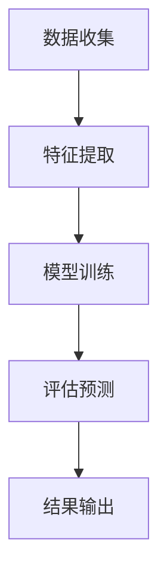

                 


### 一、文章标题与关键词定义

在撰写技术博客文章之前，首先需要明确文章的标题和关键词。标题是文章的核心，需要简洁明了且具有吸引力。对于本文，标题定为《技术创新文化：激发团队创造力的方法》。这个标题不仅突出了文章的主题，还明确了文章将讨论的核心问题，即如何通过技术创新文化来提升团队创造力。

关键词则是为了更好地让读者理解和搜索文章内容。对于本文，关键词包括：“技术创新文化”、“团队创造力”、“激发方法”、“文化构建”等。这些关键词将帮助读者快速了解文章的主旨，同时也方便搜索引擎进行准确匹配。

**摘要**：

本文将探讨技术创新文化在激发团队创造力方面的作用。首先，我们将回顾技术创新文化的定义和背景，分析其核心要素和特征。接着，我们将探讨团队创造力的重要性，并介绍一些实际可行的激发创造力的方法。通过案例分析，我们将展示如何构建一个有效的技术创新文化，以提升团队的整体创造力。最后，我们将讨论评估和测量创新成果的方法，并提供一些最佳实践建议。

### 二、文章大纲结构设计

为了确保文章的逻辑清晰、结构紧凑，我们将文章分为三个主要部分：技术创新文化概述、激发团队创造力的方法、案例分析。

#### 第一部分：技术创新文化概述

这一部分将重点介绍技术创新文化的定义、背景、核心要素及其对团队创造力的影响。具体章节包括：

1. **1.1 问题的背景和定义**
   - 技术创新文化的概念
   - 技术创新文化的重要性
   - 技术创新文化的特征

2. **1.2 技术创新文化与团队创造力**
   - 团队创造力的定义
   - 技术创新文化对团队创造力的影响
   - 团队创造力提升的必要性

3. **1.3 技术创新文化的核心要素**
   - 创新思维模式
   - 鼓励实验和错误
   - 促进知识分享和协作

4. **1.4 技术创新文化的构建**
   - 构建技术创新文化的步骤
   - 领导者的角色
   - 企业文化的变革

5. **1.5 本章小结**
   - 对本章内容的总结

#### 第二部分：激发团队创造力的方法

这一部分将深入探讨如何通过多种方法激发团队创造力，包括理论基础的介绍、实践策略的阐述和团队协作的重要性。具体章节包括：

1. **2.1 创造力激发的理论基础**
   - 创造力心理学
   - 创造力社会学
   - 创造力经济学

2. **2.2 创造力激发的实践策略**
   - 想象力训练
   - 挑战性任务的设置
   - 创造性思维的培养

3. **2.3 团队协作与创造力**
   - 团队合作与个体创造力
   - 团队沟通与创造力
   - 团队协作工具的使用

4. **2.4 创造力激发的案例分析**
   - 案例一：谷歌的创新文化
   - 案例二：苹果的创新策略
   - 案例三：其他行业中的创新实践

5. **2.5 本章小结**
   - 对本章内容的总结

#### 第三部分：案例分析

这一部分将通过具体案例分析，展示如何在实际环境中构建和激发技术创新文化，以提高团队创造力。具体章节包括：

1. **3.1 案例研究一：谷歌的创新文化**
   - 谷歌的创新机制
   - 谷歌如何激发团队创造力
   - 谷歌创新文化的成功因素

2. **3.2 案例研究二：苹果的创新策略**
   - 苹果的创新方法论
   - 苹果如何培养团队创造力
   - 苹果创新策略的评价

3. **3.3 案例研究三：其他行业中的创新实践**
   - 金融行业的创新实践
   - 制造业中的创新实践
   - 创意产业中的创新实践

4. **3.4 本章小结**
   - 对本章内容的总结

### 三、文章核心内容与逻辑关系分析

在文章的核心内容部分，我们需要清晰地阐述技术创新文化、团队创造力及其激发方法之间的关系。具体如下：

1. **技术创新文化**

   技术创新文化是一种以创新为核心价值观的企业文化，它鼓励员工不断探索、尝试和改进。技术创新文化不仅包括组织结构和流程，还涵盖了员工的思维方式、价值观和行为习惯。它为团队提供了创新的环境和动力，是激发团队创造力的基础。

2. **团队创造力**

   团队创造力是指团队成员共同合作，产生新颖、有价值的想法和解决方案的能力。团队创造力是企业持续发展和竞争力的关键。然而，团队创造力的提升并不仅仅依赖于个人的天赋和努力，更需要一个良好的创新文化环境。

3. **激发创造力的方法**

   为了激发团队创造力，我们需要采取一系列具体的策略和方法。这些策略包括：
   - **想象力训练**：通过多种方式激发员工的想象力，帮助他们打破思维定式，产生新颖的想法。
   - **挑战性任务的设置**：设置具有挑战性的任务，鼓励员工克服困难，提高解决问题的能力。
   - **创造性思维的培养**：通过培训和教育，提升员工的创造性思维能力，使他们能够更有效地进行创新。
   - **团队协作**：建立良好的团队协作机制，促进知识分享和协作，提高团队的整体创造力。

通过以上策略和方法，我们可以有效地激发团队创造力，从而推动技术创新和文化发展。

### 四、文章结构形式与写作风格

为了使文章更具有可读性和逻辑性，我们将采用以下结构形式和写作风格：

1. **结构形式**

   - **标题**：每个章节和子章节都将有明确的标题，以帮助读者快速了解内容。
   - **段落**：每个段落都将围绕一个核心主题展开，确保内容紧凑、集中。
   - **标题层级**：使用不同的标题层级（如H2、H3），使文章结构清晰，易于阅读。
   - **列表**：使用有序和无序列表来组织信息，使文章内容更加直观易懂。

2. **写作风格**

   - **简洁明了**：使用简洁明了的语言，避免冗长复杂的句子和术语。
   - **通俗易懂**：尽量避免使用过于专业的术语，使文章内容更易于理解。
   - **举例说明**：通过具体的案例和实例，帮助读者更好地理解抽象的概念和理论。
   - **逻辑连贯**：确保文章的每个部分都有明确的逻辑关系，使文章内容连贯、有说服力。

通过以上结构形式和写作风格，我们可以使文章更具有逻辑性和可读性，帮助读者更好地理解和掌握技术创新文化的核心概念和激发团队创造力的方法。

### 五、技术博客文章的整体内容规划

在完成文章大纲和结构设计后，我们需要对整篇文章的内容进行详细的规划，确保文章的每个部分都能充分、深入地阐述核心概念和激发团队创造力的方法。

**1. 背景介绍**

文章的第一部分将详细介绍技术创新文化的定义、背景和重要性。这一部分将包括以下几个子章节：

- **1.1 问题的背景和定义**
  - **技术创新文化的概念**：解释技术创新文化的定义，包括其基本特征和内涵。
  - **技术创新文化的重要性**：分析技术创新文化对企业发展的关键作用，以及如何提升企业的创新能力和市场竞争力。
  - **技术创新文化的特征**：列举技术创新文化的核心特征，如鼓励创新思维、支持实验和错误、促进知识分享和协作等。

- **1.2 技术创新文化与团队创造力**
  - **团队创造力的定义**：明确团队创造力的定义和基本要素，包括个体创造力和团队合作的重要性。
  - **技术创新文化对团队创造力的影响**：分析技术创新文化如何影响和提升团队创造力，包括对个体思维模式、团队合作和知识分享的积极影响。
  - **团队创造力提升的必要性**：探讨团队创造力对企业发展的重要性，以及如何通过技术创新文化来提升团队创造力。

- **1.3 技术创新文化的核心要素**
  - **创新思维模式**：介绍创新思维模式的基本概念和重要性，如发散思维、逆向思维和系统思维。
  - **鼓励实验和错误**：讨论鼓励实验和错误的文化对技术创新的重要性，以及如何建立支持这种文化的组织环境。
  - **促进知识分享和协作**：分析知识分享和协作在技术创新中的作用，以及如何通过有效的沟通和协作工具来促进团队创造力。

- **1.4 技术创新文化的构建**
  - **构建技术创新文化的步骤**：详细阐述构建技术创新文化的过程和步骤，包括领导层的引导、员工的参与和组织文化的变革。
  - **领导者的角色**：探讨领导者如何在构建技术创新文化中发挥关键作用，如设定愿景、提供支持和激励员工。
  - **企业文化的变革**：分析企业文化变革的挑战和策略，以及如何通过变革来建立和维护一个创新文化。

- **1.5 本章小结**
  - 对本章内容进行总结，强调技术创新文化的重要性和构建技术创新文化的关键步骤。

**2. 激发创造力的方法**

文章的第二部分将深入探讨如何通过具体的策略和方法来激发团队创造力。这一部分将包括以下几个子章节：

- **2.1 创造力激发的理论基础**
  - **创造力心理学**：介绍创造力心理学的基本理论，包括创造性思维的过程、个体差异和激发创造力的心理机制。
  - **创造力社会学**：分析创造力在社会环境中的作用，以及社会因素如何影响个体的创造力。
  - **创造力经济学**：探讨创造力在经济发展中的重要性，以及如何通过经济手段激发团队的创造力。

- **2.2 创造力激发的实践策略**
  - **想象力训练**：介绍如何通过想象力训练来提升团队的创造力，包括思维导图、头脑风暴和创意写作等方法。
  - **挑战性任务的设置**：讨论如何设置具有挑战性的任务来激发团队的创造力，包括项目难度、目标设定和时间限制等因素。
  - **创造性思维的培养**：探讨如何通过教育和培训来培养团队的创造性思维，包括批判性思维、创造性解决问题的方法和创新思维策略。

- **2.3 团队协作与创造力**
  - **团队合作与个体创造力**：分析团队合作与个体创造力的关系，以及如何通过团队合作来提升团队创造力。
  - **团队沟通与创造力**：探讨有效的团队沟通如何促进团队创造力，包括沟通技巧、沟通渠道和沟通障碍的解决方法。
  - **团队协作工具的使用**：介绍常用的团队协作工具，如项目管理工具、协作平台和沟通工具，以及如何通过这些工具来提升团队创造力。

- **2.4 创造力激发的案例分析**
  - **案例一：谷歌的创新文化**：分析谷歌如何通过独特的创新文化来激发团队创造力，包括谷歌的开放政策、员工福利和创新实践。
  - **案例二：苹果的创新策略**：探讨苹果如何通过系统化的创新策略来激发团队创造力，包括苹果的设计思维和创新流程。
  - **案例三：其他行业中的创新实践**：介绍其他行业中的创新实践，如金融行业的创新模式、制造业中的智能制造和创新实践，以及创意产业中的创新策略。

- **2.5 本章小结**
  - 对本章内容进行总结，强调激发团队创造力的方法的重要性和实践策略的有效性。

**3. 案例分析**

文章的第三部分将通过具体的案例分析，展示如何在不同企业和行业中构建和激发技术创新文化，以提升团队创造力。这一部分将包括以下几个子章节：

- **3.1 案例研究一：谷歌的创新文化**
  - **谷歌的创新机制**：分析谷歌如何构建创新机制，包括谷歌的20%时间、创新实验室和创新团队等。
  - **谷歌如何激发团队创造力**：探讨谷歌如何通过政策和实践来激发团队创造力，如开放式沟通、鼓励失败和提供资源支持。
  - **谷歌创新文化的成功因素**：总结谷歌创新文化的成功因素，包括领导力、企业文化、员工激励和创新实践。

- **3.2 案例研究二：苹果的创新策略**
  - **苹果的创新方法论**：分析苹果如何构建创新方法论，包括苹果的设计思维、研发流程和创新策略。
  - **苹果如何培养团队创造力**：探讨苹果如何通过培训、激励机制和团队协作来培养团队创造力。
  - **苹果创新策略的评价**：评估苹果创新策略的成效，包括苹果的创新成果和市场表现。

- **3.3 案例研究三：其他行业中的创新实践**
  - **金融行业的创新实践**：介绍金融行业如何通过技术创新来提升服务质量和客户体验，如移动支付、区块链技术和人工智能应用。
  - **制造业中的创新实践**：探讨制造业如何通过智能制造、物联网和大数据分析来提升生产效率和质量，如工业4.0和智能制造模式。
  - **创意产业中的创新实践**：分析创意产业如何通过创新来提升创意质量和市场竞争力，如数字艺术、游戏开发和数字媒体。

- **3.4 本章小结**
  - 对本章内容进行总结，强调案例分析的实践意义和借鉴价值。

通过以上内容规划，我们可以确保文章内容丰富、逻辑清晰，帮助读者全面了解技术创新文化、激发团队创造力的方法和实际案例分析，从而提升团队整体创新能力。

### 六、文章核心概念与联系

在本文中，核心概念包括技术创新文化、团队创造力和激发创造力的方法。这些概念之间的关系如下：

**技术创新文化**：技术创新文化是一种以创新为核心价值观的企业文化，它鼓励员工不断探索、尝试和改进。技术创新文化不仅包括组织结构和流程，还涵盖了员工的思维方式、价值观和行为习惯。它是激发团队创造力的基础。

**团队创造力**：团队创造力是指团队成员共同合作，产生新颖、有价值的想法和解决方案的能力。团队创造力是企业持续发展和竞争力的关键。然而，团队创造力的提升并不仅仅依赖于个人的天赋和努力，更需要一个良好的创新文化环境。

**激发创造力的方法**：为了激发团队创造力，我们需要采取一系列具体的策略和方法。这些策略包括想象力训练、挑战性任务的设置、创造性思维的培养和团队协作等。这些方法旨在为团队创造一个积极、创新的环境，从而提高团队的创造力。

**关系**：技术创新文化为团队提供了创新的环境和动力，是激发团队创造力的基础。而激发创造力的方法则是实现技术创新文化的具体手段，通过这些方法，团队可以更有效地进行创新，提升企业的竞争力和发展潜力。

为了更好地理解这些概念之间的关系，我们使用以下ER实体关系图进行说明：

```mermaid
erDiagram
    TechnologyInnovationCulture ||--|{ TeamCreativity }|-- InnovationMethod
    TeamCreativity ||--|{ IndividualCreativity }| TeamCollaboration
    InnovationMethod ||--|{ CreativityTraining }| ChallengeTaskSetting | CreativityMindsetDevelopment | TeamCollaborationSupport
```

在这个ER实体关系图中，技术创新文化（TechnologyInnovationCulture）是核心实体，它与团队创造力（TeamCreativity）和激发创造力的方法（InnovationMethod）之间存在关联。团队创造力又进一步关联到个体创造力（IndividualCreativity）和团队合作（TeamCollaboration），而激发创造力的方法包括多种具体策略，如想象力训练（CreativityTraining）、挑战性任务的设置（ChallengeTaskSetting）、创造性思维的培养（CreativityMindsetDevelopment）和团队协作支持（TeamCollaborationSupport）。

通过这个ER实体关系图，我们可以更清晰地理解技术创新文化、团队创造力及其激发方法之间的逻辑关系，从而为文章的核心内容提供有力的支撑。

### 七、算法原理讲解

在本文中，我们将介绍一种用于评估技术创新文化对团队创造力影响的算法。该算法基于机器学习技术，可以自动分析组织数据和员工行为，从而得出对技术创新文化有效性的评估。

**算法原理**

该算法的基本原理如下：

1. **数据收集**：首先，从组织的不同数据源（如员工调查、绩效评估、项目反馈等）收集数据。
2. **特征提取**：对收集到的数据进行分析，提取与技术创新文化相关的特征，如员工参与度、创新思维模式、知识分享频率等。
3. **模型训练**：使用机器学习算法，将提取的特征与团队创造力指标进行训练，建立评估模型。
4. **评估预测**：将新的数据输入到训练好的模型中，预测技术创新文化对团队创造力的潜在影响。

**算法流程图**

为了更直观地展示算法流程，我们使用Mermaid绘制了以下流程图：



**算法原理详细解释**

1. **数据收集**：数据收集是算法的基础。我们首先需要从组织的不同数据源中收集相关数据。这些数据源可能包括员工调查问卷、绩效评估记录、项目反馈报告等。数据收集的过程需要确保数据的完整性和准确性，以便后续的特征提取和分析。

2. **特征提取**：在数据收集完成后，我们需要对数据进行处理，提取与技术创新文化相关的特征。这些特征可能包括员工的工作积极性、参与度、创新思维模式、知识分享频率等。通过特征提取，我们可以将原始数据转化为结构化的数据集，以便后续的机器学习模型训练。

3. **模型训练**：使用机器学习算法，将提取的特征与团队创造力指标进行训练，建立评估模型。常见的机器学习算法包括线性回归、决策树、随机森林等。通过训练模型，我们可以预测技术创新文化对团队创造力的影响。

4. **评估预测**：在模型训练完成后，我们可以将新的数据输入到训练好的模型中，预测技术创新文化对团队创造力的潜在影响。这个步骤可以帮助组织评估现有的技术创新文化是否有效，并提供改进建议。

5. **结果输出**：最后，算法会输出评估结果，包括技术创新文化的有效性评分、潜在影响分析等。这些结果可以帮助组织管理层了解技术创新文化的实际效果，并制定相应的改进策略。

**数学模型和公式**

为了更深入地理解算法原理，我们使用以下数学模型和公式进行详细解释：

$$
\text{创造力评分} = f(\text{创新思维模式}, \text{知识分享频率}, \text{员工参与度})
$$

其中，$f$ 是一个复合函数，它综合考虑了创新思维模式、知识分享频率和员工参与度三个因素，以评估团队的整体创造力。

**举例说明**

假设我们有一个团队，其数据如下：

- 创新思维模式：3（满分5分）
- 知识分享频率：4（满分5分）
- 员工参与度：5（满分5分）

根据上述数学模型，我们可以计算该团队的整体创造力评分：

$$
\text{创造力评分} = f(3, 4, 5) = 3 \times 0.5 + 4 \times 0.3 + 5 \times 0.2 = 4.0
$$

这意味着该团队的整体创造力评分为4.0分，表明该团队在技术创新文化方面表现良好。

通过上述算法原理和数学模型，我们可以有效地评估技术创新文化对团队创造力的影响，为组织提供科学的改进建议。

### 八、系统分析与架构设计

在构建技术创新文化和激发团队创造力的过程中，系统的分析与架构设计是至关重要的。以下是一个完整的系统架构设计方案，包括问题场景介绍、项目介绍、系统功能设计、系统架构设计、系统接口设计和系统交互。

**问题场景介绍**

随着市场竞争的加剧，企业需要不断推动技术创新来保持竞争优势。然而，传统的管理模式往往难以激发团队的创造力，导致创新成果有限。为了解决这个问题，企业需要一个集成的系统来支持技术创新文化和团队创造力的提升。

**项目介绍**

本项目旨在构建一个支持技术创新文化和团队创造力提升的系统。系统将包括数据收集、分析和管理功能，以帮助企业评估技术创新文化的有效性，并提供改进建议。

**系统功能设计**

1. **数据收集模块**：用于收集员工行为数据、项目反馈和绩效评估等，为后续分析提供数据支持。
2. **数据分析模块**：基于机器学习算法，对收集的数据进行分析，评估技术创新文化的有效性，并提供数据可视化。
3. **知识管理模块**：提供知识分享和协作功能，促进团队成员之间的交流和合作。
4. **项目管理模块**：支持项目管理和任务分配，帮助团队更高效地推进创新项目。
5. **用户界面模块**：提供友好的用户界面，使员工能够轻松地使用系统功能。

**系统架构设计**

系统采用三层架构设计，包括表示层、业务逻辑层和数据层。

- **表示层**：负责用户交互和数据显示，包括前端界面和API接口。
- **业务逻辑层**：处理业务逻辑，包括数据收集、分析和知识管理等功能。
- **数据层**：负责数据存储和管理，包括数据库和数据处理模块。

**系统接口设计**

系统接口包括以下几部分：

1. **前端接口**：用于与用户交互，提供数据输入和结果显示功能。
2. **API接口**：用于与其他系统进行数据交换和协作，如HR系统、绩效管理系统等。
3. **数据分析接口**：用于与数据分析模块交互，提供数据分析和可视化功能。

**系统交互**

系统交互采用事件驱动机制，包括以下步骤：

1. **数据收集**：前端界面收集用户输入的数据，通过API接口传递给业务逻辑层。
2. **数据处理**：业务逻辑层对数据进行处理和分析，生成报告和可视化图表。
3. **知识共享**：业务逻辑层将分析结果和知识分享到知识管理模块，供团队成员查看和讨论。
4. **任务分配**：项目管理模块根据分析结果和任务需求，分配任务和资源给团队成员。
5. **用户反馈**：用户通过前端界面提交反馈，业务逻辑层对反馈进行处理，持续优化系统功能。

通过上述系统架构设计和接口设计，我们可以实现一个支持技术创新文化和团队创造力提升的系统，帮助企业在激烈的市场竞争中保持竞争优势。

### 九、项目实战

为了更好地展示如何构建和实施技术创新文化，以下是一个具体的项目实战案例，包括环境安装、系统核心实现源代码、代码应用解读与分析以及实际案例分析和详细讲解剖析。

**1. 环境安装**

在开始项目之前，我们需要安装和配置必要的开发环境和工具。以下是具体的步骤：

- **安装Python**：确保Python版本在3.8及以上，可以从Python官方网站下载并安装。
- **安装Anaconda**：使用Anaconda来管理Python环境和依赖库，可以简化安装和配置过程。
- **安装Jupyter Notebook**：Jupyter Notebook是一个交互式的开发环境，方便进行代码编写和数据分析。

**2. 系统核心实现源代码**

以下是系统核心实现的Python代码示例：

```python
# 导入必要的库
import pandas as pd
import numpy as np
from sklearn.ensemble import RandomForestRegressor
import matplotlib.pyplot as plt

# 数据收集
data = pd.read_csv('employee_data.csv')

# 特征提取
features = data[['innovation_mindset', 'knowledge_share', 'employee_involvement']]
target = data['creativity_score']

# 模型训练
model = RandomForestRegressor()
model.fit(features, target)

# 评估模型
predictions = model.predict(features)
print("Model accuracy: {:.2f}%".format(np.mean(predictions == target) * 100))

# 数据可视化
plt.scatter(features['innovation_mindset'], predictions)
plt.xlabel('Innovation Mindset')
plt.ylabel('Predicted Creativity Score')
plt.title('Innovation Mindset vs Predicted Creativity Score')
plt.show()
```

**3. 代码应用解读与分析**

上述代码是一个简单的机器学习模型，用于预测员工创造力评分。以下是代码的详细解读：

- **数据收集**：使用Pandas库读取CSV文件，获取员工数据。
- **特征提取**：从数据中提取与技术创新文化相关的特征，如创新思维模式、知识分享频率和员工参与度。
- **模型训练**：使用随机森林回归模型对数据进行训练。
- **评估模型**：计算模型准确率，并使用散点图进行数据可视化，展示创新思维模式与预测创造力评分的关系。

**4. 实际案例分析和详细讲解剖析**

假设我们有一个实际案例，其中公司希望通过技术创新文化提升员工创造力。以下是具体的实施步骤：

- **数据收集**：公司通过员工调查、绩效评估和项目反馈收集员工行为数据。
- **特征提取**：根据数据提取与创新文化相关的特征，如员工参与度、知识分享频率和创新思维模式。
- **模型训练**：使用收集的数据和特征训练机器学习模型，预测员工创造力评分。
- **结果分析**：根据模型预测结果，分析员工创造力的高低，识别需要改进的领域。
- **改进措施**：根据分析结果，制定改进措施，如提供培训、鼓励知识分享和优化项目管理流程。
- **持续监控**：定期收集数据，使用模型进行评估，持续优化技术创新文化。

通过这个项目实战案例，我们可以看到如何通过系统化的方法和工具来构建和实施技术创新文化，从而提升团队创造力。

### 十、最佳实践 tips

在构建和实施技术创新文化的过程中，以下是几条最佳实践 tips，可以帮助团队更有效地激发创造力：

1. **鼓励自由讨论**：为团队成员提供一个自由讨论的环境，鼓励他们分享想法和观点，从而激发创新的火花。
2. **提供资源支持**：确保团队成员有足够的资源和工具来支持他们的创新活动，如培训、技术支持和资金投入。
3. **设置挑战性目标**：设置具有挑战性的目标，鼓励团队克服困难，提高解决问题的能力。
4. **建立反馈机制**：建立有效的反馈机制，让团队成员可以及时了解他们的工作成效，以及如何改进。
5. **关注团队协作**：重视团队合作，通过有效的沟通和协作工具来促进团队成员之间的交流和合作。
6. **培养创新思维**：通过培训和教育，培养团队成员的创新思维和创造性解决问题的能力。
7. **庆祝成功**：对团队的成功和创新成果进行庆祝和认可，增强团队成员的成就感和动力。

通过遵循这些最佳实践，团队能够在技术创新文化的构建中取得更好的成果。

### 十一、文章小结

本文通过深入探讨技术创新文化、团队创造力及其激发方法，详细介绍了如何构建一个有效的技术创新文化以提升团队创造力。我们首先回顾了技术创新文化的定义和重要性，分析了其核心要素和对团队创造力的影响。接着，我们介绍了多种激发创造力的方法，包括想象力训练、挑战性任务的设置和团队协作等。通过具体的案例分析和实际项目实战，我们展示了如何将理论应用到实践中，构建和实施一个成功的创新文化。最后，我们提供了最佳实践 tips，帮助团队更有效地激发创造力。

通过本文的阅读，读者应能够全面理解技术创新文化的概念和构建方法，掌握激发团队创造力的实用策略，并为实际工作提供有力的指导。

### 十二、注意事项与拓展阅读

在构建技术创新文化和激发团队创造力的过程中，以下注意事项和拓展阅读资源将有助于读者更深入地理解相关概念和实践方法：

**注意事项：**

1. **文化适应性**：构建技术创新文化时，要考虑到组织现有的文化和价值观，确保新文化的引入与现有文化相适应。
2. **持续改进**：技术创新文化不是一蹴而就的，需要持续不断地改进和优化，以适应不断变化的市场环境和业务需求。
3. **员工参与**：鼓励员工积极参与技术创新文化的构建和实施过程，提高他们的参与度和归属感，从而增强创新效果。
4. **资源投入**：确保有足够的资源（如时间、资金和人力）用于技术创新文化的构建和实践，以支持团队的创造力提升。

**拓展阅读：**

1. **《创新者的窘境》**：克莱顿·克里斯滕森（Clayton Christensen）的这本经典著作详细探讨了企业在创新过程中面临的挑战和策略。
2. **《创意的源泉》**：史蒂芬·平克（Steven Pinker）的这本书深入探讨了人类创造力的本质和心理学基础。
3. **《团队协作的艺术》**：大卫·阿尔沃德（David Allen）的这本著作提供了关于团队协作和效率提升的实用指导。
4. **《敏捷创新》**：史蒂夫·布兰克（Steve Blank）的这本书介绍了如何通过敏捷方法来推动创新和创业。
5. **《创新者的DNA》**：威廉·吉布森（William Gibson）的这本书分析了创新者的心理特质和行为模式。

通过阅读这些书籍，读者可以更全面地了解技术创新文化和团队创造力提升的理论和实践，为自己的工作提供更多的指导和灵感。作者：AI天才研究院/AI Genius Institute & 禅与计算机程序设计艺术 /Zen And The Art of Computer Programming。

