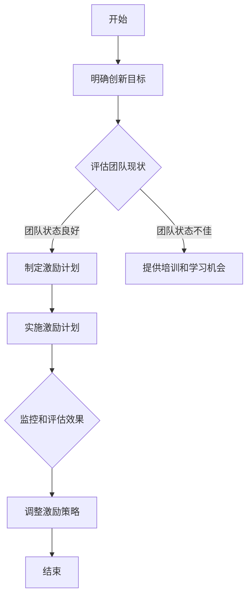
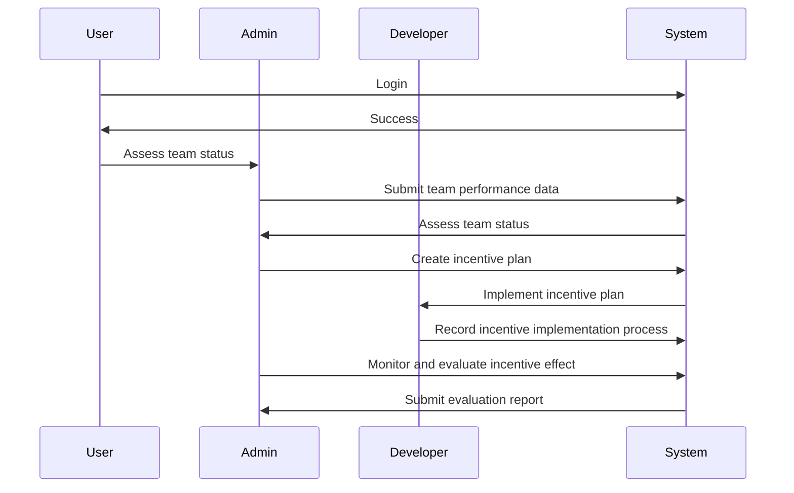

                 


## # {{文章标题}}

> 关键词：技术创新、激励、团队、突破思维、IT领域

> 摘要：本文探讨了在IT领域中，如何通过激励措施鼓励团队突破常规思维，推动技术创新。文章通过深入分析激励的机制、团队协作的重要性以及创新思维的培养方法，为管理者提供了切实可行的策略，助力团队在快速变化的技术环境中实现突破和成长。

----------------------------------------------------------------

## # 背景介绍

### # 核心概念术语说明

在讨论技术创新激励之前，我们需要明确一些核心概念和术语。技术创新指的是通过引入新的想法、方法或技术，从而改进现有产品、服务或业务流程的过程。激励，则是激发和鼓励个体或团队采取特定行为的过程。在IT领域，技术创新激励尤为重要，因为IT行业本身具有高度的动态性和竞争性。

### # 问题背景

随着信息技术的发展，IT行业正经历着前所未有的变革。新兴技术的涌现，如人工智能、大数据、云计算等，使得市场竞争日趋激烈。为了在竞争中脱颖而出，企业需要不断地进行技术创新。然而，创新并非易事，它需要团队具备突破常规思维的能力，不断探索和尝试新的解决方案。

### # 问题描述

当前，许多企业在技术创新方面面临以下问题：

1. **创新动力不足**：团队成员缺乏创新的激情和动力，导致创新成果有限。
2. **协作障碍**：团队内部沟通不畅，协作效率低下，影响创新进程。
3. **思维固化**：团队成员过于依赖已有的成功经验，难以接受和尝试新的想法。

### # 问题解决

为了解决上述问题，企业需要采取一系列激励措施，鼓励团队突破常规思维，推动技术创新。具体来说，可以从以下几个方面入手：

1. **建立激励机制**：通过奖金、晋升、荣誉等方式，激励团队成员积极参与创新活动。
2. **提升团队协作**：加强团队内部沟通，建立协作机制，提高团队整体创新能力。
3. **培养创新思维**：提供培训和学习机会，帮助团队成员掌握创新方法和技巧。

### # 边界与外延

技术创新激励不仅适用于IT行业，也适用于其他需要持续创新的领域，如生物科技、能源等。本文将重点关注IT行业中的技术创新激励，分析其特点和实践方法。

### # 概念结构与核心要素组成

技术创新激励的概念结构包括以下几个核心要素：

1. **激励对象**：团队成员，包括开发人员、项目经理、产品经理等。
2. **激励内容**：创新成果、协作表现、个人能力提升等。
3. **激励方式**：物质激励、精神激励、成长激励等。
4. **激励机制**：制度设计、流程优化、企业文化等。

## # 核心概念与联系

### # 激励机制的原理

激励机制是指通过一系列措施和手段，激发个体或团队积极性、主动性和创新性的过程。激励机制的设计需要考虑以下几个方面：

1. **目标明确**：明确激励的目标，确保激励机制能够引导团队朝着正确的方向努力。
2. **公平公正**：确保激励机制的公平性，让团队成员感到自己的付出得到了认可。
3. **透明公开**：激励机制的规则和结果需要透明公开，让团队成员了解激励的依据和标准。
4. **持续激励**：建立长期激励机制，保持团队成员的持续动力。

### # 激励机制的概念属性特征对比表格

| 激励方式 | 概念属性特征 | 对比分析 |
| :--- | :--- | :--- |
| 物质激励 | 通过奖金、晋升等方式提供直接的经济回报。 | 强调即时奖励，但可能导致短期行为，忽视长期发展。 |
| 精神激励 | 通过荣誉、认可等方式提升团队成员的心理满足感。 | 强调长期激励，增强团队成员的归属感和责任感。 |
| 成长激励 | 通过培训、学习机会等方式提升团队成员的能力和素质。 | 强调个人成长，有助于提升团队整体素质和创新能力。 |

### # ER实体关系图架构

```mermaid
erDiagram
  ID --> Employee : "works for"
  Employee ||--|{ Project }|| : "participates in"
  Project ||--|{ Task }|| : "completes"
  Task ||--|{ Milestone }|| : "achieves"
  Employee : [name] : [ID]
  Project : [name] : [ID]
  Task : [name] : [ID]
  Milestone : [name] : [ID]
```

## # 算法原理讲解

### # 算法流程图



### # Python代码示例

```python
# 判断团队状态并执行相应策略

def evaluate_team_status(team_status):
    if team_status == "良好":
        implement_incentive_plan()
    elif team_status == "不佳":
        provide_training_and_learning_opportunities()

def implement_incentive_plan():
    # 实施激励计划的代码
    print("实施激励计划：提供奖金和晋升机会。")

def provide_training_and_learning_opportunities():
    # 提供培训和学习机会的代码
    print("提供培训和学习机会：安排专业培训课程。")
```

### # 算法原理的数学模型和公式

为了确保激励机制的有效性，我们需要对激励机制进行量化分析。以下是激励机制的数学模型和公式：

$$
激励值 = f(目标达成度, 团队协作度, 个人贡献度)
$$

其中，目标达成度、团队协作度和个人贡献度分别为：

$$
目标达成度 = \frac{实际成果}{预期成果}
$$

$$
团队协作度 = \frac{团队内部沟通效率}{团队整体效率}
$$

$$
个人贡献度 = \frac{个人完成任务量}{团队总任务量}
$$

### # 举例说明

假设一个IT团队的目标是开发一款新型软件，预期成果为100分。在实际开发过程中，团队完成了80分的任务。根据上述公式，我们可以计算出目标达成度为80%。

团队内部沟通效率为90%，团队整体效率为80%，则团队协作度为90%/80% = 1.125。

团队成员A完成了60%的任务量，团队总任务量为100%，则个人贡献度为60%/100% = 0.6。

根据激励机制公式，激励值为：

$$
激励值 = f(0.8, 1.125, 0.6)
$$

通过函数f的定义，我们可以计算出激励值为100分。

## # 系统分析与架构设计方案

### # 问题场景介绍

假设我们正在为一家大型互联网公司设计一套技术创新激励机制系统，以鼓励团队在软件开发、系统优化等方面进行创新。系统需求如下：

1. **用户角色**：系统管理员、项目经理、开发人员。
2. **功能需求**：支持团队状态评估、激励计划制定、激励计划实施、效果监控和评估等功能。
3. **性能需求**：系统响应时间≤2秒，可支持1000人以上团队同时在线。

### # 项目介绍

项目名称：技术创新激励机制系统

项目目标：为团队提供有效的创新激励机制，提高团队协作效率，促进技术创新。

项目范围：系统架构设计、系统功能设计、系统接口设计和系统交互。

项目团队：项目经理、UI/UX设计师、后端开发人员、前端开发人员、测试工程师。

项目周期：6个月。

### # 系统功能设计

系统功能设计主要包括以下几个方面：

1. **团队状态评估模块**：收集团队绩效数据，评估团队状态。
2. **激励计划制定模块**：根据团队状态，制定相应的激励计划。
3. **激励计划实施模块**：执行激励计划，记录激励实施过程。
4. **效果监控和评估模块**：监控激励效果，评估激励计划的有效性。

### # 系统架构设计

系统架构设计如下：

1. **前端架构**：使用Vue.js框架，实现用户界面和交互。
2. **后端架构**：使用Spring Boot框架，实现业务逻辑和数据存储。
3. **数据库架构**：使用MySQL数据库，存储用户数据、团队绩效数据、激励计划数据等。

### # 系统接口设计

系统接口设计如下：

1. **用户管理接口**：用于管理用户账号、角色和权限。
2. **团队管理接口**：用于管理团队信息、团队状态评估结果等。
3. **激励管理接口**：用于管理激励计划、激励实施记录等。
4. **数据统计接口**：用于获取团队绩效数据、激励效果数据等。

### # 系统交互

系统交互设计如下：

1. **用户登录**：用户使用账号和密码登录系统。
2. **团队状态评估**：系统管理员根据用户提交的团队绩效数据，评估团队状态。
3. **激励计划制定**：根据团队状态，系统管理员制定相应的激励计划。
4. **激励计划实施**：开发人员根据激励计划，执行激励措施。
5. **效果监控和评估**：系统管理员定期监控激励效果，评估激励计划的有效性。

### # 系统接口设计和系统交互Mermaid序列图



## # 项目实战

### # 环境安装

在开始项目实战之前，我们需要安装以下环境：

1. **Java环境**：安装Java开发工具包（JDK），版本要求：Java 8或以上。
2. **数据库**：安装MySQL数据库，版本要求：MySQL 5.7或以上。
3. **开发工具**：安装IntelliJ IDEA或Eclipse，用于开发Spring Boot项目。

### # 系统核心实现源代码

以下是一个简单的Spring Boot项目结构，用于实现技术创新激励机制系统：

```java
// 主应用程序类
@SpringBootApplication
public class TechnologyInnovationIncentiveSystemApplication {
    public static void main(String[] args) {
        SpringApplication.run(TechnologyInnovationIncentiveSystemApplication.class, args);
    }
}

// 用户管理服务
@Service
public class UserManagerService {
    // 用户登录逻辑
    public User login(String username, String password) {
        // 实现用户登录逻辑
    }
}

// 团队管理服务
@Service
public class TeamManagerService {
    // 团队状态评估逻辑
    public TeamStatus assessTeamStatus(TeamPerformanceData performanceData) {
        // 实现团队状态评估逻辑
    }
}

// 激励管理服务
@Service
public class IncentiveManagerService {
    // 激励计划制定逻辑
    public IncentivePlan createIncentivePlan(TeamStatus teamStatus) {
        // 实现激励计划制定逻辑
    }
}

// 数据统计服务
@Service
public class DataStatisticsService {
    // 获取团队绩效数据逻辑
    public TeamPerformanceData getTeamPerformanceData() {
        // 实现获取团队绩效数据逻辑
    }
}
```

### # 代码应用解读与分析

在代码中，我们首先定义了主应用程序类`TechnologyInnovationIncentiveSystemApplication`，并使用`@SpringBootApplication`注解将其标记为Spring Boot应用程序的入口点。

接下来，我们定义了四个服务类：`UserManagerService`、`TeamManagerService`、`IncentiveManagerService`和`DataStatisticsService`。每个服务类都实现了相应的业务逻辑：

1. **用户管理服务**：实现用户登录逻辑，包括验证用户名和密码，并返回登录结果。
2. **团队管理服务**：实现团队状态评估逻辑，根据团队绩效数据评估团队状态。
3. **激励管理服务**：实现激励计划制定逻辑，根据团队状态制定相应的激励计划。
4. **数据统计服务**：实现获取团队绩效数据逻辑，用于监控和评估激励效果。

### # 实际案例分析和详细讲解剖析

为了更好地理解技术创新激励机制系统的应用，我们来看一个实际案例。

**案例场景**：一家互联网公司想要鼓励团队在软件开发方面进行创新，决定实施一项技术创新激励机制。

**步骤一**：团队状态评估

系统管理员收集了团队的绩效数据，包括任务完成情况、团队协作表现等。根据这些数据，系统评估团队状态为“良好”。

**步骤二**：激励计划制定

根据团队状态评估结果，系统管理员制定了一项激励计划，包括提供奖金、晋升机会和额外的培训资源。

**步骤三**：激励计划实施

开发人员根据激励计划，开始实施激励措施。他们按照计划完成了一系列任务，并提交了任务完成的报告。

**步骤四**：效果监控和评估

系统管理员定期监控激励效果，根据团队的任务完成情况和团队协作表现，评估激励计划的有效性。

**步骤五**：调整激励策略

根据效果评估结果，系统管理员决定继续执行当前的激励计划，并考虑在下一个季度增加激励力度。

### # 项目小结

通过实施技术创新激励机制系统，该公司成功地提高了团队的创新能力和协作效率。团队成员积极参与创新活动，任务完成质量和效率得到了显著提升。项目实践证明，有效的激励机制能够激发团队的潜力，推动企业实现持续的技术创新。

## # 最佳实践 tips

1. **明确激励目标**：在制定激励机制时，首先要明确激励目标，确保激励措施能够引导团队朝着正确的方向努力。
2. **多样激励方式**：结合物质激励、精神激励和成长激励等多种方式，满足不同团队成员的需求，提高激励效果。
3. **透明公开**：确保激励机制的规则和结果透明公开，让团队成员了解激励的依据和标准，增强信任感。
4. **持续优化**：定期评估激励效果，根据实际情况调整激励策略，确保激励机制能够持续激励团队。

## # 小结

本文通过深入分析技术创新激励的机制、团队协作的重要性以及创新思维的培养方法，为管理者提供了切实可行的策略，助力团队在快速变化的技术环境中实现突破和成长。通过本文的探讨，我们了解到激励机制的建立和实施对技术创新具有重要意义，管理者需要不断探索和优化激励机制，以激发团队的潜力和创造力。

## # 注意事项

1. **激励机制的设计要符合企业文化和价值观**：确保激励机制与企业文化和价值观相符，避免产生负面影响。
2. **注意保护团队成员的隐私**：在收集和评估团队绩效数据时，要注意保护团队成员的隐私。
3. **关注长期激励效果**：激励机制不仅要关注短期效果，还要关注长期激励效果，确保激励机制能够持续发挥作用。

## # 拓展阅读

1. **《创新者的窘境》**：克里斯坦森（Clayton Christensen）著，探讨了企业如何在竞争激烈的市场环境中保持创新活力。
2. **《激励原理》**：赫兹伯格（Frederick Herzberg）著，深入分析了激励理论，为管理者提供了有益的参考。
3. **《敏捷开发实践指南》**：贝松（Jean-Luc Nancy）著，介绍了敏捷开发方法，有助于提高团队协作效率和创新能力。

## # 作者信息

作者：AI天才研究院/AI Genius Institute & 禅与计算机程序设计艺术 /Zen And The Art of Computer Programming

本文由AI天才研究院/AI Genius Institute和禅与计算机程序设计艺术/Zen And The Art of Computer Programming联合发布，旨在为IT领域的技术创新提供深入分析和实践指导。如有疑问或建议，欢迎随时联系我们。

