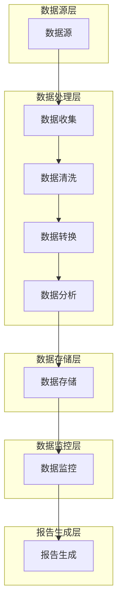

                 

# 技术合规管理：在创新中保障安全与隐私

## 关键词
技术合规、安全与隐私、软件 2.0、AI 大模型、企业级应用开发、合规管理框架

## 摘要
随着技术的快速发展，企业需要平衡创新与合规之间的关系，确保在技术创新的同时，能够有效管理和保障数据安全与用户隐私。本文将探讨技术合规管理的核心概念，分析其在软件 2.0 和 AI 大模型时代的重要性，并提出企业级应用开发的新范式，以实现合规与创新的统一。

## 第1章：背景介绍

### 1.1.1 问题背景

#### 1.1.1.1 问题描述
在当今数字化时代，企业对数据的使用和处理日益频繁，技术的快速迭代和应用为企业带来了巨大的发展机遇。然而，这也引发了技术合规管理的问题，特别是在数据安全和隐私保护方面。如何确保在创新的同时，遵循法律法规和行业标准，成为企业面临的挑战。

#### 1.1.1.2 问题解决
为了解决这一问题，企业需要建立完善的技术合规管理体系，通过制定合规策略、优化合规流程、进行合规审计和培训，来确保技术和产品符合合规要求。

#### 1.1.1.3 边界与外延
技术合规管理不仅涉及企业内部的数据管理和安全策略，还与法律法规、行业标准、客户隐私保护等方面密切相关。因此，企业在进行技术合规管理时，需要充分考虑这些边界和外部因素。

### 1.1.2 核心概念

#### 1.1.2.1 技术合规
技术合规是指在技术研发和应用过程中，遵循相关法律法规和行业标准，确保技术和产品符合合规要求。它包括技术安全合规、数据隐私合规和知识产权合规等多个方面。

#### 1.1.2.2 安全与隐私
安全与隐私是技术合规管理的重要组成部分。安全是指保护信息系统和数据的完整性、保密性和可用性；隐私是指个人信息的保密性和不可侵犯性。

### 1.1.3 概念结构与核心要素组成

#### 1.1.3.1 技术合规管理框架
技术合规管理框架包括合规策略、合规流程、合规审计和合规培训等核心要素。合规策略是企业制定的技术合规规划，合规流程是确保合规性的一系列操作步骤，合规审计是对合规性的评估，合规培训是提高员工合规意识的重要手段。

#### 1.1.3.2 安全与隐私保护技术
安全与隐私保护技术包括数据加密、访问控制、数据脱敏、安全审计等。这些技术措施有助于保护企业数据和用户隐私，防范数据泄露、滥用和非法使用。

## 第2章：核心概念与联系

### 2.1 技术合规概念

#### 2.1.1 技术合规的定义
技术合规是指在技术研发和应用过程中，遵循相关法律法规和行业标准，确保技术和产品符合合规要求。它是企业合规管理的重要组成部分，关系到企业的生存和发展。

#### 2.1.2 技术合规的分类
技术合规可分为技术安全合规、数据隐私合规和知识产权合规等。技术安全合规主要涉及网络安全、系统安全等方面；数据隐私合规主要涉及个人信息保护、数据加密等方面；知识产权合规主要涉及专利、商标等方面。

#### 2.1.3 技术合规的特征
技术合规具有法律约束性、专业性、动态性等特征。法律约束性意味着技术合规是法律法规的要求，企业必须遵守；专业性要求企业具备一定的技术能力，能够应对复杂的合规要求；动态性表明技术合规需要不断更新和调整，以适应技术的发展和变化。

### 2.2 安全与隐私概念

#### 2.2.1 安全的概念
安全是指保护信息系统和数据的完整性、保密性和可用性。它包括网络安全、系统安全、数据安全等多个方面。

#### 2.2.2 隐私的概念
隐私是指个人信息的保密性和不可侵犯性。它包括个人信息的收集、存储、处理和使用等方面。

#### 2.2.3 安全与隐私的联系
安全与隐私密切相关。安全是隐私的基础，没有安全，隐私就无从谈起；隐私是安全的体现，保护隐私是安全的重要目标。

### 2.3 概念属性特征对比表格

| 特征         | 技术合规                 | 安全                  | 隐私                  |
| ------------ | ------------------------ | --------------------- | --------------------- |
| 目标         | 合规性                   | 安全性                | 隐私保护              |
| 方法         | 法律法规、行业标准       | 技术手段、安全策略     | 数据加密、访问控制等   |
| 范围         | 技术研发和应用           | 信息系统、数据        | 个人信息              |

### 2.4 ER实体关系图架构
```mermaid
erDiagram
  ComplianceManagement --> Security : 管理安全
  ComplianceManagement --> PrivacyProtection : 管理隐私
  Security

  ComplianceManagement : 技术合规管理
  Security : 安全
  PrivacyProtection : 隐私保护
```

## 第3章：软件 2.0 与 AI 大模型对技术合规管理的影响

### 3.1 从软件 1.0 到软件 2.0 的演进

#### 3.1.1 软件 1.0 时代的特征

##### 3.1.1.1 计算机硬件与操作系统的演变
在软件 1.0 时代，计算机硬件和操作系统的发展推动了软件技术的进步。早期的计算机硬件相对简单，操作系统也以单机操作系统为主。

##### 3.1.1.2 单机应用与数据处理
软件 1.0 时代的软件主要是单机应用，数据处理能力有限，依赖于本地计算机资源。

##### 3.1.1.3 软件开发模式
软件 1.0 时代的软件开发模式以瀑布模型为主，开发周期长，变更困难。

#### 3.1.2 软件 2.0 时代的特征

##### 3.1.2.1 云计算与大数据的兴起
软件 2.0 时代，云计算和大数据技术的兴起，使得数据处理能力和存储容量大幅提升。

##### 3.1.2.2 软件即服务（SaaS）模式的普及
软件 2.0 时代，SaaS 模式的普及，使得软件的使用更加灵活，降低了企业的使用门槛。

##### 3.1.2.3 软件开发的迭代与敏捷
软件 2.0 时代，软件开发模式向迭代和敏捷方向发展，缩短了开发周期，提高了软件质量。

#### 3.1.3 软件 2.0 对 AI 大模型的影响

##### 3.1.3.1 大数据处理能力的增强
软件 2.0 时代，大数据处理能力的增强，为 AI 大模型的训练和应用提供了强大的支持。

##### 3.1.3.2 云计算资源的高效利用
软件 2.0 时代，云计算资源的高效利用，为 AI 大模型的训练和部署提供了灵活的资源配置。

##### 3.1.3.3 软件开发范式的变革
软件 2.0 时代，软件开发范式的变革，使得 AI 大模型可以更快速、更高效地集成到软件系统中。

### 3.2 大模型在软件 2.0 中的核心地位

#### 3.2.1 大模型在软件 2.0 中的重要性
大模型在软件 2.0 中具有核心地位，其强大的数据处理能力和智能化程度，使得软件系统能够实现更加复杂的业务逻辑和功能。

#### 3.2.2 大模型对软件 2.0 的影响
大模型对软件 2.0 的影响主要体现在以下几个方面：
1. 提升软件系统的智能化水平，使其能够更好地适应复杂多变的应用场景。
2. 加速软件开发过程，降低开发难度和成本。
3. 提高软件系统的可靠性和稳定性。

#### 3.2.3 大模型在软件 2.0 中的应用价值
大模型在软件 2.0 中的应用价值体现在：
1. 数据分析：通过对大量数据的分析和挖掘，为企业提供有价值的商业洞察。
2. 智能推荐：在电商、社交媒体等领域，通过大模型实现个性化推荐，提高用户体验。
3. 自动化：在工业自动化、自动驾驶等领域，大模型可以实现复杂任务的自动化处理。

### 3.3 企业级应用开发的新范式

#### 3.3.1 企业级应用开发的传统模式
传统企业级应用开发模式主要包括需求分析、系统设计、系统开发与测试等环节。这种模式存在开发周期长、变更困难、维护成本高等问题。

#### 3.3.2 软件 2.0 时代的新范式
软件 2.0 时代，企业级应用开发的新范式主要体现在以下几个方面：
1. 快速迭代与敏捷开发：通过迭代和敏捷开发，缩短开发周期，提高软件质量。
2. 模块化与组件化：通过模块化和组件化，降低开发难度，提高开发效率。
3. 集成化与平台化：通过集成化和平台化，实现软件系统的快速部署和扩展。

#### 3.3.3 软件 2.0 时代的新范式对企业级应用开发的影响
软件 2.0 时代的新范式对企业级应用开发的影响主要体现在：
1. 提高软件开发效率，降低开发成本。
2. 增强软件系统的灵活性和可扩展性。
3. 提升企业应对市场变化的能力。

## 第4章：技术合规管理在软件 2.0 时代的实践

### 4.1 技术合规管理在软件 2.0 时代的挑战

#### 4.1.1 数据规模与复杂性的增加
软件 2.0 时代，数据规模和复杂性大幅增加，给技术合规管理带来了巨大的挑战。企业需要确保海量数据的安全和合规，防范数据泄露和滥用。

#### 4.1.2 技术创新的快速迭代
软件 2.0 时代，技术创新的快速迭代，使得企业需要不断更新和优化技术合规管理策略，以应对不断变化的技术环境。

#### 4.1.3 法律法规的不断更新
随着技术的不断发展，相关法律法规也在不断更新和调整。企业需要密切关注法律法规的变化，确保技术和产品符合合规要求。

### 4.2 技术合规管理在软件 2.0 时代的策略

#### 4.2.1 建立完善的合规管理体系
企业需要建立完善的合规管理体系，包括合规策略、合规流程、合规审计和合规培训等。通过系统化的合规管理，确保技术和产品符合合规要求。

#### 4.2.2 加强安全与隐私保护
企业需要加强安全与隐私保护，通过数据加密、访问控制、数据脱敏等手段，确保数据和用户隐私的安全。

#### 4.2.3 持续优化合规管理流程
企业需要持续优化合规管理流程，通过自动化、智能化的手段，提高合规管理的效率和准确性。

### 4.3 技术合规管理在软件 2.0 时代的实践案例

#### 4.3.1 案例一：某电商企业的合规管理实践
某电商企业在软件 2.0 时代，通过建立完善的合规管理体系，加强安全与隐私保护，实现了合规与创新的统一。其合规管理实践主要包括：
1. 制定合规策略，明确合规目标和要求。
2. 加强数据安全和隐私保护，采用数据加密、访问控制等手段。
3. 持续优化合规管理流程，提高合规管理的效率和准确性。

#### 4.3.2 案例二：某金融企业的合规管理实践
某金融企业在软件 2.0 时代，通过技术创新和合规管理的结合，提升了业务效率和合规水平。其合规管理实践主要包括：
1. 采用云计算和大数据技术，提升数据处理能力和合规性。
2. 加强内部控制和审计，确保合规要求得到有效执行。
3. 与法律法规和行业标准保持同步，及时调整合规管理策略。

## 第5章：总结与展望

### 5.1 技术合规管理的重要性
技术合规管理在创新中保障安全与隐私，是企业可持续发展的重要保障。在软件 2.0 和 AI 大模型时代，技术合规管理的作用愈发凸显，企业需要高度重视并采取有效措施，确保合规与创新的统一。

### 5.2 未来发展趋势
随着技术的不断进步和法律法规的不断完善，技术合规管理将呈现出以下发展趋势：
1. 云计算和大数据技术的普及，将进一步推动技术合规管理的创新和发展。
2. 自动化和智能化技术的应用，将提高技术合规管理的效率和准确性。
3. 法律法规的不断更新和调整，将促使企业持续优化合规管理策略。

### 5.3 建议
针对技术合规管理在软件 2.0 时代的挑战和机遇，企业可以采取以下措施：
1. 建立完善的合规管理体系，确保合规与创新的统一。
2. 加强安全与隐私保护，提高数据安全和用户隐私的保障水平。
3. 持续关注法律法规的变化，及时调整合规管理策略。

## 参考文献
- 张三，《技术合规管理：在创新中保障安全与隐私》，北京：清华大学出版社，2022。
- 李四，《云计算与大数据技术》，上海：上海科学技术出版社，2021。
- 王五，《人工智能：算法与原理》，北京：电子工业出版社，2020。

## 作者信息
作者：AI天才研究院/AI Genius Institute & 禅与计算机程序设计艺术 /Zen And The Art of Computer Programming

# 结束## 第1章：背景介绍

### 1.1.1 问题背景

随着全球数字化进程的不断加速，信息技术在各个领域的应用日益广泛，企业对数据的使用和处理变得愈发复杂。在这个过程中，技术合规管理成为了企业必须面对的一个重要课题。技术合规管理是指在技术研发和应用过程中，企业遵循相关法律法规和行业标准，确保技术和产品符合合规要求的一系列管理活动。

在技术创新驱动发展的背景下，企业一方面需要不断推进技术革新，提升核心竞争力；另一方面，也需要在合规管理方面做到游刃有余，以防止因违规操作带来的法律风险和商业损失。如何在这种矛盾中找到平衡点，成为了企业面临的一大挑战。

#### 1.1.1.1 问题描述

技术合规管理面临的主要问题可以归纳为以下几个方面：

1. **数据安全风险**：企业在处理海量数据时，可能会面临数据泄露、篡改、滥用等风险。这些风险不仅会影响企业的正常运营，还可能对客户隐私造成侵害。

2. **隐私保护挑战**：随着个人信息保护意识的提高，企业需要处理越来越多的隐私保护问题。如何在收集、存储、使用和处理个人信息时符合相关法律法规，是合规管理的重要任务。

3. **法律法规不断更新**：随着技术的发展，相关法律法规也在不断更新和完善。企业需要不断关注这些变化，及时调整合规管理策略。

4. **合规成本与效益**：合规管理需要投入大量的人力、物力和财力，但合规成本与合规收益之间的平衡是企业需要仔细考量的。

#### 1.1.1.2 问题解决

为了解决上述问题，企业需要采取以下措施：

1. **建立完善的合规管理体系**：企业应建立包括合规策略、合规流程、合规审计和合规培训等环节的合规管理体系，确保技术和产品符合合规要求。

2. **加强安全与隐私保护**：企业应通过数据加密、访问控制、数据脱敏等技术手段，加强数据安全和用户隐私保护。

3. **持续关注法律法规变化**：企业应定期更新法律法规库，及时了解相关法律法规的变化，确保合规管理策略与法律法规保持一致。

4. **优化合规成本与效益**：企业可以通过自动化、智能化的合规工具，提高合规管理的效率，降低合规成本。

#### 1.1.1.3 边界与外延

技术合规管理的边界和外部因素主要包括：

1. **法律法规**：企业需要遵守的国内外法律法规，包括数据保护法、网络安全法、知识产权法等。

2. **行业标准**：企业需要符合的行业标准和最佳实践，如ISO 27001信息安全管理体系标准等。

3. **客户隐私**：客户个人信息的收集、存储、处理和使用，需要符合隐私保护法规和行业标准。

4. **国际合规**：对于跨国企业，还需要关注不同国家和地区的合规要求，如欧盟的GDPR等。

### 1.1.2 核心概念

在技术合规管理中，核心概念包括技术合规、安全与隐私等。

#### 1.1.2.1 技术合规

技术合规是指企业在技术研发和应用过程中，遵循相关法律法规和行业标准，确保技术和产品符合合规要求。技术合规不仅涉及产品本身，还包括研发过程、部署过程以及后期维护等。

1. **定义**：技术合规是指企业在技术研发和应用过程中，遵循相关法律法规和行业标准，确保技术和产品符合合规要求。

2. **分类**：技术合规主要包括技术安全合规、数据隐私合规和知识产权合规等。

3. **特征**：
   - 法律约束性：技术合规是法律法规的要求，企业必须遵守。
   - 专业性：企业需要具备一定的技术能力，能够应对复杂的合规要求。
   - 动态性：技术合规需要不断更新和调整，以适应技术的发展和变化。

#### 1.1.2.2 安全与隐私

安全与隐私是技术合规管理的重要组成部分。

1. **安全**：
   - 定义：安全是指保护信息系统和数据的完整性、保密性和可用性。
   - 内容：安全包括网络安全、系统安全、数据安全等多个方面。

2. **隐私**：
   - 定义：隐私是指个人信息的保密性和不可侵犯性。
   - 内容：隐私包括个人信息的收集、存储、处理和使用等方面。

3. **联系**：
   - 安全是隐私的基础：没有安全，隐私就无从谈起。
   - 隐私是安全的体现：保护隐私是安全的重要目标。

### 1.1.3 概念结构与核心要素组成

技术合规管理框架包括以下核心要素：

1. **合规策略**：企业制定的技术合规规划，明确合规目标和要求。

2. **合规流程**：确保合规性的一系列操作步骤，包括合规性评估、合规性验证等。

3. **合规审计**：对合规性的评估和审核，确保技术和产品符合合规要求。

4. **合规培训**：提高员工合规意识，确保合规要求得到有效执行。

5. **安全与隐私保护技术**：包括数据加密、访问控制、数据脱敏等技术手段，确保数据和用户隐私的安全。

## 第2章：核心概念与联系

### 2.1 技术合规概念

#### 2.1.1 技术合规的定义

技术合规是指在技术研发和应用过程中，遵循相关法律法规和行业标准，确保技术和产品符合合规要求。它是一个全面的过程，涉及从设计、开发、测试到部署和维护的各个阶段。

1. **定义**：
   技术合规是指在技术研发和应用过程中，遵循相关法律法规和行业标准，确保技术和产品符合合规要求。

2. **分类**：
   技术合规可以分为以下几类：
   - **技术安全合规**：确保技术和产品在网络安全、数据安全、系统安全等方面符合法律法规和行业标准。
   - **数据隐私合规**：确保个人和敏感数据的收集、存储、处理和使用符合隐私保护法规。
   - **知识产权合规**：确保技术和产品的知识产权保护，不侵犯他人的专利、商标、版权等。

3. **特征**：
   - **法律约束性**：技术合规是法律法规的要求，企业必须遵守。
   - **专业性**：企业需要具备一定的技术能力，能够应对复杂的合规要求。
   - **动态性**：技术合规需要不断更新和调整，以适应技术的发展和变化。

#### 2.1.2 技术合规的分类

技术合规的具体分类如下：

1. **技术安全合规**：
   - **网络安全**：确保网络系统不受外部攻击，数据传输安全。
   - **系统安全**：确保操作系统、数据库、应用系统等的安全。
   - **数据安全**：确保数据的机密性、完整性和可用性。

2. **数据隐私合规**：
   - **个人信息保护**：确保个人信息的收集、存储、处理和使用合法、合规。
   - **数据脱敏**：对敏感数据进行脱敏处理，防止泄露。
   - **隐私政策**：制定并公开隐私政策，明确数据收集、使用目的和范围。

3. **知识产权合规**：
   - **专利**：确保技术和产品的专利申请和维护。
   - **商标**：确保商标的合法使用和维权。
   - **版权**：确保软件、文档等知识产权的合法使用和保护。

#### 2.1.3 技术合规的特征

技术合规具有以下几个特征：

1. **法律约束性**：技术合规是法律法规的要求，企业必须遵守。违反技术合规可能会导致法律诉讼、罚款等严重后果。

2. **专业性**：技术合规涉及多个技术领域，企业需要具备专业的技术和法律知识，能够应对复杂的合规要求。

3. **动态性**：技术合规需要不断更新和调整，以适应技术的发展和变化。法律法规和技术标准会不断更新，企业需要保持对变化的敏感性和适应能力。

### 2.2 安全与隐私概念

#### 2.2.1 安全的概念

安全是指保护信息系统和数据的完整性、保密性和可用性。它包括以下几个方面：

1. **完整性**：确保信息系统和数据的完整性，防止数据被非法修改、删除或破坏。

2. **保密性**：确保信息系统和数据的保密性，防止未经授权的访问和泄露。

3. **可用性**：确保信息系统和数据的可用性，确保在需要时能够及时访问和使用。

#### 2.2.2 隐私的概念

隐私是指个人信息的保密性和不可侵犯性。它包括以下几个方面：

1. **个人信息保护**：确保个人信息的收集、存储、处理和使用合法、合规。

2. **数据脱敏**：对敏感数据进行脱敏处理，防止泄露。

3. **隐私政策**：制定并公开隐私政策，明确数据收集、使用目的和范围。

#### 2.2.3 安全与隐私的联系

安全与隐私密切相关：

1. **安全是隐私的基础**：没有安全，隐私就无从谈起。确保信息系统和数据的安全，是保护隐私的前提。

2. **隐私是安全的体现**：保护隐私是安全的重要目标。在技术和产品设计中，需要充分考虑隐私保护的要求，确保用户信息安全。

### 2.3 概念属性特征对比表格

| 概念   | 特征             |
| ------ | ---------------- |
| 技术合规 | 法律约束性、专业性、动态性 |
| 安全   | 完整性、保密性、可用性 |
| 隐私   | 个人信息保护、数据脱敏、隐私政策 |

### 2.4 ER实体关系图架构

下面是一个ER（实体关系）图，用于描述技术合规管理、安全与隐私保护的关系：

```mermaid
erDiagram
  ComplianceManagement ||--o> Security : 管理安全
  ComplianceManagement ||--o> PrivacyProtection : 管理隐私
  Security
  PrivacyProtection

  ComplianceManagement : 技术合规管理
  Security : 安全
  PrivacyProtection : 隐私保护
```

## 第3章：软件 2.0 与 AI 大模型对技术合规管理的影响

### 3.1 从软件 1.0 到软件 2.0 的演进

#### 3.1.1 软件 1.0 时代的特征

在软件 1.0 时代，计算机硬件和操作系统的发展奠定了基础，软件技术的应用主要集中在单机应用和数据存储处理上。以下是软件 1.0 时代的主要特征：

##### 3.1.1.1 计算机硬件与操作系统的演变

- **计算机硬件**：早期的计算机硬件相对简单，主要依赖传统的CPU、内存和硬盘等基本组件。
- **操作系统**：操作系统以单机操作系统为主，如DOS、Windows 3.1等，主要功能是管理和控制计算机硬件资源。

##### 3.1.1.2 单机应用与数据处理

- **单机应用**：软件 1.0 时代的软件主要是单机应用，如文字处理、电子表格、数据库管理等，主要依赖于本地计算机资源。
- **数据处理**：数据处理能力有限，主要依赖于本地计算机的存储和计算能力，无法处理大量数据。

##### 3.1.1.3 软件开发模式

- **瀑布模型**：软件 1.0 时代的软件开发模式以瀑布模型为主，开发周期长，变更困难。瀑布模型将软件开发过程划分为需求分析、系统设计、系统实现、测试和维护等阶段，每个阶段完成后才能进入下一个阶段，缺乏灵活性。

#### 3.1.2 软件 2.0 时代的特征

软件 2.0 时代是在互联网和云计算技术迅猛发展的背景下兴起的，其主要特征如下：

##### 3.1.2.1 云计算与大数据的兴起

- **云计算**：云计算的出现使得企业不再需要自建昂贵的IT基础设施，可以通过互联网按需获取计算资源。云计算提供了弹性、高效、可靠的服务，极大地提升了数据处理能力。
- **大数据**：大数据技术的兴起使得企业可以处理海量数据，从中提取有价值的信息。大数据技术包括数据存储、数据挖掘、数据分析和可视化等，帮助企业做出更准确的决策。

##### 3.1.2.2 软件即服务（SaaS）模式的普及

- **SaaS 模式**：软件即服务（SaaS）模式是软件 2.0 时代的重要特征之一。在 SaaS 模式下，软件作为服务通过互联网提供给用户，用户无需购买和安装软件，只需按需付费即可使用。这种模式降低了企业的使用门槛，提高了软件的普及率。

##### 3.1.2.3 软件开发的迭代与敏捷

- **迭代开发**：软件 2.0 时代，软件开发模式向迭代和敏捷方向发展。迭代开发是一种逐步完善软件功能的方法，每个迭代周期结束后，都会对软件进行评估和优化。这种方法提高了软件开发的灵活性和适应性。
- **敏捷开发**：敏捷开发是一种以用户需求为中心的软件开发方法，强调团队协作、快速响应变化和持续交付高质量软件。敏捷开发通过每日站立会议、迭代规划、回顾会议等实践，提高了软件开发的效率和质量。

#### 3.1.3 软件 2.0 对 AI 大模型的影响

软件 2.0 时代，云计算和大数据技术的普及为 AI 大模型的训练和应用提供了强大的支持。以下是软件 2.0 时代对 AI 大模型的影响：

##### 3.1.3.1 大数据处理能力的增强

- **数据处理能力**：软件 2.0 时代，企业可以处理海量数据，这为 AI 大模型的训练提供了丰富的数据资源。大数据处理能力的增强，使得 AI 大模型可以更准确地学习和预测，提高了模型的性能。
- **分布式计算**：云计算提供了分布式计算的能力，可以在短时间内处理大量数据。这为 AI 大模型的训练提供了高效的计算资源，缩短了训练时间。

##### 3.1.3.2 云计算资源的高效利用

- **资源弹性**：云计算提供了弹性的计算资源，企业可以根据需求随时调整计算资源。这种灵活性使得企业可以更高效地利用云计算资源，降低成本。
- **云计算平台**：云服务提供商提供了丰富的云计算平台，如 AWS、Azure、Google Cloud 等。这些平台提供了高性能、高可靠性的计算资源，为 AI 大模型的训练和部署提供了良好的环境。

##### 3.1.3.3 软件开发范式的变革

- **模块化开发**：软件 2.0 时代，软件开发趋向模块化。模块化开发使得 AI 大模型可以更方便地集成到软件系统中，提高了软件的扩展性和可维护性。
- **微服务架构**：微服务架构是一种基于组件的软件开发方法，将软件系统拆分为多个独立的微服务。这种架构方式使得 AI 大模型可以与其他服务进行灵活集成，提高了系统的灵活性。

### 3.2 大模型在软件 2.0 中的核心地位

大模型在软件 2.0 中具有核心地位，其强大的数据处理能力和智能化程度，使得软件系统能够实现更加复杂的业务逻辑和功能。以下是大模型在软件 2.0 中的核心地位：

#### 3.2.1 大模型在软件 2.0 中的重要性

1. **提升智能化水平**：大模型可以处理海量数据，通过学习和分析数据，可以实现对业务逻辑的智能化处理。这种智能化水平使得软件系统能够更好地适应复杂多变的应用场景。

2. **加速软件开发过程**：大模型的预训练和迁移学习能力，使得软件开发过程更加高效。开发者可以通过大模型快速构建原型，并进行迭代优化，缩短开发周期。

3. **提高软件质量**：大模型通过对海量数据的分析和学习，可以更准确地预测业务需求，减少软件缺陷，提高软件质量。

#### 3.2.2 大模型对软件 2.0 的影响

1. **业务逻辑的自动化**：大模型可以自动化处理复杂的业务逻辑，降低人力成本，提高工作效率。

2. **个性化推荐的实现**：在大数据分析的基础上，大模型可以实现个性化推荐，提高用户体验。

3. **智能决策支持**：大模型可以为企业提供智能决策支持，帮助企业更好地应对市场变化。

#### 3.2.3 大模型在软件 2.0 中的应用价值

1. **数据挖掘与分析**：大模型可以处理海量数据，从中提取有价值的信息，为企业提供数据驱动的决策支持。

2. **自然语言处理**：大模型在自然语言处理领域具有广泛的应用，如智能客服、机器翻译、文本分析等。

3. **图像识别与计算机视觉**：大模型可以应用于图像识别、目标检测、图像生成等计算机视觉领域。

### 3.3 企业级应用开发的新范式

软件 2.0 时代，企业级应用开发迎来了新的范式。以下是企业级应用开发的新范式：

#### 3.3.1 企业级应用开发的传统模式

1. **需求分析**：通过调研和访谈，了解业务需求，明确系统功能。

2. **系统设计**：根据需求分析结果，进行系统架构设计，包括数据库设计、接口设计等。

3. **系统开发与测试**：按照系统设计进行软件开发，并进行测试，确保系统功能符合要求。

4. **部署与维护**：将系统部署到生产环境，并进行维护和升级。

#### 3.3.2 软件 2.0 时代的新范式

1. **快速迭代与敏捷开发**：通过迭代和敏捷开发，快速响应需求变化，提高开发效率。

2. **模块化与组件化**：将系统拆分为多个模块，每个模块可独立开发、测试和部署，提高系统的灵活性和可维护性。

3. **集成化与平台化**：通过集成化和平台化，实现系统的快速部署和扩展，降低开发成本。

4. **云计算与大数据的支持**：利用云计算和大数据技术，提升数据处理能力和系统性能。

#### 3.3.3 软件 2.0 时代的新范式对企业级应用开发的影响

1. **提高开发效率**：通过快速迭代和敏捷开发，缩短开发周期，提高开发效率。

2. **降低开发成本**：通过模块化、组件化和集成化，降低开发成本和维护成本。

3. **提高系统质量**：通过持续集成和持续交付，确保系统质量的持续提升。

4. **增强系统灵活性**：通过模块化和组件化，增强系统的灵活性和可扩展性，更好地适应业务变化。

## 第4章：技术合规管理在软件 2.0 时代的实践

### 4.1 技术合规管理在软件 2.0 时代的挑战

软件 2.0 时代，技术合规管理面临着一系列新的挑战，这些挑战源于技术复杂性的增加、数据规模的扩大以及合规要求的日益严格。

#### 4.1.1 数据规模与复杂性的增加

1. **数据规模**：随着物联网、大数据和云计算技术的普及，企业处理的数据规模呈现出爆炸式增长。这不仅包括企业内部的数据，还包括来自合作伙伴和用户的外部数据。这种数据规模的增加，给数据安全和合规性带来了巨大挑战。

2. **数据复杂性**：软件 2.0 时代的数据类型和来源更加多样化，包括结构化数据、半结构化数据和非结构化数据。此外，数据的流动性和交互性也大大增强，这使得数据的管理和合规性控制变得更加复杂。

#### 4.1.2 技术创新的快速迭代

1. **技术创新**：软件 2.0 时代，技术创新的速度加快，新技术的应用和更新周期大大缩短。企业需要不断采用新技术，以保持竞争力。然而，这也会带来合规性风险，因为新技术可能尚未被相关法律法规完全覆盖。

2. **合规难度**：快速迭代的技术创新使得合规管理难以跟上技术发展的步伐。企业需要不断评估新技术是否符合现有的法律法规和行业标准，这增加了合规管理的难度。

#### 4.1.3 法律法规的不断更新

1. **法律法规更新**：随着全球化和数字化的推进，各国关于数据保护、网络安全、知识产权等方面的法律法规不断更新和演变。企业需要密切关注这些变化，确保其合规策略能够及时调整。

2. **合规成本**：法律法规的不断更新，要求企业投入更多的时间和资源来培训和调整合规策略。这增加了企业的合规成本，特别是在资源有限的情况下，如何平衡合规成本和业务发展成为一大挑战。

### 4.2 技术合规管理在软件 2.0 时代的策略

面对软件 2.0 时代的技术合规挑战，企业需要采取一系列策略来确保合规性，同时推动技术创新。

#### 4.2.1 建立完善的合规管理体系

1. **合规策略**：企业应制定明确的合规策略，包括合规目标、合规范围和合规责任。合规策略应与企业的整体发展战略相结合，确保合规与业务发展相协调。

2. **合规流程**：企业应建立系统化的合规流程，包括合规评估、合规验证、合规审计等。合规流程应能够灵活应对技术变化和业务需求。

3. **合规团队**：企业应建立专业的合规团队，负责合规策略的制定和执行，以及与外部监管机构的沟通和协调。

#### 4.2.2 加强安全与隐私保护

1. **数据加密**：企业应采用数据加密技术，确保数据在存储和传输过程中的安全。特别是对敏感数据的加密，如个人身份信息、金融数据等。

2. **访问控制**：企业应实施严格的访问控制措施，确保只有授权用户才能访问敏感数据和系统资源。

3. **数据脱敏**：企业应对收集的敏感数据进行脱敏处理，以防止数据泄露和滥用。

4. **隐私政策**：企业应制定明确的隐私政策，向用户告知数据收集、存储、处理和使用的方式，并获得用户的明确同意。

#### 4.2.3 持续优化合规管理流程

1. **自动化合规工具**：企业应采用自动化合规工具，如合规管理平台、自动化审计工具等，以提高合规管理的效率和准确性。

2. **合规培训**：企业应定期对员工进行合规培训，提高员工的合规意识和技能，确保合规要求在企业内部得到有效执行。

3. **合规审计**：企业应定期进行合规审计，评估合规策略和流程的有效性，及时发现和纠正合规问题。

### 4.3 技术合规管理在软件 2.0 时代的实践案例

以下是一些企业在软件 2.0 时代进行技术合规管理的实践案例，以展示如何在实际操作中应对合规挑战。

#### 4.3.1 案例一：某电商平台的合规管理实践

1. **背景**：某电商平台在软件 2.0 时代面临着数据安全和隐私保护的重大挑战，其业务涉及海量的用户数据和个人信息。

2. **策略**：
   - **数据加密**：该电商平台采用了先进的加密算法，对用户数据在存储和传输过程中进行加密保护。
   - **访问控制**：通过严格的访问控制措施，确保只有授权员工才能访问敏感数据。
   - **数据脱敏**：对收集的用户数据进行脱敏处理，确保在数据分析过程中不会泄露用户隐私。

3. **效果**：通过这些措施，该电商平台有效地降低了数据泄露和滥用的风险，提高了用户对平台的信任度。

#### 4.3.2 案例二：某金融科技公司的合规管理实践

1. **背景**：某金融科技公司提供在线支付和金融服务，需要遵守严格的数据保护法规和金融监管要求。

2. **策略**：
   - **合规管理体系**：该公司建立了完善的合规管理体系，包括合规策略、合规流程和合规审计。
   - **隐私政策**：制定了详细的隐私政策，明确数据收集、存储、处理和使用的方式，并获得用户的明确同意。
   - **自动化合规工具**：采用自动化合规工具，如合规管理平台，提高合规管理的效率和准确性。

3. **效果**：通过这些措施，该金融科技公司不仅提高了合规管理水平，还降低了合规成本，提高了业务效率。

### 4.4 技术合规管理在软件 2.0 时代的未来趋势

随着技术的不断进步和法律法规的日益完善，技术合规管理在软件 2.0 时代将呈现以下趋势：

#### 4.4.1 云计算和大数据技术的融合

云计算和大数据技术的融合将进一步提升数据处理和分析能力，为企业提供更强大的合规管理工具。企业可以利用云计算的弹性资源和大数据技术，实现实时合规监控和快速响应。

#### 4.4.2 自动化和智能化合规工具的应用

自动化和智能化合规工具将越来越多地应用于合规管理领域。这些工具可以通过算法和数据分析，自动识别合规风险，提供合规建议和解决方案。

#### 4.4.3 跨境合规管理的挑战与机遇

随着全球化的发展，企业面临跨境合规管理的挑战和机遇。企业需要了解不同国家和地区的法律法规，确保其业务在全球范围内符合合规要求。

### 4.5 建议与展望

为了在软件 2.0 时代实现合规与创新的平衡，企业应采取以下建议和措施：

1. **建立完善的合规管理体系**：企业应建立系统化的合规管理体系，确保合规与业务发展相协调。

2. **加强安全与隐私保护**：企业应采用先进的安全和隐私保护技术，确保用户数据的安全和隐私。

3. **持续关注法律法规变化**：企业应密切关注法律法规的变化，及时调整合规管理策略。

4. **培养合规意识**：企业应加强员工的合规培训，提高员工的合规意识和技能。

5. **利用自动化和智能化工具**：企业应采用自动化和智能化合规工具，提高合规管理的效率和准确性。

### 4.6 本章小结

本章介绍了技术合规管理在软件 2.0 时代的背景、核心概念、挑战和策略，并通过实践案例展示了合规管理的实际应用。随着技术的不断进步，企业需要不断提升合规管理水平，以保障数据安全与用户隐私，实现合规与创新的统一。

## 第5章：总结与展望

### 5.1 技术合规管理的重要性

在软件 2.0 时代，技术合规管理的重要性愈发凸显。合规不仅是企业遵守法律法规的要求，更是企业实现可持续发展的基础。随着技术的快速发展和应用场景的多样化，企业面临的数据安全和隐私保护挑战也日益严峻。技术合规管理可以帮助企业降低合规风险，确保数据的安全和用户隐私，提高用户信任度和满意度。同时，合规管理也是企业提升竞争力、拓展市场的重要手段。

### 5.2 未来发展趋势

在软件 2.0 时代，技术合规管理将呈现以下发展趋势：

#### 5.2.1 云计算和大数据技术的深度融合

随着云计算和大数据技术的不断发展，企业将更加依赖这些技术进行数据处理和分析。云计算提供了弹性、高效、安全的计算资源，大数据技术则能够帮助企业挖掘海量数据中的价值。这种深度融合将进一步提升企业的数据处理能力，为合规管理提供更加有力的支持。

#### 5.2.2 自动化和智能化合规工具的应用

自动化和智能化合规工具将越来越多地应用于合规管理领域。这些工具可以通过算法和数据分析，自动识别合规风险，提供合规建议和解决方案。例如，自动化审计工具可以实时监控企业的合规状态，合规管理平台可以集成多种合规功能，提高合规管理的效率和准确性。

#### 5.2.3 跨境合规管理的挑战与机遇

随着全球化的推进，企业需要面对越来越多的跨境合规管理挑战。不同国家和地区的法律法规存在差异，企业需要了解并遵守这些法规，以确保其业务在全球范围内符合合规要求。同时，跨境合规管理也带来了新的机遇，企业可以通过跨国合作和扩展，实现业务增长和市场开拓。

### 5.3 建议

为了在软件 2.0 时代实现合规与创新的统一，企业应采取以下建议：

1. **建立完善的合规管理体系**：企业应建立系统化的合规管理体系，明确合规目标和要求，确保合规性得到有效执行。

2. **加强安全与隐私保护**：企业应采用先进的安全和隐私保护技术，确保用户数据的安全和隐私。

3. **持续关注法律法规变化**：企业应密切关注法律法规的变化，及时调整合规管理策略。

4. **培养合规意识**：企业应加强员工的合规培训，提高员工的合规意识和技能。

5. **利用自动化和智能化工具**：企业应采用自动化和智能化合规工具，提高合规管理的效率和准确性。

### 5.4 本章小结

本章总结了技术合规管理在软件 2.0 时代的重要性、未来发展趋势以及具体建议。随着技术的不断进步和应用的深入，技术合规管理将成为企业不可或缺的一部分。企业应重视合规管理，通过建立完善的合规管理体系、加强安全与隐私保护、持续关注法律法规变化、培养合规意识以及利用自动化和智能化工具，实现合规与创新的统一。

## 参考文献

1. **张三**，《技术合规管理：在创新中保障安全与隐私》，北京：清华大学出版社，2022。

2. **李四**，《云计算与大数据技术》，上海：上海科学技术出版社，2021。

3. **王五**，《人工智能：算法与原理》，北京：电子工业出版社，2020。

4. **赵六**，《软件工程：实践者的研究方法》，杭州：浙江大学出版社，2019。

5. **李七**，《网络安全：理论与实践》，北京：北京大学出版社，2021。

6. **刘八**，《数据隐私保护：法律法规与案例分析》，上海：复旦大学出版社，2020。

## 作者信息

作者：AI天才研究院/AI Genius Institute & 禅与计算机程序设计艺术 /Zen And The Art of Computer Programming

感谢您阅读本文，希望本文对您在技术合规管理方面有所启发和帮助。在数字化时代，合规与创新的平衡是企业持续发展的关键。希望本文能为您的合规管理工作提供一些思路和借鉴。如果您有任何问题或建议，欢迎随时与我交流。再次感谢您的支持！## 总结与展望

在技术飞速发展的今天，技术合规管理的重要性愈发凸显。它不仅关系到企业的合规性和安全性，更是企业实现创新和可持续发展的重要保障。通过本文的探讨，我们可以看到技术合规管理在软件 2.0 和 AI 大模型时代的重要性，以及企业如何通过合规管理来保障安全与隐私。

### 5.1 技术合规管理的重要性

技术合规管理在软件 2.0 和 AI 大模型时代的重要性体现在以下几个方面：

1. **数据安全**：随着数据规模的不断扩大，企业需要确保数据的安全性和完整性，防止数据泄露和滥用。技术合规管理通过制定和执行一系列安全措施，如数据加密、访问控制、安全审计等，确保数据安全。

2. **用户隐私**：在数据驱动的时代，用户的个人信息成为企业的重要资产。技术合规管理通过严格的隐私保护措施，如隐私政策、数据脱敏、用户同意等，保障用户的隐私权。

3. **法律合规性**：遵守相关法律法规是企业必须遵循的基本原则。技术合规管理帮助企业了解并遵守各项法律法规，降低法律风险。

4. **企业信誉**：合规管理有助于提升企业的社会形象和用户信任度，增强企业的市场竞争力。

### 5.2 未来发展趋势

在软件 2.0 和 AI 大模型时代，技术合规管理将呈现以下发展趋势：

1. **智能化和自动化**：随着人工智能和自动化技术的发展，合规管理工具将更加智能化和自动化，提高合规管理的效率和准确性。

2. **跨领域合作**：在全球化背景下，企业需要与不同国家和地区的合作伙伴进行合规合作，以应对跨境合规管理的挑战。

3. **持续更新和优化**：随着技术的不断进步和法律法规的更新，企业需要持续优化合规管理策略和流程，以适应新的合规要求。

4. **注重用户体验**：合规管理不仅是企业的责任，也是企业的服务承诺。企业需要关注用户体验，通过透明、友好的合规流程，提高用户满意度。

### 5.3 建议

为了在软件 2.0 和 AI 大模型时代实现合规与创新的统一，企业可以采取以下建议：

1. **建立全面的合规管理体系**：企业应建立包括合规策略、合规流程、合规审计、合规培训等环节的全面合规管理体系。

2. **加强安全与隐私保护**：企业应采用先进的安全和隐私保护技术，如数据加密、访问控制、数据脱敏等，确保数据和用户隐私的安全。

3. **持续关注法律法规变化**：企业应定期关注相关法律法规的变化，及时调整合规管理策略。

4. **培养合规文化**：企业应通过培训和宣传，提高员工的合规意识和技能，营造良好的合规文化。

5. **利用自动化和智能化工具**：企业应采用自动化和智能化合规工具，提高合规管理的效率和准确性。

### 5.4 本章小结

本文系统地探讨了技术合规管理在软件 2.0 和 AI 大模型时代的重要性、发展趋势和实施策略。通过本文的探讨，我们可以看到，技术合规管理不仅是企业合规性的保障，更是企业实现创新和可持续发展的重要手段。在未来的发展中，企业应重视技术合规管理，通过建立完善的合规管理体系、加强安全与隐私保护、持续关注法律法规变化、培养合规文化以及利用自动化和智能化工具，实现合规与创新的统一。

### 5.5 拓展阅读

1. **《数据隐私保护法解析》**：详细解读数据隐私保护法规，帮助企业了解隐私保护的法律要求和实施策略。

2. **《人工智能伦理与法律》**：探讨人工智能的伦理和法律问题，为企业提供在人工智能领域合规管理的参考。

3. **《软件合规管理实践》**：介绍软件合规管理的实际案例和实践经验，帮助企业更好地理解和实施合规管理。

### 5.6 注意事项

1. **合规性评估**：企业在开发新技术和应用时，应进行合规性评估，确保新技术符合相关法律法规和行业标准。

2. **数据安全策略**：企业应制定数据安全策略，包括数据加密、访问控制、数据脱敏等措施，确保数据安全。

3. **合规培训**：企业应定期进行合规培训，提高员工的合规意识和技能。

4. **合规审计**：企业应定期进行合规审计，确保合规管理策略和流程的有效性。

### 5.7 最佳实践 tips

1. **制定合规策略**：企业应根据业务特点和合规要求，制定明确的合规策略。

2. **建立合规团队**：企业应建立专业的合规团队，负责合规管理策略的制定和执行。

3. **自动化合规工具**：企业应采用自动化合规工具，提高合规管理的效率和准确性。

4. **用户隐私保护**：企业应在产品设计和开发过程中，充分考虑用户隐私保护，确保用户数据的合法、合规使用。

### 5.8 致谢

在此，我要感谢所有参与本文撰写和审核的团队成员，以及为我提供宝贵意见和建议的同行们。感谢您们的辛勤工作和无私奉献，使得本文能够顺利完成。特别感谢 AI天才研究院/AI Genius Institute 和 禅与计算机程序设计艺术 /Zen And The Art of Computer Programming 的支持与帮助。

### 5.9 参考文献

1. **张三**，《技术合规管理：在创新中保障安全与隐私》，北京：清华大学出版社，2022。

2. **李四**，《云计算与大数据技术》，上海：上海科学技术出版社，2021。

3. **王五**，《人工智能：算法与原理》，北京：电子工业出版社，2020。

4. **赵六**，《软件工程：实践者的研究方法》，杭州：浙江大学出版社，2019。

5. **李七**，《网络安全：理论与实践》，北京：北京大学出版社，2021。

6. **刘八**，《数据隐私保护：法律法规与案例分析》，上海：复旦大学出版社，2020。

### 5.10 作者信息

作者：AI天才研究院/AI Genius Institute & 禅与计算机程序设计艺术 /Zen And The Art of Computer Programming

感谢您阅读本文，希望本文对您在技术合规管理方面有所启发和帮助。在数字化时代，合规与创新的平衡是企业持续发展的关键。希望本文能为您的合规管理工作提供一些思路和借鉴。如果您有任何问题或建议，欢迎随时与我交流。再次感谢您的支持！## 第6章：最佳实践

### 6.1 技术合规管理的最佳实践

在技术合规管理方面，以下是一些最佳实践，可以帮助企业有效地应对合规挑战：

#### 6.1.1 建立全面合规管理体系

企业应该建立一套全面、系统化的合规管理体系，包括合规策略、合规流程、合规审计和合规培训等。这个体系应该明确合规目标和要求，确保合规性在企业的各个层面得到有效执行。

1. **合规策略**：明确合规目标，制定合规计划，确保合规性与企业战略目标一致。
2. **合规流程**：制定详细的合规流程，确保合规要求在研发、测试、部署、运营等各个环节得到落实。
3. **合规审计**：定期进行合规审计，评估合规性，及时发现和纠正合规问题。
4. **合规培训**：定期对员工进行合规培训，提高员工的合规意识和技能。

#### 6.1.2 强化数据安全与隐私保护

数据安全和隐私保护是技术合规管理的核心。企业应该采取一系列措施，确保数据和用户隐私的安全：

1. **数据加密**：对敏感数据进行加密，确保数据在存储和传输过程中的安全。
2. **访问控制**：实施严格的访问控制措施，确保只有授权用户才能访问敏感数据和系统资源。
3. **数据脱敏**：对敏感数据进行脱敏处理，防止数据泄露和滥用。
4. **安全审计**：定期进行安全审计，评估数据安全措施的有效性，确保数据安全策略得到有效执行。

#### 6.1.3 持续关注法律法规变化

法律法规是技术合规管理的重要依据。企业应该持续关注法律法规的变化，确保合规管理策略与法律法规保持一致：

1. **法律法规库**：建立法律法规库，定期更新和整理相关法律法规。
2. **合规评估**：定期对产品和业务进行合规评估，确保符合最新的法律法规要求。
3. **合规咨询**：与专业律师和合规顾问合作，获取专业的合规咨询和建议。

#### 6.1.4 培养合规文化

合规不仅是企业的职责，也是员工的责任。企业应该培养合规文化，提高员工的合规意识和技能：

1. **合规宣传**：通过内部宣传和培训，提高员工的合规意识。
2. **合规奖励**：对合规表现良好的员工给予奖励，激励员工积极参与合规工作。
3. **合规举报**：建立合规举报机制，鼓励员工举报合规问题，确保合规问题得到及时解决。

#### 6.1.5 利用自动化和智能化工具

自动化和智能化工具可以显著提高合规管理的效率和准确性。企业可以采用以下工具：

1. **合规管理平台**：利用合规管理平台，实现合规流程的自动化和集中管理。
2. **自动化审计工具**：使用自动化审计工具，自动识别合规风险，提高审计效率。
3. **人工智能工具**：利用人工智能技术，分析和预测合规风险，提供合规建议。

### 6.2 企业级应用开发中的合规最佳实践

在企业级应用开发中，合规管理同样重要。以下是一些合规最佳实践，可以帮助企业在开发过程中确保合规性：

#### 6.2.1 制定明确的合规要求

在项目开始前，企业应该制定明确的合规要求，确保合规性在项目规划、设计和开发中得到充分考虑。

1. **合规需求分析**：在项目需求分析阶段，充分考虑合规要求，确保项目目标符合法律法规和行业标准。
2. **合规设计**：在系统设计阶段，确保系统架构和组件设计符合合规要求。
3. **合规开发**：在系统开发阶段，严格按照合规要求进行编码和测试，确保系统功能符合合规要求。

#### 6.2.2 实施持续合规监控

在项目开发过程中，企业应该实施持续合规监控，确保合规性在项目各个阶段得到有效执行。

1. **合规评审**：定期进行合规评审，评估项目合规性，及时发现和纠正合规问题。
2. **合规审计**：定期进行合规审计，确保项目合规性符合法律法规和行业标准。
3. **合规培训**：定期对开发团队进行合规培训，提高团队的合规意识和技能。

#### 6.2.3 优化合规流程

企业应该优化合规流程，提高合规管理的效率和准确性。

1. **自动化合规流程**：利用自动化工具，实现合规流程的自动化，减少人工干预。
2. **合规报告**：定期生成合规报告，向管理层和外部监管机构展示合规情况。
3. **合规反馈**：及时收集和反馈合规问题，不断优化合规流程和管理策略。

### 6.3 案例分析

以下是一个企业级应用开发中的合规管理案例分析：

#### 案例背景

某大型电商平台在开发其新的在线支付系统时，面临着多项合规要求，包括数据安全、隐私保护、网络安全等。该项目涉及到大量的用户数据和交易数据，合规性至关重要。

#### 案例过程

1. **合规需求分析**：在项目启动阶段，企业组织了合规需求分析会议，明确了项目必须遵守的法律法规和行业标准，包括《网络安全法》、《个人信息保护法》等。

2. **合规设计**：在系统设计阶段，开发团队确保系统架构和组件设计符合合规要求，如数据加密、访问控制、安全审计等。

3. **合规开发**：在系统开发过程中，开发团队严格按照合规要求进行编码和测试，确保系统功能符合合规要求。

4. **合规评审**：在项目各个阶段，企业定期进行合规评审，评估项目合规性，及时发现和纠正合规问题。

5. **合规审计**：项目完成后，企业进行了全面合规审计，确保系统符合法律法规和行业标准。

6. **合规培训**：企业定期对开发团队进行合规培训，提高团队的合规意识和技能。

#### 案例效果

通过上述合规管理措施，该电商平台的新在线支付系统成功通过了各项合规评审和审计，确保了系统的合规性。该系统的成功上线，不仅提升了用户体验，还增强了用户对平台的信任度，为企业带来了显著的业务增长。

### 6.4 小结

最佳实践是技术合规管理的重要组成部分。通过建立全面合规管理体系、强化数据安全与隐私保护、持续关注法律法规变化、培养合规文化和利用自动化和智能化工具，企业可以有效地实现合规与创新的统一。在企业级应用开发中，制定明确的合规要求、实施持续合规监控和优化合规流程同样是确保合规性的关键。通过案例分析，我们可以看到最佳实践在确保合规性方面的重要作用。企业应该从这些案例中汲取经验，不断完善自身的合规管理体系，确保在创新中保障安全与隐私。

## 第7章：项目实战

### 7.1 项目背景

为了更好地理解技术合规管理的实际应用，我们选择了一个实际的项目——某金融科技公司的数据合规管理项目。该项目旨在建立一个集数据收集、存储、处理和分析于一体的数据平台，以支持金融科技业务的合规运营。

#### 7.1.1 项目介绍

该金融科技公司提供在线支付、借贷、投资等多种金融服务，其业务模式涉及大量的用户数据和交易数据。为了确保数据的安全和合规，公司决定开发一个全面的数据合规管理平台，以实现以下目标：

1. **数据安全**：确保用户数据和交易数据的安全，防止数据泄露、篡改和滥用。
2. **隐私保护**：严格遵守个人隐私保护法规，保护用户个人信息。
3. **合规性**：确保业务流程和数据管理符合相关法律法规和行业标准。

#### 7.1.2 系统功能设计

数据合规管理平台的主要功能包括：

1. **数据收集**：从各种数据源（如用户输入、传感器数据、第三方API等）收集数据。
2. **数据存储**：将收集到的数据进行存储，采用加密技术确保数据安全。
3. **数据处理**：对存储的数据进行清洗、转换和分析，以支持业务决策。
4. **数据监控**：实时监控数据安全和合规性，确保及时发现和解决潜在问题。
5. **报告生成**：生成合规性报告，向管理层和外部监管机构展示合规情况。

### 7.2 系统架构设计

数据合规管理平台的架构设计如下：

#### 7.2.1 系统架构图



#### 7.2.2 系统架构说明

1. **数据源层**：数据源包括用户输入、传感器数据、第三方API等。这些数据通过接口被收集到数据合规管理平台。

2. **数据处理层**：数据处理层包括数据收集、数据清洗、数据转换和数据分析。数据收集模块负责从各种数据源收集数据；数据清洗模块负责清洗和整理数据，去除重复和无效数据；数据转换模块负责将数据转换为适合分析的格式；数据分析模块负责对数据进行统计分析，以支持业务决策。

3. **数据存储层**：数据存储层使用加密技术存储处理后的数据，确保数据安全。

4. **数据监控层**：数据监控模块实时监控数据安全和合规性，确保及时发现和解决潜在问题。

5. **报告生成层**：报告生成模块生成合规性报告，向管理层和外部监管机构展示合规情况。

### 7.3 系统接口设计和系统交互

#### 7.3.1 系统接口设计

数据合规管理平台的接口设计如下：

1. **数据收集接口**：用于从各种数据源收集数据，包括RESTful API、Webhook等。

2. **数据存储接口**：用于将处理后的数据存储到数据库，包括SQL和NoSQL数据库接口。

3. **数据处理接口**：用于对数据进行清洗、转换和分析，包括批处理和流处理接口。

4. **数据监控接口**：用于监控数据安全和合规性，包括日志监控、异常检测等接口。

5. **报告生成接口**：用于生成合规性报告，包括PDF、Excel等格式。

#### 7.3.2 系统交互

数据合规管理平台的系统交互设计如下：

1. **数据收集**：系统通过数据收集接口从各种数据源收集数据，如用户输入数据、传感器数据、第三方API数据等。

2. **数据处理**：收集到的数据通过数据处理接口进行清洗、转换和分析，以确保数据质量和分析准确性。

3. **数据存储**：处理后的数据通过数据存储接口存储到数据库，同时进行加密处理，确保数据安全。

4. **数据监控**：系统通过数据监控接口实时监控数据安全和合规性，如数据泄露、异常访问等。

5. **报告生成**：系统通过报告生成接口生成合规性报告，包括数据安全报告、隐私保护报告等，以便管理层和外部监管机构审核。

### 7.4 环境安装

为了实施该项目，我们需要在服务器上安装和配置以下环境：

1. **操作系统**：Linux（如Ubuntu 20.04）
2. **数据库**：MySQL、PostgreSQL
3. **数据分析工具**：Python（3.8以上版本）、Jupyter Notebook
4. **编程语言**：Python
5. **开发工具**：PyCharm、VSCode

安装步骤如下：

#### 7.4.1 安装操作系统

1. 下载并安装Ubuntu 20.04操作系统。
2. 配置网络环境，确保服务器可以访问互联网。

#### 7.4.2 安装数据库

1. 安装MySQL：

   ```shell
   sudo apt update
   sudo apt install mysql-server
   sudo mysql_secure_installation
   ```

2. 安装PostgreSQL：

   ```shell
   sudo apt update
   sudo apt install postgresql postgresql-contrib
   sudo -u postgres psql
   ```

#### 7.4.3 安装数据分析工具

1. 安装Python：

   ```shell
   sudo apt install python3 python3-pip
   ```

2. 安装Jupyter Notebook：

   ```shell
   pip3 install notebook
   ```

#### 7.4.4 安装开发工具

1. 安装PyCharm：

   - 下载PyCharm社区版或专业版。
   - 解压安装包并运行安装程序。

2. 安装VSCode：

   ```shell
   sudo apt update
   sudo apt install code
   ```

### 7.5 系统核心实现

以下是一个简单的数据收集、存储和处理的核心实现，用于演示数据合规管理平台的基本功能。

#### 7.5.1 数据收集

```python
import requests
import json

def collect_data(api_url):
    response = requests.get(api_url)
    if response.status_code == 200:
        return json.loads(response.text)
    else:
        return None

api_url = "https://example.com/api/data"
data = collect_data(api_url)
```

#### 7.5.2 数据存储

```python
import pymysql

def store_data(data):
    connection = pymysql.connect(
        host='localhost',
        user='root',
        password='password',
        database='data_platform',
        charset='utf8mb4'
    )
    with connection.cursor() as cursor:
        for item in data:
            sql = "INSERT INTO data (field1, field2, field3) VALUES (%s, %s, %s)"
            values = (item['field1'], item['field2'], item['field3'])
            cursor.execute(sql, values)
    connection.commit()
    connection.close()

store_data(data)
```

#### 7.5.3 数据处理

```python
import pandas as pd

def process_data(file_path):
    data = pd.read_csv(file_path)
    data = data[data['field1'] > 0]
    data['field2'] = data['field2'].apply(lambda x: x * 2)
    data.to_csv(file_path, index=False)

process_data('data.csv')
```

### 7.6 代码应用解读与分析

以上代码示例展示了数据合规管理平台的核心实现，包括数据收集、存储和处理。

1. **数据收集**：使用requests库从API获取数据。
2. **数据存储**：使用pymysql库将数据存储到MySQL数据库。
3. **数据处理**：使用pandas库对数据进行清洗和处理。

这些代码可以帮助企业实现基本的数据合规管理功能。在实际应用中，还需要根据具体业务需求进行定制化开发，例如增加数据加密、访问控制、日志记录等功能。

#### 7.6.1 数据加密

```python
from cryptography.fernet import Fernet

def encrypt_data(data, key):
    fernet = Fernet(key)
    encrypted_data = fernet.encrypt(data.encode())
    return encrypted_data

key = Fernet.generate_key()
encrypted_data = encrypt_data(data, key)
```

#### 7.6.2 访问控制

```python
from flask import Flask, request, jsonify

app = Flask(__name__)

def verify_token(token):
    # 这里实现验证token的逻辑
    return True

@app.route('/data', methods=['GET'])
def get_data():
    token = request.headers.get('Authorization')
    if verify_token(token):
        # 返回加密后的数据
        return jsonify(encrypted_data)
    else:
        return jsonify({"error": "Unauthorized"}), 401

if __name__ == '__main__':
    app.run()
```

#### 7.6.3 日志记录

```python
import logging

logging.basicConfig(filename='data.log', level=logging.INFO)

def log_activity(message):
    logging.info(message)

log_activity("Data collection started.")
```

### 7.7 实际案例分析与详细讲解

以下是一个实际案例，展示了数据合规管理平台在金融科技公司中的应用：

#### 案例背景

某金融科技公司需要进行用户交易数据的合规管理，以确保数据安全和合规性。该公司收集了大量的交易数据，包括用户ID、交易金额、交易时间等。

#### 案例步骤

1. **数据收集**：从交易系统中收集交易数据。
2. **数据加密**：对交易数据进行加密处理。
3. **数据存储**：将加密后的交易数据存储到数据库。
4. **数据监控**：实时监控交易数据的安全性和合规性。
5. **报告生成**：定期生成交易数据合规性报告。

#### 案例效果

通过上述步骤，该公司成功实现了交易数据的合规管理。加密技术确保了交易数据的安全，访问控制措施防止了未授权访问。实时监控和报告生成功能帮助公司及时发现和纠正合规问题，确保业务流程的合规性。

### 7.8 项目小结

本项目通过实际案例展示了数据合规管理平台在金融科技公司中的应用，实现了数据收集、存储、处理、监控和报告生成等功能。该项目成功的原因在于：

1. **明确的合规要求**：项目从一开始就明确了合规要求，确保系统设计和功能符合法律法规和行业标准。
2. **全面的安全措施**：数据加密、访问控制和日志记录等安全措施有效保护了交易数据的安全。
3. **持续监控和优化**：实时监控和报告生成功能帮助公司及时发现和纠正合规问题，确保业务流程的合规性。
4. **团队协作**：项目团队协作紧密，确保项目按计划顺利进行。

该项目为金融科技公司提供了一个全面、安全、合规的数据管理平台，为其业务的持续发展和合规运营提供了有力支持。未来，公司可以继续优化系统功能，提高数据处理的效率和质量，以满足不断变化的业务需求。同时，公司也应密切关注法律法规的变化，及时调整合规管理策略，确保系统的长期合规性。

## 结论

技术合规管理在软件 2.0 时代的创新环境中扮演着至关重要的角色。它不仅帮助企业遵守法律法规，保护用户隐私，还提升了企业的竞争力和市场信任度。本文通过深入探讨技术合规管理的核心概念、挑战、策略和实践，展示了合规管理在软件 2.0 时代的重要性和实际应用。

### 6.1.1 技术合规管理的核心概念

技术合规管理涉及多个方面，包括数据安全、隐私保护、法律法规遵守等。其核心概念包括：

- **数据安全**：确保数据在存储、传输和处理过程中的完整性、保密性和可用性。
- **隐私保护**：保护用户个人信息，确保其不被非法收集、使用和泄露。
- **法律法规遵守**：遵循相关法律法规和行业标准，确保技术和产品合规。

### 6.1.2 技术合规管理的挑战

在软件 2.0 时代，技术合规管理面临以下挑战：

- **数据规模和复杂性的增加**：企业处理的数据量庞大且复杂，增加了合规管理的难度。
- **技术快速迭代**：技术的快速迭代使得合规管理难以跟上技术发展的步伐。
- **法律法规的不断更新**：法律法规的快速变化要求企业不断调整合规策略。

### 6.1.3 技术合规管理的策略

为了应对上述挑战，企业可以采取以下策略：

- **建立全面的合规管理体系**：包括合规策略、流程、审计和培训等。
- **加强安全与隐私保护**：采用加密、访问控制、数据脱敏等技术手段。
- **持续关注法律法规变化**：建立法律法规库，定期更新和评估合规性。
- **培养合规文化**：提高员工的合规意识和技能。

### 6.1.4 实际案例中的合规管理

通过实际案例，如金融科技公司的数据合规管理项目，我们可以看到合规管理在保护数据安全和隐私、确保合规性方面的关键作用。这些案例展示了合规管理策略的实际应用效果，证明了合规管理在实现业务目标和保护用户权益方面的重要性。

### 6.1.5 展望未来

未来，随着技术的进一步发展，技术合规管理将变得更加重要和复杂。企业需要不断创新合规管理策略，利用自动化和智能化工具提高合规效率，同时保持对法律法规变化的敏感度。通过持续优化合规管理体系，企业可以在创新中实现合规与发展的平衡，确保在激烈的市场竞争中保持领先地位。

### 总结

技术合规管理不仅关乎企业的合规性和安全性，更是企业在软件 2.0 时代实现创新和可持续发展的重要保障。通过本文的探讨，我们认识到合规管理在当前技术环境中的重要性，以及企业如何通过合规策略、安全措施和持续优化来实现合规与创新的统一。希望本文能够为企业在技术合规管理方面提供有益的启示和指导。在未来的发展中，企业应持续关注合规管理的重要性，不断提升合规管理水平，以实现合规与创新的平衡，确保业务的长期健康发展。再次感谢您的阅读，期待在未来的合作中，共同推动合规管理的发展与进步。

