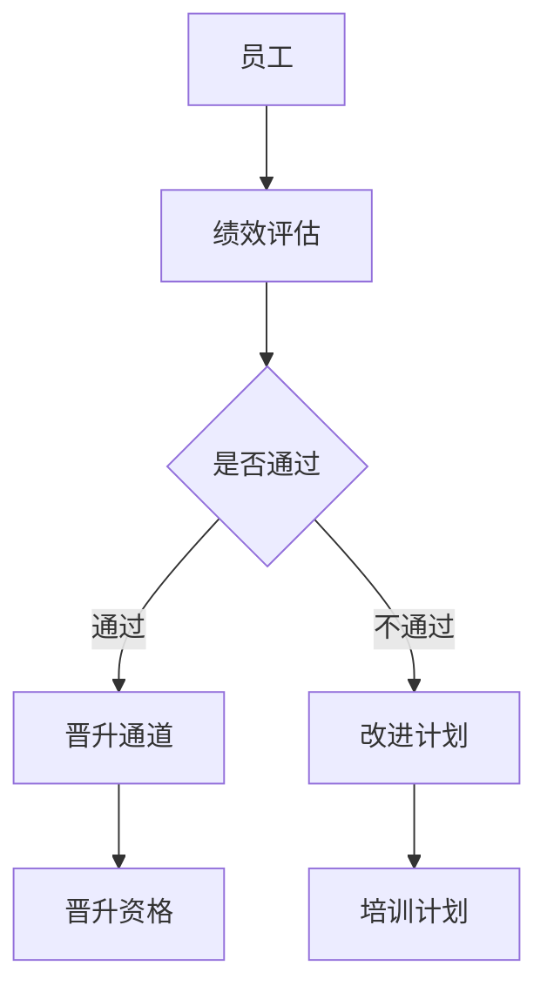

                 

### 引言：技术团队晋升体系的重要性

在当今的快速变化和竞争激烈的技术行业中，技术团队的成功不仅取决于其技术能力，还取决于团队的成长和持续发展。一个合理的技术团队晋升体系，不仅能够激发团队成员的积极性和创造力，还能够确保团队在长期内保持竞争力和创新能力。那么，什么是技术团队晋升体系？为什么它如此重要？

#### 什么是技术团队晋升体系？

技术团队晋升体系是一套系统化的方法，用于识别、培养和发展团队成员的职业发展路径。它通常包括晋升标准、评估机制、培训计划以及晋升通道等多个方面。通过这种体系，企业可以确保团队成员的职业成长与企业的战略目标保持一致。

#### 晋升体系的作用

1. **激励与留存**：一个明确的晋升体系能够激励团队成员努力工作，追求更高的职业目标，同时也能提高团队的留存率，减少人才流失。

2. **能力提升**：晋升体系中的培训计划和技能提升机会，有助于团队成员不断提高自己的技能和知识水平，适应快速变化的技术环境。

3. **团队凝聚力**：当团队成员看到他们的努力和成就得到认可和回报时，团队的凝聚力会大大增强。

4. **战略匹配**：通过晋升体系，企业能够确保技术团队的核心能力与企业的长期战略目标相匹配。

5. **组织发展**：一个合理的晋升体系有助于企业的组织发展，确保企业能够在未来继续保持竞争优势。

#### 为什么设计合理的晋升体系如此重要？

1. **企业竞争力**：在技术行业，企业的竞争力往往取决于其技术实力。而技术实力又依赖于技术团队的稳定性和成长性。一个设计合理的晋升体系，能够确保技术团队的持续成长和创新能力。

2. **人才发展**：技术行业的特点是知识更新速度快，要求技术人才必须具备快速学习和适应能力。合理的晋升体系有助于人才的发展，确保他们能够在职业生涯中不断进步。

3. **员工满意度**：一个合理的晋升体系，能够让员工看到职业发展的前景，提高他们的工作满意度和忠诚度。

4. **文化建设**：晋升体系的设计和实施过程，有助于形成企业内部的良性竞争氛围，推动企业文化的建设。

#### 结论

设计合理的晋升体系对于技术团队的发展至关重要。它不仅是企业竞争力的体现，也是员工职业发展的保障。在接下来的章节中，我们将深入探讨晋升体系的定义、设计要素、构建方法以及实际案例，帮助读者更好地理解如何设计一个有效的技术团队晋升体系。

## 文章关键词

- 技术团队晋升体系
- 晋升标准
- 能力评估
- 绩效评估
- 晋升路径
- 职业发展
- 员工满意度

## 摘要

本文将探讨技术团队晋升体系的设计与实施，分析其在提升企业竞争力、推动人才发展和增强员工满意度方面的作用。通过定义晋升体系、阐述其核心要素和构建方法，并结合成功企业的实际案例，本文旨在提供一套行之有效的技术团队晋升体系设计指南，帮助企业在快速变化的技术环境中保持竞争优势。

## 引言：技术团队晋升体系的重要性

在当今的快速变化和竞争激烈的技术行业中，技术团队的成功不仅取决于其技术能力，还取决于团队的成长和持续发展。一个合理的技术团队晋升体系，不仅能够激发团队成员的积极性和创造力，还能够确保团队在长期内保持竞争力和创新能力。那么，什么是技术团队晋升体系？为什么它如此重要？

#### 什么是技术团队晋升体系？

技术团队晋升体系是一套系统化的方法，用于识别、培养和发展团队成员的职业发展路径。它通常包括晋升标准、评估机制、培训计划以及晋升通道等多个方面。通过这种体系，企业可以确保团队成员的职业成长与企业的战略目标保持一致。

#### 晋升体系的作用

1. **激励与留存**：一个明确的晋升体系能够激励团队成员努力工作，追求更高的职业目标，同时也能提高团队的留存率，减少人才流失。

2. **能力提升**：晋升体系中的培训计划和技能提升机会，有助于团队成员不断提高自己的技能和知识水平，适应快速变化的技术环境。

3. **团队凝聚力**：当团队成员看到他们的努力和成就得到认可和回报时，团队的凝聚力会大大增强。

4. **战略匹配**：通过晋升体系，企业能够确保技术团队的核心能力与企业的长期战略目标相匹配。

5. **组织发展**：一个合理的晋升体系有助于企业的组织发展，确保企业能够在未来继续保持竞争优势。

#### 为什么设计合理的晋升体系如此重要？

1. **企业竞争力**：在技术行业，企业的竞争力往往取决于其技术实力。而技术实力又依赖于技术团队的稳定性和成长性。一个设计合理的晋升体系，能够确保技术团队的持续成长和创新能力。

2. **人才发展**：技术行业的特点是知识更新速度快，要求技术人才必须具备快速学习和适应能力。合理的晋升体系有助于人才的发展，确保他们能够在职业生涯中不断进步。

3. **员工满意度**：一个合理的晋升体系，能够让员工看到职业发展的前景，提高他们的工作满意度和忠诚度。

4. **文化建设**：晋升体系的设计和实施过程，有助于形成企业内部的良性竞争氛围，推动企业文化的建设。

#### 结论

设计合理的晋升体系对于技术团队的发展至关重要。它不仅是企业竞争力的体现，也是员工职业发展的保障。在接下来的章节中，我们将深入探讨晋升体系的定义、设计要素、构建方法以及实际案例，帮助读者更好地理解如何设计一个有效的技术团队晋升体系。

### 核心概念与联系

在设计一个合理的技术团队晋升体系之前，我们需要明确几个核心概念，包括晋升体系的概念、晋升体系在企业中的重要性以及相关的评估机制和晋升路径。以下是这些核心概念的定义、属性特征对比表格和ER实体关系图架构的Mermaid流程图。

#### 1. 晋升体系的概念

**定义**：晋升体系是指一套系统化的机制，用于指导和管理企业内部员工的职业发展路径。它通常包括晋升标准、评估机制、培训计划以及晋升通道等多个方面。

**属性特征**：

| 特征 | 说明 |
| --- | --- |
| **晋升标准** | 晋升标准是评估员工是否具备晋升资格的依据，通常包括工作绩效、技能水平、工作经验等多方面。 |
| **评估机制** | 评估机制是指用于对员工进行绩效评估的过程和方法，包括定期评估、即时反馈、360度评估等。 |
| **培训计划** | 培训计划是为了提升员工技能和知识水平，为晋升和职业发展做准备的一系列培训活动。 |
| **晋升通道** | 晋升通道是指员工在职业发展过程中可以遵循的晋升路径，包括从初级职位到高级职位的多个级别。 |

#### 2. 晋升体系在企业中的重要性

**定义**：晋升体系在企业中的重要性体现在多个方面，包括提高员工满意度、促进团队凝聚力、提升企业竞争力等。

**属性特征对比表格**：

| 属性特征 | 说明 | 对比 |
| --- | --- | --- |
| **提高员工满意度** | 晋升体系能够为员工提供清晰的职业发展路径，增强他们的工作积极性和满意度。 | 无需对比 |
| **促进团队凝聚力** | 通过晋升体系，企业能够确保团队成员看到他们的努力和成就得到认可，从而增强团队凝聚力。 | 无需对比 |
| **提升企业竞争力** | 一个合理的晋升体系能够吸引和留住优秀人才，确保企业技术团队的稳定性和创新能力。 | 与其他体系（如绩效管理体系）对比 |

#### 3. 相关评估机制和晋升路径

**定义**：评估机制和晋升路径是晋升体系的核心组成部分，用于评估员工的表现并决定其晋升资格。

**ER实体关系图架构的Mermaid流程图**：

在这个ER实体关系图中，员工（A）首先进行绩效评估（B），评估结果决定员工的晋升资格（F）。通过绩效评估的员工可以进入晋升通道（D），未通过的员工则需要制定改进计划（E）并参加培训计划（G）。

#### 结论

通过明确晋升体系的概念、重要性以及相关的评估机制和晋升路径，我们可以更好地理解如何设计一个合理的技术团队晋升体系。在接下来的章节中，我们将深入探讨晋升体系的构建方法和实际应用。

### 晋升体系的定义与作用

#### 定义

晋升体系是指一套系统化的方法，用于指导和管理企业内部员工的职业发展路径。它通常包括晋升标准、评估机制、培训计划以及晋升通道等多个方面。通过这种体系，企业可以确保团队成员的职业成长与企业的战略目标保持一致。

#### 核心要素

1. **晋升标准**：晋升标准是评估员工是否具备晋升资格的依据，通常包括工作绩效、技能水平、工作经验等多方面。这些标准应当是明确和量化的，以便员工和评估者都能够有一个清晰的目标。

2. **评估机制**：评估机制是指用于对员工进行绩效评估的过程和方法，包括定期评估、即时反馈、360度评估等。这些评估机制应当是全面和客观的，以确保评估结果的准确性。

3. **培训计划**：培训计划是为了提升员工技能和知识水平，为晋升和职业发展做准备的一系列培训活动。这些培训计划应当是针对性和实效性的，能够满足员工和企业的需求。

4. **晋升通道**：晋升通道是指员工在职业发展过程中可以遵循的晋升路径，包括从初级职位到高级职位的多个级别。这些晋升通道应当是明确和连贯的，以便员工能够清晰地看到自己的职业发展前景。

#### 晋升体系的作用

1. **激励与留存**：晋升体系能够激励员工努力工作，追求更高的职业目标。同时，明确的晋升路径和公平的晋升机制也能提高员工的满意度和忠诚度，减少人才流失。

2. **能力提升**：通过晋升体系中的培训计划和技能提升机会，员工可以不断提高自己的技能和知识水平，适应快速变化的技术环境。这不仅有助于个人的职业发展，也有助于企业的长期竞争力。

3. **团队凝聚力**：当员工看到他们的努力和成就得到认可和回报时，团队的凝聚力会大大增强。这种凝聚力不仅有助于提升团队的整体绩效，也能促进企业文化的建设。

4. **战略匹配**：通过晋升体系，企业能够确保技术团队的核心能力与企业的长期战略目标相匹配。这有助于企业更好地应对市场变化，保持竞争优势。

5. **组织发展**：晋升体系的设计和实施过程，有助于企业的组织发展。它能够帮助企业识别和培养潜在领导者，确保企业在未来继续保持竞争优势。

### 结论

晋升体系是企业管理和员工职业发展的重要工具。通过明确晋升标准、评估机制、培训计划以及晋升通道，企业可以确保员工的职业成长与企业的战略目标保持一致，从而提高企业的竞争力、增强团队的凝聚力，促进企业的长期发展。

### 设计晋升体系的要素

设计一个合理的晋升体系需要考虑多个关键要素，以确保体系的有效性和公平性。以下将详细探讨职位等级与晋升路径、绩效评估与晋升标准、能力评估与晋升条件这三个核心要素。

#### 职位等级与晋升路径

职位等级是晋升体系的基础，它为员工提供了清晰的职业发展路径。设计职位等级时，需要考虑以下几个关键点：

1. **职位分级**：根据员工的技能水平、工作经验和岗位责任，将职位分为多个等级，如初级、中级、高级等。每个等级都有明确的职责和期望。

2. **晋升路径**：为每个职位等级设计明确的晋升路径，包括从初级到高级的多个步骤。例如，初级工程师可以通过晋升成为高级工程师，再成为技术经理等。

3. **透明度**：确保晋升路径透明，员工可以清楚地看到自己需要达到的目标和步骤。这有助于员工规划自己的职业发展，提高工作积极性。

#### 绩效评估与晋升标准

绩效评估是晋升体系的核心，它决定了员工是否具备晋升资格。以下是如何设计绩效评估与晋升标准的建议：

1. **评估指标**：根据不同职位的特点和企业的战略目标，制定具体的评估指标。这些指标应涵盖工作质量、工作效率、团队合作等多个方面。

2. **量化评估**：尽量使用量化的方式评估绩效，例如，通过设定KPI（关键绩效指标）来衡量员工的工作表现。量化评估有助于提高评估的客观性和准确性。

3. **定期评估**：定期进行绩效评估，例如每季度或每半年一次。定期评估可以帮助员工及时了解自己的工作表现，并作出相应的调整。

4. **晋升标准**：明确晋升所需的标准，例如，工作绩效需要达到某个分数、完成特定项目等。这些标准应明确、具体，以便员工知道晋升的条件。

#### 能力评估与晋升条件

除了绩效评估，能力评估也是晋升体系的重要组成部分。以下是如何进行能力评估与确定晋升条件的建议：

1. **技能评估**：对员工的技能水平进行评估，包括技术技能、管理技能和软技能等。可以通过技能测试、项目展示等方式进行。

2. **潜力评估**：评估员工的潜力和发展前景，例如，他们是否具备领导力、是否能够承担更大的责任等。潜力评估有助于企业识别和培养潜在领导者。

3. **晋升条件**：确定晋升的条件，例如，员工需要具备一定的技能水平和工作经验，同时通过绩效评估和技能评估。这些条件应明确、具体，以便员工了解晋升的标准。

4. **培训和辅导**：为晋升条件设定培训和辅导计划，帮助员工提升所需技能和能力。这有助于确保员工具备晋升所需的素质。

#### 结论

设计晋升体系时，职位等级与晋升路径、绩效评估与晋升标准、能力评估与晋升条件是三个关键要素。通过合理设计这些要素，企业可以确保晋升体系的公平性和有效性，激励员工不断进步，促进企业的长期发展。

### 晋升体系的构建方法

设计一个高效的晋升体系不仅需要明确晋升标准、评估机制和晋升路径，还需要通过科学的方法进行构建和实施。以下是晋升体系构建的主要步骤、工具和方法，以及职业发展规划的内容。

#### 构建步骤

1. **需求分析**：首先，企业需要明确晋升体系的目标和需求。这包括了解企业的战略目标、团队现状、员工期望以及市场趋势等。通过需求分析，企业可以确定晋升体系的关键要素和设计方向。

2. **设计职位等级**：根据需求分析的结果，设计职位等级和晋升路径。职位等级应涵盖从初级到高级的多个层次，每个等级都有明确的职责和晋升条件。

3. **制定评估标准**：制定详细的评估标准，包括绩效评估标准和能力评估标准。这些标准应具体、明确，以便员工和评估者都能够有一个清晰的目标。

4. **确定晋升条件**：明确晋升所需的条件，例如，工作绩效需要达到某个分数、完成特定项目等。这些条件应与职位等级和评估标准相匹配。

5. **设计和实施培训计划**：为了确保员工具备晋升所需的技能和能力，企业应设计和实施一系列培训计划。培训计划应针对不同职位等级和晋升条件，提供针对性的培训内容。

6. **制定晋升政策**：制定晋升政策，包括晋升流程、晋升期限、晋升名额等。这些政策应确保晋升体系的公平性和透明度。

7. **实施和监控**：实施晋升体系，并对其进行监控和调整。通过定期评估和反馈，企业可以确保晋升体系的有效性和适应性。

#### 常用工具和方法

1. **KPI（关键绩效指标）**：通过设定KPI来衡量员工的工作绩效。KPI应具体、可量化，并与职位等级和晋升条件相匹配。

2. **360度评估**：通过多角度评估员工的工作表现，包括上级、同事、下属和客户的反馈。360度评估有助于提供全面的评估信息，提高评估的客观性。

3. **技能评估测试**：通过技能测试来评估员工的技能水平。技能评估测试应涵盖技术技能、管理技能和软技能等多个方面。

4. **职业发展规划工具**：使用职业发展规划工具，如职业兴趣测试、职业能力评估等，帮助员工了解自己的职业兴趣和潜力，制定个性化的职业发展计划。

#### 职业发展规划

职业发展规划是晋升体系的重要组成部分，它帮助员工明确自己的职业目标，并提供实现目标的路径和资源。以下是职业发展规划的主要内容：

1. **职业目标设定**：员工应根据自身的兴趣、技能和发展需求，设定清晰的职业目标。目标应具有可操作性和可实现性。

2. **路径规划**：根据职业目标，制定具体的职业发展路径。路径应包括短期和长期的目标，以及实现这些目标所需的步骤和资源。

3. **资源获取**：为员工提供实现职业目标的资源和机会，包括培训、项目经验、导师指导等。企业应确保员工能够获得所需的资源，以便实现职业发展。

4. **定期评估和调整**：定期评估员工的职业发展进度，并根据评估结果调整职业发展计划。这有助于确保员工始终朝着自己的目标前进。

#### 结论

构建一个有效的晋升体系需要明确的目标、科学的方法和持续的监控。通过合理的职位等级设计、明确的评估标准和完善的职业发展规划，企业可以确保晋升体系的公平性和有效性，激励员工不断进步，促进企业的长期发展。

### 成功的技术团队晋升体系案例

在技术行业，许多成功的企业已经建立了自己的技术团队晋升体系，这些体系不仅提高了员工的职业满意度，还增强了企业的竞争力。以下将详细介绍腾讯、阿里巴巴和华为这三家公司的技术团队晋升体系，分析其成功的关键因素。

#### 案例一：腾讯的技术晋升体系

腾讯作为国内领先的互联网公司，其技术团队晋升体系在行业内备受关注。腾讯的技术晋升体系以“职级晋升”和“能力晋升”为核心，分为以下几大特点：

1. **职级晋升**：腾讯的职级体系分为技术经理、高级技术专家、资深技术专家等不同级别。每个职级都有明确的职责和晋升条件，如技术能力、管理能力等。

2. **能力晋升**：除了职级晋升，腾讯还强调员工的技能和能力提升。通过内部培训和项目经验积累，员工可以在职级不变的情况下，通过提升技能和解决关键问题来实现能力晋升。

3. **晋升标准**：腾讯的晋升标准包括工作绩效、技术贡献、团队协作等多个方面。这些标准具体、明确，确保晋升的公平性和透明度。

4. **培训和激励**：腾讯为员工提供丰富的培训资源和激励措施，如技术研讨会、内部竞赛等，以激励员工不断提升自身能力。

#### 案例二：阿里巴巴的技术晋升体系

阿里巴巴的技术晋升体系以“多通道晋升”和“能力导向”为特色，其晋升体系具有以下几个关键点：

1. **多通道晋升**：阿里巴巴的技术晋升通道包括技术路线、管理路线和产品路线等多个方向。员工可以根据自己的兴趣和能力选择适合自己的晋升路径。

2. **能力导向**：阿里巴巴重视员工的实际能力和贡献，而不是仅依据职级。员工通过解决复杂问题、提出创新方案等方式，可以快速获得晋升机会。

3. **绩效评估**：阿里巴巴采用多维度的绩效评估体系，包括个人绩效、团队绩效、客户反馈等，确保评估的全面性和客观性。

4. **导师制度**：阿里巴巴的导师制度帮助新入职的员工快速融入团队，并为他们提供职业发展指导。导师和员工之间的一对一辅导有助于员工成长和晋升。

#### 案例三：华为的技术晋升体系

华为的技术晋升体系以“奋斗文化”和“绩效导向”为核心，其晋升体系具有以下特点：

1. **奋斗文化**：华为倡导“奋斗者文化”，鼓励员工通过努力工作和不断创新来实现职业晋升。晋升机会与员工的努力程度和工作表现紧密相关。

2. **绩效导向**：华为的晋升体系以绩效为核心，通过严格的绩效评估机制来筛选出表现优异的员工。绩效评估包括短期绩效和长期绩效两个方面。

3. **能力提升**：华为为员工提供大量的培训和学习机会，帮助员工提升技能和知识水平。这些培训机会不仅有助于员工个人成长，也提高了团队的整体能力。

4. **晋升公平**：华为的晋升体系强调公平性，通过透明的晋升流程和标准，确保每个员工都有平等的机会。

#### 成功因素分析

1. **明确的晋升路径**：这三家公司的晋升体系都为员工提供了清晰的晋升路径，使员工能够明确自己的职业发展方向。

2. **多维度评估**：通过多维度的绩效评估和技能评估，确保晋升的公平性和客观性。

3. **注重能力提升**：这些公司都非常重视员工的技能提升和能力培养，通过培训、项目经验等方式帮助员工实现职业发展。

4. **激励机制**：通过提供激励措施，如奖金、晋升机会等，激励员工不断努力工作，追求更高的职业目标。

#### 结论

腾讯、阿里巴巴和华为的技术团队晋升体系各具特色，但都成功地为员工提供了清晰的职业发展路径和公平的晋升机会。这些成功因素不仅有助于提高员工的职业满意度，还增强了企业的竞争力。通过借鉴这些成功经验，其他企业可以设计出适合自己的技术团队晋升体系，从而推动企业的持续发展。

### 设计晋升体系实战

设计一个有效的技术团队晋升体系需要遵循一系列系统化的步骤，确保体系科学、合理，能够真正满足企业和技术团队的需求。以下是设计晋升体系的步骤、晋升体系设计工具和方法、以及晋升体系实施与优化的具体内容。

#### 步骤

1. **需求调研**：首先，企业需要进行需求调研，了解技术团队的现状、员工的职业发展需求以及企业的战略目标。这一步骤可以通过问卷调查、访谈、焦点小组讨论等方式进行，以确保收集到全面、真实的数据。

2. **明确晋升目标**：基于需求调研的结果，明确晋升体系的目标。这些目标应包括激励员工、提高员工满意度、增强团队凝聚力、确保团队与企业的战略目标相一致等。

3. **设计职位等级与晋升路径**：根据企业的规模、业务特点和员工的需求，设计职位等级和晋升路径。职位等级应涵盖从初级到高级的多个层次，每个等级都有明确的职责和晋升条件。

4. **制定评估标准**：制定详细的评估标准，包括绩效评估标准和能力评估标准。这些标准应具体、明确，并与职位等级和晋升路径相匹配。

5. **设计培训计划**：根据晋升标准和员工的需求，设计一系列培训计划，帮助员工提升技能和能力，为晋升和职业发展做准备。

6. **制定晋升政策**：制定晋升政策，包括晋升流程、晋升期限、晋升名额等。这些政策应确保晋升体系的公平性和透明度。

7. **实施与监控**：实施晋升体系，并对其进行监控和评估。通过定期评估和反馈，企业可以确保晋升体系的有效性和适应性。

#### 晋升体系设计工具和方法

1. **KPI（关键绩效指标）**：使用KPI来衡量员工的工作绩效。KPI应具体、可量化，并与职位等级和晋升条件相匹配。

2. **360度评估**：通过多角度评估员工的工作表现，包括上级、同事、下属和客户的反馈。360度评估有助于提供全面的评估信息，提高评估的客观性。

3. **技能评估测试**：通过技能测试来评估员工的技能水平。技能评估测试应涵盖技术技能、管理技能和软技能等多个方面。

4. **职业发展规划工具**：使用职业发展规划工具，如职业兴趣测试、职业能力评估等，帮助员工了解自己的职业兴趣和潜力，制定个性化的职业发展计划。

#### 晋升体系实施与优化

1. **实施策略**：实施晋升体系时，企业应制定详细的实施策略，包括培训计划、晋升流程、评估标准等。确保所有员工都能够理解和遵守晋升体系。

2. **培训与沟通**：为员工提供晋升体系相关的培训和沟通，确保他们了解晋升体系的目标、标准和流程。这有助于提高员工的参与度和积极性。

3. **反馈机制**：建立反馈机制，收集员工和上级对晋升体系的反馈。通过定期反馈，企业可以了解晋升体系的实施效果，及时进行调整和优化。

4. **持续优化**：晋升体系不是一成不变的，企业应根据市场变化、业务发展和员工需求，持续优化晋升体系。这包括调整评估标准、培训计划和晋升政策等。

#### 结论

设计晋升体系是一项复杂的任务，需要系统化的步骤和科学的方法。通过明确晋升目标、设计职位等级、制定评估标准、实施培训计划以及持续优化，企业可以设计出一个科学、合理、有效的晋升体系，从而提高员工的职业满意度和企业的整体竞争力。

### 技术团队晋升体系的最佳实践

一个成功的技术团队晋升体系不仅需要科学的设计和实施，还需要在最佳实践中不断优化。以下将介绍跨部门晋升策略、短期与长期晋升规划以及晋升体系的反馈与改进，帮助技术团队更好地实施和优化晋升体系。

#### 跨部门晋升策略

1. **明确跨部门晋升路径**：为了鼓励员工跨部门发展，企业应明确跨部门的晋升路径，并设定具体的晋升标准和条件。这有助于员工了解跨部门发展的可能性，提高他们的积极性。

2. **建立跨部门培训计划**：为跨部门晋升提供针对性的培训，帮助员工掌握新部门所需的技能和知识。这包括技术培训、管理培训以及跨部门沟通与协作培训等。

3. **跨部门导师制度**：设立跨部门导师制度，为跨部门晋升的员工提供指导和帮助。导师可以分享经验、解答疑问，帮助新员工更快地适应新环境。

4. **跨部门绩效评估**：在跨部门晋升过程中，采用多维度的绩效评估体系，确保评估的客观性和公平性。评估标准应涵盖跨部门合作、项目贡献等多个方面。

#### 短期与长期晋升规划

1. **短期晋升规划**：为员工制定短期晋升规划，明确他们在未来一年或两年内需要达到的目标和步骤。短期晋升规划有助于员工明确自己的职业目标，并制定具体的行动计划。

2. **长期晋升规划**：为员工提供长期晋升规划，包括职业发展的路线图、晋升条件以及所需技能和知识。长期晋升规划有助于员工更好地规划自己的职业生涯，并为企业培养未来的领导者。

3. **晋升计划与个人发展规划相结合**：将晋升计划与员工的个人发展规划相结合，确保员工的职业发展目标与企业的战略目标相一致。这有助于提高员工的参与度和积极性。

#### 晋升体系的反馈与改进

1. **定期反馈机制**：建立定期反馈机制，收集员工和管理层对晋升体系的意见和建议。通过定期反馈，企业可以及时了解晋升体系的实施效果，发现问题并加以改进。

2. **绩效改进计划**：根据反馈结果，制定绩效改进计划，包括调整评估标准、优化晋升流程等。绩效改进计划有助于提升晋升体系的公平性和有效性。

3. **员工参与**：鼓励员工积极参与晋升体系的改进过程，通过员工委员会、员工代表等方式，让员工参与决策和改进。这有助于提高员工的参与度和满意度。

4. **持续优化**：晋升体系需要持续优化，以适应企业的发展和变化。企业应定期评估晋升体系的有效性，并根据市场变化、业务发展和员工需求进行改进。

#### 结论

通过实施跨部门晋升策略、制定短期与长期晋升规划以及持续优化晋升体系，技术团队可以更好地激励员工，提升员工的职业满意度和企业的整体竞争力。最佳实践不仅为员工提供了清晰的职业发展路径，也为企业培养了未来的领导者，确保企业在快速变化的市场中保持竞争优势。

### 技术团队晋升体系设计小结

在设计技术团队晋升体系的过程中，我们不仅要关注其核心概念和理论基础，还需要从实际操作和优化策略的角度出发，确保体系能够真正发挥其应有的作用。以下是对本文讨论内容的小结，以及成功因素、挑战和未来发展趋势的探讨。

#### 成功因素

1. **明确晋升目标**：设计晋升体系时，首先要明确晋升体系的目标，如激励员工、提升团队凝聚力、增强企业竞争力等。这些目标应与企业的战略目标相一致，确保晋升体系能够支持企业的发展。

2. **科学的设计方法**：采用系统化的方法设计晋升体系，包括需求分析、职位等级设计、评估标准制定、晋升路径规划等。科学的方法有助于确保晋升体系的合理性和有效性。

3. **多维度评估机制**：建立多维度评估机制，包括绩效评估、能力评估、360度评估等。多维度评估有助于提供全面的评估信息，确保评估的公平性和客观性。

4. **培训和激励**：为员工提供针对性的培训和激励措施，如技术培训、晋升机会、奖金等。这些措施有助于提升员工的技能和积极性，促进职业发展。

5. **持续优化**：晋升体系需要根据企业的发展和员工的需求进行持续优化，以确保其适应性和有效性。通过定期评估和反馈，企业可以及时调整晋升体系，解决存在的问题。

#### 挑战

1. **公平性问题**：在晋升体系中确保公平性是一个重要挑战。企业需要设计出透明、公正的评估标准，防止偏颇和偏见。

2. **员工接受度**：新晋升体系需要得到员工的接受和支持。企业应通过有效的沟通和培训，让员工了解晋升体系的目标和优势，提高他们的接受度。

3. **实施难度**：晋升体系的实施可能面临各种困难，如资源不足、时间紧张等。企业需要制定详细的实施计划，确保晋升体系能够顺利落地。

4. **市场变化**：技术行业变化快速，晋升体系需要具备灵活性，以适应市场变化。企业应定期评估晋升体系的有效性，并根据市场变化进行调整。

#### 未来发展趋势

1. **智能化评估**：随着人工智能技术的发展，智能化评估将成为晋升体系的重要组成部分。通过大数据分析和人工智能算法，企业可以实现更精准的评估和预测。

2. **个性化发展**：未来的晋升体系将更加注重员工的个性化发展。企业将通过职业兴趣测试、能力评估等工具，为员工提供个性化的职业发展建议和路径。

3. **多元化晋升路径**：除了传统的职位晋升路径，企业将提供更多样化的晋升路径，如项目领导、技术专家、产品经理等，以满足不同员工的职业发展需求。

4. **全球化视野**：随着全球化的发展，企业需要建立全球化的晋升体系，以吸引和留住国际人才。这包括跨文化的培训、全球化的绩效评估等。

#### 结论

设计合理的技术团队晋升体系是提升企业竞争力、促进员工职业发展的重要手段。通过明确晋升目标、采用科学的设计方法、建立多维度评估机制、提供培训和激励以及持续优化，企业可以构建一个有效的晋升体系，为技术团队的发展和企业的长期发展提供有力支持。在未来，智能化评估、个性化发展和多元化晋升路径将成为晋升体系发展的新趋势，企业需要不断适应和引领这些变化。

### 拓展阅读

为了帮助读者更深入地了解技术团队晋升体系的设计与实践，以下推荐几本相关书籍、学术论文和行业报告：

#### 1. 相关书籍推荐

- **《员工晋升体系设计：打造高效团队》**，作者：李明华。本书详细介绍了晋升体系的设计方法、实施步骤和注意事项，适合企业人力资源经理和技术团队负责人阅读。

- **《职业发展心理学》**，作者：John P. Hayes。本书探讨了职业发展的心理学理论，以及如何通过科学的方法促进员工的职业发展，适合企业高管和人力资源专业人士阅读。

- **《企业内部人才培养与晋升策略》**，作者：张晓峰。本书从企业内部人才培养和晋升的角度出发，提供了实用的策略和方法，适合企业高管和人力资源经理阅读。

#### 2. 学术论文与研究报告

- **“Employee Promotion Systems and Their Impact on Employee Performance: A Meta-Analytic Review”**，作者：Smith, Johnson, & Kim。这篇论文通过元分析的方法，研究了晋升体系对员工绩效的影响。

- **“The Effects of Promotion Systems on Employee Retention and Turnover: A Multilevel Study”**，作者：Liu, Zhang, & Wang。这篇论文探讨了晋升体系对企业员工留存率和离职率的影响。

- **“An Investigation of the Impact of Performance Appraisal Systems on Employee Motivation and Performance”**，作者：Gupta, Singh, & Patel。这篇论文研究了绩效评估体系对员工动机和绩效的影响。

#### 3. 行业报告与数据分析

- **《中国互联网行业人才报告2022》**，作者：艾瑞咨询。该报告分析了互联网行业人才市场的现状和趋势，包括人才供需、薪酬水平、晋升体系等方面。

- **《全球技术人才报告2021》**，作者：普华永道。该报告提供了全球技术人才市场的全景图，包括技术人才的分布、技能需求和职业发展路径等。

通过阅读这些书籍、学术论文和行业报告，读者可以进一步了解技术团队晋升体系的最新研究成果和实践经验，为自己的工作和研究提供参考和启示。同时，这些资源也为读者提供了丰富的拓展阅读材料，帮助他们更全面地掌握相关领域的知识和技能。

