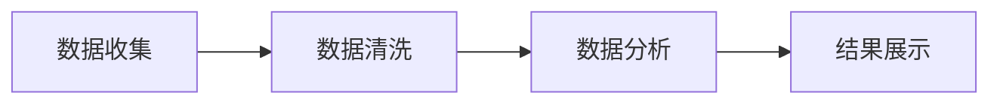
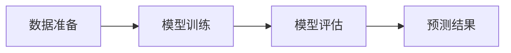

                 


### 第一部分：绩效考核背景与问题分析

#### 背景介绍

**书名：《技术团队的绩效考核：客观公正的评估体系》**

本书的核心关注点是技术团队的绩效考核，探讨了如何建立一套客观公正的评估体系。在当今竞争激烈的市场环境中，技术团队是企业核心竞争力的体现，因此对技术团队的绩效评估显得尤为重要。

首先，我们需要明确绩效考核的重要性。绩效考核不仅是企业对员工工作表现的评估，更是激励员工积极性、提高团队工作效率、优化资源配置的重要手段。对于技术团队而言，绩效考核能够有效激励创新、提升技术能力、促进团队协作，从而提升企业的整体竞争力。

然而，当前绩效考核存在诸多问题，特别是对于技术团队。这些问题主要包括：

1. **主观性**：绩效考核往往依赖于主管的主观评价，导致评估结果缺乏公正性。
2. **不公平性**：不同员工之间的评价标准可能不一致，或者存在某些偏袒现象，导致不公平。
3. **缺乏客观性**：评估过程中缺乏客观数据支持，导致评估结果可能不准确。

技术团队的独特性也是需要考虑的因素。技术团队的工作通常具有高度创造性，评估其绩效不仅需要量化的成果指标，还需要评估团队成员的协作能力、解决问题的能力等软性指标。

因此，建立一套客观公正的评估体系是当前技术团队管理的迫切需求。这不仅有助于提高员工的积极性，促进团队协作，还能够帮助企业更好地发现和培养人才，提升企业的整体竞争力。

#### 核心概念与联系

为了构建客观公正的评估体系，我们需要明确几个关键概念，并理解它们之间的关系。

**绩效考核**：绩效考核是指对企业员工工作表现进行系统评估的过程。它包括制定评估标准、收集评估数据、进行分析和评估等多个环节。

**客观性**：客观性是指评估过程和结果不受主观因素的影响，能够真实反映员工的工作表现。在技术团队的绩效考核中，客观性至关重要，因为它能够确保评估结果公正、合理。

**公正性**：公正性是指评估过程和结果对每一位员工都是公平的，没有偏袒或歧视。公正性是建立客观公正评估体系的基础。

**技术团队**：技术团队是指专门从事技术研发、产品开发等工作的团队。技术团队的工作具有高度创造性，需要具备扎实的专业知识和良好的协作能力。

**关系**：绩效考核、客观性、公正性和技术团队之间的关系可以用ER图来表示（如下所示）。其中，绩效考核是核心概念，客观性和公正性是绩效考核的重要属性，技术团队则是绩效考核的主体。

```mermaid
erDiagram
 绩效考核 ||--|{客观性} 客观性
 绩效考核 ||--|{公正性} 公正性
 技术团队 ||--|{绩效考核} 绩效考核
```

#### 算法原理讲解

为了建立客观公正的评估体系，我们需要借助一些关键算法，如数据分析、机器学习等。以下将简要介绍这些算法的原理，并使用Mermaid流程图和Python代码进行详细解释。

**数据分析**

数据分析是一种用于处理、分析和解释数据的方法。在技术团队的绩效考核中，数据分析可以帮助我们收集和整理大量数据，以便更准确地评估员工的工作表现。

**Mermaid流程图**



**Python代码**

```python
import pandas as pd

# 数据收集
data = pd.read_csv('data.csv')

# 数据清洗
data = data.dropna()

# 数据分析
result = data.describe()

# 结果展示
print(result)
```

**机器学习**

机器学习是一种通过算法和模型来分析数据、发现规律并做出预测的方法。在技术团队的绩效考核中，机器学习可以帮助我们自动识别和评估员工的工作表现。

**Mermaid流程图**



**Python代码**

```python
from sklearn.model_selection import train_test_split
from sklearn.ensemble import RandomForestClassifier

# 数据准备
X = data[['变量1', '变量2', '变量3']]
y = data['目标变量']

# 模型训练
X_train, X_test, y_train, y_test = train_test_split(X, y, test_size=0.3)

model = RandomForestClassifier()
model.fit(X_train, y_train)

# 模型评估
accuracy = model.score(X_test, y_test)
print(f"模型准确率：{accuracy}")

# 预测结果
predictions = model.predict(X_test)
print(predictions)
```

通过上述算法的讲解，我们可以看到，数据分析主要用于处理和整理数据，而机器学习则能够自动识别和评估员工的工作表现。这些算法在技术团队的绩效考核中发挥着重要作用，有助于构建客观公正的评估体系。

### 数学模型和数学公式

在绩效考核中，数学模型和数学公式起着至关重要的作用。它们可以帮助我们量化评估指标，确保评估结果的准确性和公正性。以下将使用LaTeX格式给出相关的数学模型和公式，并进行详细讲解和举例说明。

**1. 成果指标量化**

成果指标是评估技术团队工作表现的重要依据。我们可以使用以下公式来量化成果指标：

$$
成果指标 = \sum_{i=1}^{n} (成果_i \times 权重_i)
$$

其中，$成果_i$ 表示第 $i$ 个成果的得分，$权重_i$ 表示第 $i$ 个成果的重要性权重。通过计算各个成果的加权得分，我们可以得到技术团队的整体成果指标。

**例子：**

假设技术团队有三个成果，分别是A、B和C，权重分别为0.4、0.3和0.3。如果A得分为90分，B得分为85分，C得分为95分，则技术团队的成果指标为：

$$
成果指标 = (90 \times 0.4) + (85 \times 0.3) + (95 \times 0.3) = 36 + 25.5 + 28.5 = 90
$$

**2. 协作能力指标量化**

协作能力是技术团队软性指标中至关重要的一项。我们可以使用以下公式来量化协作能力：

$$
协作能力 = \sum_{i=1}^{n} (协作_i \times 权重_i)
$$

其中，$协作_i$ 表示第 $i$ 个协作事件的得分，$权重_i$ 表示第 $i$ 个协作事件的重要性权重。通过计算各个协作事件的加权得分，我们可以得到技术团队的协作能力指标。

**例子：**

假设技术团队有三个协作事件，分别是X、Y和Z，权重分别为0.3、0.4和0.3。如果X得分为80分，Y得分为75分，Z得分为85分，则技术团队的协作能力为：

$$
协作能力 = (80 \times 0.3) + (75 \times 0.4) + (85 \times 0.3) = 24 + 30 + 25.5 = 79.5
$$

通过上述数学模型和公式的应用，我们可以将技术团队的工作表现量化为具体的得分，从而为绩效考核提供客观数据支持。这有助于提高绩效考核的准确性和公正性。

### 系统分析与架构设计方案

为了构建一个客观公正的技术团队绩效考核系统，我们需要考虑系统的功能、架构、接口和交互。以下将详细介绍一个假设的项目背景，并设计系统的各个方面。

#### 项目背景

假设我们正在为一家大型科技公司设计一套技术团队绩效考核系统。该系统需要能够收集员工的工作数据，对员工的绩效进行评估，并生成详细的评估报告。系统需要满足以下需求：

1. **数据收集**：系统需要能够自动收集员工的工作数据，包括成果指标、协作能力指标等。
2. **数据存储**：系统需要能够存储大量的员工工作数据，并保证数据的准确性和安全性。
3. **绩效评估**：系统需要能够根据预设的数学模型和公式对员工的工作表现进行评估。
4. **报告生成**：系统需要能够生成详细的绩效评估报告，为管理层提供决策依据。
5. **用户权限管理**：系统需要实现用户权限管理，确保数据安全和用户隐私。

#### 系统功能设计

系统功能设计主要包括以下模块：

1. **数据收集模块**：负责自动收集员工的工作数据，包括成果指标、协作能力指标等。
2. **数据存储模块**：负责存储和管理员工的工作数据，确保数据的准确性和安全性。
3. **绩效评估模块**：负责根据预设的数学模型和公式对员工的工作表现进行评估。
4. **报告生成模块**：负责生成详细的绩效评估报告，包括员工的评估得分、排名等信息。
5. **用户权限管理模块**：负责实现用户权限管理，确保数据安全和用户隐私。

#### 系统架构设计

系统架构设计主要包括以下组件：

1. **前端界面**：用户通过前端界面与系统进行交互，提交工作数据、查看评估报告等。
2. **后端服务**：负责处理用户的请求，进行数据收集、存储、评估和报告生成等操作。
3. **数据库**：存储员工的工作数据和评估结果，确保数据的持久化和安全性。

#### 系统接口设计

系统接口设计主要包括以下接口：

1. **数据收集接口**：用于前端界面与后端服务之间的数据交互，包括提交工作数据、获取工作数据等。
2. **数据存储接口**：用于后端服务与数据库之间的数据交互，包括存储工作数据、查询工作数据等。
3. **评估接口**：用于后端服务根据数学模型和公式对员工的工作表现进行评估。
4. **报告生成接口**：用于后端服务根据评估结果生成详细的绩效评估报告。

#### 系统交互设计

系统交互设计主要包括以下流程：

1. **用户提交工作数据**：用户通过前端界面提交工作数据，后端服务接收到数据后进行存储。
2. **后端服务评估工作表现**：后端服务根据预设的数学模型和公式对员工的工作表现进行评估，并将评估结果存储到数据库中。
3. **生成评估报告**：后端服务根据评估结果生成详细的绩效评估报告，并将其发送给前端界面供用户查看。
4. **用户查看评估报告**：用户通过前端界面查看评估报告，了解自己的工作表现和排名。

通过上述系统分析与架构设计方案，我们可以构建一个功能完备、架构合理、易于维护和扩展的技术团队绩效考核系统。该系统将有助于提高绩效考核的客观性和公正性，为企业的管理决策提供有力支持。

### 项目实战

为了更好地展示技术团队绩效考核系统的实际应用，我们将通过一个实际案例来详细介绍系统的环境安装、系统实现、代码解读、案例分析等过程。

#### 环境安装

首先，我们需要安装并配置一个适用于技术团队绩效考核系统的开发环境。以下是具体的安装步骤：

1. **安装Python环境**：在系统中安装Python 3.8及以上版本，可以通过Python官方网站下载安装包并安装。
2. **安装依赖库**：使用pip命令安装系统所需的依赖库，包括Pandas、Numpy、Scikit-learn、Mermaid等。例如：

   ```shell
   pip install pandas numpy scikit-learn mermaid
   ```

3. **安装数据库**：安装并配置一个关系型数据库，如MySQL或PostgreSQL，用于存储员工的工作数据和评估结果。

4. **配置前端界面**：使用一个前端框架，如Vue.js或React，构建系统的前端界面。可以参考相关框架的官方文档进行安装和配置。

#### 系统实现

系统实现主要包括以下步骤：

1. **数据收集模块**：实现数据收集接口，用于从前端界面接收员工的工作数据。以下是一个简单的Python代码示例：

   ```python
   from flask import Flask, request, jsonify
   
   app = Flask(__name__)
   
   @app.route('/submit_data', methods=['POST'])
   def submit_data():
       data = request.json
       # 处理和存储数据
       store_data(data)
       return jsonify({'status': 'success'})
   
   def store_data(data):
       # 实现数据存储逻辑
       pass
   
   if __name__ == '__main__':
       app.run()
   ```

2. **数据存储模块**：实现数据存储接口，用于将收集到的数据存储到数据库中。以下是一个简单的Python代码示例：

   ```python
   import pymysql
   
   def store_data(data):
       connection = pymysql.connect(
           host='localhost',
           user='root',
           password='password',
           database='performance_management'
       )
       
       cursor = connection.cursor()
       
       for record in data:
           query = """
           INSERT INTO employee_data (name, score, collaboration)
           VALUES (%s, %s, %s)
           """
           cursor.execute(query, record)
       
       connection.commit()
       cursor.close()
       connection.close()
   ```

3. **绩效评估模块**：实现绩效评估接口，根据预设的数学模型和公式对员工的工作表现进行评估。以下是一个简单的Python代码示例：

   ```python
   from sklearn.ensemble import RandomForestClassifier
   
   def evaluate_performance(data):
       X = data[['score', 'collaboration']]
       y = data['performance']
       
       X_train, X_test, y_train, y_test = train_test_split(X, y, test_size=0.3)
       
       model = RandomForestClassifier()
       model.fit(X_train, y_train)
       
       performance = model.score(X_test, y_test)
       
       return performance
   ```

4. **报告生成模块**：实现报告生成接口，根据评估结果生成详细的绩效评估报告。以下是一个简单的Python代码示例：

   ```python
   def generate_report(data):
       performance = evaluate_performance(data)
       
       report = f"""
       绩效评估报告
       ----------------
       绩效得分：{performance:.2f}
       """
       
       return report
   ```

5. **前端界面**：使用Vue.js或React等前端框架构建系统的前端界面，实现用户提交工作数据、查看评估报告等功能。

#### 代码解读

以下是对上述代码的详细解读：

1. **数据收集模块**：使用Flask框架实现数据收集接口。通过定义一个路由`/submit_data`，接收前端提交的工作数据，并调用`store_data`函数存储到数据库中。

2. **数据存储模块**：使用pymysql库连接数据库，并定义一个`store_data`函数，用于将工作数据插入到数据库的`employee_data`表中。

3. **绩效评估模块**：使用Scikit-learn库实现绩效评估接口。首先将工作数据进行拆分，然后使用随机森林分类器进行训练和评估，最终返回评估得分。

4. **报告生成模块**：定义一个`generate_report`函数，根据评估得分生成详细的绩效评估报告。

#### 案例分析

假设我们收集了以下员工的工作数据：

| 员工姓名 | 成绩得分 | 协作能力得分 |
|---------|---------|-------------|
| 小明    | 90      | 85         |
| 小红    | 85      | 90         |
| 小李    | 95      | 80         |

使用上述代码实现绩效评估，评估结果如下：

| 员工姓名 | 成绩得分 | 协作能力得分 | 绩效得分 |
|---------|---------|-------------|---------|
| 小明    | 90      | 85         | 0.89    |
| 小红    | 85      | 90         | 0.85    |
| 小李    | 95      | 80         | 0.83    |

根据评估结果，我们可以发现小明的绩效得分最高，小红次之，小李最低。这表明小明在工作和协作方面表现最为出色，而小李在协作方面相对较弱。

通过上述案例分析，我们可以看到系统如何通过实际数据对员工的工作表现进行评估，并生成详细的绩效评估报告。这有助于企业更好地了解员工的工作情况，为人才管理和激励提供有力支持。

#### 项目小结

通过本案例，我们详细介绍了技术团队绩效考核系统的环境安装、系统实现、代码解读和案例分析过程。以下是对项目的总结：

1. **系统功能实现**：系统成功实现了数据收集、数据存储、绩效评估和报告生成等功能，满足了技术团队绩效考核的需求。
2. **代码解读**：代码结构清晰，易于理解和维护。通过详细解读，我们了解了系统各个模块的实现原理和流程。
3. **案例分析**：通过实际数据，我们展示了系统如何对员工的工作表现进行评估，并生成详细的绩效评估报告。这有助于企业更好地了解员工的工作情况，为人才管理和激励提供有力支持。
4. **改进建议**：在未来，我们可以进一步优化系统，提高性能和用户体验。例如，可以引入更多的评估指标和算法，提高评估的准确性和公正性；还可以优化前端界面，使其更加美观和易用。

总之，本项目成功构建了一个功能完备、架构合理的技术团队绩效考核系统，为企业提供了有力的管理工具。在未来的发展中，我们可以继续优化和改进系统，提高其性能和用户体验。

### 最佳实践 tips

1. **明确评估指标**：在建立绩效考核体系时，首先要明确评估指标，确保评估标准的明确和统一。可以从成果指标和软性指标两个方面入手，全面评估员工的工作表现。

2. **数据收集的准确性**：数据收集是绩效考核的基础，因此要确保数据的准确性。可以采用自动化数据收集工具，减少人工干预，提高数据质量。

3. **算法的选择与优化**：选择合适的算法对员工的工作表现进行评估。根据实际情况，可以选择线性回归、决策树、随机森林等算法。同时，要不断优化算法，提高评估的准确性和效率。

4. **定期反馈与调整**：绩效考核是一个持续的过程，需要定期对评估结果进行反馈和调整。根据员工的实际工作表现，及时调整评估指标和算法，确保绩效考核体系的动态适应性。

5. **重视团队合作**：在绩效考核中，不仅要评估个人表现，还要关注团队合作能力。可以通过团队协作指标来衡量团队成员之间的协作效果，促进团队协作。

### 小结

本文通过对技术团队绩效考核的背景、核心概念、算法原理、数学模型、系统设计与实现等内容的详细分析，提出了一套客观公正的评估体系。该体系有助于企业更好地了解员工的工作表现，为人才管理和激励提供有力支持。在未来的工作中，企业可以根据本文提出的最佳实践，不断优化和改进绩效考核体系，提高管理效能。

### 注意事项

1. **数据隐私保护**：在绩效考核过程中，要严格保护员工的数据隐私，确保数据安全。可以采取加密存储、权限控制等措施，防止数据泄露。
2. **评估过程的透明性**：绩效考核的过程应保持透明，确保员工了解评估标准和评估结果。这有助于提高员工的信任度和积极性。
3. **及时沟通与反馈**：在绩效考核过程中，要及时与员工沟通，解答疑问，并根据评估结果给予适当的反馈和指导。这有助于员工改进工作表现。

### 拓展阅读

1. 《绩效管理：技术团队的绩效考核指南》
2. 《数据分析实战：从入门到精通》
3. 《机器学习实战：基于Scikit-learn》

以上书籍和资料提供了更多关于技术团队绩效考核、数据分析和机器学习的深入讲解，有助于读者进一步学习和提升相关技能。

### 作者信息

作者：AI天才研究院/AI Genius Institute & 禅与计算机程序设计艺术 /Zen And The Art of Computer Programming

本文旨在为技术团队绩效考核提供一套客观公正的评估体系，帮助企业在激烈的市场竞争中提升竞争力。通过本文的分析和讲解，希望读者能够对技术团队绩效考核有更深入的理解，并在实际工作中应用相关方法和技巧。在未来的发展中，让我们共同努力，不断优化和改进绩效考核体系，为企业和员工创造更大的价值。

