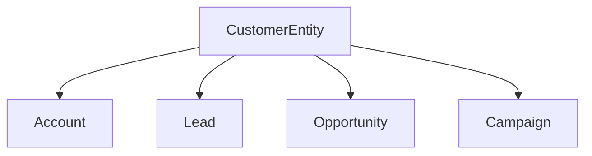
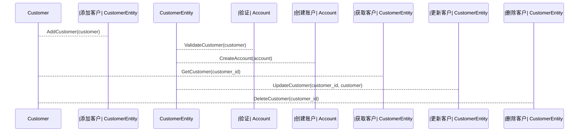

                 


### 1. 背景介绍

#### 核心概念术语说明

在技术团队的项目管理中，以下几个核心概念需要理解：

- **项目管理**：是对项目从启动到完成的全过程进行规划、执行、监控和收尾的一系列管理活动。
- **进度管理**：确保项目按计划顺利进行，按期完成。
- **质量管理**：确保项目产出符合既定的质量标准。
- **成本管理**：对项目成本进行估算、监控和控制，确保项目在预算范围内完成。

#### 问题背景

技术团队在日常工作中经常面临如下挑战：

- 项目进度滞后，导致项目延期交付。
- 项目质量不稳定，出现缺陷和漏洞。
- 项目成本超支，影响公司盈利。

#### 问题描述

这些问题的根本原因在于项目管理的不足。项目管理不当可能导致以下后果：

- 项目延期：影响客户满意度，损害公司声誉。
- 项目质量问题：导致客户投诉，影响后续合作机会。
- 项目成本超支：增加公司运营成本，影响利润。

#### 问题解决

解决这些问题需要建立有效的项目管理流程，特别是进度管理、质量管理和成本管理。

#### 边界与外延

项目管理不仅涉及技术层面，还包括团队协作、风险管理、资源分配等多个方面。本文将重点关注技术团队在项目过程中如何控制进度、质量和成本。

#### 概念结构与核心要素组成

项目管理由以下几个核心要素组成：

- **项目目标**：明确项目需要达成的目标。
- **项目计划**：详细规划项目的工作内容、时间安排、资源需求等。
- **项目执行**：按照计划进行项目工作。
- **项目监控**：监控项目进展，及时发现和解决问题。
- **项目收尾**：确保项目按照既定目标顺利完成。

### 2. 核心概念与联系

#### 核心概念原理

**进度管理**：通过规划、监控和调整项目进度，确保项目按计划进行。

- **关键路径法（CPM）**：识别项目中的关键任务，确定项目最早完成时间。

**质量管理**：确保项目产出符合既定的质量标准。

- **质量功能展开（QFD）**：将客户需求转化为具体的质量要求。

**成本管理**：对项目成本进行估算、监控和控制。

- **成本效益分析（CBA）**：评估项目成本与预期收益之间的关系。

#### 概念属性特征对比表格

| 概念     | 特征                      | 目的                                      |
|----------|--------------------------|-------------------------------------------|
| 进度管理 | 关键路径、任务分解       | 确保项目按时完成                          |
| 质量管理 | 质量控制、质量改进       | 确保项目产出符合质量标准                  |
| 成本管理 | 成本估算、成本控制       | 确保项目在预算范围内完成                  |

#### ER实体关系图架构

```mermaid
erDiagram
    Project ||--|{ Task }
    Task ||--|{ Resource }
    Project ||--|{ Cost }
```

- **项目（Project）**：代表一个具体的项目。
- **任务（Task）**：代表项目中的具体工作。
- **资源（Resource）**：代表完成任务所需的资源。
- **成本（Cost）**：代表项目的成本信息。

### 3. 算法原理讲解

#### 进度管理算法原理

**关键路径法（CPM）**：

- **步骤1**：创建任务列表。
- **步骤2**：为每个任务分配时间。
- **步骤3**：计算每个任务的最早开始时间（ES）和最早完成时间（EF）。
- **步骤4**：计算每个任务的最晚开始时间（LS）和最晚完成时间（LF）。
- **步骤5**：计算每个任务的总浮动时间（TF）。
- **步骤6**：确定关键路径，即总浮动时间为0的任务序列。

#### Python源代码示例

```python
import networkx as nx

def critical_path_project(tasks):
    G = nx.DiGraph()
    for task in tasks:
        G.add_node(task)
    
    for task in tasks:
        for successor in tasks[task]['successors']:
            G.add_edge(task, successor)
    
    es, ef = nx.earliest_start(G)
    ls, lf = nx.latest_start(G)
    tf = [lf[i] - es[i] for i in range(len(es))]
    
    critical_tasks = [task for task in range(len(es)) if tf[task] == 0]
    
    return critical_tasks

tasks = {
    0: {'duration': 3, 'successors': [1, 2]},
    1: {'duration': 2, 'successors': [3]},
    2: {'duration': 2, 'successors': [3]},
    3: {'duration': 3, 'successors': []}
}

print(critical_path_project(tasks))
```

#### 算法原理详细讲解

**关键路径法（CPM）**是一种用于确定项目关键任务序列的方法。以下是关键路径法的详细步骤：

1. **创建任务列表**：将项目中的所有任务列出来，并给每个任务分配一个唯一标识符。
2. **为每个任务分配时间**：确定每个任务的预计持续时间。
3. **计算每个任务的最早开始时间（ES）和最早完成时间（EF）**：从项目开始时间开始，逐步计算每个任务的最早开始时间和最早完成时间。
4. **计算每个任务的最晚开始时间（LS）和最晚完成时间（LF）**：从项目结束时间开始，逐步计算每个任务的最晚开始时间和最晚完成时间。
5. **计算每个任务的总浮动时间（TF）**：总浮动时间为最晚开始时间减去最早开始时间，或者最晚完成时间减去最早完成时间。
6. **确定关键路径**：关键路径上的任务总浮动时间为0，即关键任务。

#### 举例说明

假设一个项目包含以下任务：

- 任务0：3天
- 任务1：2天
- 任务2：2天
- 任务3：3天

任务之间的依赖关系如下：

- 任务0完成后，任务1和任务2可以开始。
- 任务1和任务2完成后，任务3可以开始。

使用关键路径法，我们可以计算出每个任务的最早开始时间、最早完成时间、最晚开始时间、最晚完成时间和总浮动时间：

| 任务 | 持续时间 | 最早开始时间 | 最早完成时间 | 最晚开始时间 | 最晚完成时间 | 总浮动时间 |
|------|-----------|---------------|---------------|---------------|---------------|-------------|
| 0    | 3天       | 0天           | 3天           | 0天           | 3天           | 0天         |
| 1    | 2天       | 3天           | 5天           | 3天           | 5天           | 0天         |
| 2    | 2天       | 3天           | 5天           | 3天           | 5天           | 0天         |
| 3    | 3天       | 5天           | 8天           | 5天           | 8天           | 0天         |

关键路径为任务0、任务1、任务2和任务3，因为这些任务的总浮动时间为0。

### 4. 系统分析与架构设计方案

#### 问题场景介绍

假设一家技术公司需要开发一款基于人工智能的客户关系管理系统（CRM），该项目涉及多个技术团队协同工作，需要在规定时间内完成，并且要保证高质量和低成本。

#### 项目介绍

- **项目名称**：人工智能客户关系管理系统（AI-CRM）
- **项目目标**：开发一款高效、稳定、易用的AI-CRM系统，满足客户需求，提高客户满意度。
- **项目期限**：6个月
- **项目预算**：100万元

#### 系统功能设计（领域模型类图）

```mermaid
classDiagram
    CustomerEntity <<entity>>
    Account <<entity>>
    Lead <<entity>>
    Opportunity <<entity>>
    Campaign <<entity>>

    CustomerEntity o--* Account
    CustomerEntity o--* Lead
    CustomerEntity o--* Opportunity
    CustomerEntity o--* Campaign
```

- **CustomerEntity**：表示客户实体。
- **Account**：表示客户账户。
- **Lead**：表示潜在客户。
- **Opportunity**：表示销售机会。
- **Campaign**：表示营销活动。

#### 系统架构设计（架构图）



- **CustomerEntity**：负责管理客户相关的数据。
- **Account**：负责管理客户账户信息。
- **Lead**：负责管理潜在客户信息。
- **Opportunity**：负责管理销售机会信息。
- **Campaign**：负责管理营销活动信息。

#### 系统接口设计（接口图）

```mermaid
graph TB
    CustomerEntity --> {AddCustomer, GetCustomer, UpdateCustomer, DeleteCustomer}
    Account --> {AddAccount, GetAccount, UpdateAccount, DeleteAccount}
    Lead --> {AddLead, GetLead, UpdateLead, DeleteLead}
    Opportunity --> {AddOpportunity, GetOpportunity, UpdateOpportunity, DeleteOpportunity}
    Campaign --> {AddCampaign, GetCampaign, UpdateCampaign, DeleteCampaign}
```

- **CustomerEntity**：提供增删改查接口。
- **Account**：提供增删改查接口。
- **Lead**：提供增删改查接口。
- **Opportunity**：提供增删改查接口。
- **Campaign**：提供增删改查接口。

#### 系统交互设计（序列图）



- **Customer**：表示客户。
- **CustomerEntity**：表示客户实体。
- **Account**：表示客户账户。

### 5. 项目实战

#### 环境安装

为了开发AI-CRM系统，我们需要以下环境和工具：

- **操作系统**：Linux（推荐使用Ubuntu 20.04）
- **编程语言**：Python 3.8+
- **框架**：Django 3.2+
- **数据库**：MySQL 8.0+

安装步骤：

1. 安装操作系统：下载Ubuntu 20.04 ISO文件，使用虚拟机或物理机安装。
2. 安装Python：使用以下命令安装Python 3.8及Django 3.2：
   ```bash
   sudo apt update
   sudo apt install python3.8
   sudo apt install python3.8-venv
   sudo apt install pip3
   pip3 install django==3.2
   ```
3. 安装数据库：使用以下命令安装MySQL 8.0：
   ```bash
   sudo apt install mysql-server
   sudo mysql_secure_installation
   ```
4. 配置数据库：创建Django项目需要的数据库用户和数据库：
   ```bash
   mysql -u root -p
   CREATE USER 'django'@'localhost' IDENTIFIED BY 'password';
   GRANT ALL PRIVILEGES ON django_db.* TO 'django'@'localhost';
   FLUSH PRIVILEGES;
   exit
   ```

#### 系统核心实现源代码

以下是一个简单的Django项目结构：

```plaintext
AI-CRM
|-- manage.py
|-- AI_CRM
|   |-- settings.py
|   |-- urls.py
|   |-- wsgi.py
|-- accounts
|   |-- migrations
|   |-- models.py
|   |-- views.py
|   |-- admin.py
|   |-- tests.py
|-- leads
|   |-- migrations
|   |-- models.py
|   |-- views.py
|   |-- admin.py
|   |-- tests.py
|-- opportunities
|   |-- migrations
|   |-- models.py
|   |-- views.py
|   |-- admin.py
|   |-- tests.py
|-- campaigns
|   |-- migrations
|   |-- models.py
|   |-- views.py
|   |-- admin.py
|   |-- tests.py
```

**settings.py**：配置数据库和其他设置。

```python
# AI_CRM/settings.py
DATABASES = {
    'default': {
        'ENGINE': 'django.db.backends.mysql',
        'NAME': 'django_db',
        'USER': 'django',
        'PASSWORD': 'password',
        'HOST': 'localhost',
        'PORT': '3306',
    }
}
```

**urls.py**：定义URL路由。

```python
# AI_CRM/urls.py
from django.contrib import admin
from django.urls import path
from accounts import views as accounts_views
from leads import views as leads_views
from opportunities import views as opportunities_views
from campaigns import views as campaigns_views

urlpatterns = [
    path('admin/', admin.site.urls),
    path('accounts/', accounts_views.account_list),
    path('leads/', leads_views.lead_list),
    path('opportunities/', opportunities_views.opportunity_list),
    path('campaigns/', campaigns_views.campaign_list),
]
```

**models.py**：定义数据模型。

```python
# accounts/models.py
from django.db import models

class Account(models.Model):
    name = models.CharField(max_length=100)
    created_at = models.DateTimeField(auto_now_add=True)
```

**views.py**：定义视图函数。

```python
# accounts/views.py
from django.http import JsonResponse
from .models import Account
from django.views.decorators.csrf import csrf_exempt

@csrf_exempt
def account_list(request):
    if request.method == 'GET':
        accounts = Account.objects.all()
        data = [{'id': account.id, 'name': account.name} for account in accounts]
        return JsonResponse({'accounts': data})
    elif request.method == 'POST':
        # 处理添加客户账户的逻辑
        pass
```

#### 代码应用解读与分析

- **settings.py**：配置了数据库连接信息，包括数据库用户、密码、主机和端口号。
- **urls.py**：定义了项目的URL路由，每个应用都有自己的路由配置。
- **models.py**：定义了数据模型，每个实体对应一个数据库表。
- **views.py**：定义了视图函数，处理HTTP请求并返回响应。

#### 实际案例分析和详细讲解剖析

假设我们需要为AI-CRM系统添加一个新功能：用户可以添加新客户账户。

1. **需求分析**：用户可以通过Web界面添加新客户账户，需要提供表单供用户填写账户信息，并将信息保存到数据库。
2. **功能设计**：在`accounts`应用中添加一个名为`create_account`的视图函数，用于处理添加账户的请求。

```python
# accounts/views.py
from django.http import JsonResponse
from .models import Account
from django.views.decorators.csrf import csrf_exempt

@csrf_exempt
def account_list(request):
    if request.method == 'GET':
        accounts = Account.objects.all()
        data = [{'id': account.id, 'name': account.name} for account in accounts]
        return JsonResponse({'accounts': data})
    elif request.method == 'POST':
        account_data = json.loads(request.body)
        account = Account(name=account_data['name'])
        account.save()
        return JsonResponse({'id': account.id, 'name': account.name})
```

3. **前端设计**：在Web界面上提供一个表单，用于用户输入账户名称。

```html
<!-- accounts/templates/create_account.html -->
<form method="post" action="">
    
    <label for="name">账户名称:</label>
    <input type="text" id="name" name="name" required>
    <button type="submit">添加账户</button>
</form>
```

4. **后端实现**：处理添加账户的请求，将用户输入的账户名称保存到数据库。

```python
# accounts/views.py
from django.http import JsonResponse
from .models import Account
from django.views.decorators.csrf import csrf_exempt
from django.views.decorators.http import require_http_methods

@require_http_methods(["POST"])
def account_list(request):
    account_data = json.loads(request.body)
    account = Account(name=account_data['name'])
    account.save()
    return JsonResponse({'id': account.id, 'name': account.name})
```

5. **测试**：使用Postman等工具测试添加账户的接口，确保能够正确添加新账户。

#### 项目小结

通过以上步骤，我们成功地实现了AI-CRM系统的用户添加账户功能。这个过程中，我们进行了需求分析、功能设计、前端设计和后端实现，并进行了测试。项目实战过程中，我们使用了Django框架和MySQL数据库，通过定义数据模型、视图函数和前端表单，实现了用户添加账户的功能。

### 6. 最佳实践 Tips

- **进度管理**：
  - 使用关键路径法确定项目关键任务。
  - 定期进行进度评审，及时调整计划。

- **质量管理**：
  - 使用质量功能展开（QFD）将客户需求转化为质量要求。
  - 定期进行质量检查和测试。

- **成本管理**：
  - 使用成本效益分析（CBA）评估项目成本与收益。
  - 控制资源使用，避免浪费。

### 7. 小结与展望

本文详细介绍了技术团队的项目管理，包括进度管理、质量管理、成本管理等方面的核心概念和实际应用。通过具体案例，我们展示了如何在实际项目中应用项目管理方法，实现项目目标。未来，随着技术的不断发展，项目管理的方法和工具也将不断创新，技术团队需要持续学习和实践，以提高项目管理的能力。

### 作者信息

- 作者：AI天才研究院/AI Genius Institute & 禅与计算机程序设计艺术 /Zen And The Art of Computer Programming

---

## 《技术团队的项目管理：控制进度、质量和成本》

> 关键词：项目管理、进度管理、质量管理、成本管理、技术团队

> 摘要：本文详细探讨了技术团队在项目管理过程中如何控制进度、质量和成本。通过核心概念的解释、算法原理的讲解、实际案例的分析，以及系统分析与架构设计，本文为技术团队提供了实用的项目管理方法和最佳实践。本文旨在帮助技术团队提高项目管理能力，实现项目目标。

