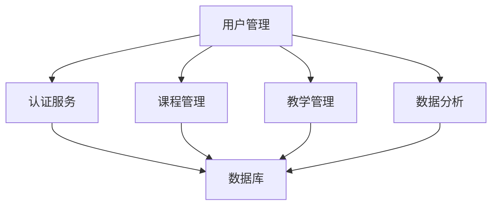
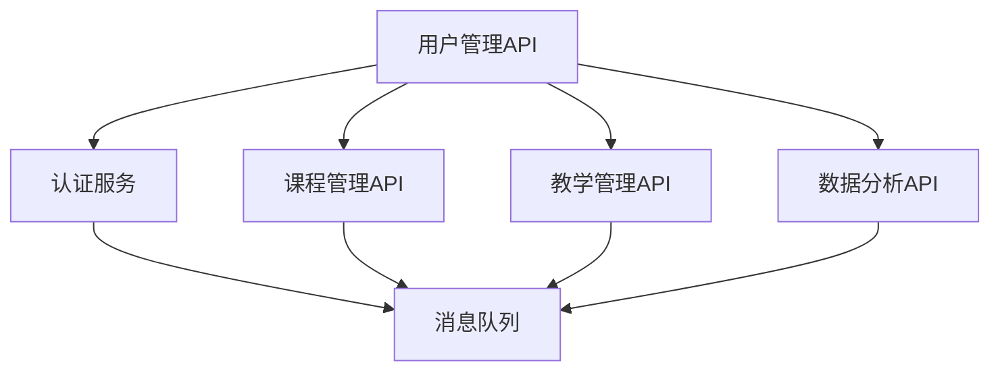
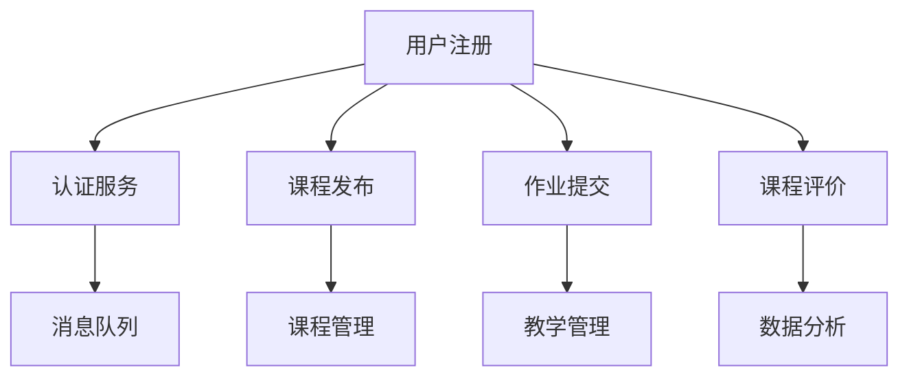
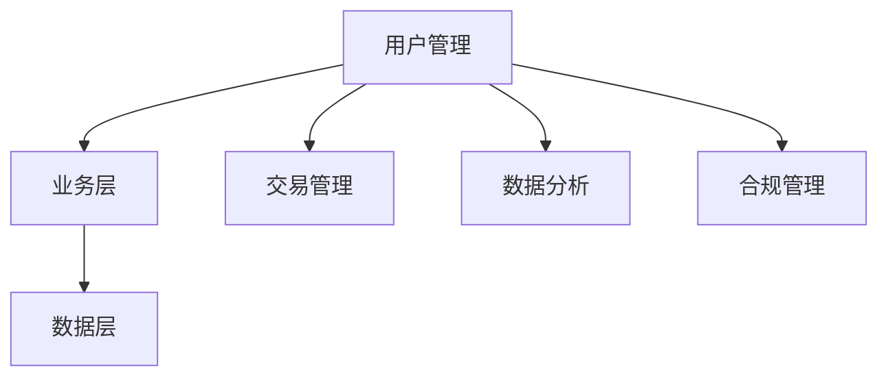
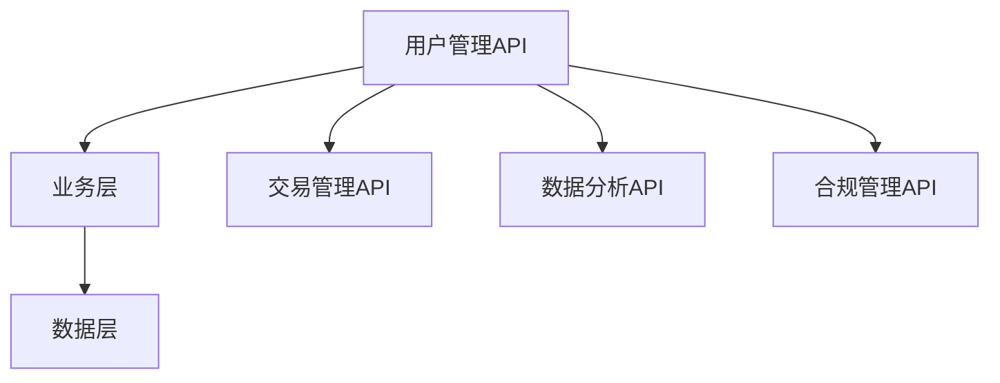

                 

### 文章标题

# 技术团队绩效管理：设定合理的KPI指标

### 文章关键词

- KPI
- 绩效管理
- 技术团队
- 指标设定
- 量化评估

### 文章摘要

本文深入探讨了技术团队绩效管理的核心议题——KPI（关键绩效指标）的设定。通过详细的背景介绍和概念解析，我们明确了KPI在团队绩效管理中的重要性。接着，文章详细阐述了KPI指标体系的设计原则和方法，包括关键指标识别、权重分配和数据来源。然后，文章深入讲解了KPI的实施与监控过程，以及如何处理和调整异常情况。通过实战案例的剖析，文章提供了具体的操作指南，帮助读者理解和应用KPI管理。最后，文章总结了最佳实践，并提出了一些注意事项，为技术团队的绩效提升提供了系统性指导。

### 引言

在现代企业中，技术团队扮演着至关重要的角色。他们的工作不仅直接影响产品的质量和市场的竞争力，也对企业整体的运营效率和创新活力产生深远影响。因此，如何有效地管理技术团队的绩效，成为许多企业面临的重要课题。

绩效管理，作为企业管理的重要组成部分，旨在通过设定和实现目标，提高团队和个人的工作效率和成果。而KPI（关键绩效指标）作为绩效管理的核心工具，其设定和运用直接影响绩效管理的成效。

KPI，即关键绩效指标，是一种用于量化衡量团队或个人工作成效的指标。它通过设定具体的、可量化的目标和指标，帮助团队明确工作方向，提高工作效率，并实现持续改进。合理设定KPI是绩效管理成功的关键，它不仅需要考虑团队的工作内容和目标，还要结合企业的战略和价值观。

本文将围绕技术团队绩效管理的主题，深入探讨KPI的设定原则和方法。我们将首先介绍KPI的基本概念和作用，然后详细讲解KPI指标体系的设计原则，包括关键指标识别、权重分配和数据来源。接着，我们将讨论KPI的实施与监控过程，并通过实际案例进行分析。最后，我们将总结最佳实践，并提出注意事项，为技术团队的绩效提升提供系统性指导。

### 第一部分：技术团队绩效管理基础

#### KPI概述

KPI，即关键绩效指标，是衡量团队或个人绩效的核心工具。在技术团队绩效管理中，KPI的重要性不言而喻。首先，KPI可以帮助团队明确目标，使每个成员都清楚自己的工作方向和期望成果。其次，KPI可以量化工作成效，使绩效评估更加客观和公正。此外，KPI还可以促进团队间的合作和沟通，提高整体工作效率。

KPI的类型多样，根据不同的目标和衡量维度，可以分为以下几类：

1. **质量类指标**：这类指标主要衡量产品的质量，如缺陷率、测试覆盖率等。
2. **效率类指标**：这类指标主要衡量工作的效率，如完成时间、人均产能等。
3. **成本类指标**：这类指标主要衡量工作的成本，如项目成本、人力成本等。
4. **创新类指标**：这类指标主要衡量团队的创新能力和成果，如新功能开发数、技术创新等。
5. **客户满意度类指标**：这类指标主要衡量客户对产品和服务的满意度，如客户反馈、客户保留率等。

#### KPI设定原则

为了确保KPI能够有效反映团队的实际绩效，设定KPI时需要遵循以下原则：

1. **SMART原则**：即具体的（Specific）、可衡量的（Measurable）、可实现的（Achievable）、相关的（Relevant）和有时限的（Time-bound）。遵循SMART原则，可以使KPI更具操作性和指导性。
2. **目标一致性原则**：KPI应与企业的战略目标和团队的工作目标保持一致，以确保团队工作方向的一致性和协同性。
3. **可量化原则**：KPI应尽可能量化，以便于衡量和评估。对于难以量化的指标，可以通过设定评分标准或问卷进行评估。
4. **适度挑战原则**：KPI应具有一定的挑战性，以激发团队成员的工作积极性和创新能力，但不应过于苛刻，以免导致团队成员感到压力过大。

#### KPI的重要性

KPI在技术团队绩效管理中具有以下几个重要作用：

1. **明确目标**：KPI可以帮助团队明确工作目标，使每个成员都清楚自己的职责和期望成果。
2. **量化评估**：通过KPI的量化评估，可以客观、公正地衡量团队和个人的工作成效，为绩效评估提供依据。
3. **激励与改进**：KPI可以激发团队成员的工作积极性和创新能力，推动团队不断改进和提升绩效。
4. **沟通与协作**：KPI为团队间的沟通和协作提供了共同的衡量标准，有助于团队成员共同达成目标。
5. **战略支撑**：KPI可以反映团队的工作成效，为企业的战略决策提供数据支持，帮助企业更好地实现战略目标。

### 第二部分：KPI指标体系设计

#### 关键指标识别

设计合理的KPI指标体系是技术团队绩效管理的关键。首先，我们需要识别关键指标，这些指标应能够全面、准确地反映团队的工作成效。关键指标识别的过程可以分为以下几个步骤：

1. **明确团队目标**：首先，我们需要明确团队的工作目标和业务需求，这有助于我们确定哪些指标是关键指标。
2. **分析工作流程**：通过分析团队的工作流程，我们可以识别出影响工作成效的关键环节和关键因素，从而确定关键指标。
3. **调研与访谈**：与团队成员和相关部门进行调研和访谈，了解他们的工作内容和需求，有助于识别出潜在的关键指标。
4. **专家评审**：邀请相关专家对识别出的关键指标进行评审和讨论，以确保指标的合理性和有效性。

#### 指标权重分配

在识别出关键指标后，我们需要对这些指标进行权重分配，以反映它们对团队绩效的影响程度。指标权重分配的方法包括以下几种：

1. **专家评分法**：邀请相关专家对每个关键指标进行评分，根据评分结果确定权重。
2. **层次分析法（AHP）**：通过构建层次模型，对关键指标进行两两比较，确定相对权重。
3. **统计方法**：利用历史数据和统计分析方法，确定关键指标的权重。

在分配权重时，需要注意以下几点：

1. **平衡性**：确保各指标权重分配的平衡性，避免某个指标权重过高或过低。
2. **动态调整**：根据实际情况，定期对指标权重进行动态调整，以反映团队工作的变化。
3. **透明性**：确保权重分配过程的透明性，让团队成员了解权重分配的依据和理由。

#### 指标数据来源

确定关键指标后，我们需要明确这些指标的数据来源，以确保数据的准确性和及时性。指标数据来源可以分为以下几类：

1. **系统日志**：通过系统日志收集与指标相关的数据，如性能数据、用户行为数据等。
2. **人工统计**：由团队成员或相关人员对指标数据进行手动统计和记录，如工作量、项目进度等。
3. **第三方数据**：从第三方数据源获取与指标相关的数据，如市场调研数据、行业数据等。

在确定数据来源时，需要注意以下几点：

1. **可靠性**：确保数据来源的可靠性，避免数据误差和失真。
2. **及时性**：确保数据能够及时更新和获取，以便及时进行绩效分析和决策。
3. **数据整合**：对来自不同数据源的数据进行整合，以提供全面的绩效评估。

### 第三部分：KPI实施与监控

#### KPI跟踪与分析

KPI实施与监控是确保绩效管理有效性的关键环节。为了实现这一目标，我们需要建立完善的KPI跟踪与分析机制。以下是KPI跟踪与分析的步骤：

1. **数据收集**：通过系统日志、人工统计和第三方数据等方式，收集与KPI相关的数据。
2. **数据清洗**：对收集到的数据进行清洗和整理，确保数据的准确性和一致性。
3. **数据存储**：将清洗后的数据存储在数据库或数据仓库中，以便进行后续分析和处理。
4. **数据可视化**：利用数据可视化工具，将KPI数据以图表、报表等形式展示，以便团队成员了解当前绩效情况。
5. **定期分析**：定期对KPI数据进行分析，识别绩效波动的原因，为团队提供改进方向。

#### 异常处理与调整

在KPI实施过程中，难免会出现数据异常或指标偏离预期的情况。这时，我们需要及时处理和调整，以确保KPI的有效性和可靠性。以下是异常处理与调整的方法：

1. **异常识别**：通过数据分析，识别出数据异常或指标偏离预期的情况。
2. **原因分析**：对异常情况进行分析，找出导致异常的原因。
3. **措施制定**：根据异常原因，制定相应的调整措施，如优化工作流程、调整资源配置等。
4. **实施调整**：实施调整措施，并监控调整效果，以确保指标回归正常范围。
5. **持续改进**：总结异常处理和调整经验，不断完善KPI体系和监控机制，提高KPI的准确性和有效性。

#### 实施与监控的重要性

KPI实施与监控在技术团队绩效管理中具有以下几个重要作用：

1. **确保数据准确性**：通过KPI跟踪与分析，确保数据收集、处理和存储的准确性，为绩效评估提供可靠依据。
2. **实时反馈**：通过实时监控，及时反馈绩效情况，帮助团队成员及时发现问题和改进工作。
3. **决策支持**：基于KPI数据，为管理层提供决策支持，帮助制定战略和优化资源分配。
4. **持续改进**：通过异常处理与调整，不断优化KPI体系和监控机制，提高团队的整体绩效。

### 第四部分：实战案例

#### 案例一：技术团队A的绩效管理实践

**项目背景**：技术团队A是一家互联网公司的研发团队，负责开发一款在线教育平台。该平台需要处理大量用户数据，并保证高效、稳定地运行。

**项目介绍**：为了确保项目的顺利推进和团队的高效运作，技术团队A引入了KPI绩效管理体系。他们设定了以下几个关键指标：

1. **质量类指标**：缺陷率、测试覆盖率等。
2. **效率类指标**：项目完成时间、人均产能等。
3. **成本类指标**：项目成本、人力成本等。
4. **创新类指标**：新功能开发数、技术创新等。
5. **客户满意度类指标**：客户反馈、客户保留率等。

**系统功能设计**：技术团队A采用了敏捷开发模式，通过迭代开发，逐步完善平台功能。他们设计了以下主要功能模块：

1. **用户管理模块**：包括用户注册、登录、个人信息管理等功能。
2. **课程管理模块**：包括课程发布、课程分类、课程评价等功能。
3. **教学管理模块**：包括课堂管理、作业管理、在线问答等功能。
4. **数据分析模块**：包括用户行为分析、课程分析、教学质量分析等功能。

**系统架构设计**：技术团队A采用了微服务架构，将整个系统拆分为多个独立的服务模块，以提高系统的可扩展性和可靠性。系统架构图如下：

**系统接口设计**：为了实现不同服务模块之间的数据交互，技术团队A设计了一套完善的接口系统，包括API接口、消息队列等。接口设计图如下：

**系统交互**：技术团队A通过事件驱动架构，实现了不同服务模块之间的协同工作。系统交互图如下：

**实际案例分析和详细讲解**：在项目实施过程中，技术团队A通过KPI数据，实时监控项目的进展和绩效情况。他们发现，在某个迭代周期内，缺陷率较高，影响到了项目的进度。通过分析，他们发现主要原因是某个模块的代码质量较差。为了解决这个问题，技术团队A采取了以下措施：

1. **代码审查**：加强代码审查，及时发现和修复潜在缺陷。
2. **技术培训**：组织技术培训，提高团队成员的编程技能和代码质量意识。
3. **优化测试流程**：完善测试流程，增加自动化测试，提高测试覆盖率。

通过以上措施，技术团队A成功降低了缺陷率，确保了项目的顺利进行。

**项目小结**：技术团队A通过引入KPI绩效管理体系，实现了对项目的全面监控和优化。他们成功地将KPI应用于项目开发、团队管理和决策支持等方面，提高了项目的质量和效率。

#### 案例二：技术团队B的绩效管理实践

**项目背景**：技术团队B是一家金融科技公司的研发团队，负责开发一款金融服务平台。该平台需要处理大量的金融数据，并确保交易的安全和合规。

**项目介绍**：为了确保项目的顺利进行和团队的高效运作，技术团队B采用了KPI绩效管理体系。他们设定了以下几个关键指标：

1. **质量类指标**：缺陷率、测试覆盖率、安全漏洞等。
2. **效率类指标**：项目完成时间、人均产能、代码复用率等。
3. **成本类指标**：项目成本、人力成本等。
4. **创新类指标**：新功能开发数、技术创新等。
5. **客户满意度类指标**：客户反馈、客户保留率等。

**系统功能设计**：技术团队B设计了以下几个主要功能模块：

1. **用户管理模块**：包括用户注册、登录、个人信息管理等功能。
2. **交易管理模块**：包括交易撮合、交易记录、风险控制等功能。
3. **数据分析模块**：包括用户行为分析、市场分析、风险分析等功能。
4. **合规管理模块**：包括合规审核、合规报告、合规培训等功能。

**系统架构设计**：技术团队B采用了分层架构，将系统分为表示层、业务层和数据层。系统架构图如下：

**系统接口设计**：为了实现不同模块之间的数据交互，技术团队B设计了一套完善的接口系统，包括API接口、WebSocket等。接口设计图如下：

**系统交互**：技术团队B通过事件驱动架构，实现了不同模块之间的协同工作。系统交互图如下：

**实际案例分析和详细讲解**：在项目实施过程中，技术团队B通过KPI数据，实时监控项目的进展和绩效情况。他们发现，在某个迭代周期内，安全漏洞较多，影响到了交易的安全和合规。通过分析，他们发现主要原因是某个模块的代码质量较差，且安全测试不足。为了解决这个问题，技术团队B采取了以下措施：

1. **代码审查**：加强代码审查，特别是对安全相关模块的审查，确保代码质量。
2. **安全测试**：增加安全测试，包括静态代码分析、动态测试和渗透测试，提高安全测试覆盖率。
3. **安全培训**：组织安全培训，提高团队成员的安全意识和技能。

通过以上措施，技术团队B成功降低了安全漏洞数量，确保了交易的安全和合规。

**项目小结**：技术团队B通过引入KPI绩效管理体系，成功实现了对项目的全面监控和优化。他们充分利用KPI数据，及时发现和解决问题，确保了项目的质量和效率。

### 第五部分：结论

通过本文的深入探讨，我们明确了KPI在技术团队绩效管理中的重要性。合理设定KPI指标，不仅能帮助团队明确目标、量化评估工作成效，还能促进团队间的合作与沟通。在实战案例中，我们看到了KPI在实际项目中的应用效果，以及如何通过KPI数据实时监控和优化项目进展。

然而，KPI的设定和实施并非一蹴而就，需要团队和管理层共同协作，不断优化和调整。在未来的工作中，我们应持续关注KPI体系的改进，确保其能够真实反映团队的工作成效，为企业的战略目标提供有力支持。

### 拓展阅读与资源

为了深入了解技术团队绩效管理和KPI设定，以下推荐一些拓展阅读和资源：

1. **书籍推荐**：
   - 《绩效管理：系统设计与实施》（作者：张建国）
   - 《关键绩效指标：基于业务流程的绩效管理方法》（作者：罗伯特·S·卡普兰、戴维·P·诺顿）

2. **在线课程**：
   - Coursera上的《绩效管理》课程
   - Udemy上的《KPI设计与实施》课程

3. **专业网站**：
   - KPI Institute（https://www.kpi-institute.com/）
   -绩效改进协会（https://www Performanceimprovement.com/）

通过阅读这些资源，您将能够更全面地了解技术团队绩效管理和KPI设定的理论和实践，为实际工作提供有力支持。

### 作者信息

作者：AI天才研究院/AI Genius Institute & 禅与计算机程序设计艺术 /Zen And The Art of Computer Programming

感谢您的阅读，希望本文对您在技术团队绩效管理和KPI设定方面有所启发和帮助。如果您有任何疑问或建议，欢迎随时与我们联系。期待与您共同探讨和进步！

