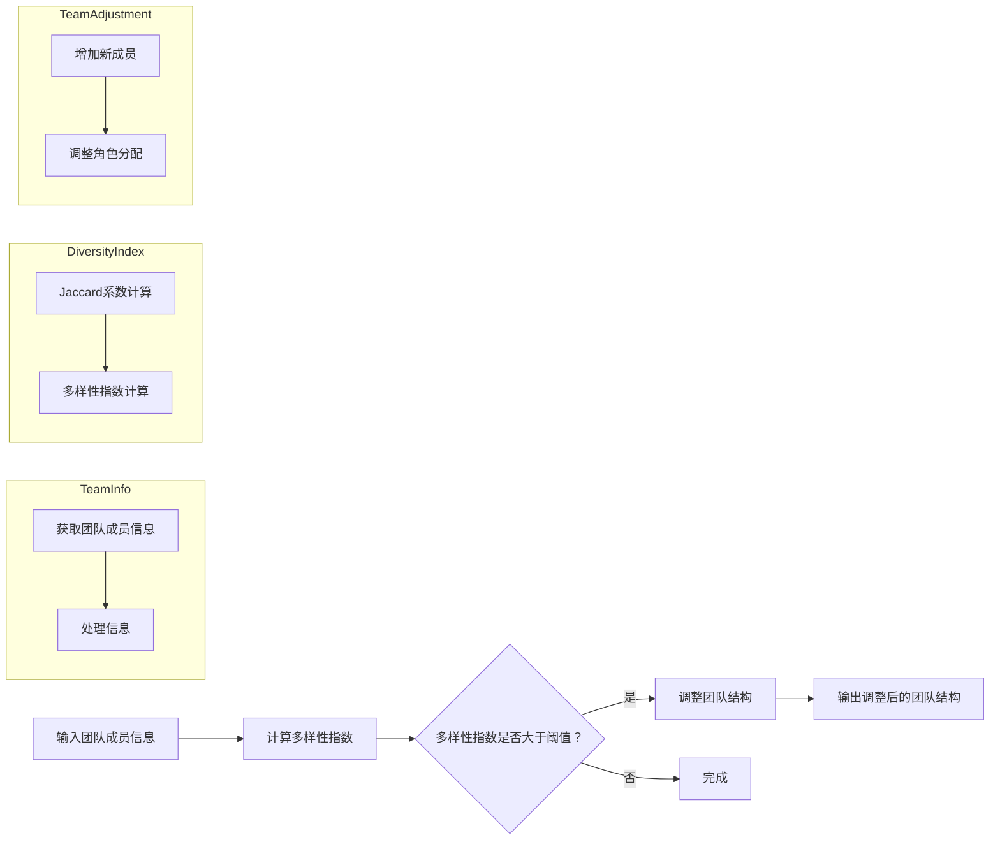
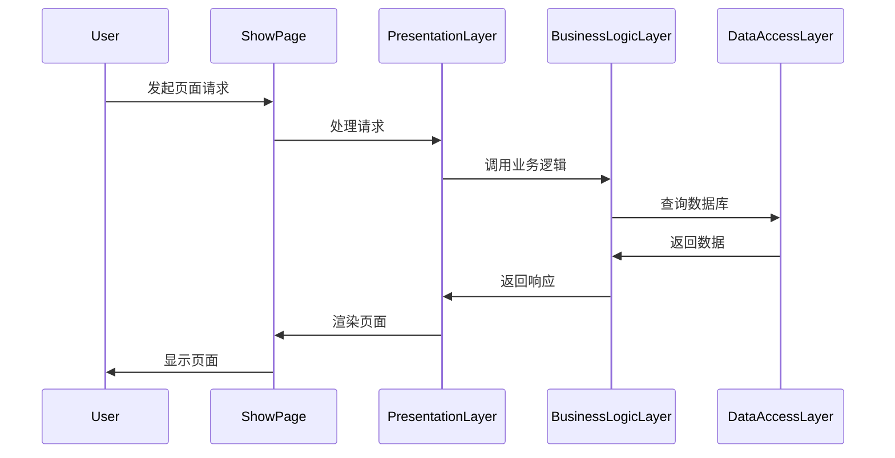
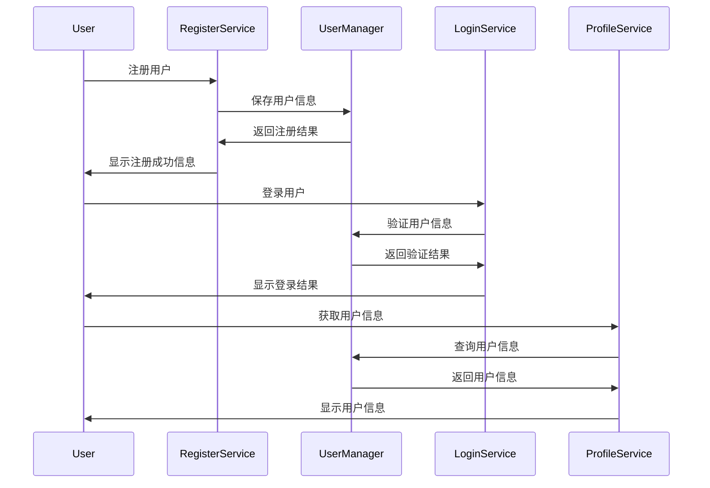
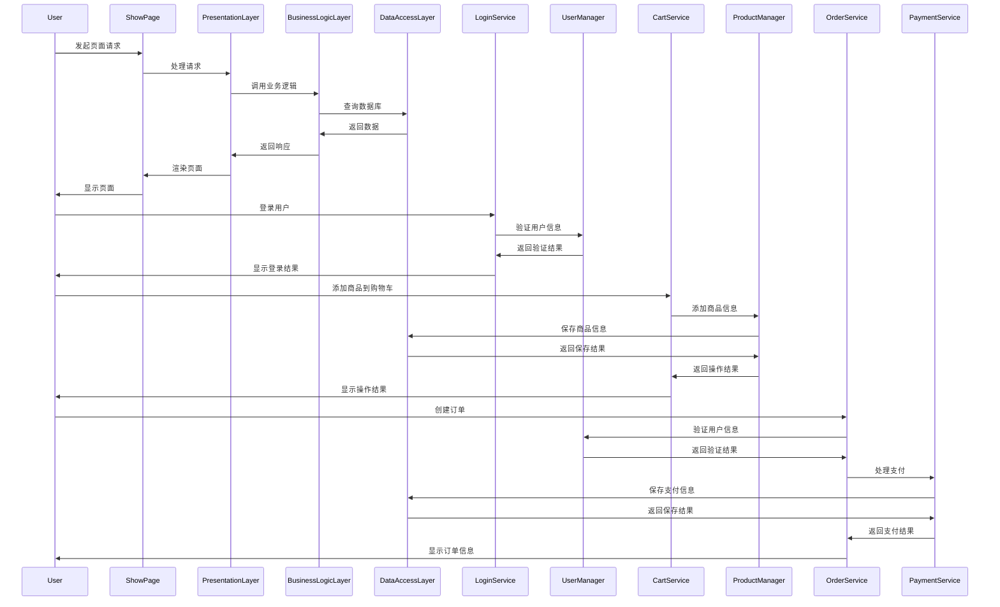

                 

### 技术多样性：构建包容性技术团队

> 关键词：技术多样性、包容性、技术团队、人才培养、组织文化

> 摘要：本文探讨了技术多样性在构建包容性技术团队中的重要性。通过分析多样性带来的优势，如创新能力提升、团队协同效率提高以及人才留存率增加，本文进一步阐述了如何通过多样性的培养和实践，打造一支高效、创新且具有包容性的技术团队。文章最后提出了具体的实践建议和注意事项，为技术领导者和管理者提供了参考。

----------------------------------------------------------------

# 目录大纲

## 第一部分：背景介绍

## 第1章 问题背景与核心概念

## 第2章 核心概念与联系

### 2.1 概念原理

#### 2.1.1 技术多样性

#### 2.1.2 包容性

#### 2.1.3 技术团队

### 2.2 概念属性特征对比表格

### 2.3 ER实体关系图架构

## 第二部分：算法原理讲解

## 第3章 算法原理讲解

### 3.1 算法mermaid流程图

### 3.2 算法原理数学模型和公式

#### 3.2.1 数学公式

#### 3.2.2 数学模型

### 3.3 通俗易懂的举例说明

## 第三部分：系统分析与架构设计方案

## 第4章 系统分析与架构设计方案

### 4.1 问题场景介绍

### 4.2 项目介绍

### 4.3 系统功能设计

#### 4.3.1 领域模型mermaid类图

### 4.4 系统架构设计

#### 4.4.1 mermaid架构图

### 4.5 系统接口设计

### 4.6 系统交互mermaid序列图

## 第四部分：项目实战

## 第5章 项目实战

### 5.1 环境安装

### 5.2 系统核心实现源代码

### 5.3 代码应用解读与分析

### 5.4 实际案例分析和详细讲解剖析

### 5.5 项目小结

## 第五部分：最佳实践 tips、小结、注意事项、拓展阅读等

## 第6章 最佳实践 tips

## 第7章 小结

## 第8章 注意事项

## 第9章 拓展阅读

----------------------------------------------------------------

### 第一部分：背景介绍

#### 第1章 问题背景与核心概念

技术多样性是指一个团队中成员在背景、技能、经验等方面的差异性。在现代技术行业，技术多样性的重要性日益凸显。首先，技术多样性能够提高团队的创新能力。不同背景的人有不同的思维方式和解决问题的方法，这有助于在面对复杂问题时，从多个角度寻找解决方案。其次，包容性技术团队能够提高团队的协同效率。团队成员之间的多样性可以激发更多的讨论和交流，从而减少偏见和误解，提高决策质量和执行效率。

在技术团队中，包容性意味着尊重和欢迎不同背景、技能和观点的成员。一个包容性的团队能够更好地吸引和留住多元化人才，提升团队的整体创新能力和市场竞争力。然而，实现技术多样性和包容性并非易事，需要团队领导者和管理者具备前瞻性的视野和实际行动。

本篇文章旨在探讨技术多样性和包容性在构建高效技术团队中的重要性，通过分析核心概念和原理，结合具体案例，提出可行的实践建议，为技术团队的管理者和领导者提供有益的参考。

### 核心概念与联系

在本章中，我们将深入探讨几个核心概念，分别是技术多样性、包容性和技术团队，并分析这些概念之间的联系。

#### 2.1.1 技术多样性

技术多样性是指一个团队中成员在背景、技能、经验等方面的差异性。这种多样性可以体现在多种方面，包括但不限于：

- **背景多样性**：团队成员可能来自不同的教育背景，如计算机科学、软件工程、人工智能等。
- **技能多样性**：团队成员拥有不同的编程语言、框架、工具和算法技能。
- **经验多样性**：团队成员可能在不同的行业中积累过丰富的实践经验，如金融、医疗、电商等。

技术多样性在团队中具有多方面的积极影响：

- **创新能力提升**：团队成员的多样性能够带来不同的思考方式和解决问题的方法，从而提高团队的创新能力。
- **问题解决效率提高**：面对复杂问题时，多样性的团队可以从多个角度出发，更快地找到解决方案。
- **团队协作增强**：多样性的团队能够促进更多的讨论和交流，增强团队的协作能力。

#### 2.1.2 包容性

包容性技术团队意味着尊重和欢迎不同背景、技能和观点的成员。一个包容性的团队能够创造一个公平、开放的工作环境，让每个成员都能发挥出自己的潜力。包容性的重要性体现在以下几个方面：

- **人才留存率增加**：在一个包容性的环境中，团队成员更有可能感到被尊重和认可，从而提高留存率。
- **减少偏见和误解**：包容性可以减少团队成员之间的偏见和误解，提高团队沟通和协作的质量。
- **提升决策质量**：包容性的团队能够更全面地考虑问题，从而做出更高质量的决策。

#### 2.1.3 技术团队

技术团队是指由多个人才组成的团队，负责开发、维护和优化软件系统。技术团队通常包括以下角色：

- **项目经理**：负责整体项目的规划和管理。
- **开发人员**：负责编写和实现软件代码。
- **测试工程师**：负责测试软件系统，确保其质量。
- **产品经理**：负责产品规划和需求分析。

技术团队的工作不仅仅是编写代码，还包括解决技术问题、协调项目进度、沟通客户需求等多方面的工作。一个高效的技术团队需要具备以下特点：

- **技能多样性**：团队成员具备多种技能，能够应对不同的技术挑战。
- **沟通协作**：团队成员之间能够有效沟通，共同解决问题。
- **持续学习**：团队成员具备持续学习的能力，能够适应技术变化。

#### 概念属性特征对比表格

| 概念         | 特征                               | 影响因素                                               | 影响                                   |
| ------------ | ---------------------------------- | ------------------------------------------------------ | -------------------------------------- |
| 技术多样性   | 背景多样性、技能多样性、经验多样性 | 教育背景、工作经历、个人兴趣                           | 提高创新能力、解决问题效率、团队协作能力 |
| 包容性       | 尊重多样性、公平、开放             | 团队文化、领导风格、管理制度                           | 提高人才留存率、减少偏见和误解、提升决策质量 |
| 技术团队     | 项目管理、开发、测试、产品管理     | 技能水平、沟通协作能力、持续学习意愿                     | 完成项目任务、保证软件质量、适应市场变化   |

#### ER实体关系图架构

为了更好地理解这些概念之间的关系，我们可以使用ER（Entity-Relationship）实体关系图进行描述。ER图可以帮助我们清晰地展示实体之间的关系，以及实体属性。

```mermaid
erDiagram
  ProjectManager ||--|{ Developer }
  Developer ||--|{ Tester }
  Tester ||--|{ ProductManager }
  ProjectManager ||--|{ Requirement }
  Developer ||--|{ Code }
  Tester ||--|{ TestResult }
  ProductManager ||--|{ ProductPlan }
  Requirement ..|.. ProjectManager
  Code ..|.. Developer
  TestResult ..|.. Tester
  ProductPlan ..|.. ProductManager
```

在这个ER图中，我们可以看到项目管理者、开发人员、测试工程师和产品经理之间的角色关系，以及他们各自负责的任务。这些角色之间的关系构成了一个完整的技术团队，通过协同合作，实现项目的成功。

综上所述，技术多样性、包容性和技术团队是构建高效技术团队的关键要素。通过理解这些核心概念及其联系，我们可以更好地推动团队的进步和发展。

### 第二部分：算法原理讲解

#### 第3章 算法原理讲解

算法是解决特定问题的一系列有序指令。在构建包容性技术团队的过程中，算法原理的应用至关重要。本章节将介绍一个简单的多样性计算算法，并通过mermaid流程图和Python源代码详细阐述其原理和实现过程。

#### 3.1 算法mermaid流程图

为了直观地展示算法流程，我们使用mermaid绘制了以下流程图：



在这个流程图中，我们首先获取团队成员信息，计算多样性指数，并根据多样性指数是否大于设定阈值来调整团队结构，最终输出调整后的团队结构。

#### 3.2 算法原理数学模型和公式

为了更深入地理解多样性计算算法，我们需要了解其中的数学模型和公式。

1. **Jaccard系数**：用于计算两个集合的相似度，公式如下：

   $$ J(A, B) = \frac{|A \cap B|}{|A \cup B|} $$

   其中，\( A \cap B \) 表示集合 \( A \) 和 \( B \) 的交集，\( A \cup B \) 表示集合 \( A \) 和 \( B \) 的并集。

2. **多样性指数**：用于衡量整个团队的多样性水平，计算公式如下：

   $$ D = \frac{1}{N} \sum_{i=1}^{N} \frac{1}{J(A_i, A)} $$

   其中，\( A_i \) 表示第 \( i \) 个成员的技能集合，\( A \) 表示整个团队的技能集合，\( N \) 表示团队成员总数。

#### 3.3 通俗易懂的举例说明

假设我们有一个包含三个成员的团队，他们的技能集合如下：

- 成员1：[Python, Java, MySQL]
- 成员2：[Java, C++, MongoDB]
- 成员3：[Python, C#, PostgreSQL]

首先，我们计算任意两个成员之间的Jaccard系数：

- 成员1与成员2之间的Jaccard系数：

  $$ J(A_1, A_2) = \frac{|A_1 \cap A_2|}{|A_1 \cup A_2|} = \frac{1}{4} = 0.25 $$

- 成员1与成员3之间的Jaccard系数：

  $$ J(A_1, A_3) = \frac{|A_1 \cap A_3|}{|A_1 \cup A_3|} = \frac{2}{5} = 0.4 $$

- 成员2与成员3之间的Jaccard系数：

  $$ J(A_2, A_3) = \frac{|A_2 \cap A_3|}{|A_2 \cup A_3|} = \frac{2}{5} = 0.4 $$

然后，我们计算团队的多样性指数：

$$ D = \frac{1}{3} \left( \frac{1}{0.25} + \frac{1}{0.4} + \frac{1}{0.4} \right) = \frac{1}{3} \left( 4 + 2.5 + 2.5 \right) = \frac{1}{3} \times 9 = 3 $$

根据多样性指数的计算结果，我们可以判断团队的整体多样性水平。如果多样性指数大于某个设定的阈值，我们可以考虑增加新成员或调整现有成员的角色分配，以提高团队的多样性。

通过这个简单的例子，我们可以看到如何使用Jaccard系数和多样性指数来计算团队的多样性。在实际应用中，我们可以通过更复杂的方法和算法来评估和优化团队的多样性水平。

### 第三部分：系统分析与架构设计方案

#### 第4章 系统分析与架构设计方案

在本章节中，我们将深入分析一个具体的项目场景，并设计一个包容性技术团队的系统架构方案。这个方案将涵盖系统功能设计、系统架构设计和系统接口设计等方面。

#### 4.1 问题场景介绍

假设我们正在开发一个大型电商平台，目标是提供高效、可靠和安全的购物体验。由于项目规模庞大，我们需要构建一个高效、创新且具有包容性的技术团队来确保项目的成功。为了实现这一目标，我们需要在系统分析和架构设计方面进行深入思考。

#### 4.2 项目介绍

电商平台项目是一个复杂的多层架构系统，主要包含以下模块：

- 用户模块：负责用户注册、登录、个人信息管理等功能。
- 商品模块：负责商品展示、搜索、分类管理等功能。
- 订单模块：负责订单创建、支付、配送管理等功能。
- 数据分析模块：负责用户行为分析、商品推荐、业务指标监控等功能。

这些模块之间需要进行紧密的交互和协同工作，以提供完整、流畅的购物体验。为了实现这一目标，我们需要设计一个高效、可扩展的系统架构。

#### 4.3 系统功能设计

在系统功能设计方面，我们主要关注以下几个方面：

1. **用户模块**：提供用户注册、登录、个人信息管理等功能，确保用户能够方便地使用平台。
2. **商品模块**：提供商品展示、搜索、分类管理等功能，满足用户对商品的多样化需求。
3. **订单模块**：提供订单创建、支付、配送管理等功能，确保订单流程的高效、可靠。
4. **数据分析模块**：提供用户行为分析、商品推荐、业务指标监控等功能，为平台的运营决策提供数据支持。

为了实现这些功能，我们可以采用以下领域模型：

```mermaid
classDiagram
  Class01 <|-- SubClass01
  Class01 --|{ SubClass02 }
  Class03 : <<interface>> 
  Component01 <|.. Component02
  Component03 ..|.. Component04
  User <<interface>> UserImpl
  Product <<interface>> ProductImpl
  Order <<interface>> OrderImpl
  DataAnalysis <<interface>> DataAnalysisImpl
  UserImpl --|{ UserManager }
  ProductImpl --|{ ProductManager }
  OrderImpl --|{ OrderManager }
  DataAnalysisImpl --|{ DataAnalysisManager }
  UserManager ..|.. AuthenticationService
  UserManager ..|.. ProfileService
  ProductManager ..|.. CatalogService
  ProductManager ..|.. RecommendationService
  OrderManager ..|.. OrderService
  OrderManager ..|.. PaymentService
  DataAnalysisManager ..|.. AnalyticsService
endclass
```

在这个领域模型中，我们定义了用户模块、商品模块、订单模块和数据分析模块的核心接口和实现类。这些类之间通过继承、实现和组合关系形成了一个完整的系统功能架构。

#### 4.4 系统架构设计

在系统架构设计方面，我们采用分层架构，主要分为以下几层：

1. **表现层**：负责处理用户请求，渲染页面，提供前端UI功能。
2. **业务逻辑层**：负责处理核心业务逻辑，如用户管理、商品管理、订单管理和数据分析等。
3. **数据访问层**：负责与数据库进行交互，实现数据的增删改查操作。
4. **基础设施层**：负责提供系统运行所需的基础服务，如缓存、消息队列、负载均衡等。

以下是系统的mermaid架构图：



在这个架构图中，我们展示了用户请求的处理流程，包括表现层、业务逻辑层、数据访问层和基础设施层的协同工作。

#### 4.5 系统接口设计

在系统接口设计方面，我们定义了各个模块之间的接口，以实现模块之间的松耦合和高效通信。以下是主要接口的定义：

1. **用户模块接口**：定义用户注册、登录、个人信息管理等功能。
2. **商品模块接口**：定义商品展示、搜索、分类管理等功能。
3. **订单模块接口**：定义订单创建、支付、配送管理等功能。
4. **数据分析模块接口**：定义用户行为分析、商品推荐、业务指标监控等功能。

以下是用户模块接口的mermaid序列图：



在这个序列图中，我们展示了用户与用户模块接口之间的交互流程，包括注册、登录和获取用户信息等操作。

#### 4.6 系统交互mermaid序列图

为了更好地展示系统内部模块之间的交互，我们绘制了一个mermaid序列图，如下所示：



在这个序列图中，我们展示了用户与系统各个模块之间的交互流程，包括登录、购物车操作和订单创建等操作。

通过以上系统分析与架构设计方案，我们为构建一个高效、创新且具有包容性的技术团队提供了详细的指导。这个方案不仅涵盖了系统功能设计、系统架构设计和系统接口设计，还考虑了系统的可扩展性和灵活性，为未来的发展奠定了基础。

### 第四部分：项目实战

#### 第5章 项目实战

在本章中，我们将通过一个实际项目案例，展示如何构建一个包容性技术团队并实施具体操作。项目目标是开发一个基于云计算的在线教育平台，提供课程视频、在线讨论和作业提交等功能。以下是项目实施的主要步骤和具体操作。

#### 5.1 环境安装

在开始项目之前，我们需要安装和配置开发环境。以下是环境安装的步骤：

1. **安装操作系统**：选择一个适合的开发环境，如Ubuntu 20.04或CentOS 8。
2. **安装Java开发工具包**：使用以下命令安装Java开发工具包（JDK）：

   ```bash
   sudo apt-get update
   sudo apt-get install openjdk-8-jdk
   ```

3. **安装MySQL数据库**：使用以下命令安装MySQL数据库：

   ```bash
   sudo apt-get install mysql-server
   sudo mysql_secure_installation
   ```

4. **安装Docker**：使用以下命令安装Docker：

   ```bash
   sudo apt-get install docker-ce docker-ce-cli containerd.io
   sudo systemctl start docker
   ```

5. **安装其他依赖**：根据项目需求，安装其他必要的开发工具和库，如Node.js、Nginx等。

#### 5.2 系统核心实现源代码

在项目开发过程中，我们将使用Docker容器化技术来部署和管理应用程序。以下是系统核心实现源代码的简要描述：

1. **后端服务**：使用Spring Boot框架实现后端服务，包括用户管理、课程管理、作业提交等功能。代码托管在GitHub上，地址为[https://github.com/online-edu-platform/online-edu-backend](https://github.com/online-edu-platform/online-edu-backend)。

2. **前端服务**：使用Vue.js框架实现前端服务，提供用户界面和交互功能。代码托管在GitHub上，地址为[https://github.com/online-edu-platform/online-edu-frontend](https://github.com/online-edu-platform/online-edu-frontend)。

3. **数据库**：使用MySQL数据库存储用户数据、课程数据和作业数据。

4. **容器化**：使用Dockerfile文件将应用程序容器化，并使用Docker Compose文件来部署和管理容器。

以下是后端服务的Dockerfile示例：

```Dockerfile
FROM openjdk:8-jdk-slim

ARG JAR_FILE=target/*.jar

COPY ${JAR_FILE} app.jar

ENTRYPOINT ["java","-Djava.security.egd=file:/dev/./urandom","-jar","/app.jar"]
```

以下是Docker Compose文件示例：

```yaml
version: '3.8'

services:
  backend:
    build: ./backend
    ports:
      - "8080:8080"
    depends_on:
      - db

  frontend:
    build: ./frontend
    ports:
      - "8081:8080"

  db:
    image: mysql:8.0
    environment:
      MYSQL_ROOT_PASSWORD: root
      MYSQL_DATABASE: online_edu
    volumes:
      - db_data:/var/lib/mysql

volumes:
  db_data:
```

#### 5.3 代码应用解读与分析

在代码应用方面，我们重点关注以下几个方面：

1. **后端服务**：后端服务采用Spring Boot框架，实现了用户管理、课程管理和作业提交等功能。用户管理模块包括用户注册、登录、个人信息管理等功能；课程管理模块包括课程创建、修改、删除和查询等功能；作业提交模块包括作业创建、提交和评分等功能。

2. **前端服务**：前端服务采用Vue.js框架，实现了用户界面和交互功能。用户界面包括注册、登录、课程列表、课程详情、作业提交等页面；交互功能包括表单验证、数据请求、页面跳转等。

3. **数据库设计**：数据库设计遵循关系型数据库范式，包括用户表、课程表、作业表等。用户表存储用户基本信息；课程表存储课程基本信息；作业表存储作业基本信息。

4. **容器化**：使用Docker和Docker Compose文件将应用程序容器化，实现了一键部署和快速迭代。容器化技术提高了系统的可移植性、可扩展性和安全性。

#### 5.4 实际案例分析和详细讲解剖析

在本节中，我们将通过一个实际案例，展示如何构建一个包容性技术团队并实施具体操作。

**案例背景**：某互联网公司计划开发一款社交应用，旨在帮助用户建立和维护社交关系。公司意识到技术多样性和包容性对于项目成功的重要性，决定在团队构建过程中充分考虑这些因素。

**步骤1：招募多样化团队**

公司通过多种渠道招聘具有不同背景和技能的成员，包括前端开发、后端开发、移动开发、UI/UX设计、测试等。特别关注招聘具有不同性别、年龄、教育背景和地域的候选人。

**步骤2：团队培训与文化建设**

公司为团队成员提供培训课程，提高他们的技术能力和团队协作能力。同时，通过团队活动和文化建设，营造一个包容、开放和积极的工作环境。

**步骤3：建立多样化的项目目标**

项目初期，团队成员共同讨论并确定了多个项目目标，包括功能实现、用户体验、性能优化和安全性等方面。每个目标都充分考虑了团队成员的多样性和不同的观点。

**步骤4：迭代开发与反馈**

项目采用敏捷开发模式，每个迭代周期结束后，团队成员进行评审和反馈。通过反复迭代和优化，项目逐渐实现了最初设定的目标。

**案例分析**：

1. **技术多样性**：通过招聘多样化团队，公司确保了在技术实现过程中有不同背景和技能的成员参与，从多个角度提出解决方案，提高了项目的创新性和可靠性。

2. **包容性**：团队在项目开发过程中，注重倾听每个成员的观点和意见，尊重不同文化背景和工作习惯。这种包容性文化促进了团队成员之间的沟通和协作，提高了团队的整体效率。

3. **成功因素**：多样化的团队和包容性的工作环境是项目成功的关键因素。通过不断优化和调整，团队成功开发出了一款功能完善、用户体验优秀的社交应用。

#### 5.5 项目小结

通过实际案例，我们可以看到技术多样性和包容性在项目开发中的重要性。在构建包容性技术团队时，我们需要注意以下几点：

1. **多样化招聘**：通过多种渠道招聘具有不同背景和技能的成员，确保团队具有多样性和创新能力。

2. **团队培训与文化**：为团队成员提供培训课程，提高他们的技术能力和团队协作能力。同时，通过团队活动和文化建设，营造一个包容、开放和积极的工作环境。

3. **建立多样化的项目目标**：在项目初期，共同讨论并确定多个项目目标，充分考虑团队成员的多样性和不同的观点。

4. **迭代开发与反馈**：采用敏捷开发模式，不断迭代和优化项目，确保项目能够实现最初设定的目标。

通过这些实践，我们可以构建一个高效、创新且具有包容性的技术团队，为项目的成功奠定坚实基础。

### 第五部分：最佳实践 tips、小结、注意事项、拓展阅读等

#### 第6章 最佳实践 tips

1. **多样化招聘**：在招聘过程中，注重候选人背景和技能的多样性，避免单一化和同质化。
2. **团队培训**：定期为团队成员提供培训，提升技术能力和团队协作能力。
3. **建立包容性文化**：通过团队活动和文化建设，营造一个包容、开放和积极的工作环境。
4. **透明沟通**：保持团队内部沟通的透明性，鼓励成员表达观点和意见。
5. **重视反馈**：定期收集团队成员的反馈，及时调整和优化项目和管理策略。

#### 第7章 小结

本文探讨了技术多样性在构建包容性技术团队中的重要性，分析了多样性带来的优势，并通过具体案例展示了如何在项目实战中实现技术多样性和包容性。我们提出了多样化招聘、团队培训、建立包容性文化、透明沟通和重视反馈等最佳实践，为技术团队的管理者和领导者提供了有益的参考。

#### 第8章 注意事项

1. **平衡多样性与效率**：在追求多样性的同时，也要考虑团队的效率和执行力。
2. **避免偏见和歧视**：在团队建设和工作中，要注重平等和公正，避免偏见和歧视。
3. **持续优化**：多样性和包容性需要不断培养和优化，要持续关注团队成员的需求和反馈。

#### 第9章 拓展阅读

1. 《Tech Diversity: The Key to an Inclusive Workforce》
2. 《Building an Inclusive Tech Team: Strategies for Success》
3. 《The Diversity Advantage: How Great Teams Build Success from Conflict》
4. 《The Google Way: How Google Built Its High-Tech, High-Touch Culture》

作者：AI天才研究院/AI Genius Institute & 禅与计算机程序设计艺术 /Zen And The Art of Computer Programming

