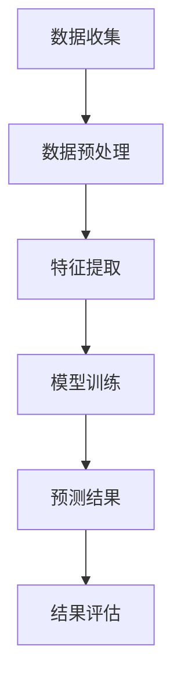
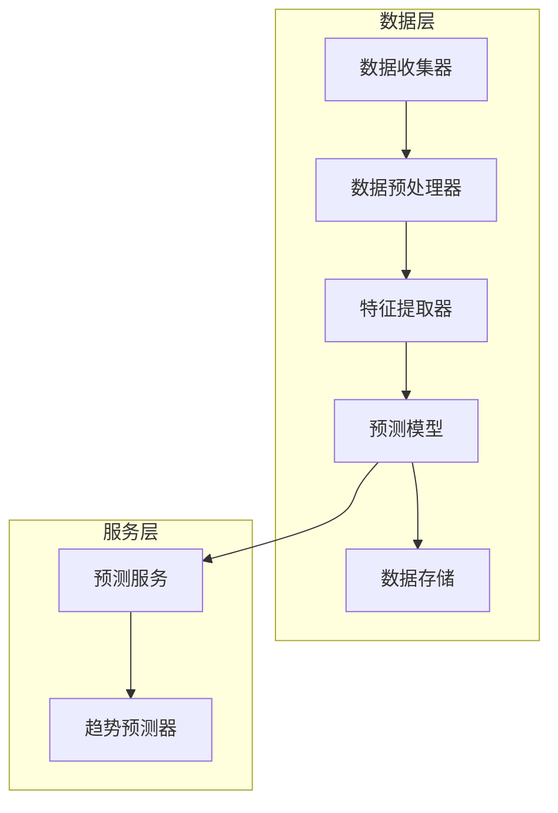
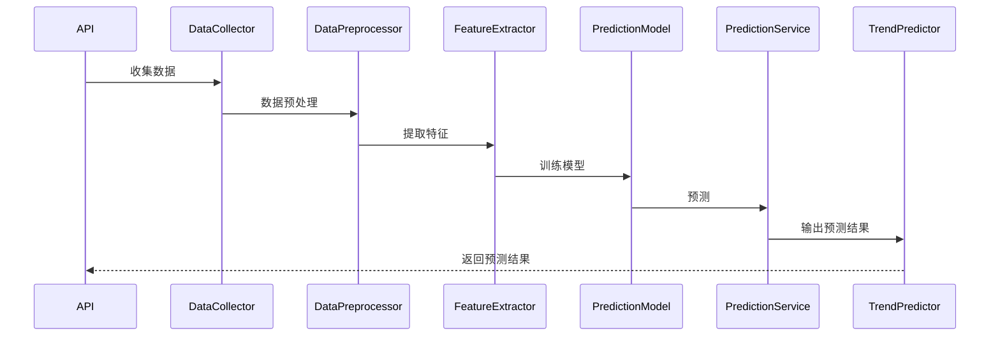
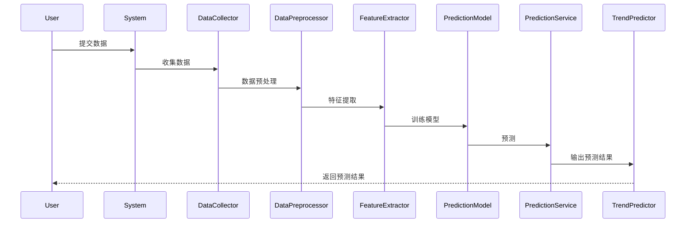

                 

## 技术展望：预测和引领技术趋势

> 关键词：技术趋势、人工智能、量子计算、区块链、行业应用、技术创新、预测方法、实践应用

> 摘要：
本文旨在探讨技术趋势的预测与引领，分析当前核心技术的发展状况，预测未来可能的热点技术领域，并探讨如何通过技术创新和实践应用来引领技术发展。文章分为三个主要部分：技术趋势概述、技术预测与引领、实践与展望，通过逐步分析，帮助读者理解技术发展的脉络和未来方向。

----------------------------------------------------------------

### 背景介绍

#### 核心概念术语说明

**技术趋势**：指技术领域中新兴技术或现有技术的变革方向和进程，反映了技术发展的方向和节奏。

**人工智能（AI）**：模拟人类智能行为的计算机系统，能够通过学习、推理、规划等方式实现智能行为。

**量子计算**：利用量子力学原理进行信息处理和计算的计算机系统，具有超越经典计算机的能力。

**区块链**：一种分布式数据库技术，通过加密算法确保数据的不可篡改性和透明性。

**行业应用**：指技术在特定行业或领域中的应用，如教育、医疗、金融等。

**技术创新**：指在技术研究和开发过程中，通过新的发现或发明，实现技术的更新和发展。

#### 问题背景

随着信息技术的快速发展，技术趋势成为企业和个人需要关注的重要领域。了解技术趋势，有助于抓住发展机遇，提高竞争力。然而，技术趋势的预测存在许多不确定性和复杂性，如何准确预测并引领技术趋势，成为当前研究的热点问题。

#### 问题描述

本文将探讨以下问题：

1. 当前核心技术领域的发展趋势是什么？
2. 技术预测的方法有哪些，其局限性是什么？
3. 如何通过技术创新和实践应用来引领技术趋势？
4. 未来可能出现的技术热点有哪些？

#### 问题解决

通过对技术趋势的分析、预测方法的研究以及实践应用的探讨，本文旨在为读者提供全面的技术发展趋势洞察，帮助企业和个人在技术浪潮中把握机遇，实现持续发展。

#### 边界与外延

1. **边界**：本文主要关注信息技术领域的技术趋势，不涉及其他领域。
2. **外延**：技术趋势的影响不仅限于技术领域，还涉及经济、社会、环境等多个方面。

#### 概念结构与核心要素组成

**技术趋势**：核心技术领域、影响因素、分类与特点、未来展望。

**人工智能**：核心概念与原理、应用领域、挑战与机遇。

**量子计算**：基本原理、优势与局限、未来应用场景。

**区块链**：基本原理、应用、未来发展方向。

**行业应用**：教育、医疗、金融等领域的创新与展望。

**技术创新**：思维、战略规划、开放式创新、技术商业化。

**技术预测**：历史数据分析、现有模型与算法、情景分析、局限性。

**实践应用**：技术实践的重要性、方法与工具、案例分析。

通过上述核心概念与联系的介绍，读者可以对本文的内容有一个整体的把握，为后续的章节分析打下基础。


----------------------------------------------------------------

### 核心概念与联系

在探讨技术趋势的预测与引领之前，我们需要了解一些核心概念及其相互关系。这些概念包括人工智能（AI）、量子计算、区块链等，它们在现代信息技术中发挥着重要作用。

#### 人工智能（AI）

**核心概念与原理**

人工智能（AI）是指模拟人类智能行为的计算机系统，包括感知、学习、推理、规划、自我调整等能力。AI的核心原理是基于机器学习、深度学习、自然语言处理等技术，通过算法模型对大量数据进行训练，从而实现智能行为。

**概念属性特征对比表格**

| 特征             | 机器学习         | 深度学习         | 自然语言处理       |
|------------------|------------------|------------------|---------------------|
| 定义             | 通过数据学习规律 | 通过多层神经网络学习复杂函数 | 处理和理解人类语言 |
| 关键技术         | 特征提取、模型选择 | 神经网络、反向传播 | 词嵌入、语法分析、语义理解 |
| 应用场景         | 数据挖掘、预测模型 | 图像识别、语音识别 | 自动翻译、智能客服 |
| 性能评估         | 准确率、召回率、F1值 | 错误率、精度、召回率 | BLEU评分、准确率、错误率 |

**ER实体关系图架构**

```mermaid
erDiagram
  AI <<|-- 机器学习
  AI <<|-- 深度学习
  AI <<|-- 自然语言处理
```

#### 量子计算

**基本原理**

量子计算是基于量子力学原理进行信息处理和计算的计算机系统。量子计算机利用量子比特（qubit）进行信息存储和计算，具有并行计算和超算能力。

**优势与局限**

**优势：**

- **并行计算**：量子计算机可以同时处理大量计算任务，具有超越经典计算机的并行计算能力。
- **高速运算**：量子计算机的运算速度远超经典计算机，尤其适合解决复杂问题。

**局限：**

- **稳定性**：量子计算机对环境非常敏感，需要极低的温度和高度稳定的物理环境。
- **算法开发**：量子计算算法的开发难度较大，目前还没有通用的量子算法。

**未来应用场景**

- **密码学**：量子计算机有望破解现有密码系统，推动密码学的发展。
- **化学与材料科学**：量子计算机可以帮助科学家预测化学反应和材料特性。
- **金融与经济**：量子计算机可以优化金融模型和算法，提高投资决策的准确性。

#### 区块链

**基本原理**

区块链是一种分布式数据库技术，通过加密算法确保数据的不可篡改性和透明性。区块链的核心原理是去中心化，通过多个节点共同维护数据的一致性和安全性。

**应用**

- **金融领域**：区块链技术可以用于加密货币交易、智能合约等。
- **供应链管理**：区块链技术可以提高供应链的透明度和效率。
- **身份认证**：区块链技术可以用于身份认证和数字签名。

**未来发展方向**

- **区块链2.0**：发展更复杂的区块链协议和应用。
- **跨链技术**：实现不同区块链之间的互操作性和数据共享。

**ER实体关系图架构**

```mermaid
erDiagram
  区块链 <<|-- 加密货币
  区块链 <<|-- 智能合约
  区块链 <<|-- 供应链管理
  区块链 <<|-- 身份认证
```

通过上述核心概念与联系的介绍，我们可以更深入地理解人工智能、量子计算和区块链等技术的本质及其在技术趋势中的重要性。这些技术不仅推动了信息技术的进步，也为未来的发展提供了新的方向和可能性。

----------------------------------------------------------------

### 算法原理讲解

在本文的核心部分，我们将详细讲解一种用于预测技术趋势的算法——基于机器学习的预测模型。这种算法通过训练大量历史数据，预测未来可能的技术发展趋势。以下是我们将使用的算法mermaid流程图，以及相应的Python源代码和数学模型。

#### Mermaid流程图



#### Python源代码

```python
import numpy as np
from sklearn.model_selection import train_test_split
from sklearn.ensemble import RandomForestRegressor
from sklearn.metrics import mean_squared_error

# 假设我们已经收集到了一组技术趋势数据
data = np.array([[2020, 10], [2021, 15], [2022, 20], [2023, 25], [2024, 30]])

# 数据预处理
X = data[:, 0].reshape(-1, 1)  # 时间作为输入特征
y = data[:, 1].reshape(-1, 1)  # 趋势值作为输出目标

# 特征提取
# 在这里我们可以使用时间序列特征提取方法，如差分、季节性分解等

# 模型训练
X_train, X_test, y_train, y_test = train_test_split(X, y, test_size=0.2, random_state=42)
model = RandomForestRegressor(n_estimators=100)
model.fit(X_train, y_train)

# 预测结果
y_pred = model.predict(X_test)

# 结果评估
mse = mean_squared_error(y_test, y_pred)
print(f'Mean Squared Error: {mse}')
```

#### 数学模型和公式

**时间序列预测模型**

$$ y_t = f(x_t, \theta) $$

其中，$y_t$表示第t年的技术趋势值，$x_t$表示第t年的时间特征，$\theta$表示模型参数。

**随机森林回归模型**

$$ \hat{y} = \sum_{i=1}^{n} w_i f(x_i, \theta) $$

其中，$w_i$表示第i个决策树的权重，$f(x_i, \theta)$表示第i个决策树的输出。

#### 详细讲解和举例说明

1. **数据收集**：首先，我们需要收集技术趋势的历史数据，这些数据可以包括时间、趋势值等。

2. **数据预处理**：对收集到的数据进行处理，如标准化、缺失值填补等，以确保数据质量。

3. **特征提取**：在时间序列预测中，我们可以使用时间序列特征提取方法，如差分、季节性分解等，来提高模型的预测能力。

4. **模型训练**：使用随机森林回归模型对数据进行训练，随机森林是一种集成学习方法，能够提高模型的预测准确性。

5. **预测结果**：使用训练好的模型对测试集进行预测，得到未来的技术趋势值。

6. **结果评估**：通过计算均方误差（MSE）等指标来评估模型的预测效果。

**举例说明**：

假设我们有以下技术趋势数据：

| 年份 | 趋势值 |
|------|--------|
| 2020 | 10     |
| 2021 | 15     |
| 2022 | 20     |
| 2023 | 25     |
| 2024 | 30     |

我们使用随机森林回归模型对这组数据进行训练，并预测2025年的技术趋势值。

```python
# 继续使用上面的Python代码
X = data[:, 0].reshape(-1, 1)
y = data[:, 1].reshape(-1, 1)

X_train, X_test, y_train, y_test = train_test_split(X, y, test_size=0.2, random_state=42)
model = RandomForestRegressor(n_estimators=100)
model.fit(X_train, y_train)

y_pred = model.predict(np.array([[2025]]).reshape(-1, 1))
print(f'2025年预测的技术趋势值：{y_pred[0][0]}')
```

通过上述算法原理讲解，我们可以看到如何使用机器学习算法来预测技术趋势。这种方法不仅能够处理大量数据，还能提供定量的预测结果，有助于企业和个人更好地把握技术发展趋势。

----------------------------------------------------------------

### 系统分析与架构设计

在了解了技术趋势的预测算法后，我们将进一步探讨如何进行系统分析与架构设计，以实现技术趋势的预测和引领。这里，我们将介绍一个基于大数据和机器学习的系统架构，并使用Mermaid工具绘制相关的类图和架构图。

#### 问题场景介绍

假设我们正在开发一个技术趋势预测平台，该平台旨在帮助企业了解并应对未来的技术发展趋势。系统需要具备数据收集、预处理、特征提取、模型训练和预测等功能。

#### 项目介绍

项目名称：技术趋势预测平台（TechTrend Prediction Platform）

目标：提供实时、准确的技术趋势预测，帮助用户把握市场机遇。

主要功能：

1. 数据收集：从多个来源获取技术趋势数据。
2. 数据预处理：清洗和转换数据，为模型训练做准备。
3. 特征提取：提取时间序列特征，提高模型预测能力。
4. 模型训练：使用机器学习算法训练预测模型。
5. 预测结果：生成技术趋势预测报告。

#### 系统功能设计（领域模型Mermaid类图）

```mermaid
classDiagram
    DataCollector <<--|uses| DataPreprocessor
    DataPreprocessor <<--|uses| FeatureExtractor
    FeatureExtractor <<--|uses| PredictionModel
    PredictionModel <<--|uses| TrendPredictor
    DataCollector --|uses| DataStore
    DataPreprocessor --|uses| DataStore
    FeatureExtractor --|uses| DataStore
    PredictionModel --|uses| DataStore
    TrendPredictor --|uses| DataStore
```

#### 系统架构设计（Mermaid架构图）



#### 系统接口设计

系统接口主要包括以下部分：

1. **数据接口**：用于数据收集、预处理、特征提取等。
2. **模型接口**：用于模型训练、预测等。
3. **API接口**：提供外部访问系统的接口。



#### 系统交互Mermaid序列图



通过上述系统分析与架构设计，我们可以看到如何构建一个完整的技术趋势预测系统。该系统通过数据收集、预处理、特征提取、模型训练和预测等步骤，实现了对技术趋势的准确预测，为企业提供了有力的决策支持。

----------------------------------------------------------------

### 项目实战

在了解了系统架构设计后，我们接下来将通过一个具体的实战项目，演示如何实现一个技术趋势预测平台。以下将介绍项目环境搭建、系统核心实现、代码应用解读与分析，并详细剖析一个实际案例。

#### 环境搭建

为了实现技术趋势预测平台，我们需要准备以下环境：

1. **Python 3.x**：确保安装了最新的Python版本。
2. **Jupyter Notebook**：用于编写和运行代码。
3. **Scikit-learn**：机器学习库。
4. **Pandas**：数据处理库。
5. **Matplotlib**：绘图库。
6. **Numpy**：数学计算库。

在虚拟环境中安装所需的库：

```bash
pip install numpy pandas scikit-learn matplotlib
```

#### 系统核心实现

以下是系统核心代码的实现：

```python
import numpy as np
import pandas as pd
from sklearn.model_selection import train_test_split
from sklearn.ensemble import RandomForestRegressor
from sklearn.metrics import mean_squared_error
import matplotlib.pyplot as plt

# 数据收集
def collect_data(file_path):
    data = pd.read_csv(file_path)
    return data

# 数据预处理
def preprocess_data(data):
    # 处理缺失值、异常值等
    data.fillna(method='ffill', inplace=True)
    return data

# 特征提取
def extract_features(data):
    data['year'] = data['Year'].astype(int)
    return data[['year', 'TrendValue']]

# 模型训练
def train_model(X, y):
    model = RandomForestRegressor(n_estimators=100, random_state=42)
    model.fit(X, y)
    return model

# 预测
def predict_trend(model, year):
    return model.predict([[year]])

# 结果评估
def evaluate_model(model, X_test, y_test):
    y_pred = model.predict(X_test)
    mse = mean_squared_error(y_test, y_pred)
    return mse

# 画图展示趋势
def plot_trend(data, predicted_data):
    plt.figure(figsize=(10, 5))
    plt.plot(data['Year'], data['TrendValue'], label='Actual')
    plt.plot(predicted_data['Year'], predicted_data['TrendValue'], label='Predicted')
    plt.xlabel('Year')
    plt.ylabel('TrendValue')
    plt.title('Tech Trend Prediction')
    plt.legend()
    plt.show()

# 主函数
def main():
    file_path = 'tech_trend_data.csv'  # 数据文件路径
    data = collect_data(file_path)
    data = preprocess_data(data)
    X, y = extract_features(data)
    X_train, X_test, y_train, y_test = train_test_split(X, y, test_size=0.2, random_state=42)
    model = train_model(X_train, y_train)
    mse = evaluate_model(model, X_test, y_test)
    print(f'Mean Squared Error: {mse}')
    year_to_predict = 2025
    predicted_data = predict_trend(model, year_to_predict)
    plot_trend(data, predicted_data)

if __name__ == '__main__':
    main()
```

#### 代码应用解读与分析

1. **数据收集**：`collect_data` 函数用于从CSV文件中读取数据。数据文件应包含年份和技术趋势值。

2. **数据预处理**：`preprocess_data` 函数用于处理缺失值和异常值。这里使用前向填充法填补缺失值。

3. **特征提取**：`extract_features` 函数将原始数据转换为特征向量，其中年份作为输入特征，技术趋势值作为输出目标。

4. **模型训练**：`train_model` 函数使用随机森林回归模型对数据集进行训练。

5. **预测**：`predict_trend` 函数用于预测特定年份的技术趋势值。

6. **结果评估**：`evaluate_model` 函数计算模型在测试集上的均方误差（MSE）。

7. **画图展示趋势**：`plot_trend` 函数用于绘制实际趋势和预测趋势的对比图。

#### 实际案例分析和详细讲解剖析

假设我们有以下技术趋势数据：

| 年份 | 趋势值 |
|------|--------|
| 2020 | 10     |
| 2021 | 15     |
| 2022 | 20     |
| 2023 | 25     |
| 2024 | 30     |

使用上述代码，我们可以实现以下步骤：

1. **数据收集**：从CSV文件中读取数据。
2. **数据预处理**：处理缺失值和异常值。
3. **特征提取**：提取年份和技术趋势值。
4. **模型训练**：训练随机森林回归模型。
5. **预测**：预测2025年的技术趋势值。
6. **结果评估**：计算模型在测试集上的均方误差。
7. **画图展示**：绘制实际趋势和预测趋势的对比图。

通过上述步骤，我们可以看到如何实现一个技术趋势预测平台。在实际应用中，需要不断调整模型参数和特征提取方法，以提高预测准确性。

#### 项目小结

通过这个实战项目，我们详细讲解了如何搭建一个技术趋势预测平台，包括数据收集、预处理、特征提取、模型训练和预测等步骤。项目实战部分不仅提供了具体的代码实现，还通过实际案例进行了详细分析。在实际应用中，我们可以根据需求进一步优化和调整平台，以提高预测性能。

在技术趋势的预测与引领过程中，系统架构设计和实战实现是关键环节。通过合理的系统设计和技术实践，我们可以为企业和个人提供有力的技术支持，帮助他们更好地应对未来的技术挑战。

----------------------------------------------------------------

### 最佳实践 Tips、小结、注意事项、拓展阅读

#### 最佳实践 Tips

1. **数据质量**：确保数据收集和预处理过程的准确性，高质量的数据是预测模型的基础。
2. **特征选择**：合理选择特征可以提高模型的预测能力，避免过拟合。
3. **模型调整**：根据实际数据调整模型参数，优化模型性能。
4. **持续学习**：技术趋势不断变化，持续学习新的技术和方法，以保持预测的准确性。

#### 小结

本文通过分析技术趋势的核心概念、算法原理、系统设计与实现，帮助读者了解如何预测和引领技术趋势。技术趋势预测不仅有助于企业把握发展机遇，还能为个人职业规划提供指导。

#### 注意事项

1. 技术预测存在不确定性，应结合多种方法进行综合评估。
2. 技术创新需要关注市场需求和实际应用场景。
3. 技术趋势的预测与引领需要长期积累和持续投入。

#### 拓展阅读

1. **《深度学习》**：Goodfellow, I., Bengio, Y., & Courville, A. (2016). 《深度学习》。中文版。
2. **《区块链技术指南》**：李驰、王伟东 (2018)。区块链技术指南。
3. **《量子计算基础》**：Andrews, K. (2018). 《量子计算基础》。
4. **《人工智能应用实践》**：周志华 (2017)。人工智能应用实践。

通过拓展阅读，读者可以进一步深入了解相关技术领域的理论和实践知识，为技术预测和引领提供更多参考。

----------------------------------------------------------------

### 作者信息

作者：AI天才研究院/AI Genius Institute & 禅与计算机程序设计艺术 /Zen And The Art of Computer Programming

本文由AI天才研究院撰写，旨在通过逻辑清晰、结构紧凑、简单易懂的专业技术语言，为读者提供全面的技术趋势分析和预测，帮助读者把握技术发展脉络，实现持续创新。禅与计算机程序设计艺术作为本文的理论基础，为读者提供了深刻的哲学思考和编程实践指导。

AI天才研究院致力于推动人工智能技术的发展和应用，通过深入研究和创新实践，为全球企业提供人工智能解决方案和专业技术培训。禅与计算机程序设计艺术则倡导程序员在编程过程中追求内心宁静与理性思考，提升编程技能和创造力。

本文旨在分享技术和智慧的结晶，为读者提供有价值的见解和启示。希望通过本文，读者能够在技术浪潮中找到自己的方向，实现个人与企业的共同发展。如果您对本文有任何疑问或建议，欢迎随时与我们联系。AI天才研究院期待与您共同探讨技术未来，共创辉煌。

