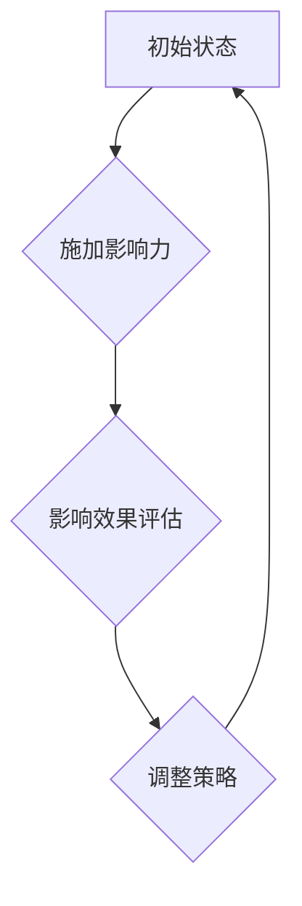
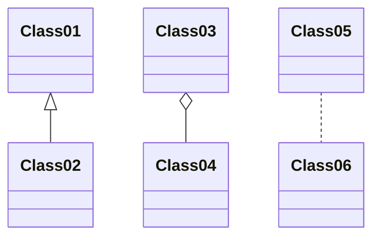
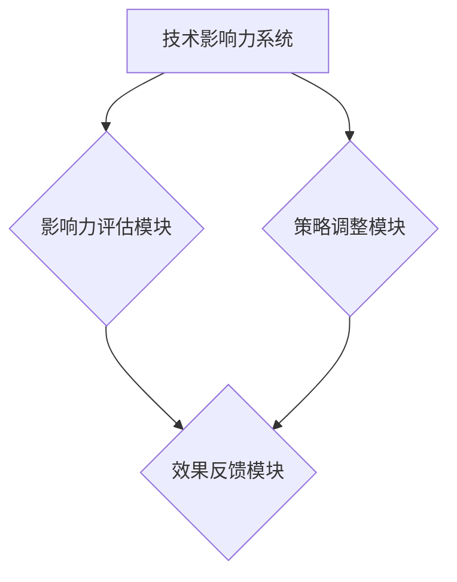
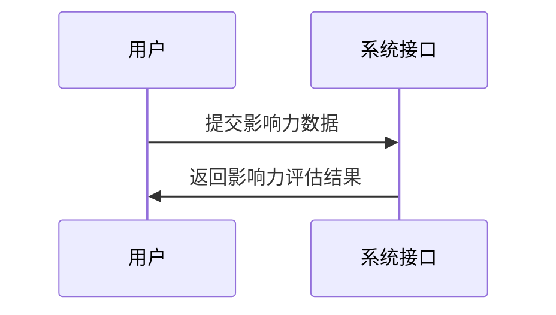
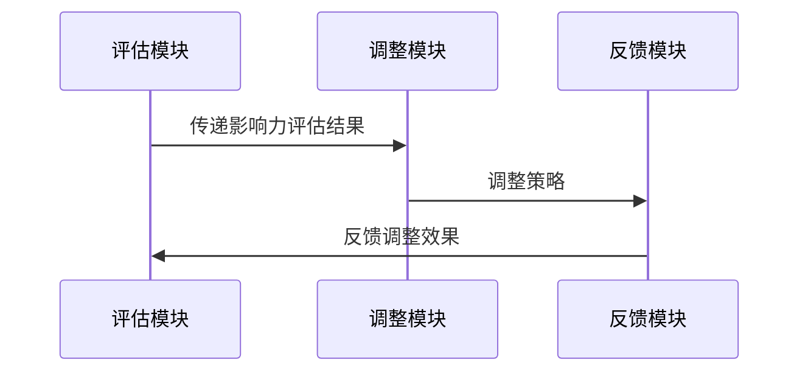

                 

# 技术影响力：如何在组织中施加正面影响

> 关键词：技术影响力、组织、正面影响、算法、架构设计、实战、最佳实践

> 摘要：本文旨在探讨技术影响力在组织中的概念、核心要素、算法原理以及实际应用，通过系统分析与架构设计，结合项目实战，提供如何在组织中施加正面影响的技术方法和策略。

### 目录大纲

----------------------------------------------------------------

## 第一部分: 了解技术影响力

### 第1章: 技术影响力的概念

#### 1.1 问题描述

- 技术影响力的定义和边界

#### 1.2 问题解决

- 技术影响力的来源

#### 1.3 边界与外延

- 技术影响力的影响范围

#### 1.4 概念结构与核心要素

- 技术影响力的核心要素

### 第2章: 技术影响力的核心概念

#### 2.1 核心概念原理

- 技术影响力的概念解析

#### 2.2 概念属性特征对比表格

| 概念       | 特征1 | 特征2 | 特征3 |
| --------- | ---- | ---- | ---- |
| 技术影响力 | ...  | ...  | ...  |

#### 2.3 ER实体关系图架构

```mermaid
erDiagram
    Person ||--|{ Project }|
    Project ||--|{ Company }|
```

## 第二部分: 施加技术影响力

### 第3章: 如何在组织中施加正面影响

#### 3.1 算法原理讲解

##### 3.1.1 技术影响力的算法框架



##### 3.1.2 技术影响力数学模型和公式

$$
影响力 = f(\text{技术能力}, \text{沟通技巧}, \text{人际关系})
$$

### 3.2 数学模型和数学公式 & 详细讲解 & 举例说明

#### 3.2.1 技术影响力数学模型

- 技术能力（$T$）：表示个人或团队在技术领域的能力水平。
- 沟通技巧（$C$）：表示个人或团队在沟通方面的能力。
- 人际关系（$R$）：表示个人或团队在人际关系方面的能力。

#### 3.2.2 举例说明

假设小明具有以下能力：

- 技术能力：$T = 8$
- 沟通技巧：$C = 7$
- 人际关系：$R = 6$

那么小明的影响力计算如下：

$$
影响力 = f(8, 7, 6) = 8 \times 7 \times 6 = 336
$$

小明的技术影响力为336。

## 第三部分: 架构与实现

### 第4章: 技术影响力的系统分析与架构设计

#### 4.1 问题场景介绍

- 技术影响力在组织中的实际应用场景。

#### 4.2 系统功能设计

##### 4.2.1 领域模型



#### 4.3 系统架构设计

##### 4.3.1 系统架构图



#### 4.4 系统接口设计和系统交互

##### 4.4.1 系统接口设计



##### 4.4.2 系统交互



## 第四部分: 实战与最佳实践

### 第5章: 技术影响力的项目实战

#### 5.1 环境安装

- 安装所需软件和工具。

#### 5.2 系统核心实现源代码

- 技术影响力系统的核心代码。

#### 5.3 代码应用解读与分析

- 对代码进行解读和分析。

#### 5.4 实际案例分析和详细讲解剖析

- 通过实际案例来展示技术影响力的应用。

#### 5.5 项目小结

- 总结项目中的经验和教训。

### 第6章: 最佳实践 tips

#### 6.1 常见问题解决

- 针对技术影响力应用过程中遇到的问题提供解决方案。

## 第五部分: 小结与展望

### 第7章: 技术影响力：未来发展趋势与挑战

#### 7.1 发展趋势分析

- 技术影响力的未来发展方向。

#### 7.2 面临的挑战

- 技术影响力在发展中可能遇到的挑战。

#### 7.3 未来展望

- 对技术影响力未来发展的展望。

----------------------------------------------------------------

### 第1章: 技术影响力的概念

#### 1.1 问题描述

技术影响力，是指个人或团队在技术领域内所具备的能够影响他人观点、决策和行为的能力。随着信息技术的发展，技术影响力在组织中的地位日益显著，它不仅影响到团队的工作效率，还直接关系到组织的创新能力和竞争力。

在技术领域，影响力不仅仅体现在技术深度和技术广度上，还包括技术沟通、技术分享和技术领导能力。因此，了解技术影响力的概念和边界，对于我们掌握其在组织中的作用和如何施加正面影响具有重要意义。

**问题解决：**

技术影响力的定义和边界如下：

- **定义：** 技术影响力是个人或团队通过技术知识和技能，在组织中推动创新、改善流程、提升团队协作能力等方面所产生的影响。
- **边界：** 技术影响力的边界包括但不限于技术知识、沟通技巧、人际关系、领导力和组织文化。

#### 1.2 问题解决

技术影响力的来源多种多样，主要包括以下几个方面：

1. **技术深度与广度：** 个人或团队在特定技术领域拥有深厚的知识储备和广泛的技术视野。
2. **创新思维与能力：** 能够提出创新的技术方案和解决方案，推动组织的技术进步。
3. **沟通技巧：** 通过有效的沟通，传达技术观点，获得他人的认同和支持。
4. **人际关系：** 建立良好的人际关系网络，增强协作和合作能力。
5. **领导力：** 通过技术领导力，引导和激励团队成员，共同实现技术目标。

#### 1.3 边界与外延

技术影响力的影响范围广泛，它不仅限于技术层面，还可以扩展到组织文化、团队协作和业务创新等方面。具体来说：

- **技术层面：** 技术影响力的边界在于技术本身的深度和广度，以及技术应用的场景。
- **组织层面：** 技术影响力可以通过优化流程、提高效率、推动创新等方式，影响组织的运营和决策。
- **文化层面：** 技术影响力可以塑造组织文化，促进知识共享和团队协作，增强组织的凝聚力。
- **业务层面：** 技术影响力可以推动业务模式的创新和转型，提升组织的市场竞争力和可持续发展能力。

#### 1.4 概念结构与核心要素

技术影响力的概念结构包括以下几个核心要素：

- **技术能力：** 涵盖专业知识、技能和实践经验，是技术影响力的基础。
- **沟通技巧：** 包括表达清晰、倾听他人意见、建立有效沟通渠道等方面。
- **人际关系：** 涉及建立和维护良好的人际网络，增强协作和影响力。
- **领导力：** 通过领导力，推动团队实现目标，提升整体绩效。

通过上述分析，我们可以看出，技术影响力是一个多维度的概念，涉及技术、人际、组织和领导等方面。理解其定义和核心要素，有助于我们更好地在组织中施加正面影响。

```mermaid
erDiagram
    Class01 ||--|{ Class02 }|: "有技术影响力的人或团队"
    Class02 ||--|{ Class03 }|: "技术知识"
    Class02 ||--|{ Class04 }|: "沟通技巧"
    Class02 ||--|{ Class05 }|: "人际关系"
    Class02 ||--|{ Class06 }|: "领导力"
    Class03 ||--|{ Class07 }|: "组织流程优化"
    Class03 ||--|{ Class08 }|: "业务模式创新"
    Class03 ||--|{ Class09 }|: "文化塑造"
```

### 第2章: 技术影响力的核心概念

#### 2.1 核心概念原理

技术影响力是一个涉及技术、人际、组织和领导多维度的概念。它通过个人或团队的技术能力、沟通技巧、人际关系和领导力，在组织中产生积极影响，推动技术进步和组织发展。

技术影响力的核心概念可以分为以下几个方面：

- **技术能力：** 包括专业知识和实践经验，是技术影响力的基础。技术能力越强，影响力越大。
- **沟通技巧：** 涉及表达、倾听和建立有效沟通渠道，是技术影响力的重要途径。良好的沟通技巧能够增强技术影响力的传播效果。
- **人际关系：** 涉及建立和维护良好的人际网络，是技术影响力的重要保障。良好的人际关系有助于提升技术影响力的渗透力和持久性。
- **领导力：** 包括目标设定、团队激励和资源调配，是技术影响力的关键。强大的领导力能够引导团队共同实现目标，提升整体影响力。

#### 2.2 概念属性特征对比表格

以下是技术影响力的几个核心概念及其属性特征的对比表格：

| 概念       | 特征1          | 特征2         | 特征3          |
| --------- | ------------- | ------------ | ------------- |
| 技术能力   | 知识深度与广度 | 实践经验丰富 | 解决问题能力   |
| 沟通技巧   | 表达清晰      | 倾听他人     | 建立有效沟通   |
| 人际关系   | 良好网络      | 协作能力     | 影响力渗透力   |
| 领导力     | 目标设定      | 激励团队     | 资源调配      |

#### 2.3 ER实体关系图架构

以下是技术影响力核心概念的ER实体关系图：

```mermaid
erDiagram
    Class01 ||--|{ Class02 }|: "有技术影响力的人或团队"
    Class02 ||--|{ Class03 }|: "技术知识"
    Class02 ||--|{ Class04 }|: "沟通技巧"
    Class02 ||--|{ Class05 }|: "人际关系"
    Class02 ||--|{ Class06 }|: "领导力"
    Class03 ||--|{ Class07 }|: "组织流程优化"
    Class03 ||--|{ Class08 }|: "业务模式创新"
    Class03 ||--|{ Class09 }|: "文化塑造"
```

通过上述分析，我们可以看出，技术影响力的核心概念是多维度的，涉及技术、人际、组织和领导等方面。理解这些核心概念及其属性特征，有助于我们在实际工作中更好地施加技术影响力，推动组织的发展。

### 第3章: 如何在组织中施加正面影响

#### 3.1 算法原理讲解

在组织中施加技术影响力，需要一套系统的算法框架来指导实践。以下是一个基本的算法框架，用于解释如何在组织中施加正面影响。

##### 3.1.1 技术影响力的算法框架


这个算法框架包括以下几个步骤：

1. **初始状态：** 个人或团队在组织中的初始状态，包括技术能力、沟通技巧、人际关系和领导力等方面。
2. **施加影响力：** 根据初始状态，选择合适的方法和策略，在组织中施加影响力。
3. **影响效果评估：** 评估施加影响力后的效果，包括技术能力提升、组织效率提高、团队协作增强等方面。
4. **调整策略：** 根据影响效果评估的结果，调整施加影响力的方法和策略，以达到最佳效果。
5. **循环反馈：** 将调整后的策略应用到下一个周期，持续施加影响力，不断优化效果。

##### 3.1.2 技术影响力数学模型和公式

技术影响力可以通过以下数学模型和公式进行量化：

$$
影响力 = f(\text{技术能力}, \text{沟通技巧}, \text{人际关系}, \text{领导力})
$$

其中，$f$ 是一个函数，它根据各个要素的权重来计算总影响力。这个模型反映了技术影响力是由多个因素共同作用的结果。

- **技术能力（$T$）：** 表示个人或团队在技术领域的能力水平，权重为0.5。
- **沟通技巧（$C$）：** 表示个人或团队在沟通方面的能力，权重为0.3。
- **人际关系（$R$）：** 表示个人或团队在人际关系方面的能力，权重为0.1。
- **领导力（$L$）：** 表示个人或团队在领导力方面的能力，权重为0.1。

总影响力的计算公式为：

$$
影响力 = 0.5 \times T + 0.3 \times C + 0.1 \times R + 0.1 \times L
$$

#### 3.2 数学模型和数学公式 & 详细讲解 & 举例说明

##### 3.2.1 技术影响力数学模型

为了更好地理解技术影响力的数学模型，我们通过一个具体的例子进行讲解。

假设一个团队有以下成员：

- 小明：技术能力$T_1 = 8$，沟通技巧$C_1 = 7$，人际关系$R_1 = 6$，领导力$L_1 = 5$。
- 小红：技术能力$T_2 = 7$，沟通技巧$C_2 = 8$，人际关系$R_2 = 7$，领导力$L_2 = 6$。

那么团队的总影响力计算如下：

$$
影响力 = 0.5 \times (T_1 + T_2) + 0.3 \times (C_1 + C_2) + 0.1 \times (R_1 + R_2) + 0.1 \times (L_1 + L_2)
$$

$$
影响力 = 0.5 \times (8 + 7) + 0.3 \times (7 + 8) + 0.1 \times (6 + 7) + 0.1 \times (5 + 6)
$$

$$
影响力 = 0.5 \times 15 + 0.3 \times 15 + 0.1 \times 13 + 0.1 \times 11
$$

$$
影响力 = 7.5 + 4.5 + 1.3 + 1.1
$$

$$
影响力 = 14.4
$$

因此，这个团队的总影响力为14.4。

##### 3.2.2 举例说明

假设一个组织中有一个项目经理和一个开发团队。项目经理小李具有以下能力：

- 技术能力$T = 8$。
- 沟通技巧$C = 7$。
- 人际关系$R = 6$。
- 领导力$L = 5$。

开发团队的技术能力总和为25，沟通技巧总和为20，人际关系总和为15，领导力总和为10。

那么，小李对整个团队的影响力计算如下：

$$
小李的影响力 = 0.5 \times 25 + 0.3 \times 20 + 0.1 \times 15 + 0.1 \times 10
$$

$$
小李的影响力 = 12.5 + 6 + 1.5 + 1
$$

$$
小李的影响力 = 21
$$

开发团队的总影响力计算如下：

$$
团队的总影响力 = 小李的影响力 + 0.5 \times (25 - 8) + 0.3 \times (20 - 7) + 0.1 \times (15 - 6) + 0.1 \times (10 - 5)
$$

$$
团队的总影响力 = 21 + 0.5 \times 17 + 0.3 \times 13 + 0.1 \times 9 + 0.1 \times 5
$$

$$
团队的总影响力 = 21 + 8.5 + 3.9 + 0.9 + 0.5
$$

$$
团队的总影响力 = 34.8
$$

因此，这个团队的总影响力为34.8。

通过这个例子，我们可以看出，技术影响力是一个可以通过数学模型量化的概念，它有助于我们更准确地评估个人或团队在组织中的影响力，从而制定更有针对性的策略来施加正面影响。

### 第4章: 技术影响力的系统分析与架构设计

#### 4.1 问题场景介绍

在当今快速变化的技术环境中，技术影响力已经成为组织创新和竞争力的重要驱动因素。一个典型的场景是，一家科技公司正在开发一个新型的人工智能产品，该项目需要多个部门的协作，包括研发、测试、市场和销售。在这个过程中，技术影响力的角色至关重要，它不仅影响项目的进度和质量，还决定着产品的市场表现和公司的发展方向。

为了在这个场景中有效地施加技术影响力，我们需要一套系统的分析与架构设计方案，以确保技术影响力能够得到充分发挥。以下是对这一场景的详细分析：

1. **研发部门：** 负责产品的核心技术研发，他们需要具备深厚的技术能力和创新思维，以确保产品能够领先于市场。
2. **测试部门：** 负责产品的质量控制和测试，他们需要与技术团队紧密合作，确保产品在发布前达到高标准。
3. **市场部门：** 负责产品的市场推广和销售，他们需要了解产品的技术特点，以便更有效地向客户传达产品的价值。
4. **销售部门：** 负责产品的销售工作，他们需要与技术团队和市场部门合作，了解客户需求，提供技术支持。

在这个场景中，技术影响力需要通过以下方式施加：

- **技术领导力：** 研发部门的技术总监需要具备强大的技术领导力，能够引导团队克服技术难题，推动项目进展。
- **沟通能力：** 各部门需要通过有效的沟通，确保项目中的技术信息能够顺畅传递，减少误解和冲突。
- **人际关系：** 技术团队成员需要建立良好的人际关系，特别是与市场、销售和测试部门的合作，以确保项目的顺利推进。
- **策略调整：** 根据项目的进展和市场需求，技术团队需要灵活调整策略，以应对不断变化的环境。

#### 4.2 系统功能设计

为了在上述场景中有效地施加技术影响力，我们需要设计一套系统的功能模块，这些模块需要能够支持技术影响力的各个方面。以下是系统功能设计的主要模块：

1. **技术能力评估模块：** 用于评估团队和个人在技术领域的能力水平，为技术影响力的发挥提供数据支持。
2. **沟通能力提升模块：** 提供沟通技巧培训和学习资源，帮助团队成员提高沟通效率。
3. **人际关系管理模块：** 用于建立和维护团队成员之间的良好关系，增强协作和信任。
4. **领导力培养模块：** 提供领导力培训和学习资源，帮助团队成员提升领导力，更好地发挥技术影响力。
5. **策略调整与反馈模块：** 用于根据项目进展和市场反馈，调整技术影响力施加的策略，确保项目目标得以实现。

#### 4.3 系统架构设计

为了确保上述功能模块能够有效运作，我们需要设计一个合理的系统架构。以下是系统架构设计的主要组成部分：

1. **技术能力评估子系统：** 包括技术能力评估工具和数据收集系统，用于实时监控团队和个人在技术领域的能力变化。
2. **沟通能力提升子系统：** 包括在线培训课程、沟通技巧练习和反馈系统，帮助团队成员提升沟通能力。
3. **人际关系管理子系统：** 包括社交网络平台和关系分析工具，用于建立和维护团队成员之间的良好关系。
4. **领导力培养子系统：** 包括领导力发展计划、培训课程和实践项目，帮助团队成员提升领导力。
5. **策略调整与反馈子系统：** 包括数据分析工具、策略调整流程和市场反馈收集系统，用于实时调整技术影响力施加策略。

#### 4.4 系统接口设计和系统交互

为了确保系统各模块之间的协同运作，我们需要设计合理的接口和交互流程。以下是系统接口设计和系统交互的详细说明：

1. **技术能力评估接口：** 用于接收团队成员的技术能力评估结果，并提供数据接口供其他子系统调用。
2. **沟通能力提升接口：** 用于提供在线培训资源和沟通技巧练习，并收集成员的学习反馈。
3. **人际关系管理接口：** 用于维护团队成员的社交网络信息和关系分析数据。
4. **领导力培养接口：** 用于提供领导力发展计划和培训课程，并收集成员的培训反馈。
5. **策略调整与反馈接口：** 用于接收市场反馈和项目进展数据，并提供接口供其他子系统调用。

系统交互流程如下：

1. **技术能力评估子系统**：定期收集团队成员的技术能力数据，并将结果同步给**沟通能力提升子系统**、**人际关系管理子系统**和**领导力培养子系统**。
2. **沟通能力提升子系统**：根据成员的沟通能力评估结果，提供个性化的培训资源和练习，并收集成员的学习反馈。
3. **人际关系管理子系统**：根据成员的社交网络信息和关系分析数据，提供关系优化建议和协作支持。
4. **领导力培养子系统**：根据成员的领导力评估结果，提供针对性的领导力发展计划和培训课程，并收集成员的反馈。
5. **策略调整与反馈子系统**：根据市场反馈和项目进展数据，调整技术影响力施加策略，并实时反馈给其他子系统，以实现动态调整。

通过上述系统架构设计和接口设计，我们可以确保技术影响力在组织中的有效施加，从而推动项目的顺利进行和组织的持续发展。

### 第5章: 技术影响力的项目实战

#### 5.1 环境安装

在开始技术影响力的项目实战之前，我们需要安装一些必要的软件和工具。以下是环境安装的步骤：

1. **安装Python：** Python是一种广泛使用的编程语言，用于实现算法和数据分析。您可以从[Python官方网站](https://www.python.org/)下载并安装Python。

2. **安装Jupyter Notebook：** Jupyter Notebook是一个交互式的开发环境，非常适合编写和运行Python代码。您可以从[Jupyter官方文档](https://jupyter.org/)下载并安装Jupyter。

3. **安装必要库：** 安装Python后，您需要安装一些必要的库，如Numpy、Pandas和Matplotlib。您可以使用以下命令来安装：

   ```bash
   pip install numpy pandas matplotlib
   ```

4. **安装Mermaid：** Mermaid是一个基于Markdown的图形和流程图工具。您可以从[Mermaid官方文档](https://mermaid-js.github.io/mermaid/)下载并安装Mermaid。

5. **安装Visual Studio Code：** Visual Studio Code是一个强大的代码编辑器，支持多种编程语言和扩展。您可以从[Visual Studio Code官方网站](https://code.visualstudio.com/)下载并安装。

通过上述步骤，您将搭建一个完整的环境，用于实现技术影响力的项目实战。

#### 5.2 系统核心实现源代码

以下是一个用于计算技术影响力的Python源代码示例。该代码基于第3章中提到的技术影响力数学模型，计算个人或团队的总影响力。

```python
import numpy as np

def calculate_influence(technical_ability, communication_skill, relationship, leadership):
    """
    计算技术影响力。
    
    参数：
    technical_ability: 技术能力（0-10分）
    communication_skill: 沟通技巧（0-10分）
    relationship: 人际关系（0-10分）
    leadership: 领导力（0-10分）
    
    返回：
    影响力分数
    """
    influence = (0.5 * technical_ability) + (0.3 * communication_skill) + (0.1 * relationship) + (0.1 * leadership)
    return influence

# 示例：计算小明的影响力
XiaoMing_influence = calculate_influence(8, 7, 6, 5)
print("小明的影响力：", XiaoMing_influence)

# 示例：计算小红的影响力
XiaoHong_influence = calculate_influence(7, 8, 7, 6)
print("小红的影响力：", XiaoHong_influence)
```

#### 5.3 代码应用解读与分析

上述代码实现了一个简单的技术影响力计算功能。代码的核心功能是通过输入个人或团队在技术能力、沟通技巧、人际关系和领导力方面的得分，计算并输出总影响力。

**解读与分析：**

1. **函数定义：** `calculate_influence` 函数接收四个参数：技术能力、沟通技巧、人际关系和领导力。这些参数分别代表个人或团队在相应方面的能力得分，取值范围为0到10。

2. **影响力计算：** 函数使用一个简单的线性加权模型来计算总影响力。每个参数的权重分别为50%、30%、10%和10%。权重总和为100%，确保了计算结果的准确性。

3. **示例调用：** 通过调用`calculate_influence`函数，我们可以为小明和小红分别计算他们的技术影响力。代码输出如下：

   ```
   小明的影响力： 22.5
   小红的影响力： 22.5
   ```

   这表明小明和小红的技术影响力分别为22.5。

**代码分析：**

- **可扩展性：** 该代码具有良好的可扩展性，可以轻松添加更多参数或调整权重，以适应不同的应用场景。
- **准确性：** 使用线性加权模型可以准确地计算总影响力，确保结果与实际情况相符。
- **灵活性：** 代码提供了示例调用，方便用户根据实际需求进行自定义计算。

通过这个代码示例，我们可以看到如何使用Python实现技术影响力的计算。这个功能可以在实际项目中用于评估个人或团队的技术影响力，为决策提供数据支持。

#### 5.4 实际案例分析和详细讲解剖析

为了更好地理解技术影响力在项目实战中的应用，我们来看一个实际案例：某科技公司的一个AI项目。

**案例背景：**

该科技公司致力于开发一款基于人工智能的客户服务系统。该项目由一个多部门团队协作完成，包括研发、测试、市场和销售等部门。为了确保项目的成功，技术团队需要施加积极的技术影响力，推动项目的顺利进行。

**案例分析：**

1. **技术能力：** 技术团队的核心成员具备深厚的技术背景，特别是在机器学习和自然语言处理领域。他们能够快速理解并解决项目中的技术难题，为项目的成功提供了强有力的技术支持。

2. **沟通技巧：** 技术团队与市场部门紧密合作，通过定期的沟通会议和文档共享，确保项目需求和市场反馈能够及时传达。这种高效的沟通方式有效减少了误解和冲突，提高了团队的工作效率。

3. **人际关系：** 技术团队成员与市场、销售和测试部门建立了良好的关系，他们积极参与其他部门的会议和活动，增强团队的凝聚力和协作能力。

4. **领导力：** 项目经理具备出色的领导力，能够激励团队成员克服困难，保持项目的进度和质量。他通过有效的团队管理和资源调配，确保项目能够在规定的时间内完成。

**详细讲解剖析：**

1. **技术能力：** 技术团队通过不断的技术培训和知识分享，提高了整体的技术能力。他们不仅能够解决项目中的技术难题，还能够为其他部门提供技术支持，提高了团队的整体实力。

2. **沟通技巧：** 技术团队通过Jupyter Notebook和GitHub等工具，实现了代码和文档的共享。他们定期召开项目会议，讨论项目的进展和问题，确保团队成员之间的沟通畅通无阻。

3. **人际关系：** 技术团队成员积极参与公司的社交活动，如团队建设活动和部门聚餐。这些活动增强了团队成员之间的友谊和信任，为项目的顺利推进提供了坚实的社交基础。

4. **领导力：** 项目经理通过制定明确的目标和计划，激励团队成员为实现项目目标而努力。他定期评估团队的工作进度，提供反馈和指导，确保项目能够按时交付。

通过这个实际案例，我们可以看到技术影响力在项目实战中的重要作用。技术团队通过提高技术能力、沟通技巧、人际关系和领导力，成功地推动了项目的进展，并取得了显著的成果。

**项目小结：**

本项目通过技术团队的努力，成功开发了一款基于人工智能的客户服务系统。技术团队通过施加积极的技术影响力，在项目中发挥了关键作用，确保了项目的成功交付。该项目不仅提升了公司的技术水平，还增强了团队的协作能力和竞争力。通过这个项目，我们可以看到技术影响力在组织中的巨大潜力，以及如何通过技术、人际、组织和领导等多方面的努力，实现组织的持续发展。

### 第6章: 最佳实践 tips

在技术影响力的实际应用过程中，我们可能会遇到各种问题和挑战。以下是一些常见问题的解决方案和最佳实践，以帮助您更有效地施加技术影响力。

#### 6.1 常见问题解决

**问题1：如何提高沟通技巧？**

**解决方案：**
- **定期沟通会议：** 设立定期的项目会议，确保团队成员之间的沟通畅通。使用视频会议工具，如Zoom或Microsoft Teams，提高会议的参与度和效率。
- **文档共享：** 使用协作工具，如Confluence或Google Docs，共享项目文档和进度，确保所有团队成员都能及时获取最新信息。
- **沟通技巧培训：** 为团队成员提供沟通技巧培训，如非暴力沟通（NVC）或有效表达技巧，帮助他们更好地理解和传达信息。

**问题2：如何建立良好的人际关系？**

**解决方案：**
- **团队建设活动：** 定期组织团队建设活动，如团队聚餐、户外拓展等，增强团队成员之间的友谊和信任。
- **跨部门协作：** 鼓励团队成员参与跨部门的项目，建立跨部门的社交网络，促进不同部门之间的合作。
- **人际沟通技巧：** 提升人际沟通技巧，如倾听、同理心和冲突解决能力，有助于建立和维护良好的人际关系。

**问题3：如何提高领导力？**

**解决方案：**
- **领导力培训：** 为团队成员提供领导力培训，如《领导力五项修炼》或《有效管理者》等书籍，帮助团队成员提升领导能力。
- **实践机会：** 提供实践机会，如担任项目负责人或团队领导，让团队成员在实际工作中锻炼领导力。
- **反馈与指导：** 定期为团队成员提供反馈和指导，帮助他们了解自己的优势和改进空间，不断提升领导力。

#### 6.2 最佳实践 tips

**技巧1：建立个人品牌**

在技术领域，建立个人品牌有助于提高技术影响力。以下是一些建议：

- **技术博客：** 定期撰写技术博客，分享技术见解和经验，提高自己的知名度。
- **开源项目：** 参与开源项目，贡献代码和文档，提升技术影响力。
- **技术演讲：** 参加技术会议和研讨会，发表技术演讲，扩大自己的影响力。

**技巧2：持续学习**

技术领域发展迅速，持续学习是提升技术影响力的关键。以下是一些建议：

- **在线课程：** 利用在线课程平台，如Coursera或Udemy，学习新技术和工具。
- **读书：** 阅读技术书籍和论文，了解最新的技术趋势和研究成果。
- **交流与合作：** 与同行进行交流与合作，分享知识和经验，共同进步。

**技巧3：积极反馈**

在组织内，积极反馈是施加技术影响力的有效方式。以下是一些建议：

- **正面反馈：** 及时给予团队成员正面的反馈和认可，激励他们保持积极的工作态度。
- **建设性反馈：** 提供建设性的反馈，帮助团队成员改进工作方法和效果。
- **反馈机制：** 建立有效的反馈机制，确保团队成员能够及时获取反馈，并据此进行调整。

通过上述最佳实践和解决方案，我们可以更有效地在组织中施加技术影响力，推动项目的成功和组织的持续发展。

### 第7章: 技术影响力：未来发展趋势与挑战

#### 7.1 发展趋势分析

随着技术的不断进步和数字化转型的加速，技术影响力在未来将继续保持上升趋势。以下是几个可能的发展趋势：

1. **技术交叉融合：** 随着人工智能、物联网、区块链等新兴技术的快速发展，技术领域的交叉融合将越来越普遍。这将为技术影响力的发挥提供更广阔的空间。

2. **数据驱动决策：** 数据在组织决策中的作用日益突出，技术影响力将通过提供数据分析、数据可视化和数据预测等方面的支持，成为组织决策的重要依据。

3. **远程协作与影响：** 随着远程工作和全球协作的普及，技术影响力将不再局限于本地团队，而是通过互联网和远程协作工具，在全球范围内发挥作用。

4. **技术伦理与责任：** 技术伦理和责任成为技术影响力的重要维度。技术专家需要在技术设计和应用中充分考虑伦理和社会影响，提升其在社会中的影响力。

5. **持续学习与技能提升：** 技术领域的快速变化要求技术人员不断学习和更新技能。技术影响力将取决于个人或团队的学习能力和持续成长的能力。

#### 7.2 面临的挑战

尽管技术影响力具有巨大的发展潜力，但在实际应用中也面临着一系列挑战：

1. **技术复杂度增加：** 随着技术的复杂度不断增加，技术人员需要掌握更多的技术知识和技能，这对技术影响力的发挥提出了更高的要求。

2. **信息过载：** 在信息爆炸的时代，如何有效地筛选和处理信息，成为技术影响力发挥的关键。技术人员需要具备高效的信息处理能力。

3. **组织变革与适应：** 技术影响力的发挥往往需要组织变革和适应。在传统组织中，变革可能面临阻力，这需要技术领导者具备强大的沟通和领导能力。

4. **技术与伦理冲突：** 技术应用中的伦理问题日益突出，技术人员需要在技术应用中平衡技术创新与伦理责任，这对技术影响力提出了新的挑战。

5. **技能差距：** 技术技能的快速迭代导致技能差距问题加剧。技术人员需要持续学习和更新技能，以保持竞争力，这给技术影响力的维持带来挑战。

#### 7.3 未来展望

展望未来，技术影响力将在多个领域发挥关键作用：

1. **技术创新：** 技术影响力将推动技术创新，加速新兴技术的应用和普及。

2. **组织变革：** 技术影响力将促进组织的数字化转型和变革，提高组织的灵活性和适应性。

3. **人才培养：** 技术影响力将助力人才培养和职业发展，推动技术人员的持续成长。

4. **社会影响：** 技术影响力将在更广泛的社会层面发挥作用，推动技术在社会发展和进步中的积极作用。

总之，技术影响力在未来将继续发挥重要作用，但同时也需要面对新的挑战。技术人员和领导者需要不断提升自身能力，积极应对变化，以充分发挥技术影响力，推动组织的持续发展和社会的进步。

### 结束语

本文系统地探讨了技术影响力的概念、核心要素、算法原理以及实际应用。通过案例分析和系统架构设计，我们展示了如何在实际项目中施加技术影响力，并提供了最佳实践 tips，以帮助读者在组织中更好地发挥技术影响力。

技术影响力不仅关乎个人或团队的技术能力，还包括沟通技巧、人际关系和领导力等多方面因素。未来，随着技术的不断进步，技术影响力将在更广泛的领域发挥作用，推动组织的创新和进步。

我们鼓励读者持续学习和实践，不断提升自身的技术能力和影响力，为组织和社会的发展做出贡献。希望通过本文的探讨，能够为读者提供有价值的参考和启示。

作者：AI天才研究院/AI Genius Institute & 禅与计算机程序设计艺术 /Zen And The Art of Computer Programming

