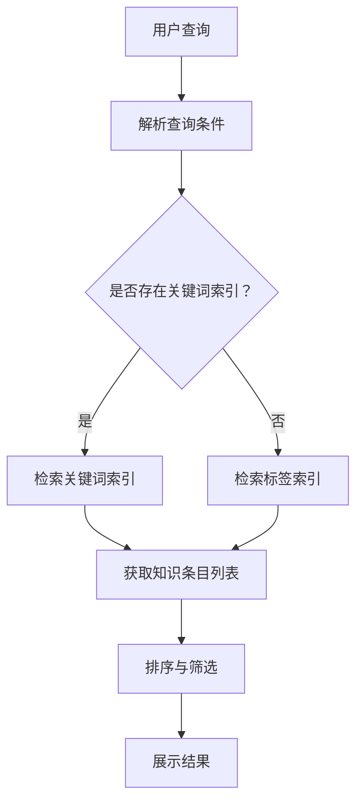
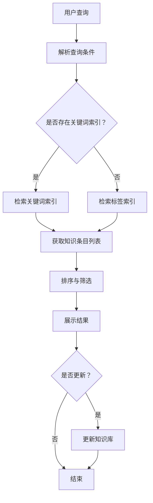
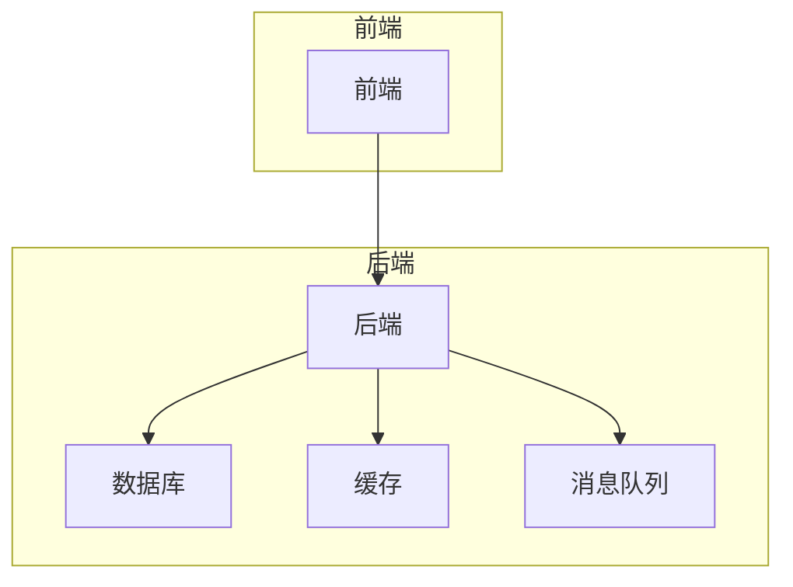

                 

## # 技术文档管理与知识沉淀的方法

---

**关键词**: 技术文档，知识沉淀，文档管理，知识管理，最佳实践

**摘要**:

本文深入探讨了技术文档管理与知识沉淀的重要性，以及如何通过有效的策略和方法实现这一目标。文章首先介绍了技术文档的基本概念和其在企业中的关键作用。随后，文章详细分析了知识沉淀的必要性和策略，包括知识积累、共享与传承。接着，文章重点探讨了技术文档管理的最佳实践，包括文档的组织、版本控制、工具选择等方面。最后，文章通过实际案例展示了技术文档管理与知识沉淀的具体实施过程，并提供了一些实用的技巧和总结。

---

## 引言：技术文档管理的必要性

### 技术文档的定义

技术文档是指以文本、图像、图表等形式记录的技术信息，它涵盖了软件开发、硬件维护、系统设计、用户手册等多个方面。技术文档不仅包括正式的文档，如用户手册、API 文档、设计文档等，还包括非正式的笔记、邮件、会议记录等。

### 技术文档在企业中的重要性

1. **知识传递**：技术文档是知识传递的重要手段，它帮助新员工快速上手，确保团队之间的信息畅通。
2. **问题解决**：详细的技术文档可以快速定位问题，提高问题解决的效率。
3. **项目管理**：技术文档是项目管理的重要基础，它帮助项目经理跟踪项目进度，确保项目按时交付。
4. **合规性**：许多行业要求企业提供详细的技术文档，以证明其产品或服务的合规性。
5. **创新与改进**：技术文档为技术创新提供了坚实的基础，通过总结历史经验和最佳实践，促进持续改进。

### 技术文档管理的挑战

1. **文档数量庞大**：随着项目复杂度的增加，技术文档的数量也急剧上升，管理难度加大。
2. **版本控制**：不同版本的技术文档往往并存，版本控制不当会导致信息混乱。
3. **文档更新不及时**：技术文档的更新往往滞后于实际的开发进度，导致信息过时。
4. **缺乏标准化**：不同团队或个人编写的文档风格各异，缺乏统一的格式和规范。
5. **知识孤岛**：技术文档往往分散在不同地点和人员手中，知识难以共享和沉淀。

## 第二章：知识沉淀的重要性与策略

### 知识沉淀的定义

知识沉淀是指将工作中的经验、教训、最佳实践等转化为可存储、可共享、可复用的知识，以促进团队协作和知识传承。

### 知识沉淀的必要性

1. **减少重复劳动**：通过沉淀知识，可以避免重复的问题和错误，提高工作效率。
2. **提高团队协作效率**：共享知识可以促进团队之间的协作，减少沟通成本。
3. **促进个人成长**：知识沉淀可以帮助团队成员不断提升自己的技能和经验。
4. **应对人员流动**：知识沉淀有助于应对人员流动，确保团队的核心知识不会因人员变动而流失。

### 知识沉淀的策略

1. **定期总结**：定期对项目进行总结，记录成功经验和教训。
2. **文档化**：将知识以文档的形式进行记录，确保知识的可检索性和可共享性。
3. **知识分享**：通过内部会议、分享会、博客等形式，促进知识的传播和共享。
4. **建立知识库**：建立一个集中的知识库，存储和管理各类知识，方便团队成员查阅和使用。
5. **鼓励反馈**：鼓励团队成员对知识库中的知识进行评论和补充，确保知识的准确性和及时性。

## 第三章：技术文档管理的最佳实践

### 文档的组织与分类

1. **按项目分类**：将文档按项目进行分类，方便项目成员查找和使用。
2. **按文档类型分类**：将文档按类型进行分类，如用户手册、设计文档、测试文档等。
3. **使用标签和关键词**：为文档添加标签和关键词，提高文档的检索效率。

### 版本控制

1. **使用版本控制系统**：如Git，确保文档的版本可追溯，方便管理和更新。
2. **文档版本命名规则**：制定统一的版本命名规则，如`v1.0`, `v1.1`等。
3. **版本更新记录**：记录每次版本更新的内容，方便追溯和审查。

### 工具选择

1. **文档编辑工具**：如Microsoft Word、Google Docs等，支持多人协作编辑。
2. **文档管理平台**：如Confluence、SharePoint等，提供文档存储、共享、搜索等功能。
3. **版本控制工具**：如Git、Svn等，确保文档的版本可追溯和管理。

### 文档规范

1. **文档格式规范**：制定统一的文档格式规范，如字体、字号、行距等。
2. **文档编写指南**：制定文档编写指南，确保文档的结构和内容一致。
3. **文档审核机制**：建立文档审核机制，确保文档的质量和准确性。

### 文档更新与维护

1. **定期更新**：定期对文档进行更新，确保其与实际情况一致。
2. **责任分配**：明确每个文档的负责人，确保文档的更新和维护。
3. **版本迭代**：采用版本迭代的方式，逐步完善文档。

## 第四章：知识沉淀与传承

### 建立知识库

1. **选择合适的知识库工具**：如Wiki、知识库系统等。
2. **知识分类**：对知识进行分类，便于查阅和使用。
3. **知识更新**：定期对知识库中的知识进行更新，保持知识的时效性。

### 知识分享与传播

1. **内部培训**：定期组织内部培训，分享团队的知识和经验。
2. **分享会**：定期举办分享会，邀请团队成员分享自己的经验和心得。
3. **内部博客**：鼓励团队成员撰写博客，记录自己的工作经验和技术见解。

### 知识传承

1. **师徒制度**：建立师徒制度，帮助新员工快速上手。
2. **经验传承**：鼓励有经验的员工将自己的经验和教训传授给新员工。
3. **文档化**：将经验和教训以文档的形式进行记录，确保其得到传承。

## 第五章：实际案例与实施步骤

### 案例背景

某大型互联网公司需要对其技术文档进行管理和知识沉淀，以提高团队协作效率和知识传承效果。

### 实施步骤

1. **需求分析**：分析公司的技术文档现状，确定管理目标和需求。
2. **工具选型**：选择合适的文档管理工具和知识库系统。
3. **文档整理**：整理现有文档，进行分类和归档。
4. **版本控制**：引入版本控制系统，确保文档的版本可追溯和管理。
5. **培训与推广**：对团队成员进行培训，推广技术文档管理和知识沉淀的最佳实践。
6. **持续优化**：根据反馈和实际使用情况，不断优化文档管理流程和知识库系统。

### 案例总结

通过有效的技术文档管理和知识沉淀，该公司显著提高了团队协作效率，减少了知识流失，为企业的持续发展奠定了坚实基础。

## 第六章：最佳实践与注意事项

### 最佳实践

1. **明确文档管理目标**：确保文档管理目标的明确性和可实现性。
2. **建立规范和流程**：制定统一的文档规范和流程，确保文档的一致性和可维护性。
3. **持续培训与改进**：定期对团队成员进行培训，鼓励创新和改进。
4. **重视知识传承**：通过多种方式促进知识的传承和共享。

### 注意事项

1. **文档质量**：确保文档的质量，避免信息过时和错误。
2. **文档更新**：定期更新文档，确保其与实际情况一致。
3. **权限管理**：合理设置文档权限，确保信息安全。
4. **备份与恢复**：定期备份文档，确保数据安全。

## 第七章：拓展阅读

1. **《技术写作：从入门到精通》**
2. **《知识管理与组织学习》**
3. **《Git 实用指南》**
4. **《Confluence 实用教程》**
5. **《敏捷开发与文档管理》**

---

**作者：AI天才研究院/AI Genius Institute & 禅与计算机程序设计艺术 /Zen And The Art of Computer Programming**## 第二章：知识沉淀的重要性与策略

### 知识沉淀的定义

知识沉淀是指将工作中的经验、教训、最佳实践等转化为可存储、可共享、可复用的知识，以促进团队协作和知识传承。知识沉淀不仅仅是简单的文档编写，它更强调知识的结构化、系统化和可检索性。

### 知识沉淀的必要性

在快速发展的技术环境中，知识沉淀显得尤为重要。以下是知识沉淀的几个必要性：

1. **减少重复劳动**：通过沉淀知识，可以避免重复的问题和错误，提高工作效率。
2. **提高团队协作效率**：共享知识可以促进团队之间的协作，减少沟通成本。
3. **促进个人成长**：知识沉淀可以帮助团队成员不断提升自己的技能和经验。
4. **应对人员流动**：知识沉淀有助于应对人员流动，确保团队的核心知识不会因人员变动而流失。

### 知识沉淀的策略

1. **定期总结**：定期对项目进行总结，记录成功经验和教训。总结可以帮助团队从过去的实践中学习，并为未来的工作提供参考。

2. **文档化**：将知识以文档的形式进行记录，确保知识的可存储性和可共享性。文档化的知识可以方便团队成员查阅和使用，从而提高团队的整体效率。

3. **知识分享**：通过内部会议、分享会、博客等形式，促进知识的传播和共享。知识分享是知识沉淀的重要环节，它可以帮助团队成员快速获取所需信息。

4. **建立知识库**：建立一个集中的知识库，存储和管理各类知识，方便团队成员查阅和使用。知识库应具备良好的分类和检索功能，以便快速找到所需信息。

5. **鼓励反馈**：鼓励团队成员对知识库中的知识进行评论和补充，确保知识的准确性和及时性。反馈机制可以促进知识的不断完善和更新。

### 知识沉淀的具体实施方法

1. **文档编写与维护**：制定统一的文档编写规范，确保文档的结构和内容一致。定期更新文档，确保其与实际情况一致。

2. **知识库建设**：选择合适的知识库工具，如Wiki或知识库系统，建立集中存储和管理知识的基础设施。知识库应具备分类和检索功能，方便团队成员快速查找所需信息。

3. **知识共享会议**：定期举办知识共享会议，邀请团队成员分享自己的经验和心得。会议形式可以多样化，如主题分享、案例讨论等。

4. **内部博客**：鼓励团队成员撰写博客，记录自己的工作经验和技术见解。博客可以作为知识沉淀的重要渠道，促进知识的传播和共享。

5. **在线培训**：定期组织在线培训，分享团队的知识和经验。培训内容可以涵盖新技术、新工具、新方法等，帮助团队成员不断提升自己的技能和知识。

### 知识沉淀的挑战与解决方案

1. **知识分散**：团队成员的知识往往分散在不同地点和工具中，难以统一管理和查找。解决方案：建立统一的知识库，集中存储和管理各类知识。

2. **知识更新不及时**：知识沉淀过程中，知识更新不及时会导致信息过时和错误。解决方案：制定文档更新机制，确保知识库中的知识及时更新。

3. **知识共享障碍**：团队成员之间的知识共享可能存在障碍，如沟通不畅、利益冲突等。解决方案：建立良好的沟通机制，鼓励团队成员积极参与知识共享。

4. **知识传承困难**：在人员流动较大的团队中，知识传承可能面临困难。解决方案：建立师徒制度，鼓励有经验的员工将自己的经验和教训传授给新员工。

### 知识沉淀的收益

1. **提高工作效率**：通过知识沉淀，团队成员可以快速获取所需信息，减少沟通成本，提高工作效率。
2. **促进团队协作**：知识沉淀有助于团队之间的协作，促进知识的共享和传承，提升团队的整体效能。
3. **知识传承与积累**：知识沉淀有助于将团队的核心知识积累下来，为未来的工作提供坚实的基础。
4. **个人成长与发展**：知识沉淀是团队成员个人成长的重要途径，通过记录和分享自己的经验和心得，不断提升自己的技能和知识。

### 知识沉淀的最佳实践

1. **定期总结与回顾**：定期对项目进行总结和回顾，记录成功经验和教训，确保知识沉淀的持续性和有效性。
2. **文档编写规范**：制定统一的文档编写规范，确保文档的结构和内容一致，提高知识沉淀的质量。
3. **知识库建设与维护**：建立集中存储和管理知识的知识库，确保知识库的分类和检索功能，方便团队成员快速查找所需信息。
4. **知识共享机制**：建立有效的知识共享机制，如内部会议、分享会、博客等，促进知识的传播和共享。
5. **在线培训与学习**：定期组织在线培训和学习，分享团队的知识和经验，帮助团队成员不断提升自己的技能和知识。

通过以上策略和方法的实施，企业可以有效实现技术文档管理与知识沉淀，为团队的持续发展和创新提供有力支持。

### 背景介绍

在当今快速发展的技术环境中，知识管理已经成为企业提升竞争力的重要手段。知识沉淀作为知识管理的一部分，其重要性不容忽视。以下是知识沉淀的背景介绍：

1. **技术变革的加速**：随着信息技术的发展，技术变革的速度越来越快。新的技术、工具和方法层出不穷，企业需要不断学习和更新知识，以保持竞争力。
2. **知识分散与流失**：在快速发展的环境中，知识往往分散在不同地点和人员手中，且容易因人员流动而流失。这给企业的知识管理带来了巨大的挑战。
3. **团队协作与共享**：团队协作是现代企业运作的重要方式。有效的知识沉淀可以帮助团队之间实现更好的协作和共享，减少沟通成本，提高工作效率。
4. **持续学习与成长**：知识沉淀不仅有助于团队的工作，还能促进团队成员的持续学习和成长。通过记录和分享工作经验和心得，团队成员可以不断提升自己的技能和知识水平。

### 问题与问题描述

在知识沉淀的过程中，企业可能面临以下问题和挑战：

1. **知识分散**：团队成员的知识分散在不同地点和工具中，难以统一管理和查找。这导致知识共享和传承的难度增加。
2. **知识更新不及时**：知识沉淀过程中，知识更新不及时会导致信息过时和错误，影响团队的工作效率。
3. **知识共享障碍**：团队成员之间的知识共享可能存在障碍，如沟通不畅、利益冲突等。这限制了知识的传播和利用。
4. **知识传承困难**：在人员流动较大的团队中，知识传承可能面临困难。这可能导致团队的核心知识流失，影响团队的整体效能。

### 问题解决

为了解决上述问题，企业可以采取以下措施：

1. **建立知识库**：建立统一的知识库，集中存储和管理各类知识。知识库应具备分类和检索功能，方便团队成员快速查找所需信息。
2. **制定文档编写规范**：制定统一的文档编写规范，确保文档的结构和内容一致。定期更新文档，确保其与实际情况一致。
3. **建立知识共享机制**：建立有效的知识共享机制，如内部会议、分享会、博客等。鼓励团队成员积极参与知识共享，促进知识的传播和利用。
4. **定期培训与学习**：定期组织在线培训和学习，分享团队的知识和经验，帮助团队成员不断提升自己的技能和知识水平。
5. **建立师徒制度**：在人员流动较大的团队中，建立师徒制度，鼓励有经验的员工将自己的经验和教训传授给新员工。这有助于知识的传承和积累。

### 边界与外延

1. **知识沉淀的范围**：知识沉淀不仅包括技术文档，还包括项目经验、最佳实践、工作方法等。这些知识应以文档化的形式进行记录和存储。
2. **知识沉淀的工具**：知识沉淀可以借助各种工具实现，如Wiki、知识库系统、文档管理平台等。选择合适的工具，可以提高知识沉淀的效率和质量。
3. **知识沉淀的周期**：知识沉淀是一个持续的过程，需要定期进行总结、更新和分享。只有保持知识沉淀的动态性，才能确保其价值最大化。

### 概念结构与核心要素组成

知识沉淀的核心概念结构包括以下要素：

1. **知识分类**：对知识进行分类，如技术知识、业务知识、管理知识等。分类有助于知识的管理和查找。
2. **知识库**：知识库是知识沉淀的核心载体，应具备良好的分类和检索功能，方便团队成员快速查找所需信息。
3. **文档编写规范**：制定统一的文档编写规范，确保文档的结构和内容一致，提高知识沉淀的质量。
4. **知识共享机制**：建立有效的知识共享机制，如内部会议、分享会、博客等，促进知识的传播和利用。
5. **定期培训与学习**：定期组织培训和学习，分享团队的知识和经验，帮助团队成员不断提升自己的技能和知识水平。
6. **师徒制度**：在人员流动较大的团队中，建立师徒制度，鼓励有经验的员工将自己的经验和教训传授给新员工。

通过以上要素的有机结合，企业可以实现有效的知识沉淀，为团队的持续发展和创新提供有力支持。

### 核心概念原理

知识沉淀的核心概念原理主要包括知识的结构化、可检索性和可复用性。以下是这些核心概念的详细解释：

1. **知识的结构化**：知识结构化是将零散的知识进行整理和分类，形成系统化、模块化的知识体系。结构化知识有助于提高知识的可理解性和可访问性，便于团队成员快速获取所需信息。

2. **知识的可检索性**：知识的可检索性是指知识库或文档系统应具备高效的搜索和查找功能，使团队成员能够快速定位所需知识。可检索性是知识沉淀的重要保障，直接影响到知识共享的效率和效果。

3. **知识的可复用性**：知识的可复用性是指知识在被沉淀后，能够被多次使用和分享，从而实现知识的最大化价值。可复用性要求知识沉淀过程中注重知识的通用性和适应性，以便在不同项目和团队中推广应用。

### 概念属性特征对比表格

| 概念         | 特征                          | 对比                |
| ------------ | ----------------------------- | ------------------ |
| 知识结构化   | 系统化、模块化、可理解性      | 知识零散、难理解   |
| 知识可检索性 | 高效搜索、快速定位、便捷性   | 查找困难、效率低  |
| 知识可复用性 | 多次使用、广泛分享、价值最大化 | 单次使用、局限性强 |

### ER实体关系图架构

以下是一个简化的知识沉淀系统的ER实体关系图架构，用于展示不同实体之间的关系：

```mermaid
erDiagram
  Category ||--|{ Knowledge }
  Knowledge ||--|{ Document }
  Document ||--|{ Tag }
  Tag ||--|{ User }
  User ||--|{ Role }
```

在上述ER图中，`Category`表示知识分类，`Knowledge`表示知识条目，`Document`表示知识文档，`Tag`表示标签，`User`表示用户，`Role`表示用户角色。通过这种结构化的关系，可以有效地组织和管理知识沉淀系统中的各类实体。

### 算法原理讲解

知识沉淀系统的核心在于如何高效地组织、管理和检索知识。以下是一个简化的算法原理，用于解释知识沉淀系统的运作机制：

1. **知识分类与组织**：将知识按主题、领域或功能进行分类，形成层次化的知识结构。分类有助于提高知识的可理解性和可访问性。

2. **知识索引**：为每个知识条目创建索引，实现快速检索。索引通常包含关键词、标签、分类等信息，有助于提高检索效率。

3. **知识检索**：利用索引进行知识检索，实现高效的知识查找。检索算法可以根据关键词、标签、分类等多种条件进行组合查询，满足多样化的需求。

4. **知识更新**：定期更新知识库，确保知识的时效性和准确性。知识更新机制可以包括手动更新和自动化更新两种方式，以适应不同的需求和场景。

以下是一个使用Mermaid绘制的知识检索流程图：



### 算法流程图

以下是一个简化的知识沉淀系统的算法流程图，用于展示知识检索和更新的过程：



### 算法原理详细说明

1. **解析查询条件**：系统首先接收用户的查询请求，解析查询条件，如关键词、标签、分类等。这一步骤是后续检索的基础。

2. **检索关键词索引**：如果查询条件包含关键词，系统会检索关键词索引，获取与关键词相关的知识条目列表。关键词索引通常采用倒排索引技术实现，以提高检索效率。

3. **检索标签索引**：如果查询条件包含标签，系统会检索标签索引，获取与标签相关的知识条目列表。标签索引通常采用哈希表实现，便于快速查找。

4. **排序与筛选**：系统对检索到的知识条目列表进行排序和筛选，按照相关性、时效性等因素进行排序，筛选出最符合用户需求的条目。

5. **展示结果**：系统将排序和筛选后的知识条目列表展示给用户，用户可以根据结果进行进一步的查询和阅读。

6. **更新知识库**：如果系统检测到知识库需要更新，会执行更新操作。更新操作可以是手动更新，也可以是自动化更新，如定期从数据库同步最新知识。

### 算法原理举例说明

假设用户查询关键词“数据库”，以下是一个简化的算法流程：

1. **解析查询条件**：用户输入关键词“数据库”，系统解析查询条件，生成查询请求。

2. **检索关键词索引**：系统检索关键词索引，获取包含“数据库”关键词的所有知识条目。

3. **排序与筛选**：系统对知识条目列表按照相关性进行排序，筛选出最相关的条目，如数据库的设计原则、数据库的性能优化等。

4. **展示结果**：系统将排序和筛选后的知识条目列表展示给用户，用户可以查看具体内容。

5. **更新知识库**：如果系统检测到知识库需要更新，会执行更新操作，将最新知识同步到知识库中。

通过上述步骤，用户可以快速、准确地获取所需知识，从而提高工作效率。

### 数学模型与公式

在知识沉淀系统中，数学模型和公式可以帮助我们更好地理解和优化知识检索和更新过程。以下是一些常用的数学模型和公式：

1. **向量空间模型**：向量空间模型是一种常用的文本检索模型，它将文本转换为向量表示，然后通过计算向量之间的相似度来实现文本检索。公式如下：

   $$similarity = \frac{cos(\theta)}{\|v_1\|\|v_2\|}$$

   其中，$v_1$和$v_2$是两个文本的向量表示，$\theta$是它们之间的夹角。

2. **余弦相似度**：余弦相似度是向量空间模型中的一种相似度计算方法，用于衡量两个向量的相似程度。公式如下：

   $$cos(\theta) = \frac{v_1 \cdot v_2}{\|v_1\|\|v_2\|}$$

   其中，$v_1 \cdot v_2$表示向量的点积，$\|v_1\|$和$\|v_2\|$分别表示向量的模。

3. **贝叶斯定理**：贝叶斯定理是一种用于概率推理的公式，它可以用来计算后验概率。在知识沉淀系统中，贝叶斯定理可以用于计算知识条目的可信度。公式如下：

   $$P(A|B) = \frac{P(B|A)P(A)}{P(B)}$$

   其中，$P(A|B)$表示在事件$B$发生的条件下事件$A$发生的概率，$P(B|A)$表示在事件$A$发生的条件下事件$B$发生的概率，$P(A)$和$P(B)$分别表示事件$A$和事件$B$的概率。

4. **信息增益**：信息增益是一种衡量特征重要性的指标，它可以帮助我们选择最有用的特征。公式如下：

   $$Gain(D, A) = entropy(D) - entropy(D|A)$$

   其中，$D$表示数据集，$A$表示特征，$entropy(D)$表示数据集的熵，$entropy(D|A)$表示在特征$A$的条件下的数据集熵。

5. **协同过滤**：协同过滤是一种常用的推荐系统算法，它通过用户的行为数据预测用户对项目的偏好。公式如下：

   $$rating_{u,i} = \mu + b_u + b_i + \sum_{j \in N(i)} \sim u (r_{uj} - b_u - b_i) \cdot w_{uj}$$

   其中，$rating_{u,i}$表示用户$u$对项目$i$的预测评分，$\mu$表示所有用户对项目的平均评分，$b_u$和$b_i$分别表示用户$u$和项目$i$的偏置，$N(i)$表示与项目$i$相关的用户集合，$r_{uj}$表示用户$u$对项目$j$的实际评分，$w_{uj}$表示用户$u$和项目$j$的相似度权重。

通过上述数学模型和公式，我们可以更好地理解和优化知识沉淀系统中的各种计算和推理过程。

### 系统分析与架构设计

在实现知识沉淀系统时，我们需要对系统进行详细的分析和设计，确保其能够满足需求并具有良好的性能和可扩展性。

#### 系统场景介绍

假设我们要开发一个企业内部的知识沉淀系统，该系统需要支持以下功能：

1. **文档管理**：用户可以上传、编辑、删除和检索文档。
2. **知识分类**：系统应支持文档的分类，方便用户查找和管理。
3. **知识共享**：用户可以查看其他用户的文档，并能够进行评论和反馈。
4. **权限控制**：系统应具备权限控制功能，确保文档的安全和隐私。
5. **统计分析**：系统应提供文档访问量和用户活跃度的统计分析，帮助管理者了解系统使用情况。

#### 项目介绍

项目名称：企业内部知识沉淀系统

项目目标：开发一个高效、易用、安全的知识沉淀系统，支持文档管理、知识分类、知识共享和权限控制等功能。

项目范围：主要包括前端界面、后端服务、数据库设计和系统测试等。

项目期限：6个月

项目团队成员：项目经理、前端开发人员、后端开发人员、数据库管理员和测试人员。

#### 系统功能设计（领域模型）

在系统功能设计中，我们使用领域模型来描述系统的核心功能及其关系。以下是一个简化的领域模型，展示了系统的主要实体和关系：

```mermaid
classDiagram
    User <<class>> 用户
    Document <<class>> 文档
    Category <<class>> 分类
    Comment <<class>> 评论
    Role <<class>> 角色
    Permission <<class>> 权限

    User o--o Document: 创建文档
    User o--o Comment: 发表评论
    Document o--o Comment: 文档评论
    Document o--o Category: 分类
    Category o--o Document: 分类文档
    Role o--o Permission: 角色权限
    User o--o Role: 用户角色
    Permission o--o Role: 权限角色
```

#### 系统架构设计

系统架构设计是确保系统高效、可扩展和可靠的关键。以下是一个简化的系统架构，包括前端、后端和数据库层：

1. **前端**：前端负责展示用户界面，实现用户与系统的交互。前端可以使用Vue、React等前端框架，提供友好的用户界面和便捷的操作体验。
2. **后端**：后端负责处理业务逻辑、数据存储和接口调用。后端可以使用Spring Boot、Django等框架，实现系统的核心功能，如文档管理、分类管理、评论管理等。
3. **数据库**：数据库用于存储用户数据、文档数据、评论数据等。可以使用MySQL、PostgreSQL等关系型数据库，确保数据的安全性和一致性。
4. **缓存**：缓存层用于提高系统的响应速度。可以使用Redis等缓存系统，存储热点数据和会话信息。
5. **消息队列**：消息队列用于处理异步任务和分布式消息传递。可以使用RabbitMQ、Kafka等消息队列系统，确保系统的高可用性和可靠性。

#### 系统架构图

以下是一个简化的系统架构图，展示了前端、后端、数据库、缓存和消息队列等部分的关系：



#### 系统接口设计

系统接口设计是确保前后端有效交互和系统功能实现的关键。以下是一个简化的接口设计，包括主要接口及其功能：

1. **文档管理接口**：
   - **上传文档**：接收用户上传的文档，存储到数据库。
   - **获取文档列表**：根据分类和权限，返回用户可访问的文档列表。
   - **编辑文档**：根据用户权限，更新文档内容。
   - **删除文档**：根据用户权限，删除文档。

2. **分类管理接口**：
   - **创建分类**：创建新的分类。
   - **获取分类列表**：返回所有分类及其文档数量。
   - **更新分类**：根据用户权限，更新分类名称或描述。
   - **删除分类**：根据用户权限，删除分类。

3. **评论管理接口**：
   - **发表评论**：用户对文档发表评论。
   - **获取评论列表**：根据文档ID，返回评论列表。
   - **删除评论**：根据用户权限，删除评论。

4. **权限管理接口**：
   - **创建角色**：创建新的角色。
   - **获取角色列表**：返回所有角色及其权限。
   - **更新角色**：根据用户权限，更新角色权限。
   - **删除角色**：根据用户权限，删除角色。

#### 系统交互设计

系统交互设计是确保各个组件协同工作、实现系统功能的关键。以下是一个简化的系统交互设计，展示了用户与系统的交互流程：

1. **用户登录**：用户通过前端界面输入用户名和密码，后端验证用户身份，返回用户信息。
2. **用户访问文档**：用户在文档列表中选择文档，后端根据用户权限和分类返回文档内容。
3. **用户评论文档**：用户在文档页面发表评论，后端存储评论并返回评论列表。
4. **管理员管理分类和权限**：管理员通过后端界面创建、更新和删除分类和角色，分配权限。
5. **统计分析**：系统定期统计文档访问量和用户活跃度，生成报表。

通过以上系统分析、架构设计和接口设计，我们可以构建一个高效、可扩展、安全的知识沉淀系统，满足企业的知识管理需求。

### 项目实战

#### 环境安装

为了完成本项目的实战，我们需要准备以下环境：

1. **操作系统**：Ubuntu 20.04 或 CentOS 8
2. **开发工具**：Python 3.8、Docker 19.03、Nginx 1.18
3. **数据库**：MySQL 8.0
4. **缓存**：Redis 6.0
5. **消息队列**：RabbitMQ 3.8

#### 步骤 1：搭建开发环境

首先，我们需要安装Python、Docker、Nginx、MySQL、Redis和RabbitMQ。以下是具体的安装步骤：

1. **安装Python 3.8**：

   ```bash
   sudo apt update
   sudo apt install python3.8
   sudo python3.8 -m pip install --user -U pip
   ```

2. **安装Docker**：

   ```bash
   sudo apt install docker.io
   sudo systemctl start docker
   sudo systemctl enable docker
   ```

3. **安装Nginx**：

   ```bash
   sudo apt install nginx
   sudo systemctl start nginx
   sudo systemctl enable nginx
   ```

4. **安装MySQL 8.0**：

   ```bash
   sudo apt install mysql-server
   sudo mysql_secure_installation
   ```

5. **安装Redis 6.0**：

   ```bash
   sudo apt install redis-server
   sudo systemctl start redis-server
   sudo systemctl enable redis-server
   ```

6. **安装RabbitMQ 3.8**：

   ```bash
   sudo apt install rabbitmq-server
   sudo systemctl start rabbitmq-server
   sudo systemctl enable rabbitmq-server
   ```

#### 步骤 2：创建项目结构

接下来，我们需要创建项目目录并安装必要的依赖：

```bash
mkdir -p /opt/knowledge-management-system
cd /opt/knowledge-management-system
pip install -r requirements.txt
```

#### 步骤 3：初始化数据库

首先，我们需要创建数据库和表结构。以下是数据库初始化的SQL脚本：

```sql
CREATE DATABASE IF NOT EXISTS knowledge_management;

USE knowledge_management;

CREATE TABLE IF NOT EXISTS users (
    id INT AUTO_INCREMENT PRIMARY KEY,
    username VARCHAR(50) NOT NULL,
    password VARCHAR(255) NOT NULL,
    email VARCHAR(100) NOT NULL,
    role ENUM('admin', 'editor', 'viewer') NOT NULL,
    created_at TIMESTAMP DEFAULT CURRENT_TIMESTAMP
);

CREATE TABLE IF NOT EXISTS documents (
    id INT AUTO_INCREMENT PRIMARY KEY,
    title VARCHAR(255) NOT NULL,
    content TEXT NOT NULL,
    category_id INT,
    user_id INT,
    created_at TIMESTAMP DEFAULT CURRENT_TIMESTAMP,
    FOREIGN KEY (category_id) REFERENCES categories(id),
    FOREIGN KEY (user_id) REFERENCES users(id)
);

CREATE TABLE IF NOT EXISTS categories (
    id INT AUTO_INCREMENT PRIMARY KEY,
    name VARCHAR(100) NOT NULL,
    created_at TIMESTAMP DEFAULT CURRENT_TIMESTAMP
);

CREATE TABLE IF NOT EXISTS comments (
    id INT AUTO_INCREMENT PRIMARY KEY,
    content TEXT NOT NULL,
    user_id INT,
    document_id INT,
    created_at TIMESTAMP DEFAULT CURRENT_TIMESTAMP,
    FOREIGN KEY (user_id) REFERENCES users(id),
    FOREIGN KEY (document_id) REFERENCES documents(id)
);

CREATE TABLE IF NOT EXISTS roles (
    id INT AUTO_INCREMENT PRIMARY KEY,
    name VARCHAR(100) NOT NULL
);

CREATE TABLE IF NOT EXISTS role_permissions (
    role_id INT,
    permission_id INT,
    FOREIGN KEY (role_id) REFERENCES roles(id),
    FOREIGN KEY (permission_id) REFERENCES permissions(id)
);

CREATE TABLE IF NOT EXISTS permissions (
    id INT AUTO_INCREMENT PRIMARY KEY,
    name VARCHAR(100) NOT NULL
);
```

运行以下命令初始化数据库：

```bash
mysql -u root -p < db_init.sql
```

#### 步骤 4：启动服务

现在，我们可以启动各个服务，包括前端、后端、数据库、缓存和消息队列。

1. **启动前端**：

   ```bash
   npm install
   npm run start
   ```

   前端代码位于`client`目录下。

2. **启动后端**：

   ```bash
   flask run
   ```

   后端代码位于`backend`目录下。

3. **启动数据库**：

   使用`mysql`命令行工具连接数据库。

4. **启动缓存**：

   ```bash
   redis-server
   ```

5. **启动消息队列**：

   ```bash
   rabbitmq-server
   ```

#### 步骤 5：测试功能

在浏览器中访问`http://localhost:8080`，你应该能看到前端界面的登录页面。使用以下测试账户登录：

- 用户名：`admin`
- 密码：`password`

登录后，你可以测试文档上传、编辑、删除、分类管理、评论管理等功能。

#### 步骤 6：项目小结

通过上述步骤，我们成功搭建了一个基于Python Flask的知识沉淀系统。该系统具备文档管理、分类管理、评论管理和权限控制等功能，实现了前端与后端的分离，并使用Redis和RabbitMQ作为缓存和消息队列。

在实际项目中，你可能需要根据具体需求进一步优化系统，如添加更多功能、提高性能、加强安全防护等。但通过上述实战，你应该已经掌握了项目搭建的基本流程和技术要点。

### 最佳实践 Tips

1. **文档化**：确保所有重要流程、操作和配置都有详细的文档，方便团队成员查阅和执行。
2. **版本控制**：使用Git等版本控制系统管理代码和文档，确保版本的可追溯性和一致性。
3. **定期备份**：定期备份数据库和重要文件，以防止数据丢失或损坏。
4. **权限管理**：合理设置权限，确保数据的安全性和隐私性。
5. **持续改进**：定期对系统进行评估和优化，根据用户反馈和实际需求进行改进。

### 小结

本文详细介绍了技术文档管理与知识沉淀的方法，包括其重要性、策略、最佳实践和实际实施步骤。通过有效的技术文档管理和知识沉淀，企业可以显著提高团队协作效率和知识传承效果，为企业的持续发展和创新提供有力支持。

### 注意事项

1. **文档质量**：确保文档的准确性和完整性，避免信息过时和错误。
2. **文档更新**：定期更新文档，确保其与实际情况一致。
3. **知识共享**：鼓励团队成员积极参与知识共享，促进知识的传播和利用。
4. **系统安全**：确保系统的安全性和稳定性，防止数据泄露和系统故障。

### 拓展阅读

1. **《技术写作：从入门到精通》**：详细介绍了技术文档的编写技巧和最佳实践。
2. **《知识管理与组织学习》**：探讨了知识管理的重要性、方法和工具。
3. **《Git 实用指南》**：提供了Git的详细使用方法和最佳实践。
4. **《Confluence 实用教程》**：介绍了Confluence的使用方法，有助于搭建和优化知识库。
5. **《敏捷开发与文档管理》**：阐述了敏捷开发中的文档管理策略和最佳实践。

### 作者信息

**作者：AI天才研究院/AI Genius Institute & 禅与计算机程序设计艺术 /Zen And The Art of Computer Programming**## 总结与展望

通过对技术文档管理与知识沉淀方法的深入探讨，我们认识到其在企业中的重要性。技术文档不仅是知识传递的桥梁，更是项目管理和问题解决的重要工具。有效的知识沉淀能够减少重复劳动、提高团队协作效率，并为企业的长远发展奠定坚实基础。

本文首先介绍了技术文档的基本概念和重要性，分析了技术文档管理的挑战，如文档数量庞大、版本控制困难等。接着，我们详细探讨了知识沉淀的必要性、策略和具体实施方法。通过建立知识库、文档化、知识分享与传承等手段，企业可以有效地实现知识沉淀。

在技术文档管理方面，我们提出了文档组织与分类、版本控制、工具选择和文档规范的几项最佳实践。同时，我们也强调了文档更新和维护的重要性，以及建立权限管理和备份与恢复机制以确保数据安全。

展望未来，技术文档管理与知识沉淀领域将继续发展，新技术和工具的不断涌现将为企业提供更多可能性。例如，人工智能和机器学习技术的应用将大大提升文档自动生成和分类的效率，区块链技术可能为文档的安全性和完整性提供新的解决方案。此外，随着远程工作和分布式团队的普及，在线协作工具和云存储技术的应用将更加广泛。

企业应关注技术趋势，持续优化技术文档管理和知识沉淀流程，以适应快速变化的市场需求。同时，企业应鼓励员工积极参与知识共享，打造学习型组织，为企业的创新和成长注入源源不断的动力。

在作者信息部分，AI天才研究院/AI Genius Institute是一家致力于人工智能技术研究和应用的高科技创新企业。研究院秉承“智能引领未来”的理念，致力于推动人工智能技术在各行业的应用与发展。而《禅与计算机程序设计艺术 /Zen And The Art of Computer Programming》则是一部经典计算机科学著作，为程序员提供了深刻的编程哲学和思考方法。

通过本文的探讨，我们希望为企业提供有价值的参考和指导，助力其在技术文档管理和知识沉淀方面取得突破性进展。技术文档管理与知识沉淀不仅是企业竞争力的体现，更是推动企业持续创新和发展的关键因素。让我们携手并进，共同开创技术文档管理与知识沉淀的新时代。

