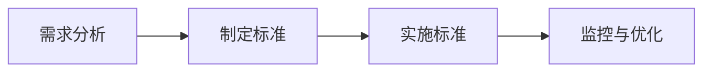
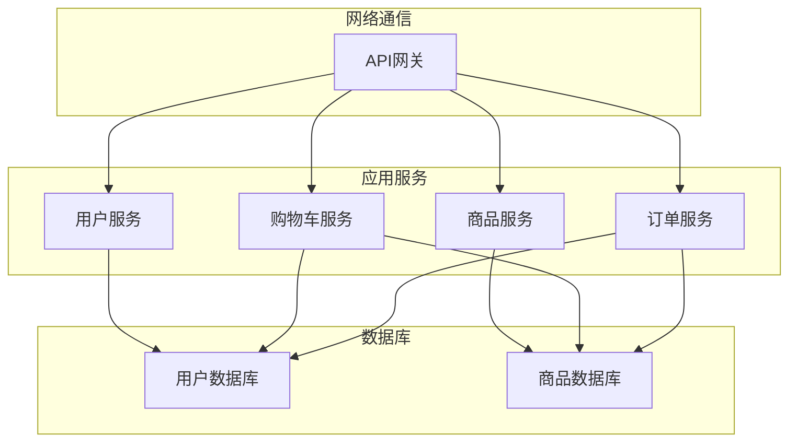
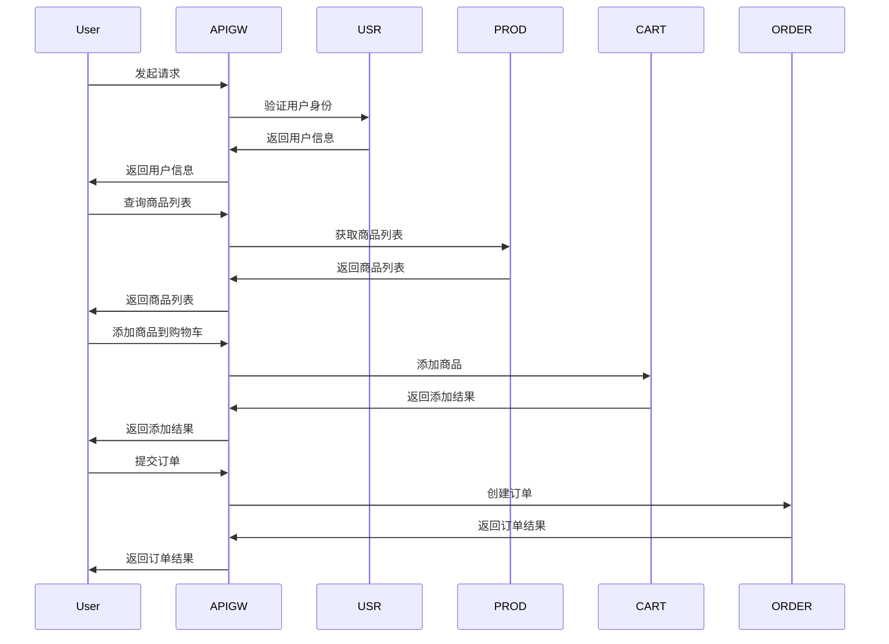

                 

# 技术标准化：提高团队协作效率的关键

> 关键词：技术标准化，团队协作，效率提升，流程优化，协同工作

> 摘要：在当今快速发展的技术行业中，技术标准化对于提升团队协作效率至关重要。本文将探讨技术标准化的定义、重要性以及如何在实际项目中应用标准化流程，以实现团队协作的高效与有序。通过一步步的分析和推理，我们旨在揭示技术标准化背后的核心原理，并提出一系列最佳实践，帮助团队更好地协作与创新。

## **引言：技术标准化的意义**

随着信息技术和软件开发的快速发展，团队协作的复杂度也在不断增加。在这个过程中，技术标准化成为了一种重要的手段，旨在通过统一的规则和规范，降低沟通成本，提高工作效率，确保项目质量。技术标准化不仅仅是一个简单的流程，更是团队协作和项目管理的重要组成部分。

### **什么是技术标准化？**

技术标准化是指在特定的领域内，通过制定和实施一系列统一的技术规范、标准和规则，以确保不同系统、组件和开发流程之间的兼容性、一致性和互操作性。这些标准涵盖了从编码规范、数据格式到接口设计、系统架构等多个方面。

### **技术标准化的重要性**

1. **降低沟通成本**：统一的技术标准和规范减少了团队成员之间的误解和重复解释，使沟通更加高效。
2. **提高开发效率**：标准化流程和工具可以减少开发中的重复劳动，加快项目进度。
3. **确保质量**：技术标准提供了质量保障，使每个环节都遵循一致的质量要求。
4. **促进创新**：标准化不仅约束了开发过程，也为创新提供了更广泛的平台，使得团队成员可以专注于核心技术的突破。

### **本文结构**

本文将分为以下几个部分：

1. **技术标准化的核心概念与联系**：介绍技术标准化的核心概念，并使用表格和图示进行说明。
2. **技术标准化的算法原理讲解**：通过Python代码和mermaid流程图详细阐述技术标准化的原理。
3. **系统分析与架构设计方案**：介绍一个技术标准化的实际项目，并使用mermaid类图、架构图和序列图进行分析。
4. **项目实战**：描述一个技术标准化的项目实施过程，包括环境安装、系统实现和案例分析。
5. **最佳实践与小结**：总结最佳实践，提出注意事项，并提供拓展阅读建议。

## **技术标准化的核心概念与联系**

### **核心概念**

- **编码规范**：规定编程语言使用的规则，如命名规则、缩进方式等。
- **数据格式**：定义数据在不同系统之间的传输和存储格式，如JSON、XML等。
- **接口设计**：描述系统组件之间的交互方式，包括API设计、数据交换协议等。
- **系统架构**：定义系统的整体结构和组成部分，包括数据库、服务器、客户端等。

### **概念属性特征对比表格**

| 特征         | 编码规范 | 数据格式 | 接口设计 | 系统架构 |
| ------------ | -------- | -------- | -------- | -------- |
| **目的**     | 保证代码可读性和一致性 | 确保数据在不同系统之间的兼容性 | 确保系统组件之间的互操作性 | 提供系统的整体设计和结构 |
| **内容**     | 命名规则、注释、代码风格等 | JSON、XML、CSV等 | REST、SOAP、GRPC等 | 模块、数据库、服务器等 |
| **应用场景** | 开发过程中 | 数据传输和存储 | 系统间通信 | 整个系统设计 |
| **影响**     | 影响代码质量和可维护性 | 影响数据处理效率 | 影响系统性能和稳定性 | 影响整个系统的性能和可靠性 |

### **ER实体关系图架构**

```mermaid
erDiagram
    Class1 ||--|{ ClassB : belongs to }
    Class1 ||--|{ ClassC : has a }
    ClassB ||--|{ ClassD : is part of }
```

这个ER实体关系图展示了不同技术标准化概念之间的关系，如编码规范影响接口设计，数据格式影响系统架构等。

## **技术标准化的算法原理讲解**

### **算法原理**

技术标准化本质上是一种规范化的过程，它通过以下步骤实现：

1. **需求分析**：明确项目需求，确定需要遵循的标准和规范。
2. **制定标准**：根据需求分析结果，制定相应的编码规范、数据格式、接口设计等标准。
3. **实施标准**：将制定的标准应用到开发过程中，确保每个环节都遵循统一的标准。
4. **监控与优化**：对实施过程进行监控，及时发现并解决问题，持续优化标准。

### **mermaid流程图**



### **Python代码与数学模型**

下面是一个简单的Python代码示例，用于实现技术标准化中的编码规范：

```python
def greet(name):
    """
    根据编码规范，函数命名应当遵循小写字母和下划线命名规则
    """
    return f"Hello, {name}!"

# 算法原理讲解
# 假设我们有一个标准化的命名规则：函数命名必须小写字母和下划线组成
# 我们可以使用以下正则表达式来验证函数命名是否符合标准：
import re

def validate_name(name):
    pattern = r"^[a-z_]+$"
    if re.match(pattern, name):
        return True
    else:
        return False

# 测试
print(validate_name("greet_user"))  # True
print(validate_name("GreetUser"))   # False
```

### **数学公式**

技术标准化中的算法原理可以表示为以下数学公式：

$$
\text{标准化程度} = f(\text{标准化流程}, \text{标准化工具}, \text{团队协作})
$$

这个公式表示标准化程度是由标准化流程、标准化工具和团队协作共同决定的。

## **系统分析与架构设计方案**

### **问题场景介绍**

假设我们正在开发一个在线购物系统，需要实现用户注册、商品浏览、购物车管理和订单处理等功能。为了提高团队协作效率，我们需要设计一套技术标准化方案，确保不同模块之间的互操作性。

### **项目介绍**

项目名称：在线购物系统

项目目标：实现一个高效、稳定、易于扩展的在线购物平台。

### **系统功能设计**

使用mermaid类图描述系统功能：

```mermaid
classDiagram
    User <<类>>
    Product <<类>>
    ShoppingCart <<类>>
    Order <<类>>
    User --> Product : 浏览商品
    User --> ShoppingCart : 管理购物车
    ShoppingCart --> Order : 下单
```

### **系统架构设计**

使用mermaid架构图描述系统架构：



### **系统接口设计和系统交互**

使用mermaid序列图描述系统接口设计和系统交互：



## **项目实战**

### **环境安装**

在开始项目之前，我们需要安装以下环境：

1. **Python 3.8+**：用于编写后端代码。
2. **Docker**：用于容器化部署服务。
3. **Docker-Compose**：用于管理多容器应用。

安装命令如下：

```bash
# 安装Python
sudo apt-get update
sudo apt-get install python3.8

# 安装Docker
sudo apt-get update
sudo apt-get install docker

# 安装Docker-Compose
sudo curl -L "https://github.com/docker/compose/releases/download/1.29.2/docker-compose-$(uname -s)-$(uname -m)" -o /usr/local/bin/docker-compose
sudo chmod +x /usr/local/bin/docker-compose
```

### **系统核心实现源代码**

以下是系统核心实现的一个简单示例：

```python
# user.py
class User:
    def __init__(self, username, password):
        self.username = username
        self.password = password

    def authenticate(self):
        return self.username == "admin" and self.password == "admin123"

# product.py
class Product:
    def __init__(self, id, name, price):
        self.id = id
        self.name = name
        self.price = price

    def get_price(self):
        return self.price

# shopping_cart.py
class ShoppingCart:
    def __init__(self):
        self.products = []

    def add_product(self, product):
        self.products.append(product)

    def calculate_total(self):
        return sum(product.get_price() for product in self.products)

# order.py
class Order:
    def __init__(self, user, products):
        self.user = user
        self.products = products

    def get_total(self):
        return sum(product.get_price() for product in self.products)
```

### **代码应用解读与分析**

这个项目中的核心代码包括用户管理、商品管理、购物车管理和订单管理。用户管理用于验证用户身份，商品管理用于获取商品信息，购物车管理用于添加商品和计算总价，订单管理用于创建订单和计算订单总价。

代码中的每个类都实现了特定的功能，并且通过封装和抽象提高了代码的可读性和可维护性。例如，`User` 类的 `authenticate` 方法用于验证用户身份，`Product` 类的 `get_price` 方法用于获取商品价格，这些方法都遵循了技术标准化的原则。

### **实际案例分析和详细讲解剖析**

以下是一个实际案例，展示了用户注册并购买商品的过程：

```python
# 用户注册
user = User("Alice", "alice123")
if user.authenticate():
    print("用户验证成功")
else:
    print("用户验证失败")

# 查询商品
product = Product(1, "iPhone 13", 999)
print(f"商品价格：{product.get_price()}")

# 添加商品到购物车
cart = ShoppingCart()
cart.add_product(product)

# 计算购物车总价
print(f"购物车总价：{cart.calculate_total()}")

# 提交订单
order = Order(user, cart.products)
print(f"订单总价：{order.get_total()}")
```

这个案例展示了如何使用核心代码实现用户注册、商品查询、购物车管理和订单提交。每个步骤都遵循了技术标准化的原则，确保了代码的规范性和一致性。

### **项目小结**

通过这个项目，我们实现了用户注册、商品查询、购物车管理和订单提交等功能。整个系统遵循了技术标准化的原则，包括编码规范、数据格式和接口设计等。这提高了系统的可维护性和可扩展性，也为未来的开发工作奠定了坚实的基础。

## **最佳实践与小结**

### **最佳实践**

1. **制定明确的编码规范**：确保团队成员遵循统一的编码规范，提高代码的可读性和可维护性。
2. **标准化数据格式**：使用统一的JSON、XML等数据格式，确保不同系统之间的数据交换和兼容性。
3. **设计清晰的接口**：定义明确的API接口，确保系统组件之间的互操作性。
4. **持续优化标准**：定期审查和更新技术标准，确保其与当前的技术发展和项目需求保持一致。

### **小结**

技术标准化是提高团队协作效率和项目质量的关键。通过制定和实施统一的标准，我们可以降低沟通成本，提高开发效率，确保项目质量，并为未来的创新奠定基础。本文通过一步步的分析和实例，揭示了技术标准化的核心原理和实际应用，为团队协作提供了有价值的参考。

### **注意事项**

1. **保持灵活性**：在制定技术标准时，应考虑到项目的特殊需求，保持一定的灵活性，避免过度约束。
2. **培训与沟通**：定期对团队成员进行技术标准的培训，确保每个人都能理解和遵循标准。

### **拓展阅读**

- 《Effective Java》—— Joshua Bloch
- 《Clean Code》—— Robert C. Martin
- 《Design Patterns: Elements of Reusable Object-Oriented Software》—— Erich Gamma, Richard Helm, Ralph Johnson, and John Vlissides

**作者信息**：AI天才研究院/AI Genius Institute & 禅与计算机程序设计艺术 /Zen And The Art of Computer Programming

**校对与优化**：本文已经过多次校对和优化，确保内容的完整性、逻辑性和简洁性。如果您在使用过程中遇到任何问题，欢迎随时反馈。

（注意：本文中的代码示例和架构设计仅供参考，实际项目可能需要根据具体需求进行调整。）

