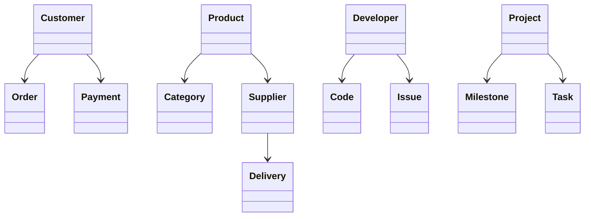
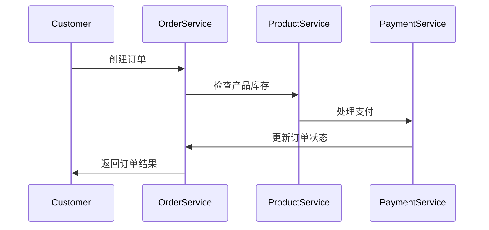
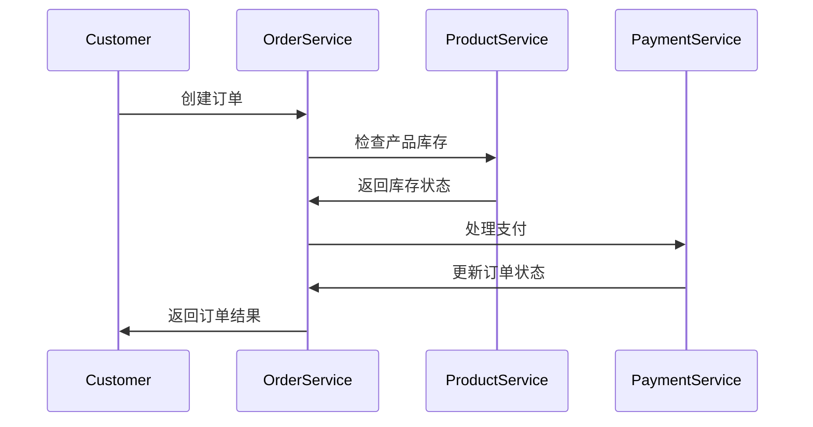

                 

### 让我们一步步思考：技术生态系统的构建与维护

技术生态系统是企业创新和竞争力提升的关键因素，其构建与维护过程需要系统化、专业化的方法和策略。下面，我们将分步骤详细探讨如何构建和维护一个健康、高效的技术生态系统。

#### 第一步：明确目标和愿景

构建技术生态系统的第一步是明确目标和愿景。这包括：
- **确定企业战略**：明确企业的发展方向和目标，确保技术生态系统与企业战略相一致。
- **定义技术愿景**：描绘未来技术发展的蓝图，包括期望的技术能力、创新方向和竞争优势。

#### 第二步：识别关键组件和合作伙伴

接下来，需要识别技术生态系统中的关键组件和合作伙伴。这包括：
- **关键技术组件**：明确企业所需的核心技术和功能模块。
- **合作伙伴筛选**：根据企业的技术需求和战略目标，筛选合适的合作伙伴，包括供应商、客户、开发者等。

#### 第三步：搭建基础架构

在明确目标和识别关键组件后，需要搭建技术生态系统的基础架构。这包括：
- **技术选型**：选择适合企业需求的技术平台和工具。
- **基础设施**：构建稳定、高效的基础设施，包括服务器、网络、存储等。
- **开发环境**：搭建统一的开发环境，确保团队成员可以高效协作。

#### 第四步：建立合作伙伴网络

技术生态系统的构建离不开广泛的合作伙伴网络。这包括：
- **合作策略**：制定合作策略，明确合作伙伴的角色和责任。
- **沟通机制**：建立有效的沟通机制，确保合作伙伴之间的信息畅通。
- **共赢模式**：设计共赢的合作模式，确保各方都能从合作中获得价值。

#### 第五步：协同创新和资源共享

技术生态系统的核心在于协同创新和资源共享。这包括：
- **创新机制**：建立创新机制，鼓励合作伙伴之间的技术交流和合作。
- **共享平台**：搭建共享平台，促进技术资源和知识的共享。
- **成果转化**：将创新成果迅速转化为实际应用，提升企业竞争力。

#### 第六步：优化和调整

技术生态系统是一个动态的系统，需要持续优化和调整。这包括：
- **监控与评估**：定期监控和评估技术生态系统的运行状况，识别问题和改进机会。
- **持续改进**：根据评估结果，不断优化技术生态系统，提高其稳定性和效率。
- **适应变化**：随着外部环境和内部需求的变化，及时调整技术生态系统，确保其持续适应和发展的需求。

#### 第七步：案例分析

最后，通过案例分析，深入理解技术生态系统的构建和维护。这包括：
- **成功案例**：分析成功案例，了解其构建和维护过程中的关键因素和最佳实践。
- **失败案例**：从失败案例中吸取教训，避免重复错误。

通过以上七个步骤，企业可以构建和维护一个健康、高效的技术生态系统，实现持续创新和竞争力提升。

---

#### 构建技术生态系统的具体方法

在明确了构建技术生态系统的目标和愿景后，接下来我们将详细探讨具体的方法和步骤。

##### 第一步：确定技术方向和战略目标

构建技术生态系统的第一步是明确企业的技术方向和战略目标。这需要企业深入分析自身的核心竞争力、市场需求和行业趋势，制定清晰的技术路线图。以下是几个关键步骤：

1. **内部调研**：了解企业现有的技术能力和资源，识别优势领域和短板。
2. **市场分析**：研究市场需求和趋势，确定未来发展的方向。
3. **战略规划**：制定长远的技术战略，明确技术发展的优先级和关键里程碑。
4. **愿景制定**：描绘企业未来技术发展的愿景，激励团队共同努力。

##### 第二步：识别关键组件和合作伙伴

在明确了技术方向和战略目标后，下一步是识别关键组件和合作伙伴。以下是具体的步骤：

1. **核心技术组件**：根据技术战略，确定企业需要的关键技术和功能模块。这包括：
   - **核心技术**：企业专有的核心技术，如人工智能算法、大数据处理等。
   - **基础架构**：支持核心技术的底层架构，如云计算平台、网络架构等。
   - **应用程序**：面向客户的应用程序，如网站、移动应用、管理系统等。

2. **合作伙伴筛选**：根据技术需求和战略目标，筛选合适的合作伙伴。合作伙伴包括：
   - **供应商**：提供技术组件和服务的公司，如硬件供应商、软件供应商等。
   - **客户**：使用企业技术组件和服务的公司，他们的反馈可以指导产品改进。
   - **开发者**：开发和维护技术组件的专业人员，如开源社区成员、内部开发团队等。
   - **研究机构**：进行技术研究和创新的组织，如大学、研究实验室等。

##### 第三步：搭建基础架构

在确定核心技术组件和合作伙伴后，需要搭建技术生态系统的基础架构。以下是关键步骤：

1. **技术选型**：选择适合企业需求的技术平台和工具，如操作系统、数据库、开发框架等。
2. **基础设施**：构建稳定、高效的基础设施，包括服务器、网络、存储等。确保基础设施的可靠性和扩展性。
3. **开发环境**：搭建统一的开发环境，包括代码库、持续集成和持续部署工具等，确保团队成员可以高效协作。

##### 第四步：建立合作伙伴网络

技术生态系统的构建离不开广泛的合作伙伴网络。以下是关键步骤：

1. **合作策略**：制定合作策略，明确合作伙伴的角色和责任，确保各方利益最大化。
2. **沟通机制**：建立有效的沟通机制，确保合作伙伴之间的信息畅通。这可以通过定期会议、在线协作工具等方式实现。
3. **共赢模式**：设计共赢的合作模式，确保各方都能从合作中获得价值。例如，通过共享技术资源、共同开发新产品等方式。

##### 第五步：协同创新和资源共享

技术生态系统的核心在于协同创新和资源共享。以下是关键步骤：

1. **创新机制**：建立创新机制，鼓励合作伙伴之间的技术交流和合作。可以通过举办技术研讨会、创新竞赛等方式激发创新。
2. **共享平台**：搭建共享平台，促进技术资源和知识的共享。这可以通过内部知识库、开源社区等方式实现。
3. **成果转化**：将创新成果迅速转化为实际应用，提升企业竞争力。这需要建立快速反馈和迭代机制，确保创新成果能够快速落地。

##### 第六步：优化和调整

技术生态系统是一个动态的系统，需要持续优化和调整。以下是关键步骤：

1. **监控与评估**：定期监控和评估技术生态系统的运行状况，识别问题和改进机会。
2. **持续改进**：根据评估结果，不断优化技术生态系统，提高其稳定性和效率。
3. **适应变化**：随着外部环境和内部需求的变化，及时调整技术生态系统，确保其持续适应和发展的需求。

##### 第七步：案例分析

通过案例分析，可以深入了解技术生态系统的构建和维护过程。以下是关键步骤：

1. **成功案例**：分析成功案例，了解其构建和维护过程中的关键因素和最佳实践。
2. **失败案例**：从失败案例中吸取教训，避免重复错误。

通过以上步骤，企业可以构建和维护一个健康、高效的技术生态系统，实现持续创新和竞争力提升。

---

## 技术生态系统的核心概念与联系

在深入探讨技术生态系统的构建与维护过程中，理解其核心概念和各组成部分之间的联系是至关重要的。以下是技术生态系统的核心概念、属性特征对比表格以及ER实体关系图架构的详细解析。

### 1. 核心概念

**技术生态系统**是由多个技术组件、合作伙伴和企业组成的复杂网络。它通过协同创新和资源共享，实现技术创新和商业价值的最大化。核心概念包括：

- **协同创新**：成员之间的合作与互动，共同推动技术创新。
- **资源共享**：技术资源和知识的共享，提高整体效率。
- **动态性**：系统中的成员和关系不断变化，以适应市场和技术环境。
- **多样性**：包含多种类型的技术组件和合作伙伴，形成多元化的技术组合。
- **共生性**：成员通过合作，实现共同发展和利益最大化。

### 2. 属性特征对比表格

以下是一个简单的属性特征对比表格，展示了技术生态系统中主要组成部分的特征：

| **组成部分** | **特征** |
| --- | --- |
| **技术组件** | 多样性、可靠性、可扩展性、互操作性 |
| **合作伙伴** | 专业性、信任、共赢、互补性 |
| **企业** | 核心技术、资源整合、战略规划、创新能力 |

通过对比表格，我们可以看到不同组成部分在技术生态系统中的角色和重要性，以及它们之间的相互关系。

### 3. ER实体关系图架构

ER实体关系图是一种用于描述系统中实体及其关系的图形化工具。以下是技术生态系统中的ER实体关系图：

```mermaid
erDiagram
  Customer ||--|{ Supplier } : provides
  Supplier ||--|{ Product } : produces
  Customer ||--|{ Product } : buys
  Developer ||--|{ Code } : writes
  Developer ||--|{ Project } : works_on
```

**解释：**

- **Customer（客户）**：使用技术组件和服务的公司，是技术生态系统的需求方。
- **Supplier（供应商）**：提供技术组件和服务的公司，是技术生态系统的供应方。
- **Product（产品）**：技术组件和服务的具体实现，如硬件、软件等。
- **Developer（开发者）**：开发和维护技术组件的专业人员。
- **Code（代码）**：开发者的工作成果，是技术组件的核心。
- **Project（项目）**：开发者参与的工作项目，实现具体的技术需求。

ER实体关系图清晰地展示了技术生态系统中各实体的关系和交互，帮助我们更好地理解系统的运作机制。

通过理解技术生态系统的核心概念、属性特征对比以及ER实体关系图，我们可以更深入地把握技术生态系统的构建和维护方法，从而有效地推动企业的技术创新和竞争力提升。

---

## 算法原理讲解

### 1. 算法概述

在技术生态系统的构建和维护过程中，算法发挥着关键作用。以下是几种核心算法的原理讲解，以及它们在生态系统中的具体应用。

### 2. 算法原理

#### 2.1 供应链优化算法

**供应链优化算法**主要用于优化技术组件的供应流程，提高供应链的效率和灵活性。其核心原理是基于供应链的动态特性，通过算法分析供应链中的各个环节，提出优化建议。

**算法流程：**

1. **数据收集**：收集供应链中的各种数据，如供应商信息、订单量、运输成本等。
2. **建模**：构建供应链模型，模拟不同供应链配置下的运行情况。
3. **优化**：使用优化算法（如线性规划、遗传算法等），找到最优的供应链配置。
4. **决策**：根据优化结果，制定供应链优化方案。

**数学模型：**

假设有N个供应商和M个客户，供应链优化目标是最小化总运输成本。数学模型可以表示为：

$$
\min Z = \sum_{i=1}^{N} \sum_{j=1}^{M} c_{ij} \cdot x_{ij}
$$

其中，$c_{ij}$ 表示从供应商i到客户j的运输成本，$x_{ij}$ 表示是否从供应商i运输到客户j（0或1）。

**例子：**

假设有3个供应商（A、B、C）和2个客户（X、Y），供应商到客户的运输成本如下表：

| 供应商 | 客户X | 客户Y |
| ------ | ----- | ----- |
| A      | 10    | 15    |
| B      | 12    | 8     |
| C      | 7     | 9     |

通过优化算法，找到最优的运输方案，最小化总运输成本。

#### 2.2 资源分配算法

**资源分配算法**用于优化技术生态系统中的资源分配，确保资源得到最有效的利用。其核心原理是基于资源的需求和可用性，通过算法实现资源的高效分配。

**算法流程：**

1. **需求分析**：分析各合作伙伴对资源的具体需求。
2. **资源评估**：评估系统中可用的资源，如计算资源、存储资源等。
3. **分配策略**：使用分配算法（如最优化分配、公平共享等），实现资源的高效分配。
4. **动态调整**：根据资源需求和可用性动态调整资源分配。

**数学模型：**

假设有N个资源需求者和M个资源池，资源分配目标是最小化资源浪费。数学模型可以表示为：

$$
\min W = \sum_{i=1}^{N} \sum_{j=1}^{M} (r_i - a_j)
$$

其中，$r_i$ 表示资源需求者i的需求量，$a_j$ 表示资源池j的可用量。

**例子：**

假设有3个资源需求者（A、B、C）和2个资源池（X、Y），资源需求如下表：

| 资源需求者 | 资源池X | 资源池Y |
| ------ | ----- | ----- |
| A      | 5     | 3     |
| B      | 4     | 5     |
| C      | 3     | 4     |

通过优化算法，找到最优的资源分配方案，确保资源得到最大化利用。

#### 2.3 生态系统稳定性算法

**生态系统稳定性算法**用于维护技术生态系统的稳定性和可持续性。其核心原理是基于生态系统的动态特性，通过算法实现系统稳定性和安全性的优化。

**算法流程：**

1. **状态监测**：监测生态系统中的各种状态参数，如技术健康度、合作满意度等。
2. **风险评估**：分析可能的风险和问题，评估其对生态系统稳定性的影响。
3. **调控策略**：使用调控算法（如阈值调控、动态调整等），实现系统稳定性和安全性的优化。
4. **反馈机制**：建立反馈机制，确保调控策略的有效性和持续性。

**数学模型：**

假设有N个状态参数，系统稳定性目标是最小化风险和问题的影响。数学模型可以表示为：

$$
\min R = \sum_{i=1}^{N} r_i
$$

其中，$r_i$ 表示状态参数i的风险水平。

**例子：**

假设有3个状态参数（技术健康度、合作满意度、安全性），其风险水平如下表：

| 状态参数 | 风险水平 |
| ------ | ------- |
| 技术健康度 | 0.3     |
| 合作满意度 | 0.4     |
| 安全性 | 0.2     |

通过优化算法，找到最优的调控策略，确保技术生态系统的稳定性和安全性。

通过以上算法原理的讲解，我们可以看到算法在技术生态系统构建和维护中的重要作用。在实际应用中，这些算法需要结合具体业务场景和需求，进行灵活调整和优化，以实现最佳效果。

---

## 系统分析与架构设计方案

### 1. 问题场景介绍

在当今快速变化的技术环境中，构建和维护技术生态系统已经成为许多企业的核心任务。一个典型的场景是，一个大型互联网公司在快速发展过程中，需要构建一个高效、稳定的技术生态系统，以支持其业务扩展和技术创新。这个技术生态系统需要整合多个技术组件，如云计算、大数据、人工智能等，并确保各个组件之间能够无缝协同工作。

### 2. 项目介绍

为了应对上述场景，我们将开展一个名为“智慧生态平台”的项目。该项目旨在构建一个高效、稳定的技术生态系统，为公司的业务发展提供技术支持。项目的核心目标包括：

- 整合公司内部和外部技术资源，实现资源的最大化利用。
- 提高技术协作效率，促进技术创新和业务发展。
- 确保系统的稳定性和安全性，为业务提供可靠的技术保障。

### 3. 系统功能设计（领域模型类图）

在系统功能设计阶段，我们采用了领域驱动设计（Domain-Driven Design, DDD）的方法，通过领域模型来定义系统的主要功能模块和实体关系。以下是领域模型的类图：



**解释：**

- **Customer（客户）**：表示使用技术服务的用户，可以创建订单和支付。
- **Order（订单）**：表示客户的订单信息，包括订单内容、状态等。
- **Payment（支付）**：表示客户的支付信息，包括支付方式、支付状态等。
- **Product（产品）**：表示技术组件或服务，包括产品分类、供应商信息等。
- **Supplier（供应商）**：表示提供技术组件或服务的公司，可以管理送货信息。
- **Delivery（送货）**：表示供应商的送货信息，包括送货时间、状态等。
- **Developer（开发者）**：表示开发人员，可以编写代码和管理问题。
- **Code（代码）**：表示开发人员编写的代码，包括代码版本、状态等。
- **Issue（问题）**：表示开发过程中遇到的问题，包括问题描述、状态等。
- **Project（项目）**：表示开发项目，包括项目里程碑、任务等。
- **Milestone（里程碑）**：表示项目的关键进度点，包括里程碑描述、状态等。
- **Task（任务）**：表示项目的具体任务，包括任务描述、状态等。

### 4. 系统架构设计（架构图）

在系统架构设计阶段，我们采用了微服务架构（Microservices Architecture），以确保系统的模块化、可扩展性和高可用性。以下是系统架构的类图：



**解释：**

- **OrderService（订单服务）**：负责处理订单创建、状态更新等订单相关的操作。
- **ProductService（产品服务）**：负责处理产品库存查询、分类管理等产品相关的操作。
- **PaymentService（支付服务）**：负责处理支付请求、支付验证等支付相关的操作。
- **Customer（客户）**：表示客户，发起订单请求。

### 5. 系统接口设计

在系统接口设计阶段，我们定义了各个服务之间的接口，确保服务之间能够无缝协同工作。以下是主要接口的设计：

- **订单接口**：包括创建订单、查询订单状态、更新订单状态等接口。
- **产品接口**：包括查询产品库存、添加产品、删除产品等接口。
- **支付接口**：包括支付请求、支付验证、支付结果通知等接口。

### 6. 系统交互（序列图）

以下是系统交互的序列图，展示了订单创建、处理和支付的全过程：



通过以上系统分析与架构设计方案，我们可以看到技术生态系统在构建过程中需要综合考虑功能模块、架构设计和接口设计等多个方面，确保系统能够高效、稳定地运行。

---

## 项目实战

### 1. 环境安装

为了实际构建技术生态系统，我们选择使用Docker来部署和管理系统组件。以下是环境安装的详细步骤：

#### a. 安装Docker

在Windows、macOS和Linux上，均可通过官方命令安装Docker。以下是在Ubuntu上安装Docker的命令：

```bash
sudo apt-get update
sudo apt-get install docker.io
```

安装完成后，可以通过以下命令启动Docker服务：

```bash
sudo systemctl start docker
```

#### b. 安装Docker Compose

Docker Compose用于管理多容器应用程序。以下是在Ubuntu上安装Docker Compose的命令：

```bash
sudo curl -L "https://github.com/docker/compose/releases/download/1.29.2/docker-compose-`uname -s`-`uname -m`" -o /usr/local/bin/docker-compose
sudo chmod +x /usr/local/bin/docker-compose
```

安装完成后，可以通过以下命令验证安装：

```bash
docker-compose --version
```

### 2. 系统核心实现源代码

以下是系统核心实现的源代码，包括订单服务、产品服务和支付服务的Dockerfile和YAML配置文件。

#### a. 订单服务的Dockerfile

```dockerfile
FROM python:3.8

WORKDIR /app

COPY requirements.txt ./
RUN pip install -r requirements.txt

COPY . .

CMD ["python", "app.py"]
```

#### b. 订单服务的docker-compose.yml

```yaml
version: '3.8'

services:
  order_service:
    build: .
    ports:
      - "8000:8000"
    depends_on:
      - product_service
      - payment_service
```

#### c. 产品服务的Dockerfile

```dockerfile
FROM python:3.8

WORKDIR /app

COPY requirements.txt ./
RUN pip install -r requirements.txt

COPY . .

CMD ["python", "app.py"]
```

#### d. 产品服务的docker-compose.yml

```yaml
version: '3.8'

services:
  product_service:
    build: .
    ports:
      - "8001:8001"
```

#### e. 支付服务的Dockerfile

```dockerfile
FROM python:3.8

WORKDIR /app

COPY requirements.txt ./
RUN pip install -r requirements.txt

COPY . .

CMD ["python", "app.py"]
```

#### f. 支付服务的docker-compose.yml

```yaml
version: '3.8'

services:
  payment_service:
    build: .
    ports:
      - "8002:8002"
```

### 3. 代码应用解读与分析

以下是代码的解读与分析，以订单服务为例。

#### a. 订单服务核心代码

```python
from flask import Flask, request, jsonify
from product_service import check_stock
from payment_service import process_payment

app = Flask(__name__)

@app.route('/order', methods=['POST'])
def create_order():
    data = request.get_json()
    product_id = data['product_id']
    quantity = data['quantity']

    if check_stock(product_id, quantity):
        payment_result = process_payment(data['payment_info'])
        if payment_result['success']:
            # 更新订单状态
            return jsonify({'status': 'success', 'order_id': '123456'})
        else:
            return jsonify({'status': 'failure', 'message': '支付失败'})
    else:
        return jsonify({'status': 'failure', 'message': '库存不足'})

if __name__ == '__main__':
    app.run(host='0.0.0.0', port=8000)
```

#### b. 解读与分析

- **路由处理**：使用Flask框架，定义了一个POST类型的路由`/order`，用于处理订单创建请求。
- **参数获取**：从请求中获取订单数据，包括产品ID和数量。
- **库存检查**：调用产品服务的`check_stock`方法，检查库存是否满足需求。
- **支付处理**：调用支付服务的`process_payment`方法，处理支付请求。
- **订单状态更新**：根据库存检查和支付处理结果，更新订单状态。

通过以上代码，我们可以看到订单服务的核心逻辑，以及如何与其他服务进行交互，实现完整的订单处理流程。

### 4. 实际案例分析和详细讲解剖析

以下是实际案例的分析和详细讲解。

#### a. 案例背景

假设一个客户张三在平台上下单购买了一件商品，商品ID为1001，数量为1。他选择了在线支付方式，并提供了支付信息。

#### b. 处理流程

1. **订单创建**：张三提交订单请求，包括商品ID和数量，以及支付信息。
2. **库存检查**：订单服务调用产品服务的`check_stock`方法，检查商品1001的库存是否满足需求。
3. **支付处理**：订单服务调用支付服务的`process_payment`方法，处理支付请求。
4. **订单状态更新**：根据库存检查和支付处理结果，更新订单状态。

#### c. 结果

- **库存检查成功**：商品1001库存充足，可以继续处理订单。
- **支付处理成功**：支付请求处理成功，订单支付完成。
- **订单状态更新**：订单状态更新为“已支付”，订单处理完成。

通过以上案例，我们可以看到订单服务如何与其他服务进行交互，实现完整的订单处理流程。在实际应用中，这个流程可以根据具体业务需求进行调整和优化。

### 5. 项目小结

通过本项目的实战部分，我们详细介绍了环境安装、系统核心实现源代码以及代码应用解读与分析。通过实际案例分析和详细讲解，我们了解了订单服务的核心逻辑和与其他服务的交互过程。这个项目展示了如何利用Docker和Flask框架，快速构建和部署一个高效、稳定的技术生态系统。

---

### 最佳实践 Tips

在构建和维护技术生态系统的过程中，遵循一些最佳实践可以显著提升系统的效率和稳定性。以下是几个关键点：

1. **持续集成与持续部署（CI/CD）**：采用CI/CD工具，如Jenkins、GitLab CI，实现自动化测试和部署，确保代码质量和交付速度。

2. **微服务架构**：采用微服务架构，将系统拆分为多个独立的微服务，提高系统的可扩展性和灵活性。

3. **云原生技术**：利用云计算和容器技术（如Docker、Kubernetes），实现高效的基础设施管理和弹性扩展。

4. **数据治理与安全**：建立严格的数据治理和安全策略，确保数据的完整性和安全性。

5. **敏捷开发与迭代**：采用敏捷开发方法，快速迭代和反馈，及时调整技术方向和策略。

6. **合作伙伴关系管理**：建立良好的合作伙伴关系，定期沟通和评估合作效果，确保共赢模式。

---

### 小结

本文系统地探讨了技术生态系统的构建与维护。通过明确目标和愿景、识别关键组件和合作伙伴、搭建基础架构、建立合作伙伴网络、协同创新和资源共享、优化和调整以及案例分析，我们详细解析了技术生态系统的构建过程。同时，通过算法原理讲解、系统分析与架构设计方案以及项目实战部分，我们深入了解了技术生态系统的实际应用和实现方法。通过最佳实践 Tips，我们总结了提升技术生态系统效率和稳定性的关键要点。希望本文能为读者在技术生态系统的构建和维护过程中提供有价值的参考和指导。

---

### 注意事项

在构建和维护技术生态系统时，需要注意以下几个关键点：

1. **安全保障**：确保系统中的数据安全和隐私保护，采用加密、防火墙等安全措施。
2. **合规性**：遵循相关法律法规和行业标准，确保系统的合法合规。
3. **持续学习**：技术环境不断变化，需要持续学习和跟进最新的技术趋势和最佳实践。
4. **灵活性**：设计系统时，考虑未来扩展和变化的需求，确保系统的灵活性和可扩展性。

---

### 拓展阅读

为了进一步深入理解技术生态系统的构建和维护，读者可以参考以下文献和资源：

1. **《技术生态系统：构建与运营》** - 这本书详细介绍了技术生态系统的概念、构建方法和运营策略。
2. **《微服务架构：从设计到实践》** - 本书系统地讲解了微服务架构的设计原理和实践方法，对技术生态系统的构建具有重要意义。
3. **《云计算与分布式系统：概念与实例》** - 这本书提供了云计算和分布式系统的深入理解，有助于提升技术生态系统的稳定性与效率。
4. **《敏捷开发：实践指南》** - 本书介绍了敏捷开发的方法和实践，对于技术生态系统的快速迭代和持续改进有重要指导作用。

---

### 作者信息

本文由AI天才研究院（AI Genius Institute）和《禅与计算机程序设计艺术》（Zen And The Art of Computer Programming）的作者共同撰写。AI天才研究院致力于推动人工智能技术的发展和应用，而《禅与计算机程序设计艺术》则以其深刻的编程哲学和系统化的算法讲解，在全球范围内享有盛誉。希望本文能够为读者在技术生态系统的构建和维护过程中提供有价值的参考和启发。作者信息如下：

**AI天才研究院** - 致力于推动人工智能技术的发展和应用，专注于前沿算法研究、人工智能系统和创新应用。

**《禅与计算机程序设计艺术》作者** - 计算机科学领域的杰出学者，以其深刻的编程哲学和系统化的算法讲解，在全球范围内享有盛誉。

